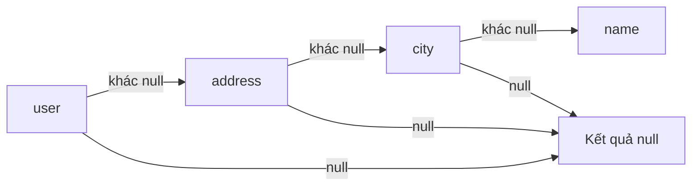
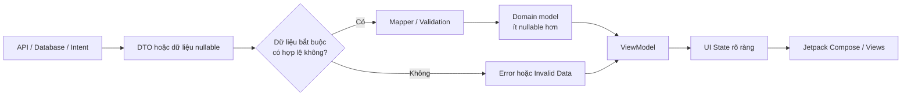
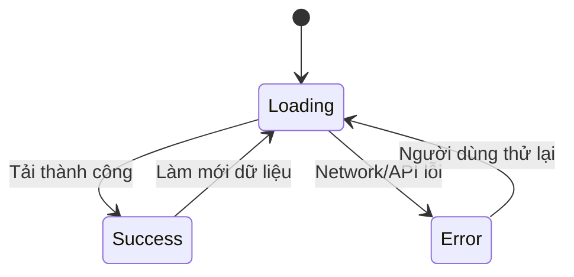
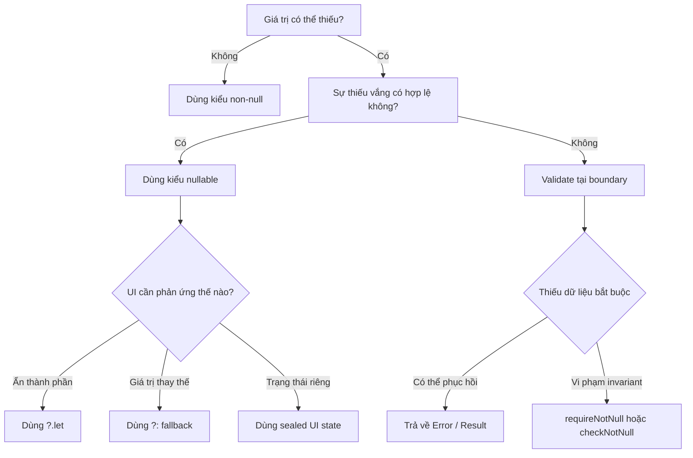

# 006 — Null Safety trong Kotlin

| Thông tin               | Nội dung                               |
| ----------------------- | -------------------------------------- |
| **Học phần**            | 01 — Language and Android Fundamentals |
| **Module**              | Module 01 — Pick a Language            |
| **Nhóm nội dung**       | Kotlin Essentials                      |
| **Nguồn roadmap**       | Pick a Language / Kotlin Essentials    |
| **Loại bài**            | Lesson                                 |
| **Thứ tự trong module** | 006                                    |
| **Thời lượng gợi ý**    | 24 phút                                |

---

## 1. Tóm tắt

**Null Safety** là cơ chế của Kotlin giúp lập trình viên biểu diễn rõ ràng một giá trị:

* Chắc chắn tồn tại.
* Có thể không tồn tại và mang giá trị `null`.

Thay vì đợi ứng dụng chạy rồi mới gặp `NullPointerException`, trình biên dịch Kotlin có thể phát hiện nhiều thao tác không an toàn ngay trong quá trình viết và biên dịch mã nguồn. Kotlin thực hiện điều này bằng cách phân biệt **kiểu không nullable** như `String` với **kiểu nullable** như `String?`.

Trong ứng dụng Android, dữ liệu có thể không tồn tại vì nhiều nguyên nhân:

* API không trả về một trường.
* Người dùng chưa nhập dữ liệu.
* Database chưa có bản ghi.
* Quyền truy cập chưa được cấp.
* Màn hình đã bị hủy nhưng callback vẫn chạy.
* Dữ liệu đang tải hoặc tải thất bại.
* Android gọi lại component sau configuration change hoặc process recreation.

Null Safety không chỉ là một nhóm toán tử Kotlin. Đây còn là cách thiết kế **data model, UI state, repository result và lifecycle-safe code**.

---

## 2. Mục tiêu học tập

Sau bài học, bạn có thể:

* Giải thích được `null` và Null Safety bằng ngôn ngữ của mình.
* Phân biệt `String` và `String?`.
* Sử dụng đúng các toán tử `?.`, `?:`, `?.let` và `!!`.
* Biết khi nào nên dùng `null`, giá trị mặc định hoặc một kiểu trạng thái riêng.
* Áp dụng Null Safety cho API model, repository, ViewModel và UI.
* Nhận biết các lỗi Null Safety thường gặp trong Android.
* Viết unit test cho các trường hợp dữ liệu thiếu.
* Tạo một artifact nhỏ để đưa vào portfolio.

---

## 3. Null là gì?

`null` biểu thị trạng thái **không có đối tượng hoặc không có giá trị**.

Ví dụ, một người dùng có thể chưa nhập ảnh đại diện:

```kotlin
val avatarUrl: String? = null
```

Dấu `?` sau `String` cho biết biến `avatarUrl` được phép chứa `null`.

Ngược lại:

```kotlin
val username: String = "An Khanh"
```

Biến `username` không được phép chứa `null`.

Đoạn mã sau không thể biên dịch:

```kotlin
val username: String = null
```

Kotlin đưa nullability vào hệ thống kiểu dữ liệu. Nhờ đó, trình biên dịch buộc lập trình viên xử lý khả năng giá trị bị thiếu trước khi sử dụng nó.

---

## 4. Nullable và non-nullable

| Khai báo       | Ý nghĩa                                       |   Có thể nhận `null`? |
| -------------- | --------------------------------------------- | --------------------: |
| `String`       | Luôn phải có chuỗi hợp lệ                     |                 Không |
| `String?`      | Có chuỗi hoặc không có giá trị                |                    Có |
| `User`         | Luôn phải có đối tượng `User`                 |                 Không |
| `User?`        | Có thể chưa có `User`                         |                    Có |
| `List<User>`   | Danh sách luôn tồn tại, phần tử không null    |                 Không |
| `List<User?>`  | Danh sách tồn tại, một số phần tử có thể null |   Phần tử có thể null |
| `List<User>?`  | Cả danh sách có thể không tồn tại             | Danh sách có thể null |
| `List<User?>?` | Danh sách và phần tử đều có thể null          |                    Có |

### Ví dụ dễ nhầm

```kotlin
val usersA: List<String?> = listOf("An", null, "Bình")
```

* Danh sách `usersA` chắc chắn tồn tại.
* Một số phần tử trong danh sách có thể là `null`.

```kotlin
val usersB: List<String>? = null
```

* Bản thân danh sách `usersB` có thể không tồn tại.
* Nếu danh sách tồn tại, các phần tử bên trong không được null.

---

## 5. Vì sao Null Safety quan trọng trong Android?

### 5.1. Giảm crash

Các thao tác truy cập thuộc tính của một đối tượng `null` có thể gây crash ứng dụng.

Ví dụ không an toàn:

```kotlin
val user: User? = null
println(user!!.name)
```

Nếu `user` là `null`, toán tử `!!` sẽ gây `NullPointerException`.

Kotlin vẫn có thể phát sinh NPE trong một số trường hợp, đặc biệt khi sử dụng `!!`, tương tác với Java platform types, lỗi khởi tạo hoặc chủ động ném `NullPointerException`.

### 5.2. Cải thiện trải nghiệm người dùng

Thay vì crash khi ảnh đại diện bị thiếu, ứng dụng có thể:

* Hiển thị ảnh mặc định.
* Hiển thị chữ cái đầu của tên.
* Ẩn thành phần không cần thiết.
* Hiển thị thông báo yêu cầu người dùng bổ sung thông tin.

### 5.3. Làm rõ business rule

Kiểu dữ liệu cho người đọc biết trường nào bắt buộc và trường nào tùy chọn:

```kotlin
data class User(
    val id: String,
    val displayName: String,
    val avatarUrl: String?
)
```

Trong model trên:

* `id` bắt buộc phải tồn tại.
* `displayName` bắt buộc phải tồn tại.
* `avatarUrl` là thông tin tùy chọn.

### 5.4. Tăng khả năng kiểm thử

Khi các trạng thái thiếu dữ liệu được biểu diễn rõ ràng, lập trình viên có thể viết test cho từng trường hợp:

* API không trả về ID.
* Người dùng chưa có ảnh.
* Database trả về `null`.
* Repository trả về lỗi.
* UI đang tải dữ liệu.

---

## 6. Các công cụ xử lý null trong Kotlin

## 6.1. Kiểm tra bằng `if`

```kotlin
val nickname: String? = "Khánh"

if (nickname != null) {
    println(nickname.length)
}
```

Sau khi kiểm tra `nickname != null`, Kotlin có thể thực hiện **smart cast** và tạm thời xem `nickname` như một `String` không nullable.

### Có nhánh thay thế

```kotlin
val nickname: String? = null

val length = if (nickname != null) {
    nickname.length
} else {
    0
}
```

---

## 6.2. Safe-call operator `?.`

Toán tử `?.` chỉ thực hiện thao tác khi giá trị bên trái không phải `null`.

```kotlin
val nickname: String? = null
val length: Int? = nickname?.length
```

Kết quả:

```text
length = null
```

Ứng dụng không crash vì Kotlin không gọi `.length` khi `nickname` là `null`.

### Chuỗi safe call

```kotlin
val cityName: String? = user?.address?.city?.name
```

Quá trình truy cập sẽ dừng và trả về `null` ngay khi một phần trong chuỗi là `null`.



---

## 6.3. Elvis operator `?:`

Elvis operator cung cấp giá trị thay thế khi biểu thức bên trái trả về `null`.

```kotlin
val displayName = user?.name ?: "Người dùng"
```

Có thể đọc như sau:

> Lấy `user.name` nếu tồn tại; nếu không, sử dụng `"Người dùng"`.

Kotlin chỉ đánh giá biểu thức bên phải `?:` khi biểu thức bên trái là `null`.

### Giá trị mặc định

```kotlin
val avatarUrl = user.avatarUrl ?: DEFAULT_AVATAR_URL
```

### Return sớm

```kotlin
fun openProfile(userId: String?) {
    val safeUserId = userId ?: return

    println("Mở hồ sơ: $safeUserId")
}
```

### Ném lỗi có thông tin rõ ràng

```kotlin
fun saveUser(userId: String?) {
    val safeUserId = userId
        ?: throw IllegalArgumentException("userId không được null")

    println("Lưu người dùng: $safeUserId")
}
```

---

## 6.4. `?.let`

`?.let` chạy một block chỉ khi giá trị khác `null`.

```kotlin
val email: String? = "khanh@example.com"

email?.let { safeEmail ->
    sendVerificationEmail(safeEmail)
}
```

Nếu `email` là `null`, hàm `sendVerificationEmail()` không được gọi.

### Ví dụ Android

```kotlin
user.avatarUrl?.let { url ->
    loadAvatar(url)
}
```

Cách này phù hợp khi hành động chỉ cần được thực hiện nếu dữ liệu tồn tại.

---

## 6.5. Safe cast `as?`

`as?` thử ép kiểu và trả về `null` nếu việc ép kiểu thất bại.

```kotlin
val rawValue: Any = 42

val text: String? = rawValue as? String
```

Kết quả:

```text
text = null
```

Điều này an toàn hơn so với:

```kotlin
val text = rawValue as String
```

Đoạn mã thứ hai có thể gây `ClassCastException`.

---

## 6.6. Not-null assertion `!!`

`!!` yêu cầu Kotlin xem giá trị nullable như một giá trị chắc chắn không null.

```kotlin
val name: String? = "Kotlin"
val length = name!!.length
```

Nếu `name` là `null`, ứng dụng sẽ phát sinh `NullPointerException`.

### Không nên dùng `!!` để tắt cảnh báo

```kotlin
val title = response.body()!!.article!!.title!!
```

Đoạn mã trên có nhiều điểm có thể gây crash:

1. `response.body()` có thể null.
2. `article` có thể null.
3. `title` có thể null.

### Viết lại an toàn hơn

```kotlin
val title = response.body()
    ?.article
    ?.title
    ?.takeIf { it.isNotBlank() }
    ?: "Không có tiêu đề"
```

### Quy tắc thực tế

Chỉ cân nhắc `!!` khi:

* Có invariant được đảm bảo rõ ràng.
* Invariant đó không thể biểu diễn tốt hơn bằng hệ thống kiểu.
* Có test bảo vệ điều kiện.
* Crash là hành vi phù hợp nếu invariant bị phá vỡ.

Trong phần lớn code xử lý API, database và UI, nên ưu tiên kiểm tra rõ ràng thay vì `!!`.

---

## 6.7. `requireNotNull()` và `checkNotNull()`

### `requireNotNull()`

Dùng để kiểm tra dữ liệu đầu vào của hàm:

```kotlin
fun createUser(userId: String?) {
    val id = requireNotNull(userId) {
        "userId là tham số bắt buộc"
    }

    println(id)
}
```

Nếu `userId` là `null`, Kotlin ném `IllegalArgumentException`.

### `checkNotNull()`

Dùng để kiểm tra trạng thái nội bộ của đối tượng:

```kotlin
class SessionManager {
    private var currentUser: User? = null

    fun requireCurrentUser(): User {
        return checkNotNull(currentUser) {
            "Người dùng chưa đăng nhập"
        }
    }
}
```

Nếu điều kiện trạng thái không đúng, Kotlin ném `IllegalStateException`.

---

## 6.8. `lateinit`

`lateinit` cho phép khai báo một thuộc tính không nullable nhưng khởi tạo nó sau.

```kotlin
lateinit var repository: UserRepository
```

Tuy nhiên, nếu truy cập thuộc tính trước khi nó được khởi tạo, Kotlin sẽ ném `UninitializedPropertyAccessException`.

### Kiểm tra trạng thái khởi tạo

```kotlin
if (::repository.isInitialized) {
    repository.loadUsers()
}
```

### Khi nào có thể dùng?

* Dependency được framework hoặc test setup gán sau.
* Thuộc tính chắc chắn được khởi tạo trước khi sử dụng.
* Lifecycle khởi tạo có thể được chứng minh rõ ràng.

### Khi nào không nên dùng?

Không nên dùng `lateinit` chỉ để tránh thiết kế constructor đúng cách:

```kotlin
class UserViewModel {
    lateinit var repository: UserRepository
}
```

Ưu tiên constructor injection:

```kotlin
class UserViewModel(
    private val repository: UserRepository
)
```

---

## 7. Sơ đồ xử lý null trong ứng dụng Android



### Nguyên tắc

1. Cho phép nullable tại ranh giới hệ thống nếu nguồn dữ liệu thực sự có thể thiếu.
2. Kiểm tra và chuẩn hóa dữ liệu tại mapper hoặc repository.
3. Không truyền các nullable không cần thiết xuyên suốt toàn bộ ứng dụng.
4. Biểu diễn loading, success và error bằng kiểu trạng thái riêng.
5. UI chỉ render từ trạng thái đã được xác định rõ.

Android khuyến nghị UI được điều khiển bởi UI state và sử dụng state holder như `ViewModel` để xử lý sự kiện, tạo trạng thái mới và cung cấp dữ liệu cho UI.

---

## 8. Ví dụ thực tế: màn hình hồ sơ người dùng

## 8.1. Dữ liệu từ API

API có thể trả về dữ liệu thiếu:

```json
{
  "id": "user-001",
  "displayName": null,
  "avatarUrl": null
}
```

DTO nên phản ánh đúng khả năng đó:

```kotlin
data class UserDto(
    val id: String?,
    val displayName: String?,
    val avatarUrl: String?
)
```

Không nên khai báo sai sự thật:

```kotlin
data class UserDto(
    val id: String,
    val displayName: String,
    val avatarUrl: String
)
```

Nếu server không bảo đảm các trường này luôn tồn tại, model trên có thể làm quá trình deserialize thất bại hoặc tạo dữ liệu không hợp lệ.

---

## 8.2. Domain model

Sau bước kiểm tra, domain model có thể chặt chẽ hơn:

```kotlin
data class User(
    val id: String,
    val displayName: String,
    val avatarUrl: String?
)
```

Trong business rule hiện tại:

* Người dùng bắt buộc phải có `id`.
* Tên có thể được thay bằng giá trị mặc định.
* Ảnh đại diện là tùy chọn.

---

## 8.3. Mapper xử lý null

```kotlin
fun UserDto.toDomainOrNull(): User? {
    val safeId = id
        ?.trim()
        ?.takeIf { it.isNotEmpty() }
        ?: return null

    val safeDisplayName = displayName
        ?.trim()
        ?.takeIf { it.isNotEmpty() }
        ?: "Người dùng"

    val safeAvatarUrl = avatarUrl
        ?.trim()
        ?.takeIf { it.startsWith("https://") }

    return User(
        id = safeId,
        displayName = safeDisplayName,
        avatarUrl = safeAvatarUrl
    )
}
```

### Ý nghĩa

* Thiếu `id`: không thể tạo `User` hợp lệ.
* Thiếu tên: sử dụng `"Người dùng"`.
* URL ảnh không hợp lệ: xem như không có ảnh.
* Phần còn lại của ứng dụng nhận một model dễ sử dụng hơn.

> Trong dự án production lớn, nên cân nhắc trả về một kiểu lỗi rõ ràng thay vì dùng `null` cho mọi trường hợp mapping thất bại.

---

## 8.4. Không dùng `User?` để biểu diễn mọi trạng thái

Thiết kế sau gây mơ hồ:

```kotlin
data class ProfileUiState(
    val user: User? = null
)
```

Khi `user == null`, UI không biết chính xác:

* Đang tải dữ liệu?
* Không tìm thấy người dùng?
* Chưa gọi API?
* API bị lỗi?
* Người dùng đã đăng xuất?

### Thiết kế rõ ràng hơn

```kotlin
sealed interface ProfileUiState {

    data object Loading : ProfileUiState

    data class Success(
        val user: User
    ) : ProfileUiState

    data class Error(
        val message: String
    ) : ProfileUiState
}
```

Mỗi trạng thái mang một ý nghĩa cụ thể.



---

## 8.5. Render trong Jetpack Compose

```kotlin
@Composable
fun ProfileScreen(
    state: ProfileUiState
) {
    when (state) {
        ProfileUiState.Loading -> {
            Text(text = "Đang tải...")
        }

        is ProfileUiState.Success -> {
            Column {
                Text(text = state.user.displayName)

                state.user.avatarUrl?.let { url ->
                    Text(text = "Avatar: $url")
                } ?: Text(text = "Chưa có ảnh đại diện")
            }
        }

        is ProfileUiState.Error -> {
            Text(text = state.message)
        }
    }
}
```

Ưu điểm:

* UI không cần đoán ý nghĩa của `null`.
* Kotlin yêu cầu xử lý đầy đủ các nhánh của sealed interface.
* Trạng thái `Success` luôn có một `User` hợp lệ.
* `avatarUrl` vẫn nullable vì ảnh thực sự là dữ liệu tùy chọn.

---

## 9. Null Safety với Android lifecycle

Null Safety đặc biệt quan trọng với các đối tượng có vòng đời ngắn hơn `Activity`, `Fragment` hoặc `ViewModel`.

Ví dụ phổ biến là View Binding trong `Fragment`:

```kotlin
private var _binding: FragmentProfileBinding? = null

private val binding: FragmentProfileBinding
    get() = requireNotNull(_binding)
```

Khởi tạo trong `onCreateView()`:

```kotlin
override fun onCreateView(
    inflater: LayoutInflater,
    container: ViewGroup?,
    savedInstanceState: Bundle?
): View {
    _binding = FragmentProfileBinding.inflate(
        inflater,
        container,
        false
    )

    return binding.root
}
```

Giải phóng trong `onDestroyView()`:

```kotlin
override fun onDestroyView() {
    super.onDestroyView()
    _binding = null
}
```

### Tại sao phải đặt `_binding = null`?

`Fragment` có thể vẫn tồn tại trong khi View của nó đã bị hủy. Nếu tiếp tục giữ binding:

* View cũ không được giải phóng.
* Có nguy cơ memory leak.
* Callback bất đồng bộ có thể cập nhật một View không còn hợp lệ.

Nullability ở đây thể hiện chính xác lifecycle:

```text
onCreateView → binding tồn tại
onViewCreated → binding tồn tại
onDestroyView → binding không còn tồn tại
```

Android phân biệt state phụ thuộc và không phụ thuộc lifecycle; configuration change hoặc recreation có thể ảnh hưởng việc UI đang hoạt động nhưng không nên làm mất tính hợp lệ của dữ liệu nghiệp vụ.

---

## 10. Null Safety với API và repository

### Không nên nuốt lỗi bằng giá trị mặc định

```kotlin
val products = response.body()?.products ?: emptyList()
```

Đoạn mã trên có thể làm ba trường hợp khác nhau trở thành cùng một kết quả:

* Server trả về danh sách rỗng hợp lệ.
* Response body bị thiếu.
* JSON không đúng định dạng.

UI chỉ nhận `emptyList()` và không biết có lỗi xảy ra.

### Trả về kết quả có ý nghĩa

```kotlin
sealed interface LoadProductsResult {

    data class Success(
        val products: List<Product>
    ) : LoadProductsResult

    data object Empty : LoadProductsResult

    data class Failure(
        val cause: Throwable
    ) : LoadProductsResult
}
```

Repository:

```kotlin
suspend fun loadProducts(): LoadProductsResult {
    return try {
        val body = api.getProducts()

        val products = body.products
            ?.mapNotNull { it.toDomainOrNull() }
            .orEmpty()

        if (products.isEmpty()) {
            LoadProductsResult.Empty
        } else {
            LoadProductsResult.Success(products)
        }
    } catch (error: Throwable) {
        LoadProductsResult.Failure(error)
    }
}
```

Null Safety tốt không có nghĩa là thay mọi `null` bằng chuỗi rỗng hoặc danh sách rỗng. Mục tiêu là bảo toàn **ý nghĩa của dữ liệu và lỗi**.

---

## 11. Các lỗi junior thường gặp

## 11.1. Dùng `!!` để code biên dịch

```kotlin
val userName = apiResponse.body()!!.user!!.name!!
```

### Vấn đề

Compiler không còn cảnh báo, nhưng rủi ro được chuyển thành crash runtime.

### Cách sửa

* Kiểm tra null tại ranh giới dữ liệu.
* Dùng mapper.
* Return sớm khi thiếu dữ liệu bắt buộc.
* Sử dụng error state rõ ràng.

---

## 11.2. Biến mọi thứ thành nullable

```kotlin
data class User(
    val id: String?,
    val name: String?,
    val email: String?
)
```

Nếu business rule yêu cầu `id` và `name`, việc khai báo tất cả nullable khiến mọi nơi sử dụng `User` đều phải kiểm tra lại.

### Thiết kế tốt hơn

```kotlin
data class User(
    val id: String,
    val name: String,
    val email: String?
)
```

Chỉ nullable khi sự thiếu vắng thực sự hợp lệ trong domain.

---

## 11.3. Dùng chuỗi rỗng thay cho mọi `null`

```kotlin
val name = dto.name ?: ""
```

Chuỗi rỗng có thể che giấu dữ liệu không hợp lệ.

Hãy xác định business rule:

```kotlin
val name = dto.name
    ?.trim()
    ?.takeIf { it.isNotEmpty() }
    ?: "Người dùng"
```

Hoặc từ chối dữ liệu:

```kotlin
val name = dto.name
    ?.trim()
    ?.takeIf { it.isNotEmpty() }
    ?: return null
```

---

## 11.4. Không phân biệt “chưa tải” và “không có dữ liệu”

```kotlin
var products: List<Product>? = null
```

`null` không nói rõ trạng thái.

Nên sử dụng UI state:

```kotlin
sealed interface ProductsUiState {
    data object Loading : ProductsUiState
    data object Empty : ProductsUiState
    data class Success(
        val products: List<Product>
    ) : ProductsUiState
    data class Error(
        val message: String
    ) : ProductsUiState
}
```

---

## 11.5. Lạm dụng `lateinit`

```kotlin
lateinit var user: User
```

Nếu callback tải dữ liệu chưa hoàn thành mà UI truy cập `user`, ứng dụng sẽ crash.

Với dữ liệu bất đồng bộ, trạng thái rõ ràng thường phù hợp hơn:

```kotlin
var state: ProfileUiState = ProfileUiState.Loading
```

---

## 11.6. Không chú ý Java platform types

Khi Kotlin gọi code Java không có thông tin nullability rõ ràng, trình biên dịch có thể không biết giá trị có nullable hay không.

```kotlin
val value = javaService.getValue()
```

`value` có thể là platform type và vẫn chứa `null`.

Android SDK sử dụng nullability annotations để cung cấp thêm thông tin cho Kotlin, nhưng khi làm việc với thư viện Java cũ hoặc API tự viết, vẫn cần kiểm tra contract cẩn thận.

---

## 12. Quy trình quyết định xử lý null



---

## 13. Thực hành 24 phút

## Phần 1 — Ôn cú pháp: 5 phút

Tạo file `NullSafetyPractice.kt`:

```kotlin
fun main() {
    val username: String? = null

    val displayName = username ?: "Khách"
    val length = username?.length ?: 0

    println("Tên: $displayName")
    println("Độ dài: $length")
}
```

Kết quả mong đợi:

```text
Tên: Khách
Độ dài: 0
```

---

## Phần 2 — Mapping dữ liệu: 7 phút

Tạo DTO và domain model:

```kotlin
data class ProductDto(
    val id: String?,
    val name: String?,
    val price: Double?
)

data class Product(
    val id: String,
    val name: String,
    val price: Double
)
```

Viết mapper:

```kotlin
fun ProductDto.toDomainOrNull(): Product? {
    val validId = id
        ?.trim()
        ?.takeIf { it.isNotEmpty() }
        ?: return null

    val validName = name
        ?.trim()
        ?.takeIf { it.isNotEmpty() }
        ?: return null

    val validPrice = price
        ?.takeIf { it >= 0.0 }
        ?: return null

    return Product(
        id = validId,
        name = validName,
        price = validPrice
    )
}
```

---

## Phần 3 — UI state: 7 phút

```kotlin
sealed interface ProductUiState {

    data object Loading : ProductUiState

    data class Success(
        val product: Product
    ) : ProductUiState

    data class Error(
        val message: String
    ) : ProductUiState
}
```

Viết hàm chuyển DTO thành UI state:

```kotlin
fun ProductDto.toUiState(): ProductUiState {
    val product = toDomainOrNull()

    return if (product != null) {
        ProductUiState.Success(product)
    } else {
        ProductUiState.Error(
            message = "Dữ liệu sản phẩm không hợp lệ"
        )
    }
}
```

---

## Phần 4 — Unit test: 5 phút

```kotlin
class ProductMapperTest {

    @Test
    fun validDto_returnsProduct() {
        val dto = ProductDto(
            id = "p01",
            name = "Điện thoại",
            price = 500.0
        )

        val result = dto.toDomainOrNull()

        assertNotNull(result)
        assertEquals("p01", result.id)
        assertEquals("Điện thoại", result.name)
        assertEquals(500.0, result.price, 0.0)
    }

    @Test
    fun missingId_returnsNull() {
        val dto = ProductDto(
            id = null,
            name = "Điện thoại",
            price = 500.0
        )

        val result = dto.toDomainOrNull()

        assertNull(result)
    }

    @Test
    fun negativePrice_returnsNull() {
        val dto = ProductDto(
            id = "p01",
            name = "Điện thoại",
            price = -10.0
        )

        val result = dto.toDomainOrNull()

        assertNull(result)
    }
}
```

---

## 14. Bài tập

### Bài 1 — Cơ bản

Viết hàm:

```kotlin
fun formatUserName(
    firstName: String?,
    lastName: String?
): String
```

Yêu cầu:

* Nếu có cả hai tên, trả về họ tên đầy đủ.
* Nếu chỉ có một phần, trả về phần đó.
* Nếu cả hai đều thiếu, trả về `"Người dùng"`.

---

### Bài 2 — Android UI state

Thiết kế `WeatherUiState` gồm:

* `Loading`
* `Success`
* `LocationPermissionRequired`
* `Error`

Không sử dụng một biến `Weather?` để biểu diễn tất cả trạng thái.

---

### Bài 3 — API mapping

Cho DTO:

```kotlin
data class ArticleDto(
    val id: String?,
    val title: String?,
    val description: String?,
    val imageUrl: String?
)
```

Hãy:

1. Xác định trường nào bắt buộc.
2. Tạo domain model.
3. Viết mapper.
4. Viết ít nhất ba unit test.
5. Giải thích khi nào UI sử dụng placeholder.

---

### Bài 4 — Phân tích lỗi

Giải thích vấn đề trong đoạn mã:

```kotlin
fun showArticle(response: ArticleResponse?) {
    val title = response!!.data!!.article!!.title!!
    println(title)
}
```

Viết lại đoạn mã theo hai hướng:

1. Sử dụng fallback.
2. Trả về error khi thiếu dữ liệu bắt buộc.

---

## 15. Ghi chú 5 dòng mẫu

> Null Safety là cơ chế giúp Kotlin phân biệt giá trị chắc chắn tồn tại và giá trị có thể là `null`.
> Kiểu `String` không chấp nhận `null`, trong khi `String?` cho phép `null`.
> Toán tử `?.` giúp truy cập an toàn và `?:` cung cấp giá trị thay thế.
> Không nên dùng `!!` chỉ để bỏ qua cảnh báo của compiler vì nó có thể gây crash.
> Trong Android, Null Safety nên được áp dụng từ API model, repository, UI state đến lifecycle của màn hình.

---

## 16. Artifact đưa vào portfolio

Tạo thư mục:

```text
kotlin-null-safety-demo/
├── README.md
├── UserDto.kt
├── User.kt
├── UserMapper.kt
├── ProfileUiState.kt
└── UserMapperTest.kt
```

### README nên có

```markdown
# Kotlin Null Safety Demo

## Mục tiêu

Minh họa cách xử lý dữ liệu nullable từ API trước khi đưa vào
domain model và UI state của ứng dụng Android.

## Nội dung

- Nullable và non-nullable types.
- Safe call và Elvis operator.
- DTO-to-domain mapping.
- Sealed UI state.
- Unit tests cho dữ liệu bị thiếu.

## Quyết định thiết kế

- API DTO phản ánh dữ liệu thực tế và có thể nullable.
- Domain model chỉ giữ nullable cho trường thực sự tùy chọn.
- Trạng thái loading/error không được biểu diễn bằng null.
- Không sử dụng `!!` trong luồng xử lý dữ liệu.
```

### Screenshot nên chụp

* Unit test chạy thành công.
* Code mapper.
* Sơ đồ luồng DTO → Domain → UI State.
* Màn hình hiển thị placeholder khi thiếu ảnh.
* Màn hình error khi thiếu dữ liệu bắt buộc.

---

## 17. Ảnh hưởng đến chất lượng ứng dụng

| Khía cạnh           | Null Safety tốt                                    | Null Safety kém                          |
| ------------------- | -------------------------------------------------- | ---------------------------------------- |
| **UX**              | Có placeholder, empty state và error state rõ ràng | App đóng đột ngột                        |
| **Reliability**     | Xử lý dữ liệu thiếu có kiểm soát                   | NPE xuất hiện ngẫu nhiên                 |
| **Maintainability** | Model thể hiện đúng business rule                  | Mọi biến đều nullable                    |
| **Testing**         | Có thể test từng trường hợp thiếu dữ liệu          | Lỗi chỉ xuất hiện trên production        |
| **Debugging**       | Lỗi có nguyên nhân và trạng thái rõ                | Chuỗi `!!` làm khó xác định nguồn lỗi    |
| **Release risk**    | Contract API được kiểm tra tại boundary            | Backend đổi dữ liệu có thể làm app crash |

---

## 18. Checklist hoàn thành

### Kiến thức

* [ ] Giải thích được `null` là gì.
* [ ] Phân biệt được `String` và `String?`.
* [ ] Biết sử dụng `?.`.
* [ ] Biết sử dụng `?:`.
* [ ] Biết sử dụng `?.let`.
* [ ] Hiểu rủi ro của `!!`.
* [ ] Phân biệt `List<T?>` và `List<T>?`.

### Android

* [ ] Có ví dụ dữ liệu nullable từ API.
* [ ] Có mapper từ DTO sang domain.
* [ ] Không sử dụng `null` để biểu diễn đồng thời loading và error.
* [ ] Có UI state rõ ràng.
* [ ] Có ghi chú về lifecycle.
* [ ] Có placeholder hoặc empty state phù hợp.

### Testing và production

* [ ] Test trường hợp dữ liệu đầy đủ.
* [ ] Test trường bắt buộc bị thiếu.
* [ ] Test trường tùy chọn bị thiếu.
* [ ] Không sử dụng `!!` thiếu căn cứ.
* [ ] Log lỗi không làm lộ dữ liệu nhạy cảm.
* [ ] Error state có hướng phục hồi cho người dùng.

### Portfolio

* [ ] Có README.
* [ ] Có code mẫu.
* [ ] Có unit test.
* [ ] Có sơ đồ.
* [ ] Có screenshot kết quả.

---

## 19. Ghi chú khi đưa vào production

Trước khi release, hãy trả lời các câu hỏi sau:

1. Trường nào từ API thực sự có thể `null`?
2. Trường nào bắt buộc theo business rule?
3. Nếu dữ liệu bắt buộc bị thiếu, ứng dụng fallback hay báo lỗi?
4. `null` có đang được dùng để biểu diễn nhiều trạng thái khác nhau không?
5. Có đoạn `!!` nào nằm trong luồng người dùng chính không?
6. Có callback nào cập nhật View sau `onDestroyView()` không?
7. State có được giữ đúng khi rotate hoặc recreation không?
8. Repository có phân biệt danh sách rỗng với lỗi network không?
9. Unit test có bao phủ malformed response không?
10. Crash reporting có cho biết rõ điểm dữ liệu bị thiếu không?

UI state nên được xem là dữ liệu đầy đủ cần thiết để UI render. Android khuyến nghị state được sản xuất bởi state holder và truyền xuống UI theo mô hình unidirectional data flow, giúp tăng tính nhất quán, khả năng kiểm thử và khả năng bảo trì.

---

## 20. Liên kết hình minh họa và tài liệu tham khảo

### Hình minh họa chính thức

* [Kotlin Brand Assets — logo và bộ nhận diện Kotlin](https://kotlinlang.org/docs/kotlin-brand-assets.html)
* [Android Codelab — hình minh họa Nullable và Null Safety](https://developer.android.com/codelabs/basic-android-kotlin-compose-nullability)
* [Android UI Layer — sơ đồ UI State và Unidirectional Data Flow](https://developer.android.com/topic/architecture/ui-layer)
* [Android State Holders — sơ đồ state holder và UI state](https://developer.android.com/topic/architecture/ui-layer/stateholders)

### Tài liệu nên đọc

* [Kotlin Documentation — Null Safety](https://kotlinlang.org/docs/null-safety.html)
* [Android Developers — Use common Kotlin patterns](https://developer.android.com/kotlin/common-patterns)
* [Android Developers — Kotlin and Android](https://developer.android.com/kotlin/)
* [Android Developers — Guide to app architecture](https://developer.android.com/topic/architecture)

---

## 21. Kết luận

Null Safety hiệu quả không có nghĩa là loại bỏ toàn bộ `null` khỏi ứng dụng.

Mục tiêu đúng là:

* Chỉ cho phép `null` ở nơi sự thiếu vắng có ý nghĩa.
* Kiểm tra dữ liệu tại ranh giới API, database và framework.
* Chuyển dữ liệu sang domain model chặt chẽ hơn.
* Sử dụng kiểu trạng thái riêng cho loading, success và error.
* Không dùng `!!` để che giấu một thiết kế chưa rõ ràng.
* Viết test cho dữ liệu thiếu trước khi lỗi xuất hiện trên production.

Một Android developer tốt không chỉ biết viết `?.` và `?:`, mà còn biết **đặt nullability đúng tầng, đúng lifecycle và đúng business rule**.
