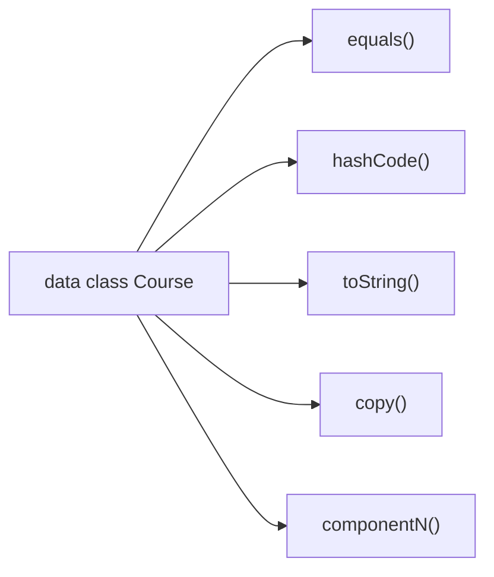
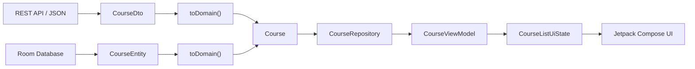
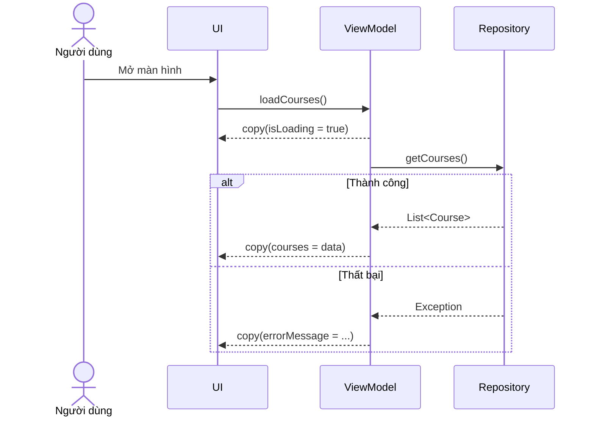
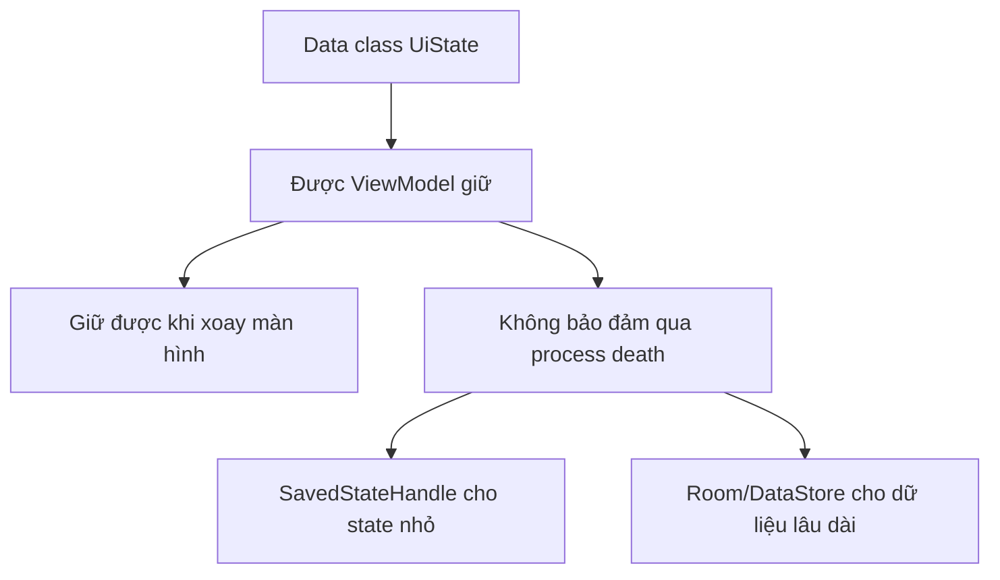

# 007 — Data Classes trong Kotlin

| Thông tin               | Nội dung                               |
| ----------------------- | -------------------------------------- |
| **Học phần**            | 01 — Language and Android Fundamentals |
| **Module**              | Module 01 — Pick a Language            |
| **Nhóm nội dung**       | Kotlin Essentials                      |
| **Nguồn roadmap**       | Pick a Language / Kotlin Essentials    |
| **Loại bài**            | Lesson                                 |
| **Thứ tự trong module** | 007                                    |
| **Thời lượng gợi ý**    | 24 phút                                |

---

## 1. Tóm tắt

**Data class** là loại lớp Kotlin được thiết kế chủ yếu để biểu diễn dữ liệu. Khi khai báo một lớp bằng từ khóa `data`, trình biên dịch tự động tạo các hàm phục vụ:

* So sánh nội dung đối tượng.
* In đối tượng để debug.
* Sao chép đối tượng và thay đổi một vài thuộc tính.
* Phân rã đối tượng thành các biến riêng biệt.

```kotlin
data class User(
    val id: Long,
    val name: String,
    val email: String
)
```

Trong ứng dụng Android, data class thường được sử dụng cho:

* Dữ liệu trả về từ API.
* Entity lưu trong Room.
* Domain model của ứng dụng.
* Trạng thái màn hình — `UiState`.
* Dữ liệu của từng thành phần giao diện.
* Kết quả trả về từ repository.
* Tham số hoặc payload của sự kiện.

Trình biên dịch Kotlin tự động sinh `equals()`, `hashCode()`, `toString()`, `componentN()` và `copy()` dựa trên các thuộc tính nằm trong primary constructor. ([Kotlin][1])

---

## 2. Mục tiêu học tập

Sau bài học, anh có thể:

* Giải thích data class bằng ngôn ngữ của mình.
* Phân biệt data class với class thông thường.
* Sử dụng `copy()` để cập nhật state bất biến.
* Hiểu `equals()`, `hashCode()`, `toString()` và destructuring.
* Biết vị trí của data class trong kiến trúc Android.
* Tách API model, domain model và UI model.
* Nhận biết lỗi shallow copy và mutable collection.
* Viết unit test cho data class và mapper.
* Tạo một artifact nhỏ để đưa vào portfolio.

---

# 3. Data class là gì?

Data class là một lớp mà **dữ liệu của đối tượng quan trọng hơn danh tính của đối tượng**.

Ví dụ, hai người dùng có cùng `id`, `name` và `email` có thể được coi là có cùng nội dung:

```kotlin
data class User(
    val id: Long,
    val name: String,
    val email: String
)

fun main() {
    val userA = User(
        id = 1,
        name = "An",
        email = "an@example.com"
    )

    val userB = User(
        id = 1,
        name = "An",
        email = "an@example.com"
    )

    println(userA == userB)  // true
    println(userA === userB) // false
}
```

Trong Kotlin:

* `==` kiểm tra **structural equality** — hai đối tượng có cùng nội dung hay không.
* `===` kiểm tra **referential equality** — hai biến có trỏ đến đúng cùng một đối tượng hay không.

Data class tự động triển khai structural equality thông qua `equals()`. Class thông thường không tự động làm điều này. ([Kotlin][2])

---

## 4. Kotlin tự động tạo những gì?

Với khai báo:

```kotlin
data class Course(
    val id: Long,
    val title: String,
    val completed: Boolean
)
```

Kotlin tự động tạo các thành phần sau:

| Thành phần     | Công dụng                                       |
| -------------- | ----------------------------------------------- |
| `equals()`     | So sánh nội dung hai đối tượng                  |
| `hashCode()`   | Hỗ trợ `Set`, `Map` và collection dựa trên hash |
| `toString()`   | In nội dung dễ đọc khi debug                    |
| `copy()`       | Tạo bản sao và thay đổi một số thuộc tính       |
| `component1()` | Trả về `id`                                     |
| `component2()` | Trả về `title`                                  |
| `component3()` | Trả về `completed`                              |



---

## 5. Quy tắc khai báo data class

Một data class phải đáp ứng các yêu cầu cơ bản:

1. Primary constructor phải có ít nhất một tham số.
2. Mọi tham số trong primary constructor phải được khai báo bằng `val` hoặc `var`.
3. Data class không thể đồng thời là `abstract`, `open`, `sealed` hoặc `inner`. ([Kotlin][1])

### Đúng

```kotlin
data class Product(
    val id: Long,
    val name: String
)
```

### Sai: không có tham số

```kotlin
// Không hợp lệ
data class Product()
```

### Sai: tham số không có `val` hoặc `var`

```kotlin
// Không hợp lệ
data class Product(id: Long)
```

### Nên ưu tiên `val`

```kotlin
data class Product(
    val id: Long,
    val name: String,
    val price: Long
)
```

Việc dùng `val` giúp data class gần với mô hình bất biến hơn, từ đó giảm các thay đổi state ngoài dự kiến.

---

# 6. Data class nằm ở đâu trong ứng dụng Android?

Một ứng dụng Android thường không chỉ có một loại model. Cùng một khóa học có thể được biểu diễn bởi nhiều data class khác nhau tùy theo tầng kiến trúc.



## Vai trò của từng model

| Model               | Nhiệm vụ                                     |
| ------------------- | -------------------------------------------- |
| `CourseDto`         | Phản ánh cấu trúc JSON của server            |
| `CourseEntity`      | Phản ánh cấu trúc bảng trong database        |
| `Course`            | Biểu diễn khái niệm nghiệp vụ trong ứng dụng |
| `CourseUiModel`     | Chứa dữ liệu đã chuẩn bị để hiển thị         |
| `CourseListUiState` | Mô tả toàn bộ trạng thái của màn hình        |

Android khuyến nghị tách các model khi dữ liệu từ nguồn ngoài không khớp với dữ liệu mà phần còn lại của ứng dụng cần sử dụng. Việc tách model giúp giảm dữ liệu thừa, thích nghi với kiểu dữ liệu nội bộ và cải thiện separation of concerns. ([Android Developers][3])

---

# 7. Các tính năng quan trọng

## 7.1. `toString()`

```kotlin
data class User(
    val id: Long,
    val name: String
)

fun main() {
    val user = User(1, "An")
    println(user)
}
```

Kết quả:

```text
User(id=1, name=An)
```

Điều này hữu ích khi:

* Xem Logcat.
* Debug unit test.
* Kiểm tra dữ liệu API.
* Theo dõi state trong ViewModel.

> Không nên log toàn bộ data class nếu nó chứa mật khẩu, access token, thông tin thanh toán hoặc dữ liệu cá nhân nhạy cảm.

---

## 7.2. `copy()`

`copy()` tạo một đối tượng mới, giữ nguyên những thuộc tính không được chỉ định.

```kotlin
data class Course(
    val id: Long,
    val title: String,
    val completed: Boolean
)

val originalCourse = Course(
    id = 1,
    title = "Kotlin Essentials",
    completed = false
)

val completedCourse = originalCourse.copy(
    completed = true
)
```

Kết quả:

```text
originalCourse.completed = false
completedCourse.completed = true
```

Đối tượng ban đầu không bị thay đổi.

Đây là một kỹ thuật quan trọng khi cập nhật UI state:

```kotlin
_uiState.update { currentState ->
    currentState.copy(isLoading = true)
}
```

---

## 7.3. Destructuring

Các hàm `componentN()` cho phép phân rã đối tượng:

```kotlin
data class User(
    val name: String,
    val age: Int
)

val user = User("An", 23)

val (name, age) = user

println(name)
println(age)
```

Tương đương:

```kotlin
val name = user.component1()
val age = user.component2()
```

### Hạn chế

Destructuring dựa vào **thứ tự thuộc tính**, không dựa vào tên. Vì vậy, nó có thể làm code khó đọc với data class có nhiều trường.

```kotlin
val (_, title, completed) = course
```

Trong phần lớn code Android production, truy cập theo tên thường rõ ràng hơn:

```kotlin
course.title
course.completed
```

---

# 8. Ví dụ Android hoàn chỉnh

Giả sử ứng dụng cần tải danh sách khóa học từ API.

## 8.1. Network DTO

```kotlin
import kotlinx.serialization.SerialName
import kotlinx.serialization.Serializable

@Serializable
data class CourseDto(
    @SerialName("course_id")
    val id: Long,

    @SerialName("course_title")
    val title: String,

    @SerialName("is_completed")
    val isCompleted: Boolean
)
```

`@Serializable` cho phép chuyển đổi giữa JSON và đối tượng Kotlin khi sử dụng `kotlinx.serialization`. ([Kotlin][4])

Ví dụ JSON:

```json
{
  "course_id": 7,
  "course_title": "Data Classes",
  "is_completed": false
}
```

---

## 8.2. Domain model

```kotlin
data class Course(
    val id: Long,
    val title: String,
    val completed: Boolean
)
```

Domain model không cần biết server đặt tên trường là `course_title` hay `is_completed`.

---

## 8.3. Mapper

```kotlin
fun CourseDto.toDomain(): Course {
    return Course(
        id = id,
        title = title.trim(),
        completed = isCompleted
    )
}
```

Mapper là nơi thích hợp để:

* Đổi tên trường.
* Chuyển kiểu dữ liệu.
* Chuẩn hóa chuỗi.
* Thay thế dữ liệu thiếu.
* Loại bỏ trường không cần thiết.
* Chuyển DTO thành domain model.

---

## 8.4. UI state

```kotlin
data class CourseListUiState(
    val isLoading: Boolean = false,
    val courses: List<Course> = emptyList(),
    val errorMessage: String? = null
)
```

Mỗi đối tượng `CourseListUiState` là một **ảnh chụp trạng thái** của màn hình tại một thời điểm:

```text
Đang tải:
CourseListUiState(
    isLoading = true,
    courses = [],
    errorMessage = null
)

Tải thành công:
CourseListUiState(
    isLoading = false,
    courses = [...],
    errorMessage = null
)

Tải thất bại:
CourseListUiState(
    isLoading = false,
    courses = [],
    errorMessage = "Không thể tải khóa học"
)
```

Android khuyến nghị UI state bất biến và UI không trực tiếp sửa state do ViewModel cung cấp. Cách tổ chức này giúp duy trì một nguồn dữ liệu đáng tin cậy và tránh nhiều nguồn cùng sửa một giá trị. ([Android Developers][5])

---

## 8.5. ViewModel cập nhật state bằng `copy()`

```kotlin
class CourseViewModel(
    private val repository: CourseRepository
) : ViewModel() {

    private val _uiState = MutableStateFlow(CourseListUiState())

    val uiState: StateFlow<CourseListUiState> =
        _uiState.asStateFlow()

    fun loadCourses() {
        viewModelScope.launch {
            _uiState.update { currentState ->
                currentState.copy(
                    isLoading = true,
                    errorMessage = null
                )
            }

            try {
                val courses = repository.getCourses()

                _uiState.update { currentState ->
                    currentState.copy(
                        isLoading = false,
                        courses = courses,
                        errorMessage = null
                    )
                }
            } catch (exception: Exception) {
                _uiState.update { currentState ->
                    currentState.copy(
                        isLoading = false,
                        errorMessage = "Không thể tải khóa học"
                    )
                }
            }
        }
    }
}
```

Luồng xử lý:



---

## 8.6. Hiển thị bằng Jetpack Compose

```kotlin
@Composable
fun CourseRoute(
    viewModel: CourseViewModel
) {
    val uiState by viewModel.uiState.collectAsStateWithLifecycle()

    CourseScreen(
        uiState = uiState,
        onRetry = viewModel::loadCourses
    )
}

@Composable
fun CourseScreen(
    uiState: CourseListUiState,
    onRetry: () -> Unit
) {
    when {
        uiState.isLoading -> {
            CircularProgressIndicator()
        }

        uiState.errorMessage != null -> {
            Column {
                Text(text = uiState.errorMessage)
                Button(onClick = onRetry) {
                    Text("Thử lại")
                }
            }
        }

        else -> {
            LazyColumn {
                items(
                    items = uiState.courses,
                    key = { course -> course.id }
                ) { course ->
                    Text(text = course.title)
                }
            }
        }
    }
}
```

Trong mô hình Unidirectional Data Flow:

1. State đi từ ViewModel xuống UI.
2. UI hiển thị state.
3. Sự kiện người dùng đi từ UI lên ViewModel.
4. ViewModel tạo state mới.
5. UI render lại state mới.

Cách tổ chức này cải thiện tính nhất quán, khả năng kiểm thử và khả năng bảo trì. ([Android Developers][5])

---

# 9. Data class và Android lifecycle

Data class chỉ là một đối tượng Kotlin. Nó **không tự động lưu dữ liệu qua lifecycle**.



## Khi xoay màn hình

Nếu state nằm trong ViewModel, ViewModel có thể tiếp tục cung cấp state sau configuration change.

## Khi process bị hệ thống hủy

Không nên giả định data class trong bộ nhớ vẫn tồn tại. Có thể sử dụng:

* `SavedStateHandle` cho ID, từ khóa tìm kiếm, lựa chọn hoặc state nhỏ.
* `rememberSaveable` cho UI element state phù hợp.
* Room hoặc DataStore cho dữ liệu cần lưu lâu dài.
* Repository để tải lại dữ liệu.

Android khuyến nghị chỉ lưu lượng nhỏ state cần thiết trong `SavedStateHandle` hoặc `rememberSaveable`, sau đó dùng thông tin đó để tải lại dữ liệu lớn từ data layer. ([Android Developers][6])

---

# 10. Lỗi thường gặp

## 10.1. Dùng `var` cho mọi thuộc tính

### Không nên

```kotlin
data class ProfileUiState(
    var name: String,
    var isSaving: Boolean
)
```

Code ở bất cứ đâu giữ tham chiếu tới đối tượng cũng có thể sửa state.

### Nên dùng

```kotlin
data class ProfileUiState(
    val name: String = "",
    val isSaving: Boolean = false
)
```

Cập nhật bằng:

```kotlin
val newState = oldState.copy(isSaving = true)
```

---

## 10.2. Dùng `MutableList` trong state

### Có rủi ro

```kotlin
data class CartUiState(
    val products: MutableList<Product>
)
```

```kotlin
uiState.products.add(newProduct)
```

Đối tượng state không đổi nhưng nội dung bên trong bị sửa, khiến việc theo dõi state trở nên khó khăn.

### Tốt hơn

```kotlin
data class CartUiState(
    val products: List<Product> = emptyList()
)
```

```kotlin
val newState = oldState.copy(
    products = oldState.products + newProduct
)
```

---

## 10.3. Hiểu nhầm `copy()` là deep copy

`copy()` của data class chỉ tạo **shallow copy**. Những đối tượng con vẫn có thể dùng chung tham chiếu. ([Kotlin][1])

```kotlin
data class Cart(
    val items: MutableList<String>
)

val original = Cart(
    items = mutableListOf("Book")
)

val copied = original.copy()

copied.items.add("Laptop")

println(original.items)
// [Book, Laptop]
```

Cả hai đối tượng cùng dùng một `MutableList`.

### Cách an toàn hơn

```kotlin
val copied = original.copy(
    items = original.items.toMutableList()
)
```

Tốt nhất vẫn là thiết kế model bằng dữ liệu bất biến:

```kotlin
data class Cart(
    val items: List<String>
)

val copied = original.copy(
    items = original.items + "Laptop"
)
```

---

## 10.4. Đặt thuộc tính quan trọng bên ngoài constructor

```kotlin
data class User(
    val id: Long
) {
    var name: String = ""
}
```

`name` không tham gia vào:

* `equals()`
* `hashCode()`
* `toString()`
* `copy()`
* `componentN()`

Kotlin chỉ sử dụng thuộc tính trong primary constructor để tạo các hàm này. ([Kotlin][1])

Hai đối tượng sau vẫn được coi là bằng nhau:

```kotlin
val userA = User(1).apply {
    name = "An"
}

val userB = User(1).apply {
    name = "Bình"
}

println(userA == userB) // true
```

### Thiết kế phù hợp hơn

```kotlin
data class User(
    val id: Long,
    val name: String
)
```

---

## 10.5. Dùng chung API model cho toàn bộ ứng dụng

### Không nên

```kotlin
@Serializable
data class UserDto(
    val id: Long,
    val full_name: String,
    val access_token: String,
    val internal_status: Int
)
```

Sau đó truyền trực tiếp `UserDto` vào UI.

Rủi ro:

* UI phụ thuộc vào cấu trúc backend.
* Vô tình để lộ trường nhạy cảm.
* API đổi tên trường có thể ảnh hưởng nhiều màn hình.
* Model chứa nhiều dữ liệu UI không cần.
* Logic chuyển đổi bị rải rác.

### Tách model

```kotlin
data class User(
    val id: Long,
    val name: String
)

fun UserDto.toDomain(): User {
    return User(
        id = id,
        name = full_name
    )
}
```

---

## 10.6. Dùng `Pair` hoặc `Triple` cho dữ liệu nghiệp vụ

### Khó đọc

```kotlin
fun getUser(): Triple<Long, String, Boolean>
```

Người đọc không biết ba giá trị có ý nghĩa gì.

### Rõ ràng hơn

```kotlin
data class UserSummary(
    val id: Long,
    val displayName: String,
    val premium: Boolean
)
```

Tài liệu Kotlin cũng khuyến nghị ưu tiên data class có tên thuộc tính rõ nghĩa thay cho `Pair` và `Triple` trong phần lớn trường hợp. ([Kotlin][1])

---

# 11. Khi nào không nên dùng data class?

Không cần biến mọi class thành data class.

## Dùng class thông thường khi

* Đối tượng chủ yếu chứa hành vi.
* Danh tính đối tượng quan trọng hơn dữ liệu.
* Đối tượng quản lý tài nguyên.
* Đối tượng có lifecycle riêng.
* Không muốn tự động so sánh toàn bộ thuộc tính.
* Đối tượng là service, repository hoặc controller.

```kotlin
class CourseRepository(
    private val remoteDataSource: CourseRemoteDataSource
) {
    suspend fun getCourses(): List<Course> {
        return remoteDataSource.getCourses()
            .map(CourseDto::toDomain)
    }
}
```

`CourseRepository` không nên là data class vì nó biểu diễn một thành phần có hành vi và dependency, không phải một gói dữ liệu.

---

# 12. Mô hình state bằng sealed interface

Với những trạng thái loại trừ lẫn nhau, sealed interface thường rõ ràng hơn một data class chứa nhiều cờ Boolean.

## Dễ tạo state không hợp lệ

```kotlin
data class ScreenState(
    val isLoading: Boolean,
    val data: List<Course>,
    val error: String?
)
```

State sau có thể xuất hiện:

```kotlin
ScreenState(
    isLoading = true,
    data = courses,
    error = "Network error"
)
```

Màn hình vừa loading, vừa có dữ liệu, vừa có lỗi.

## Mô hình chặt chẽ hơn

```kotlin
sealed interface CourseScreenState {

    data object Loading : CourseScreenState

    data class Content(
        val courses: List<Course>
    ) : CourseScreenState

    data class Error(
        val message: String
    ) : CourseScreenState
}
```

Khi render:

```kotlin
when (val state = uiState) {
    CourseScreenState.Loading -> {
        CircularProgressIndicator()
    }

    is CourseScreenState.Content -> {
        CourseList(state.courses)
    }

    is CourseScreenState.Error -> {
        ErrorMessage(state.message)
    }
}
```

Data class vẫn được dùng cho các trạng thái có dữ liệu, còn sealed interface kiểm soát tập trạng thái hợp lệ.

---

# 13. Unit test

## 13.1. Kiểm tra equality

```kotlin
import org.junit.Assert.assertEquals
import org.junit.Test

class CourseTest {

    @Test
    fun courses_with_same_values_are_equal() {
        val first = Course(
            id = 7,
            title = "Data Classes",
            completed = false
        )

        val second = Course(
            id = 7,
            title = "Data Classes",
            completed = false
        )

        assertEquals(first, second)
    }
}
```

---

## 13.2. Kiểm tra `copy()`

```kotlin
@Test
fun copy_changes_only_selected_property() {
    val original = Course(
        id = 7,
        title = "Data Classes",
        completed = false
    )

    val updated = original.copy(
        completed = true
    )

    assertEquals(false, original.completed)
    assertEquals(true, updated.completed)
    assertEquals(original.id, updated.id)
    assertEquals(original.title, updated.title)
}
```

---

## 13.3. Kiểm tra mapper

```kotlin
@Test
fun dto_is_mapped_to_domain_model() {
    val dto = CourseDto(
        id = 7,
        title = "  Data Classes  ",
        isCompleted = false
    )

    val result = dto.toDomain()

    assertEquals(7, result.id)
    assertEquals("Data Classes", result.title)
    assertEquals(false, result.completed)
}
```

---

## 13.4. Kiểm tra cập nhật UI state

```kotlin
@Test
fun loading_state_preserves_existing_courses() {
    val courses = listOf(
        Course(
            id = 1,
            title = "Kotlin",
            completed = false
        )
    )

    val original = CourseListUiState(
        isLoading = false,
        courses = courses
    )

    val loading = original.copy(
        isLoading = true
    )

    assertEquals(true, loading.isLoading)
    assertEquals(courses, loading.courses)
}
```

---

# 14. Ảnh hưởng đến chất lượng ứng dụng

## UX

Data class không trực tiếp tạo giao diện đẹp hơn, nhưng UI state rõ ràng giúp:

* Tránh spinner hiển thị sai.
* Tránh dữ liệu cũ xuất hiện cùng lỗi mới.
* Giữ form ổn định khi recomposition.
* Hiển thị đúng loading, content và error.
* Khôi phục trải nghiệm sau khi xoay màn hình.

## Độ ổn định

* Equality giúp phát hiện hai state có cùng nội dung.
* Immutable state giảm sửa đổi ngoài dự kiến.
* Tách DTO và domain model giới hạn ảnh hưởng khi API thay đổi.
* Mapper tạo một điểm kiểm soát dữ liệu đầu vào.

## Maintainability

* Tên thuộc tính mô tả rõ ý nghĩa.
* `copy()` giảm code cập nhật state thủ công.
* Tách model theo tầng làm dependency rõ ràng.
* Unit test không cần Android framework.

## Performance

Data class không tự động làm ứng dụng nhanh hơn. Cần chú ý:

* Không đặt bitmap hoặc object quá lớn trong UI state.
* Không sao chép và chuyển đổi list lớn một cách không cần thiết.
* `copy()` là shallow copy nhưng thao tác `map`, `filter` hoặc `+` có thể tạo collection mới.
* Dùng key ổn định trong `LazyColumn`.
* Chỉ đưa vào UI state dữ liệu UI thực sự cần.

## Release risk

Các lỗi nên kiểm tra trước khi release:

* Server đổi tên hoặc xóa trường JSON.
* Trường nullable được xử lý không đúng.
* Default value che giấu dữ liệu bắt buộc bị thiếu.
* DTO bị dùng trực tiếp trong UI.
* `toString()` làm lộ token trong log.
* Thuộc tính quan trọng nằm ngoài primary constructor.
* Mutable collection làm state thay đổi âm thầm.

---

# 15. Thực hành 24 phút

|  Thời gian | Hoạt động                                      |
| ---------: | ---------------------------------------------- |
|   0–4 phút | Đọc định nghĩa và tạo một data class đơn giản  |
|   4–8 phút | Thử `equals()`, `toString()` và destructuring  |
|  8–12 phút | Thực hành cập nhật đối tượng bằng `copy()`     |
| 12–17 phút | Tạo `CourseDto`, `Course` và mapper            |
| 17–21 phút | Tạo `CourseListUiState`                        |
| 21–24 phút | Viết một unit test và ghi lại lỗi shallow copy |

---

# 16. Bài tập

## Bài tập chính: Profile Editor

Xây dựng model cho màn hình chỉnh sửa hồ sơ.

### Yêu cầu

Tạo các data class sau:

```kotlin
data class UserProfileDto(...)
data class UserProfile(...)
data class EditProfileUiState(...)
```

`EditProfileUiState` cần có:

* Tên hiện tại.
* Email hiện tại.
* Trạng thái đang lưu.
* Thông báo lỗi.
* Trạng thái lưu thành công.

Viết:

1. Mapper từ `UserProfileDto` sang `UserProfile`.
2. Hàm cập nhật tên bằng `copy()`.
3. Hàm chuyển state sang loading.
4. Hàm chuyển state sang error.
5. Ít nhất ba unit test.

### Câu hỏi phân tích

* Điều gì xảy ra khi dùng `var name` thay cho `val name`?
* State có còn tồn tại sau khi xoay màn hình không?
* State có còn tồn tại sau process death không?
* Có nên lưu toàn bộ profile trong `SavedStateHandle` không?
* Trường nào không nên xuất hiện trong Logcat?

---

# 17. Artifact đưa vào portfolio

Cấu trúc đề xuất:

```text
data-classes-demo/
├── README.md
├── src/
│   ├── CourseDto.kt
│   ├── Course.kt
│   ├── CourseMapper.kt
│   ├── CourseListUiState.kt
│   └── CourseViewModel.kt
└── test/
    ├── CourseTest.kt
    └── CourseMapperTest.kt
```

## Nội dung README ngắn

```markdown
# Kotlin Data Classes Demo

Dự án minh họa cách sử dụng Kotlin data classes trong ứng dụng Android.

## Nội dung

- Network DTO với kotlinx.serialization
- Domain model tách khỏi API
- Mapper DTO → Domain
- Immutable UI state
- Cập nhật state bằng copy()
- Unit test cho equality, copy và mapper

## Kiến thức chính

Data class phù hợp với các object mang dữ liệu. Trong Android,
data class đặc biệt hữu ích cho API model, domain model và UI state.
```

### Screenshot nên đưa vào portfolio

* Màn hình loading.
* Màn hình danh sách khóa học.
* Màn hình lỗi và nút thử lại.
* Kết quả unit test.
* Sơ đồ DTO → Domain → UI state.

---

# 18. Ghi chú 5 dòng

> Data class là lớp Kotlin dùng chủ yếu để biểu diễn dữ liệu.
> Kotlin tự động tạo equality, hash code, string output, copy và component functions.
> Trong Android, data class thường dùng cho DTO, entity, domain model và UI state.
> Nên ưu tiên `val`, immutable collections và cập nhật state bằng `copy()`.
> Cần nhớ `copy()` chỉ là shallow copy và data class không tự xử lý lifecycle.

---

# 19. Checklist hoàn thành

## Kiến thức Kotlin

* [ ] Giải thích được data class là gì.
* [ ] Biết các hàm Kotlin tự động tạo.
* [ ] Phân biệt được `==` và `===`.
* [ ] Sử dụng được `copy()`.
* [ ] Hiểu destructuring và `componentN()`.
* [ ] Hiểu shallow copy.
* [ ] Biết thuộc tính ngoài constructor không tham gia equality.

## Ứng dụng Android

* [ ] Tạo được API DTO.
* [ ] Tạo được domain model.
* [ ] Viết được mapper.
* [ ] Tạo được immutable UI state.
* [ ] Cập nhật state bằng `copy()`.
* [ ] Biết vai trò của ViewModel.
* [ ] Biết data class không tự tồn tại qua process death.
* [ ] Có xử lý loading, content và error.

## Testing và production

* [ ] Có test equality.
* [ ] Có test `copy()`.
* [ ] Có test mapper.
* [ ] Không log dữ liệu nhạy cảm.
* [ ] Không dùng mutable collection trong UI state.
* [ ] Kiểm tra thay đổi cấu trúc API.
* [ ] Có README hoặc sơ đồ cho portfolio.

---

# 20. Nguồn và hình minh họa

* [Kotlin Data Classes — tài liệu chính thức](https://kotlinlang.org/docs/data-classes.html)
* [Android UI Layer — có sơ đồ UI State và Unidirectional Data Flow](https://developer.android.com/topic/architecture/ui-layer)
* [Android Data Layer — có sơ đồ Repository và Data Source](https://developer.android.com/topic/architecture/data-layer)
* [Lưu UI State trong Jetpack Compose](https://developer.android.com/develop/ui/compose/state-saving)
* [Kotlin JSON Serialization](https://kotlinlang.org/docs/serialization-configure-json-serialization.html)
* [ViewModel and State in Compose — bài thực hành có hình minh họa](https://developer.android.com/codelabs/basic-android-kotlin-compose-viewmodel-and-state)

[1]: https://kotlinlang.org/docs/data-classes.html "Data classes | Kotlin Documentation"
[2]: https://kotlinlang.org/docs/equality.html "Equality | Kotlin Documentation"
[3]: https://developer.android.com/topic/architecture/data-layer?hl=en "Data layer  |  App architecture  |  Android Developers"
[4]: https://kotlinlang.org/docs/serialization-configure-json-serialization.html "JSON serialization overview | Kotlin Documentation"
[5]: https://developer.android.com/topic/architecture/ui-layer "UI layer  |  App architecture  |  Android Developers"
[6]: https://developer.android.com/develop/ui/compose/state-saving?hl=en&utm_source=chatgpt.com "Save UI state in Compose  |  Jetpack Compose  |  Android Developers"
