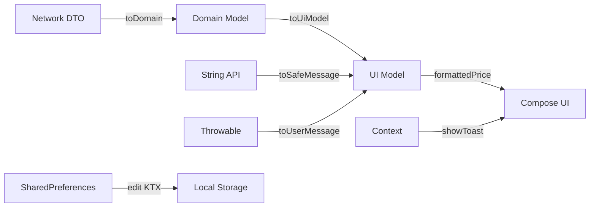
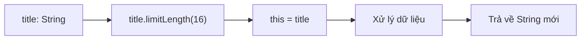
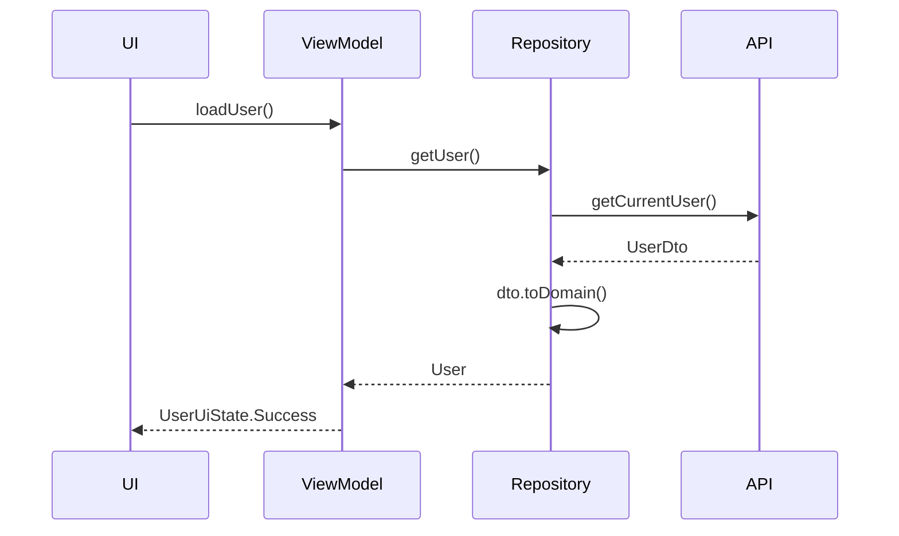
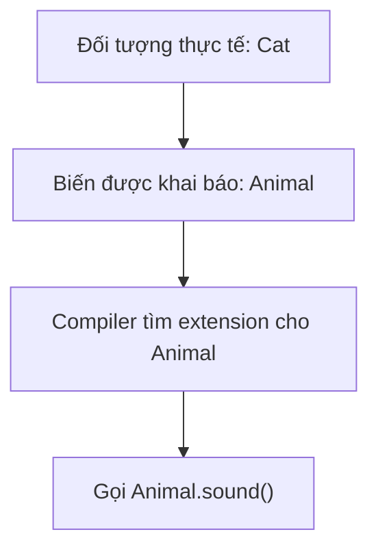
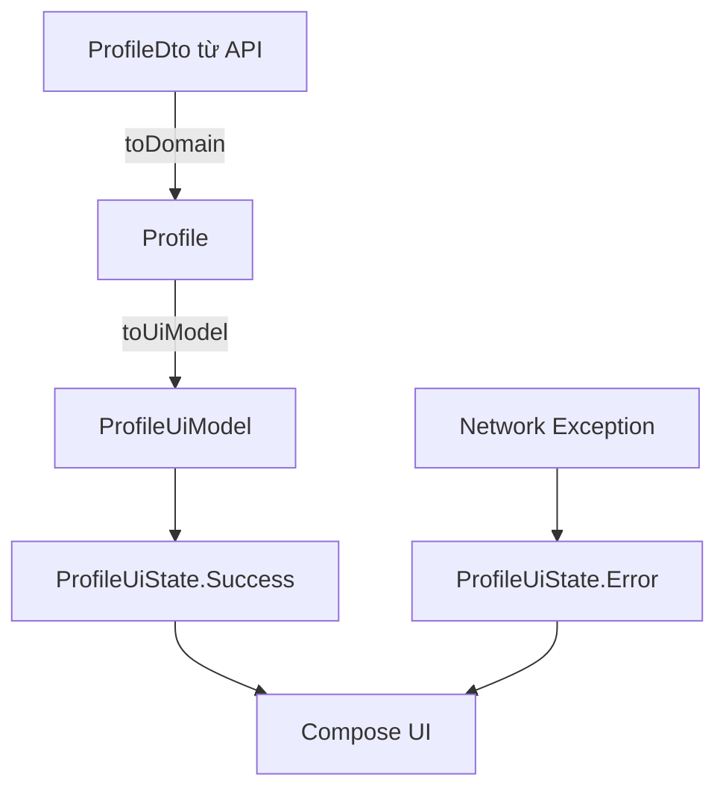

# 008 — Extension Functions trong Kotlin

> **Học phần:** 01 — Language and Android Fundamentals
> **Module:** Module 01 — Pick a Language
> **Nhóm nội dung:** Kotlin Essentials
> **Nguồn roadmap:** Pick a Language / Kotlin Essentials
> **Loại bài:** Lesson
> **Thứ tự trong module:** 008
> **Thời lượng gợi ý:** 24 phút

> 🖼️ **Ảnh minh họa:**
> [Kotlin Logo — Wikimedia Commons](https://commons.wikimedia.org/wiki/File:Kotlin_logo_%282025%29.svg)
> [Minh họa receiver type và extension function](https://www.scaler.com/topics/kotlin/extension-function-kotlin/)
> [Android Codelab — Building a Kotlin Extensions Library](https://developer.android.com/codelabs/building-kotlin-extensions-library)

---

## 1. Tóm tắt

**Extension Function** cho phép lập trình viên khai báo một hàm mới và gọi hàm đó giống như thành viên của một lớp hoặc interface có sẵn, mà không cần:

* Sửa mã nguồn của lớp đó.
* Kế thừa lớp.
* Tạo một lớp tiện ích chứa nhiều hàm `static`.
* Bao bọc đối tượng bằng một lớp mới.

Ví dụ, thay vì viết:

```kotlin
val normalizedEmail = normalizeEmail(user.email)
```

ta có thể viết:

```kotlin
val normalizedEmail = user.email.normalizeEmail()
```

Trong Android, extension function thường được sử dụng để:

* Chuyển API DTO thành domain model.
* Chuyển domain model thành UI model.
* Định dạng ngày giờ, tiền tệ và văn bản.
* Đóng gói thao tác với `Context`, `Bundle`, `Uri` hoặc `SharedPreferences`.
* Tạo các modifier hoặc helper giao diện dùng lại.
* Chuẩn hóa cách xử lý lỗi và trạng thái dữ liệu.

Android KTX cũng được xây dựng dựa nhiều vào extension functions, extension properties, lambda, tham số mặc định và coroutine để làm các API Android trở nên ngắn gọn, tự nhiên hơn khi sử dụng bằng Kotlin. ([Android Developers][1])

---

## 2. Mục tiêu học tập

Sau bài học, anh có thể:

* Giải thích extension function bằng ngôn ngữ của mình.
* Nhận diện **receiver type**, **receiver object** và từ khóa `this`.
* Phân biệt extension function với member function và utility function.
* Viết extension cho kiểu dữ liệu thường, generic và nullable.
* Áp dụng extension vào luồng dữ liệu Android.
* Viết unit test cho extension function.
* Nhận biết các trường hợp không nên dùng extension.
* Tránh các lỗi liên quan đến static dispatch, lifecycle và API pollution.
* Tạo một artifact nhỏ có thể đưa vào portfolio.

---

## 3. Extension Function nằm ở đâu trong ứng dụng Android?



Extension function không phải một tầng kiến trúc riêng. Nó là một công cụ cú pháp có thể xuất hiện tại nhiều tầng:

| Tầng           | Ví dụ extension             |
| -------------- | --------------------------- |
| Data           | `UserDto.toDomain()`        |
| Domain         | `Money.isPositive`          |
| Presentation   | `User.toUiModel()`          |
| UI             | `Modifier.cardStyle()`      |
| Navigation     | `String.toUri()`            |
| Error handling | `Throwable.toUserMessage()` |
| Testing        | `User.assertValid()`        |

### Nguyên tắc quan trọng

Extension function nên giúp code:

* Diễn đạt đúng ngữ nghĩa nghiệp vụ.
* Giảm lặp lại.
* Dễ đọc tại nơi gọi.
* Dễ kiểm thử.
* Không che giấu side effect quan trọng.

---

## 4. Khái niệm cốt lõi

## 4.1. Cú pháp cơ bản

```kotlin
fun ReceiverType.functionName(parameter: Type): ReturnType {
    // this là đối tượng nhận
}
```

Ví dụ:

```kotlin
fun String.initials(): String {
    return trim()
        .split(Regex("\\s+"))
        .filter { it.isNotBlank() }
        .take(2)
        .joinToString("") { word ->
            word.first().uppercase()
        }
}
```

Sử dụng:

```kotlin
val name = "Trần An Khánh"
val result = name.initials()

println(result) // TA
```

Kotlin gọi đối tượng nằm bên trái dấu chấm là **receiver**. Kiểu được đặt trước tên hàm, chẳng hạn `String` trong `String.initials()`, được gọi là **receiver type**. ([Kotlin][2])

---

## 4.2. Phân tích từng thành phần

```kotlin
fun String.limitLength(maxLength: Int): String {
    return if (length <= maxLength) {
        this
    } else {
        take(maxLength - 3) + "..."
    }
}
```

| Thành phần           | Ý nghĩa                                       |
| -------------------- | --------------------------------------------- |
| `fun`                | Khai báo hàm                                  |
| `String`             | Receiver type                                 |
| `limitLength`        | Tên extension function                        |
| `maxLength`          | Tham số                                       |
| `String` sau dấu `:` | Kiểu dữ liệu trả về                           |
| `this`               | Chuỗi đang gọi hàm                            |
| `length`, `take()`   | Thành viên có thể gọi trực tiếp trên receiver |

Sử dụng:

```kotlin
val title = "Kotlin Extension Functions"

println(title.limitLength(16))
// Kotlin Extens...
```

### Mô hình tư duy



---

## 4.3. Extension không thực sự thay đổi lớp gốc

Giả sử ta khai báo:

```kotlin
fun String.isValidUsername(): Boolean {
    return length in 4..20 && all { it.isLetterOrDigit() || it == '_' }
}
```

Khai báo trên không sửa mã nguồn của lớp `String`. Nó chỉ tạo thêm một hàm có thể được gọi bằng cú pháp dấu chấm khi extension đó nằm trong scope hoặc đã được import.

Vì vậy, extension function:

* Không thể truy cập thành viên `private` hoặc `protected` của receiver.
* Không thêm trạng thái mới vào đối tượng.
* Không phải cơ chế kế thừa.
* Không override member function theo cách polymorphism thông thường.

Extension khai báo bên ngoài lớp chỉ có thể sử dụng những thành viên mà phạm vi hiện tại được phép truy cập. ([Kotlin][2])

---

## 5. So sánh với các cách viết khác

## 5.1. Utility function

```kotlin
fun normalizeEmail(email: String): String {
    return email.trim().lowercase()
}

val result = normalizeEmail(user.email)
```

## 5.2. Extension function

```kotlin
fun String.normalizeEmail(): String {
    return trim().lowercase()
}

val result = user.email.normalizeEmail()
```

## 5.3. So sánh

| Tiêu chí                    | Utility function        | Extension function               |
| --------------------------- | ----------------------- | -------------------------------- |
| Cách gọi                    | `normalizeEmail(email)` | `email.normalizeEmail()`         |
| Đối tượng chính             | Nằm trong tham số       | Hiển thị rõ bên trái             |
| Khả năng khám phá trong IDE | Trung bình              | Tốt qua autocomplete             |
| Phù hợp chuỗi xử lý         | Thấp hơn                | Tốt                              |
| Nguy cơ lạm dụng            | Utility class phình to  | Namespace có quá nhiều extension |

Extension phù hợp khi hành vi chủ yếu hoạt động trên một đối tượng cụ thể. Hướng dẫn coding convention của Kotlin cũng khuyên cân nhắc extension khi một hàm chủ yếu làm việc trên một đối tượng, đồng thời nên giới hạn visibility để tránh làm ô nhiễm API. ([Kotlin][3])

---

## 6. Ví dụ 1 — Chuẩn hóa email

```kotlin
fun String.normalizeEmail(): String {
    return trim().lowercase()
}
```

Sử dụng:

```kotlin
fun registerUser(rawEmail: String) {
    val normalizedEmail = rawEmail.normalizeEmail()

    println(normalizedEmail)
}
```

```kotlin
registerUser("  USER@Example.COM  ")

// user@example.com
```

### Tác động đến ứng dụng

* Giảm trường hợp cùng một email nhưng khác chữ hoa/chữ thường.
* Giúp repository nhận dữ liệu đã được chuẩn hóa.
* Tránh lặp `trim().lowercase()` ở nhiều màn hình.
* Giảm nguy cơ UI và backend xử lý email không nhất quán.

### Lưu ý

Extension này chỉ chuẩn hóa chuỗi. Nó không đảm bảo địa chỉ email thực sự tồn tại.

Tên `normalizeEmail()` rõ nghĩa hơn tên chung chung như:

```kotlin
fun String.clean(): String
```

---

## 7. Ví dụ 2 — Chuyển DTO thành domain model

Đây là một trong những trường hợp extension function hữu ích nhất trong Android.

## 7.1. API model

```kotlin
data class UserDto(
    val id: Long?,
    val displayName: String?,
    val avatarUrl: String?
)
```

## 7.2. Domain model

```kotlin
data class User(
    val id: Long,
    val name: String,
    val avatarUrl: String?
)
```

## 7.3. Mapper dạng extension

```kotlin
fun UserDto.toDomain(): User {
    return User(
        id = id ?: 0L,
        name = displayName
            ?.trim()
            ?.takeIf { it.isNotEmpty() }
            ?: "Người dùng",
        avatarUrl = avatarUrl
    )
}
```

Sử dụng trong repository:

```kotlin
class UserRepository(
    private val api: UserApi
) {
    suspend fun getUser(): User {
        val dto = api.getCurrentUser()
        return dto.toDomain()
    }
}
```

### Luồng dữ liệu



### Lợi ích

* Không đưa kiểu dữ liệu của API trực tiếp lên UI.
* Tập trung logic fallback tại một vị trí.
* Dễ kiểm thử khi backend trả `null`.
* Domain model ổn định hơn khi response API thay đổi.
* Repository ngắn gọn và dễ đọc.

---

## 8. Ví dụ 3 — Chuyển domain model thành UI model

```kotlin
data class Product(
    val id: Long,
    val name: String,
    val price: Long,
    val available: Boolean
)

data class ProductUiModel(
    val id: Long,
    val title: String,
    val formattedPrice: String,
    val availabilityText: String,
    val canPurchase: Boolean
)
```

Extension:

```kotlin
fun Product.toUiModel(): ProductUiModel {
    return ProductUiModel(
        id = id,
        title = name.ifBlank { "Sản phẩm chưa có tên" },
        formattedPrice = "%,d ₫".format(price),
        availabilityText = if (available) {
            "Còn hàng"
        } else {
            "Hết hàng"
        },
        canPurchase = available && price > 0
    )
}
```

Sử dụng trong ViewModel:

```kotlin
val productUiModel = product.toUiModel()
```

### Tác động đến UX

Một mapper tốt giúp UI luôn nhận được dữ liệu có thể hiển thị:

* Tên trống có fallback.
* Giá được định dạng nhất quán.
* Trạng thái nút mua được xác định rõ.
* Không phải rải `if` và xử lý dữ liệu ở nhiều composable.

> Với ứng dụng đa ngôn ngữ, không nên hard-code `"Còn hàng"` hoặc `"Hết hàng"` trong mapper dùng chung. Có thể đưa trạng thái ngữ nghĩa lên UI rồi sử dụng Android string resource để bản địa hóa.

---

## 9. Ví dụ 4 — Extension property

Kotlin còn hỗ trợ **extension property**:

```kotlin
data class Money(
    val amount: Long
)

val Money.isPositive: Boolean
    get() = amount > 0
```

Sử dụng:

```kotlin
val balance = Money(amount = 500_000)

if (balance.isPositive) {
    println("Tài khoản còn số dư")
}
```

Extension property phù hợp khi giá trị:

* Được tính trực tiếp từ trạng thái hiện tại.
* Có chi phí tính toán thấp.
* Không có side effect.
* Cho cùng kết quả khi trạng thái đối tượng không đổi.

```kotlin
val String.hasVisibleContent: Boolean
    get() = isNotBlank()
```

### Không có backing field

Extension property không thực sự thêm thuộc tính lưu trữ vào lớp. Vì vậy, nó không thể khai báo initializer như sau:

```kotlin
// Không hợp lệ
val User.cachedName = "Unknown"
```

Nó phải cung cấp getter hoặc setter phù hợp. ([Kotlin][2])

---

## 10. Ví dụ 5 — Nullable receiver

Extension có thể được khai báo cho một kiểu nullable:

```kotlin
fun String?.orPlaceholder(
    placeholder: String = "Chưa cập nhật"
): String {
    return this
        ?.trim()
        ?.takeIf { it.isNotEmpty() }
        ?: placeholder
}
```

Sử dụng:

```kotlin
val nickname: String? = null

println(nickname.orPlaceholder())
// Chưa cập nhật
```

Khi receiver là `null`, `this` bên trong extension cũng là `null`. Extension phải tự kiểm tra bằng `this == null`, safe call hoặc Elvis operator. ([Kotlin][2])

### Ví dụ Android

```kotlin
data class ProfileDto(
    val biography: String?
)

fun ProfileDto.toBiographyText(): String {
    return biography.orPlaceholder("Người dùng chưa thêm giới thiệu")
}
```

### Khi nào nên dùng?

Dùng nullable receiver khi:

* Hành vi có một fallback tự nhiên.
* Việc gọi hàm trên giá trị `null` không gây hiểu nhầm.
* Tên hàm thể hiện rõ cách xử lý `null`.

Không nên viết extension khiến `null` trông giống dữ liệu hợp lệ một cách khó phát hiện.

---

## 11. Ví dụ 6 — Generic extension function

```kotlin
fun <T> List<T>.secondOrNull(): T? {
    return getOrNull(1)
}
```

Sử dụng:

```kotlin
val users = listOf("An", "Bình", "Chi")

println(users.secondOrNull()) // Bình
```

Một ví dụ phù hợp với UI state:

```kotlin
fun <T> List<T>?.orEmptyState(): List<T> {
    return this ?: emptyList()
}
```

Tuy nhiên, Kotlin đã cung cấp nhiều extension tiêu chuẩn như `orEmpty()`, `map()`, `filter()`, `fold()` và `joinToString()`. Trước khi tự viết extension, nên kiểm tra xem Standard Library đã có chức năng tương đương chưa. ([Kotlin][2])

---

## 12. Ví dụ 7 — Android KTX

Không có KTX:

```kotlin
sharedPreferences
    .edit()
    .putBoolean("dark_mode", true)
    .apply()
```

Sử dụng Android KTX:

```kotlin
sharedPreferences.edit {
    putBoolean("dark_mode", true)
}
```

Extension `SharedPreferences.edit` quản lý việc tạo editor và gọi `apply()` hoặc `commit()` sau khi block hoàn thành. ([Android Developers][1])

Ví dụ gọi đồng bộ:

```kotlin
sharedPreferences.edit(commit = true) {
    putBoolean("dark_mode", true)
}
```

### Bài học rút ra

Một extension tốt không chỉ làm code ngắn hơn. Nó nên:

* Giảm khả năng quên một bước bắt buộc.
* Biểu diễn ý định rõ ràng.
* Đóng gói một quy trình sử dụng API.
* Cung cấp mặc định hợp lý.

---

## 13. Ví dụ 8 — Extension cho Jetpack Compose

```kotlin
import androidx.compose.foundation.layout.padding
import androidx.compose.foundation.shape.RoundedCornerShape
import androidx.compose.ui.Modifier
import androidx.compose.ui.draw.clip
import androidx.compose.ui.unit.dp

fun Modifier.productCardStyle(): Modifier {
    return this
        .clip(RoundedCornerShape(16.dp))
        .padding(16.dp)
}
```

Sử dụng:

```kotlin
ProductCard(
    modifier = Modifier.productCardStyle()
)
```

Có thể viết ngắn hơn:

```kotlin
fun Modifier.productCardStyle(): Modifier =
    clip(RoundedCornerShape(16.dp))
        .padding(16.dp)
```

### Lỗi thường gặp

Không trả về modifier chain:

```kotlin
fun Modifier.brokenCardStyle(): Modifier {
    padding(16.dp)

    return this
}
```

`padding(16.dp)` tạo ra một `Modifier` mới, nhưng kết quả đã bị bỏ qua.

Cách đúng:

```kotlin
fun Modifier.cardPadding(): Modifier {
    return this.padding(16.dp)
}
```

### Lưu ý về thứ tự

```kotlin
Modifier
    .padding(16.dp)
    .clip(RoundedCornerShape(12.dp))
```

không hoàn toàn tương đương với:

```kotlin
Modifier
    .clip(RoundedCornerShape(12.dp))
    .padding(16.dp)
```

Extension UI phải giữ được thứ tự modifier mong muốn, vì thứ tự có thể ảnh hưởng đến vùng vẽ, vùng click, padding và clipping.

---

## 14. Extension Function và static dispatch

Đây là phần dễ gây lỗi nhất.

```kotlin
open class Animal

class Cat : Animal()

fun Animal.sound(): String = "Animal sound"

fun Cat.sound(): String = "Meow"
```

```kotlin
fun printSound(animal: Animal) {
    println(animal.sound())
}

printSound(Cat())
```

Kết quả:

```text
Animal sound
```

Không phải:

```text
Meow
```

### Vì sao?

Extension function được chọn dựa trên **kiểu được khai báo tại compile time**, không dựa trên kiểu thực tế của đối tượng tại runtime. ([Kotlin][2])



### Khi cần polymorphism

Sử dụng member function hoặc interface:

```kotlin
interface Animal {
    fun sound(): String
}

class Cat : Animal {
    override fun sound(): String = "Meow"
}
```

```kotlin
fun printSound(animal: Animal) {
    println(animal.sound())
}
```

Kết quả:

```text
Meow
```

---

## 15. Member function luôn được ưu tiên

```kotlin
class User {
    fun displayName(): String = "Member function"
}

fun User.displayName(): String = "Extension function"
```

```kotlin
val user = User()

println(user.displayName())
```

Kết quả:

```text
Member function
```

Khi member function và extension function có cùng tên cùng chữ ký, member function được ưu tiên. ([Kotlin][2])

### Không nên làm

```kotlin
fun ViewModel.clear(): Unit
fun Context.getString(): String
fun User.copy(): User
```

Những tên này có thể:

* Xung đột với API hiện tại.
* Xung đột sau khi dependency được nâng cấp.
* Khiến người đọc hiểu nhầm đây là member thật.
* Làm hành vi thay đổi ngoài dự kiến.

---

## 16. Extension không phải nơi chứa mọi logic

## Nên dùng

```kotlin
fun UserDto.toDomain(): User
```

```kotlin
fun String.normalizeEmail(): String
```

```kotlin
fun Throwable.toErrorType(): ErrorType
```

```kotlin
val Order.totalPrice: Long
    get() = items.sumOf { it.price * it.quantity }
```

## Cần cân nhắc

```kotlin
suspend fun User.purchaseProduct(
    repository: ProductRepository,
    analytics: Analytics,
    paymentGateway: PaymentGateway
): PurchaseResult
```

Hàm trên có quá nhiều dependency và thực hiện một use case lớn. Nó phù hợp hơn với một class:

```kotlin
class PurchaseProductUseCase(
    private val repository: ProductRepository,
    private val analytics: Analytics,
    private val paymentGateway: PaymentGateway
) {
    suspend operator fun invoke(
        user: User,
        productId: Long
    ): PurchaseResult {
        // Business flow
    }
}
```

### Quy tắc thực tế

Dùng extension khi logic:

* Nhỏ và tập trung.
* Gắn chặt với receiver.
* Không yêu cầu nhiều dependency.
* Không quản lý một workflow dài.
* Không che giấu I/O quan trọng.
* Có thể kiểm thử độc lập.

---

## 17. Đặt extension ở đâu?

Cấu trúc gợi ý:

```text
app/
└── src/main/java/com/example/app/
    ├── core/
    │   ├── extensions/
    │   │   ├── StringExtensions.kt
    │   │   ├── ThrowableExtensions.kt
    │   │   └── ModifierExtensions.kt
    │   └── model/
    ├── data/
    │   ├── remote/
    │   │   ├── UserDto.kt
    │   │   └── UserDtoMapper.kt
    │   └── repository/
    ├── domain/
    │   └── model/
    └── feature/
        └── profile/
            ├── ProfileUiModel.kt
            └── ProfileMappers.kt
```

### Không nhất thiết gom tất cả vào `Extensions.kt`

Không nên:

```text
utils/
└── Extensions.kt
```

với hàng trăm extension không liên quan.

Nên chia theo ngữ nghĩa:

```text
StringExtensions.kt
DateExtensions.kt
UserMappers.kt
ProductUiMappers.kt
ModifierExtensions.kt
```

Android Kotlin Style Guide khuyến nghị mỗi file tập trung vào một chủ đề; một nhóm extension thực hiện cùng loại thao tác có thể được đặt chung, còn các declaration không liên quan nên được tách riêng. ([Android Developers][4])

---

## 18. Visibility và kiểm soát phạm vi

Extension top-level mặc định là `public`:

```kotlin
fun String.normalizeEmail(): String =
    trim().lowercase()
```

Nếu chỉ dùng trong module:

```kotlin
internal fun UserDto.toDomain(): User {
    // ...
}
```

Nếu chỉ dùng trong file:

```kotlin
private fun String.cleaned(): String {
    return trim().replace(Regex("\\s+"), " ")
}
```

### Lợi ích của visibility nhỏ

* Giảm autocomplete không cần thiết.
* Tránh xung đột tên.
* Giảm public API phải duy trì.
* Dễ thay đổi implementation.
* Tránh module khác phụ thuộc nhầm vào helper nội bộ.

Kotlin coding convention khuyến nghị giới hạn visibility của extension ở mức nhỏ nhất phù hợp. ([Kotlin][3])

---

## 19. Lifecycle và state

Extension function tự nó không quản lý lifecycle.

Ví dụ nguy hiểm:

```kotlin
fun Activity.loadUser() {
    lifecycleScope.launch {
        val user = repository.getUser()
        render(user)
    }
}
```

Các vấn đề:

* Extension phụ thuộc vào `repository` không rõ nguồn gốc.
* Side effect bị che giấu.
* Logic tải dữ liệu nằm trong `Activity`.
* Khó kiểm thử.
* Có thể vô tình gọi nhiều lần sau recreation.
* UI state không được lưu trong ViewModel.

Cách phù hợp hơn:

```kotlin
class ProfileViewModel(
    private val repository: UserRepository
) : ViewModel() {

    private val _uiState =
        MutableStateFlow<ProfileUiState>(ProfileUiState.Loading)

    val uiState = _uiState.asStateFlow()

    fun loadUser() {
        viewModelScope.launch {
            _uiState.value = runCatching {
                repository.getUser()
            }.fold(
                onSuccess = { user ->
                    ProfileUiState.Success(user.toUiModel())
                },
                onFailure = { throwable ->
                    ProfileUiState.Error(throwable.toErrorMessage())
                }
            )
        }
    }
}
```

Extension chỉ xử lý mapping:

```kotlin
fun User.toUiModel(): UserUiModel {
    return UserUiModel(
        id = id,
        displayName = name.ifBlank { "Người dùng" }
    )
}
```

```kotlin
fun Throwable.toErrorMessage(): String {
    return when (this) {
        is IOException -> "Không thể kết nối máy chủ"
        else -> "Đã xảy ra lỗi"
    }
}
```

### Nguyên tắc

* ViewModel quản lý state.
* Repository quản lý data source.
* Use case quản lý business workflow.
* Extension hỗ trợ chuyển đổi hoặc biểu diễn dữ liệu nhỏ.
* Không dùng extension để né tránh thiết kế kiến trúc.

---

## 20. Testing Extension Functions

Extension function thường dễ unit test vì không phụ thuộc Android framework.

## 20.1. Extension cần test

```kotlin
fun String.normalizeEmail(): String {
    return trim().lowercase()
}
```

## 20.2. Unit test

```kotlin
import kotlin.test.Test
import kotlin.test.assertEquals

class StringExtensionsTest {

    @Test
    fun `normalizeEmail removes outer spaces and lowercase characters`() {
        val input = "  USER@Example.COM  "

        val result = input.normalizeEmail()

        assertEquals(
            expected = "user@example.com",
            actual = result
        )
    }

    @Test
    fun `normalizeEmail keeps an already normalized email unchanged`() {
        val input = "user@example.com"

        val result = input.normalizeEmail()

        assertEquals(
            expected = "user@example.com",
            actual = result
        )
    }
}
```

---

## 20.3. Test nullable receiver

```kotlin
class NullableStringExtensionsTest {

    @Test
    fun `orPlaceholder returns placeholder when value is null`() {
        val input: String? = null

        val result = input.orPlaceholder("Không có dữ liệu")

        assertEquals("Không có dữ liệu", result)
    }

    @Test
    fun `orPlaceholder returns placeholder when value is blank`() {
        val input = "   "

        val result = input.orPlaceholder("Không có dữ liệu")

        assertEquals("Không có dữ liệu", result)
    }

    @Test
    fun `orPlaceholder trims valid value`() {
        val input = "  Kotlin  "

        val result = input.orPlaceholder()

        assertEquals("Kotlin", result)
    }
}
```

---

## 20.4. Test mapper

```kotlin
class UserDtoMapperTest {

    @Test
    fun `toDomain supplies fallback values when API fields are null`() {
        val dto = UserDto(
            id = null,
            displayName = null,
            avatarUrl = null
        )

        val result = dto.toDomain()

        assertEquals(0L, result.id)
        assertEquals("Người dùng", result.name)
        assertEquals(null, result.avatarUrl)
    }
}
```

### Các trường hợp nên test

* Input bình thường.
* Input rỗng.
* Input blank.
* Input `null`.
* Giá trị biên.
* Unicode và tiếng Việt.
* Dữ liệu API thiếu field.
* Giá trị âm hoặc quá lớn.
* Trường hợp extension có fallback.

---

## 21. Lỗi phổ biến của lập trình viên mới

## 21.1. Nghĩ extension thật sự sửa lớp gốc

Sai:

> “Tôi đã thêm một method mới vào lớp `String`.”

Đúng hơn:

> “Tôi đã khai báo một extension function có receiver type là `String`.”

---

## 21.2. Mong đợi polymorphism

```kotlin
fun Animal.name() = "Animal"
fun Cat.name() = "Cat"
```

Không nên dựa vào extension để dispatch theo runtime type.

---

## 21.3. Đặt tên quá chung chung

Không tốt:

```kotlin
fun String.convert(): String
fun User.process(): User
fun Throwable.handle(): Unit
```

Tốt hơn:

```kotlin
fun String.toNormalizedEmail(): String
fun User.toProfileUiModel(): ProfileUiModel
fun Throwable.toNetworkError(): NetworkError
```

---

## 21.4. Extension chứa side effect bất ngờ

```kotlin
fun UserDto.toDomain(): User {
    analytics.track("user_mapped")
    database.save(this)

    return User(...)
}
```

Tên `toDomain()` khiến người đọc mong đợi một phép chuyển đổi dữ liệu, không phải tracking và ghi database.

Nên giữ mapper gần với **pure function**:

```kotlin
fun UserDto.toDomain(): User {
    return User(
        id = requireNotNull(id),
        name = displayName.orEmpty()
    )
}
```

---

## 21.5. Extension phụ thuộc `Context` quá mức

```kotlin
fun User.toDisplayText(context: Context): String
```

Nếu chỉ cần chuỗi resource, có thể đưa resource identifier hoặc semantic state lên UI thay vì truyền `Context` sâu vào domain.

Domain layer nên tránh phụ thuộc Android framework.

---

## 21.6. Tạo quá nhiều extension global

Ví dụ project có:

```kotlin
fun String.isEmail()
fun String.isPhone()
fun String.isPassword()
fun String.toDate()
fun String.toPrice()
fun String.toUser()
fun String.toUri()
```

Autocomplete của `String` sẽ bị lấp đầy bởi các hàm chỉ phù hợp với một số ngữ cảnh.

Giải pháp:

* Dùng visibility `private` hoặc `internal`.
* Đặt extension gần feature sử dụng.
* Sử dụng value class hoặc domain type.

```kotlin
@JvmInline
value class EmailAddress(
    val value: String
)
```

```kotlin
fun EmailAddress.normalized(): EmailAddress {
    return EmailAddress(value.trim().lowercase())
}
```

---

## 22. Ảnh hưởng đến chất lượng ứng dụng

| Khía cạnh       | Ảnh hưởng tích cực                     | Rủi ro khi lạm dụng                           |
| --------------- | -------------------------------------- | --------------------------------------------- |
| UX              | Chuẩn hóa format và fallback           | Che giấu lỗi dữ liệu                          |
| Reliability     | Mapper tập trung, dễ test              | Side effect khó phát hiện                     |
| Maintainability | Code gọi ngắn và rõ                    | Quá nhiều extension global                    |
| Architecture    | Tách DTO, domain, UI                   | Đưa business workflow vào helper              |
| Performance     | Thường là lời gọi hàm thông thường     | Extension nặng bị gọi trong mỗi recomposition |
| Release risk    | Logic dùng chung được bảo vệ bằng test | Xung đột tên sau khi cập nhật thư viện        |

---

## 23. Performance trong Compose

Không nên thực hiện tính toán nặng trong extension được gọi liên tục khi recomposition:

```kotlin
fun List<Product>.calculateComplexRecommendations(): List<Product> {
    // Thuật toán tốn nhiều tài nguyên
}
```

```kotlin
@Composable
fun ProductScreen(products: List<Product>) {
    val recommendations =
        products.calculateComplexRecommendations()

    // ...
}
```

Nếu phép tính tốn kém, có thể chuyển vào ViewModel hoặc cache bằng `remember`:

```kotlin
@Composable
fun ProductScreen(products: List<Product>) {
    val recommendations = remember(products) {
        products.calculateComplexRecommendations()
    }

    // ...
}
```

Điểm cần nhớ:

> Extension function không tự động làm code nhanh hơn. Nó chỉ thay đổi cách tổ chức và gọi logic.

---

## 24. Thực hành mini project

## Bài toán

Xây dựng phần hiển thị hồ sơ người dùng từ API.

### API response

```kotlin
data class ProfileDto(
    val id: Long?,
    val fullName: String?,
    val biography: String?,
    val followerCount: Int?
)
```

### Domain model

```kotlin
data class Profile(
    val id: Long,
    val fullName: String,
    val biography: String?,
    val followerCount: Int
)
```

### UI model

```kotlin
data class ProfileUiModel(
    val displayName: String,
    val biographyText: String,
    val followerText: String
)
```

### Extension DTO → Domain

```kotlin
fun ProfileDto.toDomain(): Profile {
    return Profile(
        id = id ?: 0L,
        fullName = fullName
            ?.trim()
            ?.takeIf { it.isNotEmpty() }
            ?: "Người dùng",
        biography = biography
            ?.trim()
            ?.takeIf { it.isNotEmpty() },
        followerCount = followerCount
            ?.coerceAtLeast(0)
            ?: 0
    )
}
```

### Extension Domain → UI

```kotlin
fun Profile.toUiModel(): ProfileUiModel {
    return ProfileUiModel(
        displayName = fullName,
        biographyText = biography
            ?: "Chưa có phần giới thiệu",
        followerText = "$followerCount người theo dõi"
    )
}
```

### Repository

```kotlin
class ProfileRepository(
    private val api: ProfileApi
) {
    suspend fun getProfile(): Profile {
        return api.getProfile().toDomain()
    }
}
```

### ViewModel

```kotlin
sealed interface ProfileUiState {
    data object Loading : ProfileUiState

    data class Success(
        val profile: ProfileUiModel
    ) : ProfileUiState

    data class Error(
        val message: String
    ) : ProfileUiState
}
```

```kotlin
class ProfileViewModel(
    private val repository: ProfileRepository
) : ViewModel() {

    private val _uiState =
        MutableStateFlow<ProfileUiState>(
            ProfileUiState.Loading
        )

    val uiState = _uiState.asStateFlow()

    fun loadProfile() {
        viewModelScope.launch {
            _uiState.value = ProfileUiState.Loading

            _uiState.value = try {
                val profile = repository.getProfile()

                ProfileUiState.Success(
                    profile = profile.toUiModel()
                )
            } catch (exception: IOException) {
                ProfileUiState.Error(
                    message = "Không thể kết nối máy chủ"
                )
            } catch (exception: Exception) {
                ProfileUiState.Error(
                    message = "Không thể tải hồ sơ"
                )
            }
        }
    }
}
```

### Kết quả kiến trúc



---

## 25. Bài thực hành 24 phút

### Phút 0–4: Nắm khái niệm

Viết lại bằng lời của anh:

```text
Extension function là...
Receiver type là...
this bên trong extension là...
```

### Phút 4–9: Viết extension cơ bản

```kotlin
fun String.toDisplayName(): String {
    return trim()
        .replace(Regex("\\s+"), " ")
        .ifBlank { "Người dùng" }
}
```

### Phút 9–14: Viết mapper

```kotlin
fun UserDto.toDomain(): User
```

Yêu cầu:

* Xử lý `null`.
* Xử lý chuỗi blank.
* Không hard-code logic tại UI.
* Không thực hiện network hoặc database.

### Phút 14–19: Viết unit test

Kiểm tra:

* Dữ liệu bình thường.
* Dữ liệu `null`.
* Tên chỉ chứa khoảng trắng.
* Giá trị số âm.

### Phút 19–24: Viết README

README cần giải thích:

* Extension function giải quyết vấn đề gì.
* Tại sao dùng mapper.
* Extension được đặt ở tầng nào.
* Có unit test nào.
* Extension ảnh hưởng đến UX như thế nào.

---

## 26. Bài tập

## Bài 1 — Cơ bản

Viết extension:

```kotlin
fun String.toSafeUsername(): String
```

Yêu cầu:

* Xóa khoảng trắng đầu cuối.
* Chuyển thành chữ thường.
* Thay khoảng trắng ở giữa bằng `_`.
* Nếu rỗng, trả về `"anonymous"`.

Ví dụ:

```kotlin
"  An Khanh  ".toSafeUsername()
```

Kết quả:

```text
an_khanh
```

---

## Bài 2 — Nullable receiver

Viết:

```kotlin
fun Int?.orZero(): Int
```

Ví dụ:

```kotlin
val followerCount: Int? = null

println(followerCount.orZero()) // 0
```

Sau đó mở rộng yêu cầu: giá trị âm cũng trả về `0`.

---

## Bài 3 — Mapper Android

Cho DTO:

```kotlin
data class ArticleDto(
    val id: Long?,
    val title: String?,
    val content: String?,
    val publishedAt: String?
)
```

Hãy viết:

```kotlin
fun ArticleDto.toDomain(): Article
```

Yêu cầu:

* Không cho domain model nhận `id = null`.
* Tiêu đề blank phải có fallback.
* Nội dung null phải thành chuỗi rỗng.
* Ngày không hợp lệ phải được xử lý an toàn.

---

## Bài 4 — Phân tích lỗi

Giải thích kết quả:

```kotlin
open class Result

class Success : Result()

fun Result.message() = "Result"
fun Success.message() = "Success"

fun printMessage(result: Result) {
    println(result.message())
}

printMessage(Success())
```

Câu hỏi:

1. Kết quả in ra là gì?
2. Vì sao?
3. Nên thiết kế lại bằng cách nào nếu cần polymorphism?

---

## 27. Ghi chú năm dòng

```text
Extension function cho phép gọi một hàm mới trên một kiểu dữ liệu có sẵn.
Kiểu đứng trước tên hàm được gọi là receiver type.
Bên trong extension, this là đối tượng đang gọi hàm.
Extension không thực sự thay đổi lớp và không truy cập được private member.
Trong Android, extension phù hợp cho mapping, formatting và helper nhỏ, dễ test.
```

---

## 28. Một lỗi junior thường mắc

> **Lỗi:** Cho rằng extension function được override dựa trên kiểu thực tế của đối tượng.

Extension được chọn dựa trên kiểu khai báo ở compile time. Vì vậy, không nên dùng extension để triển khai polymorphism nghiệp vụ. Khi hành vi phải thay đổi theo subclass tại runtime, nên sử dụng member function, interface hoặc sealed hierarchy.

---

## 29. Artifact đưa vào portfolio

Có thể tạo thư mục:

```text
extension-functions-demo/
├── README.md
├── src/
│   ├── UserDto.kt
│   ├── User.kt
│   ├── UserUiModel.kt
│   ├── UserMappers.kt
│   └── StringExtensions.kt
└── test/
    ├── UserMappersTest.kt
    └── StringExtensionsTest.kt
```

### README mẫu

```markdown
# Kotlin Extension Functions Demo

Mini project minh họa cách sử dụng Kotlin extension functions
trong luồng dữ liệu Android.

## Luồng dữ liệu

UserDto -> toDomain() -> User -> toUiModel() -> UserUiModel

## Nội dung

- Extension function cơ bản.
- Nullable receiver.
- DTO mapper.
- UI mapper.
- Unit test cho dữ liệu null và blank.

## Lợi ích

- Tách API model khỏi UI.
- Chuẩn hóa fallback.
- Giảm logic trong ViewModel và Composable.
- Tăng khả năng kiểm thử.
```

### Screenshot nên chụp

* File `UserMappers.kt`.
* Unit test chạy thành công.
* Màn hình ứng dụng khi API trả đủ dữ liệu.
* Màn hình fallback khi API trả `null`.
* Sơ đồ DTO → Domain → UI.

---

## 30. Checklist production

### Thiết kế

* [ ] Extension có gắn chặt với receiver không?
* [ ] Tên hàm có thể hiện đúng hành vi không?
* [ ] Logic có đủ nhỏ để là extension không?
* [ ] Có nên dùng class hoặc use case thay thế không?
* [ ] Visibility đã được giới hạn chưa?

### State và lifecycle

* [ ] Extension có vô tình giữ tham chiếu đến `Activity` hoặc `Context` không?
* [ ] Extension có khởi chạy coroutine không rõ lifecycle không?
* [ ] State có nằm trong ViewModel hoặc state holder không?
* [ ] Rotate hoặc background có làm thao tác bị gọi lại không?

### Data và network

* [ ] DTO mapper xử lý field null chưa?
* [ ] Có fallback làm che giấu lỗi backend không?
* [ ] Lỗi parse có được log hoặc đo lường không?
* [ ] Domain layer có bị phụ thuộc Android framework không?

### UI và UX

* [ ] Chuỗi hiển thị có sử dụng resource để hỗ trợ đa ngôn ngữ không?
* [ ] Extension có chạy phép tính nặng trong recomposition không?
* [ ] Thứ tự Compose Modifier có đúng không?
* [ ] Fallback có giúp người dùng hiểu trạng thái không?

### Testing

* [ ] Có unit test input bình thường không?
* [ ] Có test `null`, blank và boundary không?
* [ ] Có test static dispatch nếu extension liên quan đến hierarchy không?
* [ ] Có test mapper khi response API thay đổi không?

### Release

* [ ] Extension có xung đột với API thư viện mới không?
* [ ] Public extension có cần giữ backward compatibility không?
* [ ] Có extension nào không còn được sử dụng không?
* [ ] Release note có cần đề cập thay đổi mapping hoặc format không?

---

## 31. Checklist hoàn thành bài học

* [ ] Có định nghĩa ngắn gọn về extension function.
* [ ] Giải thích được receiver type và receiver object.
* [ ] Hiểu `this` bên trong extension.
* [ ] Có ví dụ với `String`.
* [ ] Có ví dụ DTO → Domain.
* [ ] Có ví dụ Domain → UI.
* [ ] Có ví dụ nullable receiver.
* [ ] Có unit test.
* [ ] Hiểu static dispatch.
* [ ] Biết member function được ưu tiên.
* [ ] Biết khi nào không nên dùng extension.
* [ ] Có artifact nhỏ để đưa vào portfolio.
* [ ] Có ghi chú về lifecycle, state, testing và release.

---

## 32. Kết luận

Extension Functions là một trong những tính năng giúp Kotlin phù hợp với Android development. Giá trị chính của nó không nằm ở việc giảm vài ký tự, mà nằm ở khả năng tạo ra API dễ đọc:

```kotlin
dto.toDomain()
```

```kotlin
user.toUiModel()
```

```kotlin
email.normalizeEmail()
```

Một extension tốt nên:

```text
Nhỏ
+ rõ nghĩa
+ gắn với receiver
+ ít hoặc không có side effect
+ dễ kiểm thử
+ có phạm vi sử dụng phù hợp
```

Một extension không tốt thường:

```text
Che giấu workflow lớn
+ phụ thuộc nhiều service
+ thực hiện I/O bất ngờ
+ đặt tên chung chung
+ được public toàn project
```

Trong Android production, hãy sử dụng extension functions để hỗ trợ kiến trúc, không dùng chúng để thay thế kiến trúc.

---

## Tài liệu tham khảo

* [Kotlin Documentation — Extensions](https://kotlinlang.org/docs/extensions.html) ([Kotlin][2])
* [Android Developers — Android KTX](https://developer.android.com/kotlin/ktx) ([Android Developers][1])
* [Android Codelab — Building a Kotlin Extensions Library](https://developer.android.com/codelabs/building-kotlin-extensions-library) ([Android Developers][5])
* [Kotlin Coding Conventions](https://kotlinlang.org/docs/coding-conventions.html) ([Kotlin][3])
* [Android Kotlin Style Guide](https://developer.android.com/kotlin/style-guide) ([Android Developers][4])

[1]: https://developer.android.com/kotlin/ktx "Android KTX  |  Kotlin  |  Android Developers"
[2]: https://kotlinlang.org/docs/extensions.html "Extensions | Kotlin Documentation"
[3]: https://kotlinlang.org/docs/coding-conventions.html "Coding conventions | Kotlin Documentation"
[4]: https://developer.android.com/kotlin/style-guide "Kotlin style guide  |  Android Developers"
[5]: https://developer.android.com/codelabs/building-kotlin-extensions-library "Building a Kotlin extensions library  |  Android Developers"

---

# Bài luyện tập

## Mục tiêu


## Đề bài


## Yêu cầu hoàn thành

- [ ] 
- [ ] 
- [ ] 

## Kết quả / lời giải


## Ghi chú
