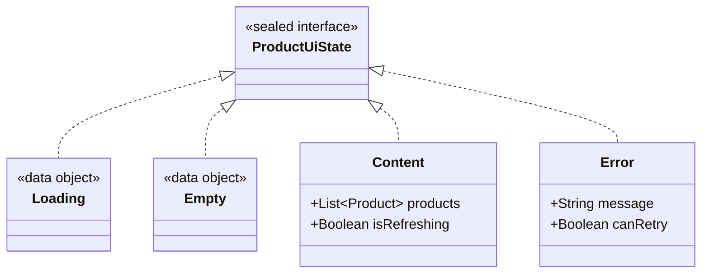
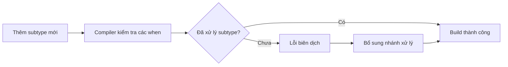
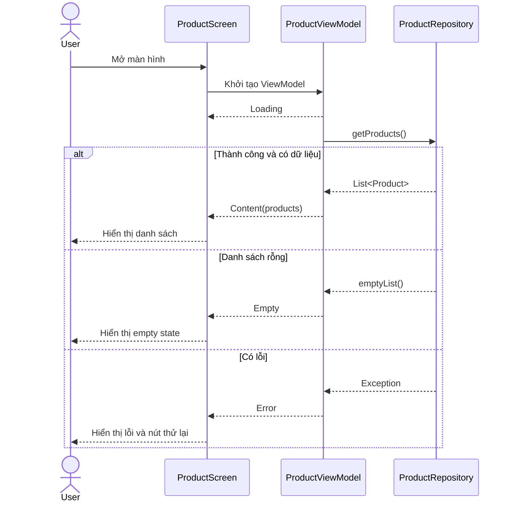
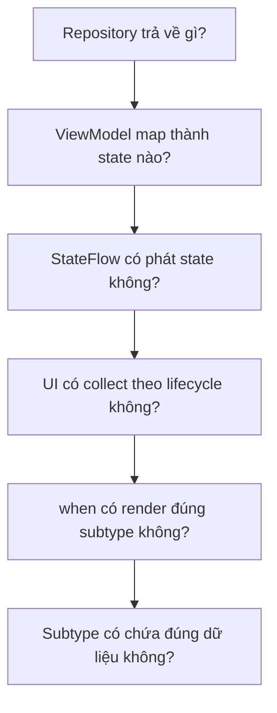
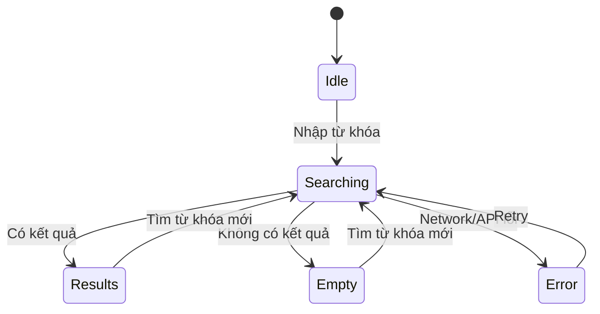

# 009 — Sealed Classes trong Kotlin

| Thuộc tính              | Nội dung                               |
| ----------------------- | -------------------------------------- |
| **Học phần**            | 01 — Language and Android Fundamentals |
| **Module**              | Module 01 — Pick a Language            |
| **Nhóm nội dung**       | Kotlin Essentials                      |
| **Nguồn roadmap**       | Pick a Language / Kotlin Essentials    |
| **Loại bài**            | Lesson                                 |
| **Thứ tự trong module** | 009                                    |
| **Thời lượng gợi ý**    | 24 phút                                |

---

## 1. Tóm tắt

**Sealed class** và **sealed interface** được dùng để mô hình hóa một tập hữu hạn các trạng thái hoặc kết quả có thể xảy ra.

Trong Android, chúng đặc biệt hữu ích khi biểu diễn:

* Trạng thái màn hình: `Loading`, `Success`, `Empty`, `Error`.
* Kết quả gọi API hoặc Repository.
* Hành động của người dùng.
* Kết quả xác thực dữ liệu.
* Trạng thái đăng nhập, thanh toán hoặc tải tệp.
* Route điều hướng trong một module nhỏ.

Điểm quan trọng nhất là: **compiler biết trước toàn bộ nhánh trực tiếp của sealed hierarchy**. Vì vậy, khi dùng với biểu thức `when`, Kotlin có thể kiểm tra xem chương trình đã xử lý đủ các trường hợp hay chưa. ([Kotlin][1])

> Sealed class không chỉ giúp code ngắn hơn. Nó giúp biến những trạng thái không hợp lệ thành những trạng thái khó hoặc không thể tạo ra.

---

## 2. Mục tiêu học tập

Sau bài học, bạn có thể:

* Giải thích sealed class bằng ngôn ngữ của mình.
* Phân biệt `sealed class`, `sealed interface`, `enum class` và `data class`.
* Sử dụng sealed hierarchy với biểu thức `when`.
* Mô hình hóa UI state trong Android.
* Kết hợp sealed class với `ViewModel`, `StateFlow` và Jetpack Compose.
* Nhận biết khi nào **không nên** dùng sealed class.
* Viết unit test cho các trạng thái chính.
* Tạo một artifact nhỏ để đưa vào portfolio.

---

## 3. Kế hoạch học trong 24 phút

|  Thời gian | Nội dung                                       |
| ---------: | ---------------------------------------------- |
|   0–4 phút | Hiểu vấn đề mà sealed class giải quyết         |
|   4–8 phút | Cú pháp và quy tắc                             |
|  8–13 phút | So sánh với enum, data class và abstract class |
| 13–19 phút | Ví dụ Android với ViewModel và StateFlow       |
| 19–22 phút | Testing và lỗi thường gặp                      |
| 22–24 phút | Checklist và bài tập                           |

---

## 4. Vấn đề thực tế

Giả sử một màn hình tải danh sách sản phẩm được biểu diễn bằng một `data class`:

```kotlin
data class ProductUiState(
    val isLoading: Boolean = false,
    val products: List<Product>? = null,
    val errorMessage: String? = null
)
```

Cấu trúc này cho phép tạo ra trạng thái sau:

```kotlin
ProductUiState(
    isLoading = true,
    products = listOf(Product("Laptop")),
    errorMessage = "Không có kết nối mạng"
)
```

Màn hình lúc này đồng thời:

* Đang tải dữ liệu.
* Có dữ liệu.
* Có lỗi.

UI phải tự quyết định trạng thái nào được ưu tiên.

```kotlin
when {
    state.isLoading -> showLoading()
    state.errorMessage != null -> showError()
    state.products != null -> showProducts()
}
```

Cách làm này tiềm ẩn các vấn đề:

* Có thể tồn tại tổ hợp trạng thái vô nghĩa.
* Thứ tự `if` quyết định hành vi UI.
* Khi thêm trạng thái mới, lập trình viên có thể quên cập nhật UI.
* Code khó đọc và khó test.
* Bug thường chỉ xuất hiện lúc chạy ứng dụng.

Sealed class giải quyết vấn đề bằng cách mô hình hóa mỗi khả năng thành một kiểu dữ liệu riêng.

---

## 5. Định nghĩa sealed class

Một sealed class là một lớp có hệ thống kế thừa bị giới hạn.

```kotlin
sealed class ProductUiState
```

Ta có thể khai báo các trạng thái hợp lệ:

```kotlin
sealed class ProductUiState {
    data object Loading : ProductUiState()

    data class Success(
        val products: List<Product>
    ) : ProductUiState()

    data class Error(
        val message: String
    ) : ProductUiState()
}
```

Bây giờ, một giá trị `ProductUiState` chỉ có thể là một trong ba trường hợp:

```text
Loading
Success
Error
```

Không còn trường hợp vừa `Loading`, vừa `Success`, vừa `Error`.

---

## 6. Sơ đồ sealed hierarchy



Mỗi instance chỉ thuộc **một nhánh cụ thể** tại một thời điểm.

---

## 7. Cú pháp cơ bản

### 7.1. Trạng thái không chứa dữ liệu

Khi một trạng thái không cần tạo nhiều instance và không chứa dữ liệu thay đổi, có thể dùng `data object`:

```kotlin
sealed interface LoginState {
    data object Idle : LoginState
    data object Loading : LoginState
}
```

`data object` phù hợp với sealed hierarchy vì nó cung cấp cách biểu diễn chuỗi nhất quán hơn với các `data class` nằm cùng hệ thống phân cấp. ([Kotlin][2])

Ví dụ:

```kotlin
println(LoginState.Loading)
// Loading
```

---

### 7.2. Trạng thái có chứa dữ liệu

Dùng `data class` khi mỗi trạng thái cần mang theo dữ liệu riêng:

```kotlin
sealed interface LoginState {
    data object Idle : LoginState
    data object Loading : LoginState

    data class Success(
        val userId: String,
        val displayName: String
    ) : LoginState

    data class Error(
        val message: String,
        val canRetry: Boolean
    ) : LoginState
}
```

Ví dụ:

```kotlin
val state: LoginState = LoginState.Success(
    userId = "user-001",
    displayName = "An Khánh"
)
```

---

### 7.3. Trạng thái có hành vi chung

Một sealed class có thể chứa thuộc tính và phương thức:

```kotlin
sealed class DownloadState(
    open val progress: Int
) {
    data object Waiting : DownloadState(progress = 0)

    data class Downloading(
        override val progress: Int
    ) : DownloadState(progress)

    data class Completed(
        val filePath: String
    ) : DownloadState(progress = 100)

    data class Failed(
        val reason: String,
        override val progress: Int
    ) : DownloadState(progress)
}
```

Sử dụng:

```kotlin
fun progressText(state: DownloadState): String {
    return "${state.progress}%"
}
```

---

## 8. Sealed class và biểu thức `when`

Lợi ích lớn nhất của sealed hierarchy xuất hiện khi kết hợp với `when`.

```kotlin
fun renderState(state: LoginState): String {
    return when (state) {
        LoginState.Idle -> "Nhập tài khoản để đăng nhập"

        LoginState.Loading -> "Đang đăng nhập..."

        is LoginState.Success -> {
            "Xin chào ${state.displayName}"
        }

        is LoginState.Error -> {
            state.message
        }
    }
}
```

Không cần nhánh `else` vì compiler biết toàn bộ trường hợp cần xử lý. Kotlin có thể kiểm tra tính đầy đủ của `when` đối với sealed hierarchy. ([Kotlin][1])

### Khi thêm trạng thái mới

Giả sử thêm:

```kotlin
data object RequiresOtp : LoginState
```

Biểu thức `when` trước đó sẽ báo lỗi biên dịch cho đến khi bổ sung:

```kotlin
LoginState.RequiresOtp -> "Vui lòng nhập mã OTP"
```

Đây là một dạng bảo vệ ở compile time:



### Trường hợp nullable

Nếu giá trị có thể là `null`, phải xử lý thêm nhánh `null`:

```kotlin
fun render(state: LoginState?): String {
    return when (state) {
        null -> "Chưa có trạng thái"
        LoginState.Idle -> "Chờ đăng nhập"
        LoginState.Loading -> "Đang tải"
        LoginState.RequiresOtp -> "Nhập OTP"
        is LoginState.Success -> "Đăng nhập thành công"
        is LoginState.Error -> state.message
    }
}
```

---

## 9. Sealed class và sealed interface

### Sealed class

```kotlin
sealed class ApiResult<out T> {
    data class Success<T>(
        val data: T
    ) : ApiResult<T>()

    data class Failure(
        val exception: Throwable
    ) : ApiResult<Nothing>()
}
```

Phù hợp khi:

* Muốn có constructor.
* Muốn chứa state hoặc thuộc tính chung.
* Muốn cung cấp implementation chung.
* Các subtype thực sự có quan hệ “is-a” với lớp cha.

Constructor của sealed class mặc định có phạm vi `protected`; nó cũng có thể được đặt thành `private`. ([Kotlin][3])

---

### Sealed interface

```kotlin
sealed interface ApiResult<out T> {
    data class Success<T>(
        val data: T
    ) : ApiResult<T>

    data class Failure(
        val exception: Throwable
    ) : ApiResult<Nothing>
}
```

Phù hợp khi:

* Chỉ cần định nghĩa một tập kiểu hợp lệ.
* Không cần constructor hoặc state chung.
* Muốn một class có thể triển khai nhiều interface.
* Muốn hệ thống phân cấp nhẹ hơn.

Ví dụ triển khai nhiều interface:

```kotlin
sealed interface UiState
sealed interface TrackableState

data class Content(
    val items: List<String>
) : UiState, TrackableState
```

### Quy tắc thực tế

| Nhu cầu                               | Lựa chọn           |
| ------------------------------------- | ------------------ |
| Chỉ mô hình hóa tập trạng thái        | `sealed interface` |
| Cần constructor hoặc thuộc tính chung | `sealed class`     |
| Cần đa kế thừa kiểu                   | `sealed interface` |
| Cần implementation dùng chung         | `sealed class`     |

Trong nhiều trường hợp mô hình hóa UI state, `sealed interface` là lựa chọn gọn và linh hoạt.

---

## 10. Quy tắc kế thừa quan trọng

Các subtype trực tiếp của sealed class hoặc sealed interface phải nằm trong cùng package. Chúng có thể được đặt ở cùng file hoặc các file khác, miễn là tuân thủ phạm vi module và package của Kotlin. Subtype trực tiếp không được là local class hoặc anonymous object. ([Kotlin][1])

Ví dụ hợp lệ:

```kotlin
// ProductUiState.kt
package com.example.products

sealed interface ProductUiState
```

```kotlin
// ProductLoading.kt
package com.example.products

data object ProductLoading : ProductUiState
```

```kotlin
// ProductContent.kt
package com.example.products

data class ProductContent(
    val products: List<Product>
) : ProductUiState
```

Ví dụ không hợp lệ:

```kotlin
fun createState() {
    // Local class không được làm direct subclass.
    class LocalState : ProductUiState
}
```

---

## 11. So sánh với các kiểu Kotlin khác

### 11.1. Sealed class và enum class

```kotlin
enum class NetworkStatus {
    IDLE,
    LOADING,
    SUCCESS,
    ERROR
}
```

Enum phù hợp khi các trường hợp chỉ là những hằng số đơn giản.

Tuy nhiên, mỗi enum value có cùng cấu trúc dữ liệu. Nó không thuận tiện để mỗi trường hợp mang một kiểu dữ liệu khác nhau.

Sealed hierarchy cho phép:

```kotlin
sealed interface NetworkResult<out T> {
    data object Loading : NetworkResult<Nothing>

    data class Success<T>(
        val data: T
    ) : NetworkResult<T>

    data class Error(
        val statusCode: Int?,
        val message: String
    ) : NetworkResult<Nothing>
}
```

| Tiêu chí                              | `enum class`  | Sealed hierarchy |
| ------------------------------------- | ------------- | ---------------- |
| Tập trường hợp hữu hạn                | Có            | Có               |
| Mỗi trường hợp có kiểu dữ liệu riêng  | Hạn chế       | Có               |
| Subtype có nhiều thuộc tính khác nhau | Không phù hợp | Phù hợp          |
| Tạo nhiều instance cho một trường hợp | Không         | Có               |
| Phù hợp trạng thái đơn giản           | Rất phù hợp   | Có thể dư thừa   |
| Phù hợp API/UI result phức tạp        | Hạn chế       | Rất phù hợp      |

Ví dụ:

```kotlin
enum class ThemeMode {
    LIGHT,
    DARK,
    SYSTEM
}
```

Dùng enum là đủ.

```kotlin
sealed interface PaymentResult {
    data class Completed(
        val transactionId: String,
        val amount: Long
    ) : PaymentResult

    data class Rejected(
        val reasonCode: String
    ) : PaymentResult

    data object CancelledByUser : PaymentResult
}
```

Trường hợp này sealed interface phù hợp hơn.

---

### 11.2. Sealed class và data class

`data class` biểu diễn **một cấu trúc dữ liệu**.

```kotlin
data class User(
    val id: String,
    val name: String
)
```

Sealed hierarchy biểu diễn **nhiều khả năng khác nhau của một khái niệm**.

```kotlin
sealed interface UserLoadState {
    data object Loading : UserLoadState
    data class Loaded(val user: User) : UserLoadState
    data class Failed(val reason: String) : UserLoadState
}
```

Hai loại này không đối lập. `data class` thường được sử dụng làm subtype của sealed hierarchy.

---

### 11.3. Sealed class và abstract class

```kotlin
abstract class AppEvent
```

Một `abstract class` thông thường có thể được mở rộng bởi nhiều subtype mà compiler không xem là một tập trường hợp đóng.

```kotlin
sealed class AppEvent
```

Sealed class biểu diễn một hệ thống phân cấp được kiểm soát.

| Tiêu chí                      | Abstract class    | Sealed class             |
| ----------------------------- | ----------------- | ------------------------ |
| Cho phép kế thừa              | Có                | Có giới hạn              |
| Compiler biết toàn bộ subtype | Không nhất thiết  | Biết các nhánh trực tiếp |
| `when` exhaustive             | Thường cần `else` | Có thể bỏ `else`         |
| Phù hợp framework mở rộng     | Có                | Không                    |
| Phù hợp state/result hữu hạn  | Hạn chế           | Có                       |

---

## 12. Ứng dụng trong Android

### 12.1. UI state

```kotlin
sealed interface ProductUiState {
    data object Loading : ProductUiState

    data object Empty : ProductUiState

    data class Content(
        val products: List<Product>,
        val isRefreshing: Boolean = false
    ) : ProductUiState

    data class Error(
        val message: String,
        val canRetry: Boolean = true
    ) : ProductUiState
}
```

Mỗi trạng thái chứa đúng dữ liệu mà UI cần.

---

### 12.2. Repository result

```kotlin
sealed interface RepositoryResult<out T> {
    data class Success<T>(
        val value: T
    ) : RepositoryResult<T>

    data class Failure(
        val error: AppError
    ) : RepositoryResult<Nothing>
}
```

```kotlin
sealed interface AppError {
    data object NoInternet : AppError
    data object Timeout : AppError
    data object Unauthorized : AppError

    data class Server(
        val statusCode: Int
    ) : AppError

    data class Unknown(
        val cause: Throwable
    ) : AppError
}
```

UI không cần hiểu trực tiếp `IOException`, mã HTTP hoặc exception từ thư viện mạng.

---

### 12.3. User action

```kotlin
sealed interface ProductAction {
    data object LoadProducts : ProductAction
    data object Retry : ProductAction
    data object Refresh : ProductAction

    data class ProductClicked(
        val productId: String
    ) : ProductAction
}
```

ViewModel có thể xử lý toàn bộ action tại một điểm:

```kotlin
fun onAction(action: ProductAction) {
    when (action) {
        ProductAction.LoadProducts -> loadProducts()
        ProductAction.Retry -> loadProducts()
        ProductAction.Refresh -> refreshProducts()

        is ProductAction.ProductClicked -> {
            openProduct(action.productId)
        }
    }
}
```

---

## 13. Ví dụ hoàn chỉnh: màn hình danh sách sản phẩm

### 13.1. Cấu trúc dữ liệu

```kotlin
data class Product(
    val id: String,
    val name: String,
    val price: Long
)
```

---

### 13.2. UI state

```kotlin
sealed interface ProductUiState {

    data object Loading : ProductUiState

    data object Empty : ProductUiState

    data class Content(
        val products: List<Product>,
        val isRefreshing: Boolean = false
    ) : ProductUiState

    data class Error(
        val message: String,
        val canRetry: Boolean = true
    ) : ProductUiState
}
```

---

### 13.3. Repository

```kotlin
interface ProductRepository {
    suspend fun getProducts(): List<Product>
}
```

Ví dụ implementation giả:

```kotlin
class FakeProductRepository : ProductRepository {

    override suspend fun getProducts(): List<Product> {
        delay(1_000)

        return listOf(
            Product(
                id = "p01",
                name = "Laptop",
                price = 20_000_000
            ),
            Product(
                id = "p02",
                name = "Bàn phím",
                price = 1_200_000
            )
        )
    }
}
```

---

### 13.4. ViewModel

`ViewModel` được Android khuyến nghị làm state holder cho trạng thái cấp màn hình có truy cập data layer. Nó giữ state qua những lần tái tạo Activity do thay đổi cấu hình, chẳng hạn xoay màn hình. ([Android Developers][4])

```kotlin
class ProductViewModel(
    private val repository: ProductRepository
) : ViewModel() {

    private val _uiState =
        MutableStateFlow<ProductUiState>(
            ProductUiState.Loading
        )

    val uiState: StateFlow<ProductUiState> =
        _uiState.asStateFlow()

    init {
        loadProducts()
    }

    fun onAction(action: ProductAction) {
        when (action) {
            ProductAction.LoadProducts,
            ProductAction.Retry -> loadProducts()

            ProductAction.Refresh -> refreshProducts()

            is ProductAction.ProductClicked -> {
                handleProductClick(action.productId)
            }
        }
    }

    private fun loadProducts() {
        viewModelScope.launch {
            _uiState.value = ProductUiState.Loading

            _uiState.value = try {
                val products = repository.getProducts()

                if (products.isEmpty()) {
                    ProductUiState.Empty
                } else {
                    ProductUiState.Content(products)
                }
            } catch (exception: IOException) {
                ProductUiState.Error(
                    message = "Không thể kết nối mạng",
                    canRetry = true
                )
            } catch (exception: Exception) {
                ProductUiState.Error(
                    message = "Đã xảy ra lỗi",
                    canRetry = true
                )
            }
        }
    }

    private fun refreshProducts() {
        val currentState = _uiState.value

        if (currentState !is ProductUiState.Content) {
            loadProducts()
            return
        }

        viewModelScope.launch {
            _uiState.value = currentState.copy(
                isRefreshing = true
            )

            _uiState.value = try {
                val products = repository.getProducts()

                if (products.isEmpty()) {
                    ProductUiState.Empty
                } else {
                    ProductUiState.Content(
                        products = products,
                        isRefreshing = false
                    )
                }
            } catch (exception: Exception) {
                currentState.copy(
                    isRefreshing = false
                )
            }
        }
    }

    private fun handleProductClick(productId: String) {
        // Gửi navigation event hoặc gọi navigation callback.
    }
}
```

`StateFlow` là observable state holder chứa giá trị hiện tại và phát các bản cập nhật mới cho collector. Cách dùng backing property `_uiState` giúp code bên ngoài chỉ quan sát state thay vì tự thay đổi nó. ([Android Developers][5])

---

### 13.5. Luồng dữ liệu



Luồng này tuân theo hướng dữ liệu một chiều:

```text
User action → ViewModel → Repository
                        ↓
                       State
                        ↓
                        UI
```

Android Architecture gọi đây là **Unidirectional Data Flow — UDF**: state đi xuống UI, còn event đi từ UI lên state holder. ([Android Developers][6])

---

### 13.6. Jetpack Compose UI

```kotlin
@Composable
fun ProductRoute(
    viewModel: ProductViewModel,
    modifier: Modifier = Modifier
) {
    val uiState by viewModel.uiState
        .collectAsStateWithLifecycle()

    ProductScreen(
        uiState = uiState,
        onAction = viewModel::onAction,
        modifier = modifier
    )
}
```

`collectAsStateWithLifecycle()` là cách được khuyến nghị để thu thập `Flow` trong Android Compose theo lifecycle. Việc thu thập tự dừng khi UI không còn ở trạng thái lifecycle phù hợp, giúp tránh thực hiện công việc không cần thiết trong nền. ([Android Developers][7])

```kotlin
@Composable
fun ProductScreen(
    uiState: ProductUiState,
    onAction: (ProductAction) -> Unit,
    modifier: Modifier = Modifier
) {
    when (uiState) {
        ProductUiState.Loading -> {
            LoadingContent(modifier)
        }

        ProductUiState.Empty -> {
            EmptyContent(
                onReload = {
                    onAction(ProductAction.LoadProducts)
                },
                modifier = modifier
            )
        }

        is ProductUiState.Content -> {
            ProductListContent(
                products = uiState.products,
                isRefreshing = uiState.isRefreshing,
                onRefresh = {
                    onAction(ProductAction.Refresh)
                },
                onProductClick = { productId ->
                    onAction(
                        ProductAction.ProductClicked(productId)
                    )
                },
                modifier = modifier
            )
        }

        is ProductUiState.Error -> {
            ErrorContent(
                message = uiState.message,
                showRetry = uiState.canRetry,
                onRetry = {
                    onAction(ProductAction.Retry)
                },
                modifier = modifier
            )
        }
    }
}
```

Ví dụ các component tối giản:

```kotlin
@Composable
private fun LoadingContent(
    modifier: Modifier = Modifier
) {
    Box(
        modifier = modifier.fillMaxSize(),
        contentAlignment = Alignment.Center
    ) {
        CircularProgressIndicator()
    }
}
```

```kotlin
@Composable
private fun EmptyContent(
    onReload: () -> Unit,
    modifier: Modifier = Modifier
) {
    Column(
        modifier = modifier.fillMaxSize(),
        horizontalAlignment = Alignment.CenterHorizontally,
        verticalArrangement = Arrangement.Center
    ) {
        Text("Chưa có sản phẩm")

        Button(onClick = onReload) {
            Text("Tải lại")
        }
    }
}
```

```kotlin
@Composable
private fun ErrorContent(
    message: String,
    showRetry: Boolean,
    onRetry: () -> Unit,
    modifier: Modifier = Modifier
) {
    Column(
        modifier = modifier.fillMaxSize(),
        horizontalAlignment = Alignment.CenterHorizontally,
        verticalArrangement = Arrangement.Center
    ) {
        Text(message)

        if (showRetry) {
            Button(onClick = onRetry) {
                Text("Thử lại")
            }
        }
    }
}
```

---

## 14. Tác động đến UX

Sealed class không trực tiếp tạo giao diện đẹp hơn, nhưng giúp UI phản ứng rõ ràng với từng tình huống.

| Trạng thái                     | Phản hồi UX phù hợp                              |
| ------------------------------ | ------------------------------------------------ |
| `Loading`                      | Hiển thị progress hoặc skeleton                  |
| `Empty`                        | Giải thích chưa có dữ liệu và cung cấp hành động |
| `Content`                      | Hiển thị dữ liệu chính                           |
| `Content(isRefreshing = true)` | Giữ dữ liệu cũ trong lúc refresh                 |
| `Error(canRetry = true)`       | Thông báo lỗi và nút thử lại                     |
| `Unauthorized`                 | Chuyển đến đăng nhập hoặc yêu cầu xác thực       |

### Ví dụ UX chưa tốt

Khi refresh, chuyển toàn bộ màn hình về `Loading`:

```kotlin
_uiState.value = ProductUiState.Loading
```

Kết quả:

* Danh sách đang hiển thị biến mất.
* Màn hình nhấp nháy.
* Người dùng mất ngữ cảnh.
* Scroll position có thể bị ảnh hưởng.

### Cải thiện

Giữ `Content` và chỉ thay đổi `isRefreshing`:

```kotlin
ProductUiState.Content(
    products = currentProducts,
    isRefreshing = true
)
```

Điều này minh họa một nguyên tắc quan trọng:

> Sealed class nên mô hình hóa các trạng thái loại trừ lẫn nhau. Những thuộc tính độc lập bên trong một trạng thái vẫn có thể được biểu diễn bằng data class.

---

## 15. Lifecycle và lưu trạng thái

### Xoay màn hình

Khi UI state nằm trong `ViewModel`, state có thể được giữ qua quá trình Activity bị hủy và tạo lại do thay đổi cấu hình. ([Android Developers][8])

```text
Activity cũ bị hủy
        ↓
ViewModel vẫn tồn tại
        ↓
Activity mới quan sát lại StateFlow
        ↓
UI render trạng thái hiện tại
```

### Process death

`ViewModel` không tự bảo vệ toàn bộ state trước process death. Với dữ liệu nhỏ cần phục hồi như:

* ID sản phẩm.
* Từ khóa tìm kiếm.
* Tab đang chọn.
* Bộ lọc đơn giản.

Có thể dùng `SavedStateHandle`.

Không nên lưu danh sách lớn hoặc object mạng phức tạp vào saved state. Thay vào đó, lưu khóa tối thiểu rồi tải lại dữ liệu từ repository. Android cung cấp `SavedStateHandle` và các cơ chế Saver cho trạng thái cần phục hồi sau khi process bị tạo lại. ([Android Developers][9])

Ví dụ:

```kotlin
class ProductViewModel(
    private val repository: ProductRepository,
    private val savedStateHandle: SavedStateHandle
) : ViewModel() {

    private val categoryId: String =
        checkNotNull(savedStateHandle["categoryId"])
}
```

---

## 16. Testing

### 16.1. Test một hàm chuyển đổi thuần

Tách logic chuyển dữ liệu thành UI state:

```kotlin
fun productsToUiState(
    products: List<Product>
): ProductUiState {
    return if (products.isEmpty()) {
        ProductUiState.Empty
    } else {
        ProductUiState.Content(products)
    }
}
```

Unit test:

```kotlin
class ProductUiStateMapperTest {

    @Test
    fun `empty products returns Empty state`() {
        val result = productsToUiState(emptyList())

        assertEquals(
            ProductUiState.Empty,
            result
        )
    }

    @Test
    fun `non-empty products returns Content state`() {
        val products = listOf(
            Product(
                id = "p01",
                name = "Laptop",
                price = 20_000_000
            )
        )

        val result = productsToUiState(products)

        assertEquals(
            ProductUiState.Content(products),
            result
        )
    }
}
```

---

### 16.2. Test dữ liệu bên trong subtype

```kotlin
@Test
fun `error state allows retry`() {
    val state = ProductUiState.Error(
        message = "Không có kết nối mạng",
        canRetry = true
    )

    assertTrue(state.canRetry)
    assertEquals(
        "Không có kết nối mạng",
        state.message
    )
}
```

---

### 16.3. Test hàm render hoặc mapper exhaustive

```kotlin
fun analyticsName(
    state: ProductUiState
): String {
    return when (state) {
        ProductUiState.Loading -> "loading"
        ProductUiState.Empty -> "empty"
        is ProductUiState.Content -> "content"
        is ProductUiState.Error -> "error"
    }
}
```

```kotlin
@Test
fun `content maps to content analytics name`() {
    val state = ProductUiState.Content(
        products = emptyList()
    )

    assertEquals(
        "content",
        analyticsName(state)
    )
}
```

Khi thêm subtype mới, hàm `analyticsName()` không còn compile cho đến khi được cập nhật. Đây là lớp bảo vệ bổ sung ngoài unit test.

Android cũng khuyến nghị kiểm thử các giá trị được phát ra từ `Flow` hoặc `StateFlow` bằng fake dependency có thể kiểm soát trong test. ([Android Developers][10])

---

## 17. Lỗi phổ biến của lập trình viên mới

### Lỗi 1: Thêm `else` không cần thiết

```kotlin
when (state) {
    ProductUiState.Loading -> showLoading()
    else -> showContent()
}
```

Vấn đề:

* Compiler không còn buộc bạn xử lý từng subtype.
* Khi thêm `Error`, code vẫn build nhưng có thể hiển thị sai.
* Mất lợi ích exhaustive checking.

Nên viết:

```kotlin
when (state) {
    ProductUiState.Loading -> showLoading()
    ProductUiState.Empty -> showEmpty()
    is ProductUiState.Content -> showContent(state.products)
    is ProductUiState.Error -> showError(state.message)
}
```

---

### Lỗi 2: Dùng sealed class cho mọi thuộc tính nhỏ

Ví dụ quá phức tạp:

```kotlin
sealed interface ButtonEnabledState {
    data object Enabled : ButtonEnabledState
    data object Disabled : ButtonEnabledState
}
```

Trong trường hợp đơn giản, Boolean dễ hiểu hơn:

```kotlin
data class FormUiState(
    val isSubmitEnabled: Boolean
)
```

Không phải mọi giá trị có hai hoặc ba khả năng đều cần sealed class.

---

### Lỗi 3: Tạo một sealed state khổng lồ cho toàn ứng dụng

```kotlin
sealed interface AppState {
    data object LoginLoading : AppState
    data object HomeLoading : AppState
    data object ProfileLoading : AppState
    data object PaymentLoading : AppState
    // Hàng chục trạng thái khác...
}
```

Nên chia theo feature hoặc screen:

```text
LoginUiState
HomeUiState
ProfileUiState
PaymentUiState
```

Điều này giúp code có phạm vi rõ ràng và giảm coupling.

---

### Lỗi 4: Hiển thị trực tiếp `Throwable.message`

```kotlin
data class Error(
    val throwable: Throwable
) : ProductUiState
```

```kotlin
Text(state.throwable.message ?: "Error")
```

Vấn đề:

* Thông báo có thể mang tính kỹ thuật.
* Không được bản địa hóa.
* Có thể làm lộ thông tin nội bộ.
* Nội dung thay đổi theo thư viện hoặc server.

Nên ánh xạ lỗi kỹ thuật thành lỗi ứng dụng:

```kotlin
sealed interface AppError {
    data object NoInternet : AppError
    data object Timeout : AppError
    data object ServerUnavailable : AppError
}
```

Sau đó UI ánh xạ thành resource:

```kotlin
@StringRes
fun AppError.messageRes(): Int {
    return when (this) {
        AppError.NoInternet ->
            R.string.error_no_internet

        AppError.Timeout ->
            R.string.error_timeout

        AppError.ServerUnavailable ->
            R.string.error_server_unavailable
    }
}
```

---

### Lỗi 5: Nhầm state và one-time event

Các trường hợp như:

* Hiện Snackbar đúng một lần.
* Mở màn hình mới.
* Hiện Toast.
* Mở trình chọn tệp.

Không nên được giữ mãi như screen state nếu việc collect lại khiến chúng chạy lần thứ hai.

Có thể dùng sealed interface để mô hình hóa **loại event**:

```kotlin
sealed interface ProductEffect {
    data class NavigateToDetail(
        val productId: String
    ) : ProductEffect

    data class ShowSnackbar(
        val message: String
    ) : ProductEffect
}
```

Tuy nhiên, cần chọn cơ chế phát event phù hợp như callback, `Channel` hoặc `SharedFlow` tùy kiến trúc. Sealed interface chỉ định nghĩa loại event; nó không tự giải quyết vấn đề event bị phát lại.

---

## 18. Khi nào không nên dùng sealed class?

Không nên dùng sealed hierarchy khi:

* Hệ thống cần cho module bên ngoài tự do bổ sung subtype.
* Dữ liệu chỉ có một cấu trúc duy nhất.
* Chỉ cần một Boolean hoặc enum đơn giản.
* Các thuộc tính state có thể thay đổi độc lập và tạo nhiều tổ hợp hợp lệ.
* Việc thêm nhiều subtype khiến UI phải xử lý quá nhiều nhánh nhỏ.

### Ví dụ màn hình form

```kotlin
data class RegisterUiState(
    val email: String = "",
    val password: String = "",
    val emailError: String? = null,
    val passwordError: String? = null,
    val isPasswordVisible: Boolean = false,
    val isSubmitting: Boolean = false,
    val isSubmitEnabled: Boolean = false
)
```

Đây là một trường hợp `data class` có thể phù hợp hơn vì các thuộc tính tồn tại đồng thời và thay đổi độc lập.

Có thể kết hợp cả hai:

```kotlin
data class RegisterUiState(
    val email: String = "",
    val password: String = "",
    val submission: SubmissionState =
        SubmissionState.Idle
)

sealed interface SubmissionState {
    data object Idle : SubmissionState
    data object Submitting : SubmissionState
    data object Success : SubmissionState

    data class Failed(
        val message: String
    ) : SubmissionState
}
```

---

## 19. Quy tắc thiết kế thực tế

### Quy tắc 1: Đặt tên theo ngữ nghĩa UI

Không nên:

```kotlin
data object State1
data object State2
```

Nên:

```kotlin
data object Loading
data object Empty
data class Content(...)
data class Error(...)
```

---

### Quy tắc 2: Mỗi subtype chỉ chứa dữ liệu cần thiết

```kotlin
data class Error(
    val message: String,
    val canRetry: Boolean
) : ProductUiState
```

Không cần đưa danh sách sản phẩm vào `Error` nếu màn hình lỗi không sử dụng nó.

---

### Quy tắc 3: Tránh generic sealed result quá thông minh

Một `Result<T>` dùng chung có thể hữu ích ở data layer:

```kotlin
sealed interface DataResult<out T>
```

Nhưng UI state nên có ngữ nghĩa riêng cho từng màn hình:

```kotlin
ProductUiState
ProfileUiState
CheckoutUiState
```

Không nên để Compose render trực tiếp một generic `ApiResult<T>` vì UI thường cần thêm trạng thái như:

* Empty state.
* Partial content.
* Refreshing.
* Pagination.
* Permission required.
* Authentication required.

---

### Quy tắc 4: Không dùng `else` khi muốn compiler bảo vệ

```kotlin
when (state) {
    // Liệt kê đầy đủ subtype.
}
```

---

### Quy tắc 5: Chỉ public hóa immutable state

```kotlin
private val _uiState =
    MutableStateFlow<ProductUiState>(
        ProductUiState.Loading
    )

val uiState: StateFlow<ProductUiState> =
    _uiState.asStateFlow()
```

UI được phép quan sát nhưng không được tự thay đổi state.

---

## 20. Debugging

Khi có bug liên quan đến sealed state, kiểm tra theo thứ tự:



### Log state transition

```kotlin
private fun updateState(
    newState: ProductUiState
) {
    Log.d(
        "ProductViewModel",
        "State: ${_uiState.value} -> $newState"
    )

    _uiState.value = newState
}
```

Sử dụng:

```kotlin
updateState(ProductUiState.Loading)
```

Không nên log:

* Token đăng nhập.
* Dữ liệu cá nhân.
* Thông tin thanh toán.
* Nội dung nhạy cảm từ API.

---

## 21. Artifact nhỏ cho portfolio

### Tên project

```text
Sealed State Product List
```

### Cấu trúc gợi ý

```text
feature/products/
├── Product.kt
├── ProductAction.kt
├── ProductUiState.kt
├── ProductRepository.kt
├── ProductViewModel.kt
├── ProductScreen.kt
├── ProductUiStateMapperTest.kt
└── README.md
```

### Nội dung README

```markdown
# Sealed State Product List

Ứng dụng minh họa cách sử dụng Kotlin sealed interface để
mô hình hóa trạng thái màn hình Android.

## States

- Loading
- Empty
- Content
- Error

## Architecture

UI → Action → ViewModel → Repository  
Repository → ViewModel → StateFlow → UI

## Điểm kỹ thuật

- Kotlin sealed interface
- Exhaustive when expression
- ViewModel
- StateFlow
- collectAsStateWithLifecycle
- Jetpack Compose
- Unit testing

## UX

- Có loading state.
- Có empty state.
- Có retry khi lỗi.
- Giữ nội dung cũ khi refresh.
```

### Screenshot nên có

1. Màn hình loading.
2. Màn hình có dữ liệu.
3. Màn hình empty.
4. Màn hình lỗi.
5. Kết quả unit test.
6. Sơ đồ state transition.

---

## 22. Bài thực hành

### Yêu cầu

Xây dựng màn hình tìm kiếm sách với các trạng thái:

```kotlin
sealed interface BookSearchUiState {
    data object Idle : BookSearchUiState
    data object Searching : BookSearchUiState
    data object Empty : BookSearchUiState

    data class Results(
        val books: List<Book>
    ) : BookSearchUiState

    data class Error(
        val message: String
    ) : BookSearchUiState
}
```

### Luồng cần thực hiện



### Điều kiện hoàn thành

* `when` không sử dụng `else`.
* Có nút retry.
* Không hiển thị raw exception message.
* Khi danh sách rỗng phải dùng `Empty`, không dùng `Results(emptyList())`.
* Có ít nhất ba unit test.
* Có screenshot cho từng trạng thái.

---

## 23. Bài tập tự đánh giá

### Câu 1

Tại sao đoạn code sau không an toàn?

```kotlin
data class UiState(
    val loading: Boolean,
    val data: List<String>?,
    val error: String?
)
```

**Gợi ý:** Có bao nhiêu tổ hợp giá trị có thể được tạo ra? Bao nhiêu tổ hợp thực sự hợp lệ?

---

### Câu 2

Nên dùng enum hay sealed class?

```text
LIGHT
DARK
SYSTEM
```

**Đáp án gợi ý:** `enum class`, vì mỗi trường hợp chỉ là một hằng số đơn giản.

---

### Câu 3

Nên dùng enum hay sealed class?

```text
Success(data)
Error(statusCode, message)
Loading
```

**Đáp án gợi ý:** Sealed hierarchy, vì mỗi trường hợp có cấu trúc dữ liệu khác nhau.

---

### Câu 4

Điều gì xảy ra nếu thêm subtype mới nhưng một `when` expression chưa xử lý subtype đó?

**Đáp án gợi ý:** Nếu `when` được dùng như expression và không có `else`, compiler sẽ yêu cầu bổ sung nhánh còn thiếu.

---

### Câu 5

Sealed class có tự lưu state khi xoay màn hình không?

**Đáp án:** Không. Sealed class chỉ mô hình hóa dữ liệu. Việc giữ state phụ thuộc vào nơi lưu nó, chẳng hạn `ViewModel`.

---

## 24. Ghi chú năm dòng

```text
1. Sealed class biểu diễn một tập hữu hạn các trường hợp hợp lệ.
2. Mỗi subtype có thể chứa loại dữ liệu riêng.
3. Kotlin có thể kiểm tra đầy đủ các nhánh của biểu thức when.
4. Trong Android, sealed class phù hợp cho UI state và repository result.
5. Sealed class mô hình hóa state, còn ViewModel và SavedStateHandle quản lý lifecycle.
```

---

## 25. Checklist hoàn thành

### Kiến thức Kotlin

* [ ] Giải thích được sealed class là gì.
* [ ] Phân biệt được sealed class và sealed interface.
* [ ] Biết dùng `data object` cho trạng thái không chứa dữ liệu.
* [ ] Biết dùng `data class` cho trạng thái chứa dữ liệu.
* [ ] Viết được biểu thức `when` exhaustive.
* [ ] Phân biệt sealed hierarchy và enum.

### Android

* [ ] Mô hình hóa được `Loading`, `Empty`, `Content`, `Error`.
* [ ] Lưu state trong `ViewModel`.
* [ ] Chỉ public hóa `StateFlow` bất biến.
* [ ] Collect state bằng API có nhận biết lifecycle.
* [ ] Hiểu khác biệt giữa configuration change và process death.
* [ ] Không dùng screen state để phát one-time event một cách thiếu kiểm soát.

### Testing

* [ ] Có test cho empty state.
* [ ] Có test cho content state.
* [ ] Có test cho error state.
* [ ] Không chỉ kiểm tra kiểu state mà còn kiểm tra dữ liệu bên trong.
* [ ] Có fake repository hoặc mapper thuần để test.

### Portfolio

* [ ] Có README.
* [ ] Có sơ đồ state transition.
* [ ] Có screenshot các trạng thái.
* [ ] Có test report.
* [ ] Có giải thích tác động tới UX và maintainability.

---

## 26. Checklist production

Trước khi release một feature dùng sealed state, kiểm tra:

* [ ] Mọi subtype đều được UI xử lý.
* [ ] Không có `else` che giấu subtype mới.
* [ ] Loading, empty, content và error có thiết kế riêng.
* [ ] Refresh không làm mất dữ liệu đang hiển thị nếu không cần thiết.
* [ ] Network error được ánh xạ thành thông báo thân thiện.
* [ ] Chuỗi hiển thị lấy từ Android resources.
* [ ] State không chứa `Activity`, `Context` hoặc `View`.
* [ ] Dữ liệu nhạy cảm không bị ghi log.
* [ ] State quan trọng có cách phục hồi sau process death.
* [ ] Có unit test bảo vệ các state transition quan trọng.
* [ ] Có kiểm thử xoay màn hình và đưa ứng dụng vào background.
* [ ] Có kiểm thử trường hợp mạng chậm, mất mạng và dữ liệu rỗng.

---

## 27. Kết luận

Sealed class và sealed interface giúp biểu diễn rõ ràng câu hỏi:

> “Đối tượng này có thể tồn tại dưới những hình thức hợp lệ nào?”

Trong Android, chúng phù hợp nhất với những trạng thái hữu hạn và loại trừ lẫn nhau như:

```text
Loading | Empty | Content | Error
```

Lợi ích chính gồm:

* Code thể hiện đúng nghiệp vụ hơn.
* Giảm tổ hợp state không hợp lệ.
* Compiler hỗ trợ kiểm tra khi thêm trạng thái mới.
* UI dễ đọc và dễ test.
* Debug state transition dễ hơn.
* Giảm nguy cơ bỏ sót error hoặc empty state khi release.

Tuy nhiên, sealed class không thay thế hoàn toàn `data class`, `enum`, `ViewModel` hoặc `StateFlow`. Thiết kế tốt thường kết hợp chúng:

```text
Sealed hierarchy → Các trạng thái loại trừ nhau
Data class       → Dữ liệu bên trong từng trạng thái
ViewModel        → State holder cấp màn hình
StateFlow        → Phát state có thể quan sát
Compose          → Render state
```

---

## 28. Tài liệu và hình minh họa

* [Kotlin — Sealed classes and interfaces](https://kotlinlang.org/docs/sealed-classes.html)
* [Android Developers — UI layer](https://developer.android.com/topic/architecture/ui-layer)
* [Android Developers — State holders and UI state](https://developer.android.com/topic/architecture/ui-layer/stateholders)
* [Android Developers — State and Jetpack Compose](https://developer.android.com/develop/ui/compose/state)
* [Android Developers — Testing Kotlin Flows](https://developer.android.com/kotlin/flow/test)
* [Hình minh họa: Modeling UI State với Sealed Interface và StateFlow](https://androidmeda.medium.com/sealed-classes-the-cleanest-way-to-model-ui-state-in-kotlin-47026abc9199)

[1]: https://kotlinlang.org/docs/sealed-classes.html?utm_source=chatgpt.com "Sealed classes and interfaces | Kotlin Documentation"
[2]: https://kotlinlang.org/docs/object-declarations.html?utm_source=chatgpt.com "Object declarations and expressions"
[3]: https://kotlinlang.org/docs/visibility-modifiers.html?utm_source=chatgpt.com "Visibility modifiers"
[4]: https://developer.android.com/topic/architecture/ui-layer?utm_source=chatgpt.com "UI layer  |  App architecture  |  Android Developers"
[5]: https://developer.android.com/kotlin/flow/stateflow-and-sharedflow?utm_source=chatgpt.com "StateFlow and SharedFlow | Kotlin"
[6]: https://developer.android.com/topic/architecture/ui-layer/stateholders?hl=en&utm_source=chatgpt.com "State holders and UI state  |  App architecture  |  Android Developers"
[7]: https://developer.android.com/develop/ui/compose/state?utm_source=chatgpt.com "State and Jetpack Compose"
[8]: https://developer.android.com/topic/libraries/architecture/viewmodel?utm_source=chatgpt.com "ViewModel overview | App architecture"
[9]: https://developer.android.com/develop/ui/compose/state-saving?hl=en&utm_source=chatgpt.com "Save UI state in Compose  |  Jetpack Compose  |  Android Developers"
[10]: https://developer.android.com/kotlin/flow/test?utm_source=chatgpt.com "Testing Kotlin flows on Android"

---

# Bài luyện tập

## Mục tiêu


## Đề bài


## Yêu cầu hoàn thành

- [ ] 
- [ ] 
- [ ] 

## Kết quả / lời giải


## Ghi chú
