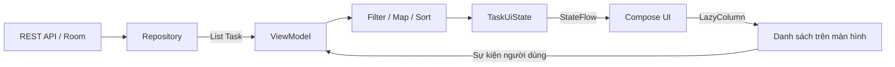
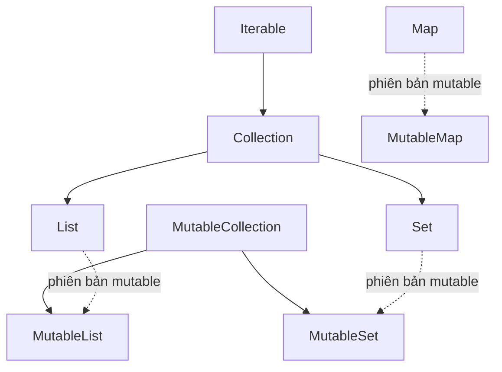
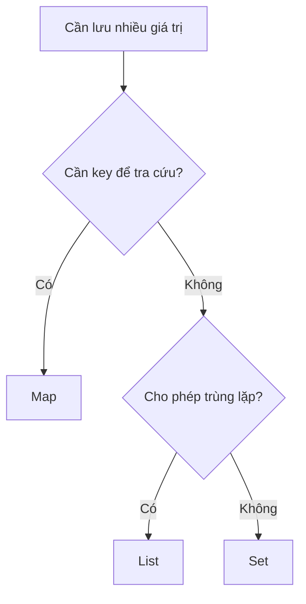
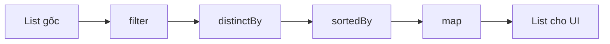
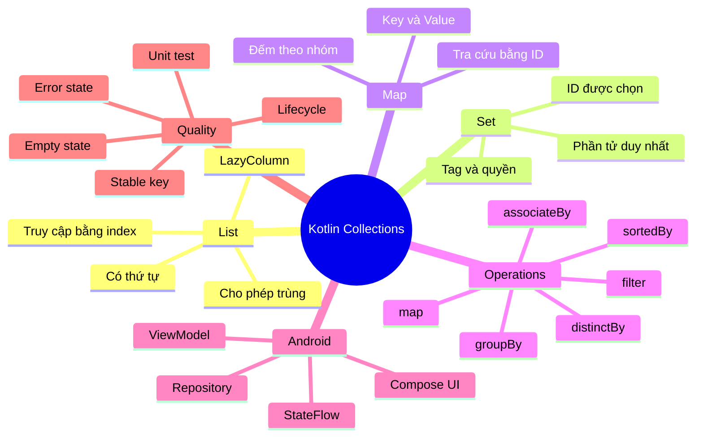

[![\[Kotlin\] Collection](https://tse1.mm.bing.net/th/id/OIP.GBIn6xVxikefgQ2ZAy7kCgHaFj?r=0\&pid=Api)](https://velog.io/%40zirryo/Kotlin-Collection?utm_source=chatgpt.com)

# 010 — Collections trong Kotlin và Android

| Thông tin               | Nội dung                               |
| ----------------------- | -------------------------------------- |
| **Học phần**            | 01 — Language and Android Fundamentals |
| **Module**              | Module 01 — Pick a Language            |
| **Nhóm nội dung**       | Kotlin Essentials                      |
| **Nguồn roadmap**       | Pick a Language / Kotlin Essentials    |
| **Loại bài**            | Lesson                                 |
| **Thứ tự trong module** | 010                                    |
| **Thời lượng gợi ý**    | 24 phút                                |

---

## 1. Tóm tắt

**Collection** là cấu trúc dùng để tập hợp, tổ chức và xử lý nhiều giá trị trong Kotlin. Trong ứng dụng Android, collection xuất hiện ở gần như mọi tầng:

* Danh sách bài viết lấy từ API.
* Danh sách sản phẩm hiển thị bằng `LazyColumn`.
* Tập hợp ID của các mục được chọn.
* Bảng ánh xạ mã lỗi sang thông báo.
* Danh sách dữ liệu được lưu trong Room.
* Trạng thái màn hình được giữ trong `ViewModel`.
* Danh sách kết quả do `Repository` trả về.

Ba loại collection quan trọng nhất là:

* `List`: tập hợp có thứ tự, cho phép phần tử trùng nhau.
* `Set`: tập hợp các phần tử không trùng nhau.
* `Map`: ánh xạ mỗi khóa tới một giá trị.

Kotlin cung cấp nhiều toán tử như `filter`, `map`, `sortedBy`, `groupBy`, `associateBy` và `distinctBy`, giúp xử lý dữ liệu theo phong cách ngắn gọn, dễ đọc và ít lỗi hơn. ([Kotlin][1])

---

## 2. Mục tiêu học tập

Sau bài học, bạn có thể:

* Giải thích được Collection là gì.
* Phân biệt `List`, `Set` và `Map`.
* Phân biệt collection chỉ đọc và collection có thể thay đổi.
* Hiểu sự khác nhau giữa `val` và tính mutable của collection.
* Sử dụng các hàm `filter`, `map`, `sortedBy`, `groupBy` và `associateBy`.
* Đưa collection từ `Repository` qua `ViewModel` tới giao diện.
* Cập nhật danh sách trong `StateFlow` mà không sửa trực tiếp trạng thái cũ.
* Viết unit test cho logic xử lý collection.
* Nhận biết lỗi phổ biến ảnh hưởng đến UX, độ ổn định và hiệu năng.

---

## 3. Collection nằm ở đâu trong ứng dụng Android?



Trong kiến trúc Android hiện đại:

1. `Repository` đọc dữ liệu từ API, database hoặc cache.
2. Dữ liệu thường được trả về dưới dạng `List<Model>`.
3. `ViewModel` lọc, sắp xếp hoặc chuyển đổi dữ liệu.
4. Kết quả được đặt vào một đối tượng UI state.
5. UI quan sát state và hiển thị danh sách.
6. Khi người dùng tương tác, `ViewModel` tạo state mới.

Android khuyến nghị để state holder như `ViewModel` tạo và quản lý UI state, sau đó cung cấp state cho UI bằng một observable data holder như `StateFlow`. Cách tổ chức này giúp giao diện đơn giản hơn, dễ kiểm thử hơn và giảm việc logic bị phân tán trong Composable. ([Android Developers][2])

---

## 4. Khái niệm Collection

Collection là một đối tượng chứa nhiều phần tử để chương trình có thể:

* Duyệt qua dữ liệu.
* Tìm kiếm phần tử.
* Lọc dữ liệu.
* Sắp xếp dữ liệu.
* Chuyển đổi dữ liệu.
* Nhóm dữ liệu.
* Thêm hoặc xóa phần tử nếu collection cho phép thay đổi.

Ví dụ:

```kotlin
val usernames = listOf("An", "Bình", "Chi")
```

Trong ví dụ trên:

* Collection là `usernames`.
* Kiểu collection là `List<String>`.
* Các phần tử là `"An"`, `"Bình"` và `"Chi"`.
* Thứ tự phần tử được giữ nguyên.
* Có thể truy cập phần tử bằng chỉ số.

```kotlin
println(usernames[0]) // An
println(usernames.size) // 3
```

Collection giúp ứng dụng xử lý số lượng dữ liệu thay đổi linh hoạt, chẳng hạn danh bạ, kết quả tìm kiếm, cài đặt hoặc danh sách bài viết. ([Android Developers][3])

---

## 5. Hệ thống Collection trong Kotlin



> `Map` thường được học cùng các collection, nhưng nó không kế thừa trực tiếp từ interface `Collection`.

Kotlin chia collection thành hai nhóm interface:

* **Read-only interface:** chỉ cung cấp thao tác đọc.
* **Mutable interface:** bổ sung thao tác thêm, xóa hoặc cập nhật phần tử. ([Kotlin][4])

---

## 6. Ba loại Collection chính

### 6.1. `List`

`List` phù hợp khi:

* Thứ tự phần tử có ý nghĩa.
* Cần truy cập bằng index.
* Cho phép phần tử trùng nhau.
* Cần hiển thị danh sách trên UI.

```kotlin
val notifications = listOf(
    "Có tin nhắn mới",
    "Có bản cập nhật",
    "Có tin nhắn mới"
)

println(notifications[0])
println(notifications.size)
```

Kết quả:

```text
Có tin nhắn mới
3
```

Hai chuỗi giống nhau vẫn được giữ lại vì `List` cho phép phần tử trùng nhau.

Ví dụ Android:

```kotlin
data class Article(
    val id: Long,
    val title: String
)

val articles: List<Article> = listOf(
    Article(1, "Kotlin cơ bản"),
    Article(2, "Jetpack Compose"),
    Article(3, "Android Architecture")
)
```

`List` là loại collection tích hợp được sử dụng rất phổ biến trong Kotlin, đặc biệt với các dữ liệu có thứ tự. ([Kotlin][5])

---

### 6.2. `Set`

`Set` phù hợp khi:

* Không muốn phần tử bị trùng.
* Chỉ quan tâm một giá trị có tồn tại hay không.
* Quản lý tag, quyền, ID đã chọn hoặc danh sách yêu thích.

```kotlin
val selectedIds = setOf(10L, 20L, 20L, 30L)

println(selectedIds)
```

Kết quả:

```text
[10, 20, 30]
```

Giá trị `20L` chỉ xuất hiện một lần.

Ví dụ quản lý bộ lọc:

```kotlin
val selectedCategories = setOf(
    "Android",
    "Kotlin",
    "Compose"
)

val isKotlinSelected = "Kotlin" in selectedCategories
```

Các toán tử tập hợp thường dùng:

```kotlin
val localTags = setOf("Kotlin", "Android")
val remoteTags = setOf("Android", "Compose")

val allTags = localTags union remoteTags
val commonTags = localTags intersect remoteTags
val localOnly = localTags subtract remoteTags
```

Kotlin cung cấp các phép hợp, giao và hiệu cho `Set`. ([Kotlin][6])

---

### 6.3. `Map`

`Map` lưu dữ liệu theo cặp:

```text
key → value
```

`Map` phù hợp khi:

* Cần tra cứu dữ liệu bằng ID hoặc mã.
* Ánh xạ enum sang nhãn hiển thị.
* Đếm số lượng phần tử theo từng nhóm.
* Lưu cấu hình theo tên thuộc tính.

```kotlin
val errorMessages = mapOf(
    401 to "Bạn chưa đăng nhập",
    403 to "Bạn không có quyền truy cập",
    404 to "Không tìm thấy dữ liệu"
)

println(errorMessages[404])
```

Ví dụ ánh xạ đối tượng bằng ID:

```kotlin
val articleById: Map<Long, Article> = articles.associateBy { article ->
    article.id
}

val selectedArticle = articleById[2L]
```

Kết quả:

```text
Article(id=2, title=Jetpack Compose)
```

---

## 7. So sánh `List`, `Set` và `Map`

| Tiêu chí               | `List`                 | `Set`              | `Map`                    |
| ---------------------- | ---------------------- | ------------------ | ------------------------ |
| Kiểu dữ liệu           | Danh sách phần tử      | Tập hợp phần tử    | Cặp khóa – giá trị       |
| Giữ thứ tự             | Có, tùy implementation | Tùy implementation | Tùy implementation       |
| Cho phép phần tử trùng | Có                     | Không              | Khóa không trùng         |
| Truy cập bằng index    | Có                     | Không              | Không                    |
| Truy cập bằng key      | Không                  | Không              | Có                       |
| Trường hợp sử dụng     | Danh sách bài viết     | ID được chọn       | Tra cứu bài viết theo ID |
| Hàm khởi tạo           | `listOf()`             | `setOf()`          | `mapOf()`                |
| Phiên bản mutable      | `mutableListOf()`      | `mutableSetOf()`   | `mutableMapOf()`         |

### Quy tắc chọn nhanh



---

## 8. Read-only và Mutable Collection

### 8.1. Collection chỉ đọc

```kotlin
val names: List<String> = listOf("An", "Bình", "Chi")
```

Có thể đọc:

```kotlin
println(names[0])
println(names.size)
println("An" in names)
```

Không thể gọi trực tiếp:

```kotlin
// names.add("Dũng")
// names.remove("An")
```

### 8.2. Mutable Collection

```kotlin
val names: MutableList<String> = mutableListOf(
    "An",
    "Bình",
    "Chi"
)

names.add("Dũng")
names.remove("Bình")
names[0] = "An Khánh"
```

Sau khi thay đổi:

```text
[An Khánh, Chi, Dũng]
```

---

## 9. `val` không có nghĩa là đối tượng bất biến

Đây là điểm người mới rất dễ nhầm.

```kotlin
val tasks = mutableListOf("Học Kotlin")
tasks.add("Học Compose")
```

Đoạn mã trên hợp lệ.

`val` chỉ có nghĩa là biến `tasks` không thể được gán sang một đối tượng khác:

```kotlin
// Không hợp lệ
// tasks = mutableListOf("Task mới")
```

Nhưng nội dung của `MutableList` vẫn có thể thay đổi.

### So sánh

```kotlin
val readOnlyList = listOf("A", "B")
val mutableList = mutableListOf("A", "B")

// readOnlyList.add("C") // Không có hàm add
mutableList.add("C")    // Hợp lệ
```

> `List<T>` trong Kotlin là interface chỉ đọc, nhưng không phải cam kết rằng đối tượng bên dưới hoàn toàn immutable.

Ví dụ:

```kotlin
val mutableSource = mutableListOf("A", "B")
val readOnlyView: List<String> = mutableSource

mutableSource.add("C")

println(readOnlyView) // [A, B, C]
```

`readOnlyView` không thể tự gọi `add()`, nhưng vẫn nhìn thấy thay đổi được thực hiện qua `mutableSource`.

### Tạo snapshot độc lập hơn

```kotlin
val snapshot = mutableSource.toList()
mutableSource.add("D")

println(snapshot) // [A, B, C]
```

`toList()` tạo một danh sách mới, nhưng đây vẫn là **shallow copy**. Nếu phần tử bên trong là object mutable, các object đó vẫn có thể bị thay đổi.

Trong UI state, nên ưu tiên:

* `data class` có thuộc tính `val`.
* Expose `List<T>` thay vì `MutableList<T>`.
* Tạo state mới thay vì sửa state cũ trực tiếp.
* Không để UI sửa collection thuộc về `ViewModel`.

---

## 10. Các thao tác Collection quan trọng

Giả sử có model:

```kotlin
enum class Priority {
    LOW,
    MEDIUM,
    HIGH
}

data class Task(
    val id: Long,
    val title: String,
    val priority: Priority,
    val isDone: Boolean,
    val tags: List<String>
)
```

Dữ liệu mẫu:

```kotlin
val tasks = listOf(
    Task(
        id = 1,
        title = "Học Collections",
        priority = Priority.HIGH,
        isDone = false,
        tags = listOf("Kotlin", "Android")
    ),
    Task(
        id = 2,
        title = "Viết unit test",
        priority = Priority.MEDIUM,
        isDone = true,
        tags = listOf("Testing")
    ),
    Task(
        id = 3,
        title = "Tạo màn hình Compose",
        priority = Priority.HIGH,
        isDone = false,
        tags = listOf("Android", "Compose")
    )
)
```

---

### 10.1. `filter` — lọc phần tử

```kotlin
val unfinishedTasks = tasks.filter { task ->
    !task.isDone
}
```

`tasks` không bị thay đổi. `filter` trả về một danh sách mới.

---

### 10.2. `map` — chuyển đổi phần tử

```kotlin
val taskTitles: List<String> = tasks.map { task ->
    task.title
}
```

Kết quả:

```text
[
    "Học Collections",
    "Viết unit test",
    "Tạo màn hình Compose"
]
```

---

### 10.3. `mapNotNull` — chuyển đổi và loại bỏ `null`

```kotlin
val highPriorityTitles = tasks.mapNotNull { task ->
    if (task.priority == Priority.HIGH) {
        task.title
    } else {
        null
    }
}
```

---

### 10.4. `sortedBy` và `sortedByDescending`

```kotlin
val sortedByTitle = tasks.sortedBy { task ->
    task.title
}

val newestFirst = tasks.sortedByDescending { task ->
    task.id
}
```

Các hàm `sorted...` trả về collection mới.

---

### 10.5. `distinctBy` — loại bỏ phần tử trùng theo thuộc tính

```kotlin
val tasksFromMultipleSources = listOf(
    tasks[0],
    tasks[1],
    tasks[0]
)

val uniqueTasks = tasksFromMultipleSources.distinctBy { task ->
    task.id
}
```

---

### 10.6. `flatMap` — gom các collection con

Mỗi task có một danh sách tag:

```kotlin
val allTags = tasks.flatMap { task ->
    task.tags
}
```

Kết quả có thể chứa tag trùng:

```text
[Kotlin, Android, Testing, Android, Compose]
```

Kết hợp với `toSet()`:

```kotlin
val uniqueTags: Set<String> = tasks
    .flatMap { task -> task.tags }
    .toSet()
```

Kết quả:

```text
[Kotlin, Android, Testing, Compose]
```

---

### 10.7. `associateBy` — tạo Map theo khóa

```kotlin
val taskById: Map<Long, Task> = tasks.associateBy { task ->
    task.id
}
```

Tra cứu:

```kotlin
val task = taskById[3L]
```

> Khi nhiều phần tử tạo ra cùng một key, giá trị xuất hiện sau có thể thay thế giá trị trước. Vì vậy, cần bảo đảm key thực sự duy nhất.

---

### 10.8. `groupBy` — nhóm phần tử

```kotlin
val tasksByPriority: Map<Priority, List<Task>> =
    tasks.groupBy { task ->
        task.priority
    }
```

Dữ liệu tạo ra có dạng:

```text
HIGH   → [Task 1, Task 3]
MEDIUM → [Task 2]
```

---

### 10.9. `groupingBy` và `eachCount` — đếm theo nhóm

```kotlin
val countByPriority: Map<Priority, Int> = tasks
    .groupingBy { task -> task.priority }
    .eachCount()
```

Kết quả:

```text
HIGH   → 2
MEDIUM → 1
```

---

### 10.10. Tìm kiếm an toàn

Không nên dùng `first()` khi collection có thể rỗng:

```kotlin
val task = tasks.first { it.id == 100L }
```

Đoạn mã trên ném exception nếu không tìm thấy.

Nên dùng:

```kotlin
val task: Task? = tasks.firstOrNull { it.id == 100L }
```

Xử lý kết quả:

```kotlin
val title = task?.title ?: "Không tìm thấy task"
```

Một số hàm an toàn khác:

```kotlin
val firstTask = tasks.firstOrNull()
val lastTask = tasks.lastOrNull()
val taskAtIndex = tasks.getOrNull(10)
```

---

## 11. Bảng thao tác thường dùng

| Mục đích           | Hàm Kotlin                                  |
| ------------------ | ------------------------------------------- |
| Lọc phần tử        | `filter`, `filterNot`, `filterIsInstance`   |
| Chuyển đổi         | `map`, `mapIndexed`, `mapNotNull`           |
| Kiểm tra tồn tại   | `any`, `none`, `all`, `contains`            |
| Tìm một phần tử    | `find`, `firstOrNull`, `singleOrNull`       |
| Sắp xếp            | `sorted`, `sortedBy`, `sortedByDescending`  |
| Loại bỏ trùng      | `distinct`, `distinctBy`, `toSet`           |
| Nhóm dữ liệu       | `groupBy`, `groupingBy`                     |
| Tạo Map            | `associate`, `associateBy`, `associateWith` |
| Gom collection con | `flatten`, `flatMap`                        |
| Tính toán          | `sum`, `sumOf`, `count`, `average`, `fold`  |
| Chia danh sách     | `take`, `drop`, `chunked`, `windowed`       |

Thư viện chuẩn Kotlin cung cấp các thao tác từ truy xuất, lọc, sắp xếp đến biến đổi và tổng hợp collection. Một số hàm tạo collection mới, trong khi các hàm mutable tương ứng có thể thay đổi collection tại chỗ. ([Kotlin][1])

---

## 12. Xây dựng pipeline xử lý dữ liệu

Một pipeline collection thường có dạng:



Ví dụ:

```kotlin
val visibleTaskTitles = tasks
    .filter { task -> !task.isDone }
    .distinctBy { task -> task.id }
    .sortedBy { task -> task.title }
    .map { task -> task.title }
```

Nên xuống dòng sau mỗi toán tử để dễ đọc:

```kotlin
val result = tasks
    .filter { !it.isDone }
    .sortedBy { it.title }
    .map { it.title }
```

Thay vì viết thành một dòng dài:

```kotlin
val result = tasks.filter { !it.isDone }.sortedBy { it.title }.map { it.title }
```

---

## 13. Ví dụ Android: Danh sách công việc với ViewModel

### 13.1. UI state

```kotlin
data class TaskUiState(
    val tasks: List<Task> = emptyList(),
    val selectedTaskIds: Set<Long> = emptySet(),
    val countByPriority: Map<Priority, Int> = emptyMap(),
    val isLoading: Boolean = false,
    val errorMessage: String? = null
)
```

Mỗi loại collection có một vai trò:

| Thuộc tính        | Kiểu                 | Lý do                          |
| ----------------- | -------------------- | ------------------------------ |
| `tasks`           | `List<Task>`         | Dữ liệu có thứ tự để hiển thị  |
| `selectedTaskIds` | `Set<Long>`          | Không cho ID bị trùng          |
| `countByPriority` | `Map<Priority, Int>` | Tra cứu số lượng theo priority |

---

### 13.2. ViewModel

```kotlin
class TaskViewModel : ViewModel() {

    private val _uiState = MutableStateFlow(TaskUiState())

    val uiState: StateFlow<TaskUiState> =
        _uiState.asStateFlow()

    fun replaceTasks(tasks: List<Task>) {
        val normalizedTasks = tasks
            .distinctBy { task -> task.id }
            .sortedBy { task -> task.title }

        val countByPriority = normalizedTasks
            .groupingBy { task -> task.priority }
            .eachCount()

        _uiState.update { currentState ->
            currentState.copy(
                tasks = normalizedTasks,
                countByPriority = countByPriority,
                isLoading = false,
                errorMessage = null
            )
        }
    }

    fun toggleTaskSelection(taskId: Long) {
        _uiState.update { currentState ->
            val updatedIds =
                if (taskId in currentState.selectedTaskIds) {
                    currentState.selectedTaskIds - taskId
                } else {
                    currentState.selectedTaskIds + taskId
                }

            currentState.copy(
                selectedTaskIds = updatedIds
            )
        }
    }

    fun toggleTaskDone(taskId: Long) {
        _uiState.update { currentState ->
            val updatedTasks = currentState.tasks.map { task ->
                if (task.id == taskId) {
                    task.copy(isDone = !task.isDone)
                } else {
                    task
                }
            }

            currentState.copy(tasks = updatedTasks)
        }
    }
}
```

### Điểm quan trọng

Không sửa trực tiếp collection cũ:

```kotlin
// Không nên thiết kế state theo cách này
currentState.tasks.add(newTask)
```

Thay vào đó, tạo collection mới:

```kotlin
currentState.copy(
    tasks = currentState.tasks + newTask
)
```

Cách cập nhật này:

* Giữ luồng dữ liệu rõ ràng.
* Giúp quan sát thay đổi state dễ hơn.
* Hạn chế lỗi UI không cập nhật.
* Dễ so sánh state trước và sau.
* Dễ viết unit test.

---

### 13.3. Jetpack Compose UI

```kotlin
@Composable
fun TaskScreen(
    viewModel: TaskViewModel = viewModel()
) {
    val uiState by viewModel.uiState.collectAsStateWithLifecycle()

    LazyColumn {
        items(
            items = uiState.tasks,
            key = { task -> task.id }
        ) { task ->
            TaskRow(
                task = task,
                isSelected = task.id in uiState.selectedTaskIds,
                onTaskClick = {
                    viewModel.toggleTaskSelection(task.id)
                },
                onDoneClick = {
                    viewModel.toggleTaskDone(task.id)
                }
            )
        }
    }
}
```

`key` giúp Compose xác định ổn định từng phần tử khi collection được thêm, xóa hoặc sắp xếp lại:

```kotlin
key = { task -> task.id }
```

UI nên thu thập state theo lifecycle thay vì tự tạo coroutine không gắn với vòng đời. Android hiện khuyến nghị lifecycle-aware UI state collection. ([Android Developers][7])

---

## 14. Collection và Lifecycle

Collection không tự giải quyết lifecycle.

Nếu danh sách chỉ được giữ trong một Composable hoặc biến của `Activity`, dữ liệu có thể được tạo lại khi:

* Xoay màn hình.
* Chuyển chế độ sáng/tối.
* Thay đổi ngôn ngữ.
* Hệ thống tái tạo Activity.
* Người dùng chuyển ứng dụng sang background rồi quay lại.

### Không nên

```kotlin
@Composable
fun TaskScreen() {
    val tasks = mutableListOf<Task>()

    // Danh sách này không phải screen state bền vững.
}
```

### Nên

```text
Repository
   ↓
ViewModel
   ↓
StateFlow<TaskUiState>
   ↓
collectAsStateWithLifecycle()
   ↓
Compose UI
```

`ViewModel` phù hợp để giữ dữ liệu liên quan đến màn hình qua quá trình Activity được hủy và tạo lại do configuration change. Tuy nhiên, dữ liệu cần sống qua process death vẫn phải được lưu bằng `SavedStateHandle`, Room, DataStore hoặc nguồn dữ liệu bền vững phù hợp. ([Android Developers][8])

---

## 15. Collection ảnh hưởng đến UX như thế nào?

### 15.1. Hiển thị sai thứ tự

Nếu API trả về dữ liệu không theo thứ tự mong muốn:

```kotlin
val sortedArticles = articles.sortedByDescending { article ->
    article.publishedAt
}
```

Nếu không sắp xếp, người dùng có thể thấy bài cũ trước bài mới.

---

### 15.2. Phần tử bị trùng

Khi kết hợp cache và API:

```kotlin
val mergedArticles = (cachedArticles + remoteArticles)
    .distinctBy { article -> article.id }
```

Nếu không loại bỏ trùng, người dùng có thể thấy cùng một bài viết nhiều lần.

---

### 15.3. UI bị đứng

Không nên thực hiện pipeline nặng trên main thread với hàng chục nghìn phần tử:

```kotlin
val result = veryLargeList
    .filter { expensiveCheck(it) }
    .sortedBy { expensiveValue(it) }
```

Logic lớn nên được chuyển sang data layer, background dispatcher hoặc database query phù hợp.

---

### 15.4. Mất trạng thái chọn

Nếu trạng thái chọn chỉ được lưu trong từng item UI, việc sắp xếp hoặc tải lại danh sách có thể làm mất trạng thái.

Nên lưu ID đã chọn:

```kotlin
val selectedTaskIds: Set<Long>
```

Thay vì phụ thuộc vào vị trí:

```kotlin
val selectedIndexes: Set<Int>
```

Index có thể thay đổi sau khi sort, filter hoặc insert.

---

### 15.5. Thông báo lỗi không rõ ràng

Không nên biến lỗi thành danh sách rỗng mà không phân biệt:

```kotlin
val tasks = runCatching {
    repository.getTasks()
}.getOrDefault(emptyList())
```

UI sẽ không biết:

* Thực sự không có dữ liệu.
* Hay request đã thất bại.

Nên biểu diễn riêng:

```kotlin
data class TaskUiState(
    val tasks: List<Task> = emptyList(),
    val isLoading: Boolean = false,
    val errorMessage: String? = null
)
```

---

## 16. Những lỗi phổ biến của lập trình viên junior

### Lỗi 1: Dùng `MutableList` ở mọi nơi

```kotlin
data class TaskUiState(
    val tasks: MutableList<Task>
)
```

Vấn đề:

* Bất kỳ nơi nào giữ reference cũng có thể sửa state.
* Khó xác định đoạn mã nào đã thay đổi dữ liệu.
* Unit test khó kiểm soát.
* UI có thể không nhận được state mới.

Nên dùng:

```kotlin
data class TaskUiState(
    val tasks: List<Task> = emptyList()
)
```

---

### Lỗi 2: Sửa collection rồi phát lại cùng object

```kotlin
val currentTasks = _uiState.value.tasks as MutableList
currentTasks.add(newTask)

_uiState.value = _uiState.value
```

Nên tạo object mới:

```kotlin
_uiState.update { state ->
    state.copy(
        tasks = state.tasks + newTask
    )
}
```

---

### Lỗi 3: Sử dụng `!!` sau khi tìm kiếm

```kotlin
val task = tasks.firstOrNull { it.id == id }!!
```

Nếu task không tồn tại, ứng dụng crash.

Nên xử lý an toàn:

```kotlin
val task = tasks.firstOrNull { it.id == id }
    ?: return
```

Hoặc:

```kotlin
val task = tasks.firstOrNull { it.id == id }
    ?: throw IllegalArgumentException("Task $id không tồn tại")
```

Lựa chọn phụ thuộc vào nghiệp vụ.

---

### Lỗi 4: Dùng `first()` với dữ liệu không chắc chắn

```kotlin
val firstResult = searchResults.first()
```

Nếu không có kết quả, app ném `NoSuchElementException`.

Nên dùng:

```kotlin
val firstResult = searchResults.firstOrNull()
```

---

### Lỗi 5: Dùng index làm ID

```kotlin
itemsIndexed(tasks) { index, task ->
    TaskRow(
        key = index
    )
}
```

Sau khi xóa hoặc sắp xếp, index của các item thay đổi.

Nên sử dụng ID ổn định:

```kotlin
items(
    items = tasks,
    key = { task -> task.id }
)
```

---

### Lỗi 6: Gọi nhiều pipeline giống nhau trong Composable

```kotlin
@Composable
fun TaskScreen(tasks: List<Task>) {
    val visibleTasks = tasks
        .filter { !it.isDone }
        .sortedBy { it.title }

    // Có thể chạy lại mỗi lần recomposition.
}
```

Với logic nghiệp vụ, nên xử lý trong `ViewModel`.

Với logic UI nhỏ, có thể sử dụng `remember` hoặc `derivedStateOf` đúng trường hợp:

```kotlin
val visibleTasks = remember(tasks) {
    tasks
        .filter { !it.isDone }
        .sortedBy { it.title }
}
```

---

### Lỗi 7: Dùng `map` chỉ để tạo side effect

Không nên:

```kotlin
tasks.map { task ->
    println(task.title)
}
```

`map` có ý nghĩa tạo một collection mới.

Nên dùng:

```kotlin
tasks.forEach { task ->
    println(task.title)
}
```

---

### Lỗi 8: Lồng nhiều vòng lặp tra cứu

```kotlin
orders.map { order ->
    users.firstOrNull { user ->
        user.id == order.userId
    }
}
```

Với dữ liệu lớn, nên tạo `Map` tra cứu trước:

```kotlin
val userById = users.associateBy { user ->
    user.id
}

val orderOwners = orders.map { order ->
    userById[order.userId]
}
```

---

## 17. Kiểm thử logic Collection

Nên tách logic xử lý collection thành hàm Kotlin thuần.

### Hàm cần kiểm thử

```kotlin
fun prepareTasksForDisplay(
    tasks: List<Task>
): List<Task> {
    return tasks
        .filter { task -> !task.isDone }
        .distinctBy { task -> task.id }
        .sortedBy { task -> task.title }
}
```

### Unit test

```kotlin
class TaskCollectionTest {

    @Test
    fun prepareTasksForDisplay_removesDoneAndDuplicateTasks() {
        val input = listOf(
            Task(
                id = 2,
                title = "Compose",
                priority = Priority.HIGH,
                isDone = false,
                tags = emptyList()
            ),
            Task(
                id = 1,
                title = "Android",
                priority = Priority.MEDIUM,
                isDone = false,
                tags = emptyList()
            ),
            Task(
                id = 1,
                title = "Android duplicate",
                priority = Priority.MEDIUM,
                isDone = false,
                tags = emptyList()
            ),
            Task(
                id = 3,
                title = "Đã hoàn thành",
                priority = Priority.LOW,
                isDone = true,
                tags = emptyList()
            )
        )

        val result = prepareTasksForDisplay(input)

        assertEquals(listOf(1L, 2L), result.map { it.id })
        assertTrue(result.none { it.isDone })
    }
}
```

### Các test case nên có

* Collection rỗng.
* Collection chỉ có một phần tử.
* Có ID trùng nhau.
* Không tìm thấy phần tử.
* Tất cả phần tử bị filter.
* Dữ liệu đã được sắp xếp.
* Dữ liệu có giá trị `null` nếu model cho phép.
* Collection có số lượng lớn.
* Hai phần tử có cùng giá trị dùng để sort.
* Repository trả về lỗi thay vì danh sách.

---

## 18. Debugging Collection

### In dữ liệu có cấu trúc

```kotlin
tasks.forEachIndexed { index, task ->
    Log.d(
        "TaskDebug",
        "index=$index, id=${task.id}, title=${task.title}"
    )
}
```

### Kiểm tra kích thước sau từng bước

```kotlin
val activeTasks = tasks.filter { !it.isDone }

Log.d(
    "TaskDebug",
    "before=${tasks.size}, after=${activeTasks.size}"
)
```

### Kiểm tra ID trùng

```kotlin
val duplicateIds = tasks
    .groupingBy { task -> task.id }
    .eachCount()
    .filterValues { count -> count > 1 }

Log.d("TaskDebug", "duplicateIds=$duplicateIds")
```

### Kiểm tra dữ liệu giữa các tầng

```text
API response size
        ↓
Repository result size
        ↓
ViewModel UI state size
        ↓
LazyColumn item count
```

Nếu API có 20 phần tử nhưng UI chỉ có 15, cần kiểm tra:

* `filter`.
* `distinctBy`.
* Pagination.
* Mapping DTO sang domain model.
* Database conflict strategy.
* State bị ghi đè bởi request cũ.
* UI đang hiển thị một subset.

---

## 19. Tối ưu hiệu năng

### 19.1. Không tối ưu quá sớm

Với collection nhỏ, nên ưu tiên:

* Code dễ hiểu.
* Hàm ngắn.
* Logic có test.
* Tên biến rõ ràng.

```kotlin
val visibleTasks = tasks
    .filter { !it.isDone }
    .sortedBy { it.title }
```

Không cần chuyển mọi pipeline sang `Sequence`.

---

### 19.2. Khi nào cân nhắc `Sequence`?

Có thể cân nhắc khi:

* Collection lớn.
* Có nhiều bước xử lý nối tiếp.
* Chỉ cần lấy một phần kết quả.
* Muốn tránh tạo nhiều collection trung gian.

```kotlin
val result = tasks
    .asSequence()
    .filter { task -> !task.isDone }
    .map { task -> task.title }
    .take(20)
    .toList()
```

Tuy nhiên, `Sequence` cũng có overhead riêng. Cần benchmark nếu đây thực sự là điểm nghẽn.

---

### 19.3. Đưa việc lọc vào database khi phù hợp

Không nên tải toàn bộ database rồi mới lọc:

```kotlin
val allTasks = dao.getAllTasks()
val highPriorityTasks = allTasks.filter {
    it.priority == Priority.HIGH
}
```

Với bảng lớn, nên để Room hoặc SQL lọc:

```sql
SELECT *
FROM tasks
WHERE priority = 'HIGH'
ORDER BY title ASC
```

---

### 19.4. Sử dụng Paging cho danh sách lớn

Không nên tải hàng nghìn mục trong một lần chỉ để hiển thị một số item đầu tiên.

Luồng phù hợp:

```text
Database/API
    ↓
PagingSource
    ↓
Pager
    ↓
PagingData
    ↓
LazyPagingItems
    ↓
LazyColumn
```

---

## 20. Thực hành trong 24 phút

### Phút 0–4: Khái niệm

Tạo file Kotlin:

```text
CollectionsPractice.kt
```

Khai báo:

```kotlin
val list = listOf("A", "B", "A")
val set = setOf("A", "B", "A")
val map = mapOf(1 to "A", 2 to "B")
```

Quan sát kết quả của từng collection.

---

### Phút 4–9: Mutable và read-only

```kotlin
val readOnlyTasks = listOf("Task 1")
val mutableTasks = mutableListOf("Task 1")

mutableTasks.add("Task 2")
mutableTasks.remove("Task 1")
```

Trả lời:

1. Vì sao `readOnlyTasks.add()` không tồn tại?
2. Vì sao `mutableTasks` dùng `val` vẫn gọi được `add()`?
3. `List` có đồng nghĩa với immutable hoàn toàn không?

---

### Phút 9–15: Collection operations

```kotlin
val numbers = listOf(1, 2, 3, 4, 5, 6)

val result = numbers
    .filter { number -> number % 2 == 0 }
    .map { number -> number * number }
    .sortedDescending()

println(result)
```

Kết quả:

```text
[36, 16, 4]
```

---

### Phút 15–20: Android use case

Tạo:

```kotlin
data class Contact(
    val id: Long,
    val name: String,
    val isFavorite: Boolean
)
```

Thực hiện:

```kotlin
fun getFavoriteContacts(
    contacts: List<Contact>
): List<Contact> {
    return contacts
        .filter { contact -> contact.isFavorite }
        .distinctBy { contact -> contact.id }
        .sortedBy { contact -> contact.name }
}
```

---

### Phút 20–24: Test và README

Viết ít nhất ba test:

* Danh sách rỗng.
* Loại bỏ contact không yêu thích.
* Loại bỏ ID trùng và sắp xếp theo tên.

Sau đó thêm ví dụ vào README.

---

## 21. Ghi chú 5 dòng về Collections

> Collection là cấu trúc giúp Kotlin lưu và xử lý nhiều giá trị.
> `List` dùng cho dữ liệu có thứ tự và cho phép trùng lặp.
> `Set` dùng khi mỗi phần tử phải là duy nhất.
> `Map` dùng để tra cứu giá trị thông qua một khóa.
> Trong Android, nên đưa collection vào UI state và cập nhật bằng cách tạo state mới.

---

## 22. Bài tập

### Bài tập 1 — Cơ bản

Cho danh sách:

```kotlin
val scores = listOf(8, 5, 10, 7, 5, 9, 10)
```

Hãy:

1. Lấy các điểm từ 8 trở lên.
2. Loại bỏ điểm trùng.
3. Sắp xếp giảm dần.
4. Chuyển điểm thành chuỗi `"Điểm: X"`.

Kết quả mong đợi:

```text
[Điểm: 10, Điểm: 9, Điểm: 8]
```

---

### Bài tập 2 — Android

Tạo model:

```kotlin
data class Product(
    val id: Long,
    val name: String,
    val category: String,
    val price: Double,
    val inStock: Boolean
)
```

Viết các hàm:

```kotlin
fun getAvailableProducts(
    products: List<Product>
): List<Product>

fun groupProductsByCategory(
    products: List<Product>
): Map<String, List<Product>>

fun getProductById(
    products: List<Product>,
    id: Long
): Product?
```

Yêu cầu:

* Chỉ hiển thị sản phẩm còn hàng.
* Không hiển thị ID trùng.
* Sắp xếp sản phẩm theo giá tăng dần.
* Không sử dụng `!!`.

---

### Bài tập 3 — Nâng cao

Tạo `ProductUiState`:

```kotlin
data class ProductUiState(
    val products: List<Product> = emptyList(),
    val selectedProductIds: Set<Long> = emptySet(),
    val productById: Map<Long, Product> = emptyMap(),
    val isLoading: Boolean = false,
    val errorMessage: String? = null
)
```

Sau đó:

1. Viết `ProductViewModel`.
2. Expose state bằng `StateFlow`.
3. Viết hàm chọn hoặc bỏ chọn sản phẩm.
4. Hiển thị sản phẩm bằng `LazyColumn`.
5. Dùng product ID làm `key`.
6. Viết unit test cho thao tác chọn sản phẩm.

---

## 23. Artifact đưa vào Portfolio

Có thể tạo mini project:

```text
kotlin-collections-task-demo/
├── README.md
├── app/
│   └── src/
│       ├── main/
│       │   └── java/
│       │       ├── Task.kt
│       │       ├── TaskRepository.kt
│       │       ├── TaskViewModel.kt
│       │       └── TaskScreen.kt
│       └── test/
│           └── TaskCollectionTest.kt
└── screenshots/
    ├── task-list.png
    ├── filtered-list.png
    └── empty-state.png
```

### README nên có

```markdown
# Kotlin Collections Task Demo

## Mục tiêu

Minh họa cách sử dụng List, Set và Map trong ứng dụng Android.

## Collection được sử dụng

- List<Task>: danh sách công việc.
- Set<Long>: ID các công việc được chọn.
- Map<Priority, Int>: số công việc theo mức ưu tiên.

## Operations

- filter
- map
- distinctBy
- sortedBy
- groupingBy
- associateBy

## Kiến trúc

Repository → ViewModel → StateFlow → Compose UI

## Testing

- Empty list
- Duplicate IDs
- Sorting
- Selection state
- Repository error
```

### Điểm cộng cho portfolio

* Có ảnh chụp màn hình.
* Có sơ đồ data flow.
* Có unit test.
* Có empty state và error state.
* Không expose `MutableList`.
* Có giải thích lựa chọn `List`, `Set`, `Map`.
* Có commit history rõ ràng.
* README mô tả tác động đến UX.

---

## 24. Checklist hoàn thành

### Kiến thức Kotlin

* [ ] Giải thích được Collection là gì.
* [ ] Phân biệt được `List`, `Set` và `Map`.
* [ ] Phân biệt được read-only và mutable collection.
* [ ] Hiểu rằng `val` không làm một object trở thành immutable.
* [ ] Biết sử dụng `filter`, `map` và `sortedBy`.
* [ ] Biết sử dụng `distinctBy`, `groupBy` và `associateBy`.
* [ ] Biết dùng `firstOrNull` thay cho `first` khi dữ liệu có thể rỗng.

### Android

* [ ] Đưa collection vào UI state.
* [ ] Quản lý screen state trong `ViewModel`.
* [ ] Expose state dưới dạng `StateFlow`.
* [ ] Thu thập state theo lifecycle.
* [ ] Dùng ID ổn định làm key cho `LazyColumn`.
* [ ] Không để Composable sửa collection của ViewModel.
* [ ] Phân biệt empty state và error state.

### Testing và debugging

* [ ] Có test cho collection rỗng.
* [ ] Có test cho phần tử trùng.
* [ ] Có test cho filter và sort.
* [ ] Có test cho phần tử không tồn tại.
* [ ] Có log số lượng dữ liệu giữa các tầng.
* [ ] Không sử dụng `!!` cho kết quả tìm kiếm.

### Portfolio

* [ ] Có code mẫu hoạt động.
* [ ] Có ít nhất một sơ đồ.
* [ ] Có screenshot.
* [ ] Có README.
* [ ] Có unit test.
* [ ] Giải thích được tác động đến UX và maintainability.

---

## 25. Checklist Production

Trước khi release tính năng sử dụng collection, hãy kiểm tra:

### Dữ liệu

* Collection có thể rỗng không?
* API có thể trả phần tử trùng không?
* ID có thực sự duy nhất không?
* Thứ tự dữ liệu có ổn định không?
* Có phần tử `null` hoặc thuộc tính thiếu không?
* Dữ liệu cache và remote được merge như thế nào?

### State

* Collection thuộc về tầng nào?
* Có expose `MutableList` ra ngoài ViewModel không?
* Khi cập nhật có tạo state mới không?
* State có giữ được khi rotate không?
* Dữ liệu có cần khôi phục sau process death không?
* Request cũ có thể ghi đè kết quả request mới không?

### UI và UX

* Có loading state không?
* Có empty state không?
* Có error state và retry không?
* Danh sách có giữ vị trí cuộn không?
* Khi sort hoặc filter, trạng thái chọn có còn đúng không?
* `LazyColumn` có sử dụng key ổn định không?

### Hiệu năng

* Có tải quá nhiều phần tử cùng lúc không?
* Có chạy pipeline nặng trên main thread không?
* Có filter dữ liệu mà database có thể filter trước không?
* Có cần Paging không?
* Có thực hiện cùng một phép tính sau mỗi recomposition không?
* Đã đo hiệu năng trước khi chuyển sang `Sequence` chưa?

### Testing

* Có test collection rỗng không?
* Có test dữ liệu trùng không?
* Có test lỗi network không?
* Có test khi người dùng đổi filter liên tục không?
* Có test configuration change không?
* Có test danh sách lớn hoặc pagination không?

---

## 26. Sơ đồ tổng kết



---

## 27. Ảnh và tài liệu minh họa phù hợp

Các trang sau có hình minh họa và sơ đồ phù hợp để chèn vào ghi chú hoặc README:

1. [Android Codelab — Use collections in Kotlin](https://developer.android.com/codelabs/basic-android-kotlin-collections)
   Minh họa collection thông qua danh sách, menu và các bài tập Kotlin thực tế.

2. [Kotlin Documentation — Collections overview](https://kotlinlang.org/docs/collections-overview.html)
   Tham khảo hệ thống interface `List`, `Set`, `Map` và mutable collection.

3. [Kotlin Documentation — Collection operations](https://kotlinlang.org/docs/collection-operations.html)
   Tham khảo các phép lọc, biến đổi, truy xuất và sắp xếp collection.

4. [Android Developers — UI state production](https://developer.android.com/topic/architecture/ui-layer/state-production)
   Có sơ đồ pipeline từ nguồn dữ liệu và sự kiện người dùng tới state holder.

5. [Android Developers — State holders and UI state](https://developer.android.com/topic/architecture/ui-layer/stateholders)
   Có sơ đồ luồng dữ liệu một chiều và vai trò của `ViewModel`.

6. [Android Developers — State hoisting trong Compose](https://developer.android.com/develop/ui/compose/state-hoisting)
   Có sơ đồ vị trí đặt state và cách chia sẻ state giữa các Composable.

---

## 28. Kết luận

Collections không chỉ là cú pháp Kotlin cơ bản. Chúng quyết định cách dữ liệu được:

* Lưu trữ.
* Lọc và sắp xếp.
* Chuyển từ data layer tới UI.
* Cập nhật trong `ViewModel`.
* Hiển thị trong danh sách.
* Kiểm thử và debug.
* Bảo vệ khỏi phần tử trùng hoặc trạng thái không nhất quán.

Quy tắc thực tế cần nhớ:

```text
Cần thứ tự và cho phép trùng → List
Cần phần tử duy nhất          → Set
Cần tra cứu bằng khóa         → Map
Cần UI state ổn định          → Read-only collection + state mới
Cần dữ liệu lớn               → Database query hoặc Paging
Cần tránh crash               → firstOrNull/getOrNull thay vì giả định
```

Một Android developer tốt không chỉ biết gọi `filter()` hoặc `map()`, mà còn phải biết collection đó thuộc tầng nào, ai có quyền thay đổi nó, UI quan sát thay đổi ra sao và test nào bảo vệ hành vi của danh sách.

[1]: https://kotlinlang.org/docs/collection-operations.html?utm_source=chatgpt.com "Collection operations overview | Kotlin Documentation"
[2]: https://developer.android.com/topic/architecture/ui-layer/stateholders?hl=en&utm_source=chatgpt.com "State holders and UI state  |  App architecture  |  Android Developers"
[3]: https://developer.android.com/codelabs/basic-android-kotlin-collections?hl=en&utm_source=chatgpt.com "Use collections in Kotlin  |  Android Developers"
[4]: https://kotlinlang.org/docs/collections-overview.html?utm_source=chatgpt.com "Collections overview | Kotlin Documentation"
[5]: https://kotlinlang.org/docs/list-operations.html?utm_source=chatgpt.com "List-specific operations | Kotlin Documentation"
[6]: https://kotlinlang.org/docs/set-operations.html?utm_source=chatgpt.com "Set-specific operations | Kotlin Documentation"
[7]: https://developer.android.com/topic/architecture/recommendations?hl=en&utm_source=chatgpt.com "Recommendations for Android architecture  |  App architecture  |  Android Developers"
[8]: https://developer.android.com/codelabs/basic-android-kotlin-compose-viewmodel-and-state?hl=en&utm_source=chatgpt.com "ViewModel and State in Compose  |  Android Developers"
