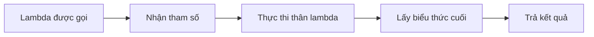
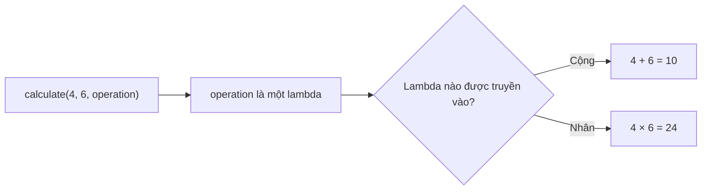
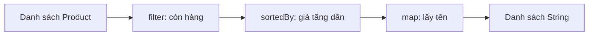
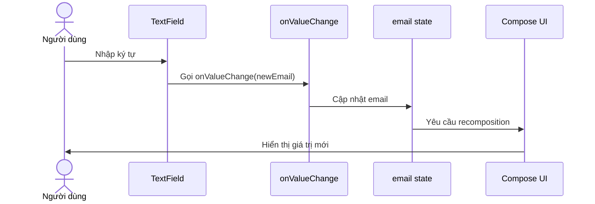
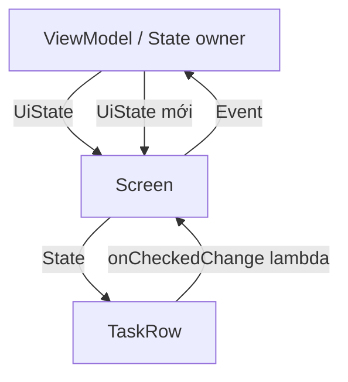

# 011 — Lambdas trong Kotlin

| Thuộc tính              | Nội dung                               |
| ----------------------- | -------------------------------------- |
| **Học phần**            | 01 — Language and Android Fundamentals |
| **Module**              | Module 01 — Pick a Language            |
| **Nhóm nội dung**       | Kotlin Essentials                      |
| **Nguồn roadmap**       | Pick a Language / Kotlin Essentials    |
| **Loại bài**            | Lesson                                 |
| **Thứ tự trong module** | 011                                    |
| **Thời lượng gợi ý**    | 24 phút                                |

---

## 1. Tóm tắt

**Lambda** là một khối mã có thể được:

* Gán vào biến.
* Truyền vào một hàm khác.
* Trả về từ một hàm.
* Gọi lại khi một sự kiện xảy ra.

Trong Android, lambda xuất hiện ở hầu hết các phần của ứng dụng:

```kotlin
Button(onClick = { submitForm() }) {
    Text("Gửi")
}
```

```kotlin
users.filter { user -> user.isActive }
```

```kotlin
repository.loadUsers(
    onSuccess = { users -> showUsers(users) },
    onError = { error -> showError(error) }
)
```

Lambda không chỉ giúp mã ngắn hơn. Khi sử dụng đúng, lambda giúp:

* Tách UI khỏi logic xử lý sự kiện.
* Xây dựng component Compose có thể tái sử dụng.
* Biến đổi collection dễ đọc hơn.
* Viết API linh hoạt hơn.
* Kiểm thử từng phần độc lập.

Kotlin xem hàm là giá trị hạng nhất: hàm có thể được lưu trong biến, truyền vào hàm khác hoặc trả về từ hàm khác. Hàm nhận hoặc trả về một hàm được gọi là **higher-order function**. ([Kotlin][1])

---

## 2. Mục tiêu học tập

Sau bài học, anh có thể:

* Giải thích lambda bằng ngôn ngữ của mình.
* Đọc được cú pháp `{ thamSo -> biểuThức }`.
* Phân biệt lambda, named function và function reference.
* Hiểu các kiểu hàm như `() -> Unit` và `(String) -> Boolean`.
* Sử dụng `it`, trailing lambda và closure.
* Dùng lambda để xử lý sự kiện trong Jetpack Compose.
* Dùng lambda với `filter`, `map`, `sortedBy`, `forEach`.
* Thiết kế composable theo mô hình state đi xuống, event đi lên.
* Nhận biết lỗi lambda quá phức tạp, side effect và capture state không phù hợp.
* Viết unit test cho logic nhận lambda.

---

## 3. Ghi chú 5 dòng về Lambda

> Lambda là một hàm không cần khai báo tên.
> Nó được viết bằng dấu ngoặc nhọn `{ }`.
> Tham số nằm trước dấu `->`, phần xử lý nằm sau dấu `->`.
> Lambda thường được truyền vào một hàm khác để mô tả hành vi.
> Trong Android, lambda thường dùng cho click event, state event, collection và callback.

---

## 4. Lambda là gì?

Một hàm Kotlin thông thường có tên:

```kotlin
fun double(number: Int): Int {
    return number * 2
}
```

Có thể biểu diễn logic tương tự bằng lambda:

```kotlin
val double: (Int) -> Int = { number ->
    number * 2
}
```

Sử dụng:

```kotlin
val result = double(5)

println(result) // 10
```

Lambda trên có:

* Một tham số kiểu `Int`.
* Trả về một giá trị kiểu `Int`.
* Kiểu hàm là `(Int) -> Int`.

Kotlin quy định lambda được đặt trong `{ }`, tham số đứng trước `->`, thân hàm đứng sau `->`, và biểu thức cuối cùng thường trở thành giá trị trả về. ([Kotlin][1])

---

## 5. Cấu trúc của một Lambda

```kotlin
val add: (Int, Int) -> Int = { first, second ->
    first + second
}
```

Phân tích:

```text
val add                 Tên biến
(Int, Int) -> Int       Kiểu hàm
{                       Bắt đầu lambda
first, second           Danh sách tham số
->                      Phân cách tham số và phần xử lý
first + second          Biểu thức trả về
}                       Kết thúc lambda
```

### Sơ đồ



Ví dụ:

```kotlin
val calculatePrice: (Double, Double) -> Double = { price, discount ->
    price - price * discount
}

val finalPrice = calculatePrice(200_000.0, 0.1)

println(finalPrice) // 180000.0
```

---

## 6. Kiểu hàm trong Kotlin

Kotlin sử dụng cú pháp:

```text
(kiểu tham số) -> kiểu trả về
```

Một số kiểu thường gặp:

| Kiểu hàm              | Ý nghĩa                                       |
| --------------------- | --------------------------------------------- |
| `() -> Unit`          | Không nhận tham số, không trả dữ liệu hữu ích |
| `(Int) -> Unit`       | Nhận một `Int`, không trả dữ liệu hữu ích     |
| `(String) -> Boolean` | Nhận `String`, trả về `Boolean`               |
| `(Int, Int) -> Int`   | Nhận hai `Int`, trả về `Int`                  |
| `suspend () -> Unit`  | Lambda có thể gọi suspend function            |
| `((Int) -> Boolean)?` | Lambda nullable                               |

Kotlin yêu cầu kiểu hàm phải thể hiện danh sách kiểu tham số và kiểu trả về; `Unit` không được bỏ khỏi phần khai báo kiểu hàm. ([Kotlin][1])

### Ví dụ

```kotlin
val onClose: () -> Unit = {
    println("Đóng màn hình")
}

val onNameChanged: (String) -> Unit = { newName ->
    println("Tên mới: $newName")
}

val isAdult: (Int) -> Boolean = { age ->
    age >= 18
}
```

---

## 7. `Unit` trong Lambda

`Unit` có thể hiểu gần giống `void` trong Java.

Lambda sau thực hiện hành động nhưng không trả về dữ liệu cần sử dụng:

```kotlin
val showMessage: (String) -> Unit = { message ->
    println(message)
}
```

Gọi lambda:

```kotlin
showMessage("Đăng nhập thành công")
```

Trong Android, event handler thường sử dụng `Unit`:

```kotlin
val onLoginClick: () -> Unit
```

```kotlin
val onEmailChange: (String) -> Unit
```

```kotlin
val onTaskChecked: (Task, Boolean) -> Unit
```

---

## 8. Rút gọn bằng `it`

Khi lambda có đúng một tham số và Kotlin suy luận được kiểu dữ liệu, tham số có thể được gọi ngầm là `it`.

### Dạng đầy đủ

```kotlin
val activeUsers = users.filter { user ->
    user.isActive
}
```

### Dạng rút gọn

```kotlin
val activeUsers = users.filter {
    it.isActive
}
```

Hoặc viết trên một dòng:

```kotlin
val activeUsers = users.filter { it.isActive }
```

Kotlin hỗ trợ tên ngầm định `it` cho lambda có một tham số khi compiler xác định được chữ ký của lambda. ([Kotlin][1])

### Khi nào không nên dùng `it`?

Không nên lạm dụng `it` khi biểu thức dài:

```kotlin
orders.filter {
    it.customer.account.subscription.isActive &&
        it.customer.account.subscription.remainingDays > 0
}
```

Dễ đọc hơn:

```kotlin
orders.filter { order ->
    val subscription = order.customer.account.subscription

    subscription.isActive && subscription.remainingDays > 0
}
```

---

## 9. Trailing Lambda

Khi tham số cuối cùng của một hàm là lambda, Kotlin cho phép đặt lambda ra ngoài dấu ngoặc tròn.

### Cách viết thông thường

```kotlin
users.filter({ user ->
    user.isActive
})
```

### Trailing lambda

```kotlin
users.filter { user ->
    user.isActive
}
```

Nếu lambda là đối số duy nhất, có thể bỏ hoàn toàn dấu ngoặc tròn. Đây là cú pháp rất phổ biến trong Jetpack Compose. ([Kotlin][1])

### Ví dụ Compose

```kotlin
Column {
    Text("Họ và tên")
    Text("Email")
    Text("Mật khẩu")
}
```

`Column` nhận một lambda `content`, mô tả các component con nằm bên trong cột:

```kotlin
Column(
    content = {
        Text("Họ và tên")
        Text("Email")
        Text("Mật khẩu")
    }
)
```

Hai đoạn mã có cùng ý nghĩa.

---

## 10. Higher-order Function

Higher-order function là hàm:

* Nhận một hoặc nhiều hàm làm tham số.
* Trả về một hàm.
* Hoặc thực hiện cả hai.

### Ví dụ tự xây dựng

```kotlin
fun calculate(
    first: Int,
    second: Int,
    operation: (Int, Int) -> Int
): Int {
    return operation(first, second)
}
```

Sử dụng:

```kotlin
val sum = calculate(4, 6) { first, second ->
    first + second
}

val product = calculate(4, 6) { first, second ->
    first * second
}

println(sum)     // 10
println(product) // 24
```

### Sơ đồ



Ưu điểm của thiết kế này là `calculate()` không cần biết trước phép tính cụ thể. Caller quyết định hành vi bằng lambda.

---

## 11. Lambda với Collections

Lambda được sử dụng rất nhiều trong collection Kotlin.

Giả sử có model:

```kotlin
data class Product(
    val id: Long,
    val name: String,
    val price: Double,
    val inStock: Boolean
)
```

Dữ liệu:

```kotlin
val products = listOf(
    Product(1, "Bàn phím", 750_000.0, true),
    Product(2, "Chuột", 350_000.0, false),
    Product(3, "Tai nghe", 1_200_000.0, true)
)
```

### 11.1. `filter`

Giữ lại các phần tử thỏa mãn điều kiện:

```kotlin
val availableProducts = products.filter { product ->
    product.inStock
}
```

Lambda cần trả về `Boolean`:

```kotlin
(Product) -> Boolean
```

### 11.2. `map`

Chuyển mỗi phần tử thành một giá trị khác:

```kotlin
val productNames = products.map { product ->
    product.name
}
```

Kết quả:

```kotlin
["Bàn phím", "Chuột", "Tai nghe"]
```

### 11.3. `sortedBy`

Sắp xếp theo giá trị được lambda trả về:

```kotlin
val sortedProducts = products.sortedBy { product ->
    product.price
}
```

### 11.4. `any`

Kiểm tra có ít nhất một phần tử thỏa mãn điều kiện:

```kotlin
val hasExpensiveProduct = products.any { product ->
    product.price > 1_000_000
}
```

### 11.5. Kết hợp nhiều phép biến đổi

```kotlin
val availableProductNames = products
    .filter { it.inStock }
    .sortedBy { it.price }
    .map { it.name }
```

Luồng dữ liệu:



---

## 12. Function Reference

Khi đã có một named function phù hợp, không nhất thiết phải bọc nó trong lambda.

Named function:

```kotlin
fun isAvailable(product: Product): Boolean {
    return product.inStock
}
```

### Dùng lambda

```kotlin
val result = products.filter { product ->
    isAvailable(product)
}
```

### Dùng function reference

```kotlin
val result = products.filter(::isAvailable)
```

Một số dạng function reference:

```kotlin
::isAvailable
String::toInt
Product::name
::Product
```

Kotlin hỗ trợ callable reference tới function, property và constructor để tạo giá trị có kiểu hàm. ([Kotlin][1])

### Khi nào nên dùng?

Dùng function reference khi:

* Hàm đã có tên rõ nghĩa.
* Logic được dùng ở nhiều nơi.
* Muốn test logic riêng.
* Lambda inline bắt đầu quá dài.

---

## 13. Closure: Lambda sử dụng biến bên ngoài

Lambda có thể đọc hoặc thay đổi biến được khai báo ở phạm vi bên ngoài.

```kotlin
var total = 0

val addToTotal: (Int) -> Unit = { amount ->
    total += amount
}

addToTotal(10)
addToTotal(5)

println(total) // 15
```

Lambda đã **capture** biến `total`.

### Ví dụ Android

```kotlin
var clickCount by rememberSaveable {
    mutableIntStateOf(0)
}

Button(
    onClick = {
        clickCount++
    }
) {
    Text("Đã nhấn $clickCount lần")
}
```

Lambda `onClick` sử dụng biến `clickCount` bên ngoài nó.

### Cần lưu ý

Capture biến không phải lúc nào cũng sai. Tuy nhiên, cần kiểm tra:

* Biến thuộc UI state hay local variable tạm thời?
* Lambda sẽ được gọi ngay hay được lưu để gọi sau?
* State có còn đúng sau recomposition không?
* Lambda có đang giữ tham chiếu tới object không còn cần thiết không?
* Logic có thuộc ViewModel thay vì UI không?

---

## 14. Lambda trong Jetpack Compose

Jetpack Compose được xây dựng mạnh trên higher-order function và lambda. Những API như `Button`, `Column`, `LazyColumn`, `TextField` và `Modifier.clickable` đều sử dụng lambda. ([Android Developers][2])

### 14.1. Xử lý click

```kotlin
Button(
    onClick = {
        println("Người dùng nhấn nút")
    }
) {
    Text("Tiếp tục")
}
```

Trong đó:

```kotlin
onClick: () -> Unit
```

`onClick`:

* Không nhận tham số.
* Không trả về dữ liệu.
* Được Compose gọi khi người dùng kích hoạt nút.

### 14.2. Nhận dữ liệu từ component

```kotlin
var email by rememberSaveable {
    mutableStateOf("")
}

TextField(
    value = email,
    onValueChange = { newEmail ->
        email = newEmail
    }
)
```

Kiểu của `onValueChange`:

```kotlin
(String) -> Unit
```

Luồng xử lý:



---

## 15. State đi xuống, Event đi lên

Một cách thiết kế Compose quan trọng là:

* **State đi từ component cha xuống component con.**
* **Event đi từ component con lên component cha thông qua lambda.**

Android gọi đây là một phần của **Unidirectional Data Flow**.



State hoisting thường thay state nội bộ bằng hai tham số:

```kotlin
value: T
onValueChange: (T) -> Unit
```

Cách làm này giúp component stateless, dễ tái sử dụng và dễ kiểm thử hơn. ([Android Developers][3])

---

## 16. Ví dụ Android hoàn chỉnh: Danh sách công việc

### 16.1. Model

```kotlin
data class Task(
    val id: Long,
    val title: String,
    val completed: Boolean
)
```

### 16.2. Component con không giữ state

```kotlin
@Composable
fun TaskRow(
    task: Task,
    onCheckedChange: (Boolean) -> Unit,
    onDeleteClick: () -> Unit,
    modifier: Modifier = Modifier
) {
    Row(
        modifier = modifier
            .fillMaxWidth()
            .padding(horizontal = 16.dp, vertical = 8.dp),
        verticalAlignment = Alignment.CenterVertically
    ) {
        Checkbox(
            checked = task.completed,
            onCheckedChange = onCheckedChange
        )

        Text(
            text = task.title,
            modifier = Modifier.weight(1f)
        )

        IconButton(onClick = onDeleteClick) {
            Icon(
                imageVector = Icons.Default.Delete,
                contentDescription = "Xóa công việc"
            )
        }
    }
}
```

`TaskRow` không tự thay đổi `task`.

Nó chỉ thông báo sự kiện:

```kotlin
onCheckedChange(newValue)
```

```kotlin
onDeleteClick()
```

### 16.3. Screen sở hữu state

```kotlin
@Composable
fun TaskScreen() {
    var tasks by rememberSaveable {
        mutableStateOf(
            listOf(
                Task(1, "Học Kotlin Lambda", false),
                Task(2, "Viết unit test", false),
                Task(3, "Cập nhật README", true)
            )
        )
    }

    LazyColumn {
        items(
            items = tasks,
            key = { task -> task.id }
        ) { task ->
            TaskRow(
                task = task,
                onCheckedChange = { checked ->
                    tasks = tasks.map { currentTask ->
                        if (currentTask.id == task.id) {
                            currentTask.copy(completed = checked)
                        } else {
                            currentTask
                        }
                    }
                },
                onDeleteClick = {
                    tasks = tasks.filterNot { currentTask ->
                        currentTask.id == task.id
                    }
                }
            )
        }
    }
}
```

Ở đây có nhiều lambda:

```kotlin
key = { task -> task.id }
```

```kotlin
onCheckedChange = { checked -> ... }
```

```kotlin
onDeleteClick = { ... }
```

```kotlin
tasks.map { currentTask -> ... }
```

```kotlin
tasks.filterNot { currentTask -> ... }
```

### Ảnh minh họa chính thức


*Nguồn: [Android Developers — State in Jetpack Compose](https://developer.android.com/codelabs/jetpack-compose-state).* 

---

## 17. Tách logic khỏi UI bằng Lambda

Đoạn cập nhật task có thể được đưa thành pure function:

```kotlin
fun updateTaskCompletion(
    tasks: List<Task>,
    taskId: Long,
    completed: Boolean
): List<Task> {
    return tasks.map { task ->
        if (task.id == taskId) {
            task.copy(completed = completed)
        } else {
            task
        }
    }
}
```

UI trở nên ngắn hơn:

```kotlin
onCheckedChange = { checked ->
    tasks = updateTaskCompletion(
        tasks = tasks,
        taskId = task.id,
        completed = checked
    )
}
```

Nguyên tắc:

> Lambda trong UI nên chủ yếu mô tả sự kiện. Logic nghiệp vụ phức tạp nên được chuyển sang ViewModel, use case hoặc pure function.

---

## 18. Dùng event lambda với ViewModel

### ViewModel

```kotlin
class TaskViewModel : ViewModel() {

    private val _tasks = MutableStateFlow<List<Task>>(emptyList())
    val tasks = _tasks.asStateFlow()

    fun onTaskChecked(taskId: Long, completed: Boolean) {
        _tasks.update { currentTasks ->
            currentTasks.map { task ->
                if (task.id == taskId) {
                    task.copy(completed = completed)
                } else {
                    task
                }
            }
        }
    }

    fun onTaskDeleted(taskId: Long) {
        _tasks.update { currentTasks ->
            currentTasks.filterNot { task ->
                task.id == taskId
            }
        }
    }
}
```

### Route composable

```kotlin
@Composable
fun TaskRoute(
    viewModel: TaskViewModel = viewModel()
) {
    val tasks by viewModel.tasks.collectAsStateWithLifecycle()

    TaskScreen(
        tasks = tasks,
        onTaskChecked = viewModel::onTaskChecked,
        onTaskDeleted = viewModel::onTaskDeleted
    )
}
```

### Stateless screen

```kotlin
@Composable
fun TaskScreen(
    tasks: List<Task>,
    onTaskChecked: (Long, Boolean) -> Unit,
    onTaskDeleted: (Long) -> Unit
) {
    LazyColumn {
        items(
            items = tasks,
            key = Task::id
        ) { task ->
            TaskRow(
                task = task,
                onCheckedChange = { checked ->
                    onTaskChecked(task.id, checked)
                },
                onDeleteClick = {
                    onTaskDeleted(task.id)
                }
            )
        }
    }
}
```

Ưu điểm:

* `TaskScreen` không phụ thuộc trực tiếp vào ViewModel.
* Có thể truyền dữ liệu giả khi preview.
* Có thể test event dễ dàng.
* Logic cập nhật state tập trung trong ViewModel.
* UI chỉ hiển thị state và phát event.

Compose phù hợp với unidirectional data flow vì composable nhận state và công khai event handler dưới dạng lambda. Android khuyến nghị truyền giá trị bất biến cho state và lambda cho event. ([Android Developers][4])

---

## 19. Lambda không đồng nghĩa với bất đồng bộ

Đây là nhầm lẫn phổ biến:

```kotlin
val loadData = {
    repository.loadData()
}
```

Đoạn trên không tự động chạy ở background thread.

Lambda chỉ đóng gói một hành vi. Hành vi chạy ở thread nào phụ thuộc vào nơi gọi lambda.

### Lambda thường

```kotlin
val loadData: () -> Unit = {
    repository.loadData()
}
```

### Suspend lambda

```kotlin
val loadData: suspend () -> Unit = {
    repository.loadData()
}
```

Suspend lambda có kiểu đặc biệt như `suspend () -> Unit` và có thể gọi suspend function. ([Kotlin][1])

Ví dụ:

```kotlin
fun executeInViewModel(
    action: suspend () -> Unit
) {
    viewModelScope.launch {
        action()
    }
}
```

Sử dụng:

```kotlin
executeInViewModel {
    repository.refreshTasks()
}
```

---

## 20. Return trong Lambda

### Return giá trị bằng biểu thức cuối

```kotlin
val calculateDiscount: (Double) -> Double = { price ->
    val discount = price * 0.1
    price - discount
}
```

Không cần viết:

```kotlin
return price - discount
```

### Labeled return

Ví dụ muốn bỏ qua phần tử hiện tại:

```kotlin
users.forEach { user ->
    if (!user.isActive) {
        return@forEach
    }

    println(user.name)
}
```

`return@forEach` chỉ kết thúc lần xử lý hiện tại của lambda.

Nên hạn chế control flow quá phức tạp trong lambda. Khi có nhiều nhánh `return`, nên cân nhắc chuyển thành named function.

---

## 21. Lambda có Receiver

Một kiểu lambda nâng cao:

```kotlin
StringBuilder.() -> Unit
```

Trong lambda, object receiver trở thành `this`.

```kotlin
fun buildMessage(
    block: StringBuilder.() -> Unit
): String {
    return StringBuilder()
        .apply(block)
        .toString()
}
```

Sử dụng:

```kotlin
val message = buildMessage {
    append("Xin chào")
    append(" ")
    append("Android")
}
```

Kết quả:

```text
Xin chào Android
```

Compose sử dụng ý tưởng tương tự với các scope như:

```kotlin
ColumnScope.() -> Unit
```

```kotlin
RowScope.() -> Unit
```

```kotlin
DrawScope.() -> Unit
```

Ví dụ:

```kotlin
Canvas(modifier = Modifier.fillMaxSize()) {
    drawCircle(
        radius = size.minDimension / 4f
    )
}
```

Android Compose sử dụng receiver lambda để cung cấp các API chỉ có ý nghĩa trong scope tương ứng, chẳng hạn `RowScope` hoặc `DrawScope`. ([Android Developers][2])

---

## 22. Lỗi thường gặp

### 22.1. Lambda quá dài

Không tốt:

```kotlin
Button(
    onClick = {
        val normalizedEmail = email.trim().lowercase()
        val isValid = normalizedEmail.contains("@")

        if (!isValid) {
            errorMessage = "Email không hợp lệ"
        } else {
            loading = true

            scope.launch {
                try {
                    repository.login(normalizedEmail, password)
                    navigator.navigate("home")
                } catch (exception: Exception) {
                    errorMessage = exception.message.orEmpty()
                } finally {
                    loading = false
                }
            }
        }
    }
) {
    Text("Đăng nhập")
}
```

Tốt hơn:

```kotlin
Button(
    onClick = {
        viewModel.onLoginClick()
    }
) {
    Text("Đăng nhập")
}
```

---

### 22.2. Dùng `map` chỉ để tạo side effect

Không tốt:

```kotlin
users.map { user ->
    println(user.name)
}
```

`map` có mục tiêu tạo collection mới.

Phù hợp hơn:

```kotlin
users.forEach { user ->
    println(user.name)
}
```

Hoặc thật sự biến đổi:

```kotlin
val names = users.map { user ->
    user.name
}
```

---

### 22.3. Lạm dụng `it`

Khó hiểu:

```kotlin
orders.map {
    it.items.filter {
        it.available
    }
}
```

Tốt hơn:

```kotlin
orders.map { order ->
    order.items.filter { item ->
        item.available
    }
}
```

---

### 22.4. Không sử dụng tham số callback

Sai về mặt chức năng:

```kotlin
@Composable
fun SaveButton(
    onSaveClick: () -> Unit
) {
    Button(
        onClick = {
            println("Save")
        }
    ) {
        Text("Lưu")
    }
}
```

Đúng:

```kotlin
@Composable
fun SaveButton(
    onSaveClick: () -> Unit
) {
    Button(
        onClick = onSaveClick
    ) {
        Text("Lưu")
    }
}
```

---

### 22.5. Gọi hàm ngay thay vì truyền hành vi

Giả sử API cần:

```kotlin
onClick: () -> Unit
```

Đúng:

```kotlin
Button(
    onClick = {
        submitForm()
    }
) {
    Text("Gửi")
}
```

Hoặc:

```kotlin
Button(
    onClick = ::submitForm
) {
    Text("Gửi")
}
```

Không được viết theo kiểu gọi hàm rồi truyền kết quả:

```kotlin
// Không đúng nếu submitForm() trả về Unit
Button(
    onClick = submitForm()
) {
    Text("Gửi")
}
```

---

### 22.6. Thực hiện công việc nặng trong callback UI

Không tốt:

```kotlin
Button(
    onClick = {
        val result = processLargeFile()
        showResult(result)
    }
) {
    Text("Xử lý")
}
```

Công việc nặng trên main thread có thể làm giao diện mất phản hồi.

Nên chuyển yêu cầu tới ViewModel và xử lý bằng coroutine với dispatcher phù hợp:

```kotlin
Button(
    onClick = viewModel::onProcessFileClick
) {
    Text("Xử lý")
}
```

---

### 22.7. Lambda chứa quá nhiều logic lồng nhau

Khó bảo trì:

```kotlin
users
    .filter { it.isActive }
    .map {
        it.orders
            .filter { it.paid }
            .map {
                it.items.filter { it.available }
            }
    }
```

Tốt hơn là đặt tên cho từng bước:

```kotlin
val activeUsers = users.filter(User::isActive)

val paidOrders = activeUsers.flatMap { user ->
    user.orders.filter(Order::paid)
}

val availableItems = paidOrders.flatMap { order ->
    order.items.filter(Item::available)
}
```

Kotlin coding conventions khuyến nghị chuyển lambda thành anonymous hoặc named function khi biểu thức không còn rõ ràng, đồng thời cân nhắc chi phí khi xâu chuỗi nhiều higher-order function. ([Kotlin][5])

---

## 23. Lifecycle và State

Lambda không tự lưu state qua việc xoay màn hình hoặc process recreation.

Ví dụ:

```kotlin
var query by remember {
    mutableStateOf("")
}
```

`remember` giữ dữ liệu qua recomposition nhưng có thể mất khi configuration thay đổi.

```kotlin
var query by rememberSaveable {
    mutableStateOf("")
}
```

`rememberSaveable` phù hợp hơn với UI state nhỏ cần phục hồi.

Lambda chỉ thay đổi state:

```kotlin
onValueChange = { newQuery ->
    query = newQuery
}
```

Việc state tồn tại bao lâu do state holder quyết định, không phải do bản thân lambda. Tài liệu Android phân biệt `remember`, `rememberSaveable` và ViewModel dựa trên vòng đời cần giữ state. ([Android Developers][6])

### Quy tắc thực tế

| Loại dữ liệu                          | Nơi lưu phù hợp     |
| ------------------------------------- | ------------------- |
| Expanded/collapsed tạm thời           | `remember`          |
| Nội dung TextField cần giữ khi rotate | `rememberSaveable`  |
| State của toàn màn hình               | ViewModel           |
| Dữ liệu nghiệp vụ lâu dài             | Repository/database |
| Hành động người dùng                  | Event lambda        |

---

## 24. Testing Lambda

### 24.1. Test higher-order function

Hàm cần test:

```kotlin
fun filterTasks(
    tasks: List<Task>,
    predicate: (Task) -> Boolean
): List<Task> {
    return tasks.filter(predicate)
}
```

Unit test:

```kotlin
@Test
fun filterTasks_returnsOnlyCompletedTasks() {
    val tasks = listOf(
        Task(1, "A", completed = true),
        Task(2, "B", completed = false),
        Task(3, "C", completed = true)
    )

    val result = filterTasks(tasks) { task ->
        task.completed
    }

    assertEquals(
        listOf(1L, 3L),
        result.map(Task::id)
    )
}
```

### 24.2. Test callback được gọi

Composable:

```kotlin
@Composable
fun ConfirmButton(
    onConfirm: () -> Unit
) {
    Button(
        onClick = onConfirm
    ) {
        Text("Xác nhận")
    }
}
```

Compose UI test:

```kotlin
@Test
fun confirmButton_invokesCallback() {
    var clicked = false

    composeTestRule.setContent {
        ConfirmButton(
            onConfirm = {
                clicked = true
            }
        )
    }

    composeTestRule
        .onNodeWithText("Xác nhận")
        .performClick()

    assertTrue(clicked)
}
```

Lambda giúp kiểm thử component mà không cần phụ thuộc vào navigation, repository hoặc ViewModel thật.

---

## 25. Performance

Hầu hết lambda nhỏ dùng cho UI event và collection không cần tối ưu thủ công ngay từ đầu.

Tuy nhiên cần chú ý:

* Không thực hiện công việc nặng trong callback main thread.
* Không tạo chuỗi `filter → map → sortedBy` lớn trong mỗi recomposition nếu dữ liệu không thay đổi.
* Không đặt logic tốn kém trực tiếp trong composable body.
* Dùng `remember` hoặc `derivedStateOf` khi đã xác định có phép tính UI lặp lại không cần thiết.
* Đưa xử lý dữ liệu lớn sang ViewModel hoặc data layer.
* Đo performance trước khi tối ưu.

Higher-order function có thể tạo function object và capture closure. Kotlin cung cấp `inline` cho một số trường hợp cần giảm overhead và hỗ trợ control flow linh hoạt, nhưng không nên tự động đánh dấu mọi hàm là `inline`. ([Kotlin][7])

Ví dụ:

```kotlin
inline fun measureAction(
    action: () -> Unit
) {
    val start = System.currentTimeMillis()
    action()
    println("Duration: ${System.currentTimeMillis() - start}")
}
```

---

## 26. Ảnh hưởng đến sản phẩm Android

### UX

Sử dụng lambda đúng giúp:

* Click event phản hồi đúng hành động.
* TextField cập nhật state ngay.
* UI component dễ tái sử dụng và nhất quán.
* Giảm nguy cơ nút hiển thị nhưng không thực hiện callback.
* Tránh công việc nặng làm đứng giao diện.

### Reliability

* Event được chuyển về một state owner rõ ràng.
* Tránh nhiều nơi cùng sửa state.
* Pure function với lambda dễ kiểm thử.
* Có thể mô phỏng success, error hoặc retry handler.

### Maintainability

* Component chỉ nhận state và event cần thiết.
* Logic phức tạp được đặt tên và tách khỏi UI.
* Function reference làm code ngắn và có ý nghĩa.
* Callback type thể hiện rõ contract giữa các component.

### Performance

* Lambda quá phức tạp trong recomposition có thể gây thêm tính toán.
* Closure có thể capture dữ liệu không cần thiết.
* Collection chain lớn có thể tạo collection trung gian.
* Side effect phải được thực hiện trong môi trường phù hợp với lifecycle.

---

## 27. Thực hành trong 8 phút

### Yêu cầu

Tạo một chương trình Kotlin lọc danh sách thông báo.

```kotlin
data class Notification(
    val id: Long,
    val title: String,
    val read: Boolean,
    val priority: Int
)
```

Dữ liệu:

```kotlin
val notifications = listOf(
    Notification(1, "Tin nhắn mới", false, 2),
    Notification(2, "Cập nhật ứng dụng", true, 1),
    Notification(3, "Cảnh báo bảo mật", false, 3)
)
```

### Nhiệm vụ

1. Lấy các thông báo chưa đọc.
2. Sắp xếp theo priority giảm dần.
3. Chuyển thành danh sách title.
4. In từng title.

### Lời giải tham khảo

```kotlin
val unreadTitles = notifications
    .filter { notification ->
        !notification.read
    }
    .sortedByDescending { notification ->
        notification.priority
    }
    .map { notification ->
        notification.title
    }

unreadTitles.forEach { title ->
    println(title)
}
```

Kết quả:

```text
Cảnh báo bảo mật
Tin nhắn mới
```

---

## 28. Bài tập Android

Xây dựng màn hình **Notification Settings** gồm ba tùy chọn:

* Thông báo email.
* Thông báo đẩy.
* Bản tin hàng tuần.

Component con:

```kotlin
@Composable
fun NotificationOption(
    title: String,
    enabled: Boolean,
    onEnabledChange: (Boolean) -> Unit
)
```

Yêu cầu:

* Component con không tự giữ state.
* State được giữ tại screen hoặc ViewModel.
* Mỗi thay đổi được gửi lên bằng lambda.
* Có ít nhất một unit test.
* Có preview với dữ liệu mẫu.
* Viết README giải thích state đi xuống và event đi lên.

---

## 29. Artifact đưa vào Portfolio

Tạo thư mục:

```text
011-lambdas/
├── README.md
├── LambdaBasics.kt
├── Task.kt
├── TaskScreen.kt
├── TaskViewModel.kt
├── TaskViewModelTest.kt
└── screenshots/
    └── task-screen.png
```

### README nên có

```markdown
# Kotlin Lambdas Demo

## Mục tiêu

Minh họa cách sử dụng lambda trong Kotlin và Jetpack Compose.

## Nội dung

- Function types
- Higher-order functions
- Collection transformations
- Compose event callbacks
- State hoisting
- Unit testing

## Kiến trúc

UiState đi từ ViewModel xuống Screen.
Sự kiện đi từ Screen lên ViewModel bằng lambda.

## Bài học rút ra

Lambda nên mô tả hành vi ngắn và rõ ràng.
Logic nghiệp vụ phức tạp không nên nằm trực tiếp trong onClick.
```

---

## 30. Checklist hoàn thành

### Kiến thức

* [ ] Giải thích được lambda là gì.
* [ ] Đọc được kiểu `() -> Unit`.
* [ ] Đọc được kiểu `(String) -> Boolean`.
* [ ] Hiểu biểu thức cuối là giá trị trả về.
* [ ] Biết sử dụng `it`.
* [ ] Biết trailing lambda.
* [ ] Biết function reference.
* [ ] Hiểu higher-order function.
* [ ] Biết lambda có thể capture biến bên ngoài.
* [ ] Biết lambda không tự động chạy bất đồng bộ.

### Android

* [ ] Viết được `onClick` bằng lambda.
* [ ] Viết được `onValueChange`.
* [ ] Truyền event từ composable con lên cha.
* [ ] Tách state khỏi stateless composable.
* [ ] Không đặt logic nghiệp vụ dài trong callback UI.
* [ ] Kiểm tra state khi rotate hoặc process recreation.
* [ ] Viết test xác minh callback được gọi.
* [ ] Có screenshot hoặc demo nhỏ cho portfolio.

---

## 31. Ghi chú sản xuất

Trước khi đưa tính năng sử dụng lambda vào production, cần kiểm tra:

### UI và UX

* Callback có thật sự được gọi khi nhấn nút không?
* Có trường hợp người dùng nhấn liên tục không?
* Có cần disable nút trong lúc loading không?
* Callback có làm block main thread không?
* Error có được hiển thị dễ hiểu không?

### State và lifecycle

* Lambda đang sửa state ở đâu?
* Có một nguồn dữ liệu duy nhất không?
* State có mất khi rotate không?
* State nào cần `rememberSaveable`?
* State nào cần đặt trong ViewModel?

### Maintainability

* Lambda có dài quá 5–10 dòng không?
* Có nhiều lambda lồng nhau không?
* Có nên tách thành named function không?
* Tên callback có diễn tả sự kiện rõ ràng không?

Nên dùng:

```kotlin
onLoginClick
onQueryChange
onTaskDeleted
onRetry
```

Hạn chế tên chung chung:

```kotlin
callback
handler
action
doSomething
```

### Testing

* Callback success đã được test chưa?
* Callback error đã được test chưa?
* Callback có bị gọi nhiều lần ngoài ý muốn không?
* Component có thể test bằng fake lambda không?
* ViewModel có test được độc lập với Compose không?

---

## 32. Kết luận

Lambda là nền tảng quan trọng của Kotlin hiện đại và Jetpack Compose.

Cần ghi nhớ:

```text
Lambda = hành vi có thể được truyền đi như một giá trị
```

```kotlin
{ parameter ->
    result
}
```

Trong Android:

```text
State đi xuống
Event đi lên bằng lambda
ViewModel xử lý logic
UI hiển thị kết quả
```

Một Android developer sử dụng lambda tốt không chỉ viết được cú pháp ngắn, mà còn biết:

* Lambda nên nằm ở tầng nào.
* Lambda nào chỉ là UI event.
* Logic nào phải chuyển sang ViewModel.
* State nào cần tồn tại qua lifecycle.
* Cách test callback.
* Khi nào cần đổi lambda dài thành named function.

---

## 33. Tài liệu tham khảo

* [Kotlin — Higher-order functions and lambdas](https://kotlinlang.org/docs/lambdas.html) ([Kotlin][1])
* [Android Developers — Kotlin dành cho Jetpack Compose](https://developer.android.com/develop/ui/compose/kotlin?hl=vi) ([Android Developers][2])
* [Android Developers — State and Jetpack Compose](https://developer.android.com/develop/ui/compose/state) ([Android Developers][8])
* [Android Developers — State in Jetpack Compose Codelab](https://developer.android.com/codelabs/jetpack-compose-state) ([Android Developers][3])
* [Android Developers — Compose UI Architecture](https://developer.android.com/develop/ui/compose/architecture) ([Android Developers][6])

[1]: https://kotlinlang.org/docs/lambdas.html "Higher-order functions and lambdas | Kotlin Documentation"
[2]: https://developer.android.com/develop/ui/compose/kotlin?hl=vi "Kotlin dành cho Jetpack Compose  |  Android Developers"
[3]: https://developer.android.com/codelabs/jetpack-compose-state "State in Jetpack Compose  |  Android Developers"
[4]: https://developer.android.com/develop/ui/compose/architecture?authuser=14&utm_source=chatgpt.com "Compose UI Architecture  |  Jetpack Compose  |  Android Developers"
[5]: https://kotlinlang.org/docs/coding-conventions.html?utm_source=chatgpt.com "Coding conventions | Kotlin Documentation"
[6]: https://developer.android.com/develop/ui/compose/architecture?utm_source=chatgpt.com "Compose UI Architecture | Jetpack ..."
[7]: https://kotlinlang.org/docs/inline-functions.html?utm_source=chatgpt.com "Inline functions | Kotlin Documentation"
[8]: https://developer.android.com/develop/ui/compose/state?utm_source=chatgpt.com "State and Jetpack Compose  |  Android Developers"
