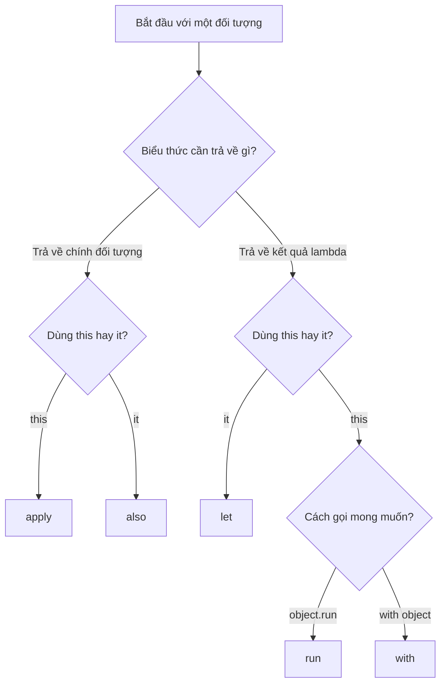
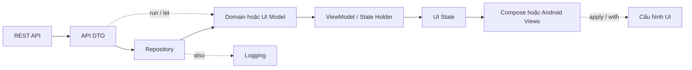
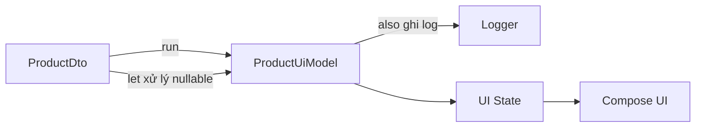

[](https://medium.com/%40rps.parthasarathi/understanding-kotlin-scope-functions-a-simplified-guide-6b6cffdd1ff1?utm_source=chatgpt.com)

# 012 — Scope Functions trong Kotlin

| Thông tin               | Nội dung                               |
| ----------------------- | -------------------------------------- |
| **Học phần**            | 01 — Language and Android Fundamentals |
| **Module**              | Module 01 — Pick a Language            |
| **Nhóm nội dung**       | Kotlin Essentials                      |
| **Nguồn roadmap**       | Pick a Language / Kotlin Essentials    |
| **Loại bài**            | Lesson                                 |
| **Thứ tự trong module** | 012                                    |
| **Thời lượng gợi ý**    | 24 phút                                |

---

## 1. Tóm tắt

**Scope Functions** là nhóm hàm tiêu chuẩn của Kotlin cho phép thực thi một khối lệnh trong ngữ cảnh của một đối tượng.

Kotlin có năm scope function thường dùng:

```kotlin
let
run
with
apply
also
```

Các hàm này không tạo ra một scope mới theo nghĩa lifecycle của Android. Chúng chủ yếu giúp:

* Giảm việc lặp lại tên đối tượng.
* Biến đổi dữ liệu.
* Khởi tạo hoặc cấu hình đối tượng.
* Xử lý giá trị nullable.
* Thực hiện logging, debugging hoặc side effect.
* Làm code Android ngắn gọn và thể hiện rõ ý định hơn.

Điểm khác nhau quan trọng nhất giữa chúng là:

1. Đối tượng được truy cập bằng `this` hay `it`.
2. Hàm trả về chính đối tượng hay kết quả cuối của lambda.

Đây cũng là hai tiêu chí chính mà tài liệu Kotlin sử dụng để phân biệt các scope function. ([Kotlin][1])

Scope Functions thuộc phần kiến thức nền tảng Kotlin trong lộ trình học Android. Tuy nhiên, chúng chỉ là công cụ tổ chức code cục bộ, không thay thế `ViewModel`, state holder, coroutine scope hoặc cơ chế quản lý lifecycle của Android. ([roadmap.sh][2])

---

## 2. Mục tiêu học tập

Sau bài học, anh có thể:

* Giải thích Scope Functions bằng ngôn ngữ của mình.
* Phân biệt `let`, `run`, `with`, `apply` và `also`.
* Biết khi nào dùng `this`, khi nào dùng `it`.
* Hiểu giá trị trả về của từng hàm.
* Dùng Scope Functions trong ViewModel, Repository, UI và khi xử lý API model.
* Nhận biết những đoạn code lạm dụng Scope Functions.
* Viết unit test cho logic có sử dụng Scope Functions.
* Tạo một artifact nhỏ để đưa vào portfolio Android.

---

## 3. Phân bổ 24 phút học

| Thời gian | Nội dung                    |
| --------: | --------------------------- |
|    3 phút | Hiểu khái niệm và mục đích  |
|    6 phút | So sánh năm Scope Functions |
|    5 phút | Đọc sơ đồ lựa chọn          |
|    6 phút | Thực hành với ví dụ Android |
|    3 phút | Phân tích lỗi thường gặp    |
|    1 phút | Hoàn thành checklist        |

---

## 4. Ghi chú 5 dòng về Scope Functions

> Scope Functions cho phép thực thi một lambda trong ngữ cảnh của một đối tượng.
> Kotlin có năm hàm chính: `let`, `run`, `with`, `apply` và `also`.
> `let` và `also` tham chiếu đối tượng bằng `it`.
> `run`, `with` và `apply` tham chiếu đối tượng bằng `this`.
> Việc chọn hàm phụ thuộc chủ yếu vào đối tượng cần tham chiếu và giá trị cần trả về.

---

## 5. Bảng so sánh nhanh

| Hàm     | Tham chiếu đối tượng | Giá trị trả về | Cách gọi          | Trường hợp phù hợp                         |
| ------- | -------------------- | -------------- | ----------------- | ------------------------------------------ |
| `let`   | `it`                 | Kết quả lambda | `object.let {}`   | Null check, biến đổi dữ liệu               |
| `run`   | `this`               | Kết quả lambda | `object.run {}`   | Tính toán hoặc tạo kết quả từ object       |
| `with`  | `this`               | Kết quả lambda | `with(object) {}` | Thực hiện nhiều thao tác trên object đã có |
| `apply` | `this`               | Chính object   | `object.apply {}` | Khởi tạo, cấu hình object                  |
| `also`  | `it`                 | Chính object   | `object.also {}`  | Logging, debugging, side effect            |

Tất cả các hàm trên đều thực thi lambda ngay lập tức. Chúng không tự chạy bất đồng bộ và không tự chuyển code sang coroutine hoặc background thread. ([Kotlin][1])

---

## 6. Sơ đồ chọn Scope Function



### Quy tắc ghi nhớ

```text
Trả về object:
├── this → apply
└── it   → also

Trả về kết quả lambda:
├── it   → let
└── this
    ├── object.run → run
    └── with(object) → with
```

---

# 7. Phân tích từng Scope Function

## 7.1. `let`

### Đặc điểm

* Đối tượng được gọi bằng `it`.
* Trả về kết quả của lambda.
* Thường kết hợp với safe call `?.`.
* Phù hợp khi muốn biến đổi một giá trị thành giá trị khác.

### Ví dụ cơ bản

```kotlin
val username: String? = "  An Khanh  "

val normalizedName: String? = username?.let { value ->
    value.trim().lowercase()
}

println(normalizedName)
// an khanh
```

Ở đây:

* Nếu `username == null`, lambda không chạy.
* Nếu khác `null`, chuỗi được truyền vào lambda dưới tên `value`.
* Kết quả của `trim().lowercase()` được trả về.

### Lưu ý quan trọng

`let` không tự tạo ra null safety. Chính toán tử safe call `?.` mới ngăn lambda chạy khi giá trị bằng `null`.

```kotlin
username?.let {
    println(it)
}
```

Khác với:

```kotlin
username.let {
    println(it) // it vẫn có kiểu String?
}
```

### Ví dụ trong Jetpack Compose

```kotlin
@Composable
fun UserAvatar(avatarUrl: String?) {
    avatarUrl?.let { url ->
        AsyncImage(
            model = url,
            contentDescription = "Ảnh đại diện"
        )
    }
}
```

`AsyncImage` chỉ được tạo khi `avatarUrl` khác `null`.

### Trường hợp nên dùng

```kotlin
nullableValue?.let { nonNullValue ->
    transform(nonNullValue)
}
```

```kotlin
apiResponse.let { response ->
    response.toDomainModel()
}
```

```kotlin
intent.getStringExtra("user_id")?.let { userId ->
    viewModel.loadUser(userId)
}
```

---

## 7.2. `run`

### Đặc điểm

* Đối tượng được tham chiếu bằng `this`.
* Có thể bỏ từ khóa `this`.
* Trả về kết quả cuối của lambda.
* Phù hợp khi cần đọc nhiều thuộc tính của object để tạo ra một kết quả khác.

### Ví dụ

```kotlin
data class User(
    val firstName: String,
    val lastName: String,
    val age: Int
)

val user = User(
    firstName = "An",
    lastName = "Khánh",
    age = 23
)

val description = user.run {
    "$firstName $lastName — $age tuổi"
}

println(description)
```

Giá trị của `description` là một `String`, không phải đối tượng `user`.

### Ví dụ chuyển API model thành UI model

```kotlin
data class UserDto(
    val id: Long,
    val name: String?,
    val avatarUrl: String?
)

data class UserUiModel(
    val id: Long,
    val displayName: String,
    val avatarUrl: String?
)

fun UserDto.toUiModel(): UserUiModel = this.run {
    UserUiModel(
        id = id,
        displayName = name
            ?.trim()
            ?.takeIf { it.isNotEmpty() }
            ?: "Người dùng",
        avatarUrl = avatarUrl
    )
}
```

`run` phù hợp ở đây vì:

* Cần truy cập nhiều thuộc tính của `UserDto`.
* Kết quả cần trả về là một `UserUiModel` mới.

### Một dạng `run` không có receiver

Kotlin còn có thể dùng `run` như một block biểu thức:

```kotlin
val message = run {
    val hour = 8
    val user = "Khánh"

    "Chào buổi sáng, $user. Hiện tại là $hour giờ."
}
```

Dạng này hữu ích khi cần giới hạn biến tạm trong một block nhỏ.

---

## 7.3. `with`

### Đặc điểm

* Đối tượng được tham chiếu bằng `this`.
* Trả về kết quả lambda.
* Không phải extension function.
* Đối tượng được truyền vào tham số `with(object)`.

### Ví dụ

```kotlin
val user = User(
    firstName = "An",
    lastName = "Khánh",
    age = 23
)

val summary = with(user) {
    """
        Họ tên: $firstName $lastName
        Tuổi: $age
    """.trimIndent()
}
```

### Ví dụ Android Views

```kotlin
private fun renderProfile(
    binding: FragmentProfileBinding,
    user: UserUiModel
) {
    with(binding) {
        nameTextView.text = user.displayName

        avatarImageView.isVisible = user.avatarUrl != null
        retryButton.isVisible = false
        progressBar.isVisible = false
    }
}
```

`with(binding)` phù hợp khi:

* `binding` chắc chắn không null trong block hiện tại.
* Cần thao tác nhiều lần với cùng một đối tượng.
* Không cần tiếp tục chain đối tượng `binding`.

### Không nên dùng như một null check

Đoạn sau không an toàn:

```kotlin
with(nullableUser) {
    // this vẫn có thể là User?
}
```

Với nullable object, thường nên dùng:

```kotlin
nullableUser?.run {
    println(name)
}
```

hoặc:

```kotlin
nullableUser?.let { user ->
    println(user.name)
}
```

---

## 7.4. `apply`

### Đặc điểm

* Đối tượng được tham chiếu bằng `this`.
* Trả về chính đối tượng ban đầu.
* Phù hợp để cấu hình một object.
* Thường xuất hiện khi tạo `Intent`, request, builder hoặc test fixture.

### Ví dụ Kotlin

```kotlin
class ProfileFilter {
    var showOnlineOnly: Boolean = false
    var minimumAge: Int = 0
    var sortBy: String = "name"
}

val filter = ProfileFilter().apply {
    showOnlineOnly = true
    minimumAge = 18
    sortBy = "last_active"
}
```

Sau `apply`, biến `filter` vẫn là đối tượng `ProfileFilter`.

### Ví dụ tạo Android Intent

```kotlin
fun createProfileIntent(
    context: Context,
    userId: Long
): Intent {
    return Intent(context, ProfileActivity::class.java).apply {
        putExtra(ProfileActivity.EXTRA_USER_ID, userId)
        putExtra(ProfileActivity.EXTRA_OPEN_FROM, "home")
    }
}
```

### Ví dụ cấu hình RecyclerView

```kotlin
binding.userRecyclerView.apply {
    adapter = userAdapter
    layoutManager = LinearLayoutManager(context)
    setHasFixedSize(true)
}
```

### Khi nên dùng

Dùng `apply` khi câu mô tả tự nhiên của đoạn code là:

> “Tạo đối tượng này và áp dụng các thiết lập sau cho nó.”

---

## 7.5. `also`

### Đặc điểm

* Đối tượng được tham chiếu bằng `it`.
* Trả về chính đối tượng ban đầu.
* Phù hợp cho logging, analytics, debugging hoặc kiểm tra trung gian.
* Thường dùng trong một chuỗi xử lý mà không làm thay đổi kết quả chính.

### Ví dụ

```kotlin
val user = UserDto(
    id = 101,
    name = "An Khánh",
    avatarUrl = null
).also {
    println("Đã nhận UserDto với id=${it.id}")
}
```

Biến `user` vẫn là một `UserDto`.

### Ví dụ trong Repository

```kotlin
class UserRepository(
    private val api: UserApi,
    private val logger: AppLogger
) {
    suspend fun getUser(userId: Long): UserDto {
        return api.getUser(userId).also { user ->
            logger.debug(
                message = "Loaded user",
                metadata = mapOf("userId" to user.id.toString())
            )
        }
    }
}
```

### Ví dụ kiểm tra dữ liệu trong chain

```kotlin
val displayName = rawName
    .trim()
    .also { println("Sau trim: $it") }
    .replaceFirstChar { it.uppercase() }
    .also { println("Kết quả cuối: $it") }
```

### Khi nên dùng

Dùng `also` khi câu mô tả tự nhiên là:

> “Tiện thể, hãy làm thêm việc này với đối tượng nhưng vẫn trả về đối tượng đó.”

---

# 8. Ví dụ tổng hợp năm Scope Functions

```kotlin
data class ProfileDto(
    val id: Long,
    val name: String?,
    val email: String?
)

data class ProfileUiModel(
    val id: Long,
    val displayName: String,
    val emailLabel: String
)

fun createProfileUiModel(
    dto: ProfileDto,
    log: (String) -> Unit
): ProfileUiModel {

    // let: biến đổi nullable value
    val normalizedName = dto.name?.let { name ->
        name.trim().takeIf { it.isNotEmpty() }
    } ?: "Người dùng"

    // run: tạo kết quả mới từ dto
    val model = dto.run {
        ProfileUiModel(
            id = id,
            displayName = normalizedName,
            emailLabel = email ?: "Chưa có email"
        )
    }

    // also: side effect nhưng vẫn trả về model
    return model.also {
        log("Created ProfileUiModel for id=${it.id}")
    }
}

fun createDebugProfile(): ProfileUiModel {
    // apply: cấu hình object và trả về object
    val dto = ProfileDto(
        id = 1,
        name = null,
        email = null
    )

    val model = createProfileUiModel(dto, ::println)

    // with: thực hiện nhiều thao tác và trả về kết quả lambda
    val debugText = with(model) {
        "$id | $displayName | $emailLabel"
    }

    println(debugText)

    return model
}
```

---

# 9. Scope Functions nằm ở đâu trong ứng dụng Android?



Scope Functions thường xuất hiện tại:

| Thành phần           | Ví dụ sử dụng                           |
| -------------------- | --------------------------------------- |
| API mapping          | `dto.run { DomainModel(...) }`          |
| Nullable data        | `avatarUrl?.let { ... }`                |
| Repository           | `result.also { logger.log(...) }`       |
| ViewModel            | Chuyển repository result thành UI state |
| Android Views        | `with(binding) { ... }`                 |
| Object configuration | `Intent(...).apply { ... }`             |
| Unit test            | Tạo test fixture bằng `apply`           |

Android khuyến nghị tách UI, state holder và data layer. `ViewModel` thường được sử dụng làm state holder ở cấp màn hình, trong khi Repository chịu trách nhiệm truy cập và xử lý dữ liệu. Scope Functions có thể làm các phép biến đổi trong từng lớp, nhưng không nên được dùng để trộn trách nhiệm của các lớp với nhau. ([Android Developers][3])

---

# 10. Ví dụ kết hợp ViewModel và UI State

## 10.1. Khai báo UI State

```kotlin
sealed interface ProfileUiState {

    data object Loading : ProfileUiState

    data class Success(
        val profile: ProfileUiModel
    ) : ProfileUiState

    data class Error(
        val message: String
    ) : ProfileUiState
}
```

## 10.2. ViewModel

```kotlin
class ProfileViewModel(
    private val repository: UserRepository
) : ViewModel() {

    private val _uiState =
        MutableStateFlow<ProfileUiState>(ProfileUiState.Loading)

    val uiState: StateFlow<ProfileUiState> =
        _uiState.asStateFlow()

    fun loadProfile(userId: Long) {
        viewModelScope.launch {
            _uiState.value = ProfileUiState.Loading

            val result = repository.loadProfile(userId)

            _uiState.value = result
                .getOrNull()
                ?.let { dto ->
                    ProfileUiState.Success(
                        profile = dto.toUiModel()
                    )
                }
                ?: ProfileUiState.Error(
                    message = result.exceptionOrNull()?.message
                        ?: "Không thể tải hồ sơ"
                )
        }
    }
}
```

Ở ví dụ này, `let` chuyển một `UserDto` khác null thành `ProfileUiState.Success`.

Việc duy trì state qua thay đổi cấu hình không đến từ `let`. Trách nhiệm đó thuộc về state holder như `ViewModel` và kiến trúc quản lý UI state. Android mô tả UI state như dữ liệu mà giao diện cần để hiển thị, còn state holder xử lý sự kiện và tạo ra state mới. ([Android Developers][4])

## 10.3. Jetpack Compose

```kotlin
@Composable
fun ProfileScreen(
    state: ProfileUiState,
    onRetry: () -> Unit
) {
    when (state) {
        ProfileUiState.Loading -> {
            CircularProgressIndicator()
        }

        is ProfileUiState.Success -> {
            Column {
                Text(text = state.profile.displayName)

                state.profile.avatarUrl?.let { avatarUrl ->
                    AsyncImage(
                        model = avatarUrl,
                        contentDescription = "Ảnh đại diện"
                    )
                }
            }
        }

        is ProfileUiState.Error -> {
            Column {
                Text(text = state.message)
                Button(onClick = onRetry) {
                    Text("Thử lại")
                }
            }
        }
    }
}
```

---

# 11. Ảnh hưởng đến UX và chất lượng ứng dụng

## 11.1. UX

Scope Functions có thể gián tiếp cải thiện UX khi giúp code xử lý trạng thái rõ ràng hơn:

```kotlin
state.avatarUrl?.let {
    ShowAvatar(url = it)
}
```

Giao diện không cố hiển thị một URL không tồn tại.

Tuy nhiên, lạm dụng Scope Functions có thể làm logic khó đọc, khiến developer xử lý thiếu các trạng thái loading, error hoặc empty.

## 11.2. Reliability

Đoạn code rõ ràng:

```kotlin
val state = result.getOrNull()
    ?.let { ProfileUiState.Success(it.toUiModel()) }
    ?: ProfileUiState.Error("Không tải được dữ liệu")
```

tốt hơn việc dùng một chuỗi lồng nhau dài và không biết nhánh lỗi nằm ở đâu.

## 11.3. Maintainability

Scope Functions tốt khi chúng thể hiện đúng ý định:

```kotlin
Intent(context, DetailActivity::class.java).apply {
    putExtra(EXTRA_ID, id)
}
```

Nhìn vào `apply`, developer có thể hiểu object đang được cấu hình.

Ngược lại, đoạn code sau khó bảo trì:

```kotlin
user?.let {
    it.address?.run {
        city?.also {
            logger.log(it)
        }?.let {
            updateCity(it)
        }
    }
}
```

Nên viết rõ hơn:

```kotlin
val userAddress = user?.address ?: return
val city = userAddress.city ?: return

logger.log(city)
updateCity(city)
```

Code ngắn hơn không phải lúc nào cũng là code tốt hơn.

---

# 12. Scope Functions không quản lý lifecycle

Scope Functions không có khả năng:

* Giữ state khi xoay màn hình.
* Dừng công việc khi Fragment bị destroy.
* Hủy coroutine.
* Theo dõi `Lifecycle.State`.
* Lưu dữ liệu khi process bị hệ điều hành kết thúc.
* Ngăn memory leak.
* Chuyển công việc sang background thread.

Ví dụ sau không lifecycle-aware:

```kotlin
activity?.let {
    startLongRunningTask()
}
```

`activity` khác null tại thời điểm kiểm tra không có nghĩa là nó sẽ còn tồn tại khi tác vụ kết thúc.

Đối với công việc bất đồng bộ, Android cung cấp các coroutine scope gắn với lifecycle như `viewModelScope` và các API lifecycle-aware dành cho UI. ([Android Developers][5])

### Sai

```kotlin
view?.let { currentView ->
    repository.loadData { result ->
        currentView.showResult(result)
    }
}
```

View có thể đã bị destroy khi callback chạy.

### Hướng xử lý tốt hơn

```kotlin
class ExampleViewModel(
    private val repository: Repository
) : ViewModel() {

    fun loadData() {
        viewModelScope.launch {
            repository.loadData()
        }
    }
}
```

Sau đó UI quan sát state theo lifecycle phù hợp.

---

# 13. Những lỗi junior thường gặp

## Lỗi 1: Dùng `let` ở mọi nơi

### Không cần thiết

```kotlin
user.let {
    println(it.name)
}
```

### Rõ hơn

```kotlin
println(user.name)
```

Chỉ dùng Scope Function khi nó giúp thể hiện ý định hoặc giảm lặp có ý nghĩa.

---

## Lỗi 2: Lồng quá nhiều Scope Functions

```kotlin
user?.let {
    it.profile?.run {
        address?.also {
            println(it)
        }
    }
}
```

Các `it` và `this` bắt đầu trở nên khó xác định.

### Viết lại

```kotlin
val profile = user?.profile ?: return
val address = profile.address ?: return

println(address)
```

---

## Lỗi 3: Nhầm giá trị trả về của `apply`

```kotlin
val result = user.apply {
    name.uppercase()
}
```

`result` vẫn là `user`, không phải chuỗi viết hoa.

### Đúng nếu cần kết quả lambda

```kotlin
val result = user.run {
    name.uppercase()
}
```

---

## Lỗi 4: Nhầm giá trị trả về của `also`

```kotlin
val length = username.also {
    it.length
}
```

`length` vẫn là `String`.

### Đúng

```kotlin
val length = username.let {
    it.length
}
```

---

## Lỗi 5: Dùng `apply` để thực hiện business logic phức tạp

### Khó đọc

```kotlin
order.apply {
    validateOrder()
    calculateTax()
    saveToDatabase()
    sendNotification()
}
```

`apply` thường thể hiện việc cấu hình object, nhưng đoạn code trên lại thực hiện cả validation, database và notification.

### Rõ hơn

```kotlin
validateOrder(order)

val total = calculateTax(order)

repository.save(order, total)
notificationService.sendOrderCreated(order.id)
```

---

## Lỗi 6: Shadowing `it`

```kotlin
users.forEach {
    it.avatarUrl?.let {
        downloadImage(it)
    }
}
```

Hai `it` có ý nghĩa khác nhau.

### Nên đặt tên

```kotlin
users.forEach { user ->
    user.avatarUrl?.let { avatarUrl ->
        downloadImage(avatarUrl)
    }
}
```

---

## Lỗi 7: Cho rằng `?.let` xử lý đầy đủ nhánh null

```kotlin
user?.let {
    showUser(it)
}
```

Nếu `user == null`, không có hành động nào xảy ra. UI có thể vẫn hiển thị dữ liệu cũ.

### Xử lý rõ hai nhánh

```kotlin
user?.let { currentUser ->
    showUser(currentUser)
} ?: showEmptyState()
```

Hoặc dùng `if` khi dễ đọc hơn:

```kotlin
if (user != null) {
    showUser(user)
} else {
    showEmptyState()
}
```

---

# 14. Debugging Scope Functions

## Đặt tên tham số thay vì dùng `it`

```kotlin
response?.let { apiResponse ->
    apiResponse.user?.let { user ->
        println(user.name)
    }
}
```

## Chèn `also` để quan sát dữ liệu

```kotlin
val model = response
    .also { logger.debug("Raw response: $it") }
    .toDomainModel()
    .also { logger.debug("Domain model: $it") }
```

Không nên để logging chứa token, mật khẩu, vị trí chính xác hoặc dữ liệu cá nhân nhạy cảm trong production.

## Tách chain khi cần breakpoint

### Khó debug

```kotlin
val result = response
    ?.let(::validate)
    ?.run(::transform)
    ?.also(::cache)
```

### Dễ debug hơn

```kotlin
val responseValue = response ?: return

val validated = validate(responseValue)
val transformed = transform(validated)

cache(transformed)

val result = transformed
```

---

# 15. Unit Test

Scope Functions chỉ là cách tổ chức biểu thức. Khi test, nên kiểm tra hành vi và kết quả của logic thay vì kiểm tra xem code đã dùng `let` hay `run`.

## Hàm cần test

```kotlin
fun UserDto.toUiModel(): UserUiModel = run {
    UserUiModel(
        id = id,
        displayName = name
            ?.trim()
            ?.takeIf(String::isNotEmpty)
            ?: "Người dùng",
        avatarUrl = avatarUrl
    )
}
```

## Test tên hợp lệ

```kotlin
@Test
fun `toUiModel trims display name`() {
    val dto = UserDto(
        id = 1,
        name = "  An Khánh  ",
        avatarUrl = null
    )

    val result = dto.toUiModel()

    assertEquals("An Khánh", result.displayName)
}
```

## Test tên null

```kotlin
@Test
fun `toUiModel uses fallback when name is null`() {
    val dto = UserDto(
        id = 1,
        name = null,
        avatarUrl = null
    )

    val result = dto.toUiModel()

    assertEquals("Người dùng", result.displayName)
}
```

## Test chuỗi chỉ chứa khoảng trắng

```kotlin
@Test
fun `toUiModel uses fallback when name is blank`() {
    val dto = UserDto(
        id = 1,
        name = "   ",
        avatarUrl = null
    )

    val result = dto.toUiModel()

    assertEquals("Người dùng", result.displayName)
}
```

## Test side effect của `also`

```kotlin
@Test
fun `createProfile logs created model`() {
    val logs = mutableListOf<String>()

    val result = createProfileUiModel(
        dto = ProfileDto(
            id = 10,
            name = "Khánh",
            email = null
        ),
        log = logs::add
    )

    assertEquals(10, result.id)
    assertEquals(1, logs.size)
    assertTrue(logs.first().contains("id=10"))
}
```

---

# 16. Bài thực hành nhỏ

## Yêu cầu

Xây dựng chức năng chuyển `ProductDto` từ API thành `ProductUiModel`.

### Model đầu vào

```kotlin
data class ProductDto(
    val id: Long,
    val name: String?,
    val price: Double?,
    val imageUrl: String?
)
```

### Model đầu ra

```kotlin
data class ProductUiModel(
    val id: Long,
    val displayName: String,
    val formattedPrice: String,
    val imageUrl: String?
)
```

### Quy tắc

* Nếu `name` null hoặc blank, dùng `"Sản phẩm chưa đặt tên"`.
* Nếu `price` null, dùng `"Liên hệ"`.
* Dùng `run` để tạo `ProductUiModel`.
* Dùng `let` để xử lý giá trị nullable.
* Dùng `also` để ghi log sau khi mapping.
* Viết ít nhất ba unit test.

## Gợi ý triển khai

```kotlin
fun ProductDto.toUiModel(
    log: (String) -> Unit
): ProductUiModel = run {

    val safeName = name?.let { rawName ->
        rawName.trim().takeIf { it.isNotEmpty() }
    } ?: "Sản phẩm chưa đặt tên"

    val priceText = price?.let { value ->
        "%,.0f ₫".format(value)
    } ?: "Liên hệ"

    ProductUiModel(
        id = id,
        displayName = safeName,
        formattedPrice = priceText,
        imageUrl = imageUrl
    ).also { model ->
        log("Mapped product id=${model.id}")
    }
}
```

---

# 17. Artifact đưa vào portfolio

Tạo thư mục:

```text
kotlin-scope-functions-demo/
├── README.md
├── src/
│   ├── ProductDto.kt
│   ├── ProductUiModel.kt
│   └── ProductMapper.kt
└── test/
    └── ProductMapperTest.kt
```

## Nội dung README đề xuất

```markdown
# Kotlin Scope Functions Demo

Demo cách sử dụng các Scope Functions trong một luồng mapping dữ liệu:

API DTO → UI Model → UI State

## Scope Functions được sử dụng

- `let`: xử lý thuộc tính nullable.
- `run`: chuyển DTO thành UI model.
- `also`: logging kết quả mapping.
- `apply`: tạo test fixture.
- `with`: tạo chuỗi debug từ model.

## Những gì tôi học được

- Chọn Scope Function dựa trên reference và return value.
- Không lồng nhiều Scope Functions.
- Scope Functions không quản lý Android lifecycle.
- Unit test nên kiểm tra hành vi, không kiểm tra cú pháp.
```

## Sơ đồ có thể đưa vào README



---

# 18. Checklist code review

Trước khi merge code có Scope Functions, kiểm tra:

* [ ] Scope Function có làm code dễ hiểu hơn không?
* [ ] Đã chọn đúng giá trị trả về chưa?
* [ ] Có đang nhầm `apply` với `run` không?
* [ ] Có đang nhầm `also` với `let` không?
* [ ] `it` có nên được đổi thành tên rõ nghĩa không?
* [ ] Có quá nhiều Scope Functions lồng nhau không?
* [ ] Nhánh null đã được xử lý đầy đủ chưa?
* [ ] Side effect có bị giấu trong `let` hoặc `run` không?
* [ ] Có vô tình giữ tham chiếu tới Activity, Fragment hoặc View không?
* [ ] Có logging dữ liệu nhạy cảm không?
* [ ] Logic mapping đã có unit test chưa?
* [ ] UI state có đủ loading, success, empty và error không?

---

# 19. Ghi chú production

## Lifecycle

Scope Functions không bảo vệ code khỏi lifecycle change.

```kotlin
fragment.activity?.let {
    // Không đảm bảo Activity còn sống khi tác vụ async kết thúc.
}
```

Với state cấp màn hình, nên sử dụng state holder phù hợp như `ViewModel`. Android khuyến nghị ViewModel cung cấp UI state và giao tiếp với data layer thay vì giữ logic quan trọng trực tiếp trong Activity hoặc Fragment. ([Android Developers][6])

## State

Không dùng `let` để che giấu việc thiếu nhánh state:

```kotlin
data?.let(::showContent)
```

Hãy mô hình hóa đầy đủ:

```kotlin
sealed interface UiState {
    data object Loading : UiState
    data object Empty : UiState
    data class Success(val data: List<Item>) : UiState
    data class Error(val message: String) : UiState
}
```

## Network

Scope Functions không thay thế:

* Timeout.
* Retry policy.
* Exception handling.
* HTTP status validation.
* Offline cache.
* Error mapping.

## Performance

Scope Functions thường được dùng để cải thiện khả năng đọc, không phải là một kỹ thuật tối ưu hiệu năng. Không nên thay một đoạn code rõ ràng bằng một chuỗi scope function phức tạp chỉ vì muốn code ngắn hơn.

## Release

Trước khi phát hành:

* Kiểm tra nhánh null từ API.
* Kiểm tra dữ liệu blank hoặc thiếu trường.
* Kiểm tra UI khi rotate và background.
* Kiểm tra loading, empty, success và error.
* Kiểm tra log không chứa dữ liệu nhạy cảm.
* Chạy unit test cho mapper và state transformation.

---

# 20. Bài tập cuối bài

## Bài 1 — Nhận diện kết quả

Đoạn code sau trả về kiểu gì?

```kotlin
val result = User("Khánh", 23).apply {
    println(name)
}
```

<details>
<summary>Đáp án</summary>

`result` có kiểu `User` vì `apply` trả về chính context object.

</details>

---

## Bài 2 — Sửa Scope Function

```kotlin
val usernameLength = username.also {
    it.length
}
```

Hãy sửa để `usernameLength` có kiểu `Int`.

<details>
<summary>Đáp án</summary>

```kotlin
val usernameLength = username.let {
    it.length
}
```

</details>

---

## Bài 3 — Xử lý nullable

Viết code chỉ gọi `loadProfile()` khi `userId` khác null.

<details>
<summary>Đáp án</summary>

```kotlin
userId?.let { id ->
    loadProfile(id)
}
```

</details>

---

## Bài 4 — Refactor

Refactor đoạn code sau để dễ đọc hơn:

```kotlin
user?.let {
    it.profile?.let {
        it.address?.let {
            it.city?.let {
                showCity(it)
            }
        }
    }
}
```

<details>
<summary>Đáp án gợi ý</summary>

```kotlin
val city = user
    ?.profile
    ?.address
    ?.city
    ?: return

showCity(city)
```

</details>

---

# 21. Checklist hoàn thành bài học

* [ ] Có thể định nghĩa Scope Functions trong 1–2 câu.
* [ ] Phân biệt được `this` và `it`.
* [ ] Biết hàm nào trả về object.
* [ ] Biết hàm nào trả về kết quả lambda.
* [ ] Viết được ví dụ cho `let`.
* [ ] Viết được ví dụ cho `run`.
* [ ] Viết được ví dụ cho `with`.
* [ ] Viết được ví dụ cho `apply`.
* [ ] Viết được ví dụ cho `also`.
* [ ] Hiểu Scope Functions không quản lý lifecycle.
* [ ] Biết tránh nested scope functions.
* [ ] Có unit test cho mapper.
* [ ] Có README hoặc repository nhỏ làm portfolio artifact.

---

# 22. Tổng kết

| Nhu cầu                               | Hàm phù hợp |
| ------------------------------------- | ----------- |
| Xử lý nullable và trả kết quả         | `let`       |
| Tạo kết quả mới từ object             | `run`       |
| Thao tác nhiều lần trên object có sẵn | `with`      |
| Khởi tạo hoặc cấu hình object         | `apply`     |
| Logging hoặc side effect              | `also`      |

Câu hỏi quan trọng nhất không phải là:

> “Scope Function nào viết ngắn nhất?”

Mà là:

> “Scope Function nào thể hiện đúng ý định của đoạn code và giúp người khác đọc dễ nhất?”

---

## 23. Tài liệu và hình minh họa

* [Kotlin Documentation — Scope Functions](https://kotlinlang.org/docs/scope-functions.html)
* [Kotlin Documentation — Higher-order functions and lambdas](https://kotlinlang.org/docs/lambdas.html)
* [Android Developers — Guide to app architecture](https://developer.android.com/topic/architecture)
* [Android Developers — UI layer](https://developer.android.com/topic/architecture/ui-layer)
* [Android Developers — State holders and UI state](https://developer.android.com/topic/architecture/ui-layer/stateholders)
* [Android Developer Roadmap 2026](https://roadmap.sh/android)

[1]: https://kotlinlang.org/docs/scope-functions.html?utm_source=chatgpt.com "Scope functions | Kotlin Documentation"
[2]: https://roadmap.sh/android?utm_source=chatgpt.com "Android Developer Roadmap: Learn to become an Android developer"
[3]: https://developer.android.com/topic/architecture?utm_source=chatgpt.com "Guide to app architecture  |  App architecture  |  Android Developers"
[4]: https://developer.android.com/topic/architecture/ui-layer/stateholders?hl=en&utm_source=chatgpt.com "State holders and UI state  |  App architecture  |  Android Developers"
[5]: https://developer.android.com/topic/libraries/architecture/coroutines?hl=en&utm_source=chatgpt.com "Use Kotlin coroutines with lifecycle-aware components  |  App architecture  |  Android Developers"
[6]: https://developer.android.com/topic/architecture/recommendations?hl=en&utm_source=chatgpt.com "Recommendations for Android architecture  |  App architecture  |  Android Developers"

---

# Bài luyện tập

## Mục tiêu


## Đề bài


## Yêu cầu hoàn thành

- [ ] 
- [ ] 
- [ ] 

## Kết quả / lời giải


## Ghi chú
