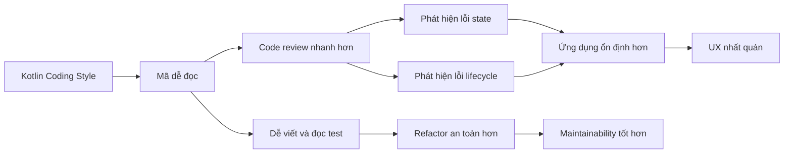
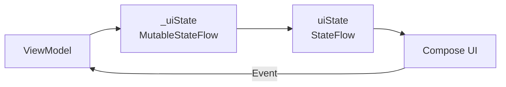
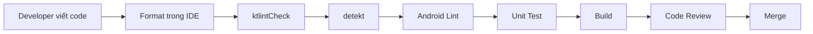

# 013 — Kotlin Coding Style

> **Học phần:** 01 — Language and Android Fundamentals
> **Module:** Module 01 — Pick a Language
> **Nhóm nội dung:** Kotlin Essentials
> **Nguồn roadmap:** Pick a Language / Kotlin Essentials
> **Loại bài:** Lesson
> **Thứ tự trong module:** 013
> **Thời lượng gợi ý:** 24 phút

---

## 1. Tóm tắt

**Kotlin Coding Style** là tập hợp các quy tắc và quy ước giúp mã Kotlin:

* Dễ đọc và dễ hiểu.
* Nhất quán giữa các thành viên trong nhóm.
* Dễ review, kiểm thử và bảo trì.
* Giảm nguy cơ hiểu sai state, luồng dữ liệu hoặc hành vi của ứng dụng.
* Dễ kiểm tra tự động bằng formatter, lint và static analysis.

Trong dự án Android, coding style không chỉ là chuyện căn lề hoặc đặt dấu cách. Nó còn liên quan đến:

* Cách đặt tên cho `Activity`, `ViewModel`, `Repository`, `UiState` và sự kiện.
* Cách tổ chức file, package và import.
* Cách viết hàm xử lý state và network result.
* Cách trình bày Jetpack Compose.
* Cách viết test để người khác hiểu nhanh mục đích của từng trường hợp.

Google có một **Android Kotlin Style Guide** riêng, trong khi Kotlin cũng có bộ coding conventions chính thức. Hai bộ quy tắc có một số khác biệt, vì vậy dự án cần chọn một chuẩn thống nhất và cấu hình công cụ tự động kiểm tra chuẩn đó.

---

## 2. Mục tiêu học tập

Sau bài học, bạn có thể:

* Giải thích Kotlin Coding Style bằng ngôn ngữ của mình.
* Phân biệt coding style với logic nghiệp vụ và kiến trúc.
* Đặt tên class, function, property, constant và package đúng quy ước.
* Viết mã Kotlin dễ đọc trong `ViewModel`, repository và Compose.
* Sử dụng formatter, Android Lint, ktlint hoặc detekt để kiểm tra code.
* Refactor một đoạn mã khó đọc thành mã rõ ràng hơn.
* Tạo một artifact nhỏ để đưa vào portfolio.

---

## 3. Ghi chú năm dòng

1. Kotlin Coding Style là bộ quy tắc giúp mã nguồn Kotlin nhất quán và dễ đọc.
2. Class thường dùng `PascalCase`, còn hàm và biến thường dùng `camelCase`.
3. Một file nên tập trung vào một chủ đề thay vì chứa nhiều thành phần không liên quan.
4. Formatter và lint giúp phát hiện hoặc tự động sửa nhiều lỗi trình bày.
5. Coding style tốt không tự sửa lỗi lifecycle, nhưng giúp developer nhận ra và kiểm soát lỗi dễ hơn.

---

## 4. Coding style không phải là gì?

Coding style **không phải** là toàn bộ chất lượng phần mềm.

Ví dụ:

```kotlin
fun loadUser() {
    viewModelScope.launch {
        repository.getUser()
    }
}
```

Đoạn code trên có thể được căn lề đúng và đặt tên tương đối rõ, nhưng vẫn có thể thiếu:

* Loading state.
* Xử lý lỗi mạng.
* Cơ chế retry.
* Cập nhật UI state.
* Test.
* Quy tắc tránh gọi API nhiều lần.

Vì vậy:

```text
Coding style tốt ≠ Logic luôn đúng
Coding style tốt ≠ Kiến trúc luôn tốt
Coding style tốt ≠ Ứng dụng không có bug
```

Coding style tạo ra một **nền tảng đọc hiểu chung**, từ đó giúp developer review logic, state và lifecycle hiệu quả hơn.

---

## 5. Vị trí của Kotlin Coding Style trong ứng dụng Android



Coding style ảnh hưởng chủ yếu đến **maintainability** và **reliability**. Tác động đến UX và performance thường là gián tiếp.

Ví dụ, tên `isLoading` rõ ràng hơn `check`, giúp reviewer nhận ra UI có thể đang hiển thị loading vô hạn. Tuy nhiên, việc đổi tên biến không tự động giải quyết lỗi loading.

---

# 6. Những quy tắc quan trọng

## 6.1. Chọn một chuẩn thống nhất

Trong dự án Android, bạn thường gặp hai nguồn quy ước:

1. **Kotlin Coding Conventions** của Kotlin.
2. **Google Android Kotlin Style Guide**.

Không nên để mỗi developer sử dụng một kiểu khác nhau. Hãy chọn một chuẩn cho toàn bộ repository và cấu hình IDE, `.editorconfig` cùng CI theo chuẩn đó.

Kotlin cũng lưu ý rằng ktlint mặc định đi theo Kotlin conventions; nếu nhóm muốn dùng Android Kotlin style, có thể đặt `ktlint_code_style = android_studio` trong `.editorconfig`.

---

## 6.2. Quy tắc đặt tên

| Thành phần               | Quy tắc                         | Ví dụ tốt              | Ví dụ không nên dùng  |
| ------------------------ | ------------------------------- | ---------------------- | --------------------- |
| Package                  | Chữ thường                      | `com.example.profile`  | `com.example.Profile` |
| Class                    | `PascalCase`                    | `UserRepository`       | `user_repository`     |
| Interface                | `PascalCase`                    | `UserDataSource`       | `IUserDataSource`     |
| Function                 | `camelCase`, thường là động từ  | `loadUserProfile()`    | `UserProfile()`       |
| Property                 | `camelCase`                     | `currentUser`          | `Current_User`        |
| Boolean                  | Diễn đạt trạng thái             | `isLoading`            | `loadingCheck`        |
| Constant                 | `UPPER_SNAKE_CASE`              | `MAX_RETRY_COUNT`      | `maxRetryCount`       |
| Composable trả về `Unit` | `PascalCase`, thường là danh từ | `ProfileScreen()`      | `renderProfile()`     |
| Test class               | Tên class + `Test`              | `ProfileViewModelTest` | `TestProfileVM`       |

Theo Android Kotlin Style Guide, package dùng chữ thường; class dùng PascalCase; function dùng camelCase; constant dùng `UPPER_SNAKE_CASE`. Các Composable trả về `Unit` được đặt tên bằng PascalCase giống như một type.

### Ví dụ

```kotlin
package com.example.profile

private const val MAX_RETRY_COUNT = 3

data class UserProfile(
    val displayName: String,
    val avatarUrl: String?
)

class ProfileRepository {

    suspend fun loadUserProfile(userId: String): UserProfile {
        TODO("Load profile")
    }
}
```

### Đặt tên theo ý nghĩa nghiệp vụ

Không nên:

```kotlin
fun doIt(data: String): Boolean
```

Nên:

```kotlin
fun isEmailAddressValid(emailAddress: String): Boolean
```

Tên dài hơn một chút nhưng giúp người đọc hiểu:

* Hàm kiểm tra điều gì.
* Tham số đại diện cho dữ liệu gì.
* Kết quả `Boolean` có ý nghĩa như thế nào.

---

## 6.3. Tránh tên quá chung chung

Các tên sau thường không truyền tải đủ ý nghĩa:

```text
data
item
value
temp
obj
manager
helper
util
doSomething
handleData
```

Không phải lúc nào chúng cũng sai, nhưng nên thay bằng tên cụ thể theo ngữ cảnh.

```kotlin
// Khó hiểu
fun handleData(data: List<String>) { }

// Rõ hơn
fun saveRecentSearchQueries(searchQueries: List<String>) { }
```

Kotlin conventions khuyến nghị tên class thường là danh từ, hàm thường là động từ và tránh các từ quá chung chung không mô tả mục đích của thành phần.

---

## 6.4. Tên Boolean nên tạo thành một câu hỏi

```kotlin
val isLoading: Boolean
val hasInternetConnection: Boolean
val canSubmitForm: Boolean
val shouldShowRetryButton: Boolean
```

Khi sử dụng, code đọc gần giống ngôn ngữ tự nhiên:

```kotlin
if (uiState.canSubmitForm) {
    submitProfile()
}
```

Không nên:

```kotlin
val submit: Boolean
val internet: Boolean
val loadingStatusFlag: Boolean
```

---

## 6.5. Tên state và event trong Android

### UI state

```kotlin
data class ProfileUiState(
    val isLoading: Boolean = false,
    val profile: UserProfile? = null,
    val errorMessage: String? = null
)
```

### UI event

```kotlin
sealed interface ProfileEvent {
    data object RetryClicked : ProfileEvent
    data object RefreshRequested : ProfileEvent
    data class NameChanged(val name: String) : ProfileEvent
}
```

### UI effect

```kotlin
sealed interface ProfileEffect {
    data class ShowMessage(val message: String) : ProfileEffect
    data object NavigateBack : ProfileEffect
}
```

Cách đặt tên này giúp phân biệt:

* `UiState`: dữ liệu tồn tại để render giao diện.
* `Event`: hành động được gửi vào hệ thống.
* `Effect`: hành động một lần như điều hướng hoặc hiển thị snackbar.

Đây là quy ước thiết kế của dự án, không phải cú pháp bắt buộc của Kotlin. Điều quan trọng là nhóm sử dụng nhất quán.

---

# 7. Tổ chức file Kotlin

## 7.1. Tên file

Khi file chỉ chứa một class chính, tên file nên trùng với tên class:

```text
ProfileViewModel.kt
ProfileRepository.kt
ProfileUiState.kt
```

Không nên:

```text
profile_vm.kt
AllProfileStuff.kt
Utils.kt
```

Kotlin và Android style guide đều khuyến nghị file chứa một class chính nên sử dụng tên class tương ứng; file có nhiều top-level declaration cần được đặt tên theo nội dung thực tế.

---

## 7.2. Một file nên tập trung vào một chủ đề

Không nên tạo một file như sau:

```text
AppUtils.kt
├── Hàm định dạng ngày
├── Hàm gọi API
├── Hàm kiểm tra email
├── Hàm điều hướng
└── Hàm chuyển đổi tiền tệ
```

Nên tách theo trách nhiệm:

```text
DateFormatter.kt
EmailValidator.kt
CurrencyFormatter.kt
NavigationExtensions.kt
```

Android Kotlin Style Guide cho phép nhiều declaration trong một file nhưng yêu cầu nội dung nên tập trung vào một chủ đề logic.

---

## 7.3. Cấu trúc package gợi ý

```text
com.example.taskapp
├── data
│   ├── local
│   ├── remote
│   ├── model
│   └── repository
├── domain
│   ├── model
│   └── usecase
└── feature
    └── task
        ├── TaskScreen.kt
        ├── TaskViewModel.kt
        ├── TaskUiState.kt
        └── TaskEvent.kt
```

Package nên được đặt tên bằng chữ thường và không dùng dấu gạch dưới. Android style guide yêu cầu các từ liên tiếp trong package được viết thường và ghép lại.

---

# 8. Căn lề và định dạng

## 8.1. Sử dụng bốn dấu cách

```kotlin
fun loadProfile() {
    if (userId.isNotBlank()) {
        requestProfile(userId)
    }
}
```

Android Kotlin Style Guide sử dụng bốn dấu cách cho mỗi cấp indent, không dùng tab để căn lề.

---

## 8.2. Một statement trên một dòng

Không nên:

```kotlin
val name = "An"; val age = 23; println(name)
```

Nên:

```kotlin
val name = "An"
val age = 23

println(name)
```

Android style không sử dụng dấu chấm phẩy để ghép nhiều statement trên cùng một dòng.

---

## 8.3. Giới hạn độ dài dòng

Android Kotlin Style Guide đặt giới hạn thông thường là **100 ký tự cho một dòng**, ngoại trừ một số trường hợp như package, import hoặc URL dài trong tài liệu.

Không nên:

```kotlin
fun createProfile(name: String, email: String, avatarUrl: String?, biography: String, isPublic: Boolean): UserProfile {
```

Nên:

```kotlin
fun createProfile(
    name: String,
    email: String,
    avatarUrl: String?,
    biography: String,
    isPublic: Boolean
): UserProfile {
    TODO()
}
```

---

## 8.4. Không sử dụng wildcard import

Không nên:

```kotlin
import androidx.compose.material3.*
```

Nên:

```kotlin
import androidx.compose.material3.Button
import androidx.compose.material3.Text
```

Google Android Kotlin Style không cho phép wildcard import và yêu cầu import được sắp xếp trong một danh sách.

---

## 8.5. Dấu phẩy cuối dòng

Trailing comma có thể giúp diff rõ ràng hơn khi thêm tham số mới:

```kotlin
data class UserProfile(
    val id: String,
    val displayName: String,
    val avatarUrl: String?,
)
```

Tuy nhiên, Android style guide và Kotlin conventions có thể có khác biệt trong một số quy tắc formatter. Vì thế không nên chỉnh thủ công theo sở thích cá nhân; hãy để cấu hình chung của dự án quyết định.

---

# 9. Sử dụng `val` và `var`

Ưu tiên `val` khi tham chiếu không cần được gán lại:

```kotlin
val userName = "An"
val userIds = listOf("1", "2", "3")
```

Chỉ sử dụng `var` khi thực sự cần thay đổi giá trị:

```kotlin
var retryCount = 0
retryCount += 1
```

Không nên dùng `var` theo thói quen:

```kotlin
var apiUrl = "https://example.com"
```

Trong ví dụ này, nếu `apiUrl` không được gán lại thì nên dùng `val`.

Điều này không biến mọi object thành immutable. Ví dụ sau sử dụng `val`, nhưng nội dung collection vẫn có thể thay đổi:

```kotlin
val users = mutableListOf<String>()
users.add("An")
```

---

# 10. Type inference và kiểu dữ liệu tường minh

## Có thể dùng type inference khi kiểu dữ liệu rõ ràng

```kotlin
val retryCount = 3
val displayName = "An"
val isLoading = false
```

## Nên ghi kiểu khi nó làm API rõ hơn

```kotlin
private val _uiState: MutableStateFlow<ProfileUiState> =
    MutableStateFlow(ProfileUiState())

val uiState: StateFlow<ProfileUiState> = _uiState
```

Hoặc khi giá trị ban đầu không thể hiện đầy đủ ý nghĩa:

```kotlin
val selectedUserId: String? = null
```

Mục tiêu không phải là viết ít ký tự nhất mà là giúp người đọc hiểu đúng contract của code.

---

# 11. Viết function dễ đọc

## 11.1. Một function nên có một trách nhiệm rõ ràng

Không nên:

```kotlin
fun loadProfile() {
    // Gọi API
    // Parse JSON
    // Ghi database
    // Chuyển sang UI model
    // Điều hướng
    // Hiển thị thông báo
}
```

Nên:

```kotlin
suspend fun loadProfile(userId: String): UserProfile {
    val response = profileApi.getProfile(userId)
    val entity = response.toEntity()

    profileDao.insert(entity)

    return entity.toDomainModel()
}
```

Những hành vi điều hướng hoặc hiển thị message nên được chuyển thành state/effect để UI xử lý.

---

## 11.2. Sử dụng early return để giảm lồng nhau

### Khó đọc

```kotlin
fun submitForm(name: String, email: String) {
    if (name.isNotBlank()) {
        if (email.isNotBlank()) {
            if (isValidEmail(email)) {
                saveProfile(name, email)
            }
        }
    }
}
```

### Dễ đọc hơn

```kotlin
fun submitForm(name: String, email: String) {
    if (name.isBlank()) return
    if (email.isBlank()) return
    if (!isValidEmail(email)) return

    saveProfile(name, email)
}
```

Trong code production, bạn có thể trả về lỗi cụ thể thay vì im lặng `return`.

---

## 11.3. Không lạm dụng expression body

Expression body phù hợp với hàm ngắn:

```kotlin
fun isValidName(name: String): Boolean = name.length >= 2
```

Hàm có nhiều bước nên dùng block body:

```kotlin
fun createDisplayName(
    firstName: String,
    lastName: String
): String {
    val normalizedFirstName = firstName.trim()
    val normalizedLastName = lastName.trim()

    return "$normalizedFirstName $normalizedLastName"
}
```

Không nên cố ép toàn bộ logic vào một expression dài chỉ để code trông “Kotlin hơn”.

---

# 12. Scope function và coding style

`let`, `run`, `with`, `apply` và `also` có thể làm code ngắn hơn, nhưng lồng nhiều scope function khiến receiver trở nên khó xác định.

## Khó đọc

```kotlin
user?.let {
    it.profile?.let {
        it.avatar?.let {
            imageLoader.load(it)
        }
    }
}
```

Biến `it` trong mỗi cấp mang ý nghĩa khác nhau.

## Rõ hơn

```kotlin
val profile = user?.profile ?: return
val avatar = profile.avatar ?: return

imageLoader.load(avatar)
```

Hoặc sử dụng tên tham số rõ ràng:

```kotlin
user?.profile?.avatar?.let { avatar ->
    imageLoader.load(avatar)
}
```

Scope function là công cụ, không phải mục tiêu. Không nên đánh giá code “idiomatic” chỉ dựa trên số lượng `let` hoặc `apply`.

---

# 13. Coding style cho Jetpack Compose

## 13.1. Tên Composable

Composable trả về `Unit` được đặt tên bằng `PascalCase`:

```kotlin
@Composable
fun ProfileScreen(
    uiState: ProfileUiState,
    onEvent: (ProfileEvent) -> Unit
) {
    // Render UI
}
```

Không nên:

```kotlin
@Composable
fun renderProfileScreen() { }
```

Quy tắc PascalCase cho Composable trả về `Unit` được nêu trong cả Kotlin conventions và Android Kotlin Style Guide.

---

## 13.2. State đi xuống, event đi lên

```kotlin
@Composable
fun ProfileScreen(
    uiState: ProfileUiState,
    onRetryClick: () -> Unit,
    onNameChange: (String) -> Unit
) {
    // UI chỉ render state và phát sự kiện
}
```

Cách đặt tham số rõ ràng giúp người đọc biết:

* Dữ liệu nào là input.
* Callback nào là event.
* Composable có sở hữu state hay không.

---

## 13.3. Tách screen và content

```kotlin
@Composable
fun ProfileRoute(
    viewModel: ProfileViewModel
) {
    val uiState by viewModel.uiState.collectAsStateWithLifecycle()

    ProfileScreen(
        uiState = uiState,
        onEvent = viewModel::onEvent
    )
}

@Composable
fun ProfileScreen(
    uiState: ProfileUiState,
    onEvent: (ProfileEvent) -> Unit
) {
    // Stateless UI
}
```

Tên `Route` và `Screen` không phải quy tắc bắt buộc của Kotlin, nhưng là một convention hữu ích nếu toàn bộ dự án sử dụng nhất quán.

---

# 14. Ví dụ trước và sau khi refactor

## 14.1. Phiên bản khó đọc

```kotlin
class profilevm(
    val r: Repo
) : ViewModel() {
    var d = MutableStateFlow<List<User>>(listOf())

    fun get() {
        viewModelScope.launch {
            try {
                d.value = r.get()
            } catch (e: Exception) {
                println(e)
            }
        }
    }
}
```

### Vấn đề

* Tên class không dùng PascalCase.
* `r`, `d` và `get()` không truyền đạt ý nghĩa.
* Mutable state được công khai.
* Không có loading state.
* Không có error state.
* Dùng `println()` thay cho cơ chế logging hoặc state.
* UI không biết request thất bại.
* Repository interface không rõ chức năng.

---

## 14.2. Phiên bản rõ ràng hơn

```kotlin
data class UserListUiState(
    val isLoading: Boolean = false,
    val users: List<User> = emptyList(),
    val errorMessage: String? = null
)

class UserListViewModel(
    private val userRepository: UserRepository
) : ViewModel() {

    private val _uiState = MutableStateFlow(UserListUiState())
    val uiState: StateFlow<UserListUiState> = _uiState.asStateFlow()

    fun loadUsers() {
        viewModelScope.launch {
            _uiState.update { currentState ->
                currentState.copy(
                    isLoading = true,
                    errorMessage = null
                )
            }

            runCatching {
                userRepository.getUsers()
            }.onSuccess { users ->
                _uiState.update { currentState ->
                    currentState.copy(
                        isLoading = false,
                        users = users
                    )
                }
            }.onFailure { error ->
                _uiState.update { currentState ->
                    currentState.copy(
                        isLoading = false,
                        errorMessage = error.message ?: "Unknown error"
                    )
                }
            }
        }
    }
}
```

### Cải thiện đạt được

* Tên class và function thể hiện đúng vai trò.
* Mutable state được ẩn bằng `_uiState`.
* Public state chỉ cho phép quan sát.
* Loading, success và error được thể hiện rõ.
* Luồng cập nhật state dễ review.
* Có thể viết test cho từng trạng thái.

Coding style không tự tạo ra kiến trúc này, nhưng quy ước đặt tên và trình bày rõ ràng giúp kiến trúc được thể hiện đúng hơn.

---

# 15. Backing property cho state

Một pattern phổ biến:

```kotlin
private val _uiState = MutableStateFlow(ProfileUiState())
val uiState: StateFlow<ProfileUiState> = _uiState.asStateFlow()
```

Dấu gạch dưới được dùng cho private backing property khi private property và public property đại diện cho cùng một khái niệm. Quy ước này được mô tả trong cả Kotlin conventions và Android Kotlin Style Guide.

Sơ đồ:



UI có thể quan sát `uiState`, nhưng không thể tự ý thay đổi `_uiState`.

---

# 16. Comment và KDoc

## 16.1. Comment nên giải thích “tại sao”

Không nên:

```kotlin
// Tăng retryCount lên 1
retryCount += 1
```

Code đã tự mô tả hành động.

Nên:

```kotlin
// Backend có thể trả về 503 trong thời gian chuyển vùng,
// vì vậy request được thử lại tối đa ba lần.
retryCount += 1
```

Comment này giải thích lý do nghiệp vụ hoặc kỹ thuật.

---

## 16.2. Dùng KDoc cho public API quan trọng

```kotlin
/**
 * Tải hồ sơ người dùng từ local cache hoặc remote API.
 *
 * @param userId mã định danh của người dùng.
 * @return hồ sơ đã được chuyển sang domain model.
 * @throws ProfileNotFoundException khi không tồn tại hồ sơ.
 */
suspend fun getUserProfile(userId: String): UserProfile
```

KDoc sử dụng comment bắt đầu bằng `/**` và hỗ trợ cú pháp Markdown cùng các tag như `@param`, `@return`, `@throws` và `@property`.

Không cần viết KDoc cho mọi private function đơn giản. Quá nhiều tài liệu không có giá trị sẽ làm code khó bảo trì.

---

# 17. Android Studio hỗ trợ coding style

## Reformat code

* **Windows/Linux:** `Ctrl + Alt + L`
* **macOS:** `Option + Command + L`

## Auto-indent

* **Windows/Linux:** `Ctrl + Alt + I`
* **macOS:** `Control + Option + I`

Android Studio cho phép cấu hình indentation, spaces, wrapping, braces và blank lines tại:

```text
File
└── Settings
    └── Editor
        └── Code Style
            └── Kotlin
```

Android Studio có thể áp dụng code style khi chỉnh sửa và cho phép gọi lệnh Reformat Code thủ công.

> Formatter chỉ sửa cách trình bày. Nó không biết logic nghiệp vụ của bạn có đúng hay không.

---

# 18. Công cụ kiểm tra chất lượng

## 18.1. Android Lint

Chạy trên Windows:

```bash
gradlew lint
```

Chạy trên Linux hoặc macOS:

```bash
./gradlew lint
```

Lint có thể kiểm tra các vấn đề về:

* Correctness.
* Security.
* Performance.
* Usability.
* Accessibility.
* Internationalization.
* API compatibility.

Android Lint phân tích cấu trúc dự án mà không cần chạy toàn bộ ứng dụng; tài liệu Android khuyến nghị sửa lỗi lint trước khi phát hành và chạy lint trong CI.

---

## 18.2. ktlint

Kiểm tra:

```bash
./gradlew ktlintCheck
```

Tự động sửa các lỗi đơn giản:

```bash
./gradlew ktlintFormat
```

Cấu hình Android style:

```ini
[*.{kt,kts}]
ktlint_code_style = android_studio
```

ktlint tập trung vào các quy tắc như indentation, spacing, import ordering và trailing comma.

---

## 18.3. detekt

Chạy phân tích:

```bash
./gradlew detekt
```

detekt thường được sử dụng để tìm:

* Hàm quá dài.
* Class quá phức tạp.
* Magic number.
* Code smell.
* Duplicate logic.
* Exception handling không phù hợp.
* Các vấn đề có khả năng gây bug.

Trong tài liệu Kotlin, detekt được giới thiệu như một công cụ static analysis phát hiện code smell, complexity issue và potential bug.

---

## 18.4. Quality gate đề xuất



Một pull request có thể yêu cầu:

```text
✓ Formatter không tạo thêm thay đổi
✓ ktlint không có lỗi
✓ detekt không có lỗi nghiêm trọng
✓ Android Lint vượt qua
✓ Unit test vượt qua
✓ Reviewer hiểu tên state và event
```

---

# 19. Coding style và testing

Coding style không được kiểm tra bằng unit test theo cách kiểm tra nghiệp vụ. Tuy nhiên, code được tách và đặt tên tốt sẽ dễ test hơn.

## Logic cần kiểm thử

```kotlin
class ProfileValidator {

    fun isValidDisplayName(displayName: String): Boolean {
        val normalizedName = displayName.trim()

        return normalizedName.length in 2..40
    }
}
```

## Unit test

```kotlin
class ProfileValidatorTest {

    private val validator = ProfileValidator()

    @Test
    fun validName_returnsTrue() {
        val result = validator.isValidDisplayName("An Khánh")

        assertTrue(result)
    }

    @Test
    fun oneCharacterName_returnsFalse() {
        val result = validator.isValidDisplayName("A")

        assertFalse(result)
    }

    @Test
    fun surroundingSpaces_areIgnored() {
        val result = validator.isValidDisplayName("  An  ")

        assertTrue(result)
    }
}
```

Android style cho phép sử dụng dấu gạch dưới trong tên test function để tách các thành phần logic. Android không khuyến nghị tên test có khoảng trắng vì mức hỗ trợ runtime không đồng nhất trên mọi phiên bản.

Một convention test dễ đọc:

```text
condition_expectedResult
```

Ví dụ:

```text
emptyEmail_returnsFalse
networkFailure_showsRetryButton
cachedDataExists_skipsRemoteRequest
```

---

# 20. Ảnh hưởng đến lifecycle và state

## Coding style tốt giúp phát hiện lỗi lifecycle

Xem hai tên function:

```kotlin
fun init()
fun loadProfileIfNeeded()
```

Tên thứ hai cho biết function có điều kiện tránh gọi lại không cần thiết.

Ví dụ:

```kotlin
fun loadProfileIfNeeded() {
    if (uiState.value.profile != null) return
    if (uiState.value.isLoading) return

    loadProfile()
}
```

Tên và cấu trúc code giúp reviewer đặt câu hỏi:

* Khi rotate màn hình, `ViewModel` còn tồn tại không?
* Composable recomposition có gọi lại API không?
* Có kiểm tra request đang chạy không?
* State có được giữ trong `ViewModel` không?
* One-time effect có bị phát lại không?

Coding style không giải quyết các câu hỏi trên, nhưng làm cho luồng xử lý đủ rõ để kiểm tra.

---

# 21. Ảnh hưởng đến UX, reliability và maintainability

| Khía cạnh       | Tác động của coding style                                             |
| --------------- | --------------------------------------------------------------------- |
| UX              | Gián tiếp giúp tránh loading vô hạn, message sai hoặc state không rõ  |
| Reliability     | Giúp reviewer theo dõi luồng success/error dễ hơn                     |
| Maintainability | Giảm thời gian đọc, sửa và mở rộng code                               |
| Performance     | Tác động gián tiếp; code rõ giúp phát hiện vòng lặp hoặc request thừa |
| Testing         | Hàm và trách nhiệm rõ ràng dễ kiểm thử hơn                            |
| Debugging       | Tên biến và state rõ giúp đọc log, breakpoint và stack trace          |
| Release risk    | CI có thể chặn code vi phạm lint hoặc quality rules                   |

> Một đoạn code đẹp nhưng gọi API trong mỗi lần recomposition vẫn là code có lỗi.

---

# 22. Sai lầm junior thường gặp

## Sai lầm 1: Chỉ quan tâm căn lề

Developer chạy formatter và cho rằng code đã “clean”.

```kotlin
fun process(data: Any) {
    // Một hàm dài 300 dòng
}
```

Formatter không sửa được:

* Tên không rõ.
* Trách nhiệm quá lớn.
* Coupling.
* State mutation.
* Xử lý lỗi thiếu.
* Logic khó test.

---

## Sai lầm 2: Dùng tên viết tắt quá nhiều

```kotlin
class PVM(
    private val repo: PR
)
```

Nên:

```kotlin
class ProfileViewModel(
    private val profileRepository: ProfileRepository
)
```

Các tên quen thuộc như `id`, `url`, `ui`, `api` có thể chấp nhận được. Nhưng không nên tự tạo viết tắt mà chỉ người viết hiểu.

---

## Sai lầm 3: Lạm dụng `it`

```kotlin
users.filter {
    it.profile?.let {
        it.isActive
    } == true
}
```

Rõ hơn:

```kotlin
users.filter { user ->
    user.profile?.isActive == true
}
```

---

## Sai lầm 4: Comment lại chính code

```kotlin
// Kiểm tra isLoading bằng true
if (isLoading == true) {
}
```

Nên viết code trực tiếp:

```kotlin
if (isLoading) {
}
```

---

## Sai lầm 5: Trộn nhiều tầng trong một file

```text
ProfileScreen.kt
├── API response
├── Room entity
├── Repository implementation
├── ViewModel
├── Composable
└── Unit test
```

Điều này làm file khó điều hướng, tăng merge conflict và làm ranh giới trách nhiệm không rõ ràng.

---

## Sai lầm 6: Format cả repository trong một pull request

Một pull request chỉ sửa tính năng nhỏ nhưng đồng thời format hàng trăm file sẽ:

* Tạo diff rất lớn.
* Làm code review khó khăn.
* Dễ gây conflict.
* Che khuất thay đổi nghiệp vụ.

Nên tách migration style thành pull request riêng.

---

# 23. Bài thực hành 24 phút

## Phút 0–4: Đọc và xác định vấn đề

Đọc đoạn code:

```kotlin
class vm(val r: UserRepo) : ViewModel() {
    var s = MutableStateFlow(false)
    var d = MutableStateFlow<List<User>>(listOf())

    fun x() {
        viewModelScope.launch {
            s.value = true
            d.value = r.g()
            s.value = false
        }
    }
}
```

Liệt kê ít nhất năm vấn đề.

---

## Phút 4–10: Refactor naming và state

Chuyển thành:

```kotlin
data class UserListUiState(
    val isLoading: Boolean = false,
    val users: List<User> = emptyList(),
    val errorMessage: String? = null
)

class UserListViewModel(
    private val userRepository: UserRepository
) : ViewModel() {

    private val _uiState = MutableStateFlow(UserListUiState())
    val uiState = _uiState.asStateFlow()

    fun loadUsers() {
        // Implement
    }
}
```

---

## Phút 10–15: Hoàn thiện error handling

Yêu cầu:

* Hiển thị loading trước khi gọi repository.
* Cập nhật user khi thành công.
* Cập nhật error khi thất bại.
* Luôn đưa `isLoading` về `false`.

---

## Phút 15–18: Format và lint

Thực hiện:

```text
Ctrl + Alt + L
```

Sau đó chạy:

```bash
./gradlew lint
```

Nếu dự án có ktlint:

```bash
./gradlew ktlintCheck
```

---

## Phút 18–21: Viết unit test

Viết test cho mapper hoặc validator được sử dụng trong màn hình.

---

## Phút 21–24: Tạo README artifact

Chụp:

1. Code trước refactor.
2. Code sau refactor.
3. Kết quả test.
4. Kết quả lint.

---

# 24. Artifact nhỏ cho portfolio

## Cấu trúc thư mục

```text
kotlin-coding-style-demo/
├── README.md
├── before/
│   └── UserListViewModel.kt
├── after/
│   ├── UserListUiState.kt
│   ├── UserListViewModel.kt
│   └── UserRepository.kt
├── test/
│   └── UserListViewModelTest.kt
└── screenshots/
    ├── before-refactor.png
    ├── after-refactor.png
    └── lint-result.png
```

## Nội dung README gợi ý

```markdown
# Kotlin Coding Style Refactor

## Mục tiêu

Refactor một ViewModel khó đọc thành code có naming, state management
và error handling rõ ràng hơn.

## Vấn đề ban đầu

- Tên class và function không thể hiện ý nghĩa.
- Mutable state được công khai.
- Không có error state.
- Không thể phân biệt loading, success và failure.

## Thay đổi

- Sử dụng `UserListUiState`.
- Dùng private backing property `_uiState`.
- Đặt tên function theo hành vi.
- Bổ sung unit test và Android Lint.

## Kết quả

- Code dễ review hơn.
- State transition rõ ràng.
- Có thể test success và error độc lập.
```

---

# 25. Bài tập

## Yêu cầu

Xây dựng một màn hình tìm kiếm sản phẩm gồm:

* `SearchUiState`.
* `SearchEvent`.
* `SearchViewModel`.
* `ProductRepository`.
* Một Composable `SearchScreen`.
* Một validator cho từ khóa tìm kiếm.
* Ít nhất ba unit test.

## Quy tắc

* Package dùng chữ thường.
* Class và Composable dùng PascalCase.
* Hàm và property dùng camelCase.
* Không sử dụng wildcard import.
* Không sử dụng tên một ký tự, trừ index hoặc tọa độ cục bộ hợp lý.
* Mutable state không được public.
* Hàm dài phải được tách theo trách nhiệm.
* Chạy formatter và lint trước khi hoàn thành.

## Câu hỏi giải thích

1. Coding style đã giúp bạn phát hiện vấn đề state nào?
2. Function nào dễ test hơn sau khi refactor?
3. Coding style có tự ngăn request bị gọi lại khi rotate không?
4. Bạn sẽ thêm quality gate nào vào CI?
5. Quy ước nào là quy tắc chính thức và quy ước nào do dự án tự chọn?

---

# 26. Checklist code review

## Naming

* [ ] Class và interface dùng PascalCase.
* [ ] Function và property dùng camelCase.
* [ ] Boolean bắt đầu bằng `is`, `has`, `can` hoặc `should` khi phù hợp.
* [ ] Constant dùng `UPPER_SNAKE_CASE`.
* [ ] Tên không dùng viết tắt khó hiểu.
* [ ] Composable trả về `Unit` dùng PascalCase.

## File và package

* [ ] Tên file phản ánh declaration chính.
* [ ] Package dùng chữ thường.
* [ ] File tập trung vào một chủ đề.
* [ ] Không dùng wildcard import.
* [ ] Không có file `Utils.kt` chứa nhiều chức năng không liên quan.

## Function

* [ ] Function có mục tiêu rõ ràng.
* [ ] Không lồng điều kiện quá sâu.
* [ ] Không lạm dụng scope function.
* [ ] Tham số có tên thể hiện ý nghĩa.
* [ ] Logic có thể tách test đã được tách khỏi Android framework.

## State và lifecycle

* [ ] Mutable state được giới hạn phạm vi.
* [ ] Loading, success và error được biểu diễn rõ.
* [ ] Không gọi API trực tiếp trong mỗi lần recomposition.
* [ ] Không phát lại one-time effect ngoài ý muốn.
* [ ] State quan trọng không bị mất khi rotate hoặc background.

## Tooling

* [ ] Code đã được format.
* [ ] Android Lint không có lỗi nghiêm trọng.
* [ ] ktlint hoặc formatter check đã vượt qua.
* [ ] detekt không phát hiện complexity nghiêm trọng.
* [ ] Unit test đã vượt qua.

---

# 27. Checklist hoàn thành bài học

* [ ] Có định nghĩa ngắn gọn về Kotlin Coding Style.
* [ ] Phân biệt được coding style và kiến trúc.
* [ ] Biết quy tắc naming cơ bản.
* [ ] Có ví dụ trước và sau refactor.
* [ ] Có ví dụ trong ViewModel hoặc Compose.
* [ ] Có unit test nhỏ.
* [ ] Biết dùng Reformat Code.
* [ ] Biết vai trò của lint, ktlint và detekt.
* [ ] Có artifact nhỏ để đưa vào portfolio.
* [ ] Có ghi chú về lifecycle, state, testing và release.

---

# 28. Ghi chú production

Trước khi merge hoặc release, hãy hỏi:

1. Tên state có giúp reviewer hiểu chính xác UI đang ở trạng thái nào không?
2. Khi request lỗi, code có đưa loading về `false` không?
3. Khi rotate hoặc trở lại từ background, request có bị gọi lại không cần thiết không?
4. Mutable state có bị công khai cho UI không?
5. Tên function có thể hiện việc nó thay đổi state hay chỉ trả về dữ liệu không?
6. Comment có giải thích lý do hay chỉ lặp lại code?
7. Formatter, lint và static analysis có được chạy trong CI không?
8. Pull request có chứa thay đổi format không liên quan không?
9. Code mới có tuân theo cùng chuẩn với code cũ không?
10. Có test bảo vệ hành vi quan trọng trước khi refactor không?

Android khuyến nghị kiểm tra chức năng, hiệu năng và độ ổn định trước khi chuẩn bị bản release; lint và test nên là một phần của quá trình kiểm soát chất lượng chứ không chỉ được chạy ở cuối dự án.

---

# 29. Kết luận

Kotlin Coding Style không phải là cuộc thi viết code ngắn nhất. Mục tiêu của nó là làm cho ý định của code trở nên rõ ràng.

Một đoạn mã tốt nên giúp người đọc nhanh chóng trả lời được:

```text
Thành phần này làm gì?
Dữ liệu đi từ đâu đến đâu?
Ai được phép thay đổi state?
Khi lỗi xảy ra thì UI phản ứng thế nào?
Logic nào cần được kiểm thử?
```

Quy tắc quan trọng nhất trong dự án thực tế là:

> **Chọn một chuẩn hợp lý, áp dụng nhất quán và để công cụ tự động bảo vệ chuẩn đó.**

---

## Tài liệu và hình minh họa

* **Kotlin Coding Conventions:** quy tắc tổ chức file, naming và cấu hình IDE.
* **Android Kotlin Style Guide:** chuẩn Kotlin chính thức dành cho mã nguồn Android của Google.
* **Android Studio — Style and Formatting:** hình minh họa code trước và sau khi format cùng phím tắt formatter.
* **Android Lint:** quy trình quét mã nguồn và báo cáo lỗi chất lượng.
* **Kotlin Code Quality Tools:** hướng dẫn ktlint và detekt.
* **KDoc:** cú pháp tài liệu cho Kotlin.
