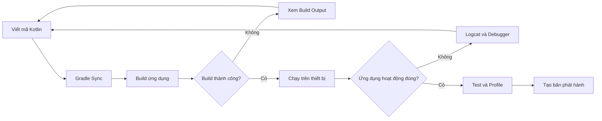
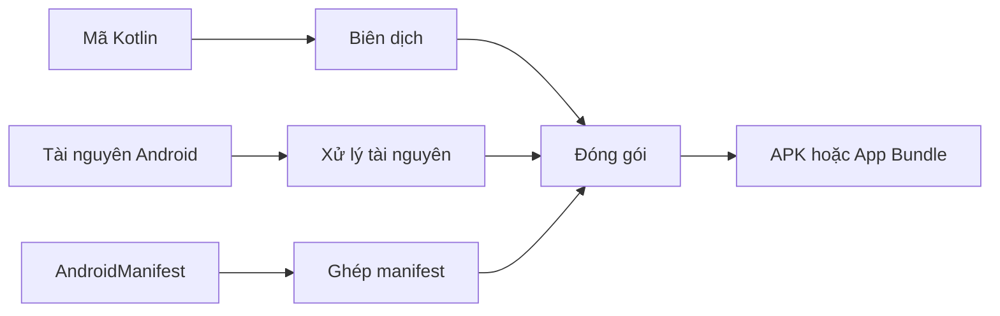
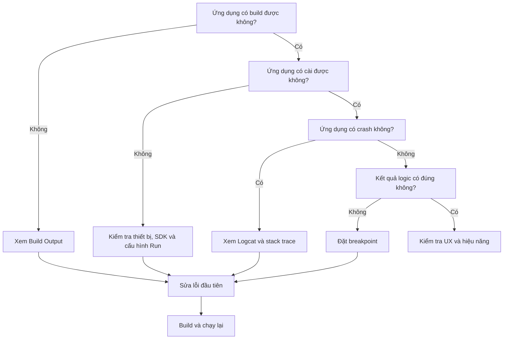

# 001 - Android Studio

| Thông tin               | Nội dung                               |
| ----------------------- | -------------------------------------- |
| **Học phần**            | 01 - Ngôn ngữ và nền tảng Android      |
| **Module**              | Module 02 - Android Fundamentals       |
| **Nhóm nội dung**       | Development IDE                        |
| **Nguồn roadmap**       | Android Fundamentals / Development IDE |
| **Loại bài**            | Lesson                                 |
| **Thứ tự trong module** | 001                                    |
| **Thời lượng gợi ý**    | 24 phút                                |

---

## 1. Tóm tắt

**Android Studio** là môi trường phát triển tích hợp chính thức dành cho ứng dụng Android. Công cụ này hỗ trợ gần như toàn bộ quy trình phát triển:

* Tạo và quản lý dự án.
* Viết mã Kotlin, Java hoặc C/C++.
* Thiết kế và xem trước giao diện.
* Biên dịch ứng dụng bằng Gradle.
* Chạy ứng dụng trên máy ảo hoặc thiết bị thật.
* Xem nhật ký bằng Logcat.
* Đặt breakpoint và gỡ lỗi.
* Kiểm thử và phân tích hiệu năng.
* Chuẩn bị bản dựng để phát hành.

Android Studio được xây dựng trên nền IntelliJ IDEA và bổ sung các công cụ chuyên biệt cho Android như Device Manager, Android Emulator, Layout Inspector, App Inspection và Android Profiler.

Sau bài học, bạn có thể tạo một ứng dụng Android đơn giản, chạy ứng dụng trên máy ảo, xem log và sử dụng debugger để tìm lỗi.

---

## 2. Mục tiêu học tập

Sau khi hoàn thành bài học, bạn có thể:

* [ ] Giải thích Android Studio là gì bằng ngôn ngữ của mình.
* [ ] Nhận biết các khu vực chính trong giao diện Android Studio.
* [ ] Tạo một dự án Android mới bằng Kotlin và Jetpack Compose.
* [ ] Hiểu cấu trúc cơ bản của một dự án Android.
* [ ] Phân biệt lỗi khi đồng bộ Gradle, lỗi biên dịch và lỗi khi chạy.
* [ ] Chạy ứng dụng trên Android Emulator hoặc thiết bị thật.
* [ ] Sử dụng Logcat để xem nhật ký và stack trace.
* [ ] Sử dụng breakpoint để kiểm tra giá trị của biến.
* [ ] Tạo một sản phẩm nhỏ có thể đưa vào portfolio.

---

## 3. Android Studio là gì?

Android Studio là một **IDE – Integrated Development Environment**, tức môi trường tích hợp nhiều công cụ cần thiết để phát triển phần mềm trong cùng một ứng dụng.

Thay vì phải sử dụng riêng lẻ trình soạn thảo mã, trình biên dịch, trình mô phỏng và trình gỡ lỗi, Android Studio tập hợp các công cụ này vào một quy trình thống nhất.

```text
Android Studio
├── Code Editor
├── Project Manager
├── Gradle Build System
├── Android SDK
├── Android Emulator
├── Debugger
├── Logcat
├── Layout Tools
├── Testing Tools
└── Performance Profiler
```

### Năm chức năng quan trọng nhất

| Chức năng   | Mục đích                                          |
| ----------- | ------------------------------------------------- |
| **Develop** | Viết và tổ chức mã nguồn Kotlin/Java              |
| **Build**   | Biên dịch mã nguồn thành ứng dụng Android         |
| **Run**     | Chạy ứng dụng trên thiết bị ảo hoặc thiết bị thật |
| **Debug**   | Tạm dừng chương trình và kiểm tra trạng thái      |
| **Profile** | Phân tích CPU, bộ nhớ, mạng và hiệu năng          |

---

## 4. Vai trò trong quy trình phát triển Android

Android Studio không trực tiếp quyết định kiến trúc ứng dụng, nhưng nó là nơi lập trình viên xây dựng, kiểm tra và xác minh toàn bộ hệ thống.



### Các loại vấn đề thường gặp

| Giai đoạn   | Ví dụ lỗi                 | Nơi kiểm tra           |
| ----------- | ------------------------- | ---------------------- |
| Gradle Sync | Không tải được dependency | Build hoặc Sync        |
| Compile     | Sai cú pháp, thiếu import | Editor và Build Output |
| Install     | Không cài được APK        | Run và Device Manager  |
| Runtime     | Ứng dụng bị crash         | Logcat                 |
| Logic       | Kết quả chạy sai          | Debugger và Unit Test  |
| Performance | UI giật, dùng nhiều RAM   | Profiler               |

---

## 5. Giao diện chính của Android Studio


*Nguồn ảnh: Android Developers.*

Giao diện Android Studio được chia thành sáu khu vực chính.

| Số trên ảnh | Thành phần          | Chức năng                                      |
| ----------: | ------------------- | ---------------------------------------------- |
|           1 | **Toolbar**         | Chạy, debug, chọn thiết bị và truy cập công cụ |
|           2 | **Navigation bar**  | Xác định vị trí hiện tại trong dự án           |
|           3 | **Editor**          | Viết và chỉnh sửa mã nguồn                     |
|           4 | **Tool window bar** | Mở Project, Build, Logcat, Gradle và Terminal  |
|           5 | **Tool windows**    | Hiển thị chi tiết từng công cụ                 |
|           6 | **Status bar**      | Hiển thị trạng thái IDE, encoding và cảnh báo  |

### Các cửa sổ nên nhớ

| Cửa sổ   | Công dụng                      | Phím tắt Windows/Linux             |
| -------- | ------------------------------ | ---------------------------------- |
| Project  | Xem cấu trúc dự án             | `Alt + 1`                          |
| Run      | Xem kết quả chạy               | `Shift + F10`                      |
| Debug    | Xem breakpoint và biến         | `Shift + F9`                       |
| Problems | Xem lỗi trong mã nguồn         | `Alt + 6`                          |
| Terminal | Chạy lệnh Gradle, Git hoặc ADB | `Alt + F12`                        |
| Logcat   | Xem log của ứng dụng           | Qua `View > Tool Windows > Logcat` |

> Mẹo: nhấn hai lần phím `Shift` để tìm file, class, cấu hình hoặc hành động trong Android Studio.

---

## 6. Cấu trúc dự án Android cơ bản

Một dự án Android Studio chứa mã nguồn, tài nguyên, cấu hình build và mã kiểm thử. Dự án có thể chứa một hoặc nhiều module; module `app` thường là module tạo ra ứng dụng chính.

```text
MyApplication/
├── app/
│   ├── src/
│   │   ├── main/
│   │   │   ├── java hoặc kotlin/
│   │   │   │   └── com.example.myapplication/
│   │   │   │       └── MainActivity.kt
│   │   │   ├── res/
│   │   │   │   ├── drawable/
│   │   │   │   ├── mipmap/
│   │   │   │   ├── values/
│   │   │   │   └── xml/
│   │   │   └── AndroidManifest.xml
│   │   ├── test/
│   │   └── androidTest/
│   └── build.gradle.kts
├── gradle/
├── build.gradle.kts
├── settings.gradle.kts
└── gradle.properties
```

### Ý nghĩa của các thành phần

| Thành phần            | Nội dung                                      |
| --------------------- | --------------------------------------------- |
| `MainActivity.kt`     | Điểm vào giao diện chính của ứng dụng         |
| `AndroidManifest.xml` | Khai báo Activity, quyền và cấu hình ứng dụng |
| `res/drawable`        | Ảnh, vector và shape                          |
| `res/mipmap`          | Biểu tượng launcher                           |
| `res/values`          | Chuỗi, màu, theme và dimension                |
| `test`                | Unit test chạy trên JVM                       |
| `androidTest`         | Test chạy trên thiết bị Android               |
| `build.gradle.kts`    | Plugin, dependency và cấu hình build          |
| `settings.gradle.kts` | Khai báo module và repository                 |

---

## 7. Gradle Sync và Build

Android Studio sử dụng **Gradle** để quản lý dependency và biên dịch dự án.

### Gradle Sync

Gradle Sync đọc các file cấu hình như:

```text
settings.gradle.kts
build.gradle.kts
gradle.properties
libs.versions.toml
```

Sau đó IDE:

1. Kiểm tra plugin.
2. Tải dependency cần thiết.
3. Xác định phiên bản SDK.
4. Cập nhật cấu trúc dự án.
5. Báo lỗi nếu cấu hình không hợp lệ.

### Build

Khi build, Gradle thực hiện các công việc như:



Android Studio hiển thị các task và lỗi Gradle trong cửa sổ **Build**. Khi build thất bại, nên đọc lỗi đầu tiên có liên quan đến mã hoặc cấu hình của dự án thay vì chỉ nhìn dòng `BUILD FAILED`.

---

## 8. Android Emulator và thiết bị thật

### Android Emulator

Android Emulator tạo một thiết bị Android ảo trên máy tính, cho phép kiểm thử ứng dụng mà không cần điện thoại thật. Emulator được cài kèm Android Studio và được quản lý thông qua Device Manager.


*Nguồn ảnh: Android Developers Codelab.*

### Tạo thiết bị ảo

1. Mở **Tools > Device Manager**.
2. Chọn **Create Virtual Device**.
3. Chọn loại thiết bị, ví dụ Pixel.
4. Chọn system image.
5. Tải system image nếu chưa có.
6. Chọn **Finish**.
7. Chọn thiết bị trên toolbar.
8. Nhấn **Run**.

### Thiết bị thật

Để chạy trên điện thoại thật:

1. Mở **Developer options** trên điện thoại.
2. Bật **USB debugging**.
3. Kết nối điện thoại với máy tính.
4. Chấp nhận yêu cầu cho phép debug.
5. Chọn điện thoại trong danh sách thiết bị.
6. Nhấn **Run**.

Google khuyến nghị sử dụng cả máy ảo lẫn thiết bị thật để kiểm tra trên nhiều kích thước màn hình và phiên bản Android khác nhau.

---

## 9. Logcat

Logcat hiển thị log của ứng dụng, dịch vụ Android và hệ thống theo thời gian thực. Khi ứng dụng phát sinh exception, Logcat hiển thị stack trace kèm liên kết đến dòng mã liên quan.


*Nguồn ảnh: Android Developers.*

### Các cấp độ log

| Cấp độ       | Kotlin      | Mục đích                            |
| ------------ | ----------- | ----------------------------------- |
| Verbose      | `Log.v()`   | Thông tin cực kỳ chi tiết           |
| Debug        | `Log.d()`   | Theo dõi trong quá trình phát triển |
| Info         | `Log.i()`   | Sự kiện thông thường                |
| Warning      | `Log.w()`   | Có vấn đề nhưng ứng dụng vẫn chạy   |
| Error        | `Log.e()`   | Lỗi cần xử lý                       |
| Assert/Fatal | `Log.wtf()` | Lỗi nghiêm trọng, không nên xảy ra  |

### Ví dụ ghi log

```kotlin
import android.util.Log

private const val TAG = "CounterApp"

Log.d(TAG, "Người dùng vừa tăng bộ đếm")
Log.i(TAG, "Màn hình đã được mở")
Log.e(TAG, "Không thể tải dữ liệu")
```

### Lọc Logcat

```text
tag:CounterApp
```

Chỉ xem lỗi:

```text
level:ERROR
```

Lọc theo package và lỗi:

```text
package:com.example.androidstudiolab level:ERROR
```

Lọc log trong năm phút gần nhất:

```text
age:5m
```

Logcat hỗ trợ các trường như `tag`, `package`, `process`, `message`, `level` và `age`.

> Không ghi mật khẩu, access token, thông tin thanh toán hoặc dữ liệu cá nhân nhạy cảm vào Logcat.

---

## 10. Debugger

Debugger giúp tạm dừng chương trình tại một dòng mã cụ thể để quan sát trạng thái tại thời điểm đó.

### Các khái niệm chính

| Khái niệm           | Ý nghĩa                                           |
| ------------------- | ------------------------------------------------- |
| Breakpoint          | Điểm tạm dừng chương trình                        |
| Step Over           | Chạy dòng hiện tại, không đi vào hàm con          |
| Step Into           | Đi vào bên trong hàm được gọi                     |
| Step Out            | Chạy đến khi thoát khỏi hàm hiện tại              |
| Resume              | Tiếp tục chạy đến breakpoint tiếp theo            |
| Variables           | Xem giá trị của các biến                          |
| Evaluate Expression | Chạy thử một biểu thức khi chương trình đang dừng |

Android Studio cho phép đặt breakpoint, xem biến, kiểm tra biểu thức và theo dõi luồng thực thi trong khi ứng dụng đang chạy.

---

## 11. Thực hành: tạo ứng dụng Counter

### 11.1. Mục tiêu

Tạo ứng dụng có:

* Một dòng tiêu đề.
* Một giá trị bộ đếm.
* Một nút tăng bộ đếm.
* Log mỗi khi người dùng nhấn nút.
* Trạng thái không bị mất khi xoay màn hình.

### 11.2. Tạo dự án

1. Mở Android Studio.
2. Chọn **New Project**.
3. Chọn **Empty Activity**.
4. Nhập thông tin:

```text
Name: AndroidStudioLab
Package name: com.example.androidstudiolab
Language: Kotlin
```

5. Chọn **Finish**.
6. Chờ Gradle Sync hoàn thành.

### 11.3. Mã nguồn `MainActivity.kt`

```kotlin
package com.example.androidstudiolab

import android.os.Bundle
import android.util.Log
import androidx.activity.ComponentActivity
import androidx.activity.compose.setContent
import androidx.compose.foundation.layout.Arrangement
import androidx.compose.foundation.layout.Column
import androidx.compose.foundation.layout.fillMaxSize
import androidx.compose.material3.Button
import androidx.compose.material3.MaterialTheme
import androidx.compose.material3.Surface
import androidx.compose.material3.Text
import androidx.compose.runtime.Composable
import androidx.compose.runtime.getValue
import androidx.compose.runtime.mutableIntStateOf
import androidx.compose.runtime.saveable.rememberSaveable
import androidx.compose.runtime.setValue
import androidx.compose.ui.Alignment
import androidx.compose.ui.Modifier

private const val TAG = "CounterApp"

class MainActivity : ComponentActivity() {

    override fun onCreate(savedInstanceState: Bundle?) {
        super.onCreate(savedInstanceState)

        Log.i(TAG, "MainActivity được tạo")

        setContent {
            MaterialTheme {
                Surface(modifier = Modifier.fillMaxSize()) {
                    CounterScreen()
                }
            }
        }
    }
}

@Composable
fun CounterScreen() {
    var count by rememberSaveable {
        mutableIntStateOf(0)
    }

    Column(
        modifier = Modifier.fillMaxSize(),
        verticalArrangement = Arrangement.Center,
        horizontalAlignment = Alignment.CenterHorizontally
    ) {
        Text(
            text = "Số lần đã nhấn: $count",
            style = MaterialTheme.typography.headlineSmall
        )

        Button(
            onClick = {
                count++
                Log.d(TAG, "Giá trị bộ đếm: $count")
            }
        ) {
            Text(text = "Tăng bộ đếm")
        }
    }
}
```

### 11.4. Chạy ứng dụng

1. Chọn thiết bị ảo trên toolbar.
2. Nhấn nút **Run** hoặc `Shift + F10`.
3. Chờ ứng dụng được cài đặt.
4. Nhấn nút **Tăng bộ đếm**.
5. Mở **View > Tool Windows > Logcat**.
6. Nhập bộ lọc:

```text
tag:CounterApp
```

Kết quả dự kiến:

```text
I/CounterApp: MainActivity được tạo
D/CounterApp: Giá trị bộ đếm: 1
D/CounterApp: Giá trị bộ đếm: 2
D/CounterApp: Giá trị bộ đếm: 3
```

### 11.5. Thử debugger

1. Nhấp vào lề trái tại dòng:

```kotlin
count++
```

2. Breakpoint màu đỏ sẽ xuất hiện.
3. Nhấn **Debug** hoặc `Shift + F9`.
4. Nhấn nút **Tăng bộ đếm** trong ứng dụng.
5. Chương trình dừng tại breakpoint.
6. Kiểm tra giá trị của biến `count`.
7. Dùng **Step Over** để chạy dòng `count++`.
8. Quan sát giá trị `count` thay đổi.
9. Nhấn **Resume Program** để tiếp tục.

---

## 12. Phân biệt Run, Debug và Build

| Hành động         | Khi nào sử dụng?                                                |
| ----------------- | --------------------------------------------------------------- |
| **Build**         | Kiểm tra dự án có biên dịch được hay không                      |
| **Run**           | Chạy nhanh ứng dụng để kiểm tra chức năng                       |
| **Debug**         | Tìm nguyên nhân khi logic hoặc trạng thái chạy sai              |
| **Apply Changes** | Áp dụng một số thay đổi mà không khởi động lại toàn bộ ứng dụng |
| **Profile**       | Phân tích hiệu năng gần với điều kiện thực tế                   |

> Không nên đánh giá hiệu năng cuối cùng khi đang chạy debug vì bản debug và debugger có thể tạo thêm chi phí thực thi.

---

## 13. Quy trình tìm lỗi đề xuất

Khi ứng dụng không hoạt động, không nên sửa ngẫu nhiên nhiều nơi cùng lúc.



### Quy tắc thực tế

1. Xác định lỗi thuộc giai đoạn nào.
2. Đọc thông báo lỗi đầu tiên có ý nghĩa.
3. Mở file và dòng mã được stack trace chỉ ra.
4. Tạo lại lỗi bằng các bước rõ ràng.
5. Chỉ thay đổi một nguyên nhân tại một thời điểm.
6. Build và chạy lại.
7. Thêm test để lỗi không xuất hiện trở lại.

---

## 14. Sai lầm phổ biến của người mới

### 14.1. Chỉ nhìn dòng `BUILD FAILED`

Dòng này chỉ cho biết build không thành công, không cho biết nguyên nhân chính. Hãy kéo lên và tìm lỗi đầu tiên liên quan đến mã hoặc cấu hình của dự án.

### 14.2. Nhấn Clean Project liên tục

`Clean` không thể sửa lỗi sai cú pháp, dependency không tương thích hoặc cấu hình SDK sai.

### 14.3. Cài lại Android Studio ngay khi có lỗi

Phần lớn lỗi nằm trong:

* Gradle.
* Dependency.
* JDK.
* Android SDK.
* Mã nguồn.
* Cấu hình thiết bị.

Cài lại toàn bộ IDE thường không giải quyết đúng nguyên nhân.

### 14.4. Không đọc stack trace

Stack trace cho biết:

* Loại exception.
* Thông điệp lỗi.
* Chuỗi hàm đã gọi.
* File và dòng mã liên quan.

### 14.5. Chỉ kiểm thử trên một máy ảo

Ứng dụng có thể hoạt động khác nhau theo:

* Kích thước màn hình.
* Phiên bản Android.
* Chế độ sáng và tối.
* Hướng màn hình.
* Ngôn ngữ.
* Chất lượng mạng.
* Lượng bộ nhớ khả dụng.

### 14.6. Ghi dữ liệu nhạy cảm vào log

Không ghi:

```text
Mật khẩu
Access token
Refresh token
Thông tin thẻ
Dữ liệu sức khỏe
Thông tin định danh cá nhân
```

### 14.7. Không xác nhận đúng thiết bị đang chạy

Khi có nhiều emulator hoặc điện thoại được kết nối, hãy kiểm tra đúng thiết bị trên thanh công cụ trước khi nhấn Run.

---

## 15. Ảnh hưởng đến UX, độ ổn định và khả năng bảo trì

| Khía cạnh                | Android Studio hỗ trợ như thế nào?                                 |
| ------------------------ | ------------------------------------------------------------------ |
| **UX**                   | Preview, Emulator và Layout Inspector giúp phát hiện lỗi giao diện |
| **Độ ổn định**           | Logcat, debugger và test giúp tìm crash và sai logic               |
| **Maintainability**      | Refactor, kiểm tra mã và điều hướng giúp quản lý codebase          |
| **Performance**          | Profiler giúp phân tích CPU, RAM và mạng                           |
| **Release risk**         | Build variants và release build giúp xác minh cấu hình phát hành   |
| **Khả năng tương thích** | Emulator giúp kiểm thử nhiều API level và kích thước màn hình      |

### Ví dụ

Một màn hình có thể hiển thị tốt trên thiết bị Pixel lớn nhưng bị cắt nội dung trên điện thoại nhỏ. Device Manager và Emulator cho phép tạo nhiều cấu hình để phát hiện vấn đề trước khi phát hành.

Một lỗi chỉ xuất hiện khi xoay màn hình có thể liên quan đến việc state không được lưu. Trong bài thực hành, `rememberSaveable` giúp giữ giá trị bộ đếm qua một số lần tái tạo giao diện.

---

## 16. Kế hoạch thực hành trong 24 phút

|  Thời gian | Công việc                                       |
| ---------: | ----------------------------------------------- |
|   0–3 phút | Đọc định nghĩa và nhận biết các khu vực của IDE |
|   3–7 phút | Tạo dự án Empty Activity                        |
|  7–11 phút | Quan sát cấu trúc dự án và Gradle Sync          |
| 11–16 phút | Thêm ứng dụng Counter                           |
| 16–19 phút | Chạy trên Emulator                              |
| 19–22 phút | Xem Logcat và lọc theo tag                      |
| 22–24 phút | Đặt breakpoint và chụp ảnh kết quả              |

---

## 17. Bài tập

### Bài 1: giải thích khái niệm

Viết ghi chú khoảng năm dòng trả lời:

1. Android Studio là gì?
2. IDE khác trình soạn thảo mã thông thường ở điểm nào?
3. Gradle có vai trò gì?
4. Logcat được dùng khi nào?
5. Debugger khác Logcat như thế nào?

### Bài 2: mở rộng ứng dụng

Thêm nút **Đặt lại**:

```kotlin
Button(
    onClick = {
        count = 0
        Log.d(TAG, "Bộ đếm đã được đặt lại")
    }
) {
    Text(text = "Đặt lại")
}
```

### Bài 3: quan sát lifecycle

Thêm các hàm sau vào `MainActivity`:

```kotlin
override fun onStart() {
    super.onStart()
    Log.d(TAG, "onStart")
}

override fun onResume() {
    super.onResume()
    Log.d(TAG, "onResume")
}

override fun onPause() {
    Log.d(TAG, "onPause")
    super.onPause()
}

override fun onStop() {
    Log.d(TAG, "onStop")
    super.onStop()
}
```

Sau đó:

1. Mở ứng dụng.
2. Nhấn Home.
3. Mở lại ứng dụng.
4. Xoay màn hình.
5. Quan sát thứ tự log.

### Bài 4: tìm lỗi bằng debugger

Tạo biến:

```kotlin
val discount = count * 10
```

Đặt breakpoint tại dòng trên và quan sát giá trị của `count` cùng `discount`.

---

## 18. Artifact đưa vào portfolio

Tạo thư mục:

```text
android-studio-lab/
├── README.md
├── screenshots/
│   ├── app-counter.png
│   ├── logcat.png
│   └── debugger.png
└── notes/
    └── android-studio-workflow.md
```

### Nội dung gợi ý cho `README.md`

```markdown
# Android Studio Fundamentals Lab

## Mục tiêu

Làm quen với quy trình tạo, build, chạy và debug một ứng dụng Android.

## Công nghệ

- Kotlin
- Jetpack Compose
- Android Studio
- Gradle
- Android Emulator

## Chức năng

- Hiển thị bộ đếm
- Tăng và đặt lại bộ đếm
- Giữ state khi xoay màn hình
- Ghi log bằng Logcat
- Debug bằng breakpoint

## Kỹ năng đã thực hành

- Tạo dự án Android
- Đọc cấu trúc dự án
- Gradle Sync
- Android Emulator
- Logcat
- Debugger
```

---

## 19. Checklist hoàn thành

### Kiến thức

* [ ] Giải thích được Android Studio là gì.
* [ ] Biết vai trò của Gradle.
* [ ] Phân biệt được Build, Run và Debug.
* [ ] Biết vị trí Project, Build, Logcat và Terminal.
* [ ] Hiểu cấu trúc thư mục `app/src/main`.
* [ ] Biết Logcat và stack trace dùng để làm gì.

### Thực hành

* [ ] Tạo được dự án Empty Activity.
* [ ] Gradle Sync thành công.
* [ ] Chạy được ứng dụng trên Emulator.
* [ ] Ghi và lọc được log.
* [ ] Đặt được breakpoint.
* [ ] Kiểm tra được giá trị một biến.
* [ ] Xoay màn hình mà bộ đếm không bị mất.
* [ ] Chụp được ảnh ứng dụng, Logcat và Debugger.

### Portfolio

* [ ] Có mã nguồn trên Git.
* [ ] Có `README.md`.
* [ ] Có ảnh chụp kết quả.
* [ ] Có mô tả lỗi đã gặp và cách xử lý.
* [ ] Có ghi chú về UX, state hoặc reliability.

---

## 20. Ghi chú khi đưa vào production

Trước khi phát hành một tính năng Android, cần trả lời được các câu hỏi:

### User flow

* Người dùng bắt đầu luồng từ đâu?
* Khi nhấn liên tục có tạo nhiều request không?
* Nút có bị nhấn hai lần khi ứng dụng đang xử lý không?
* Trạng thái loading, empty và error đã rõ ràng chưa?

### Lifecycle và state

* State có bị mất khi xoay màn hình không?
* State có được khôi phục sau khi hệ điều hành huỷ process không?
* Coroutine hoặc listener có bị chạy sau khi màn hình đóng không?
* Có rò rỉ Activity hoặc Context không?

### Network và storage

* Mất mạng được xử lý như thế nào?
* Request có timeout hay retry không?
* Dữ liệu local có thể bị hỏng không?
* Migration database đã được kiểm thử chưa?

### Testing

* Logic quan trọng có unit test không?
* User flow chính có UI test không?
* Crash cũ đã có regression test chưa?
* Đã kiểm thử trên nhiều API level chưa?

### Debug và bảo mật

* Release build có còn debug log không?
* Log có chứa dữ liệu nhạy cảm không?
* API key có bị ghi trực tiếp trong mã nguồn không?
* Debuggable có bị bật trong bản phát hành không?

### Release

* Version code đã được tăng chưa?
* Release build có build thành công không?
* Mapping file có được lưu khi dùng obfuscation không?
* Crash reporting và monitoring đã hoạt động chưa?

---

## 21. Tài liệu tham khảo

* [Tải Android Studio](https://developer.android.com/studio)
* [Giới thiệu Android Studio](https://developer.android.com/studio/intro)
* [Làm quen với giao diện Android Studio](https://developer.android.com/studio/intro/user-interface)
* [Tổng quan cấu trúc dự án](https://developer.android.com/studio/projects)
* [Build và chạy ứng dụng](https://developer.android.com/studio/run)
* [Chạy ứng dụng bằng Android Emulator](https://developer.android.com/studio/run/emulator)
* [Chạy ứng dụng trên thiết bị thật](https://developer.android.com/studio/run/device)
* [Gỡ lỗi ứng dụng](https://developer.android.com/studio/debug)
* [Hướng dẫn Logcat tiếng Việt](https://developer.android.com/studio/debug/logcat?hl=vi)
* [Phân tích hiệu năng ứng dụng](https://developer.android.com/studio/profile)
