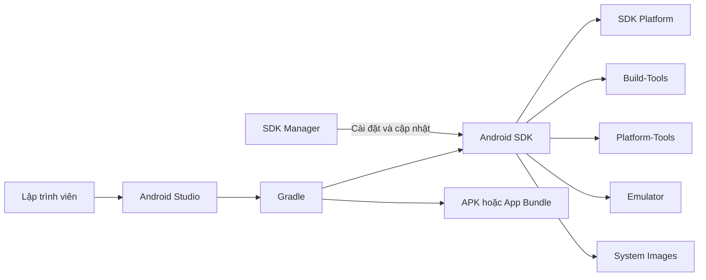
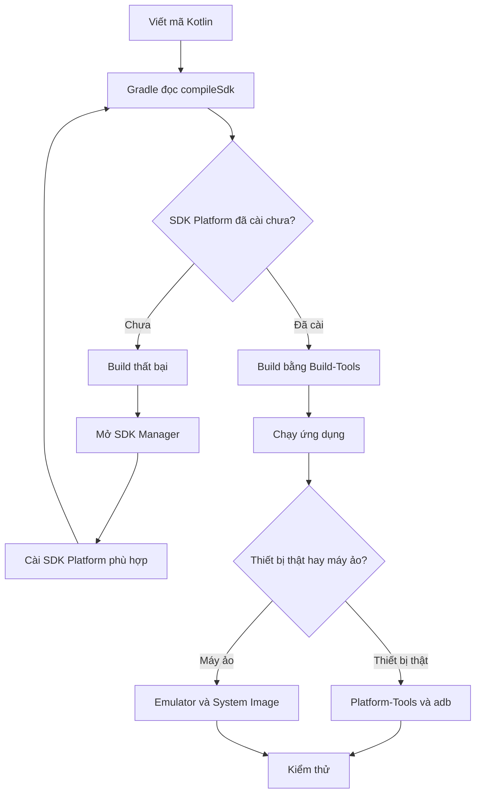
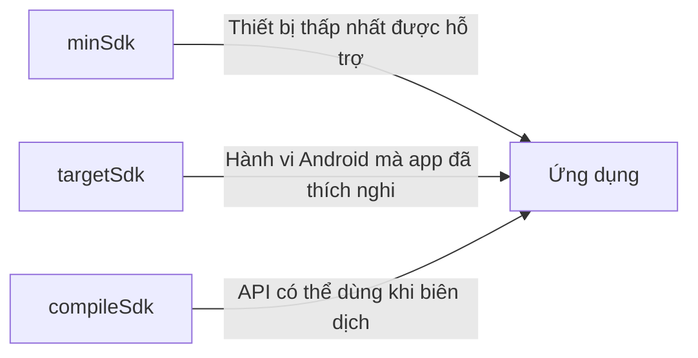
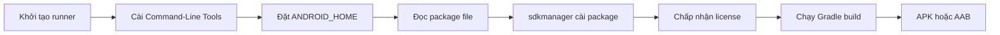
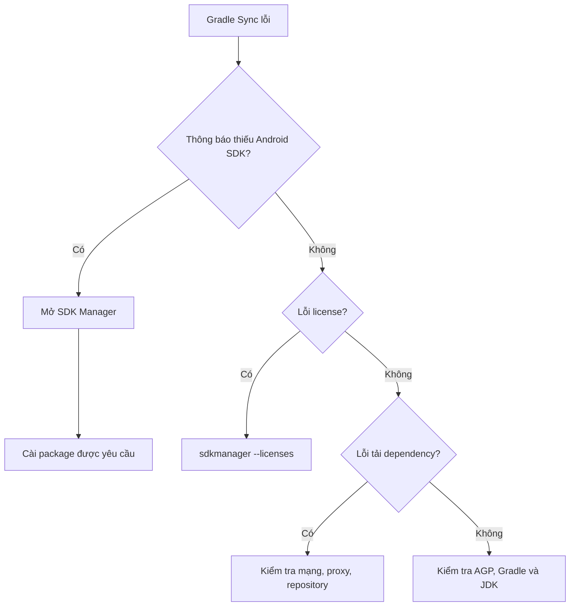

# 002 - SDK Manager

| Thuộc tính              | Nội dung                               |
| ----------------------- | -------------------------------------- |
| **Học phần**            | 01 - Language and Android Fundamentals |
| **Module**              | Module 02 - Android Fundamentals       |
| **Nhóm nội dung**       | Development IDE                        |
| **Nguồn roadmap**       | Android Fundamentals / Development IDE |
| **Loại bài**            | Lesson                                 |
| **Thứ tự trong module** | 002                                    |
| **Thời lượng gợi ý**    | 24 phút                                |

---

## 1. Tóm tắt

**SDK Manager** là công cụ trong Android Studio dùng để tải xuống, cập nhật và gỡ bỏ các thành phần của **Android SDK** như:

* Android SDK Platform.
* Android SDK Build-Tools.
* Android SDK Platform-Tools.
* Android Emulator.
* System Image cho máy ảo.
* Android SDK Command-Line Tools.
* NDK và CMake khi phát triển ứng dụng có mã C/C++.

SDK Manager không phải là nơi viết mã nguồn. Nó quản lý môi trường và các công cụ mà Android Studio cùng Gradle cần để **biên dịch, chạy, kiểm thử và gỡ lỗi ứng dụng Android**. Có thể mở công cụ này qua `Tools > SDK Manager`; trên máy chủ CI hoặc môi trường không có giao diện, có thể sử dụng lệnh `sdkmanager`. ([Android Developers][1])


*Nguồn ảnh: Android Developers. Giao diện thực tế có thể thay đổi theo phiên bản Android Studio.*

---

## 2. Mục tiêu học tập

Sau khi hoàn thành bài học, bạn có thể:

* [ ] Giải thích được SDK Manager và Android SDK là gì.
* [ ] Phân biệt được `SDK Platforms`, `SDK Tools` và `SDK Update Sites`.
* [ ] Xác định được thư mục cài đặt Android SDK.
* [ ] Cài đặt một Android SDK Platform.
* [ ] Cài đặt Build-Tools, Platform-Tools và Android Emulator.
* [ ] Hiểu sự khác nhau giữa `compileSdk`, `targetSdk` và `minSdk`.
* [ ] Biết khi nào cần cài System Image.
* [ ] Sử dụng `sdkmanager` từ dòng lệnh.
* [ ] Chẩn đoán các lỗi SDK thường gặp khi Gradle Sync hoặc build.
* [ ] Tạo một artifact nhỏ về cấu hình SDK để đưa vào portfolio.

---

## 3. Android SDK là gì?

**SDK – Software Development Kit** là bộ công cụ giúp lập trình viên phát triển phần mềm cho một nền tảng.

Android SDK bao gồm:

```text
Android SDK
├── Platforms
│   ├── android.jar
│   ├── API definitions
│   └── Platform resources
│
├── Build Tools
│   ├── aapt2
│   ├── d8
│   ├── apksigner
│   └── zipalign
│
├── Platform Tools
│   ├── adb
│   └── fastboot
│
├── Command-Line Tools
│   ├── sdkmanager
│   ├── avdmanager
│   └── lint
│
├── Emulator
├── System Images
├── Sources for Android
└── NDK và CMake
```

### SDK Manager khác Android SDK như thế nào?

| Thành phần         | Vai trò                                                  |
| ------------------ | -------------------------------------------------------- |
| **Android SDK**    | Toàn bộ nền tảng, thư viện và công cụ phát triển Android |
| **SDK Manager**    | Giao diện quản lý các gói bên trong Android SDK          |
| **Android Studio** | IDE dùng để viết, build, chạy và debug ứng dụng          |
| **Gradle**         | Hệ thống build đọc cấu hình dự án và gọi các công cụ SDK |
| **Device Manager** | Quản lý thiết bị Android ảo                              |
| **Emulator**       | Chạy hệ điều hành Android mô phỏng                       |

Có thể hình dung:



---

## 4. Vai trò của SDK Manager trong quá trình phát triển

SDK Manager cung cấp những thành phần cần thiết cho từng giai đoạn:



### Ví dụ

Dự án có cấu hình:

```kotlin
android {
    compileSdk = 36
}
```

Nhưng máy tính chưa cài package:

```text
platforms;android-36
```

Gradle không tìm thấy Android SDK Platform tương ứng và quá trình build có thể thất bại. Khi đó, cần mở SDK Manager và cài Android SDK Platform API 36.

---

## 5. Cách mở SDK Manager

### Khi đã mở dự án

Trên thanh menu:

```text
Tools > SDK Manager
```

Một số phiên bản Android Studio còn có biểu tượng SDK Manager trên toolbar.

### Khi chưa mở dự án

Tại màn hình Welcome:

```text
More Actions > SDK Manager
```

### Vị trí SDK

Phía trên cửa sổ SDK Manager có trường:

```text
Android SDK Location
```

Ví dụ phổ biến trên Windows:

```text
C:\Users\<username>\AppData\Local\Android\Sdk
```

macOS:

```text
/Users/<username>/Library/Android/sdk
```

Linux:

```text
/home/<username>/Android/Sdk
```

Đường dẫn thực tế phụ thuộc vào cấu hình trên máy. Biến môi trường `ANDROID_HOME` có thể được dùng để chỉ tới thư mục cài Android SDK; tài liệu hiện tại đánh dấu `ANDROID_SDK_ROOT` là biến cũ đã bị deprecated. ([Android Developers][2])

---

## 6. Ba tab chính của SDK Manager

SDK Manager thường có ba tab:

```text
SDK Manager
├── SDK Platforms
├── SDK Tools
└── SDK Update Sites
```

---

## 7. Tab SDK Platforms

Tab **SDK Platforms** dùng để cài đặt các phiên bản nền tảng Android theo API level.


Mỗi phiên bản SDK Platform có thể chứa:

* Android SDK Platform.
* Sources for Android.
* Google APIs System Image.
* Google Play System Image.
* System Image dành cho các kiến trúc CPU khác nhau.
* System Image cho điện thoại, TV, Wear OS hoặc thiết bị khác.

Android SDK Platform là thành phần cần thiết để biên dịch ứng dụng cho API level đó. System Image cần thiết khi muốn chạy phiên bản Android tương ứng trong Emulator. Sources for Android giúp Android Studio hiển thị mã nguồn framework trong quá trình đọc code hoặc debug. ([Android Developers][3])

### Các package quan trọng

| Package                  |              Có cần không? | Mục đích                             |
| ------------------------ | -------------------------: | ------------------------------------ |
| Android SDK Platform     |                         Có | Biên dịch ứng dụng                   |
| Sources for Android      |                   Tùy chọn | Đọc mã nguồn Android framework       |
| Google APIs System Image |          Khi dùng Emulator | Có Google Play services API          |
| Google Play System Image |         Khi cần Play Store | Có cả Google Play Store              |
| AOSP System Image        | Khi kiểm thử Android thuần | Không tích hợp đầy đủ dịch vụ Google |

### System Image nào nên chọn?

| Nhu cầu                                          | Gợi ý                    |
| ------------------------------------------------ | ------------------------ |
| Kiểm thử app thông thường                        | Google APIs System Image |
| Kiểm thử đăng nhập, Play Store hoặc Play Billing | Google Play System Image |
| Kiểm thử Android không có dịch vụ Google         | AOSP System Image        |
| Máy Windows/Linux dùng CPU Intel hoặc AMD        | Thường chọn `x86_64`     |
| Máy dùng Apple Silicon                           | Thường chọn `ARM64`      |

Không cần cài tất cả System Image. Mỗi image có thể chiếm nhiều dung lượng ổ đĩa.

---

## 8. Tab SDK Tools

Tab **SDK Tools** chứa các công cụ phát triển độc lập với một API level cụ thể.


*Nguồn ảnh: Android Developers. Đây là ảnh của phiên bản Android Studio cũ hơn nên tên hoặc vị trí một số package có thể khác.*

### Các công cụ quan trọng

| Công cụ                            | Vai trò                                                          |
| ---------------------------------- | ---------------------------------------------------------------- |
| **Android SDK Build-Tools**        | Biên dịch, xử lý tài nguyên, chuyển đổi bytecode và ký APK       |
| **Android SDK Platform-Tools**     | Cung cấp `adb`, `fastboot` và công cụ giao tiếp với thiết bị     |
| **Android SDK Command-Line Tools** | Cung cấp `sdkmanager`, `avdmanager`, `lint` và công cụ dòng lệnh |
| **Android Emulator**               | Chạy máy Android ảo                                              |
| **Google USB Driver**              | Hỗ trợ kết nối một số thiết bị Google trên Windows               |
| **NDK (Side by side)**             | Biên dịch mã C/C++                                               |
| **CMake**                          | Cấu hình quá trình build native code                             |
| **Layout Inspector tools**         | Hỗ trợ kiểm tra cây giao diện trên thiết bị                      |

Google xác định Build-Tools, Platform-Tools, Command-Line Tools và ít nhất một SDK Platform là những thành phần cốt lõi. Android Emulator là package được khuyến nghị khi cần kiểm thử trên thiết bị ảo. ([Android Developers][1])

---

## 9. Android SDK Build-Tools

Build-Tools chứa các chương trình được Gradle sử dụng để tạo APK hoặc App Bundle.

Một số công cụ bên trong gồm:

```text
aapt2       → biên dịch và đóng gói tài nguyên
d8          → chuyển bytecode sang DEX
apksigner   → ký APK
zipalign    → tối ưu cấu trúc APK
aidl        → xử lý Android Interface Definition Language
```

Build-Tools được cài trong:

```text
<android-sdk>/build-tools/<version>/
```

Android Gradle Plugin hiện thường tự chọn phiên bản Build-Tools phù hợp. Vì vậy, trong phần lớn dự án hiện đại, không cần khai báo thủ công `buildToolsVersion`. Tuy nhiên, package Build-Tools tương ứng vẫn phải tồn tại trong Android SDK. ([Android Developers][4])

---

## 10. Android SDK Platform-Tools

Platform-Tools cung cấp các công cụ giao tiếp với Android platform, nổi bật nhất là:

```text
adb
fastboot
```

### `adb` dùng để làm gì?

```bash
adb devices
adb install app-debug.apk
adb uninstall com.example.myapp
adb logcat
adb shell
adb push local.txt /sdcard/
adb pull /sdcard/result.txt
```

Platform-Tools có tính tương thích ngược, vì vậy lập trình viên thường chỉ cần giữ phiên bản mới nhất thay vì cài nhiều phiên bản song song. ([Android Developers][5])

---

## 11. Android SDK Command-Line Tools

Package này cung cấp các công cụ có thể chạy mà không cần mở Android Studio:

```text
sdkmanager
avdmanager
lint
apkanalyzer
retrace
```

### Trường hợp sử dụng

* Cấu hình máy chủ CI/CD.
* Tạo Docker image phục vụ build Android.
* Cài SDK tự động bằng script.
* Phát triển trên máy không có giao diện đồ họa.
* Đồng bộ môi trường giữa nhiều lập trình viên.

---

## 12. Phân biệt `compileSdk`, `targetSdk` và `minSdk`

Đây là ba khái niệm dễ nhầm nhất khi học Android.



### `compileSdk`

Xác định phiên bản Android API được dùng để biên dịch mã nguồn.

```kotlin
android {
    compileSdk = 36
}
```

Với `compileSdk = 36`, trình biên dịch có thể nhận biết các API từ API 36 trở xuống. `compileSdk` không trực tiếp quyết định thiết bị thấp nhất có thể cài ứng dụng. ([Android Developers][6])

### `minSdk`

Xác định API level thấp nhất mà ứng dụng cho phép cài đặt.

```kotlin
defaultConfig {
    minSdk = 23
}
```

Ứng dụng này sẽ không được cài trên thiết bị có API level thấp hơn 23.

### `targetSdk`

Xác định phiên bản Android mà ứng dụng được thiết kế và kiểm thử để tuân thủ hành vi của hệ thống.

```kotlin
defaultConfig {
    targetSdk = 36
}
```

Khi tăng `targetSdk`, một số hành vi về quyền, background task, thông báo, bảo mật hoặc lưu trữ có thể thay đổi. Vì vậy, không nên chỉ sửa con số rồi phát hành mà phải đọc tài liệu behavior changes và chạy regression test. `minSdk` và `targetSdk` được Gradle hợp nhất vào manifest trong quá trình build. ([Android Developers][7])

### Bảng so sánh

| Thuộc tính   | Câu hỏi nó trả lời                                       |
| ------------ | -------------------------------------------------------- |
| `compileSdk` | Mã nguồn được phép sử dụng API Android nào?              |
| `minSdk`     | Thiết bị Android cũ nhất có thể cài app là gì?           |
| `targetSdk`  | App đã thích nghi với hành vi của Android phiên bản nào? |

### Cấu hình hoàn chỉnh

```kotlin
android {
    namespace = "com.example.sdkmanagerlab"
    compileSdk = 36

    defaultConfig {
        applicationId = "com.example.sdkmanagerlab"

        minSdk = 23
        targetSdk = 36

        versionCode = 1
        versionName = "1.0"
    }
}
```

> Các con số trên là ví dụ học tập. Khi bắt đầu dự án thật, cần kiểm tra yêu cầu hiện hành của Android, Google Play, Android Gradle Plugin và các thư viện đang sử dụng.

---

## 13. Bối cảnh Android SDK năm 2026

Tại thời điểm bài học này được biên soạn:

* Android 16 tương ứng API level 36 và được liệt kê ở stable channel.
* Android 17 sử dụng API level 37 và đang có tài liệu thiết lập SDK riêng với package preview.
* Đối với dự án production, nên ưu tiên SDK stable; SDK preview nên được cài riêng khi cần kiểm thử trước hành vi của Android mới. ([Android Developers][3])

Từ ngày **31/08/2026**, ứng dụng mới và bản cập nhật ứng dụng điện thoại thông thường gửi lên Google Play phải target Android 16, API level 36 hoặc cao hơn. Một số loại thiết bị như Wear OS, Android Automotive, Android TV và Android XR có yêu cầu riêng. Vì quy định này thay đổi theo thời gian, cần kiểm tra tài liệu Google Play trước mỗi đợt phát hành. ([Android Developers][8])

---

## 14. Cài một SDK Platform bằng giao diện

Ví dụ cài Android SDK Platform API 36:

1. Mở Android Studio.
2. Chọn `Tools > SDK Manager`.
3. Mở tab **SDK Platforms**.
4. Chọn Android API 36.
5. Bật **Show Package Details** nếu cần xem từng package.
6. Chọn:

   * Android SDK Platform 36.
   * Sources for Android 36 nếu cần.
   * Một System Image nếu cần tạo Emulator.
7. Nhấn **Apply**.
8. Xem danh sách package sẽ được tải.
9. Chấp nhận license.
10. Chờ cài đặt hoàn tất.
11. Nhấn **Finish**.

### Sau khi cài đặt

Kiểm tra thư mục:

```text
<android-sdk>/platforms/android-36/
```

Thư mục thường chứa:

```text
android.jar
framework.aidl
package.xml
source.properties
```

---

## 15. Cài SDK Tools cần thiết

Trong tab **SDK Tools**, nên kiểm tra:

```text
[x] Android SDK Build-Tools
[x] Android SDK Platform-Tools
[x] Android SDK Command-Line Tools
[x] Android Emulator
```

Chỉ cài thêm khi dự án cần:

```text
[ ] NDK (Side by side)
[ ] CMake
[ ] Google USB Driver
```

### Dùng Show Package Details

Khi bật:

```text
Show Package Details
```

SDK Manager sẽ hiển thị từng phiên bản cụ thể.

Ví dụ:

```text
Android SDK Build-Tools
├── 36.0.0
├── 35.0.1
└── 35.0.0
```

Tính năng này hữu ích khi:

* Dự án cũ yêu cầu một phiên bản cụ thể.
* Cần tái tạo đúng môi trường CI.
* Dự án dùng NDK side-by-side.
* Cần kiểm thử bản preview mà không thay thế bản stable.

---

## 16. Thực hành: kiểm tra SDK bằng ứng dụng Android

### 16.1. Mục tiêu

Tạo ứng dụng hiển thị:

* API level hiện tại của thiết bị.
* Phiên bản Android.
* `minSdk`, `targetSdk` và `compileSdk` của app.

### 16.2. Mã nguồn Jetpack Compose

```kotlin
package com.example.sdkmanagerlab

import android.os.Build
import androidx.compose.foundation.layout.Arrangement
import androidx.compose.foundation.layout.Column
import androidx.compose.foundation.layout.fillMaxSize
import androidx.compose.foundation.layout.padding
import androidx.compose.material3.MaterialTheme
import androidx.compose.material3.Text
import androidx.compose.runtime.Composable
import androidx.compose.ui.Modifier
import androidx.compose.ui.unit.dp

@Composable
fun SdkInformationScreen() {
    val deviceApiLevel = Build.VERSION.SDK_INT
    val androidVersion = Build.VERSION.RELEASE

    Column(
        modifier = Modifier
            .fillMaxSize()
            .padding(24.dp),
        verticalArrangement = Arrangement.spacedBy(12.dp)
    ) {
        Text(
            text = "Thông tin Android SDK",
            style = MaterialTheme.typography.headlineSmall
        )

        Text(text = "Phiên bản Android: $androidVersion")
        Text(text = "API level thiết bị: $deviceApiLevel")
        Text(text = "Min SDK của app: ${BuildConfig.MIN_SDK_VERSION}")
        Text(text = "Target SDK của app: ${BuildConfig.TARGET_SDK_VERSION}")
        Text(text = "Compile SDK của app: ${BuildConfig.COMPILE_SDK_VERSION}")
    }
}
```

Để các trường SDK xuất hiện trong `BuildConfig`, có thể khai báo trong `build.gradle.kts` của module:

```kotlin
android {
    buildFeatures {
        buildConfig = true
    }

    defaultConfig {
        buildConfigField(
            type = "int",
            name = "MIN_SDK_VERSION",
            value = minSdk.toString()
        )

        buildConfigField(
            type = "int",
            name = "TARGET_SDK_VERSION",
            value = targetSdk.toString()
        )

        buildConfigField(
            type = "int",
            name = "COMPILE_SDK_VERSION",
            value = compileSdk.toString()
        )
    }
}
```

### Cách đơn giản hơn

Bạn có thể khai báo trực tiếp:

```kotlin
defaultConfig {
    buildConfigField("int", "MIN_SDK_VERSION", "23")
    buildConfigField("int", "TARGET_SDK_VERSION", "36")
    buildConfigField("int", "COMPILE_SDK_VERSION", "36")
}
```

Tuy nhiên, cách này có nguy cơ lệch số khi thay đổi cấu hình. Trong production, nên tránh lặp lại cùng một giá trị ở nhiều nơi.

---

## 17. Sử dụng API mới an toàn

Giả sử một API chỉ có trên Android phiên bản mới, cần kiểm tra API level trước khi gọi.

```kotlin
if (Build.VERSION.SDK_INT >= Build.VERSION_CODES.TIRAMISU) {
    // Mã chỉ chạy trên Android 13, API 33 trở lên.
} else {
    // Phương án tương thích cho Android cũ.
}
```

### Vì sao vẫn cần kiểm tra?

Ứng dụng có thể:

```text
compileSdk = 36
minSdk = 23
```

Điều này cho phép mã nguồn nhìn thấy API mới khi biên dịch, nhưng ứng dụng vẫn có thể chạy trên Android API 23. Nếu gọi trực tiếp một API chỉ tồn tại trên API mới mà không kiểm tra, ứng dụng có thể crash trên thiết bị cũ.

---

## 18. Sử dụng `sdkmanager` bằng dòng lệnh

`sdkmanager` có thể liệt kê, cài đặt, cập nhật và gỡ các package của Android SDK. Công cụ này nằm trong package Android SDK Command-Line Tools. ([Android Developers][9])

### Liệt kê package

```bash
sdkmanager --list
```

Chỉ xem package stable:

```bash
sdkmanager --list --channel=0
```

### Cài SDK Platform

```bash
sdkmanager "platforms;android-36"
```

### Cài Platform-Tools

```bash
sdkmanager "platform-tools"
```

### Cài nhiều package

```bash
sdkmanager \
  "platform-tools" \
  "platforms;android-36" \
  "build-tools;36.0.0"
```

Trên PowerShell hoặc Command Prompt, có thể viết trên một dòng:

```powershell
sdkmanager "platform-tools" "platforms;android-36" "build-tools;36.0.0"
```

### Cập nhật tất cả package

```bash
sdkmanager --update
```

### Chấp nhận license

```bash
sdkmanager --licenses
```

### Gỡ package

```bash
sdkmanager --uninstall "platforms;android-35"
```

Các channel được định danh bằng `0` cho Stable, `1` cho Beta, `2` cho Dev và `3` cho Canary. Trong script CI, nên chỉ định phiên bản package cụ thể thay vì luôn lấy `latest` để môi trường build có thể tái tạo ổn định. ([Android Developers][9])

---

## 19. File package cho CI/CD

Có thể tạo file:

```text
android-sdk-packages.txt
```

Nội dung:

```text
platform-tools
platforms;android-36
build-tools;36.0.0
cmdline-tools;latest
```

Sau đó chạy:

```bash
sdkmanager --package_file=android-sdk-packages.txt
sdkmanager --licenses
```

### Quy trình CI



---

## 20. Cấu trúc thư mục Android SDK

Ví dụ:

```text
Android/Sdk/
├── build-tools/
│   └── 36.0.0/
├── cmdline-tools/
│   └── latest/
│       └── bin/
│           ├── sdkmanager
│           └── avdmanager
├── emulator/
├── licenses/
├── ndk/
├── platform-tools/
│   ├── adb
│   └── fastboot
├── platforms/
│   └── android-36/
├── sources/
│   └── android-36/
└── system-images/
    └── android-36/
```

### Ý nghĩa của thư mục `licenses`

Khi chấp nhận license trong SDK Manager, Android Studio tạo dữ liệu license trong thư mục SDK. Gradle có thể tự động tải một số package còn thiếu khi license phù hợp đã được chấp nhận. Trên máy CI không có giao diện, có thể chấp nhận bằng `sdkmanager --licenses`. ([Android Developers][1])

---

## 21. Lỗi thường gặp và cách xử lý

### 21.1. Failed to find target

Ví dụ:

```text
Failed to find target with hash string
'android-36'
```

**Nguyên nhân:** chưa cài Android SDK Platform tương ứng.

**Cách xử lý:**

```text
SDK Manager
→ SDK Platforms
→ chọn Android API 36
→ Apply
```

Hoặc:

```bash
sdkmanager "platforms;android-36"
```

---

### 21.2. SDK location not found

Ví dụ:

```text
SDK location not found.
Define location with sdk.dir in local.properties
```

Kiểm tra file:

```text
local.properties
```

Trên Windows:

```properties
sdk.dir=C\:\\Users\\YourName\\AppData\\Local\\Android\\Sdk
```

Trên macOS:

```properties
sdk.dir=/Users/YourName/Library/Android/sdk
```

> `local.properties` chứa đường dẫn riêng của máy nên thường không nên commit vào Git.

---

### 21.3. License chưa được chấp nhận

Ví dụ:

```text
You have not accepted the license agreements
```

Chạy:

```bash
sdkmanager --licenses
```

Hoặc mở SDK Manager, cài lại package và chấp nhận license trong cửa sổ xác nhận.

---

### 21.4. Không tìm thấy `adb`

Ví dụ:

```text
adb is not recognized
```

Kiểm tra package:

```text
Android SDK Platform-Tools
```

Sau đó thêm thư mục sau vào `PATH`:

```text
<android-sdk>/platform-tools
```

Kiểm tra:

```bash
adb version
adb devices
```

---

### 21.5. Emulator không có phiên bản Android cần kiểm thử

**Nguyên nhân:** đã cài SDK Platform nhưng chưa cài System Image.

SDK Platform dùng để **compile**; System Image dùng để **chạy Android trong Emulator**. Đây là hai package khác nhau.

Cách xử lý:

```text
SDK Manager
→ SDK Platforms
→ Show Package Details
→ chọn một System Image
→ Apply
```

Sau đó mở Device Manager và tạo AVD.

---

### 21.6. Tốn quá nhiều dung lượng

Kiểm tra:

* System Image cũ không còn dùng.
* NDK cài nhiều phiên bản.
* Build-Tools quá cũ.
* Emulator image cho nhiều kiến trúc CPU.
* SDK Platform preview không còn cần thiết.

Không nên gỡ package mà dự án đang sử dụng. Trước khi xóa, nên kiểm tra:

```bash
sdkmanager --list
```

và cấu hình:

```kotlin
compileSdk
buildToolsVersion
ndkVersion
```

---

### 21.7. Gradle Sync vẫn lỗi sau khi cài SDK

SDK Manager chỉ giải quyết lỗi thiếu SDK hoặc tool. Gradle Sync vẫn có thể lỗi do:

* Android Gradle Plugin không tương thích.
* Gradle Wrapper quá cũ hoặc quá mới.
* JDK không phù hợp.
* Dependency không tải được.
* Proxy hoặc firewall.
* Repository bị thiếu.
* Cấu hình Kotlin không tương thích.

Quy trình kiểm tra:



---

## 22. Sai lầm phổ biến của lập trình viên mới

### Cài tất cả package

Điều này tiêu tốn nhiều dung lượng nhưng không đem lại lợi ích rõ ràng. Chỉ nên cài:

* SDK Platform mà dự án dùng.
* Một vài API level cần kiểm thử.
* Tool thực sự cần thiết.
* System Image đúng kiến trúc máy.

### Nhầm SDK Platform với System Image

```text
SDK Platform → biên dịch
System Image → chạy Emulator
```

Cài một trong hai không tự động thay thế vai trò của phần còn lại.

### Tăng `targetSdk` nhưng không kiểm thử

Tăng `targetSdk` có thể kích hoạt hành vi hệ thống mới liên quan đến:

* Permission.
* Background execution.
* Notification.
* Storage.
* Foreground service.
* PendingIntent.
* Bảo mật component.

Điều này có thể ảnh hưởng trực tiếp đến UX và độ ổn định của app.

### Dùng SDK preview cho production mà không kiểm soát

Preview SDK dành cho thử nghiệm sớm. Việc dùng preview có thể yêu cầu Android Studio hoặc Android Gradle Plugin mới hơn và có thể gây khó khăn cho CI hoặc thành viên khác trong nhóm.

### Commit đường dẫn SDK cá nhân

Không nên commit:

```properties
sdk.dir=C\:\\Users\\Khanh\\AppData\\Local\\Android\\Sdk
```

vì đường dẫn này không tồn tại trên máy của người khác.

### Luôn cài package `latest` trong CI

Package mới có thể làm môi trường build thay đổi mà không có thay đổi trong repository. CI production nên pin các phiên bản quan trọng.

---

## 23. Ảnh hưởng đến UX, độ ổn định và maintainability

SDK Manager không trực tiếp quản lý UI hoặc state trong ứng dụng, nhưng các SDK mà nó cài đặt có ảnh hưởng gián tiếp rất lớn.

| Khía cạnh           | Ảnh hưởng                                                                           |
| ------------------- | ----------------------------------------------------------------------------------- |
| **UX**              | `targetSdk` mới có thể thay đổi permission flow, notification hoặc hành vi hệ thống |
| **Độ ổn định**      | Thiếu SDK Platform hoặc Build-Tools khiến dự án không build được                    |
| **Maintainability** | Môi trường SDK được ghi chép rõ giúp thành viên mới setup nhanh                     |
| **Testing**         | System Image cho phép kiểm thử trên nhiều API level                                 |
| **Performance**     | Emulator và profiling tools hỗ trợ tìm lỗi hiệu năng                                |
| **Release risk**    | Target API không phù hợp có thể khiến bản phát hành bị Google Play từ chối          |
| **CI/CD**           | Pin phiên bản SDK giúp build có khả năng tái tạo                                    |

---

## 24. Liên hệ với lifecycle và state

SDK Manager không lưu state của màn hình Android, nhưng phiên bản nền tảng và `targetSdk` có thể làm thay đổi cách hệ thống quản lý ứng dụng.

Ví dụ:

* Giới hạn chạy nền có thể ảnh hưởng đến service.
* Thay đổi quyền có thể làm user flow bị dừng.
* Process có thể bị hệ thống hủy khi chạy nền.
* Notification permission có thể thay đổi theo Android version.
* Background location có thể bị hạn chế.
* Storage API có thể hoạt động khác sau khi tăng target API.

Do đó, sau khi tăng `targetSdk`, cần kiểm thử:

```text
Mở app
→ cấp hoặc từ chối quyền
→ đưa app xuống background
→ quay lại app
→ xoay màn hình
→ tắt mạng
→ khởi động lại thiết bị
→ kiểm tra notification và background task
```

---

## 25. Kế hoạch thực hành trong 24 phút

|  Thời gian | Công việc                                    |
| ---------: | -------------------------------------------- |
|   0–3 phút | Phân biệt Android SDK và SDK Manager         |
|   3–6 phút | Mở SDK Manager và xác định SDK Location      |
|  6–10 phút | Quan sát tab SDK Platforms                   |
| 10–13 phút | Quan sát tab SDK Tools                       |
| 13–16 phút | Kiểm tra `compileSdk`, `minSdk`, `targetSdk` |
| 16–19 phút | Cài hoặc xác minh một SDK Platform           |
| 19–22 phút | Chạy `sdkmanager --list` hoặc `adb version`  |
| 22–24 phút | Chụp ảnh và ghi lại cấu hình môi trường      |

---

## 26. Bài tập

### Bài 1: ghi chú năm dòng

Viết năm dòng trả lời:

1. SDK Manager là gì?
2. SDK Platform dùng để làm gì?
3. System Image dùng để làm gì?
4. Platform-Tools chứa công cụ quan trọng nào?
5. `compileSdk` khác `minSdk` như thế nào?

### Bài 2: kiểm tra dự án

Mở file:

```text
app/build.gradle.kts
```

Ghi lại:

```text
compileSdk =
minSdk =
targetSdk =
```

Sau đó kiểm tra SDK Platform tương ứng đã được cài hay chưa.

### Bài 3: kiểm tra thiết bị

Chạy:

```bash
adb devices
```

Kết quả dự kiến:

```text
List of devices attached
emulator-5554    device
```

### Bài 4: kiểm tra API level

Chạy:

```bash
adb shell getprop ro.build.version.sdk
```

Ví dụ kết quả:

```text
36
```

### Bài 5: tạo lỗi có chủ đích

1. Ghi lại `compileSdk` hiện tại.
2. Đổi nó sang một API level chưa được cài.
3. Chạy Gradle Sync.
4. Đọc thông báo lỗi.
5. Khôi phục cấu hình.
6. Cài SDK phù hợp hoặc đổi lại `compileSdk`.
7. Ghi lại nguyên nhân và cách sửa.

> Không thực hiện bài này trên nhánh production đang có thay đổi quan trọng chưa commit.

---

## 27. Artifact đưa vào portfolio

Tạo thư mục:

```text
sdk-manager-lab/
├── README.md
├── environment/
│   ├── sdk-packages.txt
│   └── android-environment.md
├── screenshots/
│   ├── sdk-platforms.png
│   ├── sdk-tools.png
│   └── app-sdk-information.png
└── app/
    └── source-code
```

### File `sdk-packages.txt`

Có thể tạo bằng:

```bash
sdkmanager --list > sdk-packages.txt
```

Do kết quả có thể rất dài, bản portfolio chỉ nên giữ phần package đã cài hoặc viết bản rút gọn:

```text
Installed Android SDK packages

- platforms;android-36
- build-tools;36.0.0
- platform-tools
- cmdline-tools;latest
- emulator
- system-images;android-36;google_apis;x86_64
```

### Mẫu `README.md`

```markdown
# SDK Manager Lab

## Mục tiêu

Thiết lập môi trường Android SDK có thể build và chạy ứng dụng
trên Android Emulator.

## Cấu hình dự án

- compileSdk: 36
- minSdk: 23
- targetSdk: 36
- Build-Tools: 36.0.0
- Platform-Tools: installed
- Android Emulator: installed

## Nội dung thực hành

- Cài Android SDK Platform
- Cài System Image
- Tạo thiết bị Android ảo
- Kiểm tra thiết bị bằng adb
- Hiển thị API level trong ứng dụng
- Xử lý lỗi thiếu SDK Platform

## Điều đã học

SDK Platform dùng để biên dịch, trong khi System Image dùng để
chạy Android Emulator. compileSdk không quyết định thiết bị thấp
nhất có thể cài ứng dụng; vai trò đó thuộc về minSdk.
```

---

## 28. Checklist hoàn thành

### Kiến thức

* [ ] Giải thích được SDK Manager là gì.
* [ ] Phân biệt được SDK Manager và Android SDK.
* [ ] Phân biệt SDK Platform với System Image.
* [ ] Hiểu Build-Tools và Platform-Tools.
* [ ] Hiểu `compileSdk`, `minSdk` và `targetSdk`.
* [ ] Biết mục đích của `sdkmanager`.
* [ ] Biết SDK preview khác SDK stable như thế nào.

### Thực hành

* [ ] Mở được SDK Manager.
* [ ] Xác định được Android SDK Location.
* [ ] Kiểm tra được SDK Platform đã cài.
* [ ] Kiểm tra được SDK Tools.
* [ ] Chạy được `adb version`.
* [ ] Chạy được `adb devices`.
* [ ] Chạy được ứng dụng trên Emulator hoặc thiết bị thật.
* [ ] Hiển thị được API level của thiết bị.
* [ ] Xử lý được lỗi thiếu SDK Platform.

### Portfolio

* [ ] Có ảnh tab SDK Platforms.
* [ ] Có ảnh tab SDK Tools.
* [ ] Có README mô tả môi trường.
* [ ] Có danh sách package SDK cần thiết.
* [ ] Có ghi chú một lỗi và cách khắc phục.
* [ ] Không commit đường dẫn SDK cá nhân hoặc dữ liệu máy cục bộ.

---

## 29. Ghi chú khi đưa vào production

### Cấu hình build

* Dùng `compileSdk` stable phù hợp với Android Gradle Plugin.
* Xác minh `targetSdk` đáp ứng yêu cầu Google Play hiện hành.
* Không tăng `targetSdk` ngay trước ngày phát hành mà không regression test.
* Chỉ khai báo `buildToolsVersion` khi thực sự cần phiên bản cụ thể.
* Pin `ndkVersion` nếu dự án sử dụng native code.

### Kiểm thử

* Kiểm thử trên thiết bị có API bằng `minSdk`.
* Kiểm thử trên API level của `targetSdk`.
* Kiểm thử trên phiên bản Android stable mới nhất.
* Kiểm thử permission, notification và background flow.
* Kiểm thử cả emulator và ít nhất một thiết bị thật.

### CI/CD

* Cài SDK bằng script hoặc package file.
* Pin phiên bản SDK quan trọng.
* Chấp nhận license trong môi trường CI.
* Cache SDK có kiểm soát để giảm thời gian build.
* Không phụ thuộc vào SDK tình cờ có sẵn trên runner.
* Ghi `compileSdk`, Build-Tools, JDK, Gradle và AGP trong tài liệu dự án.

### Release

* Kiểm tra target API requirement trước khi upload.
* Build bản release trên môi trường sạch.
* Chạy unit test và UI test.
* Kiểm tra APK hoặc AAB sau khi build.
* Không sử dụng preview SDK cho bản phát hành ổn định nếu không có lý do rõ ràng.
* Theo dõi behavior changes khi tăng target API.

---

## 30. Tóm tắt

```text
SDK Manager
│
├── SDK Platforms
│   ├── Android SDK Platform → dùng để compile
│   ├── Sources for Android → đọc và debug framework
│   └── System Image → chạy Emulator
│
├── SDK Tools
│   ├── Build-Tools → tạo APK/AAB
│   ├── Platform-Tools → adb và fastboot
│   ├── Command-Line Tools → sdkmanager và avdmanager
│   └── Emulator → chạy thiết bị Android ảo
│
└── SDK Update Sites
    └── quản lý nguồn package bổ sung
```

Điểm cần ghi nhớ:

1. `compileSdk` yêu cầu SDK Platform tương ứng phải được cài.
2. SDK Platform và System Image có vai trò khác nhau.
3. `minSdk` xác định thiết bị thấp nhất; `targetSdk` xác định hành vi Android mà app đã thích nghi.
4. Tăng `targetSdk` cần đi kèm kiểm thử behavior changes.
5. CI nên cài SDK bằng script và pin phiên bản.
6. Không cần cài mọi SDK hoặc mọi System Image.
7. Luôn kiểm tra yêu cầu target API trước khi phát hành.

---

## 31. Tài liệu tham khảo

* [Quản lý và cập nhật Android SDK](https://developer.android.com/studio/intro/update)
* [Tài liệu sdkmanager](https://developer.android.com/tools/sdkmanager)
* [SDK Platform release notes](https://developer.android.com/tools/releases/platforms)
* [SDK Build-Tools release notes](https://developer.android.com/tools/releases/build-tools)
* [SDK Platform-Tools release notes](https://developer.android.com/tools/releases/platform-tools)
* [Cấu hình Android build](https://developer.android.com/build)
* [Cấu hình minSdk và targetSdk](https://developer.android.com/studio/publish/versioning)
* [Biến môi trường Android SDK](https://developer.android.com/tools/variables)
* [Tạo và quản lý Android Virtual Device](https://developer.android.com/studio/run/managing-avds)
* [Thiết lập Android 16 SDK](https://developer.android.com/about/versions/16/setup-sdk)
* [Thiết lập Android 17 SDK](https://developer.android.com/about/versions/17/setup-sdk)
* [Yêu cầu target API của Google Play](https://developer.android.com/google/play/requirements/target-sdk)

[1]: https://developer.android.com/studio/intro/update "Update the IDE and SDK tools  |  Android Studio  |  Android Developers"
[2]: https://developer.android.com/tools/variables "Environment variables  |  Android Studio  |  Android Developers"
[3]: https://developer.android.com/tools/releases/platforms "SDK Platform release notes  |  Android Studio  |  Android Developers"
[4]: https://developer.android.com/tools/releases/build-tools "SDK Build Tools release notes  |  Android Studio  |  Android Developers"
[5]: https://developer.android.com/tools/releases/platform-tools "SDK Platform Tools release notes  |  Android Studio  |  Android Developers"
[6]: https://developer.android.com/build "Configure your build  |  Android Studio  |  Android Developers"
[7]: https://developer.android.com/studio/publish/versioning "Version your app  |  Android Studio  |  Android Developers"
[8]: https://developer.android.com/google/play/requirements/target-sdk "Meet Google Play's target API level requirement  |  Other Play guides  |  Android Developers"
[9]: https://developer.android.com/tools/sdkmanager "sdkmanager  |  Android Studio  |  Android Developers"
