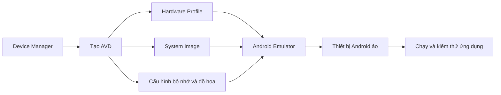
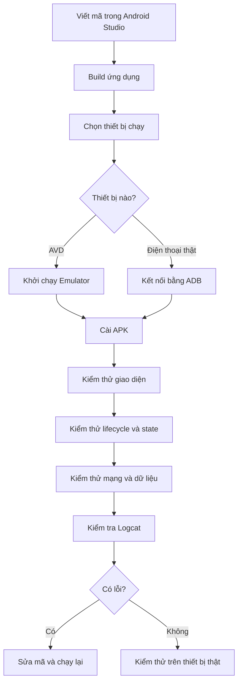
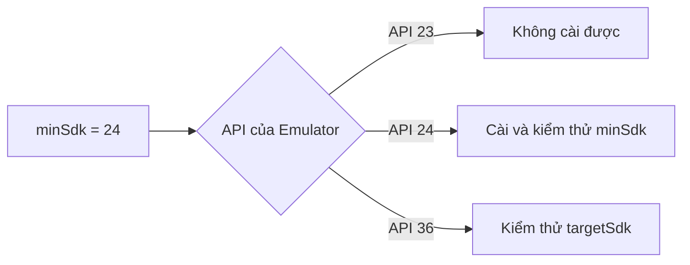
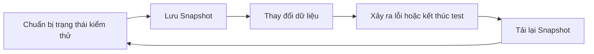
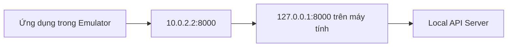
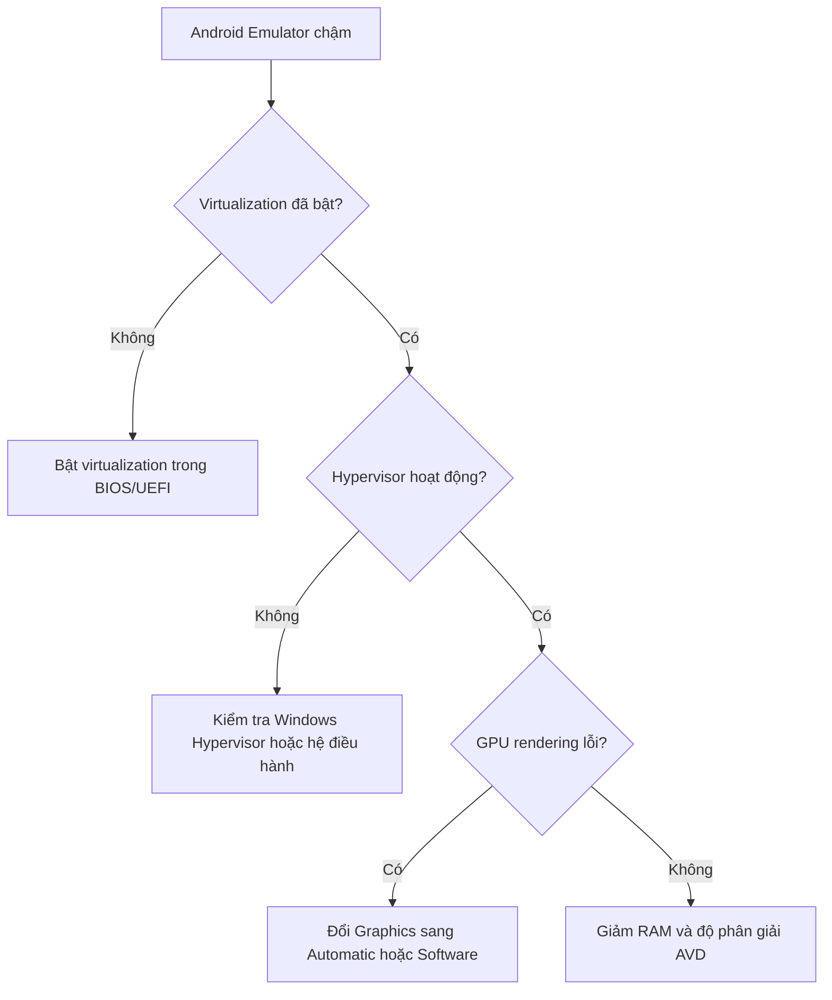
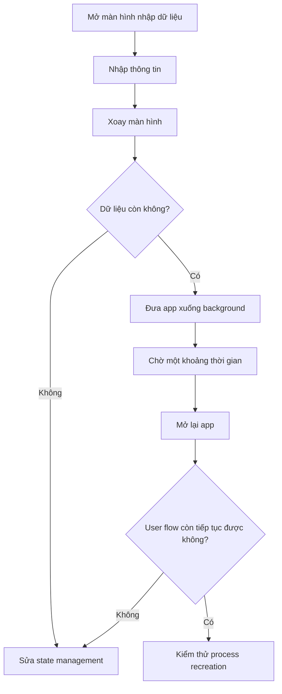

# 003 - AVD Emulator

| Thuộc tính              | Nội dung                               |
| ----------------------- | -------------------------------------- |
| **Học phần**            | 01 - Language and Android Fundamentals |
| **Module**              | Module 02 - Android Fundamentals       |
| **Nhóm nội dung**       | Development IDE                        |
| **Nguồn roadmap**       | Android Fundamentals / Development IDE |
| **Loại bài**            | Lesson                                 |
| **Thứ tự trong module** | 003                                    |
| **Thời lượng gợi ý**    | 24 phút                                |

---

## 1. Tóm tắt

**AVD – Android Virtual Device** là một cấu hình thiết bị Android ảo, xác định loại thiết bị, kích thước màn hình, dung lượng bộ nhớ, phiên bản Android, kiến trúc CPU, camera, cảm biến và vùng lưu trữ cần mô phỏng.

**Android Emulator** là chương trình sử dụng cấu hình AVD đó để khởi chạy một thiết bị Android ảo trên máy tính.

Nói đơn giản:

```text
AVD      = bản cấu hình của thiết bị ảo
Emulator = chương trình chạy bản cấu hình đó
```

Android Emulator giúp kiểm thử ứng dụng trên nhiều loại điện thoại, máy tính bảng, thiết bị gập, Wear OS, Android TV và Android Automotive mà không cần sở hữu tất cả thiết bị vật lý. Emulator còn có thể mô phỏng xoay màn hình, cuộc gọi, tin nhắn, vị trí GPS, tốc độ mạng, trạng thái pin và một số cảm biến.


*Nguồn ảnh: Android Developers.*

---

## 2. Mục tiêu học tập

Sau khi hoàn thành bài học, bạn có thể:

* [ ] Giải thích được AVD và Android Emulator là gì.
* [ ] Phân biệt AVD, Emulator, Device Manager và System Image.
* [ ] Tạo được một Android Virtual Device.
* [ ] Chọn hardware profile và system image phù hợp.
* [ ] Chạy ứng dụng trên thiết bị Android ảo.
* [ ] Sử dụng các nút điều khiển cơ bản của Emulator.
* [ ] Mô phỏng xoay màn hình, vị trí, pin và điều kiện mạng.
* [ ] Phân biệt Quick Boot, Cold Boot và Wipe Data.
* [ ] Kiểm thử lifecycle và khả năng khôi phục state.
* [ ] Truy cập API chạy trên máy tính từ Emulator.
* [ ] Chụp ảnh màn hình phục vụ README hoặc portfolio.
* [ ] Nhận biết những trường hợp cần kiểm thử lại trên thiết bị thật.

---

## 3. Khái niệm chính

### 3.1. Android Virtual Device

AVD là một cấu hình mô tả thiết bị Android muốn mô phỏng. Một AVD thường chứa:

```text
Android Virtual Device
├── Hardware profile
│   ├── Loại thiết bị
│   ├── Kích thước màn hình
│   ├── Độ phân giải
│   ├── Mật độ điểm ảnh
│   ├── RAM
│   ├── Camera
│   └── Cảm biến
│
├── System image
│   ├── Phiên bản Android
│   ├── API level
│   ├── Kiến trúc CPU
│   └── Google APIs hoặc Google Play
│
├── Storage area
│   ├── Ứng dụng đã cài
│   ├── Dữ liệu ứng dụng
│   └── Cài đặt hệ thống
│
├── Skin
└── Snapshot
```

Theo tài liệu Android, một AVD bao gồm hardware profile, system image, vùng lưu trữ, skin và các thuộc tính khác.

### 3.2. Android Emulator

Android Emulator là chương trình chạy hệ điều hành Android ảo dựa trên cấu hình AVD.



### 3.3. Device Manager

**Device Manager** là công cụ trong Android Studio dùng để:

* Tạo AVD.
* Chỉnh sửa AVD.
* Nhân bản AVD.
* Khởi động hoặc dừng Emulator.
* Xóa dữ liệu thiết bị.
* Xem cấu hình và vị trí file AVD.
* Quản lý cả thiết bị ảo và thiết bị vật lý được kết nối.

Có thể mở Device Manager bằng:

```text
View
└── Tool Windows
    └── Device Manager
```

Tại màn hình chào của Android Studio:

```text
More Actions
└── Virtual Device Manager
```

---

## 4. Phân biệt các thành phần

| Thành phần               | Vai trò                                       |
| ------------------------ | --------------------------------------------- |
| **Device Manager**       | Tạo và quản lý thiết bị                       |
| **AVD**                  | Cấu hình của một thiết bị Android ảo          |
| **Android Emulator**     | Chương trình chạy AVD                         |
| **Hardware Profile**     | Mô tả phần cứng của thiết bị                  |
| **System Image**         | Hệ điều hành Android được chạy trong Emulator |
| **Android SDK Platform** | API dùng để biên dịch ứng dụng                |
| **Platform-Tools**       | Cung cấp `adb` để giao tiếp với thiết bị      |
| **Snapshot**             | Bản lưu trạng thái toàn bộ thiết bị ảo        |
| **Skin**                 | Hình dạng khung ngoài của thiết bị            |

### Ví dụ

```text
Hardware Profile : Pixel 8
System Image     : Android API 36, Google APIs
AVD Name         : Pixel_8_API_36
Emulator         : Chương trình khởi chạy Pixel_8_API_36
```

---

## 5. Vai trò trong quy trình phát triển Android



AVD Emulator đặc biệt hữu ích trong giai đoạn phát triển vì lập trình viên có thể nhanh chóng thay đổi kích thước màn hình, API level và điều kiện thiết bị. Tuy nhiên, trước khi phát hành, các luồng quan trọng vẫn nên được kiểm thử trên ít nhất một thiết bị vật lý.

---

## 6. Các thành phần của một AVD

### 6.1. Hardware Profile

Hardware Profile mô tả đặc điểm vật lý của thiết bị, chẳng hạn:

| Thuộc tính          | Ví dụ                      |
| ------------------- | -------------------------- |
| Loại thiết bị       | Phone, Tablet, Wear OS, TV |
| Kích thước màn hình | 6,1 inch                   |
| Độ phân giải        | 1080 × 2400                |
| Mật độ điểm ảnh     | 420 dpi                    |
| RAM                 | 4 GB                       |
| Camera trước        | Webcam hoặc emulated       |
| Camera sau          | Webcam hoặc virtual scene  |
| Orientation         | Portrait và landscape      |
| Device state        | Folded hoặc unfolded       |

Device Manager có sẵn nhiều hardware profile phổ biến như Pixel, tablet, thiết bị gập, TV và Wear OS. Lập trình viên cũng có thể tạo hoặc sao chép một hardware profile riêng.


*Nguồn ảnh: Android Developers.*

---

### 6.2. System Image

System Image chứa hệ điều hành Android mà Emulator sẽ chạy.

Một System Image thường được xác định bởi:

```text
System Image
├── Android version
├── API level
├── ABI hoặc kiến trúc CPU
└── Variant
    ├── AOSP
    ├── Google APIs
    └── Google Play
```


*Nguồn ảnh: Android Developers.*

### Các loại System Image

| Loại            | Nội dung                                | Trường hợp sử dụng                              |
| --------------- | --------------------------------------- | ----------------------------------------------- |
| **AOSP**        | Android thuần, không có ứng dụng Google | Kiểm thử hệ thống thuần hoặc cần `adb root`     |
| **Google APIs** | Có Google Play services API             | Maps, location, Firebase hoặc API Google        |
| **Google Play** | Có Google Play services và Play Store   | Play Billing, đăng nhập, cập nhật Play services |

System Image có nhãn Google APIs cung cấp quyền truy cập Google Play services. Những image có Google Play Store được ký bằng release key nên không cho phép sử dụng quyền root; AOSP image phù hợp hơn khi cần `adb root` để điều tra lỗi.

---

### 6.3. API level

API level của System Image phải bằng hoặc cao hơn `minSdk` của ứng dụng.

Ví dụ:

```kotlin
android {
    compileSdk = 36

    defaultConfig {
        minSdk = 24
        targetSdk = 36
    }
}
```

Ứng dụng trên có thể chạy trên Emulator API 24 trở lên, nhưng không thể cài trên System Image API 23 hoặc thấp hơn.



---

### 6.4. Kiến trúc CPU

Một số kiến trúc System Image thường gặp:

```text
x86_64
arm64-v8a
```

Nên ưu tiên image có kiến trúc phù hợp với máy chủ để Emulator có thể tận dụng tăng tốc phần cứng.

| Máy phát triển               | System Image thường phù hợp |
| ---------------------------- | --------------------------- |
| Windows/Linux Intel hoặc AMD | `x86_64`                    |
| macOS Apple Silicon          | `arm64-v8a`                 |
| Máy ARM64                    | `arm64-v8a`                 |

Không nên lựa chọn kiến trúc chỉ dựa vào tên; hãy ưu tiên mục được Android Studio đánh dấu trong tab **Recommended**.

---

### 6.5. Storage Area

Mỗi AVD có vùng lưu trữ riêng để giữ:

* Ứng dụng đã cài đặt.
* Tài khoản người dùng.
* SharedPreferences.
* Database.
* File trong bộ nhớ nội bộ.
* Cài đặt hệ thống.
* Dữ liệu phiên làm việc.

Dữ liệu này thường vẫn tồn tại sau khi đóng và mở lại Emulator. Có thể dùng **Wipe Data** để đưa thiết bị về trạng thái gần giống thiết bị mới xuất xưởng.

---

## 7. Tạo Android Virtual Device

### Bước 1: Mở Device Manager

```text
View > Tool Windows > Device Manager
```


*Nguồn ảnh: Android Developers.*

### Bước 2: Tạo thiết bị

Trong tab **Virtual**:

```text
Nhấn dấu +
└── Create Virtual Device
```

### Bước 3: Chọn Hardware Profile

Ví dụ:

```text
Category : Phone
Device   : Pixel 8
```

Nên lựa chọn một profile phổ biến, có kích thước màn hình trung bình để làm thiết bị kiểm thử chính.

### Bước 4: Chọn System Image

Ví dụ:

```text
API level : 36
Target    : Google APIs
ABI       : x86_64 hoặc arm64-v8a
```

Nếu có biểu tượng tải xuống, System Image chưa được cài đặt và cần được tải trước khi tiếp tục.

### Bước 5: Kiểm tra cấu hình

Đặt tên rõ nghĩa:

```text
Pixel_8_API_36_Google_APIs
```

Tên nên thể hiện:

```text
<Device>_<API>_<Image type>
```

Ví dụ:

```text
Small_Phone_API_24
Pixel_8_API_36
Pixel_Fold_API_36
Tablet_API_36
```

### Bước 6: Hoàn tất

Nhấn **Finish**. AVD mới sẽ xuất hiện trong Device Manager và trong danh sách thiết bị chạy của Android Studio. Quy trình chính thức gồm chọn hardware profile, chọn system image, kiểm tra cấu hình và hoàn tất AVD.

---

## 8. Chạy ứng dụng trên Emulator

### Cách 1: chạy từ Android Studio

1. Mở dự án Android.
2. Chọn AVD trên thanh thiết bị.
3. Nhấn **Run** hoặc `Shift + F10`.
4. Chờ Emulator khởi động.
5. Android Studio build và cài ứng dụng.
6. Ứng dụng tự động được mở.

### Cách 2: khởi động trước từ Device Manager

1. Mở Device Manager.
2. Nhấn biểu tượng **Launch** bên cạnh AVD.
3. Chờ thiết bị hoàn tất khởi động.
4. Chọn thiết bị trong Android Studio.
5. Nhấn **Run**.

### Cách 3: chạy bằng dòng lệnh

Liệt kê AVD:

```bash
emulator -list-avds
```

Khởi động một AVD:

```bash
emulator -avd Pixel_8_API_36
```

Cú pháp tương đương:

```bash
emulator @Pixel_8_API_36
```

Android SDK hỗ trợ khởi động Emulator từ dòng lệnh bằng tên AVD, rất hữu ích trong script hoặc môi trường kiểm thử tự động.

---

## 9. Điều khiển Emulator cơ bản

Thanh điều khiển Emulator cung cấp các chức năng:

| Điều khiển      | Công dụng                     |
| --------------- | ----------------------------- |
| Power           | Bật hoặc tắt màn hình         |
| Volume Up       | Tăng âm lượng                 |
| Volume Down     | Giảm âm lượng                 |
| Rotate Left     | Xoay trái 90°                 |
| Rotate Right    | Xoay phải 90°                 |
| Take Screenshot | Chụp ảnh màn hình             |
| Back            | Mô phỏng nút quay lại         |
| Home            | Trở về màn hình chính         |
| Overview        | Mở danh sách ứng dụng gần đây |
| More            | Mở Extended Controls          |

Android Emulator cũng hỗ trợ các thao tác chuột và bàn phím để mô phỏng chạm, kéo, cuộn và thao tác đa điểm.

---

## 10. Extended Controls

Nhấn nút **More** trên thanh Emulator để mở Extended Controls.

```text
Extended Controls
├── Displays
├── Cellular
├── Battery
├── Camera
├── Location
├── Routes
├── Sensors
├── Fingerprint
├── Phone
├── Microphone
├── Record and Playback
├── Google Play
├── Settings
└── Help
```

Extended Controls cho phép gửi dữ liệu giả lập, thay đổi thuộc tính thiết bị và điều khiển các tình huống kiểm thử. Một số tùy chọn chỉ xuất hiện khi Emulator chạy trong cửa sổ riêng.

---

## 11. Kiểm thử xoay màn hình và state

Xoay màn hình có thể khiến `Activity` bị hủy và tạo lại. Nếu state chỉ được giữ bằng biến thông thường hoặc `remember`, dữ liệu có thể bị mất.

### Ví dụ dễ mất state

```kotlin
@Composable
fun CounterScreen() {
    var count by remember {
        mutableIntStateOf(0)
    }

    Button(onClick = { count++ }) {
        Text(text = "Số lần nhấn: $count")
    }
}
```

Khi xoay thiết bị, `count` có thể trở lại `0`.

### Sử dụng `rememberSaveable`

```kotlin
@Composable
fun CounterScreen() {
    var count by rememberSaveable {
        mutableIntStateOf(0)
    }

    Button(onClick = { count++ }) {
        Text(text = "Số lần nhấn: $count")
    }
}
```

### Quy trình kiểm thử

```text
Mở ứng dụng
→ nhấn nút 5 lần
→ xoay ngang
→ kiểm tra count
→ xoay dọc
→ đưa app xuống background
→ mở lại app
```

### Kỳ vọng

```text
count vẫn bằng 5
```

### Nếu state vẫn mất

Cần xác định state thuộc loại nào:

| Loại state                             | Cách quản lý              |
| -------------------------------------- | ------------------------- |
| UI state nhỏ                           | `rememberSaveable`        |
| Screen state                           | `ViewModel`               |
| Dữ liệu cần phục hồi sau process death | `SavedStateHandle`        |
| Dữ liệu lâu dài                        | Room, DataStore hoặc file |

---

## 12. Thực hành: ứng dụng Emulator Test Lab

### 12.1. Mục tiêu

Tạo một ứng dụng hiển thị:

* Phiên bản Android.
* API level.
* Hướng màn hình.
* Số lần người dùng nhấn nút.
* Lifecycle log của Activity.

### 12.2. `MainActivity.kt`

```kotlin
package com.example.emulatortestlab

import android.content.res.Configuration
import android.os.Build
import android.os.Bundle
import android.util.Log
import androidx.activity.ComponentActivity
import androidx.activity.compose.setContent
import androidx.compose.foundation.layout.Arrangement
import androidx.compose.foundation.layout.Column
import androidx.compose.foundation.layout.fillMaxSize
import androidx.compose.foundation.layout.padding
import androidx.compose.material3.Button
import androidx.compose.material3.MaterialTheme
import androidx.compose.material3.Text
import androidx.compose.runtime.Composable
import androidx.compose.runtime.getValue
import androidx.compose.runtime.mutableIntStateOf
import androidx.compose.runtime.saveable.rememberSaveable
import androidx.compose.runtime.setValue
import androidx.compose.ui.Modifier
import androidx.compose.ui.platform.LocalConfiguration
import androidx.compose.ui.unit.dp

private const val TAG = "EmulatorTestLab"

class MainActivity : ComponentActivity() {

    override fun onCreate(savedInstanceState: Bundle?) {
        super.onCreate(savedInstanceState)
        Log.d(TAG, "onCreate")

        setContent {
            MaterialTheme {
                EmulatorInformationScreen()
            }
        }
    }

    override fun onStart() {
        super.onStart()
        Log.d(TAG, "onStart")
    }

    override fun onResume() {
        super.onResume()
        Log.d(TAG, "onResume")
    }

    override fun onPause() {
        Log.d(TAG, "onPause")
        super.onPause()
    }

    override fun onStop() {
        Log.d(TAG, "onStop")
        super.onStop()
    }

    override fun onDestroy() {
        Log.d(TAG, "onDestroy")
        super.onDestroy()
    }
}

@Composable
fun EmulatorInformationScreen() {
    var count by rememberSaveable {
        mutableIntStateOf(0)
    }

    val configuration = LocalConfiguration.current

    val orientation = when (configuration.orientation) {
        Configuration.ORIENTATION_LANDSCAPE -> "Ngang"
        Configuration.ORIENTATION_PORTRAIT -> "Dọc"
        else -> "Không xác định"
    }

    Column(
        modifier = Modifier
            .fillMaxSize()
            .padding(24.dp),
        verticalArrangement = Arrangement.spacedBy(12.dp)
    ) {
        Text(
            text = "Emulator Test Lab",
            style = MaterialTheme.typography.headlineSmall
        )

        Text(text = "Android: ${Build.VERSION.RELEASE}")
        Text(text = "API level: ${Build.VERSION.SDK_INT}")
        Text(text = "Hướng màn hình: $orientation")
        Text(text = "Số lần nhấn: $count")

        Button(
            onClick = {
                count++
                Log.d(TAG, "Count = $count")
            }
        ) {
            Text(text = "Tăng bộ đếm")
        }
    }
}
```

### 12.3. Kiểm tra Logcat

Mở:

```text
View > Tool Windows > Logcat
```

Bộ lọc:

```text
tag:EmulatorTestLab
```

Khi xoay thiết bị, có thể quan sát chuỗi lifecycle:

```text
onPause
onStop
onDestroy
onCreate
onStart
onResume
```

Thứ tự cụ thể có thể phụ thuộc tình huống, nhưng bài thực hành giúp nhận biết rằng thay đổi cấu hình có thể tạo lại Activity.

---

## 13. Quick Boot, Cold Boot và Wipe Data

### 13.1. Quick Boot

Quick Boot lưu trạng thái của AVD khi đóng và tải lại trạng thái đó ở lần khởi động tiếp theo.

```text
Đóng Emulator
→ lưu Quick Boot snapshot
→ mở lại
→ khôi phục trạng thái cũ
```

Quick Boot thường nhanh hơn Cold Boot vì hệ điều hành không cần khởi động hoàn toàn từ đầu. Android cho biết AVD có thể khởi động nhanh hơn đáng kể khi tải Quick Boot snapshot.

### 13.2. Cold Boot

Cold Boot khởi động lại toàn bộ hệ điều hành Android từ trạng thái tắt.

Nên sử dụng khi:

* Emulator khởi động bất thường.
* UI hệ thống bị treo.
* Snapshot bị lỗi.
* Muốn kiểm thử quá trình boot hoàn chỉnh.
* Ứng dụng có logic chạy sau khi thiết bị khởi động.

Trong Device Manager:

```text
Menu của AVD
└── Cold Boot Now
```

### 13.3. Wipe Data

Wipe Data xóa dữ liệu người dùng của AVD, bao gồm ứng dụng đã cài và cài đặt hệ thống.

```text
Menu của AVD
└── Wipe Data
```

Nên dùng khi:

* Cần kiểm thử người dùng cài ứng dụng lần đầu.
* Muốn xóa tài khoản thử nghiệm.
* Dữ liệu thiết bị bị hỏng.
* Permission state không còn rõ ràng.
* Cần tái tạo quy trình onboarding sạch.

Device Manager hỗ trợ trực tiếp việc chạy, dừng và xóa dữ liệu của AVD.

### So sánh

| Tùy chọn   | Dữ liệu ứng dụng | Cài đặt thiết bị | Tốc độ                |
| ---------- | ---------------- | ---------------- | --------------------- |
| Quick Boot | Giữ lại          | Giữ lại          | Nhanh                 |
| Cold Boot  | Giữ lại          | Giữ lại          | Chậm hơn              |
| Wipe Data  | Xóa              | Đặt lại          | Chậm như thiết bị mới |

---

## 14. Snapshot

Snapshot lưu toàn bộ trạng thái AVD tại một thời điểm, bao gồm:

* Trạng thái hệ điều hành.
* Ứng dụng đang chạy.
* Dữ liệu ứng dụng.
* Cài đặt thiết bị.
* Vị trí đang kiểm thử.



Snapshot hữu ích khi một lỗi chỉ xuất hiện sau nhiều bước thiết lập. Thay vì thực hiện lại toàn bộ quy trình, có thể khôi phục thiết bị về trạng thái đã lưu. Mỗi AVD có một Quick Boot snapshot và có thể có nhiều snapshot thông thường.

---

## 15. Mô phỏng điều kiện mạng

Extended Controls cho phép thay đổi loại mạng, tốc độ và cường độ tín hiệu.

Các tình huống nên kiểm thử:

```text
Mạng nhanh
Mạng chậm
Mất kết nối
Tín hiệu yếu
Chuyển Wi-Fi sang cellular
Roaming
Request bị timeout
```

Android Emulator hỗ trợ mô phỏng nhiều loại kết nối và điều kiện mạng; các khả năng cụ thể còn phụ thuộc API level và phiên bản Emulator.

### Checklist UI khi mạng chậm

* [ ] Có loading indicator.
* [ ] Không cho nhấn gửi request nhiều lần.
* [ ] Có timeout hợp lý.
* [ ] Có thông báo lỗi dễ hiểu.
* [ ] Có nút thử lại.
* [ ] Không làm mất dữ liệu người dùng đã nhập.
* [ ] Không hiển thị màn hình trắng.
* [ ] Không crash khi request thất bại.

---

## 16. Truy cập localhost từ Emulator

Một lỗi phổ biến là sử dụng:

```text
http://localhost:8000
```

Trong Emulator, `localhost` hoặc `127.0.0.1` trỏ tới chính thiết bị Android ảo, không phải máy tính phát triển.

Để truy cập server chạy trên máy tính, sử dụng:

```text
http://10.0.2.2:8000
```

Ví dụ:

```kotlin
const val BASE_URL = "http://10.0.2.2:8000/"
```

Trong kiến trúc mạng mặc định của Emulator, `10.0.2.2` là địa chỉ đặc biệt ánh xạ tới loopback `127.0.0.1` của máy phát triển.



### Lưu ý HTTP

Nếu server local sử dụng HTTP không mã hóa, ứng dụng Android mới có thể chặn cleartext traffic. Khi đó, chỉ nên bật cleartext cho môi trường debug.

Ví dụ `src/debug/AndroidManifest.xml`:

```xml
<manifest xmlns:android="http://schemas.android.com/apk/res/android">
    <application
        android:usesCleartextTraffic="true" />
</manifest>
```

Không nên bật HTTP cleartext trong bản production nếu hệ thống có thể sử dụng HTTPS.

---

## 17. Mô phỏng vị trí GPS

Trong Extended Controls:

```text
More
└── Location
```

Có thể:

* Chọn một điểm trên bản đồ.
* Nhập tọa độ.
* Lưu địa điểm.
* Tạo tuyến đường.
* Phát lại hành trình.
* Điều chỉnh tốc độ di chuyển.
* Lặp lại tuyến đường.

Extended Controls hỗ trợ chọn điểm và phát lại route, phù hợp để kiểm thử ứng dụng bản đồ, giao hàng, theo dõi vận động hoặc dịch vụ dựa trên vị trí.

### Các tình huống nên kiểm thử

```text
Chưa cấp quyền vị trí
Chỉ cấp vị trí gần đúng
Cấp vị trí chính xác
Tắt GPS
Di chuyển chậm
Di chuyển nhanh
Đi vào vùng không có dữ liệu
Đưa app xuống background
```

---

## 18. Mô phỏng pin

Trong Extended Controls:

```text
More
└── Battery
```

Có thể thay đổi:

* Mức pin.
* Trạng thái đang sạc.
* Nguồn điện.
* Tình trạng pin.

### Ví dụ user flow cần kiểm thử

```text
Pin còn 5%
→ thiết bị bật Battery Saver
→ app chạy background
→ job hoặc sync có còn hoạt động đúng không?
```

Ứng dụng không nên phụ thuộc vào việc background task luôn được chạy đúng thời điểm. Các luồng đồng bộ quan trọng cần xử lý được việc hệ thống trì hoãn hoặc dừng tác vụ.

---

## 19. Mô phỏng cuộc gọi và tin nhắn

Extended Controls có thể hỗ trợ mô phỏng:

* Cuộc gọi đến.
* Tin nhắn SMS.
* Trạng thái mạng di động.

Điều này hữu ích để kiểm tra:

* Ứng dụng bị gián đoạn.
* Media playback có tạm dừng không.
* State có được giữ khi người dùng quay lại không.
* Form đang nhập có bị mất không.
* Audio focus có được xử lý đúng không.

---

## 20. Mô phỏng camera và cảm biến

Tùy cấu hình AVD, Emulator có thể sử dụng:

```text
Camera trước
├── Emulated
├── Virtual Scene
└── Webcam của máy tính

Camera sau
├── Emulated
├── Virtual Scene
└── Webcam của máy tính
```

Có thể khởi động Emulator bằng camera của máy tính:

```bash
emulator @Pixel_8_API_36 -camera-back webcam0
```

Lệnh Emulator hỗ trợ nhiều chế độ camera, bao gồm mô phỏng, webcam, hình ảnh hoặc video đầu vào tùy phiên bản công cụ.

Các cảm biến có thể kiểm thử gồm:

* Xoay thiết bị.
* Gia tốc.
* Hướng thiết bị.
* Vị trí.
* Vân tay.
* Trạng thái gập trên thiết bị hỗ trợ.

---

## 21. Chụp ảnh màn hình

### Từ giao diện Emulator

Nhấn nút:

```text
Take Screenshot
```

Có thể:

* Chụp lại.
* Sao chép.
* Chỉnh sửa cơ bản.
* Lưu thành file PNG.

Android Emulator đặt tên file mặc định theo ngày và thời gian chụp.

### Bằng ADB

```bash
adb exec-out screencap -p > emulator-screen.png
```

### Quay video màn hình

```bash
adb shell screenrecord /sdcard/demo.mp4
```

Dừng quay bằng `Ctrl + C`, sau đó sao chép file:

```bash
adb pull /sdcard/demo.mp4
```

### Artifact nên lưu

```text
screenshots/
├── portrait.png
├── landscape.png
├── network-error.png
├── loading-state.png
└── dark-mode.png
```

---

## 22. Hardware Acceleration

Emulator có thể sử dụng phần cứng của máy phát triển để tăng tốc:

* CPU hoặc VM acceleration.
* GPU hoặc graphics acceleration.
* Hypervisor.

Android Emulator hoạt động tốt nhất khi tận dụng CPU và GPU của máy chủ. Nếu không có VM acceleration, Emulator phải dịch mã máy theo từng khối nên có thể chạy rất chậm.



### Cấu hình đồ họa

Trong AVD Configuration:

```text
Emulated Performance
└── Graphics
    ├── Automatic
    ├── Hardware
    └── Software
```

`Automatic` phù hợp với phần lớn trường hợp. Software rendering chỉ nên dùng khi driver GPU hoặc máy phát triển không tương thích.

---

## 23. Cấu hình AVD đề xuất

Không cần tạo hàng chục Emulator. Với một ứng dụng điện thoại phổ thông, có thể bắt đầu bằng ba cấu hình:

| AVD                              | Mục đích                             |
| -------------------------------- | ------------------------------------ |
| **Small Phone + minSdk**         | Kiểm thử thiết bị cũ và màn hình nhỏ |
| **Pixel tiêu chuẩn + targetSdk** | Thiết bị phát triển hằng ngày        |
| **Pixel Fold hoặc Tablet**       | Kiểm thử adaptive layout             |

### Ví dụ

```text
Small_Phone_API_24
Pixel_8_API_36
Pixel_Fold_API_36
```

Đối với ứng dụng chuyên biệt, bổ sung:

```text
Wear_OS_API_x
Android_TV_API_x
Automotive_API_x
```

### Ma trận kiểm thử tối thiểu

| Yếu tố        | Cấu hình                                        |
| ------------- | ----------------------------------------------- |
| API thấp nhất | `minSdk`                                        |
| API mục tiêu  | `targetSdk`                                     |
| Màn hình nhỏ  | Small Phone                                     |
| Màn hình lớn  | Tablet                                          |
| Thiết bị gập  | Foldable                                        |
| Theme         | Light và Dark                                   |
| Hướng         | Portrait và Landscape                           |
| Mạng          | Full, Slow và Offline                           |
| State         | Fresh install, background và process recreation |

---

## 24. Emulator và thiết bị thật

| Tiêu chí                | Emulator                  | Thiết bị thật      |
| ----------------------- | ------------------------- | ------------------ |
| Tạo nhiều API level     | Rất thuận tiện            | Cần nhiều thiết bị |
| Đổi kích thước màn hình | Dễ                        | Không thể          |
| Mô phỏng GPS            | Dễ                        | Khó hơn            |
| Mô phỏng mạng           | Dễ                        | Phụ thuộc công cụ  |
| Hiệu năng thực tế       | Không hoàn toàn chính xác | Chính xác hơn      |
| Camera                  | Có mô phỏng               | Thực tế            |
| Nhiệt độ và pin         | Không phản ánh đầy đủ     | Thực tế            |
| OEM customization       | Không đầy đủ              | Có                 |
| Chất lượng cảm ứng      | Mô phỏng bằng chuột       | Thực tế            |
| Bluetooth/USB đặc thù   | Có giới hạn               | Chính xác hơn      |

### Không nên chỉ dùng Emulator khi kiểm thử

* Camera production.
* Bluetooth hoặc thiết bị ngoại vi.
* NFC.
* Thanh toán.
* Hiệu năng GPU.
* Mức tiêu hao pin.
* Nhiệt độ thiết bị.
* Background behavior của từng hãng.
* Gesture và cảm ứng đa điểm phức tạp.
* Cuộc gọi, SIM và mạng di động thực tế.

Emulator cung cấp phần lớn khả năng của thiết bị Android nhưng một số phần cứng và tình huống vẫn có giới hạn, vì vậy kiểm thử trên thiết bị thật vẫn cần thiết trước khi phát hành.

---

## 25. Lỗi thường gặp và cách xử lý

### 25.1. Không có System Image

**Hiện tượng:**

```text
No system images installed
```

**Cách xử lý:**

```text
Tools
→ SDK Manager
→ SDK Platforms
→ Show Package Details
→ chọn System Image
→ Apply
```

---

### 25.2. Emulator chạy rất chậm

Kiểm tra:

* Virtualization đã bật trong BIOS/UEFI chưa.
* Hypervisor có hoạt động không.
* System Image có đúng kiến trúc không.
* AVD có dùng quá nhiều RAM không.
* Graphics đang để Hardware, Software hay Automatic.
* Máy có đang chạy nhiều Emulator cùng lúc không.

Có thể kiểm tra tăng tốc bằng:

```bash
emulator -accel-check
```

---

### 25.3. Emulator màn hình đen

Thử theo thứ tự:

```text
Đóng Emulator
→ Cold Boot Now
→ đổi Graphics thành Automatic
→ cập nhật Emulator
→ Wipe Data
→ tạo AVD mới
```

Không nên Wipe Data ngay nếu AVD đang chứa dữ liệu thử nghiệm cần giữ.

---

### 25.4. AVD không khởi động sau khi cập nhật

Có thể do Quick Boot snapshot cũ không tương thích.

Cách xử lý:

```text
Device Manager
→ Menu của AVD
→ Cold Boot Now
```

Nếu vẫn lỗi:

```text
Wipe Data
```

---

### 25.5. Ứng dụng không cài được

Kiểm tra:

```text
System Image API >= minSdk
ABI của APK có tương thích không
Thiết bị còn dung lượng không
Package cũ có chữ ký khác không
```

Có thể gỡ bản cũ:

```bash
adb uninstall com.example.myapp
```

---

### 25.6. `adb devices` không thấy Emulator

Chạy:

```bash
adb devices
```

Thử khởi động lại ADB:

```bash
adb kill-server
adb start-server
adb devices
```

Kiểm tra Android SDK Platform-Tools đã được cài và Android Studio có dùng đúng SDK path hay không.

---

### 25.7. Không truy cập được server local

Sai:

```text
http://localhost:8000
```

Đúng với Android Emulator:

```text
http://10.0.2.2:8000
```

Kiểm tra thêm:

* Server có đang chạy không.
* Port có đúng không.
* Firewall có chặn không.
* App có quyền `INTERNET` không.
* HTTP cleartext có bị chặn không.

---

### 25.8. Bàn phím máy tính không nhập được

Mở cấu hình AVD và kiểm tra:

```text
Enable Keyboard Input
```

Hoặc kiểm tra tùy chọn bàn phím trong Settings của Emulator.

---

### 25.9. Emulator chiếm quá nhiều ổ đĩa

Mỗi AVD có thể chứa System Image, user data và snapshot.

Có thể dọn:

* AVD không còn sử dụng.
* System Image cũ.
* Snapshot không cần thiết.
* Dữ liệu AVD thử nghiệm.
* APK và file tải xuống bên trong Emulator.

Không xóa trực tiếp file AVD khi Emulator đang chạy.

---

## 26. Sai lầm phổ biến của lập trình viên mới

### Nhầm AVD với Emulator

```text
AVD      = cấu hình
Emulator = chương trình chạy cấu hình
```

Một Emulator có thể lần lượt chạy nhiều AVD khác nhau.

### Chỉ kiểm thử một kích thước màn hình

Ứng dụng có thể hiển thị tốt trên Pixel nhưng bị:

* Tràn chữ trên màn hình nhỏ.
* Khoảng trắng quá lớn trên tablet.
* Sai bố cục khi xoay ngang.
* Mất nội dung trên thiết bị gập.

### Chỉ sử dụng Quick Boot

Quick Boot có thể giữ lại trạng thái cũ và che giấu lỗi khởi tạo. Thỉnh thoảng cần Cold Boot hoặc Wipe Data để kiểm thử trạng thái sạch.

### Luôn Wipe Data khi gặp lỗi

Wipe Data xóa toàn bộ dữ liệu. Trước tiên nên:

1. Đọc Logcat.
2. Cold Boot.
3. Kiểm tra cấu hình.
4. Chỉ Wipe Data khi thực sự cần.

### Đánh giá hiệu năng dựa hoàn toàn trên Emulator

Hiệu năng Emulator phụ thuộc CPU, GPU, hypervisor và tài nguyên máy tính. Kết quả không phản ánh hoàn toàn nhiệt độ, pin, bộ nhớ và tốc độ phần cứng của điện thoại thật.

### Dùng `localhost` để gọi API trên máy tính

Trong Emulator, `localhost` là chính thiết bị ảo. Cần dùng `10.0.2.2`.

### Không kiểm thử khi từ chối permission

Không chỉ kiểm thử trường hợp người dùng bấm **Allow**. Cần kiểm tra:

```text
Allow
Don't allow
Allow only while using
Approximate location
Don't ask again
```

---

## 27. Ảnh hưởng đến UX, reliability và maintainability

| Khía cạnh           | AVD Emulator hỗ trợ như thế nào?                         |
| ------------------- | -------------------------------------------------------- |
| **UX**              | Kiểm thử nhiều kích thước, hướng màn hình và theme       |
| **Reliability**     | Tái tạo crash trong môi trường có kiểm soát              |
| **Lifecycle**       | Mô phỏng rotate, background và recreation                |
| **State**           | Kiểm tra state có mất khi cấu hình thay đổi không        |
| **Network**         | Mô phỏng mạng chậm, yếu hoặc gián đoạn                   |
| **Data**            | Kiểm tra fresh install bằng Wipe Data                    |
| **Maintainability** | Chuẩn hóa AVD và test matrix cho cả nhóm                 |
| **Performance**     | Phát hiện vấn đề cơ bản trước khi kiểm thử thiết bị thật |
| **Release risk**    | Kiểm thử nhiều API level trước khi phát hành             |

### Ví dụ

Một ứng dụng đặt đồ ăn có thể hoạt động tốt trên mạng Wi-Fi nhanh nhưng lỗi trên mạng chậm:

```text
Người dùng bấm Đặt hàng
→ request chưa hoàn tất
→ nút vẫn có thể bấm
→ tạo hai đơn hàng
```

Sử dụng Emulator để giảm tốc độ mạng giúp phát hiện lỗi này trước khi production.

---

## 28. Kiểm thử lifecycle và state

### User flow đề xuất



### Checklist

* [ ] Form không bị xóa khi rotate.
* [ ] Scroll position được giữ.
* [ ] Tab đang chọn được giữ.
* [ ] Loading không tự chạy lại vô hạn.
* [ ] Không gọi API trùng lặp.
* [ ] Dialog không xuất hiện hai lần.
* [ ] Navigation không quay về màn hình sai.
* [ ] Dữ liệu cần thiết được khôi phục sau process death.
* [ ] Không giữ reference tới Activity cũ.

---

## 29. Kế hoạch thực hành trong 24 phút

|  Thời gian | Nội dung                                  |
| ---------: | ----------------------------------------- |
|   0–3 phút | Phân biệt AVD, Emulator và Device Manager |
|   3–7 phút | Tạo một AVD mới                           |
|  7–10 phút | Khởi chạy Emulator                        |
| 10–13 phút | Chạy ứng dụng Test Lab                    |
| 13–16 phút | Xoay màn hình và kiểm tra state           |
| 16–19 phút | Quan sát lifecycle trong Logcat           |
| 19–21 phút | Mô phỏng vị trí hoặc mạng                 |
| 21–23 phút | Thử Cold Boot và Quick Boot               |
| 23–24 phút | Chụp ảnh màn hình làm artifact            |

---

## 30. Bài tập

### Bài 1: ghi chú năm dòng

Viết năm dòng trả lời:

1. AVD là gì?
2. Android Emulator là gì?
3. Hardware Profile chứa thông tin gì?
4. System Image dùng để làm gì?
5. Quick Boot khác Wipe Data như thế nào?

### Bài 2: tạo ba AVD

Tạo:

```text
Small_Phone_MinSDK
Pixel_TargetSDK
Pixel_Fold_TargetSDK
```

Ghi lại:

| AVD         | API | Độ phân giải | Mục đích                  |
| ----------- | --: | -----------: | ------------------------- |
| Small Phone |     |              | Kiểm thử màn hình nhỏ     |
| Pixel       |     |              | Thiết bị phát triển chính |
| Pixel Fold  |     |              | Kiểm thử adaptive UI      |

### Bài 3: kiểm thử state

1. Chạy ứng dụng Counter.
2. Tăng bộ đếm lên `5`.
3. Xoay màn hình.
4. Đưa ứng dụng xuống background.
5. Mở lại ứng dụng.
6. Ghi lại state còn hay mất.
7. Thay `remember` bằng `rememberSaveable`.
8. Chạy lại test.

### Bài 4: kiểm thử local API

1. Chạy server local ở port `8000`.
2. Gọi `localhost:8000` từ Emulator.
3. Ghi lại kết quả.
4. Đổi thành `10.0.2.2:8000`.
5. Giải thích nguyên nhân khác biệt.

### Bài 5: kiểm thử mạng chậm

1. Mở Extended Controls.
2. Giảm tốc độ mạng.
3. Mở màn hình tải dữ liệu.
4. Quan sát loading state.
5. Tắt mạng.
6. Kiểm tra error state và retry.

### Bài 6: kiểm thử fresh install

1. Tạo tài khoản hoặc dữ liệu trong app.
2. Đóng Emulator.
3. Mở lại bằng Quick Boot.
4. Kiểm tra dữ liệu vẫn tồn tại.
5. Thực hiện Wipe Data.
6. Cài lại app.
7. Kiểm tra onboarding xuất hiện như người dùng mới.

---

## 31. Artifact đưa vào portfolio

Tạo cấu trúc:

```text
avd-emulator-lab/
├── README.md
├── app/
│   └── EmulatorTestLab
├── screenshots/
│   ├── device-manager.png
│   ├── portrait.png
│   ├── landscape.png
│   ├── network-error.png
│   └── location-simulation.png
├── test-matrix/
│   └── emulator-test-matrix.md
└── notes/
    ├── avd-vs-emulator.md
    └── troubleshooting.md
```

### Mẫu `README.md`

```markdown
# AVD Emulator Lab

## Mục tiêu

Tạo và sử dụng Android Virtual Device để kiểm thử giao diện,
lifecycle, state và điều kiện mạng của ứng dụng Android.

## AVD đã sử dụng

| Thiết bị | API | Mục đích |
|---|---:|---|
| Small Phone | 24 | Kiểm thử minSdk |
| Pixel 8 | 36 | Kiểm thử targetSdk |
| Pixel Fold | 36 | Kiểm thử adaptive layout |

## Nội dung đã kiểm thử

- Portrait và landscape
- State restoration
- Activity lifecycle
- Quick Boot và Cold Boot
- Fresh install bằng Wipe Data
- Mạng chậm và mất kết nối
- Local API qua 10.0.2.2
- Vị trí GPS giả lập

## Kết quả

Ứng dụng giữ được bộ đếm khi xoay màn hình bằng
rememberSaveable. Request local ban đầu thất bại khi dùng
localhost và hoạt động sau khi đổi sang 10.0.2.2.
```

---

## 32. Checklist hoàn thành

### Kiến thức

* [ ] Giải thích được AVD là gì.
* [ ] Giải thích được Android Emulator là gì.
* [ ] Phân biệt được AVD với Emulator.
* [ ] Hiểu Hardware Profile.
* [ ] Hiểu System Image.
* [ ] Hiểu API level và `minSdk`.
* [ ] Phân biệt Google APIs và Google Play image.
* [ ] Hiểu Quick Boot, Cold Boot và Wipe Data.
* [ ] Biết vai trò của `10.0.2.2`.

### Thực hành

* [ ] Mở được Device Manager.
* [ ] Tạo được AVD.
* [ ] Khởi động được Emulator.
* [ ] Chạy được ứng dụng.
* [ ] Xoay được màn hình.
* [ ] Xem được lifecycle trong Logcat.
* [ ] Kiểm thử được state restoration.
* [ ] Mở được Extended Controls.
* [ ] Mô phỏng được vị trí hoặc điều kiện mạng.
* [ ] Chụp được screenshot.
* [ ] Chạy được `adb devices`.
* [ ] Thực hiện được Cold Boot.
* [ ] Hiểu tác động của Wipe Data.

### Portfolio

* [ ] Có source code.
* [ ] Có README.
* [ ] Có ảnh Device Manager.
* [ ] Có ảnh portrait và landscape.
* [ ] Có test matrix.
* [ ] Có ghi chú một lỗi và cách xử lý.
* [ ] Có giải thích AVD khác thiết bị thật như thế nào.

---

## 33. Ghi chú khi đưa vào production

### User flow

* Onboarding có hoạt động sau fresh install không?
* Người dùng từ chối permission thì app xử lý ra sao?
* Mạng chậm có làm tạo request trùng không?
* Dữ liệu nhập có bị mất khi rotate không?
* App có tiếp tục đúng màn hình sau khi background không?

### Lifecycle và state

* State có được giữ qua configuration change không?
* ViewModel có giữ UI state đúng không?
* Dữ liệu quan trọng có được lưu lâu dài không?
* Process recreation có làm crash không?
* Background task có phụ thuộc Activity còn tồn tại không?

### Network

* Đã kiểm thử mạng chậm và offline chưa?
* Có timeout và retry phù hợp không?
* Request có idempotent không?
* Có phân biệt lỗi server và lỗi kết nối không?
* Loading state có thể bị treo vĩnh viễn không?

### Device coverage

* Đã kiểm thử trên `minSdk` chưa?
* Đã kiểm thử trên `targetSdk` chưa?
* Đã kiểm thử màn hình nhỏ chưa?
* Đã kiểm thử tablet hoặc foldable nếu app hỗ trợ chưa?
* Đã kiểm thử light mode và dark mode chưa?
* Đã kiểm thử ít nhất một thiết bị thật chưa?

### Release

* Không dùng dữ liệu tài khoản thật trong AVD.
* Không đưa URL `10.0.2.2` vào cấu hình production.
* Không bật cleartext HTTP trong release nếu không cần.
* Không đánh giá pin và hiệu năng cuối cùng chỉ bằng Emulator.
* Chạy regression test sau khi tăng `targetSdk`.
* Lưu screenshot và test matrix cho lần phát hành.

---

## 34. Tóm tắt

```text
AVD Emulator
│
├── Device Manager
│   ├── Tạo AVD
│   ├── Chỉnh sửa
│   ├── Nhân bản
│   ├── Cold Boot
│   └── Wipe Data
│
├── AVD
│   ├── Hardware Profile
│   ├── System Image
│   ├── Storage
│   ├── Skin
│   └── Snapshot
│
├── Emulator
│   ├── Chạy Android ảo
│   ├── Xoay màn hình
│   ├── Mô phỏng mạng
│   ├── Mô phỏng vị trí
│   ├── Mô phỏng pin
│   └── Chụp màn hình
│
└── Kiểm thử
    ├── UI
    ├── Lifecycle
    ├── State
    ├── Network
    ├── API level
    └── Fresh install
```

Điểm quan trọng cần nhớ:

1. AVD là cấu hình; Emulator là chương trình chạy cấu hình đó.
2. System Image phải có API level bằng hoặc cao hơn `minSdk`.
3. Dùng `10.0.2.2` để truy cập server localhost của máy tính.
4. Quick Boot giữ trạng thái; Cold Boot khởi động lại hệ điều hành; Wipe Data xóa dữ liệu.
5. Emulator rất tốt để kiểm thử nhiều cấu hình nhưng không thay thế hoàn toàn thiết bị thật.
6. Luôn kiểm thử rotate, background, mạng chậm và fresh install.
7. Trước khi phát hành, nên có test matrix gồm nhiều API level và kích thước màn hình.

---

## 35. Tài liệu tham khảo

* [Tạo và quản lý thiết bị ảo](https://developer.android.com/studio/run/managing-avds)
* [Chạy ứng dụng trên Android Emulator](https://developer.android.com/studio/run/emulator)
* [Extended Controls](https://developer.android.com/studio/run/emulator-extended-controls)
* [Sử dụng Snapshot](https://developer.android.com/studio/run/emulator-snapshots)
* [Android Emulator Networking](https://developer.android.com/studio/run/emulator-networking)
* [Không gian địa chỉ mạng của Emulator](https://developer.android.com/studio/run/emulator-networking-address)
* [Cấu hình tăng tốc phần cứng](https://developer.android.com/studio/run/emulator-acceleration)
* [Khởi chạy Emulator bằng dòng lệnh](https://developer.android.com/studio/run/emulator-commandline)
* [Chụp ảnh màn hình Emulator](https://developer.android.com/studio/run/emulator-take-screenshots)
* [Khắc phục lỗi Android Emulator](https://developer.android.com/studio/run/emulator-troubleshooting)
* [Android Emulator release notes](https://developer.android.com/studio/releases/emulator)
