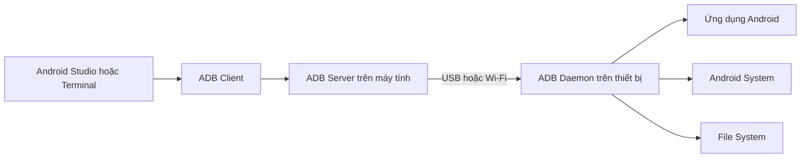
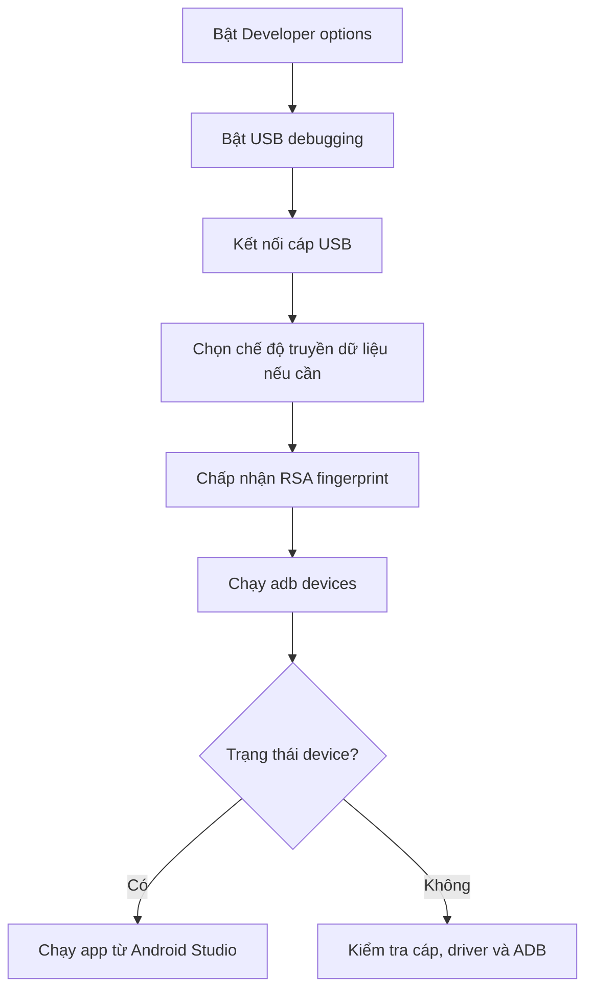
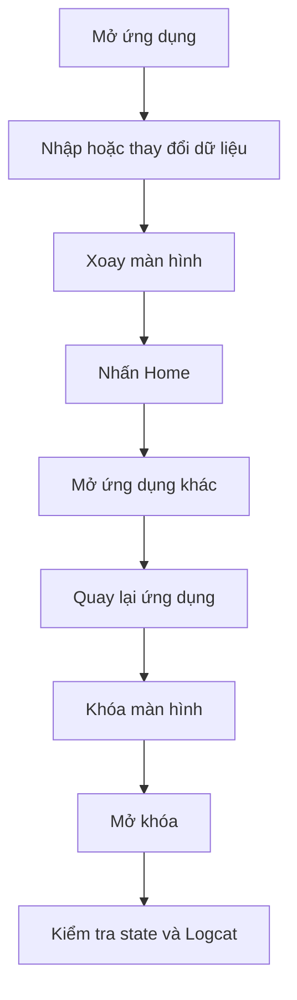
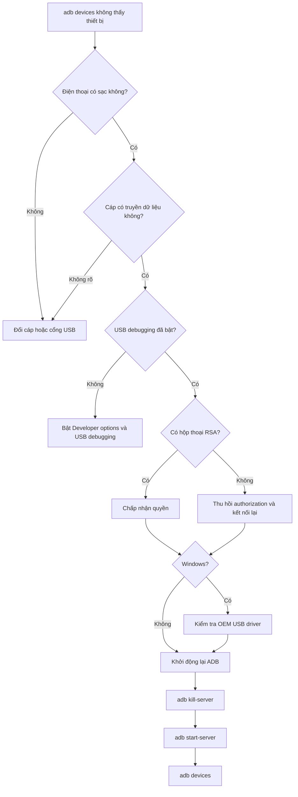

# 004 - Physical Device Debugging

| Thuộc tính              | Nội dung                               |
| ----------------------- | -------------------------------------- |
| **Học phần**            | 01 - Language and Android Fundamentals |
| **Module**              | Module 02 - Android Fundamentals       |
| **Nhóm nội dung**       | Development IDE                        |
| **Nguồn roadmap**       | Android Fundamentals / Development IDE |
| **Loại bài**            | Quality                                |
| **Thứ tự trong module** | 004                                    |
| **Thời lượng gợi ý**    | 30 phút                                |

---

## 1. Tóm tắt

**Physical Device Debugging** là quá trình chạy, quan sát và gỡ lỗi ứng dụng Android trực tiếp trên **điện thoại, máy tính bảng, đồng hồ hoặc thiết bị Android thật**.

Thiết bị thường kết nối với Android Studio thông qua:

* Cáp USB.
* Wireless Debugging qua Wi-Fi.
* Android Debug Bridge — `adb`.

Kiểm thử trên thiết bị thật giúp phát hiện những vấn đề mà Emulator không phản ánh đầy đủ như hiệu năng phần cứng, camera, cảm ứng, nhiệt độ, pin, Bluetooth, NFC, mạng di động, ROM của nhà sản xuất và hành vi chạy nền. Google khuyến nghị luôn kiểm thử ứng dụng trên thiết bị thật trước khi phát hành. ([Android Developers][1])

```text
Physical Device Debugging
├── Kết nối thiết bị
│   ├── USB
│   └── Wi-Fi
├── Cài và chạy ứng dụng
├── Logcat
├── Breakpoint và Debugger
├── ADB commands
├── Device Explorer
├── Bug report
└── Kiểm thử UX, lifecycle và hiệu năng thật
```

---

## 2. Mục tiêu học tập

Sau khi hoàn thành bài học, bạn có thể:

* [ ] Giải thích được Physical Device Debugging.
* [ ] Bật Developer options và USB debugging.
* [ ] Kết nối thiết bị thật bằng USB.
* [ ] Kết nối thiết bị bằng Wireless Debugging.
* [ ] Hiểu hộp thoại xác nhận RSA debugging.
* [ ] Kiểm tra kết nối bằng `adb devices`.
* [ ] Chạy ứng dụng trực tiếp từ Android Studio.
* [ ] Sử dụng Logcat để đọc lỗi trên thiết bị.
* [ ] Đặt breakpoint và kiểm tra giá trị biến.
* [ ] Thu thập screenshot, log và bug report.
* [ ] Kiểm thử lifecycle, state, mạng và permission.
* [ ] Tạo một quy trình kiểm tra có thể chạy lại.
* [ ] Biết những dữ liệu nào không nên ghi vào log.
* [ ] Tạo artifact nhỏ để đưa vào portfolio.

---

## 3. Thiết bị thật nằm ở đâu trong quy trình phát triển?

Emulator phù hợp để kiểm thử nhanh trên nhiều API level và kích thước màn hình. Thiết bị thật được dùng để xác minh ứng dụng trong điều kiện sử dụng thực tế trước khi phát hành. ([Android Developers][2])


### Emulator và thiết bị thật

| Tiêu chí                  | Emulator                  | Thiết bị thật              |
| ------------------------- | ------------------------- | -------------------------- |
| Nhiều API level           | Rất thuận tiện            | Cần nhiều thiết bị         |
| Nhiều kích thước màn hình | Dễ tạo                    | Phụ thuộc thiết bị sở hữu  |
| Camera                    | Mô phỏng                  | Camera thật                |
| Cảm ứng                   | Chuột mô phỏng            | Ngón tay thực tế           |
| GPU và hiệu năng          | Không hoàn toàn chính xác | Gần trải nghiệm người dùng |
| Pin và nhiệt độ           | Mô phỏng hạn chế          | Điều kiện thật             |
| Bluetooth và NFC          | Có giới hạn               | Kiểm thử thực tế           |
| ROM nhà sản xuất          | Chủ yếu Android chuẩn     | Samsung, Xiaomi, Oppo…     |
| Mạng di động              | Mô phỏng                  | SIM và sóng thật           |
| Background restriction    | Không đủ mọi biến thể     | Phụ thuộc hệ thống và hãng |

---

## 4. Kiến trúc kết nối ADB

**Android Debug Bridge — ADB** là công cụ dòng lệnh cho phép máy tính giao tiếp với thiết bị Android. ADB có thể cài ứng dụng, đọc log, mở shell, chuyển file, chụp màn hình và thực hiện nhiều thao tác gỡ lỗi khác. ([Android Developers][3])



ADB gồm ba thành phần chính:

| Thành phần              | Vị trí           | Vai trò          |
| ----------------------- | ---------------- | ---------------- |
| **ADB Client**          | Máy phát triển   | Gửi lệnh         |
| **ADB Server**          | Máy phát triển   | Quản lý kết nối  |
| **ADB Daemon — `adbd`** | Thiết bị Android | Thực thi yêu cầu |

---

## 5. Chuẩn bị thiết bị

### Yêu cầu cơ bản

* Android Studio đã được cài đặt.
* Android SDK Platform-Tools đã được cài.
* Dự án Android có thể build.
* Thiết bị đã mở khóa.
* Cáp USB có khả năng truyền dữ liệu nếu kết nối có dây.
* Developer options đã được bật.
* USB debugging hoặc Wireless debugging đã được bật.

---

## 6. Bật Developer options

Trên Android 4.2 trở lên, Developer options thường bị ẩn. Cách phổ biến để bật:

1. Mở **Settings**.
2. Chọn **About phone**.
3. Tìm **Build number**.
4. Nhấn liên tục bảy lần.
5. Nhập mã PIN nếu được yêu cầu.
6. Quay lại Settings.
7. Mở **Developer options**.

Tên và vị trí menu có thể khác nhau theo hãng thiết bị. Ví dụ, Samsung thường đặt Build number trong `About phone > Software information`. ([Android Developers][4])


*Nguồn ảnh: Android Developers.*

---

## 7. Bật USB Debugging

Trong Developer options:

```text
Settings
└── System hoặc Additional settings
    └── Developer options
        └── USB debugging
```

USB debugging cho phép Android Studio và các công cụ Android SDK giao tiếp với thiết bị thông qua ADB. ([Android Developers][4])

### Lưu ý theo hãng

Một số thiết bị có thể dùng tên hoặc vị trí khác:

```text
Samsung
Settings > Developer options > USB debugging

Xiaomi
Settings > Additional settings > Developer options > USB debugging

Oppo/Realme
Settings > System settings > Developer options > USB debugging
```

Vị trí cụ thể có thể thay đổi theo phiên bản Android và giao diện của nhà sản xuất.

---

## 8. Kết nối bằng USB

### Quy trình



### Các bước thực hiện

1. Kết nối điện thoại với máy tính.
2. Mở khóa màn hình điện thoại.
3. Chọn chế độ USB phù hợp nếu thiết bị yêu cầu.
4. Chấp nhận hộp thoại **Allow USB debugging?**
5. Trong Android Studio, chọn thiết bị ở Target Device.
6. Nhấn **Run** hoặc **Debug**.

Khi thiết bị đã được thiết lập đúng, Android Studio có thể build, cài và chạy ứng dụng trực tiếp trên thiết bị. ([Android Developers][2])

---

## 9. Xác nhận khóa RSA

Ở lần kết nối đầu tiên, điện thoại hiển thị fingerprint của khóa RSA trên máy tính.


*Nguồn ảnh: Android Developers.*

Bạn có thể chọn:

```text
[✓] Always allow from this computer
```

Chỉ chọn tùy chọn này khi đó là máy tính cá nhân hoặc máy làm việc đáng tin cậy. Cơ chế xác nhận RSA ngăn máy tính chưa được người dùng cho phép thực thi lệnh ADB trên thiết bị. ([Android Developers][2])

### Thu hồi quyền

Khi từng kết nối với máy tính không còn tin cậy:

```text
Developer options
└── Revoke USB debugging authorizations
```

Sau đó, mọi máy tính phải được xác nhận lại.

---

## 10. Cấu hình theo hệ điều hành máy tính

### Windows

Windows có thể cần USB driver phù hợp với thiết bị:

* Thiết bị Google: Google USB Driver.
* Samsung, Xiaomi, Oppo và hãng khác: driver từ nhà sản xuất.

Google USB Driver có thể được cài qua:

```text
Android Studio
└── Tools
    └── SDK Manager
        └── SDK Tools
            └── Google USB Driver
```

Google USB Driver được dùng cho thiết bị Google trên Windows; các hãng khác thường cung cấp driver riêng. macOS và Linux thường không cần cài USB driver theo cách này. ([Android Developers][5])

### Ubuntu Linux

Tài khoản cần quyền truy cập thiết bị USB. Tài liệu Android hướng dẫn thêm người dùng vào nhóm `plugdev` và cài bộ quy tắc `udev` phù hợp. ([Android Developers][1])

```bash
sudo usermod -aG plugdev "$LOGNAME"
sudo apt-get install android-sdk-platform-tools-common
```

Sau đó đăng xuất và đăng nhập lại.

### macOS

Thông thường không cần driver USB riêng. Hãy kiểm tra cáp, cổng USB và trạng thái ADB nếu thiết bị không xuất hiện. ([Android Developers][6])

---

## 11. Kiểm tra kết nối bằng ADB

Mở Terminal trong Android Studio:

```text
View > Tool Windows > Terminal
```

Chạy:

```bash
adb devices
```

Kết quả bình thường:

```text
List of devices attached
R58M123ABCDE    device
```

Tài liệu Android sử dụng `adb devices` để xác minh thiết bị đã được kết nối và cho phép dùng cờ `-d` để nhắm tới thiết bị vật lý đang kết nối. ([Android Developers][1])

### Các trạng thái thường gặp

| Trạng thái      | Ý nghĩa                                  |
| --------------- | ---------------------------------------- |
| `device`        | Thiết bị đã kết nối và được cho phép     |
| `unauthorized`  | Chưa chấp nhận RSA debugging             |
| `offline`       | ADB nhìn thấy nhưng không giao tiếp được |
| Không xuất hiện | Lỗi cáp, cổng, driver, quyền hoặc ADB    |
| Nhiều thiết bị  | Phải chọn serial cụ thể                  |

---

## 12. Nhắm đúng thiết bị

Khi chỉ có một thiết bị vật lý:

```bash
adb -d shell
```

Khi có nhiều thiết bị:

```bash
adb devices
```

Sau đó dùng serial:

```bash
adb -s R58M123ABCDE shell
adb -s R58M123ABCDE install app-debug.apk
```

Nếu không chọn đúng serial khi có nhiều thiết bị hoặc Emulator, ADB có thể báo:

```text
error: more than one device/emulator
```

---

## 13. Kết nối bằng Wireless Debugging

Android 11 trở lên hỗ trợ deploy và debug ứng dụng thông qua ADB qua Wi-Fi. Máy tính và thiết bị cần ở cùng mạng, sau đó thiết bị được ghép đôi bằng mã hoặc QR code. ([Android Developers][1])

### Bật Wireless Debugging

```text
Developer options
└── Wireless debugging
```


*Nguồn ảnh: Android Developers.*

### Ghép đôi từ Android Studio

1. Kết nối máy tính và điện thoại vào cùng mạng Wi-Fi.
2. Bật Wireless debugging trên điện thoại.
3. Trong Android Studio, chọn **Pair Devices Using Wi-Fi**.
4. Chọn ghép đôi bằng QR code hoặc pairing code.
5. Xác nhận kết nối.
6. Chọn thiết bị và nhấn Run.


*Nguồn ảnh: Android Developers.*

### Ghép đôi bằng dòng lệnh

Trên điện thoại, chọn:

```text
Wireless debugging
└── Pair device with pairing code
```

Sau đó chạy:

```bash
adb pair 192.168.1.50:37123
```

Nhập mã sáu chữ số được hiển thị trên điện thoại.

Nếu thiết bị chưa tự kết nối:

```bash
adb connect 192.168.1.50:41267
```

> Port ghép đôi và port kết nối có thể khác nhau.

---

## 14. USB hay Wi-Fi?

| Tiêu chí                   | USB                     | Wireless Debugging |
| -------------------------- | ----------------------- | ------------------ |
| Thiết lập ban đầu          | Dễ nếu driver hoạt động | Cần pair thiết bị  |
| Độ ổn định                 | Thường ổn định hơn      | Phụ thuộc mạng     |
| Tốc độ cài APK             | Thường nhanh            | Phụ thuộc Wi-Fi    |
| Sạc thiết bị               | Có                      | Không              |
| Di chuyển thiết bị         | Bị giới hạn bởi dây     | Thuận tiện         |
| Lỗi driver                 | Có thể gặp trên Windows | Tránh được         |
| Mạng công cộng             | Không phụ thuộc         | Không nên sử dụng  |
| Debug cảm biến chuyển động | Dây có thể gây vướng    | Thuận tiện hơn     |

USB phù hợp cho phiên debug dài hoặc truyền dữ liệu lớn. Wi-Fi phù hợp khi kiểm thử cảm biến, camera, xoay thiết bị hoặc khi cổng USB không ổn định.

---

## 15. Device Mirroring

Android Studio có thể chiếu màn hình thiết bị thật vào cửa sổ **Running Devices**. Lập trình viên có thể thao tác, xoay màn hình, thay đổi âm lượng hoặc thực hiện một số hành động trực tiếp từ IDE. Device Mirroring hoạt động với thiết bị đã bật USB debugging hoặc Wireless debugging. ([Android Developers][1])

Mở:

```text
View > Tool Windows > Running Devices
```

Cấu hình:

```text
Settings > Tools > Device Mirroring
```

### Lưu ý riêng tư

Không nên mirror điện thoại cá nhân khi đang mở:

* Tin nhắn riêng.
* Mã OTP.
* Thông tin ngân hàng.
* Email cá nhân.
* Thông báo nhạy cảm.
* Dữ liệu người dùng thật.

Tài liệu Android cũng cảnh báo một số kiểu kết nối ADB cũ qua TCP có thể truyền dữ liệu mirroring trên kênh không mã hóa. ([Android Developers][1])

---

## 16. Chạy ứng dụng trên thiết bị thật

### Từ Android Studio

1. Chọn cấu hình `app`.
2. Chọn thiết bị vật lý.
3. Nhấn **Run**.
4. Android Studio build APK.
5. APK được cài lên thiết bị.
6. Activity khởi động được mở.


### Cài bằng ADB

```bash
adb install app-debug.apk
```

Cài lại và giữ dữ liệu:

```bash
adb install -r app-debug.apk
```

Gỡ ứng dụng:

```bash
adb uninstall com.example.physicaldevicelab
```

Xóa dữ liệu nhưng giữ ứng dụng:

```bash
adb shell pm clear com.example.physicaldevicelab
```

---

## 17. Run và Debug khác nhau thế nào?

| Chế độ              | Mục đích                                       |
| ------------------- | ---------------------------------------------- |
| **Run**             | Chạy nhanh và kiểm tra chức năng               |
| **Debug**           | Gắn debugger, dùng breakpoint và kiểm tra biến |
| **Profile**         | Thu thập thông tin hiệu năng                   |
| **Attach Debugger** | Gắn debugger vào ứng dụng đang chạy            |

Debugger của Android Studio hỗ trợ chọn thiết bị, đặt breakpoint trong Kotlin, Java hoặc C/C++, xem biến và đánh giá biểu thức trong lúc ứng dụng chạy. Thiết bị thật cần bật debugging và ứng dụng phải dùng build variant có thể debug. ([Android Developers][7])

---

## 18. Đặt breakpoint

Ví dụ:

```kotlin
fun calculateOrderTotal(
    quantity: Int,
    unitPrice: Int
): Int {
    val subtotal = quantity * unitPrice
    val shippingFee = if (subtotal >= 500_000) 0 else 30_000
    return subtotal + shippingFee
}
```

Đặt breakpoint tại:

```kotlin
val shippingFee = if (subtotal >= 500_000) 0 else 30_000
```

Sau đó:

1. Nhấn **Debug**.
2. Thực hiện thao tác trên điện thoại.
3. Chờ chương trình dừng tại breakpoint.
4. Kiểm tra `quantity`, `unitPrice` và `subtotal`.
5. Sử dụng Step Over hoặc Step Into.
6. Kiểm tra giá trị trả về.

### Các nút thường dùng

| Chức năng           | Ý nghĩa                         |
| ------------------- | ------------------------------- |
| Resume              | Tiếp tục chương trình           |
| Step Over           | Chạy dòng hiện tại              |
| Step Into           | Đi vào hàm được gọi             |
| Step Out            | Thoát khỏi hàm hiện tại         |
| Evaluate Expression | Chạy thử biểu thức              |
| View Breakpoints    | Quản lý breakpoint              |
| Mute Breakpoints    | Tạm thời vô hiệu hóa breakpoint |

---

## 19. Attach Debugger vào ứng dụng đang chạy

Trong trường hợp ứng dụng đã được mở:

```text
Run
└── Attach Debugger to Android Process
```

Sau đó:

1. Chọn thiết bị.
2. Chọn process của ứng dụng.
3. Chọn kiểu debugger phù hợp.
4. Nhấn OK.
5. Thực hiện thao tác để chạm breakpoint.

Android Studio hỗ trợ gắn debugger vào process Android đang chạy thay vì bắt buộc khởi động lại ứng dụng. ([Android Developers][7])

---

## 20. Logcat trên thiết bị thật

Logcat hiển thị log của ứng dụng, Android framework và hệ thống theo thời gian thực. Khi ứng dụng crash, Logcat hiển thị exception và stack trace liên kết tới dòng mã liên quan. ([Android Developers][8])

Mở:

```text
View > Tool Windows > Logcat
```

### Bộ lọc hữu ích

Log của dự án hiện tại:

```text
package:mine
```

Chỉ xem lỗi:

```text
package:mine level:ERROR
```

Crash:

```text
package:mine is:crash
```

Log trong năm phút gần nhất:

```text
package:mine age:5m
```

Theo tag:

```text
tag:PhysicalDeviceLab
```

Logcat hỗ trợ các trường truy vấn như `tag`, `package`, `process`, `message`, `level` và `age`. ([Android Developers][8])

---

## 21. Ví dụ ứng dụng kiểm thử thiết bị thật

Ứng dụng sau hiển thị thông tin thiết bị, đếm số lần nhấn và ghi lifecycle vào Logcat.

```kotlin
package com.example.physicaldevicelab

import android.os.Build
import android.os.Bundle
import android.util.Log
import androidx.activity.ComponentActivity
import androidx.activity.compose.setContent
import androidx.compose.foundation.layout.Arrangement
import androidx.compose.foundation.layout.Column
import androidx.compose.foundation.layout.fillMaxSize
import androidx.compose.foundation.layout.padding
import androidx.compose.material3.Button
import androidx.compose.material3.MaterialTheme
import androidx.compose.material3.Text
import androidx.compose.runtime.Composable
import androidx.compose.runtime.getValue
import androidx.compose.runtime.mutableIntStateOf
import androidx.compose.runtime.saveable.rememberSaveable
import androidx.compose.runtime.setValue
import androidx.compose.ui.Modifier
import androidx.compose.ui.unit.dp

private const val TAG = "PhysicalDeviceLab"

class MainActivity : ComponentActivity() {

    override fun onCreate(savedInstanceState: Bundle?) {
        super.onCreate(savedInstanceState)
        Log.d(TAG, "onCreate")

        setContent {
            MaterialTheme {
                PhysicalDeviceScreen()
            }
        }
    }

    override fun onStart() {
        super.onStart()
        Log.d(TAG, "onStart")
    }

    override fun onResume() {
        super.onResume()
        Log.d(TAG, "onResume")
    }

    override fun onPause() {
        Log.d(TAG, "onPause")
        super.onPause()
    }

    override fun onStop() {
        Log.d(TAG, "onStop")
        super.onStop()
    }

    override fun onDestroy() {
        Log.d(TAG, "onDestroy")
        super.onDestroy()
    }
}

@Composable
private fun PhysicalDeviceScreen() {
    var count by rememberSaveable {
        mutableIntStateOf(0)
    }

    Column(
        modifier = Modifier
            .fillMaxSize()
            .padding(24.dp),
        verticalArrangement = Arrangement.spacedBy(12.dp)
    ) {
        Text(
            text = "Physical Device Lab",
            style = MaterialTheme.typography.headlineSmall
        )

        Text(text = "Hãng: ${Build.MANUFACTURER}")
        Text(text = "Thiết bị: ${Build.MODEL}")
        Text(text = "Android: ${Build.VERSION.RELEASE}")
        Text(text = "API level: ${Build.VERSION.SDK_INT}")
        Text(text = "Số lần nhấn: $count")

        Button(
            onClick = {
                count++
                Log.d(TAG, "Người dùng nhấn nút, count=$count")
            }
        ) {
            Text(text = "Tăng bộ đếm")
        }
    }
}
```

### Bộ lọc Logcat

```text
tag:PhysicalDeviceLab
```

Kết quả mẫu:

```text
D/PhysicalDeviceLab: onCreate
D/PhysicalDeviceLab: onStart
D/PhysicalDeviceLab: onResume
D/PhysicalDeviceLab: Người dùng nhấn nút, count=1
```

---

## 22. Kiểm thử lifecycle trên thiết bị thật

### Luồng kiểm thử



### Cần quan sát

* Activity có bị tạo lại không?
* Form đang nhập có bị mất không?
* API có bị gọi lại ngoài ý muốn không?
* Loading có bị chạy vô hạn không?
* Dialog có xuất hiện hai lần không?
* Navigation có quay sai màn hình không?
* Camera hoặc microphone có được giải phóng không?
* Audio có tạm dừng khi ứng dụng mất focus không?

---

## 23. Kiểm thử state

| Loại dữ liệu        | Giải pháp thường dùng    |
| ------------------- | ------------------------ |
| UI state nhỏ        | `rememberSaveable`       |
| State của màn hình  | `ViewModel`              |
| State cần phục hồi  | `SavedStateHandle`       |
| Cài đặt người dùng  | DataStore                |
| Dữ liệu có cấu trúc | Room                     |
| File lớn            | Bộ nhớ nội bộ hoặc cloud |

### Test case

```text
1. Nhập dữ liệu vào form.
2. Xoay thiết bị.
3. Nhấn Home.
4. Mở lại ứng dụng.
5. Khóa màn hình.
6. Đợi một khoảng thời gian.
7. Mở lại ứng dụng.
8. Kiểm tra dữ liệu.
```

Không nên chỉ kiểm tra rằng ứng dụng “không crash”. Cần xác minh người dùng vẫn tiếp tục được đúng luồng đang thực hiện.

---

## 24. Kiểm thử quyền truy cập

Trên thiết bị thật, cần kiểm thử nhiều trạng thái permission:

```text
Chưa hỏi quyền
├── Cho phép
├── Từ chối
├── Từ chối nhiều lần
├── Chỉ cho phép khi dùng ứng dụng
├── Chỉ cho phép một lần
├── Vị trí gần đúng
└── Thu hồi quyền trong Settings
```

### Các quyền nên kiểm thử trên phần cứng thật

* Camera.
* Microphone.
* Vị trí.
* Bluetooth.
* Notification.
* Storage hoặc media.
* Contacts.
* Nearby devices.

### Checklist UX

* [ ] Giải thích rõ lý do cần quyền.
* [ ] Không crash khi người dùng từ chối.
* [ ] Có phương án thay thế.
* [ ] Không hỏi lại liên tục.
* [ ] Có đường dẫn tới Settings khi cần.
* [ ] Không thu thập dữ liệu vượt quá nhu cầu.

---

## 25. Kiểm thử mạng thật

Thực hiện các tình huống:

* Wi-Fi mạnh.
* Wi-Fi yếu.
* Chuyển từ Wi-Fi sang 4G/5G.
* Bật Airplane mode.
* Mất mạng giữa lúc gửi dữ liệu.
* Server phản hồi chậm.
* Khóa màn hình khi request đang chạy.
* Đưa ứng dụng xuống background.
* Mạng có captive portal.
* Thiết bị dùng VPN.

### Kỳ vọng

```text
Mất mạng
→ ứng dụng không crash
→ loading kết thúc
→ dữ liệu nhập không mất
→ thông báo rõ ràng
→ có thể thử lại
→ không tạo request trùng
```

---

## 26. Kiểm thử phần cứng

Thiết bị thật đặc biệt quan trọng với các chức năng:

| Phần cứng       | Nội dung cần kiểm thử                  |
| --------------- | -------------------------------------- |
| Camera          | Focus, xoay ảnh, ánh sáng, quyền       |
| Microphone      | Chất lượng, audio focus, quyền         |
| GPS             | Độ chính xác, mất tín hiệu, background |
| Bluetooth       | Pair, reconnect, permission            |
| NFC             | Khoảng cách và tương thích             |
| Cảm biến        | Gia tốc, con quay, la bàn              |
| Vân tay         | Thành công, thất bại, hủy              |
| Loa và tai nghe | Audio route, âm lượng                  |
| Rung            | Cường độ và phản hồi UX                |
| Màn hình gập    | Thay đổi kích thước và posture         |

---

## 27. Một quy trình kiểm tra lặp lại được

Tạo file:

```text
scripts/device-check.ps1
```

### PowerShell script

```powershell
$ErrorActionPreference = "Stop"

$PackageName = "com.example.physicaldevicelab"
$OutputDir = Join-Path $PSScriptRoot "../artifacts/device-check"

New-Item -ItemType Directory -Force -Path $OutputDir | Out-Null

Write-Host "1. Kiểm tra ADB..."
adb version

Write-Host "2. Kiểm tra thiết bị..."
$Devices = adb devices
$Devices | Tee-Object -FilePath "$OutputDir/adb-devices.txt"

if ($Devices -notmatch "`tdevice") {
    throw "Không tìm thấy thiết bị Android ở trạng thái device."
}

Write-Host "3. Lưu thông tin thiết bị..."
adb shell getprop ro.product.manufacturer |
    Out-File "$OutputDir/manufacturer.txt"

adb shell getprop ro.product.model |
    Out-File "$OutputDir/model.txt"

adb shell getprop ro.build.version.release |
    Out-File "$OutputDir/android-version.txt"

adb shell getprop ro.build.version.sdk |
    Out-File "$OutputDir/api-level.txt"

Write-Host "4. Kiểm tra package..."
adb shell dumpsys package $PackageName |
    Out-File "$OutputDir/package-info.txt"

Write-Host "5. Chụp màn hình..."
cmd /c "adb exec-out screencap -p > `"$OutputDir/screenshot.png`""

Write-Host "6. Lưu Logcat..."
adb logcat -d -v threadtime |
    Out-File "$OutputDir/logcat.txt"

Write-Host "Hoàn tất: $OutputDir"
```

### Chạy script

```powershell
powershell -ExecutionPolicy Bypass `
  -File .\scripts\device-check.ps1
```

### Artifact được tạo

```text
artifacts/device-check/
├── adb-devices.txt
├── manufacturer.txt
├── model.txt
├── android-version.txt
├── api-level.txt
├── package-info.txt
├── screenshot.png
└── logcat.txt
```

---

## 28. Quality check bắt lỗi gì?

| Kiểm tra              | Lỗi có thể phát hiện               |
| --------------------- | ---------------------------------- |
| `adb devices`         | Thiết bị chưa kết nối              |
| Manufacturer và model | Chạy nhầm thiết bị                 |
| API level             | Thiết bị không thuộc test matrix   |
| `dumpsys package`     | Ứng dụng chưa được cài             |
| Screenshot            | UI sai hoặc màn hình không đúng    |
| Logcat                | Crash, exception hoặc warning      |
| Package information   | Version hoặc permission không đúng |

### Ví dụ thất bại

```text
Không tìm thấy thiết bị Android ở trạng thái device.
```

Nguyên nhân có thể là:

* USB debugging chưa bật.
* RSA chưa được chấp nhận.
* Cáp chỉ hỗ trợ sạc.
* Driver chưa được cài.
* ADB đang offline.
* Wireless debugging đã mất kết nối.

---

## 29. Thu thập bug report

Bug report chứa log thiết bị, stack trace và các thông tin chẩn đoán hệ thống. Có thể tạo bug report từ Developer options hoặc bằng lệnh `adb bugreport`. ([Android Developers][9])

### Từ điện thoại

```text
Developer options
└── Take bug report
```

### Bằng ADB

```bash
adb bugreport reports/
```

Khi có nhiều thiết bị:

```bash
adb devices
adb -s R58M123ABCDE bugreport reports/
```

Bug report có thể chứa thông tin hệ thống và dữ liệu nhạy cảm. Chỉ chia sẻ với người có trách nhiệm điều tra lỗi và kiểm tra nội dung trước khi tải lên issue công khai.

---

## 30. Thu thập log riêng của ứng dụng

Xóa log cũ:

```bash
adb logcat -c
```

Tái tạo lỗi trên điện thoại, sau đó lưu:

```bash
adb logcat -d -v threadtime > physical-device-log.txt
```

Chỉ lưu log của package:

```bash
adb logcat --pid=$(adb shell pidof -s com.example.physicaldevicelab)
```

Trên PowerShell, có thể tách thành hai bước:

```powershell
$PidValue = adb shell pidof -s com.example.physicaldevicelab
adb logcat --pid=$PidValue |
    Out-File physical-device-log.txt
```

---

## 31. Screenshot và quay màn hình

### Chụp màn hình

```bash
adb exec-out screencap -p > screenshot.png
```

### Quay video

```bash
adb shell screenrecord /sdcard/physical-test.mp4
```

Nhấn `Ctrl + C` để dừng, sau đó:

```bash
adb pull /sdcard/physical-test.mp4
```

Video nên bật tùy chọn **Show taps** trong Developer options để người xem nhìn thấy thao tác chạm. Developer options cung cấp các tùy chọn như Show taps, Pointer location và Show layout bounds để hỗ trợ quan sát UI. ([Android Developers][10])

---

## 32. Device Explorer

Device Explorer trong Android Studio hỗ trợ xem file trên thiết bị, chẳng hạn:

```text
/data/data/<package>/
/sdcard/
/storage/emulated/0/
```

Mở:

```text
View > Tool Windows > Device Explorer
```

Khả năng truy cập file phụ thuộc loại build, phiên bản Android và quyền của thiết bị. Android Studio có thể mở hoặc lưu bản sao tạm thời của file được chọn trong Device Explorer. ([Android Developers][11])

### Dùng để kiểm tra

* File cache.
* Database.
* Shared files.
* Dữ liệu tải xuống.
* Ảnh được ứng dụng tạo.
* File cấu hình debug.
* Kích thước file bất thường.

---

## 33. Lỗi thường gặp

### 33.1. Thiết bị không xuất hiện

Chạy:

```bash
adb devices
```

Nếu danh sách trống:

1. Mở khóa điện thoại.
2. Kiểm tra USB debugging.
3. Đổi cáp USB.
4. Đổi cổng USB.
5. Chọn USB file transfer.
6. Cài driver OEM trên Windows.
7. Khởi động lại ADB.
8. Mở Connection Assistant.

Android Studio có **Tools > Troubleshoot Device Connections** để hướng dẫn kiểm tra USB, USB debugging và khởi động lại ADB server. ([Android Developers][1])

---

### 33.2. Trạng thái `unauthorized`

```text
R58M123ABCDE    unauthorized
```

Cách xử lý:

```text
1. Mở khóa màn hình.
2. Chấp nhận Allow USB debugging.
3. Nếu hộp thoại không xuất hiện:
   Developer options
   → Revoke USB debugging authorizations
4. Ngắt và kết nối lại cáp.
```

---

### 33.3. Trạng thái `offline`

Thử:

```bash
adb kill-server
adb start-server
adb devices
```

Sau đó:

* Ngắt và cắm lại thiết bị.
* Tắt rồi bật USB debugging.
* Khởi động lại điện thoại.
* Cập nhật Platform-Tools.
* Kiểm tra cáp và driver.

---

### 33.4. Cáp chỉ sạc

Một số cáp USB không có đường truyền dữ liệu.

Dấu hiệu:

* Điện thoại vẫn sạc.
* Không xuất hiện trong Device Manager.
* `adb devices` không có kết quả.
* Không xuất hiện lựa chọn File Transfer.

Cách kiểm tra tốt nhất là thử một cáp đã xác nhận truyền được dữ liệu.

---

### 33.5. Không cài được APK

Một số lỗi:

```text
INSTALL_FAILED_VERSION_DOWNGRADE
INSTALL_FAILED_UPDATE_INCOMPATIBLE
INSTALL_FAILED_INSUFFICIENT_STORAGE
```

Xử lý bản cũ có chữ ký khác:

```bash
adb uninstall com.example.physicaldevicelab
```

Sau đó cài lại:

```bash
adb install app-debug.apk
```

> Gỡ ứng dụng sẽ xóa dữ liệu local của ứng dụng.

---

### 33.6. Wireless Debugging không tìm thấy thiết bị

Kiểm tra:

* Hai thiết bị có cùng Wi-Fi không?
* Wireless debugging còn bật không?
* Mạng có chặn thiết bị giao tiếp với nhau không?
* VPN có làm thay đổi route không?
* Platform-Tools có được cập nhật không?
* Thiết bị có còn ghép đôi không?
* Địa chỉ IP hoặc port có thay đổi không?

Wireless Debugging yêu cầu thiết bị Android 11 trở lên, máy tính và thiết bị cùng mạng và Platform-Tools phù hợp. ([Android Developers][12])

---

## 34. Sơ đồ khắc phục lỗi kết nối



---

## 35. Sai lầm phổ biến của người mới

### Chỉ kiểm thử trên Emulator

Emulator không phản ánh đầy đủ camera, pin, nhiệt độ, ROM nhà sản xuất và cảm giác chạm thực tế.

### Chỉ kiểm tra thiết bị mạnh

Ứng dụng cần được thử trên ít nhất một thiết bị cấu hình thấp hoặc đã sử dụng vài năm nếu nhóm người dùng có thể dùng loại máy đó.

### Ghi dữ liệu nhạy cảm vào Logcat

Không ghi:

```text
Password
Access token
Refresh token
OTP
Thông tin thẻ
Nội dung tin nhắn
Tọa độ chính xác không cần thiết
Dữ liệu sức khỏe
```

### Dùng Debug build để đo hiệu năng cuối cùng

Debug build và debugger có thể tạo thêm chi phí thực thi. Khi đánh giá hiệu năng, cần sử dụng cấu hình phù hợp và không chỉ dựa vào phiên debug đang gắn debugger. ([Android Developers][13])

### Bật USB debugging vĩnh viễn

Sau khi hoàn thành công việc trên thiết bị cá nhân, nên tắt USB debugging hoặc thu hồi quyền máy tính không còn sử dụng.

### Không ghi thông tin môi trường

Một báo cáo lỗi chỉ ghi “app bị lag” là chưa đủ. Cần có:

```text
Hãng và model
Phiên bản Android
API level
Phiên bản ứng dụng
Build type
Mạng đang dùng
Pin và nhiệt độ tương đối
Các bước tái tạo
Log hoặc video
```

---

## 36. Ảnh hưởng đến chất lượng sản phẩm

| Khía cạnh         | Vai trò của thiết bị thật                           |
| ----------------- | --------------------------------------------------- |
| **UX**            | Kiểm tra thao tác tay, bàn phím và cảm giác sử dụng |
| **Reliability**   | Tái tạo crash trong môi trường thật                 |
| **Lifecycle**     | Kiểm tra lock screen, cuộc gọi và background        |
| **State**         | Xác minh dữ liệu không mất khi gián đoạn            |
| **Network**       | Kiểm tra Wi-Fi, dữ liệu di động và chuyển mạng      |
| **Performance**   | Đo trên CPU, GPU và RAM thực                        |
| **Battery**       | Quan sát tác động sử dụng thực tế                   |
| **Hardware**      | Camera, GPS, Bluetooth, NFC và cảm biến             |
| **Compatibility** | Phát hiện khác biệt theo hãng                       |
| **Release risk**  | Giảm lỗi chỉ xuất hiện sau phát hành                |

---

## 37. Test matrix tối thiểu

| Hạng mục   | Thiết bị A                    | Thiết bị B                |
| ---------- | ----------------------------- | ------------------------- |
| Loại       | Máy chính                     | Máy cấu hình thấp hoặc cũ |
| Android    | Target hoặc mới nhất          | Gần minSdk                |
| Màn hình   | Trung bình/lớn                | Nhỏ                       |
| ROM        | Google hoặc Android gần chuẩn | Samsung/Xiaomi/Oppo…      |
| Mạng       | Wi-Fi                         | 4G/5G                     |
| Theme      | Light                         | Dark                      |
| Pin        | Bình thường                   | Battery Saver             |
| Storage    | Còn nhiều                     | Gần đầy                   |
| Permission | Cho phép                      | Từ chối                   |
| State      | Foreground                    | Background và lock screen |

---

## 38. Kế hoạch thực hành trong 30 phút

|  Thời gian | Nội dung                               |
| ---------: | -------------------------------------- |
|   0–4 phút | Bật Developer options và USB debugging |
|   4–7 phút | Kết nối USB và xác nhận RSA            |
|  7–10 phút | Chạy `adb devices`                     |
| 10–14 phút | Chạy ứng dụng trên thiết bị            |
| 14–18 phút | Xem lifecycle trong Logcat             |
| 18–22 phút | Đặt breakpoint và kiểm tra biến        |
| 22–25 phút | Kiểm thử rotate, Home và lock screen   |
| 25–28 phút | Chạy script `device-check.ps1`         |
| 28–30 phút | Lưu screenshot, log và README          |

---

## 39. Bài tập

### Bài 1: kết nối thiết bị

1. Bật Developer options.
2. Bật USB debugging.
3. Kết nối điện thoại.
4. Chấp nhận RSA.
5. Chạy:

```bash
adb devices
```

6. Lưu kết quả vào:

```text
artifacts/adb-devices.txt
```

---

### Bài 2: chạy ứng dụng

1. Tạo ứng dụng Physical Device Lab.
2. Chạy trên điện thoại.
3. Nhấn nút năm lần.
4. Xoay thiết bị.
5. Kiểm tra `count`.
6. Chụp màn hình dọc và ngang.

---

### Bài 3: debug bằng breakpoint

1. Thêm hàm tính giá đơn hàng.
2. Đặt breakpoint.
3. Chạy bằng Debug.
4. Kiểm tra giá trị biến.
5. Chụp Debug window.
6. Ghi nguyên nhân nếu kết quả sai.

---

### Bài 4: kiểm thử lifecycle

Thực hiện:

```text
Mở app
→ Home
→ mở lại
→ khóa màn hình
→ mở khóa
→ xoay thiết bị
```

Lưu Logcat:

```bash
adb logcat -d > lifecycle-log.txt
```

---

### Bài 5: tạo quality check

Chạy:

```powershell
.\scripts\device-check.ps1
```

Bài đạt khi:

* Thiết bị ở trạng thái `device`.
* Script không báo lỗi.
* Có screenshot.
* Có thông tin model và API.
* Có file Logcat.
* Package của ứng dụng được tìm thấy.

---

## 40. Artifact đưa vào portfolio

```text
physical-device-debugging-lab/
├── README.md
├── app/
│   └── PhysicalDeviceLab/
├── scripts/
│   └── device-check.ps1
├── artifacts/
│   └── device-check/
│       ├── adb-devices.txt
│       ├── manufacturer.txt
│       ├── model.txt
│       ├── android-version.txt
│       ├── api-level.txt
│       ├── package-info.txt
│       ├── screenshot.png
│       └── logcat.txt
├── screenshots/
│   ├── usb-debugging.png
│   ├── app-portrait.png
│   ├── app-landscape.png
│   └── debugger-breakpoint.png
└── docs/
    ├── test-matrix.md
    └── troubleshooting.md
```

### Mẫu `README.md`

````markdown
# Physical Device Debugging Lab

## Mục tiêu

Thiết lập quy trình chạy và gỡ lỗi ứng dụng Android trên
thiết bị vật lý bằng USB, ADB, Logcat và Android Studio Debugger.

## Thiết bị kiểm thử

- Manufacturer: Samsung
- Model: ...
- Android version: ...
- API level: ...
- Connection: USB hoặc Wi-Fi

## Nội dung đã kiểm thử

- Cài và chạy ứng dụng bằng ADB
- Activity lifecycle
- State khi xoay màn hình
- Background và lock screen
- Logcat
- Breakpoint
- Screenshot
- Device information script

## Lỗi đã phát hiện

Mô tả lỗi, bước tái tạo, log liên quan và cách khắc phục.

## Quality check

```powershell
.\scripts\device-check.ps1
````

````

---

## 41. Checklist hoàn thành

### Kiến thức

- [ ] Giải thích được Physical Device Debugging.
- [ ] Hiểu vai trò của ADB.
- [ ] Phân biệt USB và Wireless Debugging.
- [ ] Hiểu xác nhận RSA.
- [ ] Biết `adb devices` dùng để làm gì.
- [ ] Hiểu Run, Debug và Attach Debugger.
- [ ] Biết Logcat và bug report khác nhau thế nào.
- [ ] Hiểu hạn chế của Emulator.

### Thực hành

- [ ] Bật được Developer options.
- [ ] Bật được USB debugging.
- [ ] Kết nối được thiết bị.
- [ ] Thiết bị có trạng thái `device`.
- [ ] Chạy được ứng dụng.
- [ ] Đọc được Logcat.
- [ ] Đặt được breakpoint.
- [ ] Xem được giá trị biến.
- [ ] Kiểm thử được rotate và background.
- [ ] Chụp được screenshot.
- [ ] Lưu được log.
- [ ] Chạy được quality script.
- [ ] Xử lý được trạng thái `unauthorized`.

### Portfolio

- [ ] Có source code.
- [ ] Có README.
- [ ] Có script kiểm tra.
- [ ] Có thông tin thiết bị.
- [ ] Có ảnh ứng dụng trên máy thật.
- [ ] Có Logcat mẫu.
- [ ] Có test matrix.
- [ ] Có mô tả lỗi và cách sửa.
- [ ] Không công khai serial hoặc dữ liệu cá nhân nhạy cảm.

---

## 42. Ghi chú khi đưa vào production

### User flow

- Người dùng có thể hoàn thành luồng bằng một tay không?
- Bàn phím có che input hoặc nút bấm không?
- Back gesture có hoạt động đúng không?
- App có phản hồi rõ khi mất mạng không?
- Permission bị từ chối có làm chặn toàn bộ app không?

### Lifecycle và state

- Form có giữ dữ liệu khi xoay không?
- State có còn khi lock screen không?
- Request có bị gửi lại khi Activity tái tạo không?
- Camera, microphone và sensor có được giải phóng không?
- App có phục hồi đúng sau thời gian dài ở background không?

### Network và storage

- Đã kiểm thử Wi-Fi và dữ liệu di động chưa?
- Chuyển mạng giữa request có gây lỗi không?
- Thiết bị gần đầy bộ nhớ thì app xử lý thế nào?
- Database migration đã được thử trên dữ liệu thật chưa?
- File tạm có được dọn dẹp không?

### Quality

- Có test case tái tạo lỗi không?
- Có lưu model, API và app version không?
- Log có đủ thông tin nhưng không chứa bí mật không?
- Lỗi cũ có regression test không?
- Quality script có chạy lại được không?

### Release

- Kiểm thử ít nhất một thiết bị thật.
- Kiểm thử một thiết bị gần `minSdk`.
- Kiểm thử một thiết bị Android mới.
- Kiểm thử ít nhất hai hãng nếu có thể.
- Kiểm thử release build.
- Không dựa hoàn toàn vào debug build.
- Tắt debug endpoint và verbose log.
- Xóa tài khoản hoặc dữ liệu thử nghiệm khỏi thiết bị.

---

## 43. Tóm tắt

```text
Physical Device Debugging
│
├── Chuẩn bị
│   ├── Developer options
│   ├── USB debugging
│   └── Platform-Tools
│
├── Kết nối
│   ├── USB
│   ├── Wi-Fi
│   └── RSA authorization
│
├── Công cụ
│   ├── Android Studio Debugger
│   ├── Logcat
│   ├── ADB
│   ├── Device Explorer
│   └── Bug report
│
├── Kiểm thử
│   ├── UX thực tế
│   ├── Lifecycle
│   ├── State
│   ├── Network
│   ├── Permission
│   ├── Hardware
│   └── Performance
│
└── Artifact
    ├── Script kiểm tra
    ├── Screenshot
    ├── Log
    ├── Device information
    └── Test matrix
````

Điểm cần ghi nhớ:

1. Emulator không thay thế hoàn toàn thiết bị thật.
2. ADB là cầu nối giữa máy phát triển và thiết bị.
3. Trạng thái đúng trong `adb devices` là `device`.
4. Chỉ chấp nhận RSA trên máy tính đáng tin cậy.
5. Wireless Debugging thuận tiện nhưng nên dùng trên mạng tin cậy.
6. Luôn kiểm thử rotate, background, lock screen và mất mạng.
7. Không ghi token, OTP hoặc dữ liệu nhạy cảm vào Logcat.
8. Một quality check tốt phải có thể chạy lại và lưu bằng chứng.

---

## 44. Tài liệu tham khảo

* [Chạy ứng dụng trên thiết bị thật](https://developer.android.com/studio/run/device)
* [Cấu hình Developer options](https://developer.android.com/studio/debug/dev-options)
* [Android Debug Bridge — ADB](https://developer.android.com/tools/adb)
* [Gỡ lỗi ứng dụng bằng Android Studio](https://developer.android.com/studio/debug)
* [Xem log bằng Logcat](https://developer.android.com/studio/debug/logcat)
* [Thu thập và đọc bug report](https://developer.android.com/studio/debug/bug-report)
* [Cài OEM USB Driver](https://developer.android.com/studio/run/oem-usb)
* [Cài Google USB Driver](https://developer.android.com/studio/run/win-usb)
* [Xem file bằng Device Explorer](https://developer.android.com/studio/debug/device-file-explorer)
* [Codelab kết nối thiết bị Android](https://developer.android.com/codelabs/basic-android-kotlin-compose-connect-device)

[1]: https://developer.android.com/studio/run/device "Run apps on a hardware device  |  Android Studio  |  Android Developers"
[2]: https://developer.android.com/studio/run/device.html?utm_source=chatgpt.com "Run apps on a hardware device  |  Android Studio  |  Android Developers"
[3]: https://developer.android.com/tools/adb?utm_source=chatgpt.com "Android Debug Bridge (adb) | Android Studio"
[4]: https://developer.android.com/studio/debug/dev-options?utm_source=chatgpt.com "Configure on-device developer options  |  Android Studio  |  Android Developers"
[5]: https://developer.android.com/studio/run/oem-usb?utm_source=chatgpt.com "Install OEM USB drivers | Android Studio"
[6]: https://developer.android.com/studio/run/win-usb?utm_source=chatgpt.com "Get the Google USB Driver  |  Android Studio  |  Android Developers"
[7]: https://developer.android.com/studio/debug?authuser=3&utm_source=chatgpt.com "Debug your app  |  Android Studio  |  Android Developers"
[8]: https://developer.android.com/studio/debug/logcat?authuser=9&hl=en&utm_source=chatgpt.com "View logs with Logcat  |  Android Studio  |  Android Developers"
[9]: https://developer.android.com/studio/debug/bug-report "Capture and read bug reports  |  Android Studio  |  Android Developers"
[10]: https://developer.android.com/studio/debug/dev-options.html?utm_source=chatgpt.com "Configure on-device developer options  |  Android Studio  |  Android Developers"
[11]: https://developer.android.com/studio/debug/device-file-explorer?authuser=7&hl=en&utm_source=chatgpt.com "View on-device files with Device Explorer  |  Android Studio  |  Android Developers"
[12]: https://developer.android.com/codelabs/basic-android-kotlin-compose-connect-device "How to connect your Android device  |  Android Developers"
[13]: https://developer.android.com/studio/profile/?utm_source=chatgpt.com "Profile your app performance  |  Android Studio  |  Android Developers"

---

# Bài luyện tập

## Mục tiêu


## Đề bài


## Yêu cầu hoàn thành

- [ ] 
- [ ] 
- [ ] 

## Kết quả / lời giải


## Ghi chú
