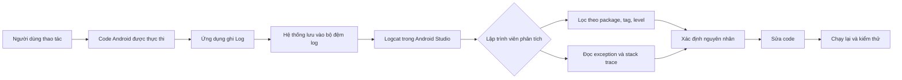
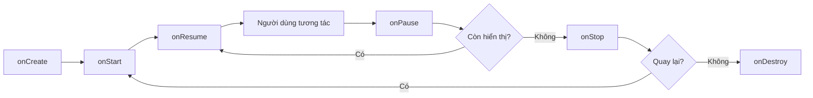
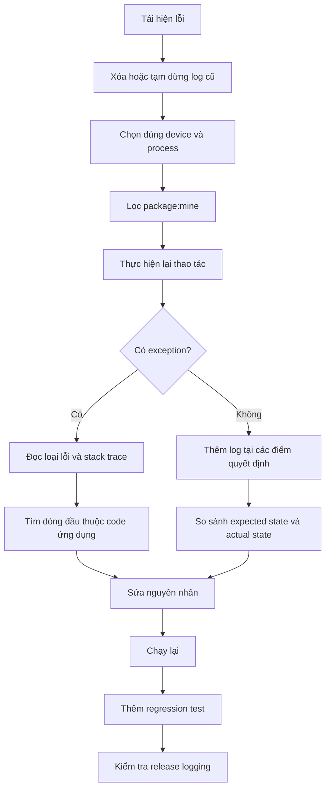

# 005 — Logcat

**Học phần:** 01 — Language and Android Fundamentals
**Module:** Module 02 — Android Fundamentals
**Nhóm nội dung:** Development IDE
**Nguồn roadmap:** Android Fundamentals / Development IDE
**Loại bài:** Lesson
**Thứ tự trong module:** 005
**Thời lượng gợi ý:** 24 phút

---

## 1. Tóm tắt

**Logcat** là công cụ hiển thị nhật ký của thiết bị Android theo thời gian thực trong Android Studio. Nó cho phép lập trình viên quan sát:

* Thông báo do ứng dụng ghi bằng lớp `android.util.Log`.
* Thông báo từ hệ điều hành Android.
* Cảnh báo và lỗi của thư viện.
* Exception và stack trace khi ứng dụng gặp sự cố.
* Thứ tự thực thi của lifecycle, xử lý dữ liệu, network và thao tác người dùng.

Khi ứng dụng phát sinh exception, Logcat thường hiển thị thông báo lỗi kèm stack trace và liên kết đến dòng mã liên quan.

> Logcat giúp trả lời câu hỏi: **“Ứng dụng vừa thực hiện điều gì và lỗi bắt đầu từ đâu?”**

---

## 2. Mục tiêu học tập

Sau bài học, bạn có thể:

* Giải thích được Logcat bằng ngôn ngữ của mình.
* Mở và sử dụng cửa sổ Logcat trong Android Studio.
* Ghi log bằng `Log.v()`, `Log.d()`, `Log.i()`, `Log.w()` và `Log.e()`.
* Phân biệt các cấp độ log.
* Lọc log theo ứng dụng, tag, mức độ và nội dung.
* Đọc phần quan trọng của một stack trace.
* Theo dõi lifecycle của `Activity` bằng Logcat.
* Tránh ghi mật khẩu, access token hoặc dữ liệu cá nhân vào log.
* Tạo một tài liệu debugging nhỏ để đưa vào portfolio.

---

## 3. Logcat nằm ở đâu trong quá trình phát triển Android?

Logcat thuộc nhóm công cụ **development và debugging** trong Android Studio.



Logcat có thể hỗ trợ kiểm tra nhiều lớp trong ứng dụng:

| Khu vực         | Logcat giúp quan sát                                      |
| --------------- | --------------------------------------------------------- |
| UI              | Sự kiện nhấn nút, chuyển màn hình, render sai trạng thái  |
| Lifecycle       | `onCreate`, `onStart`, `onResume`, `onPause`, `onStop`    |
| State           | Dữ liệu có được khôi phục sau khi xoay màn hình hay không |
| Network         | Request bắt đầu, thành công, timeout hoặc thất bại        |
| Database        | Truy vấn, insert, update hoặc lỗi lưu dữ liệu             |
| Background work | Worker, coroutine, service có được kích hoạt không        |
| Crash           | Exception, nguyên nhân và chuỗi lời gọi hàm               |
| Performance     | Thao tác lặp quá nhiều, log xuất hiện bất thường          |

Logcat **không thay thế** debugger, automated test hoặc hệ thống theo dõi lỗi production. Nó là một nguồn thông tin giúp lập trình viên hiểu hành vi đang xảy ra trong lúc chạy ứng dụng.

---

## 4. Giao diện Logcat


*Hình 1: Cửa sổ Logcat trong Android Studio. Nguồn: Android Developers.*

Mở Logcat bằng một trong các cách sau:

```text
View → Tool Windows → Logcat
```

Hoặc chọn tab **Logcat** ở khu vực tool window phía dưới Android Studio.

Quy trình cơ bản:

1. Kết nối thiết bị thật hoặc mở Android Emulator.
2. Build và chạy ứng dụng.
3. Mở cửa sổ Logcat.
4. Chọn đúng thiết bị.
5. Chọn đúng process của ứng dụng.
6. Nhập truy vấn lọc.
7. Thực hiện lại thao tác đang cần kiểm tra.

Theo tài liệu Android, mỗi dòng log có thể chứa thời gian, process ID, thread ID, tag, package, priority và nội dung thông báo.

---

## 5. Cấu trúc của một dòng log

Ví dụ:

```text
2026-08-05 10:30:12.214  8234-8234  LoginFlow
com.example.logcatdemo  D  Người dùng nhấn nút đăng nhập
```

Có thể phân tích như sau:

```text
┌─────────────────────── Thời gian
│                   ┌── Process ID và Thread ID
│                   │          ┌── Tag
│                   │          │              ┌── Package
│                   │          │              │                   ┌── Level
│                   │          │              │                   │
2026-08-05 10:30:12.214 8234-8234 LoginFlow com.example.logcatdemo D Nội dung log
```

| Thành phần | Ý nghĩa                                      |
| ---------- | -------------------------------------------- |
| Timestamp  | Thời điểm log được tạo                       |
| Process ID | Tiến trình tạo ra log                        |
| Thread ID  | Luồng thực thi tạo ra log                    |
| Tag        | Nhãn dùng để nhóm và tìm kiếm log            |
| Package    | Ứng dụng tạo ra log                          |
| Level      | Mức độ quan trọng                            |
| Message    | Nội dung do hệ thống hoặc lập trình viên ghi |

Một `TAG` tốt nên ngắn, ổn định và thể hiện rõ nguồn log:

```kotlin
private const val TAG = "LoginFlow"
```

Không nên sử dụng tag thiếu ý nghĩa:

```kotlin
private const val TAG = "TEST"
private const val TAG = "ABC"
private const val TAG = "LOG"
```

---

## 6. Các cấp độ log

Android cung cấp các phương thức phổ biến:

```kotlin
Log.v(TAG, "Verbose message")
Log.d(TAG, "Debug message")
Log.i(TAG, "Information message")
Log.w(TAG, "Warning message")
Log.e(TAG, "Error message")
```

Thứ tự từ mức nghiêm trọng thấp đến cao thường được hiểu như sau:

```text
VERBOSE → DEBUG → INFO → WARN → ERROR
```

API chính thức của Android cung cấp các phương thức `Log.v()`, `Log.d()`, `Log.i()`, `Log.w()` và `Log.e()`.

| Phương thức | Ký hiệu | Khi nào sử dụng                          | Ví dụ                         |
| ----------- | ------: | ---------------------------------------- | ----------------------------- |
| `Log.v()`   |       V | Thông tin cực kỳ chi tiết                | Giá trị trong từng vòng lặp   |
| `Log.d()`   |       D | Theo dõi quá trình debug                 | Lifecycle, state, luồng xử lý |
| `Log.i()`   |       I | Sự kiện quan trọng nhưng bình thường     | Đăng nhập thành công          |
| `Log.w()`   |       W | Tình huống bất thường nhưng app vẫn chạy | Cache rỗng, dùng fallback     |
| `Log.e()`   |       E | Thao tác thất bại hoặc exception         | Network error, database error |

### Ví dụ lựa chọn cấp độ

```kotlin
private const val TAG = "ProfileRepository"

fun loadProfile(userId: String) {
    Log.d(TAG, "Bắt đầu tải hồ sơ")

    try {
        val profileExists = userId.isNotBlank()

        if (!profileExists) {
            Log.w(TAG, "Không có userId, sử dụng hồ sơ mặc định")
            return
        }

        Log.i(TAG, "Tải hồ sơ thành công")
    } catch (exception: Exception) {
        Log.e(TAG, "Không thể tải hồ sơ", exception)
    }
}
```

Khi ghi exception, nên truyền trực tiếp đối tượng `Throwable`:

```kotlin
Log.e(TAG, "Không thể tải dữ liệu", exception)
```

Thay vì chỉ ghi message:

```kotlin
Log.e(TAG, exception.message ?: "Unknown error")
```

Cách đầu tiên giữ lại stack trace, giúp xác định dòng mã và chuỗi lời gọi hàm dẫn đến lỗi.

---

## 7. Ví dụ theo dõi lifecycle của Activity

```kotlin
package com.example.logcatdemo

import android.os.Bundle
import android.util.Log
import androidx.activity.ComponentActivity

class MainActivity : ComponentActivity() {

    companion object {
        private const val TAG = "MainActivityLifecycle"
    }

    override fun onCreate(savedInstanceState: Bundle?) {
        super.onCreate(savedInstanceState)

        Log.d(
            TAG,
            "onCreate: hasSavedState=${savedInstanceState != null}"
        )
    }

    override fun onStart() {
        super.onStart()
        Log.d(TAG, "onStart")
    }

    override fun onResume() {
        super.onResume()
        Log.d(TAG, "onResume: màn hình có thể tương tác")
    }

    override fun onPause() {
        Log.d(TAG, "onPause: màn hình mất focus")
        super.onPause()
    }

    override fun onStop() {
        Log.d(TAG, "onStop: màn hình không còn hiển thị")
        super.onStop()
    }

    override fun onDestroy() {
        Log.d(TAG, "onDestroy: isFinishing=$isFinishing")
        super.onDestroy()
    }
}
```

### Kết quả dự kiến khi mở ứng dụng

```text
D/MainActivityLifecycle: onCreate: hasSavedState=false
D/MainActivityLifecycle: onStart
D/MainActivityLifecycle: onResume: màn hình có thể tương tác
```

### Khi chuyển ứng dụng xuống nền

```text
D/MainActivityLifecycle: onPause: màn hình mất focus
D/MainActivityLifecycle: onStop: màn hình không còn hiển thị
```

### Khi quay lại ứng dụng

```text
D/MainActivityLifecycle: onStart
D/MainActivityLifecycle: onResume: màn hình có thể tương tác
```

### Khi xoay màn hình

Bạn có thể thấy chuỗi tương tự:

```text
onPause
onStop
onDestroy
onCreate
onStart
onResume
```

Sơ đồ đơn giản:



Log lifecycle giúp phát hiện:

* API bị gọi lại sau khi xoay màn hình.
* State bị khởi tạo lại ngoài ý muốn.
* Observer được đăng ký nhiều lần.
* Tài nguyên không được giải phóng.
* Logic được đặt nhầm lifecycle callback.

---

## 8. Ví dụ ghi log cho luồng đăng nhập

```kotlin
package com.example.logcatdemo

import android.util.Log

class LoginRepository {

    companion object {
        private const val TAG = "LoginFlow"
    }

    fun login(email: String, password: String): Result<Unit> {
        Log.d(TAG, "Bắt đầu đăng nhập")

        if (email.isBlank()) {
            Log.w(TAG, "Đăng nhập bị từ chối: email trống")
            return Result.failure(
                IllegalArgumentException("Email không được để trống")
            )
        }

        if (password.length < 8) {
            Log.w(TAG, "Đăng nhập bị từ chối: mật khẩu không hợp lệ")
            return Result.failure(
                IllegalArgumentException("Mật khẩu phải có ít nhất 8 ký tự")
            )
        }

        return try {
            simulateLoginRequest()

            Log.i(TAG, "Đăng nhập thành công")
            Result.success(Unit)
        } catch (exception: Exception) {
            Log.e(TAG, "Đăng nhập thất bại do lỗi hệ thống", exception)
            Result.failure(exception)
        }
    }

    private fun simulateLoginRequest() {
        // Giả lập request network hoặc lời gọi repository.
    }
}
```

### Không được ghi thông tin nhạy cảm

Sai:

```kotlin
Log.d(TAG, "Email=$email, password=$password")
Log.d(TAG, "Access token=$accessToken")
Log.d(TAG, "Authorization=$authorizationHeader")
```

An toàn hơn:

```kotlin
Log.d(TAG, "Bắt đầu đăng nhập")
Log.d(TAG, "Request ID=$requestId")
Log.w(TAG, "Thông tin xác thực không hợp lệ")
```

Dữ liệu không nên xuất hiện trong Logcat:

* Mật khẩu.
* Access token và refresh token.
* API key hoặc secret key.
* Cookie và session ID.
* Authorization header.
* Số thẻ thanh toán.
* Mã OTP.
* Dữ liệu sức khỏe.
* Địa chỉ hoặc vị trí chính xác.
* Nội dung riêng tư của người dùng.

Android cảnh báo rằng việc ghi thông tin xác thực hoặc thông tin nhận dạng cá nhân vào log có thể gây rò rỉ dữ liệu. Log của bản non-debug cần được loại bỏ hoặc làm sạch trước khi phát hành.

---

## 9. Lọc log trong Android Studio

Một ứng dụng Android có thể tạo ra hàng nghìn dòng log. Không nên đọc toàn bộ nội dung theo cách thủ công; hãy sử dụng bộ lọc.

Android Studio hỗ trợ truy vấn theo các trường như:

* `package`
* `tag`
* `process`
* `message`
* `level`
* `age`

Nó cũng hỗ trợ phủ định, biểu thức chính quy và toán tử logic.

### 9.1. Chỉ xem log của ứng dụng hiện tại

```text
package:mine
```

### 9.2. Lọc theo tag

```text
tag:LoginFlow
```

### 9.3. Chỉ xem warning trở lên

```text
package:mine level:WARN
```

Khi đặt `level:WARN`, kết quả có thể bao gồm log `WARN`, `ERROR` và các mức nghiêm trọng hơn.

### 9.4. Chỉ xem lỗi

```text
package:mine level:ERROR
```

### 9.5. Xem log trong năm phút gần nhất

```text
package:mine age:5m
```

### 9.6. Kết hợp nhiều điều kiện

```text
tag:LoginFlow & level:ERROR
```

```text
(tag:Network | tag:Database) & package:mine
```

### 9.7. Loại bỏ một tag gây nhiễu

```text
package:mine -tag:Choreographer
```

### 9.8. Tìm theo nội dung message

```text
package:mine message:timeout
```

### Bộ lọc đề xuất khi debug

```text
package:mine
```

```text
package:mine level:WARN
```

```text
package:mine level:ERROR
```

```text
tag:MainActivityLifecycle
```

```text
tag:LoginFlow age:5m
```

---

## 10. Đọc stack trace


*Hình 2: Stack trace được hiển thị trong Logcat. Nguồn: Android Developers.*

Stack trace cho biết danh sách các lời gọi hàm dẫn đến exception, bao gồm tên tệp và số dòng. Android Studio có thể làm nổi bật các liên kết để mở trực tiếp dòng mã liên quan.

Ví dụ:

```text
FATAL EXCEPTION: main
Process: com.example.logcatdemo, PID: 8234

java.lang.NullPointerException:
Attempt to invoke virtual method on a null object reference

    at com.example.logcatdemo.ProfileMapper.map(ProfileMapper.kt:42)
    at com.example.logcatdemo.ProfileRepository.load(ProfileRepository.kt:68)
    at com.example.logcatdemo.ProfileViewModel.refresh(ProfileViewModel.kt:31)
    at com.example.logcatdemo.ProfileScreenKt.ProfileScreen(ProfileScreen.kt:54)
```

### Cách đọc

#### Bước 1: Tìm loại exception

```text
java.lang.NullPointerException
```

Đây là loại lỗi đang xảy ra.

#### Bước 2: Đọc thông báo lỗi

```text
Attempt to invoke virtual method on a null object reference
```

Thông báo cho biết code đang truy cập một đối tượng `null`.

#### Bước 3: Tìm dòng đầu tiên thuộc package của ứng dụng

```text
at com.example.logcatdemo.ProfileMapper.map(ProfileMapper.kt:42)
```

Đây thường là vị trí đầu tiên cần kiểm tra:

```text
ProfileMapper.kt — dòng 42
```

#### Bước 4: Theo dõi luồng gọi hàm

```text
ProfileScreen
    ↓
ProfileViewModel.refresh
    ↓
ProfileRepository.load
    ↓
ProfileMapper.map
    ↓
NullPointerException
```

#### Bước 5: Kiểm tra dữ liệu đầu vào

Đặt câu hỏi:

* Giá trị nào có thể `null`?
* Dữ liệu đến từ API, database hay navigation argument?
* Có đang dùng `!!` không?
* Có trường JSON nào không bắt buộc không?
* Có state nào chưa được khởi tạo không?

### Sai lầm thường gặp

Junior thường sửa dòng cuối stack trace hoặc dòng thuộc framework:

```text
android.app.ActivityThread.main(...)
```

Trong khi vị trí cần kiểm tra thường là dòng đầu tiên thuộc package của chính ứng dụng.

---

## 11. Theo dõi state bằng Logcat

Ví dụ kiểm tra state trước và sau khi xoay màn hình:

```kotlin
class CounterViewModel : ViewModel() {

    companion object {
        private const val TAG = "CounterState"
    }

    private val _count = MutableStateFlow(0)
    val count: StateFlow<Int> = _count

    fun increase() {
        val oldValue = _count.value
        val newValue = oldValue + 1

        Log.d(TAG, "increase: old=$oldValue, new=$newValue")
        _count.value = newValue
    }

    override fun onCleared() {
        Log.d(TAG, "ViewModel onCleared")
        super.onCleared()
    }
}
```

Log mong đợi:

```text
D/CounterState: increase: old=0, new=1
D/CounterState: increase: old=1, new=2
```

Khi xoay màn hình, nếu `ViewModel` vẫn được giữ:

```text
Không xuất hiện: ViewModel onCleared
```

Khi Activity thực sự kết thúc:

```text
D/CounterState: ViewModel onCleared
```

Qua đó, lập trình viên có thể kiểm tra:

* State có bị reset không?
* ViewModel có bị tạo lại ngoài ý muốn không?
* Dữ liệu có được tải nhiều lần không?
* Flow có phát giá trị lặp không?

---

## 12. Logcat và network request

Một chiến lược log network an toàn:

```kotlin
private const val TAG = "ProfileNetwork"

suspend fun loadProfile(userId: String): Result<Profile> {
    val requestId = System.currentTimeMillis().toString()

    Log.d(
        TAG,
        "loadProfile started: requestId=$requestId"
    )

    return try {
        val profile = api.getProfile(userId)

        Log.i(
            TAG,
            "loadProfile success: requestId=$requestId"
        )

        Result.success(profile)
    } catch (exception: IOException) {
        Log.e(
            TAG,
            "loadProfile network error: requestId=$requestId",
            exception
        )

        Result.failure(exception)
    } catch (exception: Exception) {
        Log.e(
            TAG,
            "loadProfile unexpected error: requestId=$requestId",
            exception
        )

        Result.failure(exception)
    }
}
```

Không nên ghi toàn bộ response nếu response chứa dữ liệu cá nhân:

```kotlin
// Không nên:
Log.d(TAG, "Response=$profile")
```

Nên ghi dữ liệu chẩn đoán có giới hạn:

```kotlin
Log.d(
    TAG,
    "loadProfile success: requestId=$requestId, hasAvatar=${profile.avatarUrl != null}"
)
```

---

## 13. Logging có cấu trúc

Thông báo log nên có cấu trúc nhất quán:

```text
action=<tên hành động>, status=<trạng thái>, requestId=<mã theo dõi>
```

Ví dụ:

```kotlin
Log.d(
    TAG,
    "action=load_profile, status=started, requestId=$requestId"
)

Log.i(
    TAG,
    "action=load_profile, status=success, requestId=$requestId"
)

Log.e(
    TAG,
    "action=load_profile, status=failed, requestId=$requestId",
    exception
)
```

Lợi ích:

* Dễ tìm kiếm.
* Dễ so sánh các lần chạy.
* Dễ theo dõi cùng một request.
* Giảm các câu log mơ hồ.
* Thuận tiện khi chuyển sang hệ thống observability lớn hơn.

### Log kém chất lượng

```kotlin
Log.d(TAG, "here")
Log.d(TAG, "test")
Log.d(TAG, "đã chạy")
Log.d(TAG, "lỗi rồi")
```

### Log có ích

```kotlin
Log.d(TAG, "loadProfile started: requestId=$requestId")
Log.w(TAG, "Cache miss: userIdHash=$safeUserIdHash")
Log.e(TAG, "loadProfile failed: requestId=$requestId", exception)
```

---

## 14. Tránh tạo chi phí không cần thiết

Không nên tạo message phức tạp nếu log đó có thể không được sử dụng:

```kotlin
Log.d(
    TAG,
    "Danh sách đầy đủ: ${largeList.joinToString()}"
)
```

Việc tạo chuỗi log có thể vẫn tiêu tốn CPU và tạo object, kể cả khi log bị lọc khỏi giao diện. Tài liệu `android.util.Log` cũng lưu ý rằng việc nối chuỗi cho log có thể tạo thêm allocation và áp lực lên garbage collector.

Có thể giới hạn log debug bằng `BuildConfig.DEBUG`:

```kotlin
if (BuildConfig.DEBUG) {
    Log.d(
        TAG,
        "Danh sách có ${largeList.size} phần tử"
    )
}
```

Hoặc tạo wrapper nhỏ:

```kotlin
object AppLogger {

    fun debug(tag: String, message: () -> String) {
        if (BuildConfig.DEBUG) {
            Log.d(tag, message())
        }
    }

    fun warning(tag: String, message: String) {
        if (BuildConfig.DEBUG) {
            Log.w(tag, message)
        }
    }

    fun error(
        tag: String,
        message: String,
        throwable: Throwable? = null
    ) {
        if (BuildConfig.DEBUG) {
            Log.e(tag, message, throwable)
        }
    }
}
```

Sử dụng:

```kotlin
AppLogger.debug(TAG) {
    "Loaded item count=${items.size}"
}
```

> Logcat chủ yếu phục vụ quá trình phát triển. Với production, cần có chiến lược crash reporting và observability riêng, đồng thời không ghi dữ liệu nhạy cảm.

Tài liệu Android khuyến nghị loại bỏ debug logs và các lệnh in stack trace không cần thiết trước khi phát hành ứng dụng.

---

## 15. Logcat ảnh hưởng như thế nào đến chất lượng ứng dụng?

### 15.1. UX

Logcat giúp tìm nguyên nhân của:

* Nút bấm không phản hồi.
* Loading không kết thúc.
* Màn hình hiển thị sai state.
* Ứng dụng quay về màn hình trước bất ngờ.
* Lỗi chỉ xuất hiện sau khi xoay màn hình.
* Ứng dụng crash khi dữ liệu bị thiếu.

Logcat không trực tiếp cải thiện UX, nhưng thông tin từ Logcat giúp lập trình viên tìm và sửa lỗi làm gián đoạn trải nghiệm người dùng.

### 15.2. Độ ổn định

Logcat giúp:

* Xác định exception.
* Kiểm tra thao tác thất bại.
* Tìm request bị timeout.
* Phát hiện lifecycle callback chạy ngoài dự kiến.
* Theo dõi trạng thái trước khi crash.

### 15.3. Maintainability

Một quy ước logging tốt giúp:

* Thành viên mới hiểu luồng xử lý nhanh hơn.
* Giảm thời gian tái hiện bug.
* So sánh hành vi trước và sau khi refactor.
* Phân biệt lỗi UI, repository, network và database.

### 15.4. Performance

Logging quá nhiều có thể:

* Tạo nhiều chuỗi và object.
* Làm Logcat bị nhiễu.
* Che khuất warning và error quan trọng.
* Tăng chi phí trong các vòng lặp hoặc animation.
* Làm quá trình debug khó theo dõi hơn.

### 15.5. Security và release risk

Logging sai cách có thể làm lộ:

* Token.
* Thông tin xác thực.
* Dữ liệu cá nhân.
* Nội dung API response.
* Thông tin nội bộ của hệ thống.

Vì vậy, logging cần được kiểm tra trong release checklist.

---

## 16. Những sai lầm phổ biến của lập trình viên mới

### Sai lầm 1: Dùng `Log.e()` cho mọi thứ

```kotlin
Log.e(TAG, "Người dùng mở màn hình")
```

Đây không phải lỗi. Phù hợp hơn:

```kotlin
Log.d(TAG, "Người dùng mở màn hình")
```

### Sai lầm 2: Không dùng tag rõ ràng

```kotlin
Log.d("TEST", "started")
```

Tốt hơn:

```kotlin
Log.d("CheckoutFlow", "Payment request started")
```

### Sai lầm 3: Log mật khẩu hoặc token

```kotlin
Log.d(TAG, "Token=$accessToken")
```

Đây là rủi ro bảo mật nghiêm trọng.

### Sai lầm 4: Chỉ ghi `exception.message`

```kotlin
Log.e(TAG, exception.message ?: "Error")
```

Cách này có thể làm mất stack trace.

Tốt hơn:

```kotlin
Log.e(TAG, "Không thể tải dữ liệu", exception)
```

### Sai lầm 5: Không chọn đúng process

Lập trình viên nhìn thấy rất nhiều log hệ thống và cho rằng log của mình không được ghi.

Cần kiểm tra:

* Đúng emulator hoặc thiết bị.
* Đúng package.
* Đúng process.
* Không bật bộ lọc quá hẹp.

### Sai lầm 6: Dùng Logcat thay cho test

Logcat chỉ cho biết điều đã xảy ra trong một lần chạy. Nó không tự động chứng minh rằng tính năng luôn đúng.

Sau khi sửa bug, nên bổ sung:

* Unit test.
* UI test.
* Integration test.
* Regression test phù hợp.

### Sai lầm 7: Đọc sai stack trace

Không nên chỉ nhìn dòng cuối cùng. Hãy tìm:

1. Loại exception.
2. Thông báo lỗi.
3. Dòng đầu tiên thuộc package của ứng dụng.
4. Dữ liệu đầu vào tại dòng đó.

### Sai lầm 8: Để lại quá nhiều log trong production

Log debug tạm thời cần được loại bỏ hoặc kiểm soát trước khi phát hành.

---

## 17. Quy trình debug đề xuất



### Quy tắc thực tế

```text
Reproduce → Filter → Observe → Locate → Fix → Retest → Protect
```

Trong đó:

* **Reproduce:** Tái hiện chính xác lỗi.
* **Filter:** Chỉ giữ log liên quan.
* **Observe:** Quan sát thứ tự sự kiện.
* **Locate:** Xác định dòng code và state gây lỗi.
* **Fix:** Sửa nguyên nhân, không chỉ che biểu hiện.
* **Retest:** Kiểm tra lại trên thiết bị.
* **Protect:** Thêm test để lỗi không quay lại.

---

## 18. Thực hành trong 24 phút

|  Thời gian | Hoạt động                                         |
| ---------: | ------------------------------------------------- |
|   0–4 phút | Đọc khái niệm và mở Logcat                        |
|   4–8 phút | Thêm log vào lifecycle của Activity               |
|  8–12 phút | Chạy app, đưa app xuống nền và quay lại           |
| 12–16 phút | Xoay màn hình và quan sát lifecycle               |
| 16–19 phút | Thử các bộ lọc `package`, `tag`, `level`          |
| 19–22 phút | Tạo một exception có kiểm soát và đọc stack trace |
| 22–24 phút | Ghi kết luận và hoàn thành checklist              |

---

## 19. Bài thực hành

### Yêu cầu

Tạo một ứng dụng nhỏ gồm:

* Một màn hình có nút **Tăng số**.
* Một nút **Giả lập tải dữ liệu**.
* Một nút **Tạo lỗi thử nghiệm**.
* Log lifecycle của Activity.
* Log giá trị bộ đếm trước và sau khi thay đổi.
* Log trạng thái tải dữ liệu.
* Log exception kèm stack trace.

### Log mong đợi

```text
D/MainActivityLifecycle: onCreate
D/CounterState: increase: old=0, new=1
D/ProfileLoad: action=load, status=started
I/ProfileLoad: action=load, status=success
E/TestCrash: Có lỗi thử nghiệm
```

### Các bộ lọc phải thử

```text
package:mine
```

```text
tag:CounterState
```

```text
tag:ProfileLoad
```

```text
package:mine level:ERROR
```

```text
package:mine age:5m
```

---

## 20. Bài tập

### Bài 1 — Viết ghi chú năm dòng

Viết năm dòng giải thích Logcat bằng ngôn ngữ của bạn.

Ví dụ:

> Logcat là công cụ xem nhật ký của ứng dụng và hệ thống Android.
> Nó cho biết code nào vừa chạy và ứng dụng đang ở trạng thái nào.
> Logcat có nhiều cấp độ như Debug, Info, Warning và Error.
> Khi ứng dụng crash, Logcat hiển thị exception và stack trace.
> Không được ghi mật khẩu, token hoặc dữ liệu cá nhân vào Logcat.

### Bài 2 — Theo dõi lifecycle

Thêm log vào:

```text
onCreate
onStart
onResume
onPause
onStop
onDestroy
```

Sau đó ghi lại kết quả trong ba tình huống:

1. Mở ứng dụng.
2. Đưa ứng dụng xuống nền rồi quay lại.
3. Xoay màn hình.

### Bài 3 — Phân loại mức log

Chọn mức log phù hợp:

| Tình huống                                    | Level dự kiến |
| --------------------------------------------- | ------------- |
| Người dùng mở màn hình                        | `DEBUG`       |
| Đồng bộ dữ liệu thành công                    | `INFO`        |
| Không có cache, dùng dữ liệu mặc định         | `WARN`        |
| Request thất bại vì exception                 | `ERROR`       |
| Theo dõi giá trị trong vòng lặp khi debug sâu | `VERBOSE`     |

### Bài 4 — Đọc stack trace

Tạo một exception thử nghiệm:

```kotlin
fun createTestError() {
    try {
        error("Đây là lỗi thử nghiệm")
    } catch (exception: IllegalStateException) {
        Log.e("TestCrash", "Có lỗi thử nghiệm", exception)
    }
}
```

Xác định:

* Loại exception.
* Nội dung thông báo.
* Tệp nguồn.
* Số dòng.
* Hàm gọi tới vị trí lỗi.

### Bài 5 — Tìm lỗi bảo mật

Đoạn code sau có vấn đề gì?

```kotlin
Log.d(
    "LoginFlow",
    "email=$email, password=$password, token=$accessToken"
)
```

Câu trả lời cần chỉ ra:

* Dữ liệu nào là dữ liệu nhạy cảm.
* Vì sao không nên xuất hiện trong log.
* Thông báo thay thế an toàn hơn.

Ví dụ:

```kotlin
Log.d(
    "LoginFlow",
    "action=login, status=started, requestId=$requestId"
)
```

---

## 21. Artifact đưa vào portfolio

Tạo tệp:

```text
docs/logcat-debugging.md
```

Nội dung đề xuất:

````markdown
# Logcat Debugging Report

## Bug

Ứng dụng tải lại hồ sơ hai lần sau khi xoay màn hình.

## Cách tái hiện

1. Mở màn hình Profile.
2. Chờ dữ liệu tải xong.
3. Xoay thiết bị.
4. Quan sát request được gọi lại.

## Bộ lọc Logcat

`tag:ProfileLoad & package:mine`

## Log trước khi sửa

```text
ProfileLoad: request started
ProfileLoad: request success
ProfileLoad: request started
ProfileLoad: request success
````

## Nguyên nhân

Request được gọi trực tiếp từ lifecycle của màn hình mà không kiểm tra
dữ liệu đã tồn tại trong ViewModel.

## Cách sửa

Di chuyển state sang ViewModel và chỉ tải dữ liệu khi state chưa có dữ liệu.

## Kết quả sau khi sửa

Sau khi xoay màn hình, UI sử dụng state hiện có và không gửi request mới.

## Regression test

Thêm test xác minh repository chỉ được gọi một lần khi state đã có dữ liệu.

```

Ảnh nên đưa vào portfolio:

- Ảnh Logcat trước khi sửa.
- Ảnh bộ lọc đang sử dụng.
- Ảnh stack trace nếu có.
- Ảnh kết quả sau khi sửa.
- Liên kết đến commit hoặc pull request.
- Mô tả ngắn về regression test.

---

## 22. Checklist hoàn thành

### Kiến thức

- [ ] Giải thích được Logcat là gì.
- [ ] Biết cách mở Logcat trong Android Studio.
- [ ] Hiểu cấu trúc cơ bản của một dòng log.
- [ ] Phân biệt `VERBOSE`, `DEBUG`, `INFO`, `WARN` và `ERROR`.
- [ ] Hiểu mục đích của `TAG`.
- [ ] Biết đọc phần đầu của stack trace.

### Thực hành

- [ ] Ghi log lifecycle của Activity.
- [ ] Ghi log khi state thay đổi.
- [ ] Ghi exception bằng overload nhận `Throwable`.
- [ ] Lọc theo `package:mine`.
- [ ] Lọc theo `tag`.
- [ ] Lọc theo `level`.
- [ ] Lọc theo khoảng thời gian với `age`.

### Chất lượng và bảo mật

- [ ] Không ghi mật khẩu.
- [ ] Không ghi access token hoặc refresh token.
- [ ] Không ghi authorization header.
- [ ] Không ghi dữ liệu cá nhân không cần thiết.
- [ ] Không dùng `Log.e()` cho sự kiện bình thường.
- [ ] Không để log tạm như `test`, `here`, `abc`.
- [ ] Log debug được kiểm soát trong bản release.
- [ ] Bug đã sửa có regression test phù hợp.

### Portfolio

- [ ] Có ảnh chụp Logcat.
- [ ] Có ví dụ code.
- [ ] Có mô tả bug và cách tái hiện.
- [ ] Có phân tích nguyên nhân.
- [ ] Có kết quả trước và sau khi sửa.
- [ ] Có README hoặc debugging report.

---

## 23. Ghi chú production

Trước khi phát hành, hãy kiểm tra:

### User flow

- Lỗi ảnh hưởng đến màn hình hoặc thao tác nào?
- Người dùng có bị mất dữ liệu không?
- Có cần hiển thị trạng thái loading, retry hoặc fallback không?

### Lifecycle và state

- State có bị mất khi xoay màn hình không?
- Request có bị gọi lại ngoài ý muốn không?
- Observer hoặc collector có được đăng ký nhiều lần không?
- Coroutine có tiếp tục chạy sau khi màn hình bị hủy không?

### Network và storage

- Timeout có được xử lý không?
- HTTP error có được chuyển thành UI state phù hợp không?
- Database error có làm ứng dụng crash không?
- Có log toàn bộ response chứa dữ liệu cá nhân không?

### Testing

- Bug đã có regression test chưa?
- Đã kiểm tra trên emulator và thiết bị thật chưa?
- Đã kiểm tra mất mạng, mạng chậm và dữ liệu rỗng chưa?
- Đã kiểm tra background, resume và rotation chưa?

### Logging

- Có log mật khẩu, token, cookie hoặc OTP không?
- Có log quá nhiều trong vòng lặp không?
- Có log debug tạm thời không?
- Có truyền `Throwable` khi ghi exception không?
- Tag có nhất quán và dễ lọc không?
- Log production đã được làm sạch chưa?

---

## 24. Kết luận

Logcat là một trong những công cụ cơ bản nhưng quan trọng nhất khi phát triển Android. Sử dụng Logcat hiệu quả không chỉ là thêm nhiều câu `Log.d()`, mà là:

1. Ghi đúng sự kiện.
2. Chọn đúng cấp độ.
3. Sử dụng tag nhất quán.
4. Lọc đúng phạm vi.
5. Đọc stack trace theo thứ tự.
6. Không ghi dữ liệu nhạy cảm.
7. Chuyển kết quả debug thành test và tài liệu.

Một lập trình viên Android tốt không chỉ biết nhìn thấy lỗi trong Logcat, mà còn có thể giải thích:

- Lỗi bắt đầu từ đâu.
- State nào dẫn đến lỗi.
- Người dùng bị ảnh hưởng như thế nào.
- Cách sửa có bảo vệ lifecycle và state hay không.
- Test nào ngăn lỗi quay trở lại.
- Log nào cần loại bỏ trước khi release.

---

## 25. Nguồn tham khảo

- [View logs with Logcat — Android Developers](https://developer.android.com/studio/debug/logcat)
- [android.util.Log API reference](https://developer.android.com/reference/android/util/Log)
- [Debug your app — Android Developers](https://developer.android.com/studio/debug)
- [Analyze a stack trace — Android Developers](https://developer.android.com/studio/debug/stacktraces)
- [Logcat command-line tool — Android Developers](https://developer.android.com/tools/logcat)
- [Tiết lộ thông tin nhật ký — Android Developers](https://developer.android.com/privacy-and-security/risks/log-info-disclosure?hl=vi)
```

---

# Bài luyện tập

## Mục tiêu


## Đề bài


## Yêu cầu hoàn thành

- [ ] 
- [ ] 
- [ ] 

## Kết quả / lời giải


## Ghi chú
