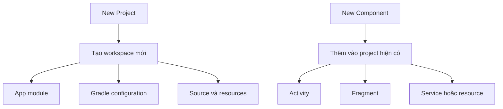
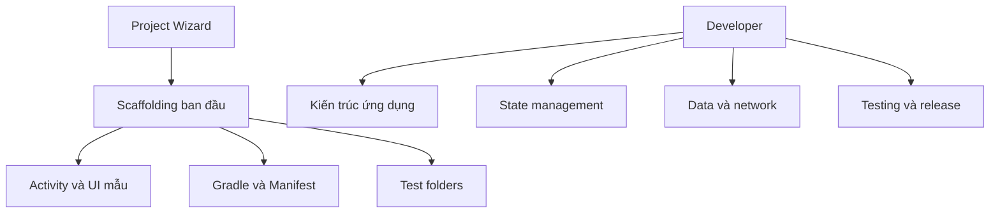
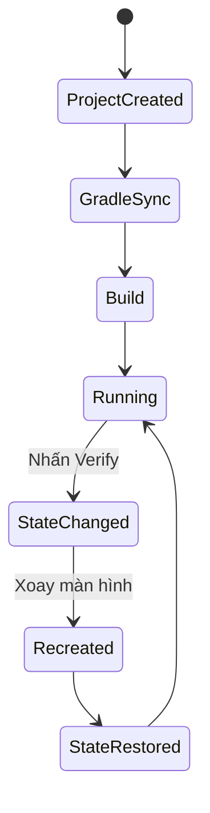

# 006 — Project Wizard

**Học phần:** 01 — Language and Android Fundamentals
**Module:** Module 02 — Android Fundamentals
**Nhóm nội dung:** Development IDE
**Nguồn roadmap:** Android Fundamentals / Development IDE
**Loại bài:** Project
**Thứ tự trong module:** 006
**Thời lượng gợi ý:** 45 phút

---

## 1. Tóm tắt

**Project Wizard** là trình hướng dẫn tạo dự án mới trong Android Studio. Công cụ này giúp lập trình viên lựa chọn loại thiết bị, template giao diện, tên ứng dụng, package name, thư mục lưu, ngôn ngữ và mức Android thấp nhất mà ứng dụng hỗ trợ.

Sau khi hoàn tất, Android Studio tạo sẵn:

* Cấu trúc dự án.
* App module.
* Mã nguồn ban đầu.
* Tài nguyên giao diện.
* Android Manifest.
* Cấu hình Gradle.
* Run configuration cơ bản.
* Các thư mục dành cho unit test và instrumented test.

Android Studio hỗ trợ tạo dự án cho nhiều loại thiết bị như điện thoại, máy tính bảng, Wear OS, TV và Automotive. Với dự án Jetpack Compose mới, tài liệu Android hiện khuyến nghị bắt đầu bằng template **Empty Activity**.

> Project Wizard không xây dựng toàn bộ ứng dụng thay bạn. Nó tạo ra **điểm khởi đầu có thể build và chạy được**.

---

## 2. Mục tiêu học tập

Sau bài học, bạn có thể:

* Giải thích Project Wizard bằng ngôn ngữ của mình.
* Tạo một dự án Android mới từ Android Studio.
* Phân biệt project name, package name, namespace và application ID.
* Chọn template phù hợp với mục tiêu dự án.
* Hiểu ảnh hưởng của Minimum SDK đến khả năng tương thích.
* Nhận biết các tệp quan trọng được Project Wizard tạo ra.
* Build và chạy dự án trên emulator hoặc thiết bị thật.
* Tạo README, ảnh chụp và checklist cho portfolio.
* Nhận biết các cấu hình ban đầu có thể tạo release risk.
* Giải thích vì sao template không thay thế kiến trúc ứng dụng.

---

## 3. Project Wizard nằm ở đâu trong quy trình phát triển?

```mermaid
flowchart LR
    A[Ý tưởng ứng dụng] --> B[Xác định nền tảng và yêu cầu]
    B --> C[Project Wizard]
    C --> D[Chọn template]
    D --> E[Cấu hình tên, package và Minimum SDK]
    E --> F[Android Studio tạo project]
    F --> G[Gradle Sync]
    G --> H[Build và chạy lần đầu]
    H --> I[Thiết kế kiến trúc]
    I --> J[Phát triển tính năng]
    J --> K[Test và release]
```



Project Wizard nằm ở bước khởi tạo dự án. Các lựa chọn trong bước này tạo ra nền móng ban đầu cho:

* Cấu trúc mã nguồn.
* Công nghệ UI.
* Khả năng tương thích thiết bị.
* Định danh ứng dụng.
* Cấu hình build.
* Quy trình test và release.

Một cấu hình ban đầu chưa hợp lý vẫn có thể sửa, nhưng một số thay đổi về sau sẽ tốn nhiều công sức hơn. Đặc biệt, application ID không nên thay đổi sau khi ứng dụng đã được phát hành vì Google Play sẽ coi application ID mới là một ứng dụng khác.

---

## 4. Mở Project Wizard

Khi Android Studio chưa mở dự án:

```text
Welcome to Android Studio → New Project
```

Khi đang mở một dự án khác:

```text
File → New → New Project
```

Đây là hai cách chính thức để mở màn hình tạo project mới trong Android Studio.

---

## 5. Chọn loại dự án và template


*Hình 1: Màn hình chọn project template. Nguồn: Android Developers.*

Project Wizard nhóm template theo loại thiết bị:

* Phone and Tablet.
* Wear OS.
* Television.
* Automotive.

Việc chọn template giúp Android Studio tạo sẵn mã nguồn và tài nguyên phù hợp với loại ứng dụng. Đối với một ứng dụng Compose mới, tài liệu Android khuyến nghị **Empty Activity** vì template này chuẩn bị sẵn Compose dependencies và Material Design.

### 5.1. Empty Activity

Phù hợp khi:

* Bắt đầu ứng dụng Jetpack Compose mới.
* Muốn tự xây dựng navigation và kiến trúc.
* Muốn project khởi đầu gọn.
* Đang học Android hiện đại.

Template thường tạo:

* `MainActivity.kt`.
* Theme Compose.
* Cấu hình Material.
* Một composable mẫu.
* Preview mẫu.

### 5.2. No Activity

Phù hợp khi:

* Muốn tự tạo Activity.
* Xây dựng library hoặc cấu trúc đặc biệt.
* Di chuyển mã từ project cũ.
* Không muốn Android Studio tạo màn hình mẫu.

Template này đòi hỏi người học hiểu rõ hơn về:

* `AndroidManifest.xml`.
* Activity entry point.
* Theme.
* Cấu hình UI.

### 5.3. Empty Views Activity

Phù hợp khi:

* Dự án sử dụng XML Views.
* Đang bảo trì ứng dụng cũ.
* Khóa học yêu cầu View Binding hoặc Fragment XML.
* Chưa sử dụng Jetpack Compose.

### 5.4. Template có navigation hoặc thành phần mẫu

Một số template tạo sẵn:

* Bottom navigation.
* Navigation drawer.
* Danh sách và màn hình chi tiết.
* Maps.
* Media.
* Login flow.

Template giúp tạo prototype nhanh nhưng có thể thêm nhiều file, dependency và code mẫu chưa thật sự cần thiết. Với project học tập nhỏ, nên bắt đầu bằng template tối giản rồi thêm từng thành phần khi hiểu mục đích của chúng.

---

## 6. Phân biệt Project Wizard và Component Wizard

Project Wizard tạo **toàn bộ project mới**.

Component Wizard thêm một thành phần vào project hiện có, chẳng hạn:

* Activity.
* Fragment.
* Service.
* Android Resource File.
* Compose screen.
* Image Asset.
* Module.


*Hình 2: Menu tạo component bằng template. Nguồn: Android Developers.*

Khi thêm component từ template, Android Studio yêu cầu thông tin cấu hình, tạo các file cần thiết và chạy Gradle Sync.



---

## 7. Cấu hình dự án


*Hình 3: Màn hình cấu hình dự án mới. Giao diện thực tế có thể thay đổi theo phiên bản Android Studio. Nguồn: Android Developers.*

Các trường cấu hình quan trọng gồm:

| Trường        | Ví dụ                                 | Ý nghĩa                                 |
| ------------- | ------------------------------------- | --------------------------------------- |
| Name          | `ProjectSetupDemo`                    | Tên project và tên ứng dụng ban đầu     |
| Package name  | `com.khanh.projectsetup`              | Định danh code và app ban đầu           |
| Save location | `D:\AndroidProjects\ProjectSetupDemo` | Nơi lưu project                         |
| Language      | Kotlin                                | Ngôn ngữ mã nguồn mẫu                   |
| Minimum SDK   | API theo yêu cầu                      | Phiên bản Android thấp nhất được hỗ trợ |

Android Studio sử dụng package name ban đầu làm giá trị mặc định cho cả namespace và application ID. Kotlin là ngôn ngữ được khuyến nghị cho project Android mới và là ngôn ngữ cần thiết cho các framework hiện đại như Jetpack Compose.

---

## 8. Project Name

Ví dụ:

```text
ProjectSetupDemo
```

Tên project nên:

* Ngắn gọn.
* Không chứa ký tự đặc biệt khó xử lý.
* Thể hiện đúng mục tiêu.
* Dễ nhận biết trong danh sách project.
* Phù hợp với tên repository.

### Tên chưa tốt

```text
My Application
New Project
Test123
FinalFinalApp
AndroidProjectCopy2
```

### Tên tốt hơn

```text
HabitTracker
ExpenseTracker
ProjectSetupDemo
EnglishVocabulary
WeatherDashboard
```

Tên project có thể khác tên hiển thị với người dùng. Tên hiển thị thường được quản lý qua resource:

```xml
<resources>
    <string name="app_name">Project Setup Demo</string>
</resources>
```

Không nên hardcode tên ứng dụng trực tiếp trong nhiều màn hình.

---

## 9. Package name, namespace và application ID

Ba khái niệm này thường giống nhau khi project vừa được tạo nhưng có mục đích khác nhau.

### 9.1. Package name

Ví dụ:

```text
com.khanh.projectsetup
```

Package giúp tổ chức Kotlin hoặc Java source code:

```kotlin
package com.khanh.projectsetup
```

Cấu trúc thường gặp:

```text
com.khanh.projectsetup
├── MainActivity.kt
├── ui
├── data
├── domain
└── navigation
```

### 9.2. Namespace

Namespace được Gradle sử dụng cho các lớp được tạo như:

* `R`.
* `BuildConfig`.

Ví dụ trong `app/build.gradle.kts`:

```kotlin
android {
    namespace = "com.khanh.projectsetup"
}
```

Android khuyến nghị namespace khớp với base package của mã nguồn. Giữ namespace giống application ID cũng tạo workflow đơn giản hơn trong các project thông thường.

### 9.3. Application ID

Application ID là định danh duy nhất của ứng dụng trên thiết bị và Google Play:

```kotlin
android {
    defaultConfig {
        applicationId = "com.khanh.projectsetup"
    }
}
```

Hai ứng dụng có application ID khác nhau có thể được cài song song:

```text
com.khanh.projectsetup
com.khanh.projectsetup.debug
```

Sau khi ứng dụng đã được phát hành, không nên thay đổi application ID. Nếu thay đổi, Google Play sẽ xem bản upload là một ứng dụng khác.

### 9.4. Quy ước đề xuất

```text
com.<tên hoặc tổ chức>.<tên ứng dụng>
```

Ví dụ:

```text
com.khanh.habittracker
com.khanh.englishlearning
vn.edu.hust.studentmanager
com.example.projectsetup
```

Không nên sử dụng package giả mạo tổ chức không thuộc quyền sở hữu của mình.

---

## 10. Save Location

Ví dụ trên Windows:

```text
D:\Code\Android\ProjectSetupDemo
```

Ví dụ trên macOS:

```text
/Users/khanh/AndroidStudioProjects/ProjectSetupDemo
```

Ví dụ trên Linux:

```text
/home/khanh/AndroidStudioProjects/ProjectSetupDemo
```

Nên tránh:

* Thư mục có tên quá dài.
* Thư mục đồng bộ cloud không ổn định.
* Đường dẫn chứa quá nhiều ký tự đặc biệt.
* Tạo project bên trong một project Gradle khác.
* Lưu trực tiếp vào thư mục build hoặc thư mục tạm.

Tài liệu Android lưu ý rằng trên một số phiên bản macOS, các thư mục như Desktop, Documents và Downloads có thể bị cơ chế quyền riêng tư hạn chế, khiến file project không hiển thị đúng nếu Android Studio chưa được cấp quyền.

---

## 11. Language

### Kotlin

Nên chọn Kotlin khi:

* Tạo project Android mới.
* Sử dụng Jetpack Compose.
* Sử dụng coroutine và Flow.
* Học Android hiện đại.
* Muốn sử dụng phần lớn tài liệu Android mới.

### Java

Có thể chọn Java khi:

* Bảo trì codebase Java.
* Khóa học hoặc công ty yêu cầu Java.
* Di chuyển ứng dụng cũ.
* Tích hợp module Java hiện có.

Kotlin và Java có thể cùng tồn tại trong một Android project. Tuy nhiên, đối với project Compose mới, nên chọn Kotlin ngay từ Project Wizard.

---

## 12. Minimum SDK

**Minimum SDK**, hay `minSdk`, là mức API Android thấp nhất mà ứng dụng cho phép cài đặt.

Ví dụ:

```kotlin
android {
    defaultConfig {
        minSdk = 24
    }
}
```

### Chọn minSdk thấp

Ưu điểm:

* Hỗ trợ nhiều thiết bị cũ hơn.
* Phạm vi người dùng tiềm năng rộng hơn.

Hạn chế:

* Phải xử lý nhiều khác biệt giữa các phiên bản Android.
* Có thể cần compatibility API.
* Tăng số trường hợp cần kiểm thử.

### Chọn minSdk cao

Ưu điểm:

* Có thể sử dụng nhiều API hiện đại hơn.
* Giảm số phiên bản hệ điều hành cần kiểm thử.
* Ít nhánh compatibility code hơn.

Hạn chế:

* Một số thiết bị cũ không thể cài ứng dụng.

Project Wizard có mục **Help me choose** để hiển thị ảnh hưởng của từng API level đến phạm vi thiết bị được hỗ trợ.

> Không có một minSdk đúng cho tất cả dự án. Hãy chọn dựa trên thiết bị mục tiêu, yêu cầu tính năng, dữ liệu người dùng và chi phí kiểm thử.

Đối với bài thực hành này, có thể chọn một API level phù hợp với emulator đang cài. Giá trị này chỉ phục vụ project học tập, không phải khuyến nghị chung cho mọi ứng dụng production.

---

## 13. Project Wizard tạo ra những gì?

Sau khi nhấn **Finish**, Android Studio tạo cấu trúc, code mẫu và resources để bắt đầu phát triển. Project mới cũng có run configuration mặc định để build và chạy trên thiết bị.

Cấu trúc đơn giản:

```text
ProjectSetupDemo/
├── app/
│   ├── src/
│   │   ├── androidTest/
│   │   ├── main/
│   │   │   ├── java/ hoặc kotlin/
│   │   │   ├── res/
│   │   │   └── AndroidManifest.xml
│   │   └── test/
│   ├── build.gradle.kts
│   └── proguard-rules.pro
├── gradle/
├── build.gradle.kts
├── settings.gradle.kts
├── gradle.properties
├── gradlew
├── gradlew.bat
└── README.md
```

Android Studio project chứa source code, resources, test code và build configuration. App module mặc định thường có tên là `app`.

---

## 14. Android View và Project View


*Hình 4: Android View tổ chức file theo module và loại nội dung. Nguồn: Android Developers.*

Android View thường hiển thị:

```text
app
├── manifests
├── kotlin + java
├── res
└── Gradle Scripts
```

Android View không phản ánh hoàn toàn cấu trúc vật lý trên ổ đĩa. Nó nhóm các file theo module và loại tài nguyên để điều hướng thuận tiện hơn.


*Hình 5: Project View hiển thị cấu trúc file gần với cấu trúc thật trên ổ đĩa. Nguồn: Android Developers.*

Chuyển sang Project View khi cần xem:

* `src/main`.
* `src/test`.
* `src/androidTest`.
* File Gradle.
* Thư mục build.
* Cấu trúc module thực tế.

```text
Project Window → Menu dạng xem → Project
```

---

## 15. Ý nghĩa các tệp quan trọng

### 15.1. `settings.gradle.kts`

Xác định:

* Tên project.
* Module tham gia build.
* Plugin repositories.
* Dependency repositories.

Ví dụ:

```kotlin
pluginManagement {
    repositories {
        google()
        mavenCentral()
        gradlePluginPortal()
    }
}

dependencyResolutionManagement {
    repositoriesMode.set(
        RepositoriesMode.FAIL_ON_PROJECT_REPOS
    )

    repositories {
        google()
        mavenCentral()
    }
}

rootProject.name = "ProjectSetupDemo"
include(":app")
```

### 15.2. `build.gradle.kts` cấp project

Khai báo plugin dùng chung cho các module:

```kotlin
plugins {
    alias(libs.plugins.android.application) apply false
    alias(libs.plugins.kotlin.android) apply false
    alias(libs.plugins.kotlin.compose) apply false
}
```

### 15.3. `app/build.gradle.kts`

Quản lý cấu hình app module:

```kotlin
plugins {
    alias(libs.plugins.android.application)
    alias(libs.plugins.kotlin.android)
    alias(libs.plugins.kotlin.compose)
}

android {
    namespace = "com.khanh.projectsetup"

    compileSdk = 36

    defaultConfig {
        applicationId = "com.khanh.projectsetup"
        minSdk = 24
        targetSdk = 36
        versionCode = 1
        versionName = "1.0"
    }
}
```

Các phiên bản SDK trong ví dụ chỉ mang tính minh họa. Khi tạo project thực tế, nên sử dụng cấu hình do Android Studio tạo và điều chỉnh theo yêu cầu hiện hành của dự án.

### 15.4. `AndroidManifest.xml`

Khai báo ứng dụng và Android components:

```xml
<manifest xmlns:android="http://schemas.android.com/apk/res/android">

    <application
        android:allowBackup="true"
        android:label="@string/app_name"
        android:theme="@style/Theme.ProjectSetupDemo">

        <activity
            android:name=".MainActivity"
            android:exported="true">

            <intent-filter>
                <action android:name="android.intent.action.MAIN" />

                <category
                    android:name="android.intent.category.LAUNCHER" />
            </intent-filter>

        </activity>
    </application>

</manifest>
```

### 15.5. `src/test`

Chứa local unit test chạy trên JVM:

```text
app/src/test/
```

### 15.6. `src/androidTest`

Chứa instrumented test chạy trên emulator hoặc thiết bị Android:

```text
app/src/androidTest/
```

Android Studio tổ chức local test và instrumented test trong các source set riêng.

---

## 16. Project Wizard không quyết định toàn bộ kiến trúc

Template tạo ra code ban đầu, nhưng không tự quyết định:

* Cách chia feature.
* Repository pattern.
* Data source.
* Dependency injection.
* Navigation dài hạn.
* Error handling.
* Offline strategy.
* State management.
* Logging production.
* Testing strategy.



Kiến trúc Android tốt cần giúp ứng dụng có khả năng mở rộng, bảo trì và thích nghi với nhiều loại thiết bị. Các ứng dụng hiện đại thường sử dụng một Activity làm container cho các màn hình hoặc Compose destinations.

---

# PHẦN PROJECT

## 17. Project thực hành: Project Setup Showcase

### Mục tiêu

Tạo một ứng dụng Android nhỏ chứng minh rằng bạn có thể:

* Sử dụng Project Wizard.
* Hiểu cấu trúc project.
* Chạy ứng dụng trên thiết bị.
* Thay đổi UI mẫu.
* Viết một test đơn giản.
* Tạo tài liệu portfolio.

### Cấu hình đề xuất

```text
Name: ProjectSetupShowcase
Package: com.khanh.projectsetup
Template: Empty Activity
Language: Kotlin
UI: Jetpack Compose
Minimum SDK: Chọn theo emulator đang sử dụng
```

### Tính năng

Ứng dụng hiển thị:

* Tên project.
* Package name.
* UI toolkit.
* Minimum SDK đã chọn.
* Trạng thái project.
* Nút tăng số lần kiểm tra.
* Nút khôi phục trạng thái ban đầu.

---

## 18. Giao diện mẫu

```text
┌──────────────────────────────────┐
│ Project Setup Showcase           │
│                                  │
│ Project: ProjectSetupShowcase    │
│ Package: com.khanh.projectsetup  │
│ UI: Jetpack Compose              │
│ Status: Running successfully     │
│                                  │
│ Verification count: 0            │
│                                  │
│ [ Verify Project ]               │
│ [ Reset ]                        │
└──────────────────────────────────┘
```

---

## 19. Code mẫu Jetpack Compose

Thay nội dung `MainActivity.kt` bằng ví dụ sau:

```kotlin
package com.khanh.projectsetup

import android.os.Bundle
import androidx.activity.ComponentActivity
import androidx.activity.compose.setContent
import androidx.activity.enableEdgeToEdge
import androidx.compose.foundation.layout.Arrangement
import androidx.compose.foundation.layout.Column
import androidx.compose.foundation.layout.fillMaxSize
import androidx.compose.foundation.layout.padding
import androidx.compose.material3.Button
import androidx.compose.material3.MaterialTheme
import androidx.compose.material3.OutlinedButton
import androidx.compose.material3.Scaffold
import androidx.compose.material3.Text
import androidx.compose.runtime.Composable
import androidx.compose.runtime.getValue
import androidx.compose.runtime.mutableIntStateOf
import androidx.compose.runtime.saveable.rememberSaveable
import androidx.compose.runtime.setValue
import androidx.compose.ui.Modifier
import androidx.compose.ui.unit.dp
import com.khanh.projectsetup.ui.theme.ProjectSetupShowcaseTheme

class MainActivity : ComponentActivity() {

    override fun onCreate(savedInstanceState: Bundle?) {
        super.onCreate(savedInstanceState)

        enableEdgeToEdge()

        setContent {
            ProjectSetupShowcaseTheme {
                ProjectSetupApp()
            }
        }
    }
}

@Composable
fun ProjectSetupApp() {
    var verificationCount by rememberSaveable {
        mutableIntStateOf(0)
    }

    Scaffold(
        modifier = Modifier.fillMaxSize()
    ) { innerPadding ->
        Column(
            modifier = Modifier
                .fillMaxSize()
                .padding(innerPadding)
                .padding(24.dp),
            verticalArrangement = Arrangement.spacedBy(16.dp)
        ) {
            Text(
                text = "Project Setup Showcase",
                style = MaterialTheme.typography.headlineSmall
            )

            ProjectInformation(
                projectName = "ProjectSetupShowcase",
                packageName = "com.khanh.projectsetup",
                uiToolkit = "Jetpack Compose",
                status = "Running successfully"
            )

            Text(
                text = "Verification count: $verificationCount",
                style = MaterialTheme.typography.titleMedium
            )

            Button(
                onClick = {
                    verificationCount++
                }
            ) {
                Text("Verify Project")
            }

            OutlinedButton(
                onClick = {
                    verificationCount = 0
                }
            ) {
                Text("Reset")
            }
        }
    }
}

@Composable
private fun ProjectInformation(
    projectName: String,
    packageName: String,
    uiToolkit: String,
    status: String
) {
    Column(
        verticalArrangement = Arrangement.spacedBy(8.dp)
    ) {
        Text("Project: $projectName")
        Text("Package: $packageName")
        Text("UI: $uiToolkit")
        Text("Status: $status")
    }
}
```

---

## 20. Lifecycle và state

Project Wizard không tự đảm bảo state của ứng dụng được giữ đúng.

Trong code mẫu, bộ đếm sử dụng:

```kotlin
rememberSaveable {
    mutableIntStateOf(0)
}
```

Thao tác kiểm tra:

1. Mở ứng dụng.
2. Nhấn **Verify Project** ba lần.
3. Xoay thiết bị.
4. Kiểm tra giá trị vẫn là `3`.
5. Đưa ứng dụng xuống nền.
6. Quay lại và kiểm tra trạng thái.



Với ứng dụng thực tế, state quan trọng thường nên được quản lý bằng:

* ViewModel.
* `SavedStateHandle`.
* Repository.
* Local database.
* Unidirectional data flow.

---

## 21. Unit test nhỏ

Tạo file:

```text
app/src/test/java/com/khanh/projectsetup/ProjectConfigTest.kt
```

Nội dung:

```kotlin
package com.khanh.projectsetup

import org.junit.Assert.assertTrue
import org.junit.Test

class ProjectConfigTest {

    @Test
    fun packageName_usesExpectedBasePackage() {
        val packageName = "com.khanh.projectsetup"

        assertTrue(
            packageName.startsWith("com.khanh")
        )
    }

    @Test
    fun projectName_isNotBlank() {
        val projectName = "ProjectSetupShowcase"

        assertTrue(projectName.isNotBlank())
    }
}
```

Đây chưa phải test nghiệp vụ mạnh, nhưng giúp xác nhận:

* Thư mục unit test hoạt động.
* Gradle test task chạy thành công.
* Project có thể được kiểm tra tự động.

---

## 22. Build và chạy lần đầu

### Trên Android Studio

1. Chờ Gradle Sync hoàn tất.
2. Chọn run configuration `app`.
3. Chọn emulator hoặc thiết bị thật.
4. Nhấn **Run**.
5. Kiểm tra ứng dụng mở không crash.


*Hình 6: Chọn thiết bị và chạy ứng dụng. Nguồn: Android Developers.*

Android Studio yêu cầu chọn app run configuration, target device rồi nhấn Run. Khi chưa có thiết bị, cần tạo Android Virtual Device hoặc kết nối thiết bị thật.

### Bằng command line

Windows:

```powershell
.\gradlew.bat test
.\gradlew.bat assembleDebug
```

macOS hoặc Linux:

```bash
./gradlew test
./gradlew assembleDebug
```

Kết quả cần đạt:

```text
BUILD SUCCESSFUL
```

---

## 23. Kiểm tra Build Output


*Hình 7: Build tool window trong Android Studio. Nguồn: Android Developers.*

Mở:

```text
View → Tool Windows → Build
```

Build tool window hiển thị:

* Gradle Sync.
* Build Output.
* Build Analyzer.
* Task thành công hoặc thất bại.
* Warning.
* Compile error.
* Dependency download.

Android Studio cho phép xem cây Gradle task và chi tiết lỗi build trong Build Output.

---

## 24. Quy trình thực hành 45 phút

|  Thời gian | Hoạt động                                   |
| ---------: | ------------------------------------------- |
|   0–5 phút | Đọc mục tiêu và mở Project Wizard           |
|  5–10 phút | Chọn Empty Activity và cấu hình project     |
| 10–15 phút | Chờ Gradle Sync, khám phá cấu trúc file     |
| 15–25 phút | Thay UI bằng Project Setup Showcase         |
| 25–30 phút | Chạy trên emulator hoặc thiết bị thật       |
| 30–34 phút | Xoay màn hình và kiểm tra state             |
| 34–38 phút | Thêm và chạy unit test                      |
| 38–42 phút | Chụp ảnh Project Wizard, UI và Build Output |
| 42–45 phút | Viết README và cập nhật progress tracker    |

---

## 25. README cho portfolio

Tạo file:

```text
README.md
```

Nội dung đề xuất:

````markdown
# Project Setup Showcase

Ứng dụng Android nhỏ được tạo bằng Android Studio Project Wizard
để minh họa quy trình khởi tạo, build, test và chạy một project mới.

## Mục tiêu

- Tạo project bằng Empty Activity.
- Sử dụng Kotlin và Jetpack Compose.
- Hiểu cấu trúc app module.
- Kiểm tra lifecycle và state khi xoay màn hình.
- Chạy local unit test.
- Build debug APK thành công.

## Cấu hình

| Thuộc tính | Giá trị |
|---|---|
| Project name | ProjectSetupShowcase |
| Package | com.khanh.projectsetup |
| Template | Empty Activity |
| Language | Kotlin |
| UI toolkit | Jetpack Compose |
| Minimum SDK | Ghi API đã chọn |

## Tính năng

- Hiển thị thông tin cấu hình project.
- Tăng số lần xác minh.
- Reset state.
- Giữ state khi Activity được tái tạo.
- Có local unit test.

## Cách chạy

1. Clone repository.
2. Mở thư mục project bằng Android Studio.
3. Chờ Gradle Sync hoàn tất.
4. Chọn emulator hoặc thiết bị thật.
5. Nhấn Run.

## Chạy test

### Windows

```powershell
.\gradlew.bat test
````

### macOS/Linux

```bash
./gradlew test
```

## Build debug APK

### Windows

```powershell
.\gradlew.bat assembleDebug
```

### macOS/Linux

```bash
./gradlew assembleDebug
```

## Screenshots

* Project Wizard.
* Project structure.
* Màn hình ứng dụng.
* Build successful.
* Unit test successful.

## Kiểm tra lifecycle và state

1. Nhấn Verify Project ba lần.
2. Xoay thiết bị.
3. Xác nhận bộ đếm vẫn giữ giá trị.
4. Đưa app xuống nền và mở lại.

## Hạn chế hiện tại

* Chưa có navigation.
* Chưa có ViewModel.
* Chưa có database hoặc network.
* Chưa có instrumented UI test.
* Chưa có release signing configuration.

## Bài học rút ra

Project Wizard tạo scaffolding ban đầu nhưng kiến trúc, state,
testing và release strategy vẫn phải được lập trình viên thiết kế.

````

---

## 26. Ảnh cần chụp cho artifact

Lưu ảnh trong:

```text
docs/screenshots/
````

Cấu trúc đề xuất:

```text
docs/
├── screenshots/
│   ├── 01-template-selection.png
│   ├── 02-project-configuration.png
│   ├── 03-project-structure.png
│   ├── 04-app-running.png
│   ├── 05-state-after-rotation.png
│   ├── 06-test-success.png
│   └── 07-build-success.png
└── project-wizard-report.md
```

Mỗi ảnh nên có chú thích:

```markdown


*Cấu hình project với Kotlin, Empty Activity và package
`com.khanh.projectsetup`.*
```

Không nên chụp ảnh chứa:

* Username máy tính không cần thiết.
* Đường dẫn riêng tư.
* API key.
* Token.
* Email cá nhân.
* File cấu hình bí mật.

---

## 27. Project Wizard Report

Tạo file:

```text
docs/project-wizard-report.md
```

Mẫu nội dung:

```markdown
# Project Wizard Report

## Mục tiêu

Tạo một Android project mới có thể build, test và chạy thành công.

## Quyết định cấu hình

### Template

Chọn Empty Activity vì project sử dụng Jetpack Compose và
không cần code navigation mẫu.

### Package

`com.khanh.projectsetup`

Tên package thể hiện chủ sở hữu và tên ứng dụng.

### Minimum SDK

Ghi mức API đã chọn và lý do lựa chọn.

## Các file được tạo

- MainActivity.kt
- AndroidManifest.xml
- app/build.gradle.kts
- settings.gradle.kts
- res/
- src/test/
- src/androidTest/

## Kiểm tra

- Gradle Sync thành công.
- Unit test thành công.
- Debug build thành công.
- App chạy trên emulator.
- State được giữ sau khi xoay màn hình.

## Lỗi gặp phải

Ghi lỗi thực tế, nguyên nhân và cách sửa.

## Hạn chế

- Chưa có kiến trúc nhiều layer.
- Chưa kết nối network.
- Chưa có persistent storage.
- Chưa có CI.

## Kết luận

Project Wizard giúp tạo scaffolding nhanh nhưng không thay thế
việc thiết kế kiến trúc và chiến lược kiểm thử.
```

---

## 28. Liên kết artifact trong course progress tracker

Ví dụ:

```markdown
| Bài | Chủ đề | Trạng thái | Artifact |
|---:|---|---|---|
| 006 | Project Wizard | ✅ Hoàn thành | [Project Setup Showcase](../projects/project-setup-showcase/README.md) |
```

Hoặc liên kết repository:

```markdown
[Project Setup Showcase — GitHub Repository](https://github.com/<username>/project-setup-showcase)
```

---

## 29. Sai lầm phổ biến

### Sai lầm 1: Giữ nguyên package mặc định

```text
com.example.myapplication
```

Package này không thể hiện rõ project và dễ bị quên trước khi release.

Tốt hơn:

```text
com.khanh.expensetracker
```

### Sai lầm 2: Chọn template quá phức tạp

Một project chỉ cần một màn hình nhưng chọn template chứa navigation, drawer và nhiều dependency.

Hậu quả:

* Khó hiểu code được sinh ra.
* Tăng số file không cần thiết.
* Khó phân biệt code của mình và code template.

### Sai lầm 3: Chọn minSdk theo cảm tính

Chọn mức API quá thấp hoặc quá cao mà không xem:

* Thiết bị mục tiêu.
* API cần sử dụng.
* Chi phí testing.
* Yêu cầu của khách hàng.

### Sai lầm 4: Đổi application ID sau khi phát hành

Thay đổi application ID sau release khiến store xem đó là ứng dụng khác.

### Sai lầm 5: Cho rằng template là kiến trúc production

Template chỉ tạo project chạy được, không tự cung cấp đầy đủ:

* Error handling.
* State holder.
* Repository.
* Security.
* Offline mode.
* Automated test.

### Sai lầm 6: Không kiểm tra Gradle Sync

Bắt đầu viết nhiều code khi project ban đầu chưa sync thành công khiến việc xác định lỗi khó hơn.

Quy trình tốt hơn:

```text
Create → Sync → Build → Run → Commit → Develop
```

### Sai lầm 7: Commit file máy cá nhân

Không nên commit:

```text
local.properties
.idea/workspace.xml
build/
app/build/
*.jks
*.keystore
```

Đặc biệt không đưa signing key hoặc secret vào repository công khai.

### Sai lầm 8: Không tạo Git commit ban đầu

Sau khi project vừa tạo, build và chạy thành công, nên có commit nền:

```bash
git init
git add .
git commit -m "chore: initialize Android project"
```

Commit này giúp phân biệt scaffolding ban đầu với các thay đổi tính năng sau đó.

---

## 30. Ảnh hưởng đến chất lượng ứng dụng

### UX

Project Wizard ảnh hưởng gián tiếp đến UX thông qua:

* Template UI được chọn.
* Device form factor.
* Material setup.
* Khả năng hỗ trợ thiết bị cũ.
* Cấu hình màn hình ban đầu.

Wizard không đảm bảo UI đẹp hoặc dễ sử dụng. Developer vẫn phải thiết kế user flow và responsive layout.

### Độ ổn định

Project vừa tạo nên được kiểm tra:

* Gradle Sync.
* Build.
* App startup.
* Rotation.
* Background và resume.
* Test task.

### Maintainability

Các lựa chọn có lợi cho maintainability:

* Package rõ ràng.
* Template tối giản.
* Kotlin.
* Cấu trúc module dễ hiểu.
* README đầy đủ.
* Không giữ code mẫu không sử dụng.

### Performance

Template quá lớn có thể thêm code và dependency không cần thiết. Tuy nhiên, hiệu năng thực tế phụ thuộc chủ yếu vào code, tài nguyên, kiến trúc và hành vi runtime được thêm sau đó.

### Release risk

Các rủi ro cần chú ý:

* Application ID sai.
* Package không đúng tổ chức.
* Minimum SDK không phù hợp.
* Không cấu hình version.
* Secret bị commit.
* Không kiểm tra release build.
* Chỉ kiểm thử debug variant.
* Nhầm project demo với project production.

---

## 31. Checklist hoàn thành

### Project Wizard

* [ ] Mở được New Project Wizard.
* [ ] Chọn đúng loại thiết bị.
* [ ] Chọn template phù hợp.
* [ ] Đặt tên project rõ ràng.
* [ ] Đặt package name có ý nghĩa.
* [ ] Chọn đúng thư mục lưu.
* [ ] Chọn Kotlin.
* [ ] Chọn Minimum SDK có lý do.

### Project structure

* [ ] Xác định được app module.
* [ ] Tìm được `MainActivity.kt`.
* [ ] Tìm được `AndroidManifest.xml`.
* [ ] Tìm được `app/build.gradle.kts`.
* [ ] Tìm được `settings.gradle.kts`.
* [ ] Phân biệt `src/test` và `src/androidTest`.
* [ ] Chuyển được giữa Android View và Project View.

### Build và run

* [ ] Gradle Sync thành công.
* [ ] Build không có compile error.
* [ ] App chạy trên emulator hoặc thiết bị thật.
* [ ] Không crash khi mở.
* [ ] Kiểm tra xoay màn hình.
* [ ] Kiểm tra background và resume.
* [ ] Unit test chạy thành công.
* [ ] `assembleDebug` thành công.

### Portfolio

* [ ] Có README.
* [ ] Có mục tiêu project.
* [ ] Có bảng cấu hình.
* [ ] Có hướng dẫn chạy.
* [ ] Có hướng dẫn chạy test.
* [ ] Có ảnh Project Wizard.
* [ ] Có ảnh ứng dụng.
* [ ] Có ảnh test hoặc build thành công.
* [ ] Có mục hạn chế hiện tại.
* [ ] Đã liên kết artifact trong progress tracker.

### Security và release

* [ ] Không commit API key.
* [ ] Không commit signing key.
* [ ] Không commit `local.properties`.
* [ ] Application ID đã được kiểm tra.
* [ ] Package name không còn là tên mặc định.
* [ ] Không giữ dependency không sử dụng.
* [ ] Có `.gitignore`.
* [ ] Có commit khởi tạo project.

---

## 32. Ghi chú production

Trước khi phát triển project thành ứng dụng production, cần trả lời:

### User flow

* Màn hình khởi động là gì?
* App xử lý loading ban đầu thế nào?
* Người dùng thấy gì khi dữ liệu rỗng?
* Có cần onboarding hoặc đăng nhập không?
* Navigation có phù hợp với loại thiết bị không?

### Lifecycle và state

* State có mất khi xoay màn hình không?
* Request có bị gọi lại khi Activity được tạo lại không?
* State nào cần lưu bằng ViewModel?
* State nào cần ghi xuống database?
* Có xử lý process recreation không?

### Data và network

* Dữ liệu đến từ đâu?
* Có offline mode không?
* Timeout và retry được xử lý thế nào?
* Có cache không?
* Secret được lưu ở đâu?

### Testing

* Có local unit test không?
* Có instrumented test không?
* Có test app startup không?
* Có test navigation không?
* Có test trên nhiều API level không?
* Có kiểm tra release variant không?

### Release

* Application ID đã chính xác chưa?
* Version code và version name đã đúng chưa?
* Signing configuration đã an toàn chưa?
* ProGuard hoặc R8 đã được kiểm tra chưa?
* Có release checklist không?
* Có tạo release build trước khi phát hành không?

---

## 33. Kết luận

Project Wizard là công cụ khởi tạo nền móng cho một Android project. Sử dụng tốt công cụ này không chỉ là nhấn **Next** và **Finish**, mà cần hiểu:

1. Vì sao chọn template đó.
2. Package name sẽ được sử dụng như thế nào.
3. Namespace khác application ID ở điểm nào.
4. Minimum SDK ảnh hưởng đến thiết bị và kiểm thử ra sao.
5. Android Studio đã tạo những file nào.
6. Project có build, test và chạy thành công không.
7. Template còn thiếu những phần nào để trở thành ứng dụng production.

Một artifact Project Wizard tốt cần chứng minh được toàn bộ quy trình:

```text
Create → Configure → Sync → Explore → Build → Run → Test → Document
```

---

## 34. Nguồn tham khảo

* [Create a project — Android Developers](https://developer.android.com/studio/projects/create-project)
* [Projects overview — Android Developers](https://developer.android.com/studio/projects)
* [Add code from a template — Android Developers](https://developer.android.com/studio/projects/templates)
* [Configure the app module — Android Developers](https://developer.android.com/build/configure-app-module)
* [Build and run your app — Android Developers](https://developer.android.com/studio/run)
* [Guide to app architecture — Android Developers](https://developer.android.com/topic/architecture)
