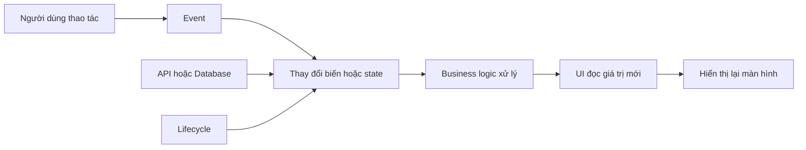
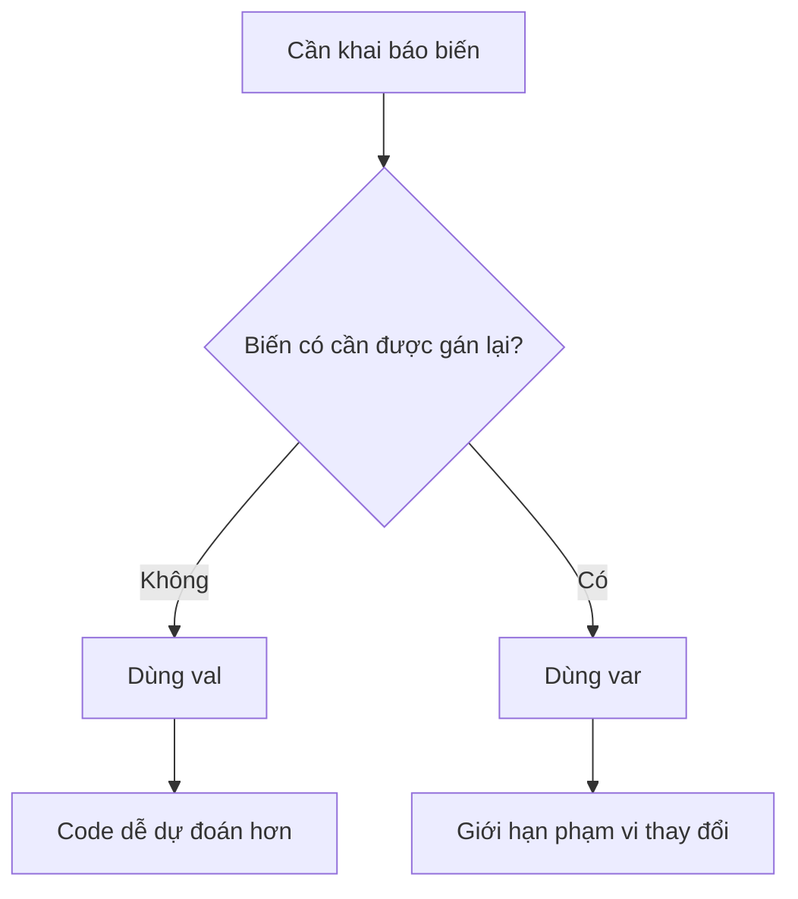

# 007 — Variables and Types

**Học phần:** 01 — Language and Android Fundamentals
**Module:** Module 02 — Android Fundamentals
**Nhóm nội dung:** Kotlin and OOP Basics
**Nguồn roadmap:** Android Fundamentals / Kotlin and OOP Basics
**Loại bài:** Lesson
**Thứ tự trong module:** 007
**Thời lượng gợi ý:** 24 phút

---

## 1. Tóm tắt

**Variables and Types** — biến và kiểu dữ liệu — là nền tảng để ứng dụng Android lưu trữ, kiểm tra và thay đổi dữ liệu.

Một biến có thể đại diện cho:

* Tên người dùng.
* Số lượng sản phẩm.
* Trạng thái tải dữ liệu.
* Nội dung ô nhập liệu.
* Kết quả API.
* Vị trí cuộn.
* Trạng thái đăng nhập.
* Thông báo lỗi.
* Dữ liệu đang hiển thị trên màn hình.

Kotlin là ngôn ngữ có hệ thống kiểu tĩnh. Mỗi biến đều có một kiểu dữ liệu được xác định khi biên dịch, dù lập trình viên có thể không cần viết kiểu đó ra nhờ **type inference** — suy luận kiểu. Kotlin khai báo biến bằng `val` hoặc `var`: `val` không thể được gán lại, còn `var` có thể thay đổi giá trị.

> Biến lưu giữ giá trị. Kiểu dữ liệu quy định giá trị đó có thể là gì và được sử dụng như thế nào.

---

## 2. Mục tiêu học tập

Sau bài học, bạn có thể:

* Giải thích biến và kiểu dữ liệu bằng ngôn ngữ của mình.
* Phân biệt `val` và `var`.
* Hiểu sự khác nhau giữa biến không thể gán lại và object bất biến.
* Sử dụng các kiểu cơ bản như `Int`, `Long`, `Float`, `Double`, `Boolean`, `Char` và `String`.
* Hiểu type inference và khai báo kiểu tường minh.
* Chuyển đổi an toàn giữa các kiểu số.
* Khai báo nullable type bằng dấu `?`.
* Xử lý `null` bằng `?.`, `?:` và kiểm tra `null`.
* Tránh lạm dụng toán tử `!!`.
* Liên hệ biến Kotlin với UI state trong Jetpack Compose.
* Viết một ví dụ Android nhỏ và unit test.
* Nhận biết các lỗi phổ biến có thể ảnh hưởng đến UX, độ ổn định và maintainability.

---

## 3. Biến nằm ở đâu trong ứng dụng Android?



Ví dụ:

```text
Người dùng nhấn nút
        ↓
clickCount tăng từ 0 lên 1
        ↓
UI đọc clickCount mới
        ↓
Màn hình hiển thị "Số lần nhấn: 1"
```

Trong Android, state có thể là bất kỳ giá trị nào thay đổi theo thời gian, từ một biến trong class đến dữ liệu trong Room database. Khi event làm state thay đổi, UI sử dụng state mới để cập nhật nội dung hiển thị.


*Hình 1: Vòng lặp cập nhật giao diện trong Android. Nguồn: Android Developers.*

---

## 4. Khai báo biến trong Kotlin

Cú pháp cơ bản:

```kotlin
val variableName: Type = value
var variableName: Type = value
```

Ví dụ:

```kotlin
val appName: String = "Habit Tracker"
var completedTaskCount: Int = 0
```

Trong đó:

| Thành phần        | Ý nghĩa                                 |
| ----------------- | --------------------------------------- |
| `val` hoặc `var`  | Quy định biến có được gán lại hay không |
| `appName`         | Tên biến                                |
| `String`          | Kiểu dữ liệu                            |
| `"Habit Tracker"` | Giá trị ban đầu                         |

---

## 5. `val` — biến chỉ đọc

`val` được dùng khi tham chiếu chỉ được gán một lần.

```kotlin
val userId = 1024
val appName = "English Learning"
val maximumAttempts = 3
```

Không thể gán lại:

```kotlin
val appName = "English Learning"

// Lỗi biên dịch:
appName = "Vocabulary App"
```

Kotlin định nghĩa `val` là local variable hoặc property chỉ đọc, không thể được gán một giá trị mới sau khi đã khởi tạo.

### Khi nào nên dùng `val`?

Sử dụng `val` khi:

* Giá trị không cần thay đổi.
* Tham chiếu không cần trỏ sang object khác.
* Muốn giảm khả năng vô tình sửa dữ liệu.
* Giá trị là kết quả của một phép tính.
* Dữ liệu được truyền vào hàm và chỉ dùng để đọc.

Ví dụ:

```kotlin
fun calculateTotalPrice(
    quantity: Int,
    unitPrice: Double
): Double {
    val totalPrice = quantity * unitPrice
    return totalPrice
}
```

`totalPrice` không cần thay đổi sau khi được tính, vì vậy `val` phù hợp hơn `var`.

> Quy tắc thực tế: hãy bắt đầu bằng `val`, chỉ đổi thành `var` khi thực sự cần gán lại.

---

## 6. `var` — biến có thể thay đổi

`var` được dùng khi giá trị cần được gán lại.

```kotlin
var currentPage = 1

currentPage = 2
currentPage += 1
```

Ví dụ trong một bộ đếm:

```kotlin
var clickCount = 0

clickCount++
clickCount += 1
clickCount = clickCount + 1
```

Ba câu lệnh trên đều có thể làm tăng giá trị của biến.

Kotlin cho phép `var` được gán lại sau khi khởi tạo, miễn là giá trị mới tương thích với kiểu dữ liệu của biến.

### Không thể thay đổi kiểu của `var`

```kotlin
var score = 10

score = 20       // Hợp lệ
score = "High"   // Không hợp lệ
```

Khi `score` được khai báo với giá trị `10`, Kotlin suy luận kiểu của nó là `Int`. Sau đó, biến chỉ có thể nhận những giá trị tương thích với `Int`.

---

## 7. So sánh `val` và `var`

| Đặc điểm                 | `val`           | `var`            |
| ------------------------ | --------------- | ---------------- |
| Gán giá trị ban đầu      | Có              | Có               |
| Gán lại giá trị          | Không           | Có               |
| Thường dùng cho          | Dữ liệu ổn định | Dữ liệu thay đổi |
| Giảm accidental mutation | Tốt hơn         | Thấp hơn         |
| Ví dụ                    | Tên ứng dụng    | Số lần nhấn      |

```kotlin
val screenTitle = "Trang cá nhân"
var selectedTab = 0
```

Sơ đồ lựa chọn:



---

## 8. `val` không có nghĩa object hoàn toàn bất biến

Đây là điểm lập trình viên mới thường nhầm.

```kotlin
val tasks = mutableListOf("Học Kotlin")

tasks.add("Học Compose") // Hợp lệ
```

Không thể đổi tham chiếu:

```kotlin
val tasks = mutableListOf("Học Kotlin")

// Lỗi:
tasks = mutableListOf("Học Android")
```

Nhưng vẫn có thể thay đổi nội dung của object nếu object đó là mutable:

```kotlin
tasks.add("Học Android")
tasks.remove("Học Kotlin")
```

`val` bảo vệ **tham chiếu** khỏi việc bị gán lại; nó không tự động làm object được tham chiếu trở thành bất biến. Kotlin cho phép một `MutableList` được lưu trong `val`: có thể thêm hoặc xóa phần tử nhưng không thể gán biến đó sang một list khác.

### Read-only collection

```kotlin
val categories: List<String> = listOf(
    "Kotlin",
    "Compose",
    "Testing"
)
```

Không có thao tác `add()` hoặc `remove()` thông qua kiểu `List`.

### Mutable collection

```kotlin
val categories: MutableList<String> = mutableListOf(
    "Kotlin",
    "Compose"
)

categories.add("Testing")
```

Ưu tiên dùng `List` khi nơi sử dụng chỉ cần đọc dữ liệu.

---

## 9. Type inference — suy luận kiểu

Kotlin có thể tự xác định kiểu dữ liệu từ giá trị khởi tạo.

```kotlin
val age = 23
val username = "Khanh"
val height = 1.83
val isLoggedIn = false
```

Kotlin suy luận:

```kotlin
val age: Int = 23
val username: String = "Khanh"
val height: Double = 1.83
val isLoggedIn: Boolean = false
```

Type inference giúp giảm code lặp lại nhưng biến vẫn có kiểu rõ ràng tại thời điểm biên dịch.

### Khi nào nên ghi kiểu tường minh?

#### Khi khai báo nhưng chưa khởi tạo

```kotlin
val userName: String

userName = "An Khánh"
```

Kotlin cần biết kiểu vì chưa có giá trị ban đầu để suy luận.

#### Khi muốn làm rõ mục đích

```kotlin
val userId: Long = 1024L
val completionRate: Float = 0.75f
```

#### Khi kiểu suy luận không phải kiểu mong muốn

```kotlin
val seconds: Long = 30
val opacity: Float = 0.8f
```

#### Khi khai báo API public

```kotlin
fun calculateProgress(
    completed: Int,
    total: Int
): Double {
    return completed.toDouble() / total
}
```

Kiểu tường minh giúp người đọc hiểu hợp đồng của hàm.

---

## 10. Các kiểu dữ liệu cơ bản

Kotlin cung cấp các nhóm kiểu cơ bản gồm số, Boolean, ký tự, chuỗi và array. Về mặt sử dụng trong Kotlin, các giá trị này hoạt động như object và có thể gọi function hoặc property trực tiếp.

### 10.1. Kiểu số nguyên

| Kiểu    | Kích thước | Ví dụ sử dụng                     |
| ------- | ---------: | --------------------------------- |
| `Byte`  |      8 bit | Dữ liệu nhị phân hoặc API yêu cầu |
| `Short` |     16 bit | Ít dùng trực tiếp                 |
| `Int`   |     32 bit | Counter, index, số lượng          |
| `Long`  |     64 bit | Timestamp, ID lớn, thời lượng dài |

```kotlin
val taskCount: Int = 12
val userId: Long = 9_223_372L
```

Trong phần lớn trường hợp, Kotlin khuyến nghị sử dụng `Int` cho số nguyên thông thường và `Long` khi giá trị vượt phạm vi của `Int`.

### 10.2. Kiểu số thực

| Kiểu     | Ví dụ  | Ghi chú                        |
| -------- | ------ | ------------------------------ |
| `Float`  | `1.5f` | Phải có hậu tố `f` hoặc `F`    |
| `Double` | `1.5`  | Kiểu mặc định cho số thập phân |

```kotlin
val opacity: Float = 0.75f
val heightMeters: Double = 1.83
```

### 10.3. `Boolean`

Chỉ nhận hai giá trị:

```kotlin
val isLoading: Boolean = true
val hasError: Boolean = false
```

Thường dùng trong điều kiện:

```kotlin
if (isLoading) {
    println("Đang tải dữ liệu")
}
```

Tên biến Boolean nên thể hiện câu hỏi có thể trả lời bằng đúng hoặc sai:

```kotlin
val isLoggedIn = true
val hasInternetConnection = false
val canSubmitForm = true
val shouldShowDialog = false
```

### 10.4. `Char`

`Char` biểu diễn một ký tự và sử dụng dấu nháy đơn:

```kotlin
val firstLetter: Char = 'K'
val separator: Char = ':'
```

Khác với `String`:

```kotlin
val character: Char = 'A'
val text: String = "A"
```

### 10.5. `String`

`String` biểu diễn chuỗi ký tự:

```kotlin
val title: String = "Variables and Types"
val message = "Xin chào Android"
```

#### String template

```kotlin
val username = "Khanh"
val score = 95

val message = "Người dùng $username đạt $score điểm"
```

Biểu thức phức tạp dùng `${}`:

```kotlin
val completed = 4
val total = 5

val message = "Tiến độ: ${completed * 100 / total}%"
```

---

## 11. Ví dụ các kiểu trong ứng dụng Android

```kotlin
val screenTitle: String = "Hồ sơ"
val userAge: Int = 23
val userId: Long = 100_000_001L
val heightMeters: Double = 1.83
val rating: Float = 4.8f
val isPremium: Boolean = true
val avatarInitial: Char = 'K'
val nickname: String? = null
```

Có thể đóng gói các giá trị liên quan trong `data class`:

```kotlin
data class UserProfile(
    val id: Long,
    val name: String,
    val age: Int,
    val heightMeters: Double,
    val isPremium: Boolean,
    val nickname: String?
)
```

Khởi tạo:

```kotlin
val profile = UserProfile(
    id = 100_000_001L,
    name = "An Khánh",
    age = 23,
    heightMeters = 1.83,
    isPremium = true,
    nickname = null
)
```

Cách này tốt hơn việc tạo nhiều biến rời rạc không thể hiện quan hệ với nhau.

---

## 12. Chuyển đổi kiểu số

Kotlin không tự động chuyển một kiểu số sang kiểu số khác trong phép gán hoặc khi truyền argument vào function. Cần sử dụng các hàm chuyển đổi như `toInt()`, `toLong()`, `toFloat()` và `toDouble()`.

```kotlin
val completedTasks: Int = 3
val totalTasks: Int = 5

val progress: Double =
    completedTasks.toDouble() / totalTasks.toDouble()
```

Kết quả:

```text
0.6
```

### Lỗi chia số nguyên

```kotlin
val completedTasks = 3
val totalTasks = 5

val progress = completedTasks / totalTasks
```

Kết quả là:

```text
0
```

Vì cả hai toán hạng đều là `Int`.

Cách đúng khi cần số thập phân:

```kotlin
val progress =
    completedTasks.toDouble() / totalTasks
```

### Các hàm chuyển đổi phổ biến

```kotlin
val intValue = 10

val longValue = intValue.toLong()
val floatValue = intValue.toFloat()
val doubleValue = intValue.toDouble()
val textValue = intValue.toString()
```

### Chuyển từ chuỗi

```kotlin
val input = "25"

val age = input.toInt()
```

`toInt()` gây exception nếu chuỗi không hợp lệ:

```kotlin
val input = "abc"
val age = input.toInt() // NumberFormatException
```

An toàn hơn:

```kotlin
val age: Int? = input.toIntOrNull()
```

Xử lý fallback:

```kotlin
val age = input.toIntOrNull() ?: 0
```

---

## 13. Nullable và non-nullable types

Kotlin phân biệt rõ:

```kotlin
String
```

và:

```kotlin
String?
```

`String` không được phép chứa `null`:

```kotlin
val username: String = "Khanh"

// Lỗi:
val emptyUsername: String = null
```

`String?` có thể chứa chuỗi hoặc `null`:

```kotlin
var nickname: String? = null

nickname = "K"
nickname = null
```

Nullability là một phần của hệ thống kiểu Kotlin. Khi biến có kiểu nullable, compiler yêu cầu lập trình viên xử lý khả năng giá trị bằng `null` trước khi truy cập thành viên của nó.

---

## 14. Xử lý `null` an toàn

### 14.1. Kiểm tra bằng `if`

```kotlin
val nickname: String? = getNickname()

if (nickname != null) {
    println(nickname.length)
}
```

Sau khi kiểm tra, Kotlin có thể **smart cast** `nickname` từ `String?` thành `String` trong phạm vi an toàn.

### 14.2. Safe-call `?.`

```kotlin
val nicknameLength: Int? = nickname?.length
```

Nếu `nickname` không `null`, `length` được trả về. Nếu `nickname` là `null`, toàn bộ biểu thức trả về `null`.

```kotlin
val avatarUrl: String? = profile.avatarUrl

avatarUrl?.let { url ->
    loadAvatar(url)
}
```

### 14.3. Elvis operator `?:`

Cung cấp giá trị mặc định:

```kotlin
val displayName =
    profile.nickname ?: profile.name
```

Ví dụ:

```kotlin
val age =
    input.toIntOrNull() ?: 0
```

Có thể dùng `return`:

```kotlin
fun submitName(name: String?) {
    val validName = name ?: return

    println("Submitting $validName")
}
```

### 14.4. Not-null assertion `!!`

```kotlin
val nicknameLength = nickname!!.length
```

`!!` buộc Kotlin coi giá trị là non-null. Nếu giá trị thực sự là `null`, ứng dụng sẽ gặp `NullPointerException`.

Không nên:

```kotlin
val avatar = response.user!!.profile!!.avatarUrl!!
```

An toàn hơn:

```kotlin
val avatar =
    response.user
        ?.profile
        ?.avatarUrl
```

Hoặc cung cấp fallback:

```kotlin
val avatar =
    response.user
        ?.profile
        ?.avatarUrl
        ?: DEFAULT_AVATAR
```

> Chỉ sử dụng `!!` khi điều kiện non-null thực sự được bảo đảm và có lý do rõ ràng.

---

## 15. Kiểu `Any`, `Unit` và `Nothing`

### 15.1. `Any`

`Any` là kiểu gốc chung của các kiểu non-nullable trong Kotlin.

```kotlin
val data: Any = "Kotlin"
```

Sau đó có thể kiểm tra kiểu:

```kotlin
if (data is String) {
    println(data.length)
}
```

Kotlin có thể smart cast sau khi kiểm tra bằng `is`.

Không nên lạm dụng `Any`:

```kotlin
val userData: Any = getUser()
```

Tốt hơn:

```kotlin
val userData: UserProfile = getUser()
```

Kiểu cụ thể giúp compiler phát hiện lỗi tốt hơn.

### 15.2. `Unit`

`Unit` biểu diễn hàm không trả về kết quả có ý nghĩa.

```kotlin
fun showMessage(message: String): Unit {
    println(message)
}
```

Thường có thể bỏ `: Unit`:

```kotlin
fun showMessage(message: String) {
    println(message)
}
```

### 15.3. `Nothing`

`Nothing` thường xuất hiện trong hàm không bao giờ hoàn thành bình thường, chẳng hạn luôn ném exception:

```kotlin
fun fail(message: String): Nothing {
    throw IllegalStateException(message)
}
```

---

## 16. Phạm vi của biến

### 16.1. Local variable

Được khai báo trong function hoặc block:

```kotlin
fun greetUser(name: String): String {
    val greeting = "Xin chào $name"
    return greeting
}
```

`greeting` chỉ tồn tại trong `greetUser()`.

### 16.2. Function parameter

```kotlin
fun calculateTotal(
    quantity: Int,
    unitPrice: Double
): Double {
    return quantity * unitPrice
}
```

`quantity` và `unitPrice` chỉ có phạm vi trong function.

### 16.3. Property của class

```kotlin
class Counter {
    var count: Int = 0

    fun increase() {
        count++
    }
}
```

`count` tồn tại cùng instance của `Counter`.

### 16.4. Top-level property

```kotlin
const val MAX_RETRY_COUNT = 3
```

Top-level constant phù hợp với giá trị cố định dùng chung.

Hạn chế top-level mutable property:

```kotlin
var currentUserName = ""
```

Biến mutable toàn cục:

* Có thể bị thay đổi từ nhiều nơi.
* Khó theo dõi nguồn thay đổi.
* Khó test.
* Dễ tạo state không nhất quán.

---

## 17. `const val`

`const val` dùng cho compile-time constant:

```kotlin
const val MAX_LOGIN_ATTEMPTS = 3
const val DEFAULT_PAGE_SIZE = 20
const val API_VERSION = "v1"
```

Có thể khai báo ở top level, trong `object` hoặc `companion object`:

```kotlin
class LoginManager {
    companion object {
        const val MAX_LOGIN_ATTEMPTS = 3
    }
}
```

Kotlin định nghĩa `const` là modifier đánh dấu một property thành hằng số tại thời điểm biên dịch. Quy ước tên constant thường dùng chữ hoa và dấu gạch dưới.

Không thể dùng `const` với giá trị chỉ biết lúc runtime:

```kotlin
// Không hợp lệ:
const val currentTime = System.currentTimeMillis()
```

Dùng `val`:

```kotlin
val currentTime = System.currentTimeMillis()
```

---

## 18. `lateinit var`

`lateinit` cho phép property non-nullable được khởi tạo sau constructor:

```kotlin
class ExampleActivity : ComponentActivity() {

    private lateinit var analytics: Analytics

    override fun onCreate(savedInstanceState: Bundle?) {
        super.onCreate(savedInstanceState)

        analytics = Analytics()
    }
}
```

Nếu truy cập trước khi khởi tạo:

```kotlin
analytics.trackScreen()
```

ứng dụng có thể gặp:

```text
UninitializedPropertyAccessException
```

Tài liệu Kotlin lưu ý rằng property `lateinit` được truy cập trước khi gán giá trị sẽ gây `UninitializedPropertyAccessException`.

Không nên dùng `lateinit` chỉ để tránh nullable:

```kotlin
lateinit var userName: String
```

Hãy xem xét:

* Khởi tạo trong constructor.
* Sử dụng nullable nếu việc chưa có giá trị là trạng thái hợp lệ.
* Sử dụng dependency injection.
* Sử dụng `lazy` nếu phù hợp.

---

## 19. Biến thường không tự động trở thành Compose state

Đoạn code sau không hoạt động đúng:

```kotlin
@Composable
fun CounterScreen() {
    var count = 0

    Button(
        onClick = {
            count++
        }
    ) {
        Text("Count: $count")
    }
}
```

`count` chỉ là local variable thông thường:

* Compose không theo dõi thay đổi của nó.
* Thay đổi không tự động cập nhật UI.
* Biến có thể được khởi tạo lại khi composable chạy lại.

Compose cần observable state, chẳng hạn `MutableState<T>`. Khi giá trị của `MutableState` thay đổi, Compose lên lịch recomposition cho những composable đã đọc giá trị đó.

### Cách đúng

```kotlin
@Composable
fun CounterScreen() {
    var count by remember {
        mutableIntStateOf(0)
    }

    Button(
        onClick = {
            count++
        }
    ) {
        Text("Count: $count")
    }
}
```

Cần import:

```kotlin
import androidx.compose.runtime.getValue
import androidx.compose.runtime.mutableIntStateOf
import androidx.compose.runtime.remember
import androidx.compose.runtime.setValue
```

---

## 20. `remember` và `rememberSaveable`

### `remember`

```kotlin
var count by remember {
    mutableIntStateOf(0)
}
```

Giữ giá trị qua các lần recomposition nhưng không tự động giữ giá trị khi Activity bị tạo lại do thay đổi cấu hình.

### `rememberSaveable`

```kotlin
var count by rememberSaveable {
    mutableIntStateOf(0)
}
```

Ngoài recomposition, `rememberSaveable` có thể giữ các giá trị tương thích qua Activity recreation, chẳng hạn khi xoay thiết bị.

| Trường hợp                |    Biến local |        `remember` |      `rememberSaveable` |
| ------------------------- | ------------: | ----------------: | ----------------------: |
| Giữ sau recomposition     | Không bảo đảm |                Có |                      Có |
| Giữ sau xoay màn hình     |         Không |             Không | Có với dữ liệu saveable |
| Compose theo dõi thay đổi |         Không | Có nếu dùng State |       Có nếu dùng State |

> Không phải mọi dữ liệu đều nên đặt trong `rememberSaveable`. Screen state phức tạp và business state thường phù hợp hơn với ViewModel hoặc data layer.

---

## 21. Ví dụ Android hoàn chỉnh

Project thực hành hiển thị hồ sơ và một bộ đếm xác minh.

```kotlin
package com.example.variablesandtypes

import android.os.Bundle
import androidx.activity.ComponentActivity
import androidx.activity.compose.setContent
import androidx.compose.foundation.layout.Arrangement
import androidx.compose.foundation.layout.Column
import androidx.compose.foundation.layout.fillMaxSize
import androidx.compose.foundation.layout.padding
import androidx.compose.material3.Button
import androidx.compose.material3.MaterialTheme
import androidx.compose.material3.OutlinedButton
import androidx.compose.material3.Text
import androidx.compose.runtime.Composable
import androidx.compose.runtime.getValue
import androidx.compose.runtime.mutableIntStateOf
import androidx.compose.runtime.saveable.rememberSaveable
import androidx.compose.runtime.setValue
import androidx.compose.ui.Modifier
import androidx.compose.ui.unit.dp

private const val MAX_VERIFICATION_COUNT = 5

data class UserProfile(
    val id: Long,
    val name: String,
    val age: Int,
    val heightMeters: Double,
    val isPremium: Boolean,
    val nickname: String?
)

class MainActivity : ComponentActivity() {

    override fun onCreate(savedInstanceState: Bundle?) {
        super.onCreate(savedInstanceState)

        setContent {
            MaterialTheme {
                VariablesAndTypesScreen()
            }
        }
    }
}

@Composable
fun VariablesAndTypesScreen() {
    val profile = UserProfile(
        id = 100_001L,
        name = "An Khánh",
        age = 23,
        heightMeters = 1.83,
        isPremium = true,
        nickname = null
    )

    var verificationCount by rememberSaveable {
        mutableIntStateOf(0)
    }

    val displayName: String =
        profile.nickname ?: profile.name

    val isLimitReached: Boolean =
        verificationCount >= MAX_VERIFICATION_COUNT

    val premiumLabel: String =
        if (profile.isPremium) {
            "Premium"
        } else {
            "Standard"
        }

    Column(
        modifier = Modifier
            .fillMaxSize()
            .padding(24.dp),
        verticalArrangement = Arrangement.spacedBy(12.dp)
    ) {
        Text(
            text = "Variables and Types",
            style = MaterialTheme.typography.headlineSmall
        )

        Text(text = "ID: ${profile.id}")
        Text(text = "Tên: $displayName")
        Text(text = "Tuổi: ${profile.age}")
        Text(text = "Chiều cao: ${profile.heightMeters} m")
        Text(text = "Tài khoản: $premiumLabel")

        Text(
            text = "Số lần xác minh: $verificationCount"
        )

        Button(
            onClick = {
                verificationCount++
            },
            enabled = !isLimitReached
        ) {
            Text("Xác minh")
        }

        OutlinedButton(
            onClick = {
                verificationCount = 0
            }
        ) {
            Text("Đặt lại")
        }

        if (isLimitReached) {
            Text(
                text = "Đã đạt giới hạn xác minh."
            )
        }
    }
}
```

---

## 22. Phân tích kiểu trong ví dụ

```kotlin
private const val MAX_VERIFICATION_COUNT = 5
```

| Thành phần               | Phân tích                |
| ------------------------ | ------------------------ |
| `const val`              | Hằng số không thay đổi   |
| `MAX_VERIFICATION_COUNT` | Tên constant             |
| `5`                      | Kotlin suy luận là `Int` |

```kotlin
val profile = UserProfile(...)
```

| Thành phần      | Phân tích                             |
| --------------- | ------------------------------------- |
| `val`           | Không gán `profile` sang object khác  |
| Kiểu suy luận   | `UserProfile`                         |
| Nội dung object | Các property được khai báo bằng `val` |

```kotlin
var verificationCount by rememberSaveable {
    mutableIntStateOf(0)
}
```

| Thành phần         | Phân tích                                 |
| ------------------ | ----------------------------------------- |
| `var`              | Giá trị bộ đếm cần thay đổi               |
| `Int`              | Kiểu của counter                          |
| `MutableIntState`  | State observable của Compose              |
| `rememberSaveable` | Giữ state qua Activity recreation phù hợp |

```kotlin
val displayName =
    profile.nickname ?: profile.name
```

Nếu `nickname` là `null`, ứng dụng sử dụng `name`.

```kotlin
val isLimitReached =
    verificationCount >= MAX_VERIFICATION_COUNT
```

Kết quả của phép so sánh là `Boolean`.

---

## 23. Ví dụ sai: dùng quá nhiều `var`

```kotlin
var appName = "Task App"
var maximumTasks = 10
var userId = 1001L
var isPremium = true
var profile = loadProfile()
```

Nếu các tham chiếu không cần gán lại, nên sử dụng:

```kotlin
val appName = "Task App"
val maximumTasks = 10
val userId = 1001L
val isPremium = true
val profile = loadProfile()
```

Việc hạn chế `var` giúp giảm số vị trí có thể làm thay đổi dữ liệu ngoài ý muốn.

---

## 24. Ví dụ sai: dùng kiểu không phù hợp

### Dùng `String` cho dữ liệu số

```kotlin
val quantity = "12"
```

Sau đó phải chuyển đổi mỗi khi tính toán:

```kotlin
val nextQuantity =
    quantity.toInt() + 1
```

Nếu dữ liệu đại diện cho số lượng trong domain:

```kotlin
val quantity: Int = 12
```

Chỉ chuyển sang `String` tại UI:

```kotlin
Text(text = quantity.toString())
```

### Dùng `Int` cho giá trị có thể rất lớn

```kotlin
val timestamp: Int =
    System.currentTimeMillis().toInt()
```

Có nguy cơ mất dữ liệu khi thu hẹp từ `Long` sang `Int`.

Đúng hơn:

```kotlin
val timestamp: Long =
    System.currentTimeMillis()
```

### Không kiểm tra chuyển đổi input

```kotlin
val age = userInput.toInt()
```

An toàn hơn:

```kotlin
val age = userInput.toIntOrNull()

if (age == null) {
    showValidationError()
}
```

---

## 25. Variables and Types ảnh hưởng đến chất lượng ứng dụng

### 25.1. UX

Kiểu dữ liệu sai có thể dẫn đến:

* Số liệu hiển thị không chính xác.
* Form crash khi nhập ký tự thay vì số.
* Nút không cập nhật khi state thay đổi.
* Trạng thái bị reset sau khi xoay màn hình.
* Loading hoặc error state hiển thị sai.

Ví dụ:

```kotlin
val age = input.toInt()
```

Nếu người dùng nhập `"hai mươi"`, ứng dụng có thể gặp exception.

An toàn hơn:

```kotlin
val age = input.toIntOrNull()

val errorMessage =
    if (age == null) {
        "Tuổi phải là một số hợp lệ"
    } else {
        null
    }
```

### 25.2. Độ ổn định

Nullable type và kiểm tra kiểu giúp phát hiện nhiều lỗi tại thời điểm biên dịch thay vì đợi đến runtime.

Các kỹ thuật quan trọng:

* Tránh `!!`.
* Dùng `toIntOrNull()`.
* Dùng kiểu cụ thể thay vì `Any`.
* Chọn `Long` khi dữ liệu có thể vượt giới hạn `Int`.
* Kiểm tra phép chia cho `0`.
* Không truy cập `lateinit` trước khi khởi tạo.

### 25.3. Maintainability

Code dễ bảo trì hơn khi:

* Ưu tiên `val`.
* Tên biến thể hiện ý nghĩa.
* Boolean có tiền tố `is`, `has`, `can` hoặc `should`.
* Function có kiểu parameter và return rõ ràng.
* Dữ liệu liên quan được nhóm trong `data class`.
* Nullable thể hiện đúng domain.
* Không sử dụng một biến cho nhiều mục đích.

Không tốt:

```kotlin
var data: Any? = null
```

Tốt hơn:

```kotlin
var selectedProfile: UserProfile? = null
```

### 25.4. Performance

Chọn kiểu dữ liệu không nên chỉ dựa trên tối ưu nhỏ. Trước hết cần ưu tiên:

* Đúng nghĩa.
* An toàn.
* Dễ đọc.
* Phù hợp API.
* Không gây chuyển đổi lặp lại không cần thiết.

Trong Compose, dùng state type phù hợp như `mutableIntStateOf()` cho giá trị nguyên có thể tránh một số boxing không cần thiết so với generic state. Tài liệu Compose cung cấp các biến thể như `mutableIntStateOf`, `mutableLongStateOf`, `mutableFloatStateOf` và `mutableDoubleStateOf` cho kiểu nguyên thủy tương ứng.

### 25.5. Release risk

Trước khi release, cần kiểm tra:

* Numeric conversion có làm mất dữ liệu không?
* Input có được parse an toàn không?
* Nullable response từ API đã được xử lý chưa?
* State có được lưu đúng khi Activity bị tạo lại không?
* Giá trị debug có bị hardcode không?
* Constant môi trường có bị nhầm giữa debug và production không?

---

## 26. Sai lầm phổ biến của lập trình viên mới

### Sai lầm 1: Dùng `var` cho tất cả biến

```kotlin
var title = "Home"
```

Trong khi giá trị không thay đổi:

```kotlin
val title = "Home"
```

### Sai lầm 2: Cho rằng `val` làm object bất biến

```kotlin
val items = mutableListOf<String>()

items.add("Android") // Vẫn hợp lệ
```

### Sai lầm 3: Lạm dụng `!!`

```kotlin
val userName =
    response.user!!.name!!
```

Có thể làm app crash khi dữ liệu API thiếu.

### Sai lầm 4: Dùng biến local làm Compose state

```kotlin
var count = 0
```

Thay đổi biến thông thường không đủ để Compose biết cần cập nhật UI.

### Sai lầm 5: Không xử lý input sai định dạng

```kotlin
val quantity = input.toInt()
```

Nên dùng:

```kotlin
val quantity = input.toIntOrNull()
```

### Sai lầm 6: Nhầm `Float` và `Double`

```kotlin
val opacity: Float = 0.5 // Lỗi
```

Đúng:

```kotlin
val opacity: Float = 0.5f
```

### Sai lầm 7: Chuyển kiểu thu hẹp mà không kiểm tra

```kotlin
val largeValue: Long = 5_000_000_000L
val smallerValue: Int = largeValue.toInt()
```

Giá trị có thể không còn chính xác.

### Sai lầm 8: Khai báo kiểu quá chung

```kotlin
val result: Any = loadProfile()
```

Nên dùng:

```kotlin
val result: UserProfile = loadProfile()
```

### Sai lầm 9: Dùng `lateinit` không cần thiết

```kotlin
lateinit var userName: String
```

Nếu chưa có tên là trạng thái hợp lệ:

```kotlin
var userName: String? = null
```

---

## 27. Thực hành trong 24 phút

|  Thời gian | Hoạt động                                    |
| ---------: | -------------------------------------------- |
|   0–4 phút | Đọc khái niệm `val`, `var` và type inference |
|   4–8 phút | Khai báo các kiểu cơ bản                     |
|  8–12 phút | Thực hành nullable và chuyển đổi kiểu        |
| 12–18 phút | Tạo màn hình Variables and Types             |
| 18–21 phút | Xoay thiết bị và kiểm tra state              |
| 21–24 phút | Viết unit test và ghi kết luận               |

---

## 28. Bài thực hành

Tạo màn hình **Profile Summary** với các dữ liệu:

```kotlin
val name: String
val age: Int
val height: Double
val isPremium: Boolean
val nickname: String?
var verificationCount: Int
```

### Yêu cầu

* Hiển thị tên người dùng.
* Nếu nickname không tồn tại, dùng tên thật.
* Hiển thị tuổi và chiều cao.
* Hiển thị loại tài khoản.
* Có nút tăng số lần xác minh.
* Giới hạn tối đa năm lần.
* Có nút đặt lại.
* State không bị mất sau khi xoay màn hình.
* Không sử dụng `!!`.

### Kết quả mẫu

```text
Variables and Types

Tên: An Khánh
Tuổi: 23
Chiều cao: 1.83 m
Tài khoản: Premium

Số lần xác minh: 2

[ Xác minh ]
[ Đặt lại ]
```

---

## 29. Unit test nhỏ

Tạo file:

```text
app/src/test/java/com/example/variablesandtypes/ProfileFormatterTest.kt
```

Code:

```kotlin
package com.example.variablesandtypes

import org.junit.Assert.assertEquals
import org.junit.Assert.assertNull
import org.junit.Test

class ProfileFormatterTest {

    @Test
    fun displayName_usesNicknameWhenAvailable() {
        val name = "An Khánh"
        val nickname: String? = "K"

        val displayName = nickname ?: name

        assertEquals("K", displayName)
    }

    @Test
    fun displayName_usesNameWhenNicknameIsNull() {
        val name = "An Khánh"
        val nickname: String? = null

        val displayName = nickname ?: name

        assertEquals("An Khánh", displayName)
    }

    @Test
    fun invalidNumber_returnsNull() {
        val input = "abc"

        val result: Int? = input.toIntOrNull()

        assertNull(result)
    }

    @Test
    fun progress_usesDecimalDivision() {
        val completed = 3
        val total = 5

        val progress =
            completed.toDouble() / total

        assertEquals(
            0.6,
            progress,
            0.0001
        )
    }
}
```

---

## 30. Bài tập

### Bài 1 — Giải thích trong năm dòng

Viết năm dòng giải thích:

1. Biến là gì?
2. Kiểu dữ liệu là gì?
3. `val` khác `var` thế nào?
4. Nullable type là gì?
5. Vì sao kiểu dữ liệu quan trọng với Android?

### Bài 2 — Xác định kiểu

Xác định kiểu được Kotlin suy luận:

```kotlin
val courseName = "Android Fundamentals"
val lessonNumber = 7
val durationMinutes = 24L
val progress = 0.75
val opacity = 0.8f
val isCompleted = false
val firstLetter = 'A'
```

Đáp án:

| Biến              | Kiểu      |
| ----------------- | --------- |
| `courseName`      | `String`  |
| `lessonNumber`    | `Int`     |
| `durationMinutes` | `Long`    |
| `progress`        | `Double`  |
| `opacity`         | `Float`   |
| `isCompleted`     | `Boolean` |
| `firstLetter`     | `Char`    |

### Bài 3 — Chọn `val` hay `var`

```text
Tên ứng dụng                     → val
Số lần nhấn nút                 → var
ID người dùng                   → val
Nội dung TextField              → var
Giới hạn retry                  → const val
Kết quả tính tổng               → val
Tab đang được chọn              → var
```

### Bài 4 — Sửa lỗi nullable

Sửa đoạn code:

```kotlin
val avatarUrl: String? = response.avatarUrl

loadImage(avatarUrl!!)
```

Gợi ý:

```kotlin
avatarUrl?.let { url ->
    loadImage(url)
}
```

Hoặc:

```kotlin
val safeAvatarUrl =
    avatarUrl ?: DEFAULT_AVATAR_URL

loadImage(safeAvatarUrl)
```

### Bài 5 — Sửa lỗi Compose state

Đoạn code sau có vấn đề gì?

```kotlin
@Composable
fun ScoreScreen() {
    var score = 0

    Button(
        onClick = {
            score++
        }
    ) {
        Text("Score: $score")
    }
}
```

Sửa thành:

```kotlin
@Composable
fun ScoreScreen() {
    var score by rememberSaveable {
        mutableIntStateOf(0)
    }

    Button(
        onClick = {
            score++
        }
    ) {
        Text("Score: $score")
    }
}
```

---

## 31. Artifact đưa vào portfolio

Tạo file:

```text
docs/variables-and-types-report.md
```

Mẫu nội dung:

```markdown
# Variables and Types Report

## Mục tiêu

Tìm hiểu cách Kotlin khai báo biến, suy luận kiểu,
xử lý null và quản lý UI state trong Jetpack Compose.

## Các kiểu đã sử dụng

| Kiểu | Mục đích |
|---|---|
| String | Tên người dùng |
| Int | Tuổi và bộ đếm |
| Long | User ID |
| Double | Chiều cao |
| Boolean | Trạng thái Premium |
| String? | Nickname có thể không tồn tại |

## Quyết định val và var

- Dùng val cho hồ sơ người dùng vì tham chiếu không cần thay đổi.
- Dùng var cho verificationCount vì giá trị thay đổi khi nhấn nút.
- Dùng const val cho giới hạn xác minh.

## Null safety

Nickname được khai báo là String?.
UI sử dụng Elvis operator để hiển thị tên thật khi nickname bằng null.

## State

Bộ đếm sử dụng rememberSaveable để giữ trạng thái
qua recomposition và Activity recreation.

## Testing

- Kiểm tra nickname fallback.
- Kiểm tra parse số không hợp lệ.
- Kiểm tra phép chia thập phân.

## Hạn chế

- Chưa sử dụng ViewModel.
- Chưa lấy dữ liệu từ API.
- Chưa có instrumented UI test.
```

Ảnh nên chụp:

```text
docs/screenshots/
├── 01-profile-screen.png
├── 02-counter-increased.png
├── 03-state-after-rotation.png
└── 04-unit-test-success.png
```

---

## 32. Checklist hoàn thành

### Kiến thức

* [ ] Giải thích được biến là gì.
* [ ] Giải thích được kiểu dữ liệu là gì.
* [ ] Phân biệt được `val` và `var`.
* [ ] Hiểu rằng `val` không làm object tự động bất biến.
* [ ] Hiểu type inference.
* [ ] Biết khi nào cần ghi kiểu tường minh.
* [ ] Nhận biết `Int`, `Long`, `Float` và `Double`.
* [ ] Nhận biết `Boolean`, `Char` và `String`.
* [ ] Hiểu `String` khác `String?`.

### Code

* [ ] Ưu tiên sử dụng `val`.
* [ ] Sử dụng `var` khi cần gán lại.
* [ ] Chuyển kiểu số bằng hàm tường minh.
* [ ] Dùng `toIntOrNull()` với input không tin cậy.
* [ ] Dùng safe-call `?.`.
* [ ] Dùng Elvis operator `?:`.
* [ ] Không lạm dụng `!!`.
* [ ] Không khai báo kiểu `Any` nếu có kiểu cụ thể hơn.
* [ ] Dùng tên Boolean dễ hiểu.

### Android và Compose

* [ ] Phân biệt biến thường và Compose state.
* [ ] Dùng `mutableStateOf` hoặc state type phù hợp.
* [ ] Hiểu tác dụng của `remember`.
* [ ] Hiểu tác dụng của `rememberSaveable`.
* [ ] Kiểm tra state khi xoay màn hình.
* [ ] Không lưu business state phức tạp chỉ trong composable.
* [ ] Không dùng biến global mutable làm nguồn state tùy tiện.

### Testing và portfolio

* [ ] Có ví dụ Android nhỏ.
* [ ] Có unit test cho chuyển đổi dữ liệu.
* [ ] Có test nullable fallback.
* [ ] Có ảnh chụp giao diện.
* [ ] Có ảnh test thành công.
* [ ] Có Markdown report.
* [ ] Đã liên kết artifact vào progress tracker.

---

## 33. Ghi chú production

### User flow

* Input của người dùng có thể rỗng không?
* Người dùng có thể nhập ký tự vào trường số không?
* UI hiển thị gì khi giá trị bằng `null`?
* Giá trị mặc định có gây hiểu nhầm không?

### State và lifecycle

* Biến có cần giữ qua recomposition không?
* Có cần giữ qua Activity recreation không?
* Có cần tồn tại sau process death không?
* State nên thuộc composable, ViewModel hay database?
* Có đang tạo nhiều nguồn sự thật cho cùng một giá trị không?

### Network và storage

* Trường API nào có thể thiếu?
* JSON number có vượt phạm vi `Int` không?
* ID nên là `String`, `Int` hay `Long`?
* Dữ liệu nullable có được ánh xạ đúng không?
* Database có cho phép `null` giống model không?

### Reliability

* Có dùng `!!` với dữ liệu API không?
* Numeric conversion có mất dữ liệu không?
* Có phép chia cho `0` không?
* `lateinit` có thể được truy cập trước khi khởi tạo không?
* Có input nào gọi `toInt()` trực tiếp không?

### Testing

* Có test giá trị nhỏ nhất và lớn nhất không?
* Có test `null` không?
* Có test input rỗng không?
* Có test input sai định dạng không?
* Có test state sau khi xoay màn hình không?
* Có test fallback hiển thị không?

### Release

* Giá trị debug có bị hardcode không?
* Base URL và feature flag có đúng môi trường không?
* Constant có chứa secret không?
* Có biến mutable toàn cục khó kiểm soát không?
* Release build có hoạt động giống debug build không?

---

## 34. Kết luận

Variables and Types không chỉ là cú pháp cơ bản. Chúng quyết định cách ứng dụng:

* Biểu diễn dữ liệu.
* Ngăn chặn giá trị không hợp lệ.
* Xử lý `null`.
* Thay đổi UI state.
* Khôi phục trạng thái.
* Giao tiếp với API và database.
* Phát hiện lỗi khi biên dịch.

Quy trình lựa chọn biến:

```text
Xác định ý nghĩa dữ liệu
        ↓
Chọn kiểu chính xác
        ↓
Xác định có thể null không
        ↓
Chọn val hoặc var
        ↓
Xác định phạm vi tồn tại
        ↓
Nếu là UI state, chọn state holder phù hợp
        ↓
Viết test cho giá trị hợp lệ và không hợp lệ
```

Một lập trình viên Android tốt cần có thể giải thích:

1. Vì sao biến này là `val` hoặc `var`.
2. Vì sao chọn `Int`, `Long`, `Double` hoặc một kiểu khác.
3. Vì sao giá trị có hoặc không được phép `null`.
4. State sẽ tồn tại bao lâu.
5. Điều gì xảy ra khi người dùng xoay màn hình.
6. Test nào bảo vệ quá trình chuyển đổi dữ liệu.

---

## 35. Nguồn tham khảo

* Kotlin Basic Syntax — Variables.
* Kotlin Types Overview.
* Kotlin Numbers.
* Kotlin Null Safety.
* Kotlin Collections Overview.
* State and Jetpack Compose.
* State in Jetpack Compose Codelab.

---

# Bài luyện tập

## Mục tiêu


## Đề bài


## Yêu cầu hoàn thành

- [ ] 
- [ ] 
- [ ] 

## Kết quả / lời giải


## Ghi chú
