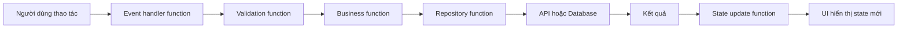
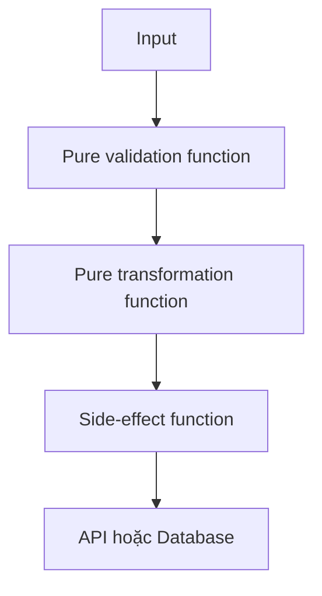
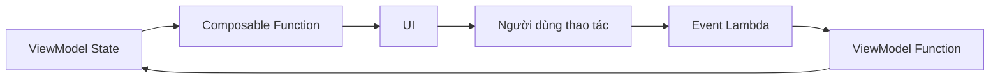

# 008 — Functions

**Học phần:** 01 — Language and Android Fundamentals
**Module:** Module 02 — Android Fundamentals
**Nhóm nội dung:** Kotlin and OOP Basics
**Nguồn roadmap:** Android Fundamentals / Kotlin and OOP Basics
**Loại bài:** Lesson
**Thứ tự trong module:** 008
**Thời lượng gợi ý:** 24 phút

---

## 1. Tóm tắt

**Function — hàm** là một khối mã có tên, được thiết kế để thực hiện một nhiệm vụ cụ thể. Hàm có thể nhận dữ liệu đầu vào qua **tham số**, xử lý dữ liệu và trả về một kết quả.

Trong ứng dụng Android, function được sử dụng để:

* Xử lý sự kiện nhấn nút.
* Kiểm tra dữ liệu biểu mẫu.
* Tính toán giá, điểm số hoặc tiến độ.
* Chuyển đổi dữ liệu API thành UI model.
* Đọc và ghi dữ liệu.
* Gửi network request.
* Cập nhật state.
* Hiển thị một thành phần Jetpack Compose.
* Tách business logic thành các phần dễ kiểm thử.
* Xử lý lifecycle callback.

Kotlin khai báo hàm bằng từ khóa `fun`. Tham số được đặt trong dấu ngoặc tròn và mỗi tham số phải có kiểu dữ liệu rõ ràng. Hàm có thể được khai báo ở top level, bên trong class, bên trong một function khác hoặc dưới dạng extension function.

```kotlin
fun calculateTotal(
    quantity: Int,
    unitPrice: Double
): Double {
    return quantity * unitPrice
}
```

> Một function tốt nên thực hiện một nhiệm vụ rõ ràng, có đầu vào dễ hiểu và tạo ra kết quả có thể dự đoán.

---

## 2. Mục tiêu học tập

Sau bài học, bạn có thể:

* Giải thích function bằng ngôn ngữ của mình.
* Khai báo và gọi function trong Kotlin.
* Sử dụng parameter và return type.
* Phân biệt parameter với argument.
* Sử dụng expression body.
* Sử dụng default argument và named argument.
* Hiểu kiểu trả về `Unit`.
* Tạo function xử lý nullable input.
* Hiểu function scope.
* Sử dụng function type và lambda cơ bản.
* Truyền function làm callback.
* Hiểu higher-order function.
* Tạo extension function đơn giản.
* Hiểu vai trò của `suspend function`.
* Tách UI, state update và business logic trong Android.
* Viết unit test cho function.
* Nhận biết các sai lầm thường gặp khi thiết kế function.

---

## 3. Function nằm ở đâu trong ứng dụng Android?

Function kết nối dữ liệu, state, business logic và UI.



Ví dụ khi người dùng đăng nhập:

```text
Nhấn nút đăng nhập
        ↓
onLoginClick()
        ↓
validateEmail()
        ↓
loginRepository.login()
        ↓
API trả kết quả
        ↓
updateLoginState()
        ↓
UI hiển thị thành công hoặc lỗi
```

Trong Jetpack Compose, UI thường nhận state qua parameter và phát sự kiện ra ngoài qua lambda callback. State hoisting thường sử dụng cặp parameter gồm giá trị hiện tại và function xử lý yêu cầu thay đổi, chẳng hạn `value` cùng `onValueChange`.


*Hình 1: Event gọi function xử lý, function cập nhật state và UI hiển thị state mới. Nguồn: Android Developers.*

---

## 4. Khai báo function

Cú pháp tổng quát:

```kotlin
fun functionName(
    parameterName: ParameterType
): ReturnType {
    // Function body
    return result
}
```

Ví dụ:

```kotlin
fun doubleNumber(number: Int): Int {
    return number * 2
}
```

Gọi function:

```kotlin
val result = doubleNumber(5)

println(result) // 10
```

Phân tích:

| Thành phần     | Ý nghĩa                   |
| -------------- | ------------------------- |
| `fun`          | Từ khóa khai báo function |
| `doubleNumber` | Tên function              |
| `number`       | Tên parameter             |
| `Int`          | Kiểu của parameter        |
| `Int` sau `)`  | Kiểu dữ liệu trả về       |
| `return`       | Trả kết quả về nơi gọi    |
| `number * 2`   | Biểu thức tạo kết quả     |

Kotlin yêu cầu parameter được khai báo theo dạng `tên: Kiểu`. Các parameter nhận được bên trong function là read-only và không thể được gán lại.

---

## 5. Parameter và argument

Hai khái niệm này liên quan nhưng không hoàn toàn giống nhau.

### Parameter

Parameter là biến được khai báo trong định nghĩa function:

```kotlin
fun greetUser(name: String): String {
    return "Xin chào $name"
}
```

Trong ví dụ này, `name` là parameter.

### Argument

Argument là giá trị thực tế được truyền vào khi gọi function:

```kotlin
val message = greetUser("An Khánh")
```

`"An Khánh"` là argument.

```text
Function declaration:
greetUser(name: String)
          └── parameter

Function call:
greetUser("An Khánh")
          └── argument
```

### Nhiều parameter

```kotlin
fun calculateTotal(
    quantity: Int,
    unitPrice: Double
): Double {
    return quantity * unitPrice
}
```

Gọi function:

```kotlin
val total = calculateTotal(
    quantity = 3,
    unitPrice = 25_000.0
)
```

Kết quả:

```text
75000.0
```

---

## 6. Kiểu trả về

Return type quy định kiểu dữ liệu mà function trả về.

```kotlin
fun getUserName(): String {
    return "An Khánh"
}
```

```kotlin
fun getTaskCount(): Int {
    return 10
}
```

```kotlin
fun isValidEmail(email: String): Boolean {
    return email.contains("@")
}
```

```kotlin
fun findNickname(): String? {
    return null
}
```

Kiểu trả về là một phần của hợp đồng function:

```text
Input → Function → Output
```

Ví dụ:

```text
String → validateEmail() → Boolean
```

```text
Int + Double → calculateTotal() → Double
```

```text
UserResponse → toUserUiModel() → UserUiModel
```

---

## 7. Function không trả về dữ liệu: `Unit`

Khi function thực hiện một hành động nhưng không trả về kết quả có ý nghĩa, Kotlin sử dụng kiểu `Unit`.

```kotlin
fun showMessage(message: String): Unit {
    println(message)
}
```

Thông thường có thể bỏ `: Unit`:

```kotlin
fun showMessage(message: String) {
    println(message)
}
```

Ví dụ Android:

```kotlin
fun logScreenOpened(screenName: String) {
    Log.d("Analytics", "Opened screen: $screenName")
}
```

```kotlin
fun clearSearchText() {
    searchText = ""
}
```

```kotlin
fun navigateToProfile() {
    navController.navigate("profile")
}
```

`Unit` không có nghĩa function không làm gì. Nó có thể:

* Cập nhật state.
* Ghi log.
* Điều hướng.
* Gọi API.
* Ghi database.
* Hiển thị thông báo.
* Thay đổi object.

---

## 8. Block body và expression body

### 8.1. Block body

Function sử dụng cặp dấu `{}` và `return`:

```kotlin
fun calculateDiscount(
    price: Double,
    discountPercent: Double
): Double {
    val discountAmount =
        price * discountPercent / 100

    return price - discountAmount
}
```

### 8.2. Expression body

Khi function chỉ trả về một biểu thức, có thể viết ngắn bằng dấu `=`:

```kotlin
fun doubleNumber(number: Int): Int =
    number * 2
```

Kotlin có thể suy luận return type:

```kotlin
fun doubleNumber(number: Int) =
    number * 2
```

Ví dụ:

```kotlin
fun isAdult(age: Int): Boolean =
    age >= 18
```

```kotlin
fun fullName(
    firstName: String,
    lastName: String
): String = "$firstName $lastName"
```

```kotlin
fun calculateProgress(
    completed: Int,
    total: Int
): Double =
    if (total == 0) {
        0.0
    } else {
        completed.toDouble() / total
    }
```

### Khi nào nên dùng expression body?

Phù hợp khi:

* Logic ngắn.
* Chỉ có một biểu thức.
* Ý nghĩa dễ hiểu.
* Không cần nhiều biến trung gian.

Không nên rút gọn một function phức tạp thành một dòng quá dài:

```kotlin
fun calculateCheckout(order: Order) =
    order.items.filter { it.available }.sumOf { it.price * it.quantity } - order.coupon?.discount.orZero() + calculateTax(order)
```

Dễ đọc hơn:

```kotlin
fun calculateCheckout(order: Order): Double {
    val availableItems =
        order.items.filter { item ->
            item.available
        }

    val subtotal =
        availableItems.sumOf { item ->
            item.price * item.quantity
        }

    val discount =
        order.coupon?.discount ?: 0.0

    val tax = calculateTax(order)

    return subtotal - discount + tax
}
```

---

## 9. Early return

Early return giúp dừng function khi dữ liệu không hợp lệ.

```kotlin
fun calculateProgress(
    completed: Int,
    total: Int
): Double {
    if (total <= 0) {
        return 0.0
    }

    return completed.toDouble() / total
}
```

Xử lý nullable:

```kotlin
fun displayUserName(user: User?): String {
    if (user == null) {
        return "Khách"
    }

    return user.name
}
```

Có thể kết hợp Elvis operator:

```kotlin
fun displayUserName(user: User?): String {
    val validUser = user ?: return "Khách"

    return validUser.name
}
```

Validation:

```kotlin
fun validatePassword(password: String): String? {
    if (password.isBlank()) {
        return "Mật khẩu không được để trống"
    }

    if (password.length < 8) {
        return "Mật khẩu phải có ít nhất 8 ký tự"
    }

    if (password.none { character ->
            character.isDigit()
        }
    ) {
        return "Mật khẩu phải chứa ít nhất một chữ số"
    }

    return null
}
```

`null` trong ví dụ này có nghĩa là không có lỗi.

---

## 10. Default argument

Kotlin cho phép parameter có giá trị mặc định.

```kotlin
fun createGreeting(
    name: String,
    prefix: String = "Xin chào"
): String {
    return "$prefix $name"
}
```

Gọi với giá trị mặc định:

```kotlin
val message = createGreeting("An Khánh")
```

Kết quả:

```text
Xin chào An Khánh
```

Ghi đè giá trị mặc định:

```kotlin
val message = createGreeting(
    name = "An Khánh",
    prefix = "Chào buổi sáng"
)
```

Kết quả:

```text
Chào buổi sáng An Khánh
```

Default argument giúp hạn chế việc tạo nhiều function overload chỉ khác nhau ở một vài giá trị tùy chọn. Kotlin hỗ trợ parameter có giá trị mặc định và cho phép bỏ qua argument tương ứng khi gọi function.

### Ví dụ Android

```kotlin
fun formatPrice(
    amount: Double,
    currency: String = "VND",
    showSymbol: Boolean = true
): String {
    val formattedAmount =
        "%,.0f".format(amount)

    return if (showSymbol) {
        "$formattedAmount $currency"
    } else {
        formattedAmount
    }
}
```

---

## 11. Named argument

Named argument giúp chỉ rõ tên parameter khi gọi function.

```kotlin
val total = calculateTotal(
    quantity = 3,
    unitPrice = 25_000.0
)
```

So với:

```kotlin
val total = calculateTotal(3, 25_000.0)
```

Named argument đặc biệt hữu ích khi function có nhiều parameter cùng kiểu:

```kotlin
fun createUser(
    firstName: String,
    lastName: String,
    city: String,
    country: String
): User {
    // ...
}
```

Khó đọc:

```kotlin
createUser(
    "An",
    "Khánh",
    "Yên Bái",
    "Việt Nam"
)
```

Rõ ràng hơn:

```kotlin
createUser(
    firstName = "An",
    lastName = "Khánh",
    city = "Yên Bái",
    country = "Việt Nam"
)
```

### Ví dụ dễ gây lỗi

```kotlin
fun configureRetry(
    count: Int,
    delayMillis: Long,
    timeoutMillis: Long
) {
    // ...
}
```

Không rõ ý nghĩa:

```kotlin
configureRetry(3, 1_000L, 10_000L)
```

Rõ ràng hơn:

```kotlin
configureRetry(
    count = 3,
    delayMillis = 1_000L,
    timeoutMillis = 10_000L
)
```

---

## 12. Parameter là read-only

Parameter của function không thể được gán lại:

```kotlin
fun increase(number: Int): Int {
    // Không hợp lệ:
    // number = number + 1

    return number + 1
}
```

Cần tạo local variable khi phải thay đổi giá trị trung gian:

```kotlin
fun normalizeScore(score: Int): Int {
    var normalizedScore = score

    if (normalizedScore < 0) {
        normalizedScore = 0
    }

    if (normalizedScore > 100) {
        normalizedScore = 100
    }

    return normalizedScore
}
```

Có thể viết ngắn hơn:

```kotlin
fun normalizeScore(score: Int): Int =
    score.coerceIn(
        minimumValue = 0,
        maximumValue = 100
    )
```

Không thay đổi parameter giúp function dễ theo dõi hơn vì đầu vào giữ nguyên trong suốt quá trình xử lý.

---

## 13. Function scope

Kotlin hỗ trợ nhiều vị trí khai báo function.

### 13.1. Top-level function

Kotlin không yêu cầu mọi function phải nằm trong class.

```kotlin
package com.example.functions

fun calculateTax(
    subtotal: Double,
    taxRate: Double
): Double =
    subtotal * taxRate
```

Phù hợp với:

* Formatter.
* Validator.
* Mapper.
* Utility có phạm vi rõ ràng.
* Pure function.
* Factory function nhỏ.

### 13.2. Member function

Function nằm trong class:

```kotlin
class CartCalculator {

    fun calculateTotal(
        items: List<CartItem>
    ): Double {
        return items.sumOf { item ->
            item.price * item.quantity
        }
    }
}
```

Member function có thể truy cập property của object:

```kotlin
class Counter {

    private var count = 0

    fun increase() {
        count++
    }

    fun getCount(): Int {
        return count
    }
}
```

### 13.3. Local function

Function được khai báo bên trong function khác:

```kotlin
fun validateRegistration(
    email: String,
    password: String
): List<String> {
    fun isEmailValid(value: String): Boolean {
        return value.contains("@")
    }

    fun isPasswordValid(value: String): Boolean {
        return value.length >= 8
    }

    val errors = mutableListOf<String>()

    if (!isEmailValid(email)) {
        errors.add("Email không hợp lệ")
    }

    if (!isPasswordValid(password)) {
        errors.add("Mật khẩu quá ngắn")
    }

    return errors
}
```

Local function phù hợp khi helper chỉ có ý nghĩa bên trong một function cụ thể.

### 13.4. Composable function

Function có annotation `@Composable` dùng để mô tả UI:

```kotlin
@Composable
fun ProfileHeader(
    name: String,
    isPremium: Boolean
) {
    Column {
        Text(text = name)

        if (isPremium) {
            Text(text = "Premium")
        }
    }
}
```

Composable vẫn là Kotlin function nhưng chỉ được gọi từ ngữ cảnh Compose phù hợp.

---

## 14. Thiết kế tên function

Tên function nên bắt đầu bằng động từ và thể hiện hành động.

### Tên tốt

```kotlin
fun calculateTotal()
fun validateEmail()
fun loadProfile()
fun saveSettings()
fun formatPrice()
fun updateSelectedTab()
fun navigateToCheckout()
```

### Tên chưa rõ

```kotlin
fun data()
fun process()
fun handle()
fun doThing()
fun test()
fun execute()
```

`handle()` có thể chấp nhận được khi đi kèm ngữ cảnh rõ ràng:

```kotlin
fun handleLoginSuccess()
fun handleNetworkError()
fun handleBackPress()
```

### Boolean function

Nên đặt tên giống một câu hỏi:

```kotlin
fun isEmailValid(email: String): Boolean
fun hasActiveSubscription(user: User): Boolean
fun canSubmitForm(state: FormState): Boolean
fun shouldShowOnboarding(user: User): Boolean
```

---

## 15. Pure function và side effect

### 15.1. Pure function

Pure function:

* Cùng input luôn tạo cùng output.
* Không thay đổi state bên ngoài.
* Không phụ thuộc thời gian, network hoặc database.
* Dễ unit test.

```kotlin
fun calculateSubtotal(
    quantity: Int,
    unitPrice: Double
): Double =
    quantity * unitPrice
```

```kotlin
fun formatDisplayName(
    name: String,
    nickname: String?
): String =
    nickname ?: name
```

```kotlin
fun canSubmitOrder(
    itemCount: Int,
    isLoading: Boolean
): Boolean =
    itemCount > 0 && !isLoading
```

### 15.2. Function có side effect

Function có side effect thay đổi hoặc tương tác với môi trường bên ngoài:

```kotlin
fun saveUser(user: User) {
    database.userDao().insert(user)
}
```

```kotlin
fun navigateToHome() {
    navController.navigate("home")
}
```

```kotlin
fun trackLoginEvent() {
    analytics.track("login")
}
```

```kotlin
fun updateState() {
    uiState.value = UiState.Success
}
```

Side effect không phải lúc nào cũng xấu. Ứng dụng cần side effect để:

* Lưu dữ liệu.
* Gọi network.
* Điều hướng.
* Hiển thị Snackbar.
* Gửi analytics.

Điều quan trọng là tách phần tính toán thuần túy khỏi side effect khi có thể.



---

## 16. Function quá dài và nguyên tắc một trách nhiệm

Function sau thực hiện quá nhiều việc:

```kotlin
fun submitOrder(order: Order) {
    // Kiểm tra input
    // Tính giá
    // Tính thuế
    // Gửi API
    // Lưu database
    // Gửi analytics
    // Điều hướng
    // Hiển thị thông báo
}
```

Khó:

* Đọc.
* Test.
* Tái sử dụng.
* Xác định nguyên nhân lỗi.
* Thay đổi một phần logic.

Tách nhỏ:

```kotlin
fun submitOrder(order: Order) {
    val validationResult =
        validateOrder(order)

    if (validationResult is ValidationResult.Invalid) {
        showValidationError(validationResult.message)
        return
    }

    val checkout =
        calculateCheckout(order)

    sendOrder(
        order = order,
        checkout = checkout
    )
}
```

Các function riêng:

```kotlin
fun validateOrder(
    order: Order
): ValidationResult {
    // ...
}

fun calculateCheckout(
    order: Order
): CheckoutSummary {
    // ...
}

fun sendOrder(
    order: Order,
    checkout: CheckoutSummary
) {
    // ...
}
```

Không cần tách mọi dòng code thành một function. Chỉ nên tách khi phần logic:

* Có tên rõ ràng.
* Có thể kiểm thử riêng.
* Được tái sử dụng.
* Là một bước nghiệp vụ riêng.
* Làm function chính dễ hiểu hơn.

---

## 17. Function type

Trong Kotlin, function có thể được lưu trong biến hoặc truyền như dữ liệu.

Kiểu function có cú pháp:

```kotlin
(ParameterType) -> ReturnType
```

Ví dụ function không có parameter:

```kotlin
() -> Unit
```

Function nhận `String` và không trả kết quả:

```kotlin
(String) -> Unit
```

Function nhận hai số nguyên và trả về số nguyên:

```kotlin
(Int, Int) -> Int
```

Ví dụ:

```kotlin
val add: (Int, Int) -> Int =
    { first, second ->
        first + second
    }
```

Gọi:

```kotlin
val result = add(3, 5)

println(result) // 8
```

Function type đại diện cho các giá trị như lambda, anonymous function hoặc function reference.

---

## 18. Lambda

Lambda là một function không có tên, có thể được truyền trực tiếp vào nơi cần sử dụng.

```kotlin
val multiply: (Int, Int) -> Int =
    { first, second ->
        first * second
    }
```

Cú pháp:

```text
{ parameters ->
    function body
}
```

Ví dụ:

```kotlin
val formatName: (String) -> String =
    { name ->
        name.trim().replaceFirstChar {
            character -> character.uppercase()
        }
    }
```

### `it` với một parameter

Nếu lambda chỉ có một parameter, có thể sử dụng tên mặc định `it`:

```kotlin
val names = listOf(
    "Kotlin",
    "Android",
    "Compose"
)

val uppercaseNames =
    names.map {
        it.uppercase()
    }
```

Viết tên rõ ràng khi logic dài:

```kotlin
val uppercaseNames =
    names.map { courseName ->
        courseName.uppercase()
    }
```

### Lambda với collection

```kotlin
val scores = listOf(60, 85, 40, 92)

val passedScores =
    scores.filter { score ->
        score >= 50
    }
```

```kotlin
val doubledScores =
    scores.map { score ->
        score * 2
    }
```

```kotlin
val totalScore =
    scores.sumOf { score ->
        score
    }
```

---

## 19. Higher-order function

Higher-order function là function:

* Nhận một function khác làm parameter; hoặc
* Trả về một function.

Kotlin hỗ trợ function type và higher-order function như một phần của ngôn ngữ.

### Nhận function làm parameter

```kotlin
fun calculate(
    first: Int,
    second: Int,
    operation: (Int, Int) -> Int
): Int {
    return operation(first, second)
}
```

Gọi với lambda:

```kotlin
val sum = calculate(
    first = 10,
    second = 5,
    operation = { first, second ->
        first + second
    }
)
```

```kotlin
val difference = calculate(
    first = 10,
    second = 5,
    operation = { first, second ->
        first - second
    }
)
```

### Android callback

```kotlin
@Composable
fun RetryButton(
    onRetry: () -> Unit
) {
    Button(
        onClick = onRetry
    ) {
        Text("Thử lại")
    }
}
```

Gọi:

```kotlin
RetryButton(
    onRetry = {
        viewModel.loadData()
    }
)
```

`Button` trong Compose cũng nhận `onClick` dưới dạng lambda event handler.

---

## 20. Trailing lambda

Khi parameter cuối của function là lambda, lambda có thể được đặt ngoài dấu ngoặc tròn.

Function:

```kotlin
fun performAction(
    actionName: String,
    action: () -> Unit
) {
    println("Starting $actionName")
    action()
}
```

Cách gọi thông thường:

```kotlin
performAction(
    actionName = "Login",
    action = {
        println("Logging in")
    }
)
```

Trailing lambda:

```kotlin
performAction(
    actionName = "Login"
) {
    println("Logging in")
}
```

Nếu lambda là argument duy nhất:

```kotlin
fun runTask(task: () -> Unit) {
    task()
}
```

Có thể gọi:

```kotlin
runTask {
    println("Task is running")
}
```

Cú pháp này xuất hiện thường xuyên trong Android:

```kotlin
Button(
    onClick = {
        count++
    }
) {
    Text("Tăng")
}
```

```kotlin
items.forEach { item ->
    println(item)
}
```

```kotlin
user?.let { validUser ->
    showUser(validUser)
}
```

---

## 21. Function reference

Có thể tham chiếu đến một function bằng cú pháp `::`.

```kotlin
fun formatUserName(name: String): String =
    name.trim().uppercase()
```

Tham chiếu:

```kotlin
val formatter: (String) -> String =
    ::formatUserName
```

Sử dụng:

```kotlin
val result = formatter("  Khanh  ")
```

Truyền trực tiếp:

```kotlin
val formattedNames =
    names.map(::formatUserName)
```

Ví dụ Android:

```kotlin
@Composable
fun SaveButton(
    onSave: () -> Unit
) {
    Button(onClick = onSave) {
        Text("Lưu")
    }
}
```

```kotlin
SaveButton(
    onSave = viewModel::saveProfile
)
```

So với:

```kotlin
SaveButton(
    onSave = {
        viewModel.saveProfile()
    }
)
```

Cả hai đều hợp lệ. Function reference phù hợp khi chỉ cần chuyển tiếp lời gọi mà không thêm logic.

---

## 22. Extension function

Extension function cho phép tạo function có thể được gọi như một member của kiểu dữ liệu có sẵn mà không sửa đổi class gốc. Extension không thật sự thêm member vào class; nó chỉ cung cấp cú pháp gọi thuận tiện trên receiver tương ứng.

Cú pháp:

```kotlin
fun ReceiverType.functionName(): ReturnType {
    // ...
}
```

Ví dụ:

```kotlin
fun String.toDisplayName(): String =
    trim()
        .lowercase()
        .replaceFirstChar { character ->
            character.uppercase()
        }
```

Gọi:

```kotlin
val displayName =
    "  AN KHÁNH  ".toDisplayName()
```

### Nullable extension

```kotlin
fun String?.orGuestName(): String =
    if (this.isNullOrBlank()) {
        "Khách"
    } else {
        this
    }
```

Gọi:

```kotlin
val nickname: String? = null

val displayName =
    nickname.orGuestName()
```

### Extension cho giá trị tiền

```kotlin
fun Double.toVndText(): String =
    "%,.0f VND".format(this)
```

```kotlin
val priceText =
    150_000.0.toVndText()
```

### Không nên lạm dụng extension

Không tốt:

```kotlin
fun Context.loginUserAndSaveDatabaseAndNavigate() {
    // Quá nhiều trách nhiệm
}
```

Extension phù hợp khi hành vi:

* Liên quan tự nhiên đến receiver.
* Ngắn và dễ hiểu.
* Không che giấu side effect lớn.
* Không gây nhầm rằng đó là member thật của class.

Kotlin Standard Library đã cung cấp nhiều extension phổ biến như `map()`, `filter()`, `fold()` và `joinToString()`. Nên kiểm tra API hiện có trước khi tạo extension mới.

---

## 23. Function overload

Function overload là nhiều function có cùng tên nhưng khác danh sách parameter.

```kotlin
fun formatUserName(name: String): String =
    name.trim()

fun formatUserName(
    firstName: String,
    lastName: String
): String =
    "$firstName $lastName".trim()
```

Gọi:

```kotlin
formatUserName("Khanh")
```

```kotlin
formatUserName(
    firstName = "An",
    lastName = "Khánh"
)
```

Không thể overload chỉ bằng return type:

```kotlin
// Không hợp lệ:

fun getValue(): Int = 1

fun getValue(): String = "1"
```

Trình biên dịch không thể biết function nào cần gọi chỉ dựa vào kiểu kết quả mong đợi trong mọi trường hợp.

Trong nhiều tình huống, default argument rõ ràng hơn overload:

```kotlin
fun createMessage(
    text: String,
    prefix: String = "Thông báo"
): String =
    "$prefix: $text"
```

---

## 24. `vararg`

`vararg` cho phép function nhận số lượng argument không cố định.

```kotlin
fun calculateTotal(
    vararg prices: Double
): Double {
    return prices.sum()
}
```

Gọi:

```kotlin
val total =
    calculateTotal(
        10_000.0,
        25_000.0,
        15_000.0
    )
```

Dùng array có sẵn với spread operator `*`:

```kotlin
val prices = doubleArrayOf(
    10_000.0,
    25_000.0,
    15_000.0
)

val total =
    calculateTotal(*prices)
```

Ví dụ tạo thông báo:

```kotlin
fun joinMessages(
    vararg messages: String
): String =
    messages.joinToString(
        separator = "\n"
    )
```

Không nên dùng `vararg` khi một `List<T>` thể hiện domain rõ ràng hơn:

```kotlin
fun calculateCartTotal(
    items: List<CartItem>
): Double {
    // ...
}
```

---

## 25. Recursive function

Recursive function tự gọi lại chính nó.

Ví dụ tính giai thừa:

```kotlin
fun factorial(number: Int): Long {
    if (number <= 1) {
        return 1
    }

    return number * factorial(number - 1)
}
```

```kotlin
val result = factorial(5)
```

Quá trình:

```text
factorial(5)
= 5 × factorial(4)
= 5 × 4 × factorial(3)
= 5 × 4 × 3 × factorial(2)
= 5 × 4 × 3 × 2 × factorial(1)
= 120
```

Recursive function phải có điều kiện dừng. Thiếu điều kiện dừng có thể gây `StackOverflowError`.

Trong Android thông thường, loop hoặc collection operation thường dễ đọc hơn recursion cho các thao tác đơn giản.

---

## 26. `suspend function`

`suspend function` là function có thể tạm dừng và tiếp tục mà không chặn thread đang thực thi theo cách của Kotlin coroutines.

```kotlin
suspend fun loadProfile(
    userId: Long
): UserProfile {
    return profileApi.getProfile(userId)
}
```

Repository:

```kotlin
class ProfileRepository(
    private val api: ProfileApi
) {

    suspend fun loadProfile(
        userId: Long
    ): Result<UserProfile> {
        return try {
            val profile =
                api.getProfile(userId)

            Result.success(profile)
        } catch (exception: Exception) {
            Result.failure(exception)
        }
    }
}
```

Không thể gọi `suspend function` tùy ý từ function thông thường. Nó cần được gọi từ:

* Một coroutine.
* Một suspend function khác.

Ví dụ trong ViewModel:

```kotlin
fun refreshProfile() {
    viewModelScope.launch {
        val result =
            repository.loadProfile(
                userId = 1001L
            )

        updateState(result)
    }
}
```

### Sai lầm phổ biến

```kotlin
@Composable
fun ProfileScreen(
    repository: ProfileRepository
) {
    // Không nên gọi trực tiếp mỗi lần composable chạy:
    // repository.loadProfile(...)
}
```

Composable có thể được recomposed nhiều lần. Side effect và coroutine cần được quản lý bằng ViewModel hoặc Compose side-effect API phù hợp. Android phân biệt việc mô tả UI trong composable với side effect xảy ra bên ngoài phạm vi composable.

---

## 27. Functions trong Jetpack Compose

Composable UI được xây dựng bằng function:

```kotlin
@Composable
fun ProfileScreen(
    state: ProfileUiState,
    onRetry: () -> Unit,
    onBack: () -> Unit
) {
    // ...
}
```

Các parameter chia thành hai nhóm:

### State đầu vào

```kotlin
state: ProfileUiState
```

Cho biết UI cần hiển thị gì.

### Event function đầu ra

```kotlin
onRetry: () -> Unit
onBack: () -> Unit
```

Cho phép UI thông báo rằng người dùng vừa thực hiện một hành động.



Compose phù hợp với unidirectional data flow: state đi xuống UI và event đi ngược lên nơi quản lý state.

---

## 28. Stateful và stateless composable

### Stateful composable

Tự giữ state:

```kotlin
@Composable
fun QuantitySelector() {
    var quantity by rememberSaveable {
        mutableIntStateOf(1)
    }

    QuantitySelectorContent(
        quantity = quantity,
        onIncrease = {
            quantity++
        },
        onDecrease = {
            if (quantity > 1) {
                quantity--
            }
        }
    )
}
```

### Stateless composable

Chỉ nhận state và event function:

```kotlin
@Composable
fun QuantitySelectorContent(
    quantity: Int,
    onIncrease: () -> Unit,
    onDecrease: () -> Unit
) {
    Row {
        Button(
            onClick = onDecrease
        ) {
            Text("-")
        }

        Text(
            text = quantity.toString()
        )

        Button(
            onClick = onIncrease
        ) {
            Text("+")
        }
    }
}
```

Lợi ích của stateless function:

* Dễ preview.
* Dễ test.
* Dễ tái sử dụng.
* Có một nguồn state rõ ràng.
* Caller có thể kiểm soát event.

State hoisting giúp tạo single source of truth, cho phép chia sẻ state và cho phép caller can thiệp vào event trước khi state thay đổi.

---

## 29. Ví dụ Android hoàn chỉnh

Tạo màn hình tính tổng tiền đơn giản.

```kotlin
package com.example.functions

import android.os.Bundle
import androidx.activity.ComponentActivity
import androidx.activity.compose.setContent
import androidx.compose.foundation.layout.Arrangement
import androidx.compose.foundation.layout.Column
import androidx.compose.foundation.layout.Row
import androidx.compose.foundation.layout.fillMaxSize
import androidx.compose.foundation.layout.padding
import androidx.compose.material3.Button
import androidx.compose.material3.MaterialTheme
import androidx.compose.material3.OutlinedButton
import androidx.compose.material3.Text
import androidx.compose.runtime.Composable
import androidx.compose.runtime.getValue
import androidx.compose.runtime.mutableIntStateOf
import androidx.compose.runtime.saveable.rememberSaveable
import androidx.compose.runtime.setValue
import androidx.compose.ui.Modifier
import androidx.compose.ui.unit.dp
import kotlin.math.roundToLong

private const val MIN_QUANTITY = 1
private const val MAX_QUANTITY = 10
private const val DEFAULT_UNIT_PRICE = 25_000.0
private const val DEFAULT_DISCOUNT_PERCENT = 10.0

class MainActivity : ComponentActivity() {

    override fun onCreate(
        savedInstanceState: Bundle?
    ) {
        super.onCreate(savedInstanceState)

        setContent {
            MaterialTheme {
                FunctionDemoScreen()
            }
        }
    }
}

@Composable
fun FunctionDemoScreen() {
    var quantity by rememberSaveable {
        mutableIntStateOf(MIN_QUANTITY)
    }

    val summary =
        calculateOrderSummary(
            quantity = quantity,
            unitPrice = DEFAULT_UNIT_PRICE,
            discountPercent =
                DEFAULT_DISCOUNT_PERCENT
        )

    OrderScreenContent(
        quantity = quantity,
        summary = summary,
        onIncrease = {
            quantity =
                increaseQuantity(
                    currentQuantity = quantity,
                    maximumQuantity =
                        MAX_QUANTITY
                )
        },
        onDecrease = {
            quantity =
                decreaseQuantity(
                    currentQuantity = quantity,
                    minimumQuantity =
                        MIN_QUANTITY
                )
        },
        onReset = {
            quantity = MIN_QUANTITY
        }
    )
}

@Composable
private fun OrderScreenContent(
    quantity: Int,
    summary: OrderSummary,
    onIncrease: () -> Unit,
    onDecrease: () -> Unit,
    onReset: () -> Unit
) {
    Column(
        modifier = Modifier
            .fillMaxSize()
            .padding(24.dp),
        verticalArrangement =
            Arrangement.spacedBy(16.dp)
    ) {
        Text(
            text = "Functions Demo",
            style =
                MaterialTheme.typography.headlineSmall
        )

        Text(
            text = "Số lượng: $quantity"
        )

        Text(
            text = "Đơn giá: " +
                summary.unitPrice.toVndText()
        )

        Text(
            text = "Tạm tính: " +
                summary.subtotal.toVndText()
        )

        Text(
            text = "Giảm giá: " +
                summary.discountAmount.toVndText()
        )

        Text(
            text = "Tổng cộng: " +
                summary.total.toVndText()
        )

        Row(
            horizontalArrangement =
                Arrangement.spacedBy(12.dp)
        ) {
            Button(
                onClick = onDecrease,
                enabled =
                    quantity > MIN_QUANTITY
            ) {
                Text("-")
            }

            Button(
                onClick = onIncrease,
                enabled =
                    quantity < MAX_QUANTITY
            ) {
                Text("+")
            }
        }

        OutlinedButton(
            onClick = onReset
        ) {
            Text("Đặt lại")
        }
    }
}

data class OrderSummary(
    val quantity: Int,
    val unitPrice: Double,
    val subtotal: Double,
    val discountAmount: Double,
    val total: Double
)

fun calculateOrderSummary(
    quantity: Int,
    unitPrice: Double,
    discountPercent: Double = 0.0
): OrderSummary {
    val safeQuantity =
        quantity.coerceAtLeast(0)

    val safeUnitPrice =
        unitPrice.coerceAtLeast(0.0)

    val safeDiscountPercent =
        discountPercent.coerceIn(
            minimumValue = 0.0,
            maximumValue = 100.0
        )

    val subtotal =
        calculateSubtotal(
            quantity = safeQuantity,
            unitPrice = safeUnitPrice
        )

    val discountAmount =
        calculateDiscountAmount(
            subtotal = subtotal,
            discountPercent =
                safeDiscountPercent
        )

    val total =
        (subtotal - discountAmount)
            .coerceAtLeast(0.0)

    return OrderSummary(
        quantity = safeQuantity,
        unitPrice = safeUnitPrice,
        subtotal = subtotal,
        discountAmount = discountAmount,
        total = total
    )
}

fun calculateSubtotal(
    quantity: Int,
    unitPrice: Double
): Double =
    quantity * unitPrice

fun calculateDiscountAmount(
    subtotal: Double,
    discountPercent: Double
): Double =
    subtotal * discountPercent / 100

fun increaseQuantity(
    currentQuantity: Int,
    maximumQuantity: Int
): Int =
    (currentQuantity + 1)
        .coerceAtMost(maximumQuantity)

fun decreaseQuantity(
    currentQuantity: Int,
    minimumQuantity: Int
): Int =
    (currentQuantity - 1)
        .coerceAtLeast(minimumQuantity)

fun Double.toVndText(): String {
    val roundedAmount =
        roundToLong()

    return "%,d VND".format(
        roundedAmount
    )
}
```

---

## 30. Phân tích function trong ví dụ

### Function điều phối

```kotlin
fun calculateOrderSummary(...)
```

Nhiệm vụ:

* Làm sạch input.
* Gọi các function tính toán nhỏ.
* Tạo `OrderSummary`.

### Pure function

```kotlin
fun calculateSubtotal(
    quantity: Int,
    unitPrice: Double
): Double =
    quantity * unitPrice
```

Cùng input luôn trả cùng output.

### Default argument

```kotlin
discountPercent: Double = 0.0
```

Cho phép tính đơn hàng không có giảm giá:

```kotlin
calculateOrderSummary(
    quantity = 2,
    unitPrice = 25_000.0
)
```

### Event callback

```kotlin
onIncrease: () -> Unit
```

UI không tự quyết định state được lưu ở đâu. Nó chỉ gọi callback khi người dùng nhấn nút.

### Extension function

```kotlin
fun Double.toVndText(): String
```

Chuyển giá tiền thành nội dung hiển thị.

### State hoisting

`OrderScreenContent()` nhận:

```kotlin
quantity: Int
summary: OrderSummary
onIncrease: () -> Unit
onDecrease: () -> Unit
onReset: () -> Unit
```

Do đó function dễ preview và dễ kiểm thử UI hơn.

---

## 31. Unit test

Tạo file:

```text
app/src/test/java/com/example/functions/OrderFunctionsTest.kt
```

Nội dung:

```kotlin
package com.example.functions

import org.junit.Assert.assertEquals
import org.junit.Test

class OrderFunctionsTest {

    @Test
    fun calculateSubtotal_returnsExpectedValue() {
        val result =
            calculateSubtotal(
                quantity = 3,
                unitPrice = 25_000.0
            )

        assertEquals(
            75_000.0,
            result,
            0.001
        )
    }

    @Test
    fun calculateDiscountAmount_returnsTenPercent() {
        val result =
            calculateDiscountAmount(
                subtotal = 100_000.0,
                discountPercent = 10.0
            )

        assertEquals(
            10_000.0,
            result,
            0.001
        )
    }

    @Test
    fun calculateOrderSummary_appliesDiscount() {
        val result =
            calculateOrderSummary(
                quantity = 2,
                unitPrice = 50_000.0,
                discountPercent = 10.0
            )

        assertEquals(
            100_000.0,
            result.subtotal,
            0.001
        )

        assertEquals(
            10_000.0,
            result.discountAmount,
            0.001
        )

        assertEquals(
            90_000.0,
            result.total,
            0.001
        )
    }

    @Test
    fun negativeQuantity_isConvertedToZero() {
        val result =
            calculateOrderSummary(
                quantity = -5,
                unitPrice = 50_000.0
            )

        assertEquals(
            0,
            result.quantity
        )

        assertEquals(
            0.0,
            result.total,
            0.001
        )
    }

    @Test
    fun discountAboveOneHundred_isLimited() {
        val result =
            calculateOrderSummary(
                quantity = 1,
                unitPrice = 50_000.0,
                discountPercent = 150.0
            )

        assertEquals(
            50_000.0,
            result.discountAmount,
            0.001
        )

        assertEquals(
            0.0,
            result.total,
            0.001
        )
    }

    @Test
    fun increaseQuantity_doesNotExceedMaximum() {
        val result =
            increaseQuantity(
                currentQuantity = 10,
                maximumQuantity = 10
            )

        assertEquals(10, result)
    }

    @Test
    fun decreaseQuantity_doesNotGoBelowMinimum() {
        val result =
            decreaseQuantity(
                currentQuantity = 1,
                minimumQuantity = 1
            )

        assertEquals(1, result)
    }
}
```

Pure function dễ unit test vì không phụ thuộc:

* Android framework.
* Context.
* Database.
* Network.
* ViewModel.
* Thiết bị thật.

---

## 32. Function và lifecycle

Function được gọi từ lifecycle callback cần được thiết kế cẩn thận.

```kotlin
override fun onStart() {
    super.onStart()
    loadProfile()
}
```

Vấn đề có thể xảy ra:

* `onStart()` chạy lại khi quay về ứng dụng.
* Network request bị gửi nhiều lần.
* Dữ liệu bị tải lại không cần thiết.
* UI nhấp nháy loading.
* Lãng phí tài nguyên.

An toàn hơn khi ViewModel kiểm soát việc tải:

```kotlin
class ProfileViewModel(
    private val repository: ProfileRepository
) : ViewModel() {

    private var hasLoaded = false

    fun loadProfileIfNeeded() {
        if (hasLoaded) {
            return
        }

        hasLoaded = true

        viewModelScope.launch {
            repository.loadProfile()
        }
    }
}
```

Activity hoặc composable chỉ gửi event:

```kotlin
viewModel.loadProfileIfNeeded()
```

Cần đặt câu hỏi:

* Function có thể bị gọi lại không?
* Gọi lại có an toàn không?
* Function có tạo duplicate request không?
* Function có phụ thuộc Activity còn tồn tại không?
* Coroutine có được gắn với lifecycle phù hợp không?

---

## 33. Error handling trong function

### Không nên nuốt lỗi

```kotlin
fun loadData() {
    try {
        repository.load()
    } catch (exception: Exception) {
        // Không làm gì
    }
}
```

Lỗi bị mất và UI không biết chuyện gì xảy ra.

### Trả về `Result`

```kotlin
suspend fun loadProfile(): Result<UserProfile> {
    return try {
        val profile =
            api.getProfile()

        Result.success(profile)
    } catch (exception: Exception) {
        Result.failure(exception)
    }
}
```

### Dùng domain result

```kotlin
sealed interface LoginResult {

    data class Success(
        val user: User
    ) : LoginResult

    data class InvalidCredentials(
        val message: String
    ) : LoginResult

    data class NetworkError(
        val cause: Throwable
    ) : LoginResult
}
```

```kotlin
suspend fun login(
    email: String,
    password: String
): LoginResult {
    // ...
}
```

Domain result giúp caller biết rõ các trường hợp có thể xảy ra thay vì chỉ nhận `null` hoặc `Boolean`.

---

## 34. Function với nullable input

Không tốt:

```kotlin
fun getDisplayName(
    name: String?
): String {
    return name!!
}
```

Có thể crash khi `name` là `null`.

Tốt hơn:

```kotlin
fun getDisplayName(
    name: String?
): String =
    name
        ?.trim()
        ?.takeIf { value ->
            value.isNotEmpty()
        }
        ?: "Khách"
```

Hoặc yêu cầu caller chỉ truyền non-null:

```kotlin
fun getDisplayName(
    name: String
): String =
    name.trim()
```

Lựa chọn phụ thuộc domain:

* `null` có phải trạng thái hợp lệ không?
* Function có trách nhiệm cung cấp fallback không?
* Hay caller phải kiểm tra trước?

Không nên thêm nullable vào mọi parameter chỉ để tránh quyết định thiết kế.

---

## 35. Sai lầm phổ biến của lập trình viên mới

### Sai lầm 1: Function quá dài

```kotlin
fun handleEverything() {
    // Hàng trăm dòng
}
```

Nên tách theo nhiệm vụ có tên rõ ràng.

### Sai lầm 2: Tên function mơ hồ

```kotlin
fun process()
fun data()
fun doIt()
```

Nên dùng:

```kotlin
fun validateCheckout()
fun loadUserProfile()
fun calculateShippingFee()
```

### Sai lầm 3: Quá nhiều parameter

```kotlin
fun createOrder(
    userId: Long,
    userName: String,
    userEmail: String,
    street: String,
    city: String,
    country: String,
    productId: Long,
    productName: String,
    quantity: Int,
    unitPrice: Double
)
```

Nên nhóm dữ liệu:

```kotlin
fun createOrder(
    user: User,
    address: Address,
    item: OrderItem
)
```

### Sai lầm 4: Dùng `Boolean` không rõ nghĩa

```kotlin
loadData(true, false, true)
```

Không biết ba giá trị đại diện cho điều gì.

Tốt hơn:

```kotlin
loadData(
    forceRefresh = true,
    useCache = false,
    showLoading = true
)
```

Hoặc dùng configuration object:

```kotlin
data class LoadOptions(
    val forceRefresh: Boolean,
    val useCache: Boolean,
    val showLoading: Boolean
)
```

### Sai lầm 5: Function vừa tính toán vừa sửa state toàn cục

```kotlin
fun calculateTotal(): Double {
    globalLoading = true
    globalItemCount++
    analytics.track("calculate")
    return items.sumOf { it.price }
}
```

Khó dự đoán và khó test.

### Sai lầm 6: Trả `null` không rõ ý nghĩa

```kotlin
fun login(): User? {
    return null
}
```

`null` có thể nghĩa là:

* Sai mật khẩu.
* Mất mạng.
* Server lỗi.
* User không tồn tại.
* Request bị hủy.

Nên dùng result type rõ ràng.

### Sai lầm 7: Bắt mọi exception quá sớm

```kotlin
fun calculateTotal(): Double {
    return try {
        // ...
    } catch (exception: Exception) {
        0.0
    }
}
```

Trả `0.0` có thể che giấu bug và tạo kết quả sai.

### Sai lầm 8: Gọi side effect trực tiếp trong composable body

```kotlin
@Composable
fun ProfileScreen() {
    repository.loadProfile()
}
```

Composable có thể chạy lại nhiều lần.

### Sai lầm 9: Dùng extension function để che side effect lớn

```kotlin
fun User.saveAndUploadAndNavigate() {
    // ...
}
```

Tên gọi trông đơn giản nhưng thực hiện quá nhiều tác vụ.

### Sai lầm 10: Không test boundary value

Chỉ test:

```text
quantity = 2
```

Nhưng không test:

```text
quantity = 0
quantity = -1
quantity = maximum
quantity > maximum
```

---

## 36. Functions ảnh hưởng thế nào đến chất lượng ứng dụng?

### 36.1. UX

Function thiết kế sai có thể gây:

* Nút không phản hồi.
* Form báo lỗi sai.
* Tổng tiền tính sai.
* Loading lặp vô hạn.
* Request bị gọi nhiều lần.
* UI hiển thị state cũ.
* Ứng dụng crash khi input rỗng.

Function nhỏ và có hợp đồng rõ ràng giúp logic UI dễ dự đoán hơn.

### 36.2. Độ ổn định

Function đáng tin cậy cần:

* Kiểm tra input.
* Xử lý nullable.
* Tránh phép chia cho `0`.
* Không nuốt exception.
* Trả result rõ ràng.
* Có giới hạn retry.
* Có timeout ở network layer.
* Có behavior xác định khi được gọi lại.

### 36.3. Maintainability

Function dễ bảo trì thường:

* Có tên rõ.
* Không quá dài.
* Có ít parameter.
* Có return type cụ thể.
* Không phụ thuộc state toàn cục.
* Tách pure logic khỏi side effect.
* Có unit test.
* Không làm nhiều trách nhiệm không liên quan.

### 36.4. Performance

Các vấn đề có thể xuất hiện khi:

* Function được gọi trong mỗi frame.
* Function tạo collection lớn không cần thiết.
* Function gọi network lặp lại.
* Composable thực hiện tính toán nặng mỗi recomposition.
* Lambda hoặc object được tạo ở vị trí nóng mà không cần thiết.
* Recursive function không có giới hạn.

Không nên tối ưu sớm mọi function nhỏ. Hãy đo performance và tập trung vào phần được gọi thường xuyên hoặc xử lý dữ liệu lớn.

### 36.5. Release risk

Function production cần được kiểm tra:

* Có hardcode URL hoặc secret không?
* Có ghi dữ liệu nhạy cảm vào log không?
* Có retry vô hạn không?
* Có fallback che giấu lỗi không?
* Có hoạt động khác giữa debug và release không?
* Có phụ thuộc timing hoặc lifecycle không?
* Có unit test cho business rule quan trọng không?

---

## 37. Thực hành trong 24 phút

|  Thời gian | Hoạt động                                      |
| ---------: | ---------------------------------------------- |
|   0–4 phút | Đọc cú pháp function, parameter và return type |
|   4–8 phút | Viết block body và expression body             |
|  8–11 phút | Thực hành default và named argument            |
| 11–15 phút | Viết function tính tổng và giảm giá            |
| 15–19 phút | Tạo callback và màn hình Compose               |
| 19–22 phút | Viết unit test                                 |
| 22–24 phút | Kiểm tra rotation và ghi kết luận              |

---

## 38. Bài thực hành

Tạo ứng dụng **Functions Demo** có:

* Giá sản phẩm cố định.
* Nút tăng số lượng.
* Nút giảm số lượng.
* Nút đặt lại.
* Tính tạm tính.
* Tính giảm giá.
* Hiển thị tổng tiền.
* Không cho số lượng nhỏ hơn `1`.
* Không cho số lượng lớn hơn `10`.
* Giữ số lượng sau khi xoay màn hình.

### Function bắt buộc

```kotlin
fun calculateSubtotal(
    quantity: Int,
    unitPrice: Double
): Double
```

```kotlin
fun calculateDiscountAmount(
    subtotal: Double,
    discountPercent: Double
): Double
```

```kotlin
fun calculateOrderSummary(
    quantity: Int,
    unitPrice: Double,
    discountPercent: Double = 0.0
): OrderSummary
```

```kotlin
fun increaseQuantity(
    currentQuantity: Int,
    maximumQuantity: Int
): Int
```

```kotlin
fun decreaseQuantity(
    currentQuantity: Int,
    minimumQuantity: Int
): Int
```

```kotlin
fun Double.toVndText(): String
```

---

## 39. Bài tập

### Bài 1 — Viết ghi chú năm dòng

Viết năm dòng giải thích:

1. Function là gì?
2. Parameter là gì?
3. Return type là gì?
4. Lambda là gì?
5. Vì sao nên tách logic thành function nhỏ?

### Bài 2 — Viết function kiểm tra email

```kotlin
fun isEmailValid(
    email: String
): Boolean {
    // Viết logic
}
```

Yêu cầu:

* Không được rỗng.
* Có ký tự `@`.
* Có ký tự `.` sau `@`.

### Bài 3 — Function tính tiến độ

```kotlin
fun calculateProgress(
    completed: Int,
    total: Int
): Double
```

Yêu cầu:

* `total <= 0` trả `0.0`.
* Kết quả nằm trong khoảng `0.0..1.0`.
* Không crash khi input âm.

### Bài 4 — Default và named argument

Tạo function:

```kotlin
fun createNotificationMessage(
    title: String,
    body: String,
    prefix: String = "Thông báo"
): String
```

Gọi function bằng named argument.

### Bài 5 — Higher-order function

Tạo function:

```kotlin
fun validateInput(
    value: String,
    validator: (String) -> Boolean
): Boolean
```

Gọi với lambda kiểm tra chuỗi không rỗng:

```kotlin
val isValid =
    validateInput(
        value = "Android",
        validator = { text ->
            text.isNotBlank()
        }
    )
```

### Bài 6 — Callback Compose

Tạo component:

```kotlin
@Composable
fun SubmitButton(
    enabled: Boolean,
    onSubmit: () -> Unit
)
```

Không để component tự gọi ViewModel hoặc repository trực tiếp.

### Bài 7 — Sửa function quá dài

Tách function sau thành các function nhỏ:

```kotlin
fun checkout() {
    // Validate cart
    // Calculate subtotal
    // Apply discount
    // Calculate tax
    // Send order
    // Save order
    // Navigate to success
}
```

---

## 40. Artifact đưa vào portfolio

Tạo file:

```text
docs/functions-report.md
```

Nội dung đề xuất:

```markdown
# Functions Report

## Mục tiêu

Tìm hiểu cách khai báo, gọi và kiểm thử function trong Kotlin,
đồng thời áp dụng function vào UI event và state trong Android.

## Functions đã tạo

| Function | Trách nhiệm |
|---|---|
| calculateSubtotal | Tính tạm tính |
| calculateDiscountAmount | Tính số tiền giảm |
| calculateOrderSummary | Tạo kết quả đơn hàng |
| increaseQuantity | Tăng số lượng an toàn |
| decreaseQuantity | Giảm số lượng an toàn |
| Double.toVndText | Định dạng giá |

## Parameter và return type

Các function sử dụng parameter có kiểu rõ ràng và trả về
Double, Int hoặc OrderSummary tùy mục đích.

## Pure functions

Phần tính toán không phụ thuộc Android framework,
network hoặc database nên có thể unit test trực tiếp.

## Compose callbacks

OrderScreenContent nhận state qua parameter và phát event
qua các callback onIncrease, onDecrease và onReset.

## Lifecycle và state

Số lượng sử dụng rememberSaveable nên không bị mất khi
Activity được tạo lại do xoay màn hình.

## Testing

Đã kiểm tra:

- Tính tạm tính.
- Tính giảm giá.
- Số lượng âm.
- Giảm giá vượt 100%.
- Giới hạn số lượng nhỏ nhất và lớn nhất.

## Hạn chế

- Chưa sử dụng ViewModel.
- Chưa lấy giá từ API.
- Chưa lưu giỏ hàng vào database.
- Chưa có instrumented UI test.
```

Ảnh đề xuất:

```text
docs/screenshots/
├── 01-functions-demo.png
├── 02-quantity-increased.png
├── 03-state-after-rotation.png
└── 04-unit-test-success.png
```

---

## 41. Checklist hoàn thành

### Kiến thức

* [ ] Giải thích được function là gì.
* [ ] Biết cú pháp khai báo bằng `fun`.
* [ ] Phân biệt parameter và argument.
* [ ] Hiểu return type.
* [ ] Hiểu kiểu `Unit`.
* [ ] Biết expression body.
* [ ] Biết early return.
* [ ] Biết default argument.
* [ ] Biết named argument.
* [ ] Hiểu function scope.
* [ ] Hiểu function type.
* [ ] Hiểu lambda cơ bản.
* [ ] Hiểu higher-order function.
* [ ] Biết function reference.
* [ ] Biết extension function.
* [ ] Hiểu mục đích của suspend function.

### Thiết kế code

* [ ] Function có tên thể hiện hành động.
* [ ] Boolean function có tên dạng câu hỏi.
* [ ] Function không quá dài.
* [ ] Function không có quá nhiều parameter.
* [ ] Dữ liệu liên quan được nhóm thành model.
* [ ] Pure logic được tách khỏi side effect.
* [ ] Không phụ thuộc mutable global state.
* [ ] Không nuốt exception.
* [ ] Nullable input được xử lý rõ ràng.
* [ ] Return value thể hiện đúng các trường hợp kết quả.

### Android và Compose

* [ ] Event handler được truyền bằng lambda.
* [ ] UI state được truyền qua parameter.
* [ ] Stateless composable không tự giữ business state.
* [ ] Không gọi network trực tiếp trong composable body.
* [ ] Function lifecycle có thể gọi lại an toàn.
* [ ] Không tạo duplicate request sau rotation hoặc resume.
* [ ] Screen state được đặt ở vị trí phù hợp.
* [ ] Side effect được thực hiện trong ViewModel hoặc API phù hợp.

### Testing và portfolio

* [ ] Có unit test cho pure function.
* [ ] Có test input hợp lệ.
* [ ] Có test input âm.
* [ ] Có test giá trị biên.
* [ ] Có test giá trị mặc định.
* [ ] Có test nullable nếu liên quan.
* [ ] Có ảnh giao diện.
* [ ] Có ảnh unit test thành công.
* [ ] Có Markdown report.
* [ ] Artifact đã được liên kết vào progress tracker.

---

## 42. Ghi chú production

### User flow

* Function nào được gọi khi người dùng nhấn nút?
* Có chặn nhấn nút nhiều lần không?
* Input sai được hiển thị như thế nào?
* Function thất bại có cho phép retry không?
* Loading có được kết thúc trong mọi trường hợp không?

### Lifecycle và state

* Function có bị gọi lại sau rotation không?
* Có bị gọi lại khi app trở về foreground không?
* Function có tạo duplicate request không?
* Coroutine có thuộc đúng lifecycle scope không?
* State update có tạo vòng lặp không?

### Network và storage

* Suspend function có xử lý timeout không?
* Exception được chuyển thành domain error thế nào?
* Retry có giới hạn không?
* Function ghi database có chạy trên dispatcher phù hợp không?
* Dữ liệu partial có được xử lý không?

### Reliability

* Function có kiểm tra input không?
* Có phép chia cho `0` không?
* Có dùng `!!` không?
* Có return fallback che giấu bug không?
* Có side effect không được thể hiện qua tên không?
* Function có an toàn khi được gọi nhiều lần không?

### Testing

* Có test happy path không?
* Có test error path không?
* Có test boundary value không?
* Có test default argument không?
* Có test khi API trả dữ liệu thiếu không?
* Có regression test cho bug đã sửa không?

### Release

* Function có hardcode API key không?
* Có log password hoặc token không?
* Có debug function được gọi trong release không?
* Có analytics event trùng lặp không?
* Release build có dùng đúng endpoint không?
* Function quan trọng có được kiểm tra bằng automated test không?

---

## 43. Kết luận

Function là đơn vị tổ chức hành vi cơ bản của Kotlin và Android. Một function tốt không chỉ chạy đúng mà còn phải:

1. Có tên rõ ràng.
2. Nhận input có kiểu cụ thể.
3. Trả output có ý nghĩa.
4. Xử lý input không hợp lệ.
5. Không thực hiện quá nhiều nhiệm vụ.
6. Hạn chế phụ thuộc state bên ngoài.
7. Có thể kiểm thử.
8. Hoạt động đúng khi lifecycle gọi lại.
9. Phân biệt rõ pure logic và side effect.
10. Kết nối state với UI qua event callback phù hợp.

Quy trình thiết kế function:

```text
Xác định một nhiệm vụ
        ↓
Xác định input
        ↓
Xác định output
        ↓
Xác định trường hợp lỗi
        ↓
Tách pure logic khỏi side effect
        ↓
Đặt tên rõ ràng
        ↓
Viết test
        ↓
Tích hợp vào state và UI
```

Một lập trình viên Android tốt cần giải thích được:

* Function nhận dữ liệu gì?
* Function trả về điều gì?
* Có side effect không?
* Function có thể bị gọi lại không?
* Function có phụ thuộc lifecycle không?
* Lỗi được biểu diễn như thế nào?
* Test nào bảo vệ business rule?
* Function có thuộc UI, ViewModel, repository hay data source?

---

## 44. Nguồn tham khảo

* [Functions — Kotlin Documentation](https://kotlinlang.org/docs/functions.html)
* [Higher-order functions and lambdas — Kotlin Documentation](https://kotlinlang.org/docs/lambdas.html)
* [Extensions — Kotlin Documentation](https://kotlinlang.org/docs/extensions.html)
* [State in Jetpack Compose — Android Developers](https://developer.android.com/develop/ui/compose/state)
* [State in Jetpack Compose Codelab — Android Developers](https://developer.android.com/codelabs/jetpack-compose-state)
* [Compose UI Architecture — Android Developers](https://developer.android.com/develop/ui/compose/architecture)
* [Side-effects in Compose — Android Developers](https://developer.android.com/develop/ui/compose/side-effects)

---

# Bài luyện tập

## Mục tiêu


## Đề bài


## Yêu cầu hoàn thành

- [ ] 
- [ ] 
- [ ] 

## Kết quả / lời giải


## Ghi chú
