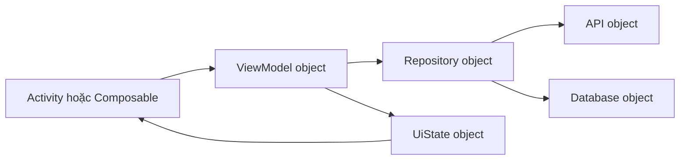
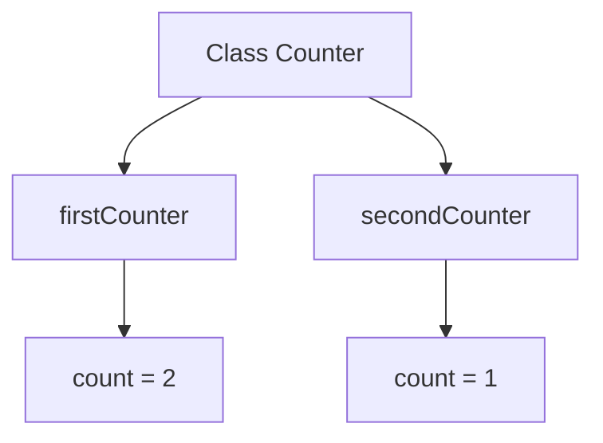
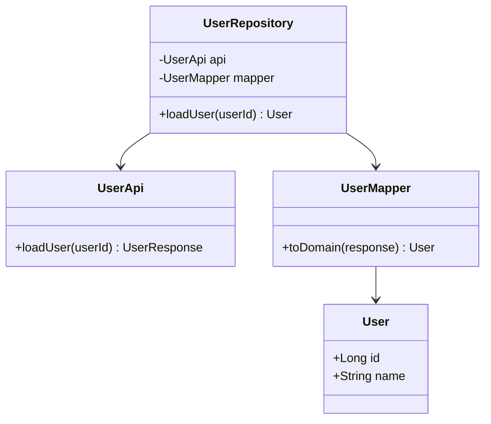
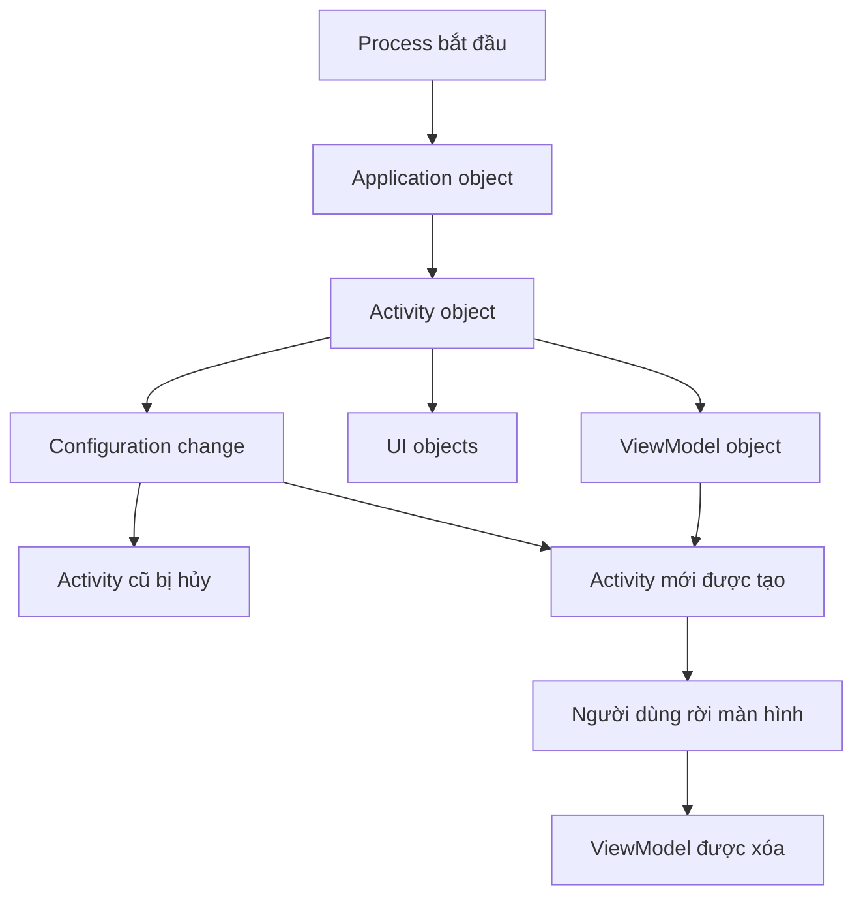

# 009 — Classes and Objects

**Học phần:** 01 — Language and Android Fundamentals
**Module:** Module 02 — Android Fundamentals
**Nhóm nội dung:** Kotlin and OOP Basics
**Nguồn roadmap:** Android Fundamentals / Kotlin and OOP Basics
**Loại bài:** Lesson
**Thứ tự trong module:** 009
**Thời lượng gợi ý:** 24 phút

---

## 1. Tóm tắt

**Class — lớp** là khuôn mẫu mô tả dữ liệu và hành vi của một loại đối tượng. **Object — đối tượng** là một thực thể cụ thể được tạo ra từ class.

Ví dụ, `User` có thể là một class mô tả:

* ID người dùng.
* Tên.
* Email.
* Trạng thái đăng nhập.
* Các hành động như cập nhật tên hoặc kiểm tra quyền truy cập.

Mỗi người dùng cụ thể được tạo từ class `User` là một object:

```kotlin
val firstUser = User(
    id = 1L,
    name = "An Khánh"
)

val secondUser = User(
    id = 2L,
    name = "Minh Anh"
)
```

Kotlin sử dụng class để đóng gói dữ liệu bằng **property** và hành vi bằng **function**. Class đóng vai trò như bản thiết kế; khi gọi constructor, chương trình tạo ra một object cụ thể dựa trên bản thiết kế đó.

> Class mô tả một loại đối tượng. Object là một phiên bản cụ thể của loại đối tượng đó.

---

## 2. Mục tiêu học tập

Sau bài học, bạn có thể:

* Giải thích class và object bằng ngôn ngữ của mình.
* Phân biệt class với object.
* Khai báo class bằng Kotlin.
* Tạo object bằng constructor.
* Sử dụng property và member function.
* Hiểu primary constructor và `init`.
* Sử dụng default argument trong constructor.
* Hiểu secondary constructor ở mức cơ bản.
* Phân biệt `val` property và `var` property.
* Áp dụng encapsulation bằng `private`.
* Sử dụng data class để biểu diễn dữ liệu.
* Hiểu `copy()`, `equals()`, `hashCode()` và `toString()`.
* Sử dụng `object` declaration cho singleton phù hợp.
* Sử dụng `companion object` cho constant và factory function.
* Nhận biết vòng đời của object trong ứng dụng Android.
* Dùng class để tổ chức UI state, repository và ViewModel.
* Viết unit test cho một class.
* Nhận biết các lỗi thiết kế thường gặp.

---

## 3. Class và object nằm ở đâu trong ứng dụng Android?

Ứng dụng Android được xây dựng từ nhiều object phối hợp với nhau:



Ví dụ:

```text
ProfileScreen
    ↓ nhận state từ
ProfileViewModel
    ↓ gọi
ProfileRepository
    ↓ lấy dữ liệu từ
ProfileApi hoặc ProfileDao
```

Mỗi thành phần có thể là một class:

```kotlin
class ProfileViewModel
class ProfileRepository
class ProfileApi
class ProfileDao
data class ProfileUiState
data class UserProfile
```

Khi ứng dụng chạy, các object cụ thể được tạo:

```kotlin
val api = ProfileApi()
val repository = ProfileRepository(api)
val viewModel = ProfileViewModel(repository)
```

Android khuyến nghị tách trách nhiệm giữa UI, state holder và data layer. Với state cấp màn hình có truy cập data layer, `ViewModel` thường là state holder phù hợp; nó nhận event, xử lý logic và tạo UI state cho giao diện.


*Hình 1: Data layer cung cấp dữ liệu cho ViewModel; ViewModel tạo UI state; UI gửi event ngược lại. Nguồn: Android Developers.*

---

## 4. Khai báo class cơ bản

Cú pháp:

```kotlin
class ClassName {
    // Properties
    // Functions
}
```

Ví dụ:

```kotlin
class Counter {
    var count: Int = 0

    fun increase() {
        count++
    }

    fun reset() {
        count = 0
    }
}
```

Tạo object:

```kotlin
val counter = Counter()
```

Sử dụng property và function:

```kotlin
counter.increase()
counter.increase()

println(counter.count) // 2

counter.reset()

println(counter.count) // 0
```

Phân tích:

| Thành phần      | Ý nghĩa                             |
| --------------- | ----------------------------------- |
| `class Counter` | Khai báo một class tên `Counter`    |
| `count`         | Property lưu trạng thái             |
| `increase()`    | Member function thay đổi trạng thái |
| `Counter()`     | Gọi constructor để tạo object       |
| `counter`       | Biến tham chiếu đến object          |

---

## 5. Class là khuôn mẫu, object là thực thể

Một class có thể tạo nhiều object độc lập:

```kotlin
class Counter {
    var count = 0

    fun increase() {
        count++
    }
}
```

Tạo hai object:

```kotlin
val firstCounter = Counter()
val secondCounter = Counter()
```

Thay đổi object thứ nhất:

```kotlin
firstCounter.increase()
firstCounter.increase()
```

Thay đổi object thứ hai:

```kotlin
secondCounter.increase()
```

Kết quả:

```kotlin
println(firstCounter.count)  // 2
println(secondCounter.count) // 1
```

Hai object được tạo từ cùng một class nhưng có state riêng:



Điểm quan trọng:

* Class chỉ mô tả cấu trúc và hành vi.
* Object mới chứa state cụ thể tại runtime.
* Thay đổi object này không tự động thay đổi object khác.
* Các object có thể được truyền vào function hoặc class khác.

---

## 6. Property của class

Property là dữ liệu thuộc về object.

```kotlin
class User {
    val id: Long = 1L
    var name: String = "An Khánh"
    var isPremium: Boolean = false
}
```

Tạo object:

```kotlin
val user = User()
```

Đọc property:

```kotlin
println(user.id)
println(user.name)
println(user.isPremium)
```

Thay đổi `var` property:

```kotlin
user.name = "Trần An Khánh"
user.isPremium = true
```

Không thể gán lại `val` property:

```kotlin
// Không hợp lệ:
user.id = 2L
```

### Lựa chọn `val` và `var`

```kotlin
class User {
    val id: Long = 1L
    var displayName: String = "Khách"
}
```

* `id` không nên thay đổi sau khi object được tạo → dùng `val`.
* `displayName` có thể được cập nhật → có thể dùng `var`.

Tuy nhiên, với model dữ liệu, thường nên ưu tiên property bất biến và tạo object mới khi dữ liệu thay đổi:

```kotlin
data class User(
    val id: Long,
    val displayName: String
)
```

```kotlin
val updatedUser = user.copy(
    displayName = "An Khánh"
)
```

---

## 7. Member function

Member function là function được khai báo bên trong class và có thể truy cập property của object.

```kotlin
class BankAccount(
    val accountNumber: String,
    private var balance: Double
) {
    fun deposit(amount: Double) {
        if (amount <= 0.0) {
            return
        }

        balance += amount
    }

    fun withdraw(amount: Double): Boolean {
        if (amount <= 0.0 || amount > balance) {
            return false
        }

        balance -= amount
        return true
    }

    fun getBalance(): Double {
        return balance
    }
}
```

Sử dụng:

```kotlin
val account = BankAccount(
    accountNumber = "ACC-001",
    balance = 1_000_000.0
)

account.deposit(500_000.0)

val success = account.withdraw(
    amount = 200_000.0
)

println(success)
println(account.getBalance())
```

Member function có thể:

* Đọc property.
* Thay đổi mutable property.
* Kiểm tra quy tắc nghiệp vụ.
* Gọi member function khác.
* Trả về kết quả cho caller.

---

## 8. Primary constructor

Primary constructor được khai báo trong phần header của class:

```kotlin
class User(
    val id: Long,
    val name: String,
    var isPremium: Boolean
)
```

Tạo object:

```kotlin
val user = User(
    id = 1001L,
    name = "An Khánh",
    isPremium = true
)
```

Khi thêm `val` hoặc `var` trước parameter, parameter đó trở thành property:

```kotlin
class User(
    val id: Long,
    var name: String
)
```

Có thể truy cập:

```kotlin
println(user.id)
println(user.name)
```

Nếu không có `val` hoặc `var`, parameter chỉ dùng trong quá trình khởi tạo:

```kotlin
class User(
    rawName: String
) {
    val displayName: String =
        rawName.trim()
}
```

Không thể truy cập `rawName` từ bên ngoài:

```kotlin
val user = User("  An Khánh  ")

println(user.displayName)

// Không tồn tại:
// println(user.rawName)
```

Kotlin cho phép class chỉ gồm header và primary constructor mà không cần phần thân `{}`.

---

## 9. Default argument trong constructor

Constructor có thể có giá trị mặc định:

```kotlin
class User(
    val id: Long,
    val name: String,
    val isPremium: Boolean = false
)
```

Tạo tài khoản thường:

```kotlin
val standardUser = User(
    id = 1L,
    name = "Minh Anh"
)
```

Tạo tài khoản Premium:

```kotlin
val premiumUser = User(
    id = 2L,
    name = "An Khánh",
    isPremium = true
)
```

Default argument giúp:

* Giảm số constructor cần tạo.
* Thể hiện giá trị mặc định của domain.
* Làm lời gọi ngắn gọn hơn.
* Hỗ trợ named argument dễ đọc.

Ví dụ UI state:

```kotlin
data class ProfileUiState(
    val isLoading: Boolean = false,
    val profile: UserProfile? = null,
    val errorMessage: String? = null
)
```

Khởi tạo state rỗng:

```kotlin
val initialState = ProfileUiState()
```

---

## 10. `init` block

`init` block chạy khi object được khởi tạo.

```kotlin
class User(
    val id: Long,
    name: String
) {
    val displayName: String

    init {
        require(id > 0) {
            "User ID phải lớn hơn 0"
        }

        require(name.isNotBlank()) {
            "Tên người dùng không được để trống"
        }

        displayName = name.trim()
    }
}
```

Tạo object hợp lệ:

```kotlin
val user = User(
    id = 1L,
    name = "  An Khánh  "
)
```

Kết quả:

```kotlin
println(user.displayName) // An Khánh
```

Tạo object không hợp lệ:

```kotlin
val invalidUser = User(
    id = -1L,
    name = ""
)
```

Có thể gây `IllegalArgumentException`.

### Khi nào dùng `init`?

* Kiểm tra điều kiện bắt buộc.
* Chuẩn hóa dữ liệu đầu vào.
* Khởi tạo property phụ thuộc constructor parameter.
* Đảm bảo object không tồn tại trong trạng thái không hợp lệ.

Không nên thực hiện side effect lớn trong `init`:

```kotlin
class ProfileRepository {
    init {
        // Không nên tự động gọi API khi object vừa được tạo.
        // api.loadProfile()
    }
}
```

Constructor nên nhanh và có hành vi dễ dự đoán.

---

## 11. Thứ tự khởi tạo

Các property initializer và `init` block được thực thi theo thứ tự xuất hiện trong class.

```kotlin
class Demo(
    val name: String
) {
    val normalizedName =
        name.trim()

    init {
        println("Init thứ nhất: $normalizedName")
    }

    val nameLength =
        normalizedName.length

    init {
        println("Init thứ hai: $nameLength")
    }
}
```

Khi tạo:

```kotlin
val demo = Demo("Android")
```

Quá trình khái quát:

```text
Nhận constructor argument
        ↓
Khởi tạo normalizedName
        ↓
Chạy init thứ nhất
        ↓
Khởi tạo nameLength
        ↓
Chạy init thứ hai
        ↓
Object sẵn sàng sử dụng
```

Nên giữ logic khởi tạo đơn giản để tránh phụ thuộc khó theo dõi giữa nhiều property và `init` block.

---

## 12. Secondary constructor

Secondary constructor được khai báo bằng từ khóa `constructor`.

```kotlin
class User(
    val id: Long,
    val name: String,
    val isPremium: Boolean
) {
    constructor(
        id: Long,
        name: String
    ) : this(
        id = id,
        name = name,
        isPremium = false
    )
}
```

Sử dụng:

```kotlin
val standardUser = User(
    id = 1L,
    name = "An Khánh"
)
```

Trong Kotlin, phần lớn trường hợp có thể thay secondary constructor bằng:

* Default argument.
* Named argument.
* Factory function.
* `companion object`.

Ví dụ gọn hơn:

```kotlin
class User(
    val id: Long,
    val name: String,
    val isPremium: Boolean = false
)
```

Secondary constructor phù hợp hơn khi:

* Cần tương thích với framework hoặc Java API.
* Có nhiều quy trình khởi tạo thực sự khác nhau.
* Cần chuyển đổi từ kiểu dữ liệu đầu vào khác.

---

## 13. Encapsulation — đóng gói dữ liệu

Encapsulation giới hạn quyền truy cập trực tiếp vào state bên trong object.

Không tốt:

```kotlin
class Cart {
    var totalPrice: Double = 0.0
}
```

Bất kỳ code nào cũng có thể đặt giá trị không hợp lệ:

```kotlin
cart.totalPrice = -5_000_000.0
```

Tốt hơn:

```kotlin
class Cart {
    private var totalPrice: Double = 0.0

    fun addPrice(amount: Double) {
        if (amount <= 0.0) {
            return
        }

        totalPrice += amount
    }

    fun getTotalPrice(): Double {
        return totalPrice
    }
}
```

Hoặc property chỉ cho phép class thay đổi:

```kotlin
class Cart {
    var totalPrice: Double = 0.0
        private set

    fun addPrice(amount: Double) {
        if (amount > 0.0) {
            totalPrice += amount
        }
    }
}
```

Caller có thể đọc:

```kotlin
println(cart.totalPrice)
```

Nhưng không thể gán:

```kotlin
// Không hợp lệ:
cart.totalPrice = -100.0
```

---

## 14. Visibility modifier

Các visibility modifier thường gặp:

| Modifier    | Phạm vi truy cập                        |
| ----------- | --------------------------------------- |
| `public`    | Có thể truy cập từ mọi nơi phù hợp      |
| `private`   | Chỉ trong class hoặc file chứa khai báo |
| `protected` | Trong class và subclass                 |
| `internal`  | Trong cùng module                       |

`public` là mặc định:

```kotlin
class UserRepository
```

Tương đương:

```kotlin
public class UserRepository
```

Property private:

```kotlin
class UserRepository(
    private val api: UserApi
)
```

Class khác không thể truy cập trực tiếp:

```kotlin
// Không hợp lệ:
// repository.api
```

Top-level helper chỉ dùng trong một file:

```kotlin
private fun normalizeName(
    name: String
): String =
    name.trim()
```

### Quy tắc thực tế

Chỉ công khai phần cần thiết:

```text
Public API nhỏ
        ↓
Ít phụ thuộc hơn
        ↓
Dễ thay đổi implementation
        ↓
Dễ bảo trì hơn
```

---

## 15. Getter và setter

Kotlin tự tạo getter và setter cho property.

```kotlin
class User {
    var name: String = ""
}
```

Có thể hiểu gần giống:

```text
getName()
setName(value)
```

Có thể tùy chỉnh getter:

```kotlin
class User(
    val firstName: String,
    val lastName: String
) {
    val fullName: String
        get() = "$firstName $lastName"
}
```

Sử dụng:

```kotlin
val user = User(
    firstName = "An",
    lastName = "Khánh"
)

println(user.fullName)
```

`fullName` được tính mỗi lần truy cập, không lưu thành state riêng.

Tùy chỉnh setter:

```kotlin
class Profile {
    var displayName: String = ""
        set(value) {
            field = value.trim()
        }
}
```

```kotlin
val profile = Profile()

profile.displayName = "  An Khánh  "

println(profile.displayName)
```

Trong setter:

* `value` là giá trị mới.
* `field` là backing field của property.

Không nên thêm quá nhiều logic hoặc side effect bất ngờ vào getter và setter.

---

## 16. Derived property

Derived property được tính từ các property khác:

```kotlin
data class CourseProgress(
    val completedLessons: Int,
    val totalLessons: Int
) {
    val progress: Double
        get() {
            if (totalLessons <= 0) {
                return 0.0
            }

            return (
                completedLessons.toDouble() /
                    totalLessons
            ).coerceIn(
                minimumValue = 0.0,
                maximumValue = 1.0
            )
        }

    val isCompleted: Boolean
        get() =
            totalLessons > 0 &&
                completedLessons >= totalLessons
}
```

Sử dụng:

```kotlin
val progress = CourseProgress(
    completedLessons = 8,
    totalLessons = 10
)

println(progress.progress)    // 0.8
println(progress.isCompleted) // false
```

Lợi ích:

* Không lưu dữ liệu trùng lặp.
* Tránh hai property bị lệch nhau.
* Quy tắc được đặt gần model liên quan.

Không nên lưu cả dữ liệu gốc và dữ liệu có thể tính được nếu chúng dễ mất đồng bộ:

```kotlin
data class BadProgress(
    val completedLessons: Int,
    val totalLessons: Int,
    val progress: Double
)
```

---

## 17. Data class

Data class phù hợp với class chủ yếu dùng để chứa dữ liệu:

```kotlin
data class UserProfile(
    val id: Long,
    val name: String,
    val email: String,
    val isPremium: Boolean
)
```

Tạo object:

```kotlin
val profile = UserProfile(
    id = 1001L,
    name = "An Khánh",
    email = "khanh@example.com",
    isPremium = true
)
```

Kotlin tự sinh các function hữu ích cho data class, gồm:

* `equals()`
* `hashCode()`
* `toString()`
* `copy()`
* Các `componentN()` dùng cho destructuring

Data class giúp giảm boilerplate khi một class chủ yếu biểu diễn dữ liệu.

---

## 18. `toString()` của data class

```kotlin
val profile = UserProfile(
    id = 1001L,
    name = "An Khánh",
    email = "khanh@example.com",
    isPremium = true
)

println(profile)
```

Kết quả gần giống:

```text
UserProfile(
    id=1001,
    name=An Khánh,
    email=khanh@example.com,
    isPremium=true
)
```

Điều này hữu ích cho:

* Debug.
* Unit test failure.
* Log dữ liệu không nhạy cảm.
* Quan sát object trong debugger.

Không nên log toàn bộ data class nếu chứa:

* Mật khẩu.
* Access token.
* Refresh token.
* Cookie.
* Thông tin thanh toán.
* Dữ liệu cá nhân nhạy cảm.

---

## 19. So sánh object

### Regular class

```kotlin
class User(
    val id: Long,
    val name: String
)
```

```kotlin
val first = User(1L, "An Khánh")
val second = User(1L, "An Khánh")

println(first == second)
```

Với regular class không override `equals()`, hai object thường không được xem là bằng nhau chỉ vì property giống nhau.

### Data class

```kotlin
data class User(
    val id: Long,
    val name: String
)
```

```kotlin
val first = User(1L, "An Khánh")
val second = User(1L, "An Khánh")

println(first == second) // true
```

### `==` và `===`

```kotlin
first == second
```

Kiểm tra **structural equality**, thông qua `equals()`.

```kotlin
first === second
```

Kiểm tra hai biến có trỏ đến đúng cùng một object hay không.

```kotlin
val first = User(1L, "An Khánh")
val second = first
val third = User(1L, "An Khánh")

println(first == third)   // true
println(first === third)  // false
println(first === second) // true
```

Trong phần lớn logic nghiệp vụ, `==` thường phù hợp hơn `===`.

---

## 20. `copy()` và immutable state

Data class tạo sẵn `copy()`:

```kotlin
data class ProfileUiState(
    val isLoading: Boolean = false,
    val userName: String = "",
    val errorMessage: String? = null
)
```

State ban đầu:

```kotlin
val initialState = ProfileUiState()
```

Tạo state loading:

```kotlin
val loadingState = initialState.copy(
    isLoading = true
)
```

Tạo state thành công:

```kotlin
val successState = loadingState.copy(
    isLoading = false,
    userName = "An Khánh",
    errorMessage = null
)
```

Object cũ không bị thay đổi:

```kotlin
println(initialState.isLoading) // false
println(loadingState.isLoading) // true
```

Android khuyến nghị UI state bất biến để mỗi object biểu diễn một snapshot rõ ràng tại một thời điểm. Việc để nơi sở hữu dữ liệu tạo state mới giúp tránh nhiều nguồn sự thật và các lỗi không nhất quán.

---

## 21. Destructuring data class

Data class có thể được tách thành nhiều biến:

```kotlin
data class Coordinate(
    val x: Int,
    val y: Int
)
```

```kotlin
val coordinate = Coordinate(
    x = 10,
    y = 20
)

val (x, y) = coordinate

println(x)
println(y)
```

Có thể bỏ giá trị không cần:

```kotlin
val (_, y) = coordinate
```

Không nên lạm dụng destructuring khi tên property trực tiếp dễ hiểu hơn:

```kotlin
println(coordinate.x)
println(coordinate.y)
```

---

## 22. Regular class hay data class?

### Dùng data class khi

* Class chủ yếu chứa dữ liệu.
* Cần so sánh theo giá trị.
* Cần `copy()`.
* Cần immutable UI state.
* Cần model cho API, database hoặc domain.

Ví dụ:

```kotlin
data class Product(
    val id: Long,
    val name: String,
    val price: Double
)
```

### Dùng regular class khi

* Class có identity riêng.
* Class quản lý mutable state nội bộ.
* Hành vi quan trọng hơn việc chứa dữ liệu.
* Không muốn tự động so sánh toàn bộ property.
* Class quản lý tài nguyên hoặc dependency.

Ví dụ:

```kotlin
class ShoppingCart {
    private val items =
        mutableListOf<CartItem>()

    fun addItem(item: CartItem) {
        items.add(item)
    }

    fun getItems(): List<CartItem> =
        items.toList()
}
```

---

## 23. Object declaration

Kotlin cho phép khai báo singleton bằng từ khóa `object`:

```kotlin
object PriceFormatter {
    fun formatVnd(amount: Double): String {
        return "%,.0f VND".format(amount)
    }
}
```

Không cần tạo instance:

```kotlin
val text =
    PriceFormatter.formatVnd(
        amount = 150_000.0
    )
```

Object declaration định nghĩa class và tạo một instance trong cùng một bước, phù hợp khi cần một singleton có tên.

### Ví dụ constant holder

```kotlin
object AppLimits {
    const val MAX_TASK_TITLE_LENGTH = 80
    const val MAX_RETRY_COUNT = 3
}
```

Sử dụng:

```kotlin
if (title.length > AppLimits.MAX_TASK_TITLE_LENGTH) {
    // Hiển thị lỗi
}
```

### Khi nào dùng `object`?

* Formatter không có mutable state.
* Constants có liên quan.
* Stateless utility.
* Một implementation duy nhất có chủ đích.
* Singleton do dependency injection quản lý hoặc được thiết kế rõ ràng.

---

## 24. Cẩn thận với singleton mutable

Không tốt:

```kotlin
object UserSession {
    var currentUser: User? = null
    var accessToken: String? = null
    var selectedTheme: String = "system"
}
```

Rủi ro:

* State toàn cục thay đổi từ nhiều nơi.
* Khó biết ai vừa sửa dữ liệu.
* Test ảnh hưởng lẫn nhau.
* Dễ giữ state cũ sau khi đăng xuất.
* Khó quản lý đồng thời.
* Có thể giữ dữ liệu nhạy cảm quá lâu.

Tốt hơn:

```kotlin
class SessionRepository(
    private val storage: SessionStorage
) {
    suspend fun getSession(): Session? =
        storage.readSession()

    suspend fun saveSession(
        session: Session
    ) {
        storage.saveSession(session)
    }

    suspend fun clearSession() {
        storage.clearSession()
    }
}
```

Object có dependency rõ ràng sẽ dễ thay thế trong test hơn.

---

## 25. Companion object

`companion object` khai báo member cấp class:

```kotlin
class User(
    val id: Long,
    val name: String
) {
    companion object {
        const val GUEST_ID = 0L

        fun createGuest(): User {
            return User(
                id = GUEST_ID,
                name = "Khách"
            )
        }
    }
}
```

Gọi thông qua tên class:

```kotlin
val guest = User.createGuest()
```

```kotlin
println(User.GUEST_ID)
```

Companion object thường dùng cho:

* Constant liên quan đến class.
* Factory function.
* Chuyển đổi dữ liệu thành object.
* Metadata cấp class.

Kotlin cho phép gọi member của companion object thông qua tên class mà không cần tạo instance ngoài trước.

---

## 26. Factory function

Factory function tạo object theo quy tắc rõ ràng:

```kotlin
class User private constructor(
    val id: Long,
    val name: String
) {
    companion object {
        fun create(
            id: Long,
            name: String
        ): User {
            require(id > 0) {
                "ID phải lớn hơn 0"
            }

            require(name.isNotBlank()) {
                "Tên không được để trống"
            }

            return User(
                id = id,
                name = name.trim()
            )
        }

        fun guest(): User {
            return User(
                id = 0L,
                name = "Khách"
            )
        }
    }
}
```

Sử dụng:

```kotlin
val user = User.create(
    id = 1L,
    name = "  An Khánh  "
)

val guest = User.guest()
```

Lợi ích:

* Tên function mô tả cách tạo object.
* Kiểm soát validation.
* Có thể trả subtype hoặc cached instance.
* Có thể đặt constructor thành `private`.

---

## 27. Object expression — anonymous object

Object expression tạo object không có tên class riêng:

```kotlin
val listener = object {
    val name = "Anonymous listener"

    fun onEvent() {
        println("Event received")
    }
}
```

Thường gặp khi triển khai interface:

```kotlin
val callback =
    object : DownloadCallback {
        override fun onSuccess(
            filePath: String
        ) {
            println("Downloaded: $filePath")
        }

        override fun onError(
            throwable: Throwable
        ) {
            println("Download failed")
        }
    }
```

Trong code Kotlin hiện đại, interface có một abstract function thường có thể được sử dụng bằng lambda nếu hỗ trợ SAM conversion:

```kotlin
button.setOnClickListener {
    // Xử lý click
}
```

Object expression phù hợp khi cần implementation dùng một lần và có nhiều member hoặc nhiều function cần override. Kotlin phân biệt object declaration dùng cho singleton có tên và object expression dùng cho object ẩn danh một lần.

---

## 28. Nested class và inner class

### Nested class

Class bên trong class khác mặc định không giữ tham chiếu đến outer object:

```kotlin
class User {
    class Validator {
        fun isNameValid(
            name: String
        ): Boolean =
            name.isNotBlank()
    }
}
```

Sử dụng:

```kotlin
val validator =
    User.Validator()
```

### Inner class

Thêm từ khóa `inner` nếu class bên trong cần truy cập outer object:

```kotlin
class Course(
    private val courseName: String
) {
    inner class Lesson(
        private val lessonName: String
    ) {
        fun getFullTitle(): String {
            return "$courseName — $lessonName"
        }
    }
}
```

Sử dụng:

```kotlin
val course = Course(
    courseName = "Android Fundamentals"
)

val lesson = course.Lesson(
    lessonName = "Classes and Objects"
)
```

Inner class giữ tham chiếu đến outer object. Vì vậy, cần cẩn thận khi outer object là `Activity`, `Fragment` hoặc object có lifecycle ngắn để tránh giữ tham chiếu lâu hơn cần thiết.

---

## 29. Composition — ghép các object

Composition là việc một class sử dụng object khác để thực hiện trách nhiệm.

```kotlin
class UserApi {
    suspend fun loadUser(
        userId: Long
    ): UserResponse {
        // Gọi API
        TODO()
    }
}
```

```kotlin
class UserMapper {
    fun toDomain(
        response: UserResponse
    ): User {
        return User(
            id = response.id,
            name = response.name
        )
    }
}
```

```kotlin
class UserRepository(
    private val api: UserApi,
    private val mapper: UserMapper
) {
    suspend fun loadUser(
        userId: Long
    ): User {
        val response =
            api.loadUser(userId)

        return mapper.toDomain(response)
    }
}
```

Khởi tạo:

```kotlin
val api = UserApi()
val mapper = UserMapper()

val repository = UserRepository(
    api = api,
    mapper = mapper
)
```

Sơ đồ:



Composition giúp:

* Mỗi class có trách nhiệm riêng.
* Dependency rõ ràng.
* Dễ thay implementation.
* Dễ tạo fake object trong unit test.
* Giảm việc một class biết quá nhiều.

---

## 30. Dependency injection qua constructor

Không tốt:

```kotlin
class UserRepository {
    private val api = UserApi()
}
```

Class tự tạo dependency nên khó thay thế trong test.

Tốt hơn:

```kotlin
class UserRepository(
    private val api: UserApi
)
```

Production:

```kotlin
val repository =
    UserRepository(
        api = RealUserApi()
    )
```

Unit test:

```kotlin
val repository =
    UserRepository(
        api = FakeUserApi()
    )
```

Constructor injection làm dependency trở nên rõ ràng ngay từ lúc object được tạo:

```text
Object cần gì?
        ↓
Nhìn vào constructor
        ↓
Biết dependency bắt buộc
```

---

## 31. Class và UI state

UI state thường được biểu diễn bằng immutable data class:

```kotlin
data class TaskUiState(
    val tasks: List<Task> = emptyList(),
    val inputTitle: String = "",
    val isLoading: Boolean = false,
    val errorMessage: String? = null
)
```

Mỗi lần state thay đổi, tạo object mới:

```kotlin
uiState = uiState.copy(
    inputTitle = newTitle
)
```

```kotlin
uiState = uiState.copy(
    isLoading = true,
    errorMessage = null
)
```

```kotlin
uiState = uiState.copy(
    isLoading = false,
    tasks = loadedTasks
)
```

Android hướng dẫn rằng UI state nên mô tả đầy đủ dữ liệu cần để render UI, thường được đóng gói trong một class có tên theo màn hình như `NewsUiState`. Immutable state giúp UI đọc một snapshot rõ ràng và hạn chế dữ liệu không nhất quán.

---

## 32. Class và ViewModel

ViewModel là một class quản lý state cấp màn hình và logic liên quan:

```kotlin
class TaskViewModel(
    private val repository: TaskRepository
) : ViewModel() {

    var uiState by mutableStateOf(
        TaskUiState()
    )
        private set

    fun onTitleChanged(
        newTitle: String
    ) {
        uiState = uiState.copy(
            inputTitle = newTitle,
            errorMessage = null
        )
    }

    fun addTask() {
        val title =
            uiState.inputTitle.trim()

        if (title.isBlank()) {
            uiState = uiState.copy(
                errorMessage =
                    "Tên công việc không được để trống"
            )
            return
        }

        viewModelScope.launch {
            repository.addTask(title)

            uiState = uiState.copy(
                inputTitle = "",
                tasks = repository.getTasks()
            )
        }
    }
}
```

ViewModel có lifecycle dài hơn Activity hoặc Fragment được tạo lại do thay đổi cấu hình. Vì vậy, state trong ViewModel có thể được giữ qua rotation, nhưng ViewModel không tự tồn tại qua system-initiated process death; dữ liệu cần phục hồi lâu dài phải dùng `SavedStateHandle` hoặc persistent storage phù hợp.

### Không giữ Activity trong ViewModel

Không tốt:

```kotlin
class TaskViewModel(
    private val activity: MainActivity
) : ViewModel()
```

Điều này có thể giữ Activity cũ sau configuration change.

Tốt hơn:

```kotlin
class TaskViewModel(
    private val repository: TaskRepository
) : ViewModel()
```

ViewModel thường không nên tham chiếu `View`, `Lifecycle` hoặc class có thể giữ Activity context vì ViewModel sống lâu hơn UI và có nguy cơ gây memory leak.

---

# PHẦN THỰC HÀNH

## 33. Project nhỏ: Task Class Demo

### Mục tiêu

Tạo ứng dụng minh họa:

* Regular class.
* Data class.
* Object creation.
* Private property.
* Member function.
* Companion object.
* Immutable UI state.
* Class composition.
* Unit test.

### Các class

```text
Task
TaskManager
TaskUiState
TaskViewModel
```

---

## 34. Model `Task`

```kotlin
data class Task(
    val id: Long,
    val title: String,
    val isCompleted: Boolean = false
)
```

Mỗi `Task` object chứa:

| Property      | Kiểu      | Ý nghĩa               |
| ------------- | --------- | --------------------- |
| `id`          | `Long`    | Định danh công việc   |
| `title`       | `String`  | Nội dung công việc    |
| `isCompleted` | `Boolean` | Trạng thái hoàn thành |

Cập nhật trạng thái bằng `copy()`:

```kotlin
val task = Task(
    id = 1L,
    title = "Học Kotlin"
)

val completedTask =
    task.copy(
        isCompleted = true
    )
```

---

## 35. Class `TaskManager`

```kotlin
class TaskManager(
    initialTasks: List<Task> = emptyList()
) {
    private val tasks =
        initialTasks.toMutableList()

    private var nextId: Long =
        (
            initialTasks.maxOfOrNull {
                task -> task.id
            } ?: 0L
        ) + 1L

    fun addTask(
        rawTitle: String
    ): Task? {
        val title =
            rawTitle.trim()

        if (title.isBlank()) {
            return null
        }

        if (
            title.length >
            MAX_TITLE_LENGTH
        ) {
            return null
        }

        val task = Task(
            id = nextId,
            title = title
        )

        nextId++
        tasks.add(task)

        return task
    }

    fun toggleTask(
        taskId: Long
    ): Boolean {
        val index =
            tasks.indexOfFirst { task ->
                task.id == taskId
            }

        if (index == -1) {
            return false
        }

        val currentTask =
            tasks[index]

        tasks[index] =
            currentTask.copy(
                isCompleted =
                    !currentTask.isCompleted
            )

        return true
    }

    fun removeTask(
        taskId: Long
    ): Boolean {
        return tasks.removeAll { task ->
            task.id == taskId
        }
    }

    fun getTasks(): List<Task> =
        tasks.toList()

    fun getCompletedCount(): Int =
        tasks.count { task ->
            task.isCompleted
        }

    fun clearCompleted() {
        tasks.removeAll { task ->
            task.isCompleted
        }
    }

    companion object {
        const val MAX_TITLE_LENGTH = 80

        fun createWithSampleData():
            TaskManager {
            return TaskManager(
                initialTasks = listOf(
                    Task(
                        id = 1L,
                        title = "Học class"
                    ),
                    Task(
                        id = 2L,
                        title = "Tạo object"
                    )
                )
            )
        }
    }
}
```

### Phân tích

* `tasks` là private để caller không sửa list trực tiếp.
* `getTasks()` trả bản sao read-only.
* `addTask()` bảo vệ quy tắc title.
* `toggleTask()` tạo `Task` object mới bằng `copy()`.
* `companion object` chứa constant và factory function.
* Class chịu trách nhiệm quản lý collection công việc.

---

## 36. UI state

```kotlin
data class TaskUiState(
    val tasks: List<Task> = emptyList(),
    val inputTitle: String = "",
    val errorMessage: String? = null
) {
    val completedCount: Int
        get() =
            tasks.count { task ->
                task.isCompleted
            }

    val totalCount: Int
        get() =
            tasks.size
}
```

Derived property tránh lưu `completedCount` riêng và làm nó lệch với danh sách.

---

## 37. ViewModel mẫu

```kotlin
class TaskViewModel(
    private val taskManager:
        TaskManager = TaskManager()
) : ViewModel() {

    var uiState by mutableStateOf(
        TaskUiState(
            tasks =
                taskManager.getTasks()
        )
    )
        private set

    fun onTitleChanged(
        newTitle: String
    ) {
        uiState = uiState.copy(
            inputTitle = newTitle,
            errorMessage = null
        )
    }

    fun addTask() {
        val task =
            taskManager.addTask(
                rawTitle =
                    uiState.inputTitle
            )

        if (task == null) {
            uiState = uiState.copy(
                errorMessage =
                    "Tên công việc không hợp lệ"
            )
            return
        }

        refreshState(
            inputTitle = ""
        )
    }

    fun toggleTask(
        taskId: Long
    ) {
        taskManager.toggleTask(
            taskId = taskId
        )

        refreshState()
    }

    fun removeTask(
        taskId: Long
    ) {
        taskManager.removeTask(
            taskId = taskId
        )

        refreshState()
    }

    private fun refreshState(
        inputTitle: String =
            uiState.inputTitle
    ) {
        uiState = uiState.copy(
            tasks =
                taskManager.getTasks(),
            inputTitle = inputTitle,
            errorMessage = null
        )
    }
}
```

---

## 38. Composable mẫu

```kotlin
@Composable
fun TaskScreen(
    state: TaskUiState,
    onTitleChanged: (String) -> Unit,
    onAddTask: () -> Unit,
    onToggleTask: (Long) -> Unit,
    onRemoveTask: (Long) -> Unit
) {
    Column(
        modifier = Modifier
            .fillMaxSize()
            .padding(24.dp),
        verticalArrangement =
            Arrangement.spacedBy(12.dp)
    ) {
        Text(
            text = "Classes and Objects",
            style =
                MaterialTheme
                    .typography
                    .headlineSmall
        )

        Text(
            text =
                "Hoàn thành: " +
                    "${state.completedCount}/" +
                    state.totalCount
        )

        OutlinedTextField(
            value = state.inputTitle,
            onValueChange =
                onTitleChanged,
            label = {
                Text("Tên công việc")
            },
            isError =
                state.errorMessage != null
        )

        state.errorMessage?.let {
            message ->
            Text(text = message)
        }

        Button(
            onClick = onAddTask
        ) {
            Text("Thêm công việc")
        }

        state.tasks.forEach { task ->
            Row(
                modifier =
                    Modifier.fillMaxWidth(),
                horizontalArrangement =
                    Arrangement.SpaceBetween
            ) {
                Row {
                    Checkbox(
                        checked =
                            task.isCompleted,
                        onCheckedChange = {
                            onToggleTask(task.id)
                        }
                    )

                    Text(
                        text = task.title
                    )
                }

                TextButton(
                    onClick = {
                        onRemoveTask(task.id)
                    }
                ) {
                    Text("Xóa")
                }
            }
        }
    }
}
```

Composable nhận object `TaskUiState` và callback function. Nó không trực tiếp quản lý `TaskManager`, giúp UI ít phụ thuộc vào implementation nghiệp vụ.

---

## 39. Unit test cho `TaskManager`

Tạo file:

```text
app/src/test/java/com/example/classes/TaskManagerTest.kt
```

```kotlin
package com.example.classes

import org.junit.Assert.assertEquals
import org.junit.Assert.assertFalse
import org.junit.Assert.assertNotNull
import org.junit.Assert.assertNull
import org.junit.Assert.assertTrue
import org.junit.Test

class TaskManagerTest {

    @Test
    fun addTask_withValidTitle_addsTask() {
        val manager = TaskManager()

        val task =
            manager.addTask(
                rawTitle = "Học Kotlin"
            )

        assertNotNull(task)
        assertEquals(
            1,
            manager.getTasks().size
        )
        assertEquals(
            "Học Kotlin",
            manager.getTasks().first().title
        )
    }

    @Test
    fun addTask_withBlankTitle_returnsNull() {
        val manager = TaskManager()

        val task =
            manager.addTask(
                rawTitle = "   "
            )

        assertNull(task)
        assertTrue(
            manager.getTasks().isEmpty()
        )
    }

    @Test
    fun addTask_trimsTitle() {
        val manager = TaskManager()

        manager.addTask(
            rawTitle = "  Học Android  "
        )

        assertEquals(
            "Học Android",
            manager.getTasks()
                .first()
                .title
        )
    }

    @Test
    fun toggleTask_changesCompletedState() {
        val manager = TaskManager()

        val task =
            manager.addTask(
                rawTitle = "Viết test"
            )!!

        val success =
            manager.toggleTask(
                taskId = task.id
            )

        assertTrue(success)
        assertTrue(
            manager.getTasks()
                .first()
                .isCompleted
        )
    }

    @Test
    fun toggleTask_withUnknownId_returnsFalse() {
        val manager = TaskManager()

        val success =
            manager.toggleTask(
                taskId = 999L
            )

        assertFalse(success)
    }

    @Test
    fun removeTask_removesMatchingObject() {
        val manager = TaskManager()

        val task =
            manager.addTask(
                rawTitle = "Xóa tôi"
            )!!

        val removed =
            manager.removeTask(
                taskId = task.id
            )

        assertTrue(removed)
        assertTrue(
            manager.getTasks().isEmpty()
        )
    }

    @Test
    fun getTasks_doesNotExposeMutableList() {
        val manager = TaskManager()

        manager.addTask(
            rawTitle = "Task 1"
        )

        val returnedTasks =
            manager.getTasks()

        assertEquals(
            1,
            returnedTasks.size
        )
    }
}
```

---

## 40. Vòng đời của object trong Android

Không phải object nào cũng sống trong cùng khoảng thời gian.

| Object                      | Vòng đời điển hình                             |
| --------------------------- | ---------------------------------------------- |
| Local object trong function | Đến khi không còn được tham chiếu              |
| Composable UI object        | Có thể được tạo lại qua recomposition          |
| Activity object             | Đến khi Activity bị destroy                    |
| Fragment object             | Theo lifecycle Fragment                        |
| ViewModel object            | Qua configuration change, đến khi scope bị xóa |
| Application object          | Trong vòng đời process                         |
| Repository singleton        | Thường theo application graph                  |
| Database object             | Thường được dùng lại ở application scope       |

Sơ đồ đơn giản:



### Câu hỏi cần đặt ra

* Ai tạo object?
* Ai sở hữu object?
* Object sống bao lâu?
* Object có giữ `Context` không?
* Object có cần tồn tại qua rotation không?
* Object có cần tồn tại qua process death không?
* Khi nào cần giải phóng tài nguyên?

---

## 41. Memory leak do object giữ tham chiếu sai

Không tốt:

```kotlin
object AnalyticsManager {
    var currentActivity:
        Activity? = null
}
```

Singleton có thể giữ Activity đã bị destroy.

Không tốt:

```kotlin
class ProfileViewModel(
    private val context: Activity
) : ViewModel()
```

Tốt hơn:

```kotlin
class ProfileViewModel(
    private val repository:
        ProfileRepository
) : ViewModel()
```

Khi cần application context cho dependency phù hợp:

```kotlin
class FileStorage(
    private val appContext: Context
)
```

Dependency injection phải truyền `applicationContext`, không phải Activity context, nếu object sống ở application scope.

### Nguyên tắc

```text
Object sống lâu
    không nên giữ
Object sống ngắn
```

Ví dụ:

```text
Singleton
    không nên giữ
Activity, Fragment hoặc View
```

---

## 42. Sai lầm phổ biến của lập trình viên mới

### Sai lầm 1: Dùng class như một túi biến public

```kotlin
class User {
    var id = 0L
    var name = ""
    var balance = 0.0
    var accessToken = ""
}
```

Bất kỳ nơi nào cũng có thể tạo state không hợp lệ.

Nên:

* Dùng constructor bắt buộc.
* Dùng `val` khi có thể.
* Giới hạn setter.
* Tách dữ liệu nhạy cảm.
* Đưa quy tắc vào function phù hợp.

---

### Sai lầm 2: Tạo class cho mọi helper nhỏ

```kotlin
class StringHelper {
    fun trimName(
        name: String
    ): String =
        name.trim()
}
```

Một top-level hoặc extension function có thể đơn giản hơn:

```kotlin
fun String.toDisplayName(): String =
    trim()
```

---

### Sai lầm 3: Lạm dụng singleton

```kotlin
object EverythingManager {
    var user: User? = null
    var cart: Cart? = null
    var theme = "dark"

    fun login() {}
    fun pay() {}
    fun navigate() {}
    fun save() {}
}
```

Hậu quả:

* Global mutable state.
* Class làm quá nhiều trách nhiệm.
* Khó test.
* Khó kiểm soát lifecycle.
* Khó phát triển song song.

---

### Sai lầm 4: Dùng data class cho object có identity và lifecycle phức tạp

```kotlin
data class DatabaseConnection(
    val connection: Connection
)
```

Data class phù hợp hơn với dữ liệu, không phải tài nguyên sống có quy trình mở, đóng và ownership phức tạp.

---

### Sai lầm 5: Property mutable không cần thiết

```kotlin
data class User(
    var id: Long,
    var name: String,
    var email: String
)
```

Tốt hơn:

```kotlin
data class User(
    val id: Long,
    val name: String,
    val email: String
)
```

Khi cập nhật:

```kotlin
val updatedUser =
    user.copy(
        name = "Tên mới"
    )
```

---

### Sai lầm 6: Expose mutable collection

Không tốt:

```kotlin
class Cart {
    val items =
        mutableListOf<CartItem>()
}
```

Caller có thể sửa tùy ý:

```kotlin
cart.items.clear()
```

Tốt hơn:

```kotlin
class Cart {
    private val mutableItems =
        mutableListOf<CartItem>()

    val items: List<CartItem>
        get() =
            mutableItems.toList()
}
```

---

### Sai lầm 7: Constructor thực hiện quá nhiều side effect

```kotlin
class UserRepository {
    init {
        connectDatabase()
        callApi()
        startBackgroundWorker()
    }
}
```

Object creation trở nên chậm và khó dự đoán.

Nên dùng function rõ ràng:

```kotlin
class UserRepository {
    suspend fun initialize() {
        // ...
    }
}
```

---

### Sai lầm 8: ViewModel giữ Activity hoặc View

```kotlin
class MainViewModel(
    val activity: MainActivity
) : ViewModel()
```

Có nguy cơ memory leak vì ViewModel có thể sống lâu hơn Activity.

---

### Sai lầm 9: Tạo nhiều object đại diện cùng một nguồn state

```kotlin
val managerA = TaskManager()
val managerB = TaskManager()
```

Nếu hai màn hình cần cùng dữ liệu nhưng sử dụng hai manager độc lập, state có thể không nhất quán.

Cần xác định ownership và scope rõ ràng:

* Screen scope.
* Navigation scope.
* Activity scope.
* Application scope.

---

### Sai lầm 10: So sánh reference khi cần so sánh giá trị

```kotlin
if (newState === oldState) {
    // ...
}
```

Nếu cần so sánh nội dung data class:

```kotlin
if (newState == oldState) {
    // ...
}
```

---

## 43. Classes and Objects ảnh hưởng đến chất lượng ứng dụng

### 43.1. UX

Thiết kế class không hợp lý có thể gây:

* UI hiển thị state không đồng nhất.
* Giỏ hàng bị reset.
* Dữ liệu bị nhân đôi.
* Form hiển thị dữ liệu cũ.
* Loading không kết thúc.
* Người dùng đăng xuất nhưng singleton vẫn giữ session.
* Màn hình crash vì object ở trạng thái không hợp lệ.

Class tốt giúp quy tắc dữ liệu được áp dụng nhất quán trước khi UI hiển thị.

---

### 43.2. Độ ổn định

Object ổn định cần:

* Constructor đảm bảo dữ liệu hợp lệ.
* Mutable state được giới hạn.
* Không expose collection mutable.
* Không giữ Context sai vòng đời.
* Không tạo side effect bất ngờ.
* Có error model rõ ràng.
* Có ownership và scope rõ ràng.

---

### 43.3. Maintainability

Code dễ bảo trì hơn khi:

* Mỗi class có một trách nhiệm chính.
* Tên class thể hiện vai trò.
* Dependency được truyền qua constructor.
* Public API nhỏ.
* Implementation detail được đặt `private`.
* Data class được dùng cho model và UI state.
* Không có god object.
* Class có thể unit test độc lập.

---

### 43.4. Performance

Rủi ro hiệu năng có thể đến từ:

* Tạo object quá nhiều trong vòng lặp nóng.
* Sao chép collection rất lớn liên tục.
* Singleton giữ object không cần thiết.
* Constructor thực hiện I/O.
* Class giữ bitmap hoặc resource lớn quá lâu.
* Object không được giải phóng do memory leak.

Không nên tối ưu bằng cách chuyển mọi thứ thành mutable singleton. Hãy đo lường trước và bảo đảm ownership đúng.

---

### 43.5. Release risk

Trước khi phát hành, cần kiểm tra:

* Singleton có giữ token cũ không?
* Object có giữ Activity context không?
* State có được phục hồi sau process death không?
* Model API có xử lý trường nullable không?
* Data class có vô tình log dữ liệu nhạy cảm không?
* Dependency production có bị thay bằng fake không?
* Object có được tạo đúng scope không?
* Repository có một nguồn dữ liệu đáng tin cậy không?

---

## 44. Thực hành trong 24 phút

|  Thời gian | Hoạt động                                  |
| ---------: | ------------------------------------------ |
|   0–4 phút | Đọc khái niệm class, object và constructor |
|   4–8 phút | Tạo `Task` data class                      |
|  8–13 phút | Tạo `TaskManager` regular class            |
| 13–17 phút | Thêm encapsulation và member function      |
| 17–20 phút | Viết unit test                             |
| 20–22 phút | Kiểm tra state sau rotation                |
| 22–24 phút | Viết ghi chú và cập nhật artifact          |

---

## 45. Bài thực hành

Tạo ứng dụng **Task Class Demo**.

### Yêu cầu dữ liệu

```kotlin
data class Task(
    val id: Long,
    val title: String,
    val isCompleted: Boolean
)
```

### Yêu cầu `TaskManager`

* Thêm công việc.
* Không chấp nhận title rỗng.
* Giới hạn title tối đa 80 ký tự.
* Đánh dấu hoàn thành.
* Xóa công việc.
* Đếm số công việc hoàn thành.
* Không expose `MutableList`.
* Có factory tạo dữ liệu mẫu.

### Yêu cầu UI

* Hiển thị danh sách.
* Thêm công việc mới.
* Đánh dấu hoàn thành.
* Xóa công việc.
* Hiển thị `completed/total`.
* Hiển thị validation error.
* State không bị mất sau rotation nếu được quản lý bởi ViewModel.

---

## 46. Bài tập

### Bài 1 — Giải thích trong năm dòng

Viết năm dòng trả lời:

1. Class là gì?
2. Object là gì?
3. Constructor dùng để làm gì?
4. Property khác member function thế nào?
5. Data class phù hợp với trường hợp nào?

---

### Bài 2 — Tạo class `Book`

```kotlin
class Book(
    val id: Long,
    val title: String,
    val author: String,
    var isBorrowed: Boolean = false
)
```

Thêm function:

```kotlin
fun borrow(): Boolean
fun returnBook()
```

Quy tắc:

* Không thể mượn sách đã được mượn.
* Trả sách đặt `isBorrowed` về `false`.

---

### Bài 3 — Chuyển sang data class

Chuyển model sau thành data class:

```kotlin
class Product(
    val id: Long,
    val name: String,
    val price: Double
)
```

Sau đó:

* Tạo hai object giống nhau.
* So sánh bằng `==`.
* Tạo sản phẩm mới bằng `copy(price = ...)`.

---

### Bài 4 — Encapsulation

Sửa class:

```kotlin
class Wallet {
    var balance: Double = 0.0
}
```

Yêu cầu:

* Caller chỉ được đọc balance.
* Chỉ class được thay đổi balance.
* Không cho nạp hoặc rút số âm.
* Không cho rút quá số dư.

---

### Bài 5 — Singleton an toàn

Tạo:

```kotlin
object TemperatureFormatter
```

Có function:

```kotlin
fun formatCelsius(
    value: Double
): String
```

Không lưu mutable user state bên trong object.

---

### Bài 6 — Companion factory

Tạo class:

```kotlin
class AppUser private constructor(
    val id: Long,
    val name: String
)
```

Companion object có:

```kotlin
fun create(
    id: Long,
    name: String
): AppUser

fun guest(): AppUser
```

---

### Bài 7 — Phân tích lifecycle

Giải thích vì sao đoạn code này nguy hiểm:

```kotlin
object ScreenCache {
    var lastActivity:
        Activity? = null
}
```

Nêu:

* Object nào sống lâu hơn?
* Vì sao Activity có thể bị leak?
* Cách thay thế an toàn hơn.

---

## 47. Artifact đưa vào portfolio

Tạo file:

```text
docs/classes-and-objects-report.md
```

Nội dung đề xuất:

```markdown
# Classes and Objects Report

## Mục tiêu

Áp dụng class, object, constructor, property, member function,
data class, encapsulation và companion object trong Kotlin.

## Các class

| Class | Loại | Trách nhiệm |
|---|---|---|
| Task | Data class | Biểu diễn một công việc |
| TaskManager | Regular class | Quản lý danh sách công việc |
| TaskUiState | Data class | Biểu diễn state của màn hình |
| TaskViewModel | ViewModel class | Xử lý event và cập nhật state |

## Encapsulation

TaskManager giữ MutableList ở chế độ private.
Caller chỉ nhận List thông qua getTasks().

## Immutability

Task và TaskUiState sử dụng val.
Khi thay đổi trạng thái, ứng dụng tạo object mới bằng copy().

## Object creation

TaskManager nhận dữ liệu ban đầu qua constructor.
Companion object cung cấp factory createWithSampleData().

## Lifecycle

TaskViewModel giữ screen state qua configuration change.
Dữ liệu cần tồn tại sau process death phải được lưu bằng
SavedStateHandle hoặc persistent storage.

## Testing

Đã kiểm tra:

- Thêm task hợp lệ.
- Từ chối title rỗng.
- Chuẩn hóa khoảng trắng.
- Toggle trạng thái.
- Xóa task.
- ID không tồn tại.

## Hạn chế

- Chưa dùng Room.
- Chưa có network.
- Chưa lưu dữ liệu qua process death.
- Chưa có instrumented UI test.
```

Ảnh đề xuất:

```text
docs/screenshots/
├── 01-task-screen.png
├── 02-task-added.png
├── 03-task-completed.png
├── 04-state-after-rotation.png
└── 05-unit-test-success.png
```

---

## 48. Checklist hoàn thành

### Kiến thức

* [ ] Giải thích được class là gì.
* [ ] Giải thích được object là gì.
* [ ] Phân biệt class và instance.
* [ ] Biết tạo object bằng constructor.
* [ ] Hiểu property.
* [ ] Hiểu member function.
* [ ] Hiểu primary constructor.
* [ ] Biết sử dụng `init`.
* [ ] Biết default constructor argument.
* [ ] Hiểu secondary constructor ở mức cơ bản.
* [ ] Hiểu encapsulation.
* [ ] Biết visibility modifier.
* [ ] Hiểu getter và setter.
* [ ] Hiểu data class.
* [ ] Biết sử dụng `copy()`.
* [ ] Phân biệt `==` và `===`.
* [ ] Hiểu object declaration.
* [ ] Hiểu companion object.

### Thiết kế code

* [ ] Constructor bảo đảm object hợp lệ.
* [ ] Ưu tiên `val`.
* [ ] Mutable property có lý do rõ ràng.
* [ ] Không expose `MutableList`.
* [ ] Public API nhỏ.
* [ ] Implementation detail dùng `private`.
* [ ] Mỗi class có trách nhiệm chính.
* [ ] Dependency được truyền qua constructor.
* [ ] Không có god object.
* [ ] Không lạm dụng singleton mutable.
* [ ] Không thực hiện I/O nặng trong constructor.

### Android và lifecycle

* [ ] Biết object nào sở hữu state.
* [ ] Biết object sống trong scope nào.
* [ ] ViewModel không giữ Activity hoặc View.
* [ ] Singleton không giữ Context vòng đời ngắn.
* [ ] UI state được biểu diễn bằng immutable data class.
* [ ] State thay đổi bằng object mới.
* [ ] Đã kiểm tra rotation.
* [ ] Hiểu ViewModel không tự sống qua process death.
* [ ] Dữ liệu lâu dài được lưu xuống storage phù hợp.

### Testing và portfolio

* [ ] Có unit test cho regular class.
* [ ] Có test constructor input.
* [ ] Có test state transition.
* [ ] Có test giá trị không hợp lệ.
* [ ] Có test ID không tồn tại.
* [ ] Có ảnh giao diện.
* [ ] Có ảnh test thành công.
* [ ] Có Markdown report.
* [ ] Artifact đã được liên kết vào progress tracker.

---

## 49. Ghi chú production

### User flow

* Class nào quản lý dữ liệu của màn hình?
* UI nhận state từ một hay nhiều nguồn?
* Object có thể ở trạng thái không hợp lệ không?
* Validation được đặt trong UI hay domain object?
* Khi thao tác thất bại, object biểu diễn lỗi thế nào?

### Lifecycle và state

* Object thuộc Activity, ViewModel hay Application scope?
* Object có sống qua rotation không?
* Object có cần phục hồi sau process death không?
* Có giữ Activity, Fragment, View hoặc Context không?
* Có observer hoặc callback cần được hủy không?
* Có tài nguyên cần `close()` không?

### Data và network

* API model có tách khỏi domain model không?
* Repository có được inject dependency không?
* Model nullable có đúng với response không?
* Có một nguồn sự thật cho dữ liệu không?
* Object cache có chính sách hết hạn không?
* Singleton có giữ dữ liệu cũ sau logout không?

### Reliability

* Constructor có kiểm tra input không?
* Mutable state có được giới hạn không?
* Collection có bị thay đổi từ bên ngoài không?
* Hai object có thể đại diện cùng state và xung đột không?
* Equality có đúng với domain không?
* Có phụ thuộc thứ tự khởi tạo khó hiểu không?

### Testing

* Có fake dependency không?
* Class có thể test mà không cần Android framework không?
* Có test object hợp lệ và không hợp lệ không?
* Có test state transition không?
* Có test equality và `copy()` nếu quan trọng không?
* Có regression test cho bug lifecycle không?

### Release

* Object có chứa secret trong `toString()` không?
* Có log toàn bộ data class nhạy cảm không?
* Có singleton debug được dùng trong release không?
* Dependency graph production có đúng không?
* Có memory leak khi điều hướng nhiều lần không?
* Dữ liệu có bị mất khi process bị hệ thống dừng không?

---

## 50. Kết luận

Classes and Objects là nền tảng để tổ chức dữ liệu và hành vi trong ứng dụng Kotlin.

Một thiết kế class tốt cần trả lời được:

1. Class đại diện cho khái niệm gì?
2. Object chứa state nào?
3. Property nào bất biến?
4. Function nào được phép thay đổi state?
5. Constructor cần bảo đảm điều kiện gì?
6. Member nào cần public hoặc private?
7. Class nên là regular class hay data class?
8. Object được tạo ở đâu?
9. Object thuộc lifecycle scope nào?
10. Object có thể được thay thế trong unit test không?

Quy trình thiết kế:

```text
Xác định khái niệm
        ↓
Xác định dữ liệu
        ↓
Xác định hành vi
        ↓
Chọn regular class hoặc data class
        ↓
Thiết kế constructor
        ↓
Giới hạn mutable state
        ↓
Xác định dependency
        ↓
Xác định ownership và lifecycle
        ↓
Viết unit test
```

Một lập trình viên Android tốt không chỉ biết viết:

```kotlin
class User
```

mà còn phải giải thích được:

* Vì sao `User` là class hay data class.
* Vì sao property là `val` hoặc `var`.
* Ai tạo và sở hữu object.
* Object sống bao lâu.
* State được cập nhật như thế nào.
* Làm sao tránh memory leak.
* Test nào bảo vệ quy tắc của object.

---

## 51. Nguồn tham khảo

* [Classes — Kotlin Documentation](https://kotlinlang.org/docs/classes.html)
* [Object declarations and expressions — Kotlin Documentation](https://kotlinlang.org/docs/object-declarations.html)
* [Data classes — Kotlin Documentation](https://kotlinlang.org/docs/data-classes.html)
* [Inheritance — Kotlin Documentation](https://kotlinlang.org/docs/inheritance.html)
* [Visibility modifiers — Kotlin Documentation](https://kotlinlang.org/docs/visibility-modifiers.html)
* [UI layer — Android Developers](https://developer.android.com/topic/architecture/ui-layer)
* [State holders and UI state — Android Developers](https://developer.android.com/topic/architecture/ui-layer/stateholders)
* [ViewModel overview — Android Developers](https://developer.android.com/topic/libraries/architecture/viewmodel)
* [Save UI states — Android Developers](https://developer.android.com/topic/libraries/architecture/saving-states)

---

# Bài luyện tập

## Mục tiêu


## Đề bài


## Yêu cầu hoàn thành

- [ ] 
- [ ] 
- [ ] 

## Kết quả / lời giải


## Ghi chú
