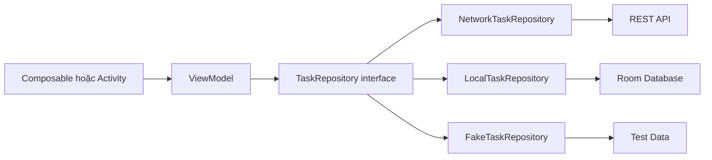
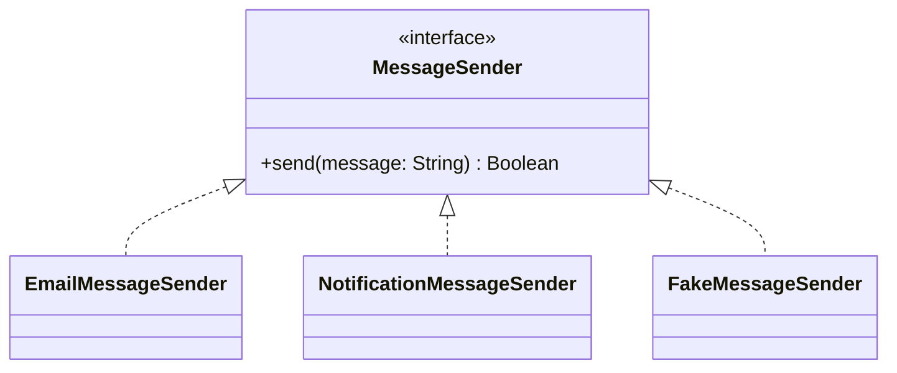
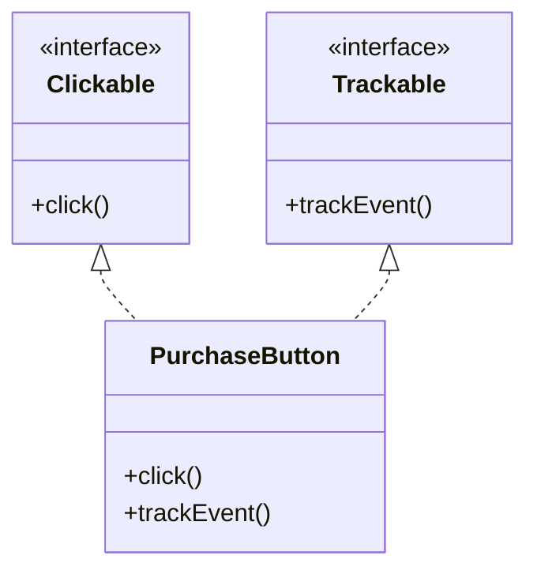
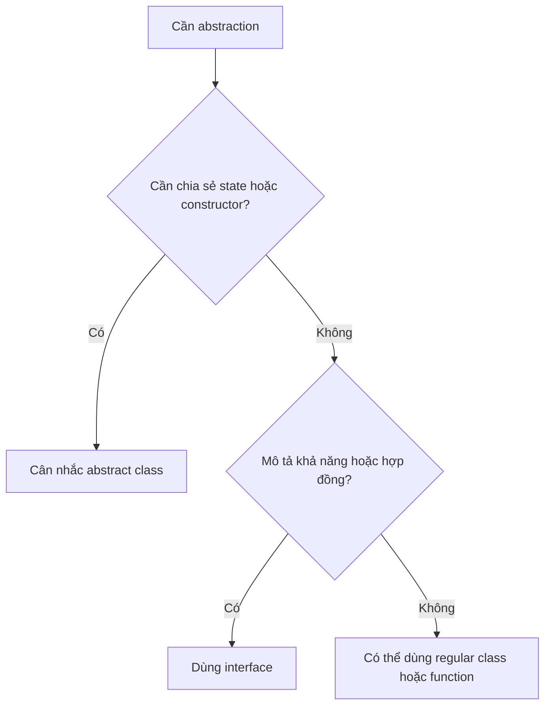

# 010 — Interfaces

**Học phần:** 01 — Language and Android Fundamentals
**Module:** Module 02 — Android Fundamentals
**Nhóm nội dung:** Kotlin and OOP Basics
**Nguồn roadmap:** Android Fundamentals / Kotlin and OOP Basics
**Loại bài:** Lesson
**Thứ tự trong module:** 010
**Thời lượng gợi ý:** 24 phút

---

## 1. Tóm tắt

**Interface — giao diện** là một bản hợp đồng mô tả một đối tượng **có thể làm gì**, nhưng không bắt buộc quy định toàn bộ cách thực hiện.

Ví dụ, ứng dụng cần tải danh sách công việc nhưng không muốn màn hình hoặc ViewModel phụ thuộc trực tiếp vào Room, Retrofit hay bộ nhớ tạm. Ta có thể tạo hợp đồng:

```kotlin
interface TaskRepository {
    suspend fun getTasks(): List<Task>
}
```

Sau đó tạo nhiều implementation:

```kotlin
class NetworkTaskRepository : TaskRepository
class LocalTaskRepository : TaskRepository
class FakeTaskRepository : TaskRepository
```

ViewModel chỉ cần biết `TaskRepository`, không cần biết dữ liệu thực sự đến từ đâu.

Trong Kotlin, interface có thể khai báo:

* Abstract function chưa có phần thân.
* Function có implementation mặc định.
* Abstract property.
* Property có custom getter.
* Quan hệ kế thừa với interface khác.

Interface không có constructor và không trực tiếp lưu state bằng backing field. Một class hoặc object có thể triển khai nhiều interface cùng lúc.

> Interface định nghĩa khả năng và hợp đồng; class triển khai interface cung cấp hành vi cụ thể.

---

## 2. Mục tiêu học tập

Sau bài học, bạn có thể:

* Giải thích interface bằng ngôn ngữ của mình.
* Khai báo interface bằng từ khóa `interface`.
* Tạo class triển khai interface.
* Sử dụng `override`.
* Khai báo property trong interface.
* Viết function có implementation mặc định.
* Cho một class triển khai nhiều interface.
* Kế thừa từ interface khác.
* Giải quyết xung đột giữa hai default implementation.
* Phân biệt interface và abstract class.
* Hiểu functional interface và SAM conversion.
* Sử dụng interface cho repository và data source.
* Truyền implementation qua constructor.
* Tạo fake implementation cho unit test.
* Nhận biết khi nào không nên tạo interface.
* Liên hệ interface với UI, lifecycle, state, data, network và release.

---

## 3. Interface nằm ở đâu trong ứng dụng Android?

Interface thường nằm tại ranh giới giữa các thành phần:



Luồng production:

```text
UI
 ↓
ViewModel
 ↓
TaskRepository
 ↓
DefaultTaskRepository
 ↓
Room hoặc Network
```

Luồng unit test:

```text
ViewModel
 ↓
TaskRepository
 ↓
FakeTaskRepository
```

Nhờ cùng tuân theo một interface, production code và test code có thể sử dụng implementation khác nhau mà không cần thay đổi logic của ViewModel.

Android khuyến nghị UI và ViewModel không truy cập trực tiếp data source. Data layer nên cung cấp dữ liệu thông qua repository, đồng thời interface đặc biệt hữu ích với những dependency giao tiếp cùng tài nguyên bên ngoài vì có thể thay bằng fake trong test.

---

## 4. Sơ đồ kiến trúc minh họa


*Hình 1: UI và domain layer truy cập dữ liệu thông qua repository; repository làm việc với data source. Nguồn: Android Developers.*

Interface thường được đặt tại các ranh giới như:

```text
ViewModel → Repository
Repository → Data Source
Use Case → Repository
Feature Module → Public API
Production Code → External Service
Test → Fake Implementation
```

---

## 5. Khai báo interface cơ bản

Cú pháp:

```kotlin
interface InterfaceName {
    fun requiredFunction()
}
```

Ví dụ:

```kotlin
interface Printer {
    fun print(message: String)
}
```

Interface trên tạo một hợp đồng:

```text
Bất kỳ class nào là Printer
        ↓
phải cung cấp print(message)
```

Tạo implementation:

```kotlin
class ConsolePrinter : Printer {

    override fun print(message: String) {
        println(message)
    }
}
```

Sử dụng:

```kotlin
val printer: Printer =
    ConsolePrinter()

printer.print(
    message = "Hello Kotlin"
)
```

Phân tích:

| Thành phần          | Ý nghĩa                        |
| ------------------- | ------------------------------ |
| `interface Printer` | Khai báo hợp đồng              |
| `print()`           | Hành vi bắt buộc               |
| `: Printer`         | Class triển khai interface     |
| `override`          | Cung cấp implementation        |
| `printer: Printer`  | Biến phụ thuộc vào abstraction |

---

## 6. Interface không thể được khởi tạo trực tiếp

Không thể tạo object trực tiếp từ interface:

```kotlin
interface Printer {
    fun print(message: String)
}

// Không hợp lệ:
// val printer = Printer()
```

Interface không mô tả đầy đủ implementation và không có constructor. Cần sử dụng một class hoặc object triển khai nó:

```kotlin
val printer: Printer =
    ConsolePrinter()
```

Hoặc object expression:

```kotlin
val printer =
    object : Printer {
        override fun print(
            message: String
        ) {
            println(message)
        }
    }
```

---

## 7. Một interface, nhiều implementation

```kotlin
interface MessageSender {
    fun send(message: String): Boolean
}
```

Implementation gửi email:

```kotlin
class EmailMessageSender : MessageSender {

    override fun send(
        message: String
    ): Boolean {
        println("Sending email: $message")
        return true
    }
}
```

Implementation gửi notification:

```kotlin
class NotificationMessageSender :
    MessageSender {

    override fun send(
        message: String
    ): Boolean {
        println(
            "Showing notification: $message"
        )

        return true
    }
}
```

Implementation dùng trong test:

```kotlin
class FakeMessageSender :
    MessageSender {

    val sentMessages =
        mutableListOf<String>()

    override fun send(
        message: String
    ): Boolean {
        sentMessages.add(message)
        return true
    }
}
```

Các implementation có hành vi khác nhau nhưng cùng tuân theo hợp đồng:



---

## 8. Phụ thuộc vào interface thay vì class cụ thể

Không tốt:

```kotlin
class OrderService {
    private val sender =
        EmailMessageSender()

    fun submitOrder() {
        sender.send(
            "Đơn hàng đã được tạo"
        )
    }
}
```

`OrderService` bị gắn chặt với email:

```text
OrderService
    phụ thuộc trực tiếp
EmailMessageSender
```

Muốn đổi sang notification phải sửa chính `OrderService`.

Tốt hơn:

```kotlin
class OrderService(
    private val messageSender:
        MessageSender
) {
    fun submitOrder() {
        messageSender.send(
            message =
                "Đơn hàng đã được tạo"
        )
    }
}
```

Production:

```kotlin
val orderService =
    OrderService(
        messageSender =
            EmailMessageSender()
    )
```

Test:

```kotlin
val fakeSender =
    FakeMessageSender()

val orderService =
    OrderService(
        messageSender = fakeSender
    )
```

Dependency injection giúp code dễ tái sử dụng, refactor và kiểm thử hơn. Android hiện khuyến nghị Hilt cho dependency injection trong những ứng dụng cần một DI framework, nhưng constructor injection thủ công vẫn phù hợp để học nguyên lý hoặc dùng trong project nhỏ.

---

## 9. `override`

Class triển khai interface phải dùng từ khóa `override`:

```kotlin
interface Validator {
    fun isValid(value: String): Boolean
}
```

```kotlin
class EmailValidator : Validator {

    override fun isValid(
        value: String
    ): Boolean {
        return value.isNotBlank() &&
            value.contains("@")
    }
}
```

Thiếu `override` sẽ gây lỗi biên dịch:

```kotlin
class EmailValidator : Validator {

    // Không hợp lệ:
    // fun isValid(value: String): Boolean
}
```

Từ khóa `override` giúp:

* Xác nhận function thuộc hợp đồng.
* Ngăn lỗi do viết sai tên.
* Ngăn lỗi do viết sai parameter.
* Làm quan hệ giữa abstraction và implementation rõ ràng.

---

## 10. Interface có default implementation

Interface có thể cung cấp phần thân cho function:

```kotlin
interface Logger {

    fun debug(message: String)

    fun error(
        message: String,
        throwable: Throwable? = null
    ) {
        debug(
            message = buildString {
                append("ERROR: ")
                append(message)

                throwable?.message?.let {
                    append(" — ")
                    append(it)
                }
            }
        )
    }
}
```

Implementation chỉ bắt buộc cung cấp `debug()`:

```kotlin
class ConsoleLogger : Logger {

    override fun debug(
        message: String
    ) {
        println(message)
    }
}
```

Sử dụng implementation mặc định:

```kotlin
val logger: Logger =
    ConsoleLogger()

logger.error(
    message = "Không thể tải dữ liệu"
)
```

Interface Kotlin có thể chứa cả abstract function và function đã có implementation.

### Khi nào nên dùng default implementation?

Phù hợp khi:

* Hành vi mặc định hợp lý với mọi implementation.
* Logic chỉ phụ thuộc vào các member của interface.
* Muốn tránh lặp lại đoạn code nhỏ.
* Có thể cho phép implementation ghi đè khi cần.

Không nên đặt business logic lớn hoặc state phức tạp trong default implementation.

---

## 11. Property trong interface

Interface có thể khai báo property:

```kotlin
interface UserSession {
    val isLoggedIn: Boolean
    val userName: String?
}
```

Implementation:

```kotlin
class InMemoryUserSession :
    UserSession {

    private var currentUserName:
        String? = null

    override val isLoggedIn: Boolean
        get() =
            currentUserName != null

    override val userName: String?
        get() =
            currentUserName

    fun login(name: String) {
        currentUserName = name
    }

    fun logout() {
        currentUserName = null
    }
}
```

Interface cũng có thể cung cấp getter mặc định:

```kotlin
interface UserSession {
    val userName: String?

    val isLoggedIn: Boolean
        get() =
            userName != null
}
```

Interface không có backing field, nên property phải:

* Là abstract property; hoặc
* Có getter/setter được tính từ member khác.

State thật sự được lưu trong implementation.

---

## 12. Một class triển khai nhiều interface

Kotlin không cho class kế thừa nhiều class, nhưng một class có thể triển khai nhiều interface:

```kotlin
interface Clickable {
    fun click()
}

interface Trackable {
    fun trackEvent()
}
```

```kotlin
class PurchaseButton :
    Clickable,
    Trackable {

    override fun click() {
        println("Purchase clicked")
    }

    override fun trackEvent() {
        println(
            "Tracking purchase click"
        )
    }
}
```

Sử dụng:

```kotlin
val button = PurchaseButton()

button.click()
button.trackEvent()
```

Sơ đồ:



---

## 13. Interface kế thừa interface khác

```kotlin
interface Identifiable {
    val id: Long
}
```

```kotlin
interface Displayable {
    val displayName: String
}
```

```kotlin
interface AppUser :
    Identifiable,
    Displayable {

    val isPremium: Boolean
}
```

Implementation:

```kotlin
data class DefaultAppUser(
    override val id: Long,
    override val displayName: String,
    override val isPremium: Boolean
) : AppUser
```

Class chỉ cần triển khai những member chưa có implementation.

Interface có thể kế thừa một hoặc nhiều interface khác, từ đó mở rộng hợp đồng hiện có.

---

## 14. Xung đột default implementation

Hai interface có thể cung cấp function cùng tên:

```kotlin
interface LocalLogger {
    fun log() {
        println("Local log")
    }
}

interface RemoteLogger {
    fun log() {
        println("Remote log")
    }
}
```

Class triển khai cả hai phải tự giải quyết xung đột:

```kotlin
class CombinedLogger :
    LocalLogger,
    RemoteLogger {

    override fun log() {
        super<LocalLogger>.log()
        super<RemoteLogger>.log()
    }
}
```

Hoặc chọn một implementation:

```kotlin
class LocalOnlyLogger :
    LocalLogger,
    RemoteLogger {

    override fun log() {
        super<LocalLogger>.log()
    }
}
```

Kotlin yêu cầu override rõ ràng khi nhiều supertype cung cấp implementation cho cùng một member.

---

## 15. Interface và abstract class

Cả interface và abstract class đều dùng để tạo abstraction, nhưng có vai trò khác nhau.

| Đặc điểm                            | Interface                         | Abstract class                     |
| ----------------------------------- | --------------------------------- | ---------------------------------- |
| Có constructor                      | Không                             | Có                                 |
| Lưu state bằng backing field        | Không trực tiếp                   | Có                                 |
| Class triển khai/kế thừa nhiều loại | Có thể triển khai nhiều interface | Chỉ kế thừa một class              |
| Có abstract function                | Có                                | Có                                 |
| Có function implementation          | Có                                | Có                                 |
| Phù hợp với                         | Khả năng, hợp đồng                | Base class có state và logic chung |

### Interface mô tả khả năng

```kotlin
interface Refreshable {
    suspend fun refresh()
}
```

Nhiều loại không liên quan vẫn có thể refresh:

```kotlin
class ProfileRepository : Refreshable
class WeatherRepository : Refreshable
class MessageRepository : Refreshable
```

### Abstract class chia sẻ state và implementation

```kotlin
abstract class BaseCache<T> {

    protected var cachedValue: T? = null

    fun clear() {
        cachedValue = null
    }

    abstract suspend fun load(): T
}
```

### Quy tắc lựa chọn



---

## 16. Interface và function type

Interface chỉ có một function đôi khi có thể được thay bằng function type.

### Interface callback

```kotlin
interface OnRetryListener {
    fun onRetry()
}
```

### Function type

```kotlin
onRetry: () -> Unit
```

Trong Compose, function type thường ngắn gọn hơn:

```kotlin
@Composable
fun RetryButton(
    onRetry: () -> Unit
) {
    Button(
        onClick = onRetry
    ) {
        Text("Thử lại")
    }
}
```

### Khi nào dùng function type?

* Chỉ có một hành động.
* Không cần một type riêng trong domain.
* Callback ngắn.
* Không cần thêm nhiều function trong tương lai.
* Thường dùng cho event của Compose.

### Khi nào dùng interface?

* Có nhiều function liên quan.
* Cần một contract có tên riêng.
* Cần property.
* Cần default implementation.
* Cần nhiều implementation có ý nghĩa nghiệp vụ.
* Cần dùng làm dependency giữa các layer.

---

## 17. Functional interface — `fun interface`

Functional interface, hay SAM interface, chỉ có một abstract function:

```kotlin
fun interface TextValidator {
    fun validate(text: String): Boolean
}
```

Có thể tạo implementation bằng lambda:

```kotlin
val notBlankValidator =
    TextValidator { text ->
        text.isNotBlank()
    }
```

Sử dụng:

```kotlin
val isValid =
    notBlankValidator.validate(
        text = "Android"
    )
```

Functional interface có thể chứa nhiều function không abstract, nhưng chỉ được có một abstract function. Kotlin hỗ trợ SAM conversion để chuyển lambda phù hợp thành implementation của functional interface.

### Ví dụ Android

```kotlin
fun interface ErrorReporter {
    fun report(
        throwable: Throwable
    )
}
```

```kotlin
val consoleReporter =
    ErrorReporter { throwable ->
        println(
            throwable.message
        )
    }
```

---

## 18. `fun interface` hay type alias?

Type alias:

```kotlin
typealias ErrorReporter =
    (Throwable) -> Unit
```

Functional interface:

```kotlin
fun interface ErrorReporter {
    fun report(
        throwable: Throwable
    )
}
```

| Trường hợp                          | Lựa chọn                       |
| ----------------------------------- | ------------------------------ |
| Chỉ muốn tên ngắn cho function type | `typealias`                    |
| Muốn tạo một type thực sự riêng     | `fun interface`                |
| Muốn thêm default function          | `fun interface`                |
| Muốn API callback đơn giản          | Function type                  |
| Muốn contract có ý nghĩa domain     | `fun interface` hoặc interface |

Type alias chỉ đặt tên khác cho một type đã tồn tại, trong khi functional interface tạo một type mới.

---

## 19. Interface trong data layer

Ví dụ repository:

```kotlin
interface TaskRepository {

    suspend fun getTasks():
        List<Task>

    suspend fun addTask(
        title: String
    ): Result<Task>

    suspend fun toggleTask(
        taskId: Long
    ): Result<Unit>
}
```

Network implementation:

```kotlin
class NetworkTaskRepository(
    private val api: TaskApi
) : TaskRepository {

    override suspend fun getTasks():
        List<Task> {
        return api.getTasks()
            .map { response ->
                response.toDomain()
            }
    }

    override suspend fun addTask(
        title: String
    ): Result<Task> {
        return runCatching {
            api.createTask(
                title = title
            ).toDomain()
        }
    }

    override suspend fun toggleTask(
        taskId: Long
    ): Result<Unit> {
        return runCatching {
            api.toggleTask(
                taskId = taskId
            )
        }
    }
}
```

Local implementation:

```kotlin
class LocalTaskRepository(
    private val taskDao: TaskDao
) : TaskRepository {

    override suspend fun getTasks():
        List<Task> {
        return taskDao.getTasks()
            .map { entity ->
                entity.toDomain()
            }
    }

    override suspend fun addTask(
        title: String
    ): Result<Task> {
        return runCatching {
            val entity =
                TaskEntity(
                    title = title,
                    isCompleted = false
                )

            val id =
                taskDao.insert(entity)

            entity.copy(id = id)
                .toDomain()
        }
    }

    override suspend fun toggleTask(
        taskId: Long
    ): Result<Unit> {
        return runCatching {
            taskDao.toggle(taskId)
        }
    }
}
```

Repository giúp:

* Cung cấp dữ liệu cho phần còn lại của ứng dụng.
* Tập trung các thay đổi dữ liệu.
* Ẩn data source bên dưới.
* Kết hợp nhiều nguồn dữ liệu.
* Chứa những business rule phù hợp với data layer.

---

## 20. Không phải repository nào cũng bắt buộc có interface

Không nên tạo interface chỉ vì mọi class đều “phải có interface”.

Ví dụ project nhỏ chỉ có một implementation đơn giản:

```kotlin
class SettingsRepository(
    private val dataStore:
        DataStore<Preferences>
)
```

Có thể chưa cần:

```kotlin
interface SettingsRepository
class DefaultSettingsRepository :
    SettingsRepository
```

Interface có giá trị rõ hơn khi:

* Có nhiều implementation.
* Cần fake dependency trong test.
* Dependency truy cập network, file, database hoặc external service.
* Cần giữ public API ổn định giữa module.
* Đang di chuyển giữa hai công nghệ.
* Cần tách abstraction khỏi implementation.

Android đặc biệt khuyến nghị dùng interface cho những class giao tiếp với external resource nhằm giúp unit test có thể inject fake implementation.

---

## 21. Quy tắc đặt tên implementation

Interface:

```kotlin
interface NewsRepository
```

Tên implementation nên nói rõ chiến lược:

```kotlin
class OfflineFirstNewsRepository :
    NewsRepository
```

```kotlin
class InMemoryNewsRepository :
    NewsRepository
```

```kotlin
class NetworkNewsRepository :
    NewsRepository
```

Khi không có tên tốt hơn:

```kotlin
class DefaultNewsRepository :
    NewsRepository
```

Fake:

```kotlin
class FakeNewsRepository :
    NewsRepository
```

Hướng dẫn kiến trúc Android đề xuất dùng tên implementation có ý nghĩa; có thể dùng tiền tố `Default` khi không có tên cụ thể hơn và `Fake` cho test implementation.

---

# PHẦN THỰC HÀNH

## 22. Project nhỏ: Task Repository Demo

### Mục tiêu

Tạo ứng dụng nhỏ minh họa:

* Repository interface.
* In-memory implementation.
* Dependency injection qua constructor.
* ViewModel chỉ phụ thuộc interface.
* Fake repository cho unit test.
* Compose UI chỉ đọc state và gửi event.

### Cấu trúc đề xuất

```text
com.example.interfaces/
├── data/
│   ├── TaskRepository.kt
│   └── InMemoryTaskRepository.kt
├── model/
│   └── Task.kt
├── ui/
│   ├── TaskUiState.kt
│   ├── TaskViewModel.kt
│   └── TaskScreen.kt
└── test/
    └── FakeTaskRepository.kt
```

---

## 23. Model `Task`

```kotlin
data class Task(
    val id: Long,
    val title: String,
    val isCompleted: Boolean = false
)
```

---

## 24. Repository interface

```kotlin
interface TaskRepository {

    suspend fun getTasks():
        List<Task>

    suspend fun addTask(
        title: String
    ): Result<Task>

    suspend fun toggleTask(
        taskId: Long
    ): Result<Unit>
}
```

Hợp đồng quy định:

```text
getTasks()
    → trả danh sách Task

addTask(title)
    → tạo Task hoặc trả lỗi

toggleTask(id)
    → đổi trạng thái hoặc trả lỗi
```

Hợp đồng không quy định:

* Dữ liệu nằm trong RAM.
* Dữ liệu nằm trong Room.
* Dữ liệu đến từ API.
* ID được tạo bằng cách nào.
* Cách lưu hoặc đồng bộ dữ liệu.

---

## 25. In-memory implementation

```kotlin
class InMemoryTaskRepository :
    TaskRepository {

    private val tasks =
        mutableListOf<Task>()

    private var nextId = 1L

    override suspend fun getTasks():
        List<Task> {
        return tasks.toList()
    }

    override suspend fun addTask(
        title: String
    ): Result<Task> {
        val normalizedTitle =
            title.trim()

        if (normalizedTitle.isBlank()) {
            return Result.failure(
                IllegalArgumentException(
                    "Tên công việc không được rỗng"
                )
            )
        }

        val task =
            Task(
                id = nextId,
                title = normalizedTitle
            )

        nextId++
        tasks.add(task)

        return Result.success(task)
    }

    override suspend fun toggleTask(
        taskId: Long
    ): Result<Unit> {
        val index =
            tasks.indexOfFirst { task ->
                task.id == taskId
            }

        if (index == -1) {
            return Result.failure(
                NoSuchElementException(
                    "Không tìm thấy task $taskId"
                )
            )
        }

        val currentTask =
            tasks[index]

        tasks[index] =
            currentTask.copy(
                isCompleted =
                    !currentTask.isCompleted
            )

        return Result.success(Unit)
    }
}
```

Điểm quan trọng:

* Class thực hiện đầy đủ hợp đồng.
* Mutable list được giữ `private`.
* Caller chỉ nhận `List<Task>`.
* Validation nằm trong repository.
* Có thể thay class này bằng Room hoặc network implementation.

---

## 26. UI state

```kotlin
data class TaskUiState(
    val tasks: List<Task> =
        emptyList(),
    val inputTitle: String = "",
    val isLoading: Boolean = false,
    val errorMessage: String? = null
) {
    val completedCount: Int
        get() =
            tasks.count { task ->
                task.isCompleted
            }
}
```

---

## 27. ViewModel phụ thuộc interface

```kotlin
class TaskViewModel(
    private val repository:
        TaskRepository
) : ViewModel() {

    private val _uiState =
        MutableStateFlow(
            TaskUiState()
        )

    val uiState:
        StateFlow<TaskUiState> =
        _uiState.asStateFlow()

    init {
        refresh()
    }

    fun onTitleChanged(
        value: String
    ) {
        _uiState.update { state ->
            state.copy(
                inputTitle = value,
                errorMessage = null
            )
        }
    }

    fun addTask() {
        val title =
            _uiState.value
                .inputTitle

        viewModelScope.launch {
            _uiState.update { state ->
                state.copy(
                    isLoading = true,
                    errorMessage = null
                )
            }

            repository.addTask(title)
                .onSuccess {
                    refreshTasks(
                        clearInput = true
                    )
                }
                .onFailure { throwable ->
                    _uiState.update { state ->
                        state.copy(
                            isLoading = false,
                            errorMessage =
                                throwable.message
                        )
                    }
                }
        }
    }

    fun toggleTask(
        taskId: Long
    ) {
        viewModelScope.launch {
            repository.toggleTask(taskId)
                .onSuccess {
                    refreshTasks()
                }
                .onFailure { throwable ->
                    _uiState.update { state ->
                        state.copy(
                            errorMessage =
                                throwable.message
                        )
                    }
                }
        }
    }

    fun refresh() {
        viewModelScope.launch {
            refreshTasks()
        }
    }

    private suspend fun refreshTasks(
        clearInput: Boolean = false
    ) {
        val tasks =
            repository.getTasks()

        _uiState.update { state ->
            state.copy(
                tasks = tasks,
                inputTitle =
                    if (clearInput) {
                        ""
                    } else {
                        state.inputTitle
                    },
                isLoading = false,
                errorMessage = null
            )
        }
    }
}
```

ViewModel không biết repository là:

```text
InMemoryTaskRepository
RoomTaskRepository
NetworkTaskRepository
FakeTaskRepository
```

Nó chỉ biết hợp đồng:

```kotlin
TaskRepository
```

---

## 28. Composition root thủ công

Nơi tạo và kết nối object:

```kotlin
class AppContainer {

    val taskRepository:
        TaskRepository =
        InMemoryTaskRepository()
}
```

Application:

```kotlin
class InterfacesDemoApplication :
    Application() {

    val container =
        AppContainer()
}
```

Factory:

```kotlin
class TaskViewModelFactory(
    private val repository:
        TaskRepository
) : ViewModelProvider.Factory {

    override fun <T : ViewModel>
        create(
            modelClass: Class<T>
        ): T {

        if (
            modelClass.isAssignableFrom(
                TaskViewModel::class.java
            )
        ) {
            @Suppress("UNCHECKED_CAST")
            return TaskViewModel(
                repository = repository
            ) as T
        }

        throw IllegalArgumentException(
            "Unknown ViewModel class"
        )
    }
}
```

Trong project lớn hơn, Hilt có thể tự động quản lý dependency graph và lifecycle của các dependency Android.

---

## 29. Compose UI

```kotlin
@Composable
fun TaskScreen(
    state: TaskUiState,
    onTitleChanged: (String) -> Unit,
    onAddTask: () -> Unit,
    onToggleTask: (Long) -> Unit,
    onRefresh: () -> Unit
) {
    Column(
        modifier = Modifier
            .fillMaxSize()
            .padding(24.dp),
        verticalArrangement =
            Arrangement.spacedBy(12.dp)
    ) {
        Text(
            text = "Interfaces Demo",
            style =
                MaterialTheme
                    .typography
                    .headlineSmall
        )

        Text(
            text =
                "Hoàn thành: " +
                    "${state.completedCount}/" +
                    state.tasks.size
        )

        OutlinedTextField(
            value = state.inputTitle,
            onValueChange =
                onTitleChanged,
            label = {
                Text("Tên công việc")
            },
            isError =
                state.errorMessage != null
        )

        state.errorMessage?.let {
            message ->
            Text(text = message)
        }

        Button(
            onClick = onAddTask,
            enabled = !state.isLoading
        ) {
            Text("Thêm")
        }

        OutlinedButton(
            onClick = onRefresh
        ) {
            Text("Làm mới")
        }

        state.tasks.forEach { task ->
            Row(
                modifier =
                    Modifier.fillMaxWidth(),
                horizontalArrangement =
                    Arrangement.SpaceBetween
            ) {
                Text(
                    text =
                        if (task.isCompleted) {
                            "✓ ${task.title}"
                        } else {
                            task.title
                        }
                )

                TextButton(
                    onClick = {
                        onToggleTask(task.id)
                    }
                ) {
                    Text("Đổi trạng thái")
                }
            }
        }
    }
}
```

UI không cần repository interface vì screen chỉ cần:

* State.
* Callback xử lý event.

Interface được sử dụng tại ranh giới ViewModel và data layer.

---

## 30. Fake repository cho unit test

```kotlin
class FakeTaskRepository :
    TaskRepository {

    private val tasks =
        mutableListOf<Task>()

    var shouldFail = false

    override suspend fun getTasks():
        List<Task> {
        if (shouldFail) {
            throw IOException(
                "Fake load error"
            )
        }

        return tasks.toList()
    }

    override suspend fun addTask(
        title: String
    ): Result<Task> {
        if (shouldFail) {
            return Result.failure(
                IOException(
                    "Fake add error"
                )
            )
        }

        val task =
            Task(
                id =
                    tasks.size.toLong() + 1L,
                title = title
            )

        tasks.add(task)

        return Result.success(task)
    }

    override suspend fun toggleTask(
        taskId: Long
    ): Result<Unit> {
        if (shouldFail) {
            return Result.failure(
                IOException(
                    "Fake toggle error"
                )
            )
        }

        val index =
            tasks.indexOfFirst {
                it.id == taskId
            }

        if (index == -1) {
            return Result.failure(
                NoSuchElementException()
            )
        }

        tasks[index] =
            tasks[index].copy(
                isCompleted =
                    !tasks[index]
                        .isCompleted
            )

        return Result.success(Unit)
    }

    fun seedTasks(
        values: List<Task>
    ) {
        tasks.clear()
        tasks.addAll(values)
    }
}
```

Fake có logic đơn giản nhưng hoạt động như một implementation thực sự. Android khuyến nghị ưu tiên fake trong nhiều trường hợp kiểm thử kiến trúc thay vì phụ thuộc hoàn toàn vào mock.

---

## 31. Unit test interface implementation

```kotlin
class InMemoryTaskRepositoryTest {

    @Test
    fun addTask_withValidTitle_addsTask() =
        runTest {
            val repository =
                InMemoryTaskRepository()

            val result =
                repository.addTask(
                    title = "Học interface"
                )

            assertTrue(
                result.isSuccess
            )

            assertEquals(
                1,
                repository
                    .getTasks()
                    .size
            )
        }

    @Test
    fun addTask_withBlankTitle_returnsFailure() =
        runTest {
            val repository =
                InMemoryTaskRepository()

            val result =
                repository.addTask(
                    title = "   "
                )

            assertTrue(
                result.isFailure
            )

            assertTrue(
                repository
                    .getTasks()
                    .isEmpty()
            )
        }

    @Test
    fun toggleTask_changesCompletedState() =
        runTest {
            val repository =
                InMemoryTaskRepository()

            val task =
                repository.addTask(
                    title = "Viết unit test"
                ).getOrThrow()

            repository.toggleTask(
                taskId = task.id
            )

            val updatedTask =
                repository
                    .getTasks()
                    .first()

            assertTrue(
                updatedTask.isCompleted
            )
        }
}
```

---

## 32. Unit test ViewModel bằng fake

```kotlin
class TaskViewModelTest {

    @Test
    fun refresh_exposesTasksFromRepository() =
        runTest {
            val fakeRepository =
                FakeTaskRepository().apply {
                    seedTasks(
                        listOf(
                            Task(
                                id = 1L,
                                title = "Task test"
                            )
                        )
                    )
                }

            val viewModel =
                TaskViewModel(
                    repository =
                        fakeRepository
                )

            advanceUntilIdle()

            assertEquals(
                1,
                viewModel
                    .uiState
                    .value
                    .tasks
                    .size
            )
        }

    @Test
    fun addTask_whenRepositoryFails_exposesError() =
        runTest {
            val fakeRepository =
                FakeTaskRepository().apply {
                    shouldFail = true
                }

            val viewModel =
                TaskViewModel(
                    repository =
                        fakeRepository
                )

            viewModel.onTitleChanged(
                value = "New task"
            )

            viewModel.addTask()

            advanceUntilIdle()

            assertNotNull(
                viewModel
                    .uiState
                    .value
                    .errorMessage
            )
        }
}
```

Việc inject fake giúp test:

* Không cần Internet.
* Không cần thiết bị thật.
* Không phụ thuộc server.
* Không phụ thuộc database thật.
* Chủ động tạo success và error.
* Cho kết quả ổn định, dễ lặp lại.

---

## 33. Interface và lifecycle

Interface không tự xử lý lifecycle. Lifecycle phụ thuộc vào implementation và scope của object.

Ví dụ:

```kotlin
interface LocationTracker {
    fun start()
    fun stop()
}
```

Implementation cần đăng ký và hủy listener:

```kotlin
class AndroidLocationTracker(
    private val locationManager:
        LocationManager
) : LocationTracker {

    private var isTracking = false

    override fun start() {
        if (isTracking) {
            return
        }

        isTracking = true

        // Đăng ký location updates.
    }

    override fun stop() {
        if (!isTracking) {
            return
        }

        isTracking = false

        // Hủy location updates.
    }
}
```

Caller phải kết nối đúng lifecycle:

```kotlin
override fun onStart() {
    super.onStart()
    locationTracker.start()
}

override fun onStop() {
    locationTracker.stop()
    super.onStop()
}
```

Cần xác định:

* Object được tạo ở scope nào?
* Ai gọi `start()`?
* Ai chịu trách nhiệm gọi `stop()`?
* Implementation có idempotent không?
* Có giữ Activity hoặc View quá lâu không?
* Có giải phóng callback, sensor hoặc receiver không?

---

## 34. Interface và state

Interface có thể expose state stream:

```kotlin
interface SessionRepository {

    val session:
        StateFlow<UserSession?>

    suspend fun login(
        email: String,
        password: String
    ): Result<Unit>

    suspend fun logout()
}
```

Implementation giữ state:

```kotlin
class InMemorySessionRepository :
    SessionRepository {

    private val _session =
        MutableStateFlow<UserSession?>(
            null
        )

    override val session:
        StateFlow<UserSession?> =
        _session.asStateFlow()

    override suspend fun login(
        email: String,
        password: String
    ): Result<Unit> {
        _session.value =
            UserSession(
                email = email
            )

        return Result.success(Unit)
    }

    override suspend fun logout() {
        _session.value = null
    }
}
```

Interface không lưu state, nhưng có thể quy định cách implementation expose state.

Trong data layer Android, one-shot operation thường được expose qua `suspend` function, còn dữ liệu thay đổi theo thời gian có thể được expose bằng `Flow`.

---

## 35. Interface và lỗi

Không nên tạo hợp đồng mơ hồ:

```kotlin
interface LoginRepository {
    suspend fun login(
        email: String,
        password: String
    ): Boolean
}
```

`false` có thể có nhiều nghĩa:

* Sai mật khẩu.
* Mất mạng.
* Server lỗi.
* Tài khoản bị khóa.
* Request bị timeout.

Rõ ràng hơn:

```kotlin
sealed interface LoginResult {

    data class Success(
        val user: User
    ) : LoginResult

    data object InvalidCredentials :
        LoginResult

    data object AccountLocked :
        LoginResult

    data class NetworkError(
        val cause: Throwable
    ) : LoginResult
}
```

```kotlin
interface LoginRepository {

    suspend fun login(
        email: String,
        password: String
    ): LoginResult
}
```

Caller có thể xử lý đầy đủ:

```kotlin
when (
    val result =
        repository.login(
            email = email,
            password = password
        )
) {
    is LoginResult.Success -> {
        showHome(result.user)
    }

    LoginResult.InvalidCredentials -> {
        showInvalidCredentials()
    }

    LoginResult.AccountLocked -> {
        showAccountLocked()
    }

    is LoginResult.NetworkError -> {
        showRetry()
    }
}
```

---

## 36. Interface Segregation

Không nên tạo interface quá lớn:

```kotlin
interface AppRepository {

    suspend fun login()
    suspend fun logout()
    suspend fun getProducts()
    suspend fun saveProduct()
    suspend fun uploadImage()
    suspend fun loadSettings()
    suspend fun updateLocation()
    suspend fun sendMessage()
}
```

Implementation bị buộc phải phụ thuộc vào nhiều chức năng không liên quan.

Tách theo trách nhiệm:

```kotlin
interface AuthRepository {
    suspend fun login()
    suspend fun logout()
}
```

```kotlin
interface ProductRepository {
    suspend fun getProducts()
    suspend fun saveProduct()
}
```

```kotlin
interface SettingsRepository {
    suspend fun loadSettings()
}
```

Client chỉ phụ thuộc vào hợp đồng nó thực sự cần:

```kotlin
class LoginViewModel(
    private val authRepository:
        AuthRepository
)
```

Không cần phụ thuộc toàn bộ `AppRepository`.

---

## 37. Marker interface

Marker interface không chứa member:

```kotlin
interface Cacheable
```

```kotlin
data class Article(
    val id: Long,
    val title: String
) : Cacheable
```

Marker interface có thể được dùng để phân loại type, nhưng thường cần cân nhắc:

* Annotation có phù hợp hơn không?
* Sealed hierarchy có rõ ràng hơn không?
* Interface có hành vi thực sự không?
* Có đang tạo abstraction không cần thiết không?

Không nên dùng marker interface chỉ để “đánh dấu” tùy tiện mà không có logic type-safe rõ ràng.

---

## 38. Sealed interface

Sealed interface phù hợp khi tập implementation được giới hạn và có thể liệt kê đầy đủ:

```kotlin
sealed interface UiState {

    data object Loading : UiState

    data class Success(
        val tasks: List<Task>
    ) : UiState

    data class Error(
        val message: String
    ) : UiState
}
```

Xử lý:

```kotlin
when (state) {
    UiState.Loading -> {
        LoadingIndicator()
    }

    is UiState.Success -> {
        TaskList(state.tasks)
    }

    is UiState.Error -> {
        ErrorMessage(state.message)
    }
}
```

Với sealed hierarchy, compiler có thể kiểm tra `when` đã xử lý đầy đủ các trường hợp khi các điều kiện phù hợp.

### Interface thông thường

Phù hợp với hệ thống mở:

```kotlin
interface PaymentProvider
```

Module hoặc thư viện khác có thể thêm implementation.

### Sealed interface

Phù hợp với tập trạng thái đóng:

```kotlin
sealed interface PaymentResult
```

Chỉ có một số trường hợp đã xác định.

---

## 39. Những sai lầm phổ biến

### Sai lầm 1: Tạo interface cho mọi class

```kotlin
interface UserMapper
class DefaultUserMapper :
    UserMapper
```

Nếu chỉ có một implementation nhỏ, không có external dependency và không cần fake, abstraction có thể chưa đem lại giá trị.

---

### Sai lầm 2: Interface trùng hoàn toàn implementation

```kotlin
interface UserRepositoryInterface {
    suspend fun getUser()
}
```

Tên `Interface` là dư thừa.

Tốt hơn:

```kotlin
interface UserRepository
```

Implementation:

```kotlin
class OfflineFirstUserRepository :
    UserRepository
```

---

### Sai lầm 3: Interface quá lớn

```kotlin
interface EverythingRepository {
    // Hàng chục function không liên quan
}
```

Nên chia theo dữ liệu hoặc use case.

---

### Sai lầm 4: Rò rỉ implementation detail

Không tốt:

```kotlin
interface UserRepository {
    fun getRetrofitResponse():
        RetrofitResponse<UserDto>
}
```

Caller bị phụ thuộc Retrofit và network DTO.

Tốt hơn:

```kotlin
interface UserRepository {
    suspend fun getUser():
        Result<User>
}
```

---

### Sai lầm 5: Interface có contract không rõ

```kotlin
interface DataLoader {
    fun load(): Any?
}
```

Không rõ:

* Tải dữ liệu gì.
* Có thể lỗi thế nào.
* Có chạy bất đồng bộ không.
* Caller nhận type nào.

Tốt hơn:

```kotlin
interface TaskRepository {
    suspend fun getTasks():
        List<Task>
}
```

---

### Sai lầm 6: Fake không tuân theo contract thật

Production từ chối title rỗng nhưng fake vẫn chấp nhận:

```kotlin
override suspend fun addTask(
    title: String
): Result<Task> {
    return Result.success(
        Task(1L, title)
    )
}
```

Test có thể pass nhưng production thất bại.

Fake cần mô phỏng những quy tắc quan trọng của hợp đồng.

---

### Sai lầm 7: ViewModel tự tạo implementation

```kotlin
class TaskViewModel :
    ViewModel() {

    private val repository =
        NetworkTaskRepository(
            api = RetrofitTaskApi()
        )
}
```

Khó test và gắn chặt ViewModel với network.

Tốt hơn:

```kotlin
class TaskViewModel(
    private val repository:
        TaskRepository
) : ViewModel()
```

---

### Sai lầm 8: Interface che giấu lifecycle ownership

```kotlin
interface CameraController {
    fun start()
}
```

Không có phương thức hoặc quy ước giải phóng tài nguyên.

Cần hợp đồng rõ:

```kotlin
interface CameraController {
    fun start()
    fun stop()
}
```

Hoặc:

```kotlin
interface CameraController :
    AutoCloseable {

    fun start()
}
```

---

### Sai lầm 9: Dùng interface callback cho event Compose đơn giản

```kotlin
interface ButtonListener {
    fun onClick()
}
```

Với một event đơn giản, function type dễ đọc hơn:

```kotlin
onClick: () -> Unit
```

---

### Sai lầm 10: Default implementation chứa side effect bất ngờ

```kotlin
interface Repository {
    fun initialize() {
        startWorker()
        connectDatabase()
        sendAnalytics()
    }
}
```

Caller khó biết function mặc định đang thực hiện những gì.

---

## 40. Interfaces ảnh hưởng đến chất lượng ứng dụng

### 40.1. UX

Interface không trực tiếp tạo UX, nhưng một contract tốt giúp:

* Thay network bằng cache khi mất mạng.
* Hiển thị dữ liệu offline.
* Xử lý error state nhất quán.
* Tránh UI phụ thuộc công nghệ lưu trữ.
* Thử nghiệm nhiều implementation mà không sửa màn hình.
* Ngăn duplicate logic giữa các màn hình.

Contract không rõ có thể làm UI hiểu sai `null`, `false` hoặc exception và hiển thị trạng thái không chính xác.

---

### 40.2. Độ ổn định

Interface giúp tăng reliability khi:

* Input và output có kiểu rõ ràng.
* Error case được mô hình hóa.
* Lifecycle contract có `start` và `stop`.
* Implementation có thể thay bằng fake để test.
* Repository ẩn các xung đột data source.
* Caller không sửa trực tiếp internal state.

---

### 40.3. Maintainability

Interface hữu ích khi:

* Giảm coupling giữa các layer.
* Cho phép đổi implementation.
* Giữ public API ổn định.
* Hỗ trợ modularization.
* Giúp dependency rõ qua constructor.
* Giảm phạm vi thay đổi khi refactor.

Một kiến trúc Android tốt tách UI khỏi data source và dùng API rõ ràng giữa các thành phần để tăng khả năng kiểm thử và giảm coupling.

---

### 40.4. Performance

Interface call thông thường hiếm khi là nút thắt đáng kể trong ứng dụng Android. Những vấn đề quan trọng hơn thường là:

* Network request lặp.
* Database query không tối ưu.
* Blocking I/O trên main thread.
* Collection lớn.
* Recomposition không cần thiết.
* Object scope sai.
* Cache không có giới hạn.

Không nên loại bỏ abstraction hữu ích chỉ vì tối ưu vi mô chưa được đo lường.

---

### 40.5. Release risk

Trước release cần kiểm tra:

* Production graph dùng đúng implementation.
* Không vô tình inject fake repository.
* Base URL và database đúng môi trường.
* Offline implementation có đồng bộ đúng không.
* Contract có xử lý lỗi network không.
* Repository có main-safe không.
* Singleton implementation có giữ state cũ không.
* Implementation có giải phóng tài nguyên không.

---

## 41. Thực hành trong 24 phút

|  Thời gian | Hoạt động                                 |
| ---------: | ----------------------------------------- |
|   0–4 phút | Đọc khái niệm interface và implementation |
|   4–7 phút | Tạo interface `TaskRepository`            |
|  7–12 phút | Tạo `InMemoryTaskRepository`              |
| 12–16 phút | Inject repository vào ViewModel           |
| 16–19 phút | Tạo `FakeTaskRepository`                  |
| 19–22 phút | Viết unit test                            |
| 22–24 phút | Ghi kết luận và cập nhật artifact         |

---

## 42. Bài thực hành

Tạo ứng dụng **Task Repository Demo**.

### Yêu cầu interface

```kotlin
interface TaskRepository {

    suspend fun getTasks():
        List<Task>

    suspend fun addTask(
        title: String
    ): Result<Task>

    suspend fun toggleTask(
        taskId: Long
    ): Result<Unit>
}
```

### Yêu cầu implementation

* Lưu dữ liệu trong memory.
* Không expose mutable collection.
* Từ chối title rỗng.
* Trả lỗi khi không tìm thấy ID.
* Có thể thay bằng fake trong test.

### Yêu cầu ViewModel

* Chỉ phụ thuộc `TaskRepository`.
* Không tự tạo repository.
* Expose immutable UI state.
* Hiển thị lỗi từ repository.
* Giữ state qua configuration change.

### Yêu cầu test

* Test thêm task thành công.
* Test title rỗng.
* Test toggle.
* Test ID không tồn tại.
* Test ViewModel với fake success.
* Test ViewModel với fake failure.

---

## 43. Bài tập

### Bài 1 — Giải thích trong năm dòng

Viết năm dòng trả lời:

1. Interface là gì?
2. Implementation là gì?
3. `override` dùng để làm gì?
4. Vì sao ViewModel nên phụ thuộc repository interface?
5. Fake implementation giúp test như thế nào?

---

### Bài 2 — Tạo interface `PaymentMethod`

```kotlin
interface PaymentMethod {

    fun pay(
        amount: Double
    ): PaymentResult
}
```

Tạo hai implementation:

```kotlin
class CashPayment :
    PaymentMethod
```

```kotlin
class CardPayment :
    PaymentMethod
```

---

### Bài 3 — Default implementation

Tạo:

```kotlin
interface FormValidator {

    fun validate(
        value: String
    ): Boolean

    fun errorMessage(): String {
        return "Dữ liệu không hợp lệ"
    }
}
```

Cho `EmailValidator` ghi đè `validate()` và có thể ghi đè `errorMessage()`.

---

### Bài 4 — Nhiều interface

Tạo:

```kotlin
interface Downloadable {
    fun download()
}

interface Shareable {
    fun share()
}
```

Cho class `Document` triển khai cả hai.

---

### Bài 5 — Functional interface

Tạo:

```kotlin
fun interface ItemClickListener {
    fun onClick(itemId: Long)
}
```

Khởi tạo bằng lambda:

```kotlin
val listener =
    ItemClickListener { itemId ->
        println(
            "Clicked $itemId"
        )
    }
```

---

### Bài 6 — Fake implementation

Tạo interface:

```kotlin
interface WeatherRepository {
    suspend fun getTemperature():
        Result<Double>
}
```

Tạo:

```kotlin
class FakeWeatherRepository(
    private val temperature:
        Double
) : WeatherRepository
```

Viết test ViewModel với nhiệt độ cố định.

---

### Bài 7 — Phân tích abstraction thừa

Giải thích interface sau có thật sự cần thiết không:

```kotlin
interface TextTrimmer {
    fun trim(text: String): String
}
```

So sánh với:

```kotlin
fun String.toTrimmedText(): String =
    trim()
```

---

## 44. Artifact đưa vào portfolio

Tạo file:

```text
docs/interfaces-report.md
```

Nội dung đề xuất:

```markdown
# Interfaces Report

## Mục tiêu

Áp dụng interface, implementation, dependency injection và fake
repository trong một ứng dụng Android nhỏ.

## Interface

TaskRepository định nghĩa hợp đồng:

- Lấy danh sách task.
- Thêm task.
- Đổi trạng thái task.

Interface không quy định dữ liệu đến từ memory, Room hay network.

## Implementations

| Implementation | Mục đích |
|---|---|
| InMemoryTaskRepository | Chạy demo trong ứng dụng |
| FakeTaskRepository | Kiểm thử ViewModel |
| RoomTaskRepository | Hướng phát triển tiếp theo |
| NetworkTaskRepository | Hướng phát triển tiếp theo |

## Dependency injection

TaskViewModel nhận TaskRepository qua constructor.
ViewModel không tự tạo implementation cụ thể.

## Testing

FakeTaskRepository cho phép chủ động kiểm thử:

- Load thành công.
- Add thành công.
- Repository trả lỗi.
- Không tìm thấy task.

## Lifecycle

Repository được tạo ở application scope.
ViewModel được tạo ở screen scope.
ViewModel không giữ Activity hoặc View.

## Hạn chế

- Chưa dùng Room.
- Chưa đồng bộ network.
- Chưa có offline-first strategy.
- Chưa dùng Hilt.
```

Ảnh đề xuất:

```text
docs/screenshots/
├── 01-task-repository-demo.png
├── 02-task-added.png
├── 03-error-state.png
├── 04-unit-test-success.png
└── 05-class-diagram.png
```

---

## 45. Checklist hoàn thành

### Kiến thức

* [ ] Giải thích được interface là gì.
* [ ] Phân biệt interface và implementation.
* [ ] Biết từ khóa `interface`.
* [ ] Biết sử dụng `override`.
* [ ] Hiểu interface không có constructor.
* [ ] Hiểu property trong interface.
* [ ] Biết default implementation.
* [ ] Biết class triển khai nhiều interface.
* [ ] Biết interface kế thừa interface.
* [ ] Biết giải quyết default method conflict.
* [ ] Phân biệt interface và abstract class.
* [ ] Hiểu functional interface.
* [ ] Phân biệt interface và function type.
* [ ] Hiểu sealed interface ở mức cơ bản.

### Thiết kế code

* [ ] Interface có mục đích rõ ràng.
* [ ] Contract dùng type cụ thể.
* [ ] Không trả `Any` không cần thiết.
* [ ] Không expose implementation detail.
* [ ] Interface không quá lớn.
* [ ] Tên implementation có ý nghĩa.
* [ ] Dependency được truyền qua constructor.
* [ ] Không tự tạo dependency bên trong ViewModel.
* [ ] Không tạo interface cho mọi class.
* [ ] Fake tuân theo quy tắc quan trọng của contract.

### Android và lifecycle

* [ ] ViewModel phụ thuộc repository abstraction.
* [ ] UI không truy cập data source trực tiếp.
* [ ] Repository có scope phù hợp.
* [ ] Không giữ Activity trong repository singleton.
* [ ] Resource interface có hợp đồng giải phóng.
* [ ] One-shot operation dùng `suspend` khi phù hợp.
* [ ] State stream dùng `Flow` hoặc `StateFlow` khi phù hợp.
* [ ] UI state được thu thập theo lifecycle.
* [ ] Đã kiểm tra rotation.
* [ ] Đã xác định dữ liệu cần tồn tại qua process death.

### Testing và portfolio

* [ ] Có production implementation.
* [ ] Có fake implementation.
* [ ] Có unit test implementation.
* [ ] Có unit test ViewModel.
* [ ] Có test success.
* [ ] Có test failure.
* [ ] Có test boundary hoặc invalid input.
* [ ] Có sơ đồ dependency.
* [ ] Có ảnh giao diện.
* [ ] Có Markdown report.
* [ ] Artifact đã được liên kết vào progress tracker.

---

## 46. Ghi chú production

### User flow

* Implementation lỗi thì UI hiển thị gì?
* Contract có phân biệt empty data và failure không?
* Có retry không?
* Có fallback từ network sang cache không?
* Khi implementation thay đổi, UX có còn nhất quán không?

### Lifecycle và state

* Ai tạo implementation?
* Implementation sống trong scope nào?
* Có giữ Activity, Fragment hoặc View không?
* Có callback cần unregister không?
* Có resource cần đóng không?
* State có tồn tại qua rotation và process death không?

### Data và network

* Repository có một source of truth không?
* UI có đang truy cập data source trực tiếp không?
* Contract có expose network DTO không?
* Network error được mô hình hóa thế nào?
* Có offline implementation không?
* Dữ liệu exposed có immutable không?

### Reliability

* Implementation có tuân thủ contract không?
* Các implementation có cùng validation rule không?
* Function có main-safe không?
* Có duplicate request không?
* Retry có giới hạn không?
* Error có bị nuốt hoặc chuyển thành giá trị mặc định sai không?

### Testing

* Có fake cho external resource không?
* Fake có mô phỏng failure không?
* Có contract test dùng lại cho nhiều implementation không?
* Có test Room hoặc network integration không?
* Có test migration giữa implementation cũ và mới không?
* Production behavior có khác fake quá nhiều không?

### Release

* Dependency graph có dùng đúng implementation không?
* Có fake class trong production build không?
* Có endpoint debug trong release không?
* Interface có thay đổi phá vỡ module khác không?
* ProGuard/R8 có ảnh hưởng implementation reflection không?
* Có monitoring cho lỗi repository production không?

---

## 47. Kết luận

Interface là công cụ tạo hợp đồng giữa các thành phần của ứng dụng.

Một interface tốt cần trả lời:

1. Thành phần này có thể làm gì?
2. Input của mỗi hành động là gì?
3. Output và error được biểu diễn thế nào?
4. Contract có rò rỉ công nghệ bên dưới không?
5. Có cần nhiều implementation không?
6. Có cần fake cho unit test không?
7. Interface có quá lớn không?
8. Ai tạo và cung cấp implementation?
9. Implementation sống trong lifecycle scope nào?
10. Việc thay implementation có làm caller thay đổi không?

Quy trình thiết kế:

```text
Xác định ranh giới giữa các thành phần
        ↓
Xác định hành vi cần công khai
        ↓
Thiết kế input, output và error
        ↓
Tạo interface nhỏ, có mục đích
        ↓
Tạo production implementation
        ↓
Inject qua constructor
        ↓
Tạo fake implementation
        ↓
Viết unit test
        ↓
Kiểm tra lifecycle và scope
```

Một lập trình viên Android tốt không chỉ biết viết:

```kotlin
interface Repository
```

mà còn phải giải thích được:

* Vì sao abstraction này cần tồn tại.
* Vì sao caller phụ thuộc interface.
* Có những implementation nào.
* Fake được dùng trong test ra sao.
* Contract có ổn định và rõ ràng không.
* Implementation được quản lý theo lifecycle nào.
* Việc đổi network, database hoặc cache có ảnh hưởng UI không.

---

## 48. Nguồn tham khảo

* [Interfaces — Kotlin Documentation](https://kotlinlang.org/docs/interfaces.html)
* [Functional interfaces — Kotlin Documentation](https://kotlinlang.org/docs/fun-interfaces.html)
* [Sealed classes and interfaces — Kotlin Documentation](https://kotlinlang.org/docs/sealed-classes.html)
* [Data layer — Android Developers](https://developer.android.com/topic/architecture/data-layer)
* [Recommendations for Android architecture — Android Developers](https://developer.android.com/topic/architecture/recommendations)
* [Dependency injection in Android — Android Developers](https://developer.android.com/training/dependency-injection)
* [Manual dependency injection — Android Developers](https://developer.android.com/training/dependency-injection/manual)
* [Guide to app architecture — Android Developers](https://developer.android.com/topic/architecture)
