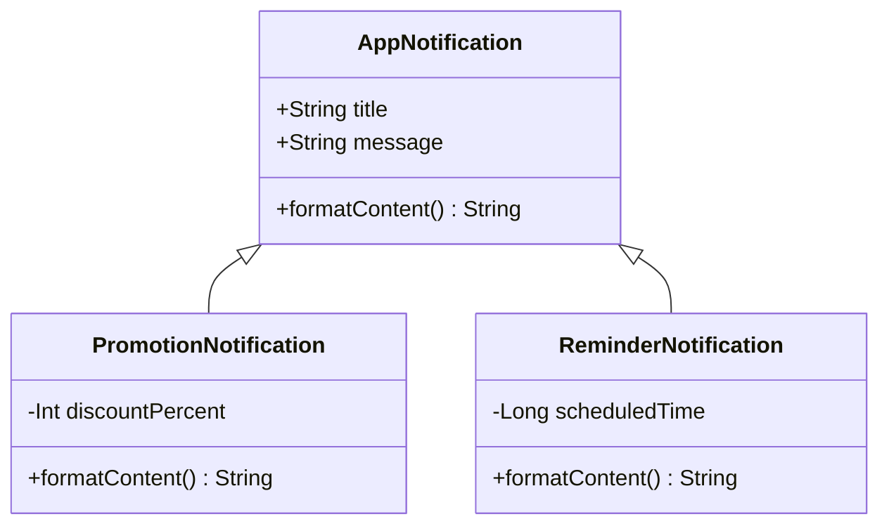
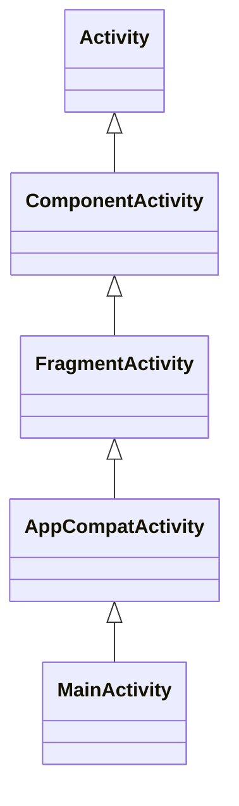
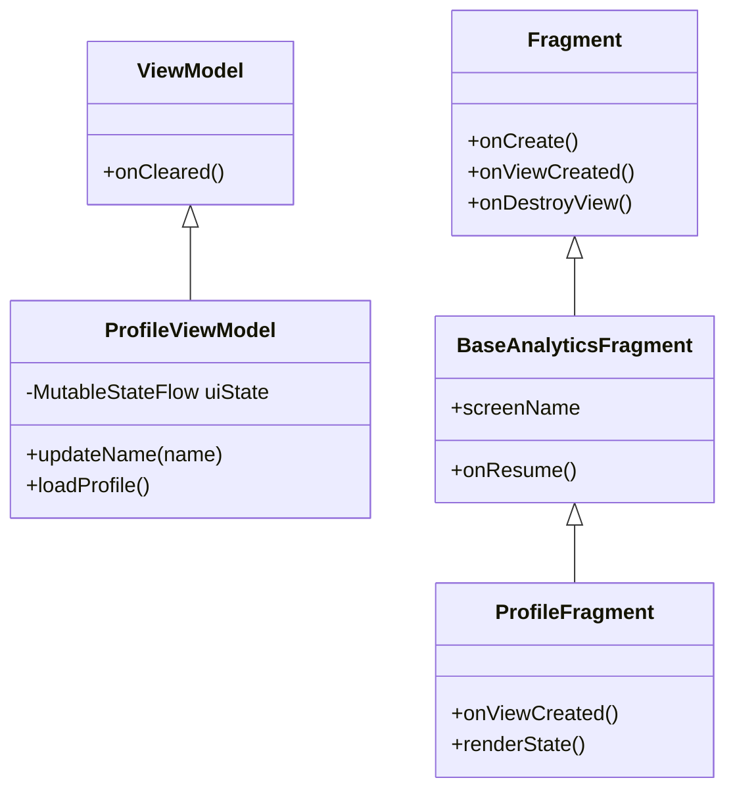
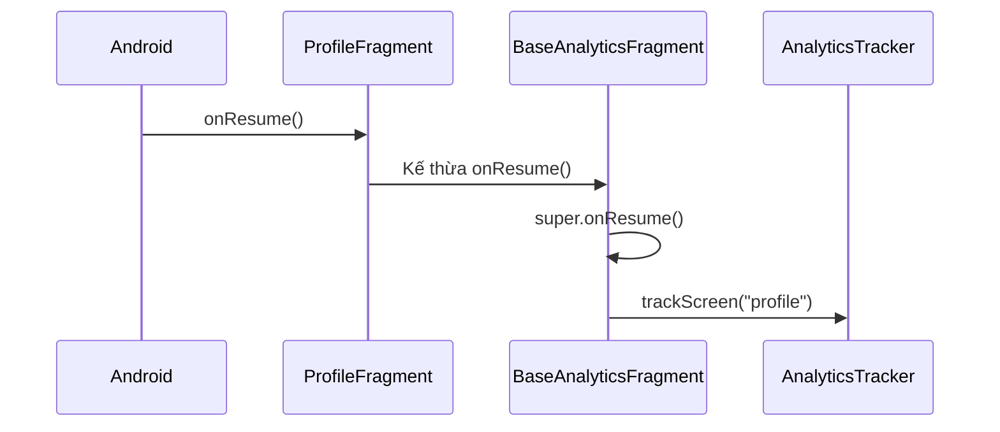
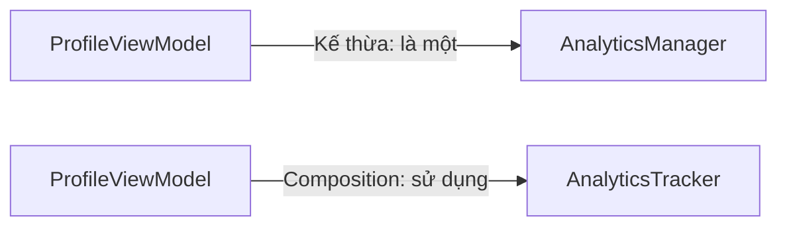

# 011 — Inheritance trong Kotlin và Android


> **Học phần:** 01 — Language and Android Fundamentals
> **Module:** Module 02 — Android Fundamentals
> **Nhóm nội dung:** Kotlin and OOP Basics
> **Nguồn roadmap:** Android Fundamentals / Kotlin and OOP Basics
> **Loại bài:** Lesson
> **Thứ tự trong module:** 011
> **Thời lượng gợi ý:** 24 phút

---

## 1. Tóm tắt

**Inheritance — tính kế thừa** là một đặc điểm của lập trình hướng đối tượng, cho phép một lớp mới sử dụng lại và mở rộng thuộc tính, hàm hoặc hành vi của một lớp đã tồn tại.

Trong Kotlin:

* Lớp được kế thừa gọi là **lớp cha**, **base class** hoặc **superclass**.
* Lớp kế thừa gọi là **lớp con**, **derived class** hoặc **subclass**.
* Lớp và thành viên của lớp mặc định là `final`.
* Muốn cho phép kế thừa hoặc ghi đè, lập trình viên phải sử dụng từ khóa `open`.
* Lớp con sử dụng từ khóa `override` khi ghi đè một thành viên của lớp cha. ([Kotlin][1])

Trong Android, kế thừa xuất hiện ngay từ những thành phần cơ bản:

```kotlin
class MainActivity : AppCompatActivity()
```

```kotlin
class HomeFragment : Fragment()
```

```kotlin
class HomeViewModel : ViewModel()
```

Kế thừa giúp tích hợp lớp của ứng dụng với Android Framework. Tuy nhiên, nếu lạm dụng, nó có thể tạo ra hệ thống phân cấp lớp quá sâu, khó kiểm thử, khó bảo trì và dễ gây lỗi liên quan đến lifecycle.

---

## 2. Mục tiêu học tập

Sau bài học, anh có thể:

1. Giải thích được tính kế thừa bằng ngôn ngữ của mình.
2. Phân biệt lớp cha và lớp con.
3. Sử dụng đúng các từ khóa:

   * `open`
   * `override`
   * `abstract`
   * `final`
   * `super`
4. Truyền tham số từ lớp con vào constructor của lớp cha.
5. Nhận biết kế thừa trong `Activity`, `Fragment` và `ViewModel`.
6. Phân biệt kế thừa với interface và composition.
7. Nhận biết các lỗi kế thừa thường gặp trong ứng dụng Android.
8. Viết unit test cho hành vi được kế thừa hoặc ghi đè.

---

## 3. Ghi nhớ trong 5 dòng

> Kế thừa cho phép một lớp con sử dụng lại hành vi của lớp cha.
> Trong Kotlin, lớp và hàm mặc định không thể bị kế thừa hoặc ghi đè.
> Dùng `open` để cho phép kế thừa và dùng `override` để ghi đè hành vi.
> Trong Android, `Activity`, `Fragment` và `ViewModel` đều thường được sử dụng thông qua kế thừa.
> Chỉ nên dùng kế thừa khi lớp con thực sự có quan hệ **“là một”** với lớp cha.

---

## 4. Khái niệm lớp cha và lớp con

Xét một ứng dụng có nhiều loại thông báo:

```kotlin
open class AppNotification(
    val title: String,
    val message: String
) {
    open fun formatContent(): String {
        return "$title: $message"
    }
}
```

Lớp `AppNotification` là lớp cha. Từ khóa `open` cho phép lớp khác kế thừa nó.

```kotlin
class PromotionNotification(
    title: String,
    message: String,
    private val discountPercent: Int
) : AppNotification(title, message) {

    override fun formatContent(): String {
        return "${super.formatContent()} — Giảm $discountPercent%"
    }
}
```

Trong ví dụ trên:

| Thành phần               | Ý nghĩa                            |
| ------------------------ | ---------------------------------- |
| `AppNotification`        | Lớp cha                            |
| `PromotionNotification`  | Lớp con                            |
| `: AppNotification(...)` | Kế thừa và gọi constructor lớp cha |
| `open fun`               | Hàm được phép ghi đè               |
| `override fun`           | Hàm ghi đè hành vi của lớp cha     |
| `super.formatContent()`  | Gọi phiên bản hàm thuộc lớp cha    |

### Sử dụng

```kotlin
fun main() {
    val notification = PromotionNotification(
        title = "Ưu đãi hôm nay",
        message = "Áp dụng cho thành viên mới",
        discountPercent = 20
    )

    println(notification.formatContent())
}
```

Kết quả:

```text
Ưu đãi hôm nay: Áp dụng cho thành viên mới — Giảm 20%
```

---

## 5. Sơ đồ kế thừa cơ bản



Sơ đồ dạng văn bản:

```text
                    AppNotification
                           │
             ┌─────────────┴─────────────┐
             │                           │
 PromotionNotification        ReminderNotification
```

Mũi tên hướng về lớp cha thể hiện rằng hai lớp phía dưới kế thừa từ `AppNotification`.

---

## 6. Vì sao Kotlin sử dụng `final` mặc định?

Trong một số ngôn ngữ hướng đối tượng, lớp có thể được kế thừa mặc định. Kotlin chọn cách ngược lại: lớp và thành viên mặc định là `final`.

Đoạn mã sau không thể được kế thừa:

```kotlin
class UserRepository
```

```kotlin
class CachedUserRepository : UserRepository()
// Lỗi: UserRepository là final
```

Muốn cho phép kế thừa:

```kotlin
open class UserRepository
```

Kotlin yêu cầu lập trình viên chủ động thiết kế lớp để được kế thừa, thay vì vô tình tạo ra những điểm mở rộng không được kiểm soát. ([Kotlin][1])

---

## 7. Từ khóa `open`

### 7.1. Mở lớp để cho phép kế thừa

```kotlin
open class Animal
```

### 7.2. Mở hàm để cho phép ghi đè

```kotlin
open class Animal {

    open fun move(): String {
        return "Đang di chuyển"
    }
}
```

```kotlin
class Fish : Animal() {

    override fun move(): String {
        return "Đang bơi"
    }
}
```

Không phải mọi hàm trong lớp `open` đều tự động được ghi đè.

Ví dụ:

```kotlin
open class Animal {

    fun eat() {
        println("Đang ăn")
    }
}
```

Hàm `eat()` vẫn là `final` vì không có từ khóa `open`.

---

## 8. Từ khóa `override`

`override` thông báo rằng lớp con đang cung cấp cách triển khai mới cho một thành viên của lớp cha.

```kotlin
open class AnalyticsEvent {

    open fun eventName(): String {
        return "unknown_event"
    }
}
```

```kotlin
class LoginEvent : AnalyticsEvent() {

    override fun eventName(): String {
        return "login"
    }
}
```

Việc bắt buộc sử dụng `override` giúp mã nguồn rõ ràng hơn:

* Người đọc biết đây không phải một hàm hoàn toàn mới.
* Trình biên dịch có thể phát hiện sai tên hàm hoặc sai kiểu dữ liệu.
* IDE có thể hỗ trợ điều hướng từ lớp con về lớp cha.

---

## 9. Ngăn lớp con tiếp tục ghi đè bằng `final`

Một thành viên đã được `override` vẫn có thể tiếp tục bị ghi đè ở lớp cháu.

```kotlin
open class BaseScreen {

    open fun screenName(): String {
        return "base"
    }
}
```

```kotlin
open class HomeScreen : BaseScreen() {

    override fun screenName(): String {
        return "home"
    }
}
```

Muốn khóa hành vi tại `HomeScreen`, sử dụng `final override`:

```kotlin
class DashboardScreen : BaseScreen() {

    final override fun screenName(): String {
        return "dashboard"
    }
}
```

Lúc này, lớp kế thừa từ `DashboardScreen` không thể ghi đè `screenName()`.

---

## 10. Sử dụng `super`

`super` được sử dụng để truy cập constructor, thuộc tính hoặc hàm của lớp cha.

### 10.1. Gọi hàm lớp cha

```kotlin
open class BaseLogger {

    open fun log(message: String) {
        println("[LOG] $message")
    }
}
```

```kotlin
class DebugLogger : BaseLogger() {

    override fun log(message: String) {
        super.log(message)
        println("[DEBUG] Đã ghi log thành công")
    }
}
```

Kết quả:

```text
[LOG] Người dùng đã đăng nhập
[DEBUG] Đã ghi log thành công
```

### 10.2. Gọi constructor lớp cha

```kotlin
open class User(
    val id: String,
    val name: String
)
```

```kotlin
class PremiumUser(
    id: String,
    name: String,
    val subscriptionLevel: Int
) : User(id, name)
```

`User(id, name)` là lời gọi constructor của lớp cha.

---

## 11. Lớp trừu tượng với `abstract`

Lớp trừu tượng mô tả một khuôn mẫu chung nhưng không được tạo đối tượng trực tiếp.

```kotlin
abstract class PaymentMethod {

    abstract fun pay(amount: Long): PaymentResult

    fun validateAmount(amount: Long): Boolean {
        return amount > 0
    }
}
```

Lớp con bắt buộc triển khai hàm `pay()`:

```kotlin
class CardPayment : PaymentMethod() {

    override fun pay(amount: Long): PaymentResult {
        if (!validateAmount(amount)) {
            return PaymentResult.Error("Số tiền không hợp lệ")
        }

        return PaymentResult.Success
    }
}
```

Mô hình kết quả:

```kotlin
sealed interface PaymentResult {

    data object Success : PaymentResult

    data class Error(
        val message: String
    ) : PaymentResult
}
```

Sử dụng:

```kotlin
val paymentMethod: PaymentMethod = CardPayment()
val result = paymentMethod.pay(500_000)
```

### `abstract` khác `open` như thế nào?

| `open`                                          | `abstract`                                        |
| ----------------------------------------------- | ------------------------------------------------- |
| Có thể chứa cách triển khai hoàn chỉnh          | Có thể chỉ khai báo mà chưa triển khai            |
| Lớp con không bắt buộc ghi đè                   | Lớp con bắt buộc triển khai thành viên trừu tượng |
| Có thể khởi tạo lớp nếu lớp không phải abstract | Không thể khởi tạo trực tiếp                      |
| Phù hợp khi có hành vi mặc định                 | Phù hợp khi chỉ muốn định nghĩa khuôn mẫu         |

---

## 12. Tính đa hình đi cùng kế thừa

Kế thừa cho phép một biến có kiểu lớp cha tham chiếu đến đối tượng thuộc lớp con.

```kotlin
open class AppNotification {

    open fun send(): String {
        return "Gửi thông báo thông thường"
    }
}
```

```kotlin
class PushNotification : AppNotification() {

    override fun send(): String {
        return "Gửi push notification"
    }
}
```

```kotlin
class EmailNotification : AppNotification() {

    override fun send(): String {
        return "Gửi email"
    }
}
```

```kotlin
fun sendNotification(notification: AppNotification) {
    println(notification.send())
}
```

```kotlin
sendNotification(PushNotification())
sendNotification(EmailNotification())
```

Kết quả phụ thuộc vào đối tượng thực tế:

```text
Gửi push notification
Gửi email
```

Đây là **đa hình lúc chạy**: cùng một lời gọi `send()`, nhưng hành vi khác nhau tùy lớp con.

---

## 13. Kế thừa trong Android Framework

### 13.1. Activity

```kotlin
class MainActivity : AppCompatActivity() {

    override fun onCreate(savedInstanceState: Bundle?) {
        super.onCreate(savedInstanceState)

        setContentView(R.layout.activity_main)
    }
}
```

Sơ đồ:



`MainActivity` kế thừa các khả năng liên quan đến:

* Quản lý cửa sổ ứng dụng.
* Nhận callback lifecycle.
* Xử lý trạng thái.
* Tích hợp Fragment.
* Tích hợp các thành phần tương thích của AndroidX.

### 13.2. Fragment

```kotlin
class ProfileFragment : Fragment(R.layout.fragment_profile) {

    override fun onViewCreated(
        view: View,
        savedInstanceState: Bundle?
    ) {
        super.onViewCreated(view, savedInstanceState)

        // Thiết lập giao diện sau khi View đã được tạo.
    }
}
```

Fragment đại diện cho một phần giao diện có lifecycle riêng nhưng phải được chứa trong Activity hoặc Fragment khác. ([Android Developers][2])

### 13.3. ViewModel

```kotlin
class ProfileViewModel : ViewModel() {

    private val _uiState = MutableStateFlow(ProfileUiState())
    val uiState: StateFlow<ProfileUiState> = _uiState.asStateFlow()

    fun updateName(name: String) {
        _uiState.update { currentState ->
            currentState.copy(name = name)
        }
    }
}
```

```kotlin
data class ProfileUiState(
    val name: String = "",
    val isLoading: Boolean = false,
    val errorMessage: String? = null
)
```

`ViewModel` được sử dụng như một bộ giữ trạng thái ở cấp màn hình và nơi chứa business logic liên quan đến giao diện. Nó có lifecycle dài hơn một instance giao diện cụ thể, vì vậy không nên giữ tham chiếu trực tiếp đến `Activity`, `Fragment` hoặc `View`. ([Android Developers][3])

---

## 14. Sơ đồ kế thừa trong một ứng dụng Android



---

## 15. Ví dụ Android: tạo `BaseAnalyticsFragment`

Giả sử ứng dụng cần ghi nhận tên màn hình mỗi khi một Fragment được hiển thị.

### 15.1. Analytics tracker

```kotlin
interface AnalyticsTracker {

    fun trackScreen(screenName: String)
}
```

```kotlin
class LogcatAnalyticsTracker : AnalyticsTracker {

    override fun trackScreen(screenName: String) {
        Log.d("Analytics", "Screen viewed: $screenName")
    }
}
```

### 15.2. Lớp Fragment cơ sở

```kotlin
abstract class BaseAnalyticsFragment(
    @LayoutRes layoutId: Int
) : Fragment(layoutId) {

    protected abstract val screenName: String

    private val analyticsTracker: AnalyticsTracker =
        LogcatAnalyticsTracker()

    override fun onResume() {
        super.onResume()
        analyticsTracker.trackScreen(screenName)
    }
}
```

### 15.3. Fragment cụ thể

```kotlin
class ProfileFragment :
    BaseAnalyticsFragment(R.layout.fragment_profile) {

    override val screenName: String = "profile"

    override fun onViewCreated(
        view: View,
        savedInstanceState: Bundle?
    ) {
        super.onViewCreated(view, savedInstanceState)

        // Thiết lập giao diện Profile.
    }
}
```

### Luồng hoạt động



### Lợi ích

* Không cần lặp lại mã analytics trong từng Fragment.
* Mỗi Fragment chỉ cần cung cấp `screenName`.
* Logic ghi nhận màn hình nằm ở một vị trí chung.

### Hạn chế

* Mỗi Fragment chỉ có thể kế thừa một lớp cha.
* Lớp cơ sở có thể dần chứa quá nhiều trách nhiệm.
* Dependency `AnalyticsTracker` bị tạo cứng bên trong lớp, gây khó kiểm thử.
* Hành vi tự động chạy trong lifecycle có thể khó nhận biết khi đọc lớp con.

---

## 16. Phiên bản dễ kiểm thử hơn

Thay vì khởi tạo dependency trực tiếp:

```kotlin
private val analyticsTracker = LogcatAnalyticsTracker()
```

Có thể truyền dependency qua constructor:

```kotlin
abstract class BaseAnalyticsFragment(
    @LayoutRes layoutId: Int,
    private val analyticsTracker: AnalyticsTracker
) : Fragment(layoutId) {

    protected abstract val screenName: String

    override fun onResume() {
        super.onResume()
        analyticsTracker.trackScreen(screenName)
    }
}
```

Tuy nhiên, Android Framework thường cần constructor không tham số để tái tạo Fragment. Trong ứng dụng thực tế, dependency nên được cung cấp qua:

* Hilt.
* FragmentFactory.
* Service locator có kiểm soát.
* Property injection phù hợp với kiến trúc dự án.

Không nên tự thêm constructor tùy ý vào Fragment mà chưa xem xét quá trình Android khôi phục Fragment.

---

## 17. Lỗi nghiêm trọng: quên gọi `super`

Xét đoạn mã:

```kotlin
class MainActivity : AppCompatActivity() {

    override fun onCreate(savedInstanceState: Bundle?) {
        setContentView(R.layout.activity_main)
    }
}
```

Đoạn mã thiếu:

```kotlin
super.onCreate(savedInstanceState)
```

Phiên bản đúng:

```kotlin
class MainActivity : AppCompatActivity() {

    override fun onCreate(savedInstanceState: Bundle?) {
        super.onCreate(savedInstanceState)
        setContentView(R.layout.activity_main)
    }
}
```

Các callback lifecycle của Android không phải là những hàm bình thường hoàn toàn độc lập. Lớp cha có thể cần thực hiện logic nội bộ để:

* Khởi tạo trạng thái.
* Kết nối lifecycle.
* Khôi phục dữ liệu.
* Quản lý Fragment.
* Thiết lập các thành phần framework.

Không phải mọi hàm ghi đè đều bắt buộc gọi `super`, nhưng với lifecycle callback, cần đọc contract của API trước khi bỏ lời gọi này.

---

## 18. Thứ tự gọi `super`

Thứ tự gọi `super` có thể ảnh hưởng đến hành vi.

### Gọi lớp cha trước

```kotlin
override fun onStart() {
    super.onStart()
    startObservingData()
}
```

Ý nghĩa:

1. Hoàn thành logic khởi động của framework.
2. Sau đó bắt đầu logic của ứng dụng.

### Dọn tài nguyên trước rồi gọi lớp cha

```kotlin
override fun onDestroyView() {
    binding = null
    super.onDestroyView()
}
```

Hoặc trong nhiều dự án:

```kotlin
override fun onDestroyView() {
    super.onDestroyView()
    binding = null
}
```

Thứ tự phù hợp phụ thuộc vào loại tài nguyên và contract của lớp cha. Điều quan trọng là cả nhóm phải sử dụng một quy ước nhất quán và kiểm thử hành vi lifecycle.

---

## 19. Ví dụ quản lý View Binding trong lớp cơ sở

```kotlin
abstract class BaseBindingFragment<VB : ViewBinding>(
    @LayoutRes layoutId: Int
) : Fragment(layoutId) {

    private var _binding: VB? = null

    protected val binding: VB
        get() = requireNotNull(_binding) {
            "Chỉ được truy cập binding giữa onViewCreated và onDestroyView"
        }

    protected abstract fun bindView(view: View): VB

    override fun onViewCreated(
        view: View,
        savedInstanceState: Bundle?
    ) {
        super.onViewCreated(view, savedInstanceState)
        _binding = bindView(view)
    }

    override fun onDestroyView() {
        _binding = null
        super.onDestroyView()
    }
}
```

Lớp con:

```kotlin
class ProfileFragment :
    BaseBindingFragment<FragmentProfileBinding>(
        R.layout.fragment_profile
    ) {

    override fun bindView(
        view: View
    ): FragmentProfileBinding {
        return FragmentProfileBinding.bind(view)
    }

    override fun onViewCreated(
        view: View,
        savedInstanceState: Bundle?
    ) {
        super.onViewCreated(view, savedInstanceState)

        binding.saveButton.setOnClickListener {
            saveProfile()
        }
    }

    private fun saveProfile() {
        // Xử lý lưu hồ sơ.
    }
}
```

View Binding tạo một binding class cho mỗi XML layout và cung cấp tham chiếu trực tiếp đến các View có `id`. ([Android Developers][4])

### Rủi ro cần lưu ý

Fragment sống lâu hơn View của nó. Sau `onDestroyView()`, đối tượng Fragment có thể vẫn tồn tại nhưng View đã bị hủy. Vì vậy, giữ binding sau thời điểm này có thể dẫn đến rò rỉ bộ nhớ hoặc truy cập View không còn hợp lệ.

---

## 20. Kế thừa và trạng thái giao diện

Kế thừa không tự động giải quyết vấn đề trạng thái.

Ví dụ sau vẫn mất dữ liệu khi Activity bị tạo lại:

```kotlin
class MainActivity : AppCompatActivity() {

    private var searchQuery: String = ""

    override fun onCreate(savedInstanceState: Bundle?) {
        super.onCreate(savedInstanceState)
        setContentView(R.layout.activity_main)
    }
}
```

Khi thiết bị xoay màn hình, Activity cũ có thể bị hủy và một Activity mới được tạo.

Có thể quản lý trạng thái màn hình trong `ViewModel`:

```kotlin
class SearchViewModel : ViewModel() {

    private val _query = MutableStateFlow("")
    val query: StateFlow<String> = _query.asStateFlow()

    fun updateQuery(value: String) {
        _query.value = value
    }
}
```

Kế thừa cung cấp callback lifecycle, nhưng lập trình viên vẫn phải lựa chọn nơi lưu trạng thái phù hợp. ViewModel cung cấp API quản lý dữ liệu giao diện theo lifecycle và thường được giữ qua các thay đổi cấu hình trong phạm vi tương ứng. ([Android Developers][5])

---

## 21. Kế thừa đơn và đa kế thừa

Kotlin không cho phép một lớp kế thừa đồng thời nhiều lớp cha.

Đoạn mã giả sau không hợp lệ:

```kotlin
class ProfileScreen : BaseScreen(), AnalyticsScreen()
```

Một lớp chỉ có một superclass:

```kotlin
class ProfileScreen : BaseScreen()
```

Tuy nhiên, lớp có thể triển khai nhiều interface:

```kotlin
class ProfileScreen :
    BaseScreen(),
    Trackable,
    Refreshable
```

```kotlin
interface Trackable {
    fun trackScreen()
}
```

```kotlin
interface Refreshable {
    fun refresh()
}
```

Interface trong Kotlin cũng có thể kế thừa interface khác. ([Kotlin][6])

---

## 22. Giải quyết xung đột giữa các interface

Hai interface có thể cung cấp cùng một hàm mặc định.

```kotlin
interface LocalLogger {

    fun log() {
        println("Local log")
    }
}
```

```kotlin
interface RemoteLogger {

    fun log() {
        println("Remote log")
    }
}
```

Lớp triển khai cả hai phải tự giải quyết xung đột:

```kotlin
class AppLogger : LocalLogger, RemoteLogger {

    override fun log() {
        super<LocalLogger>.log()
        super<RemoteLogger>.log()
        println("Combined log")
    }
}
```

Cú pháp:

```kotlin
super<TenInterface>.tenHam()
```

cho phép chọn cách triển khai của một interface cụ thể.

---

## 23. Kế thừa và interface khác nhau thế nào?

| Kế thừa lớp                             | Triển khai interface                              |
| --------------------------------------- | ------------------------------------------------- |
| Dùng để chia sẻ trạng thái và hành vi   | Chủ yếu mô tả khả năng hoặc contract              |
| Chỉ có một lớp cha trực tiếp            | Có thể triển khai nhiều interface                 |
| Có thể chứa constructor                 | Interface không có constructor như lớp            |
| Có thể chứa thuộc tính có backing field | Interface không lưu trạng thái bằng backing field |
| Thể hiện quan hệ “là một”               | Thể hiện khả năng “có thể làm gì”                 |

Ví dụ:

```kotlin
open class User
```

```kotlin
interface Shareable {
    fun share()
}
```

```kotlin
class PremiumUser : User(), Shareable {

    override fun share() {
        println("Chia sẻ nội dung")
    }
}
```

`PremiumUser` **là một** `User` và **có khả năng** `Shareable`.

---

## 24. Kế thừa và composition

### 24.1. Kế thừa

```kotlin
open class AnalyticsManager {

    fun track(event: String) {
        println(event)
    }
}
```

```kotlin
class ProfileViewModel : AnalyticsManager() {

    fun saveProfile() {
        track("profile_saved")
    }
}
```

Ở đây, `ProfileViewModel` trở thành một loại `AnalyticsManager`. Về mặt mô hình hóa, quan hệ này không hợp lý vì ViewModel không thực sự **là một** AnalyticsManager.

### 24.2. Composition

```kotlin
interface AnalyticsTracker {

    fun track(event: String)
}
```

```kotlin
class ProfileViewModel(
    private val analyticsTracker: AnalyticsTracker
) : ViewModel() {

    fun saveProfile() {
        analyticsTracker.track("profile_saved")
    }
}
```

Ở đây, `ProfileViewModel` **có một** `AnalyticsTracker`.

### So sánh



Composition thường phù hợp hơn khi:

* Hai lớp không có quan hệ “là một”.
* Cần thay thế dependency trong unit test.
* Muốn thay đổi implementation lúc chạy.
* Muốn tránh lớp cha chứa quá nhiều trách nhiệm.
* Muốn các thành phần ít phụ thuộc vào nhau.

---

## 25. Extension function như một lựa chọn khác

Kotlin hỗ trợ extension function để bổ sung cách gọi hàm cho một kiểu mà không cần tạo lớp con. ([Kotlin][7])

Ví dụ, thay vì tạo một lớp con chỉ để định dạng giá:

```kotlin
fun Long.toVietnameseCurrency(): String {
    return "%,d ₫".format(this)
}
```

Sử dụng:

```kotlin
val price = 500_000L
println(price.toVietnameseCurrency())
```

Không nên tạo một lớp kế thừa chỉ để thêm một tiện ích không liên quan đến bản chất của lớp.

---

## 26. Khi nào nên dùng kế thừa?

Nên cân nhắc kế thừa khi:

1. Lớp con thực sự là một dạng cụ thể của lớp cha.
2. Lớp cha cung cấp một contract ổn định.
3. Lớp con cần tham gia vào cơ chế framework.
4. Có hành vi chung rõ ràng giữa các lớp.
5. Hệ thống phân cấp nhỏ, dễ hiểu và dễ kiểm thử.

Ví dụ phù hợp:

```text
MainActivity là một AppCompatActivity.
ProfileFragment là một Fragment.
ProfileViewModel là một ViewModel.
CardPayment là một PaymentMethod.
```

---

## 27. Khi nào không nên dùng kế thừa?

Không nên sử dụng kế thừa chỉ vì muốn dùng lại vài dòng mã.

Dấu hiệu thiết kế có vấn đề:

* Lớp cha có hàng chục hàm `open`.
* Lớp con chỉ sử dụng một phần nhỏ hành vi của lớp cha.
* Lớp con phải ghi đè nhiều hàm để vô hiệu hóa hành vi.
* Thay đổi lớp cha thường xuyên làm hỏng lớp con.
* Cấu trúc có dạng:

```text
BaseActivity
└── BaseBindingActivity
    └── BaseLoadingActivity
        └── BaseAnalyticsActivity
            └── BaseAuthenticatedActivity
                └── ProfileActivity
```

Hệ thống phân cấp quá sâu khiến lập trình viên khó xác định:

* Hàm nào thực sự được chạy.
* Trạng thái được tạo ở lớp nào.
* Dependency được khởi tạo ở đâu.
* Callback lifecycle bị ghi đè bao nhiêu lần.
* Lỗi xuất phát từ lớp cha hay lớp con.

---

## 28. Sai lầm phổ biến của lập trình viên Android mới

### 28.1. Quên `open`

```kotlin
class BaseRepository
```

```kotlin
class UserRepository : BaseRepository()
// Không thể kế thừa vì BaseRepository là final.
```

Sửa:

```kotlin
open class BaseRepository
```

---

### 28.2. Quên `override`

```kotlin
open class BaseScreen {

    open fun loadData() = Unit
}
```

```kotlin
class HomeScreen : BaseScreen() {

    fun loadData() = Unit
}
```

Kotlin sẽ báo lỗi vì hàm đang che khuất thành viên của lớp cha nhưng không khai báo `override`.

Sửa:

```kotlin
override fun loadData() = Unit
```

---

### 28.3. Quên gọi `super`

```kotlin
override fun onCreate(savedInstanceState: Bundle?) {
    setContentView(R.layout.activity_main)
}
```

Sửa:

```kotlin
override fun onCreate(savedInstanceState: Bundle?) {
    super.onCreate(savedInstanceState)
    setContentView(R.layout.activity_main)
}
```

---

### 28.4. Lớp cha biết quá nhiều về lớp con

Không tốt:

```kotlin
open class BaseActivity : AppCompatActivity() {

    protected fun loadUserProfile() = Unit

    protected fun loadShoppingCart() = Unit

    protected fun startPayment() = Unit

    protected fun loadAstrologyChart() = Unit

    protected fun loadTarotReading() = Unit
}
```

Lớp cơ sở đang chứa nhiều tính năng không liên quan.

Tốt hơn:

```kotlin
class ProfileViewModel(
    private val profileRepository: ProfileRepository
) : ViewModel()
```

```kotlin
class PaymentViewModel(
    private val paymentRepository: PaymentRepository
) : ViewModel()
```

---

### 28.5. Lưu `Activity` hoặc `View` trong ViewModel

Không tốt:

```kotlin
class ProfileViewModel(
    private val activity: Activity
) : ViewModel()
```

ViewModel thường có lifecycle dài hơn giao diện. Giữ tham chiếu đến Activity hoặc View có thể khiến đối tượng giao diện không được thu hồi đúng lúc. Android khuyến cáo ViewModel không nên tham chiếu đến View, Lifecycle hoặc lớp có khả năng giữ Activity Context. ([Android Developers][5])

Tốt hơn:

```kotlin
class ProfileViewModel(
    private val repository: ProfileRepository
) : ViewModel()
```

UI chịu trách nhiệm hiển thị:

```kotlin
viewModel.uiState.collect { state ->
    binding.nameTextView.text = state.name
}
```

---

### 28.6. Kế thừa chỉ để dùng một hàm tiện ích

Không tốt:

```kotlin
open class DateUtils {

    fun formatDate(timestamp: Long): String {
        return timestamp.toString()
    }
}
```

```kotlin
class ProfileViewModel : DateUtils()
```

Tốt hơn:

```kotlin
interface DateFormatter {

    fun format(timestamp: Long): String
}
```

```kotlin
class ProfileViewModel(
    private val dateFormatter: DateFormatter
) : ViewModel()
```

---

## 29. Ảnh hưởng đến UX và độ ổn định

Kế thừa là cấu trúc mã nguồn, nhưng cách sử dụng nó có thể ảnh hưởng trực tiếp đến người dùng.

| Vấn đề kỹ thuật                    | Ảnh hưởng đến người dùng                         |
| ---------------------------------- | ------------------------------------------------ |
| Quên gọi `super.onCreate()`        | Màn hình có thể lỗi khi mở                       |
| Xử lý sai lifecycle                | Ứng dụng crash khi quay lại màn hình             |
| Không xóa View Binding             | Rò rỉ bộ nhớ, ứng dụng chậm dần                  |
| Lớp cha tự động gọi API nhiều lần  | Tải dữ liệu lặp, tốn mạng                        |
| Nhiều lớp cùng hiển thị loading    | Spinner nhấp nháy hoặc không biến mất            |
| Trạng thái đặt nhầm trong Activity | Dữ liệu mất khi xoay màn hình                    |
| Base class bắt mọi lỗi             | Người dùng không nhận được thông báo lỗi phù hợp |
| Hệ thống kế thừa quá sâu           | Sửa một tính năng làm hỏng nhiều màn hình        |

---

## 30. Kiểm thử tính kế thừa

### 30.1. Unit test hành vi ghi đè

```kotlin
open class NotificationFormatter {

    open fun format(message: String): String {
        return message
    }
}
```

```kotlin
class ErrorNotificationFormatter : NotificationFormatter() {

    override fun format(message: String): String {
        return "Lỗi: $message"
    }
}
```

Test:

```kotlin
class ErrorNotificationFormatterTest {

    private val formatter = ErrorNotificationFormatter()

    @Test
    fun `format adds error prefix`() {
        val result = formatter.format("Không thể kết nối")

        assertEquals(
            "Lỗi: Không thể kết nối",
            result
        )
    }
}
```

### 30.2. Kiểm thử tính đa hình

```kotlin
class NotificationFormatterTest {

    @Test
    fun `subclass implementation is called through base type`() {
        val formatter: NotificationFormatter =
            ErrorNotificationFormatter()

        val result = formatter.format("Hết phiên đăng nhập")

        assertEquals(
            "Lỗi: Hết phiên đăng nhập",
            result
        )
    }
}
```

### 30.3. Fake dependency thay vì kế thừa phức tạp

```kotlin
class FakeAnalyticsTracker : AnalyticsTracker {

    val trackedEvents = mutableListOf<String>()

    override fun track(event: String) {
        trackedEvents += event
    }
}
```

```kotlin
class ProfileViewModelTest {

    @Test
    fun `save profile tracks analytics event`() {
        val analytics = FakeAnalyticsTracker()

        val viewModel = ProfileViewModel(
            analyticsTracker = analytics
        )

        viewModel.saveProfile()

        assertEquals(
            listOf("profile_saved"),
            analytics.trackedEvents
        )
    }
}
```

Ví dụ này cho thấy composition thường tạo unit test đơn giản hơn việc phải xây dựng một chuỗi lớp cha–lớp con phức tạp.

---

## 31. Bài thực hành nhỏ

### Yêu cầu

Xây dựng hệ thống hiển thị trạng thái tải dữ liệu gồm ba trạng thái:

* Đang tải.
* Thành công.
* Thất bại.

### Bước 1: Tạo lớp cha

```kotlin
abstract class LoadState {

    abstract fun displayMessage(): String
}
```

### Bước 2: Tạo các lớp con

```kotlin
class LoadingState : LoadState() {

    override fun displayMessage(): String {
        return "Đang tải dữ liệu..."
    }
}
```

```kotlin
class SuccessState(
    private val itemCount: Int
) : LoadState() {

    override fun displayMessage(): String {
        return "Đã tải $itemCount mục"
    }
}
```

```kotlin
class ErrorState(
    private val error: String
) : LoadState() {

    override fun displayMessage(): String {
        return "Không thể tải dữ liệu: $error"
    }
}
```

### Bước 3: Hàm render chung

```kotlin
fun renderState(state: LoadState) {
    println(state.displayMessage())
}
```

### Bước 4: Kiểm tra

```kotlin
renderState(LoadingState())
renderState(SuccessState(itemCount = 12))
renderState(ErrorState(error = "Mất kết nối mạng"))
```

Kết quả:

```text
Đang tải dữ liệu...
Đã tải 12 mục
Không thể tải dữ liệu: Mất kết nối mạng
```

### Gợi ý thiết kế hiện đại hơn

Với một tập trạng thái hữu hạn, `sealed class` hoặc `sealed interface` thường phù hợp hơn vì compiler có thể biết toàn bộ các lớp con trực tiếp. ([Kotlin][8])

```kotlin
sealed interface LoadState {

    data object Loading : LoadState

    data class Success(
        val itemCount: Int
    ) : LoadState

    data class Error(
        val message: String
    ) : LoadState
}
```

Render:

```kotlin
fun renderState(state: LoadState): String {
    return when (state) {
        LoadState.Loading ->
            "Đang tải dữ liệu..."

        is LoadState.Success ->
            "Đã tải ${state.itemCount} mục"

        is LoadState.Error ->
            "Không thể tải dữ liệu: ${state.message}"
    }
}
```

---

## 32. Bài tập

### Bài 1 — Cơ bản

Tạo lớp `MediaItem` gồm:

```text
id
title
duration
play()
```

Tạo hai lớp con:

```text
AudioItem
VideoItem
```

Mỗi lớp ghi đè `play()` với thông báo khác nhau.

---

### Bài 2 — Android

Tạo lớp:

```kotlin
abstract class BaseViewModel : ViewModel()
```

Thêm hàm dùng chung để ghi log lỗi.

Sau đó tạo:

```text
LoginViewModel
ProfileViewModel
```

Viết một đoạn phân tích ngắn trả lời:

1. Việc đặt log trong lớp cha có hợp lý không?
2. Có nên dùng `ErrorLogger` dưới dạng dependency thay thế không?
3. Cách nào dễ unit test hơn?

---

### Bài 3 — Lifecycle

Cho đoạn mã:

```kotlin
class DetailFragment : Fragment(R.layout.fragment_detail) {

    override fun onViewCreated(
        view: View,
        savedInstanceState: Bundle?
    ) {
        binding = FragmentDetailBinding.bind(view)
    }
}
```

Hãy xác định:

* Thiếu lời gọi nào?
* Binding nên được xóa ở callback nào?
* Điều gì xảy ra nếu binding được giữ sau khi View bị hủy?

---

### Bài 4 — Refactor

Refactor đoạn mã sử dụng kế thừa sau sang composition:

```kotlin
open class NetworkHelper {

    fun isConnected(): Boolean {
        return true
    }
}
```

```kotlin
class LoginViewModel : NetworkHelper() {

    fun login() {
        if (isConnected()) {
            // Đăng nhập.
        }
    }
}
```

Mục tiêu:

```kotlin
class LoginViewModel(
    private val networkChecker: NetworkChecker
) : ViewModel()
```

---

## 33. Artifact nhỏ cho portfolio

Tạo một project Android có cấu trúc:

```text
inheritance-demo/
├── app/
│   ├── ui/
│   │   ├── BaseAnalyticsFragment.kt
│   │   ├── HomeFragment.kt
│   │   └── ProfileFragment.kt
│   ├── analytics/
│   │   ├── AnalyticsTracker.kt
│   │   └── LogcatAnalyticsTracker.kt
│   └── viewmodel/
│       └── ProfileViewModel.kt
├── test/
│   ├── FakeAnalyticsTracker.kt
│   └── ProfileViewModelTest.kt
└── README.md
```

README nên có:

```markdown
# Kotlin Inheritance Android Demo

## Mục tiêu

Minh họa cách Kotlin sử dụng `open`, `override`, `abstract`,
`super` và tính đa hình trong ứng dụng Android.

## Nội dung

- Một BaseAnalyticsFragment.
- Hai Fragment kế thừa lớp cơ sở.
- Một ViewModel sử dụng composition.
- Unit test cho AnalyticsTracker.
- Sơ đồ Mermaid mô tả quan hệ lớp.

## Bài học rút ra

Kế thừa phù hợp với quan hệ “là một”.
Composition phù hợp khi một lớp chỉ cần sử dụng khả năng của lớp khác.
```

---

## 34. Checklist hoàn thành

### Kiến thức Kotlin

* [ ] Giải thích được inheritance là gì.
* [ ] Phân biệt được lớp cha và lớp con.
* [ ] Biết lớp Kotlin mặc định là `final`.
* [ ] Biết sử dụng `open`.
* [ ] Biết sử dụng `override`.
* [ ] Biết sử dụng `abstract`.
* [ ] Biết sử dụng `super`.
* [ ] Biết truyền tham số vào constructor lớp cha.
* [ ] Hiểu đa hình thông qua lớp cha.

### Kiến thức Android

* [ ] Nhận biết kế thừa trong `Activity`.
* [ ] Nhận biết kế thừa trong `Fragment`.
* [ ] Nhận biết kế thừa trong `ViewModel`.
* [ ] Không giữ Activity hoặc View trong ViewModel.
* [ ] Biết kiểm tra yêu cầu gọi `super` trong lifecycle callback.
* [ ] Biết giải phóng View Binding đúng lifecycle.
* [ ] Biết trạng thái không tự được bảo toàn chỉ nhờ kế thừa.

### Thiết kế phần mềm

* [ ] Phân biệt được inheritance và interface.
* [ ] Phân biệt được inheritance và composition.
* [ ] Không tạo lớp cha chỉ để dùng lại vài hàm tiện ích.
* [ ] Tránh hệ thống phân cấp lớp quá sâu.
* [ ] Có unit test cho hành vi được ghi đè.
* [ ] Có README và sơ đồ kiến trúc cho project mẫu.

---

## 35. Checklist review trước production

Trước khi đưa một lớp cơ sở vào production, hãy kiểm tra:

```text
[ ] Lớp con có thật sự “là một” dạng của lớp cha không?
[ ] Lớp cha có đang chứa quá nhiều trách nhiệm không?
[ ] Hành vi lifecycle tự động có được ghi chú rõ không?
[ ] Lớp con có bắt buộc gọi super không?
[ ] Thứ tự gọi super có đúng không?
[ ] Có giữ Activity, Fragment, Context hoặc View quá lâu không?
[ ] State có bị mất khi rotate hoặc process recreation không?
[ ] API có bị gọi lặp bởi nhiều lớp trong hierarchy không?
[ ] Có thể thay kế thừa bằng interface hoặc composition không?
[ ] Có unit test cho từng hành vi override không?
[ ] Có instrumentation test cho lifecycle quan trọng không?
[ ] Thay đổi lớp cha có nguy cơ làm hỏng bao nhiêu màn hình?
```

---

## 36. Tổng kết

Inheritance là một công cụ quan trọng trong Kotlin và Android. Nó cho phép lớp con tái sử dụng, mở rộng hoặc thay đổi hành vi của lớp cha.

Cú pháp cốt lõi:

```kotlin
open class Parent {

    open fun execute() {
        println("Parent")
    }
}
```

```kotlin
class Child : Parent() {

    override fun execute() {
        super.execute()
        println("Child")
    }
}
```

Trong Android, kế thừa được sử dụng để ứng dụng tham gia vào framework:

```kotlin
class MainActivity : AppCompatActivity()
```

```kotlin
class HomeFragment : Fragment()
```

```kotlin
class HomeViewModel : ViewModel()
```

Nguyên tắc quan trọng nhất:

> **Dùng kế thừa cho quan hệ “là một”. Dùng composition cho quan hệ “có một” hoặc “sử dụng một”.**

Một thiết kế tốt không phải là thiết kế có nhiều lớp cha nhất, mà là thiết kế giúp hành vi rõ ràng, trạng thái an toàn, lifecycle có thể dự đoán và từng thành phần có thể kiểm thử độc lập.

[1]: https://kotlinlang.org/docs/inheritance.html?utm_source=chatgpt.com "Inheritance | Kotlin Documentation"
[2]: https://developer.android.com/guide/fragments?utm_source=chatgpt.com "Fragments | App architecture"
[3]: https://developer.android.com/topic/libraries/architecture/viewmodel?utm_source=chatgpt.com "ViewModel overview | App architecture"
[4]: https://developer.android.com/topic/libraries/view-binding?utm_source=chatgpt.com "View binding"
[5]: https://developer.android.com/topic/libraries/architecture/views/viewmodel?utm_source=chatgpt.com "ViewModel overview (Views)"
[6]: https://kotlinlang.org/docs/interfaces.html?utm_source=chatgpt.com "Interfaces | Kotlin Documentation"
[7]: https://kotlinlang.org/docs/extensions.html?utm_source=chatgpt.com "Extensions | Kotlin Documentation"
[8]: https://kotlinlang.org/docs/sealed-classes.html?utm_source=chatgpt.com "Sealed classes and interfaces"
