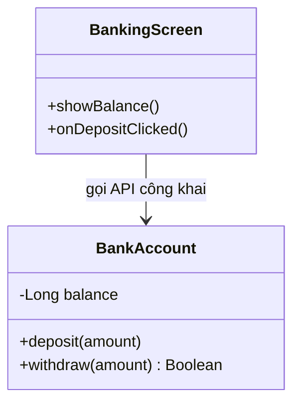
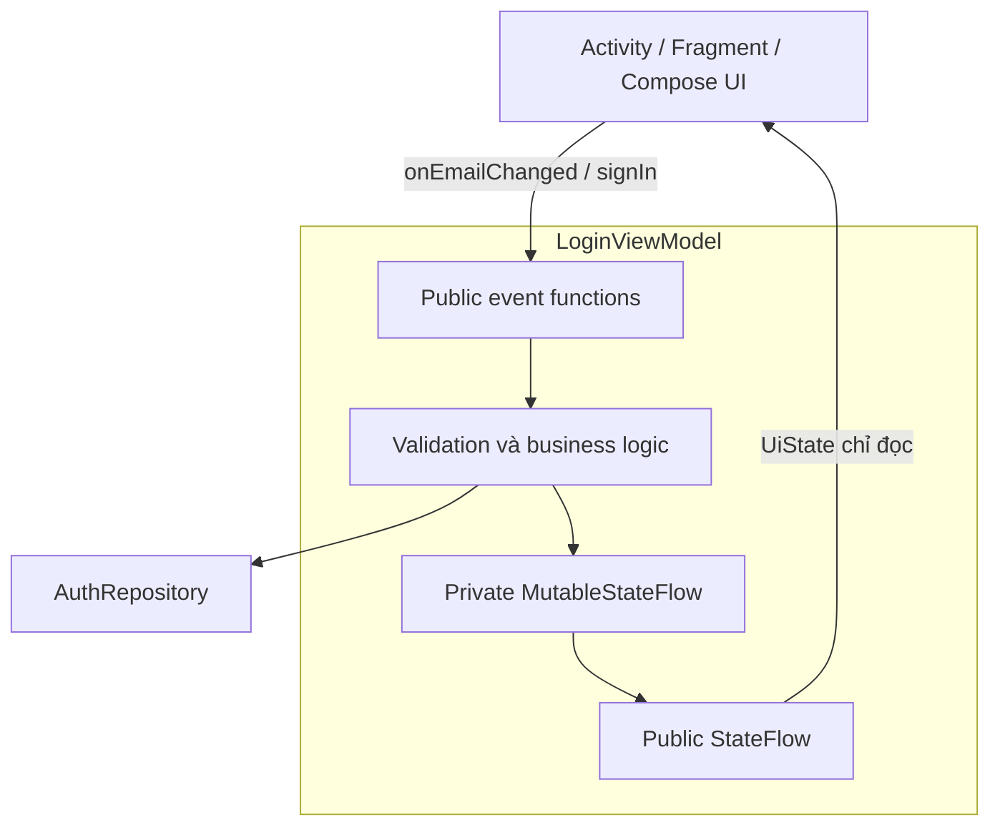
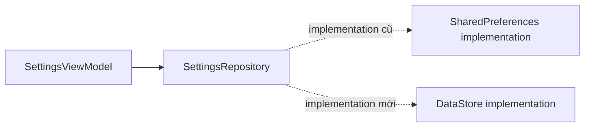

# 012 — Encapsulation trong Kotlin và Android


> **Học phần:** 01 — Language and Android Fundamentals
> **Module:** Module 02 — Android Fundamentals
> **Nhóm nội dung:** Kotlin and OOP Basics
> **Nguồn roadmap:** Android Fundamentals / Kotlin and OOP Basics
> **Loại bài:** Lesson
> **Thứ tự trong module:** 012
> **Thời lượng gợi ý:** 24 phút

---

## 1. Tóm tắt

**Encapsulation — tính đóng gói** là nguyên tắc gom dữ liệu và những thao tác liên quan vào cùng một lớp, đồng thời giới hạn cách các thành phần bên ngoài đọc hoặc thay đổi dữ liệu đó.

Một lớp được đóng gói tốt thường:

* Che giấu trạng thái nội bộ.
* Chỉ công khai những thao tác thật sự cần thiết.
* Kiểm tra dữ liệu trước khi thay đổi trạng thái.
* Không cho lớp bên ngoài đưa đối tượng vào trạng thái không hợp lệ.
* Có API nhỏ, rõ ràng và dễ kiểm thử.

Ví dụ, thay vì cho UI sửa trực tiếp trạng thái đăng nhập:

```kotlin
session.isLoggedIn = true
session.userId = ""
session.token = null
```

lớp `UserSession` nên cung cấp các hành động có ý nghĩa:

```kotlin
session.signIn(userId, token)
session.signOut()
```

Nhờ đó, mọi quy tắc liên quan đến đăng nhập được kiểm soát tại một nơi.

Trong Kotlin, encapsulation thường được thực hiện bằng:

* `private`
* `protected`
* `internal`
* `public`
* `private set`
* Getter và setter tùy chỉnh
* Thuộc tính chỉ đọc
* Interface
* Repository
* ViewModel
* Immutable UI state

Kotlin có bốn visibility modifier là `private`, `protected`, `internal` và `public`; nếu không ghi rõ thì mặc định là `public`. ([Kotlin][1])

---

## 2. Mục tiêu học tập

Sau bài học, người học có thể:

1. Giải thích được encapsulation bằng ngôn ngữ của mình.
2. Phân biệt che giấu dữ liệu với đóng gói hành vi.
3. Sử dụng đúng các visibility modifier trong Kotlin.
4. Dùng `private set` và getter/setter tùy chỉnh.
5. Không để UI sửa trực tiếp trạng thái của ViewModel.
6. Dùng Repository để che giấu nguồn dữ liệu.
7. Bảo vệ invariant — điều kiện luôn phải đúng của đối tượng.
8. Nhận biết encapsulation không đồng nghĩa với bảo mật tuyệt đối.
9. Viết unit test cho API công khai thay vì phụ thuộc vào chi tiết nội bộ.
10. Đánh giá ảnh hưởng của thiết kế đóng gói đến UX và độ ổn định.

---

## 3. Ghi nhớ trong 5 dòng

> Encapsulation giữ dữ liệu và logic thay đổi dữ liệu trong cùng một phạm vi kiểm soát.
> Trạng thái nội bộ nên để `private` và chỉ công khai những gì lớp bên ngoài cần dùng.
> Đối tượng nên được thay đổi qua các hàm có ý nghĩa thay vì sửa thuộc tính tùy ý.
> Trong Android, ViewModel và Repository là hai vị trí quan trọng để đóng gói state và business logic.
> Một API tốt cho phép sử dụng đối tượng mà không cần biết chi tiết nó hoạt động bên trong.

---

## 4. Encapsulation giải quyết vấn đề gì?

Xét một lớp tài khoản ngân hàng:

```kotlin
class BankAccount {
    var balance: Long = 0
}
```

Code bên ngoài có thể sửa số dư tùy ý:

```kotlin
val account = BankAccount()

account.balance = 1_000_000
account.balance = -999_999
```

Đối tượng đã rơi vào trạng thái không hợp lệ vì số dư có thể bị gán thành số âm mà không qua bất kỳ kiểm tra nào.

### Phiên bản được đóng gói

```kotlin
class BankAccount(
    initialBalance: Long = 0
) {
    var balance: Long = initialBalance
        private set

    init {
        require(initialBalance >= 0) {
            "Số dư ban đầu không được âm"
        }
    }

    fun deposit(amount: Long) {
        require(amount > 0) {
            "Số tiền nạp phải lớn hơn 0"
        }

        balance += amount
    }

    fun withdraw(amount: Long): Boolean {
        if (amount <= 0 || amount > balance) {
            return false
        }

        balance -= amount
        return true
    }
}
```

Code bên ngoài chỉ có thể đọc số dư:

```kotlin
println(account.balance)
```

Nhưng không thể gán trực tiếp:

```kotlin
account.balance = -100
// Lỗi: setter là private.
```

Mọi thay đổi phải đi qua:

```kotlin
account.deposit(500_000)
account.withdraw(200_000)
```

### Invariant của lớp

Lớp trên bảo vệ điều kiện:

```text
balance >= 0
```

Điều kiện phải luôn đúng này được gọi là **invariant**.

---

## 5. Sơ đồ encapsulation cơ bản



Luồng truy cập:

```text
Không đóng gói:

UI ────────────────> sửa trực tiếp balance


Có đóng gói:

UI ──> deposit() ──> kiểm tra dữ liệu ──> cập nhật balance
UI ──> withdraw() ─> kiểm tra số dư ────> cập nhật balance
```

---

## 6. Encapsulation không chỉ là `private`

Một cách hiểu chưa đầy đủ là:

> “Encapsulation chỉ có nghĩa là thêm từ khóa `private`.”

Trên thực tế, encapsulation gồm ba phần:

### 6.1. Che giấu chi tiết nội bộ

```kotlin
private var retryCount = 0
```

### 6.2. Công khai API có ý nghĩa

```kotlin
fun retry()
```

thay vì:

```kotlin
fun setRetryCount(value: Int)
```

### 6.3. Bảo vệ quy tắc của đối tượng

```kotlin
fun retry() {
    if (retryCount >= MAX_RETRY_COUNT) return

    retryCount++
    performRequest()
}
```

Encapsulation tốt không chỉ che dữ liệu mà còn giới hạn **những trạng thái và hành động hợp lệ**.

---

## 7. Visibility modifier trong Kotlin

Kotlin hỗ trợ bốn mức truy cập chính. ([Kotlin][1])

| Modifier           | Phạm vi truy cập                     |
| ------------------ | ------------------------------------ |
| `private`          | Chỉ bên trong lớp hoặc file khai báo |
| `protected`        | Bên trong lớp và các lớp con         |
| `internal`         | Mọi nơi trong cùng module            |
| `public`           | Mọi nơi có thể nhìn thấy declaration |
| Không ghi modifier | Mặc định là `public`                 |

---

## 8. `private`

### 8.1. Thành viên private trong lớp

```kotlin
class PasswordValidator {

    private val minimumLength = 8

    fun isValid(password: String): Boolean {
        return password.length >= minimumLength &&
            password.any(Char::isDigit)
    }
}
```

Code bên ngoài dùng:

```kotlin
val validator = PasswordValidator()
val valid = validator.isValid("android2026")
```

Nhưng không truy cập được:

```kotlin
validator.minimumLength
// Lỗi: minimumLength là private.
```

### 8.2. Declaration private ở top-level

```kotlin
private const val DEFAULT_TIMEOUT = 15_000L
```

Khi `private` được dùng cho declaration ở top-level, declaration đó chỉ hiển thị trong file Kotlin chứa nó. ([Kotlin][1])

---

## 9. `protected`

`protected` cho phép truy cập từ lớp hiện tại và lớp con.

```kotlin
open class BaseRequestHandler {

    protected fun validateToken(token: String): Boolean {
        return token.isNotBlank()
    }
}
```

```kotlin
class ProfileRequestHandler : BaseRequestHandler() {

    fun loadProfile(token: String) {
        if (!validateToken(token)) {
            return
        }

        // Thực hiện request.
    }
}
```

Code bên ngoài không thể gọi:

```kotlin
val handler = ProfileRequestHandler()
handler.validateToken("token")
// Lỗi: validateToken là protected.
```

Lưu ý: Kotlin không cho dùng `protected` với declaration ở top-level. ([Kotlin][1])

### Không nên lạm dụng `protected`

Quá nhiều thành viên `protected` khiến lớp con phụ thuộc sâu vào chi tiết nội bộ của lớp cha.

```kotlin
open class BaseViewModel {
    protected var loading = false
    protected var error: Throwable? = null
    protected var retryCount = 0
    protected var currentPage = 1
}
```

Lúc này, bất kỳ lớp con nào cũng có thể thay đổi các biến trên theo thứ tự tùy ý.

Tốt hơn:

```kotlin
open class BaseViewModel {

    private var retryCount = 0

    protected fun registerRetry(): Boolean {
        if (retryCount >= 3) return false

        retryCount++
        return true
    }
}
```

Lớp con được dùng hành vi nhưng không sửa trực tiếp trạng thái.

---

## 10. `internal`

`internal` cho phép declaration được truy cập trong cùng một **module Kotlin**.

```kotlin
internal class TokenParser {

    fun parse(rawToken: String): ParsedToken {
        return ParsedToken(rawToken)
    }
}
```

Ví dụ trong dự án Android nhiều module:

```text
app/
feature-login/
core-network/
core-database/
```

Một lớp `internal` trong `core-network` không trở thành API công khai cho tất cả module khác.

```kotlin
internal class RetrofitAuthInterceptor
```

### Khi nào nên dùng `internal`?

* Che giấu implementation của một module.
* Chỉ công khai interface.
* Giảm số lượng API mà module khác có thể phụ thuộc.
* Hạn chế coupling giữa các feature.

Ví dụ:

```kotlin
public interface AuthRepository {
    suspend fun signIn(
        email: String,
        password: String
    ): SignInResult
}
```

```kotlin
internal class DefaultAuthRepository(
    private val remoteDataSource: AuthRemoteDataSource
) : AuthRepository {

    override suspend fun signIn(
        email: String,
        password: String
    ): SignInResult {
        return remoteDataSource.signIn(email, password)
    }
}
```

Module khác chỉ cần biết `AuthRepository`, không cần biết `DefaultAuthRepository` hoạt động thế nào.

---

## 11. `public`

`public` là mức truy cập mặc định trong Kotlin.

Hai khai báo sau tương đương:

```kotlin
class User
```

```kotlin
public class User
```

Không nên để mọi thứ mặc định là `public` chỉ vì tiện.

Ví dụ không tốt:

```kotlin
class ProfileRepository {

    fun parseJson() = Unit

    fun mapDatabaseEntity() = Unit

    fun clearInternalCache() = Unit

    fun fetchProfile() = Unit
}
```

Ba hàm đầu có thể chỉ là chi tiết nội bộ nhưng lại bị công khai.

Phiên bản tốt hơn:

```kotlin
class ProfileRepository {

    suspend fun getProfile(): UserProfile {
        val response = fetchRemoteProfile()
        val entity = mapResponse(response)
        saveToDatabase(entity)

        return entity.toDomainModel()
    }

    private suspend fun fetchRemoteProfile(): ProfileResponse {
        TODO()
    }

    private fun mapResponse(
        response: ProfileResponse
    ): ProfileEntity {
        TODO()
    }

    private fun saveToDatabase(
        entity: ProfileEntity
    ) {
        TODO()
    }
}
```

---

## 12. Getter và setter trong Kotlin

Kotlin tự động tạo getter cho `val`, đồng thời tạo getter và setter cho `var`. Lập trình viên có thể thay đổi visibility hoặc cung cấp accessor tùy chỉnh. ([Kotlin][2])

```kotlin
class UserProfile {

    var displayName: String = ""
}
```

Kotlin cung cấp tương đương:

```text
getDisplayName()
setDisplayName(value)
```

### Setter tùy chỉnh

```kotlin
class UserProfile {

    var displayName: String = ""
        set(value) {
            field = value.trim()
        }
}
```

```kotlin
val profile = UserProfile()
profile.displayName = "  An Khánh  "

println(profile.displayName)
// An Khánh
```

`field` là backing field của thuộc tính hiện tại.

---

## 13. `private set`

`private set` cho phép lớp bên ngoài đọc thuộc tính nhưng chỉ lớp sở hữu mới được sửa.

```kotlin
class DownloadTask {

    var progress: Int = 0
        private set

    fun updateProgress(value: Int) {
        progress = value.coerceIn(0, 100)
    }
}
```

Sử dụng:

```kotlin
val task = DownloadTask()

task.updateProgress(60)
println(task.progress)
```

Không thể làm:

```kotlin
task.progress = 500
```

`private set` phù hợp khi:

* UI cần quan sát dữ liệu.
* Chỉ state holder được phép cập nhật dữ liệu.
* Muốn bảo vệ giá trị khỏi thay đổi tùy ý.
* Muốn giữ API đơn giản.

---

## 14. Encapsulation trong ViewModel

Một ViewModel không được đóng gói tốt:

```kotlin
class LoginViewModel : ViewModel() {

    val uiState = MutableStateFlow(LoginUiState())
}
```

UI có thể sửa trạng thái trực tiếp:

```kotlin
viewModel.uiState.value = LoginUiState(
    isLoading = false,
    errorMessage = null
)
```

Điều này tạo ra nhiều nguồn thay đổi trạng thái:

```text
ViewModel sửa state
Activity sửa state
Fragment sửa state
Composable sửa state
```

Kết quả có thể là:

* Loading hiển thị sai.
* Thông báo lỗi bị ghi đè.
* State khó tái hiện trong test.
* Không biết thành phần nào gây ra thay đổi.

---

## 15. ViewModel được đóng gói đúng cách

```kotlin
data class LoginUiState(
    val email: String = "",
    val password: String = "",
    val isLoading: Boolean = false,
    val errorMessage: String? = null,
    val isLoggedIn: Boolean = false
)
```

```kotlin
class LoginViewModel(
    private val authRepository: AuthRepository
) : ViewModel() {

    private val _uiState = MutableStateFlow(LoginUiState())

    val uiState: StateFlow<LoginUiState> =
        _uiState.asStateFlow()

    fun onEmailChanged(email: String) {
        _uiState.update { currentState ->
            currentState.copy(
                email = email,
                errorMessage = null
            )
        }
    }

    fun onPasswordChanged(password: String) {
        _uiState.update { currentState ->
            currentState.copy(
                password = password,
                errorMessage = null
            )
        }
    }

    fun signIn() {
        val currentState = _uiState.value

        if (!isInputValid(currentState)) {
            _uiState.update {
                it.copy(
                    errorMessage = "Email hoặc mật khẩu không hợp lệ"
                )
            }
            return
        }

        viewModelScope.launch {
            _uiState.update {
                it.copy(
                    isLoading = true,
                    errorMessage = null
                )
            }

            val result = authRepository.signIn(
                email = currentState.email,
                password = currentState.password
            )

            _uiState.update {
                when (result) {
                    SignInResult.Success -> {
                        it.copy(
                            isLoading = false,
                            isLoggedIn = true
                        )
                    }

                    is SignInResult.Error -> {
                        it.copy(
                            isLoading = false,
                            errorMessage = result.message
                        )
                    }
                }
            }
        }
    }

    private fun isInputValid(
        state: LoginUiState
    ): Boolean {
        return state.email.contains("@") &&
            state.password.length >= 8
    }
}
```

ViewModel:

* Giữ `MutableStateFlow` ở trạng thái `private`.
* Chỉ công khai `StateFlow`.
* Nhận hành động qua các hàm.
* Tự kiểm tra dữ liệu.
* Tự quyết định cách state được thay đổi.

Android khuyến nghị state holder như ViewModel công khai UI state cho giao diện, xử lý sự kiện người dùng và cập nhật state theo luồng dữ liệu một chiều. ([Android Developers][3])

---

## 16. Sơ đồ đóng gói UI state



Nguyên tắc:

```text
State đi xuống:

ViewModel ──UiState──> UI


Sự kiện đi lên:

UI ──User action──> ViewModel
```

Đây là **Unidirectional Data Flow — luồng dữ liệu một chiều**. Android mô tả mô hình này như luồng UI state từ ViewModel xuống UI, trong khi các sự kiện từ UI được gửi ngược lên ViewModel. ([Android Developers][3])

---

## 17. Ảnh minh họa kiến trúc UI

```markdown

```

Kết quả:


Trong sơ đồ:

* Data layer cung cấp dữ liệu ứng dụng.
* ViewModel xử lý dữ liệu thành UI state.
* UI chỉ hiển thị state.
* UI gửi event về ViewModel.
* UI không trực tiếp sửa state của ViewModel.

---

## 18. Immutable UI state

UI state nên được mô hình hóa bằng thuộc tính `val`:

```kotlin
data class ProfileUiState(
    val name: String = "",
    val avatarUrl: String? = null,
    val isLoading: Boolean = false,
    val errorMessage: String? = null
)
```

Khi cần cập nhật, tạo state mới bằng `copy()`:

```kotlin
_uiState.update { currentState ->
    currentState.copy(
        isLoading = true
    )
}
```

Không nên:

```kotlin
data class ProfileUiState(
    var name: String = "",
    var isLoading: Boolean = false
)
```

UI state bất biến giúp mỗi giá trị state đại diện cho một snapshot rõ ràng tại một thời điểm. Android cảnh báo rằng sửa UI state ở nhiều nơi có thể tạo nhiều nguồn sự thật và gây lỗi không nhất quán. ([Android Developers][3])

---

## 19. `val` chưa chắc đã bất biến hoàn toàn

Đoạn sau có thuộc tính `val` nhưng danh sách vẫn có thể bị sửa:

```kotlin
class Cart {

    val items = mutableListOf<CartItem>()
}
```

Code bên ngoài có thể làm:

```kotlin
cart.items.clear()
cart.items.add(fakeItem)
```

### Phiên bản được đóng gói

```kotlin
class Cart {

    private val mutableItems =
        mutableListOf<CartItem>()

    val items: List<CartItem>
        get() = mutableItems.toList()

    fun addItem(item: CartItem) {
        mutableItems += item
    }

    fun removeItem(itemId: String) {
        mutableItems.removeAll { item ->
            item.id == itemId
        }
    }
}
```

Code bên ngoài chỉ nhận `List`:

```kotlin
val currentItems: List<CartItem> = cart.items
```

Không thể gọi:

```kotlin
cart.items.add(item)
```

### Lưu ý về read-only collection

`List<T>` trong Kotlin là giao diện chỉ đọc, nhưng không phải lúc nào cũng đảm bảo đối tượng gốc không bị thay đổi ở nơi khác. Khi cần một snapshot độc lập, có thể trả về bản sao bằng `toList()`.

---

## 20. Encapsulation trong Repository

Repository đóng vai trò cổng truy cập vào data layer:

```kotlin
interface UserRepository {

    fun observeUser(): Flow<User?>

    suspend fun refreshUser()

    suspend fun updateDisplayName(
        displayName: String
    )
}
```

Implementation:

```kotlin
internal class DefaultUserRepository(
    private val remoteDataSource: UserRemoteDataSource,
    private val localDataSource: UserLocalDataSource
) : UserRepository {

    override fun observeUser(): Flow<User?> {
        return localDataSource
            .observeUser()
            .map { entity ->
                entity?.toDomainModel()
            }
    }

    override suspend fun refreshUser() {
        val response = remoteDataSource.getCurrentUser()
        val entity = response.toEntity()

        localDataSource.saveUser(entity)
    }

    override suspend fun updateDisplayName(
        displayName: String
    ) {
        require(displayName.isNotBlank())

        remoteDataSource.updateDisplayName(
            displayName.trim()
        )

        refreshUser()
    }
}
```

Các thành phần bên ngoài không cần biết:

* Dữ liệu lấy từ Retrofit hay Ktor.
* Cache nằm trong Room hay bộ nhớ.
* API trả về DTO nào.
* Entity được ánh xạ thế nào.
* Khi nào cache được cập nhật.
* Xung đột dữ liệu được giải quyết ra sao.

Theo hướng dẫn kiến trúc Android, Repository chịu trách nhiệm công khai dữ liệu, tập trung các thay đổi dữ liệu, che giấu data source và chứa business logic liên quan. Các lớp ở tầng trên không nên truy cập data source trực tiếp. ([Android Developers][4])

---

## 21. Ảnh minh họa data layer

```markdown

```

Kết quả:


Repository đóng gói các data source:

```text
UI
 │
 ▼
ViewModel
 │
 ▼
UserRepository
 ├── UserRemoteDataSource
 └── UserLocalDataSource
```

UI không nên gọi trực tiếp:

```kotlin
api.getUser()
database.userDao().insert(user)
```

UI nên gọi:

```kotlin
userRepository.refreshUser()
```

---

## 22. Che giấu model của API

Giả sử server trả về:

```kotlin
data class UserResponse(
    val user_id: String,
    val display_name: String?,
    val access_token: String,
    val internal_score: Double,
    val server_created_at: String
)
```

Không nên đưa thẳng `UserResponse` lên UI:

```kotlin
val uiState: StateFlow<UserResponse>
```

Vì UI sẽ phụ thuộc vào:

* Tên trường của backend.
* Kiểu dữ liệu của API.
* Token nội bộ.
* Metadata không cần hiển thị.
* Thay đổi schema từ server.

### Domain model được đóng gói

```kotlin
data class User(
    val id: String,
    val displayName: String
)
```

Mapper nội bộ:

```kotlin
internal fun UserResponse.toDomainModel(): User {
    return User(
        id = user_id,
        displayName = display_name
            ?.trim()
            ?.takeIf(String::isNotEmpty)
            ?: "Người dùng"
    )
}
```

Repository chỉ công khai model cần thiết:

```kotlin
suspend fun getUser(): User
```

Android khuyến nghị data layer chỉ công khai dữ liệu mà phần còn lại của ứng dụng cần, thay vì làm lộ toàn bộ kiểu dữ liệu bên ngoài hoặc chi tiết triển khai. ([Android Developers][4])

---

## 23. Encapsulation và lifecycle của Fragment

Một ví dụ phổ biến là View Binding:

```kotlin
class ProfileFragment :
    Fragment(R.layout.fragment_profile) {

    private var _binding:
        FragmentProfileBinding? = null

    private val binding:
        FragmentProfileBinding
        get() = requireNotNull(_binding)

    override fun onViewCreated(
        view: View,
        savedInstanceState: Bundle?
    ) {
        super.onViewCreated(
            view,
            savedInstanceState
        )

        _binding =
            FragmentProfileBinding.bind(view)

        binding.saveButton.setOnClickListener {
            saveProfile()
        }
    }

    override fun onDestroyView() {
        _binding = null
        super.onDestroyView()
    }

    private fun saveProfile() {
        // Xử lý sự kiện lưu.
    }
}
```

### Ý nghĩa đóng gói

* `_binding` không bị lớp bên ngoài truy cập.
* Chỉ Fragment kiểm soát thời điểm binding được tạo.
* Chỉ Fragment kiểm soát thời điểm binding bị xóa.
* Code bên trong dùng thuộc tính `binding` không nullable.
* Không công khai View cho ViewModel hoặc Repository.

ViewModel thường có lifecycle dài hơn UI, vì vậy không nên giữ tham chiếu đến View, Lifecycle hoặc đối tượng giữ Activity Context trong ViewModel; điều này có thể gây rò rỉ bộ nhớ. ([Android Developers][5])

---

## 24. Không đưa Android UI object vào ViewModel

Không tốt:

```kotlin
class LoginViewModel(
    private val activity: Activity,
    private val passwordEditText: EditText
) : ViewModel()
```

Tốt hơn:

```kotlin
class LoginViewModel(
    private val authRepository: AuthRepository
) : ViewModel() {

    fun signIn(
        email: String,
        password: String
    ) {
        // Xử lý dữ liệu, không truy cập View.
    }
}
```

UI truyền giá trị:

```kotlin
binding.signInButton.setOnClickListener {
    viewModel.signIn(
        email = binding.emailEditText.text.toString(),
        password = binding.passwordEditText.text.toString()
    )
}
```

Hoặc gửi event:

```kotlin
viewModel.onEvent(
    LoginEvent.Submit
)
```

---

## 25. Đóng gói sự kiện với sealed interface

```kotlin
sealed interface LoginEvent {

    data class EmailChanged(
        val value: String
    ) : LoginEvent

    data class PasswordChanged(
        val value: String
    ) : LoginEvent

    data object Submit : LoginEvent

    data object ErrorDismissed : LoginEvent
}
```

ViewModel:

```kotlin
fun onEvent(event: LoginEvent) {
    when (event) {
        is LoginEvent.EmailChanged -> {
            onEmailChanged(event.value)
        }

        is LoginEvent.PasswordChanged -> {
            onPasswordChanged(event.value)
        }

        LoginEvent.Submit -> {
            signIn()
        }

        LoginEvent.ErrorDismissed -> {
            dismissError()
        }
    }
}
```

Các hàm xử lý chi tiết có thể để `private`:

```kotlin
private fun dismissError() {
    _uiState.update {
        it.copy(errorMessage = null)
    }
}
```

API công khai của ViewModel lúc này rất nhỏ:

```kotlin
val uiState: StateFlow<LoginUiState>
fun onEvent(event: LoginEvent)
```

---

## 26. Constructor private và factory method

Đôi khi cần bảo đảm đối tượng chỉ được tạo khi dữ liệu hợp lệ.

```kotlin
class EmailAddress private constructor(
    val value: String
) {

    companion object {

        fun create(rawValue: String): EmailAddress? {
            val normalized = rawValue
                .trim()
                .lowercase()

            if (!normalized.contains("@")) {
                return null
            }

            return EmailAddress(normalized)
        }
    }
}
```

Sử dụng:

```kotlin
val email = EmailAddress.create(
    "user@example.com"
)
```

Không thể bỏ qua validation:

```kotlin
EmailAddress("invalid")
// Constructor là private.
```

Cách này giúp bảo vệ invariant:

```text
Mọi EmailAddress được tạo thành công đều có định dạng cơ bản hợp lệ.
```

---

## 27. Encapsulation với value class

```kotlin
@JvmInline
value class UserId private constructor(
    val value: String
) {
    companion object {

        fun create(rawValue: String): UserId? {
            val normalized = rawValue.trim()

            return normalized
                .takeIf(String::isNotEmpty)
                ?.let(::UserId)
        }
    }
}
```

Thay vì truyền `String` khắp hệ thống:

```kotlin
fun loadUser(userId: String)
```

có thể dùng:

```kotlin
fun loadUser(userId: UserId)
```

Điều này giảm khả năng truyền nhầm:

```kotlin
loadUser(email)
loadUser(accessToken)
```

vào vị trí yêu cầu ID người dùng.

---

## 28. Đóng gói kết quả thao tác

Không tốt:

```kotlin
suspend fun signIn(): Boolean
```

`false` không cho biết:

* Sai mật khẩu.
* Mất mạng.
* Tài khoản bị khóa.
* Server lỗi.
* Dữ liệu không hợp lệ.

Tốt hơn:

```kotlin
sealed interface SignInResult {

    data object Success : SignInResult

    data class InvalidCredentials(
        val remainingAttempts: Int
    ) : SignInResult

    data object AccountLocked : SignInResult

    data object NetworkUnavailable : SignInResult

    data class UnexpectedError(
        val cause: Throwable
    ) : SignInResult
}
```

Repository đóng gói lỗi kỹ thuật thành kết quả có ý nghĩa với ứng dụng:

```kotlin
override suspend fun signIn(
    email: String,
    password: String
): SignInResult {
    return try {
        remoteDataSource.signIn(email, password)
        SignInResult.Success
    } catch (error: IOException) {
        SignInResult.NetworkUnavailable
    } catch (error: InvalidCredentialsException) {
        SignInResult.InvalidCredentials(
            remainingAttempts = error.remainingAttempts
        )
    } catch (error: Throwable) {
        SignInResult.UnexpectedError(error)
    }
}
```

---

## 29. Encapsulation và bảo mật

Encapsulation giúp ngăn các phần code trong ứng dụng truy cập sai dữ liệu, nhưng **không phải cơ chế bảo mật tuyệt đối**.

Ví dụ:

```kotlin
private const val API_KEY =
    "my-secret-production-key"
```

Từ khóa `private` chỉ giới hạn truy cập ở cấp mã nguồn. Khóa vẫn có thể bị lấy từ APK sau khi biên dịch.

Không nên:

* Nhúng secret backend vào ứng dụng.
* Xem `private` như mã hóa.
* Lưu access token dưới dạng plain text tùy ý.
* Log mật khẩu, token hoặc thông tin nhạy cảm.
* Đưa secret vào `BuildConfig` rồi coi đó là an toàn tuyệt đối.

Secret có giá trị cao nên được giữ ở server. Encapsulation giúp tổ chức code, còn bảo mật cần thêm cơ chế như xác thực, phân quyền, mã hóa và lưu trữ phù hợp.

---

## 30. Lỗi thường gặp của lập trình viên Android mới

### 30.1. Công khai `MutableStateFlow`

Không tốt:

```kotlin
val uiState =
    MutableStateFlow(ProfileUiState())
```

Tốt hơn:

```kotlin
private val _uiState =
    MutableStateFlow(ProfileUiState())

val uiState: StateFlow<ProfileUiState> =
    _uiState.asStateFlow()
```

---

### 30.2. Dùng `var` cho toàn bộ UI state

Không tốt:

```kotlin
data class ProfileUiState(
    var name: String,
    var loading: Boolean
)
```

Tốt hơn:

```kotlin
data class ProfileUiState(
    val name: String,
    val isLoading: Boolean
)
```

---

### 30.3. Để UI gọi trực tiếp data source

Không tốt:

```kotlin
class ProfileFragment : Fragment() {

    private val api = RetrofitProvider.userApi

    fun loadProfile() {
        api.getProfile()
    }
}
```

Tốt hơn:

```text
Fragment → ViewModel → Repository → Data source
```

---

### 30.4. Chỉ tạo getter/setter không có ý nghĩa

Không tốt:

```kotlin
class Account {

    private var balance: Long = 0

    fun getBalance(): Long {
        return balance
    }

    fun setBalance(value: Long) {
        balance = value
    }
}
```

`setBalance()` vẫn cho phép phá vỡ invariant.

Tốt hơn:

```kotlin
fun deposit(amount: Long)
fun withdraw(amount: Long): Boolean
```

---

### 30.5. Trả về mutable collection nội bộ

Không tốt:

```kotlin
class Playlist {

    private val tracks =
        mutableListOf<Track>()

    fun getTracks(): MutableList<Track> {
        return tracks
    }
}
```

Code ngoài có thể:

```kotlin
playlist.getTracks().clear()
```

Tốt hơn:

```kotlin
fun getTracks(): List<Track> {
    return tracks.toList()
}
```

---

### 30.6. Public API quá lớn

```kotlin
class UserRepository {

    fun loadUser() = Unit
    fun parseResponse() = Unit
    fun mapResponse() = Unit
    fun clearCacheTable() = Unit
    fun updateTokenHeader() = Unit
    fun retryInternalRequest() = Unit
}
```

Phần lớn các hàm trên nên là `private` hoặc `internal`.

Public API nhỏ hơn sẽ:

* Dễ hiểu hơn.
* Khó dùng sai hơn.
* Ít bị phụ thuộc hơn.
* Dễ thay đổi implementation hơn.

---

### 30.7. Validation rải rác ở nhiều màn hình

Không tốt:

```text
LoginFragment kiểm tra email.
RegisterFragment kiểm tra email theo cách khác.
ProfileFragment kiểm tra email theo cách khác nữa.
```

Tốt hơn:

```kotlin
class EmailValidator {

    fun validate(value: String): ValidationResult {
        // Một nguồn quy tắc duy nhất.
    }
}
```

Hoặc:

```kotlin
class EmailAddress private constructor(...)
```

---

### 30.8. Bắt mọi exception nhưng không phản hồi

```kotlin
try {
    repository.refresh()
} catch (_: Throwable) {
    // Bỏ qua.
}
```

Đây không phải encapsulation tốt. Lớp đang che giấu cả thông tin cần thiết để UI phản hồi người dùng.

Tốt hơn:

```kotlin
sealed interface RefreshResult {
    data object Success : RefreshResult
    data object NetworkError : RefreshResult
    data object Unauthorized : RefreshResult
}
```

Che giấu chi tiết kỹ thuật không có nghĩa là nuốt mọi lỗi.

---

## 31. Ảnh hưởng đến UX

| Vấn đề đóng gói                      | Ảnh hưởng đến người dùng               |
| ------------------------------------ | -------------------------------------- |
| UI sửa state trực tiếp               | Giao diện không nhất quán              |
| Nhiều nguồn cập nhật dữ liệu         | Nội dung cũ ghi đè nội dung mới        |
| Không kiểm tra dữ liệu đầu vào       | Crash hoặc dữ liệu sai                 |
| Repository làm lộ exception kỹ thuật | Thông báo lỗi khó hiểu                 |
| Không bảo vệ trạng thái loading      | Spinner không biến mất                 |
| Công khai mutable list               | Danh sách thay đổi bất ngờ             |
| Không quản lý lifecycle binding      | Rò rỉ bộ nhớ hoặc crash                |
| UI gọi API trực tiếp                 | Request lặp khi rotate hoặc recreate   |
| Không có source of truth             | Dữ liệu giữa màn hình không đồng bộ    |
| Public API quá rộng                  | Dễ phát sinh bug khi nhiều nơi gọi sai |

---

## 32. Ảnh hưởng đến maintainability

Encapsulation tốt giúp thay đổi implementation mà không làm ảnh hưởng code sử dụng.

Ví dụ ban đầu dùng SharedPreferences:

```kotlin
internal class PreferencesSettingsDataSource :
    SettingsDataSource
```

Sau đó chuyển sang DataStore:

```kotlin
internal class DataStoreSettingsDataSource :
    SettingsDataSource
```

ViewModel vẫn phụ thuộc vào:

```kotlin
interface SettingsRepository {
    fun observeSettings(): Flow<UserSettings>
}
```

Nó không cần biết storage đã thay đổi.



---

## 33. Encapsulation và performance

Encapsulation không có nghĩa là luôn sao chép mọi dữ liệu lớn.

Ví dụ:

```kotlin
val items: List<Item>
    get() = mutableItems.toList()
```

an toàn nhưng có thể tốn chi phí nếu danh sách rất lớn và getter được gọi liên tục.

Các hướng xử lý:

* Chỉ tạo snapshot khi dữ liệu thay đổi.
* Công khai `StateFlow<List<Item>>`.
* Dùng persistent immutable collection khi phù hợp.
* Phân trang dữ liệu.
* Không công khai mutable reference.
* Đo hiệu năng trước khi tối ưu.

Ưu tiên đầu tiên vẫn là API đúng và trạng thái nhất quán. Sau đó mới tối ưu dựa trên số liệu thực tế.

---

## 34. Unit test encapsulation

Unit test nên kiểm tra hành vi công khai thay vì truy cập thuộc tính private.

### Lớp cần kiểm thử

```kotlin
class ShoppingCart {

    private val items =
        mutableListOf<CartItem>()

    val totalPrice: Long
        get() = items.sumOf(CartItem::price)

    fun addItem(item: CartItem) {
        require(item.price >= 0)
        items += item
    }

    fun removeItem(itemId: String) {
        items.removeAll { it.id == itemId }
    }

    fun itemCount(): Int {
        return items.size
    }
}
```

### Test

```kotlin
class ShoppingCartTest {

    @Test
    fun `adding item increases count`() {
        val cart = ShoppingCart()

        cart.addItem(
            CartItem(
                id = "item-1",
                price = 100_000
            )
        )

        assertEquals(
            1,
            cart.itemCount()
        )
    }

    @Test
    fun `adding item updates total price`() {
        val cart = ShoppingCart()

        cart.addItem(
            CartItem(
                id = "item-1",
                price = 100_000
            )
        )

        cart.addItem(
            CartItem(
                id = "item-2",
                price = 250_000
            )
        )

        assertEquals(
            350_000,
            cart.totalPrice
        )
    }

    @Test
    fun `negative item price is rejected`() {
        val cart = ShoppingCart()

        assertFailsWith<IllegalArgumentException> {
            cart.addItem(
                CartItem(
                    id = "invalid",
                    price = -1
                )
            )
        }
    }
}
```

Test không cần biết:

* Danh sách nội bộ là `ArrayList`.
* Tên biến là `items`.
* Tổng tiền được cache hay tính lại.
* Lớp dùng `MutableList` hay cấu trúc khác.

Đó là lợi ích của việc kiểm thử thông qua API công khai.

---

## 35. Test ViewModel đã đóng gói

```kotlin
class FakeAuthRepository : AuthRepository {

    var nextResult: SignInResult =
        SignInResult.Success

    override suspend fun signIn(
        email: String,
        password: String
    ): SignInResult {
        return nextResult
    }
}
```

```kotlin
class LoginViewModelTest {

    @Test
    fun `invalid input exposes validation error`() = runTest {
        val repository = FakeAuthRepository()
        val viewModel = LoginViewModel(repository)

        viewModel.onEmailChanged("invalid-email")
        viewModel.onPasswordChanged("123")
        viewModel.signIn()

        assertEquals(
            "Email hoặc mật khẩu không hợp lệ",
            viewModel.uiState.value.errorMessage
        )
    }
}
```

Test chỉ gọi:

```kotlin
viewModel.onEmailChanged(...)
viewModel.onPasswordChanged(...)
viewModel.signIn()
```

và quan sát:

```kotlin
viewModel.uiState
```

Test không sửa `_uiState` và không cần truy cập hàm validation private.

---

## 36. Bài thực hành nhỏ

### Yêu cầu

Xây dựng `MusicPlayer` đáp ứng các quy tắc:

* Âm lượng nằm trong khoảng `0..100`.
* Không được phát khi danh sách bài hát rỗng.
* UI được đọc trạng thái hiện tại.
* UI không được sửa trực tiếp trạng thái.
* Vị trí bài hát hiện tại không vượt khỏi danh sách.

### Model

```kotlin
data class Track(
    val id: String,
    val title: String
)
```

### Implementation

```kotlin
data class PlayerState(
    val tracks: List<Track> = emptyList(),
    val currentTrackIndex: Int? = null,
    val volume: Int = 50,
    val isPlaying: Boolean = false
)
```

```kotlin
class MusicPlayer {

    private var mutableState =
        PlayerState()

    val state: PlayerState
        get() = mutableState

    fun setPlaylist(tracks: List<Track>) {
        mutableState = PlayerState(
            tracks = tracks.toList(),
            volume = mutableState.volume
        )
    }

    fun setVolume(value: Int) {
        mutableState = mutableState.copy(
            volume = value.coerceIn(0, 100)
        )
    }

    fun play(): Boolean {
        if (mutableState.tracks.isEmpty()) {
            return false
        }

        val index =
            mutableState.currentTrackIndex ?: 0

        mutableState = mutableState.copy(
            currentTrackIndex = index,
            isPlaying = true
        )

        return true
    }

    fun pause() {
        mutableState = mutableState.copy(
            isPlaying = false
        )
    }

    fun next(): Boolean {
        val currentIndex =
            mutableState.currentTrackIndex
                ?: return false

        val nextIndex = currentIndex + 1

        if (nextIndex !in mutableState.tracks.indices) {
            return false
        }

        mutableState = mutableState.copy(
            currentTrackIndex = nextIndex
        )

        return true
    }
}
```

### Invariant

```text
volume ∈ 0..100

currentTrackIndex == null
hoặc
currentTrackIndex thuộc tracks.indices

isPlaying == true
thì
tracks không được rỗng
```

---

## 37. Bài tập

### Bài 1 — `private set`

Tạo lớp `DownloadManager` có:

```text
progress
status
start()
updateProgress()
cancel()
```

Yêu cầu:

* `progress` chỉ đọc từ bên ngoài.
* Giá trị luôn nằm trong `0..100`.
* Không thể cập nhật progress sau khi đã hủy.
* Khi progress bằng `100`, status chuyển thành `Completed`.

---

### Bài 2 — ViewModel state

Refactor đoạn code:

```kotlin
class CounterViewModel : ViewModel() {

    val count =
        MutableStateFlow(0)
}
```

thành thiết kế:

```kotlin
private val _uiState: MutableStateFlow<CounterUiState>
val uiState: StateFlow<CounterUiState>

fun increment()
fun decrement()
fun reset()
```

Không cho phép số đếm nhỏ hơn `0`.

---

### Bài 3 — Repository

Tạo:

```kotlin
interface WeatherRepository
```

Repository cần che giấu:

```text
WeatherApi
WeatherDao
WeatherResponse
WeatherEntity
cơ chế cache
```

Phần UI chỉ nhận:

```kotlin
data class Weather(
    val temperatureCelsius: Double,
    val condition: String
)
```

---

### Bài 4 — Tìm lỗi đóng gói

Phân tích đoạn mã:

```kotlin
class Order {

    val products =
        mutableListOf<Product>()

    var totalPrice: Long = 0

    fun calculateTotal() {
        totalPrice = products.sumOf {
            it.price
        }
    }
}
```

Xác định:

1. Thành phần nào bị công khai quá mức?
2. Làm thế nào để ngăn bên ngoài sửa danh sách trực tiếp?
3. `totalPrice` có thể bị sai trong trường hợp nào?
4. Nên tính tổng tiền động hay cập nhật qua API?
5. Unit test nào cần được viết?

---

## 38. Artifact cho portfolio

Tạo project:

```text
encapsulation-demo/
├── app/
│   ├── ui/
│   │   ├── cart/
│   │   │   ├── CartScreen.kt
│   │   │   ├── CartViewModel.kt
│   │   │   ├── CartUiState.kt
│   │   │   └── CartEvent.kt
│   ├── data/
│   │   ├── CartRepository.kt
│   │   ├── DefaultCartRepository.kt
│   │   ├── CartLocalDataSource.kt
│   │   └── CartRemoteDataSource.kt
│   ├── domain/
│   │   ├── Cart.kt
│   │   └── CartItem.kt
│   └── di/
│       └── CartModule.kt
├── test/
│   ├── CartTest.kt
│   ├── CartViewModelTest.kt
│   └── FakeCartRepository.kt
└── README.md
```

### README mẫu

```markdown
# Kotlin Encapsulation Android Demo

## Mục tiêu

Minh họa tính đóng gói trong Kotlin và Android thông qua:

- Visibility modifier.
- Private mutable state.
- Public read-only state.
- Immutable UI state.
- Repository abstraction.
- Validation và invariant.
- Unit test thông qua public API.

## Luồng dữ liệu

UI gửi CartEvent đến CartViewModel.

CartViewModel cập nhật private MutableStateFlow và công khai
StateFlow chỉ đọc cho UI.

CartRepository che giấu local và remote data source.

## Quy tắc nghiệp vụ

- Số lượng sản phẩm không được âm.
- Tổng tiền không thể được gán trực tiếp.
- UI không sửa trực tiếp giỏ hàng.
- Chỉ Repository được thay đổi nguồn dữ liệu.
```

---

## 39. Checklist hoàn thành

### Kiến thức Kotlin

* [ ] Giải thích được encapsulation.
* [ ] Biết `public` là visibility mặc định.
* [ ] Phân biệt `private`, `protected`, `internal`, `public`.
* [ ] Biết dùng `private set`.
* [ ] Biết viết getter và setter tùy chỉnh.
* [ ] Biết bảo vệ invariant.
* [ ] Không trả về mutable collection nội bộ.
* [ ] Hiểu `val` không đồng nghĩa với deep immutability.

### Kiến thức Android

* [ ] Không công khai `MutableStateFlow`.
* [ ] ViewModel chỉ công khai state chỉ đọc.
* [ ] UI gửi event thay vì sửa state.
* [ ] Repository che giấu data source.
* [ ] UI không dùng trực tiếp Retrofit API hoặc DAO.
* [ ] Không giữ View hoặc Activity trong ViewModel.
* [ ] View Binding được quản lý đúng lifecycle.
* [ ] DTO và Entity không bị đưa thẳng lên UI.

### Testing và production

* [ ] Unit test thông qua public API.
* [ ] Có test cho dữ liệu không hợp lệ.
* [ ] Có test cho trạng thái biên.
* [ ] Có test cho loading, success và error.
* [ ] Không log token hoặc dữ liệu nhạy cảm.
* [ ] Không nhúng secret vào ứng dụng.
* [ ] Public API của lớp đủ nhỏ và rõ.
* [ ] Có thể thay implementation mà không sửa UI.

---

## 40. Checklist review trước production

```text
[ ] Trạng thái nào đang được công khai?
[ ] Thành phần bên ngoài có thể sửa state trực tiếp không?
[ ] MutableStateFlow hoặc MutableLiveData có bị public không?
[ ] MutableList hoặc MutableMap có bị trả ra ngoài không?
[ ] Mọi thay đổi dữ liệu có đi qua API hợp lệ không?
[ ] Invariant của đối tượng là gì?
[ ] Có đường đi nào khiến invariant bị phá vỡ không?
[ ] UI có truy cập trực tiếp API, DAO hoặc DataStore không?
[ ] DTO hoặc Entity có bị làm lộ lên UI không?
[ ] ViewModel có giữ Context, View hoặc Fragment không?
[ ] Binding có được xóa đúng lifecycle không?
[ ] Exception kỹ thuật có được chuyển thành lỗi có ý nghĩa không?
[ ] API public có thành viên nào nên chuyển thành private không?
[ ] Secret có bị nhúng trong APK không?
[ ] Unit test có phụ thuộc vào chi tiết private không?
[ ] Thay đổi implementation có làm hỏng code bên ngoài không?
```

---

## 41. Tổng kết

Encapsulation giúp một lớp tự chịu trách nhiệm về trạng thái và quy tắc của chính nó.

Cú pháp cơ bản:

```kotlin
class Counter {

    var value: Int = 0
        private set

    fun increment() {
        value++
    }

    fun reset() {
        value = 0
    }
}
```

Trong Android ViewModel:

```kotlin
class CounterViewModel : ViewModel() {

    private val _uiState =
        MutableStateFlow(CounterUiState())

    val uiState: StateFlow<CounterUiState> =
        _uiState.asStateFlow()

    fun increment() {
        _uiState.update {
            it.copy(count = it.count + 1)
        }
    }
}
```

Trong data layer:

```kotlin
interface UserRepository {
    fun observeUser(): Flow<User?>
    suspend fun refreshUser()
}
```

```kotlin
internal class DefaultUserRepository(
    private val api: UserApi,
    private val dao: UserDao
) : UserRepository
```

Nguyên tắc quan trọng:

> **Không công khai dữ liệu chỉ vì nơi khác cần sửa nó. Hãy công khai một hành động mô tả đúng điều nơi đó muốn thực hiện.**

Thay vì:

```kotlin
account.balance = account.balance - amount
```

hãy dùng:

```kotlin
account.withdraw(amount)
```

Thay vì:

```kotlin
viewModel.uiState.value =
    viewModel.uiState.value.copy(...)
```

hãy dùng:

```kotlin
viewModel.onEvent(
    ProfileEvent.SaveClicked
)
```

Một thiết kế encapsulation tốt giúp ứng dụng có state nhất quán, API khó dùng sai, lifecycle rõ ràng, dễ unit test và an toàn hơn khi thay đổi implementation.

[1]: https://kotlinlang.org/docs/visibility-modifiers.html "Visibility modifiers | Kotlin Documentation"
[2]: https://kotlinlang.org/docs/properties.html?utm_source=chatgpt.com "Properties | Kotlin Documentation"
[3]: https://developer.android.com/topic/architecture/ui-layer "UI layer  |  App architecture  |  Android Developers"
[4]: https://developer.android.com/topic/architecture/data-layer?hl=en "Data layer  |  App architecture  |  Android Developers"
[5]: https://developer.android.com/topic/libraries/architecture/views/viewmodel?hl=en "ViewModel overview (Views)  |  Android Developers"
