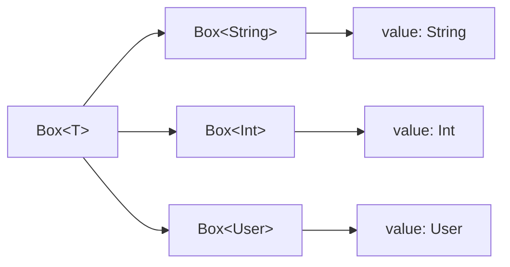
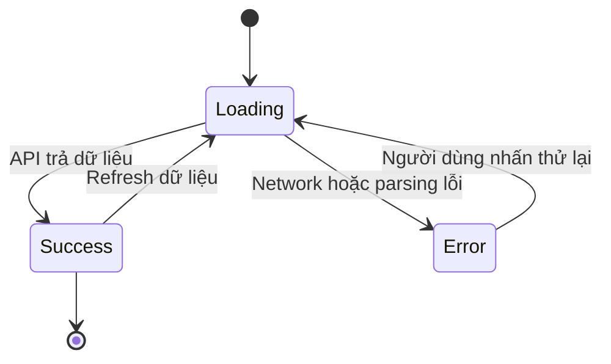
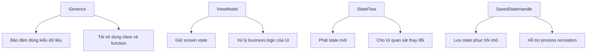
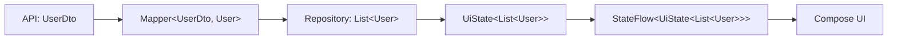

# 013 — Generics trong Kotlin

**Học phần:** 01 — Language and Android Fundamentals  
**Module:** Module 02 — Android Fundamentals  
**Nhóm nội dung:** Kotlin and OOP Basics  
**Nguồn roadmap:** Android Fundamentals / Kotlin and OOP Basics  
**Loại bài:** Lesson  
**Thứ tự trong module:** 013  
**Thời lượng gợi ý:** 24 phút  

---

## 1. Tóm tắt

**Generics**, hay **kiểu tổng quát**, cho phép chúng ta viết một lớp, hàm hoặc interface có thể làm việc với nhiều kiểu dữ liệu khác nhau nhưng vẫn được trình biên dịch kiểm tra kiểu.

Thay vì viết riêng:

```kotlin
class StringBox(val value: String)

class IntBox(val value: Int)

class UserBox(val value: User)
```

Ta có thể viết một lớp duy nhất:

```kotlin
class Box<T>(val value: T)
```

Sau đó sử dụng lớp này với nhiều kiểu dữ liệu:

```kotlin
val nameBox = Box<String>("An Khánh")
val ageBox = Box<Int>(23)
val userBox = Box<User>(User(id = 1, name = "An Khánh"))
```

Trong đó, `T` là một **type parameter** — tham số đại diện cho kiểu dữ liệu sẽ được cung cấp sau.

Generics xuất hiện rất thường xuyên trong Android:

```kotlin
List<User>
StateFlow<UiState>
LiveData<List<Product>>
MutableState<String>
Result<ApiResponse>
Response<UserDto>
```

Generics giúp mã nguồn:

- tái sử dụng tốt hơn;
- giảm số lớp hoặc hàm bị trùng lặp;
- an toàn kiểu dữ liệu;
- dễ mở rộng và bảo trì;
- phát hiện nhiều lỗi ngay khi biên dịch thay vì chờ đến lúc chạy ứng dụng.

Tài liệu Kotlin chính thức mô tả rằng lớp và hàm đều có thể khai báo type parameter; Kotlin cũng hỗ trợ generic constraint, variance, star projection và generic function. :contentReference[oaicite:1]{index=1}

---

## 2. Mục tiêu học tập

Sau bài học, bạn có thể:

- Giải thích được Generics bằng ngôn ngữ của mình.
- Phân biệt được type parameter và type argument.
- Tạo generic class, generic interface và generic function.
- Sử dụng generic constraint để giới hạn kiểu dữ liệu.
- Hiểu cơ bản về invariance, covariance và contravariance.
- Giải thích được ý nghĩa của `in`, `out` và `*`.
- Nhận biết Generics trong các API Android như `List<T>`, `State<T>`, `StateFlow<T>` và `LiveData<T>`.
- Xây dựng một mô hình `UiState<T>` dùng chung cho nhiều màn hình.
- Viết test bảo vệ hành vi của một generic class hoặc generic function.
- Nhận biết lỗi thường gặp khi sử dụng Generics trong ứng dụng Android.

---

## 3. Generics là gì?

Generics cho phép một thành phần phần mềm nhận **kiểu dữ liệu như một tham số**.

Ví dụ:

```kotlin
class Box<T>(
    val value: T
)
```

Ở đây:

- `Box` là tên lớp.
- `T` là type parameter.
- `value` có kiểu `T`.
- Kiểu thật của `T` được xác định khi tạo đối tượng.

```kotlin
val stringBox = Box<String>("Hello")
val numberBox = Box<Int>(100)
```

Trong hai câu lệnh trên:

- `String` là type argument của `Box<String>`.
- `Int` là type argument của `Box<Int>`.

### 3.1. Hình minh họa cú pháp


*Nguồn ảnh: Android Developers — Generics, objects, and extensions.* :contentReference[oaicite:2]{index=2}

### 3.2. Sơ đồ tư duy



Một khuôn mẫu `Box<T>` có thể tạo ra nhiều kiểu cụ thể mà không cần sao chép phần cài đặt của lớp.

---

## 4. Tại sao không dùng `Any` thay cho Generics?

Một lập trình viên mới có thể viết:

```kotlin
class Box(
    val value: Any
)
```

Lớp này nhận được mọi đối tượng:

```kotlin
val box = Box("Hello")
```

Nhưng khi lấy dữ liệu, kiểu của `value` chỉ còn là `Any`:

```kotlin
val text = box.value as String
```

Chúng ta phải ép kiểu thủ công. Nếu kiểu dữ liệu thực tế không đúng, ứng dụng có thể gặp `ClassCastException`:

```kotlin
val box = Box(100)

val text = box.value as String // Lỗi khi chạy
```

Với Generics:

```kotlin
class Box<T>(
    val value: T
)

val box = Box(100)
val number: Int = box.value
```

Trình biên dịch biết rõ `box.value` là `Int`. Không cần ép kiểu.

### So sánh

| Tiêu chí | Sử dụng `Any` | Sử dụng Generics |
|---|---:|---:|
| Nhận nhiều kiểu dữ liệu | Có | Có |
| Giữ lại thông tin kiểu | Không đầy đủ | Có |
| Cần ép kiểu thủ công | Thường có | Thường không |
| Phát hiện lỗi lúc biên dịch | Hạn chế | Tốt |
| Khả năng tái sử dụng | Trung bình | Tốt |
| Độ an toàn | Thấp hơn | Cao hơn |

---

## 5. Generic class

### 5.1. Cú pháp cơ bản

```kotlin
class ClassName<T>(
    val value: T
)
```

Ví dụ:

```kotlin
data class User(
    val id: Long,
    val name: String
)

class CacheEntry<T>(
    val key: String,
    val value: T,
    val createdAt: Long
)
```

Sử dụng:

```kotlin
val userEntry = CacheEntry(
    key = "current_user",
    value = User(
        id = 1,
        name = "An Khánh"
    ),
    createdAt = System.currentTimeMillis()
)

val tokenEntry = CacheEntry(
    key = "access_token",
    value = "abc-123",
    createdAt = System.currentTimeMillis()
)
```

Kotlin thường có thể tự suy luận type argument từ giá trị truyền vào:

```kotlin
val tokenEntry: CacheEntry<String> = CacheEntry(
    key = "access_token",
    value = "abc-123",
    createdAt = System.currentTimeMillis()
)
```

Có thể viết ngắn hơn:

```kotlin
val tokenEntry = CacheEntry(
    key = "access_token",
    value = "abc-123",
    createdAt = System.currentTimeMillis()
)
```

Trình biên dịch tự suy luận `T` là `String`.

---

## 6. Nhiều type parameter

Một lớp có thể có nhiều type parameter:

```kotlin
class PairResult<K, V>(
    val key: K,
    val value: V
)
```

Sử dụng:

```kotlin
val userResult = PairResult<Long, String>(
    key = 101L,
    value = "An Khánh"
)
```

Một ví dụ gần với Android hơn:

```kotlin
data class ApiResponse<Data, Metadata>(
    val data: Data,
    val metadata: Metadata
)
```

```kotlin
data class User(
    val id: Long,
    val name: String
)

data class Pagination(
    val currentPage: Int,
    val totalPages: Int
)

val response = ApiResponse(
    data = listOf(
        User(1, "An"),
        User(2, "Bình")
    ),
    metadata = Pagination(
        currentPage = 1,
        totalPages = 5
    )
)
```

Kiểu của `response` được suy luận là:

```kotlin
ApiResponse<List<User>, Pagination>
```

### Quy ước đặt tên

Các type parameter thường gặp:

| Tên | Ý nghĩa thường dùng |
|---|---|
| `T` | Type |
| `R` | Return hoặc Result |
| `E` | Element |
| `K` | Key |
| `V` | Value |
| `D` | Data |

Với code nghiệp vụ, có thể sử dụng tên rõ nghĩa hơn:

```kotlin
data class ApiResponse<Data, Metadata>(
    val data: Data,
    val metadata: Metadata
)
```

Tên rõ nghĩa đặc biệt hữu ích khi một lớp có nhiều type parameter.

---

## 7. Generic function

Không chỉ class, function cũng có thể khai báo type parameter.

Type parameter được đặt trước tên hàm:

```kotlin
fun <T> functionName(value: T): T {
    return value
}
```

Ví dụ:

```kotlin
fun <T> returnSameValue(value: T): T {
    return value
}
```

Sử dụng:

```kotlin
val number = returnSameValue(10)
val text = returnSameValue("Android")
val user = returnSameValue(User(1, "An Khánh"))
```

Kotlin tự suy luận kiểu của `T` từ đối số.

### 7.1. Generic extension function

```kotlin
fun <T> List<T>.secondOrNull(): T? {
    return getOrNull(1)
}
```

Sử dụng:

```kotlin
val names = listOf("An", "Bình", "Chi")
val secondName: String? = names.secondOrNull()

val numbers = listOf(10, 20, 30)
val secondNumber: Int? = numbers.secondOrNull()
```

Cùng một hàm hoạt động với cả `List<String>` và `List<Int>`.

### 7.2. Hoán đổi hai giá trị

```kotlin
fun <T> swap(
    values: MutableList<T>,
    firstIndex: Int,
    secondIndex: Int
) {
    val temporary = values[firstIndex]
    values[firstIndex] = values[secondIndex]
    values[secondIndex] = temporary
}
```

```kotlin
val names = mutableListOf("A", "B", "C")

swap(
    values = names,
    firstIndex = 0,
    secondIndex = 2
)

println(names) // [C, B, A]
```

---

## 8. Generic constraint

Đôi khi không phải kiểu dữ liệu nào cũng phù hợp với một generic class hoặc function.

Ví dụ, một hàm cần truy cập thuộc tính `id`. Nếu chỉ sử dụng `<T>`, trình biên dịch không biết `T` có thuộc tính `id` hay không:

```kotlin
fun <T> findById(items: List<T>, id: Long): T? {
    // Không thể gọi item.id vì T có thể là bất kỳ kiểu nào.
    return items.firstOrNull()
}
```

Ta có thể giới hạn `T` bằng một interface.

```kotlin
interface Identifiable {
    val id: Long
}
```

```kotlin
data class User(
    override val id: Long,
    val name: String
) : Identifiable
```

```kotlin
data class Product(
    override val id: Long,
    val title: String
) : Identifiable
```

Generic constraint:

```kotlin
fun <T : Identifiable> findById(
    items: List<T>,
    id: Long
): T? {
    return items.firstOrNull { item ->
        item.id == id
    }
}
```

Sử dụng:

```kotlin
val users = listOf(
    User(1, "An"),
    User(2, "Bình")
)

val selectedUser = findById(
    items = users,
    id = 2
)
```

`T : Identifiable` có nghĩa là:

> `T` phải là `Identifiable` hoặc một kiểu triển khai `Identifiable`.

Kotlin gọi đây là **upper bound**. Upper bound mặc định của type parameter là `Any?`. Khi cần nhiều điều kiện, Kotlin hỗ trợ `where` clause. :contentReference[oaicite:3]{index=3}

### 8.1. Nhiều constraint với `where`

```kotlin
interface Cacheable {
    fun cacheKey(): String
}

fun <T> saveItem(item: T)
    where T : Identifiable,
          T : Cacheable {
    println("ID: ${item.id}")
    println("Cache key: ${item.cacheKey()}")
}
```

Kiểu `T` phải đồng thời:

- triển khai `Identifiable`;
- triển khai `Cacheable`.

---

## 9. Generics trong Android

Generics có mặt ở gần như mọi tầng của ứng dụng Android.

### 9.1. Collections

```kotlin
List<User>
MutableList<Product>
Set<String>
Map<Long, User>
```

### 9.2. Jetpack Compose

```kotlin
State<String>
MutableState<Boolean>
State<List<User>>
```

`MutableState<T>` giữ một giá trị có kiểu `T`. Khi `value` thay đổi, các composable đang đọc giá trị đó có thể được lên lịch recomposition. :contentReference[oaicite:4]{index=4}

Ví dụ:

```kotlin
var searchText by remember {
    mutableStateOf("")
}
```

Kiểu đầy đủ của state trong ví dụ này liên quan đến:

```kotlin
MutableState<String>
```

### 9.3. ViewModel và Flow

```kotlin
StateFlow<UiState<List<User>>>
MutableStateFlow<Boolean>
Flow<List<Product>>
```

### 9.4. LiveData

```kotlin
LiveData<User>
MutableLiveData<List<Product>>
```

### 9.5. Network và repository

```kotlin
Result<User>
ApiResponse<List<Product>>
Response<UserDto>
```

### 9.6. Navigation và saved state

```kotlin
SavedStateHandle
Bundle
Parcelable
```

Các API không nhất thiết đều là generic ở mọi phương thức, nhưng Generics thường được sử dụng ở lớp bao dữ liệu, state holder, mapper và repository bao quanh chúng.

---

## 10. Ví dụ thực tế: `UiState<T>`

Một ứng dụng thường có các trạng thái:

- đang tải;
- tải thành công;
- tải thất bại.

Nếu viết riêng cho từng màn hình:

```kotlin
sealed interface UserUiState
sealed interface ProductUiState
sealed interface ArticleUiState
```

Ta có thể lặp lại rất nhiều code.

Generics cho phép tạo một mô hình dùng chung:

```kotlin
sealed interface UiState<out T> {

    data object Loading : UiState<Nothing>

    data class Success<T>(
        val data: T
    ) : UiState<T>

    data class Error(
        val message: String,
        val cause: Throwable? = null
    ) : UiState<Nothing>
}
```

Sử dụng với người dùng:

```kotlin
val userState: UiState<List<User>> =
    UiState.Success(
        data = listOf(
            User(1, "An"),
            User(2, "Bình")
        )
    )
```

Sử dụng với sản phẩm:

```kotlin
val productState: UiState<List<Product>> =
    UiState.Success(
        data = listOf(
            Product(1, "Laptop"),
            Product(2, "Điện thoại")
        )
    )
```

Cùng một `UiState<T>` có thể bao quanh:

```text
UiState<User>
UiState<List<User>>
UiState<Product>
UiState<List<Product>>
UiState<Article>
UiState<Unit>
```

### Sơ đồ luồng trạng thái



---

## 11. Kết hợp `UiState<T>` với ViewModel

```kotlin
data class Article(
    val id: Long,
    val title: String
)

interface ArticleRepository {

    suspend fun getArticles(): List<Article>
}
```

```kotlin
class ArticleViewModel(
    private val repository: ArticleRepository
) : ViewModel() {

    private val _uiState =
        MutableStateFlow<UiState<List<Article>>>(
            UiState.Loading
        )

    val uiState: StateFlow<UiState<List<Article>>> =
        _uiState.asStateFlow()

    fun loadArticles() {
        viewModelScope.launch {
            _uiState.value = UiState.Loading

            _uiState.value = try {
                val articles = repository.getArticles()

                UiState.Success(
                    data = articles
                )
            } catch (error: Exception) {
                UiState.Error(
                    message = error.message
                        ?: "Không thể tải bài viết.",
                    cause = error
                )
            }
        }
    }
}
```

Kiểu dữ liệu có cấu trúc nhiều tầng:

```text
StateFlow<
    UiState<
        List<Article>
    >
>
```

Ý nghĩa:

1. `Article` là một bài viết.
2. `List<Article>` là danh sách bài viết.
3. `UiState<List<Article>>` mô tả trạng thái tải danh sách.
4. `StateFlow<UiState<List<Article>>>` phát trạng thái mới cho UI.

---

## 12. Generic Composable

Ta có thể viết một composable dùng chung để hiển thị `UiState<T>`:

```kotlin
@Composable
fun <T> UiStateContent(
    state: UiState<T>,
    onRetry: () -> Unit,
    content: @Composable (T) -> Unit
) {
    when (state) {
        UiState.Loading -> {
            CircularProgressIndicator()
        }

        is UiState.Success -> {
            content(state.data)
        }

        is UiState.Error -> {
            Column {
                Text(text = state.message)

                Button(onClick = onRetry) {
                    Text(text = "Thử lại")
                }
            }
        }
    }
}
```

Sử dụng:

```kotlin
@Composable
fun ArticleScreen(
    state: UiState<List<Article>>,
    onRetry: () -> Unit
) {
    UiStateContent(
        state = state,
        onRetry = onRetry
    ) { articles ->
        LazyColumn {
            items(
                items = articles,
                key = { article -> article.id }
            ) { article ->
                Text(text = article.title)
            }
        }
    }
}
```

Điểm quan trọng:

- `UiStateContent<T>` không biết trước `T` là gì.
- Composable cha quyết định kiểu dữ liệu.
- Khi `T` là `List<Article>`, tham số `articles` tự động có kiểu `List<Article>`.
- Không cần ép kiểu.
- Không cần viết lại UI loading và error cho từng màn hình.

---

## 13. Generics và lifecycle

Generics chỉ kiểm soát **kiểu dữ liệu**. Generics không tự động:

- giữ state khi xoay màn hình;
- hủy coroutine;
- lưu dữ liệu khi ứng dụng bị kill;
- tránh gọi API lặp lại;
- xử lý lifecycle;
- khôi phục dữ liệu sau process death.

Ví dụ:

```kotlin
var state: UiState<List<Article>> = UiState.Loading
```

Dù `state` sử dụng Generics đúng cách, nếu biến này được đặt trực tiếp trong `Activity` và `Activity` bị tạo lại, state vẫn có thể mất.

Một cách phù hợp hơn là giữ screen state trong `ViewModel`:

```kotlin
class ArticleViewModel : ViewModel() {

    private val _uiState =
        MutableStateFlow<UiState<List<Article>>>(
            UiState.Loading
        )

    val uiState = _uiState.asStateFlow()
}
```

`ViewModel` có thể giữ state trong các configuration change như xoay màn hình. Tuy nhiên, `ViewModel` không tự tồn tại qua system-initiated process death; các giá trị nhỏ cần thiết để phục hồi màn hình có thể được lưu bằng `SavedStateHandle`. :contentReference[oaicite:5]{index=5}

### Phân chia trách nhiệm



---

## 14. Variance: tại sao `List<Dog>` không phải lúc nào cũng thay được `List<Animal>`?

Giả sử:

```kotlin
open class Animal

class Dog : Animal()

class Cat : Animal()
```

Ta có thể gán:

```kotlin
val dog: Dog = Dog()
val animal: Animal = dog
```

Vì `Dog` là subtype của `Animal`.

Nhưng với generic mutable collection:

```kotlin
val dogs: MutableList<Dog> =
    mutableListOf(Dog())

// Không hợp lệ:
val animals: MutableList<Animal> = dogs
```

Nếu phép gán trên được cho phép, ta có thể làm:

```kotlin
animals.add(Cat())
```

Khi đó danh sách vốn được khai báo là `MutableList<Dog>` lại chứa một `Cat`.

Vì lý do an toàn, generic type thường **invariant** nếu không khai báo variance phù hợp.

---

## 15. `out`: chỉ sản xuất dữ liệu

Ví dụ:

```kotlin
interface Producer<out T> {

    fun produce(): T
}
```

`Producer` chỉ trả về `T`, không nhận `T` làm đầu vào.

```kotlin
class DogProducer : Producer<Dog> {

    override fun produce(): Dog {
        return Dog()
    }
}
```

Có thể sử dụng:

```kotlin
val dogProducer: Producer<Dog> =
    DogProducer()

val animalProducer: Producer<Animal> =
    dogProducer
```

Bởi vì đối tượng sản xuất `Dog` chắc chắn cũng có thể được xem là đối tượng sản xuất `Animal`.

Ghi nhớ:

> `out` — kiểu dữ liệu đi ra khỏi đối tượng.

Trong mô hình trước:

```kotlin
sealed interface UiState<out T>
```

`UiState<T>` chủ yếu cung cấp dữ liệu `T` cho bên ngoài, vì vậy `out T` phù hợp.

---

## 16. `in`: chỉ tiêu thụ dữ liệu

```kotlin
interface Consumer<in T> {

    fun consume(value: T)
}
```

Ví dụ:

```kotlin
class AnimalLogger : Consumer<Animal> {

    override fun consume(value: Animal) {
        println("Animal received: $value")
    }
}
```

Có thể sử dụng `AnimalLogger` tại nơi cần consumer của `Dog`:

```kotlin
val animalConsumer: Consumer<Animal> =
    AnimalLogger()

val dogConsumer: Consumer<Dog> =
    animalConsumer

dogConsumer.consume(Dog())
```

Một consumer có thể nhận mọi `Animal` thì đương nhiên có thể nhận `Dog`.

Ghi nhớ:

> `in` — kiểu dữ liệu đi vào đối tượng.

### Bảng ghi nhớ variance

| Kiểu | Từ khóa | Vai trò chính | Ví dụ |
|---|---|---|---|
| Covariance | `out T` | Sản xuất hoặc trả về `T` | `Producer<out T>` |
| Contravariance | `in T` | Nhận hoặc tiêu thụ `T` | `Consumer<in T>` |
| Invariance | Không có | Vừa đọc vừa ghi `T` | `MutableList<T>` |

Kotlin sử dụng declaration-site variance và type projection thay vì hệ thống wildcard giống Java. :contentReference[oaicite:6]{index=6}

---

## 17. Minh họa generic class bằng UML


Lớp trong hình có dạng tương đương:

```kotlin
class Range<T>(
    val start: T,
    val end: T
) {
    fun contains(item: T): Boolean {
        TODO("Cài đặt tùy theo constraint của T")
    }
}
```

Trong sơ đồ UML:

- `Range<T>` là generic class.
- `start` có kiểu `T`.
- `end` có kiểu `T`.
- `contains()` nhận một giá trị kiểu `T`.

*Nguồn ảnh: Wikimedia Commons, giấy phép CC0.* :contentReference[oaicite:7]{index=7}

---

## 18. Star projection: `List<*>`

Đôi khi ta biết một đối tượng là danh sách nhưng không biết chính xác kiểu phần tử.

```kotlin
fun printListSize(value: Any) {
    if (value is List<*>) {
        println(value.size)
    }
}
```

`List<*>` có nghĩa gần như:

> Đây là một `List`, nhưng kiểu phần tử cụ thể chưa được biết.

Khi đọc phần tử:

```kotlin
fun firstItem(items: List<*>): Any? {
    return items.firstOrNull()
}
```

Kết quả là `Any?` vì trình biên dịch không biết kiểu cụ thể.

Không nên sử dụng `List<*>` khi chương trình thực sự cần biết kiểu dữ liệu. Khi có thể, hãy khai báo type parameter rõ ràng:

```kotlin
fun <T> firstItem(items: List<T>): T? {
    return items.firstOrNull()
}
```

---

## 19. Type erasure

Thông tin generic chủ yếu được kiểm tra tại thời điểm biên dịch. Ở runtime, nhiều thông tin về type argument đã bị xóa.

Vì vậy, phép kiểm tra sau không hợp lệ:

```kotlin
fun check(value: Any) {
    // Không hợp lệ:
    // if (value is List<String>) { }
}
```

Có thể kiểm tra:

```kotlin
fun check(value: Any) {
    if (value is List<*>) {
        println("Đây là một danh sách")
    }
}
```

Kotlin gọi cơ chế này là **type erasure**. Ví dụ, runtime thường không giữ sự khác biệt đầy đủ giữa `List<String>` và `List<Int>`. :contentReference[oaicite:8]{index=8}

---

## 20. `reified` type parameter

Trong một `inline function`, Kotlin cho phép đánh dấu type parameter bằng `reified`.

```kotlin
inline fun <reified T> Any?.castOrNull(): T? {
    return this as? T
}
```

Sử dụng:

```kotlin
val value: Any = "Android"

val text: String? =
    value.castOrNull<String>()

val number: Int? =
    value.castOrNull<Int>()
```

Kết quả:

```text
text = "Android"
number = null
```

`reified` cho phép function tham chiếu đến `T` tại vị trí được inline.

Không thể dùng `reified` với function thông thường:

```kotlin
// Không hợp lệ:
// fun <reified T> cast(value: Any): T?
```

Function phải là `inline`:

```kotlin
inline fun <reified T> cast(
    value: Any
): T? {
    return value as? T
}
```

Chỉ nên dùng `reified` khi thực sự cần kiểm tra kiểu, ép kiểu hoặc truy cập thông tin lớp của `T`.

---

## 21. Ảnh hưởng đến UX

Generics không trực tiếp thay đổi màu sắc, bố cục hoặc animation, nhưng có thể ảnh hưởng gián tiếp đến trải nghiệm người dùng.

### 21.1. Trạng thái UI nhất quán

Khi nhiều màn hình dùng chung:

```kotlin
UiState<T>
```

các trạng thái loading, success và error có thể được xử lý nhất quán.

Người dùng ít gặp những màn hình:

- tải mãi không dừng;
- trắng hoàn toàn khi có lỗi;
- hiển thị dữ liệu sai kiểu;
- crash do ép kiểu không an toàn.

### 21.2. Giảm lỗi runtime

Generics giúp chuyển nhiều lỗi từ runtime sang compile time.

Ví dụ, trình biên dịch chặn:

```kotlin
val state: UiState<List<User>> =
    UiState.Success(
        data = listOf(Product(1, "Laptop"))
    )
```

Ứng dụng không cần chạy đến màn hình đó mới phát hiện dữ liệu sai.

### 21.3. Tái sử dụng UI

Generic composable cho phép tái sử dụng loading và error UI:

```kotlin
UiStateContent<User>
UiStateContent<List<User>>
UiStateContent<Product>
```

Điều này giúp giao diện giữa các màn hình đồng nhất hơn.

---

## 22. Ảnh hưởng đến reliability

Generics cải thiện độ tin cậy bằng cách:

- giữ kiểu dữ liệu xuyên suốt các tầng;
- giảm ép kiểu không an toàn;
- phát hiện type mismatch lúc biên dịch;
- quy định rõ dữ liệu đầu vào và đầu ra;
- hỗ trợ thiết kế state có cấu trúc;
- giúp test dễ đọc hơn.

Luồng dữ liệu có thể được giữ rõ ràng:



Mỗi tầng biết rõ kiểu dữ liệu mà nó nhận và trả về.

---

## 23. Ảnh hưởng đến maintainability

### Không sử dụng Generics

```kotlin
class UserResult(
    val data: User?
)

class ProductResult(
    val data: Product?
)

class ArticleResult(
    val data: Article?
)
```

### Sử dụng Generics

```kotlin
class DataResult<T>(
    val data: T?
)
```

```kotlin
val userResult: DataResult<User>
val productResult: DataResult<Product>
val articleResult: DataResult<Article>
```

Khi cần bổ sung thuộc tính:

```kotlin
class DataResult<T>(
    val data: T?,
    val source: String,
    val loadedAt: Long
)
```

Chúng ta chỉ sửa một lớp thay vì nhiều lớp tương tự.

Tuy nhiên, không nên generic hóa mọi thứ. Một abstraction quá tổng quát có thể làm code khó đọc và khó debug hơn.

---

## 24. Lỗi thường gặp

### Lỗi 1: Dùng `Any` thay vì type parameter

Không nên:

```kotlin
class DataHolder(
    val value: Any
)
```

Nên:

```kotlin
class DataHolder<T>(
    val value: T
)
```

---

### Lỗi 2: Ép kiểu bằng `as T`

```kotlin
fun <T> unsafeCast(value: Any): T {
    return value as T
}
```

Code này có thể che giấu lỗi thiết kế và gây crash.

Ưu tiên:

- truyền kiểu dữ liệu đúng từ đầu;
- sử dụng mapper;
- sử dụng `as?`;
- dùng `reified` khi thực sự cần;
- tránh unchecked cast.

---

### Lỗi 3: Cho rằng `MutableList<Dog>` là `MutableList<Animal>`

```kotlin
val dogs: MutableList<Dog> =
    mutableListOf()

// Không hợp lệ:
// val animals: MutableList<Animal> = dogs
```

Đây là hành vi an toàn vì `MutableList` vừa đọc vừa ghi dữ liệu.

---

### Lỗi 4: Dùng generic class dù các kiểu có hành vi hoàn toàn khác nhau

Không nên cố ép mọi response vào một abstraction quá rộng:

```kotlin
class Everything<T, R, E, M, C>(
    val data: T,
    val result: R,
    val error: E,
    val metadata: M,
    val config: C
)
```

Một generic abstraction tốt phải:

- giải quyết sự lặp lại thật sự;
- có trách nhiệm rõ ràng;
- dễ đọc ở call site;
- không che giấu logic nghiệp vụ.

---

### Lỗi 5: Không đặt constraint khi cần hành vi cụ thể

Sai:

```kotlin
fun <T> sortItems(items: List<T>) {
    // Không biết T có thể so sánh hay không.
}
```

Đúng hơn:

```kotlin
fun <T : Comparable<T>> sortItems(
    items: List<T>
): List<T> {
    return items.sorted()
}
```

---

### Lỗi 6: Cho rằng Generics tự xử lý lifecycle

```kotlin
val state: UiState<User>
```

Kiểu dữ liệu này không bảo đảm state được giữ khi:

- Activity bị recreate;
- composable rời Composition;
- tiến trình bị hệ thống hủy;
- người dùng đóng ứng dụng.

Cần kết hợp đúng với:

- `ViewModel`;
- `StateFlow`;
- `rememberSaveable`;
- `SavedStateHandle`;
- database hoặc persistent storage.

---

### Lỗi 7: Đặt mutable collection trực tiếp trong Compose state

Ví dụ có rủi ro:

```kotlin
val users = remember {
    mutableStateOf(
        mutableListOf<User>()
    )
}

users.value.add(
    User(1, "An")
)
```

Việc thay đổi nội dung bên trong mutable list không nhất thiết tạo ra một state value mới để Compose quan sát đúng cách.

Ưu tiên immutable list:

```kotlin
var users by remember {
    mutableStateOf(emptyList<User>())
}

users = users + User(
    id = 1,
    name = "An"
)
```

Android Developers cảnh báo rằng sử dụng mutable object như `ArrayList<T>` hoặc `mutableListOf()` làm Compose state có thể khiến UI hiển thị dữ liệu cũ hoặc không chính xác. :contentReference[oaicite:9]{index=9}

---

## 25. Debug Generics

Khi gặp lỗi liên quan đến Generics, hãy đọc kiểu dữ liệu từ trong ra ngoài.

Ví dụ:

```text
StateFlow<UiState<List<Article>>>
```

Tách thành:

```text
Article
List<Article>
UiState<List<Article>>
StateFlow<UiState<List<Article>>>
```

### Một số lỗi compiler thường gặp

#### Type mismatch

```text
Type mismatch.
Required: UiState<List<User>>
Found: UiState<List<Product>>
```

Kiểm tra:

- mapper có trả đúng model không;
- repository khai báo đúng return type không;
- ViewModel có dùng đúng state type không;
- import có nhầm hai class trùng tên không.

#### Type inference failed

```text
Not enough information to infer type variable T
```

Có thể cần khai báo kiểu rõ ràng:

```kotlin
val state: UiState<List<User>> =
    UiState.Loading
```

Thay vì:

```kotlin
val state = UiState.Loading
```

Trong trường hợp sau, Kotlin chỉ biết đối tượng là `UiState.Loading`, chưa có đủ ngữ cảnh để suy ra kiểu dữ liệu mà bạn mong muốn sử dụng.

#### Unchecked cast

```text
Unchecked cast: Any to List<User>
```

Đây thường là dấu hiệu:

- dữ liệu đã mất type information;
- API đang trả `Any`;
- code đang phụ thuộc quá nhiều vào ép kiểu;
- cần sửa cấu trúc parser hoặc mapper.

---

## 26. Testing

### 26.1. Test generic extension function

```kotlin
class ListExtensionsTest {

    @Test
    fun `secondOrNull returns second string`() {
        val values = listOf(
            "A",
            "B",
            "C"
        )

        val result = values.secondOrNull()

        assertEquals(
            "B",
            result
        )
    }

    @Test
    fun `secondOrNull returns second integer`() {
        val values = listOf(
            10,
            20,
            30
        )

        val result = values.secondOrNull()

        assertEquals(
            20,
            result
        )
    }

    @Test
    fun `secondOrNull returns null for short list`() {
        val values = listOf("A")

        val result = values.secondOrNull()

        assertNull(result)
    }
}
```

Cùng một function được kiểm thử với nhiều type argument.

### 26.2. Test `UiState<T>`

```kotlin
class UiStateTest {

    @Test
    fun `success keeps article list`() {
        val articles = listOf(
            Article(
                id = 1,
                title = "Kotlin Generics"
            )
        )

        val state: UiState<List<Article>> =
            UiState.Success(articles)

        val success =
            assertIs<UiState.Success<List<Article>>>(
                state
            )

        assertEquals(
            articles,
            success.data
        )
    }

    @Test
    fun `error keeps user friendly message`() {
        val state: UiState<List<Article>> =
            UiState.Error(
                message = "Không có kết nối mạng."
            )

        val error =
            assertIs<UiState.Error>(state)

        assertEquals(
            "Không có kết nối mạng.",
            error.message
        )
    }
}
```

### 26.3. Những trường hợp nên test

- Generic function với `String`.
- Generic function với `Int`.
- Generic function với custom data class.
- Danh sách rỗng.
- Giá trị nullable.
- Constraint được áp dụng đúng.
- `UiState.Loading`.
- `UiState.Success<T>`.
- `UiState.Error`.
- Mapping từ DTO sang domain model.
- State không bị nhầm giữa hai model khác nhau.

---

## 27. Thực hành 24 phút

### Phút 0–4: đọc khái niệm

Viết lại định nghĩa Generics trong tối đa năm dòng:

```text
Generics cho phép class hoặc function nhận kiểu dữ liệu như một tham số.
Type parameter thường được viết là T.
Kiểu cụ thể được cung cấp khi sử dụng class hoặc function.
Generics giúp tái sử dụng code mà vẫn giữ type safety.
Generics xuất hiện phổ biến trong collection, state, flow và network response.
```

### Phút 4–9: tạo generic class

```kotlin
data class DataContainer<T>(
    val data: T,
    val updatedAt: Long
)
```

Tạo ba đối tượng:

```kotlin
val textContainer: DataContainer<String>
val numberContainer: DataContainer<Int>
val userContainer: DataContainer<User>
```

### Phút 9–14: tạo generic function

```kotlin
fun <T> List<T>.firstOrDefault(
    defaultValue: T
): T {
    return firstOrNull() ?: defaultValue
}
```

### Phút 14–19: tạo `UiState<T>`

Cài đặt:

```kotlin
sealed interface UiState<out T>
```

với ba trạng thái:

```text
Loading
Success<T>
Error
```

### Phút 19–24: viết test và ghi chú

Viết ít nhất:

- một test thành công;
- một test với danh sách rỗng;
- một ghi chú về lỗi ép kiểu;
- một ghi chú về lifecycle.

---

## 28. Bài tập

### Bài 1 — Generic container

Tạo:

```kotlin
data class Resource<T>(
    val data: T?,
    val isLoading: Boolean,
    val errorMessage: String?
)
```

Tạo các biến:

```kotlin
Resource<User>
Resource<List<Product>>
Resource<String>
```

---

### Bài 2 — Generic mapper

Tạo interface:

```kotlin
interface Mapper<Input, Output> {

    fun map(input: Input): Output
}
```

Cài đặt mapper:

```kotlin
data class UserDto(
    val id: Long,
    val fullName: String
)

data class User(
    val id: Long,
    val name: String
)
```

```kotlin
class UserDtoMapper :
    Mapper<UserDto, User> {

    override fun map(
        input: UserDto
    ): User {
        return User(
            id = input.id,
            name = input.fullName
        )
    }
}
```

---

### Bài 3 — Generic Compose component

Tạo composable:

```kotlin
@Composable
fun <T> DataCard(
    item: T,
    title: (T) -> String,
    description: (T) -> String
)
```

Sử dụng component với:

- `User`;
- `Product`;
- `Article`.

---

### Bài 4 — Generic constraint

Tạo interface:

```kotlin
interface Searchable {
    val searchableText: String
}
```

Viết function:

```kotlin
fun <T : Searchable> search(
    items: List<T>,
    query: String
): List<T>
```

Yêu cầu:

- không phân biệt chữ hoa và chữ thường;
- trả danh sách rỗng nếu không có kết quả;
- test với ít nhất hai data class khác nhau.

---

## 29. Artifact cho portfolio

Tạo một project nhỏ tên:

```text
GenericUiStateDemo
```

### Chức năng

- Hiển thị danh sách bài viết.
- Có trạng thái loading.
- Có trạng thái success.
- Có trạng thái error.
- Có nút thử lại.
- Sử dụng `UiState<T>`.
- Sử dụng `StateFlow<UiState<List<Article>>>`.
- Có generic composable xử lý state.
- Có unit test.

### Cấu trúc đề xuất

```text
app/
├── data/
│   ├── ArticleRepository.kt
│   └── FakeArticleRepository.kt
├── model/
│   └── Article.kt
├── ui/
│   ├── ArticleScreen.kt
│   ├── UiState.kt
│   └── UiStateContent.kt
└── viewmodel/
    └── ArticleViewModel.kt
```

### Nội dung README

```markdown
# GenericUiStateDemo

Ứng dụng minh họa cách sử dụng Generics trong Kotlin và Android.

## Nội dung

- Generic sealed interface `UiState<T>`
- `StateFlow<UiState<List<Article>>>`
- Generic composable `UiStateContent<T>`
- Unit test cho loading, success và error

## Điều học được

Generics giúp tái sử dụng code, duy trì type safety và giảm số
component bị trùng lặp giữa các màn hình.
```

### Artifact cần chụp

- Screenshot màn hình loading.
- Screenshot màn hình success.
- Screenshot màn hình error.
- Sơ đồ luồng `Repository → ViewModel → UiState<T> → UI`.
- Kết quả unit test.
- Đoạn code `UiState<T>` trong README.

---

## 30. Checklist hoàn thành

### Kiến thức

- [ ] Giải thích được Generics là gì.
- [ ] Phân biệt được type parameter và type argument.
- [ ] Biết cú pháp `class Box<T>`.
- [ ] Biết cú pháp `fun <T> function()`.
- [ ] Biết sử dụng nhiều type parameter.
- [ ] Hiểu generic constraint.
- [ ] Hiểu cơ bản về `in`, `out` và `*`.
- [ ] Biết type erasure là gì.
- [ ] Biết trường hợp sử dụng `reified`.

### Android

- [ ] Nhận biết Generics trong `List<T>`.
- [ ] Nhận biết Generics trong `State<T>`.
- [ ] Nhận biết Generics trong `StateFlow<T>`.
- [ ] Tạo được `UiState<T>`.
- [ ] Kết hợp `UiState<T>` với ViewModel.
- [ ] Sử dụng generic composable.
- [ ] Không nhầm Generics với lifecycle hoặc state persistence.

### Chất lượng

- [ ] Không dùng `Any` khi có thể dùng Generics.
- [ ] Hạn chế unchecked cast.
- [ ] Có constraint khi generic type cần hành vi cụ thể.
- [ ] Có test với nhiều type argument.
- [ ] Có test cho loading, success và error.
- [ ] Không sử dụng abstraction quá tổng quát.
- [ ] Không đặt mutable collection trực tiếp vào Compose state.

### Portfolio

- [ ] Có project nhỏ chạy được.
- [ ] Có README giải thích thiết kế.
- [ ] Có sơ đồ dữ liệu.
- [ ] Có screenshot.
- [ ] Có unit test.
- [ ] Có ghi chú về lifecycle và process death.

---

## 31. Ghi chú production

Trước khi đưa một generic abstraction vào production, hãy kiểm tra:

### API design

- Tên type parameter có dễ hiểu không?
- Có quá nhiều type parameter trong một lớp không?
- Call site có dễ đọc không?
- Có cần generic constraint không?
- `in` hoặc `out` có thực sự phù hợp không?

### State

- `UiState<T>` có biểu diễn đủ loading, success và error không?
- Có cần trạng thái empty riêng không?
- Dữ liệu có immutable không?
- UI có xử lý mọi nhánh của sealed interface không?

### Lifecycle

- State được giữ trong ViewModel hay composable?
- Có bị tải lại khi xoay màn hình không?
- State nào cần `rememberSaveable`?
- State nào cần `SavedStateHandle`?
- Dữ liệu lớn có được lưu trong database thay vì Bundle không?

### Network

- Generic response có phân biệt HTTP error và business error không?
- Có giữ được thông tin lỗi để logging không?
- Có hiển thị thông báo thân thiện cho người dùng không?
- Có retry và timeout phù hợp không?

### Testing

- Có test nhiều type argument không?
- Có test nullable data không?
- Có test empty list không?
- Có test mapping sai kiểu không?
- Có test state transition không?

### Release

- Có unchecked cast nào còn tồn tại không?
- Có crash do `ClassCastException` trong log không?
- Generic abstraction có làm stack trace khó đọc không?
- ProGuard hoặc R8 có ảnh hưởng đến reflection không?
- Các API dùng `reified` hoặc reflection có được test trong release build không?

---

## 32. Tổng kết

Generics cho phép viết class, interface và function có thể hoạt động với nhiều kiểu dữ liệu mà vẫn duy trì type safety.

Cú pháp quan trọng:

```kotlin
class Box<T>
```

```kotlin
fun <T> identity(value: T): T
```

```kotlin
fun <T : Identifiable> findById(
    items: List<T>,
    id: Long
): T?
```

```kotlin
interface Producer<out T>
```

```kotlin
interface Consumer<in T>
```

Trong Android, ứng dụng phổ biến nhất của Generics là:

```text
List<T>
State<T>
StateFlow<T>
LiveData<T>
Result<T>
UiState<T>
Mapper<Input, Output>
ApiResponse<Data>
```

Điều cần nhớ:

> Generics giải quyết vấn đề tái sử dụng và an toàn kiểu dữ liệu.  
> Generics không thay thế ViewModel, lifecycle handling, saved state, error handling hoặc testing.

---

# Bài luyện tập

## Mục tiêu


## Đề bài


## Yêu cầu hoàn thành

- [ ] 
- [ ] 
- [ ] 

## Kết quả / lời giải


## Ghi chú
