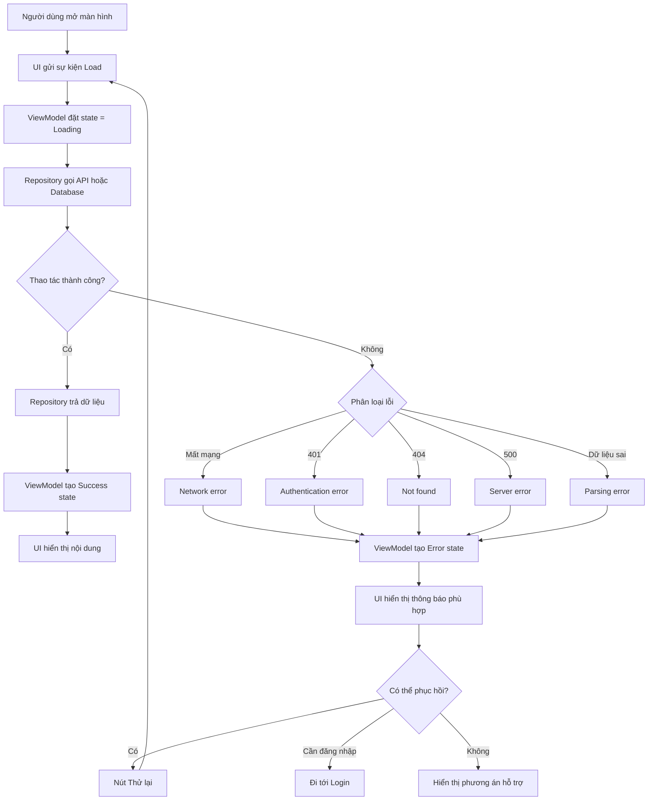

# 014 — Error Handling

**Học phần:** 01 — Language and Android Fundamentals
**Module:** Module 02 — Android Fundamentals
**Nhóm nội dung:** Kotlin and OOP Basics
**Nguồn roadmap:** Android Fundamentals / Kotlin and OOP Basics
**Loại bài:** Lesson
**Thứ tự trong module:** 014
**Thời lượng gợi ý:** 24 phút

---

## 1. Tóm tắt

**Error Handling — xử lý lỗi** là cách ứng dụng:

1. Phát hiện một thao tác không thành công.
2. Xác định loại lỗi.
3. Ngăn lỗi làm ứng dụng bị crash.
4. Chuyển lỗi kỹ thuật thành trạng thái mà UI có thể hiển thị.
5. Cho người dùng biết họ nên làm gì tiếp theo.
6. Ghi lại thông tin cần thiết để lập trình viên điều tra lỗi.

Trong Android, xử lý lỗi không chỉ là đặt đoạn code vào `try-catch`. Một hệ thống xử lý lỗi tốt phải kết nối được toàn bộ luồng:

```text
API hoặc Database
        ↓
Repository
        ↓
ViewModel
        ↓
UI State
        ↓
Thông báo và hành động khôi phục cho người dùng
```

Kotlin cung cấp `try`, `catch`, `finally`, `throw`, ngoại lệ tùy chỉnh và kiểu `Result<T>` để biểu diễn thao tác thành công hoặc thất bại. Android khuyến nghị `ViewModel` tạo ra UI state, còn giao diện chỉ quan sát state và hiển thị nội dung tương ứng.

---

## 2. Mục tiêu học tập

Sau bài học, bạn có thể:

* Giải thích được Error Handling bằng ngôn ngữ của mình.
* Phân biệt **error**, **exception**, **failure** và **UI error state**.
* Sử dụng `try-catch-finally` trong Kotlin.
* Biết khi nào nên dùng `throw`, `Result<T>` và custom exception.
* Phân loại lỗi network, HTTP, xác thực, dữ liệu và bộ nhớ.
* Chuyển lỗi từ Repository thành UI state trong ViewModel.
* Hiển thị trạng thái `Loading`, `Success` và `Error` bằng Jetpack Compose.
* Giữ trạng thái lỗi ổn định khi xoay màn hình hoặc đưa ứng dụng xuống nền.
* Viết unit test cho các trường hợp thành công và thất bại.
* Tránh các lỗi phổ biến như nuốt exception hoặc hiển thị lỗi kỹ thuật cho người dùng.

---

## 3. Error Handling là gì?

Error Handling là tập hợp các kỹ thuật giúp ứng dụng phản ứng có kiểm soát khi một thao tác không diễn ra như dự kiến.

Ví dụ, màn hình hồ sơ cần tải dữ liệu từ server nhưng thiết bị mất mạng:

### Không xử lý lỗi

```text
Người dùng mở màn hình
        ↓
Ứng dụng gọi API
        ↓
API ném IOException
        ↓
Ứng dụng crash hoặc loading vô hạn
```

### Có xử lý lỗi

```text
Người dùng mở màn hình
        ↓
Ứng dụng gọi API
        ↓
Repository phát hiện mất mạng
        ↓
ViewModel chuyển sang Error state
        ↓
UI hiển thị:
"Không thể kết nối Internet"
        ↓
Người dùng nhấn "Thử lại"
```

Mục tiêu của Error Handling không phải là che giấu mọi lỗi. Mục tiêu là:

* Ngăn sự cố có thể phục hồi trở thành crash.
* Bảo vệ dữ liệu người dùng.
* Cung cấp đường thoát khỏi trạng thái lỗi.
* Giúp lập trình viên tìm được nguyên nhân.
* Không làm sai lệch luồng cancellation hoặc lifecycle.

---

## 4. Hình minh họa trạng thái lỗi


*Ví dụ gồm lỗi validation ngay tại trường nhập liệu và lỗi tải dữ liệu có nút “Try Again”. Một error state tốt nên nói rõ vấn đề và cung cấp hành động phục hồi thay vì chỉ hiển thị mã lỗi kỹ thuật.*

---

## 5. Các thuật ngữ quan trọng

### 5.1. Error

Trong cách nói thông thường, **error** là bất kỳ điều gì khiến thao tác không đạt kết quả mong muốn.

Ví dụ:

* Mất mạng.
* Server trả về lỗi.
* Người dùng nhập sai email.
* Database không thể ghi dữ liệu.
* Token đăng nhập hết hạn.
* File không tồn tại.

Trong JVM, một số lớp kế thừa `Error`, chẳng hạn `OutOfMemoryError`, thường đại diện cho vấn đề nghiêm trọng mà ứng dụng khó phục hồi. Không nên viết một `catch` tổng quát chỉ để che giấu những lỗi hệ thống này.

---

### 5.2. Exception

**Exception — ngoại lệ** là một đối tượng được ném ra khi luồng thực thi bình thường bị gián đoạn.

Ví dụ:

```kotlin
val number = "abc".toInt()
```

Đoạn code trên có thể ném:

```text
NumberFormatException
```

Kotlin không bắt buộc lập trình viên khai báo hoặc bắt mọi exception theo cơ chế checked exception. Vì vậy, lập trình viên cần chủ động xác định các điểm có thể thất bại và xử lý chúng ở ranh giới phù hợp.

---

### 5.3. Failure

**Failure** là kết quả thất bại ở cấp nghiệp vụ hoặc thao tác.

Ví dụ:

```text
Đăng nhập thất bại
```

Failure có thể xuất phát từ nhiều exception khác nhau:

* `IOException`: không kết nối được server.
* HTTP `401`: thông tin đăng nhập không hợp lệ.
* HTTP `429`: gửi quá nhiều yêu cầu.
* HTTP `500`: server gặp sự cố.
* `JsonDataException`: dữ liệu phản hồi sai cấu trúc.

Repository có thể chuyển các exception kỹ thuật này thành một failure dễ hiểu hơn:

```text
IOException → NetworkUnavailable
HTTP 401   → InvalidCredentials
HTTP 429   → TooManyRequests
HTTP 500   → ServerUnavailable
```

---

### 5.4. UI error state

UI error state là dữ liệu mô tả những gì giao diện cần hiển thị khi một thao tác thất bại.

Ví dụ:

```kotlin
data class ErrorUiState(
    val message: String,
    val canRetry: Boolean
)
```

UI state không nhất thiết phải chứa trực tiếp `Throwable`. Thông thường, UI chỉ cần:

* Nội dung thông báo.
* Có cho phép thử lại hay không.
* Có cần chuyển sang màn hình đăng nhập hay không.
* Có dữ liệu cũ để tiếp tục hiển thị hay không.
* Có hành động hỗ trợ nào khác hay không.

Android lưu ý rằng error state thường cần nhiều metadata hơn một biến Boolean đơn giản, chẳng hạn message và hành động retry.

---

## 6. Các nguồn lỗi thường gặp trong Android

| Nhóm lỗi        | Ví dụ                    | Cách phản ứng phù hợp                         |
| --------------- | ------------------------ | --------------------------------------------- |
| Validation      | Email sai định dạng      | Báo lỗi ngay gần trường nhập                  |
| Network         | Mất Wi-Fi, timeout       | Giữ dữ liệu cũ và cho phép thử lại            |
| HTTP client     | `400`, `401`, `404`      | Giải thích theo ngữ cảnh                      |
| HTTP server     | `500`, `503`             | Thông báo tạm thời và retry có kiểm soát      |
| Authentication  | Token hết hạn            | Refresh token hoặc yêu cầu đăng nhập          |
| Authorization   | Không có quyền           | Ẩn hoặc vô hiệu hóa chức năng                 |
| Database        | Không thể đọc hoặc ghi   | Khôi phục, retry hoặc báo lỗi                 |
| Parsing         | JSON sai cấu trúc        | Ghi log và dùng fallback an toàn              |
| File            | File đã bị xóa           | Yêu cầu chọn lại file                         |
| Permission      | Người dùng từ chối quyền | Giải thích lý do cần quyền                    |
| Lifecycle       | UI đã bị hủy             | Hủy công việc liên quan đến UI                |
| Programming bug | Chỉ mục vượt giới hạn    | Sửa code, không che giấu bằng thông báo chung |

---

## 7. `try-catch-finally` trong Kotlin

### 7.1. Cấu trúc cơ bản

```kotlin
try {
    // Đoạn code có thể ném exception
} catch (exception: SomeException) {
    // Xử lý loại exception cụ thể
} finally {
    // Luôn được thực thi khi thoát khỏi try
}
```

Một khối `try` phải đi kèm ít nhất một `catch`, một `finally`, hoặc cả hai. `finally` phù hợp với việc giải phóng tài nguyên, đóng stream hoặc dọn dẹp trạng thái.

---

### 7.2. Ví dụ chuyển chuỗi thành số

```kotlin
fun parseAge(input: String): Int? {
    return try {
        input.toInt()
    } catch (exception: NumberFormatException) {
        null
    }
}
```

Sử dụng:

```kotlin
val age = parseAge("20")

if (age != null) {
    println("Tuổi: $age")
} else {
    println("Tuổi không hợp lệ")
}
```

Trong trường hợp đơn giản này, Kotlin còn cung cấp:

```kotlin
val age = input.toIntOrNull()
```

Điều đó cho thấy không phải lỗi nào cũng cần `try-catch`. Khi thư viện đã có API an toàn như `toIntOrNull()`, nên ưu tiên API đó.

---

### 7.3. `try` là một expression

Trong Kotlin, `try-catch` có thể trả về giá trị:

```kotlin
val result: Int = try {
    "100".toInt()
} catch (exception: NumberFormatException) {
    0
}
```

Giá trị của nhánh được thực thi sẽ trở thành giá trị của `result`.

---

### 7.4. Bắt nhiều loại exception

```kotlin
fun readUserFile(path: String): String {
    return try {
        java.io.File(path).readText()
    } catch (exception: java.io.FileNotFoundException) {
        "Không tìm thấy file"
    } catch (exception: SecurityException) {
        "Ứng dụng không có quyền đọc file"
    } catch (exception: java.io.IOException) {
        "Không thể đọc dữ liệu"
    }
}
```

Nên đặt exception cụ thể trước exception tổng quát.

```kotlin
// Đúng
catch (exception: FileNotFoundException) { ... }
catch (exception: IOException) { ... }
```

`FileNotFoundException` là một loại `IOException`. Nếu bắt `IOException` trước, nhánh cụ thể phía sau sẽ không có cơ hội xử lý.

---

### 7.5. Sử dụng `finally`

```kotlin
fun readFirstLine(file: java.io.File): String? {
    val reader = file.bufferedReader()

    return try {
        reader.readLine()
    } catch (exception: java.io.IOException) {
        null
    } finally {
        reader.close()
    }
}
```

Với tài nguyên có `Closeable`, nên ưu tiên `use`:

```kotlin
fun readFirstLine(file: java.io.File): String? {
    return file.bufferedReader().use { reader ->
        reader.readLine()
    }
}
```

`use` giúp giảm nguy cơ quên đóng tài nguyên.

---

## 8. `throw` và exception tùy chỉnh

### 8.1. Ném một exception

```kotlin
fun withdraw(balance: Long, amount: Long): Long {
    if (amount <= 0) {
        throw IllegalArgumentException(
            "Số tiền rút phải lớn hơn 0"
        )
    }

    if (amount > balance) {
        throw IllegalStateException(
            "Số dư không đủ"
        )
    }

    return balance - amount
}
```

---

### 8.2. Các hàm kiểm tra có sẵn

Kotlin cung cấp một số hàm giúp kiểm tra điều kiện:

```kotlin
require(amount > 0) {
    "Số tiền phải lớn hơn 0"
}
```

```kotlin
check(user.isLoggedIn) {
    "Người dùng chưa đăng nhập"
}
```

```kotlin
val token = requireNotNull(savedToken) {
    "Token không được để trống"
}
```

Ý nghĩa thường dùng:

| Hàm                | Dùng cho                                         |
| ------------------ | ------------------------------------------------ |
| `require()`        | Kiểm tra tham số đầu vào                         |
| `check()`          | Kiểm tra trạng thái của đối tượng hoặc hệ thống  |
| `requireNotNull()` | Yêu cầu giá trị đầu vào không null               |
| `checkNotNull()`   | Yêu cầu trạng thái hiện tại không null           |
| `error()`          | Báo trạng thái không thể xảy ra hoặc chưa hỗ trợ |

---

### 8.3. Custom exception

Kotlin cho phép tạo exception riêng bằng cách kế thừa `Exception`.

```kotlin
class UserNotAuthenticatedException(
    message: String = "Người dùng chưa đăng nhập"
) : Exception(message)
```

Sử dụng:

```kotlin
fun requireLoggedIn(user: User?) {
    if (user == null) {
        throw UserNotAuthenticatedException()
    }
}
```

Custom exception hữu ích khi tầng gọi cần phân biệt rõ lỗi nghiệp vụ:

```kotlin
try {
    accountRepository.loadPrivateData()
} catch (exception: UserNotAuthenticatedException) {
    navigateToLogin()
}
```

---

## 9. `Result<T>` và `runCatching`

### 9.1. `Result<T>`

`Result<T>` biểu diễn một trong hai kết quả:

```text
Success(value)
hoặc
Failure(exception)
```

Ví dụ:

```kotlin
fun parsePort(input: String): Result<Int> {
    return runCatching {
        val port = input.toInt()

        require(port in 1..65_535) {
            "Port phải nằm trong khoảng 1..65535"
        }

        port
    }
}
```

Xử lý kết quả:

```kotlin
parsePort("8080")
    .onSuccess { port ->
        println("Port hợp lệ: $port")
    }
    .onFailure { exception ->
        println("Lỗi: ${exception.message}")
    }
```

`runCatching` thực thi block và đóng gói giá trị hoặc exception vào `Result`.

---

### 9.2. `fold`

```kotlin
val message = parsePort("abc").fold(
    onSuccess = { port ->
        "Đang sử dụng port $port"
    },
    onFailure = {
        "Port không hợp lệ"
    }
)
```

---

### 9.3. Cẩn thận khi dùng `runCatching` với coroutine

`runCatching` bắt `Throwable`, vì vậy nó cũng có thể bắt `CancellationException`.

Trong coroutine, cancellation không phải là lỗi nghiệp vụ thông thường. Nó là tín hiệu yêu cầu công việc dừng lại. Nếu bắt `CancellationException`, phải ném lại để cancellation tiếp tục lan truyền. Tài liệu Kotlin nhấn mạnh rằng việc nuốt `CancellationException` có thể phá vỡ cơ chế cancellation.

Không nên:

```kotlin
suspend fun loadData(): Result<Data> {
    return runCatching {
        api.loadData()
    }
}
```

Phiên bản an toàn hơn:

```kotlin
suspend fun loadData(): Result<Data> {
    return try {
        Result.success(api.loadData())
    } catch (exception: kotlinx.coroutines.CancellationException) {
        throw exception
    } catch (exception: Exception) {
        Result.failure(exception)
    }
}
```

Hoặc tạo helper:

```kotlin
suspend inline fun <T> suspendRunCatching(
    crossinline block: suspend () -> T
): Result<T> {
    return try {
        Result.success(block())
    } catch (exception: kotlinx.coroutines.CancellationException) {
        throw exception
    } catch (exception: Exception) {
        Result.failure(exception)
    }
}
```

---

## 10. Error Handling nằm ở đâu trong kiến trúc Android?


*Trong Unidirectional Data Flow, dữ liệu đi từ data layer tới ViewModel, UI state đi xuống giao diện và sự kiện của người dùng đi ngược về ViewModel.*

### 10.1. Data source

Data source làm việc trực tiếp với:

* API.
* Room.
* DataStore.
* File.
* Bluetooth.
* Sensor.
* Firebase.

Nó có thể ném các exception kỹ thuật:

```text
IOException
HttpException
SQLiteException
SecurityException
JsonDataException
```

---

### 10.2. Repository

Repository chịu trách nhiệm:

* Gọi data source.
* Phân biệt các lỗi đã biết.
* Chuyển lỗi hạ tầng thành lỗi của ứng dụng.
* Quyết định có sử dụng cache hay không.
* Không để UI phụ thuộc trực tiếp vào Retrofit, Room hoặc thư viện parser.

Android cho phép data layer dùng exception hoặc một lớp `Result<T>` để biểu diễn thao tác thành công và thất bại. Với `Flow`, có thể xử lý lỗi bằng operator `catch`.

---

### 10.3. ViewModel

ViewModel:

* Gọi Repository.
* Chuyển kết quả thành UI state.
* Quyết định trạng thái loading.
* Quyết định lỗi có thể retry.
* Giữ state khi xảy ra configuration change.

`ViewModel` là state holder cấp màn hình và có thể giữ state qua các thay đổi cấu hình như xoay màn hình.

---

### 10.4. UI

UI chỉ nên:

* Quan sát state.
* Hiển thị dữ liệu.
* Hiển thị loading.
* Hiển thị lỗi.
* Gửi sự kiện retry.
* Điều hướng khi cần đăng nhập lại.

UI không nên tự gọi API rồi tự bắt exception ở nhiều composable khác nhau.

---

## 11. Sơ đồ xử lý lỗi hoàn chỉnh



---

## 12. Ví dụ Android hoàn chỉnh

### Bài toán

Xây dựng màn hình hồ sơ người dùng:

* Khi bắt đầu: hiển thị loading.
* Khi thành công: hiển thị tên và email.
* Khi mất mạng: hiển thị thông báo và nút thử lại.
* Khi token hết hạn: yêu cầu đăng nhập lại.
* Không để ứng dụng crash.
* Không nuốt cancellation.

---

### 12.1. Model

```kotlin
data class UserProfile(
    val id: Long,
    val name: String,
    val email: String
)
```

---

### 12.2. Biểu diễn lỗi ở data layer

```kotlin
sealed interface ProfileError {

    data object NoInternet : ProfileError

    data object Unauthorized : ProfileError

    data object NotFound : ProfileError

    data object ServerUnavailable : ProfileError

    data class Unknown(
        val cause: Throwable
    ) : ProfileError
}
```

---

### 12.3. Biểu diễn kết quả

```kotlin
sealed interface ProfileResult {

    data class Success(
        val profile: UserProfile
    ) : ProfileResult

    data class Failure(
        val error: ProfileError
    ) : ProfileResult
}
```

So với việc trả về `null`, cách này cho biết rõ vì sao thao tác thất bại.

```kotlin
// Không rõ null có nghĩa gì
suspend fun loadProfile(): UserProfile?

// Rõ cả thành công và loại lỗi
suspend fun loadProfile(): ProfileResult
```

---

### 12.4. API

Ví dụ này giả định dự án sử dụng Retrofit:

```kotlin
interface ProfileApi {

    suspend fun getProfile(): UserProfile
}
```

---

### 12.5. Repository

```kotlin
import java.io.IOException
import kotlinx.coroutines.CancellationException
import retrofit2.HttpException

class ProfileRepository(
    private val api: ProfileApi
) {

    suspend fun loadProfile(): ProfileResult {
        return try {
            val profile = api.getProfile()

            ProfileResult.Success(profile)
        } catch (exception: CancellationException) {
            // Không chuyển cancellation thành lỗi UI.
            throw exception
        } catch (exception: IOException) {
            ProfileResult.Failure(
                ProfileError.NoInternet
            )
        } catch (exception: HttpException) {
            val error = when (exception.code()) {
                401 -> ProfileError.Unauthorized
                404 -> ProfileError.NotFound

                in 500..599 -> {
                    ProfileError.ServerUnavailable
                }

                else -> {
                    ProfileError.Unknown(exception)
                }
            }

            ProfileResult.Failure(error)
        } catch (exception: Exception) {
            ProfileResult.Failure(
                ProfileError.Unknown(exception)
            )
        }
    }
}
```

Điểm quan trọng:

* Bắt lỗi cụ thể trước.
* Ném lại `CancellationException`.
* Không trả trực tiếp `HttpException` cho UI.
* Không sử dụng `exception.message` làm thông báo cho người dùng.
* Có thể lưu `cause` để logging và debugging.

---

### 12.6. UI state

```kotlin
sealed interface ProfileUiState {

    data object Loading : ProfileUiState

    data class Content(
        val profile: UserProfile
    ) : ProfileUiState

    data class Error(
        val message: String,
        val canRetry: Boolean,
        val requiresLogin: Boolean = false
    ) : ProfileUiState
}
```

---

### 12.7. ViewModel

```kotlin
import androidx.lifecycle.ViewModel
import androidx.lifecycle.viewModelScope
import kotlinx.coroutines.flow.MutableStateFlow
import kotlinx.coroutines.flow.StateFlow
import kotlinx.coroutines.flow.asStateFlow
import kotlinx.coroutines.launch

class ProfileViewModel(
    private val repository: ProfileRepository
) : ViewModel() {

    private val _uiState =
        MutableStateFlow<ProfileUiState>(
            ProfileUiState.Loading
        )

    val uiState: StateFlow<ProfileUiState> =
        _uiState.asStateFlow()

    init {
        loadProfile()
    }

    fun loadProfile() {
        viewModelScope.launch {
            _uiState.value = ProfileUiState.Loading

            _uiState.value =
                when (val result = repository.loadProfile()) {
                    is ProfileResult.Success -> {
                        ProfileUiState.Content(
                            profile = result.profile
                        )
                    }

                    is ProfileResult.Failure -> {
                        result.error.toUiState()
                    }
                }
        }
    }

    private fun ProfileError.toUiState(): ProfileUiState.Error {
        return when (this) {
            ProfileError.NoInternet -> {
                ProfileUiState.Error(
                    message = "Không thể kết nối Internet.",
                    canRetry = true
                )
            }

            ProfileError.Unauthorized -> {
                ProfileUiState.Error(
                    message = "Phiên đăng nhập đã hết hạn.",
                    canRetry = false,
                    requiresLogin = true
                )
            }

            ProfileError.NotFound -> {
                ProfileUiState.Error(
                    message = "Không tìm thấy hồ sơ.",
                    canRetry = false
                )
            }

            ProfileError.ServerUnavailable -> {
                ProfileUiState.Error(
                    message = "Máy chủ đang tạm thời gián đoạn.",
                    canRetry = true
                )
            }

            is ProfileError.Unknown -> {
                ProfileUiState.Error(
                    message = "Đã xảy ra lỗi ngoài dự kiến.",
                    canRetry = true
                )
            }
        }
    }
}
```

---

### 12.8. Jetpack Compose UI

```kotlin
import androidx.compose.runtime.Composable
import androidx.compose.runtime.getValue
import androidx.lifecycle.compose.collectAsStateWithLifecycle

@Composable
fun ProfileRoute(
    viewModel: ProfileViewModel,
    onLoginRequired: () -> Unit
) {
    val state by viewModel.uiState
        .collectAsStateWithLifecycle()

    ProfileScreen(
        state = state,
        onRetry = viewModel::loadProfile,
        onLoginRequired = onLoginRequired
    )
}
```

`collectAsStateWithLifecycle()` giúp UI thu thập `Flow` theo lifecycle, dừng việc thu thập không cần thiết khi giao diện đi xuống nền. Đối với dữ liệu cấp màn hình, Android khuyến nghị kết hợp `StateFlow` và `ViewModel`.

---

### 12.9. Hiển thị từng trạng thái

```kotlin
import androidx.compose.foundation.layout.*
import androidx.compose.material3.*
import androidx.compose.runtime.Composable
import androidx.compose.ui.Alignment
import androidx.compose.ui.Modifier
import androidx.compose.ui.unit.dp

@Composable
fun ProfileScreen(
    state: ProfileUiState,
    onRetry: () -> Unit,
    onLoginRequired: () -> Unit
) {
    when (state) {
        ProfileUiState.Loading -> {
            LoadingContent()
        }

        is ProfileUiState.Content -> {
            ProfileContent(state.profile)
        }

        is ProfileUiState.Error -> {
            ErrorContent(
                message = state.message,
                canRetry = state.canRetry,
                requiresLogin = state.requiresLogin,
                onRetry = onRetry,
                onLoginRequired = onLoginRequired
            )
        }
    }
}
```

```kotlin
@Composable
private fun LoadingContent() {
    Box(
        modifier = Modifier.fillMaxSize(),
        contentAlignment = Alignment.Center
    ) {
        CircularProgressIndicator()
    }
}
```

```kotlin
@Composable
private fun ProfileContent(
    profile: UserProfile
) {
    Column(
        modifier = Modifier.padding(24.dp),
        verticalArrangement =
            Arrangement.spacedBy(8.dp)
    ) {
        Text(
            text = profile.name,
            style = MaterialTheme.typography.headlineMedium
        )

        Text(text = profile.email)
    }
}
```

```kotlin
@Composable
private fun ErrorContent(
    message: String,
    canRetry: Boolean,
    requiresLogin: Boolean,
    onRetry: () -> Unit,
    onLoginRequired: () -> Unit
) {
    Column(
        modifier = Modifier
            .fillMaxSize()
            .padding(24.dp),
        horizontalAlignment =
            Alignment.CenterHorizontally,
        verticalArrangement =
            Arrangement.Center
    ) {
        Text(
            text = message,
            style = MaterialTheme.typography.bodyLarge
        )

        Spacer(
            modifier = Modifier.height(16.dp)
        )

        when {
            requiresLogin -> {
                Button(onClick = onLoginRequired) {
                    Text("Đăng nhập lại")
                }
            }

            canRetry -> {
                Button(onClick = onRetry) {
                    Text("Thử lại")
                }
            }
        }
    }
}
```

---

## 13. Trạng thái lỗi và lifecycle

### 13.1. Xoay màn hình

Nếu state chỉ được lưu trong `Activity` hoặc biến cục bộ của composable, trạng thái có thể bị tạo lại không đúng cách khi configuration thay đổi.

Nên đặt screen state trong `ViewModel`:

```text
Activity bị tạo lại
        ↓
ViewModel vẫn giữ ProfileUiState
        ↓
UI mới đọc lại state hiện tại
```

`ViewModel` có khả năng giữ state qua configuration changes. Tuy nhiên, để khôi phục sau khi process bị hệ điều hành hủy, cần cân nhắc thêm `SavedStateHandle`, `rememberSaveable` hoặc lưu dữ liệu bền vững.

---

### 13.2. Đưa ứng dụng xuống nền

Khi UI không còn hoạt động:

* Không nên tiếp tục thu thập stream UI không cần thiết.
* Không nên cập nhật trực tiếp View đã bị hủy.
* Coroutine gắn với lifecycle nên được hủy đúng thời điểm.
* Với Compose, dùng `collectAsStateWithLifecycle()`.

---

### 13.3. Cancellation không phải error state

Ví dụ người dùng rời khỏi màn hình khi API đang chạy:

```text
Rời màn hình
    ↓
Coroutine bị cancel
    ↓
CancellationException
```

Không nên biến tình huống đó thành:

```text
"Đã xảy ra lỗi, vui lòng thử lại"
```

Người dùng chủ động rời màn hình nên không cần nhận thông báo lỗi.

---

## 14. Xử lý lỗi với `Flow`

Ví dụ Repository trả về `Flow`:

```kotlin
fun observeProfile(): kotlinx.coroutines.flow.Flow<ProfileUiState> {
    return repository.observeProfile()
        .map<UserProfile, ProfileUiState> { profile ->
            ProfileUiState.Content(profile)
        }
        .onStart {
            emit(ProfileUiState.Loading)
        }
        .catch { exception ->
            if (exception is CancellationException) {
                throw exception
            }

            emit(
                ProfileUiState.Error(
                    message = "Không thể tải hồ sơ.",
                    canRetry = true
                )
            )
        }
}
```

Data layer có thể dùng operator `catch` để xử lý lỗi từ upstream flow. Không nên bắt và che giấu lỗi do chính collector phía UI ném ra; cần duy trì tính minh bạch của exception.

---

## 15. Thiết kế thông báo lỗi tốt

Một thông báo lỗi nên trả lời ba câu hỏi:

```text
Điều gì đã xảy ra?
Tại sao người dùng bị chặn?
Người dùng có thể làm gì tiếp theo?
```

### Không tốt

```text
Error 1007
```

```text
Something went wrong
```

```text
java.net.SocketTimeoutException
```

### Tốt hơn

```text
Không thể kết nối máy chủ.
Hãy kiểm tra Internet rồi thử lại.
```

```text
Phiên đăng nhập đã hết hạn.
Vui lòng đăng nhập lại để tiếp tục.
```

```text
Ảnh vượt quá dung lượng 10 MB.
Hãy chọn một ảnh có dung lượng nhỏ hơn.
```

Một error state hữu ích nên sử dụng ngôn ngữ của người dùng, tránh thuật ngữ kỹ thuật và cung cấp hành động phục hồi rõ ràng.

---

## 16. Không làm mất dữ liệu người dùng

Giả sử người dùng đã nhập một bài viết dài rồi thao tác gửi thất bại.

### Cách xử lý không tốt

```text
Gửi thất bại
    ↓
Xóa toàn bộ nội dung form
```

### Cách xử lý tốt

```text
Gửi thất bại
    ↓
Giữ nguyên nội dung đã nhập
    ↓
Hiển thị lý do
    ↓
Cho phép thử lại
```

Ví dụ state:

```kotlin
data class PostEditorUiState(
    val title: String = "",
    val content: String = "",
    val isSubmitting: Boolean = false,
    val submitError: String? = null
)
```

Khi gửi thất bại, chỉ cập nhật lỗi:

```kotlin
_uiState.update {
    it.copy(
        isSubmitting = false,
        submitError = "Không thể đăng bài. Hãy thử lại."
    )
}
```

Không đặt lại:

```kotlin
title = ""
content = ""
```

---

## 17. Retry đúng cách

Không phải thao tác nào cũng có thể retry tùy ý.

### Có thể retry tương đối an toàn

* Tải danh sách.
* Tìm kiếm.
* Lấy thông tin hồ sơ.
* Đồng bộ dữ liệu đọc.
* Tải ảnh.

### Phải cẩn thận

* Thanh toán.
* Đặt hàng.
* Chuyển tiền.
* Gửi tin nhắn.
* Tạo tài khoản.
* Ghi dữ liệu quan trọng.

Ví dụ thanh toán timeout không đồng nghĩa với thanh toán thất bại. Có thể server đã xử lý thành công nhưng phản hồi bị mất.

Cần sử dụng:

* Idempotency key.
* Request ID.
* Kiểm tra trạng thái giao dịch.
* Chống nhấn nút liên tục.
* Không retry vô hạn.

---

## 18. Logging và thông báo người dùng

Thông báo cho người dùng và log cho lập trình viên có mục đích khác nhau.

### Thông báo UI

```text
Không thể tải dữ liệu. Hãy thử lại.
```

### Log nội bộ

```text
Profile request failed
requestId=abc123
endpoint=/profile
status=503
duration=4500ms
exception=SocketTimeoutException
```

Ví dụ:

```kotlin
catch (exception: IOException) {
    Log.e(
        "ProfileRepository",
        "loadProfile failed",
        exception
    )

    return ProfileResult.Failure(
        ProfileError.NoInternet
    )
}
```

Không ghi vào log:

* Mật khẩu.
* Access token.
* Refresh token.
* Số thẻ đầy đủ.
* Dữ liệu y tế nhạy cảm.
* Nội dung riêng tư không cần thiết.

---

## 19. Testing Error Handling

### 19.1. Những trường hợp cần kiểm thử

| Test case            | Kết quả mong đợi                   |
| -------------------- | ---------------------------------- |
| API thành công       | UI hiển thị hồ sơ                  |
| Mất mạng             | Hiển thị lỗi và nút thử lại        |
| HTTP 401             | Yêu cầu đăng nhập lại              |
| HTTP 404             | Hiển thị không tìm thấy            |
| HTTP 500             | Hiển thị server tạm gián đoạn      |
| JSON sai             | Không crash, hiển thị lỗi phù hợp  |
| Retry thành công     | Error chuyển thành Content         |
| Xoay màn hình        | Không mất state hoặc gọi trùng API |
| Rời màn hình         | Coroutine được cancel              |
| Nhấn retry nhiều lần | Không tạo quá nhiều request        |

---

### 19.2. Fake Repository

Nên để ViewModel phụ thuộc vào interface:

```kotlin
interface ProfileDataSource {
    suspend fun loadProfile(): ProfileResult
}
```

Fake dùng trong test:

```kotlin
class FakeProfileDataSource(
    private val result: ProfileResult
) : ProfileDataSource {

    override suspend fun loadProfile(): ProfileResult {
        return result
    }
}
```

---

### 19.3. Unit test trường hợp lỗi mạng

```kotlin
@Test
fun `loadProfile shows retryable error when network fails`() =
    runTest {
        val repository = FakeProfileDataSource(
            result = ProfileResult.Failure(
                ProfileError.NoInternet
            )
        )

        val viewModel = ProfileViewModel(repository)

        advanceUntilIdle()

        val state = viewModel.uiState.value

        assertTrue(state is ProfileUiState.Error)
        assertTrue(state.canRetry)
        assertFalse(state.requiresLogin)
    }
```

---

### 19.4. Unit test trường hợp hết phiên đăng nhập

```kotlin
@Test
fun `loadProfile requests login when unauthorized`() =
    runTest {
        val repository = FakeProfileDataSource(
            result = ProfileResult.Failure(
                ProfileError.Unauthorized
            )
        )

        val viewModel = ProfileViewModel(repository)

        advanceUntilIdle()

        val state = viewModel.uiState.value

        assertTrue(state is ProfileUiState.Error)
        assertTrue(state.requiresLogin)
        assertFalse(state.canRetry)
    }
```

---

## 20. Sai lầm phổ biến của lập trình viên Android mới

### Sai lầm 1: Bắt mọi exception rồi bỏ qua

```kotlin
try {
    api.loadData()
} catch (exception: Exception) {
    // Không làm gì
}
```

Hậu quả:

* Không biết thao tác đã thất bại.
* UI có thể loading vô hạn.
* Không có log để debugging.
* Cancellation có thể bị nuốt.
* Dữ liệu có thể rơi vào trạng thái không nhất quán.

---

### Sai lầm 2: Dùng `catch (Throwable)`

```kotlin
catch (throwable: Throwable) {
    // Bắt cả những lỗi nghiêm trọng
}
```

Không nên bắt `Throwable` một cách rộng rãi chỉ để giữ ứng dụng tiếp tục chạy.

---

### Sai lầm 3: Hiển thị trực tiếp `exception.message`

```kotlin
Text(exception.message ?: "Unknown error")
```

Người dùng có thể nhìn thấy:

```text
Unable to resolve host api.example.com
```

Hoặc:

```text
Expected BEGIN_OBJECT but was STRING at line 1
```

Thay vào đó, hãy map lỗi kỹ thuật thành nội dung phù hợp.

---

### Sai lầm 4: Xử lý toàn bộ lỗi trong Composable

```kotlin
@Composable
fun ProfileScreen() {
    try {
        // Gọi API tại đây
    } catch (...) {
        // Xử lý tại đây
    }
}
```

Composable nên nhận state và gửi event, không nên trực tiếp chứa toàn bộ logic network.

---

### Sai lầm 5: Chỉ có hai trạng thái

```kotlin
val data: UserProfile?
```

Không thể phân biệt:

* Chưa tải.
* Đang tải.
* Tải thất bại.
* Không có dữ liệu.
* Tải thành công nhưng dữ liệu null.

Nên dùng UI state rõ ràng.

---

### Sai lầm 6: Loading vô hạn

```kotlin
_isLoading.value = true

try {
    api.loadData()
} catch (exception: Exception) {
    showError()
}

// Quên đặt false
```

Nên đảm bảo mọi nhánh đều cập nhật state hoàn chỉnh.

---

### Sai lầm 7: Retry tự động vô hạn

```text
Request thất bại
    ↓
Retry
    ↓
Thất bại
    ↓
Retry
    ↓
Lặp vô hạn
```

Điều này làm:

* Tốn pin.
* Tốn dữ liệu mạng.
* Tăng tải cho server.
* Gây rate limit.
* Khó nhận biết lỗi thật.

---

### Sai lầm 8: Biến lỗi lập trình thành lỗi người dùng

```kotlin
try {
    val item = items[index]
} catch (exception: IndexOutOfBoundsException) {
    showMessage("Mạng không ổn định")
}
```

Đây là bug logic, không phải lỗi mạng. Cần sửa nguyên nhân thay vì che giấu.

---

## 21. Bảng quyết định xử lý lỗi

| Tình huống                        | Bắt lỗi ở đâu?              | UI nên làm gì?                |
| --------------------------------- | --------------------------- | ----------------------------- |
| Email sai định dạng               | UI/ViewModel                | Hiển thị lỗi tại TextField    |
| Mất mạng khi gọi API              | Repository                  | Hiển thị retry                |
| HTTP 401                          | Repository/ViewModel        | Refresh token hoặc login      |
| HTTP 404                          | Repository                  | Hiển thị không tìm thấy       |
| JSON sai cấu trúc                 | Repository                  | Fallback hoặc lỗi chung       |
| Room ghi thất bại                 | Repository                  | Giữ dữ liệu người dùng        |
| Permission bị từ chối             | UI state holder             | Giải thích và cho mở Settings |
| Coroutine bị cancel               | Không chuyển thành UI error | Dừng im lặng                  |
| Bug index hoặc null ngoài dự kiến | Sửa code và theo dõi crash  | Không giả thành lỗi network   |

---

## 22. Ghi chú năm dòng về Error Handling

> Error Handling là cách ứng dụng phản ứng khi một thao tác thất bại.
> Kotlin hỗ trợ xử lý exception bằng `try`, `catch`, `finally`, `throw` và `Result`.
> Trong Android, Repository phân loại lỗi còn ViewModel chuyển lỗi thành UI state.
> UI cần nói rõ điều gì xảy ra và cho người dùng một hành động phục hồi.
> Xử lý lỗi tốt giúp giảm crash, bảo vệ dữ liệu và cải thiện trải nghiệm người dùng.

---

## 23. Bài thực hành 24 phút

### Phần 1 — Nhận biết lỗi: 4 phút

Liệt kê các lỗi có thể xảy ra trong màn hình đăng nhập:

* Email trống.
* Email sai định dạng.
* Mật khẩu sai.
* Mất mạng.
* Server lỗi.
* Tài khoản bị khóa.
* Request bị timeout.

---

### Phần 2 — Tạo UI state: 5 phút

```kotlin
sealed interface LoginUiState {

    data object Idle : LoginUiState

    data object Loading : LoginUiState

    data object Success : LoginUiState

    data class Error(
        val message: String,
        val canRetry: Boolean
    ) : LoginUiState
}
```

---

### Phần 3 — Viết hàm đăng nhập: 7 phút

Yêu cầu:

* Kiểm tra email.
* Chuyển state sang loading.
* Bắt lỗi network.
* Xử lý sai tài khoản.
* Không nuốt cancellation.
* Chuyển kết quả thành UI state.

---

### Phần 4 — Hiển thị lỗi: 4 phút

UI phải có:

* Progress indicator.
* Error message.
* Nút thử lại.
* Nút quên mật khẩu khi cần.
* Không xóa email đã nhập.

---

### Phần 5 — Viết test: 4 phút

Tạo ít nhất ba test:

```text
Đăng nhập thành công
Mất mạng
Sai mật khẩu
```

---

## 24. Bài tập

Xây dựng một màn hình tìm kiếm sản phẩm có các trạng thái:

```text
Idle
Loading
Content
Empty
Error
```

Yêu cầu:

1. Khi query ngắn hơn hai ký tự, không gọi API.
2. Khi mất mạng, giữ kết quả tìm kiếm cũ nếu có.
3. Khi server lỗi, hiển thị nút thử lại.
4. Khi người dùng đổi query, hủy request cũ.
5. Không biến cancellation thành lỗi UI.
6. Khi xoay màn hình, query và kết quả không bị mất.
7. Viết unit test cho thành công, empty và network error.

---

## 25. Artifact nhỏ cho portfolio

Tạo một project có tên:

```text
Android Resilient Profile
```

### Nội dung project

```text
app/
├── data/
│   ├── ProfileApi.kt
│   ├── ProfileRepository.kt
│   ├── ProfileError.kt
│   └── ProfileResult.kt
├── ui/
│   ├── ProfileUiState.kt
│   ├── ProfileViewModel.kt
│   └── ProfileScreen.kt
└── test/
    └── ProfileViewModelTest.kt
```

### README nên có

```markdown
# Android Resilient Profile

## Chức năng

- Tải hồ sơ từ API
- Loading, success và error states
- Retry khi mất mạng
- Xử lý HTTP 401, 404 và 5xx
- Không nuốt CancellationException
- StateFlow và lifecycle-aware collection
- Unit tests cho các nhánh lỗi

## Kiến trúc

API → Repository → ViewModel → UiState → Compose

## Những lỗi được mô phỏng

- Offline
- Unauthorized
- Not found
- Server unavailable
- Unknown error
```

### Screenshot nên đưa vào

* Màn hình loading.
* Màn hình thành công.
* Màn hình mất mạng.
* Màn hình hết phiên đăng nhập.
* Kết quả unit test.

---

## 26. Checklist hoàn thành

### Kiến thức Kotlin

* [ ] Giải thích được exception là gì.
* [ ] Sử dụng được `try-catch`.
* [ ] Biết mục đích của `finally`.
* [ ] Sử dụng được `throw`.
* [ ] Tạo được custom exception.
* [ ] Biết cách dùng `Result<T>`.
* [ ] Không nuốt `CancellationException`.

### Kiến trúc Android

* [ ] Phân loại lỗi tại Repository.
* [ ] Chuyển lỗi thành UI state trong ViewModel.
* [ ] Không để UI phụ thuộc trực tiếp vào exception của Retrofit hoặc Room.
* [ ] Có các trạng thái `Loading`, `Content` và `Error`.
* [ ] UI có hành động retry phù hợp.
* [ ] Thu thập state theo lifecycle.
* [ ] Kiểm tra hành vi khi xoay màn hình.

### UX

* [ ] Thông báo dễ hiểu.
* [ ] Không hiển thị stack trace hoặc mã lỗi khó hiểu.
* [ ] Không làm mất dữ liệu người dùng.
* [ ] Không tạo màn hình cụt.
* [ ] Có bước tiếp theo rõ ràng.
* [ ] Không dùng sự hài hước với lỗi nghiêm trọng.

### Testing và production

* [ ] Có test cho nhánh thành công.
* [ ] Có test cho lỗi network.
* [ ] Có test cho lỗi xác thực.
* [ ] Có test cho retry.
* [ ] Có logging kỹ thuật.
* [ ] Không log thông tin nhạy cảm.
* [ ] Không retry vô hạn.
* [ ] Có theo dõi crash và lỗi server.
* [ ] Có request ID hoặc correlation ID nếu hệ thống hỗ trợ.

---

## 27. Ghi chú đưa vào production

Trước khi phát hành, cần trả lời được các câu hỏi sau:

### User flow

* Nếu thao tác thất bại, người dùng có bị mắc kẹt không?
* Có nút thử lại hoặc đường quay lại không?
* Nội dung đã nhập có được giữ lại không?
* Người dùng có hiểu họ phải làm gì tiếp theo không?

### State và lifecycle

* State lỗi có còn đúng sau khi xoay màn hình không?
* Có gọi API lại nhiều lần ngoài ý muốn không?
* Công việc có bị hủy khi màn hình biến mất không?
* Process death có làm mất dữ liệu quan trọng không?

### Network và storage

* Timeout được xử lý như thế nào?
* Có cache hoặc chế độ offline không?
* Lỗi `401` có refresh token đúng cách không?
* Lỗi ghi database có làm mất dữ liệu người dùng không?
* Retry có gây ghi dữ liệu trùng không?

### Quality

* Có test từng loại lỗi quan trọng không?
* Có thể mô phỏng offline và server error không?
* Log có đủ request ID, endpoint và trạng thái không?
* Có che giấu bug lập trình bằng một `catch Exception` quá rộng không?

### Release

* Crash reporting đã được cấu hình chưa?
* Có dashboard theo dõi tỷ lệ request lỗi không?
* Có cảnh báo khi lỗi tăng đột biến không?
* Có quy trình rollback khi phiên bản mới gây crash không?

---

## 28. Kết luận

Error Handling trong Android là sự phối hợp giữa nhiều tầng:

```text
Data source phát sinh lỗi kỹ thuật
                ↓
Repository phân loại lỗi
                ↓
ViewModel chuyển thành UI state
                ↓
UI hiển thị thông báo và hành động phục hồi
                ↓
Logging và testing bảo vệ production
```

Một lập trình viên Android tốt không chỉ biết viết:

```kotlin
try {
    // ...
} catch (exception: Exception) {
    // ...
}
```

Họ còn phải biết:

* Nên bắt lỗi ở tầng nào.
* Lỗi nào có thể phục hồi.
* Lỗi nào cần retry.
* Lỗi nào phải yêu cầu đăng nhập lại.
* Lỗi nào thực chất là bug cần sửa.
* Cách giữ state qua lifecycle.
* Cách giúp người dùng tiếp tục công việc mà không mất dữ liệu.

**Error Handling tốt không làm cho lỗi biến mất. Nó biến một sự cố không kiểm soát thành một trạng thái rõ ràng, có thể kiểm thử và có thể phục hồi.**

---

# Bài luyện tập

## Mục tiêu


## Đề bài


## Yêu cầu hoàn thành

- [ ] 
- [ ] 
- [ ] 

## Kết quả / lời giải


## Ghi chú
