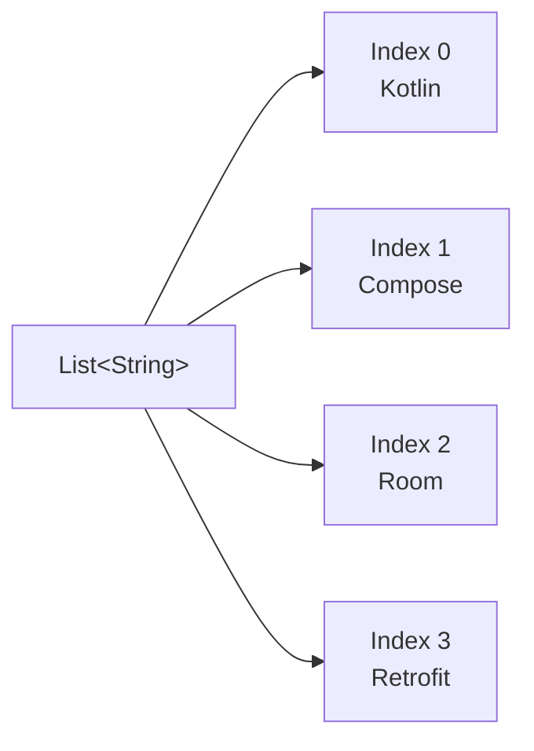
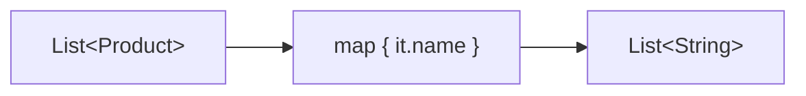
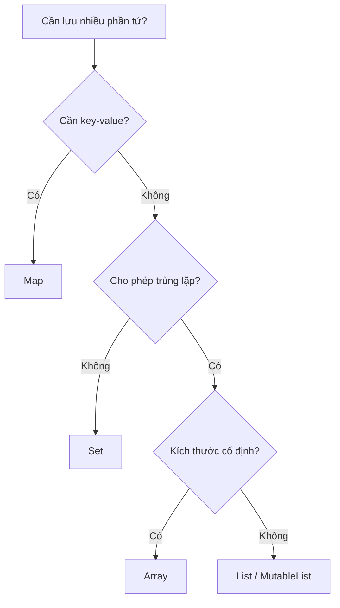
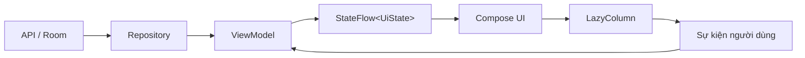
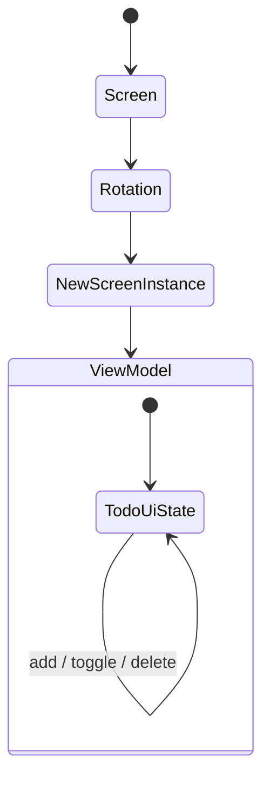
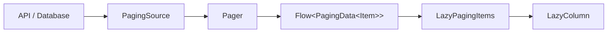
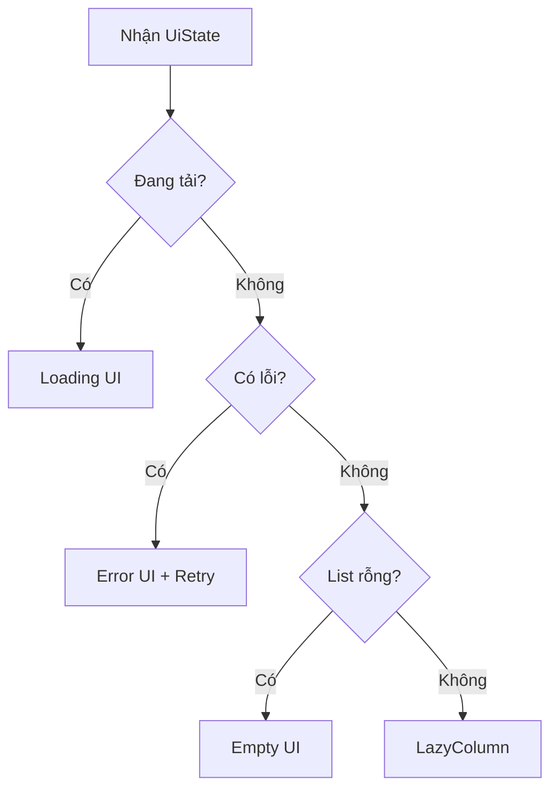

# 015 — List

**Học phần:** 01 — Language and Android Fundamentals
**Module:** Module 02 — Android Fundamentals
**Nhóm nội dung:** Data Structures and Algorithms
**Nguồn roadmap:** Android Fundamentals / Data Structures and Algorithms
**Loại bài:** Lesson
**Thứ tự trong module:** 015
**Thời lượng gợi ý:** 24 phút

---

## 1. Tóm tắt

`List` là cấu trúc dữ liệu dùng để lưu một tập hợp phần tử **có thứ tự**. Mỗi phần tử có một vị trí gọi là **index**, bắt đầu từ `0`.

Trong Android, `List` xuất hiện ở hầu hết các tính năng:

* Danh sách bài viết.
* Danh sách sản phẩm.
* Tin nhắn trò chuyện.
* Công việc cần làm.
* Kết quả tìm kiếm.
* Dữ liệu lấy từ API hoặc Room.
* Các item được hiển thị bằng `LazyColumn`, `LazyRow` hoặc `RecyclerView`.

Kotlin phân biệt rõ:

* `List<T>`: chỉ cung cấp thao tác đọc.
* `MutableList<T>`: cho phép thêm, xoá và cập nhật phần tử.

Kotlin cung cấp các giao diện chỉ đọc và có thể thay đổi cho các collection như `List`, `Set` và `Map`. Kích thước của danh sách có thể thay đổi khi thực hiện thao tác ghi, khác với mảng có kích thước được xác định khi khởi tạo. ([Kotlin][1])

---

## 2. Mục tiêu học tập

Sau bài học, bạn có thể:

* Giải thích được `List` bằng ngôn ngữ của mình.
* Phân biệt `List`, `MutableList`, `Set`, `Map` và `Array`.
* Tạo, đọc, lọc, biến đổi, sắp xếp và tìm kiếm danh sách.
* Hiểu độ phức tạp cơ bản của `ArrayList`.
* Hiển thị `List` bằng `LazyColumn` trong Jetpack Compose.
* Quản lý danh sách trong `ViewModel` và `StateFlow`.
* Tránh các lỗi liên quan đến index, mutable state và item key.
* Viết unit test cho logic xử lý danh sách.
* Xây dựng một artifact nhỏ để đưa vào portfolio.

---

## 3. Khái niệm chính

### 3.1. List là gì?

Một `List` là một collection có ba đặc điểm chính:

1. **Có thứ tự:** phần tử giữ vị trí tương đối trong danh sách.
2. **Có index:** truy cập phần tử bằng chỉ số.
3. **Cho phép trùng lặp:** nhiều phần tử có thể có cùng giá trị.

```text
Giá trị:  "Kotlin"   "Compose"   "Room"   "Kotlin"
Index:       0           1          2         3
```

Ví dụ:

```kotlin
val technologies = listOf(
    "Kotlin",
    "Compose",
    "Room",
    "Kotlin"
)

println(technologies[0]) // Kotlin
println(technologies[3]) // Kotlin
```

Danh sách hỗ trợ truy cập bằng `get(index)` hoặc cú pháp rút gọn `[index]`. Truy cập index không tồn tại sẽ gây `IndexOutOfBoundsException`; có thể dùng `getOrNull()` hoặc `getOrElse()` để tránh lỗi này. ([Kotlin][2])

---

### 3.2. Sơ đồ cấu trúc của List



Có thể hình dung danh sách giống một dãy các ngăn dữ liệu:

```text
┌──────────┬──────────┬──────────┬──────────┐
│ Kotlin   │ Compose  │ Room     │ Retrofit │
├──────────┼──────────┼──────────┼──────────┤
│ index 0  │ index 1  │ index 2  │ index 3  │
└──────────┴──────────┴──────────┴──────────┘
```

---

## 4. Ảnh minh họa

### 4.1. Danh sách được triển khai bằng mảng động


Hình trên minh họa một **dynamic array**: khi sức chứa hiện tại không còn đủ, vùng lưu trữ lớn hơn được cấp phát và các phần tử được chuyển sang vùng mới. Đây là mô hình nền tảng của `ArrayList`. Hình được phát hành theo giấy phép CC0. ([Wikimedia Commons][3])

> `List` là một **interface**, không đồng nghĩa với linked list. Một triển khai phổ biến của `MutableList` là `ArrayList`.

---

### 4.2. Danh sách cuộn trong Jetpack Compose


`LazyColumn` tạo danh sách cuộn theo chiều dọc, còn `LazyRow` tạo danh sách cuộn theo chiều ngang. Các lazy layout chỉ tạo và bố trí những item cần thiết cho vùng đang hiển thị, phù hợp hơn `Column` khi danh sách lớn hoặc không biết trước số lượng phần tử. ([Android Developers][4])

---

## 5. `List` và `MutableList`

### 5.1. List chỉ đọc

```kotlin
val languages: List<String> = listOf(
    "Kotlin",
    "Java",
    "Python"
)

println(languages[0])
println(languages.size)

// Không hợp lệ:
// languages.add("Dart")
// languages[0] = "Swift"
```

`List<T>` không cung cấp các hàm thay đổi collection như `add()`, `remove()` hoặc gán lại phần tử bằng index.

Tuy nhiên, **read-only không hoàn toàn đồng nghĩa với immutable**.

```kotlin
val mutableLanguages = mutableListOf("Kotlin", "Java")
val readOnlyLanguages: List<String> = mutableLanguages

mutableLanguages.add("Python")

println(readOnlyLanguages)
// [Kotlin, Java, Python]
```

`readOnlyLanguages` không thể tự gọi `add()`, nhưng nó vẫn đang tham chiếu đến cùng collection với `mutableLanguages`.

---

### 5.2. MutableList có thể thay đổi

```kotlin
val languages: MutableList<String> = mutableListOf(
    "Kotlin",
    "Java"
)

languages.add("Python")
languages[1] = "JavaScript"
languages.remove("Kotlin")

println(languages)
// [JavaScript, Python]
```

Các thao tác phổ biến:

```kotlin
val numbers = mutableListOf(10, 20, 30)

numbers.add(40)          // Thêm cuối danh sách
numbers.add(1, 15)       // Thêm tại index 1
numbers[0] = 5           // Cập nhật phần tử
numbers.remove(30)       // Xoá theo giá trị
numbers.removeAt(0)      // Xoá theo index
numbers.clear()          // Xoá toàn bộ
```

Mutable list hỗ trợ thêm phần tử tại một vị trí, cập nhật bằng `set()` hoặc `[]`, đồng thời dịch chuyển các phần tử phía sau khi thêm hoặc xoá tại giữa danh sách. ([Kotlin][2])

---

## 6. Các cách tạo List

### 6.1. Tạo danh sách từ các phần tử

```kotlin
val scores = listOf(8, 9, 10)
val mutableScores = mutableListOf(8, 9, 10)
```

### 6.2. Tạo danh sách rỗng

```kotlin
val emptyNames: List<String> = emptyList()
val mutableNames = mutableListOf<String>()
```

Khi collection rỗng, nên chỉ rõ kiểu dữ liệu vì compiler không có phần tử để suy luận kiểu.

---

### 6.3. Tạo danh sách bằng hàm khởi tạo

```kotlin
val squares = List(5) { index ->
    val number = index + 1
    number * number
}

println(squares)
// [1, 4, 9, 16, 25]
```

---

### 6.4. Chuyển collection khác thành List

```kotlin
val rangeList = (1..5).toList()

val array = arrayOf("A", "B", "C")
val arrayList = array.toList()

val mutableCopy = arrayList.toMutableList()
```

---

## 7. Truy cập phần tử

```kotlin
val fruits = listOf(
    "Táo",
    "Chuối",
    "Cam"
)

println(fruits[0])       // Táo
println(fruits.first()) // Táo
println(fruits.last())  // Cam
```

### 7.1. Truy cập không an toàn

```kotlin
val fruits = listOf("Táo", "Cam")

println(fruits[5])
// IndexOutOfBoundsException
```

### 7.2. Truy cập an toàn

```kotlin
val fruit = fruits.getOrNull(5)

println(fruit)
// null
```

Hoặc cung cấp giá trị mặc định:

```kotlin
val fruit = fruits.getOrElse(5) {
    "Không tồn tại"
}

println(fruit)
```

### Quy tắc nên nhớ

```kotlin
if (index in fruits.indices) {
    println(fruits[index])
}
```

`indices` trả về khoảng index hợp lệ của danh sách.

---

## 8. Duyệt qua List

### 8.1. Dùng `for`

```kotlin
val languages = listOf("Kotlin", "Java", "Python")

for (language in languages) {
    println(language)
}
```

### 8.2. Duyệt cả index và giá trị

```kotlin
languages.forEachIndexed { index, language ->
    println("$index: $language")
}
```

### 8.3. Dùng `forEach`

```kotlin
languages.forEach { language ->
    println(language)
}
```

Khi logic phức tạp hoặc cần dùng `break` và `continue`, vòng lặp `for` thường dễ đọc hơn `forEach`.

---

## 9. Các phép toán quan trọng

### 9.1. `filter` — lọc dữ liệu

```kotlin
data class Product(
    val id: Long,
    val name: String,
    val price: Double,
    val available: Boolean
)

val products = listOf(
    Product(1, "Bàn phím", 800_000.0, true),
    Product(2, "Chuột", 350_000.0, false),
    Product(3, "Màn hình", 4_500_000.0, true)
)

val availableProducts = products.filter { product ->
    product.available
}
```

`filter()` trả về một danh sách mới chứa các phần tử thỏa mãn điều kiện. ([Kotlin][5])

---

### 9.2. `map` — biến đổi dữ liệu

```kotlin
val productNames = products.map { product ->
    product.name
}

println(productNames)
// [Bàn phím, Chuột, Màn hình]
```

Luồng biến đổi:



`map()` áp dụng hàm biến đổi lên từng phần tử và trả về một danh sách kết quả mới. ([Kotlin][6])

---

### 9.3. Kết hợp `filter` và `map`

```kotlin
val availableProductNames = products
    .filter { it.available }
    .map { it.name }

println(availableProductNames)
// [Bàn phím, Màn hình]
```

---

### 9.4. Tìm một phần tử

```kotlin
val product = products.find { it.id == 2L }
```

`find()` trả về phần tử đầu tiên phù hợp hoặc `null`.

```kotlin
val productName = products
    .find { it.id == 2L }
    ?.name
    ?: "Không tìm thấy"
```

---

### 9.5. Kiểm tra điều kiện

```kotlin
val hasExpensiveProduct = products.any {
    it.price > 1_000_000
}

val allAvailable = products.all {
    it.available
}

val noFreeProduct = products.none {
    it.price == 0.0
}
```

---

### 9.6. Đếm phần tử

```kotlin
val availableCount = products.count {
    it.available
}
```

---

### 9.7. Sắp xếp

```kotlin
val priceAscending = products.sortedBy {
    it.price
}

val priceDescending = products.sortedByDescending {
    it.price
}
```

Các hàm `sortedBy()` và `sortedByDescending()` trả về danh sách mới, không sửa danh sách ban đầu.

---

### 9.8. Nhóm dữ liệu

```kotlin
data class Contact(
    val name: String,
    val group: String
)

val contacts = listOf(
    Contact("An", "Bạn bè"),
    Contact("Bình", "Công việc"),
    Contact("Chi", "Bạn bè")
)

val contactsByGroup: Map<String, List<Contact>> =
    contacts.groupBy { it.group }
```

Kết quả:

```text
Bạn bè  → [An, Chi]
Công việc → [Bình]
```

---

### 9.9. Thêm và xoá theo hướng immutable

```kotlin
val original = listOf("Kotlin", "Java")

val added = original + "Python"
val removed = added - "Java"

println(original) // [Kotlin, Java]
println(added)    // [Kotlin, Java, Python]
println(removed)  // [Kotlin, Python]
```

Toán tử `+` và `-` trên collection chỉ đọc tạo ra danh sách kết quả mới thay vì sửa trực tiếp danh sách cũ. ([Kotlin][6])

Cách này đặc biệt phù hợp khi quản lý UI state.

---

## 10. So sánh các collection

| Collection    |              Có thứ tự | Truy cập bằng index |  Cho phép trùng |        Thay đổi kích thước |
| ------------- | ---------------------: | ------------------: | --------------: | -------------------------: |
| `List`        |                     Có |                  Có |              Có | Không qua giao diện `List` |
| `MutableList` |                     Có |                  Có |              Có |                         Có |
| `Set`         |         Tùy triển khai |               Không |           Không |        Có với `MutableSet` |
| `Map`         | Lưu theo cặp key-value |   Truy cập bằng key | Key không trùng |        Có với `MutableMap` |
| `Array`       |                     Có |                  Có |              Có |                      Không |

### Chọn cấu trúc nào?



---

## 11. Độ phức tạp của ArrayList

`List` là interface nên không tự đảm bảo một độ phức tạp cụ thể. Bảng dưới áp dụng cho `ArrayList`, một triển khai danh sách bằng mảng động.

| Thao tác                   | Độ phức tạp thông thường |
| -------------------------- | -----------------------: |
| Đọc bằng index             |                   `O(1)` |
| Cập nhật bằng index        |                   `O(1)` |
| Thêm cuối danh sách        |        `O(1)` trung bình |
| Tìm kiếm bằng `contains()` |                   `O(n)` |
| `indexOf()`                |                   `O(n)` |
| Thêm vào giữa              |                   `O(n)` |
| Xoá ở giữa                 |                   `O(n)` |
| Duyệt toàn bộ              |                   `O(n)` |

`ArrayList` cung cấp truy cập index thời gian hằng số; việc thêm cuối có chi phí trung bình `O(1)`, còn thêm hoặc xoá tại một vị trí thường là `O(n)` vì các phần tử phía sau phải dịch chuyển. ([Kotlin][7])

### Ví dụ

```kotlin
val items = ArrayList<String>()

items.add("A")       // Thường nhanh
items.add("B")
items.add("C")

println(items[2])    // O(1)

items.add(0, "X")    // Các phần tử phía sau phải dịch sang phải
```

### Lưu ý quan trọng

Không nên tự động thay mọi `List` bằng linked list. Trong ứng dụng Android, nhu cầu truy cập theo index, duyệt tuần tự và hiển thị UI thường phù hợp với `ArrayList`.

---

## 12. List trong kiến trúc Android

Một luồng dữ liệu danh sách điển hình:



Nguyên tắc:

* Repository tải danh sách từ network hoặc database.
* ViewModel giữ screen state.
* UI quan sát state.
* Người dùng gửi event về ViewModel.
* ViewModel tạo danh sách mới và phát ra state mới.
* Compose cập nhật các item bị ảnh hưởng.

Android khuyến nghị ViewModel làm screen-level state holder, cung cấp state cho UI và giữ state trong các thay đổi cấu hình như xoay màn hình. ([Android Developers][8])

---

## 13. Ví dụ Android hoàn chỉnh: Todo List

### 13.1. Model

```kotlin
data class TodoItem(
    val id: Long,
    val title: String,
    val isDone: Boolean = false
)
```

Mỗi item có một `id` ổn định. Không nên dùng vị trí hiện tại làm danh tính của item.

---

### 13.2. UI State

```kotlin
data class TodoUiState(
    val items: List<TodoItem> = emptyList(),
    val isLoading: Boolean = false,
    val errorMessage: String? = null
)
```

Một màn hình danh sách thường không chỉ chứa `List`. Nó còn có:

* Trạng thái tải.
* Thông báo lỗi.
* Bộ lọc.
* Từ khóa tìm kiếm.
* Thông tin phân trang.
* Item đang được chọn.

---

### 13.3. ViewModel

```kotlin
import androidx.lifecycle.ViewModel
import kotlinx.coroutines.flow.MutableStateFlow
import kotlinx.coroutines.flow.asStateFlow
import kotlinx.coroutines.flow.update

class TodoViewModel(
    initialItems: List<TodoItem> = listOf(
        TodoItem(id = 1, title = "Học Kotlin"),
        TodoItem(id = 2, title = "Học List"),
        TodoItem(id = 3, title = "Viết ứng dụng Android")
    )
) : ViewModel() {

    private val _uiState = MutableStateFlow(
        TodoUiState(items = initialItems)
    )

    val uiState = _uiState.asStateFlow()

    fun addTodo(title: String) {
        val normalizedTitle = title.trim()

        if (normalizedTitle.isEmpty()) {
            return
        }

        val newItem = TodoItem(
            id = System.currentTimeMillis(),
            title = normalizedTitle
        )

        _uiState.update { currentState ->
            currentState.copy(
                items = currentState.items + newItem
            )
        }
    }

    fun toggleTodo(id: Long) {
        _uiState.update { currentState ->
            currentState.copy(
                items = currentState.items.map { item ->
                    if (item.id == id) {
                        item.copy(isDone = !item.isDone)
                    } else {
                        item
                    }
                }
            )
        }
    }

    fun deleteTodo(id: Long) {
        _uiState.update { currentState ->
            currentState.copy(
                items = currentState.items.filterNot { item ->
                    item.id == id
                }
            )
        }
    }
}
```

Các hàm trên không sửa trực tiếp danh sách cũ. Mỗi thao tác tạo một `List` mới:

```text
State cũ
   │
   ├── map / filter / plus
   │
   ▼
List mới
   │
   ▼
State mới
   │
   ▼
UI cập nhật
```

---

### 13.4. Hiển thị bằng LazyColumn

```kotlin
import androidx.compose.foundation.layout.Arrangement
import androidx.compose.foundation.layout.Row
import androidx.compose.foundation.layout.fillMaxWidth
import androidx.compose.foundation.layout.padding
import androidx.compose.foundation.lazy.LazyColumn
import androidx.compose.foundation.lazy.items
import androidx.compose.material3.Checkbox
import androidx.compose.material3.Text
import androidx.compose.runtime.Composable
import androidx.compose.runtime.getValue
import androidx.compose.ui.Alignment
import androidx.compose.ui.Modifier
import androidx.compose.ui.unit.dp
import androidx.lifecycle.compose.collectAsStateWithLifecycle
import androidx.lifecycle.viewmodel.compose.viewModel

@Composable
fun TodoScreen(
    viewModel: TodoViewModel = viewModel()
) {
    val uiState by viewModel.uiState.collectAsStateWithLifecycle()

    LazyColumn(
        modifier = Modifier.fillMaxWidth(),
        verticalArrangement = Arrangement.spacedBy(8.dp)
    ) {
        items(
            items = uiState.items,
            key = { item -> item.id }
        ) { item ->
            TodoRow(
                item = item,
                onToggle = {
                    viewModel.toggleTodo(item.id)
                }
            )
        }
    }
}

@Composable
private fun TodoRow(
    item: TodoItem,
    onToggle: () -> Unit
) {
    Row(
        modifier = Modifier
            .fillMaxWidth()
            .padding(horizontal = 16.dp, vertical = 8.dp),
        verticalAlignment = Alignment.CenterVertically
    ) {
        Checkbox(
            checked = item.isDone,
            onCheckedChange = {
                onToggle()
            }
        )

        Text(
            text = item.title,
            modifier = Modifier.padding(start = 12.dp)
        )
    }
}
```

---

## 14. Vì sao phải cung cấp `key`?

Đoạn code tốt:

```kotlin
items(
    items = uiState.items,
    key = { item -> item.id }
) { item ->
    TodoRow(item = item)
}
```

Đoạn code rủi ro:

```kotlin
itemsIndexed(uiState.items) { index, item ->
    TodoRow(item = item)
}
```

Index có thể thay đổi khi:

* Chèn item vào đầu danh sách.
* Xoá một item.
* Sắp xếp lại danh sách.
* Lọc dữ liệu.
* Nhận trang dữ liệu mới.

Ví dụ:

```text
Trước khi xoá:

index 0 → id 101
index 1 → id 102
index 2 → id 103

Xoá id 101:

index 0 → id 102
index 1 → id 103
```

Nếu UI coi index là danh tính, state của item cũ có thể bị gắn nhầm sang item mới. Compose cho phép cung cấp một key ổn định và duy nhất để giữ state của item nhất quán khi dữ liệu thay đổi hoặc được sắp xếp lại. ([Android Developers][9])

---

## 15. Lifecycle và state

### 15.1. Khi xoay màn hình

Nếu danh sách chỉ được tạo trong composable:

```kotlin
@Composable
fun TodoScreen() {
    var items by remember {
        mutableStateOf(emptyList<TodoItem>())
    }
}
```

State này phù hợp với state cục bộ đơn giản, nhưng screen state có business logic thường nên được đưa vào `ViewModel`.



ViewModel có vòng đời dài hơn Activity hoặc Fragment và có thể giữ UI state qua configuration change. Tuy nhiên, ViewModel không phải nơi lưu trữ vĩnh viễn. ([Android Developers][8])

---

### 15.2. Khi tiến trình ứng dụng bị hệ thống huỷ

Danh sách trong RAM có thể bị mất khi process bị huỷ.

Cách xử lý:

* Dữ liệu nghiệp vụ: lưu trong Room hoặc tải lại từ repository.
* Dữ liệu từ server: gọi lại API hoặc dùng cache.
* State nhỏ: lưu filter, query, selected ID bằng `SavedStateHandle`.
* Không nên nhét toàn bộ danh sách lớn vào `SavedStateHandle`.

Ví dụ các state phù hợp để khôi phục gồm vị trí cuộn, ID item đang xem, lựa chọn đang nhập hoặc giá trị trong trường văn bản. ([Android Developers][10])

---

## 16. Lỗi thường gặp

### 16.1. Truy cập index không tồn tại

#### Không tốt

```kotlin
val firstProduct = products[0]
```

Nếu API trả về danh sách rỗng, ứng dụng có thể crash.

#### Tốt hơn

```kotlin
val firstProduct = products.firstOrNull()
```

Hoặc:

```kotlin
val product = products.getOrNull(index)
```

---

### 16.2. Dùng `MutableList` làm UI state rồi sửa trực tiếp

#### Không tốt

```kotlin
data class TodoUiState(
    val items: MutableList<TodoItem>
)

fun addTodo(item: TodoItem) {
    _uiState.value.items.add(item)
}
```

Vấn đề:

* Không tạo state mới.
* `StateFlow` không nhận được phép gán giá trị mới.
* UI có thể không cập nhật.
* Nhiều lớp có thể cùng sửa collection.
* Khó kiểm tra lịch sử thay đổi.
* Dễ xảy ra lỗi đồng thời.

#### Tốt hơn

```kotlin
data class TodoUiState(
    val items: List<TodoItem> = emptyList()
)

fun addTodo(item: TodoItem) {
    _uiState.update { currentState ->
        currentState.copy(
            items = currentState.items + item
        )
    }
}
```

Đây là lỗi junior quan trọng nhất trong bài: **sửa trực tiếp một mutable list đang được chia sẻ thay vì tạo state mới**.

---

### 16.3. Dùng Column cho danh sách rất lớn

#### Không phù hợp

```kotlin
Column {
    products.forEach { product ->
        ProductRow(product)
    }
}
```

`Column` có thể phù hợp khi chỉ có vài phần tử và không cần cơ chế lazy.

#### Phù hợp hơn

```kotlin
LazyColumn {
    items(
        items = products,
        key = { it.id }
    ) { product ->
        ProductRow(product)
    }
}
```

Với danh sách lớn hoặc không xác định độ dài, lazy layout tránh tạo và bố trí toàn bộ item cùng lúc. ([Android Developers][11])

---

### 16.4. Dùng index làm key

```kotlin
itemsIndexed(products) { index, product ->
    ProductRow(
        modifier = Modifier,
        product = product
    )
}
```

Index không phải danh tính ổn định của dữ liệu.

Tốt hơn:

```kotlin
items(
    items = products,
    key = Product::id
) { product ->
    ProductRow(product = product)
}
```

---

### 16.5. Sửa danh sách trong khi đang duyệt

#### Không tốt

```kotlin
val numbers = mutableListOf(1, 2, 3, 4)

for (number in numbers) {
    if (number % 2 == 0) {
        numbers.remove(number)
    }
}
```

Có thể gây lỗi hoặc hành vi khó dự đoán.

#### Tốt hơn

```kotlin
numbers.removeAll { number ->
    number % 2 == 0
}
```

Hoặc tạo danh sách mới:

```kotlin
val oddNumbers = numbers.filter { number ->
    number % 2 != 0
}
```

---

### 16.6. Lọc lại danh sách lớn trong mỗi lần recomposition

#### Không tối ưu

```kotlin
@Composable
fun ProductScreen(products: List<Product>) {
    val availableProducts = products.filter {
        it.available
    }

    LazyColumn {
        items(availableProducts) {
            ProductRow(it)
        }
    }
}
```

Với phép tính nhỏ, điều này có thể không đáng kể. Nhưng với danh sách lớn hoặc phép tính phức tạp, nên:

* Tính trong ViewModel.
* Dùng `derivedStateOf` nếu đây là derived UI state.
* Cache kết quả theo input.
* Đo hiệu năng trong release build trước khi tối ưu.

---

### 16.7. Tải toàn bộ dữ liệu vô hạn vào một List

Không nên cố tải hàng chục nghìn bản ghi cùng lúc.

Luồng phù hợp:



Android khuyến nghị kết hợp Paging với lazy list cho danh sách lớn hoặc danh sách gần như vô hạn để tải dữ liệu tăng dần, giảm thời gian tải ban đầu và mức sử dụng bộ nhớ. ([Android Developers][12])

---

## 17. Ảnh hưởng đến UX và chất lượng ứng dụng

### 17.1. UX

Quản lý List tốt giúp:

* Cuộn mượt.
* Không mất vị trí item.
* Không hiển thị nhầm trạng thái checkbox.
* Tránh item nhảy vị trí bất thường.
* Hỗ trợ loading, empty và error state rõ ràng.
* Hiển thị dữ liệu mới mà không tải lại toàn màn hình.

### 17.2. Reliability

Các rủi ro thường gặp:

* Crash do index không hợp lệ.
* Dữ liệu trùng khi gọi API nhiều lần.
* Item bị xoá nhầm vì dùng index thay ID.
* Kết quả cũ ghi đè kết quả mới.
* Mutable list bị thay đổi từ nhiều nơi.
* Danh sách mất sau process death.

### 17.3. Maintainability

Code dễ bảo trì hơn khi:

* UI chỉ nhận `List<T>` thay vì `MutableList<T>`.
* Chỉ ViewModel hoặc repository được phép cập nhật dữ liệu.
* Item dùng model có ID ổn định.
* Các thao tác lọc, sắp xếp được tách thành hàm riêng.
* UI state biểu diễn đủ loading, success, empty và error.

### 17.4. Performance

Cần chú ý:

* Không dùng `Column` cho hàng nghìn item.
* Không tìm kiếm tuyến tính lặp lại quá nhiều lần.
* Không liên tục sao chép danh sách cực lớn mà không đo lường.
* Dùng Paging khi dữ liệu lớn.
* Cung cấp `key` và cân nhắc `contentType` với danh sách nhiều loại item.
* Đo hiệu năng bằng release build; debug build có thể làm lazy list trông chậm hơn thực tế. ([Android Developers][9])

---

## 18. Empty, loading và error state

Không nên coi một danh sách rỗng luôn có nghĩa là “không có dữ liệu”.

```kotlin
data class ProductUiState(
    val products: List<Product> = emptyList(),
    val isLoading: Boolean = false,
    val errorMessage: String? = null
)
```

Cách xác định UI:

```kotlin
when {
    uiState.isLoading -> {
        LoadingContent()
    }

    uiState.errorMessage != null -> {
        ErrorContent(
            message = uiState.errorMessage
        )
    }

    uiState.products.isEmpty() -> {
        EmptyContent()
    }

    else -> {
        ProductList(
            products = uiState.products
        )
    }
}
```

Sơ đồ:



---

## 19. Unit test

### 19.1. Kiểm tra toggle đúng item

```kotlin
import kotlin.test.Test
import kotlin.test.assertFalse
import kotlin.test.assertTrue

class TodoViewModelTest {

    @Test
    fun toggleTodo_updatesOnlyMatchingItem() {
        val viewModel = TodoViewModel(
            initialItems = listOf(
                TodoItem(
                    id = 1,
                    title = "Học Kotlin"
                ),
                TodoItem(
                    id = 2,
                    title = "Học List"
                )
            )
        )

        viewModel.toggleTodo(id = 2)

        val items = viewModel.uiState.value.items

        assertFalse(
            items.first { it.id == 1L }.isDone
        )

        assertTrue(
            items.first { it.id == 2L }.isDone
        )
    }
}
```

### 19.2. Kiểm tra xoá item

```kotlin
import kotlin.test.Test
import kotlin.test.assertEquals

class DeleteTodoTest {

    @Test
    fun deleteTodo_removesMatchingItem() {
        val viewModel = TodoViewModel(
            initialItems = listOf(
                TodoItem(1, "A"),
                TodoItem(2, "B"),
                TodoItem(3, "C")
            )
        )

        viewModel.deleteTodo(id = 2)

        val result = viewModel.uiState.value.items

        assertEquals(
            listOf(1L, 3L),
            result.map { it.id }
        )
    }
}
```

### Các trường hợp cần test

* Danh sách ban đầu rỗng.
* Thêm item hợp lệ.
* Không thêm tiêu đề chỉ có khoảng trắng.
* Toggle ID tồn tại.
* Toggle ID không tồn tại.
* Xoá phần tử đầu, giữa và cuối.
* Lọc danh sách.
* Sắp xếp tăng và giảm.
* API trả về dữ liệu trùng ID.
* Loading, empty và error state.

---

## 20. Thực hành trong 24 phút

### Phút 0–5: hiểu khái niệm

Tạo một danh sách:

```kotlin
val lessons = listOf(
    "List",
    "Set",
    "Map"
)
```

In ra:

```kotlin
println(lessons.size)
println(lessons.firstOrNull())
println(lessons.getOrNull(10))
```

### Phút 5–10: biến đổi danh sách

```kotlin
val numbers = listOf(1, 2, 3, 4, 5, 6)

val result = numbers
    .filter { it % 2 == 0 }
    .map { it * it }

println(result)
// [4, 16, 36]
```

### Phút 10–18: tạo Todo ViewModel

Cài đặt ba hàm:

```kotlin
fun addTodo(title: String)
fun toggleTodo(id: Long)
fun deleteTodo(id: Long)
```

### Phút 18–22: hiển thị bằng LazyColumn

```kotlin
LazyColumn {
    items(
        items = uiState.items,
        key = { it.id }
    ) { item ->
        TodoRow(item)
    }
}
```

### Phút 22–24: kiểm tra

* Thêm ba item.
* Xoá item ở giữa.
* Toggle item cuối.
* Xoay màn hình.
* Kiểm tra item state còn đúng.
* Kiểm tra empty state.

---

## 21. Ghi chú năm dòng về List

> `List` là collection dùng để lưu các phần tử có thứ tự.
> Mỗi phần tử được truy cập bằng index bắt đầu từ `0`.
> List cho phép nhiều phần tử có giá trị trùng nhau.
> Kotlin có `List` chỉ đọc và `MutableList` có thể thay đổi.
> Trong Android, List thường được giữ trong ViewModel và hiển thị bằng LazyColumn.

---

## 22. Bài tập

### Bài 1 — Lọc khóa học đã hoàn thành

```kotlin
data class Course(
    val id: Long,
    val title: String,
    val completed: Boolean
)
```

Cho danh sách:

```kotlin
val courses = listOf(
    Course(1, "Kotlin Basics", true),
    Course(2, "Jetpack Compose", false),
    Course(3, "Room Database", true)
)
```

Yêu cầu:

1. Lấy các khóa học đã hoàn thành.
2. Chuyển kết quả thành `List<String>` chứa tên.
3. Sắp xếp tên theo alphabet.

Kết quả mong đợi:

```text
[Kotlin Basics, Room Database]
```

Một cách giải:

```kotlin
val completedCourseNames = courses
    .filter { it.completed }
    .map { it.title }
    .sorted()
```

---

### Bài 2 — Tính tổng giỏ hàng

```kotlin
data class CartItem(
    val name: String,
    val price: Double,
    val quantity: Int
)
```

Yêu cầu tính tổng:

```kotlin
val total = cartItems.sumOf { item ->
    item.price * item.quantity
}
```

Mở rộng:

* Bỏ các item có `quantity <= 0`.
* Giảm 10% cho đơn từ 1.000.000 đồng.
* Nhóm item theo danh mục.
* Hiển thị bằng `LazyColumn`.

---

### Bài 3 — Tìm lỗi

Đoạn code:

```kotlin
fun removeCompleted() {
    for (item in todoItems) {
        if (item.isDone) {
            todoItems.remove(item)
        }
    }
}
```

Hãy sửa bằng một trong hai cách:

```kotlin
todoItems.removeAll { it.isDone }
```

Hoặc:

```kotlin
val activeItems = todoItems.filterNot {
    it.isDone
}
```

---

## 23. Artifact cho portfolio

### Mini project: Smart Todo List

#### Chức năng tối thiểu

* Hiển thị danh sách công việc.
* Thêm công việc.
* Đánh dấu hoàn thành.
* Xoá công việc.
* Lọc tất cả, đang làm và hoàn thành.
* Empty state.
* Unit test cho ViewModel.

#### Chức năng nâng cao

* Lưu bằng Room.
* Tìm kiếm.
* Sắp xếp theo ngày hoặc mức ưu tiên.
* Swipe để xoá.
* Undo bằng Snackbar.
* Paging cho lịch sử công việc.
* Khôi phục filter sau process death.
* UI test cho thao tác thêm và xoá.

#### Cấu trúc gợi ý

```text
todo-list/
├── data/
│   ├── local/
│   │   ├── TodoDao.kt
│   │   └── TodoEntity.kt
│   └── TodoRepository.kt
├── domain/
│   └── TodoItem.kt
├── ui/
│   ├── TodoScreen.kt
│   ├── TodoUiState.kt
│   └── TodoViewModel.kt
├── test/
│   └── TodoViewModelTest.kt
└── README.md
```

#### README nên có

* Mục tiêu dự án.
* Ảnh chụp màn hình.
* Kiến trúc dữ liệu.
* Sơ đồ UDF.
* Cách xử lý `List`.
* Quyết định sử dụng immutable UI state.
* Unit test.
* Các rủi ro về lifecycle và process death.

---

## 24. Checklist hoàn thành

### Kiến thức

* [ ] Giải thích được `List` là collection có thứ tự.
* [ ] Biết index bắt đầu từ `0`.
* [ ] Biết List cho phép phần tử trùng.
* [ ] Phân biệt `List` và `MutableList`.
* [ ] Phân biệt `List`, `Set`, `Map` và `Array`.
* [ ] Hiểu `List` không đồng nghĩa với linked list.
* [ ] Biết độ phức tạp cơ bản của `ArrayList`.

### Kotlin

* [ ] Sử dụng được `listOf()` và `mutableListOf()`.
* [ ] Sử dụng được `getOrNull()`.
* [ ] Sử dụng được `filter()`, `map()` và `find()`.
* [ ] Sử dụng được `sortedBy()`.
* [ ] Sử dụng được `groupBy()`.
* [ ] Biết tạo danh sách mới bằng `+`, `-`, `map` và `filter`.

### Android

* [ ] Hiển thị danh sách bằng `LazyColumn`.
* [ ] Cung cấp key ổn định cho item.
* [ ] Giữ screen state trong ViewModel.
* [ ] Không sửa trực tiếp mutable list dùng chung.
* [ ] Có loading, empty và error state.
* [ ] Hiểu dữ liệu nào cần Room và dữ liệu nào cần SavedStateHandle.
* [ ] Biết khi nào cần Paging.

### Testing và portfolio

* [ ] Có unit test cho thêm, xoá và cập nhật item.
* [ ] Test trường hợp danh sách rỗng.
* [ ] Test ID không tồn tại.
* [ ] Có screenshot hoặc GIF.
* [ ] Có sơ đồ data flow.
* [ ] Có README giải thích quyết định kỹ thuật.

---

## 25. Ghi chú sản xuất

Trước khi đưa một màn hình danh sách vào production, cần kiểm tra:

```text
Dữ liệu đến từ đâu?
        ↓
API, Room hay cache?
        ↓
Ai sở hữu List?
        ↓
Repository hay ViewModel?
        ↓
UI nhận List chỉ đọc chưa?
        ↓
Item có ID ổn định không?
        ↓
Có loading, empty và error state không?
        ↓
Danh sách lớn có cần Paging không?
        ↓
Rotate và process death xử lý thế nào?
        ↓
Unit test và UI test đã bảo vệ hành vi chính chưa?
```

Một triển khai tốt thường có dạng:

```kotlin
Repository
    -> Flow<List<Model>>
    -> ViewModel
    -> StateFlow<UiState>
    -> collectAsStateWithLifecycle()
    -> LazyColumn
```

Quy tắc quan trọng nhất:

> UI nên nhận `List<T>` chỉ đọc; việc cập nhật dữ liệu nên được tập trung tại ViewModel hoặc repository và phát ra dưới dạng state mới.

[1]: https://kotlinlang.org/docs/collections-overview.html?utm_source=chatgpt.com "Collections overview | Kotlin Documentation"
[2]: https://kotlinlang.org/docs/list-operations.html?utm_source=chatgpt.com "List-specific operations | Kotlin Documentation"
[3]: https://commons.wikimedia.org/wiki/File%3ADynamic_array.svg "File:Dynamic array.svg - Wikimedia Commons"
[4]: https://developer.android.com/develop/ui/compose/lists?utm_source=chatgpt.com "Lazy lists and lazy grids | Jetpack Compose"
[5]: https://kotlinlang.org/docs/collection-filtering.html?utm_source=chatgpt.com "Filtering collections | Kotlin Documentation"
[6]: https://kotlinlang.org/api/core/kotlin-stdlib/kotlin.collections/-array-list/ "ArrayList | Core API – Kotlin Programming Language"
[7]: https://kotlinlang.org/api/core/kotlin-stdlib/kotlin.collections/-array-list/?utm_source=chatgpt.com "ArrayList | Core API – Kotlin Programming Language"
[8]: https://developer.android.com/topic/libraries/architecture/views/viewmodel?hl=en&utm_source=chatgpt.com "ViewModel overview (Views)  |  Android Developers"
[9]: https://developer.android.com/develop/ui/compose/lists?hl=vi "Danh sách lazy và lưới lazy  |  Jetpack Compose  |  Android Developers"
[10]: https://developer.android.com/topic/libraries/architecture/views/viewmodel/viewmodel-savedstate-views?hl=en&utm_source=chatgpt.com "Saved State module for ViewModel (Views)  |  Android Developers"
[11]: https://developer.android.com/develop/ui/compose/lists?hl=en&utm_source=chatgpt.com "Lazy lists and lazy grids  |  Jetpack Compose  |  Android Developers"
[12]: https://developer.android.com/develop/ui/compose/quick-guides/content/lazily-load-list?utm_source=chatgpt.com "Lazily load data with lists and Paging | Jetpack Compose"

---

# Bài luyện tập

## Mục tiêu


## Đề bài


## Yêu cầu hoàn thành

- [ ] 
- [ ] 
- [ ] 

## Kết quả / lời giải


## Ghi chú
