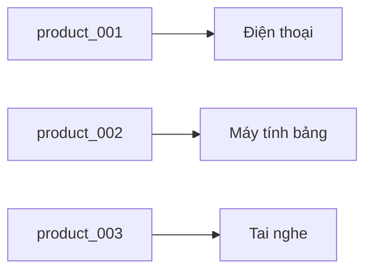
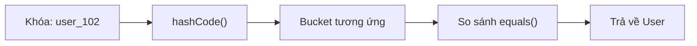
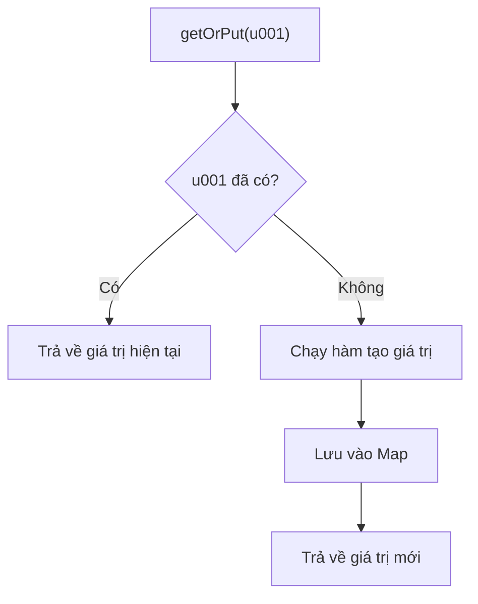
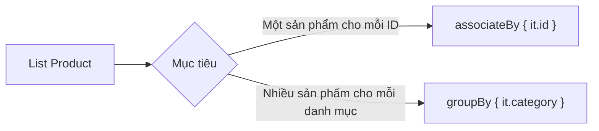
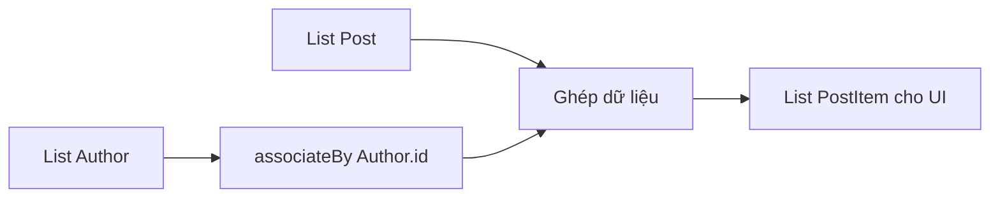
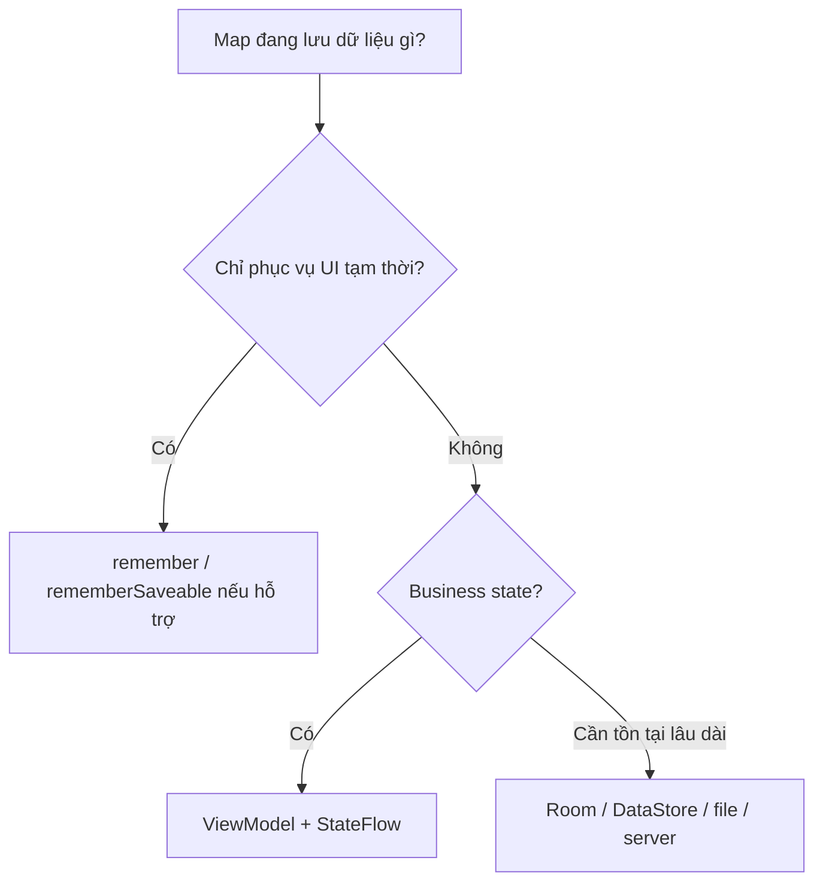
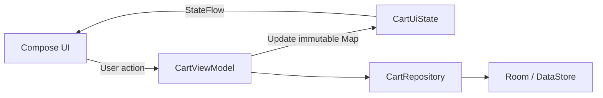
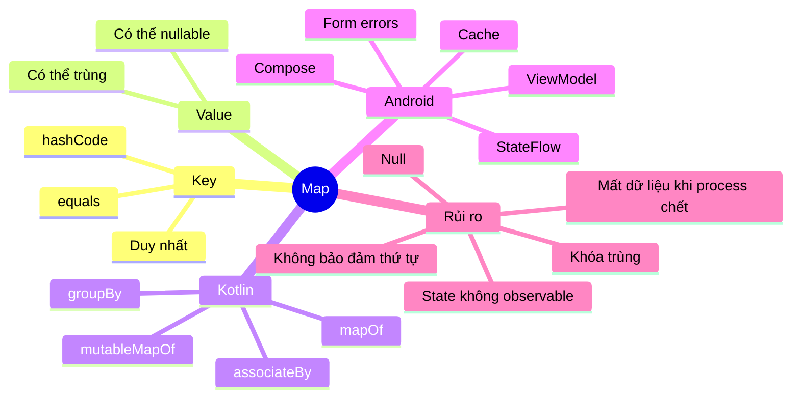

[![Data Structures in Kotlin: Map — \[PartIII\] | by Daniely Murua ...](https://tse1.mm.bing.net/th/id/OIP.Co0QGuMxokIDVhNrZ-4UgAHaFj?r=0\&pid=Api)](https://medium.com/wearejaya/data-structures-in-kotlin-map-partiii-abdd04621a3?utm_source=chatgpt.com)

# 016 — Map trong Kotlin và Android

| Thuộc tính              | Nội dung                                              |
| ----------------------- | ----------------------------------------------------- |
| **Học phần**            | 01 — Language and Android Fundamentals                |
| **Module**              | Module 02 — Android Fundamentals                      |
| **Nhóm nội dung**       | Data Structures and Algorithms                        |
| **Nguồn roadmap**       | Android Fundamentals / Data Structures and Algorithms |
| **Loại bài**            | Lesson                                                |
| **Thứ tự trong module** | 016                                                   |
| **Thời lượng gợi ý**    | 24 phút                                               |
| **Chủ đề chính**        | Lưu trữ và truy xuất dữ liệu theo cặp khóa–giá trị    |

> [!NOTE]
> **Map trong bài này là cấu trúc dữ liệu `Map<K, V>` của Kotlin**, không phải bản đồ địa lý hay Google Maps SDK.

---

## Mục lục

1. [Mục tiêu bài học](#1-mục-tiêu-bài-học)
2. [Map là gì?](#2-map-là-gì)
3. [Map hoạt động như thế nào?](#3-map-hoạt-động-như-thế-nào)
4. [Map và MutableMap](#4-map-và-mutablemap)
5. [Các thao tác quan trọng](#5-các-thao-tác-quan-trọng)
6. [Chuyển đổi dữ liệu sang Map](#6-chuyển-đổi-dữ-liệu-sang-map)
7. [Ứng dụng trong Android](#7-ứng-dụng-trong-android)
8. [Ví dụ hoàn chỉnh với ViewModel](#8-ví-dụ-hoàn-chỉnh-với-viewmodel)
9. [Map trong Jetpack Compose](#9-map-trong-jetpack-compose)
10. [Hiệu năng và độ phức tạp](#10-hiệu-năng-và-độ-phức-tạp)
11. [Lỗi thường gặp](#11-lỗi-thường-gặp)
12. [Kiểm thử](#12-kiểm-thử)
13. [Bài tập thực hành](#13-bài-tập-thực-hành)
14. [Ý tưởng portfolio](#14-ý-tưởng-portfolio)
15. [Checklist hoàn thành](#15-checklist-hoàn-thành)
16. [Tóm tắt](#16-tóm-tắt)

---

## 1. Mục tiêu bài học

Sau bài học, bạn có thể:

* Giải thích được `Map` bằng ngôn ngữ của mình.
* Phân biệt `Map` và `MutableMap`.
* Tạo, đọc, cập nhật, xóa và duyệt dữ liệu trong `Map`.
* Biết cách xử lý khi một khóa không tồn tại.
* Chuyển `List` thành `Map` bằng `associateBy()`.
* Phân biệt `associateBy()` và `groupBy()`.
* Sử dụng `Map` trong `ViewModel`, `StateFlow` và Jetpack Compose.
* Tránh các lỗi liên quan đến khóa trùng, trạng thái UI và vòng đời Android.
* Viết unit test cho logic sử dụng `Map`.

---

## 2. Map là gì?

`Map` là cấu trúc dữ liệu lưu các phần tử dưới dạng:

```text
Key → Value
Khóa → Giá trị
```

Ví dụ:

```text
"user_001" → "An"
"user_002" → "Bình"
"user_003" → "Chi"
```

Trong đó:

* **Key — khóa** dùng để xác định một phần tử.
* **Value — giá trị** là dữ liệu gắn với khóa đó.
* Mỗi khóa chỉ xuất hiện một lần.
* Nhiều khóa khác nhau có thể chứa cùng một giá trị.
* Kiểu dữ liệu của khóa và giá trị có thể khác nhau.

Kotlin biểu diễn Map bằng hai kiểu tổng quát:

```kotlin
Map<K, V>
MutableMap<K, V>
```

Trong đó:

* `K` là kiểu của khóa.
* `V` là kiểu của giá trị.

Ví dụ:

```kotlin
val userNames: Map<String, String> = mapOf(
    "u001" to "An",
    "u002" to "Bình",
    "u003" to "Chi"
)
```

Kotlin cung cấp các hàm như `mapOf()` và `mutableMapOf()` để tạo Map. Với MutableMap, lập trình viên có thể thêm, xóa hoặc cập nhật toàn bộ cặp khóa–giá trị. ([Kotlin][1])

### So sánh với List

Giả sử ứng dụng có 10.000 người dùng và cần tìm người dùng có ID `"u8452"`.

Với `List`, bạn thường phải tìm lần lượt:

```kotlin
val user = users.find { it.id == "u8452" }
```

Với `Map`, bạn truy cập trực tiếp bằng ID:

```kotlin
val user = usersById["u8452"]
```

Vì vậy, `Map` phù hợp khi dữ liệu thường xuyên được truy xuất bằng một khóa duy nhất như:

* ID người dùng.
* Mã sản phẩm.
* Tên cấu hình.
* Mã ngôn ngữ.
* ID của item trong giỏ hàng.
* Tên trường và thông báo lỗi.
* ID màn hình và trạng thái màn hình.

---

## 3. Map hoạt động như thế nào?

### 3.1 Sơ đồ khóa–giá trị



Khi ứng dụng cần sản phẩm `"product_002"`, nó sử dụng khóa để lấy giá trị tương ứng:

```kotlin
val productName = products["product_002"]
```

### 3.2 HashMap

Một trong những cách triển khai Map phổ biến là `HashMap`.




*Hình minh họa một hàm băm đưa các khóa vào những vị trí trong bảng; hai khóa có thể rơi vào cùng một vị trí, tạo ra hash collision.*

Quy trình đơn giản:

1. Kotlin gọi `hashCode()` của khóa.
2. Giá trị băm được chuyển thành vị trí lưu trữ.
3. Khi truy xuất, Map tìm bucket tương ứng.
4. Map dùng `equals()` để xác nhận đúng khóa.
5. Giá trị tương ứng được trả về.

Do đó, khóa của `HashMap` cần có `equals()` và `hashCode()` nhất quán.

---

## 4. Map và MutableMap

### 4.1 Map chỉ đọc

```kotlin
val countryCodes: Map<String, String> = mapOf(
    "VN" to "Việt Nam",
    "JP" to "Nhật Bản",
    "KR" to "Hàn Quốc"
)
```

Bạn có thể đọc:

```kotlin
println(countryCodes["VN"])
```

Nhưng không thể cập nhật trực tiếp:

```kotlin
// Không biên dịch
countryCodes["US"] = "Hoa Kỳ"
```

### 4.2 MutableMap có thể thay đổi

```kotlin
val cart: MutableMap<String, Int> = mutableMapOf(
    "product_001" to 1,
    "product_002" to 2
)

cart["product_003"] = 1
cart["product_001"] = 3
cart.remove("product_002")
```

### 4.3 Bảng so sánh

| Đặc điểm                   | `Map<K, V>` |   `MutableMap<K, V>` |
| -------------------------- | ----------: | -------------------: |
| Đọc dữ liệu                |          Có |                   Có |
| Thêm phần tử               |       Không |                   Có |
| Cập nhật giá trị           |       Không |                   Có |
| Xóa phần tử                |       Không |                   Có |
| Phù hợp làm UI state       |         Tốt | Cần sử dụng cẩn thận |
| Giảm thay đổi ngoài ý muốn |         Tốt |             Thấp hơn |

> [!IMPORTANT]
> `Map` trong Kotlin là **giao diện chỉ đọc**, nhưng không đồng nghĩa với dữ liệu bất biến tuyệt đối. Một `Map` chỉ đọc vẫn có thể là góc nhìn của một MutableMap được giữ ở nơi khác. Trong kiến trúc Android, nên giới hạn quyền sở hữu MutableMap và chỉ phát ra `Map` cho UI. ([Kotlin][2])

Ví dụ:

```kotlin
class UserRepository {

    private val mutableUsers = mutableMapOf<String, User>()

    val users: Map<String, User>
        get() = mutableUsers.toMap()
}
```

---

## 5. Các thao tác quan trọng

## 5.1 Tạo Map

```kotlin
val scores = mapOf(
    "An" to 90,
    "Bình" to 85,
    "Chi" to 95
)
```

Cú pháp:

```kotlin
key to value
```

Thực chất, `to` tạo ra một `Pair`:

```kotlin
val entry: Pair<String, Int> = "An" to 90
```

Khi khởi tạo dữ liệu lớn hoặc trong đoạn mã nhạy cảm với cấp phát bộ nhớ, tài liệu Kotlin lưu ý rằng cú pháp `to` tạo đối tượng `Pair` tạm thời; có thể dùng `apply` và gán trực tiếp để giảm các đối tượng trung gian. ([Kotlin][3])

```kotlin
val scores = mutableMapOf<String, Int>().apply {
    this["An"] = 90
    this["Bình"] = 85
    this["Chi"] = 95
}
```

---

## 5.2 Truy xuất giá trị

```kotlin
val scores = mapOf(
    "An" to 90,
    "Bình" to 85
)

val anScore = scores["An"]
```

Kiểu của `anScore` là:

```kotlin
Int?
```

Không phải `Int`, vì khóa có thể không tồn tại.

```kotlin
val unknownScore = scores["Dũng"] // null
```

Toán tử `map[key]` trả về `null` khi không tìm thấy khóa. Nếu Map cho phép cả giá trị `null`, cần dùng `containsKey()` để phân biệt giữa “khóa không tồn tại” và “khóa tồn tại nhưng giá trị là null”. ([Kotlin][4])

### Xử lý bằng Elvis operator

```kotlin
val score = scores["Dũng"] ?: 0
```

### Kiểm tra khóa

```kotlin
if ("An" in scores) {
    println("Tìm thấy điểm của An")
}
```

Tương đương:

```kotlin
if (scores.containsKey("An")) {
    println("Tìm thấy điểm của An")
}
```

### Lấy giá trị mặc định

```kotlin
val score = scores.getOrDefault("Dũng", 0)
```

### Chỉ dùng `getValue()` khi khóa chắc chắn tồn tại

```kotlin
val score = scores.getValue("An")
```

`getValue()` ném ngoại lệ nếu khóa không tồn tại. Vì vậy, không nên dùng với dữ liệu API hoặc input người dùng chưa được kiểm tra. ([Kotlin][5])

---

## 5.3 Thêm và cập nhật dữ liệu

```kotlin
val quantities = mutableMapOf<String, Int>()

quantities["product_001"] = 1
quantities["product_002"] = 2
```

Nếu khóa chưa tồn tại, phần tử mới được thêm:

```kotlin
quantities["product_003"] = 1
```

Nếu khóa đã tồn tại, giá trị cũ bị thay thế:

```kotlin
quantities["product_001"] = 5
```

Kết quả:

```text
product_001 → 5
```

Không phải:

```text
product_001 → 1
product_001 → 5
```

Mỗi khóa trong Map chỉ liên kết với một giá trị tại một thời điểm. Việc gán lại cùng khóa sẽ cập nhật giá trị của entry đó. ([Kotlin][1])

---

## 5.4 Cập nhật dựa trên giá trị cũ

```kotlin
val quantities = mutableMapOf(
    "product_001" to 2
)

val oldQuantity = quantities["product_001"] ?: 0
quantities["product_001"] = oldQuantity + 1
```

Có thể viết ngắn hơn:

```kotlin
quantities["product_001"] =
    quantities.getOrDefault("product_001", 0) + 1
```

---

## 5.5 Thêm giá trị nếu khóa chưa tồn tại

```kotlin
val cache = mutableMapOf<String, User>()

val user = cache.getOrPut("u001") {
    loadUserFromDatabase("u001")
}
```

Luồng hoạt động:



`getOrPut()` hữu ích cho:

* Cache đơn giản.
* Gom nhóm dữ liệu.
* Khởi tạo danh sách theo khóa.
* Tránh viết `containsKey()` rồi mới thêm. ([Kotlin][6])

---

## 5.6 Xóa phần tử

```kotlin
val cart = mutableMapOf(
    "p01" to 1,
    "p02" to 3
)

cart.remove("p01")
```

Xóa toàn bộ:

```kotlin
cart.clear()
```

---

## 5.7 Duyệt Map

```kotlin
val prices = mapOf(
    "Cà phê" to 35_000,
    "Trà sữa" to 45_000,
    "Nước cam" to 40_000
)

for ((name, price) in prices) {
    println("$name: $price đồng")
}
```

Hoặc:

```kotlin
prices.forEach { (name, price) ->
    println("$name: $price đồng")
}
```

### Duyệt khóa

```kotlin
for (name in prices.keys) {
    println(name)
}
```

### Duyệt giá trị

```kotlin
for (price in prices.values) {
    println(price)
}
```

### Duyệt entry

```kotlin
for (entry in prices.entries) {
    println("${entry.key}: ${entry.value}")
}
```

Kotlin cung cấp `keys`, `values` và `entries` để truy cập từng phần tương ứng của Map. ([Kotlin][1])

---

## 5.8 Lọc và biến đổi Map

### Lọc theo giá trị

```kotlin
val expensiveItems = prices.filterValues { price ->
    price >= 40_000
}
```

Kết quả:

```kotlin
mapOf(
    "Trà sữa" to 45_000,
    "Nước cam" to 40_000
)
```

Khi gọi `filter()` trên Map, kết quả vẫn là một Map. ([Kotlin][7])

### Lọc theo khóa

```kotlin
val productsWithP = prices.filterKeys { name ->
    name.startsWith("P")
}
```

### Thay đổi giá trị

```kotlin
val discountedPrices = prices.mapValues { (_, price) ->
    price * 90 / 100
}
```

### Thay đổi khóa

```kotlin
val normalizedPrices = prices.mapKeys { (name, _) ->
    name.lowercase()
}
```

> [!WARNING]
> Khi `mapKeys()` tạo ra nhiều khóa giống nhau, giá trị xuất hiện sau có thể ghi đè giá trị trước.

---

## 6. Chuyển đổi dữ liệu sang Map

Đây là thao tác rất thường gặp trong Android.

Giả sử API trả về một danh sách:

```kotlin
data class User(
    val id: String,
    val name: String
)

val users = listOf(
    User("u001", "An"),
    User("u002", "Bình"),
    User("u003", "Chi")
)
```

## 6.1 Dùng `associateBy()`

```kotlin
val usersById: Map<String, User> =
    users.associateBy { user -> user.id }
```

Kết quả:

```text
u001 → User("u001", "An")
u002 → User("u002", "Bình")
u003 → User("u003", "Chi")
```

Truy xuất:

```kotlin
val user = usersById["u002"]
```

### Cú pháp ngắn

```kotlin
val usersById = users.associateBy(User::id)
```

## 6.2 Dùng `associate()`

```kotlin
val namesById = users.associate { user ->
    user.id to user.name
}
```

Kết quả:

```kotlin
Map<String, String>
```

## 6.3 `associateBy()` và khóa trùng

```kotlin
val users = listOf(
    User("u001", "An"),
    User("u001", "Khánh")
)

val usersById = users.associateBy(User::id)
```

Cả hai phần tử cùng khóa `"u001"`, vì vậy một phần tử sẽ bị ghi đè.

Đây là lỗi dễ xảy ra khi:

* API trả ID trùng.
* Chọn trường không duy nhất làm khóa.
* Dữ liệu chưa được làm sạch.

## 6.4 Khi cần giữ tất cả phần tử: dùng `groupBy()`

```kotlin
data class Product(
    val id: String,
    val category: String,
    val name: String
)

val productsByCategory = products.groupBy { product ->
    product.category
}
```

Kiểu kết quả:

```kotlin
Map<String, List<Product>>
```

### So sánh

| Hàm             | Kiểu kết quả      | Khi khóa trùng                     |
| --------------- | ----------------- | ---------------------------------- |
| `associateBy()` | `Map<K, T>`       | Chỉ giữ một phần tử cho mỗi khóa   |
| `groupBy()`     | `Map<K, List<T>>` | Giữ tất cả phần tử trong danh sách |



---

## 7. Ứng dụng trong Android

## 7.1 Lập chỉ mục dữ liệu theo ID

```kotlin
val postsById: Map<Long, Post> =
    posts.associateBy(Post::id)
```

Phù hợp khi:

* Mở màn hình chi tiết theo ID.
* Ghép dữ liệu từ hai API.
* Tìm item nhanh khi người dùng chọn.
* Đồng bộ dữ liệu giữa danh sách và chi tiết.

---

## 7.2 Lưu số lượng sản phẩm trong giỏ hàng

```kotlin
val quantities: Map<String, Int> = mapOf(
    "product_001" to 2,
    "product_002" to 1
)
```

Trong đó:

```text
productId → quantity
```

---

## 7.3 Lưu lỗi của form

```kotlin
val fieldErrors: Map<String, String> = mapOf(
    "email" to "Email không hợp lệ",
    "password" to "Mật khẩu phải có ít nhất 8 ký tự"
)
```

UI có thể truy xuất:

```kotlin
val emailError = fieldErrors["email"]
```

Tuy nhiên, với form quan trọng, nên cân nhắc dùng kiểu dữ liệu rõ ràng hơn thay vì chuỗi tự do:

```kotlin
enum class LoginField {
    EMAIL,
    PASSWORD
}

val fieldErrors: Map<LoginField, String>
```

Cách này tránh lỗi đánh máy như:

```kotlin
fieldErrors["emial"]
```

---

## 7.4 Theo dõi trạng thái tải của từng item

```kotlin
enum class LoadingStatus {
    IDLE,
    LOADING,
    SUCCESS,
    ERROR
}

val downloadStatus: Map<String, LoadingStatus> = mapOf(
    "file_001" to LoadingStatus.SUCCESS,
    "file_002" to LoadingStatus.LOADING,
    "file_003" to LoadingStatus.ERROR
)
```

---

## 7.5 Cache dữ liệu theo khóa

```kotlin
class UserCache {

    private val usersById = mutableMapOf<String, User>()

    fun get(id: String): User? {
        return usersById[id]
    }

    fun put(user: User) {
        usersById[user.id] = user
    }

    fun remove(id: String) {
        usersById.remove(id)
    }

    fun clear() {
        usersById.clear()
    }
}
```

> [!WARNING]
> Đây chỉ là cache trong bộ nhớ. Dữ liệu có thể mất khi tiến trình ứng dụng bị hệ điều hành đóng. Dữ liệu cần tồn tại lâu dài nên được lưu trong Room, DataStore, file hoặc nguồn dữ liệu thích hợp.

---

## 7.6 Ghép dữ liệu từ nhiều nguồn

Ví dụ API thứ nhất trả danh sách bài viết:

```kotlin
data class Post(
    val id: String,
    val authorId: String,
    val title: String
)
```

API thứ hai trả danh sách tác giả:

```kotlin
data class Author(
    val id: String,
    val name: String
)
```

Tạo Map tác giả:

```kotlin
val authorsById = authors.associateBy(Author::id)
```

Ghép dữ liệu:

```kotlin
val postItems = posts.map { post ->
    PostItem(
        id = post.id,
        title = post.title,
        authorName = authorsById[post.authorId]?.name
            ?: "Không xác định"
    )
}
```

Sơ đồ:



---

## 8. Ví dụ hoàn chỉnh với ViewModel

Xây dựng trạng thái số lượng sản phẩm trong giỏ hàng:

```kotlin
data class CartUiState(
    val quantities: Map<String, Int> = emptyMap()
)
```

### ViewModel

```kotlin
import androidx.lifecycle.ViewModel
import kotlinx.coroutines.flow.MutableStateFlow
import kotlinx.coroutines.flow.StateFlow
import kotlinx.coroutines.flow.asStateFlow
import kotlinx.coroutines.flow.update

class CartViewModel : ViewModel() {

    private val _uiState = MutableStateFlow(CartUiState())

    val uiState: StateFlow<CartUiState> =
        _uiState.asStateFlow()

    fun increaseQuantity(productId: String) {
        _uiState.update { currentState ->
            val currentQuantity =
                currentState.quantities[productId] ?: 0

            currentState.copy(
                quantities = currentState.quantities + (
                    productId to currentQuantity + 1
                )
            )
        }
    }

    fun decreaseQuantity(productId: String) {
        _uiState.update { currentState ->
            val currentQuantity =
                currentState.quantities[productId] ?: 0

            val newQuantity = currentQuantity - 1

            val newQuantities =
                if (newQuantity <= 0) {
                    currentState.quantities - productId
                } else {
                    currentState.quantities + (
                        productId to newQuantity
                    )
                }

            currentState.copy(
                quantities = newQuantities
            )
        }
    }

    fun removeProduct(productId: String) {
        _uiState.update { currentState ->
            currentState.copy(
                quantities =
                    currentState.quantities - productId
            )
        }
    }

    fun clearCart() {
        _uiState.value = CartUiState()
    }
}
```

### Tại sao không sửa trực tiếp MutableMap?

Không nên:

```kotlin
data class CartUiState(
    val quantities: MutableMap<String, Int>
)
```

Rồi thực hiện:

```kotlin
_uiState.value.quantities[productId] = 3
```

Việc sửa bên trong cùng một object có thể khiến hệ thống state không nhận được một giá trị mới rõ ràng. Nó cũng khiến state có thể bị thay đổi từ nhiều nơi.

Cách an toàn hơn:

```kotlin
currentState.copy(
    quantities = currentState.quantities + (
        productId to newQuantity
    )
)
```

Mỗi lần cập nhật sẽ tạo:

1. Một Map mới.
2. Một `CartUiState` mới.
3. Một giá trị mới cho `StateFlow`.
4. UI có thể nhận biết và render lại rõ ràng.

---

## 9. Map trong Jetpack Compose

### 9.1 Thu thập state từ ViewModel

```kotlin
import androidx.compose.runtime.getValue
import androidx.lifecycle.compose.collectAsStateWithLifecycle

@Composable
fun CartScreen(
    viewModel: CartViewModel
) {
    val uiState by
        viewModel.uiState.collectAsStateWithLifecycle()

    CartContent(
        quantities = uiState.quantities,
        onIncrease = viewModel::increaseQuantity,
        onDecrease = viewModel::decreaseQuantity
    )
}
```

`collectAsStateWithLifecycle()` thu thập `Flow` theo vòng đời của UI và là API được Android khuyến nghị cho việc đưa Flow từ ViewModel vào Compose. ([Android Developers][8])

### 9.2 Hiển thị dữ liệu

```kotlin
@Composable
fun CartContent(
    quantities: Map<String, Int>,
    onIncrease: (String) -> Unit,
    onDecrease: (String) -> Unit
) {
    Column {
        quantities.forEach { (productId, quantity) ->
            Row {
                Text(
                    text = "$productId: $quantity"
                )

                Button(
                    onClick = {
                        onDecrease(productId)
                    }
                ) {
                    Text("-")
                }

                Button(
                    onClick = {
                        onIncrease(productId)
                    }
                ) {
                    Text("+")
                }
            }
        }
    }
}
```

### 9.3 Lỗi: dùng MutableMap thông thường làm state Compose

Không nên:

```kotlin
@Composable
fun SelectionScreen() {
    val selected = remember {
        mutableMapOf<String, Boolean>()
    }

    Button(
        onClick = {
            selected["item_001"] = true
        }
    ) {
        Text("Chọn")
    }
}
```

`mutableMapOf()` không tự động trở thành observable state của Compose. Thay đổi nội dung của nó có thể không kích hoạt recomposition. Android khuyến nghị sử dụng state có thể quan sát và luồng dữ liệu một chiều để tách phần hiển thị khỏi nơi lưu trữ, cập nhật state. ([Android Developers][9])

### Cách 1: dùng `mutableStateMapOf()`

```kotlin
import androidx.compose.runtime.mutableStateMapOf
import androidx.compose.runtime.remember

@Composable
fun SelectionScreen() {
    val selected = remember {
        mutableStateMapOf<String, Boolean>()
    }

    Button(
        onClick = {
            selected["item_001"] =
                !(selected["item_001"] ?: false)
        }
    ) {
        Text(
            if (selected["item_001"] == true) {
                "Đã chọn"
            } else {
                "Chưa chọn"
            }
        )
    }
}
```

### Cách 2: dùng Map bất biến trong state

```kotlin
@Composable
fun SelectionScreen() {
    var selected by remember {
        mutableStateOf<Map<String, Boolean>>(
            emptyMap()
        )
    }

    Button(
        onClick = {
            selected = selected + (
                "item_001" to
                    !(selected["item_001"] ?: false)
            )
        }
    ) {
        Text(
            if (selected["item_001"] == true) {
                "Đã chọn"
            } else {
                "Chưa chọn"
            }
        )
    }
}
```

### Cách 3: đưa state lên ViewModel

Đây thường là lựa chọn tốt hơn nếu state:

* Được nhiều composable sử dụng.
* Có business logic.
* Liên quan đến network hoặc database.
* Cần tồn tại khi đổi cấu hình.
* Cần kiểm thử độc lập với UI.

---

## 10. Hiệu năng và độ phức tạp

Không phải mọi Map đều có cùng đặc điểm hiệu năng.

| Kiểu            | Truy xuất                              | Thứ tự                                  |
| --------------- | -------------------------------------- | --------------------------------------- |
| `HashMap`       | Trung bình rất nhanh theo khóa         | Không bảo đảm thứ tự                    |
| `LinkedHashMap` | Truy xuất nhanh và giữ thứ tự liên kết | Có thứ tự xác định theo cách triển khai |
| `TreeMap`       | Thường chậm hơn HashMap                | Sắp xếp theo khóa                       |

Với `HashMap`, các thao tác cơ bản như `get()` và `put()` thường đạt thời gian gần hằng số khi hàm băm phân phối khóa tốt. Tuy nhiên, `HashMap` không bảo đảm thứ tự phần tử. ([Oracle Documentation][10])

### Độ phức tạp phổ biến của HashMap

| Thao tác            | Trung bình |
| ------------------- | ---------: |
| Truy xuất theo khóa |     `O(1)` |
| Thêm hoặc cập nhật  |     `O(1)` |
| Xóa theo khóa       |     `O(1)` |
| Duyệt toàn bộ Map   |     `O(n)` |

> [!IMPORTANT]
> `O(1)` là đặc điểm trung bình của HashMap trong điều kiện phân phối hash phù hợp, không phải cam kết cho mọi loại `Map` hay mọi trường hợp.

### Khi Map không phải lựa chọn phù hợp

Không nên dùng Map chỉ vì muốn hiển thị danh sách theo thứ tự.

Ví dụ, nếu UI cần:

* Thứ tự tùy chỉnh.
* Phân trang.
* Vị trí item.
* Kéo thả để sắp xếp.
* Nhiều phần tử có cùng một thuộc tính.

`List` thường phù hợp hơn.

Có thể kết hợp cả hai:

```kotlin
data class ProductState(
    val orderedIds: List<String>,
    val productsById: Map<String, Product>
)
```

Trong đó:

* `orderedIds` quản lý thứ tự.
* `productsById` hỗ trợ truy xuất nhanh.

---

## 11. Lỗi thường gặp

## 11.1 Dùng `!!` khi truy xuất

Không nên:

```kotlin
val user = usersById[userId]!!
```

Ứng dụng sẽ crash nếu `userId` không tồn tại.

Nên dùng:

```kotlin
val user = usersById[userId]
    ?: return
```

Hoặc:

```kotlin
val user = usersById[userId]
    ?: User.guest()
```

---

## 11.2 Không phân biệt khóa không tồn tại và giá trị null

```kotlin
val settings: Map<String, String?> = mapOf(
    "nickname" to null
)
```

Cả hai biểu thức đều trả `null`:

```kotlin
settings["nickname"]
settings["missing_key"]
```

Phân biệt bằng:

```kotlin
when {
    settings.containsKey("nickname") -> {
        println("Khóa tồn tại nhưng giá trị null")
    }

    else -> {
        println("Khóa không tồn tại")
    }
}
```

---

## 11.3 Dùng khóa có thể thay đổi

Không nên:

```kotlin
data class MutableKey(
    var id: String
)

val key = MutableKey("u001")
val users = hashMapOf(
    key to "An"
)

key.id = "u999"
```

Nếu trường tham gia vào `equals()` và `hashCode()` bị thay đổi sau khi thêm vào HashMap, việc tìm lại entry có thể không hoạt động như mong đợi.

Nên dùng khóa bất biến:

```kotlin
data class UserKey(
    val id: String
)
```

Hoặc dùng trực tiếp:

```kotlin
Map<String, User>
```

---

## 11.4 Chọn khóa không duy nhất

```kotlin
val usersByName = users.associateBy {
    it.name
}
```

Tên người dùng có thể trùng nhau, khiến dữ liệu bị ghi đè.

Nên dùng:

```kotlin
val usersById = users.associateBy {
    it.id
}
```

---

## 11.5 Dựa vào thứ tự của HashMap

Không nên giả định item đầu tiên luôn giống nhau:

```kotlin
val firstItem = hashMap.entries.first()
```

Nếu UI cần thứ tự:

```kotlin
val sortedEntries = productsById
    .entries
    .sortedBy { it.value.name }
```

Hoặc dùng một `List` riêng để quản lý thứ tự.

`HashMap` không bảo đảm thứ tự duyệt ổn định. ([Oracle Documentation][10])

---

## 11.6 Dùng Map thay cho model có kiểu rõ ràng

Không nên dùng:

```kotlin
val user = mapOf(
    "name" to "An",
    "email" to "an@example.com",
    "age" to "23"
)
```

Các vấn đề:

* Không có type safety tốt.
* Dễ gõ sai tên khóa.
* Mọi giá trị thường bị ép về cùng kiểu.
* Khó refactor.
* IDE hỗ trợ kém hơn.

Nên dùng:

```kotlin
data class User(
    val name: String,
    val email: String,
    val age: Int
)
```

Map phù hợp hơn khi tập khóa thực sự linh hoạt hoặc chưa biết trước.

---

## 11.7 Sửa MutableMap từ nhiều coroutine

```kotlin
private val cache =
    mutableMapOf<String, User>()
```

Nếu nhiều coroutine cùng đọc và sửa Map, có thể xảy ra:

* Race condition.
* Ghi đè dữ liệu.
* Trạng thái không nhất quán.
* Lỗi khi vừa duyệt vừa cập nhật.

Có thể xử lý bằng:

* Giới hạn Map trong một coroutine hoặc một lớp sở hữu.
* Dùng `Mutex`.
* Dùng database làm nguồn dữ liệu chuẩn.
* Phát ra snapshot `Map` chỉ đọc.
* Tránh chia sẻ MutableMap giữa nhiều tầng.

Ví dụ với `Mutex`:

```kotlin
private val cacheMutex = Mutex()
private val cache =
    mutableMapOf<String, User>()

suspend fun putUser(user: User) {
    cacheMutex.withLock {
        cache[user.id] = user
    }
}
```

---

## 11.8 Lưu state chỉ trong Activity

```kotlin
class MainActivity : ComponentActivity() {

    private val selectedItems =
        mutableMapOf<String, Boolean>()
}
```

State có thể bị mất khi:

* Activity được tạo lại.
* Thiết bị xoay màn hình.
* Tiến trình bị hệ điều hành đóng.
* Người dùng quay lại sau thời gian dài.

Map chỉ là cấu trúc dữ liệu; nó không tự giải quyết lifecycle hoặc persistence.

Nên xác định rõ Map thuộc loại state nào:



Android phân biệt state holder của business logic và state holder của logic UI; state nên được đặt tại nơi sở hữu phù hợp với vòng đời và phạm vi sử dụng. ([Android Developers][11])

---

## 12. Kiểm thử

## 12.1 Kiểm tra truy xuất theo khóa

```kotlin
import kotlin.test.Test
import kotlin.test.assertEquals

class UserMapTest {

    @Test
    fun `returns user when id exists`() {
        val usersById = mapOf(
            "u001" to User("u001", "An")
        )

        val result = usersById["u001"]

        assertEquals("An", result?.name)
    }
}
```

## 12.2 Kiểm tra khóa không tồn tại

```kotlin
import kotlin.test.assertNull

@Test
fun `returns null when id does not exist`() {
    val usersById = emptyMap<String, User>()

    val result = usersById["missing"]

    assertNull(result)
}
```

## 12.3 Kiểm tra cập nhật giá trị

```kotlin
@Test
fun `replaces value when key already exists`() {
    val scores = mutableMapOf(
        "An" to 80
    )

    scores["An"] = 95

    assertEquals(95, scores["An"])
    assertEquals(1, scores.size)
}
```

## 12.4 Kiểm tra giảm số lượng về 0

```kotlin
@Test
fun `removes product when quantity becomes zero`() {
    val viewModel = CartViewModel()

    viewModel.increaseQuantity("p001")
    viewModel.decreaseQuantity("p001")

    assertEquals(
        null,
        viewModel.uiState.value.quantities["p001"]
    )
}
```

## 12.5 Các trường hợp cần kiểm thử

* Map rỗng.
* Khóa tồn tại.
* Khóa không tồn tại.
* Khóa trùng.
* Giá trị bằng `null`.
* Thêm một entry mới.
* Cập nhật entry cũ.
* Xóa entry.
* Dọn toàn bộ Map.
* Dữ liệu API chứa ID trùng.
* UI nhận Map mới sau khi state thay đổi.
* State có được khôi phục đúng theo yêu cầu hay không.

---

## 13. Bài tập thực hành

## Bài 1 — Viết ghi chú năm dòng

Viết lại bằng ngôn ngữ của bạn:

> `Map` lưu dữ liệu dưới dạng cặp khóa–giá trị.
> Mỗi khóa chỉ tương ứng với một giá trị tại một thời điểm.
> Ta dùng khóa để truy xuất dữ liệu thay vì tìm theo vị trí.
> `Map` chỉ đọc, còn `MutableMap` cho phép thêm, sửa và xóa.
> Trong Android, Map thường được dùng để lập chỉ mục dữ liệu và quản lý state theo ID.

---

## Bài 2 — Danh bạ người dùng

Tạo:

```kotlin
data class Contact(
    val id: String,
    val name: String,
    val phoneNumber: String
)
```

Yêu cầu:

1. Tạo một danh sách gồm năm contact.
2. Chuyển danh sách thành `Map<String, Contact>`.
3. Tìm contact theo ID.
4. Xử lý trường hợp ID không tồn tại.
5. Viết unit test cho hai trường hợp trên.

---

## Bài 3 — Bộ đếm sản phẩm

Viết class:

```kotlin
class CartManager
```

Các hàm cần có:

```kotlin
fun increase(productId: String)
fun decrease(productId: String)
fun remove(productId: String)
fun getQuantity(productId: String): Int
fun clear()
```

Quy tắc:

* Sản phẩm chưa tồn tại có số lượng mặc định là `0`.
* Khi giảm về `0`, xóa sản phẩm khỏi Map.
* Không được có số lượng âm.

---

## Bài 4 — Lỗi validation

Tạo Map:

```kotlin
Map<LoginField, String>
```

Với:

```kotlin
enum class LoginField {
    EMAIL,
    PASSWORD
}
```

Viết hàm:

```kotlin
fun validateLogin(
    email: String,
    password: String
): Map<LoginField, String>
```

Điều kiện:

* Email rỗng hoặc không hợp lệ.
* Mật khẩu ít hơn tám ký tự.
* Nếu không có lỗi, trả về `emptyMap()`.

---

## Bài 5 — `associateBy()` và dữ liệu trùng

Cho danh sách:

```kotlin
val users = listOf(
    User("u01", "An"),
    User("u02", "Bình"),
    User("u01", "Khánh")
)
```

Thực hiện:

```kotlin
val usersById = users.associateBy(User::id)
```

Trả lời:

1. `usersById.size` bằng bao nhiêu?
2. Dữ liệu nào bị mất?
3. Làm thế nào phát hiện ID trùng trước khi chuyển sang Map?
4. Khi nào nên dùng `groupBy()`?

Gợi ý phát hiện trùng:

```kotlin
val duplicatedIds = users
    .groupBy(User::id)
    .filterValues { sameIdUsers ->
        sameIdUsers.size > 1
    }
```

---

## 14. Ý tưởng portfolio

### Mini project: Shopping Cart State

Xây dựng ứng dụng giỏ hàng nhỏ gồm:

* Danh sách sản phẩm.
* Thêm sản phẩm vào giỏ.
* Tăng và giảm số lượng.
* Xóa sản phẩm.
* Tính tổng số item.
* Tính tổng tiền.
* Hiển thị trạng thái giỏ hàng bằng Compose.
* Quản lý state trong ViewModel.
* Lưu giỏ hàng bằng Room hoặc DataStore.
* Unit test cho `CartViewModel`.

### Cấu trúc đề xuất

```text
app/
├── data/
│   ├── ProductRepository.kt
│   └── CartRepository.kt
├── domain/
│   └── model/
│       └── Product.kt
├── ui/
│   └── cart/
│       ├── CartScreen.kt
│       ├── CartUiState.kt
│       └── CartViewModel.kt
└── test/
    └── CartViewModelTest.kt
```

### Artifact đưa vào portfolio

* `README.md` giải thích vì sao dùng `Map<ProductId, Quantity>`.
* Sơ đồ luồng state.
* Ảnh chụp màn hình ứng dụng.
* Video ngắn thể hiện tăng, giảm và xóa sản phẩm.
* Unit test.
* Ghi chú về lifecycle và process death.
* Giải thích cách chuyển từ Map trong bộ nhớ sang persistence.

### Sơ đồ kiến trúc



---

## 15. Checklist hoàn thành

### Kiến thức nền tảng

* [ ] Giải thích được Map là cấu trúc khóa–giá trị.
* [ ] Biết khóa trong Map phải duy nhất.
* [ ] Phân biệt được `Map` và `MutableMap`.
* [ ] Hiểu `map[key]` có thể trả về `null`.
* [ ] Biết dùng `containsKey()` khi giá trị có thể là `null`.
* [ ] Biết rủi ro của `getValue()`.

### Thao tác Kotlin

* [ ] Tạo Map bằng `mapOf()`.
* [ ] Tạo MutableMap bằng `mutableMapOf()`.
* [ ] Thêm, cập nhật và xóa entry.
* [ ] Duyệt `keys`, `values` và `entries`.
* [ ] Dùng `filterKeys()` và `filterValues()`.
* [ ] Dùng `mapValues()`.
* [ ] Dùng `associateBy()`.
* [ ] Phân biệt `associateBy()` và `groupBy()`.

### Android

* [ ] Biết dùng Map để lập chỉ mục theo ID.
* [ ] Không lưu business state quan trọng chỉ trong Activity.
* [ ] Biết đưa Map vào `UiState`.
* [ ] Cập nhật Map theo hướng tạo state mới.
* [ ] Không dùng `mutableMapOf()` như observable state Compose.
* [ ] Biết dùng `mutableStateMapOf()` khi phù hợp.
* [ ] Biết state trong bộ nhớ có thể mất khi process bị đóng.
* [ ] Có chiến lược persistence nếu dữ liệu cần tồn tại lâu dài.

### Quality

* [ ] Không dùng `!!` với dữ liệu không chắc chắn.
* [ ] Không dùng khóa có thể thay đổi.
* [ ] Không chọn trường không duy nhất làm khóa.
* [ ] Không phụ thuộc vào thứ tự của HashMap.
* [ ] Có unit test cho khóa tồn tại và không tồn tại.
* [ ] Có test cho việc cập nhật, xóa và khóa trùng.

---

## 16. Tóm tắt

`Map` lưu dữ liệu theo dạng:

```text
Key → Value
```

Ví dụ:

```kotlin
val usersById: Map<String, User>
```

Trong Android, Map đặc biệt hữu ích khi cần:

* Tìm dữ liệu nhanh theo ID.
* Quản lý số lượng sản phẩm.
* Lưu lỗi form theo trường.
* Theo dõi trạng thái từng item.
* Ghép dữ liệu từ nhiều API.
* Xây dựng cache trong bộ nhớ.
* Biểu diễn một phần của UI state.

Nguyên tắc quan trọng:

```text
Dùng Map để truy xuất theo khóa.
Dùng List để quản lý thứ tự và danh sách.
Dùng Map chỉ đọc cho UI state.
Giới hạn MutableMap tại nơi sở hữu dữ liệu.
Không giả định khóa luôn tồn tại.
Không coi Map trong bộ nhớ là dữ liệu được lưu vĩnh viễn.
```

Sơ đồ ghi nhớ:



[1]: https://kotlinlang.org/docs/map-operations.html?utm_source=chatgpt.com "Map-specific operations"
[2]: https://kotlinlang.org/docs/collections-overview.html?utm_source=chatgpt.com "Collections overview | Kotlin Documentation"
[3]: https://kotlinlang.org/docs/constructing-collections.html?utm_source=chatgpt.com "Constructing collections"
[4]: https://kotlinlang.org/api/latest/jvm/stdlib/kotlin.collections/-map/get.html?utm_source=chatgpt.com "get | Core API – Kotlin Programming Language"
[5]: https://kotlinlang.org/api/core/kotlin-stdlib/kotlin.collections/get-value.html?utm_source=chatgpt.com "getValue | Core API – Kotlin Programming Language"
[6]: https://kotlinlang.org/api/core/kotlin-stdlib/kotlin.collections/get-or-put.html?utm_source=chatgpt.com "getOrPut | Core API – Kotlin Programming Language"
[7]: https://kotlinlang.org/docs/collection-filtering.html?utm_source=chatgpt.com "Filtering collections | Kotlin Documentation"
[8]: https://developer.android.com/reference/kotlin/androidx/lifecycle/compose/collectAsStateWithLifecycle.composable?utm_source=chatgpt.com "collectAsStateWithLifecycle  |  API reference  |  Android Developers"
[9]: https://developer.android.com/develop/ui/compose/state?utm_source=chatgpt.com "State and Jetpack Compose"
[10]: https://docs.oracle.com/en/java/javase/26/docs/api/java.base/java/util/HashMap.html?utm_source=chatgpt.com "HashMap (Java SE 26 & JDK 26)"
[11]: https://developer.android.com/topic/architecture/ui-layer/stateholders?utm_source=chatgpt.com "State holders and UI state | App architecture"

---

# Bài luyện tập

## Mục tiêu


## Đề bài


## Yêu cầu hoàn thành

- [ ] 
- [ ] 
- [ ] 

## Kết quả / lời giải


## Ghi chú
