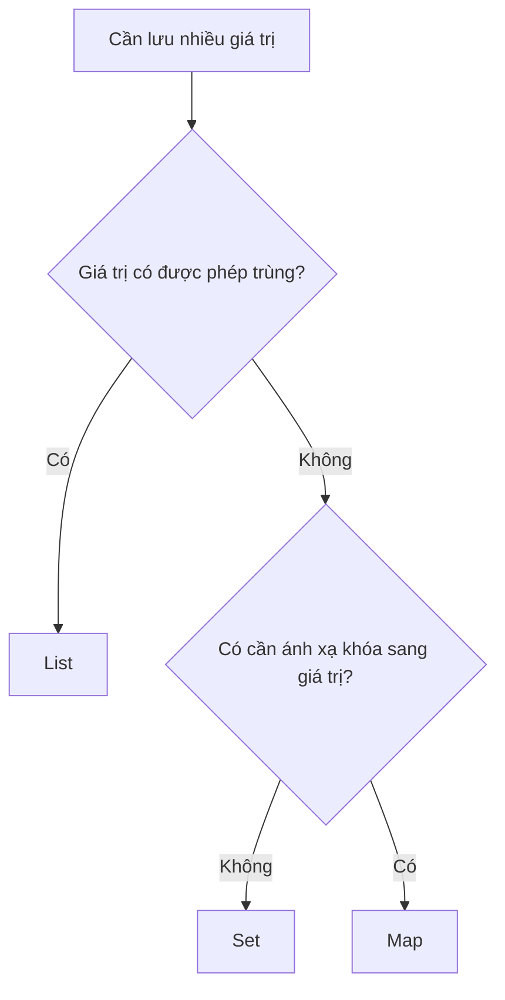
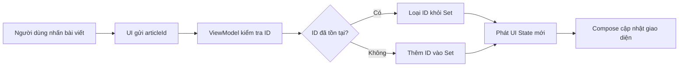
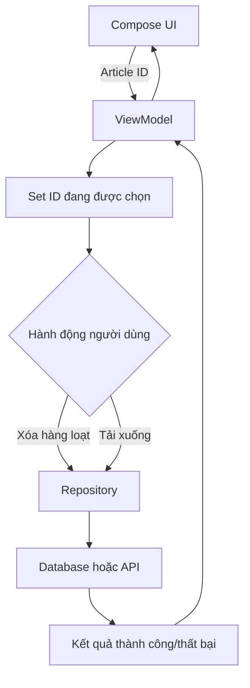

# 017 — Set trong Kotlin và Android
[](https://nobelabo.hatenablog.com/entry/2023/05/15/081656?utm_source=chatgpt.com)

**Học phần:** 01 — Language and Android Fundamentals
**Module:** Module 02 — Android Fundamentals
**Nhóm nội dung:** Data Structures and Algorithms
**Nguồn roadmap:** Android Fundamentals / Data Structures and Algorithms
**Loại bài:** Lesson
**Thứ tự trong module:** 017
**Thời lượng gợi ý:** 24 phút

---

## 1. Tóm tắt

`Set` là kiểu collection dùng để lưu trữ **các phần tử không trùng lặp**.

Trong ứng dụng Android, `Set` đặc biệt phù hợp với những dữ liệu mang ý nghĩa:

* Danh sách ID đang được chọn.
* Các quyền mà người dùng đã cấp.
* Các tag của bài viết.
* Danh mục yêu thích.
* Mã thông báo đã xử lý.
* Các bộ lọc đang được kích hoạt.
* Các phần tử cần loại bỏ trùng lặp.

Kotlin cung cấp hai giao diện chính:

```kotlin
Set<T>          // Chỉ cung cấp thao tác đọc
MutableSet<T>   // Cho phép thêm và xóa phần tử
```

Theo tài liệu Kotlin, `Set` biểu diễn một tập hợp các phần tử duy nhất; thứ tự phần tử nhìn chung không phải đặc tính cốt lõi của kiểu dữ liệu này. Kotlin đồng thời phân biệt giao diện chỉ đọc `Set` với giao diện có thể chỉnh sửa `MutableSet`. ([Kotlin][1])

---

## 2. Mục tiêu học tập

Sau bài học, bạn có thể:

* Giải thích được `Set` và sự khác nhau giữa `Set`, `List` và `Map`.
* Tạo `Set` bằng `setOf()`, `mutableSetOf()` và `toSet()`.
* Thêm, xóa và kiểm tra phần tử trong `MutableSet`.
* Sử dụng các phép hợp, giao và hiệu.
* Áp dụng `Set` để quản lý trạng thái chọn nhiều phần tử trong Android.
* Hiểu vai trò của `equals()` và `hashCode()` trong việc xác định phần tử trùng lặp.
* Tránh lỗi thay đổi trực tiếp một `MutableSet` đang được UI quan sát.
* Kiểm thử hành vi loại bỏ trùng lặp và cập nhật trạng thái.

---

## 3. Khái niệm chính

### 3.1. Set là gì?

`Set` là một tập hợp trong đó mỗi giá trị chỉ xuất hiện tối đa một lần.

```kotlin
val technologies = setOf(
    "Kotlin",
    "Android",
    "Compose",
    "Kotlin"
)

println(technologies)
println(technologies.size)
```

Kết quả dự kiến:

```text
[Kotlin, Android, Compose]
3
```

Mặc dù `"Kotlin"` được truyền vào hai lần, tập hợp chỉ giữ lại một phần tử tương ứng.

Có thể hình dung:

```text
Dữ liệu đầu vào
[Kotlin, Android, Kotlin, Compose, Android]
                   │
                   ▼
                 Set
                   │
                   ▼
[Kotlin, Android, Compose]
```

---

### 3.2. Ảnh minh họa tập hợp


*Hình: phép hợp `A ∪ B`, bao gồm mọi phần tử thuộc tập A, tập B hoặc cả hai. Nguồn Wikimedia Commons, giấy phép CC0.* ([Wikimedia Commons][2])


*Hình: phép giao `A ∩ B`, chỉ bao gồm phần tử xuất hiện trong cả A và B. Nguồn Wikimedia Commons, phạm vi công cộng.* ([Wikimedia Commons][3])

---

## 4. So sánh List, Set và Map

| Collection  | Đặc điểm                 |        Trùng lặp | Truy cập bằng index | Ví dụ Android                        |
| ----------- | ------------------------ | ---------------: | ------------------: | ------------------------------------ |
| `List<T>`   | Danh sách có thứ tự      |               Có |                  Có | Danh sách bài viết                   |
| `Set<T>`    | Tập hợp phần tử duy nhất |            Không | Không nên phụ thuộc | ID các bài viết đã chọn              |
| `Map<K, V>` | Ánh xạ khóa sang giá trị | Khóa không trùng |               Không | ID người dùng → thông tin người dùng |

Ví dụ:

```kotlin
val articleList = listOf(10L, 20L, 10L)
// [10, 20, 10]

val selectedArticleIds = setOf(10L, 20L, 10L)
// [10, 20]

val articleTitles = mapOf(
    10L to "Kotlin cơ bản",
    20L to "Jetpack Compose"
)
```

### Quy tắc lựa chọn nhanh



---

## 5. Set và MutableSet

### 5.1. Set chỉ đọc

Tạo một tập hợp chỉ đọc bằng `setOf()`:

```kotlin
val supportedLanguages: Set<String> = setOf(
    "vi",
    "en",
    "ja"
)

println("vi" in supportedLanguages)
println(supportedLanguages.size)
```

Không thể gọi trực tiếp:

```kotlin
// supportedLanguages.add("ko")
// Lỗi biên dịch vì Set không cung cấp add()
```

---

### 5.2. MutableSet

Tạo tập hợp có thể thay đổi bằng `mutableSetOf()`:

```kotlin
val selectedIds = mutableSetOf<Long>()

selectedIds.add(101)
selectedIds.add(102)
selectedIds.add(101)

println(selectedIds)
// [101, 102]
```

Các thao tác phổ biến:

```kotlin
val categories = mutableSetOf(
    "Technology",
    "Education"
)

categories.add("Android")
categories.remove("Education")

val containsAndroid = categories.contains("Android")
val numberOfCategories = categories.size

println(categories)
println(containsAndroid)
println(numberOfCategories)
```

Kotlin cung cấp `setOf()` và `mutableSetOf()` để khởi tạo tập hợp. Với collection mutable, các thao tác như `add()`, `addAll()`, `remove()` và `clear()` có thể thay đổi nội dung collection. ([Kotlin][4])

---

### 5.3. Giá trị trả về của add()

`MutableSet.add()` trả về:

* `true`: phần tử được thêm thành công.
* `false`: phần tử tương đương đã tồn tại.

```kotlin
val tags = mutableSetOf("Kotlin")

val firstResult = tags.add("Android")
val secondResult = tags.add("Kotlin")

println(firstResult)  // true
println(secondResult) // false
println(tags)         // [Kotlin, Android]
```

Có thể sử dụng kết quả này để quyết định có hiển thị thông báo hay không:

```kotlin
fun addTag(tags: MutableSet<String>, newTag: String): String {
    return if (tags.add(newTag)) {
        "Đã thêm tag $newTag"
    } else {
        "Tag $newTag đã tồn tại"
    }
}
```

---

## 6. Chuyển đổi giữa List và Set

### 6.1. Loại bỏ phần tử trùng lặp

```kotlin
val searchHistory = listOf(
    "Kotlin",
    "Compose",
    "Kotlin",
    "Android",
    "Compose"
)

val uniqueQueries = searchHistory.toSet()

println(uniqueQueries)
// [Kotlin, Compose, Android]
```

`toSet()` tạo ra một tập hợp từ collection ban đầu và loại bỏ những phần tử được xem là trùng nhau.

---

### 6.2. Chuyển ngược về List

```kotlin
val permissionSet = setOf(
    "CAMERA",
    "LOCATION"
)

val permissionList = permissionSet.toList()
```

Việc chuyển sang `List` hữu ích khi API hoặc thành phần giao diện yêu cầu một danh sách.

Tuy nhiên, không nên chuyển sang `Set` rồi lại chuyển về `List` chỉ để sắp xếp:

```kotlin
val sortedTags = tags
    .toSet()
    .sorted()
```

`sorted()` đã trả về một `List` được sắp xếp.

---

## 7. Các phép toán trên Set

Giả sử ứng dụng có hai tập hợp:

```kotlin
val savedArticleIds = setOf(1L, 2L, 3L)
val downloadedArticleIds = setOf(2L, 3L, 4L)
```

### 7.1. Phép hợp — union

Lấy tất cả phần tử thuộc một trong hai tập hợp:

```kotlin
val availableArticleIds =
    savedArticleIds union downloadedArticleIds

println(availableArticleIds)
// [1, 2, 3, 4]
```

Biểu diễn toán học:

```text
A ∪ B
```

---

### 7.2. Phép giao — intersect

Lấy những phần tử xuất hiện trong cả hai tập hợp:

```kotlin
val savedAndDownloaded =
    savedArticleIds intersect downloadedArticleIds

println(savedAndDownloaded)
// [2, 3]
```

Biểu diễn toán học:

```text
A ∩ B
```

---

### 7.3. Phép hiệu — subtract

Lấy phần tử thuộc tập thứ nhất nhưng không thuộc tập thứ hai:

```kotlin
val savedButNotDownloaded =
    savedArticleIds subtract downloadedArticleIds

println(savedButNotDownloaded)
// [1]
```

Biểu diễn toán học:

```text
A - B
```

Kotlin cung cấp trực tiếp các hàm `union()`, `intersect()` và `subtract()` cho các phép toán tập hợp phổ biến. ([Kotlin][5])

---

## 8. Set xác định phần tử trùng lặp như thế nào?

### 8.1. equals() và hashCode()

Đối với các implementation phổ biến dựa trên hash, tính duy nhất thường liên quan đến:

```kotlin
equals()
hashCode()
```

Hai đối tượng được xem là tương đương khi chúng thỏa mãn quy tắc bình đẳng của kiểu dữ liệu.

Với `data class`, Kotlin tự sinh `equals()` và `hashCode()` dựa trên các thuộc tính trong constructor chính.

```kotlin
data class Category(
    val id: Long,
    val name: String
)

val categories = setOf(
    Category(1, "Android"),
    Category(1, "Android")
)

println(categories.size)
// 1
```

Nhưng hai đối tượng dưới đây vẫn khác nhau:

```kotlin
val categories = setOf(
    Category(1, "Android"),
    Category(1, "Kotlin")
)

println(categories.size)
// 2
```

Mặc dù cùng `id`, thuộc tính `name` khác nhau nên hai `data class` không bằng nhau.

### Bài học quan trọng

> `Set` không tự hiểu quy tắc nghiệp vụ rằng “hai category cùng ID là một category”.

Khi nghiệp vụ yêu cầu tính duy nhất theo `id`, nên lưu trực tiếp ID:

```kotlin
val selectedCategoryIds: Set<Long> =
    categories.mapTo(mutableSetOf()) { it.id }
```

Hoặc chuẩn hóa dữ liệu theo khóa:

```kotlin
val uniqueCategories = categories
    .associateBy { it.id }
    .values
    .toSet()
```

---

## 9. Ứng dụng Set trong Android

### 9.1. Chọn nhiều phần tử

Giả sử người dùng có thể chọn nhiều bài viết để xóa hoặc tải xuống.

Trạng thái cần lưu:

```kotlin
Set<Long>
```

Trong đó mỗi `Long` là ID của một bài viết.



---

### 9.2. Xây dựng UI state

```kotlin
data class ArticleSelectionUiState(
    val selectedIds: Set<Long> = emptySet()
) {
    val selectedCount: Int
        get() = selectedIds.size

    fun isSelected(articleId: Long): Boolean {
        return articleId in selectedIds
    }
}
```

Ở đây:

* `Set<Long>` ngăn một bài viết bị chọn hai lần.
* `selectedIds.size` chính là số bài viết được chọn.
* `articleId in selectedIds` dùng để kiểm tra trạng thái checkbox.

---

### 9.3. ViewModel quản lý Set

```kotlin
import androidx.lifecycle.ViewModel
import kotlinx.coroutines.flow.MutableStateFlow
import kotlinx.coroutines.flow.StateFlow
import kotlinx.coroutines.flow.asStateFlow
import kotlinx.coroutines.flow.update

class ArticleSelectionViewModel : ViewModel() {

    private val _uiState =
        MutableStateFlow(ArticleSelectionUiState())

    val uiState: StateFlow<ArticleSelectionUiState> =
        _uiState.asStateFlow()

    fun toggleSelection(articleId: Long) {
        _uiState.update { currentState ->
            val currentIds = currentState.selectedIds

            val newIds = if (articleId in currentIds) {
                currentIds - articleId
            } else {
                currentIds + articleId
            }

            currentState.copy(selectedIds = newIds)
        }
    }

    fun clearSelection() {
        _uiState.update {
            it.copy(selectedIds = emptySet())
        }
    }

    fun selectAll(articleIds: Collection<Long>) {
        _uiState.update {
            it.copy(selectedIds = articleIds.toSet())
        }
    }
}
```

Điểm quan trọng là mỗi lần cập nhật, ViewModel tạo ra một `Set` mới:

```kotlin
currentIds + articleId
currentIds - articleId
```

Cách này giúp luồng trạng thái rõ ràng và tránh việc nhiều thành phần cùng thay đổi một collection mutable.

---

### 9.4. Hiển thị bằng Jetpack Compose

```kotlin
data class Article(
    val id: Long,
    val title: String
)
```

```kotlin
@Composable
fun ArticleList(
    articles: List<Article>,
    selectedIds: Set<Long>,
    onArticleClick: (Long) -> Unit
) {
    LazyColumn {
        items(
            items = articles,
            key = { article -> article.id }
        ) { article ->
            val isSelected = article.id in selectedIds

            Row(
                modifier = Modifier
                    .fillMaxWidth()
                    .clickable {
                        onArticleClick(article.id)
                    }
                    .padding(16.dp),
                verticalAlignment = Alignment.CenterVertically
            ) {
                Checkbox(
                    checked = isSelected,
                    onCheckedChange = {
                        onArticleClick(article.id)
                    }
                )

                Spacer(modifier = Modifier.width(12.dp))

                Text(text = article.title)
            }
        }
    }
}
```

Màn hình gọi ViewModel:

```kotlin
@Composable
fun ArticleSelectionScreen(
    articles: List<Article>,
    viewModel: ArticleSelectionViewModel
) {
    val uiState by viewModel.uiState.collectAsStateWithLifecycle()

    Column {
        Text(
            text = "Đã chọn: ${uiState.selectedCount}"
        )

        ArticleList(
            articles = articles,
            selectedIds = uiState.selectedIds,
            onArticleClick = viewModel::toggleSelection
        )

        Button(
            onClick = viewModel::clearSelection,
            enabled = uiState.selectedIds.isNotEmpty()
        ) {
            Text("Bỏ chọn tất cả")
        }
    }
}
```

---

## 10. Set trong kiến trúc Android

`Set` có thể xuất hiện ở nhiều tầng:



### UI layer

```kotlin
val selectedIds: Set<Long>
```

Dùng để đánh dấu checkbox hoặc trạng thái item.

### Domain layer

```kotlin
suspend fun deleteArticles(ids: Set<Long>)
```

Dùng `Set` để thể hiện rằng mỗi ID chỉ cần xử lý một lần.

### Data layer

```kotlin
val uniqueRemoteIds = response.items
    .map { it.id }
    .toSet()
```

Dùng để chuẩn hóa dữ liệu trả về từ API.

---

## 11. Lifecycle và lưu trạng thái

### 11.1. Xoay màn hình

Nếu `Set` chỉ được khai báo bằng biến cục bộ trong Composable:

```kotlin
var selectedIds = mutableSetOf<Long>()
```

trạng thái có thể bị tạo lại khi Composable rời khỏi Composition hoặc Activity được tái tạo.

Trạng thái phục vụ business logic nên được đưa lên `ViewModel`. `ViewModel` giữ trạng thái qua configuration change; khi cần khôi phục sau khi tiến trình bị hệ thống hủy, có thể lưu lượng dữ liệu tối thiểu bằng `SavedStateHandle`. Android khuyến nghị chỉ lưu các ID hoặc khóa nhỏ trong saved state thay vì lưu object hoặc danh sách lớn. ([Android Developers][6])

---

### 11.2. Lưu Set bằng rememberSaveable

Với trạng thái UI nhỏ, có thể lưu danh sách ID và chuyển đổi về `Set`:

```kotlin
var selectedIds by rememberSaveable {
    mutableStateOf(emptyList<Long>())
}

fun toggle(id: Long) {
    val currentSet = selectedIds.toSet()

    selectedIds = if (id in currentSet) {
        (currentSet - id).toList()
    } else {
        (currentSet + id).toList()
    }
}
```

Các phiên bản Compose hiện đại có khả năng xử lý nhiều kiểu collection phổ biến, bao gồm `Set`, nhưng việc chuyển thành một cấu trúc đơn giản như danh sách ID vẫn giúp định dạng saved state rõ ràng và dễ kiểm soát. Saved state nên chỉ chứa dữ liệu nhỏ đủ để tái tạo giao diện. ([Android Developers][6])

---

## 12. Lỗi thường gặp

### 12.1. Sử dụng Set khi thứ tự rất quan trọng

Không nên viết logic phụ thuộc vào vị trí:

```kotlin
val firstPermission = permissions.first()
```

Nếu nghiệp vụ yêu cầu:

* Phần tử đầu tiên.
* Thứ tự ưu tiên.
* Kéo thả sắp xếp.
* Hiển thị theo đúng thứ tự từ API.

thì nên dùng `List`, hoặc sắp xếp trước khi hiển thị:

```kotlin
val sortedPermissions = permissions.sorted()
```

Về mặt khái niệm, `Set` không phải collection được truy cập bằng index. Một số implementation có thứ tự lặp xác định, chẳng hạn `LinkedHashSet` giữ thứ tự chèn, nhưng không nên suy diễn rằng mọi `Set` đều có cùng hành vi. ([Kotlin][7])

---

### 12.2. Thay đổi MutableSet trực tiếp trong UI state

Không nên:

```kotlin
data class UiState(
    val selectedIds: MutableSet<Long>
)
```

```kotlin
_uiState.value.selectedIds.add(articleId)
```

Collection đã thay đổi, nhưng đối tượng `UiState` và tham chiếu collection vẫn có thể giữ nguyên. Điều này khiến quá trình quan sát và cập nhật giao diện khó dự đoán.

Nên dùng:

```kotlin
data class UiState(
    val selectedIds: Set<Long> = emptySet()
)
```

```kotlin
_uiState.update { state ->
    state.copy(
        selectedIds = state.selectedIds + articleId
    )
}
```

Compose hoạt động tốt nhất khi UI đọc từ observable state và mỗi thay đổi trạng thái được phát ra rõ ràng. ([Android Developers][8])

---

### 12.3. Cho rằng Set chỉ đọc là hoàn toàn bất biến

`Set<T>` chỉ có nghĩa rằng biến hiện tại không cung cấp các thao tác chỉnh sửa. Nó không đảm bảo object phía dưới không bao giờ thay đổi.

```kotlin
val mutableTags = mutableSetOf("Kotlin")

val readOnlyTags: Set<String> = mutableTags

mutableTags.add("Android")

println(readOnlyTags)
// [Kotlin, Android]
```

`readOnlyTags` không gọi được `add()`, nhưng nó vẫn đang tham chiếu đến collection mutable ban đầu.

Khi cần tạo bản sao độc lập:

```kotlin
val snapshot: Set<String> = mutableTags.toSet()
```

---

### 12.4. Cho rằng cùng ID nghĩa là trùng nhau

```kotlin
data class User(
    val id: Long,
    val displayName: String
)

val users = setOf(
    User(1, "An"),
    User(1, "Khánh")
)

println(users.size)
// 2
```

Nếu tính duy nhất được xác định theo ID:

```kotlin
val uniqueUsers = users
    .associateBy { user -> user.id }
    .values
    .toSet()
```

---

### 12.5. Dùng Set để che giấu dữ liệu lỗi

Ví dụ API trả về ID trùng lặp:

```kotlin
val ids = response.items
    .map { it.id }
    .toSet()
```

Cách này loại bỏ trùng lặp nhưng cũng có thể che giấu lỗi từ backend.

Nên ghi nhận dữ liệu bất thường:

```kotlin
val ids = response.items.map { it.id }
val uniqueIds = ids.toSet()

if (ids.size != uniqueIds.size) {
    logger.warn("API returned duplicated article IDs")
}
```

---

## 13. Hiệu năng

Implementation phổ biến trên JVM là `HashSet`. Khi hàm băm phân phối phần tử hợp lý, các thao tác cơ bản như `add`, `remove` và `contains` thường có thời gian trung bình gần `O(1)`. `HashSet` không đảm bảo thứ tự lặp. ([Oracle Documentation][9])

| Implementation  |               Tìm kiếm |                 Thêm/Xóa | Thứ tự              | Trường hợp sử dụng                   |
| --------------- | ---------------------: | -----------------------: | ------------------- | ------------------------------------ |
| `HashSet`       |      Trung bình `O(1)` |        Trung bình `O(1)` | Không đảm bảo       | Tập hợp lớn, tra cứu thường xuyên    |
| `LinkedHashSet` |      Trung bình `O(1)` |        Trung bình `O(1)` | Giữ thứ tự chèn     | Cần kết quả ổn định theo thứ tự thêm |
| `TreeSet`       |             `O(log n)` |               `O(log n)` | Được sắp xếp        | Cần duy trì thứ tự                   |
| `ArraySet`      | Tìm bằng binary search | Có thể phải dịch phần tử | Theo implementation | Tập nhỏ, ưu tiên tiết kiệm bộ nhớ    |

Android cung cấp `ArraySet`, được thiết kế để tiết kiệm bộ nhớ hơn `HashSet` truyền thống, nhưng việc tìm kiếm, thêm và xóa nhìn chung chậm hơn do sử dụng mảng và binary search. Vì vậy, không nên thay mọi `HashSet` bằng `ArraySet` nếu chưa đo hiệu năng thực tế. ([Android Developers][10])

---

## 14. Kiểm thử

### 14.1. Kiểm tra phần tử trùng lặp

```kotlin
import org.junit.Assert.assertEquals
import org.junit.Test

class SetTest {

    @Test
    fun duplicateValues_areStoredOnce() {
        val tags = setOf(
            "Kotlin",
            "Android",
            "Kotlin"
        )

        assertEquals(2, tags.size)
    }
}
```

---

### 14.2. Kiểm tra thao tác chọn và bỏ chọn

```kotlin
import org.junit.Assert.assertFalse
import org.junit.Assert.assertTrue
import org.junit.Test

class ArticleSelectionTest {

    @Test
    fun toggleSelectedId_twice_returnsToInitialState() {
        var selectedIds = emptySet<Long>()
        val articleId = 10L

        selectedIds = selectedIds + articleId
        assertTrue(articleId in selectedIds)

        selectedIds = selectedIds - articleId
        assertFalse(articleId in selectedIds)
    }
}
```

---

### 14.3. Kiểm tra phép giao

```kotlin
@Test
fun intersect_returnsCommonIds() {
    val saved = setOf(1L, 2L, 3L)
    val downloaded = setOf(2L, 3L, 4L)

    val result = saved intersect downloaded

    assertEquals(setOf(2L, 3L), result)
}
```

---

### 14.4. Các trường hợp cần kiểm thử

| Trường hợp               | Kết quả mong đợi                            |
| ------------------------ | ------------------------------------------- |
| Thêm cùng một ID hai lần | ID chỉ xuất hiện một lần                    |
| Bỏ chọn ID chưa tồn tại  | Không crash                                 |
| Chọn rồi bỏ chọn         | Trở về trạng thái ban đầu                   |
| Chọn tất cả              | Số phần tử bằng số ID duy nhất              |
| API trả ID trùng         | UI không hiển thị item trùng                |
| Xoay màn hình            | Lựa chọn vẫn được giữ nếu nghiệp vụ yêu cầu |
| Process bị hệ thống hủy  | Trạng thái tối thiểu được khôi phục         |
| Danh sách rỗng           | Các phép toán không gây lỗi                 |

---

## 15. Thực hành trong 24 phút

### Phần 1 — Nắm khái niệm, 5 phút

Viết ghi chú năm dòng:

> `Set` là collection lưu các phần tử không trùng lặp.
> `Set` chỉ cung cấp thao tác đọc, còn `MutableSet` cho phép chỉnh sửa.
> `Set` phù hợp với ID đang chọn, tag và quyền truy cập.
> Không nên sử dụng `Set` khi vị trí và thứ tự phần tử rất quan trọng.
> Tính duy nhất của object phụ thuộc vào quy tắc `equals()` và `hashCode()`.

### Phần 2 — Kotlin cơ bản, 5 phút

```kotlin
fun main() {
    val installedFeatures = mutableSetOf(
        "dark_mode",
        "offline_mode"
    )

    installedFeatures.add("notifications")
    installedFeatures.add("dark_mode")
    installedFeatures.remove("offline_mode")

    println(installedFeatures)
    println("dark_mode" in installedFeatures)
}
```

### Phần 3 — Android state, 8 phút

Tạo:

```kotlin
data class FilterUiState(
    val selectedCategoryIds: Set<Long> = emptySet()
)
```

Sau đó viết hàm:

```kotlin
fun toggleCategory(
    currentIds: Set<Long>,
    categoryId: Long
): Set<Long> {
    return if (categoryId in currentIds) {
        currentIds - categoryId
    } else {
        currentIds + categoryId
    }
}
```

### Phần 4 — Kiểm thử và ghi chú, 6 phút

Kiểm tra:

1. Chọn một category.
2. Chọn lại category đó.
3. Chọn ba category khác nhau.
4. Xóa toàn bộ lựa chọn.
5. Xoay màn hình và xem trạng thái có được giữ đúng yêu cầu hay không.

---

## 16. Bài tập

### Bài 1 — Cơ bản

Cho danh sách:

```kotlin
val technologies = listOf(
    "Kotlin",
    "Android",
    "Compose",
    "Kotlin",
    "Room",
    "Compose"
)
```

Yêu cầu:

* Loại bỏ phần tử trùng.
* Kiểm tra `"Room"` có tồn tại không.
* Thêm `"Coroutines"`.
* Xóa `"Android"`.

---

### Bài 2 — Phép toán Set

```kotlin
val localIds = setOf(1, 2, 3, 4)
val remoteIds = setOf(3, 4, 5, 6)
```

Tìm:

* Tất cả ID.
* ID xuất hiện ở cả local và remote.
* ID chỉ có ở local.
* ID chỉ có ở remote.

Kết quả:

```kotlin
val allIds = localIds union remoteIds
val commonIds = localIds intersect remoteIds
val localOnlyIds = localIds subtract remoteIds
val remoteOnlyIds = remoteIds subtract localIds
```

---

### Bài 3 — Android mini project

Xây dựng màn hình **Chọn chủ đề yêu thích**.

Dữ liệu:

```kotlin
data class Topic(
    val id: Long,
    val name: String
)
```

Yêu cầu:

* Hiển thị danh sách chủ đề.
* Người dùng có thể chọn nhiều chủ đề.
* Không chủ đề nào được chọn hai lần.
* Hiển thị số lượng đã chọn.
* Có nút “Bỏ chọn tất cả”.
* Giữ trạng thái khi xoay màn hình.
* Viết ít nhất hai unit test cho hàm toggle.

---

## 17. Artifact đưa vào portfolio

Tên gợi ý:

```text
android-multi-selection-set-demo
```

Cấu trúc:

```text
android-multi-selection-set-demo/
├── app/
│   ├── ui/
│   │   ├── TopicSelectionScreen.kt
│   │   └── TopicItem.kt
│   ├── viewmodel/
│   │   └── TopicSelectionViewModel.kt
│   └── model/
│       └── Topic.kt
├── tests/
│   └── TopicSelectionViewModelTest.kt
├── screenshots/
│   ├── empty-selection.png
│   └── multiple-selection.png
└── README.md
```

README nên giải thích:

```markdown
## Vấn đề

Người dùng cần chọn nhiều chủ đề nhưng một chủ đề không được xuất
hiện nhiều lần trong trạng thái lựa chọn.

## Giải pháp

Ứng dụng sử dụng Set<Long> để lưu ID của các chủ đề được chọn.

## Lợi ích

- Không có ID trùng lặp.
- Kiểm tra trạng thái chọn rõ ràng.
- Hàm toggle đơn giản.
- UI state dễ kiểm thử.
```

---

## 18. Ảnh hưởng đến chất lượng ứng dụng

### UX

Dùng `Set` đúng cách giúp:

* Tránh số lượng lựa chọn bị tính trùng.
* Tránh gửi cùng một thao tác nhiều lần.
* Checkbox hiển thị trạng thái nhất quán.
* Nút thao tác hàng loạt nhận đúng số item.

### Reliability

* Một ID chỉ được xử lý một lần.
* Dữ liệu trùng từ nhiều nguồn có thể được chuẩn hóa.
* Các phép giao và hiệu giúp đồng bộ local–remote rõ ràng hơn.

### Maintainability

Tên kiểu dữ liệu tự truyền đạt ý nghĩa:

```kotlin
val selectedIds: Set<Long>
```

rõ hơn:

```kotlin
val selectedIds: List<Long>
```

Bản thân `Set` thể hiện invariant:

> Mỗi ID chỉ được xuất hiện một lần.

### Performance

`Set` phù hợp khi ứng dụng thường xuyên kiểm tra:

```kotlin
id in selectedIds
```

Tuy nhiên, cần chọn implementation theo kích thước dữ liệu và nhu cầu thứ tự thay vì tối ưu sớm.

---

## 19. Checklist hoàn thành

### Kiến thức

* [ ] Giải thích được `Set` là collection không chứa phần tử trùng.
* [ ] Phân biệt được `Set` và `MutableSet`.
* [ ] Phân biệt được `List`, `Set` và `Map`.
* [ ] Hiểu vai trò của `equals()` và `hashCode()`.
* [ ] Biết các phép `union`, `intersect` và `subtract`.

### Kotlin

* [ ] Sử dụng được `setOf()`.
* [ ] Sử dụng được `mutableSetOf()`.
* [ ] Sử dụng được `toSet()`.
* [ ] Kiểm tra phần tử bằng `in`.
* [ ] Thêm và xóa phần tử.
* [ ] Không phụ thuộc vô tình vào thứ tự của `Set`.

### Android

* [ ] Có ví dụ chọn nhiều item.
* [ ] Trạng thái được quản lý trong ViewModel.
* [ ] UI state sử dụng `Set` chỉ đọc.
* [ ] Không chỉnh sửa `MutableSet` trực tiếp trong UI state.
* [ ] Có kiểm thử sau khi xoay màn hình.
* [ ] Chỉ lưu ID hoặc khóa nhỏ khi cần khôi phục saved state.

### Portfolio

* [ ] Có source code chạy được.
* [ ] Có ít nhất hai unit test.
* [ ] Có ảnh chụp màn hình.
* [ ] Có README giải thích lý do chọn `Set`.
* [ ] Có ghi chú về UX, lifecycle và state restoration.

---

## 20. Ghi chú production

Trước khi đưa tính năng sử dụng `Set` lên production, cần trả lời:

1. Tính duy nhất được xác định theo toàn bộ object hay theo ID?
2. UI có đang phụ thuộc vào thứ tự phần tử không?
3. Trạng thái có cần tồn tại sau khi xoay màn hình không?
4. Trạng thái có cần tồn tại sau khi process bị hệ thống hủy không?
5. Có đang lưu object quá lớn trong saved state không?
6. Backend có chấp nhận dữ liệu không có thứ tự không?
7. Có cần ghi log khi API trả dữ liệu trùng lặp không?
8. Việc thay đổi Set có phát ra UI state mới không?
9. Unit test đã kiểm tra thêm trùng, xóa và toggle chưa?
10. Có thực sự cần `ArraySet`, hay `Set` thông thường đã đáp ứng đủ?

---

## 21. Kết luận

`Set` không chỉ là một collection dùng để “xóa dữ liệu trùng”. Nó còn giúp mô hình hóa đúng những quy tắc nghiệp vụ như:

```text
Một bài viết chỉ được chọn một lần.
Một quyền chỉ được cấp một lần.
Một tag chỉ xuất hiện một lần.
Một ID chỉ được gửi xử lý một lần.
```

Trong Android, cách sử dụng an toàn và dễ bảo trì thường là:

```kotlin
data class UiState(
    val selectedIds: Set<Long> = emptySet()
)
```

và tạo một tập hợp mới khi trạng thái thay đổi:

```kotlin
val newIds = if (id in selectedIds) {
    selectedIds - id
} else {
    selectedIds + id
}
```

Cách tiếp cận này vừa bảo vệ tính duy nhất của dữ liệu, vừa phù hợp với mô hình UI state bất biến trong Android hiện đại.

[1]: https://kotlinlang.org/docs/collections-overview.html?utm_source=chatgpt.com "Collections overview | Kotlin Documentation"
[2]: https://commons.wikimedia.org/wiki/File%3AUnion_of_sets_A_and_B.svg "File:Union of sets A and B.svg - Wikimedia Commons"
[3]: https://commons.wikimedia.org/wiki/File%3AVenn_A_intersect_B.svg "File:Venn A intersect B.svg - Wikimedia Commons"
[4]: https://kotlinlang.org/docs/constructing-collections.html?utm_source=chatgpt.com "Constructing collections | Kotlin Documentation"
[5]: https://kotlinlang.org/docs/set-operations.html?utm_source=chatgpt.com "Set-specific operations | Kotlin Documentation"
[6]: https://developer.android.com/develop/ui/compose/state-saving?hl=en&utm_source=chatgpt.com "Save UI state in Compose  |  Jetpack Compose  |  Android Developers"
[7]: https://kotlinlang.org/docs/collection-elements.html?utm_source=chatgpt.com "Retrieve single elements | Kotlin Documentation"
[8]: https://developer.android.com/develop/ui/compose/state?utm_source=chatgpt.com "State and Jetpack Compose  |  Android Developers"
[9]: https://docs.oracle.com/en/java/javase/21/docs/api/java.base/java/util/HashSet.html?utm_source=chatgpt.com "HashSet (Java SE 21 & JDK 21)"
[10]: https://developer.android.com/reference/kotlin/android/util/ArraySet?utm_source=chatgpt.com "ArraySet  |  API reference  |  Android Developers"
