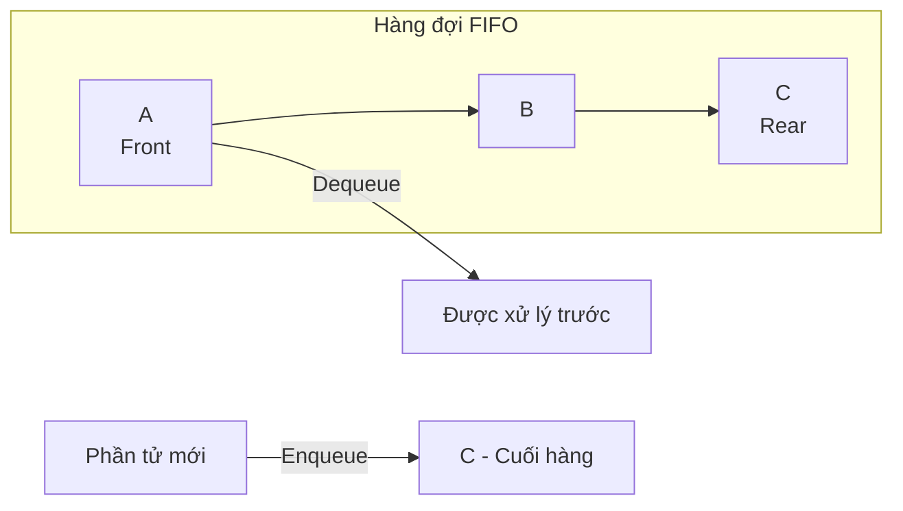
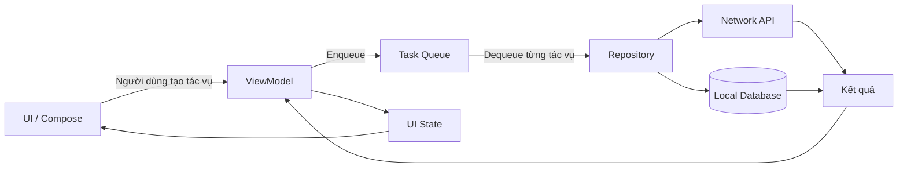
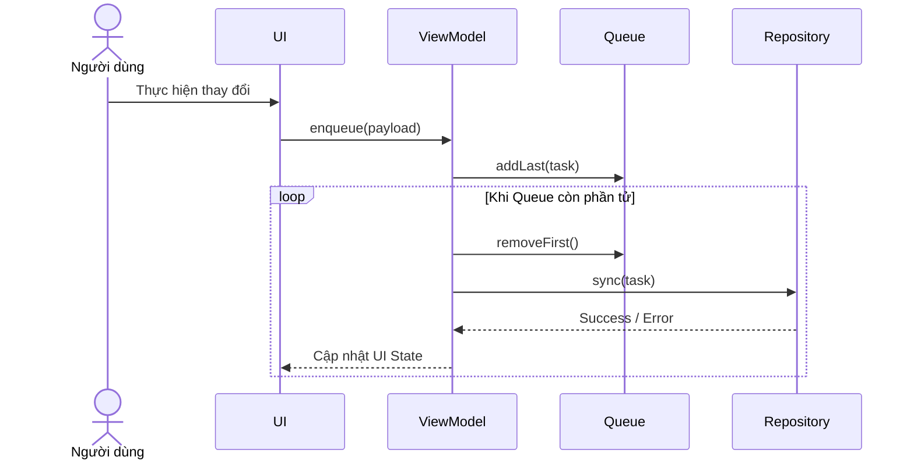
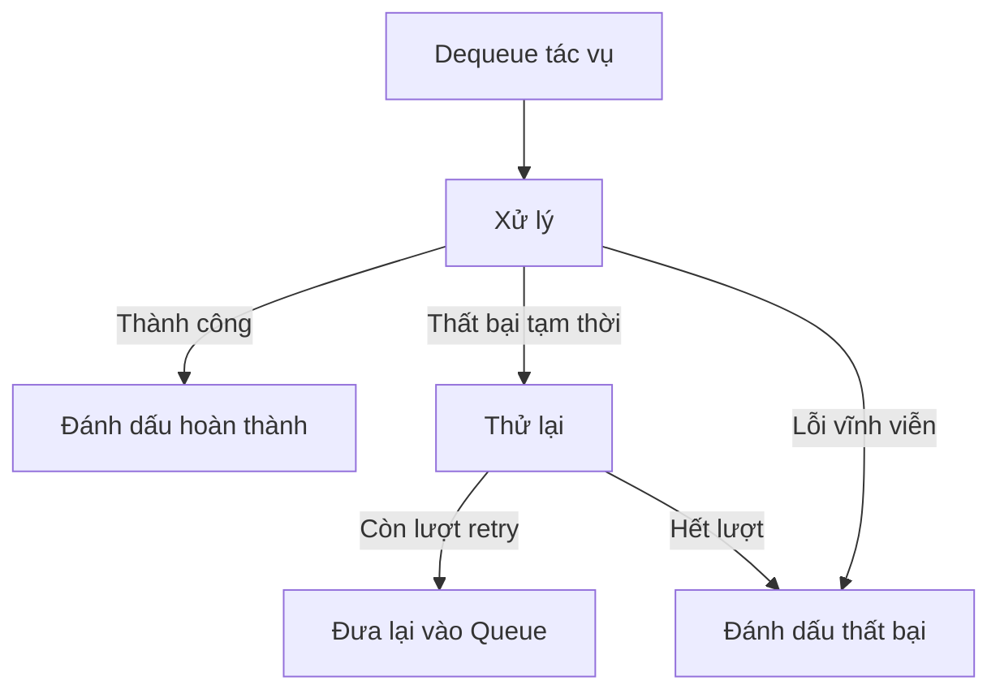
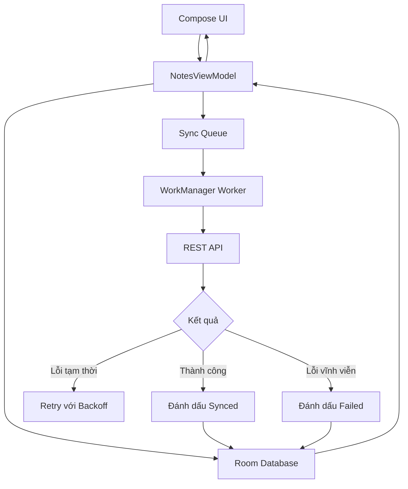

# 018 - Queue

**Học phần:** 01 - Language and Android Fundamentals
**Module:** Module 02 - Android Fundamentals
**Nhóm nội dung:** Data Structures and Algorithms
**Nguồn roadmap:** Android Fundamentals / Data Structures and Algorithms
**Loại bài:** Lesson
**Thứ tự trong module:** 018
**Thời lượng gợi ý:** 24 phút

---

## 1. Tóm tắt

**Queue** — hàng đợi — là cấu trúc dữ liệu dùng để lưu các phần tử đang chờ được xử lý.

Queue thông thường hoạt động theo nguyên tắc:

> **FIFO — First In, First Out**
> Phần tử vào trước sẽ được lấy ra trước.

Hãy hình dung một hàng người đang chờ thanh toán:

* Người đến trước đứng ở đầu hàng.
* Người mới đến đứng cuối hàng.
* Nhân viên phục vụ người ở đầu hàng trước.

Trong ứng dụng Android, Queue có thể xuất hiện khi:

* Xử lý lần lượt các yêu cầu tải ảnh.
* Đồng bộ dữ liệu offline.
* Quản lý danh sách bài hát đang chờ phát.
* Xử lý thông báo hoặc tác vụ nền.
* Giới hạn số yêu cầu mạng chạy đồng thời.
* Thực hiện thuật toán tìm kiếm theo chiều rộng — BFS.

Queue thường tuân theo FIFO, nhưng không phải mọi Queue đều như vậy. Chẳng hạn, `PriorityQueue` lấy phần tử theo độ ưu tiên thay vì chỉ dựa trên thứ tự thêm vào.

---

## 2. Mục tiêu học tập

Sau bài học, anh có thể:

* Giải thích Queue bằng ngôn ngữ của mình.
* Phân biệt đầu hàng đợi và cuối hàng đợi.
* Hiểu các thao tác `enqueue`, `dequeue`, `peek`.
* Cài đặt Queue bằng Kotlin `ArrayDeque`.
* Áp dụng Queue vào một tình huống Android.
* Kiểm thử đúng thứ tự FIFO.
* Nhận biết các vấn đề liên quan đến lifecycle và process death.
* Biết khi nào nên dùng Queue trong bộ nhớ và khi nào nên dùng WorkManager hoặc cơ sở dữ liệu.

---

## 3. Khái niệm chính

### 3.1. Queue là gì?

Queue là một cấu trúc dữ liệu tuyến tính trong đó:

* Phần tử mới được thêm vào **cuối hàng** — rear hoặc tail.
* Phần tử được xử lý từ **đầu hàng** — front hoặc head.

Ví dụ, lần lượt thêm ba tác vụ:

```text
A → B → C
```

Thứ tự xử lý sẽ là:

```text
A → B → C
```

Không phải:

```text
C → B → A
```

---

### 3.2. Ảnh minh họa FIFO


*Nguồn ảnh: Wikimedia Commons, sơ đồ Queue FIFO thuộc phạm vi công cộng.*

---

### 3.3. Sơ đồ hoạt động



Sơ đồ đơn giản hơn:

```text
                         QUEUE
              ┌─────┬─────┬─────┬─────┐
Dequeue  ←    │  A  │  B  │  C  │  D  │    ← Enqueue
              └─────┴─────┴─────┴─────┘
              FRONT             REAR

A vào trước  →  A được lấy ra trước
```

---

## 4. Các thao tác cơ bản

| Thao tác        | Ý nghĩa                         | Ví dụ                      |
| --------------- | ------------------------------- | -------------------------- |
| `enqueue(item)` | Thêm phần tử vào cuối hàng      | Thêm một ảnh cần tải lên   |
| `dequeue()`     | Lấy và xóa phần tử đầu hàng     | Bắt đầu tải ảnh đầu tiên   |
| `peek()`        | Xem phần tử đầu nhưng không xóa | Xem tác vụ tiếp theo       |
| `isEmpty()`     | Kiểm tra hàng đợi rỗng          | Không còn tác vụ           |
| `size`          | Đếm số phần tử                  | Còn 4 ảnh đang chờ         |
| `clear()`       | Xóa toàn bộ hàng đợi            | Hủy tất cả tác vụ đang chờ |

### Minh họa từng bước

Ban đầu:

```text
Queue: []
```

Thêm A:

```text
enqueue(A)

Queue: [A]
```

Thêm B và C:

```text
enqueue(B)
enqueue(C)

Queue: [A, B, C]
```

Lấy phần tử đầu:

```text
dequeue() → A

Queue: [B, C]
```

Xem phần tử tiếp theo:

```text
peek() → B

Queue vẫn là: [B, C]
```

---

## 5. Cài đặt Queue trong Kotlin

Kotlin có `ArrayDeque`, một cấu trúc hàng đợi hai đầu cho phép thêm hoặc xóa phần tử ở cả đầu lẫn cuối. Nó có thể được sử dụng để triển khai cả Queue và Stack.

### 5.1. Ví dụ cơ bản

```kotlin
fun main() {
    val taskQueue = ArrayDeque<String>()

    // Enqueue: thêm vào cuối hàng
    taskQueue.addLast("Tải ảnh đại diện")
    taskQueue.addLast("Cập nhật hồ sơ")
    taskQueue.addLast("Đồng bộ cài đặt")

    println(taskQueue)
    // [Tải ảnh đại diện, Cập nhật hồ sơ, Đồng bộ cài đặt]

    // Peek: xem phần tử đầu nhưng không xóa
    val nextTask = taskQueue.firstOrNull()
    println("Tác vụ tiếp theo: $nextTask")

    // Dequeue: lấy phần tử đầu và xóa khỏi hàng
    val completedTask = taskQueue.removeFirstOrNull()
    println("Đã xử lý: $completedTask")

    println("Còn lại: $taskQueue")
}
```

Kết quả:

```text
[Tải ảnh đại diện, Cập nhật hồ sơ, Đồng bộ cài đặt]
Tác vụ tiếp theo: Tải ảnh đại diện
Đã xử lý: Tải ảnh đại diện
Còn lại: [Cập nhật hồ sơ, Đồng bộ cài đặt]
```

`addLast()` thêm phần tử vào cuối deque, còn `removeFirstOrNull()` lấy phần tử đầu và trả về `null` khi hàng đợi rỗng.

---

### 5.2. Xây dựng lớp Queue tái sử dụng

```kotlin
class SimpleQueue<T> {

    private val items = ArrayDeque<T>()

    val size: Int
        get() = items.size

    val isEmpty: Boolean
        get() = items.isEmpty()

    /**
     * Thêm một phần tử vào cuối hàng đợi.
     */
    fun enqueue(item: T) {
        items.addLast(item)
    }

    /**
     * Lấy và xóa phần tử đầu hàng đợi.
     *
     * Trả về null nếu Queue đang rỗng.
     */
    fun dequeue(): T? {
        return items.removeFirstOrNull()
    }

    /**
     * Xem phần tử đầu nhưng không xóa.
     */
    fun peek(): T? {
        return items.firstOrNull()
    }

    /**
     * Xóa toàn bộ phần tử.
     */
    fun clear() {
        items.clear()
    }

    /**
     * Tạo bản sao chỉ đọc để hiển thị hoặc kiểm thử.
     */
    fun toList(): List<T> {
        return items.toList()
    }
}
```

Sử dụng:

```kotlin
fun main() {
    val queue = SimpleQueue<Int>()

    queue.enqueue(10)
    queue.enqueue(20)
    queue.enqueue(30)

    println(queue.peek())      // 10
    println(queue.dequeue())   // 10
    println(queue.dequeue())   // 20
    println(queue.toList())    // [30]
}
```

---

## 6. Độ phức tạp

Khi sử dụng `ArrayDeque`, các thao tác thêm và xóa ở hai đầu thường có chi phí hằng số trung bình:

| Thao tác            | Độ phức tạp thông thường |
| ------------------- | -----------------------: |
| Thêm cuối — enqueue |        `O(1)` trung bình |
| Xóa đầu — dequeue   |        `O(1)` trung bình |
| Xem phần tử đầu     |                   `O(1)` |
| Kiểm tra rỗng       |                   `O(1)` |
| Tìm một phần tử     |                   `O(n)` |
| Duyệt toàn bộ Queue |                   `O(n)` |

`ArrayDeque` được triển khai bằng mảng có khả năng thay đổi kích thước. Việc mở rộng mảng đôi khi cần sao chép phần tử, vì vậy chi phí thêm phần tử được mô tả chính xác hơn là **O(1) amortized** — hằng số trung bình trên nhiều lần thao tác.

### Không nên dùng `MutableList.removeAt(0)` làm Queue lớn

Ví dụ:

```kotlin
val queue = mutableListOf<String>()

queue.add("A")
queue.add("B")

val first = queue.removeAt(0)
```

Khi xóa phần tử ở vị trí `0`, các phần tử còn lại có thể phải dịch sang trái:

```text
Trước: [A, B, C, D]
Xóa A
Sau:   [B, C, D]
         ←  ←  ←
```

Với Queue được truy cập thường xuyên, `ArrayDeque` thể hiện rõ ý định hơn và phù hợp với thao tác ở hai đầu.

---

## 7. Queue khác Stack như thế nào?

| Đặc điểm         | Queue                | Stack                   |
| ---------------- | -------------------- | ----------------------- |
| Nguyên tắc       | FIFO                 | LIFO                    |
| Phần tử được lấy | Phần tử vào trước    | Phần tử vào sau         |
| Ví dụ đời thực   | Xếp hàng mua vé      | Chồng đĩa               |
| Thêm phần tử     | Cuối hàng            | Đỉnh Stack              |
| Xóa phần tử      | Đầu hàng             | Đỉnh Stack              |
| Ứng dụng         | Upload, đồng bộ, BFS | Undo, backtracking, DFS |

### Queue

```text
Thêm: A → B → C
Lấy:  A → B → C
```

### Stack

```text
Thêm: A → B → C
Lấy:  C → B → A
```

---

## 8. Các loại Queue thường gặp

### 8.1. FIFO Queue

Phần tử vào trước được xử lý trước.

```text
[A, B, C] → lấy A
```

Phù hợp với:

* Hàng chờ upload.
* Danh sách tác vụ.
* Đồng bộ dữ liệu theo thứ tự.
* Xử lý yêu cầu tuần tự.

---

### 8.2. Deque

**Deque — Double-ended Queue** cho phép thêm và xóa ở cả hai đầu.

```text
          addFirst
              ↓
removeFirst ← [A, B, C] → removeLast
                           ↑
                        addLast
```

`ArrayDeque` của Kotlin là một deque.

---

### 8.3. Priority Queue

Phần tử có độ ưu tiên cao được xử lý trước.

Ví dụ:

```text
Tác vụ A: ưu tiên 1
Tác vụ B: ưu tiên 10
Tác vụ C: ưu tiên 5
```

Thứ tự xử lý có thể là:

```text
B → C → A
```

Đây không còn là FIFO nghiêm ngặt.

Ví dụ Android:

* Thông báo khẩn cấp ưu tiên hơn thông báo quảng cáo.
* Request thanh toán ưu tiên hơn request tải ảnh phụ.
* Tác vụ người dùng đang chờ ưu tiên hơn tác vụ bảo trì.

---

### 8.4. Circular Queue

Circular Queue sử dụng một vùng nhớ cố định như một vòng tròn:

```text
        ┌─── A ◀ B ◀ C ───┐
        │                 │
        └──── F ▶ E ▶ D ──┘
```

Thường xuất hiện trong:

* Bộ đệm âm thanh.
* Video streaming.
* Sensor buffer.
* Log buffer giới hạn kích thước.
* Dữ liệu thời gian thực.

---

## 9. Queue nằm ở đâu trong ứng dụng Android?



Queue thường không trực tiếp hiển thị giao diện. Nó nằm trong:

* ViewModel.
* Use case hoặc domain layer.
* Repository.
* Service.
* Worker.
* Trình quản lý upload hoặc download.
* Thành phần phát nhạc.
* Hệ thống đồng bộ offline.

---

## 10. Ví dụ Android: hàng đợi đồng bộ dữ liệu

Giả sử người dùng chỉnh sửa nhiều mục khi mất mạng:

```text
1. Đổi tên hồ sơ
2. Cập nhật ảnh đại diện
3. Thay đổi cài đặt
```

Ứng dụng lưu các thao tác vào Queue:

```text
[Đổi tên, Cập nhật ảnh, Thay đổi cài đặt]
```

Khi có mạng:

```text
Đổi tên
   ↓ thành công
Cập nhật ảnh
   ↓ thành công
Thay đổi cài đặt
```

---

### 10.1. Mô hình dữ liệu

```kotlin
data class SyncTask(
    val id: String,
    val payload: String
)

data class QueueUiState(
    val waitingTasks: List<SyncTask> = emptyList(),
    val processingTask: SyncTask? = null,
    val completedCount: Int = 0,
    val errorMessage: String? = null
)
```

Repository:

```kotlin
interface SyncRepository {
    suspend fun sync(payload: String)
}
```

---

### 10.2. ViewModel quản lý Queue

```kotlin
import androidx.lifecycle.ViewModel
import androidx.lifecycle.viewModelScope
import java.util.UUID
import kotlinx.coroutines.Job
import kotlinx.coroutines.flow.MutableStateFlow
import kotlinx.coroutines.flow.StateFlow
import kotlinx.coroutines.flow.asStateFlow
import kotlinx.coroutines.flow.update
import kotlinx.coroutines.launch

class SyncQueueViewModel(
    private val repository: SyncRepository
) : ViewModel() {

    private val taskQueue = ArrayDeque<SyncTask>()

    private val _uiState = MutableStateFlow(QueueUiState())
    val uiState: StateFlow<QueueUiState> = _uiState.asStateFlow()

    private var processingJob: Job? = null

    fun enqueue(payload: String) {
        val task = SyncTask(
            id = UUID.randomUUID().toString(),
            payload = payload
        )

        taskQueue.addLast(task)
        publishWaitingTasks()
        startProcessing()
    }

    private fun startProcessing() {
        // Ngăn việc tạo nhiều processor cùng xử lý một Queue.
        if (processingJob?.isActive == true) return

        processingJob = viewModelScope.launch {
            while (taskQueue.isNotEmpty()) {
                val task = taskQueue.removeFirst()

                _uiState.update { state ->
                    state.copy(
                        waitingTasks = taskQueue.toList(),
                        processingTask = task,
                        errorMessage = null
                    )
                }

                runCatching {
                    repository.sync(task.payload)
                }.onSuccess {
                    _uiState.update { state ->
                        state.copy(
                            processingTask = null,
                            completedCount = state.completedCount + 1
                        )
                    }
                }.onFailure { throwable ->
                    _uiState.update { state ->
                        state.copy(
                            processingTask = null,
                            errorMessage = throwable.message
                                ?: "Không thể đồng bộ dữ liệu"
                        )
                    }
                }
            }
        }
    }

    fun clearError() {
        _uiState.update { state ->
            state.copy(errorMessage = null)
        }
    }

    private fun publishWaitingTasks() {
        _uiState.update { state ->
            state.copy(waitingTasks = taskQueue.toList())
        }
    }
}
```

### Luồng xử lý



---

## 11. Lifecycle và state

### 11.1. Queue trong ViewModel

`ViewModel` phù hợp để giữ state ở cấp màn hình và tự động tồn tại qua configuration change, chẳng hạn khi xoay thiết bị.

Ví dụ:

```text
Người dùng thêm 3 tác vụ
        ↓
Xoay màn hình
        ↓
Activity được tạo lại
        ↓
ViewModel cũ vẫn còn
        ↓
Queue trong ViewModel vẫn tiếp tục
```

Tuy nhiên, Queue trong `ViewModel` vẫn chỉ là dữ liệu trong bộ nhớ.

```text
Ứng dụng bị hệ điều hành kết thúc process
        ↓
ViewModel bị mất
        ↓
Queue trong RAM bị mất
```

Do đó, có thể suy ra rằng Queue trong ViewModel phù hợp với tác vụ ngắn gắn với phiên màn hình, nhưng không nên được xem là hệ thống lưu tác vụ bền vững.

---

### 11.2. Khi cần tác vụ bền vững

Với tác vụ phải tiếp tục ngay cả khi người dùng rời ứng dụng hoặc process có thể bị kết thúc, hãy cân nhắc:

* WorkManager.
* Room database.
* WorkManager kết hợp Room.
* Backend job queue.

WorkManager cho phép định nghĩa một đơn vị công việc bằng `Worker`, tạo `WorkRequest` rồi đưa công việc vào hệ thống bằng `enqueue()`. Worker còn có thể trả về `success`, `failure` hoặc `retry`.

Ví dụ:

```kotlin
val uploadRequest =
    OneTimeWorkRequestBuilder<UploadWorker>()
        .build()

WorkManager
    .getInstance(context)
    .enqueue(uploadRequest)
```

Nếu nhiều tác vụ phụ thuộc nhau, WorkManager có thể tạo chuỗi công việc theo thứ tự:

```kotlin
WorkManager
    .getInstance(context)
    .beginWith(prepareDataRequest)
    .then(compressRequest)
    .then(uploadRequest)
    .enqueue()
```

WorkManager chỉ chạy bước phụ thuộc tiếp theo sau khi bước trước hoàn thành thành công; nó cũng hỗ trợ retry và backoff cho tác vụ lỗi.

---

## 12. Queue không phải lúc nào cũng phù hợp với UI event

Một lỗi phổ biến là tạo Queue hoặc Channel chỉ để gửi các sự kiện một lần từ ViewModel đến UI:

```text
ViewModel → Queue → Snackbar
ViewModel → Queue → Navigation
ViewModel → Queue → Toast
```

Vấn đề:

```text
ViewModel vẫn tồn tại
        ↓
UI tạm thời bị hủy khi rotate
        ↓
Event được phát lúc không có consumer
        ↓
UI có thể bỏ lỡ event
```

Hướng dẫn kiến trúc Android hiện khuyến nghị các sự kiện phát sinh từ ViewModel nên được xử lý thành **UI state**. Android cũng cảnh báo rằng Channel hoặc reactive stream không bảo đảm việc giao và xử lý event khi ViewModel tồn tại lâu hơn Compose UI.

Thay vì:

```kotlin
val showErrorEvent: Channel<String>
```

Có thể biểu diễn bằng state:

```kotlin
data class ScreenUiState(
    val errorMessage: String? = null
)
```

Sau khi UI hiển thị thông báo:

```kotlin
fun errorMessageShown() {
    _uiState.update { it.copy(errorMessage = null) }
}
```

Queue vẫn là cấu trúc hữu ích, nhưng không nên được sử dụng để che giấu một thiết kế state chưa rõ ràng.

---

## 13. Xử lý lỗi

### 13.1. Queue rỗng

Đoạn code sau có thể ném `NoSuchElementException`:

```kotlin
val queue = ArrayDeque<String>()

val item = queue.removeFirst()
```

`removeFirst()` ném exception nếu deque rỗng.

An toàn hơn:

```kotlin
val item = queue.removeFirstOrNull()

if (item == null) {
    println("Không có tác vụ cần xử lý")
}
```

Hoặc:

```kotlin
if (queue.isNotEmpty()) {
    val item = queue.removeFirst()
}
```

---

### 13.2. Tác vụ xử lý thất bại

Cần quyết định rõ:



Không nên mặc định thêm lại vô hạn:

```kotlin
while (true) {
    val task = queue.removeFirst()
    
    try {
        process(task)
    } catch (error: Exception) {
        queue.addLast(task)
    }
}
```

Nếu tác vụ luôn lỗi, vòng lặp sẽ chạy mãi.

Nên bổ sung:

```kotlin
data class RetryableTask(
    val payload: String,
    val retryCount: Int = 0,
    val maxRetries: Int = 3
)
```

---

### 13.3. Ví dụ Queue có giới hạn retry

```kotlin
suspend fun processQueue(
    queue: ArrayDeque<RetryableTask>,
    process: suspend (String) -> Unit
) {
    while (queue.isNotEmpty()) {
        val task = queue.removeFirst()

        runCatching {
            process(task.payload)
        }.onFailure {
            if (task.retryCount < task.maxRetries) {
                queue.addLast(
                    task.copy(
                        retryCount = task.retryCount + 1
                    )
                )
            }
        }
    }
}
```

---

## 14. Concurrency và thread safety

Queue có thể bị truy cập từ nhiều coroutine:

```text
Coroutine A → enqueue
Coroutine B → dequeue
Coroutine C → enqueue
```

Nếu không kiểm soát, các thao tác có thể xen kẽ khó dự đoán.

Không nên giả định `ArrayDeque` là cấu trúc concurrent. Đối với `java.util.ArrayDeque`, tài liệu Oracle nêu rõ nó không thread-safe và cần đồng bộ bên ngoài khi có nhiều thread truy cập đồng thời.

Một số giải pháp:

* Chỉ cho phép một coroutine sở hữu Queue.
* Bảo vệ Queue bằng `Mutex`.
* Dùng `Channel` cho luồng producer–consumer.
* Dùng cấu trúc trong `java.util.concurrent`.
* Dùng WorkManager hoặc database cho công việc bền vững.

Ví dụ dùng `Mutex`:

```kotlin
import kotlinx.coroutines.sync.Mutex
import kotlinx.coroutines.sync.withLock

class SafeTaskQueue<T> {

    private val items = ArrayDeque<T>()
    private val mutex = Mutex()

    suspend fun enqueue(item: T) {
        mutex.withLock {
            items.addLast(item)
        }
    }

    suspend fun dequeue(): T? {
        return mutex.withLock {
            items.removeFirstOrNull()
        }
    }

    suspend fun size(): Int {
        return mutex.withLock {
            items.size
        }
    }
}
```

Không nên giữ khóa trong lúc gọi API lâu:

```kotlin
// Không tốt
mutex.withLock {
    val task = items.removeFirst()
    repository.upload(task) // Giữ mutex trong suốt request mạng
}
```

Tốt hơn:

```kotlin
val task = mutex.withLock {
    items.removeFirstOrNull()
}

if (task != null) {
    repository.upload(task)
}
```

---

## 15. Ảnh hưởng đến UX

Queue không chỉ là cấu trúc dữ liệu. Thiết kế Queue ảnh hưởng trực tiếp đến trải nghiệm người dùng.

### Queue được thiết kế tốt

```text
Người dùng chọn 10 ảnh
        ↓
Ảnh được xếp hàng
        ↓
Mỗi ảnh có trạng thái
        ↓
Đang chờ / Đang tải / Thành công / Thất bại
        ↓
Người dùng biết tiến độ
```

### Queue được thiết kế kém

```text
Người dùng chọn 10 ảnh
        ↓
Ứng dụng gọi 10 request cùng lúc
        ↓
Mạng nghẽn hoặc server rate-limit
        ↓
Không biết ảnh nào thành công
        ↓
Người dùng bấm lại
        ↓
Upload trùng lặp
```

Giao diện nên hiển thị:

* Số tác vụ đang chờ.
* Tác vụ hiện tại.
* Tiến độ tổng.
* Tác vụ thất bại.
* Nút thử lại.
* Nút hủy.
* Trạng thái offline.
* Thông báo khi toàn bộ Queue hoàn thành.

---

## 16. Những lỗi junior Android developer thường mắc

### Lỗi 1: Xử lý theo sai đầu

```kotlin
queue.addLast("A")
queue.addLast("B")
queue.addLast("C")

queue.removeLast()
```

Kết quả:

```text
C được lấy ra trước
```

Đây là Stack/LIFO, không phải Queue/FIFO.

Đúng:

```kotlin
queue.removeFirstOrNull()
```

---

### Lỗi 2: Không kiểm tra Queue rỗng

```kotlin
queue.removeFirst()
```

Nên dùng:

```kotlin
queue.removeFirstOrNull()
```

---

### Lỗi 3: Lưu Queue quan trọng chỉ trong Activity

```kotlin
class UploadActivity : AppCompatActivity() {
    private val queue = ArrayDeque<UploadTask>()
}
```

Khi Activity bị tạo lại:

```text
Activity cũ bị hủy
        ↓
Queue cũ mất
        ↓
Upload bị bỏ dở
```

Với state cấp màn hình, nên chuyển logic sang ViewModel. Với công việc bền vững, sử dụng WorkManager hoặc lưu vào database.

---

### Lỗi 4: Không giới hạn kích thước

```text
Producer tạo 1.000 tác vụ/giây
Consumer xử lý 100 tác vụ/giây
        ↓
Queue tăng liên tục
        ↓
Bộ nhớ tăng
        ↓
OutOfMemoryError
```

Có thể đặt giới hạn:

```kotlin
class BoundedQueue<T>(
    private val capacity: Int
) {
    private val items = ArrayDeque<T>()

    fun enqueue(item: T): Boolean {
        if (items.size >= capacity) {
            return false
        }

        items.addLast(item)
        return true
    }

    fun dequeue(): T? {
        return items.removeFirstOrNull()
    }
}
```

---

### Lỗi 5: Retry vô hạn

```text
Task lỗi
  ↓
Đưa lại Queue
  ↓
Task tiếp tục lỗi
  ↓
Đưa lại Queue
  ↓
Lặp vô hạn
```

Cần:

* `maxRetry`.
* Backoff.
* Phân biệt lỗi tạm thời và lỗi vĩnh viễn.
* Dead-letter queue hoặc danh sách tác vụ thất bại.

---

### Lỗi 6: Cho nhiều consumer xử lý cùng một phần tử

```text
Consumer A đọc task X
Consumer B cũng đọc task X
        ↓
Task X chạy hai lần
```

Điều này nguy hiểm với:

* Thanh toán.
* Gửi tin nhắn.
* Tạo đơn hàng.
* Upload.
* Ghi dữ liệu.

Nên đảm bảo thao tác lấy task là nguyên tử hoặc chỉ có một consumer sở hữu Queue.

---

### Lỗi 7: Lưu object nặng trong Queue

Không nên giữ lâu:

```kotlin
ArrayDeque<Bitmap>()
ArrayDeque<Activity>()
ArrayDeque<View>()
```

Các object này có thể chiếm nhiều bộ nhớ hoặc giữ tham chiếu đến UI.

Tốt hơn, lưu:

```kotlin
ArrayDeque<Uri>()
ArrayDeque<String>() // File path hoặc ID
ArrayDeque<UploadTask>()
```

---

## 17. Kiểm thử Queue

### 17.1. Kiểm thử thứ tự FIFO

```kotlin
import kotlin.test.Test
import kotlin.test.assertEquals
import kotlin.test.assertNull

class SimpleQueueTest {

    @Test
    fun `dequeue returns items in FIFO order`() {
        val queue = SimpleQueue<String>()

        queue.enqueue("A")
        queue.enqueue("B")
        queue.enqueue("C")

        assertEquals("A", queue.dequeue())
        assertEquals("B", queue.dequeue())
        assertEquals("C", queue.dequeue())
    }

    @Test
    fun `dequeue returns null when queue is empty`() {
        val queue = SimpleQueue<String>()

        assertNull(queue.dequeue())
    }

    @Test
    fun `peek does not remove first item`() {
        val queue = SimpleQueue<String>()

        queue.enqueue("A")
        queue.enqueue("B")

        assertEquals("A", queue.peek())
        assertEquals(2, queue.size)
        assertEquals("A", queue.dequeue())
    }

    @Test
    fun `clear removes all items`() {
        val queue = SimpleQueue<Int>()

        queue.enqueue(1)
        queue.enqueue(2)
        queue.clear()

        assertEquals(true, queue.isEmpty)
        assertEquals(0, queue.size)
    }
}
```

---

### 17.2. Các test case nên có

| Test case             | Kết quả mong đợi                                   |
| --------------------- | -------------------------------------------------- |
| Queue mới tạo         | Rỗng                                               |
| Enqueue một phần tử   | `size = 1`                                         |
| Enqueue nhiều phần tử | Giữ đúng thứ tự                                    |
| Dequeue               | Trả về phần tử đầu                                 |
| Peek                  | Không làm thay đổi `size`                          |
| Dequeue Queue rỗng    | Trả về `null`                                      |
| Clear                 | Queue trở thành rỗng                               |
| Tác vụ thất bại       | Được retry đúng giới hạn                           |
| Rotate màn hình       | State cấp màn hình không mất                       |
| Process death         | Tác vụ quan trọng được khôi phục từ nguồn bền vững |
| Nhiều coroutine       | Không xử lý trùng task                             |

---

## 18. Debugging Queue

Khi Queue hoạt động sai, nên log các thông tin sau:

```kotlin
private fun logQueue(
    action: String,
    taskId: String?,
    queueSize: Int
) {
    Log.d(
        "SyncQueue",
        "action=$action, taskId=$taskId, queueSize=$queueSize"
    )
}
```

Ví dụ log:

```text
action=ENQUEUE, taskId=123, queueSize=3
action=DEQUEUE, taskId=101, queueSize=2
action=SUCCESS, taskId=101, queueSize=2
action=RETRY, taskId=102, retryCount=1
action=FAILED, taskId=103, error=HTTP_400
```

Không nên chỉ log:

```text
Something went wrong
```

Nên có:

* Task ID.
* Thời điểm enqueue.
* Thời điểm bắt đầu.
* Thời gian xử lý.
* Số lần retry.
* Lý do thất bại.
* Kích thước Queue.
* Trạng thái mạng.
* Request ID nếu gọi backend.

---

## 19. Thực hành trong 5 phút

### Yêu cầu

Tạo Queue xử lý các thông báo sau:

```text
"Chào mừng bạn"
"Đã lưu dữ liệu"
"Đồng bộ hoàn tất"
```

### Code khởi đầu

```kotlin
fun main() {
    val messages = ArrayDeque<String>()

    // TODO: thêm ba thông báo vào Queue

    // TODO: lấy lần lượt từng thông báo

    // TODO: in thông báo ra màn hình
}
```

### Đáp án tham khảo

```kotlin
fun main() {
    val messages = ArrayDeque<String>()

    messages.addLast("Chào mừng bạn")
    messages.addLast("Đã lưu dữ liệu")
    messages.addLast("Đồng bộ hoàn tất")

    while (messages.isNotEmpty()) {
        val message = messages.removeFirstOrNull()
        println(message)
    }
}
```

Kết quả:

```text
Chào mừng bạn
Đã lưu dữ liệu
Đồng bộ hoàn tất
```

---

## 20. Ghi chú năm dòng về Queue

1. Queue là cấu trúc dữ liệu lưu các phần tử đang chờ xử lý.
2. Queue thông thường hoạt động theo nguyên tắc FIFO.
3. Phần tử được thêm ở cuối và lấy ra ở đầu.
4. Kotlin có thể triển khai Queue bằng `ArrayDeque`.
5. Trong Android, Queue phù hợp với upload, đồng bộ và xử lý tác vụ tuần tự.

---

## 21. Bài tập

### Bài 1 — Queue cơ bản

Viết chương trình:

* Thêm năm tên người dùng vào Queue.
* Lấy từng người ra theo đúng thứ tự.
* In số người còn đang chờ.

---

### Bài 2 — Print Queue

Xây dựng hàng đợi in tài liệu:

```kotlin
data class PrintJob(
    val documentName: String,
    val pageCount: Int
)
```

Yêu cầu:

* Thêm tài liệu vào Queue.
* Xem tài liệu tiếp theo.
* Xử lý lần lượt từng tài liệu.
* Tính tổng số trang đã in.

---

### Bài 3 — Upload Queue

Tạo một ứng dụng nhỏ có:

* Nút “Thêm ảnh”.
* Danh sách ảnh đang chờ.
* Ảnh đang được upload.
* Số ảnh hoàn thành.
* Nút thử lại ảnh thất bại.
* Nút hủy các ảnh chưa upload.

---

### Bài 4 — Retry Queue

Mỗi tác vụ có:

```kotlin
data class NetworkTask(
    val id: String,
    val retryCount: Int,
    val maxRetries: Int
)
```

Yêu cầu:

* Nếu thành công, xóa khỏi Queue.
* Nếu lỗi tạm thời, thêm lại cuối Queue.
* Nếu vượt quá `maxRetries`, chuyển sang danh sách thất bại.
* Không để vòng lặp vô hạn.

---

### Bài 5 — Phân tích kiến trúc

Trả lời:

1. Queue nên nằm trong Composable, ViewModel hay Repository?
2. Queue có cần tồn tại sau process death không?
3. Có được xử lý nhiều tác vụ song song không?
4. Làm thế nào để tránh upload trùng?
5. Người dùng sẽ nhìn thấy trạng thái nào?
6. Khi mất mạng, Queue được xử lý thế nào?
7. Khi server trả về HTTP 400, có nên retry không?
8. Khi server trả về HTTP 503, có nên retry không?

---

## 22. Artifact cho portfolio

Tạo mini project:

# Offline Sync Queue

### Chức năng

* Người dùng tạo ghi chú khi offline.
* Thay đổi được lưu vào Room.
* Mỗi thay đổi trở thành một `SyncTask`.
* Khi có mạng, tác vụ được xử lý theo thứ tự.
* Task lỗi tạm thời được retry.
* Task lỗi vĩnh viễn được hiển thị cho người dùng.
* Không gửi trùng cùng một task.

### Sơ đồ kiến trúc



### README nên trình bày

```markdown
## Vấn đề

Người dùng có thể chỉnh sửa dữ liệu khi thiết bị mất mạng.

## Giải pháp

Các thay đổi được lưu dưới dạng SyncTask và xử lý theo Queue.

## Quy tắc

- FIFO cho các thay đổi phụ thuộc thứ tự.
- Mỗi task có ID duy nhất.
- Retry tối đa ba lần.
- Task được lưu vào Room để không mất khi process bị kết thúc.
- WorkManager xử lý đồng bộ nền.

## Kiểm thử

- FIFO order.
- Empty queue.
- Retry limit.
- Process recreation.
- Network unavailable.
- Duplicate task prevention.
```

---

## 23. Checklist hoàn thành

### Kiến thức

* [ ] Giải thích được Queue là gì.
* [ ] Giải thích được FIFO.
* [ ] Xác định được front và rear.
* [ ] Phân biệt Queue và Stack.
* [ ] Biết Queue không phải lúc nào cũng FIFO.
* [ ] Biết `PriorityQueue` xử lý theo độ ưu tiên.

### Kotlin

* [ ] Tạo được `ArrayDeque`.
* [ ] Dùng được `addLast()`.
* [ ] Dùng được `removeFirstOrNull()`.
* [ ] Dùng được `firstOrNull()`.
* [ ] Xử lý Queue rỗng an toàn.
* [ ] Viết được lớp Queue generic.

### Android

* [ ] Nêu được ví dụ Queue trong app Android.
* [ ] Biết Queue trong ViewModel chỉ là dữ liệu trong bộ nhớ.
* [ ] Phân biệt Queue in-memory và công việc bền vững.
* [ ] Biết khi nào cần WorkManager.
* [ ] Biết biểu diễn tiến độ Queue bằng UI state.
* [ ] Không lạm dụng Queue cho one-off UI event.

### Quality

* [ ] Test đúng thứ tự FIFO.
* [ ] Test Queue rỗng.
* [ ] Có giới hạn retry.
* [ ] Có giới hạn kích thước nếu cần.
* [ ] Không xử lý trùng task.
* [ ] Có log task ID và trạng thái.
* [ ] Có chiến lược cho process death.

### Portfolio

* [ ] Có code mẫu.
* [ ] Có sơ đồ.
* [ ] Có unit test.
* [ ] Có README.
* [ ] Có ảnh chụp màn hình trạng thái Queue.
* [ ] Có giải thích ảnh hưởng đến UX và độ tin cậy.

---

## 24. Ghi chú production

Trước khi đưa một Queue vào production, cần trả lời rõ:

### Dữ liệu và thứ tự

* FIFO có thực sự là yêu cầu nghiệp vụ không?
* Các task có phụ thuộc nhau không?
* Có task nào cần ưu tiên không?
* Một task có được phép chạy hai lần không?

### Lifecycle

* Queue có được phép mất khi người dùng rời màn hình không?
* Queue có cần tồn tại sau process death không?
* Queue có cần tiếp tục khi ứng dụng ở background không?

### Reliability

* Lỗi nào được retry?
* Retry tối đa bao nhiêu lần?
* Có backoff không?
* Task lỗi vĩnh viễn được lưu ở đâu?
* Làm thế nào tránh xử lý trùng?

### Performance

* Queue có giới hạn kích thước không?
* Có bao nhiêu consumer?
* Có giới hạn số request đồng thời không?
* Queue có giữ Bitmap, Context hoặc object lớn không?

### UX

* Người dùng có thấy tiến độ không?
* Có thể hủy tác vụ không?
* Có thể thử lại không?
* Khi offline, giao diện giải thích điều gì?
* Khi Queue hoàn thành, người dùng được thông báo thế nào?

---

## 25. Tổng kết

Queue là cấu trúc dữ liệu mô hình hóa những phần tử đang chờ được xử lý.

Công thức cần nhớ:

```text
Enqueue  → thêm vào cuối
Dequeue  → lấy khỏi đầu
Peek     → xem phần tử đầu
FIFO     → vào trước, ra trước
```

Trong Android:

```text
Queue ngắn, gắn với màn hình
        → ViewModel hoặc domain state

Tác vụ phải tồn tại bền vững
        → WorkManager và/hoặc database

Thông báo UI một lần
        → Ưu tiên biểu diễn bằng UI state
```

Một Android developer tốt không chỉ biết gọi `addLast()` và `removeFirstOrNull()`, mà còn phải xác định:

* Queue tồn tại trong bao lâu.
* Task có được retry hay không.
* State có mất khi process bị kết thúc không.
* Có nguy cơ xử lý trùng không.
* Người dùng nhìn thấy tiến độ và lỗi như thế nào.

---

# Bài luyện tập

## Mục tiêu


## Đề bài


## Yêu cầu hoàn thành

- [ ] 
- [ ] 
- [ ] 

## Kết quả / lời giải


## Ghi chú
