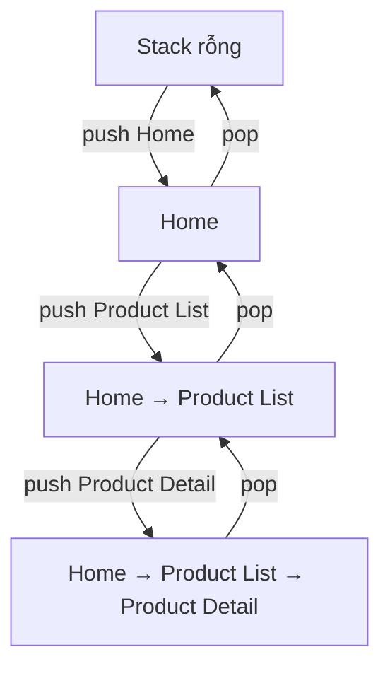
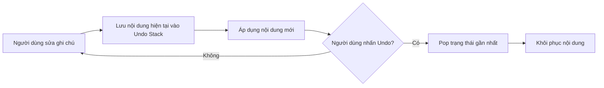

# 019 — Stack

**Học phần:** 01 — Language and Android Fundamentals
**Module:** Module 02 — Android Fundamentals
**Nhóm nội dung:** Data Structures and Algorithms
**Nguồn roadmap:** Android Fundamentals / Data Structures and Algorithms
**Loại bài:** Lesson
**Thứ tự trong module:** 019
**Thời lượng gợi ý:** 24 phút

---

## 1. Tóm tắt

**Stack**, hay **ngăn xếp**, là cấu trúc dữ liệu hoạt động theo nguyên tắc:

> **LIFO — Last In, First Out**
> Phần tử được thêm vào sau cùng sẽ được lấy ra trước tiên.

Stack giống như một chồng đĩa:

* Đĩa mới được đặt lên trên cùng.
* Khi lấy đĩa, ta cũng lấy từ trên cùng.
* Không thể lấy trực tiếp một chiếc đĩa ở giữa mà không di chuyển những chiếc phía trên.

Trong Android, tư duy Stack xuất hiện rất rõ ở:

* Navigation back stack.
* Activity task stack.
* Lịch sử Undo.
* Quá trình xử lý biểu thức.
* Thuật toán quay lui.
* Call stack khi gọi hàm.
* Phân tích cây hoặc duyệt giao diện theo chiều sâu.

Android Navigation sử dụng **back stack** để lưu các màn hình người dùng đã đi qua. Khi chuyển sang màn hình mới, destination mới được đưa lên đỉnh stack; khi người dùng nhấn Back, destination trên cùng bị loại bỏ. ([Android Developers][1])

---

## 2. Mục tiêu học tập

Sau bài học này, anh có thể:

* Giải thích được Stack và nguyên tắc LIFO.
* Phân biệt `push`, `pop`, `peek` và `isEmpty`.
* Cài đặt Stack bằng Kotlin `ArrayDeque`.
* Liên hệ Stack với Navigation và Back trong Android.
* Xây dựng chức năng Undo đơn giản.
* Xử lý trường hợp Stack rỗng an toàn.
* Viết unit test cho Stack.
* Nhận biết ảnh hưởng của Stack tới UX, bộ nhớ và lifecycle.
* Tạo một artifact nhỏ để đưa vào portfolio.

---

## 3. Hình ảnh minh họa

### 3.1. Quá trình Push và Pop


*Hình minh họa các phần tử được Push lần lượt vào Stack và Pop ra theo thứ tự ngược lại. Hình được phát hành theo giấy phép CC0.* ([Wikimedia Commons][2])

### 3.2. Back stack trong Android


Trong hình:

1. Stack ban đầu chứa màn hình `A`.
2. Người dùng mở màn hình `B`.
3. `B` được Push lên trên `A`.
4. Người dùng nhấn Back.
5. `B` bị Pop khỏi Stack.
6. `A` trở thành màn hình hiện tại.

Đây chính là cách Android mô hình hóa lịch sử điều hướng của người dùng. ([Android Developers][3])

---

## 4. Khái niệm chính

## 4.1. Cấu trúc của Stack

Stack chỉ cho phép thao tác trực tiếp tại một đầu, gọi là **đỉnh Stack — Top**.

```text
        ┌───────────────┐
Top ──► │   Settings    │  ← Phần tử vào sau cùng
        ├───────────────┤
        │ ProductDetail │
        ├───────────────┤
        │  ProductList  │
        ├───────────────┤
Bottom  │     Home      │  ← Phần tử vào đầu tiên
        └───────────────┘
```

Khi gọi `pop()`:

```text
Trước Pop                    Sau Pop

┌───────────────┐
│   Settings    │ ← Top      Đã bị loại bỏ
├───────────────┤
│ ProductDetail │            ┌───────────────┐
├───────────────┤            │ ProductDetail │ ← Top mới
│  ProductList  │            ├───────────────┤
├───────────────┤            │  ProductList  │
│     Home      │            ├───────────────┤
└───────────────┘            │     Home      │
                             └───────────────┘
```

---

## 4.2. Các thao tác cơ bản

| Thao tác     | Ý nghĩa                      | Thay đổi Stack |
| ------------ | ---------------------------- | -------------- |
| `push(item)` | Thêm phần tử lên đỉnh        | Có             |
| `pop()`      | Lấy và xóa phần tử trên đỉnh | Có             |
| `peek()`     | Xem phần tử trên đỉnh        | Không          |
| `isEmpty()`  | Kiểm tra Stack có rỗng không | Không          |
| `size`       | Lấy số phần tử               | Không          |
| `clear()`    | Xóa toàn bộ phần tử          | Có             |

Ví dụ:

```text
Stack ban đầu: []

push("Home")
["Home"]

push("Profile")
["Home", "Profile"]

push("Settings")
["Home", "Profile", "Settings"]

peek()
Kết quả: "Settings"
Stack vẫn là: ["Home", "Profile", "Settings"]

pop()
Kết quả: "Settings"
Stack còn: ["Home", "Profile"]
```

---

## 4.3. Độ phức tạp

Với Stack được xây dựng bằng `ArrayDeque`:

| Thao tác               | Độ phức tạp thông thường |
| ---------------------- | -----------------------: |
| Push ở cuối            |        `O(1)` trung bình |
| Pop ở cuối             |        `O(1)` trung bình |
| Peek                   |                   `O(1)` |
| Kiểm tra rỗng          |                   `O(1)` |
| Tìm một phần tử bất kỳ |                   `O(n)` |
| Bộ nhớ                 |                   `O(n)` |

`ArrayDeque` của Kotlin là một deque dựa trên mảng có khả năng tự thay đổi kích thước và hỗ trợ thao tác ở cả hai đầu. Vì vậy, nó có thể đảm nhiệm vai trò của cả Stack lẫn Queue. ([Kotlin][4])

---

## 5. Cài đặt Stack bằng Kotlin

Kotlin không bắt buộc phải có một lớp `Stack` riêng. Ta có thể sử dụng `ArrayDeque` và quy ước cuối deque là đỉnh Stack.

```kotlin
class Stack<T> {

    private val items = ArrayDeque<T>()

    /**
     * Đưa một phần tử lên đỉnh Stack.
     */
    fun push(item: T) {
        items.addLast(item)
    }

    /**
     * Lấy và xóa phần tử trên đỉnh.
     * Trả về null nếu Stack đang rỗng.
     */
    fun pop(): T? {
        return items.removeLastOrNull()
    }

    /**
     * Xem phần tử trên đỉnh nhưng không xóa.
     */
    fun peek(): T? {
        return items.lastOrNull()
    }

    fun isEmpty(): Boolean {
        return items.isEmpty()
    }

    fun clear() {
        items.clear()
    }

    val size: Int
        get() = items.size
}
```

### Sử dụng

```kotlin
fun main() {
    val navigationStack = Stack<String>()

    navigationStack.push("Home")
    navigationStack.push("ProductList")
    navigationStack.push("ProductDetail")

    println(navigationStack.peek())
    // ProductDetail

    println(navigationStack.pop())
    // ProductDetail

    println(navigationStack.peek())
    // ProductList

    println(navigationStack.size)
    // 2
}
```

---

## 6. Sơ đồ hoạt động



Quy tắc quan trọng:

```text
push → thêm vào đỉnh
pop  → xóa khỏi đỉnh
peek → chỉ xem đỉnh
```

---

## 7. Stack trong Android Navigation

## 7.1. Navigation back stack

Giả sử người dùng đi qua các màn hình:

```text
Home → Product List → Product Detail → Checkout
```

Back stack lúc này có thể được hình dung như sau:

```text
┌─────────────────┐
│    Checkout     │ ← Current destination
├─────────────────┤
│ Product Detail  │
├─────────────────┤
│  Product List   │
├─────────────────┤
│      Home       │
└─────────────────┘
```

Khi người dùng nhấn Back:

```text
Checkout bị Pop
        ↓
Product Detail trở thành màn hình hiện tại
```

`NavController.navigate()` thêm destination mới vào back stack, còn `popBackStack()` cố gắng loại destination hiện tại để quay về destination trước đó. ([Android Developers][1])

### Ví dụ với Navigation Compose

```kotlin
navController.navigate("product-detail/123")
```

Thao tác trên có thể hiểu là:

```text
push("product-detail/123")
```

Quay lại màn hình trước:

```kotlin
val wasPopped = navController.popBackStack()

if (!wasPopped) {
    // Không còn destination để quay lại.
}
```

Có thể hiểu là:

```text
pop()
```

Cần kiểm tra kết quả của `popBackStack()` trong những luồng tự quản lý navigation, vì khi back stack không còn destination phù hợp, ứng dụng có thể không còn nội dung để hiển thị. ([Android Developers][1])

---

## 7.2. Navigation 3

Trong Navigation 3, back stack có thể được biểu diễn trực tiếp bằng một danh sách các key. Điều hướng tiến là thêm key vào cuối danh sách; điều hướng lùi là xóa key cuối cùng. ([Android Developers][3])

```kotlin
data object ProductList

data class ProductDetail(
    val productId: String
)

@Composable
fun ShopNavigation() {
    val backStack = remember {
        mutableStateListOf<Any>(ProductList)
    }

    Button(
        onClick = {
            backStack.add(
                ProductDetail(productId = "product-123")
            )
        }
    ) {
        Text("Mở sản phẩm")
    }

    Button(
        onClick = {
            backStack.removeLastOrNull()
        },
        enabled = backStack.size > 1
    ) {
        Text("Quay lại")
    }
}
```

Ở đây:

```text
backStack.add(key)           ≈ push(key)
backStack.removeLastOrNull() ≈ pop()
backStack.lastOrNull()       ≈ peek()
```

---

## 8. Ví dụ thực tế: chức năng Undo

Một ứng dụng ghi chú có thể lưu các phiên bản trước của nội dung trong Stack.



### ViewModel

```kotlin
import androidx.compose.runtime.getValue
import androidx.compose.runtime.mutableStateOf
import androidx.compose.runtime.setValue
import androidx.lifecycle.ViewModel

class NoteEditorViewModel : ViewModel() {

    private val undoStack = ArrayDeque<String>()

    var text by mutableStateOf("")
        private set

    val canUndo: Boolean
        get() = undoStack.isNotEmpty()

    /**
     * Gọi khi người dùng hoàn thành một lần chỉnh sửa có ý nghĩa.
     */
    fun applyEdit(newText: String) {
        if (newText == text) return

        undoStack.addLast(text)
        text = newText
    }

    fun undo() {
        val previousText = undoStack.removeLastOrNull()
        if (previousText != null) {
            text = previousText
        }
    }

    fun clearHistory() {
        undoStack.clear()
    }
}
```

### Giao diện Compose

```kotlin
@Composable
fun NoteEditorScreen(
    viewModel: NoteEditorViewModel
) {
    Column {
        Text(
            text = viewModel.text.ifEmpty {
                "Chưa có nội dung"
            }
        )

        Button(
            onClick = {
                viewModel.applyEdit("Nội dung phiên bản 1")
            }
        ) {
            Text("Áp dụng phiên bản 1")
        }

        Button(
            onClick = {
                viewModel.applyEdit("Nội dung phiên bản 2")
            }
        ) {
            Text("Áp dụng phiên bản 2")
        }

        Button(
            onClick = viewModel::undo,
            enabled = viewModel.canUndo
        ) {
            Text("Undo")
        }
    }
}
```

### Diễn biến

```text
Ban đầu:
text = ""
undoStack = []

applyEdit("Phiên bản 1"):
text = "Phiên bản 1"
undoStack = [""]

applyEdit("Phiên bản 2"):
text = "Phiên bản 2"
undoStack = ["", "Phiên bản 1"]

undo():
text = "Phiên bản 1"
undoStack = [""]
```

---

## 9. Lifecycle và State

Stack được tạo trong bộ nhớ chỉ tồn tại khi object chứa nó còn sống.

### Trường hợp 1: Stack đặt trong Composable bằng `remember`

```kotlin
val history = remember {
    ArrayDeque<String>()
}
```

Stack này:

* Tồn tại qua recomposition.
* Có thể mất khi Activity được tái tạo.
* Không phù hợp cho lịch sử quan trọng.

### Trường hợp 2: Stack đặt trong ViewModel

```kotlin
class EditorViewModel : ViewModel() {
    private val undoStack = ArrayDeque<String>()
}
```

Stack có thể tồn tại qua những thay đổi cấu hình như xoay màn hình vì ViewModel được dùng để giữ state qua configuration change. Tuy nhiên, dữ liệu chỉ nằm trong ViewModel vẫn có thể mất khi process bị hệ thống kết thúc. ([Android Developers][5])

### Trường hợp 3: Cần phục hồi sau process death

Không nên đẩy một lịch sử chỉnh sửa lớn vào `SavedStateHandle` hoặc `rememberSaveable`. Android khuyến nghị các API dựa trên Bundle chỉ lưu lượng nhỏ UI state; dữ liệu lớn hoặc phức tạp nên được lưu bằng persistent storage và phục hồi thông qua ID hoặc khóa. ([Android Developers][6])

Cách lựa chọn:

| Loại dữ liệu                               | Nơi lưu phù hợp            |
| ------------------------------------------ | -------------------------- |
| Stack tạm thời trong một lần mở màn hình   | `remember`                 |
| Undo history cần giữ khi xoay màn hình     | `ViewModel`                |
| Một vài key cần phục hồi sau process death | `SavedStateHandle`         |
| Lịch sử dài hoặc dữ liệu quan trọng        | Room, file hoặc data layer |
| Navigation history                         | Navigation component       |

---

## 10. Những lỗi lập trình viên Android mới thường mắc

### 10.1. Pop khi Stack rỗng

Không an toàn:

```kotlin
val item = stack.removeLast()
```

Nếu Stack rỗng, lệnh có thể ném exception.

An toàn hơn:

```kotlin
val item = stack.removeLastOrNull()
```

---

### 10.2. Chọn sai đầu của danh sách

Ví dụ vừa thêm ở cuối nhưng lại xóa ở đầu:

```kotlin
items.addLast(item)
items.removeFirstOrNull()
```

Đây không còn là Stack mà trở thành cách hoạt động giống Queue.

Stack đúng:

```kotlin
items.addLast(item)
items.removeLastOrNull()
```

---

### 10.3. Lưu mỗi ký tự vào Undo Stack

```kotlin
fun onTextChanged(newText: String) {
    undoStack.addLast(currentText)
    currentText = newText
}
```

Nếu người dùng gõ 5.000 ký tự, ứng dụng có thể lưu hàng nghìn bản sao của chuỗi.

Giải pháp:

* Lưu theo thao tác có ý nghĩa.
* Gom nhiều thay đổi liên tiếp.
* Debounce việc ghi lịch sử.
* Đặt giới hạn số phần tử.
* Lưu command hoặc phần chênh lệch thay vì toàn bộ document.

```kotlin
private const val MAX_HISTORY_SIZE = 50

fun pushHistory(value: String) {
    if (undoStack.size >= MAX_HISTORY_SIZE) {
        undoStack.removeFirstOrNull()
    }

    undoStack.addLast(value)
}
```

---

### 10.4. Đưa cùng một màn hình lên Stack quá nhiều lần

```text
Home
Search
Search
Search
Search
```

Điều này khiến người dùng phải nhấn Back nhiều lần mới thoát khỏi màn hình Search.

Có thể cân nhắc:

```kotlin
navController.navigate("search") {
    launchSingleTop = true
}
```

`launchSingleTop` giúp tránh tạo thêm một bản sao destination nếu destination đó đã nằm trên đỉnh back stack. ([Android Developers][1])

---

### 10.5. Không xóa màn hình đăng nhập sau khi đăng nhập

Back stack không phù hợp:

```text
Login → OTP → Home
```

Sau khi vào Home, người dùng nhấn Back lại quay về OTP hoặc Login.

Luồng mong muốn:

```text
Home
```

Ví dụ:

```kotlin
navController.navigate("home") {
    popUpTo("login") {
        inclusive = true
    }
}
```

`popUpTo` cho phép loại các destination không còn hợp lệ khỏi back stack, chẳng hạn toàn bộ luồng đăng nhập sau khi xác thực thành công. ([Android Developers][1])

---

## 11. Unit test

### Test lớp Stack

```kotlin
import org.junit.Assert.assertEquals
import org.junit.Assert.assertNull
import org.junit.Assert.assertTrue
import org.junit.Test

class StackTest {

    @Test
    fun `pop tra ve phan tu duoc them sau cung`() {
        val stack = Stack<String>()

        stack.push("Home")
        stack.push("Profile")
        stack.push("Settings")

        assertEquals("Settings", stack.pop())
        assertEquals("Profile", stack.pop())
        assertEquals("Home", stack.pop())
    }

    @Test
    fun `peek khong xoa phan tu`() {
        val stack = Stack<Int>()

        stack.push(10)
        stack.push(20)

        assertEquals(20, stack.peek())
        assertEquals(2, stack.size)
    }

    @Test
    fun `pop stack rong tra ve null`() {
        val stack = Stack<String>()

        assertNull(stack.pop())
        assertTrue(stack.isEmpty())
    }

    @Test
    fun `clear xoa tat ca phan tu`() {
        val stack = Stack<Int>()

        stack.push(1)
        stack.push(2)
        stack.clear()

        assertTrue(stack.isEmpty())
        assertEquals(0, stack.size)
    }
}
```

### Những trường hợp cần kiểm thử

| Test case                 | Kết quả mong đợi                      |
| ------------------------- | ------------------------------------- |
| Push một phần tử          | `peek()` trả về phần tử đó            |
| Push nhiều phần tử        | `pop()` trả về phần tử mới nhất       |
| Peek                      | Không thay đổi kích thước             |
| Pop Stack rỗng            | Trả về `null`                         |
| Clear                     | Stack trở thành rỗng                  |
| Push sau Clear            | Stack hoạt động bình thường           |
| Undo nhiều lần            | Quay lại đúng thứ tự                  |
| Undo khi không có lịch sử | Không crash                           |
| Xoay màn hình             | State cần thiết vẫn tồn tại           |
| Process recreation        | Phục hồi theo chính sách của ứng dụng |

Android khuyến nghị kiểm thử phần tương tác giữa code của ứng dụng và `NavController`, thay vì kiểm thử lại toàn bộ cơ chế nội bộ của Navigation component. Với Fragment Navigation, `TestNavHostController` có thể được dùng để thiết lập destination hiện tại và xác minh kết quả sau thao tác điều hướng. ([Android Developers][7])

---

## 12. Ảnh hưởng tới UX và chất lượng ứng dụng

## UX

Stack được quản lý đúng giúp:

* Nút Back quay lại đúng màn hình.
* Người dùng không bị mắc kẹt trong vòng lặp điều hướng.
* Không quay lại màn hình đăng nhập sau khi đã đăng nhập.
* Undo hoạt động theo đúng thứ tự.
* Trạng thái màn hình trước được phục hồi hợp lý.

## Reliability

Stack an toàn cần:

* Không Pop khi rỗng.
* Không tăng kích thước vô hạn.
* Không chứa object đã hết lifecycle.
* Có chính sách phục hồi sau process death.
* Có unit test cho thứ tự LIFO.

## Maintainability

Nên đóng gói Stack trong một lớp có API rõ ràng:

```kotlin
interface HistoryManager<T> {
    fun push(value: T)
    fun pop(): T?
    fun peek(): T?
    fun clear()
}
```

Không nên để nhiều màn hình trực tiếp chỉnh sửa cùng một `MutableList`, vì các nơi khác nhau có thể sử dụng sai đầu của Stack hoặc bỏ qua việc kiểm tra Stack rỗng.

---

## 13. Artifact nhỏ cho portfolio

### Mini project: Note Editor có Undo

#### Chức năng

* Nhập hoặc thay đổi nội dung ghi chú.
* Lưu tối đa 30 trạng thái gần nhất.
* Nút Undo chỉ bật khi còn lịch sử.
* Không crash khi lịch sử rỗng.
* Giữ trạng thái khi xoay màn hình.
* Có unit test cho thứ tự Undo.

#### Cấu trúc đề xuất

```text
stack-demo/
├── data/
│   └── EditCommand.kt
├── domain/
│   └── UndoManager.kt
├── ui/
│   ├── NoteEditorScreen.kt
│   └── NoteEditorViewModel.kt
├── test/
│   └── UndoManagerTest.kt
└── README.md
```

#### Nội dung README

```markdown
# Stack Undo Demo

Ứng dụng Android nhỏ minh họa cấu trúc dữ liệu Stack
thông qua chức năng Undo trong trình chỉnh sửa ghi chú.

## Kiến thức áp dụng

- LIFO
- ArrayDeque
- Push, Pop và Peek
- ViewModel state
- Giới hạn lịch sử
- Unit testing

## Quy tắc

- Mỗi edit được Push vào Undo Stack.
- Undo sẽ Pop edit gần nhất.
- Stack có tối đa 30 phần tử.
- Pop Stack rỗng không gây crash.
```

---

## 14. Bài thực hành 24 phút

### Phút 1–5: Viết định nghĩa

Viết ghi chú 5 dòng:

```text
Stack là cấu trúc dữ liệu hoạt động theo nguyên tắc LIFO.
Phần tử thêm sau cùng được lấy ra đầu tiên.
Push dùng để thêm phần tử lên đỉnh Stack.
Pop dùng để lấy và xóa phần tử trên đỉnh.
Trong Android, Navigation back stack là một ứng dụng phổ biến của Stack.
```

### Phút 6–12: Cài đặt Stack

Tạo lớp:

```kotlin
class Stack<T>
```

Có các phương thức:

```kotlin
push()
pop()
peek()
isEmpty()
clear()
```

### Phút 13–18: Tạo ví dụ Android

Xây dựng một trong các ví dụ:

* Undo ghi chú.
* Lịch sử bộ lọc ảnh.
* Lịch sử trang đã mở.
* Back stack giả lập.
* Trình tính toán biểu thức.

### Phút 19–24: Viết test và README

Kiểm thử:

* Thứ tự LIFO.
* Stack rỗng.
* Peek không xóa phần tử.
* Clear.
* Giới hạn kích thước.

---

## 15. Bài tập

### Bài 1 — Đảo ngược chuỗi

Dùng Stack để đảo ngược:

```text
ANDROID
```

Kết quả:

```text
DIORDNA
```

Gợi ý:

```kotlin
fun reverseText(text: String): String {
    val stack = ArrayDeque<Char>()

    for (character in text) {
        stack.addLast(character)
    }

    return buildString {
        while (stack.isNotEmpty()) {
            append(stack.removeLast())
        }
    }
}
```

---

### Bài 2 — Kiểm tra dấu ngoặc

Kiểm tra biểu thức:

```text
({[]})
```

Có hợp lệ hay không.

Nguyên tắc:

1. Gặp dấu mở thì Push.
2. Gặp dấu đóng thì Pop.
3. Kiểm tra cặp dấu có tương ứng không.
4. Kết thúc, Stack phải rỗng.

```kotlin
fun isValidBrackets(text: String): Boolean {
    val stack = ArrayDeque<Char>()

    val pairs = mapOf(
        ')' to '(',
        ']' to '[',
        '}' to '{'
    )

    for (character in text) {
        when (character) {
            '(', '[', '{' -> stack.addLast(character)

            ')', ']', '}' -> {
                val opening = stack.removeLastOrNull()
                    ?: return false

                if (opening != pairs[character]) {
                    return false
                }
            }
        }
    }

    return stack.isEmpty()
}
```

---

### Bài 3 — Navigation flow

Cho luồng:

```text
Splash → Login → OTP → Home → Product → Checkout
```

Hãy xác định:

1. Destination nào nên còn trong Stack sau khi đăng nhập?
2. Nhấn Back từ Checkout sẽ tới đâu?
3. Màn hình Login có nên xuất hiện lại không?
4. Nên dùng `popUpTo` ở bước nào?
5. Cần kiểm thử deep link vào Product như thế nào?

---

## 16. Checklist hoàn thành

### Kiến thức

* [ ] Giải thích được nguyên tắc LIFO.
* [ ] Phân biệt được Push, Pop và Peek.
* [ ] Hiểu đỉnh Stack là gì.
* [ ] Biết độ phức tạp cơ bản của Stack.
* [ ] Phân biệt được Stack với Queue.

### Kotlin

* [ ] Dùng được `ArrayDeque`.
* [ ] Thêm phần tử bằng `addLast()`.
* [ ] Pop an toàn bằng `removeLastOrNull()`.
* [ ] Peek an toàn bằng `lastOrNull()`.
* [ ] Xử lý được Stack rỗng.

### Android

* [ ] Giải thích được Navigation back stack.
* [ ] Hiểu tác dụng của `navigate()`.
* [ ] Hiểu tác dụng của `popBackStack()`.
* [ ] Biết khi nào cần `popUpTo`.
* [ ] Có chiến lược giữ state qua configuration change.
* [ ] Không lưu dữ liệu lớn vào Bundle.

### Portfolio

* [ ] Có code Stack tổng quát.
* [ ] Có ứng dụng Undo hoặc Navigation demo.
* [ ] Có sơ đồ luồng.
* [ ] Có unit test.
* [ ] Có README.
* [ ] Có ảnh hoặc GIF minh họa hoạt động.

---

## 17. Ghi chú production

Trước khi đưa tính năng sử dụng Stack vào production, cần kiểm tra:

### Giới hạn bộ nhớ

```text
Stack có thể tăng vô hạn hay không?
```

Nếu có, cần đặt giới hạn:

```kotlin
private const val MAX_STACK_SIZE = 50
```

### Lifecycle

```text
Stack nằm trong Composable, ViewModel hay data layer?
```

Stack tạm thời có thể để trong bộ nhớ. Stack quan trọng cần được phục hồi từ persistent storage.

### Navigation

```text
Người dùng nhấn Back có trở về đúng nơi không?
Deep link có tạo back stack hợp lý không?
Luồng Login có bị quay lại sau khi đăng nhập không?
```

### Error handling

```text
Pop Stack rỗng có gây crash không?
Destination đã bị xóa có còn được tham chiếu không?
```

### Testing

```text
Đã test thứ tự LIFO chưa?
Đã test xoay màn hình chưa?
Đã test process recreation chưa?
Đã test nhấn Back liên tục chưa?
Đã test deep link và notification chưa?
```

### Release risk

Một lỗi nhỏ trong back stack có thể tạo ra:

* Màn hình trắng.
* Vòng lặp điều hướng.
* Người dùng không thoát được.
* Quay lại màn hình không còn hợp lệ.
* Mất nội dung đang chỉnh sửa.
* Undo sai thứ tự.
* Tăng bộ nhớ theo thời gian.

---

## 18. Kết luận

Stack là một cấu trúc dữ liệu đơn giản nhưng xuất hiện trực tiếp trong trải nghiệm Android:

```text
Đi tới màn hình mới  → Push
Nhấn Back            → Pop
Xem màn hình hiện tại → Peek
```

Điểm quan trọng không chỉ là biết viết `push()` và `pop()`, mà còn phải hiểu:

* Stack ảnh hưởng thế nào đến hành vi nút Back.
* Khi nào history cần được giới hạn.
* State có tồn tại qua xoay màn hình hay process death không.
* Người dùng có quay lại đúng màn hình không.
* Trường hợp Stack rỗng được xử lý như thế nào.
* Unit test nào bảo vệ hành vi LIFO.

Một Android Developer vững Stack sẽ thiết kế được Navigation rõ ràng, Undo đáng tin cậy và các luồng người dùng ít lỗi hơn.

[1]: https://developer.android.com/guide/navigation/backstack "Navigation and the back stack  |  App architecture  |  Android Developers"
[2]: https://commons.wikimedia.org/wiki/File%3ALifo_stack.svg "File:Lifo stack.svg - Wikimedia Commons"
[3]: https://developer.android.com/guide/navigation/navigation-3/basics "Understand and implement the basics  |  App architecture  |  Android Developers"
[4]: https://kotlinlang.org/api/core/kotlin-stdlib/kotlin.collections/-array-deque/ "ArrayDeque | Core API – Kotlin Programming Language"
[5]: https://developer.android.com/topic/libraries/architecture/views/viewmodel/viewmodel-savedstate-views?hl=en&utm_source=chatgpt.com "Saved State module for ViewModel (Views)  |  Android Developers"
[6]: https://developer.android.com/develop/ui/compose/state-saving?hl=en&utm_source=chatgpt.com "Save UI state in Compose  |  Jetpack Compose  |  Android Developers"
[7]: https://developer.android.com/guide/navigation/testing/fragments "Test fragment navigation  |  App architecture  |  Android Developers"

---

# Bài luyện tập

## Mục tiêu


## Đề bài


## Yêu cầu hoàn thành

- [ ] 
- [ ] 
- [ ] 

## Kết quả / lời giải


## Ghi chú
