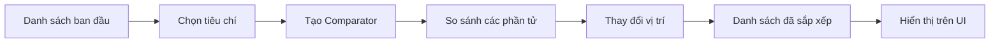
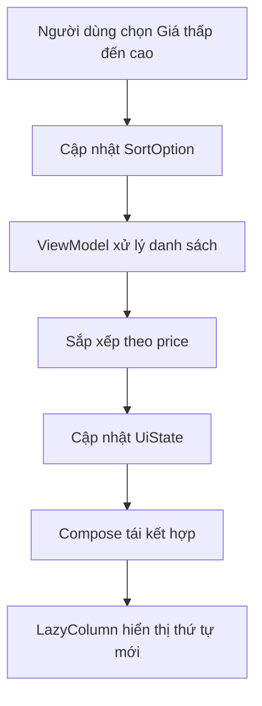
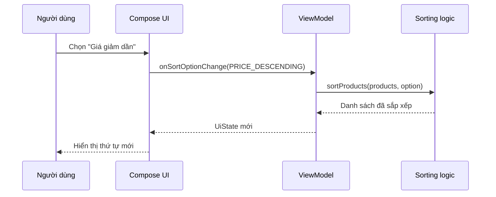

# 020 - Sorting Basics

**Học phần:** 01 - Language and Android Fundamentals
**Module:** Module 02 - Android Fundamentals
**Nhóm nội dung:** Data Structures and Algorithms
**Nguồn roadmap:** Android Fundamentals / Data Structures and Algorithms
**Loại bài:** Lesson
**Thứ tự trong module:** 020
**Thời lượng gợi ý:** 24 phút

---

## 1. Tóm tắt

**Sorting – sắp xếp** là quá trình đưa các phần tử trong một tập dữ liệu về một thứ tự xác định, chẳng hạn:

* Giá sản phẩm từ thấp đến cao.
* Tin nhắn mới nhất lên đầu.
* Danh bạ theo tên A–Z.
* Nhiệm vụ chưa hoàn thành đứng trước.
* Điểm số từ cao xuống thấp.

Về mặt thuật toán, kết quả sau khi sắp xếp phải giữ nguyên các phần tử ban đầu nhưng thay đổi vị trí của chúng theo một quy tắc so sánh. Việc lựa chọn cách sắp xếp phụ thuộc vào kích thước dữ liệu, bộ nhớ, chi phí so sánh và yêu cầu giữ nguyên thứ tự tương đối của các phần tử bằng nhau.

Trong Android, lập trình viên thường không tự viết lại thuật toán sắp xếp cho mã production. Thay vào đó, chúng ta sử dụng các hàm chuẩn của Kotlin như:

```kotlin
sorted()
sortedDescending()
sortedBy()
sortedByDescending()
sortedWith()
sort()
sortBy()
```

Điều quan trọng là hiểu:

1. Dữ liệu đang được sắp xếp theo tiêu chí nào.
2. Hàm sắp xếp có thay đổi danh sách gốc hay không.
3. Việc sắp xếp nên diễn ra ở UI, ViewModel, repository, API hay cơ sở dữ liệu.
4. Có đang sắp xếp lại quá nhiều lần gây giật giao diện hay không.
5. Trạng thái lựa chọn sắp xếp có được giữ khi xoay màn hình hoặc mở lại ứng dụng hay không.

---

## 2. Mục tiêu học tập

Sau bài học, anh có thể:

* Giải thích được khái niệm sắp xếp.
* Phân biệt thứ tự tăng dần và giảm dần.
* Hiểu khái niệm khóa sắp xếp và bộ so sánh.
* Phân biệt `sort()` với `sorted()`.
* Mô tả nguyên lý của Bubble Sort, Selection Sort và Insertion Sort.
* Sử dụng các API sắp xếp của Kotlin.
* Sắp xếp danh sách đối tượng theo một hoặc nhiều thuộc tính.
* Kết nối chức năng sắp xếp với state trong ứng dụng Android.
* Viết kiểm thử cho logic sắp xếp.
* Nhận biết các lỗi thường gặp khi sắp xếp danh sách trên UI.

---

## 3. Khái niệm sắp xếp

### 3.1. Sắp xếp là gì?

Cho danh sách ban đầu:

```text
[7, 2, 9, 1, 5]
```

Sắp xếp tăng dần:

```text
[1, 2, 5, 7, 9]
```

Sắp xếp giảm dần:

```text
[9, 7, 5, 2, 1]
```

Với đối tượng phức tạp, chúng ta phải xác định **khóa sắp xếp – sort key**.

Ví dụ:

```kotlin
data class Product(
    val id: Long,
    val name: String,
    val price: Long,
    val rating: Double
)
```

Danh sách sản phẩm có thể được sắp xếp theo:

* `name`: tên A–Z.
* `price`: giá thấp đến cao.
* `rating`: đánh giá cao đến thấp.
* Nhiều khóa: đánh giá giảm dần, sau đó giá tăng dần.

---

### 3.2. Sơ đồ quá trình sắp xếp



Ví dụ trong ứng dụng mua sắm:



---

## 4. Các thuật toán sắp xếp cơ bản

Ba thuật toán dưới đây chủ yếu được học để hiểu cách so sánh, hoán đổi và phân tích độ phức tạp. Với danh sách production thông thường, nên ưu tiên API chuẩn của Kotlin.

---

### 4.1. Bubble Sort – sắp xếp nổi bọt

Bubble Sort liên tục so sánh hai phần tử liền kề. Nếu chúng sai thứ tự, thuật toán hoán đổi chúng.

Sau mỗi lượt, phần tử lớn nhất còn lại sẽ dần được đẩy về cuối danh sách.


*Nguồn ảnh: [Wikimedia Commons – Bubble Sort](https://commons.wikimedia.org/wiki/File:Bubble-sort-example-300px.gif), giấy phép CC BY-SA 3.0.*

#### Ví dụ

```text
Danh sách: [5, 2, 4, 1]

Lượt 1:
[5, 2, 4, 1] → so sánh 5 và 2 → đổi chỗ
[2, 5, 4, 1] → so sánh 5 và 4 → đổi chỗ
[2, 4, 5, 1] → so sánh 5 và 1 → đổi chỗ
[2, 4, 1, 5]

Lượt 2:
[2, 4, 1, 5] → 2 và 4 giữ nguyên
[2, 4, 1, 5] → 4 và 1 đổi chỗ
[2, 1, 4, 5]

Lượt 3:
[2, 1, 4, 5] → 2 và 1 đổi chỗ
[1, 2, 4, 5]
```

#### Kotlin implementation

```kotlin
fun bubbleSortAscending(input: List<Int>): List<Int> {
    val result = input.toMutableList()

    for (endIndex in result.lastIndex downTo 1) {
        var swapped = false

        for (index in 0 until endIndex) {
            if (result[index] > result[index + 1]) {
                val temporary = result[index]
                result[index] = result[index + 1]
                result[index + 1] = temporary

                swapped = true
            }
        }

        // Danh sách đã đúng thứ tự, không cần tiếp tục.
        if (!swapped) break
    }

    return result
}
```

#### Độ phức tạp

* Dữ liệu bất kỳ: `O(n²)`.
* Danh sách gần như đã sắp xếp và có kiểm tra `swapped`: có thể tiến gần `O(n)`.
* Bộ nhớ phụ: `O(1)` nếu sắp xếp trực tiếp trên danh sách mutable.

Bubble Sort dễ học nhưng không phù hợp với danh sách lớn.

---

### 4.2. Selection Sort – sắp xếp chọn

Selection Sort chia danh sách thành hai vùng:

* Vùng bên trái đã được sắp xếp.
* Vùng bên phải chưa được sắp xếp.

Trong mỗi lượt, thuật toán tìm phần tử nhỏ nhất trong vùng chưa sắp xếp rồi đưa nó về đầu vùng đó.


*Nguồn ảnh: [Wikimedia Commons – Selection Sort](https://commons.wikimedia.org/wiki/File:Selection_Sort_Animation.gif), giấy phép CC BY-SA 4.0.*

#### Ví dụ

```text
[5, 2, 4, 1]

Tìm nhỏ nhất trong toàn bộ danh sách: 1
Đưa 1 lên đầu:
[1, 2, 4, 5]

Tìm nhỏ nhất từ vị trí 1: 2
[1, 2, 4, 5]

Tìm nhỏ nhất từ vị trí 2: 4
[1, 2, 4, 5]
```

#### Kotlin implementation

```kotlin
fun selectionSortAscending(input: List<Int>): List<Int> {
    val result = input.toMutableList()

    for (currentIndex in 0 until result.lastIndex) {
        var minimumIndex = currentIndex

        for (candidateIndex in currentIndex + 1..result.lastIndex) {
            if (result[candidateIndex] < result[minimumIndex]) {
                minimumIndex = candidateIndex
            }
        }

        if (minimumIndex != currentIndex) {
            val temporary = result[currentIndex]
            result[currentIndex] = result[minimumIndex]
            result[minimumIndex] = temporary
        }
    }

    return result
}
```

#### Độ phức tạp

Selection Sort luôn phải tìm phần tử nhỏ nhất trong phần dữ liệu còn lại, vì vậy thời gian chạy là `Θ(n²)`. Phiên bản hoán đổi thông thường cũng không bảo đảm tính ổn định.

---

### 4.3. Insertion Sort – sắp xếp chèn

Insertion Sort xem phần đầu danh sách là vùng đã sắp xếp. Mỗi phần tử mới được lấy ra và chèn vào đúng vị trí trong vùng đó.

Nó giống cách sắp xếp các lá bài trên tay.


*Nguồn ảnh: [Wikimedia Commons – Insertion Sort](https://commons.wikimedia.org/wiki/File:Insertion-sort-example.gif), giấy phép CC BY-SA 3.0.*

#### Ví dụ

```text
[5, 2, 4, 1]

Vùng đã sắp xếp: [5]
Chèn 2:
[2, 5, 4, 1]

Chèn 4 vào [2, 5]:
[2, 4, 5, 1]

Chèn 1 vào [2, 4, 5]:
[1, 2, 4, 5]
```

#### Kotlin implementation

```kotlin
fun insertionSortAscending(input: List<Int>): List<Int> {
    val result = input.toMutableList()

    for (currentIndex in 1..result.lastIndex) {
        val currentValue = result[currentIndex]
        var position = currentIndex - 1

        while (position >= 0 && result[position] > currentValue) {
            result[position + 1] = result[position]
            position--
        }

        result[position + 1] = currentValue
    }

    return result
}
```

#### Độ phức tạp

Insertion Sort có thời gian chạy `O(n²)` do có thể phải di chuyển nhiều phần tử để mở vị trí chèn. Tuy nhiên, nó thường hoạt động tốt với tập dữ liệu nhỏ hoặc gần như đã có thứ tự.

---

### 4.4. So sánh ba thuật toán

| Thuật toán     | Ý tưởng                          |                        Trường hợp tốt | Trung bình/xấu | Phù hợp                            |
| -------------- | -------------------------------- | ------------------------------------: | -------------: | ---------------------------------- |
| Bubble Sort    | Đổi chỗ các cặp liền kề          | `O(n)` khi đã gần đúng và có dừng sớm |        `O(n²)` | Học khái niệm hoán đổi             |
| Selection Sort | Chọn phần tử nhỏ nhất còn lại    |                               `O(n²)` |        `O(n²)` | Học cách chọn cực trị              |
| Insertion Sort | Chèn phần tử vào vùng đã sắp xếp |              `O(n)` khi gần có thứ tự |        `O(n²)` | Danh sách nhỏ hoặc gần đúng thứ tự |

> Trong ứng dụng Android thực tế, không nên thay `sortedBy()` bằng Bubble Sort chỉ vì Bubble Sort dễ viết.

---

## 5. Sắp xếp bằng Kotlin Standard Library

### 5.1. `sorted()` và `sortedDescending()`

```kotlin
val scores = listOf(80, 95, 65, 90)

val ascending = scores.sorted()
val descending = scores.sortedDescending()

println(ascending)
// [65, 80, 90, 95]

println(descending)
// [95, 90, 80, 65]
```

Hai hàm này sử dụng **thứ tự tự nhiên – natural order** của phần tử và trả về một danh sách đã sắp xếp.

---

### 5.2. `sort()` và `sorted()` khác nhau thế nào?

```kotlin
val immutableNumbers = listOf(3, 1, 2)
val sortedNumbers = immutableNumbers.sorted()
```

`sorted()`:

* Không thay đổi danh sách ban đầu.
* Trả về một danh sách mới.
* Dùng được với `List`.

```kotlin
val mutableNumbers = mutableListOf(3, 1, 2)
mutableNumbers.sort()
```

`sort()`:

* Thay đổi trực tiếp danh sách hiện tại.
* Chỉ dùng với danh sách mutable.
* Có thể ảnh hưởng đến các nơi khác đang giữ tham chiếu tới danh sách đó.

Kotlin phân biệt rõ nhóm hàm sửa trực tiếp như `sort()` và nhóm hàm trả về kết quả mới như `sorted()`.

---

### 5.3. Sắp xếp đối tượng bằng `sortedBy()`

```kotlin
data class Product(
    val id: Long,
    val name: String,
    val price: Long,
    val rating: Double
)

val products = listOf(
    Product(1, "Bàn phím", 700_000, 4.7),
    Product(2, "Chuột", 350_000, 4.5),
    Product(3, "Màn hình", 4_500_000, 4.8)
)

val cheapestFirst = products.sortedBy { product ->
    product.price
}
```

Kết quả:

```text
Chuột       350.000
Bàn phím    700.000
Màn hình  4.500.000
```

Viết ngắn hơn:

```kotlin
val cheapestFirst = products.sortedBy(Product::price)
```

---

### 5.4. Sắp xếp giảm dần

```kotlin
val highestRatedFirst = products.sortedByDescending { product ->
    product.rating
}
```

---

### 5.5. Sắp xếp theo nhiều tiêu chí

Yêu cầu:

1. Rating cao hơn đứng trước.
2. Nếu rating bằng nhau, sản phẩm rẻ hơn đứng trước.
3. Nếu vẫn bằng nhau, sắp xếp theo tên.

```kotlin
val sortedProducts = products.sortedWith(
    compareByDescending<Product> { it.rating }
        .thenBy { it.price }
        .thenBy { it.name }
)
```

`sortedWith()` nhận một `Comparator` và trả về danh sách theo quy tắc của comparator. Kotlin ghi rõ thao tác này là stable: các phần tử được xem là bằng nhau sẽ giữ thứ tự tương đối ban đầu.

---

## 6. Ví dụ trong ứng dụng Android

### 6.1. Yêu cầu

Xây dựng màn hình sản phẩm có bốn chế độ:

```kotlin
enum class SortOption {
    NAME_ASCENDING,
    PRICE_ASCENDING,
    PRICE_DESCENDING,
    RATING_DESCENDING
}
```

Hàm xử lý:

```kotlin
fun sortProducts(
    products: List<Product>,
    option: SortOption
): List<Product> {
    return when (option) {
        SortOption.NAME_ASCENDING ->
            products.sortedBy { it.name }

        SortOption.PRICE_ASCENDING ->
            products.sortedBy { it.price }

        SortOption.PRICE_DESCENDING ->
            products.sortedByDescending { it.price }

        SortOption.RATING_DESCENDING ->
            products.sortedByDescending { it.rating }
    }
}
```

---

### 6.2. Kết nối với Jetpack Compose

```kotlin
@Composable
fun ProductScreen(
    products: List<Product>,
    sortOption: SortOption,
    onSortOptionChange: (SortOption) -> Unit
) {
    val sortedProducts = remember(products, sortOption) {
        sortProducts(
            products = products,
            option = sortOption
        )
    }

    Column {
        SortOptionDropdown(
            selectedOption = sortOption,
            onOptionSelected = onSortOptionChange
        )

        LazyColumn {
            items(
                items = sortedProducts,
                key = Product::id
            ) { product ->
                ProductRow(product = product)
            }
        }
    }
}
```

`LazyColumn` chỉ compose và bố trí những phần tử cần thiết trong vùng nhìn thấy, phù hợp hơn `Column` khi danh sách có nhiều hoặc không biết trước số lượng phần tử.

Sử dụng `key = Product::id` giúp Compose nhận biết đúng từng phần tử khi thứ tự danh sách thay đổi.

---

### 6.3. Luồng state đề xuất



Compose hiển thị giao diện dựa trên state. Khi state thay đổi, phần UI đang đọc state đó có thể được cập nhật lại. Vì vậy, tiêu chí sắp xếp nên được biểu diễn rõ ràng trong `UiState` thay vì thay đổi ngầm danh sách ở nhiều nơi.

---

## 7. State, lifecycle và việc giữ lựa chọn sắp xếp

Một `UiState` đơn giản:

```kotlin
data class ProductUiState(
    val products: List<Product> = emptyList(),
    val sortOption: SortOption = SortOption.NAME_ASCENDING,
    val isLoading: Boolean = false,
    val errorMessage: String? = null
)
```

### Nên đặt state ở đâu?

| Trường hợp                            | Vị trí phù hợp                  |
| ------------------------------------- | ------------------------------- |
| Chỉ dùng tạm trong một composable     | `remember`                      |
| Muốn giữ qua tái cấu hình UI đơn giản | `rememberSaveable`              |
| Liên quan dữ liệu và logic màn hình   | `ViewModel`                     |
| Muốn khôi phục sau khi process bị hủy | `SavedStateHandle` hoặc lưu trữ |
| Dữ liệu lớn từ server/database        | Sắp xếp tại data source         |

State của danh sách cuộn có thể được quản lý riêng bằng `LazyListState`; tài liệu Android cũng khuyến khích đưa state lên cấp sở hữu phù hợp khi nhiều thành phần cần đọc hoặc điều khiển nó.

---

## 8. Sắp xếp ảnh hưởng đến UX như thế nào?

### 8.1. Khả năng tìm thông tin

Người dùng có thể tìm sản phẩm, cuộc trò chuyện hoặc nhiệm vụ nhanh hơn.

Ví dụ:

```text
Không sắp xếp:
Tin nhắn cũ và mới lẫn lộn.

Sắp xếp:
Tin nhắn mới nhất được hiển thị đầu tiên.
```

---

### 8.2. Tính nhất quán

Nếu hai lần mở màn hình tạo ra thứ tự khác nhau dù dữ liệu không đổi, người dùng có thể:

* Khó theo dõi vị trí của phần tử.
* Bấm nhầm.
* Cho rằng ứng dụng bị lỗi.
* Không hiểu tiêu chí đang được áp dụng.

Nên hiển thị rõ chế độ hiện tại:

```text
Sắp xếp theo: Giá thấp đến cao
```

---

### 8.3. Vị trí cuộn

Khi danh sách đổi thứ tự, phần tử người dùng đang xem có thể chuyển sang vị trí khác.

Cần quyết định rõ:

* Giữ nguyên vị trí cuộn theo index.
* Giữ phần tử hiện tại bằng ID.
* Tự động cuộn lên đầu.
* Hiển thị thông báo rằng danh sách đã được sắp xếp lại.

---

### 8.4. Hiệu năng

Không nên thực hiện phép sắp xếp tốn kém trực tiếp trong phần thân composable ở mọi lần recomposition:

```kotlin
// Không nên
LazyColumn {
    items(products.sortedBy { it.price }) {
        ProductRow(it)
    }
}
```

Nên tính trước hoặc cache theo dependency:

```kotlin
val sortedProducts = remember(products, sortOption) {
    sortProducts(products, sortOption)
}
```

Với dữ liệu lớn, danh sách phân trang hoặc dữ liệu từ cơ sở dữ liệu, nên đẩy việc sắp xếp xuống query, repository hoặc server thay vì tải toàn bộ dữ liệu về rồi sắp xếp trên UI.

---

## 9. Stable sort – sắp xếp ổn định

Một thuật toán sắp xếp được gọi là **ổn định** khi các phần tử bằng nhau theo tiêu chí sắp xếp vẫn giữ nguyên thứ tự tương đối ban đầu.

Danh sách ban đầu:

```text
An   - Điểm 8 - xuất hiện trước
Bình - Điểm 9
Chi  - Điểm 8 - xuất hiện sau
```

Sắp xếp giảm dần theo điểm bằng stable sort:

```text
Bình - Điểm 9
An   - Điểm 8
Chi  - Điểm 8
```

`An` vẫn đứng trước `Chi`.

Điều này quan trọng khi:

* Dữ liệu đã được sắp xếp trước theo một tiêu chí phụ.
* Các mục có cùng giá hoặc cùng điểm.
* Muốn UI không đổi thứ tự một cách khó đoán.
* Muốn thực hiện nhiều bước sắp xếp.

Kotlin xác định `sortedWith()` là stable.

---

## 10. Kiểm thử logic sắp xếp

### 10.1. Kiểm thử thứ tự tăng dần

```kotlin
class ProductSortingTest {

    @Test
    fun `price ascending sorts cheaper products first`() {
        val products = listOf(
            Product(1, "A", 500_000, 4.0),
            Product(2, "B", 100_000, 4.5),
            Product(3, "C", 300_000, 4.2)
        )

        val result = sortProducts(
            products = products,
            option = SortOption.PRICE_ASCENDING
        )

        assertEquals(
            listOf(100_000L, 300_000L, 500_000L),
            result.map(Product::price)
        )
    }
}
```

---

### 10.2. Kiểm thử không thay đổi danh sách đầu vào

```kotlin
@Test
fun `sorting does not mutate input list`() {
    val original = listOf(
        Product(1, "A", 500_000, 4.0),
        Product(2, "B", 100_000, 4.5)
    )

    val snapshot = original.toList()

    sortProducts(
        products = original,
        option = SortOption.PRICE_ASCENDING
    )

    assertEquals(snapshot, original)
}
```

---

### 10.3. Các trường hợp cần kiểm thử

```text
✓ Danh sách rỗng
✓ Danh sách chỉ có một phần tử
✓ Tất cả phần tử bằng nhau
✓ Có giá trị trùng nhau
✓ Dữ liệu đã được sắp xếp
✓ Dữ liệu đang ở thứ tự ngược
✓ Dữ liệu có số âm nếu miền dữ liệu cho phép
✓ Danh sách rất lớn
✓ Chuyển đổi liên tục giữa các chế độ sort
✓ Dữ liệu mới được tải về sau khi đã chọn sort
```

---

## 11. Lỗi phổ biến của lập trình viên Android mới

### Lỗi 1: Nhầm `sort()` với `sorted()`

```kotlin
val products = mutableListOf<Product>()

// Thay đổi trực tiếp products.
products.sortBy { it.price }
```

Nếu danh sách được chia sẻ ở nhiều nơi, thay đổi này có thể tạo ra side effect khó tìm.

Giải pháp:

```kotlin
val sortedProducts = products.sortedBy { it.price }
```

---

### Lỗi 2: Quên sử dụng kết quả của `sortedBy()`

```kotlin
products.sortedBy { it.price }

// products vẫn giữ thứ tự cũ.
showProducts(products)
```

Đúng:

```kotlin
val sortedProducts = products.sortedBy { it.price }
showProducts(sortedProducts)
```

---

### Lỗi 3: Sắp xếp lại trong mỗi recomposition

```kotlin
@Composable
fun ProductList(products: List<Product>) {
    val sortedProducts = products.sortedBy { it.price }

    LazyColumn {
        items(sortedProducts) {
            ProductRow(it)
        }
    }
}
```

Với danh sách nhỏ, vấn đề có thể chưa rõ. Nhưng khi danh sách lớn hoặc composable cập nhật thường xuyên, thao tác lặp lại sẽ lãng phí tài nguyên.

---

### Lỗi 4: Không có tiêu chí phụ

```kotlin
products.sortedByDescending { it.rating }
```

Khi nhiều sản phẩm có cùng rating, anh nên xác định cách xử lý:

```kotlin
products.sortedWith(
    compareByDescending<Product> { it.rating }
        .thenBy { it.price }
        .thenBy { it.id }
)
```

---

### Lỗi 5: Dùng index làm danh tính phần tử

Sau khi sắp xếp, index của phần tử thay đổi. Nếu UI dùng index làm ID, trạng thái của item có thể bị gắn nhầm.

Nên dùng khóa ổn định:

```kotlin
LazyColumn {
    items(
        items = products,
        key = Product::id
    ) { product ->
        ProductRow(product)
    }
}
```

---

### Lỗi 6: Chỉ sắp xếp dữ liệu cũ

Tình huống:

1. Người dùng chọn giá giảm dần.
2. Ứng dụng sắp xếp danh sách.
3. API trả về trang dữ liệu tiếp theo.
4. Dữ liệu mới được nối vào cuối nhưng không sắp xếp lại.

Kết quả:

```text
900.000
700.000
500.000
1.200.000  ← sai vị trí
```

Sort option phải được áp dụng lại khi dữ liệu nguồn thay đổi, hoặc việc sắp xếp phải được xử lý ngay tại nguồn phân trang.

---

## 12. Thực hành

### Bài thực hành: Product Sorter

Tạo ứng dụng nhỏ có danh sách:

```kotlin
val products = listOf(
    Product(1, "Laptop", 20_000_000, 4.7),
    Product(2, "Keyboard", 1_500_000, 4.8),
    Product(3, "Mouse", 700_000, 4.6),
    Product(4, "Monitor", 6_000_000, 4.8)
)
```

Cho phép người dùng chọn:

```text
○ Tên A–Z
○ Giá thấp đến cao
○ Giá cao đến thấp
○ Đánh giá cao nhất
```

### Yêu cầu

```text
1. Tạo Product data class.
2. Tạo SortOption enum.
3. Viết hàm sortProducts().
4. Lưu SortOption trong UiState.
5. Hiển thị danh sách bằng LazyColumn.
6. Dùng Product.id làm key.
7. Viết ít nhất bốn unit test.
8. Hiển thị chế độ sắp xếp hiện tại.
```

---

## 13. Artifact đưa vào portfolio

Cấu trúc gợi ý:

```text
product-sorter/
├── app/
│   ├── model/
│   │   └── Product.kt
│   ├── ui/
│   │   ├── ProductScreen.kt
│   │   └── ProductUiState.kt
│   ├── viewmodel/
│   │   └── ProductViewModel.kt
│   └── sorting/
│       ├── SortOption.kt
│       └── ProductSorter.kt
├── test/
│   └── ProductSorterTest.kt
└── README.md
```

README nên có:

```markdown
# Product Sorter

## Chức năng

- Sắp xếp sản phẩm theo tên.
- Sắp xếp theo giá tăng hoặc giảm.
- Sắp xếp theo rating.
- Giữ sort option trong ViewModel.
- Unit test cho sorting logic.

## Kiến thức áp dụng

- Kotlin collections
- Comparator
- Immutable UI state
- Jetpack Compose LazyColumn
- Unit testing
```

---

## 14. Bài tập

### Bài 1 – cơ bản

Viết hàm:

```kotlin
fun sortScoresDescending(scores: List<Int>): List<Int>
```

Ví dụ:

```text
Input:  [7, 10, 8, 6]
Output: [10, 8, 7, 6]
```

---

### Bài 2 – đối tượng

Cho:

```kotlin
data class Student(
    val id: Long,
    val name: String,
    val score: Double
)
```

Sắp xếp theo:

1. Điểm giảm dần.
2. Nếu điểm bằng nhau, tên tăng dần.
3. Nếu tên vẫn giống nhau, ID tăng dần.

---

### Bài 3 – Android

Tạo một màn hình nhiệm vụ và hỗ trợ:

```text
- Chưa hoàn thành trước.
- Ưu tiên cao trước.
- Deadline gần nhất trước.
- Mới tạo trước.
```

---

### Bài 4 – phân tích

Cho danh sách `10.000` sản phẩm được tải từ API.

Trả lời:

1. Có nên chạy Bubble Sort trên main thread không?
2. Có nên sắp xếp lại trong mỗi recomposition không?
3. Khi dùng Paging, nên sắp xếp ở đâu?
4. Sort option có cần lưu trong `SavedStateHandle` không?
5. Điều gì xảy ra với vị trí cuộn sau khi đổi thứ tự?

---

## 15. Checklist hoàn thành

* [ ] Giải thích được Sorting bằng ngôn ngữ của mình.
* [ ] Phân biệt tăng dần và giảm dần.
* [ ] Hiểu khóa sắp xếp.
* [ ] Hiểu comparator.
* [ ] Phân biệt `sort()` và `sorted()`.
* [ ] Sử dụng được `sortedBy()`.
* [ ] Sử dụng được `sortedByDescending()`.
* [ ] Sắp xếp được theo nhiều thuộc tính.
* [ ] Mô tả được Bubble Sort.
* [ ] Mô tả được Selection Sort.
* [ ] Mô tả được Insertion Sort.
* [ ] Biết vì sao không nên dùng thuật toán `O(n²)` cho danh sách lớn.
* [ ] Có ví dụ trong ứng dụng Android.
* [ ] Sort option được biểu diễn trong UI state.
* [ ] Có unit test cho danh sách rỗng và dữ liệu trùng nhau.
* [ ] Không thay đổi danh sách gốc ngoài ý muốn.
* [ ] Dùng ID ổn định cho item trong `LazyColumn`.
* [ ] Có artifact nhỏ để đưa vào portfolio.

---

## 16. Ghi chú production

Trước khi đưa chức năng sắp xếp vào production, cần trả lời:

### Dữ liệu

* Danh sách có thể lớn đến mức nào?
* Dữ liệu nằm hoàn toàn trên thiết bị hay được phân trang?
* API hoặc database có hỗ trợ sắp xếp không?
* Có cần xử lý dữ liệu nullable không?
* Khi dữ liệu mới xuất hiện, thứ tự có được cập nhật lại không?

### UI và state

* Người dùng có nhìn thấy tiêu chí đang được áp dụng không?
* Sort option có được giữ khi xoay màn hình không?
* Có cần giữ khi ứng dụng bị đóng không?
* Sau khi sort có cuộn lên đầu không?
* Item có stable key không?

### Hiệu năng

* Có đang sắp xếp lại trong mỗi recomposition không?
* Có đang chạy tác vụ nặng trên main thread không?
* Có thể chuyển việc sort xuống database hoặc server không?
* Có thực sự cần tải toàn bộ dữ liệu để sắp xếp không?

### Testing

* Đã kiểm thử danh sách rỗng chưa?
* Đã kiểm thử dữ liệu trùng nhau chưa?
* Đã kiểm thử đổi sort option liên tục chưa?
* Đã kiểm thử dữ liệu mới được tải thêm chưa?
* Đã kiểm tra vị trí cuộn và animation của item chưa?

---

## 17. Ghi nhớ nhanh

```text
Sorting = sắp xếp phần tử theo một quy tắc.

sorted()  → trả về danh sách mới.
sort()    → thay đổi MutableList hiện tại.

sortedBy { key }
sortedByDescending { key }
sortedWith(comparator)

Bubble Sort    → so sánh các cặp liền kề.
Selection Sort → chọn phần tử nhỏ nhất còn lại.
Insertion Sort → chèn phần tử vào vùng đã sắp xếp.

Trong Android:
State thay đổi → danh sách được sắp xếp → UI cập nhật.

Production:
Ưu tiên API chuẩn, tránh tính lại không cần thiết,
dùng stable key và sắp xếp tại data source khi dữ liệu lớn.
```
