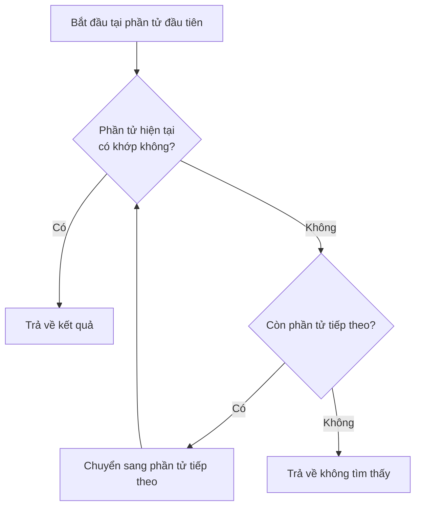
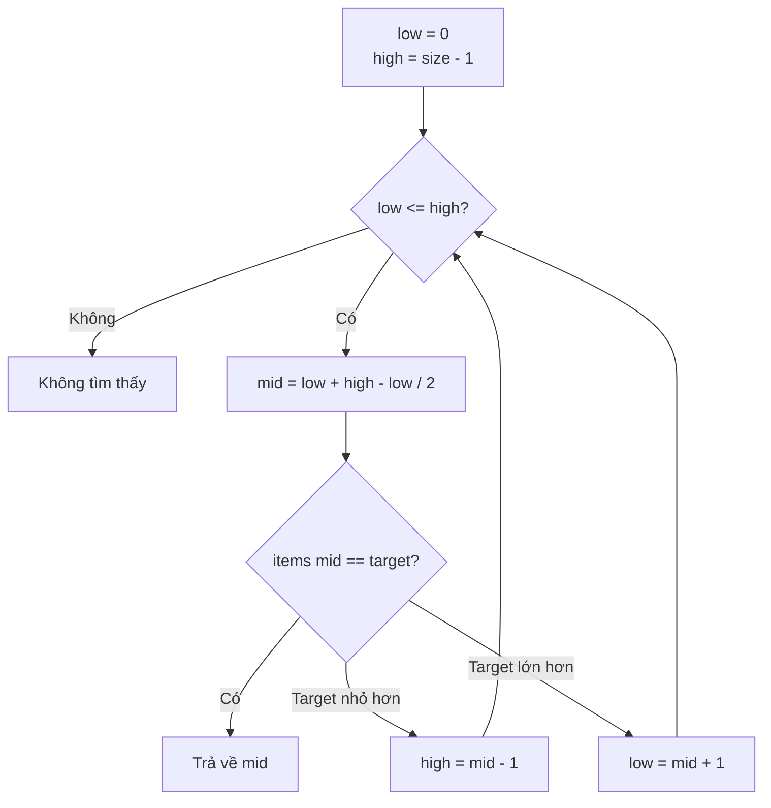
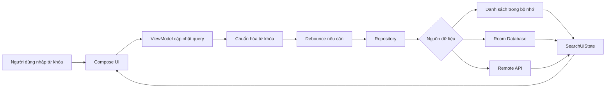
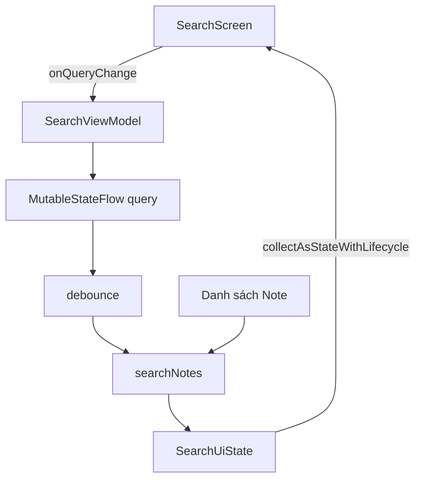
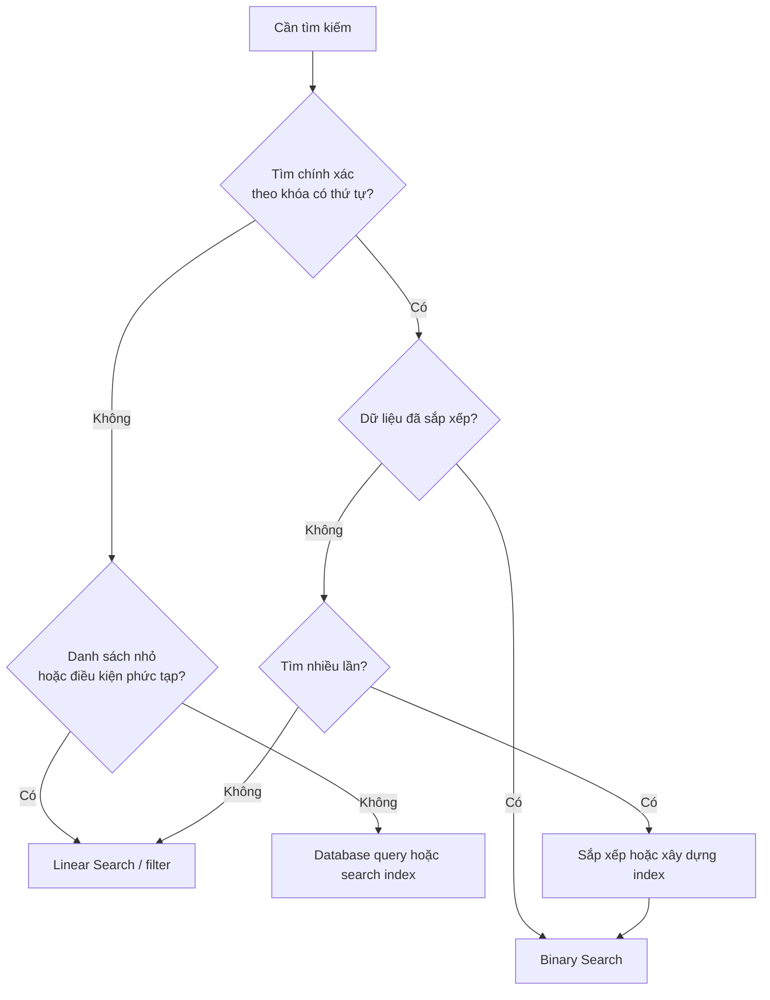

# 021 - Searching Basics

**Học phần:** 01 - Language and Android Fundamentals
**Module:** Module 02 - Android Fundamentals
**Nhóm nội dung:** Data Structures and Algorithms
**Nguồn roadmap:** Android Fundamentals / Data Structures and Algorithms
**Loại bài:** Lesson
**Thứ tự trong module:** 021
**Thời lượng gợi ý:** 24 phút

---

## 1. Tóm tắt

**Searching Basics — kiến thức cơ bản về tìm kiếm** là quá trình xác định một phần tử, một nhóm phần tử hoặc một vị trí thỏa mãn điều kiện trong tập dữ liệu.

Trong ứng dụng Android, tìm kiếm xuất hiện ở nhiều nơi:

* Tìm một liên hệ theo tên.
* Tìm ghi chú chứa từ khóa.
* Tìm sản phẩm theo mã.
* Tìm tin nhắn trong cuộc trò chuyện.
* Lọc danh sách theo danh mục hoặc trạng thái.
* Gửi từ khóa đến API và hiển thị kết quả từ máy chủ.
* Tra cứu một phần tử trong danh sách đã sắp xếp.

Một chức năng tìm kiếm hoàn chỉnh không chỉ gồm biểu tượng kính lúp. Nó thường bao gồm:

```text
Dữ liệu
   ↓
Từ khóa người dùng
   ↓
Chuẩn hóa từ khóa
   ↓
Thuật toán hoặc truy vấn tìm kiếm
   ↓
Kết quả
   ↓
Trạng thái giao diện
```

Hai thuật toán nền tảng cần nắm được là:

1. **Linear Search — tìm kiếm tuyến tính**.
2. **Binary Search — tìm kiếm nhị phân**.

---

## 2. Mục tiêu học tập

Sau bài học, anh có thể:

* Giải thích được bài toán tìm kiếm bằng ngôn ngữ của mình.
* Phân biệt tìm kiếm tuyến tính và tìm kiếm nhị phân.
* Phân tích độ phức tạp thời gian của hai thuật toán.
* Biết khi nào danh sách bắt buộc phải được sắp xếp.
* Sử dụng các hàm tìm kiếm phổ biến của Kotlin.
* Xây dựng chức năng tìm kiếm danh sách trong Jetpack Compose.
* Quản lý từ khóa và kết quả tìm kiếm bằng `ViewModel` và `StateFlow`.
* Kiểm thử các trường hợp tìm thấy, không tìm thấy, dữ liệu trùng và từ khóa rỗng.
* Nhận biết các lỗi hiệu năng, lifecycle và race condition thường gặp.

---

## 3. Khái niệm chính

### 3.1. Bài toán tìm kiếm gồm những thành phần nào?

Một bài toán tìm kiếm thường gồm bốn thành phần:

| Thành phần     | Ý nghĩa                      | Ví dụ                    |
| -------------- | ---------------------------- | ------------------------ |
| Tập dữ liệu    | Nơi chứa các phần tử         | Danh sách ghi chú        |
| Khóa tìm kiếm  | Giá trị cần tìm              | `"Android"`              |
| Điều kiện khớp | Quy tắc xác định kết quả     | Tiêu đề chứa `"Android"` |
| Kết quả        | Phần tử hoặc vị trí tìm được | Ghi chú có ID `12`       |

Ví dụ:

```kotlin
val notes = listOf(
    "Học Kotlin",
    "Tìm hiểu Android",
    "Luyện thuật toán"
)

val query = "Android"
```

Điều kiện tìm kiếm có thể là:

```kotlin
note.contains(query, ignoreCase = true)
```

Kết quả:

```text
"Tìm hiểu Android"
```

---

## 4. Linear Search — tìm kiếm tuyến tính

### 4.1. Định nghĩa

Tìm kiếm tuyến tính kiểm tra lần lượt từng phần tử từ đầu danh sách cho đến khi:

* Tìm thấy phần tử phù hợp.
* Hoặc đã kiểm tra hết danh sách.

Ví dụ cần tìm số `27`:

```text
[4, 12, 8, 27, 19]

 4  → không khớp
12  → không khớp
 8  → không khớp
27  → tìm thấy
```

### 4.2. Sơ đồ hoạt động



### 4.3. Độ phức tạp

| Trường hợp                                    | Độ phức tạp |
| --------------------------------------------- | ----------: |
| Tốt nhất: phần tử nằm đầu danh sách           |      `O(1)` |
| Trung bình                                    |      `O(n)` |
| Xấu nhất: phần tử nằm cuối hoặc không tồn tại |      `O(n)` |
| Bộ nhớ bổ sung                                |      `O(1)` |

Với `n` phần tử, trường hợp xấu nhất cần thực hiện khoảng `n` phép so sánh.

### 4.4. Cài đặt bằng Kotlin

```kotlin
fun linearSearch(
    numbers: List<Int>,
    target: Int
): Int {
    for (index in numbers.indices) {
        if (numbers[index] == target) {
            return index
        }
    }

    return -1
}

fun main() {
    val numbers = listOf(4, 12, 8, 27, 19)

    val index = linearSearch(
        numbers = numbers,
        target = 27
    )

    println(index) // 3
}
```

Quy ước trong ví dụ:

* Giá trị từ `0` trở lên: vị trí tìm thấy.
* `-1`: không tìm thấy.

### 4.5. Phiên bản generic

```kotlin
fun <T> linearSearch(
    items: List<T>,
    predicate: (T) -> Boolean
): Int {
    for (index in items.indices) {
        if (predicate(items[index])) {
            return index
        }
    }

    return -1
}
```

Sử dụng:

```kotlin
data class User(
    val id: Long,
    val name: String
)

val users = listOf(
    User(1, "An"),
    User(2, "Bình"),
    User(3, "Khánh")
)

val index = linearSearch(users) { user ->
    user.id == 2L
}

println(index) // 1
```

### 4.6. Khi nào nên dùng Linear Search?

Linear Search phù hợp khi:

* Danh sách nhỏ.
* Dữ liệu chưa được sắp xếp.
* Chỉ tìm kiếm một vài lần.
* Điều kiện tìm kiếm phức tạp.
* Cần tìm chuỗi con, ví dụ tiêu đề chứa từ khóa.
* Chi phí sắp xếp dữ liệu lớn hơn lợi ích tìm kiếm.

Ví dụ tìm ghi chú chứa từ `"Android"` không thể trực tiếp dùng Binary Search vì điều kiện là **chứa chuỗi**, không phải so sánh chính xác theo thứ tự.

---

## 5. Binary Search — tìm kiếm nhị phân

### 5.1. Định nghĩa

Tìm kiếm nhị phân hoạt động trên **danh sách đã được sắp xếp**.

Mỗi bước, thuật toán:

1. Lấy phần tử ở giữa.
2. So sánh phần tử giữa với giá trị cần tìm.
3. Loại bỏ một nửa không thể chứa kết quả.
4. Tiếp tục với nửa còn lại.

Kotlin cung cấp `binarySearch()` cho danh sách đã sắp xếp. Nếu phần tử tồn tại, hàm trả về chỉ số của phần tử; nếu không tồn tại, nó trả về một số âm được tính từ vị trí chèn phù hợp. Kết quả không được xác định đúng nếu danh sách không được sắp xếp theo cùng quy tắc so sánh.

### 5.2. Ảnh minh họa


*Binary Search loại bỏ một nửa không gian tìm kiếm sau mỗi lần so sánh. Ảnh do Kurt Kaiser phát hành theo giấy phép CC0.*

### 5.3. Ví dụ từng bước

Tìm số `27` trong danh sách:

```text
[2, 7, 11, 14, 18, 27, 33, 54, 61, 95]
```

#### Bước 1

```text
low = 0
high = 9
mid = 4

numbers[4] = 18
```

Vì:

```text
27 > 18
```

Loại bỏ nửa bên trái:

```text
[2, 7, 11, 14, 18]
```

#### Bước 2

Phạm vi còn lại:

```text
[27, 33, 54, 61, 95]
```

Phần tử giữa là `54`.

Vì:

```text
27 < 54
```

Loại bỏ phần bên phải.

#### Bước 3

Tiếp tục thu hẹp và tìm thấy:

```text
27
```

### 5.4. Sơ đồ Binary Search



### 5.5. Độ phức tạp

| Trường hợp               | Độ phức tạp |
| ------------------------ | ----------: |
| Tốt nhất                 |      `O(1)` |
| Trung bình               |  `O(log n)` |
| Xấu nhất                 |  `O(log n)` |
| Bộ nhớ của phiên bản lặp |      `O(1)` |

Ví dụ với khoảng một triệu phần tử:

```text
Linear Search: có thể kiểm tra gần 1.000.000 phần tử
Binary Search: khoảng 20 lần chia đôi
```

### 5.6. Cài đặt thủ công bằng Kotlin

```kotlin
fun binarySearch(
    numbers: List<Int>,
    target: Int
): Int {
    var low = 0
    var high = numbers.lastIndex

    while (low <= high) {
        val middle = low + (high - low) / 2
        val current = numbers[middle]

        when {
            current == target -> return middle
            current < target -> low = middle + 1
            else -> high = middle - 1
        }
    }

    return -1
}
```

Sử dụng:

```kotlin
val numbers = listOf(
    2, 7, 11, 14, 18,
    27, 33, 54, 61, 95
)

val index = binarySearch(
    numbers = numbers,
    target = 27
)

println(index) // 5
```

### 5.7. Sử dụng hàm có sẵn của Kotlin

```kotlin
val numbers = listOf(
    2, 7, 11, 14, 18,
    27, 33, 54, 61, 95
)

val index = numbers.binarySearch(27)

if (index >= 0) {
    println("Tìm thấy tại vị trí $index")
} else {
    println("Không tìm thấy")
}
```

Không được làm như sau:

```kotlin
val numbers = listOf(18, 2, 54, 7, 27)

// Sai: dữ liệu chưa được sắp xếp.
val index = numbers.binarySearch(27)
```

Phải sắp xếp trước:

```kotlin
val sortedNumbers = numbers.sorted()
val index = sortedNumbers.binarySearch(27)
```

Tuy nhiên, cần cân nhắc chi phí:

```text
Sắp xếp: O(n log n)
Tìm kiếm nhị phân: O(log n)
```

Nếu chỉ tìm một lần, Linear Search có thể hợp lý hơn việc sắp xếp toàn bộ danh sách.

---

## 6. So sánh Linear Search và Binary Search

| Tiêu chí                      | Linear Search     | Binary Search           |
| ----------------------------- | ----------------- | ----------------------- |
| Dữ liệu cần sắp xếp           | Không             | Có                      |
| Cách hoạt động                | Kiểm tra lần lượt | Liên tục chia đôi       |
| Trường hợp xấu nhất           | `O(n)`            | `O(log n)`              |
| Dễ cài đặt                    | Rất dễ            | Phức tạp hơn            |
| Tìm kiếm chuỗi con            | Phù hợp           | Không phù hợp trực tiếp |
| Dữ liệu thường xuyên thay đổi | Dễ xử lý          | Phải duy trì thứ tự     |
| Tìm chính xác theo khóa       | Được              | Rất phù hợp             |
| Danh sách rất nhỏ             | Thường đủ dùng    | Có thể không cần thiết  |
| Danh sách lớn, tìm nhiều lần  | Chậm dần          | Hiệu quả nếu đã sắp xếp |

---

## 7. Các hàm tìm kiếm phổ biến trong Kotlin

### 7.1. `contains`

Kiểm tra phần tử có tồn tại hay không:

```kotlin
val names = listOf("An", "Bình", "Khánh")

val exists = names.contains("Khánh")

println(exists) // true
```

Có thể viết ngắn hơn:

```kotlin
val exists = "Khánh" in names
```

### 7.2. `indexOf`

Tìm vị trí đầu tiên của giá trị:

```kotlin
val names = listOf("An", "Bình", "Khánh")

val index = names.indexOf("Bình")

println(index) // 1
```

### 7.3. `indexOfFirst`

Tìm vị trí đầu tiên thỏa mãn điều kiện:

```kotlin
val index = names.indexOfFirst { name ->
    name.startsWith("K")
}
```

### 7.4. `firstOrNull`

Trả về phần tử đầu tiên phù hợp hoặc `null`:

```kotlin
val result = names.firstOrNull { name ->
    name.length > 4
}
```

`firstOrNull` an toàn hơn `first` khi không chắc chắn có kết quả:

```kotlin
val result = names.first { it == "Lan" }
```

Đoạn trên có thể ném exception nếu `"Lan"` không tồn tại.

### 7.5. `find`

`find` có ý nghĩa tương tự `firstOrNull`:

```kotlin
val result = names.find { name ->
    name.contains("Bình")
}
```

### 7.6. `any`

Kiểm tra có ít nhất một phần tử phù hợp:

```kotlin
val hasLongName = names.any { name ->
    name.length >= 5
}
```

### 7.7. `all`

Kiểm tra tất cả phần tử có phù hợp không:

```kotlin
val allNotBlank = names.all { name ->
    name.isNotBlank()
}
```

### 7.8. `filter`

Trả về tất cả phần tử phù hợp:

```kotlin
val results = names.filter { name ->
    name.contains(
        other = "an",
        ignoreCase = true
    )
}
```

### 7.9. Chọn đúng hàm

| Nhu cầu                        | Hàm phù hợp               |
| ------------------------------ | ------------------------- |
| Kiểm tra có tồn tại            | `contains`, `any`         |
| Lấy phần tử đầu tiên           | `firstOrNull`, `find`     |
| Lấy vị trí                     | `indexOf`, `indexOfFirst` |
| Lấy tất cả kết quả             | `filter`                  |
| Tìm trong danh sách đã sắp xếp | `binarySearch`            |
| Tìm theo thuộc tính đã sắp xếp | `binarySearchBy`          |

---

## 8. Tìm kiếm đối tượng bằng `binarySearchBy`

Giả sử danh sách sản phẩm đã được sắp xếp theo `id`:

```kotlin
data class Product(
    val id: Long,
    val name: String
)

val products = listOf(
    Product(1, "Điện thoại"),
    Product(3, "Laptop"),
    Product(6, "Tai nghe"),
    Product(9, "Bàn phím")
)
```

Tìm sản phẩm có ID bằng `6`:

```kotlin
val index = products.binarySearchBy(
    key = 6L,
    selector = Product::id
)

val product = products.getOrNull(index)

println(product)
// Product(id=6, name=Tai nghe)
```

Danh sách phải được sắp xếp tăng dần theo cùng thuộc tính `id`. Kotlin cũng cảnh báo rằng khi có nhiều phần tử mang cùng khóa, không có bảo đảm phần tử trùng nào sẽ được trả về.

---

## 9. Searching Basics trong ứng dụng Android

### 9.1. Luồng dữ liệu tìm kiếm



### 9.2. Các trạng thái cần quản lý

Một màn hình tìm kiếm thường có:

```kotlin
data class SearchUiState(
    val query: String = "",
    val results: List<Note> = emptyList(),
    val isLoading: Boolean = false,
    val errorMessage: String? = null
)
```

Các trạng thái giao diện có thể gồm:

| Trạng thái        | Giao diện                   |
| ----------------- | --------------------------- |
| Chưa nhập từ khóa | Hiển thị toàn bộ hoặc gợi ý |
| Đang nhập         | Cập nhật query              |
| Đang tìm kiếm     | Loading indicator           |
| Có kết quả        | Danh sách kết quả           |
| Không có kết quả  | Empty state                 |
| Lỗi mạng          | Error state và nút thử lại  |

### 9.3. Ảnh minh họa Search Bar


*Tài liệu Android mô tả Search Bar là trường nhập liên tục, cho phép người dùng nhập từ khóa hoặc cụm từ để hiển thị kết quả liên quan.*

---

## 10. Thực hành: ứng dụng tìm kiếm ghi chú

### 10.1. Mô hình dữ liệu

```kotlin
data class Note(
    val id: Long,
    val title: String,
    val content: String
)
```

Dữ liệu mẫu:

```kotlin
private val sampleNotes = listOf(
    Note(
        id = 1,
        title = "Học Kotlin",
        content = "Ôn lại collection và lambda"
    ),
    Note(
        id = 2,
        title = "Android Fundamentals",
        content = "Tìm hiểu ViewModel và StateFlow"
    ),
    Note(
        id = 3,
        title = "Thuật toán tìm kiếm",
        content = "So sánh Linear Search và Binary Search"
    ),
    Note(
        id = 4,
        title = "Jetpack Compose",
        content = "Xây dựng giao diện khai báo"
    )
)
```

### 10.2. Hàm tìm kiếm thuần Kotlin

```kotlin
fun searchNotes(
    notes: List<Note>,
    query: String
): List<Note> {
    val normalizedQuery = query
        .trim()
        .lowercase()

    if (normalizedQuery.isBlank()) {
        return notes
    }

    return notes.filter { note ->
        note.title.lowercase().contains(normalizedQuery) ||
            note.content.lowercase().contains(normalizedQuery)
    }
}
```

Ví dụ:

```kotlin
val results = searchNotes(
    notes = sampleNotes,
    query = "android"
)

println(results)
```

### 10.3. ViewModel quản lý tìm kiếm

```kotlin
import androidx.lifecycle.ViewModel
import androidx.lifecycle.viewModelScope
import kotlinx.coroutines.FlowPreview
import kotlinx.coroutines.flow.MutableStateFlow
import kotlinx.coroutines.flow.SharingStarted
import kotlinx.coroutines.flow.combine
import kotlinx.coroutines.flow.debounce
import kotlinx.coroutines.flow.distinctUntilChanged
import kotlinx.coroutines.flow.stateIn
import kotlinx.coroutines.flow.update

data class SearchUiState(
    val query: String = "",
    val results: List<Note> = emptyList(),
    val isLoading: Boolean = false,
    val errorMessage: String? = null
)

@OptIn(FlowPreview::class)
class SearchViewModel : ViewModel() {

    private val query = MutableStateFlow("")

    private val notes = MutableStateFlow(sampleNotes)

    val uiState = combine(
        query
            .debounce(300)
            .distinctUntilChanged(),
        notes
    ) { currentQuery, currentNotes ->
        SearchUiState(
            query = currentQuery,
            results = searchNotes(
                notes = currentNotes,
                query = currentQuery
            )
        )
    }.stateIn(
        scope = viewModelScope,
        started = SharingStarted.WhileSubscribed(
            stopTimeoutMillis = 5_000
        ),
        initialValue = SearchUiState(
            results = sampleNotes
        )
    )

    fun onQueryChange(newQuery: String) {
        query.update { newQuery }
    }
}
```

`debounce(300)` bỏ qua những giá trị nhanh chóng bị thay thế bởi giá trị mới trong khoảng thời gian chờ và luôn phát giá trị mới nhất. Cách này đặc biệt hữu ích khi mỗi thay đổi từ khóa có thể dẫn đến truy vấn database hoặc request mạng.

> Với danh sách nhỏ hoàn toàn nằm trong bộ nhớ, `debounce` không phải lúc nào cũng cần thiết. Không nên cố tình tạo độ trễ nếu phép lọc rất nhẹ.

### 10.4. Giao diện Jetpack Compose

```kotlin
import androidx.compose.foundation.layout.Column
import androidx.compose.foundation.layout.fillMaxSize
import androidx.compose.foundation.layout.fillMaxWidth
import androidx.compose.foundation.lazy.LazyColumn
import androidx.compose.foundation.lazy.items
import androidx.compose.material3.ListItem
import androidx.compose.material3.OutlinedTextField
import androidx.compose.material3.Text
import androidx.compose.runtime.Composable
import androidx.compose.runtime.getValue
import androidx.compose.ui.Modifier
import androidx.lifecycle.compose.collectAsStateWithLifecycle

@Composable
fun SearchScreen(
    viewModel: SearchViewModel
) {
    val uiState by viewModel.uiState
        .collectAsStateWithLifecycle()

    Column(
        modifier = Modifier.fillMaxSize()
    ) {
        OutlinedTextField(
            value = uiState.query,
            onValueChange = viewModel::onQueryChange,
            modifier = Modifier.fillMaxWidth(),
            label = {
                Text("Tìm ghi chú")
            },
            singleLine = true
        )

        when {
            uiState.isLoading -> {
                Text("Đang tìm kiếm...")
            }

            uiState.errorMessage != null -> {
                Text(
                    text = uiState.errorMessage
                        ?: "Đã xảy ra lỗi"
                )
            }

            uiState.results.isEmpty() -> {
                Text("Không tìm thấy kết quả phù hợp")
            }

            else -> {
                LazyColumn {
                    items(
                        items = uiState.results,
                        key = Note::id
                    ) { note ->
                        ListItem(
                            headlineContent = {
                                Text(note.title)
                            },
                            supportingContent = {
                                Text(note.content)
                            }
                        )
                    }
                }
            }
        }
    }
}
```

Android khuyến nghị thu thập `Flow` trong Compose theo cách nhận biết lifecycle, chẳng hạn `collectAsStateWithLifecycle()`, để việc đăng ký dữ liệu được quản lý theo trạng thái lifecycle của giao diện.

### 10.5. Kiến trúc của ví dụ



---

## 11. Lifecycle và lưu trạng thái

### 11.1. Vấn đề

Nếu query chỉ được lưu trong biến cục bộ không có cơ chế bảo toàn phù hợp:

```kotlin
var query by remember {
    mutableStateOf("")
}
```

trạng thái có thể không đáp ứng yêu cầu khi:

* Activity được tạo lại.
* Người dùng xoay màn hình.
* Hệ thống hủy process.
* Người dùng rời màn hình rồi quay lại.

### 11.2. Các lựa chọn

#### `remember`

Dùng cho trạng thái giao diện ngắn hạn chỉ cần tồn tại trong Composition hiện tại.

#### `rememberSaveable`

Dùng cho giá trị đơn giản cần khôi phục sau configuration change:

```kotlin
var query by rememberSaveable {
    mutableStateOf("")
}
```

#### `ViewModel`

Dùng khi query tham gia vào business logic hoặc cần chia sẻ giữa nhiều composable.

Android mô tả việc đưa UI state vào `ViewModel` là đưa state ra ngoài Composition. Các composable sau đó nhận trạng thái từ `ViewModel` thay vì sở hữu toàn bộ logic tìm kiếm.

#### `SavedStateHandle`

Dùng khi muốn khôi phục query kể cả sau khi process bị hệ thống hủy:

```kotlin
class SearchViewModel(
    savedStateHandle: SavedStateHandle
) : ViewModel() {

    val query = savedStateHandle
        .getMutableStateFlow(
            key = "search_query",
            initialValue = ""
        )

    fun onQueryChange(value: String) {
        query.value = value
    }
}
```

Tài liệu Android cung cấp mẫu lưu query tìm kiếm trong `SavedStateHandle` để khôi phục cùng tập kết quả sau khi màn hình hoặc process được tạo lại.

---

## 12. Local Search và Remote Search

### 12.1. Local Search

Dữ liệu đã có trên thiết bị:

```text
Query → ViewModel → List/Room → Results
```

Ví dụ:

* Ghi chú offline.
* Danh sách bài học.
* Danh sách file đã tải.
* Danh bạ nội bộ của ứng dụng.

Ưu điểm:

* Phản hồi nhanh.
* Có thể hoạt động offline.
* Không tiêu tốn request mạng.

### 12.2. Remote Search

Dữ liệu nằm trên server:

```text
Query → ViewModel → Repository → API → Results
```

Ví dụ:

* Tìm phim.
* Tìm sản phẩm thương mại điện tử.
* Tìm repository GitHub.
* Tìm người dùng trong hệ thống lớn.

Remote Search cần xử lý thêm:

* Loading.
* Timeout.
* Mất mạng.
* Phân trang.
* Debounce.
* Hủy request cũ.
* Kết quả trả về sai thứ tự.
* Cache.
* Rate limit.

### 12.3. Race condition khi tìm kiếm

Giả sử người dùng nhập:

```text
a → an → android
```

Ba request có thể được gửi đi:

```text
Request "a"
Request "an"
Request "android"
```

Nếu request `"a"` trả về cuối cùng, nó có thể ghi đè kết quả mới của `"android"`.

Một hướng xử lý bằng Flow:

```kotlin
query
    .debounce(300)
    .distinctUntilChanged()
    .flatMapLatest { currentQuery ->
        repository.search(currentQuery)
    }
```

`flatMapLatest` giúp luồng mới thay thế công việc tìm kiếm trước đó khi query thay đổi.

---

## 13. Không phải mọi Search Bar đều dùng Binary Search

Đây là nhầm lẫn phổ biến.

Giả sử người dùng nhập:

```text
"and"
```

và ứng dụng cần tìm:

```text
"Android Fundamentals"
"Learn Android"
"Advanced Kotlin"
```

Điều kiện là:

```kotlin
title.contains("and", ignoreCase = true)
```

Đây thường là một phép lọc tuyến tính:

```text
O(n)
```

Binary Search phù hợp hơn với truy vấn:

```text
Tìm chính xác sản phẩm có ID = 1005
```

trên danh sách đã sắp xếp theo ID.

### Quy tắc lựa chọn



---

## 14. Lỗi thường gặp của Android Developer mới

### 14.1. Dùng Binary Search trên danh sách chưa sắp xếp

```kotlin
val numbers = listOf(30, 4, 18, 2, 9)

numbers.binarySearch(18)
```

Kết quả không đáng tin cậy.

Cách sửa:

```kotlin
val sortedNumbers = numbers.sorted()
val index = sortedNumbers.binarySearch(18)
```

---

### 14.2. Sắp xếp lại danh sách mỗi lần người dùng gõ

```kotlin
fun search(query: String): Item? {
    return items
        .sortedBy(Item::id)
        .let { sorted ->
            val index = sorted.binarySearchBy(
                query.toLong(),
                Item::id
            )
            sorted.getOrNull(index)
        }
}
```

Nếu chạy mỗi lần gõ, ứng dụng phải liên tục sắp xếp lại dữ liệu.

Tốt hơn:

* Sắp xếp một lần khi dữ liệu thay đổi.
* Lưu danh sách đã sắp xếp.
* Hoặc sử dụng cấu trúc dữ liệu phù hợp như `Map`.

---

### 14.3. Dùng `first` khi kết quả có thể không tồn tại

Không an toàn:

```kotlin
val user = users.first { it.id == targetId }
```

An toàn hơn:

```kotlin
val user = users.firstOrNull {
    it.id == targetId
}
```

---

### 14.4. Gửi API request sau mỗi ký tự

```text
a       → request
an      → request
and     → request
andr    → request
andro   → request
android → request
```

Hậu quả:

* Tốn băng thông.
* Tăng chi phí server.
* Dễ chạm rate limit.
* Kết quả có thể nhấp nháy.
* Tăng nguy cơ race condition.

Có thể dùng:

```kotlin
query
    .debounce(300)
    .distinctUntilChanged()
```

---

### 14.5. Không chuẩn hóa query

Người dùng nhập:

```text
"  Android  "
```

Nhưng dữ liệu là:

```text
"android"
```

Nên chuẩn hóa:

```kotlin
val normalizedQuery = query
    .trim()
    .lowercase()
```

Với tiếng Việt, sản phẩm thực tế có thể cần thêm quy tắc tìm không dấu:

```text
"thuật toán"
"thuat toan"
```

---

### 14.6. Chặn Main Thread bằng dữ liệu lớn

Ví dụ không phù hợp với dữ liệu rất lớn:

```kotlin
val result = hugeList.filter {
    expensiveComparison(it)
}
```

Nếu phép tìm kiếm nặng, nên:

* Đưa xử lý sang tầng repository.
* Truy vấn database.
* Sử dụng index.
* Phân trang kết quả.
* Chuyển tác vụ CPU nặng sang dispatcher phù hợp.
* Đo hiệu năng trước khi tối ưu.

---

### 14.7. Không hiển thị Empty State

Giao diện trống khiến người dùng không biết:

* Ứng dụng đang tải.
* Không có kết quả.
* Hay đã xảy ra lỗi.

Nên phân biệt:

```text
Đang tải...
Không tìm thấy kết quả
Không thể kết nối máy chủ
Nhập từ khóa để bắt đầu
```

---

## 15. Kiểm thử

### 15.1. Các trường hợp cần kiểm thử

| Test case                | Kết quả mong đợi                 |
| ------------------------ | -------------------------------- |
| Tìm phần tử đầu tiên     | Trả về index `0`                 |
| Tìm phần tử giữa         | Trả về index phù hợp             |
| Tìm phần tử cuối         | Trả về `lastIndex`               |
| Không tìm thấy           | Trả về `-1` hoặc `null`          |
| Danh sách rỗng           | Không crash                      |
| Có phần tử trùng         | Quy định rõ kết quả              |
| Query rỗng               | Hiển thị tất cả hoặc empty state |
| Query có khoảng trắng    | Được trim                        |
| Khác chữ hoa, chữ thường | Vẫn khớp nếu yêu cầu             |
| Xoay màn hình            | Query không mất                  |
| Request cũ trả về muộn   | Không ghi đè kết quả mới         |

### 15.2. Unit test cho Linear Search

```kotlin
import com.google.common.truth.Truth.assertThat
import org.junit.Test

class LinearSearchTest {

    @Test
    fun targetExists_returnsCorrectIndex() {
        val numbers = listOf(5, 10, 15, 20)

        val result = linearSearch(
            numbers = numbers,
            target = 15
        )

        assertThat(result).isEqualTo(2)
    }

    @Test
    fun targetDoesNotExist_returnsMinusOne() {
        val numbers = listOf(5, 10, 15, 20)

        val result = linearSearch(
            numbers = numbers,
            target = 99
        )

        assertThat(result).isEqualTo(-1)
    }

    @Test
    fun emptyList_returnsMinusOne() {
        val result = linearSearch(
            numbers = emptyList(),
            target = 10
        )

        assertThat(result).isEqualTo(-1)
    }
}
```

### 15.3. Unit test cho hàm tìm ghi chú

```kotlin
class SearchNotesTest {

    private val notes = listOf(
        Note(
            id = 1,
            title = "Học Kotlin",
            content = "Collection"
        ),
        Note(
            id = 2,
            title = "Học Android",
            content = "Jetpack Compose"
        )
    )

    @Test
    fun queryMatchesTitle_returnsNote() {
        val results = searchNotes(
            notes = notes,
            query = "android"
        )

        assertThat(results.map(Note::id))
            .containsExactly(2L)
    }

    @Test
    fun blankQuery_returnsAllNotes() {
        val results = searchNotes(
            notes = notes,
            query = "   "
        )

        assertThat(results).hasSize(2)
    }

    @Test
    fun queryIsCaseInsensitive() {
        val results = searchNotes(
            notes = notes,
            query = "KOTLIN"
        )

        assertThat(results.map(Note::id))
            .containsExactly(1L)
    }
}
```

---

## 16. Ảnh hưởng đến UX và chất lượng ứng dụng

### 16.1. UX

Tìm kiếm tốt cần:

* Phản hồi nhanh.
* Không nhấp nháy kết quả.
* Giữ lại query khi xoay màn hình.
* Hiển thị từ khóa hiện tại.
* Có nút xóa query.
* Có trạng thái không tìm thấy.
* Có loading khi truy vấn mạng.
* Không thay đổi thứ tự kết quả vô lý.

### 16.2. Reliability

Cần bảo đảm:

* Request cũ không ghi đè request mới.
* Lỗi mạng không làm ứng dụng crash.
* Query đặc biệt không làm hỏng truy vấn.
* Danh sách rỗng được xử lý.
* Dữ liệu null được kiểm soát.
* Binary Search không chạy trên dữ liệu sai thứ tự.

### 16.3. Maintainability

Nên tách các phần:

```text
Composable
    ↓
ViewModel
    ↓
Search use case
    ↓
Repository
    ↓
Local hoặc Remote Data Source
```

Không nên đặt toàn bộ logic trong Composable:

```kotlin
@Composable
fun SearchScreen() {
    // Gọi API, lọc dữ liệu, xử lý lỗi,
    // quản lý loading và lưu cache tại đây.
}
```

Tốt hơn:

```kotlin
@Composable
fun SearchScreen(
    uiState: SearchUiState,
    onQueryChange: (String) -> Unit
)
```

Composable chỉ chịu trách nhiệm hiển thị state và chuyển sự kiện ra ngoài.

---

## 17. Ghi chú đưa vào production

Trước khi phát hành chức năng tìm kiếm, hãy trả lời:

### Dữ liệu

* Dữ liệu nằm trong memory, Room hay server?
* Có cần index database không?
* Kết quả có phân trang không?
* Danh sách có được sắp xếp đúng không?

### Query

* Query rỗng được xử lý thế nào?
* Có phân biệt chữ hoa và chữ thường không?
* Có hỗ trợ tiếng Việt không dấu không?
* Có giới hạn độ dài query không?
* Có cần debounce không?

### State

* Query có tồn tại sau rotate không?
* Query có cần khôi phục sau process death không?
* Loading, empty và error state đã tách biệt chưa?
* Kết quả cũ có bị hiển thị khi query mới đang tải không?

### Network

* Request trước có được hủy không?
* Có timeout không?
* Có retry hợp lý không?
* Có cache không?
* Có xử lý rate limit không?

### UX

* Search bar có `contentDescription` phù hợp không?
* Có thể sử dụng bằng bàn phím không?
* Có hiển thị số lượng kết quả không?
* Có nút xóa từ khóa không?
* Empty state có hướng dẫn tiếp theo không?

### Privacy

* Có gửi query nhạy cảm đến analytics không?
* Có lưu lịch sử tìm kiếm không?
* Người dùng có thể xóa lịch sử không?
* Log có chứa dữ liệu cá nhân không?

---

## 18. Artifact đưa vào portfolio

### Mini project: Searchable Notes

Xây dựng một ứng dụng ghi chú có:

* Search bar.
* Tìm theo tiêu đề và nội dung.
* Tìm kiếm không phân biệt chữ hoa, chữ thường.
* Debounce cho query.
* `ViewModel` và `StateFlow`.
* `collectAsStateWithLifecycle`.
* Empty state.
* Loading state giả lập.
* Error state giả lập.
* Unit test cho thuật toán.
* Test giữ query khi xoay màn hình.

### Cấu trúc thư mục gợi ý

```text
searchable-notes/
├── data/
│   ├── Note.kt
│   └── NoteRepository.kt
├── domain/
│   └── SearchNotesUseCase.kt
├── ui/
│   ├── SearchScreen.kt
│   ├── SearchUiState.kt
│   └── SearchViewModel.kt
├── test/
│   ├── LinearSearchTest.kt
│   └── SearchNotesUseCaseTest.kt
├── screenshots/
│   ├── all-notes.png
│   ├── search-results.png
│   └── empty-results.png
└── README.md
```

### README nên trình bày

```markdown
## Searching Strategy

- Linear filtering is used for substring search.
- Query state is managed by SearchViewModel.
- StateFlow emits updated search results.
- A debounce prevents excessive searches.
- Binary Search is demonstrated separately with sorted IDs.
```

---

## 19. Thực hành trong 24 phút

### Phút 0–5: giải thích khái niệm

Viết ghi chú năm dòng:

```text
Searching là quá trình tìm phần tử thỏa mãn một điều kiện.
Linear Search kiểm tra lần lượt từng phần tử.
Binary Search chia đôi phạm vi tìm kiếm.
Binary Search chỉ đúng khi dữ liệu đã được sắp xếp.
Trong Android, query và kết quả nên được quản lý bằng UI state.
```

### Phút 5–10: cài đặt thuật toán

Cài đặt:

```kotlin
fun linearSearch(
    numbers: List<Int>,
    target: Int
): Int
```

### Phút 10–16: xây dựng tìm kiếm ghi chú

Cài đặt:

```kotlin
fun searchNotes(
    notes: List<Note>,
    query: String
): List<Note>
```

### Phút 16–21: kết nối Compose

Tạo:

* `OutlinedTextField`.
* `LazyColumn`.
* Empty state.

### Phút 21–24: viết test

Kiểm tra:

* Query tồn tại.
* Query không tồn tại.
* Query rỗng.
* Khác chữ hoa, chữ thường.

---

## 20. Bài tập

### Bài 1 — cơ bản

Viết hàm tìm một số nguyên trong danh sách bằng Linear Search.

```kotlin
fun findNumber(
    numbers: List<Int>,
    target: Int
): Int
```

### Bài 2 — trung bình

Viết Binary Search thủ công và kiểm thử:

* Phần tử đầu.
* Phần tử giữa.
* Phần tử cuối.
* Phần tử không tồn tại.

### Bài 3 — Android

Tạo màn hình danh sách khóa học có thể tìm theo:

* Tên bài học.
* Tên module.
* Nhóm nội dung.

### Bài 4 — nâng cao

Thêm các trạng thái:

```kotlin
sealed interface SearchStatus {
    data object Idle : SearchStatus
    data object Loading : SearchStatus
    data class Success(
        val results: List<Note>
    ) : SearchStatus
    data class Error(
        val message: String
    ) : SearchStatus
}
```

### Bài 5 — phân tích

Giải thích vì sao Binary Search không phù hợp trực tiếp với chức năng:

```text
Tìm mọi sản phẩm có tên chứa "phone"
```

Gợi ý:

* Dữ liệu có thể đã sắp xếp theo ID, không phải theo từng chuỗi con.
* Điều kiện `contains` không loại bỏ được chính xác một nửa dữ liệu.
* Có thể cần Linear Search, database full-text search hoặc search index.

---

## 21. Câu hỏi tự kiểm tra

1. Linear Search có yêu cầu dữ liệu được sắp xếp không?
2. Tại sao Binary Search có độ phức tạp `O(log n)`?
3. Điều gì xảy ra khi gọi `binarySearch()` trên danh sách chưa sắp xếp?
4. Khi nào `firstOrNull()` an toàn hơn `first()`?
5. `filter()` khác `find()` như thế nào?
6. Query tìm kiếm nên được lưu trong Composable hay ViewModel?
7. Vì sao Remote Search thường cần debounce?
8. Làm thế nào để tránh request cũ ghi đè kết quả mới?
9. Empty state khác error state như thế nào?
10. Khi nào nên sử dụng database index thay vì lọc toàn bộ danh sách?

---

## 22. Checklist hoàn thành

### Kiến thức thuật toán

* [ ] Giải thích được Searching Basics.
* [ ] Phân biệt được Linear Search và Binary Search.
* [ ] Biết Linear Search có độ phức tạp `O(n)`.
* [ ] Biết Binary Search có độ phức tạp `O(log n)`.
* [ ] Biết Binary Search yêu cầu dữ liệu đã sắp xếp.
* [ ] Biết phân tích chi phí sắp xếp trước khi tìm kiếm.

### Kotlin

* [ ] Sử dụng được `contains`.
* [ ] Sử dụng được `indexOfFirst`.
* [ ] Sử dụng được `firstOrNull`.
* [ ] Sử dụng được `filter`.
* [ ] Sử dụng được `binarySearch`.
* [ ] Xử lý đúng trường hợp không tìm thấy.

### Android

* [ ] Có Search Bar hoặc `OutlinedTextField`.
* [ ] Query được quản lý bằng state.
* [ ] Kết quả được hiển thị bằng `LazyColumn`.
* [ ] Có empty state.
* [ ] Có loading và error state nếu dùng API.
* [ ] Query không bị mất khi rotate.
* [ ] Thu thập Flow theo lifecycle.
* [ ] Có debounce nếu truy vấn tốn chi phí.
* [ ] Có cơ chế chống race condition.

### Testing và portfolio

* [ ] Có unit test cho thuật toán.
* [ ] Có test query rỗng.
* [ ] Có test không phân biệt chữ hoa, chữ thường.
* [ ] Có ảnh chụp giao diện.
* [ ] Có sơ đồ luồng dữ liệu.
* [ ] Có README giải thích lựa chọn thuật toán.

---

## 23. Ghi nhớ nhanh

> **Linear Search** kiểm tra từng phần tử và không yêu cầu dữ liệu được sắp xếp.

> **Binary Search** liên tục chia đôi phạm vi nhưng chỉ hoạt động đúng trên dữ liệu đã sắp xếp.

> Search Bar trong Android chỉ là phần giao diện. Một hệ thống tìm kiếm hoàn chỉnh còn gồm query state, thuật toán, nguồn dữ liệu, loading, empty state, error handling và testing.

> Không chọn thuật toán chỉ vì nó có Big O đẹp hơn. Hãy xem xét kích thước dữ liệu, số lần tìm kiếm, chi phí sắp xếp, loại điều kiện khớp và trải nghiệm người dùng.

---

## 24. Tài liệu tham khảo

* Kotlin — List-specific operations và `binarySearch()`.
* Kotlin — `binarySearchBy()`.
* Kotlin Coroutines — `Flow.debounce()`.
* Android Developers — Search Bar trong Jetpack Compose.
* Android Developers — Lọc danh sách trong khi nhập.
* Android Developers — State hoisting và ViewModel.
* Android Developers — Lifecycle-aware Flow collection.
* Android Developers — Khôi phục query bằng `SavedStateHandle`.
