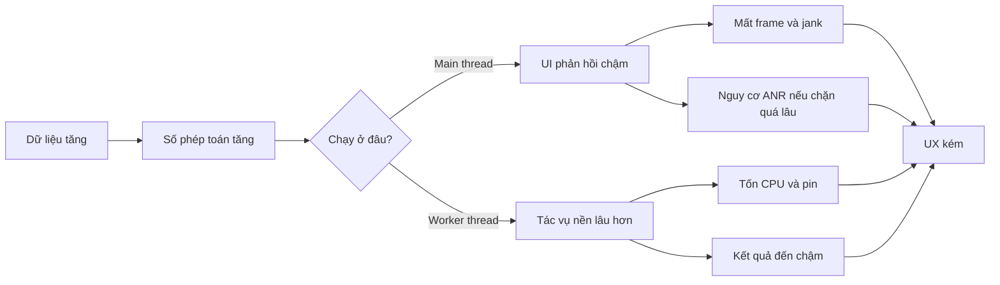
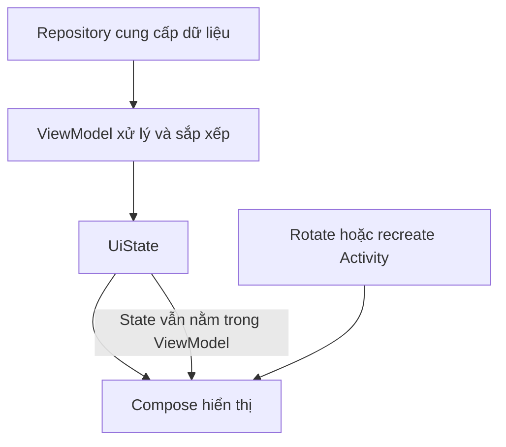

# 022 - Big O for Mobile Apps

[](https://commons.wikimedia.org/wiki/File%3ABig-O-notation.png?utm_source=chatgpt.com)

**Học phần:** 01 - Language and Android Fundamentals
**Module:** Module 02 - Android Fundamentals
**Nhóm nội dung:** Data Structures and Algorithms
**Nguồn roadmap:** Android Fundamentals / Data Structures and Algorithms
**Loại bài:** Lesson
**Thứ tự trong module:** 022
**Thời lượng gợi ý:** 24 phút

---

## 1. Tóm tắt

**Big O** là cách mô tả tốc độ tăng của thời gian xử lý hoặc lượng bộ nhớ cần dùng khi kích thước dữ liệu đầu vào tăng lên.

Trong ứng dụng Android, Big O giúp lập trình viên dự đoán:

* Danh sách có còn cuộn mượt khi tăng từ 100 lên 10.000 phần tử không?
* Chức năng tìm kiếm có làm UI bị đứng không?
* Một phép sắp xếp có bị chạy lại sau mỗi lần Compose tái tổ hợp hay không?
* Thuật toán có tạo quá nhiều object, gây áp lực bộ nhớ và Garbage Collection không?
* Ứng dụng có hoạt động chấp nhận được trên thiết bị cấu hình thấp không?

Big O không cho biết chính xác một hàm chạy trong bao nhiêu mili giây. Nó mô tả **xu hướng tăng trưởng** khi dữ liệu ngày càng lớn.

---

## 2. Mục tiêu học tập

Sau bài học, anh có thể:

* Giải thích Big O bằng ngôn ngữ của mình.
* Phân biệt **độ phức tạp thời gian** và **độ phức tạp không gian**.
* Nhận biết các mức phổ biến: `O(1)`, `O(log n)`, `O(n)`, `O(n log n)` và `O(n²)`.
* Phân tích một đoạn Kotlin đơn giản.
* Nhận ra vòng lặp lồng nhau hoặc phép tìm kiếm tuyến tính bị lặp lại.
* Chọn `List`, `Set` hoặc `Map` phù hợp với nhu cầu.
* Liên hệ Big O với hiệu năng UI, state, lifecycle và trải nghiệm người dùng.
* Viết một ví dụ nhỏ có thể đưa vào portfolio Android.

---

## 3. Hình minh họa


*Nguồn hình: [Wikimedia Commons – Big-O-notation.png](https://commons.wikimedia.org/wiki/File:Big-O-notation.png).*

> Trục ngang biểu diễn kích thước dữ liệu đầu vào `n`. Trục dọc biểu diễn số phép toán hoặc lượng tài nguyên mà thuật toán cần sử dụng.

---

## 4. Khái niệm Big O

Giả sử ứng dụng có danh sách gồm `n` liên hệ:

```text
n = số lượng liên hệ
```

Khi số liên hệ tăng, thuật toán có thể tăng theo nhiều cách:

| Big O        | Cách đọc           |        Khi `n` tăng gấp đôi | Ví dụ                   |
| ------------ | ------------------ | --------------------------: | ----------------------- |
| `O(1)`       | Hằng số            |           Gần như không đổi | Lấy phần tử theo index  |
| `O(log n)`   | Logarit            |                 Tăng rất ít | Tìm kiếm nhị phân       |
| `O(n)`       | Tuyến tính         |              Khoảng gấp đôi | Duyệt toàn bộ danh sách |
| `O(n log n)` | Tuyến tính logarit |            Tăng hơn gấp đôi | Sắp xếp hiệu quả        |
| `O(n²)`      | Bình phương        |              Khoảng gấp bốn | Hai vòng lặp lồng nhau  |
| `O(2ⁿ)`      | Hàm mũ             |              Tăng cực nhanh | Duyệt mọi tổ hợp        |
| `O(n!)`      | Giai thừa          | Gần như không thể kiểm soát | Duyệt mọi hoán vị       |

### Quy tắc quan trọng

Khi phân tích Big O, thường bỏ qua:

* Hằng số.
* Phần tử có tốc độ tăng chậm hơn.
* Sự khác biệt nhỏ khi dữ liệu còn ít.

Ví dụ:

```text
O(3n + 10) → O(n)
O(n² + n)  → O(n²)
O(500)     → O(1)
```

---

## 5. Độ phức tạp thời gian và không gian

### 5.1. Time complexity

**Time complexity** mô tả số phép toán tăng như thế nào khi dữ liệu tăng.

Ví dụ:

```kotlin
fun printNames(names: List<String>) {
    for (name in names) {
        println(name)
    }
}
```

Nếu có `n` phần tử, vòng lặp chạy `n` lần:

```text
Time complexity: O(n)
```

### 5.2. Space complexity

**Space complexity** mô tả lượng bộ nhớ bổ sung mà thuật toán cần sử dụng.

```kotlin
fun uppercaseNames(names: List<String>): List<String> {
    return names.map { it.uppercase() }
}
```

Hàm tạo một danh sách mới có cùng số phần tử:

```text
Time complexity:  O(n)
Space complexity: O(n)
```

Trong ứng dụng di động, bộ nhớ đặc biệt quan trọng vì:

* Thiết bị có giới hạn RAM.
* Ứng dụng chạy cùng nhiều tiến trình khác.
* Tạo nhiều object có thể làm Garbage Collection xảy ra thường xuyên.
* Tiến trình nền có thể bị hệ điều hành kết thúc khi thiếu bộ nhớ.

Android cung cấp Memory Profiler để theo dõi allocation, heap và mức sử dụng bộ nhớ của ứng dụng. ([Android Developers][1])

---

## 6. Big O ảnh hưởng đến ứng dụng Android như thế nào?



Android phải xử lý thao tác UI trong một khoảng thời gian ngắn để duy trì cảm giác mượt. Các phép tính nặng trên main thread có thể gây chậm phản hồi, mất frame hoặc góp phần dẫn đến ANR. Android khuyến nghị dùng profiler và system trace để xác định nút thắt thay vì chỉ tối ưu dựa trên phỏng đoán. ([Android Developers][2])

### Những khu vực thường liên quan đến Big O

| Khu vực trong app  | Vấn đề có thể gặp                                 |
| ------------------ | ------------------------------------------------- |
| Danh sách sản phẩm | Lọc hoặc sắp xếp lại quá nhiều lần                |
| Danh bạ            | Tìm từng ID bằng cách quét toàn bộ danh sách      |
| Chat               | Duyệt lại toàn bộ lịch sử khi có tin nhắn mới     |
| Bản đồ             | So sánh mọi địa điểm với mọi địa điểm             |
| Database           | Nạp toàn bộ bảng rồi mới lọc trong Kotlin         |
| Compose            | Tính toán nặng trong mỗi lần recomposition        |
| RecyclerView       | Bind item chứa phép tính không cần thiết          |
| Đồng bộ dữ liệu    | So sánh hai danh sách bằng vòng lặp lồng nhau     |
| Search             | Gửi tìm kiếm sau từng ký tự mà không debounce     |
| State              | Tạo lại collection lớn mỗi khi state nhỏ thay đổi |

---

## 7. Các mức Big O phổ biến trong Kotlin

## 7.1. `O(1)` — thời gian hằng số

```kotlin
fun firstMessage(messages: List<String>): String? {
    return messages.firstOrNull()
}
```

Số thao tác không tăng theo số lượng tin nhắn:

```text
O(1)
```

Một số thao tác như `get(index)` trên `ArrayList` chạy trong thời gian hằng số. Tuy nhiên, `List` chỉ là interface; độ phức tạp thực tế còn phụ thuộc implementation phía dưới. ([Oracle Documentation][3])

### Ví dụ Android

```kotlin
val selectedTab = tabs[currentTabIndex]
```

Lấy tab theo index thường không cần duyệt toàn bộ danh sách.

---

## 7.2. `O(n)` — thời gian tuyến tính

```kotlin
fun findUser(
    users: List<User>,
    targetId: Long
): User? {
    return users.firstOrNull { it.id == targetId }
}
```

Trường hợp xấu nhất, hàm phải kiểm tra toàn bộ `n` user:

```text
O(n)
```

### Tình huống sử dụng hợp lý

* Danh sách nhỏ.
* Chỉ tìm một lần.
* Dữ liệu chưa được lập chỉ mục.
* Việc tạo thêm `Map` không đem lại lợi ích đáng kể.

### Tình huống nên xem xét tối ưu

* Hàm được gọi cho từng item trong UI.
* Hàm chạy sau mỗi lần recomposition.
* Danh sách có hàng nghìn phần tử.
* Cùng một dữ liệu bị tìm kiếm lặp lại nhiều lần.

---

## 7.3. `O(log n)` — thời gian logarit

Tìm kiếm nhị phân liên tục chia đôi phạm vi tìm kiếm.

```kotlin
fun binarySearch(
    numbers: List<Int>,
    target: Int
): Int {
    var left = 0
    var right = numbers.lastIndex

    while (left <= right) {
        val middle = left + (right - left) / 2
        val value = numbers[middle]

        when {
            value == target -> return middle
            value < target -> left = middle + 1
            else -> right = middle - 1
        }
    }

    return -1
}
```

```text
Time complexity:  O(log n)
Space complexity: O(1)
```

### Điều kiện

Danh sách phải được sắp xếp trước.

```text
Nếu chỉ tìm một lần:
chi phí sắp xếp có thể lớn hơn lợi ích tìm kiếm.

Nếu tìm nhiều lần:
sắp xếp một lần rồi tìm O(log n) có thể hợp lý.
```

---

## 7.4. `O(n log n)` — sắp xếp

Các thuật toán sắp xếp hiệu quả thường có độ phức tạp gần:

```text
O(n log n)
```

Ví dụ:

```kotlin
val sortedUsers = users.sortedBy { it.name }
```

Đây thường là mức chấp nhận được đối với sắp xếp dữ liệu. Tuy nhiên, vấn đề xuất hiện khi phép sắp xếp bị gọi lại không cần thiết.

---

## 7.5. `O(n²)` — vòng lặp lồng nhau

```kotlin
fun findDuplicateNames(users: List<User>): List<String> {
    val duplicates = mutableListOf<String>()

    for (first in users) {
        for (second in users) {
            if (first.id != second.id && first.name == second.name) {
                duplicates += first.name
            }
        }
    }

    return duplicates
}
```

Mỗi user được so sánh với gần như mọi user khác:

```text
O(n × n) = O(n²)
```

Nếu dữ liệu tăng gấp đôi:

```text
100 phần tử   → khoảng 10.000 lượt so sánh
1.000 phần tử → khoảng 1.000.000 lượt so sánh
10.000 phần tử → khoảng 100.000.000 lượt so sánh
```

Đây là kiểu thuật toán có thể hoạt động bình thường với dữ liệu demo nhưng trở nên rất chậm khi đưa vào production.

---

## 8. Ví dụ Android: đánh dấu danh sách yêu thích

Giả sử ứng dụng có:

* `contacts`: danh sách liên hệ.
* `favoriteIds`: danh sách ID yêu thích.

```kotlin
data class Contact(
    val id: Long,
    val name: String,
    val isFavorite: Boolean = false
)
```

### 8.1. Cách chưa tối ưu — `O(n × m)`

```kotlin
fun markFavoritesSlow(
    contacts: List<Contact>,
    favoriteIds: List<Long>
): List<Contact> {
    return contacts.map { contact ->
        val isFavorite = favoriteIds.any { favoriteId ->
            favoriteId == contact.id
        }

        contact.copy(isFavorite = isFavorite)
    }
}
```

Phân tích:

```text
n = số contact
m = số favorite ID

map() chạy n lần
any() có thể chạy m lần cho mỗi contact

Tổng: O(n × m)
```

Nếu `m` gần bằng `n`:

```text
O(n²)
```

---

### 8.2. Cách tối ưu — `O(n + m)`

```kotlin
fun markFavoritesFast(
    contacts: List<Contact>,
    favoriteIds: List<Long>
): List<Contact> {
    val favoriteIdSet = favoriteIds.toHashSet()

    return contacts.map { contact ->
        contact.copy(
            isFavorite = contact.id in favoriteIdSet
        )
    }
}
```

Phân tích:

```text
Tạo Set:       O(m)
Duyệt contact: O(n)
Tra cứu Set:   trung bình O(1)

Tổng: O(n + m)
```

`HashSet` cung cấp hiệu năng trung bình hằng số cho các thao tác cơ bản như `add`, `remove` và `contains`, với điều kiện hash phân phối tốt. ([Oracle Documentation][4])

### Đánh đổi

Phiên bản nhanh hơn sử dụng thêm bộ nhớ:

```text
Bản chậm:
Time  = O(n × m)
Space = O(n) cho kết quả

Bản nhanh:
Time  = O(n + m)
Space = O(n + m)
```

Đây là ví dụ của việc **đổi thêm bộ nhớ để giảm thời gian xử lý**.

---

## 9. Chọn `List`, `Set` hay `Map`

Kotlin cung cấp các collection phổ biến như `List`, `Set` và `Map`. `List` có thứ tự và cho phép phần tử trùng; `Set` không chứa giá trị trùng; `Map` lưu dữ liệu theo cặp khóa–giá trị. ([Kotlin][5])

| Nhu cầu                              | Collection phù hợp          |
| ------------------------------------ | --------------------------- |
| Giữ thứ tự item                      | `List`                      |
| Truy cập bằng vị trí                 | `List`                      |
| Không cho phần tử trùng              | `Set`                       |
| Kiểm tra một ID có tồn tại nhiều lần | `HashSet`                   |
| Tìm object bằng ID                   | `Map<ID, Object>`           |
| Hiển thị danh sách theo thứ tự thêm  | `List` hoặc `LinkedHashMap` |
| Lưu trạng thái theo item ID          | `Map<ID, State>`            |

### Ví dụ tra cứu bằng `List`

```kotlin
val user = users.firstOrNull { it.id == selectedId }
```

```text
Mỗi lần tìm: O(n)
```

### Ví dụ tra cứu bằng `Map`

```kotlin
val usersById: Map<Long, User> =
    users.associateBy { it.id }

val user = usersById[selectedId]
```

```text
Tạo Map: O(n)
Mỗi lần tra cứu sau đó: trung bình O(1)
```

`HashMap` cung cấp thời gian trung bình hằng số cho `get` và `put` khi hàm hash phân phối dữ liệu tốt. ([Oracle Documentation][6])

### Khi nào không cần chuyển thành `Map`?

Không phải lúc nào `Map` cũng tốt hơn:

* Danh sách chỉ có vài phần tử.
* Chỉ tìm kiếm đúng một lần.
* Anh cần duyệt tuần tự toàn bộ dữ liệu.
* Thứ tự là yêu cầu chính.
* Chi phí tạo và lưu thêm `Map` lớn hơn lợi ích.

---

## 10. Big O trong Jetpack Compose

Composable có thể chạy lại nhiều lần. Vì vậy, một phép tính `O(n log n)` đặt sai vị trí có thể bị lặp lại liên tục.

### 10.1. Cách chưa tối ưu

```kotlin
@Composable
fun ContactList(
    contacts: List<Contact>
) {
    LazyColumn {
        items(
            contacts.sortedBy { it.name }
        ) { contact ->
            ContactRow(contact)
        }
    }
}
```

Vấn đề:

```text
Mỗi lần ContactList recomposition
→ contacts.sortedBy() có thể chạy lại
→ sắp xếp O(n log n)
→ tạo collection mới
→ tăng CPU và allocation
```

Android chính thức dùng trường hợp sắp xếp bên trong `LazyColumn` làm ví dụ về phép tính đắt đỏ không nên lặp lại trong recomposition. ([Android Developers][7])

### 10.2. Dùng `remember`

```kotlin
@Composable
fun ContactList(
    contacts: List<Contact>
) {
    val sortedContacts = remember(contacts) {
        contacts.sortedBy { it.name }
    }

    LazyColumn {
        items(
            items = sortedContacts,
            key = { contact -> contact.id }
        ) { contact ->
            ContactRow(contact)
        }
    }
}
```

Phép sắp xếp chỉ chạy lại khi `contacts` thay đổi.

### 10.3. Tốt hơn: xử lý trong ViewModel

```kotlin
data class ContactUiState(
    val contacts: List<Contact> = emptyList()
)

class ContactViewModel : ViewModel() {

    private val _uiState = MutableStateFlow(ContactUiState())
    val uiState = _uiState.asStateFlow()

    fun updateContacts(contacts: List<Contact>) {
        _uiState.value = ContactUiState(
            contacts = contacts.sortedBy { it.name }
        )
    }
}
```

```kotlin
@Composable
fun ContactScreen(
    viewModel: ContactViewModel
) {
    val uiState by viewModel.uiState.collectAsStateWithLifecycle()

    LazyColumn {
        items(
            items = uiState.contacts,
            key = { it.id }
        ) { contact ->
            ContactRow(contact)
        }
    }
}
```

Android khuyến nghị cung cấp stable key cho lazy layout để Compose nhận biết item được di chuyển thay vì xem chúng là các item hoàn toàn mới và tái tổ hợp không cần thiết. ([Android Developers][8])

---

## 11. Big O và LazyColumn

`LazyColumn` chỉ compose các item cần thiết cho vùng hiển thị, thay vì dựng toàn bộ một danh sách lớn ngay lập tức. Điều này giúp xử lý danh sách lớn hiệu quả hơn. ([Android Developers][9])

```kotlin
LazyColumn {
    items(
        items = messages,
        key = { message -> message.id },
        contentType = { message -> message.type }
    ) { message ->
        MessageRow(message)
    }
}
```

Tuy nhiên, `LazyColumn` không tự động sửa thuật toán kém hiệu quả bên trong từng item.

```kotlin
@Composable
fun MessageRow(
    message: Message,
    allUsers: List<User>
) {
    // Có thể là O(n) cho mỗi row
    val author = allUsers.firstOrNull {
        it.id == message.authorId
    }

    Text(author?.name.orEmpty())
}
```

Nếu có `m` message và `n` user:

```text
Tổng có thể đạt O(m × n)
```

Nên chuẩn bị dữ liệu trước:

```kotlin
val usersById = users.associateBy(User::id)
```

```kotlin
@Composable
fun MessageRow(
    message: Message,
    usersById: Map<Long, User>
) {
    val author = usersById[message.authorId]
    Text(author?.name.orEmpty())
}
```

---

## 12. Big O không phải là toàn bộ hiệu năng

Hai thuật toán cùng `O(n)` vẫn có thể có tốc độ thực tế khác nhau:

```kotlin
// O(n)
users.forEach {
    result += it.name
}
```

```kotlin
// Cũng O(n), nhưng giảm việc tạo String trung gian
val result = buildString {
    users.forEach {
        append(it.name)
    }
}
```

Big O không thể hiện đầy đủ:

* Hằng số thời gian.
* Tốc độ CPU.
* Cache của thiết bị.
* Allocation và Garbage Collection.
* Chi phí database hoặc network.
* Kích thước object.
* Số lần hàm được gọi.
* Công việc chạy trên main thread hay background thread.
* Hiệu quả của compiler và runtime.

Do đó:

```text
Big O giúp dự đoán khả năng mở rộng.
Benchmark và profiler xác nhận hiệu năng thực tế.
```

Android cung cấp:

* **Microbenchmark:** đo một đoạn code hoặc thao tác nhỏ.
* **Macrobenchmark:** đo luồng người dùng như startup hoặc scrolling.
* **CPU Profiler:** xác định hàm tiêu tốn CPU.
* **Memory Profiler:** theo dõi allocation và heap.
* **System Trace/Perfetto:** phân tích frame và luồng thực thi.

([Android Developers][10])

---

## 13. Big O và coroutine

Chuyển một thuật toán chậm sang `Dispatchers.Default` không làm thay đổi Big O.

```kotlin
viewModelScope.launch {
    val result = withContext(Dispatchers.Default) {
        expensiveOperation(items)
    }

    _uiState.value = result
}
```

Nếu thuật toán là `O(n²)`, nó vẫn là `O(n²)`.

Coroutine chỉ giúp:

* Không chặn main thread.
* Giữ UI phản hồi trong khi xử lý.
* Hủy tác vụ khi scope bị hủy.
* Tách công việc CPU hoặc I/O khỏi UI.

```text
Thuật toán tốt + thread phù hợp
```

tốt hơn:

```text
Thuật toán kém + chuyển sang background
```

---

## 14. Big O và lifecycle

Big O không trực tiếp quản lý lifecycle, nhưng lifecycle có thể làm phép tính bị chạy lại.

### Ví dụ vấn đề

```text
Mở màn hình
→ tải dữ liệu
→ sắp xếp danh sách

Rotate thiết bị
→ Activity được tạo lại
→ tải và sắp xếp lại

Đi background rồi quay lại
→ collector mới
→ phép tính có thể chạy lại
```

### Hướng xử lý

* Đặt state dài hạn trong `ViewModel`.
* Không lưu collection lớn không cần thiết bằng `rememberSaveable`.
* Dùng `collectAsStateWithLifecycle()`.
* Cache kết quả khi dữ liệu đầu vào không đổi.
* Hủy tác vụ khi scope không còn hợp lệ.
* Không chạy lại phép tính nặng chỉ vì cấu hình thay đổi.



---

## 15. Ví dụ hoàn chỉnh cho portfolio

### Tính năng

**Danh sách sản phẩm yêu thích có tìm kiếm và sắp xếp.**

### Yêu cầu

* Hiển thị danh sách bằng `LazyColumn`.
* Dùng ID ổn định cho từng item.
* Dùng `Set` để kiểm tra sản phẩm yêu thích.
* Không sắp xếp lại trong từng recomposition.
* Search chạy trong `ViewModel`.
* Có benchmark cho hàm ghép trạng thái yêu thích.

### Hàm xử lý

```kotlin
data class Product(
    val id: Long,
    val name: String,
    val price: Long,
    val isFavorite: Boolean = false
)

fun prepareProducts(
    products: List<Product>,
    favoriteIds: Set<Long>,
    query: String
): List<Product> {
    val normalizedQuery = query.trim().lowercase()

    return products
        .asSequence()
        .filter { product ->
            normalizedQuery.isEmpty() ||
                product.name.lowercase().contains(normalizedQuery)
        }
        .map { product ->
            product.copy(
                isFavorite = product.id in favoriteIds
            )
        }
        .sortedBy { product ->
            product.name
        }
        .toList()
}
```

### Phân tích gần đúng

```text
Filter:       O(n)
Map:          O(n)
Sort:         O(k log k)
Chuyển List:  O(k)

k = số phần tử còn lại sau filter

Tổng: O(n + k log k)
```

### README mẫu

```markdown
## Performance note

The screen previously checked favorite IDs using a nested linear search,
resulting in O(n × m) time.

Favorite IDs are now converted to a HashSet, reducing the merge operation
to O(n + m) expected time.

Sorting and filtering are performed in the ViewModel instead of directly
inside LazyColumn.
```

---

## 16. Sai lầm phổ biến của junior Android developer

### Sai lầm 1: Chỉ nhìn kích thước dữ liệu hiện tại

```text
“Danh sách hiện chỉ có 20 item nên vòng lặp lồng nhau không sao.”
```

Dữ liệu production có thể tăng lên hàng nghìn item.

### Sai lầm 2: Thấy vòng lặp là cho rằng luôn chậm

Một vòng lặp `O(n)` thường hoàn toàn hợp lý. Không nên thay đổi code đơn giản thành cấu trúc phức tạp khi chưa có vấn đề thực tế.

### Sai lầm 3: Chỉ quan tâm time complexity

Chuyển mọi thứ thành `Map` hoặc cache mọi kết quả có thể làm tăng:

* Bộ nhớ.
* Allocation.
* Độ phức tạp state.
* Nguy cơ dữ liệu cache lỗi thời.

### Sai lầm 4: Tối ưu khi chưa đo

Không nên viết lại toàn bộ kiến trúc chỉ vì thấy một đoạn `O(n)`.

Quy trình đúng:

```text
Phát hiện UX có vấn đề
→ đo bằng profiler hoặc benchmark
→ xác định điểm nghẽn
→ tối ưu
→ đo lại
```

### Sai lầm 5: Chạy thuật toán nặng trong Composable

Composable có thể chạy lại nhiều lần. Phép tính hợp lý khi chạy một lần có thể trở nên đắt đỏ khi bị lặp lại trong mỗi recomposition.

### Sai lầm 6: Cho rằng coroutine làm thuật toán nhanh hơn

Coroutine giúp tránh chặn UI nhưng không biến `O(n²)` thành `O(n)`.

### Sai lầm 7: Áp dụng độ phức tạp của interface cho mọi implementation

`List` không đảm bảo mọi implementation đều có cùng chi phí truy cập. Ví dụ, positional access của `ArrayList` và `LinkedList` có đặc điểm khác nhau. ([Oracle Documentation][11])

---

## 17. Cách phân tích một đoạn code

Sử dụng quy trình sau:

### Bước 1: Xác định đầu vào

```text
n = số lượng phần tử
```

### Bước 2: Tìm vòng lặp

```kotlin
for (item in items) {
    // O(1)
}
```

Kết quả:

```text
O(n)
```

### Bước 3: Kiểm tra vòng lặp lồng nhau

```kotlin
for (first in items) {
    for (second in items) {
        // O(1)
    }
}
```

Kết quả:

```text
O(n²)
```

### Bước 4: Kiểm tra hàm collection bên trong vòng lặp

```kotlin
items.map { item ->
    otherItems.firstOrNull { it.id == item.id }
}
```

Mặc dù chỉ nhìn thấy một `map`, bên trong còn có tìm kiếm tuyến tính:

```text
O(n × m)
```

### Bước 5: Kiểm tra allocation

Các hàm sau có thể tạo collection mới:

```kotlin
map()
filter()
sortedBy()
groupBy()
associateBy()
toSet()
toList()
```

### Bước 6: Xác định tần suất gọi

Một hàm `O(n)` chạy một lần có thể ổn.

Một hàm `O(n)` chạy:

* Sau mỗi ký tự nhập.
* Trong mỗi item.
* Trong mỗi recomposition.
* Trong mỗi frame animation.

có thể trở thành vấn đề lớn.

---

## 18. Thực hành trong 24 phút

### Phút 0–5: Viết ghi chú năm dòng

```markdown
1. Big O mô tả cách thời gian hoặc bộ nhớ tăng khi dữ liệu tăng.
2. O(1) gần như không phụ thuộc vào số phần tử.
3. O(n) duyệt dữ liệu một lần.
4. O(n²) thường xuất hiện khi lồng hai phép duyệt tuyến tính.
5. Trong Android, thuật toán kém có thể gây jank, tốn pin hoặc chậm phản hồi.
```

### Phút 5–12: Viết hai phiên bản

```kotlin
fun containsSlow(
    values: List<Long>,
    targets: List<Long>
): List<Boolean> {
    return values.map { value ->
        targets.any { target -> target == value }
    }
}
```

```kotlin
fun containsFast(
    values: List<Long>,
    targets: List<Long>
): List<Boolean> {
    val targetSet = targets.toHashSet()

    return values.map { value ->
        value in targetSet
    }
}
```

### Phút 12–18: Đo thử

```kotlin
fun main() {
    val values = (1L..10_000L).toList()
    val targets = (5_000L..15_000L).toList()

    val slowTime = kotlin.system.measureTimeMillis {
        containsSlow(values, targets)
    }

    val fastTime = kotlin.system.measureTimeMillis {
        containsFast(values, targets)
    }

    println("Slow: $slowTime ms")
    println("Fast: $fastTime ms")
}
```

> `measureTimeMillis` chỉ phù hợp cho thử nghiệm ban đầu. Với kết quả có ý nghĩa hơn trên Android, nên sử dụng Microbenchmark để xử lý warmup và giảm nhiễu phép đo. ([Android Developers][12])

### Phút 18–24: Viết kết luận

```markdown
Phiên bản đầu thực hiện tìm kiếm tuyến tính cho từng phần tử,
nên có độ phức tạp O(n × m).

Phiên bản thứ hai tạo HashSet một lần với O(m), sau đó kiểm tra
mỗi phần tử trong thời gian trung bình O(1).

Tổng thời gian giảm còn O(n + m), đổi lại ứng dụng sử dụng thêm
O(m) bộ nhớ.
```

---

## 19. Bài tập

### Bài 1: Phân tích

Xác định Big O:

```kotlin
fun countUnread(messages: List<Message>): Int {
    return messages.count { !it.isRead }
}
```

<details>
<summary>Đáp án</summary>

```text
Time:  O(n)
Space: O(1), không tính collection đầu vào
```

</details>

### Bài 2: Tìm lỗi hiệu năng

```kotlin
fun attachUsers(
    messages: List<Message>,
    users: List<User>
): List<MessageUiModel> {
    return messages.map { message ->
        val user = users.first { it.id == message.userId }

        MessageUiModel(
            message = message,
            user = user
        )
    }
}
```

Yêu cầu:

1. Phân tích độ phức tạp hiện tại.
2. Chuyển `users` thành `Map`.
3. Phân tích lại.
4. Viết unit test đảm bảo dữ liệu không thay đổi.

### Bài 3: Compose

Tạo màn hình có:

* 5.000 sản phẩm.
* Ô tìm kiếm.
* Bộ lọc yêu thích.
* Sắp xếp theo tên.
* `LazyColumn`.
* Stable key.
* Xử lý danh sách trong `ViewModel`.

### Bài 4: So sánh UX

Đo và ghi lại:

| Phiên bản               | 100 item | 1.000 item | 10.000 item |
| ----------------------- | -------: | ---------: | ----------: |
| Tìm bằng `List` lặp lại |          |            |             |
| Tìm bằng `HashSet`      |          |            |             |

---

## 20. Kiểm thử

### Unit test tính đúng đắn

```kotlin
class FavoriteMapperTest {

    @Test
    fun `marks contacts whose IDs are favorites`() {
        val contacts = listOf(
            Contact(id = 1, name = "An"),
            Contact(id = 2, name = "Bình"),
            Contact(id = 3, name = "Chi")
        )

        val result = markFavoritesFast(
            contacts = contacts,
            favoriteIds = listOf(2, 3)
        )

        assertFalse(result[0].isFavorite)
        assertTrue(result[1].isFavorite)
        assertTrue(result[2].isFavorite)
    }
}
```

### Trường hợp cần test

* Danh sách rỗng.
* Chỉ có một phần tử.
* Không có ID yêu thích.
* Tất cả item đều yêu thích.
* ID yêu thích không tồn tại.
* Danh sách chứa ID trùng.
* Dữ liệu lớn.
* Coroutine bị hủy.
* State được khôi phục sau khi recreate màn hình.

### Performance test

Không nên kiểm tra cứng rằng:

```text
“Hàm phải chạy dưới 5 ms”
```

trong unit test thông thường, vì kết quả phụ thuộc máy chạy test.

Nên dùng:

* Microbenchmark cho hàm xử lý.
* Macrobenchmark cho scrolling hoặc startup.
* Profiler để tìm allocation.
* Frame timing để phát hiện jank.

---

## 21. Checklist production

### Thuật toán

* [ ] Đã xác định `n` đại diện cho dữ liệu nào.
* [ ] Không có vòng lặp lồng nhau ngoài ý muốn.
* [ ] Không gọi `first`, `find`, `contains` tuyến tính bên trong một vòng lặp lớn.
* [ ] Đã cân nhắc `Set` hoặc `Map` cho tra cứu lặp lại.
* [ ] Đã xem xét cả time complexity và space complexity.

### UI và Compose

* [ ] Không sắp xếp hoặc lọc dữ liệu lớn trực tiếp trong `LazyColumn`.
* [ ] Phép tính đắt được cache hoặc chuyển sang `ViewModel`.
* [ ] Lazy item có stable key.
* [ ] Không tạo object mới không cần thiết trong mỗi recomposition.
* [ ] Không chạy tác vụ CPU nặng trên main thread.

### Lifecycle và state

* [ ] Rotate không làm chạy lại tác vụ đắt đỏ không cần thiết.
* [ ] Tác vụ được hủy đúng theo lifecycle hoặc scope.
* [ ] State dẫn xuất không được lưu trùng lặp nếu có thể tính lại rẻ.
* [ ] Cache được vô hiệu hóa khi dữ liệu nguồn thay đổi.

### Testing và debugging

* [ ] Có unit test cho kết quả.
* [ ] Có test với dữ liệu lớn.
* [ ] Đã đo bằng profiler hoặc benchmark.
* [ ] Đã kiểm tra trên thiết bị cấu hình thấp.
* [ ] Đã kiểm tra thao tác cuộn, tìm kiếm và chuyển màn hình.

### Release

* [ ] Không xuất hiện jank rõ ràng trong user flow chính.
* [ ] Không tăng bộ nhớ bất thường.
* [ ] Không có ANR do xử lý trên main thread.
* [ ] Không tạo request hoặc phép tính trùng lặp.
* [ ] Có ghi chú performance trong PR hoặc README.

---

## 22. Artifact đưa vào portfolio

Tạo thư mục:

```text
big-o-mobile-demo/
├── README.md
├── FavoriteMapper.kt
├── FavoriteMapperTest.kt
├── ProductViewModel.kt
├── ProductScreen.kt
├── benchmark/
│   └── FavoriteMapperBenchmark.kt
└── screenshots/
    ├── product-list.png
    └── benchmark-result.png
```

Trong `README.md`, trình bày:

1. Vấn đề ban đầu.
2. Độ phức tạp trước tối ưu.
3. Độ phức tạp sau tối ưu.
4. Đánh đổi giữa tốc độ và bộ nhớ.
5. Kết quả benchmark.
6. Ảnh chụp màn hình ứng dụng.
7. Những giới hạn của phép đo.

---

## 23. Ghi nhớ nhanh

```text
O(1)       → lấy trực tiếp
O(log n)   → liên tục chia đôi
O(n)       → duyệt một lần
O(n log n) → sắp xếp hiệu quả
O(n²)      → so sánh từng phần tử với nhiều phần tử khác
```

Công thức áp dụng cho Android:

```text
Big O
× kích thước dữ liệu
× số lần hàm được gọi
× vị trí thực thi
= tác động thực tế lên người dùng
```

Một thuật toán không cần phải có Big O tốt nhất về mặt lý thuyết. Nó cần:

* Đủ nhanh với dữ liệu production.
* Không chặn UI.
* Không dùng quá nhiều bộ nhớ.
* Dễ đọc và dễ bảo trì.
* Có benchmark hoặc profiler xác nhận khi cần thiết.

---

## 24. Kết luận

Big O giúp Android developer nhìn xa hơn dữ liệu demo. Một đoạn code chạy tốt với 20 item có thể trở thành nút thắt khi dữ liệu tăng lên 20.000 item hoặc khi nó bị gọi lại sau mỗi recomposition.

Khi đánh giá một thuật toán trong ứng dụng mobile, hãy hỏi:

```text
Dữ liệu có thể lớn đến đâu?
Hàm được gọi bao nhiêu lần?
Nó chạy trên main thread hay background?
Có tạo thêm collection hoặc object không?
Lifecycle có làm nó chạy lại không?
Có thể dùng Set, Map, cache hoặc database index không?
Đã đo bằng benchmark hoặc profiler chưa?
```

Mục tiêu không phải là tối ưu mọi dòng code, mà là chọn cấu trúc dữ liệu và thuật toán phù hợp với user flow thực tế.

[1]: https://developer.android.com/studio/profile/?utm_source=chatgpt.com "Profile your app performance  |  Android Studio  |  Android Developers"
[2]: https://developer.android.com/topic/performance/rendering?utm_source=chatgpt.com "Rendering  |  App quality  |  Android Developers"
[3]: https://docs.oracle.com/javase/9/docs/api/java/util/ArrayList.html?utm_source=chatgpt.com "ArrayList (Java SE 9 & JDK 9 )"
[4]: https://docs.oracle.com/en/java/javase/26/docs/api/java.base/java/util/HashSet.html?utm_source=chatgpt.com "HashSet (Java SE 26 & JDK 26)"
[5]: https://kotlinlang.org/docs/collections-overview.html?utm_source=chatgpt.com "Collections overview | Kotlin Documentation"
[6]: https://docs.oracle.com/en/java/javase/11/docs/api/java.base/java/util/HashMap.html?utm_source=chatgpt.com "HashMap (Java SE 11 & JDK 11 )"
[7]: https://developer.android.com/develop/ui/compose/performance/bestpractices?utm_source=chatgpt.com "Follow best practices | Jetpack Compose"
[8]: https://developer.android.com/develop/ui/compose/performance?hl=en&utm_source=chatgpt.com "Jetpack Compose Performance  |  Android Developers"
[9]: https://developer.android.com/develop/ui/compose/quick-guides/content/video/lazy-lists-compose?utm_source=chatgpt.com "Lazy lists in Compose  |  Jetpack Compose  |  Android Developers"
[10]: https://developer.android.com/topic/performance/overview?utm_source=chatgpt.com "App performance guide  |  App quality  |  Android Developers"
[11]: https://docs.oracle.com/javase/tutorial/collections/implementations/list.html?utm_source=chatgpt.com "List Implementations (The Java™ Tutorials > Collections > Implementations)"
[12]: https://developer.android.com/topic/performance/benchmarking/microbenchmark-overview?utm_source=chatgpt.com "Microbenchmark  |  App quality  |  Android Developers"

---

# Bài luyện tập

## Mục tiêu


## Đề bài


## Yêu cầu hoàn thành

- [ ] 
- [ ] 
- [ ] 

## Kết quả / lời giải


## Ghi chú
