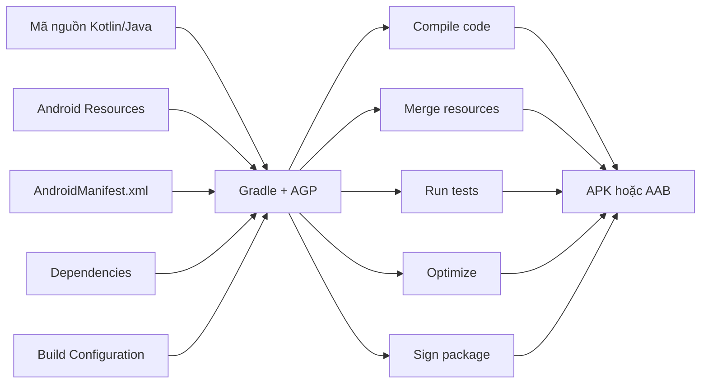
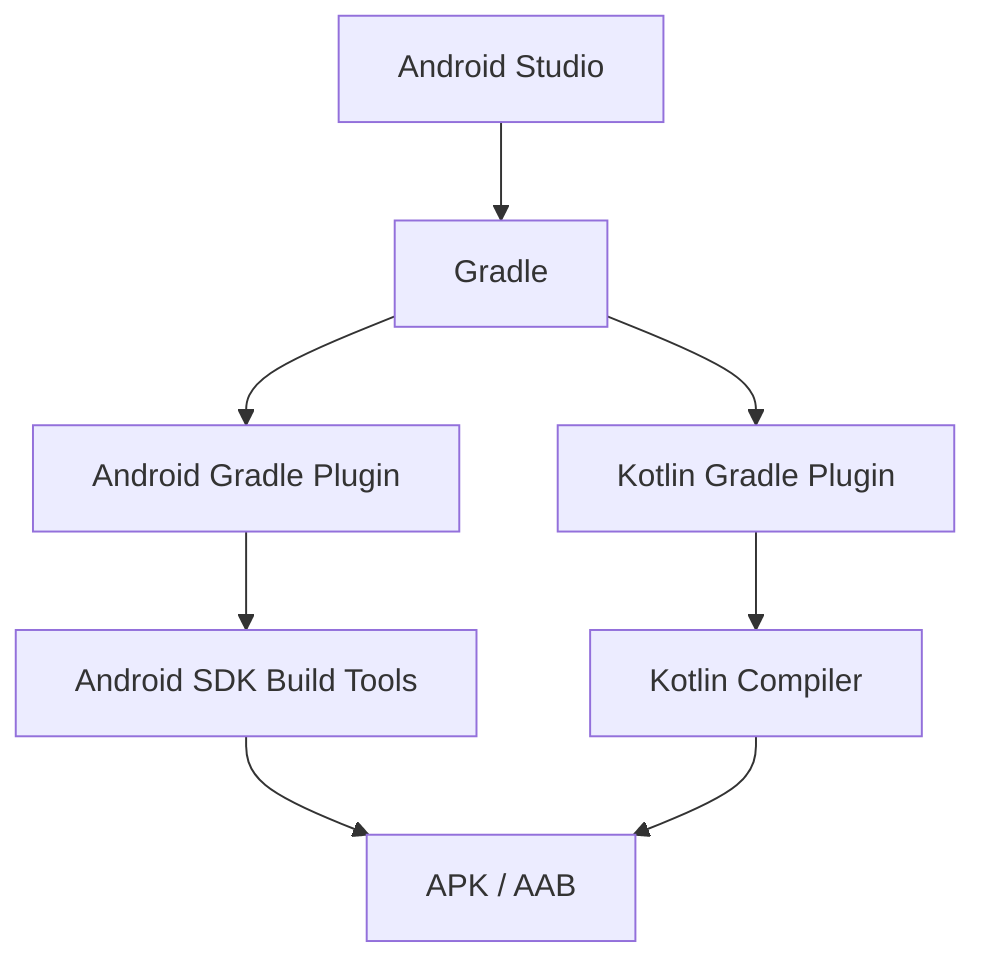
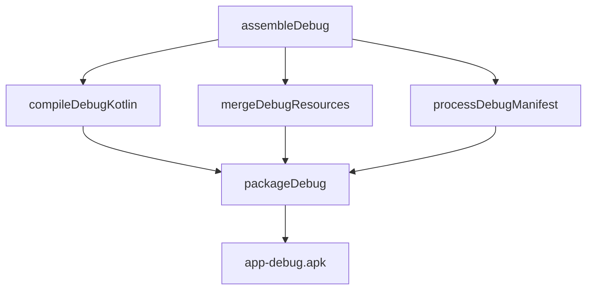
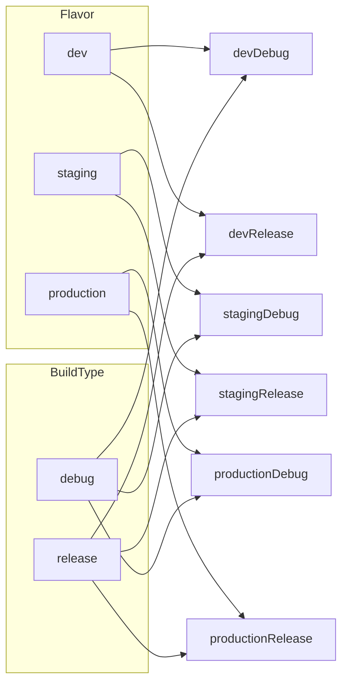
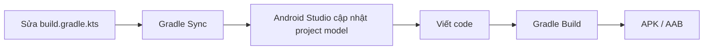
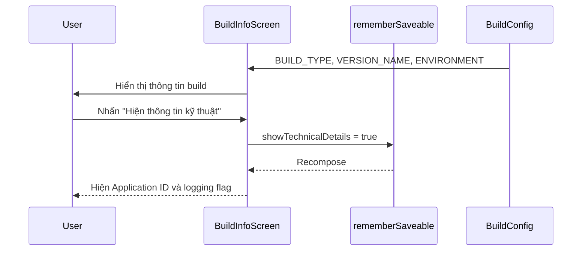
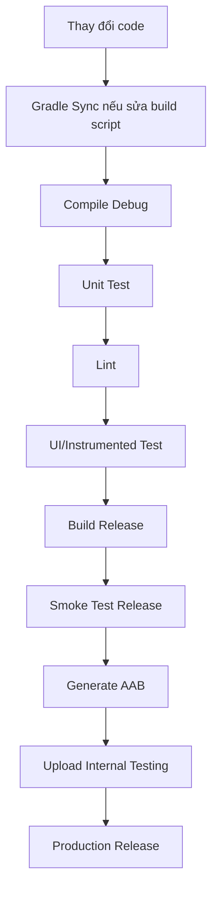

# 023 - Gradle Build System

**Học phần:** 01 - Language and Android Fundamentals
**Module:** Module 02 - Android Fundamentals
**Nhóm nội dung:** Gradle
**Nguồn roadmap:** Android Fundamentals / Gradle
**Loại bài:** UI / Build Configuration
**Thứ tự trong module:** 023
**Thời lượng gợi ý:** 30 phút

---

## 1. Tóm tắt

**Gradle Build System** là hệ thống chịu trách nhiệm biến mã nguồn, tài nguyên, thư viện và cấu hình của dự án Android thành sản phẩm có thể cài đặt hoặc phát hành, thường là:

* APK để cài trực tiếp lên thiết bị.
* Android App Bundle (`.aab`) để phát hành trên Google Play.
* Thư viện Android (`.aar`).
* Báo cáo kiểm thử, lint và các artifact trung gian.

Trong dự án Android, Gradle không chỉ “biên dịch code”. Nó còn:

* Tải và quản lý thư viện.
* Chọn phiên bản ứng dụng cần build.
* Chạy unit test và instrumented test.
* Xử lý resource.
* Tạo `BuildConfig`.
* Ký ứng dụng.
* Tối ưu và thu nhỏ ứng dụng.
* Đóng gói APK hoặc AAB.
* Tự động hóa quy trình build trên CI/CD.

Android Studio sử dụng **Gradle** làm nền tảng build, trong khi **Android Gradle Plugin – AGP** bổ sung các task và cấu hình dành riêng cho ứng dụng Android.

---

## 2. Mục tiêu học tập

Sau bài học, bạn có thể:

* Giải thích Gradle là gì bằng ngôn ngữ của mình.
* Phân biệt Gradle, Android Gradle Plugin và Android Studio.
* Nhận biết vai trò của các file `settings.gradle.kts`, `build.gradle.kts`, `libs.versions.toml` và `gradle.properties`.
* Hiểu plugin, dependency, repository, task và build lifecycle.
* Phân biệt `debug`, `release`, product flavor và build variant.
* Chạy một số Gradle task cơ bản bằng Terminal.
* Tạo một màn hình Compose hiển thị thông tin build.
* Nhận biết lỗi Gradle phổ biến.
* Chuẩn bị cấu hình build phù hợp cho production.
* Tạo một artifact nhỏ để đưa vào portfolio.

---

## 3. Gradle là gì?

Gradle là một **build automation tool**.

Một build system nhận đầu vào như:

* Mã nguồn Kotlin hoặc Java.
* File XML và tài nguyên Android.
* Ảnh, font, âm thanh.
* Android Manifest.
* Thư viện bên ngoài.
* Cấu hình debug hoặc release.
* Signing key.

Sau đó tạo đầu ra:

* APK.
* AAB.
* AAR.
* File test report.
* File lint report.
* Mapping file của R8.
* Các class và resource đã biên dịch.



Android Developers mô tả build system là hệ thống chuyển mã nguồn thành ứng dụng thực thi. Gradle tổ chức quá trình này thành các **task**, còn plugin đăng ký và kết nối các task với nhau.

---

## 4. Gradle, AGP và Android Studio khác nhau như thế nào?

| Thành phần                      | Vai trò                                                                 |
| ------------------------------- | ----------------------------------------------------------------------- |
| **Android Studio**              | IDE dùng để viết code, chạy app, debug và quản lý dự án                 |
| **Gradle**                      | Công cụ tự động hóa quá trình build                                     |
| **Android Gradle Plugin – AGP** | Plugin bổ sung khả năng build APK, AAB, AAR và xử lý tài nguyên Android |
| **Kotlin Gradle Plugin**        | Cho phép Gradle biên dịch mã nguồn Kotlin                               |
| **JDK**                         | Cung cấp Java compiler và môi trường JVM để chạy Gradle                 |
| **Android SDK Build Tools**     | Chứa các công cụ xử lý resource, DEX, đóng gói và ký ứng dụng           |

Có thể hình dung:



> Android Studio là nơi bạn thao tác, nhưng Gradle mới là thành phần thực sự thực thi phần lớn quá trình build.

AGP bổ sung những chức năng dành riêng cho Android trên nền Gradle, chẳng hạn tạo APK, xử lý source set và cấu hình build variant.

---

## 5. Cấu trúc Gradle trong dự án Android

Một dự án Android dùng Kotlin DSL thường có cấu trúc:

```text
MyApplication/
├── app/
│   ├── src/
│   │   ├── main/
│   │   ├── debug/
│   │   ├── release/
│   │   ├── test/
│   │   └── androidTest/
│   ├── build.gradle.kts
│   └── proguard-rules.pro
│
├── gradle/
│   ├── libs.versions.toml
│   └── wrapper/
│       └── gradle-wrapper.properties
│
├── build.gradle.kts
├── settings.gradle.kts
├── gradle.properties
├── local.properties
├── gradlew
└── gradlew.bat
```

### 5.1. `settings.gradle.kts`

File này xác định:

* Tên project.
* Các module tham gia build.
* Nơi Gradle tìm plugin.
* Nơi Gradle tải dependency.
* Version catalog.

Ví dụ:

```kotlin
pluginManagement {
    repositories {
        google()
        mavenCentral()
        gradlePluginPortal()
    }
}

dependencyResolutionManagement {
    repositoriesMode.set(
        RepositoriesMode.FAIL_ON_PROJECT_REPOS
    )

    repositories {
        google()
        mavenCentral()
    }
}

rootProject.name = "GradleInfoApp"

include(":app")
```

Dòng:

```kotlin
include(":app")
```

cho Gradle biết rằng project có một module tên là `app`.

Với project nhiều module:

```kotlin
include(
    ":app",
    ":core:designsystem",
    ":core:network",
    ":feature:home",
    ":feature:profile"
)
```

---

### 5.2. `build.gradle.kts` cấp project

File ở thư mục gốc thường khai báo các plugin có thể dùng trong toàn project.

Với version catalog:

```kotlin
plugins {
    alias(libs.plugins.android.application) apply false
    alias(libs.plugins.android.library) apply false
    alias(libs.plugins.kotlin.android) apply false
    alias(libs.plugins.kotlin.compose) apply false
}
```

`apply false` có nghĩa:

* Plugin được khai báo ở cấp project.
* Chưa áp dụng trực tiếp vào root project.
* Module nào cần plugin sẽ tự áp dụng plugin đó.

---

### 5.3. `app/build.gradle.kts`

Đây là file cấu hình build cho module ứng dụng.

Ví dụ cơ bản:

```kotlin
plugins {
    alias(libs.plugins.android.application)
    alias(libs.plugins.kotlin.android)
    alias(libs.plugins.kotlin.compose)
}

android {
    namespace = "com.example.gradleinfo"

    // Sử dụng API level phù hợp với SDK đã cài.
    compileSdk = 36

    defaultConfig {
        applicationId = "com.example.gradleinfo"

        minSdk = 24
        targetSdk = 36

        versionCode = 1
        versionName = "1.0"
    }

    buildTypes {
        debug {
            applicationIdSuffix = ".debug"
            versionNameSuffix = "-debug"
        }

        release {
            isMinifyEnabled = true

            proguardFiles(
                getDefaultProguardFile(
                    "proguard-android-optimize.txt"
                ),
                "proguard-rules.pro"
            )
        }
    }

    buildFeatures {
        compose = true
        buildConfig = true
    }

    compileOptions {
        sourceCompatibility = JavaVersion.VERSION_17
        targetCompatibility = JavaVersion.VERSION_17
    }
}

dependencies {
    implementation(libs.androidx.core.ktx)
    implementation(libs.androidx.activity.compose)
    implementation(platform(libs.androidx.compose.bom))
    implementation(libs.androidx.compose.material3)

    testImplementation(libs.junit)
    androidTestImplementation(libs.androidx.junit)
}
```

> Các API level và phiên bản plugin trong dự án thực tế phải được chọn dựa trên SDK đã cài và bảng tương thích giữa Android Studio, AGP, Gradle và JDK.

---

### 5.4. `gradle/libs.versions.toml`

Version catalog giúp quản lý tập trung phiên bản thư viện và plugin.

```toml
[versions]
agp = "your-compatible-agp-version"
kotlin = "your-compatible-kotlin-version"
coreKtx = "your-core-ktx-version"
activityCompose = "your-activity-compose-version"
composeBom = "your-compose-bom-version"
junit = "your-junit-version"

[libraries]
androidx-core-ktx = {
    group = "androidx.core",
    name = "core-ktx",
    version.ref = "coreKtx"
}

androidx-activity-compose = {
    group = "androidx.activity",
    name = "activity-compose",
    version.ref = "activityCompose"
}

androidx-compose-bom = {
    group = "androidx.compose",
    name = "compose-bom",
    version.ref = "composeBom"
}

androidx-compose-material3 = {
    group = "androidx.compose.material3",
    name = "material3"
}

junit = {
    group = "junit",
    name = "junit",
    version.ref = "junit"
}

[plugins]
android-application = {
    id = "com.android.application",
    version.ref = "agp"
}

android-library = {
    id = "com.android.library",
    version.ref = "agp"
}

kotlin-android = {
    id = "org.jetbrains.kotlin.android",
    version.ref = "kotlin"
}

kotlin-compose = {
    id = "org.jetbrains.kotlin.plugin.compose",
    version.ref = "kotlin"
}
```

Android Developers khuyến nghị version catalog là một phương pháp phù hợp để quản lý dependency trong các project mới, đặc biệt khi project có nhiều module.

---

### 5.5. `gradle.properties`

File này chứa thuộc tính ảnh hưởng đến Gradle hoặc toàn project.

Ví dụ:

```properties
org.gradle.jvmargs=-Xmx2048m -Dfile.encoding=UTF-8
org.gradle.parallel=true
org.gradle.caching=true

android.useAndroidX=true
kotlin.code.style=official
```

Không nên đặt trực tiếp các secret quan trọng vào file được commit lên Git.

Ví dụ không nên làm:

```properties
API_KEY=my-production-secret-key
STORE_PASSWORD=123456
```

---

### 5.6. `local.properties`

Thông thường chứa đường dẫn Android SDK trên máy local:

```properties
sdk.dir=/Users/user/Library/Android/sdk
```

Trên Windows có thể tương tự:

```properties
sdk.dir=C\:\\Users\\User\\AppData\\Local\\Android\\Sdk
```

File này phụ thuộc từng máy và thường không được commit lên Git.

---

### 5.7. Gradle Wrapper

Các file chính:

```text
gradlew
gradlew.bat
gradle/wrapper/gradle-wrapper.properties
```

* `gradlew`: chạy Gradle trên Linux hoặc macOS.
* `gradlew.bat`: chạy Gradle trên Windows.
* `gradle-wrapper.properties`: xác định phiên bản Gradle của project.

Ví dụ:

```properties
distributionUrl=https\://services.gradle.org/distributions/gradle-x.y.z-bin.zip
```

Wrapper giúp toàn bộ thành viên trong nhóm và CI sử dụng cùng một phiên bản Gradle.

Thay vì:

```bash
gradle build
```

nên ưu tiên:

```bash
./gradlew build
```

Trên Windows:

```powershell
gradlew.bat build
```

---

## 6. Gradle Plugin

Plugin là một gói logic build có thể:

* Thêm task mới.
* Thêm DSL cấu hình.
* Thiết lập convention.
* Tích hợp compiler hoặc công cụ phân tích.
* Tạo artifact.

Ví dụ:

```kotlin
plugins {
    alias(libs.plugins.android.application)
    alias(libs.plugins.kotlin.android)
    alias(libs.plugins.kotlin.compose)
}
```

### Một số plugin phổ biến

| Plugin                                | Vai trò                               |
| ------------------------------------- | ------------------------------------- |
| `com.android.application`             | Build ứng dụng Android                |
| `com.android.library`                 | Build thư viện Android dạng AAR       |
| `org.jetbrains.kotlin.android`        | Biên dịch Kotlin cho Android          |
| `org.jetbrains.kotlin.plugin.compose` | Hỗ trợ Compose compiler               |
| `com.google.devtools.ksp`             | Chạy Kotlin Symbol Processing         |
| `com.google.dagger.hilt.android`      | Tích hợp Hilt                         |
| `com.google.gms.google-services`      | Đọc cấu hình Google Services/Firebase |

Plugin thường đăng ký các task và cung cấp các block cấu hình tương ứng.

---

## 7. Dependency và Repository

### 7.1. Dependency là gì?

Dependency là một thành phần mà project cần để build hoặc chạy.

Ví dụ:

```kotlin
dependencies {
    implementation(libs.androidx.core.ktx)
    implementation(libs.androidx.activity.compose)

    testImplementation(libs.junit)

    androidTestImplementation(libs.androidx.junit)
}
```

Dependency có thể là:

* Thư viện tải từ repository.
* Module khác trong cùng project.
* File `.jar`.
* File `.aar`.
* Platform hoặc BOM.
* Processor dùng trong quá trình build.

Gradle có thể tự động kéo theo các **transitive dependencies**, tức dependency của dependency mà bạn khai báo.

---

### 7.2. Repository là gì?

Repository là nơi Gradle tìm và tải plugin hoặc dependency.

```kotlin
repositories {
    google()
    mavenCentral()
}
```

| Repository             | Nội dung thường gặp                        |
| ---------------------- | ------------------------------------------ |
| `google()`             | AndroidX, Material, AGP và thư viện Google |
| `mavenCentral()`       | Phần lớn thư viện JVM/Kotlin phổ biến      |
| `gradlePluginPortal()` | Gradle plugin                              |
| Maven riêng            | Thư viện nội bộ của doanh nghiệp           |

Không nên thêm repository không rõ nguồn gốc vì có thể gây rủi ro chuỗi cung ứng.

---

### 7.3. Các dependency configuration phổ biến

| Configuration               | Khi nào dùng                                             |
| --------------------------- | -------------------------------------------------------- |
| `implementation`            | Dependency cần cho module hiện tại                       |
| `api`                       | Public API của library module phụ thuộc vào thư viện này |
| `compileOnly`               | Chỉ cần lúc compile                                      |
| `runtimeOnly`               | Chỉ cần lúc runtime                                      |
| `testImplementation`        | Unit test chạy trên JVM                                  |
| `androidTestImplementation` | Test chạy trên thiết bị hoặc emulator                    |
| `debugImplementation`       | Chỉ thêm vào debug build                                 |
| `releaseImplementation`     | Chỉ thêm vào release build                               |
| `ksp`                       | Symbol processor dùng với KSP                            |

Ví dụ chỉ thêm công cụ kiểm tra leak cho debug:

```kotlin
dependencies {
    debugImplementation(libs.leakcanary.android)
}
```

Nhờ vậy, thư viện debug không bị đóng gói vào bản release.

---

### 7.4. Không sử dụng dynamic version

Không nên viết:

```kotlin
implementation("com.example:library:2.+")
```

Hoặc:

```kotlin
implementation("com.example:library:+")
```

Nên khóa phiên bản cụ thể:

```kotlin
implementation("com.example:library:2.4.1")
```

Dynamic version có thể khiến kết quả build thay đổi ngoài ý muốn, gây khó tái hiện lỗi và làm chậm dependency resolution. Android Developers cũng cảnh báo không nên dùng kiểu phiên bản động này.

---

## 8. Task trong Gradle

Mỗi công việc trong Gradle được mô hình hóa thành một **task**.

Ví dụ:

```text
compileDebugKotlin
mergeDebugResources
processDebugManifest
testDebugUnitTest
lintDebug
assembleDebug
bundleRelease
```

Có thể xem danh sách task:

```bash
./gradlew tasks
```

Xem task của module `app`:

```bash
./gradlew :app:tasks
```

### Các task thường dùng

| Lệnh                             | Chức năng                        |
| -------------------------------- | -------------------------------- |
| `./gradlew clean`                | Xóa output trong thư mục build   |
| `./gradlew assembleDebug`        | Tạo APK debug                    |
| `./gradlew installDebug`         | Build và cài APK debug           |
| `./gradlew test`                 | Chạy unit test                   |
| `./gradlew testDebugUnitTest`    | Chạy unit test của debug variant |
| `./gradlew connectedAndroidTest` | Chạy instrumented test           |
| `./gradlew lintDebug`            | Phân tích lint cho debug         |
| `./gradlew assembleRelease`      | Tạo APK release                  |
| `./gradlew bundleRelease`        | Tạo AAB release                  |
| `./gradlew dependencies`         | In dependency tree               |

Gradle hỗ trợ các lifecycle task phổ biến như `build`, `assemble` và `check`.

---

## 9. Build Lifecycle

Một lần chạy Gradle gồm ba giai đoạn chính:

1. **Initialization**
2. **Configuration**
3. **Execution**


*Nguồn ảnh: Gradle User Manual.*

### 9.1. Initialization

Gradle:

* Tìm `settings.gradle.kts`.
* Xác định những project hoặc module nào tham gia build.
* Tạo đối tượng `Project` tương ứng.

Ví dụ:

```kotlin
rootProject.name = "GradleInfoApp"

include(":app")
include(":core:network")
```

---

### 9.2. Configuration

Gradle:

* Đọc các file `build.gradle.kts`.
* Áp dụng plugin.
* Đọc cấu hình Android.
* Đăng ký task.
* Xây dựng task graph.
* Xác định những task liên quan đến yêu cầu hiện tại.

Ví dụ, khi chạy:

```bash
./gradlew assembleDebug
```

Gradle cấu hình project và xác định những task cần thiết để tạo APK debug.

---

### 9.3. Execution

Gradle thực thi những task đã được chọn theo đúng thứ tự dependency.



Gradle chính thức xác định build lifecycle gồm Initialization, Configuration và Execution.

---

## 10. Incremental build và cache

Gradle không nhất thiết phải build lại toàn bộ project sau mỗi thay đổi.

Nếu input của một task không thay đổi, task đó có thể được đánh dấu:

```text
UP-TO-DATE
```

Hoặc được lấy từ cache:

```text
FROM-CACHE
```

Ví dụ output:

```text
> Task :app:compileDebugKotlin UP-TO-DATE
> Task :app:mergeDebugResources FROM-CACHE
> Task :app:packageDebug

BUILD SUCCESSFUL
```

Điều này giúp giảm thời gian build khi:

* Chỉ sửa một file nhỏ.
* Chuyển branch.
* Build lại cùng một commit.
* Chạy build trong CI.

Không nên chạy `clean` trước mọi lần build, vì việc đó xóa output có thể tái sử dụng và buộc Gradle thực hiện lại nhiều công việc.

---

## 11. Build Type

Build type mô tả cách một phiên bản ứng dụng được build.

Android thường có hai build type mặc định:

* `debug`
* `release`

```kotlin
android {
    buildTypes {
        debug {
            applicationIdSuffix = ".debug"
            versionNameSuffix = "-debug"

            isDebuggable = true
            isMinifyEnabled = false
        }

        release {
            isDebuggable = false
            isMinifyEnabled = true

            proguardFiles(
                getDefaultProguardFile(
                    "proguard-android-optimize.txt"
                ),
                "proguard-rules.pro"
            )
        }
    }
}
```

### So sánh debug và release

| Thuộc tính                |       Debug |                   Release |
| ------------------------- | ----------: | ------------------------: |
| Debug bằng Android Studio |          Có |              Thường không |
| Debug keystore            |          Có | Không dùng cho production |
| Minify/R8                 |  Thường tắt |                Thường bật |
| Log chi tiết              |  Có thể bật |              Nên giới hạn |
| API development           | Có thể dùng |            Không nên dùng |
| Mục đích                  |  Phát triển |                 Phát hành |

Android Studio tự tạo cấu hình debug cơ bản, trong khi release có thể được tùy chỉnh để bật tối ưu hóa, ProGuard/R8 và signing.

---

## 12. Product Flavor

Product flavor tạo ra các phiên bản sản phẩm khác nhau từ cùng một codebase.

Ví dụ:

* `dev`: dùng development API.
* `staging`: dùng staging API.
* `production`: dùng production API.

```kotlin
android {
    flavorDimensions += "environment"

    productFlavors {
        create("dev") {
            dimension = "environment"

            applicationIdSuffix = ".dev"
            versionNameSuffix = "-dev"

            buildConfigField(
                "String",
                "BASE_URL",
                "\"https://dev-api.example.com\""
            )
        }

        create("staging") {
            dimension = "environment"

            applicationIdSuffix = ".staging"
            versionNameSuffix = "-staging"

            buildConfigField(
                "String",
                "BASE_URL",
                "\"https://staging-api.example.com\""
            )
        }

        create("production") {
            dimension = "environment"

            buildConfigField(
                "String",
                "BASE_URL",
                "\"https://api.example.com\""
            )
        }
    }
}
```

> URL trên chỉ là giá trị minh họa.

---

## 13. Build Variant

Build variant là tổ hợp của:

```text
Product flavor × Build type
```

Ví dụ:

```text
dev × debug       = devDebug
dev × release     = devRelease
staging × debug   = stagingDebug
staging × release = stagingRelease
production × debug   = productionDebug
production × release = productionRelease
```



Build variant được Gradle tạo bằng cách kết hợp build type và product flavor. Ví dụ, flavor `demo` kết hợp với build type `debug` tạo thành `demoDebug`.

---

## 14. Source Set

Source set cho phép mỗi build type, flavor hoặc variant có:

* Code riêng.
* Resource riêng.
* Manifest riêng.
* Asset riêng.
* Cấu hình riêng.

Ví dụ:

```text
app/src/
├── main/
│   ├── kotlin/
│   ├── res/
│   └── AndroidManifest.xml
│
├── debug/
│   ├── kotlin/
│   ├── res/
│   └── AndroidManifest.xml
│
├── release/
│   └── res/
│
├── dev/
│   ├── kotlin/
│   └── res/
│
├── production/
│   ├── kotlin/
│   └── res/
│
├── devDebug/
│   └── res/
│
├── test/
└── androidTest/
```


*Nguồn ảnh: Android Developers.*

### Mức ưu tiên đơn giản

Khi build `devDebug`, resource có thể được merge theo hướng:

```text
main
  ↓
dev
  ↓
debug
  ↓
devDebug
```

Resource cụ thể hơn có thể ghi đè resource tổng quát hơn.

Ví dụ:

```text
src/main/res/values/strings.xml
src/dev/res/values/strings.xml
```

`src/main`:

```xml
<resources>
    <string name="app_name">Gradle Info</string>
</resources>
```

`src/dev`:

```xml
<resources>
    <string name="app_name">Gradle Info Dev</string>
</resources>
```

Khi chạy `devDebug`, tên ứng dụng sẽ là:

```text
Gradle Info Dev
```

Android Gradle Plugin hỗ trợ source set riêng cho build type, product flavor và build variant.

---

## 15. APK và AAB

### APK

APK là package có thể cài trực tiếp lên thiết bị.

Build APK debug:

```bash
./gradlew assembleDebug
```

Output thường nằm tại:

```text
app/build/outputs/apk/debug/app-debug.apk
```

---

### Android App Bundle

AAB thường được dùng để upload lên Google Play.

```bash
./gradlew bundleRelease
```

Output thường nằm tại:

```text
app/build/outputs/bundle/release/app-release.aab
```

Google Play có thể dùng App Bundle để tạo APK phù hợp với từng thiết bị.

---

## 16. Gradle Sync khác Gradle Build như thế nào?

### Gradle Sync

Sync dùng để:

* Đọc build script.
* Tải plugin và dependency.
* Cập nhật project model cho Android Studio.
* Nhận biết module và source set.
* Cập nhật code completion.

Ví dụ bạn vừa thêm:

```kotlin
implementation(libs.androidx.lifecycle.runtime.compose)
```

Android Studio cần sync để nhận ra dependency này.

---

### Gradle Build

Build dùng để:

* Compile code.
* Xử lý resource.
* Chạy một số bước kiểm tra.
* Tạo APK, AAB hoặc artifact.



---

# 17. Thực hành: Gradle Build Info App

## 17.1. Mục tiêu

Tạo một màn hình Compose:

* Hiển thị build type.
* Hiển thị application ID.
* Hiển thị version name.
* Hiển thị môi trường hiện tại.
* Có nút thay đổi state để hiện hoặc ẩn thông tin chi tiết.
* Kiểm tra sự khác nhau giữa debug và release.

---

## 17.2. Cấu hình `app/build.gradle.kts`

```kotlin
plugins {
    alias(libs.plugins.android.application)
    alias(libs.plugins.kotlin.android)
    alias(libs.plugins.kotlin.compose)
}

android {
    namespace = "com.example.gradleinfo"
    compileSdk = 36

    defaultConfig {
        applicationId = "com.example.gradleinfo"

        minSdk = 24
        targetSdk = 36

        versionCode = 1
        versionName = "1.0"
    }

    buildTypes {
        debug {
            applicationIdSuffix = ".debug"
            versionNameSuffix = "-debug"

            buildConfigField(
                "String",
                "ENVIRONMENT_NAME",
                "\"Development\""
            )

            buildConfigField(
                "Boolean",
                "ENABLE_VERBOSE_LOGGING",
                "true"
            )
        }

        release {
            isMinifyEnabled = true

            buildConfigField(
                "String",
                "ENVIRONMENT_NAME",
                "\"Production\""
            )

            buildConfigField(
                "Boolean",
                "ENABLE_VERBOSE_LOGGING",
                "false"
            )

            proguardFiles(
                getDefaultProguardFile(
                    "proguard-android-optimize.txt"
                ),
                "proguard-rules.pro"
            )
        }
    }

    buildFeatures {
        compose = true
        buildConfig = true
    }

    compileOptions {
        sourceCompatibility = JavaVersion.VERSION_17
        targetCompatibility = JavaVersion.VERSION_17
    }
}

dependencies {
    implementation(libs.androidx.core.ktx)
    implementation(libs.androidx.activity.compose)

    implementation(platform(libs.androidx.compose.bom))
    implementation(libs.androidx.compose.ui)
    implementation(libs.androidx.compose.material3)
    implementation(libs.androidx.compose.ui.tooling.preview)

    debugImplementation(libs.androidx.compose.ui.tooling)
}
```

---

## 17.3. Tạo model chứa thông tin build

```kotlin
package com.example.gradleinfo

data class AppBuildInfo(
    val applicationId: String,
    val versionName: String,
    val versionCode: Int,
    val buildType: String,
    val environmentName: String,
    val verboseLoggingEnabled: Boolean
)

fun createAppBuildInfo(): AppBuildInfo {
    return AppBuildInfo(
        applicationId = BuildConfig.APPLICATION_ID,
        versionName = BuildConfig.VERSION_NAME,
        versionCode = BuildConfig.VERSION_CODE,
        buildType = BuildConfig.BUILD_TYPE,
        environmentName = BuildConfig.ENVIRONMENT_NAME,
        verboseLoggingEnabled =
            BuildConfig.ENABLE_VERBOSE_LOGGING
    )
}
```

---

## 17.4. Tạo màn hình Compose

```kotlin
package com.example.gradleinfo

import androidx.compose.foundation.layout.Arrangement
import androidx.compose.foundation.layout.Column
import androidx.compose.foundation.layout.Spacer
import androidx.compose.foundation.layout.fillMaxSize
import androidx.compose.foundation.layout.fillMaxWidth
import androidx.compose.foundation.layout.height
import androidx.compose.foundation.layout.padding
import androidx.compose.material3.Button
import androidx.compose.material3.Card
import androidx.compose.material3.MaterialTheme
import androidx.compose.material3.Scaffold
import androidx.compose.material3.Text
import androidx.compose.runtime.Composable
import androidx.compose.runtime.getValue
import androidx.compose.runtime.saveable.rememberSaveable
import androidx.compose.runtime.setValue
import androidx.compose.runtime.mutableStateOf
import androidx.compose.ui.Modifier
import androidx.compose.ui.unit.dp

@Composable
fun BuildInfoScreen(
    buildInfo: AppBuildInfo,
    modifier: Modifier = Modifier
) {
    var showTechnicalDetails by rememberSaveable {
        mutableStateOf(false)
    }

    Scaffold(
        modifier = modifier.fillMaxSize()
    ) { innerPadding ->
        Column(
            modifier = Modifier
                .padding(innerPadding)
                .padding(16.dp),
            verticalArrangement = Arrangement.spacedBy(12.dp)
        ) {
            Text(
                text = "Gradle Build Info",
                style = MaterialTheme.typography.headlineMedium
            )

            InfoCard(
                title = "Môi trường",
                value = buildInfo.environmentName
            )

            InfoCard(
                title = "Build type",
                value = buildInfo.buildType
            )

            InfoCard(
                title = "Phiên bản",
                value = buildString {
                    append(buildInfo.versionName)
                    append(" (")
                    append(buildInfo.versionCode)
                    append(")")
                }
            )

            Button(
                onClick = {
                    showTechnicalDetails =
                        !showTechnicalDetails
                },
                modifier = Modifier.fillMaxWidth()
            ) {
                Text(
                    text = if (showTechnicalDetails) {
                        "Ẩn thông tin kỹ thuật"
                    } else {
                        "Hiện thông tin kỹ thuật"
                    }
                )
            }

            if (showTechnicalDetails) {
                InfoCard(
                    title = "Application ID",
                    value = buildInfo.applicationId
                )

                InfoCard(
                    title = "Verbose logging",
                    value = buildInfo
                        .verboseLoggingEnabled
                        .toString()
                )
            }
        }
    }
}

@Composable
private fun InfoCard(
    title: String,
    value: String
) {
    Card(
        modifier = Modifier.fillMaxWidth()
    ) {
        Column(
            modifier = Modifier.padding(16.dp)
        ) {
            Text(
                text = title,
                style = MaterialTheme.typography.labelLarge
            )

            Spacer(modifier = Modifier.height(4.dp))

            Text(
                text = value,
                style = MaterialTheme.typography.bodyLarge
            )
        }
    }
}
```

---

## 17.5. Gọi màn hình trong `MainActivity`

```kotlin
package com.example.gradleinfo

import android.os.Bundle
import androidx.activity.ComponentActivity
import androidx.activity.compose.setContent
import androidx.activity.enableEdgeToEdge
import androidx.compose.material3.MaterialTheme

class MainActivity : ComponentActivity() {

    override fun onCreate(
        savedInstanceState: Bundle?
    ) {
        super.onCreate(savedInstanceState)

        enableEdgeToEdge()

        setContent {
            MaterialTheme {
                BuildInfoScreen(
                    buildInfo = createAppBuildInfo()
                )
            }
        }
    }
}
```

---

## 17.6. Luồng hoạt động



---

## 17.7. Build ứng dụng

### macOS hoặc Linux

```bash
./gradlew :app:assembleDebug
```

### Windows

```powershell
gradlew.bat :app:assembleDebug
```

Kiểm tra output:

```text
app/build/outputs/apk/debug/
```

---

## 17.8. Kiểm tra release build

```bash
./gradlew :app:assembleRelease
```

Hoặc tạo AAB:

```bash
./gradlew :app:bundleRelease
```

Bản release hoàn chỉnh cần signing configuration hợp lệ.

---

## 18. Kiểm thử

### 18.1. Unit test cho model

```kotlin
package com.example.gradleinfo

import org.junit.Assert.assertEquals
import org.junit.Assert.assertFalse
import org.junit.Test

class AppBuildInfoTest {

    @Test
    fun buildInfo_containsExpectedValues() {
        val buildInfo = AppBuildInfo(
            applicationId = "com.example.gradleinfo.debug",
            versionName = "1.0-debug",
            versionCode = 1,
            buildType = "debug",
            environmentName = "Development",
            verboseLoggingEnabled = true
        )

        assertEquals(
            "debug",
            buildInfo.buildType
        )

        assertEquals(
            "Development",
            buildInfo.environmentName
        )
    }

    @Test
    fun releaseLogging_isDisabled() {
        val buildInfo = AppBuildInfo(
            applicationId = "com.example.gradleinfo",
            versionName = "1.0",
            versionCode = 1,
            buildType = "release",
            environmentName = "Production",
            verboseLoggingEnabled = false
        )

        assertFalse(
            buildInfo.verboseLoggingEnabled
        )
    }
}
```

Chạy test:

```bash
./gradlew :app:testDebugUnitTest
```

---

### 18.2. Manual checklist

* [ ] Project sync thành công.
* [ ] `assembleDebug` chạy thành công.
* [ ] APK debug được tạo.
* [ ] Màn hình hiển thị `Development`.
* [ ] Màn hình hiển thị build type `debug`.
* [ ] Application ID có hậu tố `.debug`.
* [ ] Nút hiện/ẩn thông tin hoạt động.
* [ ] State vẫn giữ sau khi xoay màn hình.
* [ ] Unit test chạy thành công.
* [ ] Lint không xuất hiện lỗi nghiêm trọng.
* [ ] Release build không bật verbose logging.

---

## 19. Gradle ảnh hưởng tới UI và UX như thế nào?

Gradle không trực tiếp vẽ giao diện, nhưng cấu hình Gradle có thể ảnh hưởng mạnh tới trải nghiệm người dùng.

### 19.1. Dependency sai phiên bản

Có thể dẫn tới:

* Crash khi mở màn hình.
* Xung đột class.
* UI không tương thích.
* Lỗi runtime chỉ xuất hiện trên một số thiết bị.

---

### 19.2. Resource theo variant

Có thể dùng source set để thay đổi:

* Tên ứng dụng.
* Icon.
* Màu thương hiệu.
* API endpoint.
* Feature flag.
* Nội dung dành cho từng khách hàng.

Ví dụ:

```text
src/clientA/res/drawable/app_logo.xml
src/clientB/res/drawable/app_logo.xml
```

---

### 19.3. Build release chưa tối ưu

Có thể làm:

* APK quá lớn.
* Khởi động chậm.
* Chứa thư viện debug.
* Lộ log nội bộ.
* Lộ endpoint development.
* Giữ lại code không sử dụng.

---

### 19.4. BuildConfig sai môi trường

Nếu release trỏ nhầm development API:

```text
Ứng dụng production
        ↓
Development API
        ↓
Dữ liệu sai hoặc thiếu
        ↓
User gặp lỗi
```

Đây là release risk nghiêm trọng dù code UI không thay đổi.

---

## 20. Lifecycle và state

Gradle chủ yếu hoạt động ở **build time**, không quản lý Android lifecycle tại runtime.

Tuy nhiên, Gradle quyết định code và resource nào được đóng gói vào ứng dụng. Vì vậy:

* `debugImplementation` chỉ tồn tại trong debug build.
* `src/release` chỉ được dùng trong release source set.
* `BuildConfig.DEBUG` thay đổi theo build type.
* Feature flag build-time có thể bật hoặc tắt cả một luồng UI.

Ví dụ:

```kotlin
if (BuildConfig.DEBUG) {
    DebugMenu()
}
```

Không nên dùng điều kiện build-time thay thế hoàn toàn cho việc quản lý runtime state.

```kotlin
var isExpanded by rememberSaveable {
    mutableStateOf(false)
}
```

Trong ví dụ thực hành, `rememberSaveable` giúp state của nút hiện/ẩn được khôi phục sau một số thay đổi cấu hình, chẳng hạn xoay màn hình.

---

## 21. Các lỗi Gradle phổ biến

### 21.1. Plugin và Gradle không tương thích

```text
Minimum supported Gradle version is ...
Current version is ...
```

Cách xử lý:

1. Kiểm tra phiên bản AGP.
2. Kiểm tra Gradle Wrapper.
3. Kiểm tra phiên bản JDK.
4. Xem bảng tương thích chính thức.
5. Nâng cấp từng thành phần có kiểm soát.

AGP, Gradle và Android Studio có quan hệ tương thích phiên bản; không nên nâng riêng một thành phần mà không kiểm tra các thành phần còn lại.

---

### 21.2. Không tải được dependency

```text
Could not resolve ...
```

Nguyên nhân thường gặp:

* Mất mạng.
* Thiếu `google()` hoặc `mavenCentral()`.
* Sai tên group, artifact hoặc version.
* Repository bị chặn.
* Dependency đã bị xóa.
* Proxy chưa được cấu hình.

Kiểm tra dependency:

```bash
./gradlew :app:dependencies
```

---

### 21.3. Duplicate class

```text
Duplicate class ... found in modules ...
```

Nguyên nhân:

* Hai dependency cùng chứa một class.
* Dùng đồng thời thư viện cũ và mới.
* Xung đột dependency bắc cầu.

Kiểm tra:

```bash
./gradlew :app:dependencyInsight \
    --dependency ten-thu-vien \
    --configuration debugRuntimeClasspath
```

---

### 21.4. SDK location not found

```text
SDK location not found
```

Kiểm tra:

```text
local.properties
```

Ví dụ:

```properties
sdk.dir=C\:\\Users\\User\\AppData\\Local\\Android\\Sdk
```

---

### 21.5. Resource linking failed

```text
Android resource linking failed
```

Kiểm tra:

* Tên resource.
* XML syntax.
* Resource bị trùng.
* Theme hoặc attribute không tồn tại.
* `compileSdk` quá thấp so với thư viện.

---

### 21.6. Out of memory

```text
Java heap space
```

Có thể điều chỉnh:

```properties
org.gradle.jvmargs=-Xmx4096m -Dfile.encoding=UTF-8
```

Không nên tăng bộ nhớ vô hạn. Cần kiểm tra thêm:

* Plugin nào làm build nặng.
* Có quá nhiều variant hay không.
* Annotation processor có chậm không.
* Project có vô tình build mọi module không.

---

### 21.7. Cache bị lỗi

Thử theo thứ tự:

```bash
./gradlew --stop
./gradlew clean
./gradlew assembleDebug
```

Chỉ xóa cache toàn cục khi thật sự cần thiết, vì Gradle sẽ phải tải và xử lý lại nhiều dữ liệu.

---

## 22. Build production an toàn

### 22.1. Không hard-code secret

Không nên:

```kotlin
buildConfigField(
    "String",
    "PRIVATE_KEY",
    "\"real-secret-key\""
)
```

`BuildConfig` được đóng gói vào ứng dụng và có thể bị phân tích.

API key nằm trong APK không nên được coi là bí mật tuyệt đối.

---

### 22.2. Tách môi trường

```text
Development → Development API
Staging     → Staging API
Production  → Production API
```

Không cho phép production variant trỏ đến development backend.

---

### 22.3. Tắt debug logging

```kotlin
if (BuildConfig.ENABLE_VERBOSE_LOGGING) {
    logger.enableVerboseLogs()
}
```

Release:

```kotlin
buildConfigField(
    "Boolean",
    "ENABLE_VERBOSE_LOGGING",
    "false"
)
```

---

### 22.4. Bật R8 có kiểm soát

```kotlin
release {
    isMinifyEnabled = true

    proguardFiles(
        getDefaultProguardFile(
            "proguard-android-optimize.txt"
        ),
        "proguard-rules.pro"
    )
}
```

Sau đó cần kiểm tra:

* Serialization.
* Reflection.
* Retrofit model.
* Room.
* JNI.
* WebView JavaScript interface.
* Thư viện yêu cầu keep rule.

---

### 22.5. Kiểm tra release artifact

Không chỉ kiểm tra debug:

```bash
./gradlew :app:testReleaseUnitTest
./gradlew :app:lintRelease
./gradlew :app:bundleRelease
```

Một số lỗi chỉ xuất hiện khi:

* R8 bật.
* Debug flag tắt.
* Release resource được merge.
* Release API endpoint được dùng.
* Signing configuration thay đổi.

---

### 22.6. Quản lý dependency

* Khóa phiên bản cụ thể.
* Hạn chế repository lạ.
* Xóa dependency không dùng.
* Kiểm tra dependency tree.
* Theo dõi lỗ hổng bảo mật.
* Cân nhắc dependency verification.
* Không nâng toàn bộ thư viện ngay trước ngày release.

Android Developers khuyến nghị cân nhắc dependency verification để xác nhận dependency tải về đúng với nội dung mong đợi.

---

## 23. Quy trình build đề xuất



Lệnh mẫu:

```bash
./gradlew \
    :app:testDebugUnitTest \
    :app:lintDebug \
    :app:assembleDebug
```

Trước release:

```bash
./gradlew \
    :app:testReleaseUnitTest \
    :app:lintRelease \
    :app:bundleRelease
```

---

## 24. Bài tập

### Bài 1: Build information

Tạo màn hình hiển thị:

* `BuildConfig.APPLICATION_ID`
* `BuildConfig.BUILD_TYPE`
* `BuildConfig.VERSION_NAME`
* `BuildConfig.VERSION_CODE`

---

### Bài 2: Tạo build type staging

Thêm:

```text
debug
staging
release
```

Yêu cầu:

* `staging` có hậu tố `.staging`.
* `staging` bật debug.
* `staging` dùng staging API.
* `release` dùng production API.

---

### Bài 3: Tạo product flavor

Tạo hai flavor:

```text
free
premium
```

Và hai build type:

```text
debug
release
```

Kết quả cần có:

```text
freeDebug
freeRelease
premiumDebug
premiumRelease
```

---

### Bài 4: Resource riêng theo flavor

Tạo:

```text
src/free/res/values/strings.xml
src/premium/res/values/strings.xml
```

Hiển thị tên gói dịch vụ khác nhau trên UI.

---

### Bài 5: Dependency theo build type

Thêm một dependency chỉ dành cho debug:

```kotlin
debugImplementation(...)
```

Sau đó kiểm tra dependency tree để xác nhận nó không có trong `releaseRuntimeClasspath`.

---

### Bài 6: Build bằng Terminal

Chạy và lưu output của:

```bash
./gradlew tasks
./gradlew :app:assembleDebug
./gradlew :app:testDebugUnitTest
./gradlew :app:lintDebug
```

---

## 25. Câu hỏi ôn tập

1. Gradle khác Android Gradle Plugin như thế nào?
2. `settings.gradle.kts` có nhiệm vụ gì?
3. `app/build.gradle.kts` khác file build cấp project như thế nào?
4. Plugin làm gì trong Gradle?
5. Dependency và repository khác nhau như thế nào?
6. `implementation` khác `debugImplementation` như thế nào?
7. Build type khác product flavor như thế nào?
8. `devDebug` được tạo ra từ những thành phần nào?
9. Ba giai đoạn của Gradle build lifecycle là gì?
10. Vì sao không nên dùng dependency version dạng `1.+`?
11. Vì sao không nên đặt private key vào `BuildConfig`?
12. Vì sao cần test release build thay vì chỉ test debug?
13. `assembleRelease` khác `bundleRelease` như thế nào?
14. Gradle Wrapper giải quyết vấn đề gì?
15. Tại sao không nên chạy `clean` trước mọi lần build?

---

## 26. Artifact đưa vào portfolio

Tạo thư mục:

```text
portfolio/023-gradle-build-system/
├── README.md
├── screenshots/
│   ├── debug-build.png
│   └── release-build.png
├── build-output/
│   ├── assemble-debug.txt
│   ├── unit-test.txt
│   └── lint-debug.txt
└── diagrams/
    └── gradle-build-flow.md
```

README nên có:

```markdown
# Gradle Build Info App

## Mục tiêu

Minh họa cách Android Gradle Plugin cấu hình:

- Build types
- BuildConfig fields
- Debug và release variants
- Dependencies
- Gradle tasks

## Gradle tasks đã chạy

- `:app:assembleDebug`
- `:app:testDebugUnitTest`
- `:app:lintDebug`
- `:app:bundleRelease`

## Kết quả

- Debug build sử dụng môi trường Development.
- Release build sử dụng môi trường Production.
- Verbose logging bị tắt trong release.
- State hiện/ẩn thông tin được giữ bằng `rememberSaveable`.

## Kiến thức rút ra

Gradle không chỉ compile code mà còn quyết định:

- Code nào được đóng gói.
- Resource nào được sử dụng.
- Dependency nào tồn tại trong từng variant.
- Cách ứng dụng được kiểm thử, tối ưu, ký và phát hành.
```

---

## 27. Checklist hoàn thành

### Kiến thức

* [ ] Giải thích được Gradle là gì.
* [ ] Phân biệt được Gradle và AGP.
* [ ] Biết vai trò của Android Studio, JDK và Android SDK.
* [ ] Hiểu `settings.gradle.kts`.
* [ ] Hiểu build file cấp project.
* [ ] Hiểu build file cấp module.
* [ ] Hiểu version catalog.
* [ ] Hiểu plugin.
* [ ] Hiểu dependency và repository.
* [ ] Hiểu task.
* [ ] Hiểu build lifecycle.
* [ ] Phân biệt build type, product flavor và build variant.
* [ ] Hiểu source set.

### Thực hành

* [ ] Sync project thành công.
* [ ] Build được APK debug.
* [ ] Chạy được unit test.
* [ ] Chạy được lint.
* [ ] Tạo được màn hình hiển thị BuildConfig.
* [ ] Có một state change trên UI.
* [ ] State không bị mất khi xoay màn hình.
* [ ] Tạo được release artifact.
* [ ] Có screenshot hoặc README cho portfolio.

### Production

* [ ] Không dùng dynamic dependency version.
* [ ] Không hard-code secret vào source code.
* [ ] Release trỏ đúng production backend.
* [ ] Release không chứa debug tool.
* [ ] Verbose logging bị tắt.
* [ ] Đã kiểm tra R8.
* [ ] Đã chạy release test.
* [ ] Đã chạy release lint.
* [ ] Signing key không bị commit.
* [ ] Có release checklist.

---

## 28. Ghi chú sản xuất

Trước khi phát hành một ứng dụng Android, hãy trả lời các câu hỏi:

1. Variant nào sẽ được phát hành?
2. Variant đó sử dụng API endpoint nào?
3. Có dependency debug nào lọt vào release không?
4. Có log chứa dữ liệu nhạy cảm không?
5. Release build đã bật R8 chưa?
6. R8 có làm hỏng serialization hoặc reflection không?
7. Application ID có đúng không?
8. Version code đã tăng chưa?
9. Signing configuration có đúng không?
10. Unit test và lint release đã chạy chưa?
11. AAB được tạo từ commit nào?
12. Có thể tái tạo lại cùng artifact từ CI không?
13. Có dependency mới nào chưa được review không?
14. Source set release có ghi đè nhầm resource không?
15. Người dùng có gặp khác biệt hành vi giữa debug và release không?

---

## 29. Kết luận

Gradle là phần hạ tầng trung tâm của một dự án Android.

Nó liên kết:

```text
Source code
    + Resources
    + Plugins
    + Dependencies
    + Build configuration
    + Tests
    + Signing
    + Optimization
        ↓
      APK/AAB
```

Ở mức cơ bản, bạn cần nắm chắc:

* Cấu trúc file Gradle.
* Plugin.
* Dependency.
* Task.
* Build lifecycle.
* Debug và release.
* Product flavor.
* Build variant.
* Source set.
* Gradle Wrapper.

Khi dự án phát triển lớn hơn, kiến thức này trở thành nền tảng cho:

* Multi-module architecture.
* Convention plugin.
* CI/CD.
* Automated testing.
* Dependency management.
* Build performance.
* Product white-label.
* Release automation.
* Supply-chain security.

---

# Bài luyện tập

## Mục tiêu


## Đề bài


## Yêu cầu hoàn thành

- [ ] 
- [ ] 
- [ ] 

## Kết quả / lời giải


## Ghi chú
