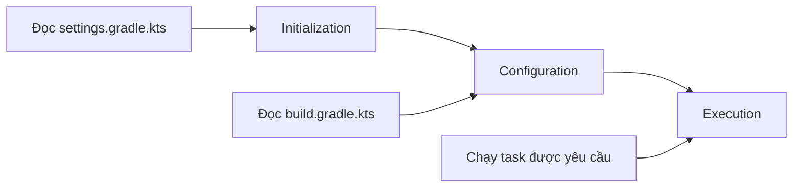
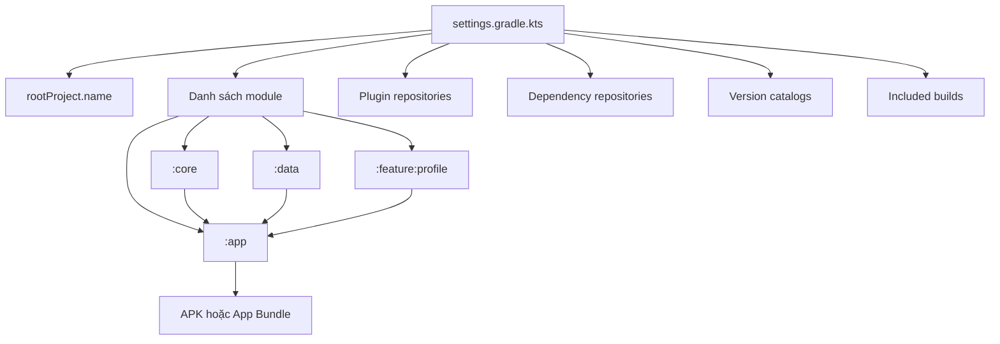
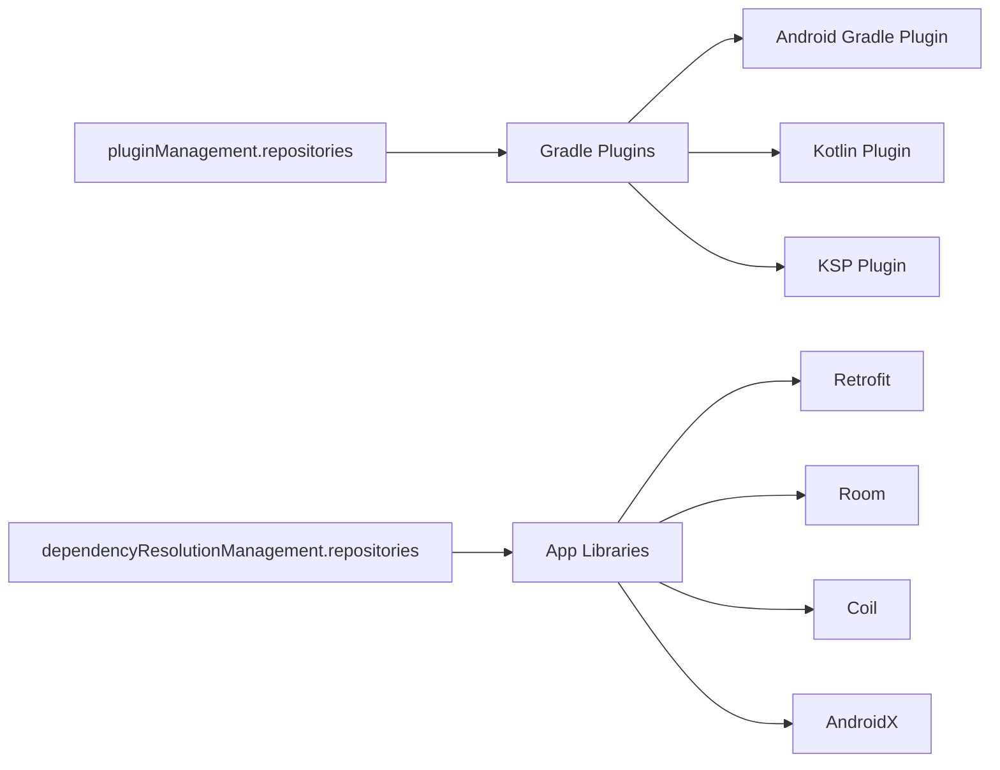
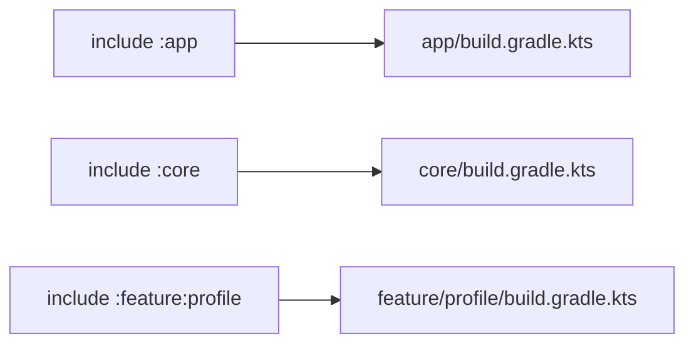
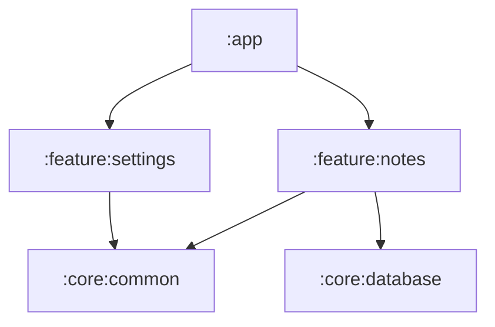
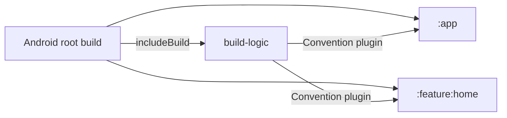
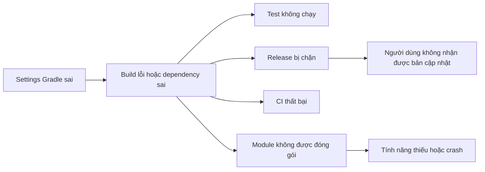

# 024 — Settings Gradle trong dự án Android

[](https://commons.wikimedia.org/wiki/File%3AGradle_logo.svg?utm_source=chatgpt.com) 

**Học phần:** 01 — Language and Android Fundamentals
**Module:** Module 02 — Android Fundamentals
**Nhóm nội dung:** Gradle
**Nguồn roadmap:** Android Fundamentals / Gradle
**Loại bài:** Lesson
**Thứ tự trong module:** 024
**Thời lượng gợi ý:** 24 phút

---

## 1. Tóm tắt

`settings.gradle.kts` là tệp cấu hình **cấp toàn bộ dự án Gradle**. Nó giúp Gradle xác định:

* Tên của dự án gốc.
* Những module nào thuộc dự án.
* Nơi Gradle tìm plugin.
* Nơi Gradle tìm thư viện và dependency.
* Quy tắc quản lý repository chung.
* Các build hoặc version catalog được đưa vào dự án.

Tệp này nằm ở **thư mục gốc của dự án Android** và được Gradle đọc trước các tệp `build.gradle.kts` của từng module. Trong dự án nhiều module, đây là nơi mô tả cấu trúc tổng thể của build. ([Android Developers][1])


> Gradle là hệ thống build được Android Studio sử dụng để tải dependency, chạy task, biên dịch mã nguồn, kiểm thử và đóng gói ứng dụng.

---

## 2. Mục tiêu học tập

Sau bài này, anh có thể:

* Giải thích vai trò của `settings.gradle.kts`.
* Phân biệt `settings.gradle.kts` với `build.gradle.kts`.
* Khai báo tên dự án và các module.
* Cấu hình repository cho plugin và dependency.
* Hiểu vai trò của `pluginManagement`.
* Hiểu vai trò của `dependencyResolutionManagement`.
* Kiểm tra cấu trúc module bằng Gradle CLI.
* Xử lý một số lỗi Gradle Sync liên quan đến tệp settings.
* Tạo một dự án nhiều module nhỏ để đưa vào portfolio.

---

## 3. Vị trí của `settings.gradle.kts`

Một dự án Android sử dụng Kotlin DSL thường có cấu trúc như sau:

```text
MyAndroidApp/
├── app/
│   ├── src/
│   └── build.gradle.kts
│
├── core/
│   └── build.gradle.kts
│
├── feature/
│   └── profile/
│       └── build.gradle.kts
│
├── gradle/
│   ├── libs.versions.toml
│   └── wrapper/
│       └── gradle-wrapper.properties
│
├── build.gradle.kts
├── settings.gradle.kts
├── gradle.properties
├── local.properties
├── gradlew
└── gradlew.bat
```

Trong đó:

| Tệp                              | Vai trò                                            |
| -------------------------------- | -------------------------------------------------- |
| `settings.gradle.kts`            | Khai báo cấu trúc toàn bộ dự án                    |
| `build.gradle.kts` ở thư mục gốc | Khai báo plugin hoặc cấu hình dùng chung cấp dự án |
| `app/build.gradle.kts`           | Cấu hình riêng cho module ứng dụng                 |
| `gradle/libs.versions.toml`      | Quản lý phiên bản plugin và thư viện               |
| `gradle.properties`              | Thuộc tính Gradle dùng chung                       |
| `local.properties`               | Cấu hình cục bộ, chẳng hạn đường dẫn Android SDK   |
| `gradle-wrapper.properties`      | Phiên bản Gradle Wrapper                           |

---

## 4. Khái niệm chính

### 4.1. Settings Gradle là gì?

Gradle gọi `settings.gradle` hoặc `settings.gradle.kts` là **settings file**.

Có hai cách viết:

```text
settings.gradle       → Groovy DSL
settings.gradle.kts   → Kotlin DSL
```

Trong các dự án Android hiện đại, `settings.gradle.kts` thường được sử dụng vì có:

* Kiểm tra kiểu tốt hơn.
* Gợi ý code trong Android Studio.
* Cú pháp gần với Kotlin.
* Dễ điều hướng và refactor hơn.

Settings file là điểm vào của một Gradle build. Với dự án nhiều module, nó có nhiệm vụ khai báo tất cả subproject tham gia vào build. ([Gradle Documentation][2])

---

### 4.2. Gradle đọc `settings.gradle.kts` khi nào?

Gradle build thường có ba giai đoạn lớn:



#### Giai đoạn 1: Initialization

Gradle:

1. Tìm `settings.gradle.kts`.
2. Tạo đối tượng `Settings`.
3. Xác định root project.
4. Xác định những module thuộc build.
5. Cấu hình plugin repository và dependency repository.

#### Giai đoạn 2: Configuration

Gradle đọc:

```text
build.gradle.kts
app/build.gradle.kts
core/build.gradle.kts
feature/profile/build.gradle.kts
```

Sau đó Gradle tạo các task cần thiết.

#### Giai đoạn 3: Execution

Gradle chạy những task được yêu cầu, chẳng hạn:

```bash
./gradlew assembleDebug
```

hoặc:

```bash
./gradlew test
```

Settings script được đánh giá trước các build script, vì vậy đây là nơi phù hợp để cấu hình những thành phần áp dụng cho toàn bộ build như plugin management, included build và version catalog. ([Gradle Documentation][2])

---

## 5. Sơ đồ vai trò của Settings Gradle


*Sơ đồ chính thức của Gradle mô tả settings file, subproject, dependency manager và đầu ra của build.* 

Có thể hiểu đơn giản như sau:



`settings.gradle.kts` không trực tiếp xây dựng giao diện hay xử lý business logic. Nó mô tả **những thành phần nào được phép tham gia vào quá trình build ứng dụng**.

---

## 6. Cấu trúc cơ bản của `settings.gradle.kts`

Một tệp settings thường gặp trong dự án Android:

```kotlin
pluginManagement {
    repositories {
        google()
        mavenCentral()
        gradlePluginPortal()
    }
}

dependencyResolutionManagement {
    repositoriesMode.set(
        RepositoriesMode.FAIL_ON_PROJECT_REPOS
    )

    repositories {
        google()
        mavenCentral()
    }
}

rootProject.name = "SettingsGradleDemo"

include(":app")
```

Các phần chính:

```text
pluginManagement
dependencyResolutionManagement
rootProject.name
include
```

---

## 7. Phân tích từng thành phần

### 7.1. `pluginManagement`

```kotlin
pluginManagement {
    repositories {
        google()
        mavenCentral()
        gradlePluginPortal()
    }
}
```

Khối này cho Gradle biết nơi tìm **Gradle plugin**.

Ví dụ plugin Android:

```kotlin
plugins {
    alias(libs.plugins.android.application)
}
```

Gradle phải tìm được plugin tương ứng từ một repository.

#### Vai trò của từng repository

| Repository             | Thường dùng cho                                        |
| ---------------------- | ------------------------------------------------------ |
| `google()`             | Android Gradle Plugin và thư viện Google               |
| `mavenCentral()`       | Plugin hoặc thư viện được phát hành trên Maven Central |
| `gradlePluginPortal()` | Gradle community plugins                               |

### Thứ tự repository

Gradle kiểm tra repository theo thứ tự khai báo:

```kotlin
repositories {
    google()
    mavenCentral()
    gradlePluginPortal()
}
```

Không nên thêm repository không rõ nguồn gốc chỉ để “làm cho Gradle Sync chạy được”.

Ví dụ không nên làm:

```kotlin
pluginManagement {
    repositories {
        maven("https://random-repository.example.com")
        google()
        mavenCentral()
        gradlePluginPortal()
    }
}
```

Repository không đáng tin cậy có thể gây:

* Rủi ro dependency supply-chain.
* Tải nhầm artifact.
* Build không tái lập được.
* Build chậm hơn.
* Lỗi CI khác với máy local.

---

### 7.2. `dependencyResolutionManagement`

```kotlin
dependencyResolutionManagement {
    repositoriesMode.set(
        RepositoriesMode.FAIL_ON_PROJECT_REPOS
    )

    repositories {
        google()
        mavenCentral()
    }
}
```

Khối này quản lý nơi Gradle tìm **dependency của các module**.

Ví dụ:

```kotlin
dependencies {
    implementation("androidx.core:core-ktx:...")
    implementation("androidx.lifecycle:lifecycle-runtime-ktx:...")
}
```

Gradle sẽ tìm các thư viện đó trong:

```kotlin
google()
mavenCentral()
```

Android Developers mô tả `settings.gradle.kts` là nơi xác định repository cấp dự án và các module được đưa vào build. ([Android Developers][1])

---

### 7.3. Phân biệt plugin repository và dependency repository

Đây là điểm người mới rất dễ nhầm.



Ví dụ:

```kotlin
pluginManagement {
    repositories {
        google()
        gradlePluginPortal()
    }
}
```

Dùng để tìm plugin:

```kotlin
plugins {
    id("com.android.application")
}
```

Trong khi:

```kotlin
dependencyResolutionManagement {
    repositories {
        google()
        mavenCentral()
    }
}
```

Dùng để tìm thư viện:

```kotlin
dependencies {
    implementation("androidx.compose.ui:ui")
}
```

---

### 7.4. `repositoriesMode`

Một cấu hình thường gặp:

```kotlin
repositoriesMode.set(
    RepositoriesMode.FAIL_ON_PROJECT_REPOS
)
```

Nó yêu cầu các module không được tự ý khai báo repository riêng.

Ví dụ đoạn sau trong `app/build.gradle.kts` sẽ gây lỗi:

```kotlin
repositories {
    mavenCentral()
}
```

Bởi vì repository đã được quản lý tập trung trong:

```kotlin
dependencyResolutionManagement
```

#### Các chế độ thường gặp

| Chế độ                  | Ý nghĩa                                   |
| ----------------------- | ----------------------------------------- |
| `PREFER_PROJECT`        | Ưu tiên repository khai báo trong module  |
| `PREFER_SETTINGS`       | Ưu tiên repository trong settings         |
| `FAIL_ON_PROJECT_REPOS` | Báo lỗi nếu module tự khai báo repository |

Đối với dự án nhóm, `FAIL_ON_PROJECT_REPOS` thường dễ kiểm soát hơn vì:

* Repository được quản lý tập trung.
* Tránh mỗi module tải dependency từ một nguồn khác nhau.
* Dễ kiểm tra bảo mật.
* Build giữa local và CI nhất quán hơn.

---

### 7.5. `rootProject.name`

```kotlin
rootProject.name = "SettingsGradleDemo"
```

Dòng này đặt tên cho root project.

Tên này có thể xuất hiện trong:

* Gradle logs.
* Build reports.
* Android Studio.
* Task output.
* CI logs.
* Thông báo lỗi.

Gradle khuyến nghị luôn đặt tên root project rõ ràng thay vì để Gradle tự suy ra từ tên thư mục, vì tên thư mục có thể khác nhau giữa máy lập trình viên và máy CI. ([Gradle Documentation][3])

#### Không nên

```kotlin
// Không đặt rootProject.name
include(":app")
```

Nếu thư mục dự án được đổi từ:

```text
SettingsGradleDemo
```

thành:

```text
android-project-copy-final-2
```

Gradle có thể hiển thị tên root project khác trong log.

#### Nên

```kotlin
rootProject.name = "SettingsGradleDemo"
include(":app")
```

---

### 7.6. `include`

```kotlin
include(":app")
```

Dòng này đưa module `app` vào Gradle build.

Dự án nhiều module có thể khai báo:

```kotlin
include(":app")
include(":core")
include(":data")
include(":domain")
include(":feature:home")
include(":feature:profile")
```

Hoặc viết ngắn hơn:

```kotlin
include(
    ":app",
    ":core",
    ":data",
    ":domain",
    ":feature:home",
    ":feature:profile"
)
```

Gradle yêu cầu thư mục tương ứng với module được include phải tồn tại hoặc được ánh xạ tới một thư mục hợp lệ. ([Gradle Documentation][4])

---

## 8. Cách Gradle ánh xạ tên module sang thư mục

Khai báo:

```kotlin
include(":app")
```

Ánh xạ đến:

```text
app/
└── build.gradle.kts
```

Khai báo:

```kotlin
include(":feature:profile")
```

Ánh xạ đến:

```text
feature/
└── profile/
    └── build.gradle.kts
```

Sơ đồ:



---

## 9. Đổi đường dẫn vật lý của module

Tên logic của module không nhất thiết phải giống hoàn toàn đường dẫn thư mục.

Ví dụ muốn module có tên:

```text
:design-system
```

nhưng mã nguồn nằm ở:

```text
shared/ui/design-system/
```

Có thể cấu hình:

```kotlin
include(":design-system")

project(":design-system").projectDir =
    file("shared/ui/design-system")
```

Cấu trúc:

```text
MyAndroidApp/
├── shared/
│   └── ui/
│       └── design-system/
│           └── build.gradle.kts
│
└── settings.gradle.kts
```

Kỹ thuật này hữu ích khi:

* Giữ tên module ngắn.
* Tổ chức thư mục theo layer.
* Di chuyển module mà chưa muốn đổi dependency path.
* Tích hợp mã nguồn có cấu trúc thư mục khác.

Tuy nhiên, không nên lạm dụng vì tên logic và đường dẫn vật lý khác nhau có thể làm người mới khó theo dõi.

---

## 10. Ví dụ dự án Android nhiều module

Giả sử xây dựng ứng dụng ghi chú:

```text
NoteApp/
├── app/
├── core/
│   ├── common/
│   └── database/
├── feature/
│   ├── notes/
│   └── settings/
└── settings.gradle.kts
```

### `settings.gradle.kts`

```kotlin
pluginManagement {
    repositories {
        google()
        mavenCentral()
        gradlePluginPortal()
    }
}

dependencyResolutionManagement {
    repositoriesMode.set(
        RepositoriesMode.FAIL_ON_PROJECT_REPOS
    )

    repositories {
        google()
        mavenCentral()
    }
}

rootProject.name = "NoteApp"

include(
    ":app",
    ":core:common",
    ":core:database",
    ":feature:notes",
    ":feature:settings"
)
```

### Quan hệ giữa các module



Sau khi include module, module `app` có thể phụ thuộc vào module tính năng:

```kotlin
// app/build.gradle.kts

dependencies {
    implementation(project(":feature:notes"))
    implementation(project(":feature:settings"))
}
```

Tên trong `project(...)` phải khớp với tên được khai báo bằng `include(...)` trong settings file. ([Android Developers][5])

---

## 11. Settings Gradle và Version Catalog

Các dự án Android mới thường quản lý phiên bản dependency bằng:

```text
gradle/libs.versions.toml
```

Ví dụ:

```toml
[versions]
coreKtx = "..."
lifecycle = "..."

[libraries]
androidx-core-ktx = {
    group = "androidx.core",
    name = "core-ktx",
    version.ref = "coreKtx"
}

androidx-lifecycle-runtime = {
    group = "androidx.lifecycle",
    name = "lifecycle-runtime-ktx",
    version.ref = "lifecycle"
}
```

Trong module:

```kotlin
dependencies {
    implementation(libs.androidx.core.ktx)
    implementation(libs.androidx.lifecycle.runtime)
}
```

Android Developers khuyến nghị sử dụng version catalog để quản lý dependency, đặc biệt với dự án nhiều module, nhằm tránh hardcode phiên bản ở nhiều tệp build khác nhau. ([Android Developers][6])

---

### 11.1. Version catalog mặc định

Nếu tệp tồn tại tại:

```text
gradle/libs.versions.toml
```

Gradle thường tự tạo catalog có tên:

```kotlin
libs
```

Vì vậy module có thể dùng:

```kotlin
plugins {
    alias(libs.plugins.android.application)
}

dependencies {
    implementation(libs.androidx.core.ktx)
}
```

---

### 11.2. Tạo catalog bổ sung

Dự án lớn có thể có thêm catalog:

```text
gradle/
├── libs.versions.toml
└── test-libs.versions.toml
```

Trong `settings.gradle.kts`:

```kotlin
dependencyResolutionManagement {
    repositories {
        google()
        mavenCentral()
    }

    versionCatalogs {
        create("testLibs") {
            from(files("gradle/test-libs.versions.toml"))
        }
    }
}
```

Sau đó trong module:

```kotlin
dependencies {
    testImplementation(testLibs.junit)
}
```

Chỉ nên chia nhiều catalog khi dự án đủ lớn. Với app nhỏ, một tệp `libs.versions.toml` thường dễ quản lý hơn.

---

## 12. `includeBuild` là gì?

Ngoài module, Settings Gradle có thể đưa một Gradle build khác vào bằng `includeBuild`.

Ví dụ:

```kotlin
pluginManagement {
    includeBuild("build-logic")

    repositories {
        google()
        mavenCentral()
        gradlePluginPortal()
    }
}
```

Cấu trúc:

```text
MyAndroidApp/
├── app/
├── build-logic/
│   ├── settings.gradle.kts
│   └── convention/
│       └── build.gradle.kts
└── settings.gradle.kts
```

`includeBuild` thường được dùng cho:

* Convention plugins.
* Build logic dùng chung.
* Composite builds.
* Phát triển plugin nội bộ.
* Tách logic Gradle khỏi module ứng dụng.



Composite build đưa toàn bộ một build khác vào build hiện tại, khác với `include`, vốn đưa các subproject vào cùng một build. ([Gradle Documentation][7])

---

## 13. Phân biệt các tệp Gradle quan trọng

### 13.1. `settings.gradle.kts`

Trả lời câu hỏi:

> Dự án này gồm những module nào và Gradle tìm plugin, dependency ở đâu?

```kotlin
rootProject.name = "NoteApp"

include(
    ":app",
    ":core",
    ":feature:home"
)
```

---

### 13.2. `build.gradle.kts` cấp dự án

Trả lời câu hỏi:

> Dự án sử dụng những plugin cấp cao nào?

Ví dụ:

```kotlin
plugins {
    alias(libs.plugins.android.application) apply false
    alias(libs.plugins.android.library) apply false
    alias(libs.plugins.kotlin.android) apply false
}
```

---

### 13.3. `build.gradle.kts` cấp module

Trả lời câu hỏi:

> Module này được build như thế nào?

Ví dụ:

```kotlin
plugins {
    alias(libs.plugins.android.application)
    alias(libs.plugins.kotlin.android)
}

android {
    namespace = "com.example.noteapp"
    compileSdk = 36

    defaultConfig {
        applicationId = "com.example.noteapp"
        minSdk = 26
        targetSdk = 36
    }
}

dependencies {
    implementation(libs.androidx.core.ktx)
}
```

---

### 13.4. `gradle.properties`

Trả lời câu hỏi:

> Gradle sử dụng những thuộc tính chung nào?

Ví dụ:

```properties
org.gradle.jvmargs=-Xmx2048m
android.useAndroidX=true
kotlin.code.style=official
```

---

### 13.5. `libs.versions.toml`

Trả lời câu hỏi:

> Dự án đang sử dụng phiên bản plugin và dependency nào?

```toml
[versions]
agp = "..."
kotlin = "..."

[plugins]
android-application = {
    id = "com.android.application",
    version.ref = "agp"
}
```

---

## 14. Bảng so sánh nhanh

| Tệp                       | Cấp độ         | Trách nhiệm chính                           |
| ------------------------- | -------------- | ------------------------------------------- |
| `settings.gradle.kts`     | Toàn bộ build  | Cấu trúc module, repository, included build |
| Root `build.gradle.kts`   | Toàn bộ dự án  | Phiên bản và khai báo plugin dùng chung     |
| Module `build.gradle.kts` | Một module     | Android config, dependency, build type      |
| `libs.versions.toml`      | Toàn bộ dự án  | Phiên bản thư viện và plugin                |
| `gradle.properties`       | Gradle runtime | Thuộc tính và tùy chỉnh Gradle              |
| `local.properties`        | Máy local      | Android SDK và cấu hình cục bộ              |

---

## 15. Ví dụ thực hành hoàn chỉnh

### Yêu cầu

Tạo ứng dụng gồm ba module:

```text
:app
:core:model
:feature:profile
```

### Bước 1: Tạo cấu trúc thư mục

```text
SettingsGradleDemo/
├── app/
├── core/
│   └── model/
├── feature/
│   └── profile/
└── settings.gradle.kts
```

### Bước 2: Khai báo module

```kotlin
// settings.gradle.kts

pluginManagement {
    repositories {
        google()
        mavenCentral()
        gradlePluginPortal()
    }
}

dependencyResolutionManagement {
    repositoriesMode.set(
        RepositoriesMode.FAIL_ON_PROJECT_REPOS
    )

    repositories {
        google()
        mavenCentral()
    }
}

rootProject.name = "SettingsGradleDemo"

include(
    ":app",
    ":core:model",
    ":feature:profile"
)
```

### Bước 3: Thêm dependency giữa các module

```kotlin
// feature/profile/build.gradle.kts

dependencies {
    implementation(project(":core:model"))
}
```

```kotlin
// app/build.gradle.kts

dependencies {
    implementation(project(":feature:profile"))
}
```

### Bước 4: Kiểm tra cấu trúc dự án

Trên macOS hoặc Linux:

```bash
./gradlew projects
```

Trên Windows:

```powershell
gradlew.bat projects
```

Kết quả dự kiến:

```text
Root project 'SettingsGradleDemo'

+--- Project ':app'
+--- Project ':core'
|    \--- Project ':core:model'
\--- Project ':feature'
     \--- Project ':feature:profile'
```

### Bước 5: Build ứng dụng

```bash
./gradlew :app:assembleDebug
```

---

## 16. Năm dòng ghi nhớ nhanh

```text
1. settings.gradle.kts mô tả cấu trúc tổng thể của Gradle build.
2. Nó nằm ở thư mục gốc và được đọc trước build.gradle.kts.
3. pluginManagement quản lý nơi tải Gradle plugin.
4. dependencyResolutionManagement quản lý nơi tải dependency.
5. include khai báo các module tham gia vào quá trình build.
```

---

## 17. Những lỗi người mới thường gặp

### Lỗi 1: Tạo module nhưng quên `include`

Đã tạo:

```text
feature/profile/
└── build.gradle.kts
```

Nhưng settings chỉ có:

```kotlin
include(":app")
```

Sau đó gọi:

```kotlin
implementation(project(":feature:profile"))
```

Gradle báo lỗi tương tự:

```text
Project with path ':feature:profile' could not be found
```

#### Cách sửa

```kotlin
include(
    ":app",
    ":feature:profile"
)
```

---

### Lỗi 2: Sai tên module

Settings:

```kotlin
include(":feature:profile")
```

Nhưng module app dùng:

```kotlin
implementation(project(":features:profile"))
```

Khác nhau ở:

```text
feature
features
```

#### Cách sửa

```kotlin
implementation(project(":feature:profile"))
```

---

### Lỗi 3: Đường dẫn module không tồn tại

```kotlin
include(":core:network")
```

Nhưng cấu trúc thực tế:

```text
core/
└── networking/
```

Gradle không tìm thấy:

```text
core/network/
```

#### Cách sửa 1: Đổi tên thư mục

```text
core/network/
```

#### Cách sửa 2: Ánh xạ thủ công

```kotlin
include(":core:network")

project(":core:network").projectDir =
    file("core/networking")
```

---

### Lỗi 4: Đặt dependency trong `pluginManagement`

Sai:

```kotlin
pluginManagement {
    repositories {
        google()
    }

    dependencies {
        implementation("androidx.core:core-ktx:...")
    }
}
```

`pluginManagement` không phải nơi khai báo dependency của ứng dụng.

Đúng:

```kotlin
// app/build.gradle.kts

dependencies {
    implementation(libs.androidx.core.ktx)
}
```

---

### Lỗi 5: Đặt plugin repository sai vị trí

Sai:

```kotlin
dependencyResolutionManagement {
    repositories {
        gradlePluginPortal()
    }
}
```

Đúng:

```kotlin
pluginManagement {
    repositories {
        google()
        mavenCentral()
        gradlePluginPortal()
    }
}
```

---

### Lỗi 6: Khai báo repository trong từng module

Trong settings:

```kotlin
repositoriesMode.set(
    RepositoriesMode.FAIL_ON_PROJECT_REPOS
)
```

Nhưng trong `app/build.gradle.kts` lại có:

```kotlin
repositories {
    mavenCentral()
}
```

Gradle có thể báo lỗi vì module tự khai báo repository.

#### Cách sửa

Xóa khối `repositories` khỏi module và đưa repository về:

```kotlin
dependencyResolutionManagement {
    repositories {
        google()
        mavenCentral()
    }
}
```

---

### Lỗi 7: Thêm repository tùy tiện để sửa lỗi Sync

Khi Gradle báo không tìm thấy thư viện, người mới có thể thêm hàng loạt repository:

```kotlin
repositories {
    google()
    mavenCentral()
    mavenLocal()
    maven("https://jitpack.io")
    maven("https://example.com/random")
}
```

Điều này có thể che giấu nguyên nhân thực sự:

* Sai tên dependency.
* Sai phiên bản.
* Dependency không còn tồn tại.
* Mất kết nối mạng.
* Proxy hoặc SSL lỗi.
* Repository của dependency chưa được xác định chính xác.

Nên kiểm tra dependency trước, sau đó chỉ thêm repository chính thức mà thư viện yêu cầu.

---

### Lỗi 8: Hardcode phiên bản ở quá nhiều module

```kotlin
// app/build.gradle.kts
implementation("androidx.core:core-ktx:1.x.x")
```

```kotlin
// feature/home/build.gradle.kts
implementation("androidx.core:core-ktx:1.y.y")
```

Hai module có thể sử dụng phiên bản khác nhau.

#### Cách cải thiện

Quản lý tập trung bằng:

```text
gradle/libs.versions.toml
```

Android Developers khuyến nghị version catalog là phương pháp quản lý build dependency cho dự án Android hiện đại. ([Android Developers][5])

---

## 18. Settings Gradle ảnh hưởng đến UX như thế nào?

`settings.gradle.kts` không trực tiếp hiển thị màn hình, nhưng cấu hình sai có thể gây ảnh hưởng gián tiếp rất lớn.



### Một số ảnh hưởng thực tế

| Vấn đề                                | Ảnh hưởng                            |
| ------------------------------------- | ------------------------------------ |
| Quên include module                   | Tính năng không thể build            |
| Repository không ổn định              | CI hoặc Gradle Sync thường xuyên lỗi |
| Dependency đến từ nguồn không tin cậy | Rủi ro bảo mật                       |
| Module phụ thuộc vòng tròn            | Kiến trúc khó duy trì                |
| Tải quá nhiều plugin                  | Gradle Sync và build chậm            |
| Version không đồng nhất               | Có thể gây lỗi runtime hoặc conflict |
| Root project không ổn định            | Log CI khó đọc và khó debug          |

---

## 19. Liên hệ với lifecycle và state Android

`settings.gradle.kts` không tham gia trực tiếp vào:

* `Activity` lifecycle.
* `Fragment` lifecycle.
* Compose state.
* `ViewModel`.
* State restoration.
* Network request.
* Database transaction.

Tuy nhiên, nó quyết định liệu những module chứa các thành phần đó có được build và đóng gói hay không.

Ví dụ:

```text
:feature:profile
```

chứa:

```text
ProfileScreen
ProfileViewModel
ProfileRepository
```

Nếu quên:

```kotlin
include(":feature:profile")
```

thì toàn bộ tính năng profile không thể tham gia vào build.

Do đó, Settings Gradle nằm ở tầng **build architecture**, không nằm ở tầng UI hay runtime state.

---

## 20. Testing và debugging

### 20.1. Liệt kê project

```bash
./gradlew projects
```

Dùng để kiểm tra:

* Root project.
* Danh sách module.
* Cấu trúc module lồng nhau.
* Module có được Gradle nhận diện không.

---

### 20.2. Liệt kê task của module

```bash
./gradlew :app:tasks
```

Hoặc:

```bash
./gradlew :feature:profile:tasks
```

Nếu Gradle không tìm thấy module, cần kiểm tra:

```kotlin
include(":feature:profile")
```

---

### 20.3. Kiểm tra dependency

```bash
./gradlew :app:dependencies
```

Lệnh này hữu ích khi:

* Dependency không tải được.
* Có version conflict.
* Module dependency không xuất hiện.
* Thư viện bị kéo vào từ dependency gián tiếp.

---

### 20.4. Build riêng một module

```bash
./gradlew :core:database:build
```

Điều này giúp phân biệt:

* Lỗi riêng trong module.
* Lỗi cấu hình toàn dự án.
* Lỗi dependency giữa các module.

---

### 20.5. Build với thông tin chi tiết

```bash
./gradlew assembleDebug --info
```

Chi tiết hơn:

```bash
./gradlew assembleDebug --stacktrace
```

Rất chi tiết:

```bash
./gradlew assembleDebug --debug
```

Không nên dùng `--debug` thường xuyên vì log rất dài và có thể chứa thông tin môi trường.

---

### 20.6. Kiểm tra trên CI

Một pipeline cơ bản có thể chạy:

```bash
./gradlew projects
./gradlew lint
./gradlew test
./gradlew assembleDebug
```

Việc chạy `projects` giúp phát hiện sớm lỗi module bị thiếu hoặc cấu trúc dự án thay đổi ngoài dự kiến.

---

## 21. Checklist debug Gradle Sync

Khi Gradle Sync lỗi sau khi chỉnh `settings.gradle.kts`:

* [ ] Kiểm tra dấu ngoặc `{}`.
* [ ] Kiểm tra dấu ngoặc `()`.
* [ ] Kiểm tra tên module trong `include`.
* [ ] Kiểm tra thư mục module có tồn tại.
* [ ] Kiểm tra module có `build.gradle.kts`.
* [ ] Kiểm tra `google()` có trong plugin và dependency repositories.
* [ ] Kiểm tra `mavenCentral()`.
* [ ] Kiểm tra `gradlePluginPortal()` trong `pluginManagement`.
* [ ] Kiểm tra module có tự khai báo repository trái với `repositoriesMode`.
* [ ] Kiểm tra kết nối mạng hoặc proxy.
* [ ] Chạy `./gradlew projects`.
* [ ] Chạy lại với `--stacktrace`.
* [ ] So sánh thay đổi bằng Git diff.
* [ ] Không xóa cache Gradle ngay khi chưa đọc lỗi.

---

## 22. Thực hành 24 phút

### Phần 1 — Đọc cấu trúc dự án: 4 phút

Mở:

```text
settings.gradle.kts
```

Xác định:

* `pluginManagement`.
* `dependencyResolutionManagement`.
* `rootProject.name`.
* Các lệnh `include`.

---

### Phần 2 — Tạo module: 8 phút

Tạo Android Library module:

```text
core/model
```

Thêm vào settings:

```kotlin
include(":core:model")
```

---

### Phần 3 — Tạo dependency: 5 phút

Trong `app/build.gradle.kts`:

```kotlin
dependencies {
    implementation(project(":core:model"))
}
```

---

### Phần 4 — Kiểm tra: 4 phút

```bash
./gradlew projects
./gradlew :core:model:build
./gradlew :app:assembleDebug
```

---

### Phần 5 — Viết README: 3 phút

```markdown
## Gradle project structure

- `:app`: Android application.
- `:core:model`: Shared domain models.
- Module declarations are maintained in `settings.gradle.kts`.
- Repositories are managed centrally.
```

---

## 23. Bài tập

### Bài tập cơ bản

Tạo dự án gồm:

```text
:app
:core:common
:feature:home
```

Viết `settings.gradle.kts` thích hợp.

### Đáp án tham khảo

```kotlin
pluginManagement {
    repositories {
        google()
        mavenCentral()
        gradlePluginPortal()
    }
}

dependencyResolutionManagement {
    repositoriesMode.set(
        RepositoriesMode.FAIL_ON_PROJECT_REPOS
    )

    repositories {
        google()
        mavenCentral()
    }
}

rootProject.name = "ModularAndroidDemo"

include(
    ":app",
    ":core:common",
    ":feature:home"
)
```

---

### Bài tập nâng cao

Mở rộng thành:

```text
:app
:core:common
:core:model
:core:database
:core:network
:feature:home
:feature:profile
:feature:settings
```

Yêu cầu:

1. Khai báo tất cả module trong `settings.gradle.kts`.
2. Vẽ dependency graph.
3. Không cho module tự khai báo repository.
4. Kiểm tra bằng `./gradlew projects`.
5. Build từng module độc lập.
6. Ghi lại một lỗi đã gặp và cách xử lý.

---

## 24. Artifact nhỏ cho portfolio

Có thể tạo repository:

```text
android-gradle-settings-demo
```

### Nội dung repository

```text
android-gradle-settings-demo/
├── app/
├── core/
│   ├── common/
│   └── model/
├── feature/
│   ├── home/
│   └── profile/
├── docs/
│   └── module-graph.md
├── settings.gradle.kts
└── README.md
```

### README mẫu

````markdown
# Android Gradle Settings Demo

Dự án minh họa cách sử dụng `settings.gradle.kts`
trong một ứng dụng Android nhiều module.

## Modules

- `:app`: Application entry point.
- `:core:common`: Shared utilities.
- `:core:model`: Shared models.
- `:feature:home`: Home feature.
- `:feature:profile`: Profile feature.

## Build commands

```bash
./gradlew projects
./gradlew test
./gradlew :app:assembleDebug
````

## Build principles

* Repositories are managed centrally.
* Every module has a clear responsibility.
* Dependency versions are managed through version catalogs.
* Feature modules do not depend directly on each other.

````

---

## 25. Câu hỏi phỏng vấn thường gặp

### `settings.gradle.kts` dùng để làm gì?

Dùng để xác định cấu trúc của Gradle build, đặt tên root project, khai báo module, cấu hình plugin repository, dependency repository và included build.

### `include(":app")` có ý nghĩa gì?

Nó đưa module `app` vào Gradle build.

### `settings.gradle.kts` khác `app/build.gradle.kts` như thế nào?

`settings.gradle.kts` cấu hình toàn bộ build và cấu trúc module. `app/build.gradle.kts` cấu hình riêng cách module app được biên dịch và đóng gói.

### `pluginManagement` khác `dependencyResolutionManagement` thế nào?

`pluginManagement` quản lý nơi tìm Gradle plugin; `dependencyResolutionManagement` quản lý nơi tìm thư viện được dùng trong các module.

### Tại sao nên đặt `rootProject.name`?

Để tên root project nhất quán giữa máy local, CI, log và báo cáo Gradle.

### Vì sao tạo module rồi Android Studio vẫn không nhận?

Một nguyên nhân thường gặp là module chưa được thêm bằng `include(...)` trong `settings.gradle.kts`.

---

## 26. Ghi chú production

Khi chỉnh sửa `settings.gradle.kts` trong dự án production, cần tự hỏi:

- Thay đổi này có thêm hoặc loại bỏ module nào không?
- Module bị loại bỏ có đang được app sử dụng không?
- Repository mới có đáng tin cậy không?
- Build trên CI có truy cập được repository đó không?
- Dependency có thể được tải ổn định ở mọi môi trường không?
- Có hardcode thông tin xác thực trong URL repository không?
- Gradle Sync và build time có tăng đáng kể không?
- Version catalog có cần cập nhật không?
- README và module graph có cần thay đổi không?
- Pull request có hiển thị rõ lý do thêm module hoặc repository không?

Không nên lưu trực tiếp thông tin bí mật như:

```kotlin
maven {
    credentials {
        username = "admin"
        password = "secret-password"
    }
}
````

Thông tin xác thực nên được lấy từ:

* Environment variables.
* `gradle.properties` cục bộ không commit.
* Secret manager của CI.
* Cơ chế credentials an toàn của tổ chức.

---

## 27. Checklist hoàn thành

* [ ] Giải thích được `settings.gradle.kts`.
* [ ] Biết tệp này nằm ở thư mục gốc.
* [ ] Phân biệt được Kotlin DSL và Groovy DSL.
* [ ] Hiểu `pluginManagement`.
* [ ] Hiểu `dependencyResolutionManagement`.
* [ ] Hiểu `repositoriesMode`.
* [ ] Biết đặt `rootProject.name`.
* [ ] Biết thêm module bằng `include`.
* [ ] Biết khai báo module lồng nhau.
* [ ] Biết ánh xạ module sang thư mục khác.
* [ ] Biết kiểm tra bằng `./gradlew projects`.
* [ ] Biết debug lỗi module không tồn tại.
* [ ] Có ví dụ dự án nhiều module.
* [ ] Có README hoặc module diagram để đưa vào portfolio.

---

## 28. Kết luận

`settings.gradle.kts` có thể được xem như **bản đồ của toàn bộ Gradle build**:

```text
settings.gradle.kts
├── Dự án tên gì?
├── Có những module nào?
├── Plugin được tải từ đâu?
├── Dependency được tải từ đâu?
├── Repository được quản lý như thế nào?
├── Có version catalog nào?
└── Có build logic hoặc build ngoài nào được đưa vào?
```

Một Android developer không nên coi Gradle là “phần cấu hình tự động không cần hiểu”. Cấu trúc build ảnh hưởng trực tiếp đến khả năng:

* Mở rộng dự án.
* Chia module.
* Quản lý dependency.
* Chạy kiểm thử.
* Build trên CI.
* Phát hành ổn định.
* Debug lỗi production và release.

Hiểu `settings.gradle.kts` là bước đầu để chuyển từ một dự án Android đơn giản sang kiến trúc nhiều module có khả năng bảo trì tốt.

[1]: https://developer.android.com/build?hl=vi "Định cấu hình bản dựng  |  Android Studio  |  Android Developers"
[2]: https://docs.gradle.org/current/userguide/settings_file_basics.html "Settings File Basics"
[3]: https://docs.gradle.org/current/userguide/best_practices_general.html "General Gradle Best Practices"
[4]: https://docs.gradle.org/current/userguide/multi_project_builds.html?utm_source=chatgpt.com "Multi-Project Builds"
[5]: https://developer.android.com/build/dependencies "Add build dependencies  |  Android Studio  |  Android Developers"
[6]: https://developer.android.com/build/migrate-to-catalogs?hl=en&utm_source=chatgpt.com "Migrate your build to version catalogs  |  Android Studio  |  Android Developers"
[7]: https://docs.gradle.org/current/userguide/composite_builds.html?utm_source=chatgpt.com "Composite Builds (Included Builds)"
