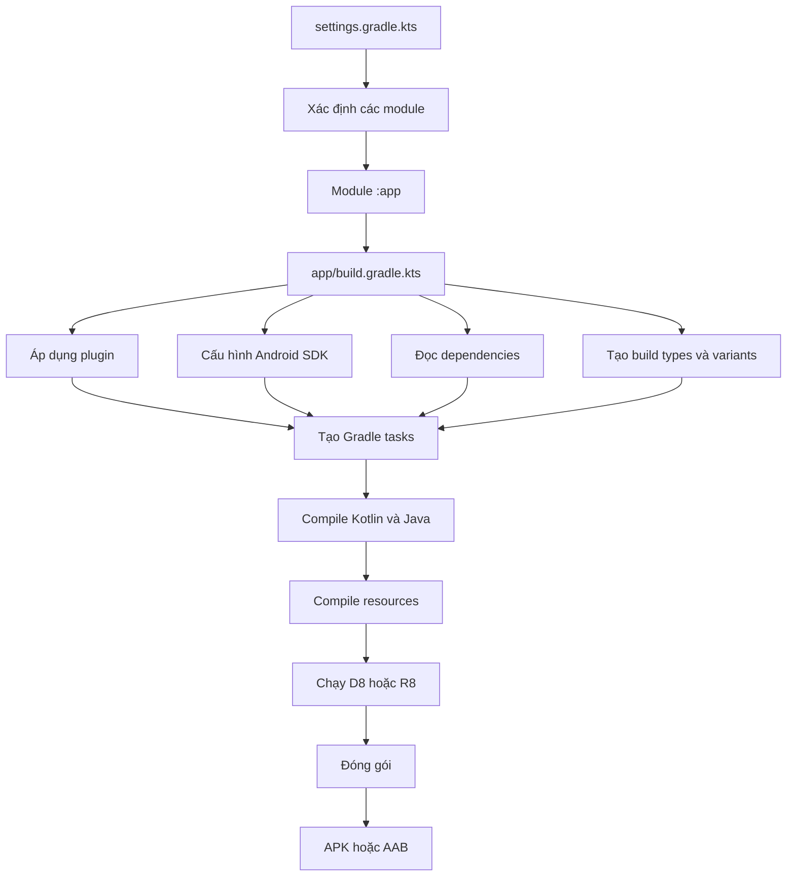
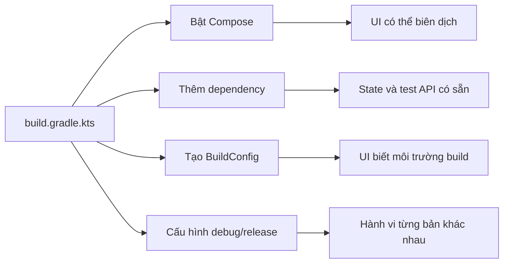

# 025 - Build Gradle Module

**Học phần:** 01 - Language and Android Fundamentals
**Module:** Module 02 - Android Fundamentals
**Nhóm nội dung:** Gradle
**Nguồn roadmap:** Android Fundamentals / Gradle
**Loại bài:** UI
**Thứ tự trong module:** 025
**Thời lượng gợi ý:** 30 phút

---

## 1. Tóm tắt

**Build Gradle Module** là tệp cấu hình Gradle dành riêng cho một module Android, thường có đường dẫn:

```text
app/build.gradle.kts
```

Tệp này trả lời những câu hỏi quan trọng như:

* Module này tạo ra ứng dụng, thư viện hay một loại artifact khác?
* Module được biên dịch bằng phiên bản Android SDK nào?
* Thiết bị Android cũ nhất có thể cài ứng dụng là phiên bản nào?
* Module sử dụng Jetpack Compose, View Binding hay BuildConfig không?
* Module cần những thư viện nào?
* Bản `debug` và `release` khác nhau như thế nào?
* Code được tối ưu, thu gọn và đóng gói thành APK hoặc Android App Bundle ra sao?

Mỗi module hoặc subproject Gradle có tệp build riêng. Tệp cấp module chứa plugin, các khối cấu hình mà plugin yêu cầu và những dependency dùng để xây dựng module đó.

> **Ý tưởng cốt lõi:** `build.gradle.kts` không phải một tệp phụ bí ẩn. Nó là một phần của mã nguồn ứng dụng và cần được review, kiểm thử, quản lý phiên bản giống như Kotlin code.

---

## 2. Mục tiêu học tập

Sau bài học, anh có thể:

* Giải thích vai trò của `app/build.gradle.kts`.
* Phân biệt Gradle cấp project và Gradle cấp module.
* Hiểu chức năng của các khối `plugins`, `android` và `dependencies`.
* Cấu hình `namespace`, `applicationId`, SDK và build type.
* Bật Jetpack Compose cho một module.
* Thêm dependency bằng Version Catalog.
* Tạo cấu hình riêng cho bản `debug` và `release`.
* Chạy các Gradle task để build, test và kiểm tra module.
* Nhận biết những cấu hình có thể ảnh hưởng đến UX, hiệu năng và quá trình phát hành.

---

## 3. Build Gradle Module nằm ở đâu?

### 3.1. Cấu trúc dự án cơ bản

```text
MyAndroidApp/
├── settings.gradle.kts
├── build.gradle.kts
├── gradle.properties
├── gradle/
│   ├── libs.versions.toml
│   └── wrapper/
│       └── gradle-wrapper.properties
│
└── app/
    ├── build.gradle.kts       ← Gradle cấp module
    ├── proguard-rules.pro
    └── src/
        ├── main/
        ├── test/
        └── androidTest/
```

Trong một dự án nhiều module, mỗi module có build script riêng:

```text
MyAndroidApp/
├── app/
│   └── build.gradle.kts
├── core/
│   └── build.gradle.kts
├── feature-home/
│   └── build.gradle.kts
└── feature-profile/
    └── build.gradle.kts
```

Gradle xem mỗi module như một **subproject**. Module phải được khai báo trong `settings.gradle.kts`, sau đó được cấu hình bởi `build.gradle.kts` nằm trong thư mục của module đó.

### 3.2. Ảnh minh họa cấu trúc Gradle trong Android Studio


*Nguồn ảnh: Android Developers.*

---

## 4. Phân biệt Gradle cấp project và cấp module

| Tệp                              | Phạm vi            | Trách nhiệm chính                                    |
| -------------------------------- | ------------------ | ---------------------------------------------------- |
| `build.gradle.kts` ở thư mục gốc | Toàn project       | Khai báo plugin dùng chung và phiên bản plugin       |
| `app/build.gradle.kts`           | Riêng module `app` | SDK, application ID, build type, Compose, dependency |
| `settings.gradle.kts`            | Khởi tạo build     | Tên project, danh sách module, repository            |
| `libs.versions.toml`             | Toàn project       | Quản lý tập trung phiên bản plugin và thư viện       |
| `gradle.properties`              | Môi trường Gradle  | Bộ nhớ JVM, cache và các Gradle property             |
| `gradle-wrapper.properties`      | Gradle Wrapper     | Khóa phiên bản Gradle mà project sử dụng             |

Tệp build ở thư mục gốc hiện đại thường chỉ nên giữ các khai báo plugin chung. Cấu hình cụ thể của ứng dụng nên đặt trong build script của module tương ứng.

### Ví dụ Gradle cấp project

```kotlin
// build.gradle.kts ở thư mục gốc

plugins {
    alias(libs.plugins.android.application) apply false
    alias(libs.plugins.android.library) apply false
    alias(libs.plugins.compose.compiler) apply false
}
```

### Ví dụ Gradle cấp module

```kotlin
// app/build.gradle.kts

plugins {
    alias(libs.plugins.android.application)
    alias(libs.plugins.compose.compiler)
}

android {
    namespace = "com.example.gradlemodule"
    compileSdk = 36
}

dependencies {
    implementation(libs.androidx.activity.compose)
}
```

---

## 5. Sơ đồ hoạt động



Khi một Gradle command được chạy, Gradle thực hiện ba giai đoạn:

1. **Initialization:** đọc settings và xác định các project.
2. **Configuration:** đọc build script, cấu hình project và tạo task graph.
3. **Execution:** chạy những task được yêu cầu cùng các task phụ thuộc.


*Nguồn ảnh: Gradle Documentation.*

---

## 6. Các khối quan trọng trong `build.gradle.kts`

Một module Android sử dụng Kotlin DSL thường có ba khu vực chính:

```kotlin
plugins {
    // Module có khả năng gì?
}

android {
    // Module Android được build như thế nào?
}

dependencies {
    // Module cần những thư viện nào?
}
```

---

### 6.1. Khối `plugins`

```kotlin
plugins {
    alias(libs.plugins.android.application)
    alias(libs.plugins.compose.compiler)
}
```

Plugin bổ sung khả năng cho Gradle. Ví dụ, plugin Android Application tạo các task cần thiết để biên dịch tài nguyên, xử lý manifest, tạo DEX và đóng gói APK hoặc AAB. Plugin Compose Compiler cho phép compiler xử lý các hàm `@Composable`.

#### Plugin Android Application

```kotlin
alias(libs.plugins.android.application)
```

Sử dụng khi module tạo ra một ứng dụng có thể cài đặt.

#### Plugin Android Library

```kotlin
alias(libs.plugins.android.library)
```

Sử dụng khi module tạo ra file `.aar` để module khác sử dụng.

#### Plugin Compose Compiler

```kotlin
alias(libs.plugins.compose.compiler)
```

Sử dụng trong module có Jetpack Compose.

> Từ Android Gradle Plugin 9.0, Kotlin được tích hợp sẵn trong các module Android. Dự án AGP 9.x thông thường không còn phải áp dụng riêng plugin `org.jetbrains.kotlin.android`, nhưng module Compose vẫn cần cấu hình Compose Compiler phù hợp.

---

### 6.2. Khối `android`

```kotlin
android {
    namespace = "com.example.gradlemodule"
    compileSdk = 36

    defaultConfig {
        applicationId = "com.example.gradlemodule"
        minSdk = 24
        targetSdk = 36
        versionCode = 1
        versionName = "1.0"
    }
}
```

Khối này được cung cấp bởi Android Gradle Plugin.

---

### 6.3. `namespace`

```kotlin
namespace = "com.example.gradlemodule"
```

`namespace` xác định package dành cho các lớp được tạo tự động như:

```text
R
BuildConfig
```

Nên giữ namespace trùng với package gốc của source code để tránh import phức tạp.

---

### 6.4. `applicationId`

```kotlin
applicationId = "com.example.gradlemodule"
```

`applicationId` là định danh duy nhất của ứng dụng trên thiết bị và Google Play.

Hai ứng dụng có `applicationId` khác nhau được Android xem là hai ứng dụng khác nhau, ngay cả khi code hoàn toàn giống nhau.

> Sau khi ứng dụng đã phát hành, không nên thay đổi `applicationId`. Google Play sẽ xem application ID mới là một ứng dụng khác.

#### Phân biệt nhanh

```text
namespace
└── Package dùng khi biên dịch code và tạo R/BuildConfig

applicationId
└── Danh tính cuối cùng của ứng dụng khi cài đặt và phát hành
```

---

### 6.5. `compileSdk`

```kotlin
compileSdk = 36
```

Xác định phiên bản Android API dùng để **biên dịch** source code.

Ví dụ, nếu code gọi API chỉ tồn tại từ API 35 nhưng `compileSdk` thấp hơn 35, compiler sẽ không nhận ra API đó.

`compileSdk` không trực tiếp quyết định thiết bị nào có thể cài ứng dụng.

---

### 6.6. `minSdk`

```kotlin
minSdk = 24
```

Xác định API thấp nhất mà ứng dụng hỗ trợ.

```text
minSdk = 24
→ Android 7.0 trở lên có thể cài ứng dụng
→ Android API 23 trở xuống không thể cài
```

Giảm `minSdk`:

* Hỗ trợ nhiều thiết bị hơn.
* Cần xử lý nhiều trường hợp tương thích hơn.
* Tăng khối lượng kiểm thử.

Tăng `minSdk`:

* Có thể dùng API mới dễ dàng hơn.
* Giảm code tương thích.
* Loại bỏ một phần người dùng thiết bị cũ.

---

### 6.7. `targetSdk`

```kotlin
targetSdk = 36
```

Cho Android biết ứng dụng đã được phát triển và kiểm thử với những thay đổi hành vi đến API nào.

`targetSdk` ảnh hưởng đến:

* Quyền truy cập.
* Background execution.
* Notification.
* Bảo mật.
* Hành vi hệ thống.
* Điều kiện phát hành lên Google Play.

Từ ngày 31/08/2026, ứng dụng mới và bản cập nhật dành cho điện thoại phải target Android 16, API 36 hoặc cao hơn để gửi lên Google Play.

---

### 6.8. Phiên bản ứng dụng

```kotlin
versionCode = 1
versionName = "1.0"
```

#### `versionCode`

Số nguyên được Google Play dùng để so sánh các bản phát hành:

```text
1 → 2 → 3 → 4
```

Mỗi bản upload mới phải có `versionCode` cao hơn bản trước.

#### `versionName`

Tên phiên bản hiển thị cho người dùng:

```text
1.0.0
1.1.0
2.0.0-beta01
```

---

## 7. Cấu hình hoàn chỉnh cho một module Compose

```kotlin
// app/build.gradle.kts

plugins {
    alias(libs.plugins.android.application)
    alias(libs.plugins.compose.compiler)
}

android {
    namespace = "com.example.gradlemodule"
    compileSdk = 36

    defaultConfig {
        applicationId = "com.example.gradlemodule"

        minSdk = 24
        targetSdk = 36

        versionCode = 1
        versionName = "1.0"

        testInstrumentationRunner =
            "androidx.test.runner.AndroidJUnitRunner"

        vectorDrawables {
            useSupportLibrary = true
        }
    }

    buildTypes {
        debug {
            applicationIdSuffix = ".debug"
            versionNameSuffix = "-debug"

            buildConfigField(
                type = "String",
                name = "ENVIRONMENT",
                value = "\"development\""
            )
        }

        release {
            isMinifyEnabled = true
            isShrinkResources = true

            buildConfigField(
                type = "String",
                name = "ENVIRONMENT",
                value = "\"production\""
            )

            proguardFiles(
                getDefaultProguardFile(
                    "proguard-android-optimize.txt"
                ),
                "proguard-rules.pro"
            )
        }
    }

    compileOptions {
        sourceCompatibility = JavaVersion.VERSION_17
        targetCompatibility = JavaVersion.VERSION_17
    }

    buildFeatures {
        compose = true
        buildConfig = true
    }

    packaging {
        resources {
            excludes += "/META-INF/{AL2.0,LGPL2.1}"
        }
    }
}

dependencies {
    implementation(
        platform(libs.androidx.compose.bom)
    )

    implementation(libs.androidx.activity.compose)
    implementation(libs.androidx.compose.ui)
    implementation(libs.androidx.compose.ui.tooling.preview)
    implementation(libs.androidx.compose.material3)

    testImplementation(libs.junit)

    androidTestImplementation(libs.androidx.junit)
    androidTestImplementation(libs.androidx.espresso.core)

    androidTestImplementation(
        platform(libs.androidx.compose.bom)
    )

    androidTestImplementation(
        libs.androidx.compose.ui.test.junit4
    )

    debugImplementation(
        libs.androidx.compose.ui.tooling
    )

    debugImplementation(
        libs.androidx.compose.ui.test.manifest
    )
}
```

> Các alias như `libs.androidx.activity.compose` được khai báo trong `gradle/libs.versions.toml`. Cách này giúp các module dùng chung phiên bản và tránh viết version rải rác trong nhiều build file.

---

## 8. Giải thích `buildTypes`

```kotlin
buildTypes {
    debug {
        // Cấu hình cho lập trình viên
    }

    release {
        // Cấu hình cho bản phát hành
    }
}
```

### Bản `debug`

```kotlin
debug {
    applicationIdSuffix = ".debug"
    versionNameSuffix = "-debug"
}
```

Nếu application ID gốc là:

```text
com.example.gradlemodule
```

thì bản debug trở thành:

```text
com.example.gradlemodule.debug
```

Nhờ đó có thể cài đồng thời hai bản:

```text
Gradle Module
Gradle Module Debug
```

### Bản `release`

```kotlin
release {
    isMinifyEnabled = true
    isShrinkResources = true
}
```

* `isMinifyEnabled`: kích hoạt R8 để tối ưu và thu gọn code.
* `isShrinkResources`: loại bỏ resource không được sử dụng.
* `proguardFiles`: cung cấp các quy tắc cho R8.

Cấu hình release sai có thể gây ra lỗi chỉ xuất hiện sau khi minify, chẳng hạn:

* Class được truy cập bằng reflection bị xóa.
* Model dùng serialization bị đổi tên.
* Thư viện dependency thiếu keep rule.
* Resource cần thiết bị loại bỏ.

---

## 9. Dependency configuration

### 9.1. `implementation`

```kotlin
implementation(libs.androidx.activity.compose)
```

Dependency được sử dụng trong source code chính của module nhưng không tự động trở thành API công khai cho module khác.

### 9.2. `testImplementation`

```kotlin
testImplementation(libs.junit)
```

Chỉ dùng cho local unit test trong:

```text
app/src/test/
```

### 9.3. `androidTestImplementation`

```kotlin
androidTestImplementation(
    libs.androidx.compose.ui.test.junit4
)
```

Dùng cho instrumented test chạy trên emulator hoặc thiết bị:

```text
app/src/androidTest/
```

### 9.4. `debugImplementation`

```kotlin
debugImplementation(
    libs.androidx.compose.ui.tooling
)
```

Chỉ có trong bản debug, phù hợp với:

* Compose Preview.
* Công cụ debug.
* Logging tool.
* Leak detection.
* Debug menu.

Dependency của Android có thể đến từ module khác, file local hoặc repository bên ngoài; các transitive dependency của chúng cũng có thể được Gradle tự động đưa vào dependency graph.

---

## 10. Thực hành: màn hình đọc cấu hình BuildConfig

### 10.1. Mục tiêu

Tạo một màn hình hiển thị:

* Môi trường build hiện tại.
* Một biến đếm có thể thay đổi.
* State không mất ngay khi Activity được tạo lại.

### 10.2. Cấu hình Gradle

Trong `buildTypes`, thêm:

```kotlin
buildTypes {
    debug {
        buildConfigField(
            "String",
            "ENVIRONMENT",
            "\"development\""
        )
    }

    release {
        buildConfigField(
            "String",
            "ENVIRONMENT",
            "\"production\""
        )
    }
}
```

Đồng thời bật BuildConfig:

```kotlin
buildFeatures {
    compose = true
    buildConfig = true
}
```

---

### 10.3. `MainActivity.kt`

```kotlin
package com.example.gradlemodule

import android.os.Bundle
import androidx.activity.ComponentActivity
import androidx.activity.compose.setContent
import com.example.gradlemodule.ui.BuildGradleScreen
import com.example.gradlemodule.ui.theme.GradleModuleTheme

class MainActivity : ComponentActivity() {

    override fun onCreate(savedInstanceState: Bundle?) {
        super.onCreate(savedInstanceState)

        setContent {
            GradleModuleTheme {
                BuildGradleScreen()
            }
        }
    }
}
```

---

### 10.4. `BuildGradleScreen.kt`

```kotlin
package com.example.gradlemodule.ui

import androidx.compose.foundation.layout.Arrangement
import androidx.compose.foundation.layout.Column
import androidx.compose.foundation.layout.fillMaxSize
import androidx.compose.foundation.layout.padding
import androidx.compose.material3.Button
import androidx.compose.material3.MaterialTheme
import androidx.compose.material3.Scaffold
import androidx.compose.material3.Text
import androidx.compose.runtime.Composable
import androidx.compose.runtime.getValue
import androidx.compose.runtime.saveable.rememberSaveable
import androidx.compose.runtime.setValue
import androidx.compose.ui.Alignment
import androidx.compose.ui.Modifier
import androidx.compose.ui.unit.dp
import com.example.gradlemodule.BuildConfig

@Composable
fun BuildGradleScreen() {
    var clickCount by rememberSaveable {
        androidx.compose.runtime.mutableIntStateOf(0)
    }

    Scaffold { innerPadding ->
        Column(
            modifier = Modifier
                .fillMaxSize()
                .padding(innerPadding)
                .padding(24.dp),
            verticalArrangement = Arrangement.spacedBy(
                16.dp,
                Alignment.CenterVertically
            ),
            horizontalAlignment = Alignment.CenterHorizontally
        ) {
            Text(
                text = "Build Gradle Module",
                style = MaterialTheme.typography.headlineMedium
            )

            Text(
                text = "Build type: ${BuildConfig.BUILD_TYPE}"
            )

            Text(
                text = "Môi trường: ${BuildConfig.ENVIRONMENT}"
            )

            Text(
                text = "Số lần nhấn: $clickCount"
            )

            Button(
                onClick = {
                    clickCount++
                }
            ) {
                Text("Cập nhật state")
            }
        }
    }
}
```

### Kết quả mong đợi ở bản debug

```text
Build Gradle Module
Build type: debug
Môi trường: development
Số lần nhấn: 0
```

Sau khi nhấn nút:

```text
Số lần nhấn: 1
```

---

## 11. Quan hệ với UI, state và lifecycle

Bản thân `build.gradle.kts` không quản lý runtime state. Tuy nhiên, cấu hình trong tệp này quyết định:

* Compose có được bật hay không.
* API `rememberSaveable` có sẵn thông qua dependency hay không.
* Test framework nào có thể được sử dụng.
* Môi trường debug và production hiển thị dữ liệu nào.
* Code có bị R8 thay đổi trong bản release hay không.



Trong ví dụ trên:

* `rememberSaveable` giữ `clickCount` qua một số lần tái tạo Activity, chẳng hạn khi xoay màn hình.
* `BuildConfig.ENVIRONMENT` được xác định tại thời điểm build.
* UI có thể hiển thị cấu hình khác nhau giữa debug và release.

---

## 12. Kiểm thử UI

### Compose UI test

```kotlin
package com.example.gradlemodule

import androidx.compose.ui.test.assertTextEquals
import androidx.compose.ui.test.junit4.createAndroidComposeRule
import androidx.compose.ui.test.onNodeWithText
import androidx.compose.ui.test.performClick
import org.junit.Rule
import org.junit.Test

class BuildGradleScreenTest {

    @get:Rule
    val composeRule =
        createAndroidComposeRule<MainActivity>()

    @Test
    fun clickingButtonUpdatesCounter() {
        composeRule
            .onNodeWithText("Số lần nhấn: 0")
            .assertTextEquals("Số lần nhấn: 0")

        composeRule
            .onNodeWithText("Cập nhật state")
            .performClick()

        composeRule
            .onNodeWithText("Số lần nhấn: 1")
            .assertTextEquals("Số lần nhấn: 1")
    }
}
```

Dependency cần thiết:

```kotlin
androidTestImplementation(
    libs.androidx.compose.ui.test.junit4
)
```

---

## 13. Các Gradle task cần biết

### Build bản debug

```bash
./gradlew :app:assembleDebug
```

Trên Windows:

```powershell
gradlew.bat :app:assembleDebug
```

### Build bản release

```bash
./gradlew :app:assembleRelease
```

### Tạo Android App Bundle

```bash
./gradlew :app:bundleRelease
```

### Chạy unit test

```bash
./gradlew :app:testDebugUnitTest
```

### Chạy instrumented test

```bash
./gradlew :app:connectedDebugAndroidTest
```

### Chạy Android Lint

```bash
./gradlew :app:lintDebug
```

### Xem dependency tree

```bash
./gradlew :app:dependencies
```

### Chỉ xem dependency của debug runtime

```bash
./gradlew :app:dependencies \
    --configuration debugRuntimeClasspath
```

### Xóa output cũ

```bash
./gradlew clean
```

---

## 14. Lỗi thường gặp

### 14.1. Sửa nhầm Gradle cấp project

**Sai:**

```text
MyAndroidApp/build.gradle.kts
```

trong khi dependency chỉ cần cho module app.

**Đúng:**

```text
MyAndroidApp/app/build.gradle.kts
```

---

### 14.2. Thêm dependency nhưng chưa Sync

Triệu chứng:

```text
Unresolved reference
Could not find...
```

Cách xử lý:

```text
File
└── Sync Project with Gradle Files
```

Hoặc chạy:

```bash
./gradlew :app:assembleDebug
```

---

### 14.3. Plugin alias không tồn tại

Ví dụ:

```kotlin
alias(libs.plugins.compose.compiler)
```

nhưng `libs.versions.toml` chưa khai báo alias tương ứng.

Kiểm tra:

```toml
[plugins]
compose-compiler = {
    id = "org.jetbrains.kotlin.plugin.compose",
    version.ref = "kotlin"
}
```

---

### 14.4. AGP, Gradle và JDK không tương thích

Các thành phần sau cần phù hợp với nhau:

```text
Android Studio
     ↕
Android Gradle Plugin
     ↕
Gradle Wrapper
     ↕
JDK
     ↕
compileSdk
```

Ở nhánh AGP 9.3, tài liệu tương thích yêu cầu tối thiểu Gradle 9.5 và JDK 17, đồng thời hỗ trợ tối đa API 37. Không nên nâng riêng một thành phần mà không kiểm tra compatibility table.

---

### 14.5. Dùng dependency version động

Không nên:

```kotlin
implementation("com.example:library:1.+")
```

Phiên bản được tải có thể thay đổi giữa các lần build, khiến build khó tái lập.

Nên khóa version trong Version Catalog:

```toml
[versions]
exampleLibrary = "1.4.2"
```

---

### 14.6. Đưa secret vào `BuildConfig`

Không nên lưu trực tiếp khóa bí mật:

```kotlin
buildConfigField(
    "String",
    "SECRET_API_KEY",
    "\"real-secret-key\""
)
```

Dữ liệu nằm trong APK có thể bị trích xuất. `BuildConfig` phù hợp với cấu hình không bí mật như:

```text
Tên môi trường
Feature flag công khai
Base URL không nhạy cảm
Phiên bản schema
```

Secret thực sự nên được giữ ở backend hoặc hệ thống quản lý bí mật phù hợp.

---

### 14.7. Chỉ kiểm thử bản debug

Một ứng dụng có thể chạy tốt ở debug nhưng lỗi ở release do:

* R8.
* Resource shrinking.
* Signing.
* Cấu hình endpoint.
* Dependency chỉ được thêm bằng `debugImplementation`.

Do đó cần build và smoke test cả:

```bash
./gradlew :app:assembleDebug
./gradlew :app:assembleRelease
```

---

## 15. Ảnh hưởng đến người dùng

| Cấu hình                  | Tác động có thể xảy ra                                   |
| ------------------------- | -------------------------------------------------------- |
| `minSdk` quá cao          | Người dùng thiết bị cũ không cài được app                |
| `targetSdk` cũ            | Không đáp ứng yêu cầu phát hành hoặc hành vi bảo mật mới |
| Dependency quá lớn        | Tăng kích thước tải xuống                                |
| Dependency lỗi thời       | Tăng rủi ro bảo mật và crash                             |
| R8 rule sai               | Tính năng chỉ crash ở bản release                        |
| `applicationId` sai       | Cài thành app khác hoặc không cập nhật được              |
| Version code sai          | Google Play từ chối bản upload                           |
| Debug tool đi vào release | Tăng kích thước và có thể lộ thông tin                   |
| Compose chưa bật          | Source UI không thể biên dịch                            |
| Thiếu test dependency     | Không thể bảo vệ hành vi UI bằng test                    |

---

## 16. Best practices

### Giữ build file ngắn và có chủ đích

Mỗi plugin hoặc dependency phải trả lời được câu hỏi:

> Module thực sự cần nó để làm gì?

### Sử dụng Version Catalog

```kotlin
implementation(libs.androidx.lifecycle.runtime.compose)
```

thay vì:

```kotlin
implementation(
    "androidx.lifecycle:lifecycle-runtime-compose:..."
)
```

### Không dùng cùng một dependency ở mọi module

Module chỉ nên phụ thuộc vào những gì nó thực sự sử dụng.

### Phân biệt debug và release rõ ràng

```kotlin
debugImplementation(libs.leakcanary)
```

thay vì:

```kotlin
implementation(libs.leakcanary)
```

### Luôn kiểm tra release build

```bash
./gradlew :app:bundleRelease
```

### Commit build file vào Git

Các tệp sau phải được version control:

```text
build.gradle.kts
settings.gradle.kts
libs.versions.toml
gradle-wrapper.properties
gradlew
gradlew.bat
```

Không commit:

```text
local.properties
.gradle/
build/
```

`local.properties` chứa thông tin máy local như vị trí Android SDK và cần được loại khỏi source control.

---

## 17. Bài tập

### Yêu cầu

Tạo một ứng dụng Compose nhỏ có:

1. Một màn hình hiển thị `BuildConfig.BUILD_TYPE`.
2. Một biến `ENVIRONMENT` khác nhau giữa debug và release.
3. Một bộ đếm sử dụng `rememberSaveable`.
4. Một Compose UI test kiểm tra nút cập nhật state.
5. Một bản debug APK build thành công.
6. Một bản release APK hoặc AAB build thành công.

### Phần mở rộng

Tạo thêm build type `staging`:

```kotlin
buildTypes {
    create("staging") {
        initWith(getByName("debug"))

        applicationIdSuffix = ".staging"
        versionNameSuffix = "-staging"

        buildConfigField(
            "String",
            "ENVIRONMENT",
            "\"staging\""
        )
    }
}
```

Sau đó build:

```bash
./gradlew :app:assembleStaging
```

---

## 18. Artifact cho portfolio

Có thể tạo thư mục:

```text
portfolio/build-gradle-module/
├── README.md
├── app-build.gradle.kts
├── screenshot-debug.png
├── screenshot-release.png
├── dependency-tree.txt
└── test-result.png
```

README nên có:

````markdown
# Build Gradle Module Demo

## Nội dung

- Kotlin DSL
- Jetpack Compose
- Debug và release BuildConfig
- R8 cho release
- Compose UI testing

## Lệnh build

```bash
./gradlew :app:assembleDebug
./gradlew :app:assembleRelease
./gradlew :app:connectedDebugAndroidTest
````

## Kết quả

* Debug hiển thị môi trường development.
* Release hiển thị môi trường production.
* State UI cập nhật đúng.
* UI test chạy thành công.

````

---

## 19. Checklist hoàn thành

### Kiến thức

- [ ] Giải thích được Build Gradle Module là gì.
- [ ] Phân biệt được Gradle cấp project và cấp module.
- [ ] Hiểu vai trò của `plugins`.
- [ ] Hiểu vai trò của `android`.
- [ ] Hiểu vai trò của `dependencies`.
- [ ] Phân biệt được `namespace` và `applicationId`.
- [ ] Phân biệt được `compileSdk`, `minSdk` và `targetSdk`.

### Thực hành

- [ ] Module bật được Jetpack Compose.
- [ ] Debug build thành công.
- [ ] Release build thành công.
- [ ] State cập nhật đúng trên UI.
- [ ] State được kiểm tra khi xoay màn hình.
- [ ] Compose UI test chạy thành công.
- [ ] Dependency tree không có thư viện dư thừa rõ ràng.
- [ ] Không có secret thật trong build file.

### Production

- [ ] `applicationId` chính xác.
- [ ] `versionCode` đã tăng.
- [ ] `targetSdk` đáp ứng yêu cầu Google Play.
- [ ] Release signing được cấu hình an toàn.
- [ ] R8 và resource shrinking đã được kiểm thử.
- [ ] Không đóng gói debug dependency vào release.
- [ ] Đã chạy lint, unit test và instrumented test.
- [ ] Đã smoke test APK hoặc AAB release.

---

## 20. Ghi chú sản xuất

Trước khi merge một thay đổi trong `build.gradle.kts`, cần hỏi:

1. Dependency mới làm tăng kích thước APK/AAB bao nhiêu?
2. Dependency có cần cho tất cả build variant không?
3. Plugin có tương thích với AGP và Gradle hiện tại không?
4. Cấu hình có làm thay đổi `applicationId` hoặc version không?
5. Bản release có còn hoạt động sau R8 không?
6. Người dùng thiết bị cũ có bị mất hỗ trợ vì thay đổi `minSdk` không?
7. `targetSdk` mới có tạo ra thay đổi hành vi hệ thống không?
8. Có cần bổ sung test, ProGuard rule hoặc release checklist không?
9. Có thông tin bí mật nào bị đóng gói vào ứng dụng không?
10. CI có build và test được tất cả variant cần thiết không?

---

## 21. Kết luận

`app/build.gradle.kts` là bản thiết kế quá trình xây dựng module Android.

```text
Source code + Resources + Dependencies
                  │
                  ▼
        app/build.gradle.kts
                  │
                  ▼
       Compile → Test → Optimize
                  │
                  ▼
              APK / AAB
````

Một Android developer tốt không chỉ biết thêm dependency để hết lỗi. Họ cần hiểu:

* Dependency đến từ đâu.
* Plugin tạo ra khả năng gì.
* SDK ảnh hưởng đến thiết bị và hành vi hệ thống thế nào.
* Debug và release khác nhau ở đâu.
* Cấu hình build tác động đến UX, chất lượng và release risk ra sao.

Khi hiểu được Build Gradle Module, anh có thể kiểm soát cách ứng dụng được biên dịch, kiểm thử, tối ưu và phát hành thay vì xem Gradle như một hệ thống “tự động nhưng khó hiểu”.

### Tài liệu chính

* Android build structure và trách nhiệm của build file cấp module.
* Cấu hình app module, application ID và namespace.
* Gradle build lifecycle.
* Quản lý dependency Android.
* Compose Compiler Gradle plugin.
* Android Gradle Plugin 9.3 compatibility.
