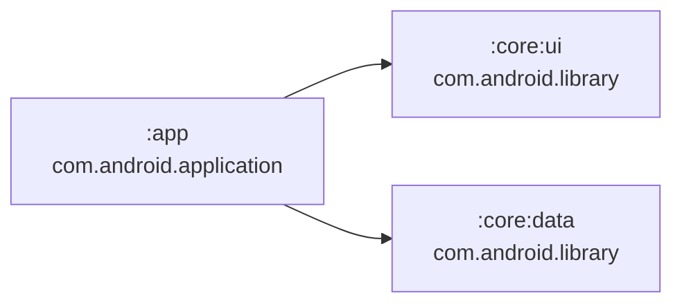
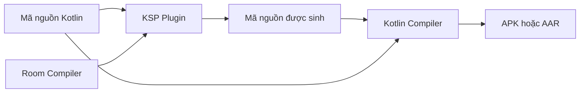
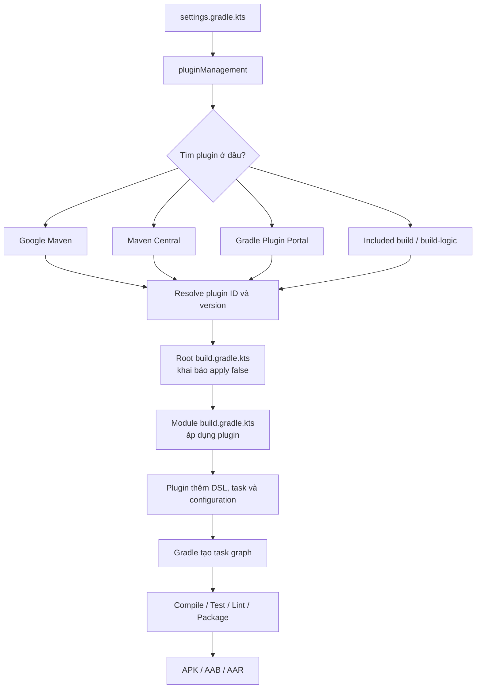
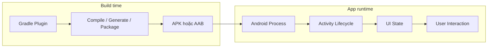
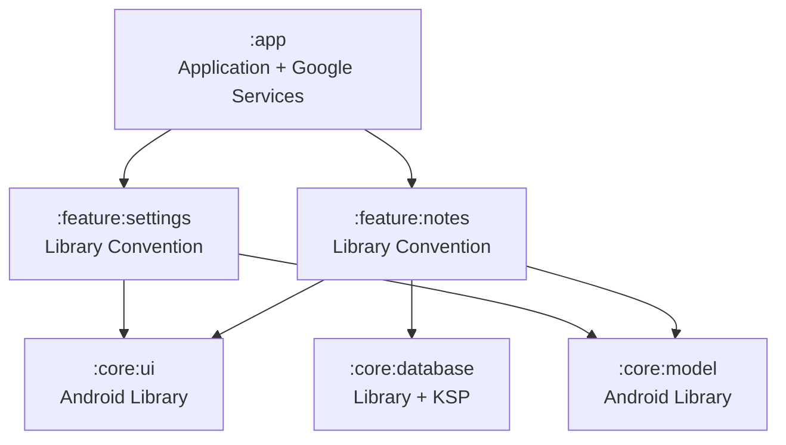

# 026 — Plugins trong Gradle Android

[](https://docs.gradle.org/current/userguide/plugin_basics.html?utm_source=chatgpt.com) 

| Thông tin               | Nội dung                               |
| ----------------------- | -------------------------------------- |
| **Học phần**            | 01 — Language and Android Fundamentals |
| **Module**              | Module 02 — Android Fundamentals       |
| **Nhóm nội dung**       | Gradle                                 |
| **Nguồn roadmap**       | Android Fundamentals / Gradle          |
| **Loại bài**            | Lesson                                 |
| **Thứ tự trong module** | 026                                    |
| **Thời lượng gợi ý**    | 24 phút                                |

---

## 1. Tóm tắt

Trong Gradle, **plugin** là một gói logic có thể tái sử dụng để mở rộng khả năng của hệ thống build.

Plugin có thể:

* Thêm các task mới như `assembleDebug`, `test`, `lint`.
* Thêm cấu hình như `implementation`, `debugImplementation`.
* Thêm DSL mới như `android {}`, `publishing {}`.
* Tạo mã nguồn, tài nguyên hoặc metadata.
* Đóng gói ứng dụng thành APK, App Bundle hoặc thư viện AAR.

Gradle cung cấp phần lõi để quản lý project, dependency và task; phần lớn khả năng xây dựng Java, Kotlin hoặc Android được bổ sung thông qua plugin. ([Gradle Documentation][1])

> **Mô hình dễ nhớ**
>
> * **Gradle**: động cơ build.
> * **Plugin**: bộ công cụ lắp vào động cơ.
> * **Build script**: hướng dẫn sử dụng công cụ.
> * **Task**: công việc cụ thể được thực thi.
> * **APK/AAB/AAR**: sản phẩm đầu ra.

---

## 2. Ảnh minh họa


*Nguồn: Gradle User Manual — Plugin Basics.* 

Sơ đồ cho thấy plugin không phải là thư viện chạy bên trong ứng dụng. Plugin tham gia vào **quá trình build**, bổ sung task và cấu hình để Gradle biến mã nguồn thành kết quả như APK, JAR, file test hoặc artifact được publish.

---

## 3. Mục tiêu học tập

Sau bài học, anh có thể:

* Giải thích plugin Gradle bằng ngôn ngữ của mình.
* Phân biệt **plugin** với **dependency**.
* Đọc và hiểu khối `plugins {}`.
* Phân biệt plugin ở project gốc và plugin ở từng module.
* Quản lý phiên bản plugin bằng Version Catalog.
* Hiểu ý nghĩa của `apply false`.
* Biết plugin tác động thế nào đến build, test và release.
* Nhận biết lỗi thường gặp khi thêm hoặc nâng cấp plugin.
* Tạo một artifact nhỏ để đưa vào portfolio.

---

# 4. Khái niệm chính

## 4.1. Plugin là gì?

Plugin là một thành phần phần mềm được Gradle áp dụng vào project hoặc module để bổ sung logic build.

Ví dụ:

```kotlin
plugins {
    id("com.android.application")
}
```

Dòng trên áp dụng Android Application Plugin vào module hiện tại. Sau khi plugin được áp dụng, module có thể sử dụng DSL:

```kotlin
android {
    namespace = "com.example.plugindemo"
    compileSdk = 36
}
```

Nếu không có `com.android.application`, Gradle sẽ không hiểu khối `android {}` và không biết cách biên dịch module thành ứng dụng Android.

Android Studio sử dụng Gradle làm nền tảng build, còn Android Gradle Plugin bổ sung những khả năng riêng cho Android như xử lý manifest, resource, build variant và đóng gói ứng dụng. ([Android Developers][2])

---

## 4.2. Plugin có thể bổ sung những gì?

Một plugin có thể thêm vào project:

| Thành phần              | Ví dụ                                             |
| ----------------------- | ------------------------------------------------- |
| **Task**                | `assembleDebug`, `lintDebug`, `testDebugUnitTest` |
| **DSL**                 | `android {}`, `ksp {}`, `publishing {}`           |
| **Configuration**       | `implementation`, `debugImplementation`, `ksp`    |
| **Source generation**   | Mã nguồn do Room, Moshi hoặc Hilt sinh ra         |
| **Resource generation** | Resource được tạo từ file cấu hình                |
| **Variant handling**    | `debug`, `release`, product flavor                |
| **Packaging**           | APK, AAB, AAR hoặc JAR                            |
| **Quality checks**      | Lint, format, static analysis                     |
| **Publishing**          | Đưa thư viện lên Maven repository                 |

Gradle mô tả plugin là thành phần có thể thêm task, configuration và DSL vào build. ([Gradle Documentation][1])

---

## 4.3. Plugin khác dependency như thế nào?

Đây là điểm người mới rất dễ nhầm.

| Tiêu chí                         | Plugin                                | Dependency                     |
| -------------------------------- | ------------------------------------- | ------------------------------ |
| **Mục đích**                     | Thay đổi hoặc mở rộng quá trình build | Cung cấp code/API cho ứng dụng |
| **Khai báo trong**               | `plugins {}`                          | `dependencies {}`              |
| **Hoạt động chủ yếu**            | Build time                            | Compile time hoặc runtime      |
| **Ví dụ**                        | `com.android.application`             | `androidx.core:core-ktx`       |
| **Có thể thêm task**             | Có                                    | Thông thường không             |
| **Có thể thêm DSL**              | Có                                    | Không                          |
| **Có thể được đóng gói vào APK** | Thông thường không                    | Có thể có                      |
| **Ảnh hưởng**                    | Cách ứng dụng được xây dựng           | Chức năng mà ứng dụng sử dụng  |

Ví dụ:

```kotlin
plugins {
    // Plugin: cấu hình cách module được build.
    id("com.android.application")
}

dependencies {
    // Dependency: thư viện được ứng dụng sử dụng.
    implementation("androidx.core:core-ktx:1.17.0")
}
```

Có thể hình dung:

```text
Plugin      → hướng dẫn nhà máy sản xuất sản phẩm
Dependency  → nguyên liệu hoặc linh kiện nằm trong sản phẩm
```

---

# 5. Các plugin phổ biến trong Android

## 5.1. Android Application Plugin

```kotlin
plugins {
    id("com.android.application")
}
```

Dùng cho module tạo ra ứng dụng cài được trên thiết bị.

Ví dụ:

```text
:app
```

Đầu ra thường là:

* APK.
* Android App Bundle.
* Test APK.
* Mapping file của R8.
* Resource và manifest đã được xử lý.

---

## 5.2. Android Library Plugin

```kotlin
plugins {
    id("com.android.library")
}
```

Dùng cho module thư viện Android.

Ví dụ:

```text
:core:ui
:core:network
:feature:profile
```

Đầu ra chính là AAR để module khác sử dụng.



---

## 5.3. KSP Plugin

```kotlin
plugins {
    id("com.google.devtools.ksp")
}
```

KSP được dùng khi một thư viện cần phân tích symbol Kotlin và sinh mã nguồn.

Ví dụ:

```kotlin
dependencies {
    implementation("androidx.room:room-runtime:<version>")
    ksp("androidx.room:room-compiler:<version>")
}
```

KSP nên được áp dụng ở module thật sự sử dụng processor. Tài liệu Kotlin cũng khuyến nghị đặt plugin KSP tại module cần xử lý thay vì áp dụng không cần thiết cho toàn bộ project. ([Kotlin][3])



---

## 5.4. Google Services Plugin

```kotlin
plugins {
    id("com.google.gms.google-services")
}
```

Plugin này thường được dùng khi tích hợp Firebase hoặc Google Services.

Nó đọc `google-services.json`, đối chiếu package name và chuyển các giá trị cần thiết thành Android resource. ([Google for Developers][4])

Cấu trúc thường gặp:

```text
project/
├── app/
│   ├── google-services.json
│   └── build.gradle.kts
└── build.gradle.kts
```

Không nên áp dụng plugin này vào mọi module thư viện:

```kotlin
// app/build.gradle.kts
plugins {
    id("com.android.application")
    id("com.google.gms.google-services")
}
```

---

## 5.5. Convention Plugin

Convention plugin chứa những quy ước build dùng chung cho nhiều module.

Ví dụ project có 20 module thư viện và mỗi module đều lặp lại:

```kotlin
android {
    compileSdk = 36

    defaultConfig {
        minSdk = 24
    }

    compileOptions {
        sourceCompatibility = JavaVersion.VERSION_17
        targetCompatibility = JavaVersion.VERSION_17
    }
}
```

Ta có thể chuyển cấu hình này thành plugin riêng:

```kotlin
plugins {
    id("khankh.android.library")
}
```

Convention plugin giúp:

* Tránh copy-paste.
* Đồng nhất cấu hình giữa các module.
* Nâng cấp Java, SDK hoặc lint ở một nơi.
* Giảm nguy cơ một module bị cấu hình lệch.
* Làm file `build.gradle.kts` ngắn và dễ đọc hơn.

Gradle khuyến nghị convention plugin thay cho việc lạm dụng các khối toàn cục `allprojects {}` hoặc `subprojects {}`. Convention plugin có thể được đặt trong `buildSrc/` hoặc một included build như `build-logic/`; `build-logic/` phù hợp hơn với project nhiều module và tổ chức lớn. ([Gradle Documentation][5])

---

# 6. Plugin nằm ở đâu trong project?

Một project Android hiện đại có thể có cấu trúc:

```text
PluginDemo/
├── settings.gradle.kts
├── build.gradle.kts
├── gradle/
│   ├── libs.versions.toml
│   └── wrapper/
│       └── gradle-wrapper.properties
│
├── app/
│   └── build.gradle.kts
│
├── core/
│   ├── ui/
│   │   └── build.gradle.kts
│   └── data/
│       └── build.gradle.kts
│
└── build-logic/
    └── convention/
```

Mỗi file có trách nhiệm khác nhau:

| File                           | Trách nhiệm                                   |
| ------------------------------ | --------------------------------------------- |
| `settings.gradle.kts`          | Khai báo module và nơi Gradle tìm plugin      |
| `build.gradle.kts` cấp project | Khai báo plugin dùng chung nhưng chưa áp dụng |
| `libs.versions.toml`           | Tập trung ID và phiên bản plugin              |
| `app/build.gradle.kts`         | Áp dụng plugin cho module ứng dụng            |
| `core/ui/build.gradle.kts`     | Áp dụng plugin cho module thư viện            |
| `gradle-wrapper.properties`    | Chọn phiên bản Gradle                         |
| `build-logic/`                 | Chứa convention plugin của project            |

---

# 7. Luồng Gradle tìm và áp dụng plugin



Quy trình tổng quát:

1. Gradle đọc `settings.gradle.kts`.
2. `pluginManagement` xác định repository dùng để tìm plugin.
3. Gradle resolve plugin ID và phiên bản.
4. Plugin được áp dụng cho module tương ứng.
5. Plugin đăng ký DSL, task và configuration.
6. Gradle tạo task graph.
7. Các task cần thiết được thực thi.
8. Artifact được tạo ra.

Khối `pluginManagement {}` phải nằm đầu `settings.gradle.kts` và có thể cấu hình repository, phiên bản mặc định cũng như chiến lược phân giải plugin. ([Gradle Documentation][6])

---

# 8. Cấu hình `pluginManagement`

## `settings.gradle.kts`

```kotlin
pluginManagement {
    repositories {
        google()
        mavenCentral()
        gradlePluginPortal()
    }
}

dependencyResolutionManagement {
    repositoriesMode.set(
        RepositoriesMode.FAIL_ON_PROJECT_REPOS
    )

    repositories {
        google()
        mavenCentral()
    }
}

rootProject.name = "PluginDemo"

include(":app")
include(":core:ui")
include(":core:data")
```

Cần phân biệt hai nhóm repository:

```text
pluginManagement.repositories
└── Nơi tải Gradle plugin

dependencyResolutionManagement.repositories
└── Nơi tải library dependency
```

Ví dụ:

```text
com.android.application
→ Plugin

androidx.core:core-ktx
→ Dependency
```

Một số repository có thể chứa cả hai loại artifact, nhưng Gradle vẫn quản lý hai quá trình resolution riêng.

---

# 9. Khai báo plugin trực tiếp

## 9.1. Project-level `build.gradle.kts`

```kotlin
plugins {
    id("com.android.application") version "9.3.0" apply false
    id("com.android.library") version "9.3.0" apply false
}
```

## 9.2. Module-level `app/build.gradle.kts`

```kotlin
plugins {
    id("com.android.application")
}

android {
    namespace = "com.example.plugindemo"
    compileSdk = 36

    defaultConfig {
        applicationId = "com.example.plugindemo"
        minSdk = 24
        targetSdk = 36

        versionCode = 1
        versionName = "1.0"
    }
}
```

Phiên bản plugin đã được khai báo ở project gốc nên module không phải lặp lại phiên bản.

---

# 10. `apply false` có nghĩa là gì?

Xét cấu hình:

```kotlin
plugins {
    id("com.android.application") version "9.3.0" apply false
}
```

`apply false` nghĩa là:

* Gradle biết ID và phiên bản plugin.
* Plugin được đưa vào phạm vi có thể sử dụng của build.
* Plugin **chưa được áp dụng** vào project gốc.
* Plugin chưa thêm `android {}` hoặc task Android vào project gốc.
* Module con có thể áp dụng plugin mà không cần ghi lại phiên bản.

Sau đó trong module:

```kotlin
plugins {
    id("com.android.application")
}
```

Có thể hình dung:

```text
Project gốc:
"Project này cho phép dùng AGP 9.3.0."

Module :app:
"Module này thực sự sử dụng Android Application Plugin."
```

Không nên bỏ `apply false` một cách tùy tiện:

```kotlin
// Không nên áp dụng Android Application Plugin cho root project.
plugins {
    id("com.android.application") version "9.3.0"
}
```

Project gốc thường không chứa Android source set và cũng không phải là module ứng dụng.

---

# 11. Quản lý plugin bằng Version Catalog

Với project nhiều module, nên tập trung phiên bản plugin vào:

```text
gradle/libs.versions.toml
```

Android Developers hướng dẫn khai báo plugin trong Version Catalog và sử dụng `alias(...)` trong build script. Tên alias dạng kebab-case như `android-application` cũng hỗ trợ code completion tốt hơn. ([Android Developers][7])

## 11.1. `libs.versions.toml`

```toml
[versions]
agp = "9.3.0"
google-services = "4.5.0"

[plugins]
android-application = {
    id = "com.android.application",
    version.ref = "agp"
}

android-library = {
    id = "com.android.library",
    version.ref = "agp"
}

google-services = {
    id = "com.google.gms.google-services",
    version.ref = "google-services"
}
```

## 11.2. Project-level `build.gradle.kts`

```kotlin
plugins {
    alias(libs.plugins.android.application) apply false
    alias(libs.plugins.android.library) apply false
    alias(libs.plugins.google.services) apply false
}
```

Quy tắc chuyển alias:

```text
android-application
        ↓
libs.plugins.android.application
```

## 11.3. `app/build.gradle.kts`

```kotlin
plugins {
    alias(libs.plugins.android.application)
    alias(libs.plugins.google.services)
}

android {
    namespace = "com.example.plugindemo"
    compileSdk = 36

    defaultConfig {
        applicationId = "com.example.plugindemo"
        minSdk = 24
        targetSdk = 36
        versionCode = 1
        versionName = "1.0"
    }
}
```

## 11.4. `core/ui/build.gradle.kts`

```kotlin
plugins {
    alias(libs.plugins.android.library)
}

android {
    namespace = "com.example.core.ui"
    compileSdk = 36

    defaultConfig {
        minSdk = 24
    }
}
```

Nhờ Version Catalog, khi nâng cấp AGP, chỉ cần thay đổi một dòng:

```toml
[versions]
agp = "9.3.0"
```

---

# 12. Lưu ý quan trọng với AGP 9 và Kotlin

Từ Android Gradle Plugin 9.0, hỗ trợ Kotlin được tích hợp và bật mặc định. Sau khi đã migration sang built-in Kotlin, project không còn phải áp dụng `org.jetbrains.kotlin.android` hoặc `kotlin-android` chỉ để biên dịch Kotlin trong module Android. ([Android Developers][8])

Ví dụ với AGP 9:

```kotlin
plugins {
    alias(libs.plugins.android.application)

    // Thông thường không còn cần:
    // id("org.jetbrains.kotlin.android")
}
```

Tuy nhiên:

* Project AGP 8.x trở xuống vẫn có thể cần Kotlin Android Plugin.
* Một số plugin cũ có thể chưa tương thích với DSL hoặc Variant API mới.
* Không nên xóa Kotlin plugin trước khi hoàn thành migration.
* Cần chạy toàn bộ test và build variant sau khi nâng cấp.

> **Không sao chép máy móc cấu hình AGP 9 vào project AGP 8.**

---

# 13. Tương thích giữa AGP và Gradle

Plugin không hoạt động độc lập. Một project Android thường phải bảo đảm tương thích giữa:

```text
Android Studio
      ↓
Android Gradle Plugin
      ↓
Gradle Wrapper
      ↓
JDK
      ↓
Kotlin / KSP / plugin bên thứ ba
```

Ví dụ, tài liệu Android Developers hiện minh họa AGP `9.3.0`; bảng tương thích ghi AGP 9.3 yêu cầu Gradle tối thiểu `9.5.0`. ([Android Developers][2])

Kiểm tra Gradle Wrapper tại:

```properties
# gradle/wrapper/gradle-wrapper.properties

distributionUrl=https\://services.gradle.org/distributions/gradle-9.5.0-bin.zip
```

Không nên dùng phiên bản động:

```kotlin
plugins {
    // Không nên
    id("com.android.application") version "9.3.+"
}
```

Phiên bản động có thể khiến máy local và CI resolve ra các phiên bản khác nhau, gây build không ổn định. Android Developers cũng cảnh báo không sử dụng version động cho AGP. ([Android Developers][2])

---

# 14. Plugin và lifecycle Android

Plugin Gradle hoạt động trong **build lifecycle**, không chạy trực tiếp trong lifecycle của `Activity`, `Fragment` hoặc `Composable`.



Do đó, plugin không trực tiếp xử lý:

* Rotate màn hình.
* `onCreate()` hoặc `onDestroy()`.
* State của Compose.
* Network request khi ứng dụng đang chạy.
* Dữ liệu người dùng trong ViewModel.

Tuy nhiên, plugin có thể **gián tiếp ảnh hưởng runtime**:

* Plugin sinh sai code làm chức năng hoạt động sai.
* Plugin xử lý resource sai làm thiếu configuration.
* Plugin shrink hoặc obfuscate sai làm release crash.
* Plugin Firebase đọc nhầm file cấu hình làm dịch vụ không kết nối đúng project.
* Plugin signing hoặc packaging sai khiến không thể phát hành ứng dụng.

Plugin mở rộng AGP cũng có thể tương tác với variant, generated source và artifact trong quá trình build. ([Android Developers][9])

---

# 15. Ví dụ project thực tế

Giả sử xây dựng ứng dụng ghi chú:

```text
NoteApp/
├── app/
├── core/
│   ├── ui/
│   ├── database/
│   └── model/
└── feature/
    ├── notes/
    └── settings/
```

Có thể phân bổ plugin như sau:

| Module              | Plugin                           | Lý do                       |
| ------------------- | -------------------------------- | --------------------------- |
| `:app`              | `com.android.application`        | Tạo APK/AAB                 |
| `:app`              | `com.google.gms.google-services` | Cấu hình Firebase           |
| `:core:ui`          | `com.android.library`            | Tạo thư viện UI             |
| `:core:model`       | `com.android.library`            | Chứa model dùng chung       |
| `:core:database`    | `com.android.library`            | Module Android Library      |
| `:core:database`    | `com.google.devtools.ksp`        | Room sinh code              |
| `:feature:notes`    | Convention plugin                | Dùng cấu hình feature chuẩn |
| `:feature:settings` | Convention plugin                | Dùng cấu hình feature chuẩn |



Điểm quan trọng là **không phải module nào cũng cần tất cả plugin**.

---

# 16. Sai lầm thường gặp của lập trình viên mới

## 16.1. Áp dụng plugin vào sai module

Sai:

```kotlin
// core/model/build.gradle.kts
plugins {
    id("com.android.application")
}
```

Nếu `core:model` chỉ là thư viện, nên dùng:

```kotlin
plugins {
    id("com.android.library")
}
```

---

## 16.2. Nhầm plugin với dependency

Sai:

```kotlin
dependencies {
    implementation("com.android.application")
}
```

Đúng:

```kotlin
plugins {
    id("com.android.application")
}
```

---

## 16.3. Khai báo phiên bản ở mọi module

Không nên:

```kotlin
// app
plugins {
    id("com.android.application") version "9.3.0"
}

// feature/profile
plugins {
    id("com.android.library") version "9.3.0"
}

// core/ui
plugins {
    id("com.android.library") version "9.3.0"
}
```

Nên tập trung bằng Version Catalog:

```toml
[versions]
agp = "9.3.0"
```

---

## 16.4. Quên repository chứa plugin

Triệu chứng:

```text
Plugin [id: 'some.plugin'] was not found
```

Kiểm tra:

```kotlin
pluginManagement {
    repositories {
        google()
        mavenCentral()
        gradlePluginPortal()
    }
}
```

---

## 16.5. Nhầm ý nghĩa của `apply false`

Sai:

```kotlin
// app/build.gradle.kts
plugins {
    alias(libs.plugins.android.application) apply false
}
```

Plugin chưa được áp dụng nên module không có DSL `android {}`.

Đúng:

```kotlin
// Root build.gradle.kts
plugins {
    alias(libs.plugins.android.application) apply false
}
```

```kotlin
// app/build.gradle.kts
plugins {
    alias(libs.plugins.android.application)
}
```

---

## 16.6. Nâng cấp plugin nhưng không nâng Gradle Wrapper

Triệu chứng thường gặp:

```text
Minimum supported Gradle version is ...
Current version is ...
```

Cần kiểm tra đồng thời:

```text
AGP version
Gradle Wrapper version
JDK version
Android Studio version
Kotlin/KSP version
```

---

## 16.7. Trộn DSL mới và cách khai báo cũ

Cách cũ:

```kotlin
buildscript {
    dependencies {
        classpath("com.android.tools.build:gradle:<version>")
    }
}

apply(plugin = "com.android.application")
```

Cách hiện đại:

```kotlin
plugins {
    id("com.android.application")
}
```

Không nên trộn hai cách nếu không có lý do tương thích rõ ràng.

---

## 16.8. Cài plugin chỉ vì tutorial có dùng

Trước khi thêm plugin, cần trả lời:

1. Plugin giải quyết vấn đề gì?
2. Module nào thật sự cần plugin?
3. Plugin có được duy trì không?
4. Có tương thích với AGP hiện tại không?
5. Plugin thêm task hoặc generated code nào?
6. Có ảnh hưởng configuration time không?
7. Có rủi ro với release build không?
8. Có thể thay bằng tính năng có sẵn không?

---

# 17. Debug plugin

## 17.1. Xem danh sách task

```bash
./gradlew :app:tasks --all
```

Lệnh này giúp quan sát các task được plugin thêm vào.

Ví dụ:

```text
assembleDebug
assembleRelease
bundleRelease
lintDebug
testDebugUnitTest
```

---

## 17.2. Build kèm stack trace

```bash
./gradlew :app:assembleDebug --stacktrace
```

Log chi tiết hơn:

```bash
./gradlew :app:assembleDebug --stacktrace --info
```

---

## 17.3. Kiểm tra môi trường Gradle

```bash
./gradlew --version
```

Kết quả giúp kiểm tra:

* Gradle version.
* Kotlin version của Gradle.
* JVM version.
* Hệ điều hành.

---

## 17.4. Kiểm tra dependency của build

```bash
./gradlew buildEnvironment
```

Hoặc cho một module:

```bash
./gradlew :app:buildEnvironment
```

---

## 17.5. Kiểm tra dependency của ứng dụng

```bash
./gradlew :app:dependencies
```

Lệnh này hữu ích khi plugin thêm hoặc thay đổi configuration dependency.

Google Services Plugin cũng có thể được kiểm tra thông qua dependency report và generated resource. ([Google for Developers][4])

---

## 17.6. Kiểm tra generated code

Với KSP, kiểm tra thư mục:

```text
app/build/generated/ksp/
```

Ví dụ:

```text
app/build/generated/ksp/debug/kotlin/
app/build/generated/ksp/release/kotlin/
```

Nếu generated code không xuất hiện, kiểm tra:

* Plugin KSP đã áp dụng chưa.
* Processor đã đặt trong configuration `ksp(...)` chưa.
* Phiên bản KSP có tương thích với Kotlin không.
* Build variant hiện tại có đúng không.
* Có lỗi processor trong Gradle log không.

---

# 18. Ảnh hưởng đến UX, reliability và maintainability

| Khía cạnh             | Plugin có thể ảnh hưởng thế nào?                                    |
| --------------------- | ------------------------------------------------------------------- |
| **UX**                | Resource hoặc code generation sai có thể làm tính năng hiển thị sai |
| **Reliability**       | Plugin không tương thích có thể làm CI hoặc release build thất bại  |
| **Maintainability**   | Version Catalog và convention plugin giảm cấu hình lặp              |
| **Performance build** | Plugin nặng có thể làm sync và configuration chậm                   |
| **Testing**           | Plugin có thể thêm task test, lint hoặc coverage                    |
| **Security**          | Plugin bên thứ ba chạy code trong quá trình build                   |
| **Release**           | Plugin ảnh hưởng signing, shrink, packaging và publishing           |
| **Team workflow**     | Phiên bản cố định giúp local và CI dùng cùng công cụ                |

Một plugin được thêm vào build có khả năng thực thi logic trên máy developer và CI. Vì vậy, cần xem plugin như một phần của chuỗi cung ứng phần mềm, không chỉ là một dòng cấu hình vô hại.

---

# 19. Thực hành 24 phút

## Phần 1 — Quan sát plugin hiện tại: 5 phút

Mở:

```text
build.gradle.kts
app/build.gradle.kts
gradle/libs.versions.toml
settings.gradle.kts
```

Trả lời:

* Plugin nào được khai báo?
* Plugin nào có `apply false`?
* Plugin nào thực sự được áp dụng vào `:app`?
* Phiên bản plugin nằm ở đâu?
* Plugin repository được cấu hình ở đâu?

---

## Phần 2 — Tạo Android Library Module: 7 phút

Tạo module:

```text
:core:utils
```

Áp dụng plugin:

```kotlin
plugins {
    alias(libs.plugins.android.library)
}

android {
    namespace = "com.example.core.utils"
    compileSdk = 36

    defaultConfig {
        minSdk = 24
    }
}
```

Thêm vào `settings.gradle.kts` nếu IDE chưa tự thêm:

```kotlin
include(":core:utils")
```

---

## Phần 3 — Quan sát task do plugin tạo: 5 phút

Chạy:

```bash
./gradlew :core:utils:tasks --all
```

Tìm các task:

```text
assembleDebug
assembleRelease
lintDebug
testDebugUnitTest
```

Ghi lại ít nhất ba task mà Android Library Plugin đã thêm.

---

## Phần 4 — Thử tạo lỗi có chủ đích: 3 phút

Tạm thời bỏ plugin:

```kotlin
plugins {
    // alias(libs.plugins.android.library)
}
```

Quan sát lỗi tại:

```kotlin
android {
    // Gradle không còn hiểu DSL này.
}
```

Sau đó khôi phục plugin.

---

## Phần 5 — Viết README: 4 phút

Tạo:

```text
docs/gradle-plugins.md
```

Nội dung gồm:

* Định nghĩa plugin.
* Plugin đang dùng.
* Vị trí quản lý phiên bản.
* Sơ đồ module.
* Một lỗi đã thử tạo.
* Cách debug lỗi đó.

---

# 20. Ghi chú năm dòng về Plugins

```markdown
1. Gradle plugin là một gói logic mở rộng khả năng của hệ thống build.
2. Plugin có thể thêm task, DSL, configuration hoặc generated source.
3. Plugin được khai báo trong `plugins {}`, còn thư viện nằm trong `dependencies {}`.
4. Phiên bản plugin nên được quản lý tập trung bằng Version Catalog.
5. Chỉ áp dụng plugin cho những module thật sự cần nó.
```

---

# 21. Artifact nhỏ cho portfolio

## Tên artifact

```text
Gradle Plugin Architecture Demo
```

## Nội dung đề xuất

```text
gradle-plugin-demo/
├── README.md
├── settings.gradle.kts
├── build.gradle.kts
├── gradle/
│   └── libs.versions.toml
├── app/
│   └── build.gradle.kts
├── core/
│   └── utils/
│       └── build.gradle.kts
└── docs/
    ├── plugin-flow.md
    └── screenshots/
        ├── app-tasks.png
        └── library-tasks.png
```

## README nên giải thích

````markdown
# Gradle Plugin Architecture Demo

## Mục tiêu

Minh họa cách khai báo, quản lý phiên bản và áp dụng Gradle plugin
trong một project Android nhiều module.

## Plugin được sử dụng

- `com.android.application` cho `:app`.
- `com.android.library` cho `:core:utils`.

## Quản lý phiên bản

Phiên bản plugin được tập trung trong `gradle/libs.versions.toml`.

## Kiểm tra

```bash
./gradlew :app:assembleDebug
./gradlew :core:utils:assembleDebug
./gradlew test
./gradlew lint
````

## Điều đã học

Plugin cấu hình quá trình build, còn dependency cung cấp code cho ứng dụng.

````

---

# 22. Bài tập

## Bài 1 — Giải thích khái niệm

Viết khoảng 100–150 từ trả lời:

> Gradle plugin là gì và tại sao Android cần Android Gradle Plugin?

---

## Bài 2 — So sánh

Điền bảng:

| Câu lệnh | Plugin hay dependency? | Tác dụng |
|---|---|---|
| `id("com.android.application")` |  |  |
| `implementation("androidx.core:core-ktx:...")` |  |  |
| `id("com.google.devtools.ksp")` |  |  |
| `ksp("androidx.room:room-compiler:...")` |  |  |

### Đáp án gợi ý

| Câu lệnh | Loại | Tác dụng |
|---|---|---|
| `id("com.android.application")` | Plugin | Biến module thành Android application |
| `implementation(...)` | Dependency | Thêm thư viện vào compile/runtime classpath |
| `id("com.google.devtools.ksp")` | Plugin | Kích hoạt quá trình symbol processing |
| `ksp(...)` | Processor dependency | Chỉ định processor mà KSP sẽ chạy |

---

## Bài 3 — Thực hành

Tạo hai module:

```text
:app
:core:designsystem
````

Yêu cầu:

```text
:app
└── com.android.application

:core:designsystem
└── com.android.library
```

Quản lý hai plugin bằng `libs.versions.toml`.

---

## Bài 4 — Phân tích lỗi

Giải thích lỗi trong cấu hình:

```kotlin
// app/build.gradle.kts
plugins {
    alias(libs.plugins.android.application) apply false
}

android {
    namespace = "com.example.app"
}
```

### Đáp án

Plugin chỉ được khai báo nhưng chưa áp dụng vào module. Vì vậy DSL `android {}` không tồn tại trong module này.

Sửa thành:

```kotlin
plugins {
    alias(libs.plugins.android.application)
}
```

---

# 23. Checklist production

## Trước khi thêm plugin

* [ ] Plugin giải quyết một nhu cầu rõ ràng.
* [ ] Đã đọc tài liệu chính thức.
* [ ] Đã kiểm tra nguồn phát hành plugin.
* [ ] Đã kiểm tra phiên bản tương thích.
* [ ] Chỉ áp dụng vào module cần thiết.
* [ ] Không sử dụng version động.
* [ ] Đã xem plugin thêm task hoặc generated output nào.

## Khi nâng cấp plugin

* [ ] Đọc release notes.
* [ ] Kiểm tra AGP–Gradle–JDK compatibility.
* [ ] Tạo branch riêng cho việc nâng cấp.
* [ ] Sync project thành công.
* [ ] Build `debug` thành công.
* [ ] Build `release` thành công.
* [ ] Chạy unit test.
* [ ] Chạy instrumentation test.
* [ ] Chạy lint.
* [ ] Kiểm tra generated code.
* [ ] Kiểm tra APK/AAB.
* [ ] Chạy pipeline CI.
* [ ] Không cập nhật nhiều plugin lớn cùng lúc nếu không cần thiết.

## Trước khi release

* [ ] `./gradlew clean` thành công.
* [ ] `./gradlew test` thành công.
* [ ] `./gradlew lint` thành công.
* [ ] `./gradlew :app:assembleRelease` thành công.
* [ ] `./gradlew :app:bundleRelease` thành công.
* [ ] Firebase/Google Services dùng đúng project.
* [ ] Signing configuration đúng.
* [ ] R8 mapping được lưu.
* [ ] Release artifact được smoke test trên thiết bị thật.

---

# 24. Checklist hoàn thành bài học

* [ ] Có định nghĩa ngắn gọn về plugin.
* [ ] Phân biệt được plugin và dependency.
* [ ] Hiểu vai trò của `com.android.application`.
* [ ] Hiểu vai trò của `com.android.library`.
* [ ] Hiểu `apply false`.
* [ ] Biết cấu hình `pluginManagement`.
* [ ] Biết quản lý plugin bằng Version Catalog.
* [ ] Tạo được một Android Library Module.
* [ ] Quan sát được task do plugin thêm.
* [ ] Biết chạy build với `--stacktrace`.
* [ ] Có README hoặc sơ đồ để đưa vào portfolio.
* [ ] Có ghi chú về testing và release.

---

# 25. Kết luận

Gradle plugin không phải một đoạn cấu hình “ma thuật”. Nó là code tham gia trực tiếp vào hệ thống build.

Một Android developer vững Gradle cần trả lời được:

```text
Plugin này làm gì?
Được lấy từ đâu?
Phiên bản được quản lý ở đâu?
Áp dụng vào module nào?
Nó thêm task hoặc generated output nào?
Có tương thích với AGP và Gradle hiện tại không?
Nếu plugin lỗi, build và người dùng bị ảnh hưởng thế nào?
```

Nguyên tắc quan trọng nhất:

> **Mỗi plugin phải có lý do tồn tại, phạm vi áp dụng rõ ràng và chiến lược phiên bản có thể kiểm soát.**

---

## Tài liệu tham khảo

* [Gradle — Plugin Basics](https://docs.gradle.org/current/userguide/plugin_basics.html)
* [Gradle — Working with Plugins](https://docs.gradle.org/current/userguide/plugins_intermediate.html)
* [Gradle — Convention Plugins](https://docs.gradle.org/current/userguide/implementing_gradle_plugins_convention.html)
* [Android Developers — About Android Gradle Plugin](https://developer.android.com/build/releases/about-agp)
* [Android Developers — Migrate to Version Catalogs](https://developer.android.com/build/migrate-to-catalogs)
* [Android Developers — Migrate to Built-in Kotlin](https://developer.android.com/build/migrate-to-built-in-kotlin)
* [Google Developers — Google Services Gradle Plugin](https://developers.google.com/android/guides/google-services-plugin)
* [Kotlin Documentation — KSP Quickstart](https://kotlinlang.org/docs/ksp-quickstart.html)

[1]: https://docs.gradle.org/current/userguide/plugin_basics.html "Plugin Basics"
[2]: https://developer.android.com/build/releases/about-agp "About Android Gradle plugin  |  Android Studio  |  Android Developers"
[3]: https://kotlinlang.org/docs/ksp-quickstart.html?utm_source=chatgpt.com "Getting started with KSP | Kotlin Documentation"
[4]: https://developers.google.com/android/guides/google-services-plugin?utm_source=chatgpt.com "The Google Services Gradle Plugin  |  Google Play services  |  Google for Developers"
[5]: https://docs.gradle.org/current/userguide/implementing_gradle_plugins_convention.html "Convention Plugins"
[6]: https://docs.gradle.org/current/userguide/plugins_intermediate.html "Working with Plugins"
[7]: https://developer.android.com/build/migrate-to-catalogs "Migrate your build to version catalogs  |  Android Studio  |  Android Developers"
[8]: https://developer.android.com/build/releases/agp-9-0-0-release-notes "Android Gradle plugin 9.0.1 (January 2026)  |  Android Studio  |  Android Developers"
[9]: https://developer.android.com/build/extend-agp?utm_source=chatgpt.com "Write Gradle plugins | Android Studio"

---

# Bài luyện tập

## Mục tiêu


## Đề bài


## Yêu cầu hoàn thành

- [ ] 
- [ ] 
- [ ] 

## Kết quả / lời giải


## Ghi chú
