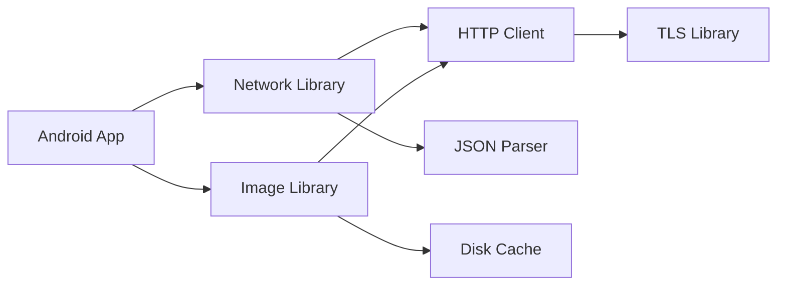
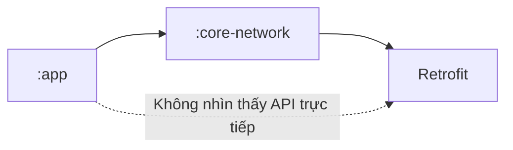
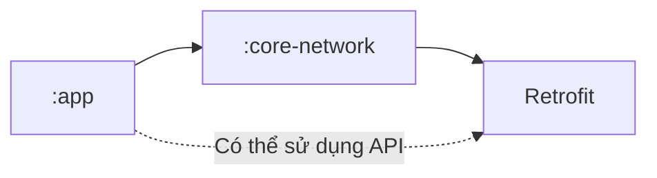
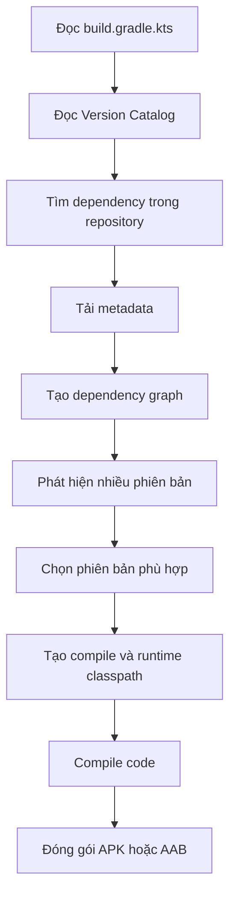
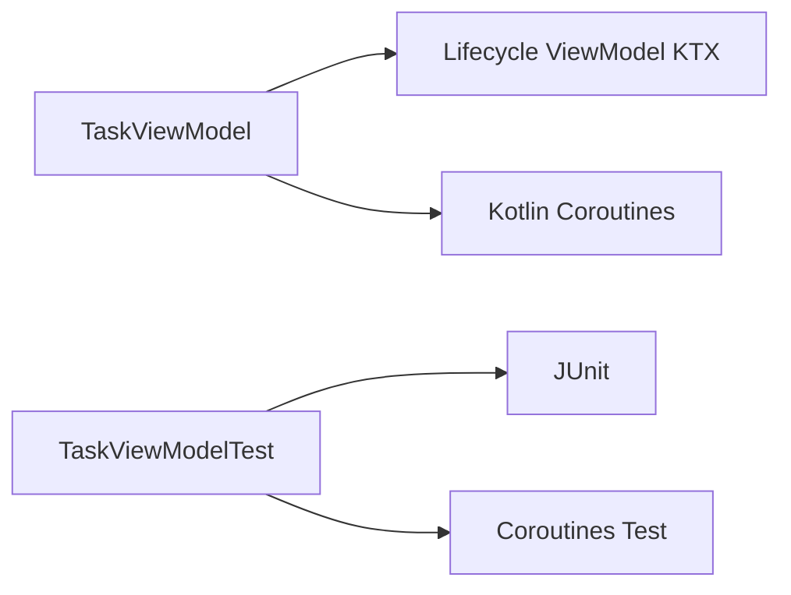
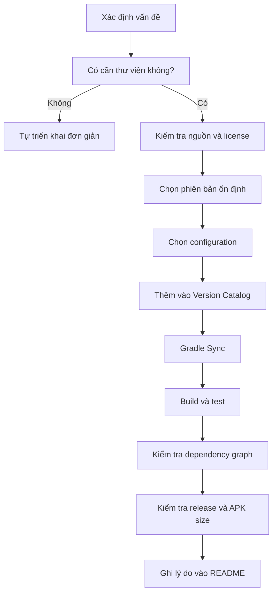

# 027 — Dependencies

**Học phần:** 01 — Language and Android Fundamentals
**Module:** Module 02 — Android Fundamentals
**Nhóm nội dung:** Gradle
**Nguồn roadmap:** Android Fundamentals / Gradle
**Loại bài:** Lesson
**Thứ tự trong module:** 027
**Thời lượng gợi ý:** 24 phút

---

## 1. Tóm tắt

**Dependency** là một thư viện, module, plugin hoặc công cụ mà dự án cần để biên dịch, kiểm thử hoặc chạy ứng dụng.

Ví dụ, thay vì tự viết toàn bộ hệ thống quản lý lifecycle, networking hoặc database, ứng dụng Android có thể sử dụng các thư viện như:

* AndroidX Lifecycle.
* Room.
* Retrofit.
* Kotlin Coroutines.
* Jetpack Compose.
* JUnit và Espresso.

Gradle chịu trách nhiệm tải các thư viện từ repository, xác định phiên bản phù hợp, xây dựng dependency graph và đưa từng dependency vào đúng classpath. Dependency có thể nằm trên máy, trong một module khác của dự án hoặc trong repository từ xa. Những dependency mà thư viện kéo theo cũng có thể được Gradle tự động thêm vào dưới dạng **transitive dependency**.

> **Dependencies trong Gradle không đồng nghĩa với Dependency Injection.**
>
> * **Gradle dependency:** thư viện hoặc module mà dự án cần.
> * **Dependency Injection:** kỹ thuật cung cấp object cho một class, thường được triển khai bằng Hilt, Dagger hoặc thủ công.

---

## 2. Mục tiêu học tập

Sau bài này, anh có thể:

* Giải thích dependency trong dự án Android.
* Phân biệt direct dependency và transitive dependency.
* Hiểu cấu trúc `group:name:version`.
* Sử dụng đúng các configuration như `implementation`, `api`, `testImplementation` và `debugImplementation`.
* Quản lý phiên bản bằng `libs.versions.toml`.
* Phát hiện xung đột dependency bằng Gradle.
* Đánh giá ảnh hưởng của dependency đến UX, độ ổn định, hiệu năng và khả năng bảo trì.
* Tạo một artifact nhỏ để đưa vào portfolio.

---

## 3. Dependency là gì?

Trong Android, dependency có thể là:

| Loại dependency    | Ví dụ                                | Vai trò                                |
| ------------------ | ------------------------------------ | -------------------------------------- |
| Thư viện bên ngoài | Retrofit, Coil, Room                 | Cung cấp API đã được xây dựng sẵn      |
| Thư viện AndroidX  | Lifecycle, Navigation, WorkManager   | Hỗ trợ các thành phần Android hiện đại |
| Module nội bộ      | `:core`, `:data`, `:feature-home`    | Chia dự án thành nhiều phần            |
| Test dependency    | JUnit, Espresso, MockK               | Viết unit test và instrumented test    |
| Plugin             | Android Gradle Plugin, Kotlin, KSP   | Bổ sung khả năng cho quá trình build   |
| Toolchain          | Gradle, Kotlin compiler, Android SDK | Biên dịch và đóng gói ứng dụng         |

Android build có thể phụ thuộc vào thư viện, plugin, subproject, Android SDK, trình biên dịch Kotlin/Java, Android Studio và Gradle. Một dependency cũng có thể tiếp tục phụ thuộc vào nhiều dependency khác.

### Ví dụ khai báo trực tiếp

```kotlin
dependencies {
    implementation("androidx.lifecycle:lifecycle-viewmodel-ktx:VERSION")
}
```

Cấu trúc của dependency:

```text
group:name:version
```

Trong đó:

```text
androidx.lifecycle : lifecycle-viewmodel-ktx : VERSION
└──── group ──────┘ └──────── name ─────────┘ └ version ┘
```

* `group`: tổ chức hoặc namespace phát hành thư viện.
* `name`: tên artifact.
* `version`: phiên bản muốn sử dụng.

Trong dự án thật, `VERSION` phải được thay bằng phiên bản ổn định tương thích với Android Gradle Plugin, Kotlin và các thư viện còn lại.

---

## 4. Dependency nằm ở đâu trong dự án Android?

Một dự án sử dụng Version Catalog thường có cấu trúc:

```text
MyAndroidApp/
├── settings.gradle.kts
├── build.gradle.kts
├── gradle/
│   └── libs.versions.toml
├── app/
│   ├── build.gradle.kts
│   └── src/
├── core/
│   └── build.gradle.kts
└── feature-home/
    └── build.gradle.kts
```

### `settings.gradle.kts`

Xác định repository và các module của dự án:

```kotlin
pluginManagement {
    repositories {
        google()
        mavenCentral()
        gradlePluginPortal()
    }
}

dependencyResolutionManagement {
    repositoriesMode.set(
        RepositoriesMode.FAIL_ON_PROJECT_REPOS
    )

    repositories {
        google()
        mavenCentral()
    }
}

rootProject.name = "DependencyDemo"

include(":app")
include(":core")
include(":feature-home")
```

### `gradle/libs.versions.toml`

Quản lý tập trung tên và phiên bản dependency:

```toml
[versions]
lifecycle = "REPLACE_WITH_STABLE_VERSION"
coroutines = "REPLACE_WITH_STABLE_VERSION"
junit = "REPLACE_WITH_STABLE_VERSION"

[libraries]
androidx-lifecycle-viewmodel-ktx = {
    group = "androidx.lifecycle",
    name = "lifecycle-viewmodel-ktx",
    version.ref = "lifecycle"
}

kotlinx-coroutines-android = {
    group = "org.jetbrains.kotlinx",
    name = "kotlinx-coroutines-android",
    version.ref = "coroutines"
}

junit = {
    group = "junit",
    name = "junit",
    version.ref = "junit"
}
```

### `app/build.gradle.kts`

Sử dụng alias từ Version Catalog:

```kotlin
dependencies {
    implementation(libs.androidx.lifecycle.viewmodel.ktx)
    implementation(libs.kotlinx.coroutines.android)

    testImplementation(libs.junit)
}
```

Android hiện khuyến nghị Version Catalog là cách chính để thêm và quản lý build dependency; dự án mới cũng sử dụng phương pháp này theo mặc định. Version Catalog giúp tập trung phiên bản, cung cấp gợi ý IDE và tạo accessor an toàn kiểu như `libs.androidx.lifecycle.viewmodel.ktx`.

> Version Catalog giúp **khai báo phiên bản mong muốn**, nhưng không tự ép Gradle luôn phải chọn đúng phiên bản đó. Conflict resolution, BOM hoặc dependency constraints vẫn có thể khiến Gradle chọn phiên bản khác.

---

## 5. Direct dependency và transitive dependency

### Direct dependency

Dependency được dự án khai báo trực tiếp:

```kotlin
dependencies {
    implementation("com.example:network-client:2.0.0")
}
```

### Transitive dependency

`network-client` có thể tiếp tục phụ thuộc vào:

```text
network-client
├── http-core
├── json-parser
└── logging-api
```

Ứng dụng chỉ khai báo `network-client`, nhưng Gradle có thể tự tải cả ba thư viện phía dưới.


*Nguồn ảnh: Gradle User Manual.*

### Dependency graph



Trong sơ đồ này:

* `Network Library` và `Image Library` là direct dependencies.
* `HTTP Client`, `JSON Parser`, `Disk Cache` và `TLS Library` là transitive dependencies.
* Cả hai thư viện đều kéo theo `HTTP Client`, nên Gradle phải chọn một phiên bản phù hợp.

Gradle xem xét tất cả phiên bản ứng viên trong dependency graph và thường chọn phiên bản mới hơn khi có xung đột. Tuy nhiên, phiên bản mới hơn có thể không tương thích với thư viện cũ và dẫn đến lỗi compile hoặc runtime.

---

## 6. Các dependency configuration quan trọng

Configuration xác định dependency được sử dụng ở đâu và trong giai đoạn nào.

| Configuration               | Khi nào sử dụng?                                        |
| --------------------------- | ------------------------------------------------------- |
| `implementation`            | Dependency cần cho code production của module           |
| `api`                       | Dependency là một phần API công khai của library module |
| `compileOnly`               | Chỉ cần khi compile, không đóng gói để chạy             |
| `runtimeOnly`               | Chỉ cần khi runtime                                     |
| `testImplementation`        | Dành cho unit test trong `src/test`                     |
| `androidTestImplementation` | Dành cho test chạy trên thiết bị/emulator               |
| `debugImplementation`       | Chỉ có trong debug build                                |
| `releaseImplementation`     | Chỉ có trong release build                              |
| `ksp`                       | Dùng với thư viện tạo code thông qua KSP                |
| `annotationProcessor`       | Annotation processor dành cho Java                      |

### Ví dụ

```kotlin
dependencies {
    // Code ứng dụng
    implementation(libs.androidx.lifecycle.viewmodel.ktx)
    implementation(libs.kotlinx.coroutines.android)

    // Unit test chạy trên JVM
    testImplementation(libs.junit)

    // Test chạy trên thiết bị hoặc emulator
    androidTestImplementation(libs.androidx.junit)
    androidTestImplementation(libs.androidx.espresso.core)

    // Công cụ chỉ dành cho debug
    debugImplementation(libs.androidx.compose.ui.tooling)
}
```

Các configuration giúp Gradle đưa dependency vào đúng compile classpath, runtime classpath hoặc test classpath thay vì làm mọi dependency xuất hiện ở mọi nơi.

---

## 7. `implementation` và `api`

Đây là phần dễ gây nhầm lẫn nhất trong dự án nhiều module.

Giả sử có cấu trúc:

```text
:app
  └── :core-network
          └── Retrofit
```

### Dùng `implementation`

```kotlin
// core-network/build.gradle.kts

dependencies {
    implementation(libs.retrofit.core)
}
```

`:core-network` có thể dùng Retrofit bên trong, nhưng `:app` không nên truy cập trực tiếp các class của Retrofit thông qua module này.



### Dùng `api`

```kotlin
dependencies {
    api(libs.retrofit.core)
}
```

Retrofit được đưa vào API công khai của `:core-network`, vì vậy module sử dụng `:core-network` cũng nhìn thấy Retrofit trên compile classpath.



### Quy tắc thực tế

> Ưu tiên `implementation`. Chỉ dùng `api` khi type của dependency xuất hiện trong API công khai của library module.

Ví dụ cần `api`:

```kotlin
// Hàm public trả về một type thuộc thư viện bên ngoài.
interface NetworkService {
    fun createClient(): ExternalHttpClient
}
```

Nếu `ExternalHttpClient` nằm trong dependency bên ngoài, consumer cần dependency đó để compile.

Sử dụng `implementation` thay vì `api` khi có thể giúp tránh làm rò rỉ dependency sang compile classpath của module khác, giảm số module phải biên dịch lại và giữ ranh giới module rõ ràng hơn.

---

## 8. Dependency theo build variant

Có thể thêm dependency riêng cho từng build type:

```kotlin
dependencies {
    debugImplementation(libs.leakcanary.android)

    releaseImplementation(libs.analytics.release)
}
```

Hoặc theo product flavor:

```kotlin
dependencies {
    freeImplementation(libs.ads.sdk)
    paidImplementation(libs.premium.analytics)
}
```

Android Gradle Plugin cho phép đặt tên build variant hoặc source set trước hậu tố `Implementation`, chẳng hạn `debugImplementation`, `releaseImplementation` hoặc `freeImplementation`.

### Lợi ích

* Không đóng gói công cụ debug vào bản release.
* Tách SDK analytics của production và staging.
* Dùng fake server cho build nội bộ.
* Hạn chế tăng kích thước ứng dụng không cần thiết.

### Rủi ro

Nếu code production sử dụng một class chỉ được khai báo bằng `debugImplementation`, bản debug có thể chạy bình thường nhưng bản release sẽ không compile hoặc có hành vi khác.

---

## 9. Quá trình Gradle xử lý dependency



Một dependency mới không chỉ ảnh hưởng đến dòng code gọi nó. Nó có thể thay đổi:

* Compile classpath.
* Runtime classpath.
* Dependency graph.
* Manifest sau khi merge.
* Số lượng DEX method.
* Kích thước APK/AAB.
* Thời gian build.
* Hành vi của bản release.

---

## 10. Quản lý phiên bản

### Không dùng dynamic version

Không nên viết:

```kotlin
dependencies {
    implementation("com.example:library:2.+")
}
```

Hoặc:

```kotlin
dependencies {
    implementation("com.example:library:+")
}
```

Hai lần build cùng một commit có thể tải hai phiên bản khác nhau khi repository xuất hiện bản phát hành mới.

Android cảnh báo không nên sử dụng dynamic version vì chúng có thể gây cập nhật ngoài dự kiến, khó xác định xung đột phiên bản và ảnh hưởng hiệu năng resolution.

Nên dùng phiên bản cụ thể:

```kotlin
dependencies {
    implementation("com.example:library:2.4.1")
}
```

Tốt hơn nữa, quản lý bằng Version Catalog:

```kotlin
dependencies {
    implementation(libs.example.library)
}
```

---

## 11. BOM — Bill of Materials

Một số hệ sinh thái có nhiều artifact cần sử dụng phiên bản tương thích với nhau, chẳng hạn Jetpack Compose hoặc Firebase.

```kotlin
dependencies {
    implementation(platform(libs.androidx.compose.bom))

    implementation(libs.androidx.compose.ui)
    implementation(libs.androidx.compose.material3)
    implementation(libs.androidx.compose.ui.tooling.preview)
}
```

Khi sử dụng BOM:

* BOM cung cấp tập phiên bản tương thích.
* Các artifact thuộc BOM thường không cần ghi version riêng.
* Việc nâng cấp có thể thực hiện bằng cách đổi phiên bản BOM.

BOM tham gia vào dependency resolution như một platform và cung cấp phiên bản ứng viên cho các thư viện thuộc BOM.

---

## 12. Kiểm tra dependency graph

### Hiển thị toàn bộ dependency của module `app`

Trên macOS hoặc Linux:

```bash
./gradlew :app:dependencies
```

Trên Windows:

```powershell
gradlew.bat :app:dependencies
```

Có thể chỉ định configuration:

```bash
./gradlew :app:dependencies \
  --configuration debugRuntimeClasspath
```

### Tìm lý do một dependency xuất hiện

```bash
./gradlew :app:dependencyInsight \
  --dependency okhttp \
  --configuration debugRuntimeClasspath
```

Lệnh này giúp trả lời:

* Dependency được module nào kéo vào?
* Có bao nhiêu phiên bản được yêu cầu?
* Gradle đã chọn phiên bản nào?
* Phiên bản nào đã bị thay thế?

Android khuyến nghị sử dụng task `dependencies` để xem cây dependency. Trong báo cáo, ký hiệu `->` thường cho biết Gradle đã chọn một phiên bản khác với phiên bản được dependency yêu cầu.

### Ví dụ kết quả

```text
+--- com.example:image-loader:3.0.0
|    \--- com.example:http-client:5.0.0
|
+--- com.example:network-client:2.2.0
|    \--- com.example:http-client:4.8.0 -> 5.0.0
```

Ý nghĩa:

```text
network-client yêu cầu http-client 4.8.0
nhưng Gradle chọn http-client 5.0.0
```

Nếu phiên bản `5.0.0` có breaking change, `network-client` có thể gọi một method không còn tồn tại và gây lỗi runtime.

---

## 13. Dependency và ảnh hưởng đến người dùng

### 13.1 UX

Dependency không được quản lý tốt có thể gây:

* Màn hình mở chậm.
* Ứng dụng tải xuống lớn hơn.
* Animation giật.
* Crash khi vào một user flow cụ thể.
* Một chức năng chỉ lỗi trên bản release.
* Hành vi khác nhau giữa các thiết bị.

### 13.2 Reliability

Một lần nâng cấp dependency có thể thay đổi:

* API.
* Hành vi runtime.
* Permission.
* Manifest component.
* Threading.
* Cách serialize dữ liệu.
* Cách giữ và khôi phục state.

Vì vậy, việc nâng cấp dependency phải được bảo vệ bằng unit test, integration test và kiểm tra các user flow quan trọng. Tài liệu Android cũng nhấn mạnh test tốt là yếu tố quan trọng để tránh việc nâng cấp làm hỏng build hoặc ứng dụng ngoài dự kiến.

### 13.3 Maintainability

Version Catalog giúp tránh tình trạng:

```text
app/build.gradle.kts        → library 2.1.0
core/build.gradle.kts       → library 2.0.4
feature/build.gradle.kts    → library 1.9.8
```

Thay vào đó:

```text
libs.versions.toml
        ↓
Một nguồn quản lý phiên bản chung
        ↓
app / core / feature
```

### 13.4 Kích thước ứng dụng

Có thể sử dụng **APK Analyzer** để xem kích thước file, DEX, resource và manifest trong APK hoặc App Bundle. Công cụ cũng hỗ trợ so sánh hai bản build.


*Nguồn ảnh: Android Developers.*

---

## 14. Dependency và lifecycle/state

Dependency không trực tiếp quyết định lifecycle của Activity hoặc Fragment, nhưng thư viện được thêm vào có thể cung cấp API liên quan đến lifecycle và state.

Ví dụ:

```kotlin
class ProfileViewModel : ViewModel() {

    private val _uiState = MutableStateFlow(ProfileUiState())
    val uiState: StateFlow<ProfileUiState> = _uiState

    fun loadProfile() {
        viewModelScope.launch {
            // Load dữ liệu
        }
    }
}
```

Đoạn code trên cần các dependency phù hợp cho:

* `ViewModel`.
* `viewModelScope`.
* Kotlin Coroutines.
* `StateFlow`.

```kotlin
dependencies {
    implementation(libs.androidx.lifecycle.viewmodel.ktx)
    implementation(libs.kotlinx.coroutines.android)
}
```

Nếu dependency bị thiếu:

```text
Unresolved reference: viewModelScope
```

Nếu các phiên bản không tương thích:

```text
Compile error
hoặc
NoSuchMethodError khi runtime
```

Tuy nhiên, việc thêm dependency không tự động giải quyết lifecycle. Developer vẫn phải:

* Đặt state trong ViewModel khi cần tồn tại qua configuration change.
* Không giữ reference tới Activity trong object sống lâu.
* Hủy hoặc giới hạn coroutine theo lifecycle.
* Kiểm tra quá trình background và restore state.

---

## 15. Ví dụ thực hành: ứng dụng Task nhỏ

### Yêu cầu

Ứng dụng có:

* `TaskViewModel` quản lý state.
* Coroutines xử lý tác vụ bất đồng bộ.
* Unit test cho ViewModel.
* Công cụ debug chỉ xuất hiện trong debug build.

### `app/build.gradle.kts`

```kotlin
plugins {
    alias(libs.plugins.android.application)
    alias(libs.plugins.kotlin.android)
}

android {
    namespace = "com.example.dependencydemo"
    compileSdk = 36

    defaultConfig {
        applicationId = "com.example.dependencydemo"
        minSdk = 24
        targetSdk = 36
        versionCode = 1
        versionName = "1.0"
    }
}

dependencies {
    // Production
    implementation(libs.androidx.core.ktx)
    implementation(libs.androidx.lifecycle.viewmodel.ktx)
    implementation(libs.kotlinx.coroutines.android)

    // Local unit test
    testImplementation(libs.junit)
    testImplementation(libs.kotlinx.coroutines.test)

    // Device/emulator test
    androidTestImplementation(libs.androidx.junit)
    androidTestImplementation(libs.androidx.espresso.core)

    // Debug only
    debugImplementation(libs.androidx.compose.ui.tooling)
}
```

### `TaskViewModel.kt`

```kotlin
data class TaskUiState(
    val isLoading: Boolean = false,
    val tasks: List<String> = emptyList(),
    val errorMessage: String? = null
)

class TaskViewModel : ViewModel() {

    private val _uiState = MutableStateFlow(TaskUiState())
    val uiState: StateFlow<TaskUiState> = _uiState.asStateFlow()

    fun loadTasks() {
        viewModelScope.launch {
            _uiState.value = TaskUiState(isLoading = true)

            runCatching {
                delay(300)
                listOf(
                    "Học Gradle",
                    "Kiểm tra dependency graph",
                    "Viết unit test"
                )
            }.onSuccess { tasks ->
                _uiState.value = TaskUiState(tasks = tasks)
            }.onFailure { error ->
                _uiState.value = TaskUiState(
                    errorMessage = error.message
                        ?: "Không thể tải danh sách"
                )
            }
        }
    }
}
```

### Dependency liên quan



---

## 16. Một lỗi junior thường gặp

### Lỗi: thêm tất cả dependency bằng `implementation`

```kotlin
dependencies {
    implementation(libs.junit)
    implementation(libs.espresso.core)
    implementation(libs.compose.ui.tooling)
}
```

### Vấn đề

* JUnit bị đưa vào production classpath dù chỉ dùng cho test.
* Espresso có thể làm tăng dependency graph không cần thiết.
* UI tooling có thể xuất hiện trong release build.
* Ranh giới giữa production, debug và test không còn rõ ràng.

### Cách sửa

```kotlin
dependencies {
    testImplementation(libs.junit)

    androidTestImplementation(libs.espresso.core)

    debugImplementation(libs.compose.ui.tooling)
}
```

> Mỗi dependency phải trả lời được câu hỏi: **Nó cần ở compile, runtime, test, debug hay release?**

---

## 17. Những lỗi thường gặp khác

### 17.1 Dùng phiên bản `+`

```kotlin
implementation("com.example:library:1.+")
```

**Hậu quả:** build không tái lập và có thể tự thay đổi sau một thời gian.

---

### 17.2 Dùng `api` cho mọi dependency

```kotlin
api(libs.retrofit.core)
api(libs.okhttp)
api(libs.gson)
```

**Hậu quả:** dependency bị lộ sang module khác, compile classpath lớn và khó thay implementation.

---

### 17.3 Thêm thư viện nhưng không biết lý do

```text
“Tutorial dùng thư viện này nên em thêm theo.”
```

Nên ghi rõ:

```text
Dependency: kotlinx-coroutines-android
Lý do: chạy coroutine trên Android Main Dispatcher
Phạm vi: implementation
Module: app
```

---

### 17.4 Không kiểm tra dependency transitive

Ứng dụng không khai báo trực tiếp một thư viện nhưng nó vẫn có thể xuất hiện do dependency khác kéo vào.

Giải pháp:

```bash
./gradlew :app:dependencyInsight \
  --dependency ten-thu-vien \
  --configuration releaseRuntimeClasspath
```

---

### 17.5 Nâng cấp nhiều thư viện trong một commit

Nếu ứng dụng lỗi, rất khó xác định dependency nào gây ra vấn đề.

Nên:

```text
1 dependency hoặc 1 nhóm BOM
        ↓
Build
        ↓
Test
        ↓
Kiểm tra APK
        ↓
Commit
```

---

### 17.6 Chỉ kiểm tra debug build

Một dependency có thể hoạt động trong debug nhưng lỗi trong release do:

* R8 hoặc code shrinking.
* Configuration khác.
* Dependency chỉ được thêm bằng `debugImplementation`.
* Consumer ProGuard rule bị thiếu.
* Reflection bị loại bỏ.

---

## 18. Dependency locking

Dependency locking lưu các phiên bản Gradle đã resolve vào lock file để những lần build sau tiếp tục sử dụng cùng dependency graph.

```kotlin
dependencyLocking {
    lockAllConfigurations()
}
```

Tạo hoặc cập nhật lock file:

```bash
./gradlew dependencies --write-locks
```

Dependency locking giúp tránh dependency graph thay đổi ngoài dự kiến và hỗ trợ reproducible build. Khi kết quả resolution khác lock state, build có thể thất bại thay vì âm thầm chọn phiên bản mới.

Đối với dự án Android nhỏ sử dụng phiên bản cố định và Version Catalog, chưa nhất thiết phải bật locking ngay. Nhưng nó hữu ích với:

* Dự án production lớn.
* CI/CD nghiêm ngặt.
* Nhiều module.
* Dynamic version trong môi trường thử nghiệm.
* Yêu cầu tái tạo chính xác bản release.

---

## 19. Bảo mật dependency

Dependency là code từ bên ngoài được đưa vào quá trình build hoặc ứng dụng. Vì vậy cần kiểm tra:

* Nguồn repository.
* Nhà phát hành.
* License.
* Phiên bản.
* Lịch sử cập nhật.
* Security advisory.
* Dependency transitive.
* Checksum hoặc dependency verification.

Android khuyến nghị cân nhắc bật dependency verification để đảm bảo artifact được tải xuống đúng với artifact mà dự án mong đợi.

Không nên thêm repository không rõ nguồn gốc:

```kotlin
repositories {
    maven(url = "https://unknown-example-repository.invalid")
}
```

Ưu tiên repository cần thiết và đáng tin cậy:

```kotlin
repositories {
    google()
    mavenCentral()
}
```

---

## 20. Ghi chú năm dòng về Dependencies

```text
1. Dependency là thư viện, module hoặc công cụ mà dự án cần.
2. Gradle tải dependency và tạo dependency graph cho quá trình build.
3. Mỗi dependency phải được đặt vào đúng configuration.
4. Version Catalog giúp quản lý tên và phiên bản tập trung.
5. Sau khi thêm hoặc nâng cấp dependency, cần build, test và kiểm tra release.
```

---

## 21. Artifact đưa vào portfolio

Tạo file `DEPENDENCIES.md` trong repository:

```markdown
# Dependency Decisions

## Lifecycle ViewModel KTX

- Module: app
- Configuration: implementation
- Purpose: sử dụng ViewModel và viewModelScope
- User flow affected: Task list
- Replacement considered: coroutine scope tự quản lý
- Upgrade test:
  - ViewModel unit test
  - Rotate screen
  - Background và resume

## Kotlin Coroutines

- Module: app
- Configuration: implementation
- Purpose: xử lý tác vụ bất đồng bộ
- Risk:
  - Main-thread blocking
  - Coroutine không được hủy
  - Version conflict

## Verification

- [x] `./gradlew :app:dependencies`
- [x] Unit tests
- [x] Debug build
- [x] Release build
- [x] APK Analyzer comparison
```

### Portfolio có thể chứa

```text
portfolio/dependencies/
├── DEPENDENCIES.md
├── dependency-tree.txt
├── dependency-insight.txt
├── apk-before.png
├── apk-after.png
└── upgrade-checklist.md
```

Lưu dependency graph:

```bash
./gradlew :app:dependencies \
  --configuration releaseRuntimeClasspath \
  > dependency-tree.txt
```

---

## 22. Quy trình thêm một dependency



### Checklist quyết định

Trước khi thêm thư viện, hãy hỏi:

1. Vấn đề này có đủ phức tạp để cần thư viện không?
2. Thư viện có còn được bảo trì không?
3. Nó kéo theo bao nhiêu transitive dependency?
4. License có phù hợp không?
5. Có hỗ trợ phiên bản Android tối thiểu của dự án không?
6. Nó thuộc `implementation`, `debugImplementation` hay test?
7. Có làm tăng đáng kể kích thước ứng dụng không?
8. Có phương án thay thế hoặc rollback không?

---

## 23. Bài thực hành

### Bước 1 — Chọn một dependency

Chọn một thư viện đang có trong dự án:

```text
AndroidX Lifecycle
Room
Retrofit
Coil
Coroutines
```

### Bước 2 — Viết lý do sử dụng

```text
Tên:
Module:
Configuration:
User flow liên quan:
Lý do sử dụng:
Rủi ro:
Test bảo vệ:
```

### Bước 3 — Xem dependency graph

```bash
./gradlew :app:dependencies \
  --configuration debugRuntimeClasspath
```

### Bước 4 — Tìm transitive dependency

```bash
./gradlew :app:dependencyInsight \
  --dependency ten-dependency \
  --configuration debugRuntimeClasspath
```

### Bước 5 — Kiểm tra release

```bash
./gradlew :app:assembleRelease
```

### Bước 6 — Mở APK Analyzer

```text
Android Studio
→ Build
→ Analyze APK
→ Chọn app-release.apk
```

---

## 24. Bài tập

### Bài 1 — Giải thích

Viết 5–8 câu giải thích:

* Dependency là gì?
* Direct dependency khác transitive dependency thế nào?
* Gradle làm gì khi hai thư viện yêu cầu hai phiên bản khác nhau?

### Bài 2 — Configuration

Chọn configuration phù hợp:

| Tình huống                               | Configuration               |
| ---------------------------------------- | --------------------------- |
| JUnit dùng cho unit test                 | `testImplementation`        |
| Thư viện mạng dùng trong production      | `implementation`            |
| Công cụ phát hiện memory leak khi debug  | `debugImplementation`       |
| Espresso chạy trên emulator              | `androidTestImplementation` |
| Type thư viện xuất hiện trong public API | `api`                       |
| Driver chỉ cần khi runtime               | `runtimeOnly`               |

### Bài 3 — Phân tích lỗi

Cho dependency graph:

```text
app
├── library-a
│   └── library-c:1.4.0
└── library-b
    └── library-c:2.0.0
```

Hãy trả lời:

1. Gradle có thể chọn phiên bản nào?
2. Vì sao `library-a` có nguy cơ lỗi?
3. Dùng lệnh nào để kiểm tra?
4. Test nào cần chạy sau khi thay đổi phiên bản?

---

## 25. Câu hỏi tự kiểm tra

### 1. `implementation` có nghĩa là dependency chỉ tồn tại lúc compile không?

Không. Dependency `implementation` thường cần cho cả compile và runtime của module, nhưng không được phơi bày như một API compile-time cho consumer module.

### 2. Version Catalog có giải quyết hoàn toàn conflict không?

Không. Nó tập trung khai báo phiên bản mong muốn, nhưng Gradle vẫn thực hiện conflict resolution trên toàn dependency graph.

### 3. Có nên luôn chọn phiên bản mới nhất không?

Không. Cần xem compatibility, release note, migration guide và test coverage.

### 4. Vì sao app không khai báo thư viện nhưng nó vẫn xuất hiện trong APK?

Vì thư viện đó có thể là transitive dependency.

### 5. Vì sao debug chạy được nhưng release lỗi?

Dependency configuration, R8, manifest, reflection hoặc code generation có thể khác giữa hai build variant.

---

## 26. Checklist hoàn thành

### Kiến thức

* [ ] Giải thích được dependency.
* [ ] Phân biệt direct và transitive dependency.
* [ ] Hiểu `group:name:version`.
* [ ] Biết vai trò của repository.
* [ ] Phân biệt `implementation` và `api`.
* [ ] Biết các test configuration.
* [ ] Hiểu Version Catalog và BOM.

### Thực hành

* [ ] Thêm một dependency bằng Version Catalog.
* [ ] Chạy Gradle Sync thành công.
* [ ] Chạy `:app:dependencies`.
* [ ] Chạy `dependencyInsight`.
* [ ] Build debug thành công.
* [ ] Build release thành công.
* [ ] Chạy test.
* [ ] Kiểm tra APK Analyzer.

### Portfolio

* [ ] Có file `DEPENDENCIES.md`.
* [ ] Có dependency tree.
* [ ] Có giải thích lý do sử dụng từng dependency chính.
* [ ] Có checklist nâng cấp.
* [ ] Có ảnh APK Analyzer hoặc Build Analyzer.
* [ ] Có ghi chú về rủi ro và rollback.

---

## 27. Checklist production

Trước khi merge dependency mới hoặc nâng cấp phiên bản:

```text
[ ] Có lý do rõ ràng để thêm dependency
[ ] Dependency đến từ nguồn tin cậy
[ ] License phù hợp
[ ] Không sử dụng dynamic version
[ ] Đặt đúng configuration
[ ] Kiểm tra transitive dependencies
[ ] Kiểm tra dependency conflict
[ ] Unit test thành công
[ ] Instrumented test thành công
[ ] Build debug thành công
[ ] Build release thành công
[ ] Kiểm tra R8/ProGuard
[ ] Kiểm tra user flow bị ảnh hưởng
[ ] Kiểm tra rotate/background/restore state
[ ] Kiểm tra network error và offline state
[ ] So sánh kích thước APK/AAB
[ ] Có kế hoạch rollback
```

---

## 28. Kết luận

Dependency giúp Android developer không phải xây dựng lại mọi thứ từ đầu. Tuy nhiên, mỗi thư viện được thêm vào cũng mở rộng dependency graph, tăng phạm vi cần kiểm thử và có thể ảnh hưởng đến build, runtime, kích thước ứng dụng hoặc bản release.

Nguyên tắc quan trọng nhất:

> **Mỗi dependency phải có lý do, đúng phạm vi, phiên bản rõ ràng và test bảo vệ.**

Một Android developer mạnh không chỉ biết thêm:

```kotlin
implementation(...)
```

mà còn phải trả lời được:

```text
Tại sao cần dependency này?
Nó nằm trong module nào?
Nó kéo theo những gì?
Gradle thực sự chọn phiên bản nào?
User flow nào có thể bị ảnh hưởng?
Làm sao phát hiện lỗi và rollback?
```
