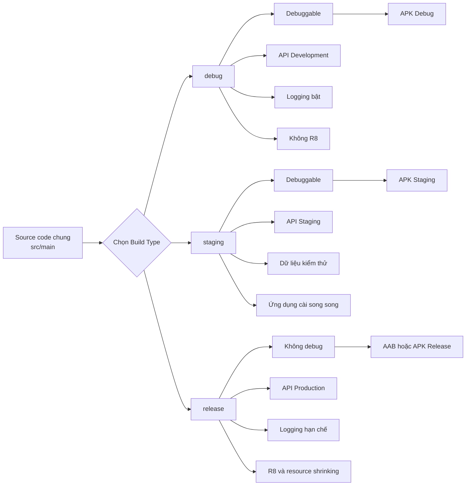
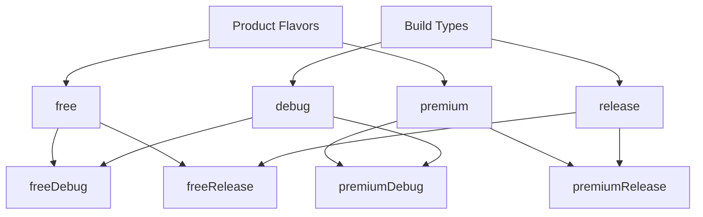
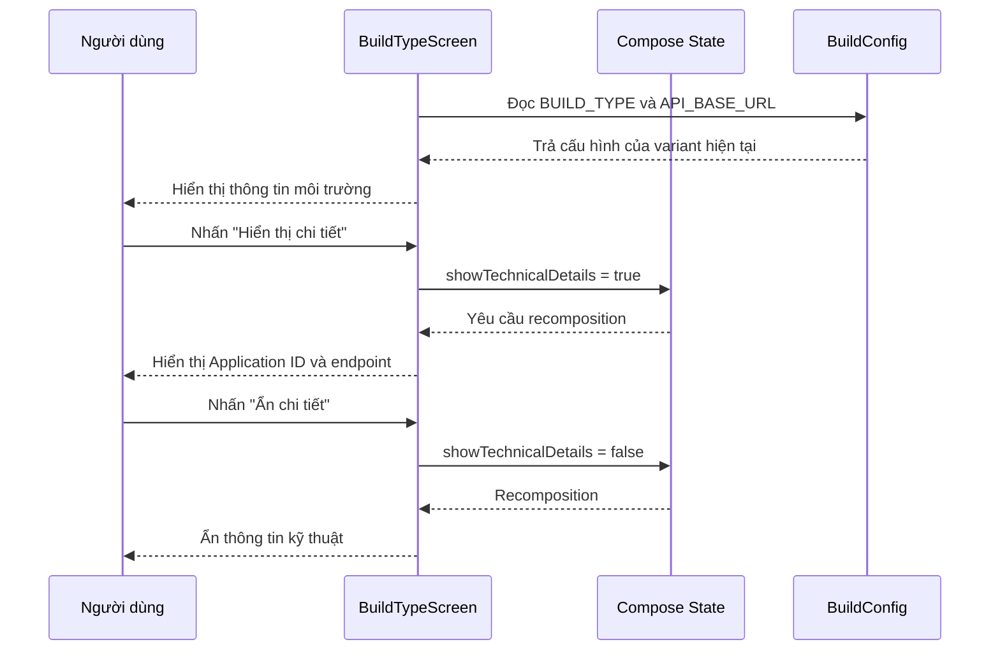
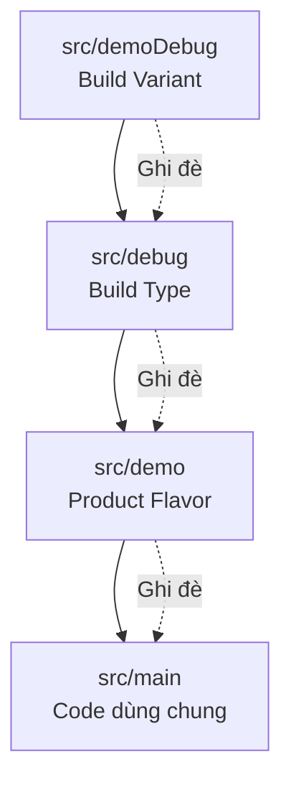
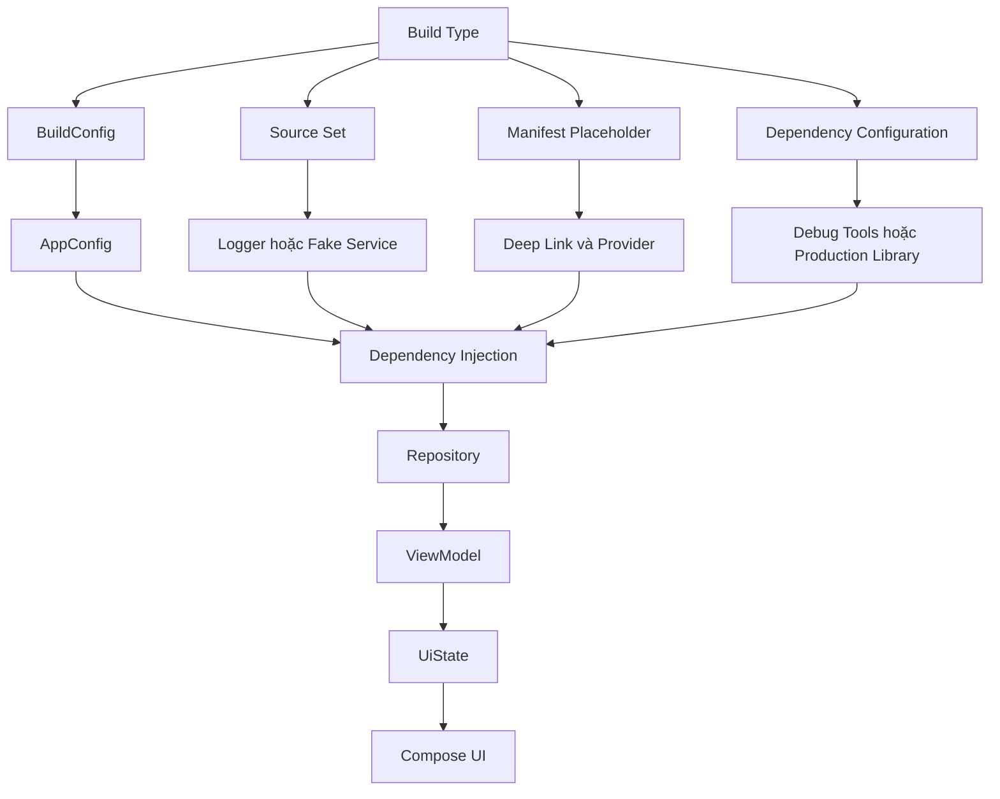

# 028 — Build Types trong Android

[](https://medium.com/%40norphyra/script-for-auto-build-android-applications-efbb8b7e1bae?utm_source=chatgpt.com)

**Học phần:** 01 — Language and Android Fundamentals  
**Module:** Module 02 — Android Fundamentals  
**Nhóm nội dung:** Gradle  
**Nguồn roadmap:** Android Fundamentals / Gradle  
**Loại bài:** UI  
**Thứ tự trong module:** 028  
**Thời lượng gợi ý:** 30 phút  

---

## 1. Tóm tắt

**Build Type** là tập hợp các quy tắc mô tả cách một phiên bản ứng dụng Android được biên dịch, đóng gói, ký, tối ưu và chạy.

Một dự án Android thường có hai build type mặc định:

- `debug`: dùng trong quá trình phát triển và gỡ lỗi.
- `release`: dùng để kiểm thử bản gần production và phát hành cho người dùng.

Ngoài ra, dự án có thể tạo thêm các build type như:

- `staging`: kết nối môi trường kiểm thử.
- `benchmark`: đo hiệu năng.
- `internal`: phát hành nội bộ.
- `qa`: dành cho đội kiểm thử.

Android Studio tạo sẵn `debug` và `release`. Build type có thể quy định ứng dụng có được debug hay không, có bật tối ưu mã nguồn hay không, dùng khóa ký nào, kết nối API nào và có bật logging hay không. :contentReference[oaicite:1]{index=1}

> **Định nghĩa ngắn gọn:**  
> Build Type trả lời câu hỏi: **“Ứng dụng được build theo cách nào?”**

---

## 2. Mục tiêu học tập

Sau bài học, bạn có thể:

- Giải thích được Build Type trong Android.
- Phân biệt `debug`, `staging` và `release`.
- Phân biệt Build Type, Product Flavor và Build Variant.
- Cấu hình Build Type trong `app/build.gradle.kts`.
- Truyền cấu hình của từng Build Type vào mã Kotlin bằng `BuildConfig`.
- Hiển thị thông tin Build Type trên giao diện Jetpack Compose.
- Tổ chức code và resource riêng bằng source set.
- Kiểm tra đúng API endpoint, logging, application ID và tối ưu release.
- Nhận biết các rủi ro thường gặp khi phát hành ứng dụng.

---

## 3. Build Types nằm ở đâu trong dự án Android?

Build Types được cấu hình trong tệp Gradle cấp module:

```text
MyAndroidApp/
├── settings.gradle.kts
├── build.gradle.kts
└── app/
    ├── build.gradle.kts        ← Cấu hình Build Types tại đây
    ├── proguard-rules.pro
    └── src/
        ├── main/
        ├── debug/
        ├── staging/
        └── release/
````

Ví dụ tối thiểu:

```kotlin
android {
    buildTypes {
        debug {
            // Cấu hình bản phát triển
        }

        release {
            // Cấu hình bản phát hành
        }
    }
}
```

Build Type thuộc hệ thống build, nhưng tác động trực tiếp đến:

* Endpoint mà ứng dụng gọi.
* Việc hiển thị log.
* Khả năng dùng debugger.
* Tên và package của ứng dụng.
* Hiệu năng và dung lượng ứng dụng.
* Cách ký APK hoặc Android App Bundle.
* Tính năng nội bộ có xuất hiện trên giao diện hay không.
* Rủi ro kết nối nhầm dữ liệu production.

---

## 4. Sơ đồ hoạt động



---

## 5. So sánh các Build Type phổ biến

| Thuộc tính            |            `debug` |               `staging` |            `release` |
| --------------------- | -----------------: | ----------------------: | -------------------: |
| Mục đích              |         Phát triển | Kiểm thử gần production |            Phát hành |
| Cho phép debugger     |                 Có |               Thường có |                Không |
| API endpoint          |        Development |                 Staging |           Production |
| Logging chi tiết      |                 Có |             Có giới hạn | Không hoặc tối thiểu |
| Application ID suffix |           `.debug` |              `.staging` |                Không |
| Minify/R8             |         Thường tắt |              Có thể bật |              Nên bật |
| Resource shrinking    |         Thường tắt |               Tùy dự án |              Nên bật |
| Khóa ký               |     Debug keystore |         Internal/QA key |   Upload/release key |
| Crash reporting       |         Có thể tắt |                 Nên bật |                  Bật |
| Phân phối             | Máy lập trình viên |     QA/Internal testing |      Người dùng thật |

Android Studio tự động ký bản debug bằng debug certificate. Bản release cần được ký đúng cách trước khi phát hành; khóa ký và khóa upload phải được bảo vệ cẩn thận. ([Android Developers][1])

---

## 6. Build Type, Product Flavor và Build Variant

Ba khái niệm này thường bị nhầm lẫn.

### 6.1. Build Type

Mô tả **cách ứng dụng được build**.

Ví dụ:

```text
debug
staging
release
```

### 6.2. Product Flavor

Mô tả **phiên bản sản phẩm hoặc đối tượng người dùng**.

Ví dụ:

```text
free
premium
enterprise
```

### 6.3. Build Variant

Build Variant là kết quả kết hợp:

```text
Product Flavor × Build Type
```

Ví dụ:

| Product Flavor | Build Type | Build Variant    |
| -------------- | ---------- | ---------------- |
| `free`         | `debug`    | `freeDebug`      |
| `free`         | `release`  | `freeRelease`    |
| `premium`      | `debug`    | `premiumDebug`   |
| `premium`      | `release`  | `premiumRelease` |



Gradle tự động tạo Build Variant từ các Build Type và Product Flavor đã cấu hình. Bạn không thường cấu hình trực tiếp từng Build Variant. ([Android Developers][2])

> **Cách nhớ:**
>
> * Build Type: build **như thế nào**?
> * Product Flavor: build **sản phẩm nào**?
> * Build Variant: phiên bản **cuối cùng được tạo ra**.

---

## 7. Cấu hình Build Types bằng Kotlin DSL

Mở tệp:

```text
app/build.gradle.kts
```

Thêm cấu hình sau:

```kotlin
android {
    namespace = "com.example.buildtypedemo"

    defaultConfig {
        applicationId = "com.example.buildtypedemo"
        minSdk = 24
        targetSdk = 36
        versionCode = 1
        versionName = "1.0"
    }

    buildFeatures {
        // Cho phép tạo các trường BuildConfig tùy chỉnh.
        buildConfig = true
    }

    buildTypes {
        debug {
            applicationIdSuffix = ".debug"
            versionNameSuffix = "-debug"

            isDebuggable = true
            isMinifyEnabled = false

            buildConfigField(
                type = "String",
                name = "API_BASE_URL",
                value = "\"https://dev-api.example.com/\""
            )

            buildConfigField(
                type = "Boolean",
                name = "ENABLE_LOGGING",
                value = "true"
            )

            resValue(
                type = "string",
                name = "app_name",
                value = "Build Type Demo — Debug"
            )
        }

        create("staging") {
            // Kế thừa phần lớn cấu hình từ debug.
            initWith(getByName("debug"))

            applicationIdSuffix = ".staging"
            versionNameSuffix = "-staging"

            buildConfigField(
                type = "String",
                name = "API_BASE_URL",
                value = "\"https://staging-api.example.com/\""
            )

            buildConfigField(
                type = "Boolean",
                name = "ENABLE_LOGGING",
                value = "true"
            )

            resValue(
                type = "string",
                name = "app_name",
                value = "Build Type Demo — Staging"
            )

            // Dùng debug variant của thư viện nếu thư viện
            // không có build type staging.
            matchingFallbacks += listOf("debug")
        }

        release {
            isDebuggable = false

            buildConfigField(
                type = "String",
                name = "API_BASE_URL",
                value = "\"https://api.example.com/\""
            )

            buildConfigField(
                type = "Boolean",
                name = "ENABLE_LOGGING",
                value = "false"
            )

            resValue(
                type = "string",
                name = "app_name",
                value = "Build Type Demo"
            )

            isMinifyEnabled = true
            isShrinkResources = true

            proguardFiles(
                getDefaultProguardFile(
                    "proguard-android-optimize.txt"
                ),
                "proguard-rules.pro"
            )
        }
    }
}
```

Gradle có thể tạo các trường tùy chỉnh trong lớp `BuildConfig` bằng `buildConfigField()` và tạo resource bằng `resValue()`. Code của ứng dụng sau đó có thể đọc các giá trị tương ứng với Build Type hiện tại. ([Android Developers][3])

### Lưu ý với AGP mới

Đối với Android Gradle Plugin 9.3 trở lên, tài liệu Android giới thiệu DSL tối ưu mới:

```kotlin
android {
    buildTypes {
        release {
            optimization {
                enable = true
            }
        }
    }
}
```

Các dự án AGP cũ hơn thường vẫn dùng:

```kotlin
release {
    isMinifyEnabled = true
    isShrinkResources = true
}
```

R8 loại bỏ code và resource không sử dụng, đồng thời thực hiện các bước tối ưu và làm ngắn tên lớp, hàm hoặc thuộc tính. Android khuyến nghị bật tối ưu cho bản release cuối cùng, nhưng không nên bật cho mọi bản debug vì quá trình build lâu hơn và khó gỡ lỗi hơn. ([Android Developers][4])

---

## 8. Ý nghĩa của từng thuộc tính

### `applicationIdSuffix`

Nối thêm chuỗi vào application ID.

```kotlin
applicationId = "com.example.buildtypedemo"
applicationIdSuffix = ".debug"
```

Kết quả:

```text
com.example.buildtypedemo.debug
```

Nhờ vậy, bạn có thể cài đồng thời:

```text
com.example.buildtypedemo
com.example.buildtypedemo.debug
com.example.buildtypedemo.staging
```

Điều này đặc biệt hữu ích khi cần so sánh staging và production trên cùng một thiết bị.

---

### `versionNameSuffix`

Thêm hậu tố vào tên phiên bản:

```kotlin
versionName = "1.0"
versionNameSuffix = "-staging"
```

Kết quả:

```text
1.0-staging
```

---

### `isDebuggable`

Quyết định ứng dụng có cho phép debugger kết nối hay không.

```kotlin
isDebuggable = true
```

Không nên bật thuộc tính này cho bản production.

---

### `isMinifyEnabled`

Bật tối ưu và rút gọn mã bằng R8 trong DSL truyền thống:

```kotlin
isMinifyEnabled = true
```

---

### `isShrinkResources`

Loại bỏ resource không còn được sử dụng:

```kotlin
isShrinkResources = true
```

Resource shrinking thường được sử dụng cùng code shrinking. ([Android Developers][5])

---

### `buildConfigField`

Tạo hằng số có thể truy cập trong Kotlin:

```kotlin
buildConfigField(
    "String",
    "API_BASE_URL",
    "\"https://api.example.com/\""
)
```

Sau khi build:

```kotlin
val apiUrl = BuildConfig.API_BASE_URL
```

---

### `resValue`

Tạo Android resource trong quá trình build:

```kotlin
resValue(
    "string",
    "app_name",
    "Build Type Demo — Debug"
)
```

Có thể sử dụng như resource thông thường:

```kotlin
stringResource(R.string.app_name)
```

---

### `matchingFallbacks`

Giải quyết trường hợp module ứng dụng có `staging`, nhưng module thư viện chỉ có `debug` và `release`.

```kotlin
matchingFallbacks += listOf("debug", "release")
```

Gradle sẽ thử khớp theo thứ tự đã chỉ định. ([Android Developers][6])

---

## 9. Tạo giao diện minh họa Build Type

Mục tiêu của màn hình:

* Hiển thị Build Type hiện tại.
* Hiển thị API endpoint.
* Hiển thị trạng thái logging.
* Có một state cho phép mở hoặc ẩn thông tin kỹ thuật.
* Dùng `rememberSaveable` để giữ trạng thái khi giao diện được tạo lại.

### `BuildTypeInfo.kt`

```kotlin
package com.example.buildtypedemo

data class BuildTypeInfo(
    val buildType: String,
    val applicationId: String,
    val versionName: String,
    val apiBaseUrl: String,
    val loggingEnabled: Boolean,
    val debuggable: Boolean
)

fun currentBuildTypeInfo(): BuildTypeInfo {
    return BuildTypeInfo(
        buildType = BuildConfig.BUILD_TYPE,
        applicationId = BuildConfig.APPLICATION_ID,
        versionName = BuildConfig.VERSION_NAME,
        apiBaseUrl = BuildConfig.API_BASE_URL,
        loggingEnabled = BuildConfig.ENABLE_LOGGING,
        debuggable = BuildConfig.DEBUG
    )
}
```

### `BuildTypeScreen.kt`

```kotlin
package com.example.buildtypedemo

import androidx.compose.foundation.layout.Arrangement
import androidx.compose.foundation.layout.Column
import androidx.compose.foundation.layout.fillMaxSize
import androidx.compose.foundation.layout.padding
import androidx.compose.material3.Button
import androidx.compose.material3.Card
import androidx.compose.material3.MaterialTheme
import androidx.compose.material3.Scaffold
import androidx.compose.material3.Text
import androidx.compose.runtime.Composable
import androidx.compose.runtime.getValue
import androidx.compose.runtime.saveable.rememberSaveable
import androidx.compose.runtime.setValue
import androidx.compose.runtime.mutableStateOf
import androidx.compose.ui.Modifier
import androidx.compose.ui.unit.dp

@Composable
fun BuildTypeScreen(
    modifier: Modifier = Modifier,
    info: BuildTypeInfo = currentBuildTypeInfo()
) {
    var showTechnicalDetails by rememberSaveable {
        mutableStateOf(false)
    }

    Scaffold(modifier = modifier) { innerPadding ->
        Column(
            modifier = Modifier
                .fillMaxSize()
                .padding(innerPadding)
                .padding(20.dp),
            verticalArrangement = Arrangement.spacedBy(16.dp)
        ) {
            Text(
                text = "Thông tin bản dựng",
                style = MaterialTheme.typography.headlineMedium
            )

            BuildTypeCard(
                title = "Build Type",
                value = info.buildType
            )

            BuildTypeCard(
                title = "Môi trường API",
                value = environmentName(info.buildType)
            )

            BuildTypeCard(
                title = "Logging",
                value = if (info.loggingEnabled) {
                    "Đang bật"
                } else {
                    "Đã tắt"
                }
            )

            Button(
                onClick = {
                    showTechnicalDetails = !showTechnicalDetails
                }
            ) {
                Text(
                    if (showTechnicalDetails) {
                        "Ẩn chi tiết"
                    } else {
                        "Hiển thị chi tiết"
                    }
                )
            }

            if (showTechnicalDetails) {
                TechnicalDetails(info = info)
            }
        }
    }
}

@Composable
private fun BuildTypeCard(
    title: String,
    value: String
) {
    Card {
        Column(
            modifier = Modifier.padding(16.dp),
            verticalArrangement = Arrangement.spacedBy(4.dp)
        ) {
            Text(
                text = title,
                style = MaterialTheme.typography.labelLarge
            )

            Text(
                text = value,
                style = MaterialTheme.typography.bodyLarge
            )
        }
    }
}

@Composable
private fun TechnicalDetails(info: BuildTypeInfo) {
    Card {
        Column(
            modifier = Modifier.padding(16.dp),
            verticalArrangement = Arrangement.spacedBy(8.dp)
        ) {
            Text(
                text = "Chi tiết kỹ thuật",
                style = MaterialTheme.typography.titleMedium
            )

            Text("Application ID: ${info.applicationId}")
            Text("Version: ${info.versionName}")
            Text("Endpoint: ${info.apiBaseUrl}")
            Text("Debuggable: ${info.debuggable}")
        }
    }
}

private fun environmentName(buildType: String): String {
    return when (buildType) {
        "debug" -> "Development"
        "staging" -> "Staging"
        "release" -> "Production"
        else -> "Không xác định"
    }
}
```

### `MainActivity.kt`

```kotlin
package com.example.buildtypedemo

import android.os.Bundle
import androidx.activity.ComponentActivity
import androidx.activity.compose.setContent
import com.example.buildtypedemo.ui.theme.BuildTypeDemoTheme

class MainActivity : ComponentActivity() {

    override fun onCreate(savedInstanceState: Bundle?) {
        super.onCreate(savedInstanceState)

        setContent {
            BuildTypeDemoTheme {
                BuildTypeScreen()
            }
        }
    }
}
```

---

## 10. Luồng cập nhật state và UI



Build Type không trực tiếp quản lý Compose state. Tuy nhiên, Build Type quyết định dữ liệu cấu hình ban đầu mà UI nhận được.

Ví dụ:

```text
BuildConfig.API_BASE_URL
        ↓
Repository hoặc Network Module
        ↓
ViewModel
        ↓
UiState
        ↓
Compose UI
```

Trong ứng dụng production, nên truyền cấu hình qua dependency injection thay vì đọc `BuildConfig` ở mọi màn hình.

---

## 11. Cấu trúc source set theo Build Type

Bạn có thể tạo code và resource riêng cho từng Build Type:

```text
app/src/
├── main/
│   ├── kotlin/
│   ├── res/
│   └── AndroidManifest.xml
│
├── debug/
│   ├── kotlin/
│   ├── res/
│   └── AndroidManifest.xml
│
├── staging/
│   ├── kotlin/
│   ├── res/
│   └── AndroidManifest.xml
│
└── release/
    ├── kotlin/
    ├── res/
    └── AndroidManifest.xml
```


*Hình: Android Studio hiển thị source set `debug` và `main`. Nguồn: Android Developers.*

Android Studio không tự tạo toàn bộ thư mục source set khi bạn thêm một Build Type. Bạn có thể tạo các thư mục như `src/debug/kotlin`, `src/staging/res` hoặc `src/release/AndroidManifest.xml` khi cần. ([Android Developers][6])

### Ví dụ logger riêng cho từng Build Type

#### `src/debug/kotlin/.../AppLogger.kt`

```kotlin
package com.example.buildtypedemo.logging

import android.util.Log

object AppLogger {
    fun debug(message: String) {
        Log.d("BuildTypeDemo", message)
    }
}
```

#### `src/release/kotlin/.../AppLogger.kt`

```kotlin
package com.example.buildtypedemo.logging

object AppLogger {
    fun debug(message: String) {
        // Không ghi debug log trong release.
    }
}
```

Hai tệp có cùng package và tên lớp, nhưng Gradle chỉ đưa phiên bản phù hợp với Build Type hiện tại vào ứng dụng.

> Không được để cùng một lớp tồn tại đồng thời trong `main` và source set Build Type nếu chúng tạo ra định nghĩa trùng nhau.

---

## 12. Resource riêng cho từng Build Type

### `src/debug/res/values/strings.xml`

```xml
<?xml version="1.0" encoding="utf-8"?>
<resources>
    <string name="environment_label">Development</string>
    <string name="environment_warning">
        Bạn đang sử dụng dữ liệu Development
    </string>
</resources>
```

### `src/staging/res/values/strings.xml`

```xml
<?xml version="1.0" encoding="utf-8"?>
<resources>
    <string name="environment_label">Staging</string>
    <string name="environment_warning">
        Đây là môi trường kiểm thử
    </string>
</resources>
```

### `src/release/res/values/strings.xml`

```xml
<?xml version="1.0" encoding="utf-8"?>
<resources>
    <string name="environment_label">Production</string>
    <string name="environment_warning"></string>
</resources>
```

Trong Compose:

```kotlin
Text(
    text = stringResource(R.string.environment_label)
)
```

Gradle sẽ chọn resource phù hợp với Build Type đang build.

---

## 13. Thứ tự ưu tiên khi merge source set

Giả sử có Build Variant:

```text
demoDebug
```

Thứ tự ưu tiên cơ bản là:

```text
src/demoDebug/
        ↓ ưu tiên cao hơn
src/debug/
        ↓
src/demo/
        ↓
src/main/
```



Source set của Build Variant có ưu tiên cao hơn Build Type, Product Flavor và `main`. ([Android Developers][6])

---

## 14. Manifest riêng cho từng Build Type

Bạn có thể bổ sung manifest riêng:

```text
src/debug/AndroidManifest.xml
src/staging/AndroidManifest.xml
src/release/AndroidManifest.xml
```

Ví dụ chỉ cho phép HTTP trong debug:

### `src/debug/AndroidManifest.xml`

```xml
<?xml version="1.0" encoding="utf-8"?>
<manifest xmlns:android="http://schemas.android.com/apk/res/android">

    <application
        android:usesCleartextTraffic="true" />

</manifest>
```

Không thêm cấu hình này vào manifest release nếu production chỉ sử dụng HTTPS.

Khi build, Android Manifest Merger kết hợp manifest của `main`, Build Type, Product Flavor và thư viện. Có thể kiểm tra kết quả trong tab **Merged Manifest** của Android Studio. ([Android Developers][7])


*Hình: Công cụ Merged Manifest cho biết mỗi thuộc tính đến từ manifest nào. Nguồn: Android Developers.*

---

## 15. Sử dụng `manifestPlaceholders`

Có thể truyền giá trị từ Gradle vào manifest.

### `app/build.gradle.kts`

```kotlin
android {
    buildTypes {
        debug {
            manifestPlaceholders["deepLinkHost"] =
                "dev.example.com"
        }

        create("staging") {
            initWith(getByName("debug"))

            manifestPlaceholders["deepLinkHost"] =
                "staging.example.com"
        }

        release {
            manifestPlaceholders["deepLinkHost"] =
                "example.com"
        }
    }
}
```

### `AndroidManifest.xml`

```xml
<activity
    android:name=".MainActivity"
    android:exported="true">

    <intent-filter>
        <action android:name="android.intent.action.VIEW" />

        <category android:name="android.intent.category.DEFAULT" />
        <category android:name="android.intent.category.BROWSABLE" />

        <data
            android:scheme="https"
            android:host="${deepLinkHost}" />
    </intent-filter>

</activity>
```

Kết quả:

| Build Type | Deep-link host        |
| ---------- | --------------------- |
| `debug`    | `dev.example.com`     |
| `staging`  | `staging.example.com` |
| `release`  | `example.com`         |

Android Gradle Plugin hỗ trợ truyền biến từ Gradle vào manifest bằng `manifestPlaceholders`. ([Android Developers][7])

---

## 16. Chọn Build Variant trong Android Studio

Thực hiện:

```text
Build
└── Select Build Variant
```

Hoặc mở cửa sổ:

```text
View
└── Tool Windows
    └── Build Variants
```

Sau đó chọn:

```text
debug
staging
release
```

Nếu dự án có flavor:

```text
freeDebug
freeRelease
premiumDebug
premiumRelease
```

Sau khi đổi variant, Android Studio có thể:

* Thay resource đang active.
* Thay code từ source set.
* Thay `BuildConfig`.
* Thay manifest kết quả.
* Thay dependency tương ứng.
* Thay tên task Gradle.

---

## 17. Build bằng dòng lệnh

### Liệt kê task

```bash
./gradlew tasks
```

Trên Windows:

```powershell
gradlew.bat tasks
```

### Build APK debug

```bash
./gradlew assembleDebug
```

### Build APK staging

```bash
./gradlew assembleStaging
```

### Build APK release

```bash
./gradlew assembleRelease
```

### Build Android App Bundle release

```bash
./gradlew bundleRelease
```

### Cài debug lên thiết bị

```bash
./gradlew installDebug
```

APK thường được tạo trong:

```text
app/build/outputs/apk/
```

Android App Bundle thường được tạo trong:

```text
app/build/outputs/bundle/
```

Android Studio cũng cung cấp các lệnh tạo APK, App Bundle và signed artifact từ menu Build. ([Android Developers][8])

---

## 18. Test Build Type

### 18.1. Unit test cho hàm ánh xạ môi trường

Nên đưa logic ánh xạ ra ngoài Composable:

```kotlin
fun environmentName(buildType: String): String {
    return when (buildType) {
        "debug" -> "Development"
        "staging" -> "Staging"
        "release" -> "Production"
        else -> "Unknown"
    }
}
```

Test:

```kotlin
package com.example.buildtypedemo

import org.junit.Assert.assertEquals
import org.junit.Test

class BuildTypeMapperTest {

    @Test
    fun debug_returnsDevelopment() {
        assertEquals(
            "Development",
            environmentName("debug")
        )
    }

    @Test
    fun staging_returnsStaging() {
        assertEquals(
            "Staging",
            environmentName("staging")
        )
    }

    @Test
    fun release_returnsProduction() {
        assertEquals(
            "Production",
            environmentName("release")
        )
    }

    @Test
    fun unknown_returnsUnknown() {
        assertEquals(
            "Unknown",
            environmentName("benchmark")
        )
    }
}
```

---

### 18.2. Compose UI test

Thêm semantic test tag:

```kotlin
Text(
    text = info.buildType,
    modifier = Modifier.testTag("build_type_value")
)
```

Test:

```kotlin
@get:Rule
val composeRule = createComposeRule()

@Test
fun screen_displaysCurrentBuildType() {
    composeRule.setContent {
        BuildTypeScreen(
            info = BuildTypeInfo(
                buildType = "staging",
                applicationId = "com.example.app.staging",
                versionName = "1.0-staging",
                apiBaseUrl = "https://staging-api.example.com/",
                loggingEnabled = true,
                debuggable = true
            )
        )
    }

    composeRule
        .onNodeWithTag("build_type_value")
        .assertTextEquals("staging")
}
```

Điểm quan trọng là không để test phụ thuộc trực tiếp vào Build Type của tiến trình test. Truyền `BuildTypeInfo` vào màn hình giúp test được mọi trạng thái.

---

## 19. Checklist kiểm thử thủ công

### Debug

* [ ] Tên ứng dụng có hậu tố Debug.
* [ ] Application ID kết thúc bằng `.debug`.
* [ ] Có thể kết nối debugger.
* [ ] Ứng dụng gọi Development API.
* [ ] Logging được bật.
* [ ] Không sử dụng dữ liệu production.
* [ ] Có thể cài song song với release.

### Staging

* [ ] Tên ứng dụng thể hiện rõ đây là staging.
* [ ] Application ID kết thúc bằng `.staging`.
* [ ] Ứng dụng gọi Staging API.
* [ ] Deep link dùng staging domain.
* [ ] Crash reporting gửi đúng staging project.
* [ ] Không gửi notification cho người dùng thật.
* [ ] Tài khoản và dữ liệu thử nghiệm hoạt động đúng.

### Release

* [ ] Không cho phép debugger.
* [ ] API endpoint là production.
* [ ] Không hiển thị menu nội bộ.
* [ ] Không ghi access token hoặc dữ liệu cá nhân vào log.
* [ ] R8 hoặc cơ chế optimization phù hợp được bật.
* [ ] Resource shrinking hoạt động.
* [ ] Signing configuration chính xác.
* [ ] Smoke test sau khi minify thành công.
* [ ] Deep link production hoạt động.
* [ ] Có thể tạo signed AAB.
* [ ] Kiểm tra artifact bằng APK Analyzer.

---

## 20. Các lỗi thường gặp

### Lỗi 1: Release gọi nhầm Development API

Nguyên nhân:

```kotlin
const val BASE_URL = "https://dev-api.example.com/"
```

URL bị hard-code trong source code chung.

Cách khắc phục:

```kotlin
buildConfigField(
    "String",
    "API_BASE_URL",
    "\"https://api.example.com/\""
)
```

Hoặc cung cấp cấu hình qua dependency injection.

---

### Lỗi 2: Dùng Build Type để mô tả sản phẩm

Không nên:

```text
freeDebug
freeRelease
```

được tạo bằng bốn Build Type riêng:

```text
freeDebug
freeRelease
paidDebug
paidRelease
```

Nên sử dụng:

```text
Product Flavor: free, paid
Build Type: debug, release
```

Khi đó Gradle tự tạo:

```text
freeDebug
freeRelease
paidDebug
paidRelease
```

---

### Lỗi 3: `staging` không tìm được dependency phù hợp

Thông báo thường liên quan đến variant matching.

Nguyên nhân:

```text
App có staging
Library chỉ có debug và release
```

Khắc phục:

```kotlin
create("staging") {
    matchingFallbacks += listOf("debug")
}
```

---

### Lỗi 4: Release bị crash sau khi bật R8

Nguyên nhân có thể là:

* Reflection không được giữ lại.
* Thư viện cần keep rule.
* Serializer bị đổi tên.
* Model được tạo động không còn metadata cần thiết.

Khắc phục:

```proguard
-keep class com.example.buildtypedemo.model.** { *; }
```

Không nên giữ toàn bộ dự án một cách tùy tiện vì sẽ làm giảm hiệu quả tối ưu.

---

### Lỗi 5: Đưa khóa bí mật vào `BuildConfig`

Không nên:

```kotlin
buildConfigField(
    "String",
    "PRIVATE_API_SECRET",
    "\"super-secret-value\""
)
```

`BuildConfig` được đóng gói vào ứng dụng và có thể bị phân tích. Nó phù hợp với:

* URL môi trường.
* Feature flag không nhạy cảm.
* Tên kênh phân phối.
* Version metadata.

Nó không phải nơi an toàn cho:

* Private key.
* Mật khẩu cơ sở dữ liệu.
* Server secret.
* Token có toàn quyền.
* Signing password.

Android khuyến cáo không commit API key vào source code, nên tách key theo môi trường và sử dụng cơ chế quản lý bí mật phù hợp. ([Android Developers][9])

---

### Lỗi 6: Ghi dữ liệu nhạy cảm vào log

Không nên:

```kotlin
Log.d("Auth", "Access token: $token")
```

Ngay cả trong debug, developer cần tránh tạo thói quen ghi:

* Token.
* Mật khẩu.
* Thông tin cá nhân.
* Dữ liệu thanh toán.
* Nội dung riêng tư của người dùng.

Release nên vô hiệu hóa hoặc lọc các log không cần thiết. Việc để thông tin nhạy cảm trong log có thể gây rò rỉ dữ liệu. ([Android Developers][10])

---

## 21. Build Types ảnh hưởng đến UX như thế nào?

Build Type không phải thành phần giao diện, nhưng cấu hình sai có thể gây hậu quả trực tiếp cho người dùng.

| Cấu hình sai                      | Tác động                                  |
| --------------------------------- | ----------------------------------------- |
| Release dùng API development      | Dữ liệu sai hoặc không đăng nhập được     |
| Logging quá nhiều                 | Giảm hiệu năng hoặc rò rỉ dữ liệu         |
| Không bật optimization            | Ứng dụng lớn và có thể khởi động chậm hơn |
| R8 thiếu keep rule                | Crash chỉ xuất hiện ở release             |
| Sai deep-link host                | Liên kết không mở ứng dụng                |
| Sai signing key                   | Không thể cập nhật phiên bản cũ           |
| Debug menu xuất hiện ở production | Lộ chức năng nội bộ                       |
| Dùng cùng application ID          | Không cài được staging cạnh production    |
| Bật cleartext trong release       | Giảm an toàn kết nối                      |
| Dùng chung analytics project      | Dữ liệu test làm sai báo cáo production   |

---

## 22. Build Types và lifecycle

Build Type không thay đổi lifecycle của Activity hay Composable. Tuy nhiên, từng Build Type có thể sử dụng implementation khác nhau.

Ví dụ:

```text
debug:
FakeLocationProvider
        ↓
ViewModel
        ↓
UiState
        ↓
Compose

release:
RealLocationProvider
        ↓
ViewModel
        ↓
UiState
        ↓
Compose
```

UI không nên cần biết dữ liệu đến từ fake provider hay real provider.

Thiết kế tốt:

```kotlin
interface UserRepository {
    suspend fun loadUser(): User
}
```

Debug:

```kotlin
class FakeUserRepository : UserRepository {
    override suspend fun loadUser(): User {
        return User(
            id = "debug-user",
            name = "Người dùng thử nghiệm"
        )
    }
}
```

Release:

```kotlin
class NetworkUserRepository(
    private val api: UserApi
) : UserRepository {

    override suspend fun loadUser(): User {
        return api.getCurrentUser()
    }
}
```

Build Type quyết định implementation, còn ViewModel và UI tiếp tục sử dụng cùng interface.

---

## 23. Mô hình kiến trúc đề xuất



Không nên để mọi Composable đọc trực tiếp `BuildConfig`.

Thay vào đó, tạo abstraction:

```kotlin
data class AppEnvironment(
    val name: String,
    val apiBaseUrl: String,
    val loggingEnabled: Boolean
)
```

Khởi tạo tại composition root:

```kotlin
val appEnvironment = AppEnvironment(
    name = BuildConfig.BUILD_TYPE,
    apiBaseUrl = BuildConfig.API_BASE_URL,
    loggingEnabled = BuildConfig.ENABLE_LOGGING
)
```

Sau đó truyền vào network module, repository hoặc dependency injection container.

---

## 24. Thực hành 30 phút

### Phần 1 — Cấu hình Gradle: 8 phút

Tạo ba Build Type:

```text
debug
staging
release
```

Mỗi Build Type có:

* API URL khác nhau.
* Tên ứng dụng khác nhau.
* Application ID khác nhau.
* Cấu hình logging khác nhau.

### Phần 2 — Tạo UI: 10 phút

Tạo màn hình hiển thị:

```text
Build Type
Environment
API Base URL
Logging status
Application ID
Version
```

Thêm nút:

```text
Hiển thị chi tiết
Ẩn chi tiết
```

### Phần 3 — Kiểm thử: 7 phút

Chạy lần lượt:

```bash
./gradlew assembleDebug
./gradlew assembleStaging
./gradlew assembleRelease
```

Kiểm tra giao diện của từng bản.

### Phần 4 — Portfolio: 5 phút

Chụp ba ảnh:

```text
screenshots/
├── debug-screen.png
├── staging-screen.png
└── release-screen.png
```

Viết README ngắn giải thích sự khác nhau.

---

## 25. Bài tập

### Yêu cầu cơ bản

Xây dựng ứng dụng **Environment Inspector** với các chức năng:

1. Hiển thị Build Type hiện tại.
2. Hiển thị endpoint đang sử dụng.
3. Hiển thị trạng thái logging.
4. Cho phép mở hoặc ẩn chi tiết.
5. Giữ trạng thái nút khi xoay màn hình.
6. Có ba Build Type: `debug`, `staging`, `release`.
7. Có thể cài debug, staging và release cạnh nhau.
8. Có ít nhất một unit test.
9. Có checklist kiểm thử release.

### Yêu cầu nâng cao

* Thêm icon ứng dụng khác nhau cho debug và release.
* Thêm banner màu nổi bật trong staging.
* Chỉ bật công cụ network inspector trong debug.
* Tạo deep-link host khác nhau cho từng môi trường.
* Chạy `assembleDebug`, `assembleStaging` và `bundleRelease` trong CI.
* Kiểm tra release sau khi bật R8.
* Không để endpoint được hard-code trong repository.

---

## 26. Artifact đưa vào portfolio

Cấu trúc đề xuất:

```text
build-type-demo/
├── README.md
├── app/
│   ├── build.gradle.kts
│   └── src/
│       ├── main/
│       ├── debug/
│       ├── staging/
│       └── release/
├── screenshots/
│   ├── debug-screen.png
│   ├── staging-screen.png
│   └── release-screen.png
└── docs/
    └── build-type-diagram.md
```

### README mẫu

````markdown
# Android Build Type Demo

Ứng dụng minh họa cách sử dụng Build Types để tạo các bản
debug, staging và release từ cùng một codebase.

## Build Types

| Type | API | Logging | Minify |
|---|---|---:|---:|
| Debug | Development | Bật | Tắt |
| Staging | Staging | Bật | Tắt |
| Release | Production | Tắt | Bật |

## Kỹ thuật được sử dụng

- Gradle Kotlin DSL
- BuildConfig fields
- Resource override
- Source sets
- Manifest placeholders
- Jetpack Compose
- rememberSaveable
- Unit test
- Release checklist

## Build

```bash
./gradlew assembleDebug
./gradlew assembleStaging
./gradlew bundleRelease
````

````

---

## 27. Checklist hoàn thành bài học

### Kiến thức

- [ ] Giải thích được Build Type là gì.
- [ ] Phân biệt được Build Type và Product Flavor.
- [ ] Hiểu Build Variant được tạo như thế nào.
- [ ] Biết vai trò của `debug`, `staging` và `release`.
- [ ] Hiểu source set được merge theo thứ tự nào.

### Gradle

- [ ] Cấu hình được `buildTypes`.
- [ ] Sử dụng được `applicationIdSuffix`.
- [ ] Sử dụng được `versionNameSuffix`.
- [ ] Tạo được `buildConfigField`.
- [ ] Tạo được `resValue`.
- [ ] Sử dụng được `matchingFallbacks`.
- [ ] Biết cách bật optimization cho release.
- [ ] Không hard-code khóa bí mật.

### UI và state

- [ ] Hiển thị được Build Type trên Compose UI.
- [ ] Có ít nhất một state thay đổi giao diện.
- [ ] State không bị mất khi xoay màn hình thông thường.
- [ ] UI vẫn dễ đọc và thao tác được.
- [ ] Có content description hoặc semantic label khi cần.

### Testing và release

- [ ] Build thành công debug.
- [ ] Build thành công staging.
- [ ] Build thành công release.
- [ ] Kiểm tra đúng endpoint.
- [ ] Kiểm tra logging.
- [ ] Kiểm tra application ID.
- [ ] Kiểm tra release sau khi bật R8.
- [ ] Kiểm tra signing configuration.
- [ ] Có README hoặc screenshot cho portfolio.

---

## 28. Ghi chú production

Trước mỗi lần phát hành, hãy tự hỏi:

1. Release có đang dùng đúng production API không?
2. Debug hoặc staging có thể ghi dữ liệu vào production không?
3. Có log token, email hoặc dữ liệu cá nhân không?
4. Có secret nào nằm trong `BuildConfig`, resource hoặc source code không?
5. R8 có làm crash luồng đăng nhập, serialization hoặc reflection không?
6. Deep link có dùng đúng domain production không?
7. Crash reporting và analytics có trỏ đúng project không?
8. Debug menu hoặc test account có xuất hiện trong production không?
9. AAB có được ký bằng đúng upload key không?
10. Đã smoke test artifact release thực tế thay vì chỉ test debug chưa?

> Không nên coi `release` đơn giản là “debug nhưng tắt log”.  
> Release là một sản phẩm riêng cần được build, ký, tối ưu và kiểm thử độc lập.

---

## 29. Tổng kết

Build Types giúp một codebase Android tạo ra nhiều kiểu bản dựng phục vụ các giai đoạn khác nhau:

```text
debug   → phát triển nhanh
staging → kiểm thử an toàn
release → phân phối cho người dùng
````

Một cấu hình Build Type tốt cần đảm bảo:

* Mỗi môi trường có mục đích rõ ràng.
* Không kết nối nhầm development và production.
* Release không chứa công cụ debug hoặc dữ liệu nhạy cảm.
* Source set và dependency có tổ chức.
* UI có thể phản ánh môi trường khi cần.
* Mọi Build Type quan trọng đều được build và kiểm thử trong CI.
* Artifact release được kiểm thử sau khi signing và optimization.

Khi hiểu Build Types, bạn không còn xem Gradle như một “hộp đen”. Bạn có thể kiểm soát chính xác ứng dụng nào đang được tạo, sử dụng cấu hình nào và ảnh hưởng đến người dùng ra sao.

```

**Tài liệu chính:** Android Developers xác định Build Variant là sự kết hợp giữa Build Type và Product Flavor; đồng thời cung cấp hướng dẫn về source set, variant matching, manifest merging, signing và tối ưu release. :contentReference[oaicite:15]{index=15}
```

[1]: https://developer.android.com/studio/publish/app-signing?utm_source=chatgpt.com "Sign your app | Android Studio"
[2]: https://developer.android.com/build/build-variants?utm_source=chatgpt.com "Configure build variants  |  Android Studio  |  Android Developers"
[3]: https://developer.android.com/build/gradle-tips?hl=en "Gradle tips and recipes  |  Android Studio  |  Android Developers"
[4]: https://developer.android.com/topic/performance/app-optimization/enable-app-optimization?utm_source=chatgpt.com "Enable app optimization with R8 | App quality"
[5]: https://developer.android.com/topic/performance/reduce-apk-size?utm_source=chatgpt.com "Reduce your app size | App quality"
[6]: https://developer.android.com/build/build-variants "Configure build variants  |  Android Studio  |  Android Developers"
[7]: https://developer.android.com/build/manage-manifests?authuser=0 "Manage manifest files  |  Android Studio  |  Android Developers"
[8]: https://developer.android.com/build/build-for-release "Build your app for release to users  |  Android Studio  |  Android Developers"
[9]: https://developer.android.com/privacy-and-security/security-tips?utm_source=chatgpt.com "Security checklist"
[10]: https://developer.android.com/privacy-and-security/risks/log-info-disclosure?utm_source=chatgpt.com "Log Info Disclosure | Security"

---

# Bài luyện tập

## Mục tiêu


## Đề bài


## Yêu cầu hoàn thành

- [ ] 
- [ ] 
- [ ] 

## Kết quả / lời giải


## Ghi chú
