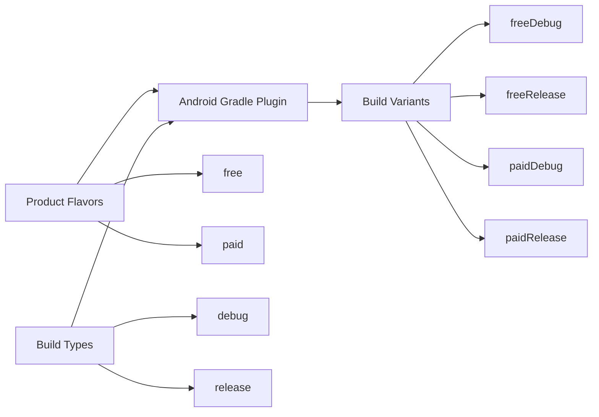
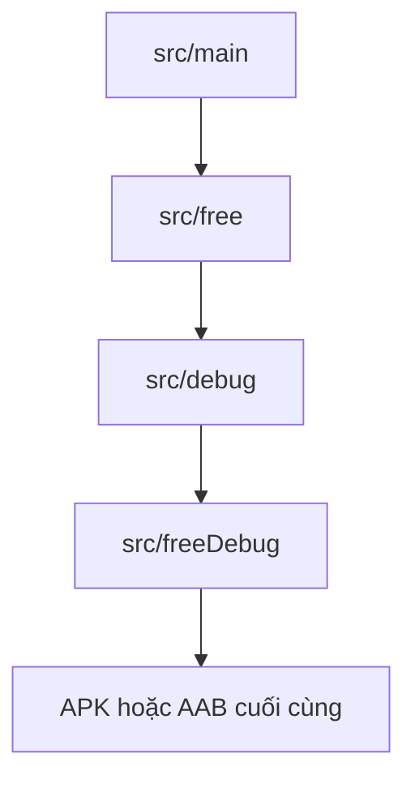

# 029 — Product Flavors trong Android

[](https://developer.android.com/codelabs/build-variants?utm_source=chatgpt.com)

**Học phần:** 01 — Language and Android Fundamentals
**Module:** Module 02 — Android Fundamentals
**Nhóm nội dung:** Gradle
**Nguồn roadmap:** Android Fundamentals / Gradle
**Loại bài:** Lesson
**Thứ tự trong module:** 029
**Thời lượng gợi ý:** 24 phút

---

## 1. Tóm tắt

**Product Flavor** là cơ chế của Android Gradle Plugin cho phép tạo nhiều phiên bản sản phẩm từ cùng một codebase, chẳng hạn:

* Bản `free` và `paid`.
* Bản dành cho khách hàng A và khách hàng B.
* Bản nội bộ và bản công khai.
* Bản có quảng cáo và bản không có quảng cáo.
* Bản sử dụng thương hiệu, icon, tài nguyên hoặc API khác nhau.

Product Flavor thường được kết hợp với **Build Type** để tạo thành **Build Variant**. Ví dụ, hai flavor `free`, `paid` kết hợp với hai build type `debug`, `release` sẽ tạo ra bốn variant: `freeDebug`, `freeRelease`, `paidDebug` và `paidRelease`. ([Android Developers][1])

> Product Flavor trả lời câu hỏi: **“Đây là phiên bản sản phẩm nào?”**
> Build Type trả lời câu hỏi: **“Bản này đang được xây dựng cho giai đoạn nào?”**

---

## 2. Mục tiêu học tập

Sau bài học, anh có thể:

* Giải thích Product Flavor bằng ngôn ngữ của mình.
* Phân biệt Product Flavor, Build Type và Build Variant.
* Tạo hai flavor trong `build.gradle.kts`.
* Thay đổi tên ứng dụng, cấu hình và hành vi theo từng flavor.
* Tổ chức code và resource bằng source set.
* Chạy và kiểm thử từng build variant.
* Nhận biết rủi ro khi số lượng variant tăng quá nhiều.
* Tạo một artifact nhỏ để đưa vào portfolio Android.

---

## 3. Hình minh họa

### 3.1. Cửa sổ Build Variants trong Android Studio


*Nguồn ảnh: Android Developers. Giao diện Android Studio hiện tại có thể khác đôi chút, nhưng cách chọn variant vẫn tương tự.* 

### 3.2. Source set trong Android Studio


Mỗi flavor, build type hoặc build variant có thể có thư mục code, manifest và resource riêng. Android Gradle Plugin sẽ hợp nhất chúng khi build ứng dụng. 

---

## 4. Khái niệm chính

### 4.1. Product Flavor là gì?

Product Flavor là một cấu hình mô tả **một phiên bản sản phẩm** của ứng dụng.

Ví dụ, một ứng dụng đọc tin có hai phiên bản:

| Flavor | Đối tượng           | Đặc điểm                                |
| ------ | ------------------- | --------------------------------------- |
| `free` | Người dùng miễn phí | Có quảng cáo, giới hạn 10 bài đã lưu    |
| `paid` | Người dùng trả phí  | Không quảng cáo, lưu bài không giới hạn |

Hai phiên bản vẫn có thể dùng chung:

* Kiến trúc ứng dụng.
* Repository.
* ViewModel.
* Database.
* Network client.
* Navigation.
* Phần lớn giao diện.

Nhưng chúng có thể khác nhau ở:

* Tên ứng dụng.
* Icon và màu thương hiệu.
* API endpoint.
* Feature được đóng gói.
* Dependency.
* Quyền trong manifest.
* Giới hạn tính năng.
* Mã ứng dụng `applicationId`.

Android cho phép khai báo cấu hình chung trong `defaultConfig`, sau đó từng flavor thay đổi những giá trị cần thiết. ([Android Developers][2])

---

### 4.2. Product Flavor khác Build Type như thế nào?

| Tiêu chí        | Product Flavor                       | Build Type                           |
| --------------- | ------------------------------------ | ------------------------------------ |
| Mục đích        | Phân chia phiên bản sản phẩm         | Phân chia giai đoạn build            |
| Ví dụ           | `free`, `paid`, `clientA`            | `debug`, `release`, `staging`        |
| Góc nhìn        | Sản phẩm và người dùng               | Phát triển và phát hành              |
| Có thể thay đổi | Tính năng, branding, API, tài nguyên | Debuggable, minify, signing, logging |
| Kết quả         | Kết hợp với build type               | Kết hợp với product flavor           |

Ví dụ:

```text
Flavor: free
Build type: debug
Build variant: freeDebug
```

---

### 4.3. Build Variant được tạo như thế nào?



Có thể hình dung đây là phép nhân:

```text
2 product flavors × 2 build types = 4 build variants
```

Build variant là cấu hình cuối cùng mà Gradle sử dụng để biên dịch và đóng gói APK hoặc Android App Bundle. Anh không thường khai báo trực tiếp từng variant; thay vào đó, anh khai báo flavor và build type để Gradle kết hợp chúng. ([Android Developers][1])

---

## 5. Flavor Dimension

Mỗi Product Flavor phải thuộc về một **flavor dimension**.

Dimension là nhóm các flavor có cùng vai trò.

Ví dụ:

```text
Dimension: tier
├── free
└── paid
```

Hai flavor trong cùng một dimension sẽ không được kết hợp với nhau. `freePaidDebug` không tồn tại vì `free` và `paid` đều thuộc dimension `tier`. Gradle chỉ chọn một flavor từ mỗi dimension. ([Android Developers][2])

### Nhiều dimension

Một dự án lớn có thể có hai dimension:

```text
tier
├── free
└── paid

environment
├── staging
└── production
```

Kết hợp với `debug` và `release`:

```text
2 tier × 2 environment × 2 build types = 8 variants
```

Một số variant có thể là:

```text
freeStagingDebug
freeProductionRelease
paidStagingDebug
paidProductionRelease
```

> Không nên tạo thêm dimension chỉ vì “có thể”. Mỗi dimension mới làm tăng số variant, thời gian build, số test và chi phí release.

---

## 6. Ví dụ thực hành: ứng dụng Flavor News

Ứng dụng có hai phiên bản:

* `free`: có quảng cáo, lưu tối đa 10 bài.
* `paid`: không quảng cáo, lưu tối đa 1.000 bài.

### 6.1. Cấu hình `build.gradle.kts`

Mở file:

```text
app/build.gradle.kts
```

Thêm cấu hình sau vào khối `android`:

```kotlin
android {
    namespace = "com.example.flavornews"
    compileSdk = 36

    defaultConfig {
        applicationId = "com.example.flavornews"
        minSdk = 24
        targetSdk = 36

        versionCode = 1
        versionName = "1.0"
    }

    /*
     * Bật BuildConfig vì ví dụ sử dụng các trường được sinh
     * từ buildConfigField().
     */
    buildFeatures {
        buildConfig = true
    }

    /*
     * Khai báo dimension dùng để phân chia cấp sản phẩm.
     */
    flavorDimensions += "tier"

    productFlavors {
        create("free") {
            dimension = "tier"

            /*
             * Application ID cuối cùng của bản release:
             * com.example.flavornews.free
             */
            applicationIdSuffix = ".free"
            versionNameSuffix = "-free"

            /*
             * Tạo resource riêng cho flavor.
             */
            resValue(
                type = "string",
                name = "app_name",
                value = "Flavor News Free"
            )

            /*
             * Tạo hằng số trong BuildConfig.
             */
            buildConfigField(
                type = "boolean",
                name = "SHOW_ADS",
                value = "true"
            )

            buildConfigField(
                type = "int",
                name = "MAX_SAVED_ARTICLES",
                value = "10"
            )
        }

        create("paid") {
            dimension = "tier"

            applicationIdSuffix = ".paid"
            versionNameSuffix = "-paid"

            resValue(
                type = "string",
                name = "app_name",
                value = "Flavor News Premium"
            )

            buildConfigField(
                type = "boolean",
                name = "SHOW_ADS",
                value = "false"
            )

            buildConfigField(
                type = "int",
                name = "MAX_SAVED_ARTICLES",
                value = "1000"
            )
        }
    }

    buildTypes {
        debug {
            /*
             * Cho phép cài bản debug cùng lúc với bản release.
             */
            applicationIdSuffix = ".debug"
            versionNameSuffix = "-debug"

            isDebuggable = true
        }

        release {
            isDebuggable = false
            isMinifyEnabled = true

            proguardFiles(
                getDefaultProguardFile("proguard-android-optimize.txt"),
                "proguard-rules.pro"
            )
        }
    }
}
```

Sau khi sửa file Gradle, cần đồng bộ lại project để Android Studio tạo các variant mới. Product flavors hỗ trợ nhiều thuộc tính tương tự `defaultConfig`, bao gồm `applicationId`, version và các thiết lập đóng gói. ([Android Developers][2])

---

### 6.2. Các variant được tạo

Với cấu hình trên, Gradle tạo bốn variant:

| Flavor | Build Type | Build Variant | Application ID                      |
| ------ | ---------- | ------------- | ----------------------------------- |
| `free` | `debug`    | `freeDebug`   | `com.example.flavornews.free.debug` |
| `free` | `release`  | `freeRelease` | `com.example.flavornews.free`       |
| `paid` | `debug`    | `paidDebug`   | `com.example.flavornews.paid.debug` |
| `paid` | `release`  | `paidRelease` | `com.example.flavornews.paid`       |

Các `applicationId` khác nhau cho phép cài nhiều phiên bản ứng dụng trên cùng một thiết bị.

Tuy nhiên, sau khi đã phát hành một ứng dụng lên Google Play, không nên thay đổi `applicationId` của listing đó. Google Play sẽ xem application ID mới là một ứng dụng hoàn toàn khác. ([Android Developers][3])

---

## 7. Sử dụng cấu hình flavor trong Kotlin

Các giá trị từ `buildConfigField` được tạo trong lớp `BuildConfig`.

```kotlin
data class SubscriptionPolicy(
    val showAds: Boolean,
    val maxSavedArticles: Int
)

fun createSubscriptionPolicy(): SubscriptionPolicy {
    return SubscriptionPolicy(
        showAds = BuildConfig.SHOW_ADS,
        maxSavedArticles = BuildConfig.MAX_SAVED_ARTICLES
    )
}
```

### Ví dụ với Jetpack Compose

```kotlin
@Composable
fun SubscriptionSummary(
    savedArticleCount: Int,
    modifier: Modifier = Modifier
) {
    val maxArticles = BuildConfig.MAX_SAVED_ARTICLES
    val canSaveMore = savedArticleCount < maxArticles

    Column(modifier = modifier.padding(16.dp)) {
        Text(
            text = stringResource(R.string.app_name),
            style = MaterialTheme.typography.titleLarge
        )

        Text(
            text = "Đã lưu: $savedArticleCount / $maxArticles"
        )

        if (BuildConfig.SHOW_ADS) {
            Text(
                text = "Khu vực hiển thị quảng cáo",
                modifier = Modifier.padding(top = 16.dp)
            )
        }

        if (!canSaveMore) {
            Text(
                text = "Bạn đã đạt giới hạn lưu bài."
            )
        }
    }
}
```

### Lưu ý kiến trúc

Không nên rải các điều kiện sau khắp ứng dụng:

```kotlin
if (BuildConfig.FLAVOR == "free") {
    // ...
}
```

Cách này làm code khó đọc và khó kiểm thử.

Nên chuyển cấu hình thành một đối tượng rõ ràng:

```kotlin
interface AppPlan {
    val showAds: Boolean
    val maximumSavedArticles: Int
}

class GradleAppPlan : AppPlan {
    override val showAds: Boolean = BuildConfig.SHOW_ADS

    override val maximumSavedArticles: Int =
        BuildConfig.MAX_SAVED_ARTICLES
}
```

Các ViewModel và use case chỉ phụ thuộc vào `AppPlan`, không cần biết flavor hiện tại tên gì.

---

## 8. Source Set theo flavor

Product Flavor không chỉ thay đổi các biến Gradle. Mỗi flavor còn có thể chứa:

* Kotlin hoặc Java code.
* Resource.
* Asset.
* Native library.
* `AndroidManifest.xml`.
* Unit test.
* Instrumented test.

### 8.1. Cấu trúc thư mục

```text
app/
└── src/
    ├── main/
    │   ├── kotlin/
    │   ├── res/
    │   └── AndroidManifest.xml
    │
    ├── free/
    │   ├── kotlin/
    │   ├── res/
    │   └── AndroidManifest.xml
    │
    ├── paid/
    │   ├── kotlin/
    │   ├── res/
    │   └── AndroidManifest.xml
    │
    ├── debug/
    │   └── res/
    │
    ├── freeDebug/
    │   └── res/
    │
    ├── testFree/
    │   └── kotlin/
    │
    └── androidTestFreeDebug/
        └── kotlin/
```

Android Studio mặc định tạo `src/main`. Các thư mục flavor và variant có thể được tạo khi dự án cần code hoặc resource riêng. ([Android Developers][2])

---

### 8.2. Resource riêng cho từng flavor

Tạo file:

```text
app/src/free/res/values/strings.xml
```

```xml
<resources>
    <string name="plan_name">Gói miễn phí</string>
    <string name="plan_description">
        Có quảng cáo và lưu tối đa 10 bài viết
    </string>
</resources>
```

Tạo file:

```text
app/src/paid/res/values/strings.xml
```

```xml
<resources>
    <string name="plan_name">Gói Premium</string>
    <string name="plan_description">
        Không quảng cáo và lưu bài viết không giới hạn
    </string>
</resources>
```

Code trong `src/main` có thể dùng chung một resource ID:

```kotlin
@Composable
fun PlanInformation() {
    Column {
        Text(text = stringResource(R.string.plan_name))
        Text(text = stringResource(R.string.plan_description))
    }
}
```

Khi build `freeDebug`, Gradle lấy resource từ `src/free`.
Khi build `paidDebug`, Gradle lấy resource từ `src/paid`.

---

### 8.3. Thứ tự ưu tiên khi merge source set

Đối với variant `freeDebug`, Gradle áp dụng thứ tự ưu tiên:

```text
src/freeDebug
      ↓
src/debug
      ↓
src/free
      ↓
src/main
```

Nếu cùng một resource được định nghĩa ở nhiều source set, resource có độ ưu tiên cao hơn sẽ được sử dụng. Android Gradle Plugin áp dụng thứ tự `variant → build type → product flavor → main`. ([Android Developers][2])



### Lỗi duplicate class

Resource có thể ghi đè theo độ ưu tiên, nhưng class Kotlin hoặc Java không hoạt động giống resource.

Không nên có:

```text
src/main/kotlin/.../FlavorConfig.kt
src/free/kotlin/.../FlavorConfig.kt
```

Nếu cả hai class có cùng package và cùng tên, Gradle có thể báo lỗi duplicate class.

Có thể đặt cùng một class ở:

```text
src/free/kotlin/.../FlavorConfig.kt
src/paid/kotlin/.../FlavorConfig.kt
```

Vì mỗi variant chỉ biên dịch một trong hai flavor này.

---

## 9. Dependency riêng cho từng flavor

Một dependency không nhất thiết phải xuất hiện trong mọi phiên bản.

Ví dụ, module quảng cáo chỉ được đóng gói trong bản miễn phí:

```kotlin
dependencies {
    implementation(project(":core"))
    implementation(project(":data"))

    add(
        configurationName = "freeImplementation",
        dependencyNotation = project(":ads")
    )
}
```

Kết quả:

```text
freeDebug   → có module :ads
freeRelease → có module :ads
paidDebug   → không có module :ads
paidRelease → không có module :ads
```

Gradle hỗ trợ dependency configuration theo flavor hoặc theo build variant, chẳng hạn `freeImplementation` và `freeDebugRuntimeOnly`. ([Android Developers][4])

Điều này có thể giúp:

* Không đóng gói SDK quảng cáo vào bản trả phí.
* Giảm kích thước ứng dụng.
* Giảm số permission không cần thiết.
* Giảm thời gian khởi tạo SDK.
* Tách rõ trách nhiệm của từng phiên bản.

---

## 10. Manifest riêng theo flavor

Ví dụ, chỉ bản `free` cần khai báo metadata cho quảng cáo:

```text
app/src/free/AndroidManifest.xml
```

```xml
<manifest xmlns:android="http://schemas.android.com/apk/res/android">
    <application>
        <meta-data
            android:name="com.example.ads.APP_ID"
            android:value="@string/ad_app_id" />
    </application>
</manifest>
```

Manifest của flavor sẽ được hợp nhất với:

```text
src/main/AndroidManifest.xml
```

Có thể kiểm tra kết quả bằng tab **Merged Manifest** trong Android Studio.

> Không nên khai báo permission hoặc metadata của một SDK trong `main` nếu SDK đó chỉ tồn tại ở một flavor.

---

## 11. Chọn Build Variant trong Android Studio

Sau khi Gradle Sync:

1. Mở **Build → Select Build Variant**.
2. Hoặc mở **View → Tool Windows → Build Variants**.
3. Chọn variant cho module `app`.
4. Chạy ứng dụng bằng nút **Run**.

Ví dụ:

```text
Active Build Variant: freeDebug
```

Android Studio sẽ:

* Kích hoạt source set `main`.
* Kích hoạt source set `free`.
* Kích hoạt source set `debug`.
* Kích hoạt source set `freeDebug`, nếu tồn tại.
* Dùng dependency tương ứng với `freeDebug`.

---

## 12. Build bằng Gradle command

### Build APK debug

```bash
./gradlew assembleFreeDebug
```

```bash
./gradlew assemblePaidDebug
```

### Build APK release

```bash
./gradlew assembleFreeRelease
```

```bash
./gradlew assemblePaidRelease
```

### Build Android App Bundle

```bash
./gradlew bundleFreeRelease
```

```bash
./gradlew bundlePaidRelease
```

### Xem danh sách Gradle task

```bash
./gradlew tasks
```

Khi dự án có Product Flavor, Gradle tạo thêm các task tương ứng với từng flavor và variant. ([Android Developers][5])

---

## 13. Kiểm thử Product Flavor

Mỗi variant là một sản phẩm có thể được người dùng cài đặt. Vì vậy, không nên chỉ kiểm thử `freeDebug` rồi giả định `paidRelease` cũng hoạt động.

### 13.1. Unit test dùng chung

```text
app/src/test/
```

Các test trong thư mục này áp dụng cho phần logic dùng chung.

```kotlin
class ArticleLimitValidatorTest {

    @Test
    fun `returns false when article limit is reached`() {
        val validator = ArticleLimitValidator(maximumArticles = 10)

        val result = validator.canSave(currentCount = 10)

        assertFalse(result)
    }
}
```

---

### 13.2. Test riêng cho flavor

```text
app/src/testFree/kotlin/
app/src/testPaid/kotlin/
```

Ví dụ test chính sách của bản miễn phí:

```kotlin
class FreePlanConfigurationTest {

    @Test
    fun `free plan enables advertisements`() {
        assertTrue(BuildConfig.SHOW_ADS)
    }

    @Test
    fun `free plan limits saved articles`() {
        assertEquals(
            10,
            BuildConfig.MAX_SAVED_ARTICLES
        )
    }
}
```

---

### 13.3. Instrumented test cho variant

```text
app/src/androidTestFreeDebug/kotlin/
```

Android hỗ trợ source set test riêng cho từng build variant. Test dùng chung nằm trong `src/androidTest`, còn test variant có thể nằm trong thư mục như `src/androidTestFreeDebug`. ([Android Developers][6])

```kotlin
@RunWith(AndroidJUnit4::class)
class FreeFlavorUiTest {

    @Test
    fun freePlanDisplaysUpgradeMessage() {
        composeTestRule
            .onNodeWithText("Nâng cấp Premium")
            .assertIsDisplayed()
    }
}
```

### Lệnh chạy test

```bash
./gradlew testFreeDebugUnitTest
```

```bash
./gradlew testPaidDebugUnitTest
```

```bash
./gradlew connectedFreeDebugAndroidTest
```

```bash
./gradlew connectedPaidDebugAndroidTest
```

---

## 14. Product Flavor ảnh hưởng đến UX như thế nào?

### 14.1. Trải nghiệm người dùng

Flavor có thể làm thay đổi:

* Tính năng được hiển thị.
* Tên và icon ứng dụng.
* Màu sắc thương hiệu.
* Giới hạn sử dụng.
* Quảng cáo.
* Luồng onboarding.
* Nội dung và ngôn ngữ mặc định.
* Backend mà ứng dụng kết nối.

Nếu flavor được cấu hình sai, người dùng có thể:

* Nhìn thấy tính năng chưa được phép sử dụng.
* Gửi dữ liệu production tới server staging.
* Nhìn thấy branding của khách hàng khác.
* Nhận sai nội dung hoặc cấu hình.
* Không thể cập nhật ứng dụng do sai `applicationId`.
* Gặp crash vì dependency chỉ có ở một flavor.

---

### 14.2. Lifecycle và state

Product Flavor được chọn ở **build time**, không trực tiếp thay đổi lifecycle của Activity hoặc Composable.

Tuy nhiên, code được flavor lựa chọn vẫn có thể ảnh hưởng đến:

* State khi xoay màn hình.
* Khả năng khôi phục màn hình sau khi process bị hủy.
* Navigation graph.
* Deep link.
* Background work.
* Database schema.
* Permission flow.

Ví dụ, bản `paid` có thêm màn hình tải nội dung offline. Khi đó cần kiểm tra:

```text
Mở nội dung offline
→ xoay màn hình
→ đưa app xuống background
→ hệ thống hủy process
→ mở lại ứng dụng
→ nội dung và vị trí đọc phải được khôi phục
```

Không nên cho rằng hai flavor dùng chung ViewModel thì mọi flow đều giống nhau.

---

### 14.3. Maintainability

Product Flavor giúp maintainability tốt hơn khi:

* Phần lớn code được dùng chung.
* Điểm khác biệt được giới hạn rõ ràng.
* Mỗi flavor có mục đích kinh doanh cụ thể.
* Có test matrix rõ ràng.
* Dependency riêng được khai báo chính xác.

Product Flavor làm maintainability tệ hơn khi:

* Tạo quá nhiều flavor.
* Có hàng trăm điều kiện `BuildConfig.FLAVOR`.
* Mỗi khách hàng có một bản code gần như khác hoàn toàn.
* Không có CI build tất cả variant quan trọng.
* Source set chứa quá nhiều class trùng chức năng.
* Không biết resource nào đang ghi đè resource nào.

---

## 15. Khi nào nên sử dụng Product Flavor?

### Nên sử dụng

* Bản miễn phí và trả phí là hai ứng dụng riêng.
* White-label app cho nhiều khách hàng.
* Ứng dụng có branding riêng theo đối tác.
* Một phiên bản dành cho nhân viên, một phiên bản dành cho khách hàng.
* Một phiên bản có SDK hoặc dependency riêng.
* Mỗi phiên bản cần application ID riêng.
* Mỗi phiên bản được phân phối qua kênh riêng.

### Không nên sử dụng

#### A/B testing ngắn hạn

A/B testing nên được điều khiển bằng:

* Remote Config.
* Feature flag.
* Backend.
* Experiment platform.

Không nên tạo `buttonRed` và `buttonBlue` flavor chỉ để thử màu nút.

#### Tính năng thay đổi sau khi mua hàng

Nếu người dùng có thể nâng cấp tài khoản trong ứng dụng, trạng thái Premium nên đến từ:

* Tài khoản người dùng.
* Backend.
* Google Play Billing.
* Entitlement service.

Không nên yêu cầu người dùng cài một APK khác chỉ để mở khóa Premium, trừ khi đó thực sự là hai sản phẩm độc lập.

#### Cấu hình có thể thay đổi thường xuyên

Các giá trị như:

* Maintenance mode.
* Tỷ lệ rollout.
* Nội dung quảng bá.
* Hạn mức theo tài khoản.
* Tính năng thử nghiệm.

nên được điều khiển tại runtime thay vì compile thành APK.

---

## 16. Sai lầm phổ biến của lập trình viên mới

### Sai lầm 1: nhầm Product Flavor với Build Type

Không nên cấu hình:

```text
Flavor: debug
Flavor: release
```

`debug` và `release` là Build Type.

Một cách phân chia hợp lý hơn:

```text
Product Flavor: free, paid
Build Type: debug, release
```

---

### Sai lầm 2: chỉ kiểm tra một variant

Dự án build thành công với:

```text
freeDebug
```

không có nghĩa những variant sau cũng thành công:

```text
freeRelease
paidDebug
paidRelease
```

Bản release có thể khác ở:

* Minification.
* R8.
* Signing.
* Logging.
* Network security.
* Resource shrinking.
* Dependency release.
* ProGuard rule.

---

### Sai lầm 3: đặt secret trong `BuildConfig`

Không nên làm:

```kotlin
buildConfigField(
    "String",
    "PRIVATE_API_KEY",
    "\"super-secret-key\""
)
```

Giá trị trong APK hoặc AAB có thể bị giải mã và đọc lại.

`BuildConfig` phù hợp cho:

* URL công khai.
* Cờ bật tắt compile-time.
* Tên môi trường.
* Giới hạn không bí mật.

Secret thật cần được giữ ở server hoặc hệ thống quản lý secret phù hợp.

---

### Sai lầm 4: thay đổi `applicationId` sau khi phát hành

Nếu đổi:

```text
com.example.flavornews.paid
```

thành:

```text
com.example.flavornews.premium
```

Google Play xem đây là ứng dụng mới, không phải bản cập nhật của ứng dụng cũ. ([Android Developers][3])

---

### Sai lầm 5: tạo quá nhiều variant

Ví dụ:

```text
3 khách hàng
× 3 môi trường
× 3 gói sản phẩm
× 3 build type
= 81 build variants
```

Hệ quả:

* Gradle Sync chậm hơn.
* CI lâu hơn.
* Khó biết variant nào cần release.
* Test matrix quá lớn.
* Dễ đóng gói nhầm.
* Dễ dùng nhầm signing key hoặc API endpoint.

---

## 17. Checklist production

### Cấu hình Gradle

* [ ] Mỗi flavor thuộc đúng dimension.
* [ ] Tên flavor có ý nghĩa rõ ràng.
* [ ] `applicationId` của bản production đã được xác nhận.
* [ ] Không thay đổi application ID của ứng dụng đã phát hành.
* [ ] `versionCode` và `versionName` đúng.
* [ ] Release variant dùng đúng signing configuration.
* [ ] Không có secret trong `BuildConfig`.
* [ ] API URL production không trỏ sang staging.
* [ ] Dependency chỉ được đóng gói trong flavor cần sử dụng.

### Giao diện và UX

* [ ] Tên ứng dụng đúng.
* [ ] Icon và splash screen đúng thương hiệu.
* [ ] Màu sắc đúng flavor.
* [ ] Tính năng bị giới hạn có thông báo rõ ràng.
* [ ] Không hiển thị nút dẫn tới tính năng không tồn tại.
* [ ] Deep link mở đúng màn hình.
* [ ] Navigation graph hợp lệ.

### Lifecycle và state

* [ ] State không mất khi xoay màn hình.
* [ ] State được phục hồi sau process death.
* [ ] Background work không chạy nhầm theo flavor.
* [ ] Notification mở đúng Activity.
* [ ] Database migration chạy được trên mọi variant.
* [ ] Flavor-specific feature xử lý permission đầy đủ.

### Testing

* [ ] Unit test dùng chung đã chạy.
* [ ] Test riêng cho mỗi flavor đã chạy.
* [ ] Instrumented test cho variant quan trọng đã chạy.
* [ ] Release build được kiểm thử, không chỉ debug build.
* [ ] R8 hoặc ProGuard không làm crash tính năng.
* [ ] CI build tất cả release variant được phân phối.

### Release

* [ ] Chọn đúng Build Variant trước khi tạo bundle.
* [ ] Kiểm tra application ID trong APK hoặc AAB.
* [ ] Kiểm tra đúng server environment.
* [ ] Kiểm tra signing certificate.
* [ ] Kiểm tra file mapping của R8.
* [ ] Kiểm tra analytics ghi nhận đúng flavor.
* [ ] Kiểm tra crash reporting nhận đúng version và variant.

---

## 18. Ghi chú 5 dòng về Product Flavors

> 1. Product Flavor cho phép tạo nhiều phiên bản sản phẩm từ cùng một dự án Android.
> 2. Mỗi flavor có thể dùng cấu hình, code, resource, manifest và dependency riêng.
> 3. Product Flavor kết hợp với Build Type để tạo ra Build Variant.
> 4. Flavor được chọn khi build nên không thể thay đổi trực tiếp trong lúc ứng dụng đang chạy.
> 5. Mỗi variant quan trọng cần được build, kiểm thử và kiểm tra release độc lập.

---

## 19. Bài tập thực hành

### Yêu cầu

Tạo ứng dụng **Study Timer** có hai flavor:

#### Flavor `student`

* Tên ứng dụng: `Study Timer Student`.
* Giới hạn tối đa 3 phiên học mỗi ngày.
* Có banner giới thiệu bản Pro.

#### Flavor `pro`

* Tên ứng dụng: `Study Timer Pro`.
* Giới hạn tối đa 100 phiên học mỗi ngày.
* Không hiển thị banner nâng cấp.

### Cần thực hiện

1. Khai báo dimension `tier`.
2. Tạo flavor `student` và `pro`.
3. Dùng `resValue` để thay đổi tên ứng dụng.
4. Dùng `buildConfigField` để đặt giới hạn phiên học.
5. Hiển thị hoặc ẩn banner dựa trên cấu hình.
6. Tạo resource `plan_name` riêng cho từng flavor.
7. Viết ít nhất một unit test cho mỗi flavor.
8. Build cả `studentDebug` và `proDebug`.
9. Chụp cửa sổ Build Variants.
10. Viết README giải thích cấu trúc dự án.

---

## 20. Artifact đưa vào portfolio

Một artifact nhỏ có thể gồm:

```text
product-flavors-demo/
├── app/
│   ├── src/main/
│   ├── src/student/
│   ├── src/pro/
│   ├── src/testStudent/
│   └── src/testPro/
├── screenshots/
│   ├── student-version.png
│   ├── pro-version.png
│   └── build-variants.png
└── README.md
```

### Nội dung README gợi ý

````markdown
# Android Product Flavors Demo

## Mục tiêu

Minh họa cách tạo hai phiên bản ứng dụng Android từ cùng một
codebase bằng Product Flavors.

## Flavors

| Flavor | Giới hạn | Quảng cáo |
|---|---:|---|
| student | 3 phiên/ngày | Có |
| pro | 100 phiên/ngày | Không |

## Build variants

- studentDebug
- studentRelease
- proDebug
- proRelease

## Build

```bash
./gradlew assembleStudentDebug
./gradlew assembleProDebug
````

## Testing

```bash
./gradlew testStudentDebugUnitTest
./gradlew testProDebugUnitTest
```

## Kiến thức áp dụng

* Product Flavor
* Flavor Dimension
* Build Variant
* Source Set
* Flavor-specific resource
* Flavor-specific testing

````

---

## 21. Câu hỏi tự kiểm tra

1. Product Flavor khác Build Type ở điểm nào?
2. `freeDebug` được tạo từ những thành phần nào?
3. Vì sao mỗi flavor phải thuộc một dimension?
4. Với 3 flavor và 2 build type sẽ có bao nhiêu variant?
5. Source set nào có độ ưu tiên cao hơn: `freeDebug` hay `free`?
6. Có nên lưu private API key trong `BuildConfig` không?
7. Vì sao cần kiểm thử cả release variant?
8. Khi nào nên dùng feature flag thay cho Product Flavor?
9. Điều gì xảy ra nếu thay đổi application ID sau khi phát hành?
10. `freeImplementation` có ý nghĩa gì?

---

## 22. Checklist hoàn thành bài học

- [ ] Có định nghĩa ngắn gọn về Product Flavor.
- [ ] Phân biệt được Flavor, Build Type và Build Variant.
- [ ] Tạo được ít nhất hai flavor.
- [ ] Khai báo được flavor dimension.
- [ ] Dùng được `applicationIdSuffix`.
- [ ] Dùng được `resValue`.
- [ ] Dùng được `buildConfigField`.
- [ ] Biết tổ chức source set riêng.
- [ ] Biết chọn variant trong Android Studio.
- [ ] Biết build variant bằng Gradle command.
- [ ] Có test riêng cho ít nhất một flavor.
- [ ] Có screenshot và README để đưa vào portfolio.
- [ ] Có kiểm tra lifecycle, state, testing và release.

---

## 23. Kết luận

Product Flavor không phải là một cơ chế “ma thuật” của Gradle. Nó là cách mô hình hóa những phiên bản sản phẩm thực sự khác nhau ngay trong build configuration.

Một cấu trúc tốt thường có dạng:

```text
Code dùng chung
    +
Cấu hình flavor
    +
Cấu hình build type
    =
Build variant có thể cài đặt và phát hành
````

Điểm quan trọng nhất không phải là tạo được nhiều APK, mà là kiểm soát được:

* Variant nào dành cho ai.
* Code nào được đóng gói.
* Resource nào được sử dụng.
* Server nào được gọi.
* Dependency nào được đưa vào.
* Test nào bảo vệ từng phiên bản.
* Quy trình release nào ngăn phát hành nhầm build.

---

## 24. Tài liệu tham khảo

* [Configure build variants — Android Developers](https://developer.android.com/build/build-variants)
* [Configure your build — Android Developers](https://developer.android.com/build)
* [Configure the app module — Android Developers](https://developer.android.com/build/configure-app-module)
* [Advanced test setup — Android Developers](https://developer.android.com/studio/test/advanced-test-setup)
* [Gradle tips and recipes — Android Developers](https://developer.android.com/build/gradle-tips)

[1]: https://developer.android.com/build "Configure your build  |  Android Studio  |  Android Developers"
[2]: https://developer.android.com/build/build-variants "Configure build variants  |  Android Studio  |  Android Developers"
[3]: https://developer.android.com/build/configure-app-module "Configure the app module  |  Android Studio  |  Android Developers"
[4]: https://developer.android.com/build/gradle-tips "Gradle tips and recipes  |  Android Studio  |  Android Developers"
[5]: https://developer.android.com/studio/run?utm_source=chatgpt.com "Build and run your app | Android Studio"
[6]: https://developer.android.com/studio/test/advanced-test-setup "Advanced test setup  |  Android Studio  |  Android Developers"
