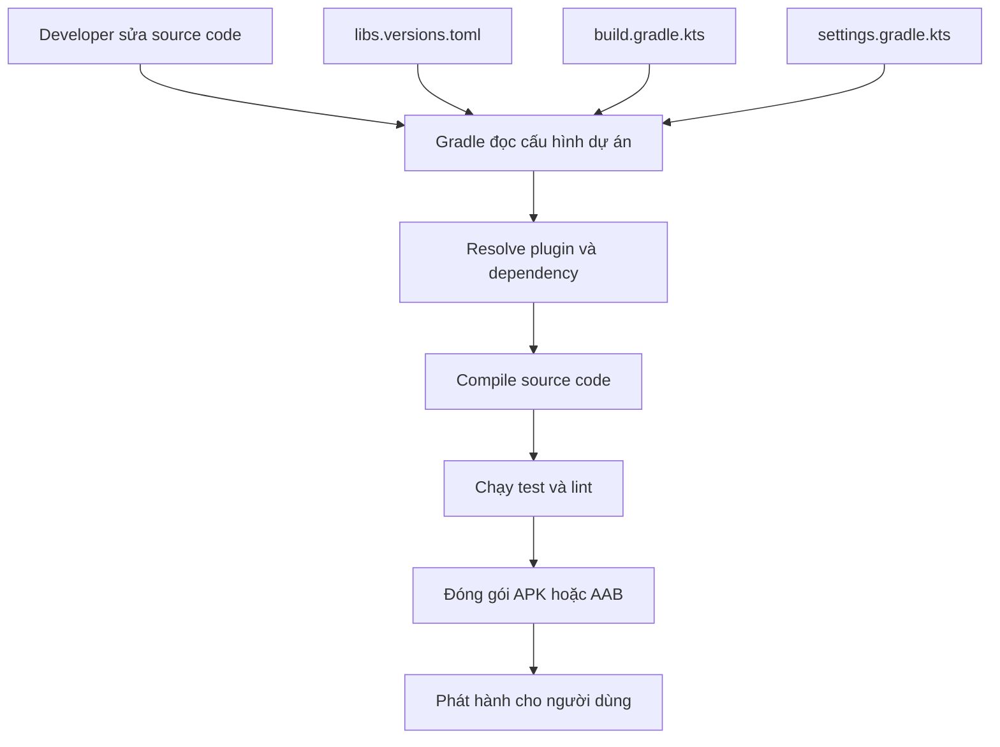
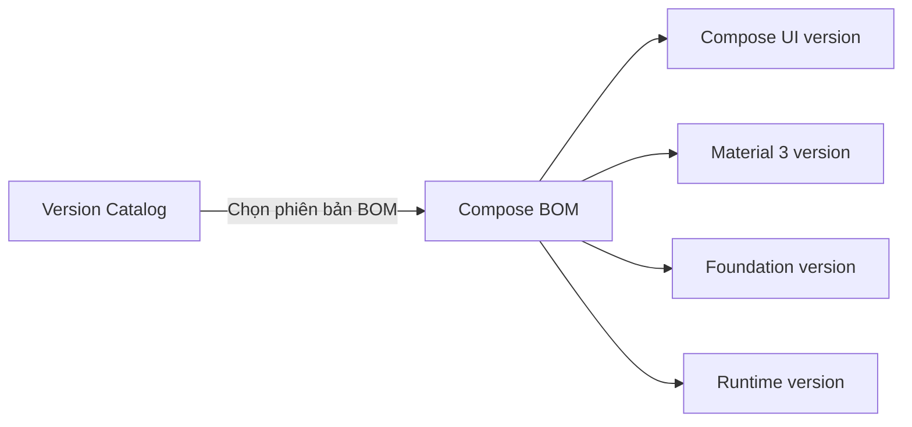

# 030 — Version Catalog

**Học phần:** 01 — Language and Android Fundamentals
**Module:** Module 02 — Android Fundamentals
**Nhóm nội dung:** Gradle
**Nguồn roadmap:** Android Fundamentals / Gradle
**Loại bài:** Lesson
**Thứ tự trong module:** 030
**Thời lượng gợi ý:** 24 phút

---


> **Version Catalog** là nơi tập trung tên, tọa độ và phiên bản của các thư viện, plugin Gradle để các module trong dự án có thể sử dụng thông qua những alias ngắn gọn, có hỗ trợ tự động hoàn thành và kiểm tra kiểu từ IDE.

---

## 1. Tóm tắt

Trong một dự án Android nhỏ, lập trình viên có thể khai báo dependency trực tiếp trong `app/build.gradle.kts`:

```kotlin
dependencies {
    implementation("androidx.core:core-ktx:1.17.0")
    implementation("androidx.lifecycle:lifecycle-runtime-ktx:2.9.4")
}
```

Cách này vẫn hoạt động, nhưng khi dự án có nhiều module, cùng một dependency và phiên bản có thể bị lặp lại ở nhiều file:

```text
app/build.gradle.kts
feature/home/build.gradle.kts
feature/profile/build.gradle.kts
core/network/build.gradle.kts
core/database/build.gradle.kts
```

Nếu cần nâng phiên bản một thư viện, lập trình viên phải tìm và sửa nhiều nơi. Việc này làm tăng nguy cơ:

* Module sử dụng các phiên bản không đồng nhất.
* Bỏ sót dependency khi nâng cấp.
* Sinh lỗi build hoặc lỗi runtime khó phát hiện.
* Pull request có quá nhiều thay đổi không cần thiết.
* Khó kiểm tra toàn bộ thư viện đang được dự án sử dụng.

Version Catalog giải quyết vấn đề trên bằng cách đưa các khai báo dependency và plugin về một vị trí trung tâm, thường là:

```text
gradle/libs.versions.toml
```

Các module sau đó sử dụng alias như:

```kotlin
implementation(libs.androidx.core.ktx)
```

Android hiện khuyến nghị sử dụng Version Catalog để quản lý build dependency; đây cũng là cách được các dự án Android mới sử dụng mặc định.

---

## 2. Mục tiêu học tập

Sau bài học, anh có thể:

* Giải thích Version Catalog bằng ngôn ngữ của mình.
* Hiểu vai trò của file `libs.versions.toml`.
* Phân biệt bốn khu vực:

  * `[versions]`
  * `[libraries]`
  * `[plugins]`
  * `[bundles]`
* Sử dụng dependency alias trong Kotlin DSL.
* Sử dụng plugin alias trong file Gradle.
* Kết hợp Version Catalog với BOM.
* Di chuyển dependency từ cách khai báo trực tiếp sang Version Catalog.
* Phân tích ảnh hưởng của Version Catalog đến khả năng bảo trì và độ an toàn khi release.
* Phát hiện những lỗi phổ biến khi đặt alias hoặc tham chiếu phiên bản.

---

## 3. Version Catalog là gì?

Version Catalog là một danh mục tập trung chứa thông tin về:

```text
Dependency
├── Group
├── Artifact name
├── Version
└── Alias dùng trong build script

Plugin
├── Plugin ID
├── Version
└── Alias dùng trong build script
```

Ví dụ, dependency đầy đủ:

```text
androidx.core:core-ktx:1.17.0
```

có thể được biểu diễn trong Version Catalog bằng alias:

```toml
androidx-core-ktx
```

Sau đó được sử dụng trong Kotlin DSL:

```kotlin
implementation(libs.androidx.core.ktx)
```

Gradle tạo ra các accessor an toàn kiểu từ alias trong catalog. Nhờ đó, Android Studio có thể tự động hoàn thành, đánh dấu alias bị sai và phát hiện dependency không tồn tại sớm hơn so với việc sử dụng chuỗi thuần túy.

---

## 4. Version Catalog nằm ở đâu trong ứng dụng?

Version Catalog thuộc **build layer**, không thuộc code chạy trực tiếp trên thiết bị.



Version Catalog được Gradle đọc trong quá trình cấu hình và resolve dependency. Nó không trực tiếp quản lý:

* Activity lifecycle.
* Compose state.
* ViewModel.
* Navigation.
* Dữ liệu người dùng.
* Network request.
* Database.
* Trạng thái khi xoay màn hình.

Tuy nhiên, nó gián tiếp ảnh hưởng đến những khu vực này vì phiên bản thư viện được chọn có thể quyết định API, hành vi, độ ổn định và khả năng tương thích của ứng dụng.

Ví dụ:

```text
Version Catalog
      ↓
Phiên bản Lifecycle / Compose / Room / Retrofit
      ↓
API và hành vi thư viện
      ↓
Build, test và runtime của ứng dụng
      ↓
Trải nghiệm người dùng
```

---

## 5. Cấu trúc cơ bản của dự án

```text
MyAndroidApp/
├── app/
│   └── build.gradle.kts
│
├── feature/
│   ├── home/
│   │   └── build.gradle.kts
│   └── profile/
│       └── build.gradle.kts
│
├── gradle/
│   ├── libs.versions.toml
│   └── wrapper/
│       └── gradle-wrapper.properties
│
├── build.gradle.kts
├── settings.gradle.kts
└── gradle.properties
```

File mặc định của Version Catalog là:

```text
gradle/libs.versions.toml
```

Khi sử dụng đúng vị trí và tên mặc định này, Gradle tự động tạo catalog có tên `libs`. Android cũng khuyến nghị giữ tên mặc định để tránh phải cấu hình bổ sung và nhận được hỗ trợ tốt hơn từ Android Studio.

---

## 6. Bốn phần chính trong `libs.versions.toml`

Một Version Catalog thường gồm bốn bảng:

```toml
[versions]

[libraries]

[bundles]

[plugins]
```

### 6.1. `[versions]`

Khu vực này chứa các phiên bản có thể tái sử dụng:

```toml
[versions]
agp = "9.3.0"
coreKtx = "1.17.0"
lifecycle = "2.9.4"
junit = "4.13.2"
```

Tên bên trái là alias phiên bản:

```toml
lifecycle = "2.9.4"
```

Alias `lifecycle` có thể được nhiều thư viện dùng chung:

```toml
androidx-lifecycle-runtime-ktx = {
    module = "androidx.lifecycle:lifecycle-runtime-ktx",
    version.ref = "lifecycle"
}

androidx-lifecycle-viewmodel-ktx = {
    module = "androidx.lifecycle:lifecycle-viewmodel-ktx",
    version.ref = "lifecycle"
}
```

Như vậy, khi nâng toàn bộ nhóm Lifecycle, chỉ cần sửa một dòng:

```toml
lifecycle = "2.9.4"
```

> Các số phiên bản trong bài là ví dụ minh họa. Khi tạo dự án thật, hãy dùng phiên bản tương thích với Android Studio, AGP và Gradle Wrapper của dự án.

---

### 6.2. `[libraries]`

Khu vực này định nghĩa các thư viện:

```toml
[libraries]
androidx-core-ktx = {
    group = "androidx.core",
    name = "core-ktx",
    version.ref = "coreKtx"
}
```

Có thể viết ngắn hơn bằng `module`:

```toml
[libraries]
androidx-core-ktx = {
    module = "androidx.core:core-ktx",
    version.ref = "coreKtx"
}
```

Hai cách trên có ý nghĩa tương đương.

#### Khai báo phiên bản trực tiếp

```toml
[libraries]
junit = {
    module = "junit:junit",
    version = "4.13.2"
}
```

#### Tham chiếu phiên bản dùng chung

```toml
[versions]
room = "2.8.4"

[libraries]
androidx-room-runtime = {
    module = "androidx.room:room-runtime",
    version.ref = "room"
}

androidx-room-ktx = {
    module = "androidx.room:room-ktx",
    version.ref = "room"
}

androidx-room-compiler = {
    module = "androidx.room:room-compiler",
    version.ref = "room"
}
```

---

### 6.3. `[plugins]`

Khu vực này khai báo Gradle plugin:

```toml
[versions]
agp = "9.3.0"
ksp = "2.3.4"

[plugins]
android-application = {
    id = "com.android.application",
    version.ref = "agp"
}

android-library = {
    id = "com.android.library",
    version.ref = "agp"
}

ksp = {
    id = "com.google.devtools.ksp",
    version.ref = "ksp"
}
```

Plugin được sử dụng bằng cú pháp `alias`:

```kotlin
plugins {
    alias(libs.plugins.android.application)
}
```

Android hướng dẫn sử dụng `alias(...)` cho plugin đến từ Version Catalog và tiếp tục dùng `id(...)` cho những plugin không được khai báo trong catalog, chẳng hạn một số convention plugin nội bộ.

---

### 6.4. `[bundles]`

Bundle gom nhiều dependency alias thành một nhóm:

```toml
[bundles]
room = [
    "androidx-room-runtime",
    "androidx-room-ktx"
]
```

Sử dụng trong module:

```kotlin
dependencies {
    implementation(libs.bundles.room)
}
```

Thay vì:

```kotlin
dependencies {
    implementation(libs.androidx.room.runtime)
    implementation(libs.androidx.room.ktx)
}
```

Bundle hữu ích với những nhóm thường được cài cùng nhau:

```text
room
retrofit
okhttp
compose
testing
firebase
```

Gradle hỗ trợ bundle như một cách nhóm các dependency phổ biến trong catalog.

> Bundle chỉ giúp khai báo ngắn hơn. Bundle không tự bảo đảm rằng các thư viện có phiên bản tương thích với nhau.

---

## 7. Alias được chuyển thành accessor như thế nào?

Alias trong TOML thường sử dụng dấu gạch ngang:

```toml
androidx-lifecycle-runtime-ktx
```

Trong Gradle Kotlin DSL, dấu gạch ngang được chuyển thành dấu chấm:

```kotlin
libs.androidx.lifecycle.runtime.ktx
```

Một số ví dụ:

| Alias trong TOML        | Accessor trong Gradle              |
| ----------------------- | ---------------------------------- |
| `junit`                 | `libs.junit`                       |
| `androidx-core-ktx`     | `libs.androidx.core.ktx`           |
| `androidx-room-runtime` | `libs.androidx.room.runtime`       |
| `retrofit-kotlinx-json` | `libs.retrofit.kotlinx.json`       |
| `android-application`   | `libs.plugins.android.application` |
| `compose` trong bundle  | `libs.bundles.compose`             |

Gradle chuyển các phần của alias thành accessor phân cấp để IDE có thể gợi ý theo từng nhóm.

---

## 8. Ví dụ hoàn chỉnh cho một ứng dụng Android

Giả sử ứng dụng có:

* Jetpack Compose.
* Lifecycle.
* Navigation.
* Room.
* JUnit.
* Android Application Plugin.
* KSP.

### 8.1. File `gradle/libs.versions.toml`

```toml
[versions]
agp = "9.3.0"
coreKtx = "1.17.0"
lifecycle = "2.9.4"
navigation = "2.9.3"
room = "2.8.4"
ksp = "2.3.4"
junit = "4.13.2"
androidxJunit = "1.3.0"
espresso = "3.7.0"
composeBom = "2026.07.01"

[libraries]
androidx-core-ktx = {
    module = "androidx.core:core-ktx",
    version.ref = "coreKtx"
}

androidx-lifecycle-runtime-ktx = {
    module = "androidx.lifecycle:lifecycle-runtime-ktx",
    version.ref = "lifecycle"
}

androidx-lifecycle-viewmodel-compose = {
    module = "androidx.lifecycle:lifecycle-viewmodel-compose",
    version.ref = "lifecycle"
}

androidx-navigation-compose = {
    module = "androidx.navigation:navigation-compose",
    version.ref = "navigation"
}

androidx-room-runtime = {
    module = "androidx.room:room-runtime",
    version.ref = "room"
}

androidx-room-ktx = {
    module = "androidx.room:room-ktx",
    version.ref = "room"
}

androidx-room-compiler = {
    module = "androidx.room:room-compiler",
    version.ref = "room"
}

androidx-compose-bom = {
    module = "androidx.compose:compose-bom",
    version.ref = "composeBom"
}

androidx-compose-ui = {
    module = "androidx.compose.ui:ui"
}

androidx-compose-ui-tooling-preview = {
    module = "androidx.compose.ui:ui-tooling-preview"
}

androidx-compose-material3 = {
    module = "androidx.compose.material3:material3"
}

androidx-compose-ui-tooling = {
    module = "androidx.compose.ui:ui-tooling"
}

junit = {
    module = "junit:junit",
    version.ref = "junit"
}

androidx-test-ext-junit = {
    module = "androidx.test.ext:junit",
    version.ref = "androidxJunit"
}

androidx-test-espresso-core = {
    module = "androidx.test.espresso:espresso-core",
    version.ref = "espresso"
}

[bundles]
lifecycle = [
    "androidx-lifecycle-runtime-ktx",
    "androidx-lifecycle-viewmodel-compose"
]

room = [
    "androidx-room-runtime",
    "androidx-room-ktx"
]

compose = [
    "androidx-compose-ui",
    "androidx-compose-ui-tooling-preview",
    "androidx-compose-material3"
]

[plugins]
android-application = {
    id = "com.android.application",
    version.ref = "agp"
}

android-library = {
    id = "com.android.library",
    version.ref = "agp"
}

ksp = {
    id = "com.google.devtools.ksp",
    version.ref = "ksp"
}
```

---

### 8.2. File `build.gradle.kts` cấp project

```kotlin
plugins {
    alias(libs.plugins.android.application) apply false
    alias(libs.plugins.android.library) apply false
    alias(libs.plugins.ksp) apply false
}
```

`apply false` cho Gradle biết plugin và phiên bản tồn tại ở cấp project nhưng chưa áp dụng plugin vào project gốc.

Mỗi module sẽ tự áp dụng plugin phù hợp.

---

### 8.3. File `app/build.gradle.kts`

```kotlin
plugins {
    alias(libs.plugins.android.application)
    alias(libs.plugins.ksp)
}

android {
    namespace = "com.example.versioncatalogdemo"
    compileSdk = 36

    defaultConfig {
        applicationId = "com.example.versioncatalogdemo"
        minSdk = 24
        targetSdk = 36
        versionCode = 1
        versionName = "1.0"
    }

    buildFeatures {
        compose = true
    }
}

dependencies {
    implementation(libs.androidx.core.ktx)

    implementation(libs.bundles.lifecycle)
    implementation(libs.androidx.navigation.compose)

    implementation(libs.bundles.room)
    ksp(libs.androidx.room.compiler)

    implementation(platform(libs.androidx.compose.bom))
    implementation(libs.bundles.compose)

    debugImplementation(libs.androidx.compose.ui.tooling)

    testImplementation(libs.junit)
    androidTestImplementation(libs.androidx.test.ext.junit)
    androidTestImplementation(libs.androidx.test.espresso.core)
}
```

---

## 9. Version Catalog kết hợp với BOM

BOM, viết tắt của **Bill of Materials**, giúp đồng bộ phiên bản của một nhóm thư viện có liên quan.

Ví dụ với Compose:

```toml
[versions]
composeBom = "2026.07.01"

[libraries]
androidx-compose-bom = {
    module = "androidx.compose:compose-bom",
    version.ref = "composeBom"
}

androidx-compose-ui = {
    module = "androidx.compose.ui:ui"
}

androidx-compose-material3 = {
    module = "androidx.compose.material3:material3"
}
```

Các thư viện Compose không cần khai báo phiên bản riêng:

```toml
androidx-compose-ui = {
    module = "androidx.compose.ui:ui"
}
```

Trong module:

```kotlin
dependencies {
    implementation(platform(libs.androidx.compose.bom))

    implementation(libs.androidx.compose.ui)
    implementation(libs.androidx.compose.material3)
}
```

Luồng resolve:



Version Catalog cung cấp alias để tham chiếu BOM và các thư viện; BOM mới là thành phần cung cấp hoặc đồng bộ phiên bản cho nhóm dependency liên quan. Android cũng hướng dẫn bỏ phiên bản khỏi những thư viện đã được BOM quản lý.

---

## 10. Version Catalog không phải là gì?

### 10.1. Không phải Gradle Wrapper

Gradle Wrapper xác định phiên bản Gradle chạy dự án:

```text
gradle/wrapper/gradle-wrapper.properties
```

Ví dụ:

```properties
distributionUrl=https\://services.gradle.org/distributions/gradle-9.6.1-bin.zip
```

Version Catalog quản lý dependency và plugin:

```text
gradle/libs.versions.toml
```

---

### 10.2. Không phải Android Gradle Plugin

Android Gradle Plugin cung cấp khả năng build ứng dụng Android:

```toml
[plugins]
android-application = {
    id = "com.android.application",
    version.ref = "agp"
}
```

Version Catalog chỉ lưu alias và phiên bản của plugin đó.

---

### 10.3. Không phải repository

Version Catalog không cho Gradle biết cần tải thư viện từ đâu.

Repository vẫn được khai báo trong `settings.gradle.kts`:

```kotlin
dependencyResolutionManagement {
    repositoriesMode.set(
        RepositoriesMode.FAIL_ON_PROJECT_REPOS
    )

    repositories {
        google()
        mavenCentral()
    }
}
```

Catalog cho biết:

```text
Tải thư viện nào?
Dùng phiên bản được yêu cầu nào?
Dùng alias nào?
```

Repository cho biết:

```text
Tìm và tải thư viện ở đâu?
```

---

### 10.4. Không phải cơ chế bắt buộc phiên bản

Version Catalog khai báo **requested version**, tức phiên bản mà dự án yêu cầu. Nó không bảo đảm tuyệt đối phiên bản đó sẽ là phiên bản cuối cùng được Gradle chọn.

Nếu dependency graph có nhiều yêu cầu, constraint hoặc platform, Gradle có thể resolve thành một phiên bản khác. Muốn kiểm soát hoặc đồng bộ phiên bản chặt chẽ hơn, dự án có thể cần:

* BOM.
* Gradle platform.
* Dependency constraints.
* Strict version.
* Dependency locking.

Gradle nêu rõ Version Catalog không tự cưỡng chế phiên bản trong quá trình giải quyết xung đột dependency.

---

## 11. Trước và sau khi dùng Version Catalog

### Trước

```kotlin
plugins {
    id("com.android.application") version "9.3.0"
}

dependencies {
    implementation("androidx.core:core-ktx:1.17.0")
    implementation("androidx.lifecycle:lifecycle-runtime-ktx:2.9.4")
    implementation("androidx.navigation:navigation-compose:2.9.3")
    testImplementation("junit:junit:4.13.2")
}
```

### Sau

```kotlin
plugins {
    alias(libs.plugins.android.application)
}

dependencies {
    implementation(libs.androidx.core.ktx)
    implementation(libs.androidx.lifecycle.runtime.ktx)
    implementation(libs.androidx.navigation.compose)
    testImplementation(libs.junit)
}
```

### So sánh

| Tiêu chí              | Khai báo trực tiếp        | Version Catalog               |
| --------------------- | ------------------------- | ----------------------------- |
| Vị trí phiên bản      | Nằm trong nhiều file      | Tập trung trong catalog       |
| Tự động hoàn thành    | Hạn chế với chuỗi         | Có accessor từ IDE            |
| Đổi phiên bản         | Có thể phải sửa nhiều nơi | Thường sửa một vị trí         |
| Multi-module          | Dễ bị lệch phiên bản      | Dễ dùng chung alias           |
| Kiểm tra dependency   | Phân tán                  | Dễ xem tổng thể               |
| Pull request nâng cấp | Nhiều file thay đổi       | Thường tập trung vào TOML     |
| Sai chính tả          | Có thể phát hiện muộn     | IDE có thể đánh dấu alias sai |

---

## 12. Di chuyển dự án cũ sang Version Catalog

Không cần chuyển toàn bộ dự án trong một lần. Build script và Version Catalog có thể tồn tại song song trong giai đoạn migration. Android đề xuất chuyển từng dependency theo thứ tự: thêm catalog entry, sync project rồi thay chuỗi cũ bằng accessor mới.

### Bước 1: Tìm dependency cũ

```kotlin
implementation(
    "androidx.core:core-ktx:1.17.0"
)
```

### Bước 2: Thêm phiên bản

```toml
[versions]
coreKtx = "1.17.0"
```

### Bước 3: Thêm library alias

```toml
[libraries]
androidx-core-ktx = {
    module = "androidx.core:core-ktx",
    version.ref = "coreKtx"
}
```

### Bước 4: Sync Gradle

Trong Android Studio:

```text
File
└── Sync Project with Gradle Files
```

Hoặc dùng terminal:

```bash
./gradlew help
```

Trên Windows:

```powershell
gradlew.bat help
```

### Bước 5: Thay khai báo cũ

```kotlin
implementation(libs.androidx.core.ktx)
```

### Bước 6: Build và test

```bash
./gradlew :app:assembleDebug
./gradlew :app:testDebugUnitTest
./gradlew :app:lintDebug
```

---

## 13. Sử dụng nhiều Version Catalog

Đối với dự án lớn, có thể tách catalog chính và catalog dành cho test:

```text
gradle/
├── libs.versions.toml
└── test-libs.versions.toml
```

Trong `settings.gradle.kts`:

```kotlin
dependencyResolutionManagement {
    versionCatalogs {
        create("testLibs") {
            from(
                files("gradle/test-libs.versions.toml")
            )
        }
    }
}
```

Sử dụng:

```kotlin
dependencies {
    testImplementation(testLibs.junit)
    testImplementation(testLibs.mockk)
}
```

Tuy nhiên, không nên tách catalog quá sớm. Với phần lớn ứng dụng nhỏ và trung bình, một file `libs.versions.toml` được tổ chức tốt đã đủ.

---

## 14. Cách đặt tên alias

Tên alias tốt cần:

* Dễ tìm bằng autocomplete.
* Thể hiện nhóm hoặc hệ sinh thái.
* Không phụ thuộc quá nhiều vào cấu trúc module hiện tại.
* Nhất quán giữa các dependency.
* Không quá dài.
* Không quá chung chung.

Gradle khuyến nghị tên alias có tính mô tả, thường gồm một đến ba phần và sử dụng dấu gạch ngang để tách các phần.

### Nên dùng

```toml
androidx-core-ktx
androidx-room-runtime
androidx-navigation-compose
retrofit-core
retrofit-kotlinx-serialization
okhttp-logging
```

### Không nên dùng

```toml
lib1
lib2
core
runtime
dependency
new-library
my-lib
```

### Quy tắc gợi ý

```text
Nhóm thư viện - Chức năng - Biến thể
```

Ví dụ:

```text
androidx-room-runtime
        │      │
        │      └── Artifact hoặc chức năng
        └───────── Hệ sinh thái hoặc nhóm
```

---

## 15. Lỗi phổ biến của lập trình viên mới

### Lỗi 1: Tạo sai vị trí file

Sai:

```text
libs.versions.toml
```

Đúng:

```text
gradle/libs.versions.toml
```

Triệu chứng:

```text
Unresolved reference: libs
```

Cách xử lý:

1. Kiểm tra đường dẫn.
2. Kiểm tra tên file.
3. Sync lại Gradle.
4. Kiểm tra lỗi cú pháp TOML.

---

### Lỗi 2: Viết nhầm `version.ref`

```toml
[versions]
room = "2.8.4"

[libraries]
androidx-room-runtime = {
    module = "androidx.room:room-runtime",
    version.ref = "rooms"
}
```

`rooms` không tồn tại.

Sửa thành:

```toml
version.ref = "room"
```

Gradle có hướng dẫn riêng cho lỗi library tham chiếu đến một version alias chưa được định nghĩa.

---

### Lỗi 3: Dùng phiên bản động

Không nên:

```toml
coreKtx = "1.+"
```

Hoặc:

```toml
someLibrary = "latest.release"
```

Phiên bản động có thể làm dependency tự thay đổi giữa các lần build, gây khó tái hiện lỗi và ảnh hưởng hiệu năng resolve dependency. Android cảnh báo không nên dùng những phiên bản động như `3.+`.

Nên khóa phiên bản cụ thể:

```toml
coreKtx = "1.17.0"
```

---

### Lỗi 4: Khai báo cùng một phiên bản ở nhiều nơi

Không nên:

```toml
[libraries]
androidx-room-runtime = {
    module = "androidx.room:room-runtime",
    version = "2.8.4"
}

androidx-room-ktx = {
    module = "androidx.room:room-ktx",
    version = "2.8.4"
}

androidx-room-compiler = {
    module = "androidx.room:room-compiler",
    version = "2.8.4"
}
```

Nên:

```toml
[versions]
room = "2.8.4"

[libraries]
androidx-room-runtime = {
    module = "androidx.room:room-runtime",
    version.ref = "room"
}

androidx-room-ktx = {
    module = "androidx.room:room-ktx",
    version.ref = "room"
}

androidx-room-compiler = {
    module = "androidx.room:room-compiler",
    version.ref = "room"
}
```

---

### Lỗi 5: Cho rằng bundle tự áp dụng configuration

Khai báo:

```toml
[bundles]
room = [
    "androidx-room-runtime",
    "androidx-room-ktx",
    "androidx-room-compiler"
]
```

Sau đó:

```kotlin
implementation(libs.bundles.room)
```

Cách này sẽ đặt cả compiler vào `implementation`, trong khi Room compiler thường phải được đưa vào `ksp` hoặc cơ chế xử lý annotation tương ứng.

Nên tách:

```toml
[bundles]
room-runtime = [
    "androidx-room-runtime",
    "androidx-room-ktx"
]
```

```kotlin
dependencies {
    implementation(libs.bundles.room.runtime)
    ksp(libs.androidx.room.compiler)
}
```

Bundle chỉ là danh sách dependency, không biết dependency nào cần `implementation`, `ksp`, `debugImplementation` hay `testImplementation`.

---

### Lỗi 6: Nghĩ rằng catalog tự kiểm tra tính tương thích

Ví dụ:

```toml
[versions]
agp = "9.3.0"
ksp = "phiên-bản-không-tương-thích"
```

Version Catalog vẫn có thể đọc đúng cú pháp, nhưng build có thể thất bại do các công cụ không tương thích.

Catalog tập trung hóa phiên bản, nhưng lập trình viên vẫn phải kiểm tra:

* AGP tương thích với Gradle nào.
* AGP tương thích với Android Studio nào.
* Plugin tương thích với phiên bản Kotlin hoặc AGP nào.
* Thư viện yêu cầu `compileSdk` tối thiểu bao nhiêu.

---

### Lỗi 7: Dùng alias dành riêng

Một số tên có ý nghĩa đặc biệt hoặc được Gradle dành riêng, chẳng hạn:

```text
versions
bundles
plugins
extensions
class
```

Không nên dùng chúng làm library alias độc lập. Gradle có thể báo lỗi catalog hoặc accessor.

---

## 16. Debug dependency

Version Catalog giúp quản lý dependency, nhưng khi gặp xung đột cần xem dependency graph thực tế.

### Xem dependency của runtime classpath

```bash
./gradlew :app:dependencies \
    --configuration debugRuntimeClasspath
```

Windows PowerShell:

```powershell
gradlew.bat :app:dependencies `
    --configuration debugRuntimeClasspath
```

### Xem lý do Gradle chọn một dependency

```bash
./gradlew :app:dependencyInsight \
    --dependency lifecycle-runtime \
    --configuration debugRuntimeClasspath
```

### Cần kiểm tra gì?

```text
Dependency được yêu cầu
        ↓
Dependency bắc cầu yêu cầu phiên bản khác?
        ↓
Có BOM hoặc platform không?
        ↓
Có constraint không?
        ↓
Phiên bản cuối cùng Gradle chọn là gì?
```

Điều quan trọng là phân biệt:

```text
Phiên bản ghi trong Version Catalog
```

và:

```text
Phiên bản thực tế được Gradle resolve
```

Hai phiên bản này có thể khác nhau khi dependency graph có xung đột hoặc constraint.

---

## 17. Kiểm thử sau khi thay đổi Version Catalog

Version Catalog không phải code runtime, nhưng mỗi lần nâng dependency có thể thay đổi code được biên dịch và hành vi của ứng dụng.

### 17.1. Kiểm tra Gradle Sync

```text
Sync Project with Gradle Files
```

Không được có:

```text
Invalid catalog definition
Unresolved reference
Could not resolve dependency
Plugin not found
```

---

### 17.2. Build debug

```bash
./gradlew :app:assembleDebug
```

Kiểm tra:

* Plugin hoạt động.
* Dependency resolve thành công.
* Source code vẫn compile.
* Resource merge không lỗi.

---

### 17.3. Chạy unit test

```bash
./gradlew :app:testDebugUnitTest
```

---

### 17.4. Chạy Android test

```bash
./gradlew :app:connectedDebugAndroidTest
```

Cần có emulator hoặc thiết bị thật.

---

### 17.5. Chạy lint

```bash
./gradlew :app:lintDebug
```

---

### 17.6. Kiểm tra release build

```bash
./gradlew :app:bundleRelease
```

Đặc biệt quan trọng khi thay đổi:

* AGP.
* Compose.
* R8 hoặc ProGuard.
* Serialization.
* Room.
* KSP.
* Firebase.
* Networking stack.

---

## 18. Ảnh hưởng đến UX và độ ổn định

Version Catalog không trực tiếp vẽ giao diện, nhưng quản lý phiên bản của các thư viện tạo nên giao diện và hành vi ứng dụng.

### Ví dụ 1: Compose

```text
Nâng Compose
    ↓
API hoặc rendering thay đổi
    ↓
Layout có thể hiển thị khác
    ↓
Cần screenshot test và UI test
```

### Ví dụ 2: Navigation

```text
Nâng Navigation
    ↓
Cách lưu hoặc khôi phục back stack có thể thay đổi
    ↓
Cần kiểm tra rotate, process recreation và deep link
```

### Ví dụ 3: Room

```text
Nâng Room
    ↓
Generated code hoặc schema validation thay đổi
    ↓
Cần build lại, chạy migration test và database test
```

### Ví dụ 4: Networking

```text
Nâng Retrofit / OkHttp
    ↓
Timeout, TLS, converter hoặc interceptor có thể thay đổi
    ↓
Cần kiểm tra login, retry, upload và error handling
```

Vì vậy:

> Thay đổi một dòng trong `libs.versions.toml` có thể tạo ra ảnh hưởng trên toàn bộ ứng dụng.

---

## 19. Ảnh hưởng đến lifecycle và state

Version Catalog không lưu state, nhưng dependency được quản lý bởi catalog có thể liên quan đến state.

Ví dụ:

```toml
androidx-lifecycle-runtime-ktx
androidx-lifecycle-viewmodel-compose
androidx-navigation-compose
androidx-savedstate
```

Khi nâng các dependency này, cần kiểm tra:

* State có còn tồn tại sau khi xoay màn hình không?
* ViewModel có bị tạo lại không cần thiết không?
* Navigation back stack có được khôi phục không?
* `SavedStateHandle` có hoạt động đúng không?
* App quay lại từ background có bị crash không?
* Process recreation có làm mất dữ liệu tạm thời không?

Version Catalog giúp biết chính xác nhóm phiên bản nào đã được thay đổi, nhưng test vẫn phải bảo vệ hành vi của ứng dụng.

---

## 20. Ảnh hưởng đến quy trình release

Version Catalog làm cho dependency upgrade dễ review hơn:

```diff
[versions]
-lifecycle = "2.9.3"
+lifecycle = "2.9.4"
```

Reviewer có thể nhận ra ngay:

* Thư viện nào được nâng.
* Nhóm module nào có thể bị ảnh hưởng.
* Có cần migration hay không.
* Có cần cập nhật baseline profile không.
* Có cần kiểm tra R8 rules không.
* Có cần chạy regression test không.

### Release checklist khi nâng dependency

* [ ] Đọc release notes của thư viện.
* [ ] Kiểm tra breaking change.
* [ ] Kiểm tra yêu cầu `minSdk` và `compileSdk`.
* [ ] Kiểm tra tương thích AGP, Gradle và Kotlin.
* [ ] Sync dự án.
* [ ] Build tất cả build types cần thiết.
* [ ] Build các product flavor quan trọng.
* [ ] Chạy unit test.
* [ ] Chạy UI hoặc instrumentation test.
* [ ] Chạy lint.
* [ ] Kiểm tra dependency graph.
* [ ] Kiểm tra APK hoặc AAB release.
* [ ] Smoke test các user flow quan trọng.
* [ ] Ghi dependency upgrade vào pull request.

---

## 21. Best practices

### 21.1. Giữ một nguồn phiên bản duy nhất

```toml
[versions]
room = "2.8.4"
```

Không lặp lại cùng phiên bản ở nhiều dependency.

---

### 21.2. Đặt alias theo hệ sinh thái

```toml
androidx-room-runtime
androidx-room-ktx
androidx-room-compiler
```

Thay vì:

```toml
room1
room2
room3
```

---

### 21.3. Không tạo bundle quá lớn

Không nên:

```toml
[bundles]
everything = [
    "androidx-core-ktx",
    "androidx-room-runtime",
    "retrofit-core",
    "junit",
    "androidx-test-espresso-core"
]
```

Bundle này trộn:

* Production dependency.
* Database dependency.
* Network dependency.
* Unit test dependency.
* Instrumentation test dependency.

Nên chia theo mục đích:

```toml
[bundles]
room-runtime = [
    "androidx-room-runtime",
    "androidx-room-ktx"
]

networking = [
    "retrofit-core",
    "retrofit-kotlinx-serialization",
    "okhttp-logging"
]
```

---

### 21.4. Không giấu toàn bộ dependency trong bundle

Trong một số trường hợp, viết riêng từng dependency giúp người đọc hiểu module rõ hơn:

```kotlin
dependencies {
    implementation(libs.retrofit.core)
    implementation(libs.okhttp.logging)
}
```

Dễ hiểu hơn một bundle có tên quá chung:

```kotlin
implementation(libs.bundles.common)
```

---

### 21.5. Nâng từng nhóm dependency

Thay vì nâng cùng lúc:

```text
AGP
Compose
Room
Navigation
Retrofit
Hilt
KSP
```

Hãy chia thành các pull request nhỏ:

```text
PR 1: Upgrade Room
PR 2: Upgrade Navigation
PR 3: Upgrade Compose
PR 4: Upgrade build toolchain
```

Việc này giúp xác định nguyên nhân khi build hoặc test thất bại.

---

### 21.6. Commit catalog vào Git

File sau phải nằm trong source control:

```text
gradle/libs.versions.toml
```

Điều này giúp:

* CI sử dụng cùng phiên bản.
* Thành viên trong nhóm có cùng dependency.
* Có lịch sử nâng cấp rõ ràng.
* Dễ rollback khi dependency mới gây lỗi.

---

## 22. Bài thực hành

### Yêu cầu

Tạo một ứng dụng Android nhỏ có:

* Một module `app`.
* Jetpack Compose.
* Lifecycle.
* Navigation.
* JUnit.
* Version Catalog.

### Bước 1: Tạo catalog

```toml
[versions]
coreKtx = "1.17.0"
lifecycle = "2.9.4"
navigation = "2.9.3"
junit = "4.13.2"

[libraries]
androidx-core-ktx = {
    module = "androidx.core:core-ktx",
    version.ref = "coreKtx"
}

androidx-lifecycle-runtime-ktx = {
    module = "androidx.lifecycle:lifecycle-runtime-ktx",
    version.ref = "lifecycle"
}

androidx-navigation-compose = {
    module = "androidx.navigation:navigation-compose",
    version.ref = "navigation"
}

junit = {
    module = "junit:junit",
    version.ref = "junit"
}
```

### Bước 2: Sử dụng alias

```kotlin
dependencies {
    implementation(libs.androidx.core.ktx)
    implementation(libs.androidx.lifecycle.runtime.ktx)
    implementation(libs.androidx.navigation.compose)

    testImplementation(libs.junit)
}
```

### Bước 3: Build

```bash
./gradlew :app:assembleDebug
```

### Bước 4: Viết ghi chú năm dòng

```markdown
Version Catalog tập trung dependency và plugin vào một catalog chung.
Catalog mặc định nằm tại gradle/libs.versions.toml.
Các module sử dụng dependency thông qua accessor bắt đầu bằng libs.
Version Catalog giúp giảm phiên bản bị lặp hoặc không đồng nhất.
Sau mỗi lần nâng dependency vẫn phải build, test và kiểm tra release.
```

---

## 23. Bài tập mở rộng

### Bài 1: Tạo bundle

Tạo bundle cho:

```text
Room runtime
Room KTX
```

Nhưng giữ compiler riêng để sử dụng với `ksp`.

---

### Bài 2: Di chuyển plugin

Chuyển plugin:

```kotlin
id("com.android.application") version "..."
```

sang:

```kotlin
alias(libs.plugins.android.application)
```

---

### Bài 3: Dùng Compose BOM

Khai báo:

```toml
androidx-compose-bom
androidx-compose-ui
androidx-compose-material3
```

Sau đó sử dụng:

```kotlin
implementation(platform(libs.androidx.compose.bom))
```

---

### Bài 4: Phân tích dependency

Chạy:

```bash
./gradlew :app:dependencies \
    --configuration debugRuntimeClasspath
```

Tìm một dependency có nhiều phiên bản được yêu cầu và ghi lại phiên bản cuối cùng mà Gradle chọn.

---

### Bài 5: Tạo lỗi có chủ đích

Thay:

```toml
version.ref = "lifecycle"
```

thành:

```toml
version.ref = "lifeCycleNotFound"
```

Sau đó:

1. Sync project.
2. Đọc thông báo lỗi.
3. Sửa alias.
4. Build lại.

---

## 24. Artifact đưa vào portfolio

Có thể tạo một repository nhỏ:

```text
android-version-catalog-demo/
├── app/
├── feature-home/
├── feature-profile/
├── gradle/
│   └── libs.versions.toml
├── build.gradle.kts
├── settings.gradle.kts
└── README.md
```

### Nội dung README gợi ý

````markdown
# Android Version Catalog Demo

Dự án minh họa cách quản lý dependency và Gradle plugin
bằng file gradle/libs.versions.toml.

## Nội dung

- Library aliases
- Plugin aliases
- Shared versions
- Dependency bundles
- Compose BOM
- Multi-module dependency management

## Kiểm tra

```bash
./gradlew assembleDebug
./gradlew test
./gradlew lint
````

````

### Screenshot nên bổ sung

- File `libs.versions.toml`.
- Autocomplete của `libs.androidx...`.
- Dependency graph.
- Kết quả build thành công.
- Cấu trúc multi-module.

---

## 25. Câu hỏi phỏng vấn

### Câu 1: Version Catalog giải quyết vấn đề gì?

Version Catalog tập trung tọa độ, alias và phiên bản dependency hoặc plugin để các module có thể sử dụng nhất quán, giảm lặp và nhận được hỗ trợ autocomplete từ IDE.

### Câu 2: File mặc định nằm ở đâu?

```text
gradle/libs.versions.toml
````

### Câu 3: `[versions]` khác `[libraries]` như thế nào?

* `[versions]` lưu giá trị phiên bản có thể tái sử dụng.
* `[libraries]` lưu dependency coordinate và tham chiếu đến phiên bản.

### Câu 4: Bundle có tác dụng gì?

Bundle gom nhiều library alias để có thể khai báo cùng lúc trong một dependency configuration.

### Câu 5: Version Catalog có bắt buộc Gradle dùng đúng phiên bản không?

Không. Catalog khai báo phiên bản được yêu cầu. Dependency conflict resolution, platform hoặc constraint có thể khiến Gradle chọn phiên bản khác.

### Câu 6: Version Catalog khác BOM thế nào?

* Version Catalog cung cấp alias và tập trung khai báo.
* BOM giúp đồng bộ phiên bản của một nhóm thư viện liên quan.
* Hai cơ chế có thể được sử dụng cùng nhau.

### Câu 7: Vì sao không nên dùng `1.+`?

Vì kết quả build có thể thay đổi theo thời gian, khó tái hiện lỗi và khó kiểm soát dependency được tải xuống.

### Câu 8: Version Catalog ảnh hưởng UX như thế nào?

Nó không trực tiếp tạo UX, nhưng quản lý phiên bản những thư viện tạo nên UI, navigation, state, database và network. Một dependency upgrade không được kiểm thử có thể gây regression cho người dùng.

---

## 26. Checklist hoàn thành

### Kiến thức

* [ ] Giải thích được Version Catalog.
* [ ] Biết vị trí của `libs.versions.toml`.
* [ ] Phân biệt `[versions]`, `[libraries]`, `[plugins]` và `[bundles]`.
* [ ] Hiểu alias được chuyển thành accessor như thế nào.
* [ ] Phân biệt Version Catalog với BOM.
* [ ] Hiểu Version Catalog không cưỡng chế phiên bản được resolve.

### Thực hành

* [ ] Tạo ít nhất ba library alias.
* [ ] Tạo ít nhất một plugin alias.
* [ ] Tạo ít nhất một bundle.
* [ ] Sử dụng alias trong `app/build.gradle.kts`.
* [ ] Sync Gradle thành công.
* [ ] Build debug thành công.
* [ ] Chạy unit test.
* [ ] Chạy lint.

### Production

* [ ] Không sử dụng dynamic version.
* [ ] Dependency alias có quy tắc đặt tên nhất quán.
* [ ] Catalog được commit vào Git.
* [ ] Có kiểm tra dependency graph.
* [ ] Có regression test cho dependency upgrade.
* [ ] Có release checklist khi nâng thư viện quan trọng.
* [ ] Có ghi rõ thay đổi dependency trong pull request.

---

## 27. Ghi nhớ nhanh

```text
libs.versions.toml
├── [versions]  → Phiên bản dùng chung
├── [libraries] → Dependency aliases
├── [bundles]   → Nhóm dependency aliases
└── [plugins]   → Gradle plugin aliases
```

```text
TOML alias:
androidx-room-runtime

Kotlin DSL accessor:
libs.androidx.room.runtime
```

```text
Version Catalog
    ≠ Gradle Wrapper
    ≠ Repository
    ≠ BOM
    ≠ Dependency lock
```

> **Version Catalog không làm ứng dụng chạy nhanh hơn một cách trực tiếp. Nó giúp hệ thống build dễ đọc, nhất quán, dễ nâng cấp và an toàn hơn trong quá trình phát triển cũng như phát hành.**

---

## 28. Tài liệu tham khảo

* Gradle User Manual — Version Catalogs.
* Android Developers — Migrate your build to version catalogs.
* Android Developers — Add build dependencies.
* Gradle — Troubleshoot Version Catalog problems.
* Gradle — Dependency management best practices.
