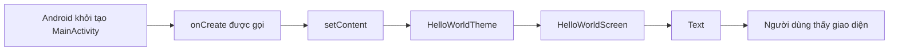
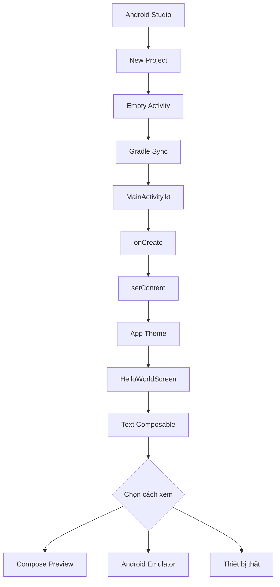
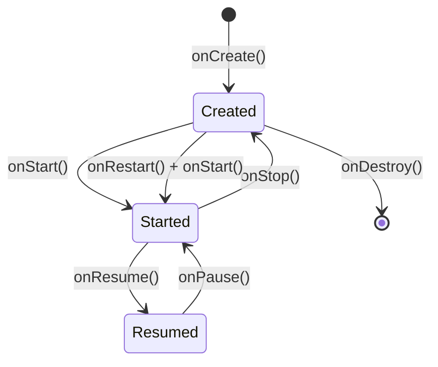
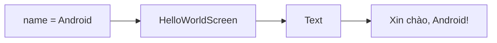
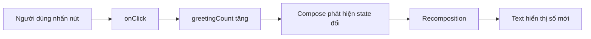
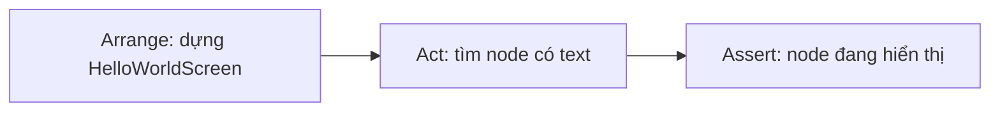
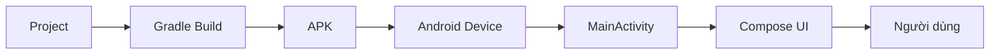

# 031 — Create a Basic Hello World App

**Học phần:** 01 — Language and Android Fundamentals
**Module:** Module 02 — Android Fundamentals
**Nhóm nội dung:** First App and Version Control
**Nguồn roadmap:** Android Fundamentals / First App and Version Control
**Loại bài:** Lesson
**Thứ tự trong module:** 031
**Thời lượng gợi ý:** 24 phút

---

## 1. Tóm tắt

Trong bài này, anh sẽ tạo một ứng dụng Android đầu tiên bằng:

* **Android Studio**
* **Kotlin**
* **Jetpack Compose**
* Template **Empty Activity**
* Android Emulator hoặc thiết bị Android thật

Ứng dụng sẽ hiển thị dòng chữ:

> **Xin chào, Android!**

Mặc dù rất đơn giản, bài Hello World giúp xác nhận toàn bộ chuỗi phát triển Android đang hoạt động:

```text
Tạo project
    ↓
Gradle đồng bộ dependency
    ↓
Kotlin được biên dịch
    ↓
APK debug được tạo
    ↓
Ứng dụng được cài lên thiết bị
    ↓
Activity khởi động
    ↓
Jetpack Compose dựng giao diện
    ↓
Người dùng nhìn thấy nội dung
```

Tài liệu Android hiện tại khuyến nghị dùng template **Empty Activity** làm điểm bắt đầu cho các dự án Jetpack Compose mới. Template này thiết lập sẵn Compose, Material Design và các thành phần cần thiết để chạy ứng dụng. Kotlin cũng là ngôn ngữ được khuyến nghị cho dự án Android mới. ([Android Developers][1])

> [!NOTE]
> Giao diện Android Studio có thể khác đôi chút giữa các phiên bản. Tên nút, vị trí menu hoặc hình ảnh template có thể thay đổi, nhưng quy trình tổng thể vẫn giống nhau. ([Android Developers][2])

---

## 2. Mục tiêu học tập

Sau bài học, anh có thể:

* Giải thích một ứng dụng Android được tạo và khởi chạy như thế nào.
* Tạo project Android bằng template **Empty Activity**.
* Xác định vai trò của `MainActivity`, `onCreate()` và `setContent()`.
* Viết một Composable hiển thị văn bản.
* Xem giao diện bằng Compose Preview.
* Chạy ứng dụng trên Emulator hoặc thiết bị thật.
* Hiểu mối liên hệ ban đầu giữa UI, lifecycle và state.
* Viết một UI test đơn giản.
* Lưu phiên bản đầu tiên của project bằng Git.
* Tạo một artifact nhỏ để đưa vào portfolio.

---

## 3. Kết quả cuối bài

Ứng dụng hoàn thành có cấu trúc như sau:

```text
HelloWorldApp
├── app
│   └── src
│       ├── main
│       │   ├── java/com/example/helloworld
│       │   │   ├── MainActivity.kt
│       │   │   └── ui/theme/
│       │   ├── res
│       │   │   └── values/strings.xml
│       │   └── AndroidManifest.xml
│       └── androidTest
│           └── HelloWorldScreenTest.kt
├── gradle
├── build.gradle.kts
├── settings.gradle.kts
└── README.md
```

Giao diện gồm một dòng chữ được đặt ở giữa màn hình:

```text
┌───────────────────────────┐
│                           │
│                           │
│    Xin chào, Android!     │
│                           │
│                           │
└───────────────────────────┘
```

---

## 4. Hình minh họa

### 4.1. Chọn template Empty Activity


*Nguồn ảnh: Android Developers.* Template hiện tại có thể thay đổi hình thức, nhưng với project Compose mới, anh nên tìm **Empty Activity** trong nhóm **Phone and Tablet**. 

### 4.2. Các khu vực chính trong Android Studio


Ba khu vực quan trọng:

1. **Project view:** Hiển thị file và thư mục.
2. **Code view:** Nơi viết Kotlin.
3. **Design/Preview view:** Xem trước giao diện Compose.

*Nguồn ảnh: Android Developers.* 

### 4.3. Kết quả Hello Android trong Preview


*Nguồn ảnh: Android Developers.* 

---

## 5. Khái niệm chính

### 5.1. Hello World không chỉ là một dòng chữ

Một ứng dụng Hello World kiểm tra đồng thời nhiều thành phần:

| Thành phần             | Điều được kiểm tra                        |
| ---------------------- | ----------------------------------------- |
| Android Studio         | IDE được cài và hoạt động                 |
| Gradle                 | Project đồng bộ và build thành công       |
| Android SDK            | Có đủ công cụ biên dịch                   |
| Kotlin                 | Source code không có lỗi                  |
| Android Manifest       | Activity khởi động được khai báo          |
| Emulator hoặc thiết bị | Có môi trường chạy ứng dụng               |
| Jetpack Compose        | UI được tạo thành công                    |
| Theme                  | Material theme được áp dụng               |
| Git                    | Source code có thể được quản lý phiên bản |

Vì vậy, khi nhìn thấy dòng **“Xin chào, Android!”**, anh đã xác nhận rằng toàn bộ pipeline cơ bản đang hoạt động.

---

### 5.2. Android Studio

Android Studio là môi trường phát triển chính thức dành cho Android. Nó cung cấp:

* Trình soạn thảo Kotlin.
* Gradle build system.
* Android SDK Manager.
* Device Manager.
* Android Emulator.
* Logcat.
* Debugger.
* Jetpack Compose Preview.
* Công cụ profiling và kiểm thử.

Android Studio có thể tạo project từ template, sau đó tự thiết lập source code, resource, manifest và cấu hình build ban đầu. ([Android Developers][1])

---

### 5.3. Jetpack Compose

Jetpack Compose là toolkit hiện đại để xây dựng giao diện Android bằng Kotlin.

Thay vì mô tả giao diện bằng XML:

```xml
<TextView
    android:text="Xin chào, Android!" />
```

Compose dùng hàm Kotlin:

```kotlin
Text(text = "Xin chào, Android!")
```

Một hàm có annotation `@Composable` có thể mô tả một phần giao diện:

```kotlin
@Composable
fun HelloWorldScreen() {
    Text(text = "Xin chào, Android!")
}
```

Android đang áp dụng hướng phát triển **Compose-first** cho giao diện mới. ([Android Developers][3])

---

### 5.4. Activity

`Activity` đại diện cho một vùng giao diện mà người dùng có thể tương tác.

Trong project cơ bản, Activity chính thường là:

```kotlin
class MainActivity : ComponentActivity()
```

Khi hệ điều hành tạo một instance của `MainActivity`, callback `onCreate()` được gọi.

```kotlin
override fun onCreate(savedInstanceState: Bundle?) {
    super.onCreate(savedInstanceState)
}
```

`onCreate()` được gọi một lần cho **mỗi instance Activity**, không phải chỉ một lần trong toàn bộ vòng đời ứng dụng. Activity có thể được tạo lại khi cấu hình thay đổi, chẳng hạn khi xoay màn hình. Tham số `savedInstanceState` có thể chứa state đã được lưu trước đó. ([Android Developers][4])

---

### 5.5. `setContent()`

Trong ứng dụng Compose, `setContent()` xác định cây giao diện mà Activity sẽ hiển thị:

```kotlin
setContent {
    HelloWorldTheme {
        HelloWorldScreen()
    }
}
```

Luồng thực thi cơ bản:



---

### 5.6. Composable

Composable là một hàm mô tả UI.

```kotlin
@Composable
fun HelloWorldScreen() {
    Text(text = "Xin chào, Android!")
}
```

Đặc điểm cơ bản:

* Được đánh dấu bằng `@Composable`.
* Có thể gọi các Composable khác.
* Có thể nhận state qua tham số.
* Có thể phát sự kiện thông qua callback.
* Compose có thể gọi lại hàm khi state thay đổi.

Composable nên tập trung vào việc mô tả giao diện thay vì trực tiếp thực hiện network, đọc database hoặc chứa business logic phức tạp.

---

### 5.7. Compose Preview

Annotation `@Preview` cho phép Android Studio dựng trước Composable mà không cần khởi động toàn bộ Emulator:

```kotlin
@Preview(showBackground = true)
@Composable
fun HelloWorldPreview() {
    HelloWorldTheme {
        HelloWorldScreen()
    }
}
```

`@Preview` giúp kiểm tra nhanh bố cục, theme, kích thước màn hình, locale và một số trạng thái UI. Tuy nhiên, Preview không thay thế hoàn toàn việc chạy ứng dụng trên thiết bị thật hoặc Emulator. ([Android Developers][5])

---

## 6. Sơ đồ tổng thể ứng dụng đầu tiên



---

## 7. Chuẩn bị môi trường

Anh cần:

* Android Studio đã cài đặt.
* Android SDK.
* Một Android Virtual Device hoặc điện thoại Android.
* Kiến thức Kotlin cơ bản.
* Git được cài đặt nếu muốn lưu lịch sử source code.

Có thể kiểm tra Git bằng lệnh:

```bash
git --version
```

---

## 8. Thực hành: tạo project Hello World

### Bước 1 — Mở Android Studio

Tại màn hình Welcome, chọn:

```text
New Project
```

Nếu đang mở một project khác:

```text
File → New → New Project
```

Đây là hai cách chính thức để tạo project mới trong Android Studio. ([Android Developers][1])

---

### Bước 2 — Chọn template

Chọn:

```text
Phone and Tablet
└── Empty Activity
```

Không chọn nhầm:

* `No Activity`
* `Empty Views Activity`
* Các template sử dụng XML Views nếu mục tiêu bài học là Jetpack Compose

`Empty Activity` là lựa chọn được khuyến nghị cho project Compose mới. ([Android Developers][1])

---

### Bước 3 — Cấu hình project

Cấu hình gợi ý:

| Trường                       | Giá trị                  |
| ---------------------------- | ------------------------ |
| Name                         | `HelloWorldApp`          |
| Package name                 | `com.example.helloworld` |
| Save location                | Thư mục tùy chọn         |
| Minimum SDK                  | API 24 cho bài thực hành |
| Build configuration language | Kotlin DSL               |

Ví dụ:

```text
Name: HelloWorldApp
Package name: com.example.helloworld
Minimum SDK: API 24
Build configuration language: Kotlin DSL
```

`Minimum SDK` xác định phiên bản Android thấp nhất có thể cài ứng dụng. Chọn API thấp giúp hỗ trợ nhiều thiết bị hơn, nhưng giới hạn một số API mới. Trong production, `minSdk` phải được quyết định dựa trên người dùng mục tiêu và yêu cầu sản phẩm, không nên sao chép máy móc từ tutorial. ([Android Developers][1])

Nhấn:

```text
Finish
```

---

### Bước 4 — Chờ Gradle Sync

Sau khi tạo project, Android Studio sẽ:

1. Tạo cấu trúc thư mục.
2. Đọc các file Gradle.
3. Tải dependency cần thiết.
4. Index source code.
5. Tạo cấu hình chạy mặc định.
6. Render Compose Preview.

Không nên chỉnh sửa hàng loạt file khi Gradle vẫn đang đồng bộ lần đầu.

Kiểm tra khu vực dưới cùng của Android Studio:

```text
Build
Sync
Problems
```

Project sẵn sàng khi quá trình đồng bộ hoàn tất mà không có lỗi màu đỏ.

---

## 9. Code hoàn chỉnh

### 9.1. `MainActivity.kt`

Mở:

```text
app
└── kotlin+java
    └── com.example.helloworld
        └── MainActivity.kt
```

Thay nội dung bằng:

```kotlin
package com.example.helloworld

import android.os.Bundle
import androidx.activity.ComponentActivity
import androidx.activity.compose.setContent
import androidx.compose.foundation.layout.Box
import androidx.compose.foundation.layout.fillMaxSize
import androidx.compose.material3.MaterialTheme
import androidx.compose.material3.Text
import androidx.compose.runtime.Composable
import androidx.compose.ui.Alignment
import androidx.compose.ui.Modifier
import androidx.compose.ui.res.stringResource
import androidx.compose.ui.tooling.preview.Preview
import com.example.helloworld.ui.theme.HelloWorldAppTheme

class MainActivity : ComponentActivity() {

    override fun onCreate(savedInstanceState: Bundle?) {
        super.onCreate(savedInstanceState)

        setContent {
            HelloWorldAppTheme {
                HelloWorldScreen(name = "Android")
            }
        }
    }
}

@Composable
fun HelloWorldScreen(
    name: String,
    modifier: Modifier = Modifier
) {
    Box(
        modifier = modifier.fillMaxSize(),
        contentAlignment = Alignment.Center
    ) {
        Text(
            text = stringResource(
                id = R.string.hello_name,
                name
            ),
            style = MaterialTheme.typography.headlineMedium
        )
    }
}

@Preview(
    name = "Hello World",
    showBackground = true
)
@Composable
private fun HelloWorldScreenPreview() {
    HelloWorldAppTheme {
        HelloWorldScreen(name = "Android")
    }
}
```

> [!IMPORTANT]
> Tên theme do Android Studio sinh ra phụ thuộc vào tên project. Nếu project tạo class `HelloWorldTheme` thay vì `HelloWorldAppTheme`, hãy dùng đúng tên theme đang có trong thư mục `ui/theme`.

---

### 9.2. `strings.xml`

Mở:

```text
app/src/main/res/values/strings.xml
```

Thêm nội dung:

```xml
<resources>
    <string name="app_name">Hello World</string>
    <string name="hello_name">Xin chào, %1$s!</string>
</resources>
```

Kết quả:

```text
Xin chào, Android!
```

---

## 10. Giải thích code

### 10.1. Package

```kotlin
package com.example.helloworld
```

Package giúp tổ chức source code và tránh xung đột tên class.

Trong project mới, package thường liên quan đến:

* Namespace của source code.
* `applicationId` ban đầu.
* Định danh ứng dụng khi phát hành.

Trong production, không nên sử dụng `com.example` vì đây chỉ là namespace minh họa.

Ví dụ thực tế:

```text
vn.ankhanh.helloworld
com.company.product
io.github.username.appname
```

---

### 10.2. `ComponentActivity`

```kotlin
class MainActivity : ComponentActivity()
```

`MainActivity` kế thừa `ComponentActivity`, cung cấp nền tảng để:

* Tham gia Activity lifecycle.
* Sử dụng `setContent`.
* Tích hợp Jetpack Compose.
* Làm việc với saved state.
* Kết nối ViewModel và các Jetpack component khác.

---

### 10.3. `onCreate()`

```kotlin
override fun onCreate(savedInstanceState: Bundle?) {
    super.onCreate(savedInstanceState)
}
```

Ý nghĩa:

* `override`: Ghi đè callback từ lớp cha.
* `savedInstanceState`: State nhỏ đã được Android lưu trước đó.
* `super.onCreate(...)`: Cho phép lớp cha hoàn tất quá trình khởi tạo Activity.

Không gọi `super.onCreate()` có thể khiến Activity hoạt động sai hoặc gặp lỗi.

---

### 10.4. `setContent()`

```kotlin
setContent {
    HelloWorldAppTheme {
        HelloWorldScreen(name = "Android")
    }
}
```

`setContent()` đánh dấu phần bắt đầu của cây Compose UI.

Cây UI hiện tại:

```text
HelloWorldAppTheme
└── HelloWorldScreen
    └── Box
        └── Text
```

---

### 10.5. Theme

```kotlin
HelloWorldAppTheme {
    // UI
}
```

Theme cung cấp:

* Color scheme.
* Typography.
* Shape.
* Light theme.
* Dark theme.
* Material Design defaults.

Không nên xóa theme chỉ vì ứng dụng hiện tại chỉ có một dòng chữ. Theme tạo nền tảng nhất quán khi ứng dụng phát triển.

---

### 10.6. Tham số `name`

```kotlin
fun HelloWorldScreen(
    name: String
)
```

Thay vì hardcode toàn bộ nội dung:

```kotlin
Text("Xin chào, Android!")
```

Composable nhận dữ liệu qua tham số:

```kotlin
HelloWorldScreen(name = "Android")
HelloWorldScreen(name = "Kotlin")
HelloWorldScreen(name = "An Khánh")
```

Cách này làm Composable:

* Dễ tái sử dụng.
* Dễ Preview.
* Dễ test.
* Ít phụ thuộc vào dữ liệu bên ngoài.

---

### 10.7. Modifier

```kotlin
modifier: Modifier = Modifier
```

`Modifier` dùng để mô tả:

* Kích thước.
* Khoảng cách.
* Vị trí.
* Background.
* Click behavior.
* Accessibility semantics.
* Animation.

Ở đây:

```kotlin
modifier.fillMaxSize()
```

làm cho `Box` chiếm toàn bộ không gian màn hình.

---

### 10.8. `Box`

```kotlin
Box(
    modifier = modifier.fillMaxSize(),
    contentAlignment = Alignment.Center
)
```

`Box` là layout cho phép đặt các thành phần chồng lên nhau.

Trong ví dụ này, nó được dùng để căn `Text` vào chính giữa màn hình.

---

### 10.9. String resource

```kotlin
stringResource(
    id = R.string.hello_name,
    name
)
```

Thay vì hardcode text trong Kotlin, nội dung được lưu tại:

```text
res/values/strings.xml
```

Lợi ích:

* Dễ dịch đa ngôn ngữ.
* Dễ thay đổi nội dung.
* Giảm hardcoded strings.
* UI test và accessibility dễ quản lý hơn.
* Nội dung tập trung trong resource.

Placeholder:

```xml
<string name="hello_name">Xin chào, %1$s!</string>
```

sẽ thay `%1$s` bằng giá trị `name`.

---

## 11. Lifecycle của ứng dụng Hello World

Luồng lifecycle đơn giản:



### Khi mở ứng dụng

```text
onCreate
→ onStart
→ onResume
```

Ứng dụng đang hiển thị và có thể tương tác ở trạng thái `Resumed`.

### Khi chuyển sang ứng dụng khác

```text
onPause
→ onStop
```

### Khi quay lại ứng dụng

```text
onRestart
→ onStart
→ onResume
```

### Khi Activity bị hủy

```text
onDestroy
```

`onCreate()` là nơi thực hiện logic khởi tạo cơ bản cho Activity instance. Không nên đưa các tác vụ chặn lâu như network đồng bộ hoặc xử lý file nặng trực tiếp vào callback này. ([Android Developers][4])

---

## 12. State trong ứng dụng hiện tại

Phiên bản Hello World cơ bản không có mutable state.

```kotlin
HelloWorldScreen(name = "Android")
```

`name` là một giá trị đầu vào bất biến đối với lần dựng UI hiện tại.



Do chưa có state thay đổi nên ứng dụng chưa cần:

* `remember`
* `rememberSaveable`
* `ViewModel`
* `StateFlow`
* Repository
* Database

Đây là lựa chọn đúng cho một bài Hello World. Không nên thêm kiến trúc phức tạp khi chưa có yêu cầu tương ứng.

---

## 13. Nâng cấp nhỏ: thêm state

Để quan sát Compose cập nhật UI, có thể thêm một nút đếm số lần chào.

```kotlin
import androidx.compose.foundation.layout.Arrangement
import androidx.compose.foundation.layout.Column
import androidx.compose.foundation.layout.Spacer
import androidx.compose.foundation.layout.height
import androidx.compose.material3.Button
import androidx.compose.runtime.getValue
import androidx.compose.runtime.mutableIntStateOf
import androidx.compose.runtime.saveable.rememberSaveable
import androidx.compose.runtime.setValue
import androidx.compose.ui.unit.dp

@Composable
fun InteractiveHelloScreen(
    name: String,
    modifier: Modifier = Modifier
) {
    var greetingCount by rememberSaveable {
        mutableIntStateOf(0)
    }

    Column(
        modifier = modifier.fillMaxSize(),
        verticalArrangement = Arrangement.Center,
        horizontalAlignment = Alignment.CenterHorizontally
    ) {
        Text(
            text = "Xin chào, $name!",
            style = MaterialTheme.typography.headlineMedium
        )

        Spacer(modifier = Modifier.height(12.dp))

        Text(text = "Số lần chào: $greetingCount")

        Spacer(modifier = Modifier.height(12.dp))

        Button(
            onClick = {
                greetingCount++
            }
        ) {
            Text(text = "Chào lần nữa")
        }
    }
}
```

Luồng state:



`rememberSaveable` giữ giá trị qua recomposition và có thể khôi phục state khi Activity hoặc process được tạo lại thông qua saved instance state. Nó phù hợp với những state UI nhỏ như số đếm, nội dung ô nhập hoặc tab đang chọn. ([Android Developers][6])

---

## 14. `remember` và `rememberSaveable`

| API                    | Qua recomposition | Qua xoay màn hình |           Qua process recreation |
| ---------------------- | ----------------: | ----------------: | -------------------------------: |
| Biến local bình thường |             Không |             Không |                            Không |
| `remember`             |                Có |             Không |                            Không |
| `rememberSaveable`     |                Có |                Có | Có, với kiểu dữ liệu được hỗ trợ |
| `ViewModel`            |                Có |                Có |                    Không tự động |
| `SavedStateHandle`     |                Có |                Có |        Có, với state nhỏ phù hợp |

Ví dụ không giữ state:

```kotlin
var count = 0
```

Ví dụ giữ qua recomposition:

```kotlin
var count by remember {
    mutableIntStateOf(0)
}
```

Ví dụ giữ qua cấu hình thay đổi:

```kotlin
var count by rememberSaveable {
    mutableIntStateOf(0)
}
```

Không nên lưu object lớn, bitmap hoặc toàn bộ response API vào `rememberSaveable`.

---

## 15. Xem trước giao diện

Trong `MainActivity.kt`, tìm hàm:

```kotlin
@Preview(
    name = "Hello World",
    showBackground = true
)
@Composable
private fun HelloWorldScreenPreview() {
    HelloWorldAppTheme {
        HelloWorldScreen(name = "Android")
    }
}
```

Chọn một trong các chế độ:

```text
Code
Split
Design
```

Nếu Preview chưa xuất hiện:

1. Chờ Gradle Sync hoàn tất.
2. Nhấn **Build & Refresh**.
3. Kiểm tra lỗi import.
4. Kiểm tra Composable có annotation `@Preview`.
5. Kiểm tra hàm Preview không yêu cầu tham số chưa được cung cấp.
6. Thử `Build → Make Project`.

`@Preview` cho phép xem thay đổi trực tiếp trong Android Studio và giảm nhu cầu khởi động Emulator cho mỗi chỉnh sửa UI nhỏ. ([Android Developers][5])

---

## 16. Chạy trên Android Emulator

### Bước 1 — Tạo thiết bị ảo

Mở:

```text
Tools → Device Manager
```

Chọn:

```text
Create Virtual Device
```

Ví dụ:

```text
Device: Pixel 8
System image: Một API ổn định đã cài
Orientation: Portrait
```

### Bước 2 — Chọn thiết bị

Trên thanh công cụ Android Studio:

```text
Run configuration: app
Target device: Pixel 8 API xx
```

### Bước 3 — Chạy ứng dụng

Nhấn nút:

```text
Run ▶
```

Android Studio sẽ:

```text
Compile Kotlin
    ↓
Process resources
    ↓
Build debug APK
    ↓
Install APK
    ↓
Launch MainActivity
```

Quy trình chính thức là chọn run configuration, chọn thiết bị đích và nhấn **Run**. Nếu chưa có thiết bị, anh cần tạo Android Virtual Device hoặc kết nối điện thoại thật. ([Android Developers][7])

---

## 17. Chạy trên điện thoại thật

### Chuẩn bị điện thoại

1. Mở **Settings**.
2. Vào **About phone**.
3. Nhấn nhiều lần vào **Build number** để mở Developer options.
4. Bật **USB debugging**.
5. Kết nối điện thoại với máy tính.
6. Chấp nhận hộp thoại cấp quyền debugging trên điện thoại.

Kiểm tra bằng:

```bash
adb devices
```

Kết quả ví dụ:

```text
List of devices attached
R58M123456A    device
```

Sau đó chọn thiết bị trên thanh công cụ Android Studio và nhấn **Run**.

---

## 18. Kiểm thử thủ công

### 18.1. Functional test

* [ ] Ứng dụng mở thành công.
* [ ] Không bị crash.
* [ ] Hiển thị đúng “Xin chào, Android!”.
* [ ] Nội dung nằm ở giữa màn hình.
* [ ] Nhấn Back thoát khỏi ứng dụng.
* [ ] Mở lại ứng dụng vẫn hoạt động.

### 18.2. Lifecycle test

* [ ] Xoay màn hình dọc sang ngang.
* [ ] Chuyển ứng dụng xuống background.
* [ ] Mở lại từ Recent Apps.
* [ ] Khóa và mở khóa màn hình.
* [ ] Kiểm tra không có crash trong Logcat.

### 18.3. UI test

* [ ] Kiểm tra light theme.
* [ ] Kiểm tra dark theme.
* [ ] Kiểm tra màn hình nhỏ.
* [ ] Kiểm tra màn hình lớn.
* [ ] Tăng font size trong Settings.
* [ ] Đảm bảo chữ không bị cắt.
* [ ] Kiểm tra nội dung có độ tương phản dễ đọc.

---

## 19. Viết Compose UI test

Tạo file:

```text
app/src/androidTest/java/com/example/helloworld/
└── HelloWorldScreenTest.kt
```

Nội dung:

```kotlin
package com.example.helloworld

import androidx.compose.ui.test.assertIsDisplayed
import androidx.compose.ui.test.junit4.createComposeRule
import androidx.compose.ui.test.onNodeWithText
import androidx.test.ext.junit.runners.AndroidJUnit4
import com.example.helloworld.ui.theme.HelloWorldAppTheme
import org.junit.Rule
import org.junit.Test
import org.junit.runner.RunWith

@RunWith(AndroidJUnit4::class)
class HelloWorldScreenTest {

    @get:Rule
    val composeRule = createComposeRule()

    @Test
    fun helloMessage_isDisplayed() {
        composeRule.setContent {
            HelloWorldAppTheme {
                HelloWorldScreen(name = "Android")
            }
        }

        composeRule
            .onNodeWithText("Xin chào, Android!")
            .assertIsDisplayed()
    }
}
```

Test thực hiện ba bước:



`ComposeTestRule` có thể dựng và kiểm thử riêng một Composable, một màn hình hoặc toàn bộ ứng dụng. Kiểm thử Composable độc lập giúp test nhanh và tập trung hơn. ([Android Developers][8])

Chạy test bằng:

```text
Nhấn chuột phải vào HelloWorldScreenTest
→ Run 'HelloWorldScreenTest'
```

---

## 20. Debugging cơ bản

### 20.1. Logcat

Có thể thêm log vào Activity:

```kotlin
import android.util.Log

class MainActivity : ComponentActivity() {

    override fun onCreate(savedInstanceState: Bundle?) {
        super.onCreate(savedInstanceState)

        Log.d("HelloWorld", "MainActivity onCreate")

        setContent {
            HelloWorldAppTheme {
                HelloWorldScreen(name = "Android")
            }
        }
    }
}
```

Mở:

```text
View → Tool Windows → Logcat
```

Lọc:

```text
tag:HelloWorld
```

---

### 20.2. Lifecycle logging

```kotlin
override fun onStart() {
    super.onStart()
    Log.d("HelloWorld", "onStart")
}

override fun onResume() {
    super.onResume()
    Log.d("HelloWorld", "onResume")
}

override fun onPause() {
    Log.d("HelloWorld", "onPause")
    super.onPause()
}

override fun onStop() {
    Log.d("HelloWorld", "onStop")
    super.onStop()
}

override fun onDestroy() {
    Log.d("HelloWorld", "onDestroy")
    super.onDestroy()
}
```

Khi chạy ứng dụng, Logcat có thể hiển thị:

```text
MainActivity onCreate
onStart
onResume
```

Khi chuyển sang ứng dụng khác:

```text
onPause
onStop
```

---

## 21. Các lỗi junior thường gặp

| Sai lầm                                  | Biểu hiện                          | Cách sửa                                            |
| ---------------------------------------- | ---------------------------------- | --------------------------------------------------- |
| Chọn `No Activity`                       | Không có `MainActivity`            | Tạo lại bằng `Empty Activity` hoặc tự thêm Activity |
| Chọn `Empty Views Activity`              | Project sử dụng XML                | Chọn `Empty Activity` cho Compose                   |
| Sửa file khi Gradle chưa sync            | Import đỏ hàng loạt                | Chờ Sync hoàn tất                                   |
| Quên `@Composable`                       | Không gọi được hàm UI              | Thêm annotation                                     |
| Gọi Composable bên ngoài Compose context | Compile error                      | Gọi trong `setContent` hoặc Composable khác         |
| Xóa `super.onCreate()`                   | Activity hoạt động sai             | Luôn gọi lớp cha                                    |
| Hardcode toàn bộ text                    | Khó dịch và bảo trì                | Dùng `strings.xml`                                  |
| Xóa theme                                | Dark mode và style thiếu nhất quán | Giữ app theme                                       |
| Chỉ kiểm tra Preview                     | App thật có thể vẫn lỗi            | Chạy trên Emulator hoặc thiết bị                    |
| Chọn sai package                         | Khó đổi khi release                | Đặt namespace đúng từ đầu                           |
| Đưa network vào Composable               | Recomposition gọi lặp              | Chuyển sang ViewModel/repository                    |
| Dùng `remember` cho state cần giữ        | State mất khi xoay màn hình        | Dùng `rememberSaveable` hoặc state holder phù hợp   |

### Sai lầm quan trọng nhất

Một junior thường cho rằng:

> “Preview hiển thị đúng nghĩa là ứng dụng chắc chắn chạy đúng.”

Điều này không chính xác.

Preview không kiểm tra đầy đủ:

* Activity lifecycle.
* Manifest.
* Cài APK.
* Quyền hệ thống.
* Runtime behavior.
* Thiết bị thật.
* Một số resource phụ thuộc môi trường.
* Network và storage.

Vì vậy, quy trình đúng là:

```text
Preview nhanh
    ↓
Run trên Emulator
    ↓
Run trên thiết bị thật
    ↓
UI test
```

---

## 22. Liên hệ với UX và chất lượng ứng dụng

### 22.1. UX

Hello World ảnh hưởng UX ở mức nền tảng:

* Ứng dụng phải mở nhanh.
* Không được hiển thị màn hình trắng kéo dài.
* Nội dung phải dễ đọc.
* Giao diện phải thích ứng light/dark theme.
* Font lớn không được làm vỡ layout.
* Người dùng không gặp crash ngay khi mở ứng dụng.

### 22.2. Reliability

Các tiêu chí reliability:

* Gradle build ổn định.
* Activity không crash.
* UI render nhất quán.
* State không mất ngoài dự kiến.
* Quay lại từ background vẫn hoạt động.
* Không phụ thuộc vào Preview để xác nhận runtime.

### 22.3. Maintainability

Phiên bản có khả năng bảo trì tốt nên:

* Tách `HelloWorldScreen()` khỏi `MainActivity`.
* Truyền dữ liệu qua tham số.
* Dùng string resource.
* Giữ theme.
* Có Preview.
* Có UI test.
* Có Git commit rõ ràng.

### 22.4. Performance

App hiện tại rất nhẹ vì:

* Không có network.
* Không có database.
* Không xử lý ảnh.
* Không có list lớn.
* Không có animation.
* Không có tác vụ blocking.

Tuy nhiên, nguyên tắc cần nhớ:

```text
Composable mô tả UI
ViewModel giữ screen state và logic
Repository quản lý dữ liệu
Data source giao tiếp network hoặc storage
```

---

## 23. Production checklist

Ứng dụng Hello World chưa phải sản phẩm hoàn chỉnh, nhưng có thể dùng để hình thành tư duy production.

### User flow

```text
Người dùng nhấn icon
    ↓
MainActivity được tạo
    ↓
UI hiển thị
    ↓
Người dùng đọc lời chào
```

### State

* Phiên bản tĩnh không có state cần lưu.
* Nếu thêm số đếm, cần xác định có giữ sau khi xoay màn hình hay không.
* Nếu state là dữ liệu nghiệp vụ, không nên đặt toàn bộ trong Composable.

### Network

Ứng dụng không sử dụng network.

Không cần:

* Internet permission.
* Loading state.
* Retry.
* Timeout.
* Error response mapping.

### Storage

Ứng dụng không sử dụng storage.

Không cần:

* Room.
* DataStore.
* File storage.
* Runtime storage permission.

### Release

Trước khi phát hành một ứng dụng thật cần kiểm tra:

* [ ] Package name chính thức.
* [ ] `applicationId`.
* [ ] App name.
* [ ] Icon.
* [ ] Version code.
* [ ] Version name.
* [ ] Signing configuration.
* [ ] Release build.
* [ ] Minification rules.
* [ ] Privacy policy nếu cần.
* [ ] Crash reporting.
* [ ] Accessibility.
* [ ] Device compatibility.

---

## 24. Lưu project bằng Git

Nhóm bài học này thuộc **First App and Version Control**, vì vậy sau khi ứng dụng chạy thành công, anh nên tạo commit đầu tiên.

Mở Terminal tại thư mục project:

```bash
git init
git add .
git commit -m "feat: create basic hello world app"
```

Kiểm tra trạng thái:

```bash
git status
```

Kết quả mong đợi:

```text
On branch main
nothing to commit, working tree clean
```

Lịch sử commit:

```bash
git log --oneline
```

Ví dụ:

```text
a1b2c3d feat: create basic hello world app
```

---

## 25. `.gitignore`

Android Studio thường tạo sẵn `.gitignore`.

Không nên commit:

```text
.gradle/
.idea/
local.properties
build/
app/build/
*.iml
```

Đặc biệt, `local.properties` có thể chứa đường dẫn Android SDK trên máy cá nhân:

```properties
sdk.dir=C\:\\Users\\User\\AppData\\Local\\Android\\Sdk
```

File này không nên được chia sẻ giữa các máy.

---

## 26. Artifact cho portfolio

Một project Hello World đơn thuần chưa đủ mạnh cho portfolio, nhưng nó có thể trở thành artifact học tập rõ ràng.

### Cấu trúc gợi ý

```text
hello-world-android/
├── README.md
├── screenshots/
│   ├── hello-world-light.png
│   ├── hello-world-dark.png
│   └── hello-world-emulator.png
├── app/
└── docs/
    └── lifecycle-notes.md
```

### Nội dung README

```markdown
# Hello World Android App

Ứng dụng Android đầu tiên được xây dựng bằng Kotlin và Jetpack Compose.

## Công nghệ

- Kotlin
- Jetpack Compose
- Material 3
- Android Studio
- Compose UI Test

## Chức năng

- Hiển thị lời chào
- Hỗ trợ light và dark theme
- Có Compose Preview
- Có UI test cơ bản

## Kiến thức đã học

- Cấu trúc project Android
- Activity lifecycle
- Composable
- Modifier
- String resource
- Preview
- Emulator
- Git

## Cách chạy

1. Clone repository.
2. Mở project bằng Android Studio.
3. Chờ Gradle Sync.
4. Chọn Emulator hoặc thiết bị thật.
5. Nhấn Run.

## Ảnh minh họa


```

---

## 27. Ghi chú năm dòng

```text
1. Hello World là ứng dụng Android nhỏ nhất dùng để kiểm tra môi trường phát triển.
2. MainActivity là Activity khởi đầu và nhận callback onCreate khi được tạo.
3. setContent thiết lập cây giao diện Jetpack Compose cho Activity.
4. Composable mô tả UI và có thể được kiểm tra nhanh bằng @Preview.
5. Ứng dụng phải được chạy trên Emulator hoặc thiết bị thật trước khi coi là hoàn thành.
```

---

## 28. Bài tập

### Bài tập cơ bản

Tạo ứng dụng hiển thị:

```text
Xin chào, tên tôi là An Khánh!
```

Yêu cầu:

* Tên được truyền qua tham số.
* Text nằm giữa màn hình.
* Nội dung lấy từ `strings.xml`.
* Có Preview.
* Chạy được trên Emulator.
* Có Git commit.

---

### Bài tập mở rộng 1 — Tùy chỉnh lời chào

Tạo Composable:

```kotlin
@Composable
fun GreetingScreen(
    name: String,
    course: String
)
```

Kết quả:

```text
Xin chào, tôi là An Khánh!
Tôi đang học Android Fundamentals.
```

---

### Bài tập mở rộng 2 — Thêm nút

Thêm nút:

```text
[ Chào lần nữa ]
```

Mỗi lần nhấn, số đếm tăng:

```text
Bạn đã chào 3 lần.
```

State phải được giữ khi xoay màn hình.

---

### Bài tập mở rộng 3 — Kiểm thử

Viết test xác nhận:

* Lời chào xuất hiện.
* Tên người dùng xuất hiện.
* Nút xuất hiện.
* Sau khi nhấn nút, số đếm tăng.

Pseudo-test:

```text
Given màn hình Hello World
When người dùng nhấn "Chào lần nữa"
Then màn hình hiển thị "Bạn đã chào 1 lần"
```

---

### Bài tập mở rộng 4 — Đa ngôn ngữ

Tạo:

```text
res/values/strings.xml
res/values-en/strings.xml
```

Tiếng Việt:

```xml
<string name="hello_name">Xin chào, %1$s!</string>
```

Tiếng Anh:

```xml
<string name="hello_name">Hello, %1$s!</string>
```

Đổi ngôn ngữ thiết bị và kiểm tra UI.

---

## 29. Tiêu chí chấp nhận

```gherkin
Feature: Basic Hello World App

  Scenario: User opens the application
    Given the application is installed
    When the user launches the application
    Then the main screen is displayed
    And the text "Xin chào, Android!" is visible
    And the application does not crash

  Scenario: User rotates the device
    Given the main screen is visible
    When the device orientation changes
    Then the main screen is recreated successfully
    And the greeting remains visible

  Scenario: Developer previews the screen
    Given the project has completed Gradle Sync
    When the developer opens Compose Preview
    Then the Hello World screen is rendered
```

---

## 30. Kế hoạch học trong 24 phút

|  Thời gian | Nội dung                           |
| ---------: | ---------------------------------- |
|   0–3 phút | Hiểu mục tiêu và pipeline Android  |
|   3–8 phút | Tạo project Empty Activity         |
|  8–14 phút | Đọc và chỉnh sửa `MainActivity.kt` |
| 14–17 phút | Thêm string resource và Preview    |
| 17–20 phút | Chạy trên Emulator                 |
| 20–22 phút | Kiểm tra lifecycle và Logcat       |
| 22–24 phút | Commit Git và cập nhật README      |

---

## 31. Checklist hoàn thành

### Project

* [ ] Đã tạo project bằng Empty Activity.
* [ ] Project Gradle Sync thành công.
* [ ] Không có lỗi compile.
* [ ] Package name hợp lệ.

### UI

* [ ] Có Composable `HelloWorldScreen`.
* [ ] Hiển thị đúng lời chào.
* [ ] Text được căn giữa.
* [ ] Nội dung lấy từ string resource.
* [ ] Có app theme.
* [ ] Có Compose Preview.

### Runtime

* [ ] Chạy được trên Emulator.
* [ ] Hoặc chạy được trên thiết bị thật.
* [ ] Không crash khi khởi động.
* [ ] Không crash khi xoay màn hình.
* [ ] Không crash khi quay lại từ background.

### Testing

* [ ] Có manual test checklist.
* [ ] Có ít nhất một Compose UI test.
* [ ] Đã kiểm tra light theme.
* [ ] Đã kiểm tra dark theme.

### Version control

* [ ] Đã chạy `git init`.
* [ ] `.gitignore` hoạt động.
* [ ] Không commit `local.properties`.
* [ ] Có commit đầu tiên.
* [ ] Commit message có ý nghĩa.

### Portfolio

* [ ] Có README.
* [ ] Có screenshot.
* [ ] Có mô tả công nghệ.
* [ ] Có hướng dẫn chạy.
* [ ] Có ghi chú về lifecycle và state.

---

## 32. Kết luận

Ứng dụng Hello World là bước đầu tiên để hiểu luồng hoạt động của Android:



Điều quan trọng không phải là dòng chữ “Xin chào, Android!”, mà là anh đã hiểu được:

* Project Android được tạo từ đâu.
* Gradle tham gia vào quá trình build như thế nào.
* Activity bắt đầu tại `onCreate()`.
* `setContent()` kết nối Activity với Compose.
* Composable mô tả giao diện.
* Preview hỗ trợ phát triển nhanh.
* Emulator và thiết bị thật xác nhận runtime.
* UI test bảo vệ hành vi.
* Git lưu lại trạng thái project đầu tiên.

Sau bài này, anh đã có nền tảng để tiếp tục với các bài về **project structure, Activity lifecycle, state, user interaction và version control**.

[1]: https://developer.android.com/studio/projects/create-project?authuser=01&hl=en "Create a project  |  Android Studio  |  Android Developers"
[2]: https://developer.android.com/codelabs/basic-android-kotlin-compose-first-app?authuser=19 "Create your first Android app  |  Android Developers"
[3]: https://developer.android.com/develop/ui/compose/first?hl=en&utm_source=chatgpt.com "Android is Compose-first  |  Jetpack Compose  |  Android Developers"
[4]: https://developer.android.com/guide/components/activities/activity-lifecycle?utm_source=chatgpt.com "The activity lifecycle | App architecture"
[5]: https://developer.android.com/develop/ui/compose/tooling/previews?authuser=19 "Preview your UI with composable previews  |  Jetpack Compose  |  Android Developers"
[6]: https://developer.android.com/develop/ui/compose/state?utm_source=chatgpt.com "State and Jetpack Compose"
[7]: https://developer.android.com/studio/run/ "Build and run your app  |  Android Studio  |  Android Developers"
[8]: https://developer.android.com/develop/ui/compose/testing/common-patterns?utm_source=chatgpt.com "Common patterns | Jetpack Compose"
