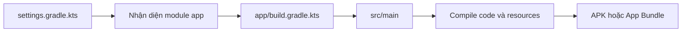
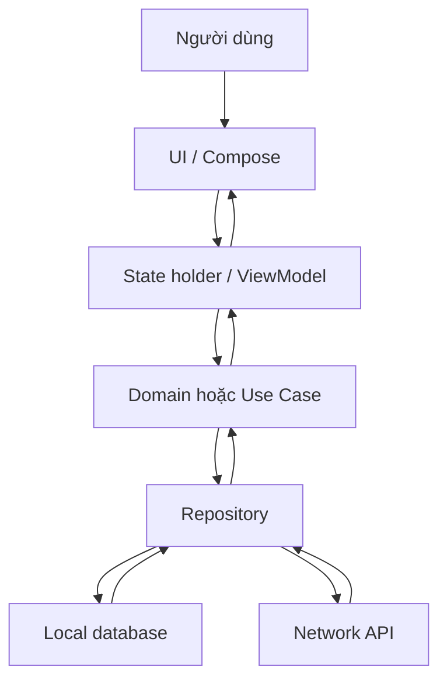

# 032 – Android Project Structure
[](https://developer.android.com/studio/intro?utm_source=chatgpt.com)
**Học phần:** 01 – Language and Android Fundamentals  
**Module:** Module 02 – Android Fundamentals  
**Nhóm nội dung:** First App and Version Control  
**Nguồn roadmap:** Android Fundamentals / First App and Version Control  
**Loại bài:** Project  
**Thứ tự trong module:** 032  
**Thời lượng gợi ý:** 45 phút  

---

## 1. Tóm tắt

**Android Project Structure** là cách Android Studio và Gradle tổ chức toàn bộ mã nguồn, tài nguyên, cấu hình build, kiểm thử và metadata của một ứng dụng Android.

Một dự án Android không chỉ có `MainActivity.kt`. Nó còn gồm:

- Mã nguồn Kotlin hoặc Java.
- Tài nguyên như chuỗi văn bản, biểu tượng và hình ảnh.
- `AndroidManifest.xml`.
- Cấu hình Gradle.
- Unit test và instrumented test.
- Các module ứng dụng hoặc thư viện.
- File phục vụ build, debug và phát hành.

Android Studio mặc định hiển thị cấu trúc bằng **Android view** — một dạng trình bày rút gọn theo module. Cấu trúc thật trên ổ đĩa có thể được xem bằng **Project Source Files** hoặc **Project view**. :contentReference[oaicite:1]{index=1}


> **Hình 1:** Android view gom các file quan trọng thành `manifests`, `kotlin+java`, `res` và `Gradle Scripts`. Nguồn: Android Developers.

---

## 2. Mục tiêu học tập

Sau bài này, bạn có thể:

- Giải thích sự khác nhau giữa **project**, **module**, **source set** và **package**.
- Xác định vai trò của các file và thư mục quan trọng.
- Phân biệt Android view với cấu trúc thật trên ổ đĩa.
- Biết nơi đặt UI, state holder, domain logic, data source và test.
- Tránh chỉnh sửa nhầm file sinh tự động.
- Biết file nào không nên đưa lên Git.
- Tạo một dự án nhỏ có cấu trúc rõ ràng để đưa vào portfolio.
- Viết README mô tả cách chạy, kiểm thử và đánh giá dự án.

---

## 3. Sản phẩm cần hoàn thành

Tạo một ứng dụng Compose nhỏ tên:

```text
ProjectStructureDemo
````

Ứng dụng cần có:

1. Một màn hình giới thiệu các khu vực chính của dự án Android.
2. Một bộ đếm số lần người dùng nhấn nút “Kiểm tra cấu trúc”.
3. Bộ đếm không bị mất khi xoay màn hình.
4. Một hàm Kotlin thuần có unit test.
5. README chứa:

   * Mục tiêu dự án.
   * Cấu trúc thư mục.
   * Cách chạy.
   * Cách chạy test.
   * Ảnh chụp màn hình.
   * Hạn chế hiện tại.
6. Ít nhất hai Git commit rõ ràng.

---

## 4. Khái niệm nền tảng

### 4.1. Project là gì?

Một **project** là workspace cấp cao nhất trong Android Studio. Nó chứa tất cả mã nguồn, tài nguyên, test và cấu hình cần thiết để xây dựng ứng dụng.

Một project có thể chứa một hoặc nhiều module:

```text
MyAndroidProject
├── app
├── core
├── feature-home
└── feature-profile
```

Với ứng dụng mới, Android Studio thường tạo một module ứng dụng tên là `app`.

---

### 4.2. Module là gì?

Module là một đơn vị có thể được Gradle build độc lập.

Một số loại module phổ biến:

| Loại module            | Vai trò                           |
| ---------------------- | --------------------------------- |
| Application module     | Tạo APK hoặc Android App Bundle   |
| Android Library module | Tạo thư viện Android dạng AAR     |
| Kotlin/Java Library    | Chứa logic Kotlin hoặc Java thuần |
| Feature module         | Chứa một nhóm tính năng           |
| Core module            | Chứa code dùng chung              |

Module `app` thường chứa:

```text
app
├── build.gradle.kts
├── proguard-rules.pro
└── src
```

Mỗi subproject hoặc module có file build riêng và phải được khai báo trong `settings.gradle.kts`. ([Android Developers][1])

---

### 4.3. Source set là gì?

**Source set** là tập hợp mã nguồn và tài nguyên dành cho một mục đích hoặc biến thể build cụ thể.

Ba source set thường xuất hiện ngay khi tạo project:

```text
app/src
├── main
├── test
└── androidTest
```

| Source set    | Chạy ở đâu?             | Mục đích                     |
| ------------- | ----------------------- | ---------------------------- |
| `main`        | Trong ứng dụng          | Mã nguồn và tài nguyên chính |
| `test`        | JVM trên máy phát triển | Local unit test              |
| `androidTest` | Thiết bị hoặc emulator  | Instrumented test, UI test   |

Local unit test mặc định nằm trong `module-name/src/test/` và chạy bằng JVM trên máy phát triển. Instrumented test nằm trong `androidTest` và cần môi trường Android thật hoặc giả lập. ([Android Developers][2])

---

### 4.4. Package là gì?

Package là không gian tên dùng để nhóm các class Kotlin hoặc Java có liên quan.

Ví dụ:

```text
com.example.projectstructuredemo
├── data
├── domain
└── ui
```

Package không hoàn toàn đồng nghĩa với module:

* Module là đơn vị build.
* Package là cách tổ chức code bên trong module.
* Một module có thể chứa nhiều package.
* Hai module khác nhau có thể có cấu trúc package tương tự nhau.

---

## 5. Android view và Project Source Files

### Android view

Android view rút gọn cấu trúc và nhóm file theo mục đích:

```text
app
├── manifests
├── kotlin+java
├── res
└── Gradle Scripts
```


### Project Source Files

Project Source Files hiển thị gần với cấu trúc thật trên ổ đĩa:

```text
app
├── build
└── src
    ├── androidTest
    ├── main
    └── test
```


> Android view thích hợp cho công việc hằng ngày. Project Source Files hữu ích khi cần kiểm tra source set, file sinh tự động hoặc vị trí thật của file. ([Android Developers][3])

---

## 6. Cây thư mục Android hoàn chỉnh

Một project Compose cơ bản có thể có cấu trúc như sau:

```text
ProjectStructureDemo/
├── .gitignore
├── build.gradle.kts
├── gradle.properties
├── gradlew
├── gradlew.bat
├── local.properties
├── settings.gradle.kts
│
├── gradle/
│   ├── libs.versions.toml
│   └── wrapper/
│       ├── gradle-wrapper.jar
│       └── gradle-wrapper.properties
│
└── app/
    ├── build.gradle.kts
    ├── proguard-rules.pro
    │
    ├── build/
    │
    └── src/
        ├── main/
        │   ├── AndroidManifest.xml
        │   │
        │   ├── java/
        │   │   └── com/example/projectstructuredemo/
        │   │       ├── MainActivity.kt
        │   │       ├── domain/
        │   │       │   └── ProjectAreaClassifier.kt
        │   │       └── ui/
        │   │           ├── ProjectStructureScreen.kt
        │   │           └── theme/
        │   │
        │   └── res/
        │       ├── drawable/
        │       ├── mipmap-anydpi-v26/
        │       ├── mipmap-hdpi/
        │       ├── mipmap-mdpi/
        │       ├── mipmap-xhdpi/
        │       ├── mipmap-xxhdpi/
        │       ├── mipmap-xxxhdpi/
        │       ├── values/
        │       │   ├── colors.xml
        │       │   ├── strings.xml
        │       │   └── themes.xml
        │       └── xml/
        │
        ├── test/
        │   └── java/com/example/projectstructuredemo/
        │       └── ProjectAreaClassifierTest.kt
        │
        └── androidTest/
            └── java/com/example/projectstructuredemo/
                └── ExampleInstrumentedTest.kt
```

---

## 7. Các file ở cấp project

### 7.1. `settings.gradle.kts`

File này khai báo:

* Tên project.
* Các module được tham gia build.
* Repository dùng để tìm plugin và dependency.
* Cấu hình Version Catalog.

Ví dụ rút gọn:

```kotlin
pluginManagement {
    repositories {
        google()
        mavenCentral()
        gradlePluginPortal()
    }
}

dependencyResolutionManagement {
    repositories {
        google()
        mavenCentral()
    }
}

rootProject.name = "ProjectStructureDemo"
include(":app")
```

Luồng xử lý:



---

### 7.2. `build.gradle.kts` cấp project

File build cấp project thường khai báo những plugin có thể được sử dụng bởi các module.

```kotlin
plugins {
    alias(libs.plugins.android.application) apply false
    alias(libs.plugins.kotlin.android) apply false
    alias(libs.plugins.kotlin.compose) apply false
}
```

Không nên đưa logic nghiệp vụ hoặc task phức tạp trực tiếp vào file này. Tài liệu Android hiện khuyến nghị giữ build file theo hướng khai báo và chuyển build logic dùng chung sang plugin. ([Android Developers][1])

---

### 7.3. `gradle/libs.versions.toml`

Version Catalog tập trung tên và phiên bản dependency:

```toml
[versions]
kotlin = "..."
composeBom = "..."

[libraries]
androidx-compose-bom = {
    module = "androidx.compose:compose-bom",
    version.ref = "composeBom"
}

[plugins]
android-application = {
    id = "com.android.application",
    version = "..."
}
```

Lợi ích:

* Tránh lặp phiên bản ở nhiều module.
* Dễ nâng cấp dependency.
* Hạn chế các module dùng phiên bản không đồng nhất.
* Tạo alias dễ đọc trong Gradle.

---

### 7.4. `gradle.properties`

Chứa các thuộc tính điều khiển môi trường Gradle, ví dụ:

```properties
org.gradle.jvmargs=-Xmx2048m
android.useAndroidX=true
kotlin.code.style=official
```

Không nên dùng file này để lưu API key hoặc mật khẩu rồi commit lên Git.

---

### 7.5. `local.properties`

Thường chứa đường dẫn Android SDK trên máy hiện tại:

```properties
sdk.dir=C\:\\Users\\YourName\\AppData\\Local\\Android\\Sdk
```

File này phụ thuộc từng máy và cần được loại khỏi source control. ([Android Developers][1])

---

### 7.6. Gradle Wrapper

Các file liên quan:

```text
gradlew
gradlew.bat
gradle/wrapper/gradle-wrapper.jar
gradle/wrapper/gradle-wrapper.properties
```

Gradle Wrapper cho phép thành viên trong nhóm và hệ thống CI sử dụng cùng phiên bản Gradle mà không phải cài Gradle thủ công. ([Android Developers][1])

Lệnh thường dùng:

```bash
# macOS hoặc Linux
./gradlew assembleDebug

# Windows
gradlew.bat assembleDebug
```

---

## 8. Cấu trúc module `app`

### 8.1. `app/build.gradle.kts`

Đây là file cấu hình cách module ứng dụng được build.

Các thành phần thường gặp:

```kotlin
plugins {
    alias(libs.plugins.android.application)
    alias(libs.plugins.kotlin.android)
    alias(libs.plugins.kotlin.compose)
}

android {
    namespace = "com.example.projectstructuredemo"

    compileSdk = /* giá trị do template tạo */

    defaultConfig {
        applicationId = "com.example.projectstructuredemo"
        minSdk = /* giá trị do template tạo */
        targetSdk = /* giá trị do template tạo */

        versionCode = 1
        versionName = "1.0"
    }

    buildFeatures {
        compose = true
    }
}

dependencies {
    implementation(platform(libs.androidx.compose.bom))
    implementation(libs.androidx.activity.compose)
    implementation(libs.androidx.compose.material3)

    testImplementation(libs.junit)
}
```

`applicationId` nhận diện duy nhất ứng dụng trên thiết bị và Google Play. Sau khi phát hành, việc thay đổi `applicationId` khiến Google Play xem bản upload là một ứng dụng khác. `namespace` được dùng cho các class sinh tự động như `R` và `BuildConfig`. ([Android Developers][4])

---

### 8.2. `AndroidManifest.xml`

Manifest mô tả các thành phần và khả năng của ứng dụng.

Ví dụ:

```xml
<?xml version="1.0" encoding="utf-8"?>
<manifest xmlns:android="http://schemas.android.com/apk/res/android">

    <application
        android:allowBackup="true"
        android:label="@string/app_name"
        android:theme="@style/Theme.ProjectStructureDemo">

        <activity
            android:name=".MainActivity"
            android:exported="true">

            <intent-filter>
                <action android:name="android.intent.action.MAIN" />
                <category android:name="android.intent.category.LAUNCHER" />
            </intent-filter>

        </activity>
    </application>

</manifest>
```

Manifest có thể khai báo:

* Activity, Service, BroadcastReceiver và ContentProvider.
* Permission.
* App theme.
* App icon và nhãn ứng dụng.
* Entry point của ứng dụng.
* Deep link.
* Yêu cầu phần cứng hoặc tính năng thiết bị.

Các app component như Activity, Service và BroadcastReceiver được khai báo trong manifest. ([Android Developers][5])

---

### 8.3. Thư mục mã nguồn Kotlin

Đường dẫn vật lý thường là:

```text
app/src/main/java/com/example/projectstructuredemo/
```

Dù dự án dùng Kotlin, thư mục vẫn có thể mang tên `java`.

Một cách tổ chức app nhỏ:

```text
com.example.projectstructuredemo
├── MainActivity.kt
├── data
├── domain
└── ui
    ├── ProjectStructureScreen.kt
    └── theme
```

Khi ứng dụng phát triển, nên tổ chức theo tính năng hoặc layer thay vì đưa tất cả class vào một package.

---

### 8.4. Thư mục `res`

Tài nguyên được tổ chức thành các thư mục theo loại. Compose vẫn sử dụng `res/` cho chuỗi dịch, icon, font, bitmap và các tài nguyên tĩnh khác. ([Android Developers][6])

| Thư mục       | Nội dung                        |
| ------------- | ------------------------------- |
| `drawable/`   | Vector, shape, bitmap           |
| `mipmap/`     | Launcher icon                   |
| `values/`     | String, color, dimension, theme |
| `font/`       | Font                            |
| `raw/`        | File giữ nguyên định dạng       |
| `xml/`        | Cấu hình XML                    |
| `navigation/` | Navigation graph dạng XML       |
| `layout/`     | Layout XML cho View System      |
| `anim/`       | Tween animation                 |
| `animator/`   | Property animation              |

Ví dụ `strings.xml`:

```xml
<resources>
    <string name="app_name">Project Structure Demo</string>
    <string name="screen_title">Android Project Structure</string>
    <string name="screen_description">
        Khám phá các khu vực quan trọng của một dự án Android.
    </string>
    <string name="inspect_button">Kiểm tra cấu trúc</string>
    <string name="inspection_count">Đã kiểm tra: %1$d lần</string>
</resources>
```

Không nên viết trực tiếp chuỗi hiển thị trong Kotlin:

```kotlin
// Không nên
Text("Kiểm tra cấu trúc")
```

Nên lấy từ resource:

```kotlin
Text(stringResource(R.string.inspect_button))
```

Cách này hỗ trợ dịch giao diện và tái sử dụng tài nguyên.

---

### 8.5. Thư mục `build/`

Thư mục `build/` chứa kết quả được Gradle sinh ra:

* Class đã compile.
* APK hoặc App Bundle.
* Báo cáo test.
* Tài nguyên đã xử lý.
* File trung gian.
* Merged manifest.

Không nên:

* Chỉnh sửa file trong `build/`.
* Dùng `build/` làm nơi lưu source code.
* Commit toàn bộ `build/` lên Git.

Nội dung có thể bị xóa và tạo lại bằng:

```bash
./gradlew clean
```

---

## 9. Cấu trúc thư mục và kiến trúc ứng dụng

Cấu trúc file không tự động tạo ra kiến trúc tốt. Tuy nhiên, cấu trúc rõ ràng giúp thể hiện trách nhiệm của từng phần.

Android hiện khuyến nghị app có ít nhất:

* **UI layer:** Hiển thị dữ liệu và nhận tương tác.
* **Data layer:** Chứa business logic liên quan đến dữ liệu và cung cấp dữ liệu.
* **Domain layer:** Không bắt buộc, dùng cho logic phức tạp hoặc được tái sử dụng. ([Android Developers][5])


Có thể ánh xạ kiến trúc sang package:

```text
com.example.projectstructuredemo
├── ui
│   ├── screen
│   ├── component
│   └── theme
├── domain
│   ├── model
│   └── usecase
└── data
    ├── repository
    ├── local
    └── remote
```



Đối với app rất nhỏ, không cần tạo package rỗng hoặc layer không sử dụng. Cấu trúc nên phát triển theo độ phức tạp thật của dự án.

---

## 10. Liên hệ với lifecycle và state

`Activity` có thể bị hủy và tạo lại khi:

* Xoay màn hình.
* Thay đổi kích thước cửa sổ.
* Thay đổi cấu hình.
* Hệ thống cần thu hồi tài nguyên.

Vì vậy, không nên coi `Activity` là nơi lưu dữ liệu ứng dụng lâu dài. Tài liệu kiến trúc Android khuyến nghị tách state và dữ liệu khỏi UI component có lifecycle ngắn. ([Android Developers][5])

Trong Compose:

```kotlin
var count by remember {
    mutableStateOf(0)
}
```

`remember` giữ state qua recomposition nhưng không giữ được qua configuration change.

Với state UI nhỏ cần khôi phục:

```kotlin
var count by rememberSaveable {
    mutableStateOf(0)
}
```

`rememberSaveable` có thể khôi phục các giá trị lưu được qua `Bundle` sau khi Activity được tạo lại. ([Android Developers][7])

Với state màn hình và business logic phức tạp hơn:

```text
ui/
└── ProjectStructureViewModel.kt
```

Nên sử dụng `ViewModel`, repository và data source phù hợp thay vì giữ toàn bộ logic trong `MainActivity.kt`.

---

## 11. Thực hành: Project Structure Demo

### Bước 1 – Tạo project

Trong Android Studio:

```text
New Project
→ Phone and Tablet
→ Empty Activity
```

Thông tin gợi ý:

```text
Name: ProjectStructureDemo
Package name: com.example.projectstructuredemo
Language: Kotlin
Build configuration language: Kotlin DSL
```

Giữ các phiên bản SDK và dependency do template Android Studio hiện tại tạo ra.

---

### Bước 2 – Tạo package

Trong package gốc, tạo:

```text
domain
ui
```

Cấu trúc mong muốn:

```text
com.example.projectstructuredemo
├── MainActivity.kt
├── domain
│   └── ProjectAreaClassifier.kt
└── ui
    └── ProjectStructureScreen.kt
```

---

### Bước 3 – Tạo domain logic

File:

```text
domain/ProjectAreaClassifier.kt
```

```kotlin
package com.example.projectstructuredemo.domain

enum class ProjectArea {
    MANIFEST,
    SOURCE_CODE,
    RESOURCE,
    LOCAL_TEST,
    INSTRUMENTED_TEST,
    BUILD_CONFIGURATION,
    GENERATED_OUTPUT,
    UNKNOWN
}

fun classifyProjectPath(path: String): ProjectArea {
    val normalizedPath = path
        .replace('\\', '/')
        .lowercase()

    return when {
        normalizedPath.endsWith("androidmanifest.xml") ->
            ProjectArea.MANIFEST

        "/androidtest/" in normalizedPath ->
            ProjectArea.INSTRUMENTED_TEST

        "/test/" in normalizedPath ->
            ProjectArea.LOCAL_TEST

        "/res/" in normalizedPath ->
            ProjectArea.RESOURCE

        normalizedPath.endsWith("build.gradle.kts") ||
            normalizedPath.endsWith("settings.gradle.kts") ||
            normalizedPath.endsWith("libs.versions.toml") ->
            ProjectArea.BUILD_CONFIGURATION

        "/build/" in normalizedPath ->
            ProjectArea.GENERATED_OUTPUT

        normalizedPath.endsWith(".kt") ||
            normalizedPath.endsWith(".java") ->
            ProjectArea.SOURCE_CODE

        else -> ProjectArea.UNKNOWN
    }
}
```

Thứ tự kiểm tra `androidTest` trước `test` giúp tránh phân loại nhầm đường dẫn instrumented test thành local test.

---

### Bước 4 – Tạo giao diện Compose

File:

```text
ui/ProjectStructureScreen.kt
```

```kotlin
package com.example.projectstructuredemo.ui

import androidx.compose.foundation.layout.Arrangement
import androidx.compose.foundation.layout.Column
import androidx.compose.foundation.layout.fillMaxSize
import androidx.compose.foundation.layout.fillMaxWidth
import androidx.compose.foundation.layout.padding
import androidx.compose.material3.Button
import androidx.compose.material3.Card
import androidx.compose.material3.MaterialTheme
import androidx.compose.material3.Text
import androidx.compose.runtime.Composable
import androidx.compose.runtime.getValue
import androidx.compose.runtime.mutableStateOf
import androidx.compose.runtime.saveable.rememberSaveable
import androidx.compose.runtime.setValue
import androidx.compose.ui.Modifier
import androidx.compose.ui.res.stringResource
import androidx.compose.ui.unit.dp
import com.example.projectstructuredemo.R

@Composable
fun ProjectStructureScreen(
    modifier: Modifier = Modifier
) {
    var inspectionCount by rememberSaveable {
        mutableStateOf(0)
    }

    Column(
        modifier = modifier
            .fillMaxSize()
            .padding(24.dp),
        verticalArrangement = Arrangement.spacedBy(12.dp)
    ) {
        Text(
            text = stringResource(R.string.screen_title),
            style = MaterialTheme.typography.headlineMedium
        )

        Text(
            text = stringResource(R.string.screen_description),
            style = MaterialTheme.typography.bodyLarge
        )

        StructureCard(
            title = "manifests",
            description = "Khai báo component, permission và entry point."
        )

        StructureCard(
            title = "kotlin+java",
            description = "Chứa source code và các package test."
        )

        StructureCard(
            title = "res",
            description = "Chứa string, icon, hình ảnh và tài nguyên tĩnh."
        )

        Button(
            onClick = {
                inspectionCount += 1
            },
            modifier = Modifier.fillMaxWidth()
        ) {
            Text(
                text = stringResource(R.string.inspect_button)
            )
        }

        Text(
            text = stringResource(
                R.string.inspection_count,
                inspectionCount
            )
        )
    }
}

@Composable
private fun StructureCard(
    title: String,
    description: String,
    modifier: Modifier = Modifier
) {
    Card(
        modifier = modifier.fillMaxWidth()
    ) {
        Column(
            modifier = Modifier.padding(16.dp),
            verticalArrangement = Arrangement.spacedBy(4.dp)
        ) {
            Text(
                text = title,
                style = MaterialTheme.typography.titleMedium
            )

            Text(
                text = description,
                style = MaterialTheme.typography.bodyMedium
            )
        }
    }
}
```

Trong dự án production, các chuỗi `title` và `description` trong `StructureCard` cũng nên được chuyển sang `strings.xml`.

---

### Bước 5 – Cập nhật `MainActivity.kt`

```kotlin
package com.example.projectstructuredemo

import android.os.Bundle
import androidx.activity.ComponentActivity
import androidx.activity.compose.setContent
import androidx.compose.material3.MaterialTheme
import androidx.compose.material3.Surface
import com.example.projectstructuredemo.ui.ProjectStructureScreen

class MainActivity : ComponentActivity() {

    override fun onCreate(savedInstanceState: Bundle?) {
        super.onCreate(savedInstanceState)

        setContent {
            MaterialTheme {
                Surface {
                    ProjectStructureScreen()
                }
            }
        }
    }
}
```

`MainActivity` chỉ chịu trách nhiệm thiết lập UI gốc. Nội dung màn hình được chuyển sang file riêng trong package `ui`.

---

## 12. Viết unit test

Tạo file:

```text
app/src/test/java/com/example/projectstructuredemo/
└── ProjectAreaClassifierTest.kt
```

```kotlin
package com.example.projectstructuredemo

import com.example.projectstructuredemo.domain.ProjectArea
import com.example.projectstructuredemo.domain.classifyProjectPath
import org.junit.Assert.assertEquals
import org.junit.Test

class ProjectAreaClassifierTest {

    @Test
    fun manifestPath_returnsManifest() {
        val result = classifyProjectPath(
            "app/src/main/AndroidManifest.xml"
        )

        assertEquals(ProjectArea.MANIFEST, result)
    }

    @Test
    fun resourcePath_returnsResource() {
        val result = classifyProjectPath(
            "app/src/main/res/values/strings.xml"
        )

        assertEquals(ProjectArea.RESOURCE, result)
    }

    @Test
    fun androidTestPath_returnsInstrumentedTest() {
        val result = classifyProjectPath(
            "app/src/androidTest/java/ExampleTest.kt"
        )

        assertEquals(ProjectArea.INSTRUMENTED_TEST, result)
    }

    @Test
    fun buildOutputPath_returnsGeneratedOutput() {
        val result = classifyProjectPath(
            "app/build/outputs/apk/debug/app-debug.apk"
        )

        assertEquals(ProjectArea.GENERATED_OUTPUT, result)
    }
}
```

Chạy test bằng Android Studio hoặc terminal:

```bash
# macOS/Linux
./gradlew test

# Windows
gradlew.bat test
```

Local test phù hợp cho `classifyProjectPath()` vì hàm này là Kotlin thuần và không phụ thuộc Android framework. ([Android Developers][2])

---

## 13. Kiểm thử lifecycle và state

Thực hiện thủ công:

1. Chạy ứng dụng.
2. Nhấn nút “Kiểm tra cấu trúc” ba lần.
3. Xác nhận giao diện hiển thị:

```text
Đã kiểm tra: 3 lần
```

4. Xoay emulator sang landscape.
5. Kiểm tra giá trị vẫn là `3`.
6. Xoay trở lại portrait.
7. Đưa ứng dụng xuống background rồi mở lại.

Kết quả mong đợi:

| Trường hợp                  | Kết quả                          |
| --------------------------- | -------------------------------- |
| Recomposition               | Không mất số đếm                 |
| Xoay màn hình               | Không mất số đếm                 |
| Activity recreation         | Có thể khôi phục số đếm          |
| Force stop hoặc xóa dữ liệu | Không bảo đảm giữ số đếm lâu dài |

`rememberSaveable` chỉ phù hợp với lượng state UI nhỏ. Dữ liệu nghiệp vụ hoặc dữ liệu cần tồn tại lâu dài nên được lưu qua data layer, database hoặc cơ chế phù hợp khác. ([Android Developers][8])

---

## 14. Mối liên hệ với chất lượng sản phẩm

| Khu vực         | Ảnh hưởng                                                              |
| --------------- | ---------------------------------------------------------------------- |
| UI              | Tách screen và component giúp giao diện dễ đọc, preview và tái sử dụng |
| Lifecycle       | State đặt sai trong Activity có thể mất khi Activity được tạo lại      |
| State           | State holder rõ ràng giúp tránh dữ liệu UI không đồng bộ               |
| Data            | Repository và data source giúp tách API, database khỏi giao diện       |
| Network         | Không nên gọi API trực tiếp trong composable hoặc Activity             |
| Testing         | Logic Kotlin thuần dễ đặt trong `test/` và chạy nhanh                  |
| Debugging       | Package rõ ràng giúp tìm lỗi và theo dõi luồng dữ liệu                 |
| Maintainability | Trách nhiệm mỗi file rõ ràng, giảm file quá lớn                        |
| Build           | Cấu hình đúng module giúp dependency và build variant ổn định          |
| Release         | Quản lý đúng application ID, version và ProGuard giảm rủi ro phát hành |

---

## 15. Version control cho Android project

### Nên đưa lên Git

```text
app/src/
build.gradle.kts
settings.gradle.kts
gradle.properties
gradle/libs.versions.toml
gradle/wrapper/
gradlew
gradlew.bat
.gitignore
README.md
```

### Không nên đưa lên Git

```text
local.properties
.gradle/
**/build/
*.apk
*.aab
```

Với `.idea/`, nên sử dụng `.gitignore` do Android Studio tạo và chỉ chia sẻ những file cấu hình IDE thực sự cần thiết cho nhóm.

### Commit gợi ý

```bash
git add .
git commit -m "chore: create Android project structure demo"
```

Sau khi thêm màn hình và test:

```bash
git add .
git commit -m "feat: add project structure explorer and unit tests"
```

---

## 16. README cho portfolio

Tạo file `README.md` tại thư mục gốc:

````markdown
# Project Structure Demo

Ứng dụng Android nhỏ minh họa cách tổ chức project, module,
source set, resources và tests.

## Features

- Hiển thị các khu vực chính của Android project.
- Bộ đếm dùng `rememberSaveable`.
- Unit test cho logic phân loại đường dẫn.
- Cấu trúc code tách `ui` và `domain`.

## Project Structure

```text
app/src
├── main
│   ├── AndroidManifest.xml
│   ├── java/.../domain
│   ├── java/.../ui
│   └── res
├── test
└── androidTest
````

## Run

1. Mở project bằng Android Studio.
2. Chờ Gradle Sync hoàn thành.
3. Chọn emulator hoặc thiết bị Android.
4. Nhấn Run.

## Test

```bash
./gradlew test
```

Trên Windows:

```bash
gradlew.bat test
```

## Screenshots


## Known Limitations

* Chưa sử dụng ViewModel.
* Chưa có database hoặc network.
* Các mô tả trong card chưa được chuyển hoàn toàn sang string resource.
* Chưa có Compose UI test.

````

---

## 17. Ảnh cần chụp cho portfolio

Tạo thư mục:

```text
docs/screenshots/
````

Chụp ít nhất ba ảnh:

```text
docs/screenshots/
├── app-home.png
├── project-android-view.png
└── project-source-files.png
```

Nội dung ảnh:

1. Màn hình ứng dụng đang chạy.
2. Android view có `manifests`, `kotlin+java`, `res`.
3. Project Source Files có `main`, `test`, `androidTest`.
4. Cửa sổ unit test báo tất cả test thành công.

Không đưa ảnh chứa:

* API key.
* Token.
* Đường dẫn cá nhân nhạy cảm.
* Email hoặc tài khoản riêng.
* Dữ liệu người dùng thật.

---

## 18. Lỗi phổ biến

### Lỗi 1 – Chỉ viết mọi thứ trong `MainActivity.kt`

```text
MainActivity
├── UI
├── State
├── API call
├── JSON parsing
├── Database
└── Validation
```

Hậu quả:

* File quá lớn.
* Khó test.
* Logic phụ thuộc lifecycle của Activity.
* Khó tái sử dụng.
* Khó tìm nguyên nhân crash.

Cách sửa:

```text
MainActivity
└── ProjectStructureScreen
    └── ViewModel
        └── Repository
```

---

### Lỗi 2 – Chỉnh file trong `build/`

File trong `build/` được Gradle sinh tự động và có thể bị thay thế ở lần build tiếp theo.

Cần chỉnh source gốc trong:

```text
app/src/main/
```

---

### Lỗi 3 – Nhầm Android view là cấu trúc thật

Android view có thể gom nhiều thư mục hoặc resource qualifier thành một mục. Khi cần kiểm tra đường dẫn thật, chuyển sang:

```text
Project Source Files
```

---

### Lỗi 4 – Đặt test sai source set

```text
src/test/
```

Dùng cho Kotlin hoặc Java test chạy trên JVM.

```text
src/androidTest/
```

Dùng cho test cần Android framework, emulator hoặc thiết bị.

---

### Lỗi 5 – Commit `local.properties`

File này chứa cấu hình phụ thuộc máy cá nhân, đặc biệt là đường dẫn SDK. Không nên chia sẻ qua repository. ([Android Developers][1])

---

### Lỗi 6 – Tạo quá nhiều package rỗng

Không cần tạo sẵn hàng chục package như:

```text
adapter/
base/
common/
di/
helper/
manager/
model/
service/
util/
```

khi chưa có code cần đặt vào đó.

Cấu trúc nên phản ánh chức năng thực tế, không phải dự đoán mọi thứ có thể xuất hiện trong tương lai.

---

## 19. Kế hoạch thực hành 45 phút

|  Thời gian | Công việc                                      |
| ---------: | ---------------------------------------------- |
|   0–5 phút | Mở Android view và Project Source Files        |
|  5–10 phút | Xác định project, module và source set         |
| 10–15 phút | Vẽ lại cây thư mục vào README                  |
| 15–25 phút | Tạo package `ui`, `domain` và màn hình Compose |
| 25–32 phút | Thêm state bằng `rememberSaveable`             |
| 32–38 phút | Viết `ProjectAreaClassifierTest`               |
| 38–41 phút | Chạy app, xoay màn hình và chạy test           |
| 41–44 phút | Chụp ảnh và cập nhật README                    |
| 44–45 phút | Commit code và kiểm tra `.gitignore`           |

---

## 20. Bài tập

### Bài tập bắt buộc

Hoàn thành `ProjectStructureDemo` với:

* Một module `app`.
* Package `ui`.
* Package `domain`.
* String resource.
* State sử dụng `rememberSaveable`.
* Tối thiểu bốn unit test.
* README.
* Ảnh chụp ứng dụng và cây thư mục.
* Hai Git commit.

### Bài tập mở rộng

Thêm package:

```text
data
└── ProjectStructureRepository.kt
```

Repository trả về danh sách các khu vực trong project:

```kotlin
data class StructureSection(
    val name: String,
    val description: String
)
```

Sau đó:

1. Chuyển dữ liệu card ra khỏi composable.
2. Thêm `ViewModel`.
3. Hoist state khỏi `ProjectStructureScreen`.
4. Viết Compose UI test.
5. Tạo module thư viện `:core:model`.
6. Di chuyển `StructureSection` sang module mới.

---

## 21. Câu hỏi tự kiểm tra

1. Project khác module như thế nào?
2. `settings.gradle.kts` có vai trò gì?
3. `app/build.gradle.kts` khác file build cấp project ra sao?
4. `src/test` và `src/androidTest` khác nhau ở điểm nào?
5. Tại sao Android view không giống cấu trúc thật trên ổ đĩa?
6. `AndroidManifest.xml` dùng để làm gì?
7. Khi nào nên dùng `rememberSaveable`?
8. Tại sao không nên lưu business data trong Activity?
9. Vì sao không được chỉnh file trong `build/`?
10. File nào không nên commit lên Git?
11. `namespace` khác `applicationId` ở điểm nào?
12. Khi nào một project nên được chia thành nhiều module?

---

## 22. Checklist hoàn thành

### Kiến thức

* [ ] Giải thích được project, module, package và source set.
* [ ] Phân biệt Android view và Project Source Files.
* [ ] Biết vai trò của `settings.gradle.kts`.
* [ ] Biết vai trò của `app/build.gradle.kts`.
* [ ] Biết vai trò của `AndroidManifest.xml`.
* [ ] Biết nơi lưu Kotlin code và resources.
* [ ] Phân biệt `test` với `androidTest`.
* [ ] Biết file và thư mục nào được Gradle sinh tự động.

### Thực hành

* [ ] Tạo ứng dụng `ProjectStructureDemo`.
* [ ] Tách UI khỏi `MainActivity`.
* [ ] Có package `ui` và `domain`.
* [ ] Có state bằng `rememberSaveable`.
* [ ] Kiểm tra state sau khi xoay màn hình.
* [ ] Có ít nhất bốn unit test.
* [ ] Chạy được `gradlew test`.
* [ ] Không commit `local.properties` và `build/`.

### Portfolio

* [ ] Có README.
* [ ] Có cây thư mục.
* [ ] Có hướng dẫn chạy.
* [ ] Có hướng dẫn test.
* [ ] Có ảnh ứng dụng.
* [ ] Có ảnh Android view.
* [ ] Có ảnh Project Source Files.
* [ ] Có ghi chú giới hạn.
* [ ] Có lịch sử Git commit rõ ràng.
* [ ] Đã liên kết repository vào course progress tracker.

---

## 23. Ghi chú production

Trước khi đưa dự án Android vào production, cần kiểm tra:

### Cấu trúc

* Mỗi module có trách nhiệm rõ ràng chưa?
* Có phụ thuộc vòng giữa các module không?
* UI có gọi trực tiếp database hoặc network không?
* Business logic có nằm trong Activity hoặc composable không?
* Package có phản ánh tính năng và trách nhiệm thực tế không?

### Lifecycle và state

* State có mất khi xoay màn hình không?
* State cần giữ sau process death đã được xử lý chưa?
* Dữ liệu lớn có bị đưa vào `Bundle` không?
* Request đang chạy có bị lặp khi Activity được tạo lại không?

### Testing

* Logic quan trọng có local unit test không?
* Luồng người dùng quan trọng có UI test không?
* Test có nằm đúng source set không?
* CI có chạy test trước khi merge không?

### Build và release

* `applicationId` có đúng môi trường production không?
* `versionCode` và `versionName` đã cập nhật chưa?
* Release build có bật tối ưu hóa phù hợp không?
* Signing key có được quản lý an toàn không?
* API key và secret có bị đưa vào source control không?
* File `.gitignore` có loại bỏ output và cấu hình máy cá nhân không?

---

## 24. Kết luận

Android Project Structure là bản đồ của toàn bộ ứng dụng.

Khi hiểu cấu trúc dự án, bạn có thể nhanh chóng trả lời:

```text
Code này nằm ở đâu?
Tài nguyên này thuộc module nào?
Test này chạy trên JVM hay thiết bị?
State này thuộc UI hay ViewModel?
Dependency được khai báo ở đâu?
File nào là source và file nào được sinh tự động?
Thành phần nào sẽ được đóng gói khi release?
```

Một cấu trúc tốt không cần phức tạp. Nó cần:

* Dễ hiểu.
* Có trách nhiệm rõ ràng.
* Phù hợp quy mô hiện tại.
* Dễ kiểm thử.
* Không phụ thuộc quá mức vào Activity hoặc UI.
* Có thể phát triển dần khi ứng dụng lớn hơn.

---

## 25. Tài liệu tham khảo

* [Meet Android Studio – Project structure](https://developer.android.com/studio/intro)
* [Android build structure](https://developer.android.com/build/android-build-structure)
* [Projects overview](https://developer.android.com/studio/projects)
* [Configure the app module](https://developer.android.com/build/configure-app-module)
* [Guide to app architecture](https://developer.android.com/topic/architecture)
* [Add app resources](https://developer.android.com/studio/write/add-resources)
* [State and Jetpack Compose](https://developer.android.com/develop/ui/compose/state)
* [Save UI state in Compose](https://developer.android.com/develop/ui/compose/state-saving)
* [Build local unit tests](https://developer.android.com/training/testing/local-tests)
* [What to test in Android](https://developer.android.com/training/testing/fundamentals/what-to-test)

```
```

[1]: https://developer.android.com/build/android-build-structure "Android build structure  |  Android Studio  |  Android Developers"
[2]: https://developer.android.com/training/testing/local-tests?utm_source=chatgpt.com "Build local unit tests | Test your app on Android"
[3]: https://developer.android.com/codelabs/basic-android-kotlin-compose-first-app "Create your first Android app  |  Android Developers"
[4]: https://developer.android.com/build/configure-app-module "Configure the app module  |  Android Studio  |  Android Developers"
[5]: https://developer.android.com/topic/architecture "Guide to app architecture  |  App architecture  |  Android Developers"
[6]: https://developer.android.com/studio/write/add-resources "Add app resources  |  Android Studio  |  Android Developers"
[7]: https://developer.android.com/develop/ui/compose/state?utm_source=chatgpt.com "State and Jetpack Compose"
[8]: https://developer.android.com/develop/ui/compose/state-saving?utm_source=chatgpt.com "Save UI state in Compose"
