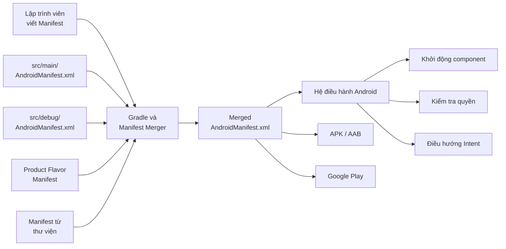
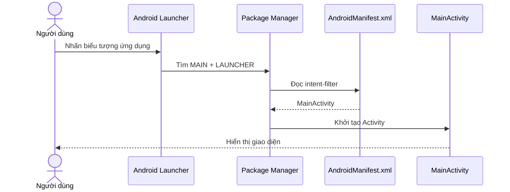
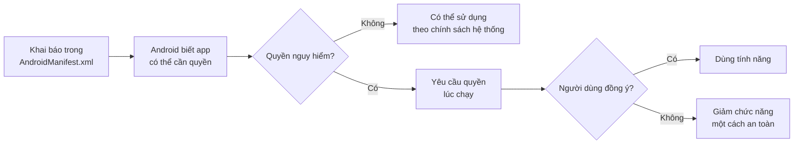
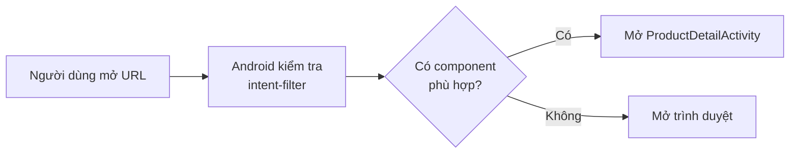
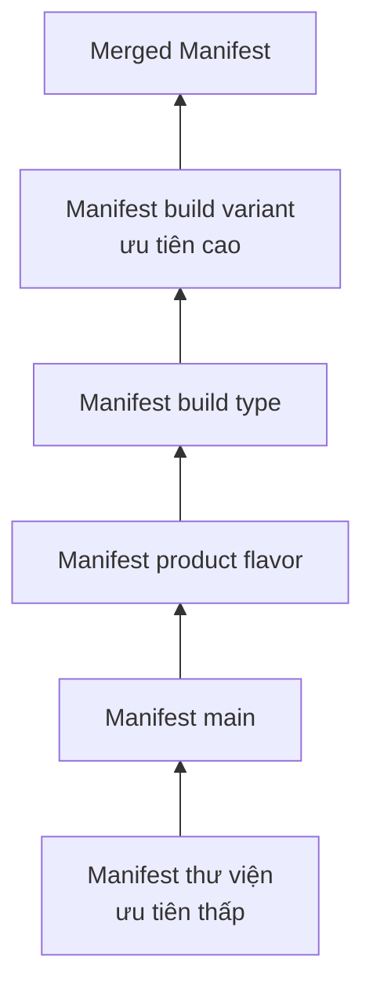
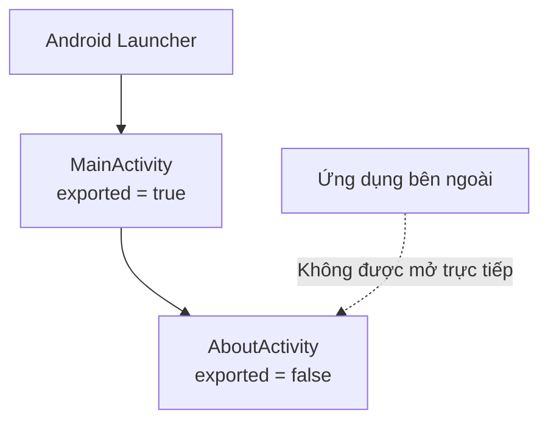

# 033 - Manifest Basics

| Thuộc tính              | Nội dung                                             |
| ----------------------- | ---------------------------------------------------- |
| **Học phần**            | 01 - Language and Android Fundamentals               |
| **Module**              | Module 02 - Android Fundamentals                     |
| **Nhóm nội dung**       | First App and Version Control                        |
| **Nguồn roadmap**       | Android Fundamentals / First App and Version Control |
| **Loại bài**            | Lesson                                               |
| **Thứ tự trong module** | 033                                                  |
| **Thời lượng gợi ý**    | 24 phút                                              |

---

## 1. Tóm tắt

`AndroidManifest.xml`, thường được gọi ngắn gọn là **Manifest**, là tệp mô tả những thông tin quan trọng nhất của một ứng dụng Android cho:

* Hệ điều hành Android.
* Công cụ build.
* Google Play.
* Các ứng dụng khác muốn tương tác với ứng dụng.

Manifest khai báo các **app component** như `Activity`, `Service`, `BroadcastReceiver`, `ContentProvider`; các quyền ứng dụng cần sử dụng; tính năng phần cứng; điểm khởi chạy ứng dụng; deep link và phạm vi truy cập từ ứng dụng khác. Mỗi ứng dụng Android phải có một tệp mang đúng tên `AndroidManifest.xml`. ([Android Developers][1])

> Có thể hình dung Manifest là **căn cước và bản hợp đồng hệ thống** của ứng dụng Android.


*Hình: thư mục `manifests` trong Android View của Android Studio.* 

---

## 2. Mục tiêu học tập

Sau bài học, anh có thể:

* Giải thích vai trò của `AndroidManifest.xml`.
* Xác định vị trí Manifest trong dự án Android.
* Phân biệt `<manifest>`, `<application>`, `<activity>` và `<uses-permission>`.
* Cấu hình một `Activity` làm màn hình khởi động.
* Hiểu vai trò của `intent-filter` và `android:exported`.
* Phân biệt khai báo quyền trong Manifest với yêu cầu quyền lúc chạy.
* Kiểm tra kết quả **Merged Manifest**.
* Nhận biết các lỗi Manifest có thể ảnh hưởng đến UX, bảo mật và phát hành ứng dụng.

---

## 3. Manifest nằm ở đâu?

Manifest chính của app module thường nằm tại:

```text
MyAndroidProject/
└── app/
    └── src/
        └── main/
            ├── AndroidManifest.xml
            ├── java/ hoặc kotlin/
            └── res/
```

Đường dẫn đầy đủ:

```text
app/src/main/AndroidManifest.xml
```

Trong chế độ **Android View**, Android Studio hiển thị tệp này ở:

```text
app
└── manifests
    └── AndroidManifest.xml
```

Một dự án có thể có nhiều Manifest dành cho `main`, build type, product flavor hoặc thư viện. Gradle sẽ hợp nhất chúng thành một Manifest cuối cùng được đóng gói vào APK hoặc Android App Bundle. ([Android Developers][2])

---

## 4. Bức tranh tổng thể



Manifest không trực tiếp vẽ giao diện hay lưu trạng thái màn hình. Thay vào đó, nó cho Android biết:

1. Ứng dụng có những thành phần nào.
2. Thành phần nào được phép khởi chạy.
3. Thành phần nào có thể được ứng dụng khác gọi.
4. Ứng dụng cần quyền gì.
5. Thiết bị nào có thể cài ứng dụng.
6. Màn hình nào là điểm vào của ứng dụng.

---

## 5. Cấu trúc cơ bản của Manifest

Một Manifest tối thiểu thường có dạng:

```xml
<?xml version="1.0" encoding="utf-8"?>

<manifest xmlns:android="http://schemas.android.com/apk/res/android">

    <application
        android:icon="@mipmap/ic_launcher"
        android:label="@string/app_name"
        android:theme="@style/Theme.ManifestDemo">

        <activity
            android:name=".MainActivity"
            android:exported="true">

            <intent-filter>
                <action android:name="android.intent.action.MAIN" />

                <category
                    android:name="android.intent.category.LAUNCHER" />
            </intent-filter>

        </activity>

    </application>

</manifest>
```

Cấu trúc phân cấp:

```text
manifest
├── uses-permission
├── uses-feature
├── queries
└── application
    ├── activity
    │   └── intent-filter
    │       ├── action
    │       ├── category
    │       └── data
    ├── service
    ├── receiver
    ├── provider
    └── meta-data
```

---

## 6. Các phần tử quan trọng

### 6.1. `<manifest>`

Đây là phần tử gốc của tệp:

```xml
<manifest xmlns:android="http://schemas.android.com/apk/res/android">
    ...
</manifest>
```

Thuộc tính:

```xml
xmlns:android="http://schemas.android.com/apk/res/android"
```

khai báo namespace để sử dụng các thuộc tính có tiền tố `android:`, ví dụ:

```xml
android:name
android:label
android:theme
android:exported
```

`<manifest>` chỉ xuất hiện một lần trong mỗi tệp Manifest. ([Android Developers][3])

---

### 6.2. `<application>`

`<application>` chứa cấu hình dùng chung cho toàn bộ ứng dụng:

```xml
<application
    android:allowBackup="true"
    android:icon="@mipmap/ic_launcher"
    android:label="@string/app_name"
    android:roundIcon="@mipmap/ic_launcher_round"
    android:supportsRtl="true"
    android:theme="@style/Theme.ManifestDemo">
```

Một số thuộc tính thường gặp:

| Thuộc tính            | Vai trò                                   |
| --------------------- | ----------------------------------------- |
| `android:icon`        | Biểu tượng mặc định của ứng dụng          |
| `android:roundIcon`   | Biểu tượng dạng tròn trên launcher hỗ trợ |
| `android:label`       | Tên hiển thị của ứng dụng                 |
| `android:theme`       | Theme mặc định                            |
| `android:allowBackup` | Cho phép tham gia cơ chế backup tương ứng |
| `android:supportsRtl` | Hỗ trợ giao diện từ phải sang trái        |
| `android:name`        | Lớp `Application` tùy chỉnh               |

Nhãn, biểu tượng và theme được đặt ở `<application>` có thể trở thành giá trị mặc định cho các component con. ([Android Developers][1])

Nên dùng resource:

```xml
android:label="@string/app_name"
```

Thay vì hardcode:

```xml
android:label="Manifest Demo"
```

Sử dụng resource giúp hỗ trợ đa ngôn ngữ và quản lý cấu hình dễ hơn.

---

### 6.3. `<activity>`

Mỗi `Activity` cần được Android biết đến thông qua Manifest:

```xml
<activity
    android:name=".MainActivity"
    android:exported="true" />
```

Nếu namespace của module là:

```kotlin
android {
    namespace = "com.example.manifestdemo"
}
```

thì:

```xml
android:name=".MainActivity"
```

được phân giải thành:

```text
com.example.manifestdemo.MainActivity
```

Nếu Activity nằm trong package con:

```text
com.example.manifestdemo.settings.SettingsActivity
```

có thể khai báo:

```xml
<activity
    android:name=".settings.SettingsActivity"
    android:exported="false" />
```

Nếu component không được khai báo đúng, hệ thống có thể không khởi chạy được component đó. ([Android Developers][1])

---

### 6.4. Các app component khác

| Component         | Phần tử Manifest | Công dụng                                       |
| ----------------- | ---------------- | ----------------------------------------------- |
| Activity          | `<activity>`     | Màn hình hoặc điểm tương tác UI                 |
| Service           | `<service>`      | Công việc không có giao diện                    |
| BroadcastReceiver | `<receiver>`     | Nhận broadcast từ hệ thống hoặc ứng dụng        |
| ContentProvider   | `<provider>`     | Cung cấp dữ liệu có cấu trúc cho component khác |

Ví dụ:

```xml
<application ...>

    <activity
        android:name=".MainActivity"
        android:exported="true" />

    <service
        android:name=".sync.SyncService"
        android:exported="false" />

    <receiver
        android:name=".notification.ReminderReceiver"
        android:exported="false" />

    <provider
        android:name=".data.AppFileProvider"
        android:authorities="${applicationId}.files"
        android:exported="false"
        android:grantUriPermissions="true" />

</application>
```

---

## 7. Tạo màn hình khởi động bằng `intent-filter`

Để Android biết Activity nào cần mở khi người dùng nhấn biểu tượng ứng dụng, Activity đó cần `intent-filter`:

```xml
<activity
    android:name=".MainActivity"
    android:exported="true">

    <intent-filter>
        <action android:name="android.intent.action.MAIN" />

        <category
            android:name="android.intent.category.LAUNCHER" />
    </intent-filter>

</activity>
```

Ý nghĩa:

| Thành phần        | Ý nghĩa                                                 |
| ----------------- | ------------------------------------------------------- |
| `MAIN`            | Activity là điểm vào chính của ứng dụng                 |
| `LAUNCHER`        | Activity được hiển thị và mở từ launcher                |
| `exported="true"` | Hệ thống bên ngoài app được phép khởi chạy Activity này |

Quá trình mở ứng dụng:



---

## 8. `android:exported` và bảo mật

`android:exported` xác định component có thể được khởi chạy từ bên ngoài ứng dụng hay không.

### Component công khai

```xml
<activity
    android:name=".MainActivity"
    android:exported="true">
```

Phù hợp khi:

* Là launcher Activity.
* Là điểm nhận deep link.
* Cần được ứng dụng hoặc hệ thống khác gọi.

### Component nội bộ

```xml
<activity
    android:name=".settings.SettingsActivity"
    android:exported="false" />
```

Phù hợp khi Activity chỉ được mở từ bên trong app:

```kotlin
startActivity(
    Intent(this, SettingsActivity::class.java)
)
```

Với component có `intent-filter`, ứng dụng cần khai báo rõ `android:exported`. Thiếu thuộc tính này có thể làm ứng dụng không cài được trên thiết bị chạy Android 12 trở lên. Launcher Activity thường cần `true`; các component không cần truy cập bên ngoài nên ưu tiên `false`. ([Android Developers][4])

> Nguyên tắc bảo mật: chỉ đặt `android:exported="true"` khi thực sự có lý do.

---

## 9. Khai báo quyền trong Manifest

Quyền được đặt trực tiếp bên trong `<manifest>` và nằm ngoài `<application>`:

```xml
<manifest xmlns:android="http://schemas.android.com/apk/res/android">

    <uses-permission
        android:name="android.permission.INTERNET" />

    <application>
        ...
    </application>

</manifest>
```

### Ví dụ quyền Internet

```xml
<uses-permission android:name="android.permission.INTERNET" />
```

Quyền này cho phép ứng dụng thực hiện kết nối mạng.

### Ví dụ quyền camera

```xml
<uses-permission android:name="android.permission.CAMERA" />
```

Có hai bước khác nhau:



Khai báo quyền trong Manifest **không đồng nghĩa** người dùng đã cấp mọi quyền. Với dangerous permission trên Android 6.0 trở lên, ứng dụng còn phải yêu cầu quyền lúc chạy. Android khuyến nghị chỉ hỏi quyền trong đúng ngữ cảnh tính năng và xử lý mềm khi người dùng từ chối. ([Android Developers][5])


*Hình: quy trình kiểm tra và yêu cầu runtime permission từ tài liệu Android Developers.* ([Android Developers][6])

---

## 10. Ví dụ yêu cầu quyền camera bằng Kotlin

### Bước 1: Khai báo Manifest

```xml
<uses-permission android:name="android.permission.CAMERA" />
```

Nếu camera không phải tính năng bắt buộc:

```xml
<uses-feature
    android:name="android.hardware.camera"
    android:required="false" />
```

`required="false"` giúp ứng dụng vẫn có thể được cài trên thiết bị không có camera phù hợp, miễn là app có phương án thay thế.

### Bước 2: Yêu cầu quyền lúc chạy

```kotlin
import android.Manifest
import android.content.pm.PackageManager
import androidx.activity.ComponentActivity
import androidx.activity.result.contract.ActivityResultContracts
import androidx.core.content.ContextCompat

class MainActivity : ComponentActivity() {

    private val cameraPermissionLauncher =
        registerForActivityResult(
            ActivityResultContracts.RequestPermission()
        ) { isGranted ->
            if (isGranted) {
                openCamera()
            } else {
                showCameraUnavailableMessage()
            }
        }

    private fun requestCameraAccess() {
        val isGranted = ContextCompat.checkSelfPermission(
            this,
            Manifest.permission.CAMERA
        ) == PackageManager.PERMISSION_GRANTED

        if (isGranted) {
            openCamera()
        } else {
            cameraPermissionLauncher.launch(
                Manifest.permission.CAMERA
            )
        }
    }

    private fun openCamera() {
        // Mở tính năng camera.
    }

    private fun showCameraUnavailableMessage() {
        // Thông báo và cho phép người dùng tiếp tục dùng app.
    }
}
```

Manifest chịu trách nhiệm **khai báo khả năng**, còn Kotlin xử lý **luồng tương tác với người dùng**.

---

## 11. Khai báo tính năng thiết bị

Ngoài quyền, Manifest còn có thể khai báo phần cứng hoặc phần mềm ứng dụng sử dụng.

### Camera là bắt buộc

```xml
<uses-feature
    android:name="android.hardware.camera"
    android:required="true" />
```

Khi đặt `required="true"`, thiết bị không đáp ứng tính năng có thể bị xem là không tương thích trên Google Play.

### Camera là tùy chọn

```xml
<uses-feature
    android:name="android.hardware.camera"
    android:required="false" />
```

Sau đó kiểm tra trong code:

```kotlin
val hasCamera = packageManager.hasSystemFeature(
    PackageManager.FEATURE_CAMERA_ANY
)

if (hasCamera) {
    showCameraFeature()
} else {
    showGalleryImportFeature()
}
```

Các yêu cầu phần cứng được khai báo trong Manifest có thể ảnh hưởng đến danh sách thiết bị được phép cài ứng dụng. ([Android Developers][1])

---

## 12. Deep link cơ bản

Manifest cũng có thể cho phép một URL mở trực tiếp vào ứng dụng:

```xml
<activity
    android:name=".product.ProductDetailActivity"
    android:exported="true">

    <intent-filter>
        <action android:name="android.intent.action.VIEW" />

        <category android:name="android.intent.category.DEFAULT" />
        <category android:name="android.intent.category.BROWSABLE" />

        <data
            android:scheme="https"
            android:host="example.com"
            android:pathPrefix="/products" />
    </intent-filter>

</activity>
```

URL ví dụ:

```text
https://example.com/products/123
```

Luồng:



Deep link ảnh hưởng trực tiếp đến:

* Điều hướng từ email hoặc website.
* Chiến dịch marketing.
* Trải nghiệm chia sẻ nội dung.
* Bảo mật dữ liệu truyền qua URI.

---

## 13. Manifest và Gradle

Một số thông tin cấu hình hiện được đặt trong `build.gradle.kts` thay vì viết trực tiếp trong Manifest:

```kotlin
android {
    namespace = "com.example.manifestdemo"
    compileSdk = 36

    defaultConfig {
        applicationId = "com.example.manifestdemo"
        minSdk = 24
        targetSdk = 36
        versionCode = 1
        versionName = "1.0"
    }
}
```

Không nên lặp lại:

```xml
<uses-sdk
    android:minSdkVersion="24"
    android:targetSdkVersion="36" />
```

trong Manifest của một dự án Android Studio thông thường. Các giá trị tương ứng từ cấu hình Gradle sẽ ghi đè thuộc tính trong `<uses-sdk>`, vì vậy Android khuyến nghị quản lý chúng trong file build để tránh nhầm lẫn. ([Android Developers][2])

---

## 14. Merged Manifest

Ứng dụng cuối cùng không nhất thiết chỉ dùng nội dung từ:

```text
app/src/main/AndroidManifest.xml
```

Nó có thể nhận khai báo từ:

```text
src/main/AndroidManifest.xml
src/debug/AndroidManifest.xml
src/release/AndroidManifest.xml
src/demo/AndroidManifest.xml
thư viện Android
SDK bên thứ ba
```

Quy trình:



Thứ tự ưu tiên tổng quát từ cao xuống thấp:

1. Manifest của build variant.
2. Manifest của build type.
3. Manifest của product flavor.
4. Manifest chính của app module.
5. Manifest từ thư viện.

Gradle chỉ đóng gói một Manifest cuối cùng vào APK hoặc AAB. ([Android Developers][2])

### Cách xem Merged Manifest

Trong Android Studio:

```text
Mở AndroidManifest.xml
→ Chọn tab Merged Manifest
→ Chọn từng phần tử
→ Xem Manifest Sources và Merging Log
```


*Hình: Android Studio hiển thị nguồn và kết quả hợp nhất Manifest.* 

### Vì sao phải kiểm tra?

Một dependency có thể tự thêm:

* Permission.
* Service.
* Receiver.
* Provider.
* Activity.
* `meta-data`.

Do đó, chỉ đọc `src/main/AndroidManifest.xml` chưa chắc phản ánh cấu hình thực sự của ứng dụng.

---

## 15. Loại bỏ một khai báo từ thư viện

Giả sử một thư viện thêm permission không cần thiết:

```xml
<uses-permission
    android:name="android.permission.ACCESS_FINE_LOCATION" />
```

Có thể dùng Manifest merger rule:

```xml
<manifest
    xmlns:android="http://schemas.android.com/apk/res/android"
    xmlns:tools="http://schemas.android.com/tools">

    <uses-permission
        android:name="android.permission.ACCESS_FINE_LOCATION"
        tools:node="remove" />

    <application>
        ...
    </application>

</manifest>
```

Một số merge marker thường gặp:

| Marker                 | Ý nghĩa                                  |
| ---------------------- | ---------------------------------------- |
| `tools:node="merge"`   | Hợp nhất phần tử                         |
| `tools:node="remove"`  | Loại bỏ phần tử từ Manifest ưu tiên thấp |
| `tools:node="replace"` | Thay thế phần tử                         |
| `tools:replace="..."`  | Thay thế một số thuộc tính               |
| `tools:remove="..."`   | Loại bỏ một số thuộc tính                |

Các marker này nên được dùng sau khi đã kiểm tra nguồn khai báo trong tab **Merged Manifest**, không nên thêm theo kiểu thử ngẫu nhiên. ([Android Developers][2])

---

## 16. Ảnh hưởng đến UX, độ ổn định và bảo mật

| Cấu hình Manifest                          | Ảnh hưởng                                                       |
| ------------------------------------------ | --------------------------------------------------------------- |
| Thiếu launcher `intent-filter`             | Người dùng không tìm thấy hoặc không mở app từ launcher         |
| Sai `android:name`                         | Component không khởi tạo được                                   |
| Thiếu `android:exported`                   | Build hoặc cài đặt có thể thất bại trên Android mới             |
| `exported="true"` không cần thiết          | Tăng bề mặt tấn công                                            |
| Xin quá nhiều quyền                        | Làm người dùng mất niềm tin                                     |
| Không xử lý quyền bị từ chối               | Tính năng crash hoặc UX bị chặn                                 |
| `uses-feature required="true"` sai         | App biến mất khỏi Google Play trên nhiều thiết bị               |
| Theme hoặc label sai                       | Splash screen, tên app hoặc giao diện khởi động không nhất quán |
| Deep link sai                              | Liên kết không mở hoặc mở nhầm màn hình                         |
| Manifest từ dependency không được kiểm tra | Có thể phát sinh permission hoặc component ngoài dự kiến        |

---

## 17. Manifest liên quan thế nào đến lifecycle và state?

Manifest không lưu trực tiếp UI state, nhưng một số cấu hình trong Manifest có thể ảnh hưởng đến lifecycle.

Ví dụ:

```xml
<activity
    android:name=".MainActivity"
    android:screenOrientation="portrait" />
```

Khóa orientation có thể thay đổi cách ứng dụng phản ứng với việc xoay thiết bị.

Một thuộc tính khác:

```xml
<activity
    android:name=".MainActivity"
    android:configChanges="orientation|screenSize" />
```

có thể làm Activity tự xử lý một số configuration change thay vì để hệ thống tạo lại Activity.

Tuy nhiên, không nên dùng `configChanges` chỉ để tránh học cách lưu state. Ứng dụng vẫn cần quản lý state đúng bằng:

* `ViewModel`.
* `SavedStateHandle`.
* `rememberSaveable` trong Compose.
* Persistent storage khi dữ liệu cần tồn tại lâu dài.

Manifest định nghĩa **cách hệ thống quản lý component**, còn code ứng dụng chịu trách nhiệm bảo vệ state và trải nghiệm người dùng.

---

## 18. Ví dụ hoàn chỉnh cho app nhỏ

### Yêu cầu

Tạo ứng dụng `Manifest Demo` gồm:

* `MainActivity` là launcher Activity.
* `AboutActivity` chỉ được mở nội bộ.
* Có Internet permission.
* Camera là tính năng tùy chọn.
* Sử dụng resource cho tên ứng dụng.

### `AndroidManifest.xml`

```xml
<?xml version="1.0" encoding="utf-8"?>

<manifest
    xmlns:android="http://schemas.android.com/apk/res/android">

    <!-- Quyền mạng -->
    <uses-permission
        android:name="android.permission.INTERNET" />

    <!-- Camera là tính năng tùy chọn -->
    <uses-feature
        android:name="android.hardware.camera"
        android:required="false" />

    <application
        android:allowBackup="true"
        android:icon="@mipmap/ic_launcher"
        android:label="@string/app_name"
        android:roundIcon="@mipmap/ic_launcher_round"
        android:supportsRtl="true"
        android:theme="@style/Theme.ManifestDemo">

        <!-- Màn hình nội bộ -->
        <activity
            android:name=".AboutActivity"
            android:exported="false" />

        <!-- Màn hình khởi động -->
        <activity
            android:name=".MainActivity"
            android:exported="true">

            <intent-filter>
                <action
                    android:name="android.intent.action.MAIN" />

                <category
                    android:name="android.intent.category.LAUNCHER" />
            </intent-filter>

        </activity>

    </application>

</manifest>
```

### Mở `AboutActivity`

```kotlin
val intent = Intent(this, AboutActivity::class.java)
startActivity(intent)
```

Mặc dù `AboutActivity` có:

```xml
android:exported="false"
```

nó vẫn có thể được mở từ bên trong cùng ứng dụng.

---

## 19. Lỗi thường gặp của lập trình viên mới

### Lỗi 1: Không khai báo `android:exported`

```xml
<activity android:name=".MainActivity">
    <intent-filter>
        ...
    </intent-filter>
</activity>
```

Sửa:

```xml
<activity
    android:name=".MainActivity"
    android:exported="true">
```

---

### Lỗi 2: Chỉ khai báo permission trong Manifest

```xml
<uses-permission android:name="android.permission.CAMERA" />
```

Nhưng mở camera ngay mà không kiểm tra runtime permission.

Hậu quả:

* Tính năng thất bại.
* Người dùng không hiểu vì sao.
* App có thể crash nếu xử lý exception không tốt.

---

### Lỗi 3: Đặt mọi component thành public

```xml
<activity
    android:name=".AdminActivity"
    android:exported="true" />
```

Nếu Activity chỉ dùng nội bộ:

```xml
<activity
    android:name=".AdminActivity"
    android:exported="false" />
```

---

### Lỗi 4: Sai đường dẫn class

Sai:

```xml
<activity android:name=".SettingActivity" />
```

Trong khi class thực tế là:

```text
.settings.SettingsActivity
```

Đúng:

```xml
<activity android:name=".settings.SettingsActivity" />
```

---

### Lỗi 5: Hardcode tên ứng dụng

Không nên:

```xml
android:label="Ứng dụng của tôi"
```

Nên:

```xml
android:label="@string/app_name"
```

```xml
<!-- res/values/strings.xml -->
<string name="app_name">Manifest Demo</string>
```

---

### Lỗi 6: Chỉ kiểm tra Manifest chính

Manifest chính có thể không chứa permission, nhưng thư viện lại thêm permission đó.

Giải pháp:

```text
Luôn kiểm tra tab Merged Manifest trước khi release.
```

---

## 20. Thực hành 24 phút

### Phần 1 — Đọc Manifest hiện tại: 5 phút

Mở:

```text
app/src/main/AndroidManifest.xml
```

Xác định:

* Phần tử `<application>`.
* Launcher Activity.
* `intent-filter`.
* Giá trị `android:exported`.
* Permission đang được khai báo.

### Phần 2 — Thêm một Activity nội bộ: 7 phút

Tạo:

```text
AboutActivity.kt
```

Thêm vào Manifest:

```xml
<activity
    android:name=".AboutActivity"
    android:exported="false" />
```

Mở Activity từ `MainActivity`.

### Phần 3 — Kiểm tra permission: 5 phút

Thêm:

```xml
<uses-permission android:name="android.permission.INTERNET" />
```

Sau đó mở tab **Merged Manifest** và tìm `INTERNET`.

### Phần 4 — Kiểm thử: 7 phút

Kiểm tra:

* App có xuất hiện trên launcher không.
* Nhấn icon có mở đúng `MainActivity` không.
* `AboutActivity` có mở được từ app không.
* Manifest có merge error không.
* Không có permission ngoài dự kiến.

---

## 21. Ghi chú năm dòng

> `AndroidManifest.xml` là tệp mô tả ứng dụng cho Android và công cụ build.
> Nó khai báo component, permission, tính năng thiết bị và intent filter.
> Launcher Activity sử dụng action `MAIN` và category `LAUNCHER`.
> Component có intent filter cần cấu hình `android:exported` rõ ràng.
> Trước khi release, cần kiểm tra Merged Manifest thay vì chỉ đọc Manifest chính.

---

## 22. Bài tập

### Đề bài

Xây dựng ứng dụng nhỏ có hai màn hình:

```text
MainActivity
└── mở AboutActivity
```

Yêu cầu:

1. `MainActivity` là launcher Activity.
2. `MainActivity` có `android:exported="true"`.
3. `AboutActivity` có `android:exported="false"`.
4. Tên app lấy từ `@string/app_name`.
5. Khai báo Internet permission.
6. Camera là tính năng tùy chọn.
7. Chụp ảnh tab Merged Manifest.
8. Viết README giải thích từng khai báo.

### Sơ đồ mong đợi



---

## 23. Artifact đưa vào portfolio

Cấu trúc đề xuất:

```text
manifest-basics-demo/
├── app/
│   └── src/main/
│       ├── AndroidManifest.xml
│       ├── java/.../
│       │   ├── MainActivity.kt
│       │   └── AboutActivity.kt
│       └── res/
├── screenshots/
│   ├── launcher.png
│   ├── main-screen.png
│   ├── about-screen.png
│   └── merged-manifest.png
└── README.md
```

README có thể ghi:

```markdown
# Manifest Basics Demo

## Nội dung đã thực hành

- Khai báo launcher Activity.
- Cấu hình android:exported.
- Khai báo Internet permission.
- Khai báo camera là tính năng tùy chọn.
- Kiểm tra Merged Manifest.
- Giới hạn AboutActivity chỉ dùng nội bộ.

## Rủi ro đã xử lý

- Không public component không cần thiết.
- Không hardcode tên ứng dụng.
- Không yêu cầu camera là phần cứng bắt buộc.
- Kiểm tra permission do dependency thêm vào.
```

---

## 24. Checklist kiểm thử và debugging

### Cấu trúc

* [ ] Tệp có đúng tên `AndroidManifest.xml`.
* [ ] Chỉ có một phần tử `<manifest>`.
* [ ] Chỉ có một phần tử `<application>`.
* [ ] Permission nằm ngoài `<application>`.
* [ ] Component nằm trong `<application>`.

### Launcher

* [ ] Có action `android.intent.action.MAIN`.
* [ ] Có category `android.intent.category.LAUNCHER`.
* [ ] Launcher Activity có `android:exported="true"`.
* [ ] App xuất hiện đúng tên và icon.

### Bảo mật

* [ ] Component nội bộ có `android:exported="false"`.
* [ ] Không có permission không cần thiết.
* [ ] Deep link chỉ nhận scheme, host và path dự kiến.
* [ ] Provider không bị public ngoài ý muốn.

### Permission

* [ ] Permission đã khai báo trong Manifest.
* [ ] Dangerous permission được yêu cầu lúc chạy.
* [ ] Có xử lý khi người dùng từ chối.
* [ ] Tính năng còn lại vẫn sử dụng được khi không có quyền.

### Build và release

* [ ] Đã xem tab Merged Manifest.
* [ ] Không có merge conflict.
* [ ] Đã kiểm tra Manifest của bản `debug`.
* [ ] Đã kiểm tra Manifest của bản `release`.
* [ ] Không có component hoặc permission ngoài dự kiến.

---

## 25. Ghi chú sản xuất

Khi đưa Manifest vào production, cần hỏi:

* Component này có thật sự cần `exported="true"` không?
* Dependency mới có thêm permission hoặc component nào không?
* Permission có liên quan trực tiếp đến tính năng người dùng đang thao tác không?
* Người dùng từ chối quyền thì app có tiếp tục hoạt động được không?
* Deep link có thể bị truyền dữ liệu độc hại không?
* `uses-feature` có vô tình loại bỏ nhiều thiết bị khỏi Google Play không?
* Build `debug`, `staging` và `release` có tạo ra Manifest khác nhau không?
* Launcher, app link và notification navigation đã được test bằng clean install chưa?
* Release checklist đã có bước kiểm tra **Merged Manifest** chưa?

---

## 26. Checklist hoàn thành bài học

* [ ] Giải thích được vai trò của `AndroidManifest.xml`.
* [ ] Xác định được vị trí Manifest trong dự án.
* [ ] Hiểu `<manifest>` và `<application>`.
* [ ] Khai báo được một Activity.
* [ ] Cấu hình được launcher Activity.
* [ ] Hiểu `intent-filter`.
* [ ] Hiểu `android:exported`.
* [ ] Phân biệt Manifest permission và runtime permission.
* [ ] Hiểu `uses-feature`.
* [ ] Biết mở tab Merged Manifest.
* [ ] Hoàn thành app demo và README.
* [ ] Có screenshot hoặc artifact để đưa vào portfolio.

---

## 27. Kết luận

Manifest không phải là nơi chứa logic nghiệp vụ, nhưng nó quyết định Android có thể **nhìn thấy, khởi chạy, bảo vệ và phân phối** ứng dụng như thế nào.

Một Manifest tốt cần:

```text
Đúng component
+ Đúng intent-filter
+ Ít permission nhất có thể
+ exported an toàn
+ Tương thích thiết bị hợp lý
+ Được kiểm tra sau khi merge
```

Lỗi Manifest nhỏ có thể dẫn đến build thất bại, app không cài được, launcher không hoạt động, mất deep link, xin quyền sai hoặc mở ra lỗ hổng bảo mật. Vì vậy, `AndroidManifest.xml` cần được xem như một phần quan trọng của kiến trúc và release checklist, không chỉ là tệp cấu hình được Android Studio tự sinh.

[1]: https://developer.android.com/guide/topics/manifest/manifest-intro.html?utm_source=chatgpt.com "App manifest overview  |  App architecture  |  Android Developers"
[2]: https://developer.android.com/build/manage-manifests?authuser=0&utm_source=chatgpt.com "Manage manifest files  |  Android Studio  |  Android Developers"
[3]: https://developer.android.com/guide/topics/manifest/manifest-intro?hl=vi&utm_source=chatgpt.com "Tổng quan về tệp kê khai ứng dụng  |  App architecture  |  Android Developers"
[4]: https://developer.android.com/guide/components/intents-filters?hl=en&utm_source=chatgpt.com "Intents and intent filters  |  App architecture  |  Android Developers"
[5]: https://developer.android.com/training/permissions/requesting?utm_source=chatgpt.com "Request runtime permissions  |  Privacy  |  Android Developers"
[6]: https://developer.android.com/training/permissions/requesting "Request runtime permissions  |  Privacy  |  Android Developers"
