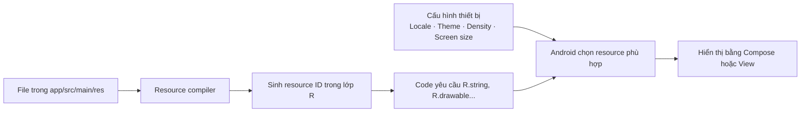

# 034 — Resources Folder trong Android

| Thông tin               | Nội dung                                             |
| ----------------------- | ---------------------------------------------------- |
| **Học phần**            | 01 — Language and Android Fundamentals               |
| **Module**              | Module 02 — Android Fundamentals                     |
| **Nhóm nội dung**       | First App and Version Control                        |
| **Nguồn roadmap**       | Android Fundamentals / First App and Version Control |
| **Loại bài**            | Lesson                                               |
| **Thứ tự trong module** | 034                                                  |
| **Thời lượng gợi ý**    | 24 phút                                              |

---

## 1. Tóm tắt

**Resources Folder** hay thư mục `res/` là nơi lưu trữ các tài nguyên không phải mã nguồn mà ứng dụng Android sử dụng, chẳng hạn:

* Chuỗi văn bản.
* Hình ảnh và biểu tượng.
* Màu sắc.
* Kích thước.
* Phông chữ.
* Tệp âm thanh.
* Cấu hình XML.
* Layout XML đối với ứng dụng sử dụng View System.

Trong một module Android thông thường, thư mục này nằm tại:

```text
app/src/main/res/
```

Việc tách tài nguyên khỏi Kotlin giúp ứng dụng dễ bảo trì, hỗ trợ nhiều ngôn ngữ, giao diện sáng/tối, nhiều kích thước màn hình và nhiều mật độ điểm ảnh. Android biên dịch các tài nguyên này thành các mã định danh trong lớp `R`, sau đó tự chọn phiên bản phù hợp với cấu hình thiết bị khi ứng dụng chạy.


*Nguồn ảnh: Android Developers — Projects overview.*

---

## 2. Mục tiêu học tập

Sau bài học này, anh có thể:

* Giải thích được vai trò của thư mục `res/`.
* Phân biệt những thư mục tài nguyên phổ biến như `drawable`, `mipmap`, `values`, `font`, `raw` và `xml`.
* Truy cập tài nguyên bằng `R.string`, `R.drawable`, `R.dimen` và các API tương ứng.
* Sử dụng tài nguyên trong Jetpack Compose và XML.
* Tạo tài nguyên thay thế theo ngôn ngữ, chế độ tối, kích thước hoặc mật độ màn hình.
* Nhận biết mối quan hệ giữa resource, configuration change, lifecycle và UI state.
* Kiểm thử tài nguyên trước khi phát hành ứng dụng.

---

## 3. Resources Folder là gì?

Resource là dữ liệu tĩnh hoặc nội dung bổ sung mà ứng dụng cần nhưng không nên viết trực tiếp trong mã Kotlin.

Ví dụ, thay vì viết:

```kotlin
Text(text = "Đăng nhập")
```

nên khai báo chuỗi trong `strings.xml`:

```xml
<resources>
    <string name="login">Đăng nhập</string>
</resources>
```

Sau đó sử dụng trong Compose:

```kotlin
Text(text = stringResource(R.string.login))
```

Hoặc trong XML:

```xml
android:text="@string/login"
```

String resource có thể được truy cập bằng `R.string.<tên>` trong Kotlin và `@string/<tên>` trong XML. Trong Compose, `stringResource()` là API được thiết kế để đọc chuỗi từ resource.

### Lợi ích của việc tách resource

1. **Dễ dịch ngôn ngữ:** không phải sửa mã Kotlin khi thêm tiếng Việt, tiếng Anh hoặc tiếng Nhật.
2. **Dễ thay đổi giao diện:** màu sắc và kích thước được quản lý tập trung.
3. **Hỗ trợ nhiều thiết bị:** Android tự chọn hình ảnh hoặc layout phù hợp.
4. **Giảm hardcode:** hạn chế chuỗi, màu và kích thước xuất hiện rải rác trong code.
5. **Dễ kiểm thử:** có thể kiểm tra riêng từng locale, theme và cấu hình màn hình.
6. **Dễ làm việc nhóm:** lập trình viên, designer và người dịch có thể làm việc trên các nhóm tài nguyên khác nhau.

---

## 4. Vị trí của thư mục `res/`

Cấu trúc đơn giản của một module Android:

```text
MyAndroidApp/
└── app/
    ├── build.gradle.kts
    └── src/
        ├── androidTest/
        ├── test/
        └── main/
            ├── AndroidManifest.xml
            ├── java/
            │   └── com/example/myapp/
            │       └── MainActivity.kt
            └── res/
                ├── drawable/
                ├── mipmap/
                ├── values/
                ├── font/
                ├── raw/
                └── xml/
```

Trong Android Studio, chế độ **Android View** nhóm file theo loại để dễ tìm kiếm. Chế độ **Project View** hiển thị cấu trúc thư mục thực tế trên ổ đĩa.

> Không đặt file trực tiếp bên trong `res/`. Mỗi file phải nằm trong một thư mục con hợp lệ như `drawable/`, `values/` hoặc `raw/`; đặt file trực tiếp dưới `res/` sẽ gây lỗi biên dịch.

---

## 5. Các thư mục resource phổ biến

| Thư mục       | Mục đích                                                   | Ví dụ                                             |
| ------------- | ---------------------------------------------------------- | ------------------------------------------------- |
| `drawable/`   | Hình ảnh, vector drawable, shape XML, selector             | `ic_profile.xml`, `background.webp`               |
| `mipmap/`     | Biểu tượng launcher của ứng dụng                           | `ic_launcher.webp`                                |
| `values/`     | String, color, dimension, array, style và giá trị đơn giản | `strings.xml`, `dimens.xml`                       |
| `font/`       | Font TTF, OTF, TTC hoặc font family XML                    | `inter_regular.ttf`                               |
| `raw/`        | File giữ gần nguyên dạng và được truy cập qua `R.raw`      | `intro_audio.mp3`, `sample.json`                  |
| `xml/`        | Các file cấu hình XML tổng quát                            | `backup_rules.xml`, `network_security_config.xml` |
| `layout/`     | Layout XML của View System                                 | `activity_main.xml`                               |
| `menu/`       | Menu XML của View System                                   | `menu_main.xml`                                   |
| `color/`      | Color state list XML                                       | `button_text_color.xml`                           |
| `anim/`       | Tween animation XML                                        | `fade_in.xml`                                     |
| `animator/`   | Property animation XML                                     | `scale_up.xml`                                    |
| `navigation/` | Navigation Graph XML                                       | `nav_graph.xml`                                   |

Android phân biệt `drawable/` dành cho đồ họa thông thường và `mipmap/` chủ yếu dành cho launcher icon. `raw/` cung cấp resource ID như `R.raw.filename`, trong khi file trong `assets/` không có ID trong lớp `R` và được đọc bằng `AssetManager`.

### Lưu ý đối với Jetpack Compose

Compose định nghĩa UI, animation và theme chủ yếu bằng Kotlin. Vì vậy, app Compose thuần thường ít sử dụng `layout/`, `menu/`, `anim/` và `animator/`. Tuy nhiên, thư mục `res/` vẫn quan trọng để lưu:

* Chuỗi dịch.
* Vector drawable.
* Ảnh bitmap.
* Font.
* Âm thanh.
* File cấu hình.
* Tài nguyên dùng chung với Android Manifest hoặc thư viện View cũ.

---

## 6. Cách Android xử lý resource



Quy trình cơ bản:

1. Lập trình viên thêm file vào thư mục `res/`.
2. Công cụ build biên dịch resource.
3. Android tạo ID cho từng resource trong lớp `R`.
4. Code tham chiếu resource bằng ID.
5. Khi chạy, Android kiểm tra cấu hình thiết bị.
6. Hệ thống chọn resource mặc định hoặc resource thay thế phù hợp nhất.

Ví dụ:

```text
res/drawable/ic_folder.xml
```

sẽ tạo resource:

```kotlin
R.drawable.ic_folder
```

Chuỗi:

```xml
<string name="screen_title">Resources Folder</string>
```

sẽ tạo resource:

```kotlin
R.string.screen_title
```

---

## 7. Resource mặc định và resource thay thế

Android cho phép tạo nhiều phiên bản của cùng một resource bằng **configuration qualifier**.

```text
res/
├── values/
│   └── strings.xml
├── values-vi/
│   └── strings.xml
├── values-night/
│   └── colors.xml
├── drawable/
│   └── banner.webp
├── drawable-xhdpi/
│   └── banner.webp
├── layout/
│   └── activity_main.xml
└── layout-land/
    └── activity_main.xml
```

Android tự chọn phiên bản phù hợp với locale, chế độ sáng/tối, mật độ màn hình, hướng màn hình và những cấu hình thiết bị khác. Nếu không có phiên bản phù hợp, hệ thống quay về resource mặc định không có qualifier.

### Một số qualifier thường dùng

| Qualifier | Ý nghĩa                         | Ví dụ             |
| --------- | ------------------------------- | ----------------- |
| `vi`      | Tiếng Việt                      | `values-vi/`      |
| `en`      | Tiếng Anh                       | `values-en/`      |
| `night`   | Chế độ tối                      | `values-night/`   |
| `land`    | Màn hình ngang                  | `layout-land/`    |
| `sw600dp` | Chiều rộng nhỏ nhất từ 600dp    | `values-sw600dp/` |
| `hdpi`    | Mật độ điểm ảnh cao             | `drawable-hdpi/`  |
| `xhdpi`   | Mật độ điểm ảnh rất cao         | `drawable-xhdpi/` |
| `nodpi`   | Không scale bitmap theo density | `drawable-nodpi/` |

Khi kết hợp nhiều qualifier, thứ tự qualifier phải đúng theo quy tắc của Android. Ví dụ `drawable-night-xhdpi/` hợp lệ hơn việc tự ý đảo thứ tự thành `drawable-xhdpi-night/`.

---

## 8. Resource mặc định là bắt buộc

Giả sử ứng dụng chỉ có:

```text
res/values-vi/strings.xml
```

nhưng không có:

```text
res/values/strings.xml
```

Ứng dụng có thể không tìm thấy resource khi chạy trên thiết bị sử dụng locale khác.

Do đó, luôn tạo một bộ resource mặc định đầy đủ:

```text
res/values/strings.xml
```

Các file theo ngôn ngữ như `values-vi/`, `values-ja/` hoặc `values-fr/` có thể chỉ ghi đè những chuỗi cần dịch. Nếu resource không xuất hiện trong locale hiện tại, Android sẽ quay về giá trị mặc định.

---

## 9. Thực hành: tạo màn hình Resources Demo

### 9.1. Cấu trúc cần tạo

```text
app/src/main/res/
├── drawable/
│   └── ic_folder.xml
├── values/
│   ├── strings.xml
│   └── dimens.xml
└── values-vi/
    └── strings.xml
```

### 9.2. Chuỗi mặc định

File `res/values/strings.xml`:

```xml
<?xml version="1.0" encoding="utf-8"?>
<resources>
    <string name="app_name">Resources Demo</string>
    <string name="screen_title">Resources Folder</string>
    <string name="screen_description">
        Store static app content separately from Kotlin code.
    </string>
    <string name="resource_count">%1$d resources</string>
    <string name="folder_icon_description">Resource folder icon</string>
</resources>
```

### 9.3. Bản dịch tiếng Việt

File `res/values-vi/strings.xml`:

```xml
<?xml version="1.0" encoding="utf-8"?>
<resources>
    <string name="app_name">Demo tài nguyên</string>
    <string name="screen_title">Thư mục tài nguyên</string>
    <string name="screen_description">
        Lưu nội dung tĩnh của ứng dụng tách biệt khỏi mã Kotlin.
    </string>
    <string name="resource_count">%1$d tài nguyên</string>
    <string name="folder_icon_description">Biểu tượng thư mục tài nguyên</string>
</resources>
```

Hai file dùng cùng tên resource. Code vẫn gọi `R.string.screen_title`; Android tự chọn bản mặc định hoặc bản tiếng Việt theo locale.

### 9.4. Khai báo kích thước

File `res/values/dimens.xml`:

```xml
<?xml version="1.0" encoding="utf-8"?>
<resources>
    <dimen name="screen_padding">16dp</dimen>
    <dimen name="item_spacing">12dp</dimen>
    <dimen name="folder_icon_size">64dp</dimen>
</resources>
```

### 9.5. Sử dụng trong Jetpack Compose

Compose cung cấp các API như `stringResource()`, `dimensionResource()` và `painterResource()` để đọc resource tương ứng.

```kotlin
@Composable
fun ResourcesScreen(
    resourceCount: Int,
    modifier: Modifier = Modifier
) {
    val screenPadding = dimensionResource(R.dimen.screen_padding)
    val itemSpacing = dimensionResource(R.dimen.item_spacing)
    val iconSize = dimensionResource(R.dimen.folder_icon_size)

    Column(
        modifier = modifier
            .fillMaxSize()
            .padding(screenPadding),
        verticalArrangement = Arrangement.spacedBy(itemSpacing)
    ) {
        Icon(
            painter = painterResource(R.drawable.ic_folder),
            contentDescription = stringResource(
                R.string.folder_icon_description
            ),
            modifier = Modifier.size(iconSize)
        )

        Text(
            text = stringResource(R.string.screen_title),
            style = MaterialTheme.typography.headlineMedium
        )

        Text(
            text = stringResource(R.string.screen_description),
            style = MaterialTheme.typography.bodyLarge
        )

        Text(
            text = stringResource(
                R.string.resource_count,
                resourceCount
            )
        )
    }
}
```

Gọi composable:

```kotlin
@Composable
fun App() {
    MaterialTheme {
        ResourcesScreen(resourceCount = 12)
    }
}
```

### 9.6. Sử dụng trong XML View

```xml
<TextView
    android:id="@+id/titleTextView"
    android:layout_width="wrap_content"
    android:layout_height="wrap_content"
    android:text="@string/screen_title"
    android:padding="@dimen/screen_padding" />

<ImageView
    android:id="@+id/folderImageView"
    android:layout_width="@dimen/folder_icon_size"
    android:layout_height="@dimen/folder_icon_size"
    android:contentDescription="@string/folder_icon_description"
    android:src="@drawable/ic_folder" />
```

---

## 10. Tạo resource bằng Android Studio

Trong cửa sổ Project:

1. Nhấp chuột phải vào thư mục `res`.
2. Chọn **New**.
3. Chọn **Android Resource File** hoặc **Android Resource Directory**.
4. Chọn loại resource.
5. Thêm qualifier nếu cần.
6. Nhấn **OK**.

Android Studio cung cấp danh sách qualifier để tránh việc nhập sai tên hoặc sai thứ tự thư mục.


*Nguồn ảnh: Android Developers — Add app resources.*

---

## 11. Minh họa localization

Cùng một màn hình có thể sử dụng chuỗi và hình ảnh khác nhau theo locale mà không cần viết câu lệnh `if` trong UI.


*Nguồn ảnh: Android Developers — Support different languages and cultures.*

Ví dụ:

```text
Thiết bị tiếng Anh
        ↓
values/strings.xml
        ↓
"Hello World!"

Thiết bị tiếng Việt
        ↓
values-vi/strings.xml
        ↓
"Xin chào!"
```

---

## 12. `drawable/` và `mipmap/`

### `drawable/`

Dùng cho:

* Icon bên trong giao diện.
* Hình nền.
* Vector drawable.
* Shape XML.
* Selector theo trạng thái.
* Bitmap PNG, WebP hoặc JPG.
* Nine-patch.

Drawable có thể là bitmap hoặc cấu trúc XML như shape, state list, layer list và transition drawable.

### `mipmap/`

Chủ yếu dùng cho launcher icon:

```text
mipmap-mdpi/
mipmap-hdpi/
mipmap-xhdpi/
mipmap-xxhdpi/
mipmap-xxxhdpi/
```

Không nên đặt mọi ảnh giao diện vào `mipmap/`. Hình ảnh thông thường nên nằm trong `drawable/`.

### Vector hay bitmap?

Đối với icon đơn giản, vector drawable thường giúp giảm số lượng file cần quản lý và có thể scale qua nhiều mật độ màn hình. Bitmap phù hợp hơn với ảnh chụp hoặc đồ họa nhiều chi tiết.

---

## 13. `res/raw/` và `assets/`

### Dùng `res/raw/` khi

* Muốn file có resource ID.
* Không cần giữ cấu trúc thư mục con.
* Muốn mở file bằng `Resources.openRawResource()`.

Ví dụ:

```text
res/raw/privacy_policy.json
```

```kotlin
val inputStream = resources.openRawResource(
    R.raw.privacy_policy
)
```

### Dùng `assets/` khi

* Cần giữ tên file gốc.
* Cần tạo cấu trúc thư mục con.
* Muốn duyệt file giống hệ thống file.
* Sử dụng thư viện yêu cầu đường dẫn asset.

Ví dụ:

```text
assets/
└── lessons/
    └── module_01.json
```

```kotlin
val inputStream = context.assets.open(
    "lessons/module_01.json"
)
```

File trong `assets/` không được tạo ID trong lớp `R`, còn file trong `res/raw/` có thể truy cập bằng `R.raw.<name>`.

---

## 14. Resources, lifecycle và state

Resource và state là hai khái niệm khác nhau.

| Resource                      | State                                         |
| ----------------------------- | --------------------------------------------- |
| Nội dung tĩnh của ứng dụng    | Dữ liệu thay đổi trong lúc người dùng sử dụng |
| String, icon, màu, font       | Nội dung form, lựa chọn, vị trí cuộn          |
| Được truy cập qua lớp `R`     | Được quản lý bằng state holder                |
| Có thể thay đổi theo cấu hình | Cần được giữ khi Activity bị tạo lại          |

Ví dụ:

```kotlin
val title = stringResource(R.string.screen_title)
```

`title` là resource.

```kotlin
var searchQuery by rememberSaveable {
    mutableStateOf("")
}
```

`searchQuery` là UI state.

Khi locale, kích thước màn hình hoặc cấu hình thiết bị thay đổi, Activity có thể bị tạo lại hoặc Compose có thể recompose để phản ánh cấu hình mới. UI state không nên phụ thuộc vào resource folder; hãy sử dụng `ViewModel` cho dữ liệu và business logic, đồng thời dùng `rememberSaveable` cho UI state cần tồn tại qua quá trình tái tạo Activity.

---

## 15. Những lỗi junior thường gặp

### 15.1. Hardcode văn bản

Không nên:

```kotlin
Text("Đăng nhập")
```

Nên:

```kotlin
Text(stringResource(R.string.login))
```

Hardcode khiến việc dịch, chỉnh sửa và kiểm thử locale khó hơn.

### 15.2. Chỉ tạo resource có qualifier

Không nên chỉ có:

```text
values-vi/strings.xml
```

Hãy luôn có:

```text
values/strings.xml
```

Resource mặc định phải chứa đầy đủ các mục mà ứng dụng cần.

### 15.3. Đặt file trực tiếp trong `res/`

Sai:

```text
res/banner.png
```

Đúng:

```text
res/drawable/banner.png
```

### 15.4. Đặt launcher icon trong `drawable/`

Launcher icon nên được quản lý bằng các thư mục `mipmap-*`.

### 15.5. Dùng tên file không nhất quán

Không nên:

```text
User Profile Icon.png
banner@2x.png
Login-Background.webp
```

Nên:

```text
ic_user_profile.xml
bg_login.webp
banner_home.webp
```

Android asset nên sử dụng tên chữ thường và quy ước nhất quán; không nên thêm hậu tố độ phân giải kiểu `@2x` vào tên file.

### 15.6. Dùng ảnh bitmap quá lớn

Ảnh quá lớn có thể:

* Tăng dung lượng ứng dụng.
* Tăng mức sử dụng bộ nhớ.
* Làm UI tải chậm.
* Gây giật khi cuộn.

Với icon đơn giản, nên cân nhắc vector drawable. Với ảnh chụp, hãy resize và nén phù hợp.

### 15.7. Nhầm resource với state

Không lưu trạng thái đăng nhập, nội dung form hoặc dữ liệu API trong `res/`. Resource được đóng gói cùng ứng dụng và không phải nơi lưu dữ liệu runtime.

---

## 16. Ảnh hưởng đến UX và chất lượng sản phẩm

### UX

Resource qualifier giúp ứng dụng:

* Hiển thị đúng ngôn ngữ.
* Hỗ trợ dark mode.
* Hiển thị hình ảnh rõ nét trên nhiều màn hình.
* Thích nghi với điện thoại, tablet và màn hình xoay ngang.

### Maintainability

* Chuỗi được quản lý tập trung.
* Designer có thể thay asset mà không sửa business logic.
* Có thể đổi theme mà không sửa nhiều composable.
* Các module dùng resource rõ ràng và nhất quán.

### Reliability

* Resource mặc định ngăn lỗi thiếu tài nguyên.
* Kiểm thử qualifier giúp phát hiện lỗi trước release.
* Tên resource rõ ràng làm giảm việc tham chiếu nhầm.

### Performance và kích thước ứng dụng

* Vector phù hợp có thể giảm số lượng bitmap theo density.
* Resource không sử dụng có thể được optimizer loại bỏ trong release build.
* Resource được tìm bằng tên động có thể cần quy tắc giữ lại để tránh bị resource shrinker loại bỏ.

---

## 17. Kiểm thử và debugging

### Checklist kiểm thử nhanh

* [ ] Build ứng dụng không có lỗi resource.
* [ ] Không có chuỗi UI quan trọng bị hardcode.
* [ ] `values/strings.xml` chứa toàn bộ resource mặc định.
* [ ] Chuyển thiết bị sang tiếng Việt và kiểm tra giao diện.
* [ ] Chuyển sang tiếng Anh và kiểm tra fallback.
* [ ] Bật chế độ tối.
* [ ] Xoay màn hình dọc/ngang.
* [ ] Kiểm tra trên điện thoại và tablet.
* [ ] Kiểm tra text dài không bị cắt.
* [ ] Kiểm tra icon không bị mờ.
* [ ] Kiểm tra `contentDescription` cho ảnh có ý nghĩa.
* [ ] Build phiên bản release và kiểm tra resource shrinking.

### Lỗi thường gặp

#### `Unresolved reference: R`

Kiểm tra:

* Có lỗi XML hay không.
* Tên file resource có hợp lệ không.
* Import nhầm `android.R` hay không.
* Gradle sync đã hoàn tất chưa.
* Namespace của module có đúng không.

Không nên import:

```kotlin
import android.R
```

Thay vào đó, sử dụng lớp `R` của ứng dụng:

```kotlin
import com.example.resourcesdemo.R
```

#### `Resource not found`

Kiểm tra:

* Resource có tồn tại trong bộ mặc định không.
* Tên resource có bị sai chính tả không.
* File có nằm đúng thư mục không.
* Qualifier có đúng thứ tự không.
* Resource có bị loại khỏi release build không.

---

## 18. Artifact nhỏ cho portfolio

Tạo repository:

```text
android-resources-demo/
├── app/
├── screenshots/
│   ├── english-light.png
│   ├── vietnamese-light.png
│   └── vietnamese-dark.png
└── README.md
```

README nên trình bày:

```markdown
# Android Resources Demo

Ứng dụng minh họa cách tổ chức Android resources.

## Tính năng

- String resource tiếng Anh và tiếng Việt.
- Dark mode resources.
- Vector drawable.
- Dimension resources.
- Jetpack Compose resource APIs.
- Kiểm thử thay đổi locale và orientation.

## Kiến thức áp dụng

- `R.string`
- `R.drawable`
- `stringResource`
- `painterResource`
- Resource qualifiers
- Default resources
- Configuration changes
```

### Tiêu chí portfolio

* Có ít nhất hai locale.
* Có ảnh chụp màn hình.
* Có cấu trúc `res/` rõ ràng.
* Không hardcode chuỗi quan trọng.
* Có phần giải thích resource fallback.
* Có checklist kiểm thử.
* Có commit history thể hiện từng bước triển khai.

---

## 19. Bài thực hành 24 phút

### Phút 0–5: khám phá project

1. Mở Android Studio.
2. Chuyển giữa Android View và Project View.
3. Tìm `app/src/main/res`.
4. Ghi lại những thư mục đang có.

### Phút 5–12: tạo resource

1. Thêm ba chuỗi vào `strings.xml`.
2. Tạo `values-vi/strings.xml`.
3. Thêm một vector icon vào `drawable/`.
4. Thêm kích thước vào `dimens.xml`.

### Phút 12–18: sử dụng trong UI

Tạo màn hình Compose sử dụng:

```kotlin
stringResource()
dimensionResource()
painterResource()
```

### Phút 18–22: kiểm thử

1. Chạy ứng dụng bằng tiếng Anh.
2. Chuyển hệ thống sang tiếng Việt.
3. Xoay màn hình.
4. Kiểm tra state có bị mất không.

### Phút 22–24: ghi README

Viết ngắn gọn:

* Resource Folder là gì?
* Resource ID được dùng thế nào?
* Resource qualifier giải quyết vấn đề gì?
* Lỗi nào đã gặp?
* Ảnh hưởng đến UX ra sao?

---

## 20. Bài tập

Xây dựng một màn hình **App Information** gồm:

* Logo ứng dụng.
* Tên ứng dụng.
* Phiên bản.
* Mô tả.
* Nút “Bắt đầu”.
* Bản dịch tiếng Anh và tiếng Việt.
* Giao diện sáng và tối.

### Yêu cầu kỹ thuật

* Không hardcode chuỗi trong composable.
* Logo nằm trong `drawable/`.
* Launcher icon nằm trong `mipmap/`.
* Kích thước chung nằm trong `dimens.xml`.
* Có `values/strings.xml`.
* Có `values-vi/strings.xml`.
* Có ảnh chụp hai ngôn ngữ.
* Nội dung form hoặc UI state không bị mất khi xoay màn hình.

---

## 21. Ghi chú năm dòng

```text
Resources Folder là nơi chứa nội dung tĩnh của ứng dụng Android.
Các resource được chia theo loại như drawable, values, font và raw.
Công cụ build tạo resource ID trong lớp R để code truy cập an toàn.
Android tự chọn resource phù hợp với ngôn ngữ và cấu hình thiết bị.
Resource không phải UI state; state cần được quản lý bằng ViewModel hoặc rememberSaveable.
```

---

## 22. Checklist hoàn thành

* [ ] Giải thích được mục đích của `res/`.
* [ ] Xác định được vị trí `app/src/main/res`.
* [ ] Phân biệt được `drawable/` và `mipmap/`.
* [ ] Phân biệt được `res/raw/` và `assets/`.
* [ ] Sử dụng được `R.string` và `R.drawable`.
* [ ] Sử dụng được `stringResource()` trong Compose.
* [ ] Tạo được `values-vi/`.
* [ ] Hiểu cơ chế resource mặc định và fallback.
* [ ] Không đặt file trực tiếp trong `res/`.
* [ ] Không hardcode chuỗi UI quan trọng.
* [ ] Biết resource không thay thế cho state management.
* [ ] Kiểm thử được locale, dark mode và orientation.
* [ ] Có README hoặc screenshot để đưa vào portfolio.

---

## 23. Kết luận

Resources Folder là một phần nền tảng của mọi ứng dụng Android. Một developer tốt không chỉ biết đặt ảnh vào `drawable/` hay chuỗi vào `strings.xml`, mà còn phải hiểu:

* Android tạo resource ID như thế nào.
* Hệ thống chọn resource theo cấu hình ra sao.
* Vì sao phải có resource mặc định.
* Resource ảnh hưởng đến localization và responsive UI như thế nào.
* Configuration change có thể tác động đến lifecycle và state ra sao.
* Cần kiểm thử những cấu hình nào trước khi release.

Tổ chức resource đúng ngay từ đầu giúp ứng dụng dễ dịch, dễ mở rộng, ít lỗi và tạo trải nghiệm nhất quán trên nhiều thiết bị.
