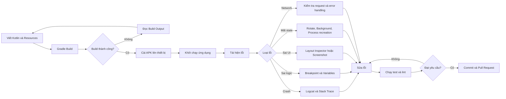
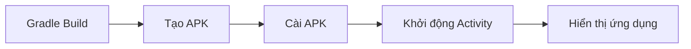
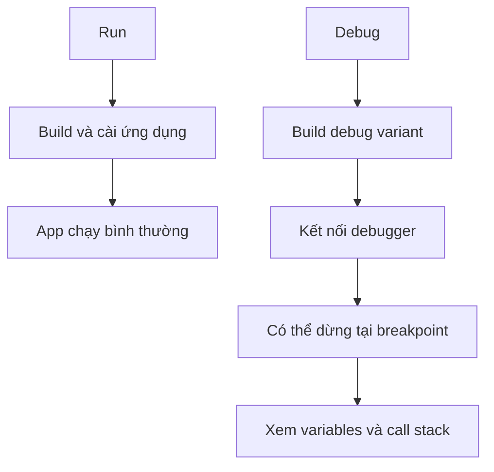
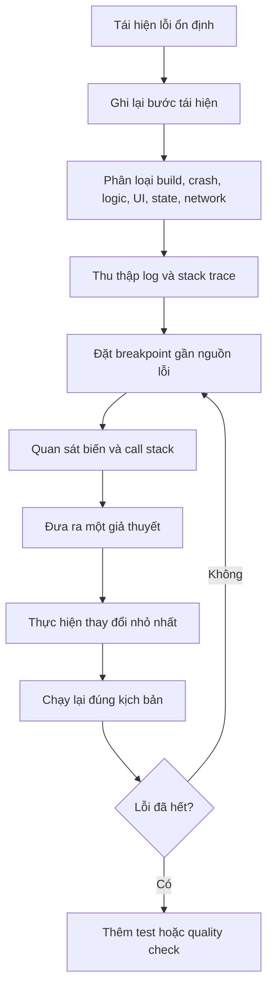

# 035 - Run and Debug App
[](https://developer.android.com/codelabs/basic-android-kotlin-compose-intro-debugger?utm_source=chatgpt.com)

**Học phần:** 01 - Language and Android Fundamentals
**Module:** Module 02 - Android Fundamentals
**Nhóm nội dung:** First App and Version Control
**Nguồn roadmap:** Android Fundamentals / First App and Version Control
**Loại bài:** Quality
**Thứ tự trong module:** 035
**Thời lượng gợi ý:** 30 phút

---

## 1. Tóm tắt

**Run and Debug App** là quá trình xây dựng, cài đặt, chạy, quan sát và tìm nguyên nhân lỗi của một ứng dụng Android trên trình giả lập hoặc thiết bị thật.

Trong Android Studio:

* **Run** dùng để build, cài đặt và khởi chạy ứng dụng.
* **Debug** chạy hoặc kết nối debugger vào tiến trình ứng dụng để đặt breakpoint, xem giá trị biến, call stack và thực thi từng dòng mã.
* **Build Output** cho biết lỗi biên dịch và lỗi Gradle.
* **Logcat** hiển thị log, exception và stack trace trong thời gian thực.
* **Tests và lint** giúp biến việc kiểm tra thủ công thành một quy trình có thể lặp lại.

Android Studio cho phép triển khai ứng dụng lên Android Virtual Device hoặc thiết bị vật lý trực tiếp từ run configuration và target device trên thanh công cụ. ([Android Developers][1])

---

## 2. Mục tiêu học tập

Sau bài học, anh có thể:

* Phân biệt **Build**, **Run**, **Debug**, **Test** và **Profile**.
* Chạy ứng dụng trên Android Emulator hoặc thiết bị Android thật.
* Đọc lỗi trong Build Output và Logcat.
* Đặt breakpoint và quan sát biến khi ứng dụng đang chạy.
* Dùng Step Over, Step Into, Step Out và Resume Program.
* Phát hiện lỗi liên quan đến lifecycle, state, network và dữ liệu.
* Tạo một lệnh kiểm tra chất lượng có thể chạy lại trên máy cá nhân hoặc CI.
* Lưu screenshot, log và README làm artifact cho portfolio.

---

## 3. Vị trí của Run và Debug trong quy trình phát triển



Run và debug nằm trong **feedback loop**:

> Viết code → chạy ứng dụng → quan sát → tìm nguyên nhân → sửa → kiểm tra lại.

Feedback loop càng ngắn và có thể lặp lại thì việc phát triển càng ổn định.

---

## 4. Phân biệt các thao tác chính

| Thao tác            | Mục đích                              | Khi sử dụng                                       |
| ------------------- | ------------------------------------- | ------------------------------------------------- |
| **Build**           | Biên dịch code và đóng gói ứng dụng   | Kiểm tra code có compile được không               |
| **Run**             | Build, cài đặt và mở ứng dụng         | Kiểm tra nhanh UI và user flow                    |
| **Debug**           | Chạy ứng dụng kèm debugger            | Tìm lỗi logic hoặc giá trị bất thường             |
| **Attach Debugger** | Kết nối debugger vào app đang chạy    | Không muốn khởi động lại ứng dụng                 |
| **Test**            | Chạy kiểm thử tự động                 | Bảo vệ hành vi đã hoàn thành                      |
| **Lint**            | Phân tích mã tĩnh                     | Tìm lỗi chất lượng, API, hiệu năng, accessibility |
| **Profile**         | Đo CPU, memory, network và năng lượng | Tìm vấn đề hiệu năng                              |

Debugger của Android Studio hỗ trợ breakpoint trong Kotlin, Java và C/C++, đồng thời cho phép xem biến và đánh giá biểu thức tại runtime. Muốn debug, ứng dụng phải sử dụng một build variant có `isDebuggable = true`; project Android thường đã có variant `debug` mặc định. ([Android Developers][2])

---

## 5. Ảnh minh họa

### 5.1. Chọn thiết bị và chạy ứng dụng


*Android Studio cho phép chọn emulator, thiết bị thật hoặc ghép đôi thiết bị qua Wi-Fi trước khi nhấn Run.* 

### 5.2. Cửa sổ Debugger


Debugger thường có các khu vực chính:

1. **Frames:** các hàm trong call stack.
2. **Evaluate/Watch:** theo dõi hoặc tính biểu thức.
3. **Variables:** giá trị biến tại vị trí chương trình đang tạm dừng. ([Android Developers][3])

### 5.3. Cửa sổ Logcat


Logcat hiển thị log từ ứng dụng, dịch vụ Android và hệ thống theo thời gian thực. Khi app ném exception, Logcat hiển thị stack trace có liên kết đến dòng code liên quan. ([Android Developers][4])

---

## 6. Chạy ứng dụng bằng Android Studio

### Bước 1: Chọn run configuration

Trên thanh công cụ, chọn configuration của module ứng dụng, thường có tên:

```text
app
```

Một run configuration xác định:

* Module cần chạy.
* Activity được khởi động.
* Build variant.
* Tùy chọn cài đặt APK.
* Tùy chọn debugger.
* Thiết bị đích.

Android Studio tự tạo run/debug configuration cho Activity chính khi tạo project từ Android App template. ([Android Developers][5])

### Bước 2: Chọn thiết bị

Có thể sử dụng:

* Android Emulator.
* Điện thoại hoặc máy tính bảng kết nối USB.
* Thiết bị ghép đôi qua Wi-Fi.
* Thiết bị từ Android Device Streaming nếu tài khoản hỗ trợ.

### Bước 3: Nhấn Run

Nhấn biểu tượng **Run ▶** hoặc dùng phím tắt:

```text
Windows/Linux: Shift + F10
macOS: Control + R
```

Android Studio sẽ thực hiện:



Nếu build thất bại, mở:

```text
View > Tool Windows > Build
```

Build Output hiển thị các Gradle task và lỗi compile, resource hoặc manifest. ([Android Developers][1])

---

## 7. Chạy trên thiết bị thật

### 7.1. Bật Developer options

Trên phần lớn thiết bị:

```text
Settings
└── About phone
    └── Build number
```

Chạm nhiều lần vào **Build number** cho đến khi Developer options được kích hoạt.

Sau đó bật:

```text
Settings
└── Developer options
    └── USB debugging
```

Thiết bị thật cần bật USB debugging để Android Studio và ADB có thể giao tiếp với thiết bị. Android 11 trở lên cũng hỗ trợ triển khai và debug qua Wi-Fi. ([Android Developers][6])

### 7.2. Kiểm tra kết nối

```bash
adb devices
```

Kết quả bình thường:

```text
List of devices attached
R58M123ABC    device
```

Một số trạng thái lỗi:

| Trạng thái               | Ý nghĩa                             | Cách xử lý                         |
| ------------------------ | ----------------------------------- | ---------------------------------- |
| `unauthorized`           | Chưa cho phép máy tính debug        | Mở điện thoại và chọn Allow        |
| `offline`                | Kết nối ADB không ổn định           | Rút cáp hoặc khởi động lại ADB     |
| Không thấy thiết bị      | Cáp, driver hoặc USB mode có vấn đề | Đổi cáp, cổng USB, kiểm tra driver |
| Emulator không xuất hiện | Emulator chưa boot xong             | Mở Device Manager và chạy lại AVD  |

Khởi động lại ADB:

```bash
adb kill-server
adb start-server
adb devices
```

Trên Windows, thiết bị Google có thể cần Google USB Driver; các hãng khác có thể yêu cầu driver riêng. ([Android Developers][7])

> Trước khi release, cần kiểm tra trên ít nhất một thiết bị thật vì emulator không phản ánh đầy đủ camera, cảm biến, bộ nhớ, hiệu năng, firmware và hành vi của từng nhà sản xuất. Tài liệu Android cũng khuyến nghị luôn kiểm tra app trên thiết bị thật trước khi phát hành. ([Android Developers][6])

---

## 8. Debug ứng dụng

### 8.1. Run và Debug khác nhau thế nào?



**Run** phù hợp khi:

* Kiểm tra giao diện.
* Kiểm tra navigation.
* Kiểm tra user flow nhanh.
* Không cần dừng chương trình.

**Debug** phù hợp khi:

* Giá trị biến không đúng.
* Điều kiện `if` chạy sai nhánh.
* Hàm được gọi sai số lần.
* State cập nhật không đúng.
* App crash tại một hành động cụ thể.
* Cần kiểm tra luồng coroutine hoặc callback.

### 8.2. Khởi chạy bằng Debug

Nhấn biểu tượng **Debug 🐞** hoặc:

```text
Windows/Linux: Shift + F9
macOS: Control + D
```

Nếu ứng dụng đang chạy, có thể dùng:

```text
Run > Attach Debugger to Android Process
```

Sau đó chọn process có package name của ứng dụng.

Android Studio hỗ trợ cả hai cách: khởi chạy app với debugger ngay từ đầu hoặc attach debugger vào một tiến trình đang chạy. ([Android Developers][3])

---

## 9. Breakpoint

Breakpoint là điểm yêu cầu debugger tạm dừng chương trình trước khi thực hiện một dòng code.

Để tạo breakpoint:

1. Mở file Kotlin.
2. Nhấn vào gutter bên trái số dòng.
3. Một chấm đỏ xuất hiện.
4. Chạy ứng dụng bằng Debug.
5. Thực hiện hành động khiến dòng code đó được chạy.

Ví dụ:

```kotlin
Button(
    onClick = {
        val oldValue = count       // Đặt breakpoint tại đây
        count = oldValue + 1
    }
) {
    Text("Tăng")
}
```

Khi chương trình dừng, kiểm tra:

* `count` đang có giá trị bao nhiêu?
* Thread nào đang chạy?
* Hàm nào gọi đến đoạn code này?
* Điều kiện nào đã dẫn tới breakpoint?
* Dữ liệu có `null` hoặc rỗng không?

Ứng dụng chỉ dừng tại breakpoint khi luồng thực thi thực sự đi qua dòng đó. ([Android Developers][3])

---

## 10. Các thao tác debugger quan trọng

| Thao tác                | Ý nghĩa                                                      |
| ----------------------- | ------------------------------------------------------------ |
| **Resume Program**      | Tiếp tục chạy cho tới breakpoint tiếp theo                   |
| **Step Over**           | Chạy dòng hiện tại nhưng không đi vào bên trong hàm được gọi |
| **Step Into**           | Đi vào hàm đang được gọi                                     |
| **Step Out**            | Chạy phần còn lại của hàm và quay về hàm gọi                 |
| **Evaluate Expression** | Tính thử một biểu thức tại runtime                           |
| **Add to Watches**      | Theo dõi một biến hoặc biểu thức                             |
| **Mute Breakpoints**    | Tạm tắt tất cả breakpoint                                    |
| **Stop**                | Dừng tiến trình debug                                        |

Ví dụ:

```kotlin
val normalizedEmail = normalizeEmail(input)
val isValid = validateEmail(normalizedEmail)
submitLogin(normalizedEmail, isValid)
```

Cách sử dụng:

* Dùng **Step Into** tại `normalizeEmail()` để xem logic chuẩn hóa.
* Dùng **Step Over** nếu không cần quan tâm phần bên trong hàm.
* Dùng **Step Out** khi đã tìm hiểu xong hàm hiện tại.
* Dùng **Resume Program** để tiếp tục tới breakpoint tiếp theo.

Android Studio định nghĩa Step Over là chuyển tới dòng tiếp theo mà không vào method, Step Into là đi vào method và Step Out là thoát khỏi method hiện tại. ([Android Developers][8])

---

## 11. Logcat

### 11.1. Mở Logcat

```text
View > Tool Windows > Logcat
```

Chọn đúng:

* Thiết bị.
* Process hoặc package.
* Mức log.
* Query lọc.

### 11.2. Các mức log

| Hàm         | Mức độ       | Trường hợp sử dụng                     |
| ----------- | ------------ | -------------------------------------- |
| `Log.v()`   | Verbose      | Thông tin rất chi tiết                 |
| `Log.d()`   | Debug        | Giá trị phục vụ debug                  |
| `Log.i()`   | Info         | Sự kiện thông tin                      |
| `Log.w()`   | Warning      | Trạng thái bất thường nhưng chưa crash |
| `Log.e()`   | Error        | Lỗi cần xử lý                          |
| `Log.wtf()` | Fatal/Assert | Lỗi nghiêm trọng ngoài dự kiến         |

Logcat phân loại log theo `FATAL`, `ERROR`, `WARNING`, `INFO`, `DEBUG` và `VERBOSE`. ([Android Developers][9])

### 11.3. Ví dụ ghi log

```kotlin
private const val TAG = "RunDebugLesson"

Log.d(TAG, "User pressed login")
Log.i(TAG, "Profile loaded successfully")
Log.w(TAG, "Cached data is expired")
Log.e(TAG, "Unable to load profile", exception)
```

Nên log cả context cần thiết:

```kotlin
Log.d(
    TAG,
    "Loading profile: userId=$userId, refresh=$forceRefresh"
)
```

Không nên log:

```kotlin
Log.d(TAG, "Password: $password")
Log.d(TAG, "Access token: $accessToken")
Log.d(TAG, "Credit card: $cardNumber")
```

Không đưa password, access token, cookie, khóa API hoặc dữ liệu nhạy cảm của người dùng vào log.

---

## 12. Lọc Logcat

Ví dụ query trong Android Studio:

```text
package:mine
```

Chỉ hiển thị log của app hiện tại:

```text
package:mine level:ERROR
```

Lọc theo tag:

```text
tag:RunDebugLesson
```

Kết hợp:

```text
package:mine tag:RunDebugLesson level:DEBUG
```

Dùng ADB:

```bash
adb logcat
```

Lọc theo tag:

```bash
adb logcat RunDebugLesson:D "*:S"
```

Xóa log cũ:

```bash
adb logcat -c
```

Lưu log vào file:

```bash
adb logcat -d > debug-log.txt
```

---

## 13. Cách đọc stack trace

Ví dụ:

```text
FATAL EXCEPTION: main
Process: com.example.rundebug, PID: 18420

java.lang.ArithmeticException: divide by zero
    at com.example.rundebug.PriceCalculator.calculate(PriceCalculator.kt:18)
    at com.example.rundebug.CheckoutViewModel.submit(CheckoutViewModel.kt:47)
    at com.example.rundebug.CheckoutScreenKt$CheckoutScreen$1.invoke(CheckoutScreen.kt:92)
```

Đọc theo thứ tự:

### Bước 1: Xác định exception

```text
java.lang.ArithmeticException: divide by zero
```

Chương trình đã thực hiện phép chia cho `0`.

### Bước 2: Tìm dòng code đầu tiên thuộc project

```text
PriceCalculator.kt:18
```

Đây thường là nơi lỗi trực tiếp xảy ra.

### Bước 3: Đọc ngược call stack

```text
CheckoutScreen
→ CheckoutViewModel.submit
→ PriceCalculator.calculate
→ Crash
```

### Bước 4: Đặt breakpoint trước dòng lỗi

Kiểm tra:

```text
price = ?
quantity = ?
discount = ?
divisor = ?
```

### Bước 5: Sửa nguyên nhân, không chỉ che triệu chứng

Không nên:

```kotlin
try {
    total / divisor
} catch (e: Exception) {
    0
}
```

Nên kiểm tra điều kiện:

```kotlin
fun divideTotal(total: Int, divisor: Int): Int {
    require(divisor != 0) {
        "divisor must not be zero"
    }

    return total / divisor
}
```

Android Studio tự động làm nổi bật stack trace trong Logcat và cung cấp liên kết đến dòng source code gây lỗi. ([Android Developers][10])

---

## 14. Thực hành: Debug ứng dụng Counter

### 14.1. Mục tiêu

Tạo một màn hình có:

* Bộ đếm.
* Log khi lifecycle thay đổi.
* Log trước và sau khi tăng giá trị.
* State không mất khi xoay màn hình.
* Breakpoint để quan sát state.

### 14.2. Code mẫu

```kotlin
package com.example.rundebug

import android.os.Bundle
import android.util.Log
import androidx.activity.ComponentActivity
import androidx.activity.compose.setContent
import androidx.compose.foundation.layout.Arrangement
import androidx.compose.foundation.layout.Column
import androidx.compose.foundation.layout.fillMaxSize
import androidx.compose.foundation.layout.padding
import androidx.compose.material3.Button
import androidx.compose.material3.MaterialTheme
import androidx.compose.material3.Surface
import androidx.compose.material3.Text
import androidx.compose.runtime.Composable
import androidx.compose.runtime.getValue
import androidx.compose.runtime.mutableIntStateOf
import androidx.compose.runtime.saveable.rememberSaveable
import androidx.compose.runtime.setValue
import androidx.compose.ui.Alignment
import androidx.compose.ui.Modifier
import androidx.compose.ui.unit.dp

private const val TAG = "RunDebugLesson"

class MainActivity : ComponentActivity() {

    override fun onCreate(savedInstanceState: Bundle?) {
        super.onCreate(savedInstanceState)

        Log.d(
            TAG,
            "onCreate: restored=${savedInstanceState != null}"
        )

        setContent {
            MaterialTheme {
                Surface(modifier = Modifier.fillMaxSize()) {
                    CounterScreen()
                }
            }
        }
    }

    override fun onStart() {
        super.onStart()
        Log.d(TAG, "onStart")
    }

    override fun onResume() {
        super.onResume()
        Log.d(TAG, "onResume")
    }

    override fun onPause() {
        Log.d(TAG, "onPause")
        super.onPause()
    }

    override fun onStop() {
        Log.d(TAG, "onStop")
        super.onStop()
    }

    override fun onDestroy() {
        Log.d(TAG, "onDestroy")
        super.onDestroy()
    }
}

@Composable
private fun CounterScreen() {
    var count by rememberSaveable {
        mutableIntStateOf(0)
    }

    Column(
        modifier = Modifier
            .fillMaxSize()
            .padding(24.dp),
        verticalArrangement = Arrangement.Center,
        horizontalAlignment = Alignment.CenterHorizontally
    ) {
        Text(
            text = "Số lần bấm: $count",
            style = MaterialTheme.typography.headlineMedium
        )

        Button(
            onClick = {
                Log.d(TAG, "Before increment: count=$count")

                // Đặt breakpoint tại dòng này.
                count += 1

                Log.d(TAG, "After increment: count=$count")
            },
            modifier = Modifier.padding(top = 16.dp)
        ) {
            Text("Tăng")
        }
    }
}
```

---

## 15. Kịch bản debug

### Kịch bản 1: Kiểm tra button

1. Chạy ứng dụng bằng Debug.
2. Đặt breakpoint tại:

```kotlin
count += 1
```

3. Nhấn nút **Tăng**.
4. Quan sát biến `count`.
5. Nhấn Step Over.
6. Kiểm tra `count` sau khi tăng.
7. Nhấn Resume Program.

Kết quả mong đợi:

```text
Before increment: count=0
After increment: count=1
```

### Kịch bản 2: Kiểm tra lifecycle

Thực hiện lần lượt:

1. Mở app.
2. Nhấn Home.
3. Quay lại app.
4. Xoay màn hình.
5. Đóng app.

Quan sát Logcat:

```text
onCreate
onStart
onResume
onPause
onStop
onStart
onResume
```

Khi thay đổi cấu hình như xoay màn hình, Activity thường bị hủy và tạo lại. Việc xử lý lifecycle đúng giúp tránh crash, lãng phí tài nguyên và mất tiến trình người dùng. ([Android Developers][11])

### Kịch bản 3: Tạo lỗi mất state

Đổi:

```kotlin
var count by rememberSaveable {
    mutableIntStateOf(0)
}
```

thành:

```kotlin
var count by remember {
    mutableIntStateOf(0)
}
```

Sau đó:

1. Tăng `count` lên `5`.
2. Xoay thiết bị.
3. Quan sát `count` trở về `0`.
4. Đổi lại thành `rememberSaveable`.
5. Chạy lại và xác nhận lỗi đã được sửa.

Người dùng kỳ vọng trạng thái giao diện được giữ nguyên khi xoay màn hình hoặc tạm chuyển sang ứng dụng khác. Android khuyến nghị sử dụng ViewModel, saved state như `rememberSaveable` hoặc `SavedStateHandle`, và local storage tùy loại dữ liệu. ([Android Developers][12])

---

## 16. Debug các nhóm lỗi thường gặp

### 16.1. Build error

Dấu hiệu:

```text
Compilation error
Unresolved reference
Manifest merger failed
Android resource linking failed
Duplicate class
```

Kiểm tra:

* Dòng đầu tiên chỉ ra lỗi thực sự.
* File và số dòng.
* Import.
* Dependency.
* Tên resource.
* Manifest.
* Phiên bản SDK hoặc plugin.

### 16.2. Runtime crash

Dấu hiệu:

```text
FATAL EXCEPTION
```

Quy trình:

```text
Exception
→ Message
→ Caused by
→ Dòng code đầu tiên thuộc project
→ Breakpoint
→ Kiểm tra biến
```

### 16.3. Logic bug

Ví dụ:

* Button chạy nhưng kết quả sai.
* Sai điều kiện `if`.
* State không cập nhật.
* Hàm bị gọi nhiều lần.
* API trả dữ liệu nhưng UI không hiển thị.

Công cụ phù hợp:

* Breakpoint.
* Conditional breakpoint.
* Variables.
* Watches.
* Evaluate Expression.
* Logcat.

### 16.4. Lifecycle và state bug

Kiểm tra app khi:

* Xoay màn hình.
* Chuyển light/dark mode.
* Nhấn Home rồi quay lại.
* Mở màn hình khác rồi quay lại.
* Chuyển sang multi-window.
* Hệ thống tạo lại Activity.
* Process bị hủy khi app ở background.

### 16.5. Network bug

Kiểm tra:

* Thiết bị có Internet không?
* Manifest có quyền `INTERNET` không?
* URL và HTTP method có đúng không?
* Status code là gì?
* Response body có đúng schema không?
* Có xử lý timeout không?
* Có loading, empty và error state không?
* Có trường hợp API trả `null` không?

### 16.6. Storage bug

Kiểm tra:

* Dữ liệu có được ghi thành công không?
* App có đọc đúng database không?
* Có migration database không?
* Đang dùng debug database hay production database?
* Xóa dữ liệu app có làm lỗi biến mất không?

Xóa dữ liệu app bằng ADB:

```bash
adb shell pm clear com.example.rundebug
```

Dừng ứng dụng:

```bash
adb shell am force-stop com.example.rundebug
```

---

## 17. Quy trình debug có hệ thống

Không nên sửa code ngẫu nhiên cho tới khi app “có vẻ chạy”.

Sử dụng quy trình:



Mẫu ghi lỗi:

```markdown
## Bug: Counter bị reset khi xoay màn hình

### Môi trường

- Device: Pixel 6 Emulator
- Android API: 35
- Build variant: debug

### Bước tái hiện

1. Mở ứng dụng.
2. Nhấn nút Tăng 5 lần.
3. Xoay thiết bị sang landscape.

### Kết quả thực tế

Counter trở về 0.

### Kết quả mong đợi

Counter vẫn bằng 5.

### Nguyên nhân

State chỉ được lưu bằng remember.

### Cách sửa

Đổi remember thành rememberSaveable.

### Kiểm tra hồi quy

- Xoay portrait → landscape.
- Xoay landscape → portrait.
- Nhấn Home rồi quay lại.
```

---

## 18. Chạy từ dòng lệnh

### 18.1. Build debug APK

Linux hoặc macOS:

```bash
./gradlew assembleDebug
```

Windows:

```powershell
gradlew.bat assembleDebug
```

APK thường nằm tại:

```text
app/build/outputs/apk/debug/app-debug.apk
```

### 18.2. Cài ứng dụng

```bash
./gradlew installDebug
```

Hoặc Windows:

```powershell
gradlew.bat installDebug
```

### 18.3. Chạy unit test

```bash
./gradlew test
```

### 18.4. Chạy instrumented test

Cần có emulator hoặc thiết bị đang kết nối:

```bash
./gradlew connectedAndroidTest
```

Android Gradle Plugin cung cấp task `test` cho local tests và `connectedAndroidTest` cho instrumented tests chạy trên thiết bị. Báo cáo được lưu trong các thư mục `build/reports` tương ứng. ([Android Developers][13])

### 18.5. Chạy lint

```bash
./gradlew lint
```

Hoặc chỉ kiểm tra debug variant:

```bash
./gradlew lintDebug
```

Lint tìm các vấn đề về correctness, security, performance, usability, accessibility và internationalization mà không cần chạy ứng dụng. ([Android Developers][14])

---

## 19. Quality check có thể lặp lại

Tạo file:

```text
scripts/quality-check.sh
```

Nội dung:

```bash
#!/usr/bin/env bash

set -euo pipefail

echo "1. Running local tests..."
./gradlew test

echo "2. Running Android lint..."
./gradlew lintDebug

echo "3. Building debug APK..."
./gradlew assembleDebug

echo "Quality check passed."
```

Cấp quyền chạy:

```bash
chmod +x scripts/quality-check.sh
```

Chạy:

```bash
./scripts/quality-check.sh
```

Trên Windows có thể tạo `quality-check.bat`:

```bat
@echo off

call gradlew.bat test
if errorlevel 1 exit /b 1

call gradlew.bat lintDebug
if errorlevel 1 exit /b 1

call gradlew.bat assembleDebug
if errorlevel 1 exit /b 1

echo Quality check passed.
```

Chạy:

```powershell
quality-check.bat
```

### Failure trông như thế nào?

```text
> Task :app:testDebugUnitTest FAILED
```

Hoặc:

```text
> Task :app:lintDebug FAILED
Lint found errors in the project
```

Hoặc:

```text
> Task :app:compileDebugKotlin FAILED
Unresolved reference
```

Vì script trả về exit code khác `0`, CI có thể tự động chặn Pull Request không đạt yêu cầu.

Một bước CI tối thiểu có thể chạy:

```yaml
- name: Run Android quality checks
  run: ./gradlew test lintDebug assembleDebug
```

CI giúp tự động hóa những công việc lặp lại như build, test và kiểm tra chất lượng, giảm lỗi do con người quên chạy lệnh trước khi merge. ([Android Developers][15])

---

## 20. Bài tập

### Yêu cầu chính

Thêm một quality check có thể chạy lại và mô tả rõ trường hợp thất bại.

### Nhiệm vụ

1. Tạo ứng dụng Counter.
2. Thêm lifecycle log.
3. Đặt breakpoint tại thao tác tăng counter.
4. Cố tình dùng `remember` để tái hiện lỗi mất state.
5. Ghi lại Logcat trước và sau khi xoay màn hình.
6. Sửa bằng `rememberSaveable`.
7. Chạy:

```bash
./gradlew test lintDebug assembleDebug
```

8. Lưu screenshot kết quả.
9. Viết README mô tả lỗi và cách sửa.

### Bài nâng cao

Viết một test cho logic counter:

```kotlin
import org.junit.Assert.assertEquals
import org.junit.Test

class CounterTest {

    @Test
    fun increment_fromZero_returnsOne() {
        val currentValue = 0
        val newValue = currentValue + 1

        assertEquals(1, newValue)
    }
}
```

Sau đó cố tình đổi:

```kotlin
val newValue = currentValue - 1
```

Chạy:

```bash
./gradlew test
```

Ghi lại output của test thất bại.

---

## 21. Artifact cho portfolio

Cấu trúc đề xuất:

```text
run-debug-app/
├── app/
├── screenshots/
│   ├── app-running.png
│   ├── breakpoint-hit.png
│   ├── logcat-lifecycle.png
│   └── quality-check-passed.png
├── logs/
│   └── debug-log.txt
├── scripts/
│   ├── quality-check.sh
│   └── quality-check.bat
└── README.md
```

README nên có:

````markdown
# Android Run and Debug Demo

## Mục tiêu

Minh họa cách chạy, debug và kiểm tra chất lượng một ứng dụng
Jetpack Compose.

## Công cụ đã sử dụng

- Android Emulator
- Android Debugger
- Breakpoints
- Logcat
- Gradle tests
- Android lint

## Lỗi được tái hiện

Counter bị reset sau khi xoay màn hình vì state chỉ dùng remember.

## Cách sửa

Sử dụng rememberSaveable để lưu transient UI state qua
configuration change.

## Quality check

```bash
./gradlew test lintDebug assembleDebug
````

## Bằng chứng

* Screenshot breakpoint.
* Logcat lifecycle.
* Kết quả test.
* Lint report.

````

Artifact này cho thấy anh không chỉ biết viết UI mà còn biết:

- Tái hiện bug.
- Phân tích lifecycle.
- Đọc log.
- Debug state.
- Viết kiểm tra tự động.
- Tài liệu hóa quy trình.

---

## 22. Checklist hoàn thành

### Kiến thức

- [ ] Giải thích được sự khác nhau giữa Run và Debug.
- [ ] Biết Build Output dùng cho lỗi nào.
- [ ] Biết Logcat dùng cho lỗi nào.
- [ ] Biết breakpoint là gì.
- [ ] Biết dùng Step Over, Step Into, Step Out và Resume.
- [ ] Biết đọc exception và stack trace.

### Thực hành

- [ ] Chạy app trên emulator.
- [ ] Chạy app trên thiết bị thật hoặc biết cách kết nối.
- [ ] Đặt được ít nhất một breakpoint.
- [ ] Quan sát được giá trị biến.
- [ ] Lọc được Logcat theo package hoặc tag.
- [ ] Kiểm tra app khi xoay màn hình.
- [ ] Kiểm tra app khi background và foreground.
- [ ] Chạy được unit test.
- [ ] Chạy được lint.
- [ ] Build được debug APK.

### Portfolio

- [ ] Có screenshot ứng dụng đang chạy.
- [ ] Có screenshot breakpoint.
- [ ] Có Logcat hoặc stack trace.
- [ ] Có quality-check script.
- [ ] Có README mô tả bug và cách sửa.
- [ ] Không commit password, token hoặc dữ liệu nhạy cảm.

---

## 23. Ghi chú khi đưa vào production

### Lifecycle và state

Kiểm tra rằng:

- Form không mất dữ liệu khi xoay màn hình.
- Danh sách giữ vị trí cuộn hợp lý.
- Người dùng không phải nhập lại dữ liệu sau configuration change.
- App phục hồi đúng khi quay lại từ background.
- State quan trọng được lưu vào ViewModel, SavedStateHandle hoặc storage phù hợp.

### Network

Mỗi màn hình gọi API nên có:

```text
Idle
Loading
Success
Empty
Error
Retry
````

Không giả định rằng:

* Thiết bị luôn có Internet.
* API luôn trả HTTP 200.
* JSON luôn đúng schema.
* Request luôn hoàn thành.
* Token luôn còn hiệu lực.

### Release

Trước khi release:

* Chạy unit tests.
* Chạy lint.
* Build release variant.
* Kiểm tra trên thiết bị thật.
* Kiểm tra rotate và background.
* Kiểm tra offline và slow network.
* Xóa log chứa dữ liệu nhạy cảm.
* Không bật `isDebuggable = true` cho bản production nếu không có lý do đặc biệt.
* Kiểm tra crash reporting và release checklist.

Debug build có thêm debugger và instrumentation nên không phù hợp để đánh giá chính xác hiệu năng production. Khi profiling, nên dùng build profileable dựa trên release để giảm overhead của debug build. ([Android Developers][16])

---

## 24. Ghi nhớ nhanh

> **Build Output** trả lời: “Tại sao app không build được?”

> **Logcat** trả lời: “App đã log hoặc crash như thế nào?”

> **Breakpoint** trả lời: “Giá trị bên trong chương trình đang là gì?”

> **Tests** trả lời: “Hành vi này có tiếp tục đúng sau khi sửa code không?”

> **Lint** trả lời: “Source code có vấn đề cấu trúc, API hoặc chất lượng nào không?”

Quy trình tốt nhất:

```text
Reproduce
→ Observe
→ Isolate
→ Explain
→ Fix
→ Verify
→ Automate
→ Document
```

---

## 25. Tài liệu tham khảo

* [Build and run your app – Android Developers](https://developer.android.com/studio/run)
* [Debug your app – Android Developers](https://developer.android.com/studio/debug)
* [Use the debugger in Android Studio – Codelab](https://developer.android.com/codelabs/basic-android-kotlin-compose-intro-debugger)
* [View logs with Logcat – Android Developers](https://developer.android.com/studio/debug/logcat)
* [Run apps on a hardware device](https://developer.android.com/studio/run/device)
* [Android Debug Bridge](https://developer.android.com/tools/adb)
* [Test from the command line](https://developer.android.com/studio/test/command-line)
* [Improve your code with lint checks](https://developer.android.com/studio/write/lint)
* [Save UI states](https://developer.android.com/topic/libraries/architecture/saving-states)
* [The Activity lifecycle](https://developer.android.com/guide/components/activities/activity-lifecycle)

[1]: https://developer.android.com/studio/run "Build and run your app  |  Android Studio  |  Android Developers"
[2]: https://developer.android.com/studio/debug?authuser=3&utm_source=chatgpt.com "Debug your app  |  Android Studio  |  Android Developers"
[3]: https://developer.android.com/codelabs/basic-android-kotlin-compose-intro-debugger "Use the debugger in Android Studio  |  Android Developers"
[4]: https://developer.android.com/studio/debug/logcat?authuser=9&hl=en "View logs with Logcat  |  Android Studio  |  Android Developers"
[5]: https://developer.android.com/studio/run/rundebugconfig?authuser=0&hl=en&utm_source=chatgpt.com "Create and edit run/debug configurations  |  Android Studio  |  Android Developers"
[6]: https://developer.android.com/studio/run/device.html?utm_source=chatgpt.com "Run apps on a hardware device  |  Android Studio  |  Android Developers"
[7]: https://developer.android.com/studio/run/win-usb?utm_source=chatgpt.com "Get the Google USB Driver  |  Android Studio  |  Android Developers"
[8]: https://developer.android.com/studio/debug?authuser=3 "Debug your app  |  Android Studio  |  Android Developers"
[9]: https://developer.android.com/studio/debug/logcat?hl=vi&utm_source=chatgpt.com "Xem nhật ký bằng Logcat  |  Android Studio  |  Android Developers"
[10]: https://developer.android.com/studio/debug/stacktraces?authuser=3&utm_source=chatgpt.com "Analyze a stack trace  |  Android Studio  |  Android Developers"
[11]: https://developer.android.com/guide/components/activities/activity-lifecycle?utm_source=chatgpt.com "The activity lifecycle | App architecture"
[12]: https://developer.android.com/topic/libraries/architecture/saving-states?utm_source=chatgpt.com "Save UI states | App architecture"
[13]: https://developer.android.com/studio/test/command-line?hl=en&utm_source=chatgpt.com "Test from the command line  |  Android Studio  |  Android Developers"
[14]: https://developer.android.com/studio/write/lint?utm_source=chatgpt.com "Improve your code with lint checks | Android Studio"
[15]: https://developer.android.com/training/testing/continuous-integration?authuser=8&utm_source=chatgpt.com "Continuous Integration basics  |  Test your app on Android  |  Android Developers"
[16]: https://developer.android.com/studio/profile/?utm_source=chatgpt.com "Profile your app performance  |  Android Studio  |  Android Developers"
