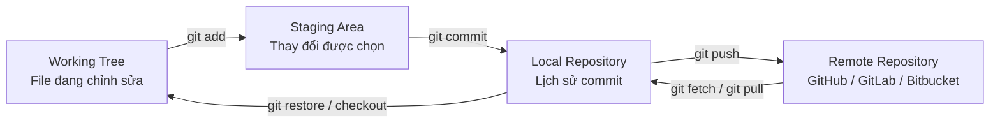
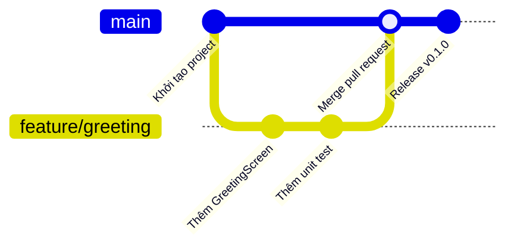
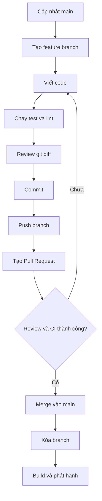

# 036 - Git

> **Học phần:** 01 - Language and Android Fundamentals
> **Module:** Module 02 - Android Fundamentals
> **Nhóm nội dung:** First App and Version Control
> **Nguồn roadmap:** Android Fundamentals / First App and Version Control
> **Loại bài:** Lesson
> **Thứ tự trong module:** 036
> **Thời lượng gợi ý:** 24 phút

---


*Nguồn ảnh: [Git Logo Downloads](https://git-scm.com/community/logos) — logo do Jason Long thiết kế, được cấp phép Creative Commons Attribution 3.0.*

---

## 1. Tóm tắt

**Git** là một hệ thống quản lý phiên bản phân tán, giúp lập trình viên:

* Ghi lại lịch sử thay đổi của mã nguồn.
* So sánh các phiên bản của dự án.
* Khôi phục code khi xảy ra lỗi.
* Phát triển tính năng mới trên các nhánh độc lập.
* Làm việc nhóm mà không ghi đè code của nhau.
* Kiểm tra và phê duyệt thay đổi trước khi phát hành.

Một repository Git lưu toàn bộ lịch sử của dự án thay vì chỉ lưu trạng thái hiện tại. Khi clone repository, máy của lập trình viên nhận được cả mã nguồn và lịch sử cần thiết của repository.

Trong dự án Android, Git thường quản lý:

* Mã nguồn Kotlin hoặc Java.
* Jetpack Compose hoặc XML layout.
* `AndroidManifest.xml`.
* Tài nguyên trong thư mục `res`.
* Cấu hình Gradle.
* Unit test và UI test.
* Tài liệu README.
* Script CI/CD.
* Ghi chú phát hành.

Git không trực tiếp điều khiển UI, lifecycle hay state của ứng dụng. Tuy nhiên, nó giúp kiểm soát các thay đổi liên quan đến những thành phần đó, từ đó giảm rủi ro lỗi và hỗ trợ tìm nguyên nhân khi ứng dụng gặp sự cố.

---

## 2. Mục tiêu học tập

Sau bài học này, anh có thể:

* Giải thích Git bằng ngôn ngữ của mình.
* Phân biệt Git với GitHub, GitLab hoặc Bitbucket.
* Hiểu repository, commit, branch, merge và remote.
* Khởi tạo Git cho một dự án Android.
* Tạo branch để phát triển tính năng.
* Tạo commit có nội dung rõ ràng.
* Đẩy code lên remote repository.
* Xử lý merge conflict cơ bản.
* Biết file nào không nên đưa lên Git.
* Xây dựng một Git workflow nhỏ cho portfolio Android.

---

## 3. Git là gì?

Git là hệ thống ghi lại các thay đổi của một tập hợp file theo thời gian. Nhờ đó, lập trình viên có thể xem lại, so sánh hoặc quay về một phiên bản trước đó của dự án.

Có thể hình dung Git giống như hệ thống **checkpoint** của một trò chơi:

* Mỗi lần `commit` là một checkpoint.
* `branch` là một nhánh chơi thử độc lập.
* `merge` là đưa kết quả của nhánh thử nghiệm vào tiến trình chính.
* `revert` là quay lại trạng thái an toàn trước đó.
* `remote` là bản sao repository được lưu trên máy chủ.

### Ghi chú 5 dòng về Git

> Git là công cụ quản lý lịch sử thay đổi của dự án.
> Mỗi commit lưu một snapshot có ý nghĩa của mã nguồn.
> Branch giúp phát triển tính năng mà không làm ảnh hưởng nhánh chính.
> Merge kết hợp thay đổi từ các branch khác nhau.
> Remote repository giúp sao lưu và cộng tác với những lập trình viên khác.

---

## 4. Git không phải GitHub

| Thành phần         | Vai trò                                                             |
| ------------------ | ------------------------------------------------------------------- |
| **Git**            | Công cụ quản lý phiên bản chạy trên máy của lập trình viên          |
| **GitHub**         | Dịch vụ lưu trữ repository Git và hỗ trợ pull request, issue, CI/CD |
| **GitLab**         | Nền tảng quản lý repository, DevOps và CI/CD                        |
| **Bitbucket**      | Nền tảng lưu trữ Git thường được dùng cùng Jira                     |
| **Android Studio** | IDE có giao diện tích hợp các thao tác Git                          |

Anh có thể sử dụng Git hoàn toàn trên máy tính mà chưa cần GitHub. GitHub chỉ là một trong các dịch vụ có thể lưu remote repository.

---

## 5. Những khái niệm quan trọng

### 5.1 Repository

**Repository**, thường gọi tắt là **repo**, là thư mục dự án đã được Git quản lý.

Khi chạy:

```bash
git init
```

Git tạo thư mục ẩn `.git`, nơi lưu metadata, object và lịch sử của repository.

---

### 5.2 Working tree

**Working tree** là các file mà anh đang nhìn thấy và chỉnh sửa, ví dụ:

```text
MyAndroidApp/
├── app/
│   ├── src/
│   └── build.gradle.kts
├── gradle/
├── build.gradle.kts
├── settings.gradle.kts
└── README.md
```

Một file trong working tree có thể đang ở một trong các trạng thái:

* Chưa được Git theo dõi.
* Đã được theo dõi nhưng chưa thay đổi.
* Đã được chỉnh sửa.
* Đã được đưa vào staging area.
* Đã được commit.

---

### 5.3 Staging area

**Staging area** là khu vực chuẩn bị nội dung cho commit tiếp theo.

Lệnh:

```bash
git add app/src/main/java/com/example/app/MainActivity.kt
```

không tạo commit ngay. Nó chỉ chọn thay đổi của file để đưa vào commit tiếp theo.

Theo tài liệu Git, staging area còn được gọi là **index** và chứa thông tin về những nội dung sẽ được lưu trong commit kế tiếp.

---

### 5.4 Commit

**Commit** là một snapshot có mô tả của dự án tại một thời điểm.

```bash
git commit -m "feat: add greeting screen"
```

Mỗi commit có:

* Mã định danh.
* Tác giả.
* Thời gian.
* Commit message.
* Nội dung thay đổi.
* Liên kết đến commit trước đó.

Một commit tốt nên đại diện cho một thay đổi hoàn chỉnh và tương đối độc lập. Điều này giúp việc review, tìm lỗi và hoàn tác dễ dàng hơn.

---

### 5.5 Branch

**Branch** là một hướng phát triển độc lập của repository.

Ví dụ:

```bash
git switch -c feature/dark-mode
```

Branch cho phép anh phát triển Dark Mode mà không làm thay đổi trực tiếp code ổn định trên `main`.

---

### 5.6 Merge

**Merge** kết hợp lịch sử và thay đổi của một branch vào branch hiện tại.

```bash
git switch main
git merge feature/dark-mode
```

Git sẽ tìm điểm chung của hai lịch sử và kết hợp các thay đổi. Nếu hai branch sửa cùng một phần code theo những cách không tương thích, merge conflict có thể xuất hiện.

---

### 5.7 Remote

**Remote** là repository được lưu ở một vị trí khác, thường là GitHub, GitLab hoặc Bitbucket.

```bash
git remote add origin https://github.com/example/android-git-demo.git
```

Tên `origin` chỉ là tên quy ước cho remote chính.

---

### 5.8 Pull request

**Pull request** không phải là lệnh cốt lõi của Git. Đây là chức năng của các nền tảng như GitHub hoặc Bitbucket, dùng để đề xuất đưa thay đổi từ một branch vào branch khác.

Pull request thường bao gồm:

* Mô tả thay đổi.
* Danh sách commit.
* Code diff.
* Kết quả kiểm thử tự động.
* Bình luận review.
* Quyết định approve hoặc request changes.

GitHub định nghĩa pull request là đề xuất merge thay đổi vào một dự án và là nơi nhóm có thể thảo luận, review code trước khi hợp nhất.

---

## 6. Mô hình hoạt động của Git

Git thường được học thông qua bốn vùng:



Quy trình cơ bản gồm ba bước:

1. Chỉnh sửa file trong working tree.
2. Chọn thay đổi cần commit và đưa chúng vào staging area.
3. Commit snapshot từ staging area vào Git repository.

### Ví dụ

```bash
# Kiểm tra thay đổi
git status

# Chọn một file
git add README.md

# Lưu checkpoint
git commit -m "docs: add project setup guide"

# Đưa commit lên remote
git push origin main
```

---

## 7. Cài đặt Git lần đầu

### 7.1 Kiểm tra Git

```bash
git --version
```

Ví dụ kết quả:

```text
git version 2.x.x
```

### 7.2 Cấu hình tên và email

```bash
git config --global user.name "Tran An Khanh"
git config --global user.email "example@email.com"
```

Tên và email này được ghi vào metadata của các commit anh tạo.

Kiểm tra cấu hình:

```bash
git config --global --list
```

---

## 8. Khởi tạo Git cho dự án Android

Giả sử anh đã tạo dự án `GitPracticeApp` bằng Android Studio.

### Bước 1: Mở terminal tại thư mục dự án

```bash
cd GitPracticeApp
```

### Bước 2: Khởi tạo repository

```bash
git init
```

### Bước 3: Kiểm tra trạng thái

```bash
git status
```

### Bước 4: Kiểm tra `.gitignore`

Android Studio thường tạo sẵn file `.gitignore`, nhưng anh vẫn phải kiểm tra nội dung trước khi commit.

Ví dụ:

```gitignore
# Gradle
.gradle/
**/build/

# Local machine configuration
local.properties

# Android Studio
.idea/caches/
.idea/libraries/
.idea/workspace.xml
*.iml

# Native build
.externalNativeBuild/
.cxx/

# Operating system
.DS_Store
Thumbs.db

# Signing credentials
*.jks
*.keystore
keystore.properties
signing.properties

# Environment and secrets
.env
.env.*
secrets.properties
```

### Bước 5: Xem những gì sẽ được commit

```bash
git status
git diff
```

### Bước 6: Tạo commit đầu tiên

```bash
git add .
git commit -m "chore: initialize Android project"
```

Lệnh `git add .` tiện lợi nhưng cần được dùng cẩn thận. Trước khi commit, nên chạy `git status` và `git diff --staged` để bảo đảm không vô tình đưa secret hoặc file không cần thiết vào repository. GitHub cũng khuyến nghị kiểm tra riêng các file và nội dung đã stage nhằm tránh rò rỉ dữ liệu nhạy cảm.

---

## 9. Sử dụng Git trong Android Studio

Android Studio hỗ trợ tích hợp Git và các hệ thống quản lý phiên bản khác. Có thể bật tính năng này bằng:

```text
VCS
└── Enable Version Control Integration
    └── Git
```

Sau khi kích hoạt, Android Studio cung cấp các thao tác như:

* Commit.
* Push.
* Pull hoặc Update Project.
* Tạo và chuyển branch.
* Xem diff.
* Xem lịch sử file.
* Resolve conflict.
* Annotate hoặc Git blame.

Các bước bật tích hợp Git được mô tả trong tài liệu Android Studio: mở menu **VCS**, chọn **Enable Version Control Integration**, chọn Git rồi xác nhận.

### Git Widget trong Android Studio


*Nguồn ảnh: [New UI in Android Studio](https://developer.android.com/studio/intro/new-ui). Git Widget cung cấp các thao tác thường dùng như Commit, Push, Update Project và tạo branch.*

Android Studio vẫn đang thực thi các thao tác Git bên dưới. Vì vậy, anh nên hiểu command line cơ bản thay vì chỉ phụ thuộc vào giao diện.

---

## 10. Quy trình phát triển một tính năng Android

Giả sử cần thêm màn hình chào người dùng.

### 10.1 Đồng bộ branch chính

```bash
git switch main
git pull origin main
```

### 10.2 Tạo feature branch

```bash
git switch -c feature/greeting-screen
```

Tên branch nên mô tả công việc:

```text
feature/greeting-screen
fix/login-crash
test/profile-viewmodel
docs/setup-guide
refactor/network-layer
```

### 10.3 Thêm code

```kotlin
@Composable
fun GreetingScreen(
    userName: String,
    modifier: Modifier = Modifier
) {
    Column(
        modifier = modifier.padding(24.dp)
    ) {
        Text(
            text = "Xin chào, $userName!",
            style = MaterialTheme.typography.headlineMedium
        )

        Text(
            text = "Chào mừng anh đến với ứng dụng Git Practice."
        )
    }
}
```

### 10.4 Xem thay đổi

```bash
git status
git diff
```

### 10.5 Stage đúng file

```bash
git add app/src/main/java/com/example/gitpractice/GreetingScreen.kt
```

### 10.6 Kiểm tra nội dung đã stage

```bash
git diff --staged
```

### 10.7 Commit

```bash
git commit -m "feat: add greeting screen"
```

### 10.8 Thêm test

```kotlin
class GreetingFormatterTest {

    @Test
    fun `returns Vietnamese greeting with user name`() {
        val result = buildGreeting("Android")

        assertEquals("Xin chào, Android!", result)
    }
}

fun buildGreeting(name: String): String {
    return "Xin chào, $name!"
}
```

Commit test riêng:

```bash
git add app/src/test/
git commit -m "test: add greeting formatter test"
```

### 10.9 Push branch

```bash
git push -u origin feature/greeting-screen
```

### 10.10 Tạo pull request

Trong pull request, nên ghi:

```markdown
## Mục tiêu

Thêm màn hình chào người dùng sau khi mở ứng dụng.

## Thay đổi

- Thêm `GreetingScreen`.
- Thêm hàm `buildGreeting`.
- Thêm unit test cho nội dung lời chào.

## Kiểm thử

- [x] Unit test thành công.
- [x] Chạy trên emulator.
- [x] Kiểm tra giao diện dọc.
- [x] Kiểm tra giao diện ngang.

## Ảnh

Chèn screenshot màn hình ứng dụng tại đây.
```

---

## 11. Git workflow đề xuất cho dự án nhỏ

GitHub Flow là workflow tương đối đơn giản:

1. Tạo branch từ `main`.
2. Thực hiện thay đổi.
3. Commit và push.
4. Tạo pull request.
5. Review và chạy kiểm thử.
6. Merge vào `main`.
7. Xóa feature branch.



### Sơ đồ quy trình



---

## 12. Những lệnh Git cần nhớ

| Lệnh                        | Chức năng                         |
| --------------------------- | --------------------------------- |
| `git init`                  | Khởi tạo repository               |
| `git clone <url>`           | Sao chép remote repository        |
| `git status`                | Kiểm tra trạng thái file          |
| `git diff`                  | Xem thay đổi chưa stage           |
| `git diff --staged`         | Xem thay đổi đã stage             |
| `git add <file>`            | Đưa file vào staging area         |
| `git add -p`                | Chọn từng phần thay đổi để stage  |
| `git commit -m "..."`       | Tạo commit                        |
| `git log`                   | Xem lịch sử commit                |
| `git log --oneline --graph` | Xem lịch sử dạng rút gọn          |
| `git branch`                | Xem danh sách branch              |
| `git switch <branch>`       | Chuyển branch                     |
| `git switch -c <branch>`    | Tạo và chuyển sang branch mới     |
| `git merge <branch>`        | Merge branch                      |
| `git fetch`                 | Tải thông tin mới từ remote       |
| `git pull`                  | Tải và kết hợp thay đổi từ remote |
| `git push`                  | Đưa commit lên remote             |
| `git restore <file>`        | Bỏ thay đổi chưa commit           |
| `git revert <commit>`       | Tạo commit đảo ngược một commit   |
| `git stash`                 | Tạm cất thay đổi chưa commit      |
| `git tag <name>`            | Đánh dấu một phiên bản            |

Danh mục lệnh Git chính thức chia các thao tác thành các nhóm như tạo repository, snapshot, branch, merge, chia sẻ, kiểm tra và debugging.

---

## 13. Viết commit message rõ ràng

### Commit message không tốt

```text
update
fix
code mới
final
final2
sửa tiếp
```

Những message này không cho biết:

* Thay đổi phần nào.
* Lý do thay đổi.
* Có ảnh hưởng đến người dùng hay không.
* Có liên quan đến bug hoặc ticket nào không.

### Commit message tốt hơn

```text
feat: add dark theme preference
fix: prevent crash when profile data is missing
test: add login viewmodel unit tests
docs: document emulator setup
refactor: extract authentication repository
chore: update Android Gradle Plugin
```

### Công thức đơn giản

```text
<loại>: <mô tả ngắn bằng động từ>
```

Một số loại thường dùng:

| Loại       | Ý nghĩa                              |
| ---------- | ------------------------------------ |
| `feat`     | Tính năng mới                        |
| `fix`      | Sửa lỗi                              |
| `test`     | Thêm hoặc sửa test                   |
| `docs`     | Tài liệu                             |
| `refactor` | Tái cấu trúc nhưng không đổi hành vi |
| `perf`     | Cải thiện hiệu năng                  |
| `build`    | Thay đổi Gradle hoặc build system    |
| `ci`       | Thay đổi CI/CD                       |
| `chore`    | Công việc bảo trì                    |

---

## 14. Xử lý merge conflict

Conflict có thể xảy ra khi hai người cùng sửa một đoạn code.

Ví dụ Git đánh dấu:

```kotlin
<<<<<<< HEAD
Text(text = "Đăng nhập")
=======
Text(text = "Tiếp tục")
>>>>>>> feature/new-login-copy
```

Ý nghĩa:

* Phần giữa `<<<<<<< HEAD` và `=======` là phiên bản hiện tại.
* Phần giữa `=======` và `>>>>>>>` là phiên bản từ branch được merge.

### Cách xử lý

1. Đọc cả hai thay đổi.
2. Trao đổi với người viết nếu chưa rõ mục đích.
3. Chọn một phiên bản hoặc kết hợp hai phiên bản.
4. Xóa toàn bộ marker conflict.
5. Build lại ứng dụng.
6. Chạy test liên quan.
7. Stage file đã sửa.
8. Hoàn tất merge commit.

Ví dụ kết quả:

```kotlin
Text(text = "Đăng nhập để tiếp tục")
```

Sau đó:

```bash
git add app/src/main/java/com/example/app/LoginScreen.kt
git commit
```

Không nên giải quyết conflict bằng cách chọn tùy tiện **Accept Yours** hoặc **Accept Theirs** mà chưa hiểu logic của cả hai phía.

---

## 15. Hoàn tác thay đổi an toàn

### 15.1 Bỏ thay đổi chưa stage

```bash
git restore README.md
```

> Thay đổi chưa commit của file sẽ bị mất.

### 15.2 Bỏ một file khỏi staging area

```bash
git restore --staged README.md
```

File vẫn giữ nội dung đã chỉnh sửa nhưng không còn nằm trong commit tiếp theo.

### 15.3 Đảo ngược commit đã chia sẻ

```bash
git revert <commit-hash>
```

`git revert` tạo một commit mới đảo ngược thay đổi cũ. Đây thường là lựa chọn an toàn hơn đối với lịch sử đã push và đang được nhiều người sử dụng.

### 15.4 Sửa commit cuối chưa push

```bash
git commit --amend
```

### 15.5 Lệnh cần đặc biệt thận trọng

```bash
git reset --hard
git push --force
git rebase
```

Các lệnh này có thể thay đổi hoặc loại bỏ lịch sử. Khi commit đã được push và chia sẻ, nên xem lịch sử đó là ổn định, trừ khi nhóm đã thống nhất việc viết lại lịch sử.

---

## 16. Git ảnh hưởng thế nào đến ứng dụng Android?

### 16.1 UX

Git không trực tiếp vẽ giao diện, nhưng giúp:

* Review thay đổi UI trước khi merge.
* So sánh screenshot trước và sau.
* Phát hiện việc vô tình xóa chuỗi bản địa hóa.
* Khôi phục UI ổn định khi thiết kế mới gặp lỗi.
* Theo dõi commit nào làm hỏng Dark Mode hoặc accessibility.

### 16.2 Reliability

Git hỗ trợ độ tin cậy bằng cách:

* Giữ lịch sử thay đổi.
* Gắn test với từng feature.
* Cho phép CI chạy test trên pull request.
* Giúp revert phiên bản gây crash.
* Hỗ trợ tìm commit bắt đầu xuất hiện lỗi bằng `git bisect`.

### 16.3 Maintainability

Repository có commit nhỏ và rõ ràng giúp:

* Code review dễ hơn.
* Tìm nguyên nhân thay đổi dễ hơn.
* Giảm xung đột khi làm việc nhóm.
* Tách refactor khỏi feature.
* Theo dõi quyết định kỹ thuật qua pull request.

### 16.4 Release risk

Git giúp kiểm soát release bằng:

* Protected branch.
* Pull request review.
* Automated checks.
* Release branch hoặc tag.
* So sánh thay đổi giữa hai phiên bản.
* Revert nhanh khi production gặp lỗi.

---

## 17. Git và lifecycle, state, network

Git không lưu runtime state của ứng dụng, nhưng mỗi thay đổi liên quan đến state hoặc lifecycle nên được quản lý bằng commit có phạm vi rõ ràng.

### Ví dụ lifecycle

```text
fix: preserve editor state after configuration change
```

Commit này có thể chứa:

* Thay đổi `ViewModel`.
* Thêm `SavedStateHandle`.
* Thêm test phục hồi state.
* Cập nhật tài liệu hành vi.

### Ví dụ network

```text
fix: show retry action when profile request fails
```

Commit có thể chứa:

* Xử lý exception.
* Thêm UI error state.
* Thêm nút retry.
* Unit test cho repository.
* UI test cho error screen.

### Ví dụ release

```text
build: configure release signing from environment variables
```

Không nên commit trực tiếp:

* Keystore.
* Mật khẩu ký ứng dụng.
* API token.
* Private key.
* Service-account credential.
* Nội dung `local.properties`.

Credential không được mã hóa không nên được push lên repository, kể cả repository private.

---

## 18. Sai lầm phổ biến của lập trình viên Android mới

### Sai lầm 1: Commit secret

Ví dụ:

```properties
API_KEY=real-production-key
KEYSTORE_PASSWORD=123456
```

Nếu secret đã bị push:

1. Thu hồi hoặc rotate secret ngay.
2. Xóa secret khỏi code.
3. Chuyển secret sang environment variable hoặc secret manager.
4. Làm sạch lịch sử repository khi cần.
5. Kiểm tra các clone và fork liên quan.

Chỉ xóa file ở commit mới không bảo đảm secret biến mất khỏi lịch sử. GitHub khuyến nghị rotate secret trước, sau đó mới phối hợp làm sạch repository history.

### Sai lầm 2: Commit toàn bộ thư mục `build`

Thư mục `build`:

* Có thể được Gradle tạo lại.
* Thường có dung lượng lớn.
* Thay đổi liên tục.
* Dễ gây conflict không cần thiết.

### Sai lầm 3: Làm mọi thứ trên `main`

Điều này khiến:

* Code chưa hoàn thành xuất hiện trên branch ổn định.
* Khó review.
* Khó hủy riêng một tính năng.
* Tăng nguy cơ phát hành nhầm.

### Sai lầm 4: Một commit chứa quá nhiều việc

Ví dụ một commit vừa:

* Refactor network.
* Đổi toàn bộ màu UI.
* Thêm tính năng đăng nhập.
* Nâng phiên bản Gradle.
* Sửa 12 test.

Commit như vậy rất khó review và revert.

### Sai lầm 5: Không xem diff trước khi commit

Quy trình tốt hơn:

```bash
git status
git diff
git add <file>
git diff --staged
git commit
```

### Sai lầm 6: Force push lên branch dùng chung

`git push --force` có thể ghi đè lịch sử của người khác. Chỉ dùng khi hiểu rõ hậu quả và nhóm đã thống nhất.

### Sai lầm 7: Resolve conflict nhưng không chạy test

Code có thể hết marker conflict nhưng vẫn sai logic, không compile hoặc làm mất hành vi của một branch.

---

## 19. Checklist trước mỗi commit

* [ ] `git status` chỉ hiển thị các file liên quan.
* [ ] Không có token, mật khẩu hoặc private key.
* [ ] Không có keystore hoặc signing credential.
* [ ] Không commit thư mục build.
* [ ] Đã đọc `git diff`.
* [ ] Đã đọc `git diff --staged`.
* [ ] Code compile thành công.
* [ ] Test liên quan đã chạy.
* [ ] Không còn debug log tạm thời.
* [ ] Commit message mô tả đúng thay đổi.
* [ ] Commit chỉ chứa một nhóm thay đổi có liên quan.

---

## 20. Checklist trước khi merge pull request

* [ ] Pull request có mục tiêu rõ ràng.
* [ ] Branch được cập nhật với `main`.
* [ ] Không còn merge conflict.
* [ ] Build thành công.
* [ ] Unit test thành công.
* [ ] UI test quan trọng thành công.
* [ ] Android Lint không có lỗi nghiêm trọng.
* [ ] Đã kiểm tra loading, success và error state.
* [ ] Đã kiểm tra rotate hoặc background nếu liên quan.
* [ ] Đã kiểm tra quyền truy cập nếu liên quan.
* [ ] Đã kiểm tra offline hoặc network failure nếu liên quan.
* [ ] Đã thêm screenshot cho thay đổi UI.
* [ ] Không có secret trong diff.
* [ ] Có reviewer phê duyệt.
* [ ] Release note được cập nhật nếu cần.

---

## 21. Bài thực hành 24 phút

### Phần 1 — Khởi tạo repository: 5 phút

```bash
git init
git status
git add .
git commit -m "chore: initialize Android project"
```

### Phần 2 — Tạo tính năng: 7 phút

```bash
git switch -c feature/greeting
```

* Thêm một `GreetingScreen`.
* Chạy ứng dụng trên emulator.
* Chụp screenshot.

### Phần 3 — Commit: 4 phút

```bash
git status
git diff
git add app/src/main/
git diff --staged
git commit -m "feat: add greeting screen"
```

### Phần 4 — Sửa lỗi nhỏ: 4 phút

* Thay đổi chuỗi hiển thị.
* Tạo commit riêng:

```bash
git commit -am "fix: correct greeting copy"
```

> `git commit -am` chỉ tự động stage các file đã được Git theo dõi. File mới vẫn cần `git add`.

### Phần 5 — Quan sát lịch sử: 4 phút

```bash
git log --oneline --graph --decorate
```

Ví dụ:

```text
* 18d92aa (HEAD -> feature/greeting) fix: correct greeting copy
* 91c114e feat: add greeting screen
* b12a021 (main) chore: initialize Android project
```

---

## 22. Bài tập

### Yêu cầu

Xây dựng một Android app nhỏ có:

* Một màn hình hiển thị tên người dùng.
* Một nút thay đổi lời chào.
* Một unit test.
* Repository Git.
* Ít nhất hai branch.
* Ít nhất năm commit có ý nghĩa.
* Một pull request.
* Một tag phiên bản.

### Lịch sử commit gợi ý

```text
chore: initialize Android project
feat: add greeting screen
feat: add greeting action
test: add greeting state tests
docs: add setup instructions
```

### Tạo tag

```bash
git switch main
git tag -a v0.1.0 -m "First portfolio release"
git push origin v0.1.0
```

---

## 23. Artifact đưa vào portfolio

Repository có thể chứa:

```text
GitPracticeApp/
├── app/
├── docs/
│   ├── git-workflow.md
│   └── screenshots/
├── .gitignore
├── README.md
├── CHANGELOG.md
└── LICENSE
```

### README gợi ý

````markdown
# Git Practice Android App

Ứng dụng Android nhỏ minh họa quy trình phát triển bằng Git.

## Tính năng

- Hiển thị lời chào.
- Thay đổi lời chào bằng state.
- Unit test cho logic định dạng.
- Git workflow theo feature branch.

## Quy trình

1. Tạo feature branch.
2. Viết code và test.
3. Tạo commit nhỏ.
4. Push và mở pull request.
5. Review trước khi merge.

## Kiểm thử

```bash
./gradlew test
./gradlew lint
````

## Screenshot


````

### Điểm portfolio cần thể hiện

- Commit history sạch.
- Branch có tên rõ ràng.
- Pull request có mô tả.
- README có hướng dẫn chạy.
- Có screenshot ứng dụng.
- Có test.
- Có release tag.
- Không có credential trong repository.

---

## 24. Câu hỏi tự kiểm tra

1. Git khác GitHub như thế nào?
2. `git add` có tạo commit không?
3. Staging area dùng để làm gì?
4. Tại sao không nên phát triển trực tiếp trên `main`?
5. Khi nào nên dùng `git revert`?
6. Tại sao không được commit keystore?
7. Merge conflict xuất hiện khi nào?
8. `git fetch` khác `git pull` ở điểm nào?
9. Một commit tốt nên chứa bao nhiêu nhóm thay đổi?
10. Git có trực tiếp lưu state đang chạy của ứng dụng Android không?

---

## 25. Tổng kết

Git là nền tảng quan trọng trong quá trình phát triển Android chuyên nghiệp.

Luồng cần nhớ:

```text
Chỉnh sửa
   ↓
Kiểm tra diff
   ↓
Stage thay đổi
   ↓
Commit
   ↓
Push branch
   ↓
Pull request
   ↓
Review + Test
   ↓
Merge
   ↓
Release
````

Một Android developer sử dụng Git tốt không chỉ biết chạy `add`, `commit` và `push`. Người đó còn phải biết:

* Chia thay đổi thành commit hợp lý.
* Bảo vệ thông tin nhạy cảm.
* Phát triển trên branch độc lập.
* Review diff trước khi commit.
* Kiểm thử sau khi resolve conflict.
* Liên kết code, test, pull request và release thành một quy trình có thể truy vết.

---

## 26. Checklist hoàn thành bài học

* [ ] Giải thích được Git bằng ngôn ngữ của mình.
* [ ] Phân biệt được Git và GitHub.
* [ ] Hiểu working tree, staging area và repository.
* [ ] Khởi tạo được Git cho dự án Android.
* [ ] Tạo được branch mới.
* [ ] Tạo được commit có ý nghĩa.
* [ ] Push được branch lên remote.
* [ ] Hiểu pull request và merge.
* [ ] Biết cách xử lý conflict cơ bản.
* [ ] Có `.gitignore` phù hợp.
* [ ] Không commit secret hoặc keystore.
* [ ] Có artifact nhỏ để đưa vào portfolio.
* [ ] Có ghi chú về test, debugging và release.

---

## 27. Tài liệu tham khảo

* [Git Reference](https://git-scm.com/docs)
* [Pro Git Book – About Version Control](https://git-scm.com/book/en/v2/Getting-Started-About-Version-Control)
* [Pro Git Book – What is Git?](https://git-scm.com/book/en/v2/Getting-Started-What-is-Git)
* [Git Cheat Sheet](https://git-scm.com/cheat-sheet.pdf)
* [Version control basics – Android Studio](https://developer.android.com/studio/projects/version-control?hl=vi)
* [GitHub Flow](https://docs.github.com/en/get-started/using-github/github-flow)
* [Removing sensitive data from a repository](https://docs.github.com/en/authentication/keeping-your-account-and-data-secure/removing-sensitive-data-from-a-repository)
