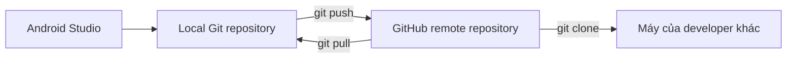
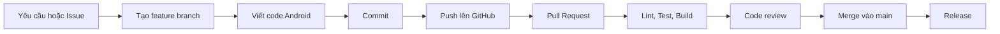
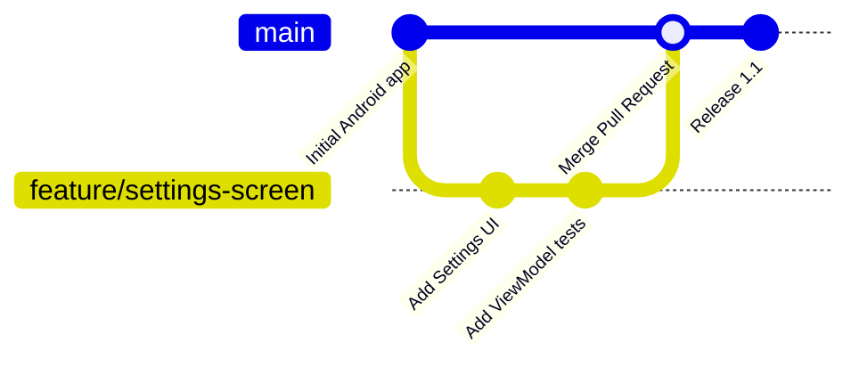
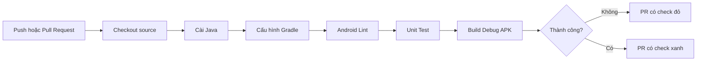

# 037 — GitHub

**Học phần:** 01 — Language and Android Fundamentals
**Module:** Module 02 — Android Fundamentals
**Nhóm nội dung:** First App and Version Control
**Nguồn roadmap:** Android Fundamentals / First App and Version Control
**Loại bài:** Lesson
**Thứ tự trong module:** 037
**Thời lượng gợi ý:** 24 phút

---

## 1. Tóm tắt

**GitHub** là nền tảng hỗ trợ toàn bộ quá trình phát triển phần mềm, từ lưu trữ mã nguồn, lập kế hoạch, cộng tác, kiểm tra thay đổi cho đến tự động hóa build và release. GitHub được xây dựng trên Git nhưng bổ sung repository trực tuyến, Pull Request, Issues, code review, GitHub Actions và nhiều công cụ quản lý dự án khác.

Trong dự án Android, GitHub không trực tiếp điều khiển `Activity`, `ViewModel`, Compose state hoặc lifecycle của ứng dụng. Thay vào đó, GitHub bảo vệ **quy trình tạo ra ứng dụng**:

* Lưu lịch sử thay đổi của source code.
* Cho phép nhiều lập trình viên làm việc song song.
* Review code trước khi đưa vào nhánh `main`.
* Tự động chạy lint, unit test và build APK.
* Quản lý lỗi, yêu cầu tính năng và kế hoạch phát hành.
* Tạo portfolio để nhà tuyển dụng xem được dự án.

> Có thể hiểu đơn giản: **Git quản lý phiên bản trên máy; GitHub đưa repository Git lên mạng và bổ sung công cụ cộng tác.**

---

## 2. Mục tiêu học tập

Sau bài học, anh có thể:

* Giải thích sự khác nhau giữa Git và GitHub.
* Hiểu repository, remote, branch, commit, push, pull và Pull Request.
* Đưa một dự án Android Studio lên GitHub.
* Làm việc bằng feature branch thay vì sửa trực tiếp trên `main`.
* Viết README cơ bản cho dự án Android.
* Thiết lập GitHub Actions để lint, test và build ứng dụng.
* Nhận biết các file không nên đưa lên GitHub.
* Biến repository thành một artifact trong portfolio.

---

## 3. GitHub là gì?

GitHub là nền tảng lưu trữ Git repository trên cloud và cung cấp công cụ để lập kế hoạch, viết code, review, test, deploy và vận hành phần mềm. Một repository có thể chứa source code, tài nguyên, tài liệu và toàn bộ lịch sử thay đổi của các file. Repository có thể là public hoặc private và có nhiều cộng tác viên.

### Định nghĩa ngắn gọn

> **GitHub là nền tảng trực tuyến dùng để lưu trữ Git repository, cộng tác phát triển phần mềm, review code và tự động hóa quy trình build–test–release.**

### Ghi chú năm dòng

```text
GitHub là nền tảng lưu trữ Git repository trên Internet.
Developer đẩy commit từ máy cá nhân lên remote repository.
Mỗi tính năng nên được phát triển trên một branch riêng.
Pull Request được dùng để thảo luận, review và merge code.
GitHub Actions có thể tự động lint, test và build ứng dụng Android.
```

---

## 4. Git và GitHub khác nhau như thế nào?

| Tiêu chí               | Git                                 | GitHub                                     |
| ---------------------- | ----------------------------------- | ------------------------------------------ |
| Loại công cụ           | Hệ thống quản lý phiên bản phân tán | Nền tảng lưu trữ và cộng tác               |
| Nơi hoạt động          | Chủ yếu trên máy cá nhân            | Trên cloud                                 |
| Đơn vị chính           | Repository, commit, branch          | Repository, Pull Request, Issue, Action    |
| Có cần Internet không? | Không cần cho commit local          | Cần khi push, pull hoặc dùng giao diện web |
| Mục đích               | Theo dõi lịch sử thay đổi           | Chia sẻ, review, quản lý và tự động hóa    |
| Ví dụ                  | `git commit`, `git branch`          | Pull Request, Issues, Actions              |

Git theo dõi thay đổi của file, tạo commit và hợp nhất các nhánh. GitHub lưu trữ Git repository trực tuyến, đồng thời bổ sung Issues, Pull Request, code review và automation.

### Cách ghi nhớ

```text
Git     = công cụ quản lý phiên bản
GitHub  = nơi lưu Git repository và cộng tác
```

---

## 5. Các khái niệm quan trọng

### 5.1 Repository

Repository, thường gọi tắt là **repo**, là nơi chứa:

* Source code.
* File cấu hình.
* Tài nguyên ảnh, chuỗi và layout.
* Tài liệu như `README.md`.
* Lịch sử commit.
* Các branch của dự án.

Trong Android, một repository thường chứa toàn bộ project:

```text
MyAndroidApp/
├── app/
├── gradle/
├── build.gradle.kts
├── settings.gradle.kts
├── gradlew
├── gradlew.bat
├── README.md
└── .gitignore
```

GitHub định nghĩa repository là thành phần cơ bản dùng để lưu code, file và lịch sử sửa đổi của từng file.

---

### 5.2 Local repository và remote repository



* **Local repository:** bản repository nằm trên máy cá nhân.
* **Remote repository:** repository được lưu trên GitHub.
* **Origin:** tên mặc định thường dùng để đại diện cho remote repository.

```bash
git remote -v
```

Ví dụ kết quả:

```text
origin  https://github.com/username/my-android-app.git (fetch)
origin  https://github.com/username/my-android-app.git (push)
```

---

### 5.3 Branch

Branch là một dòng phát triển song song. Developer có thể tạo branch để thêm tính năng mà chưa ảnh hưởng đến nhánh chính. Chỉ sau khi branch được merge, thay đổi mới xuất hiện trên `main`.

Ví dụ:

```text
main
 ├── feature/login-screen
 ├── feature/dark-mode
 ├── fix/profile-crash
 └── docs/update-readme
```

Quy tắc đặt tên gợi ý:

```text
feature/login-screen
feature/add-room-database
fix/empty-state-crash
refactor/user-repository
test/add-login-viewmodel-tests
docs/update-readme
```

---

### 5.4 Commit

Commit là một ảnh chụp trạng thái của các thay đổi đã được đưa vào staging area.

```bash
git add app/src/main/java/com/example/MainActivity.kt
git commit -m "feat: add counter button"
```

Commit tốt nên:

* Chỉ giải quyết một nhóm thay đổi liên quan.
* Có message mô tả rõ hành động.
* Không trộn feature, refactor và sửa lỗi không liên quan.

GitHub khuyến nghị mỗi commit nên là một thay đổi độc lập, hoàn chỉnh để dễ review và revert khi cần.

Ví dụ message:

```text
feat: add user login screen
fix: preserve counter after configuration change
test: add unit tests for LoginViewModel
refactor: move API calls into UserRepository
docs: add setup instructions to README
```

---

### 5.5 Push và pull

```bash
# Đẩy commit local lên GitHub
git push origin feature/login-screen

# Lấy thay đổi mới nhất từ remote
git pull origin main
```

* `push`: cập nhật remote bằng commit local.
* `pull`: lấy thay đổi từ remote và tích hợp vào branch hiện tại.
* `fetch`: lấy thông tin mới từ remote nhưng chưa merge vào branch hiện tại.

Các lệnh Git phổ biến và vai trò của `clone`, `add`, `commit`, `pull`, `push` được mô tả trong tài liệu GitHub chính thức.

---

### 5.6 Pull Request

Pull Request, viết tắt là **PR**, là đề nghị hợp nhất thay đổi từ một branch vào branch khác.

Ví dụ:

```text
feature/login-screen → main
```

PR giúp nhóm:

* Xem những file đã thay đổi.
* Bình luận trên từng dòng code.
* Yêu cầu chỉnh sửa.
* Chạy kiểm tra tự động.
* Xác nhận có xung đột hay không.
* Merge khi thay đổi đạt yêu cầu.

Pull Request được dùng để đề xuất, thảo luận và merge thay đổi giữa hai branch.


*Nguồn ảnh: GitHub Docs — một feature branch tách khỏi `main`, nhận commit, mở Pull Request, review và được merge trở lại.*

---

### 5.7 Issues

Issue có thể được dùng để:

* Báo cáo bug.
* Đề xuất tính năng.
* Ghi nhận technical debt.
* Chia nhỏ công việc.
* Liên kết yêu cầu với Pull Request.

Ví dụ:

```markdown
## Mô tả lỗi

Ứng dụng bị crash khi người dùng mở màn hình Profile mà chưa đăng nhập.

## Cách tái hiện

1. Xóa dữ liệu ứng dụng.
2. Mở ứng dụng.
3. Chọn tab Profile.

## Kết quả hiện tại

Ứng dụng crash với NullPointerException.

## Kết quả mong đợi

Hiển thị màn hình yêu cầu đăng nhập.
```

GitHub repository hỗ trợ Issues để thu thập phản hồi, báo lỗi và tổ chức các công việc cần thực hiện.

---

### 5.8 GitHub Actions

GitHub Actions là nền tảng CI/CD giúp chạy workflow tự động khi có sự kiện như:

* Push commit.
* Mở Pull Request.
* Tạo release.
* Chạy theo lịch.
* Kích hoạt thủ công.

Workflow được viết bằng YAML và đặt trong thư mục:

```text
.github/workflows/
```

Mỗi workflow có thể chứa nhiều job; mỗi job chạy trên runner và gồm nhiều step. GitHub cung cấp runner Linux, Windows và macOS hoặc cho phép sử dụng self-hosted runner.


*Nguồn ảnh: GitHub Docs — một event kích hoạt các job và step trên runner.*

---

## 6. GitHub nằm ở đâu trong kiến trúc ứng dụng Android?

GitHub không phải thành phần chạy bên trong APK:

```text
Không phải:
UI → ViewModel → Repository → API → Database → GitHub
```

GitHub nằm trong **development lifecycle**:



### Quan hệ với các phần của Android

| Thành phần | GitHub ảnh hưởng như thế nào?                                                 |
| ---------- | ----------------------------------------------------------------------------- |
| UI         | Lưu lịch sử thay đổi giao diện, screenshot và review Compose/XML              |
| Lifecycle  | Review và test các lỗi liên quan rotation, background hoặc process recreation |
| State      | Bảo vệ thay đổi trong ViewModel, SavedStateHandle hoặc UI state bằng test     |
| Data       | Review migration Room, repository và data source                              |
| Network    | Kiểm tra error handling, timeout và mapping response                          |
| Quality    | Tự động chạy lint, unit test và build                                         |
| Release    | Quản lý tag, release notes, artifact và pipeline                              |
| Portfolio  | Trình bày source code, README, screenshot và lịch sử phát triển               |

---

## 7. GitHub Flow

GitHub Flow là quy trình dựa trên branch:

1. Tạo branch.
2. Thực hiện thay đổi.
3. Commit và push.
4. Mở Pull Request.
5. Nhận review và cập nhật code.
6. Merge vào nhánh chính.
7. Xóa branch đã hoàn thành.

GitHub mô tả đây là workflow nhẹ, dựa trên branch, giúp developer làm việc mà không ảnh hưởng trực tiếp đến default branch.



---

## 8. Thực hành: đưa dự án Android lên GitHub

### 8.1 Tạo repository trên GitHub

Tạo repository mới, ví dụ:

```text
android-counter-app
```

Thiết lập gợi ý:

```text
Visibility: Public
README: Không chọn nếu project local đã có README
License: Có thể chọn MIT cho project portfolio
```

---

### 8.2 Kiểm tra `.gitignore`

Tạo hoặc cập nhật file `.gitignore` tại thư mục gốc:

```gitignore
# Gradle
.gradle/
**/build/

# Local Android SDK path
local.properties

# Android Studio
.idea/
*.iml

# Native build
.externalNativeBuild/
.cxx/

# Captures
captures/

# Signing keys
*.jks
*.keystore
keystore.properties

# Operating systems
.DS_Store
Thumbs.db
```

Không nên bỏ qua các file sau:

```text
gradlew
gradlew.bat
gradle/wrapper/gradle-wrapper.jar
gradle/wrapper/gradle-wrapper.properties
settings.gradle.kts
build.gradle.kts
gradle/libs.versions.toml
```

Gradle khuyến nghị sử dụng Gradle Wrapper để build dự án nhất quán trên máy developer và trong CI.

---

### 8.3 Khởi tạo Git

Mở Terminal trong Android Studio:

```bash
git init
git status
git add .
git commit -m "chore: initialize Android project"
```

---

### 8.4 Kết nối với GitHub

```bash
git branch -M main

git remote add origin \
  https://github.com/YOUR_USERNAME/android-counter-app.git

git push -u origin main
```

Kiểm tra remote:

```bash
git remote -v
```

Quy trình khởi tạo local repository, thêm `origin` và push nhánh `main` được mô tả trong tài liệu GitHub về Git command line.

---

## 9. Thực hành feature branch

Giả sử cần thêm nút reset vào ứng dụng Counter.

### Bước 1: cập nhật `main`

```bash
git switch main
git pull origin main
```

### Bước 2: tạo branch

```bash
git switch -c feature/reset-counter
```

### Bước 3: sửa code

```kotlin
@Composable
fun CounterScreen() {
    var count by rememberSaveable { mutableIntStateOf(0) }

    Column {
        Text(
            text = "Count: $count"
        )

        Button(
            onClick = { count++ }
        ) {
            Text("Increase")
        }

        Button(
            onClick = { count = 0 }
        ) {
            Text("Reset")
        }
    }
}
```

`rememberSaveable` giúp giá trị có thể được lưu qua một số lần tái tạo UI như configuration change. Tuy nhiên, với state nghiệp vụ hoặc dữ liệu dài hạn, cần xem xét `ViewModel`, `SavedStateHandle` hoặc persistence phù hợp.

### Bước 4: commit

```bash
git status
git add app/src/main/
git commit -m "feat: add reset counter action"
```

### Bước 5: push

```bash
git push -u origin feature/reset-counter
```

### Bước 6: mở Pull Request

```text
Base branch: main
Compare branch: feature/reset-counter
```

GitHub cho phép chọn base branch và compare branch, nhập title, description, tạo PR thường hoặc Draft Pull Request.

---

## 10. Mẫu Pull Request cho Android

Tạo file:

```text
.github/PULL_REQUEST_TEMPLATE.md
```

Nội dung:

```markdown
## Mô tả

Mô tả ngắn gọn thay đổi và lý do thực hiện.

## Loại thay đổi

- [ ] Feature
- [ ] Bug fix
- [ ] Refactor
- [ ] Test
- [ ] Documentation
- [ ] Build hoặc dependency

## Cách kiểm tra

1. Mở ứng dụng.
2. Đi đến màn hình liên quan.
3. Thực hiện hành động.
4. Kiểm tra kết quả mong đợi.

## Android checklist

- [ ] Đã build thành công.
- [ ] Đã chạy Android Lint.
- [ ] Đã chạy unit test liên quan.
- [ ] Đã kiểm tra loading, empty, success và error state.
- [ ] State không bị mất ngoài ý muốn khi rotate.
- [ ] Không hardcode chuỗi hiển thị.
- [ ] Không commit API key, mật khẩu hoặc signing key.
- [ ] Đã thêm screenshot hoặc video nếu thay đổi UI.

## Screenshot

| Trước | Sau |
|---|---|
| Ảnh trước | Ảnh sau |

## Issue liên quan

Closes #123
```

---

## 11. Thiết lập GitHub Actions cho Android

Tạo file:

```text
.github/workflows/android-ci.yml
```

```yaml
name: Android CI

on:
  pull_request:
    branches:
      - main
  push:
    branches:
      - main

permissions:
  contents: read

jobs:
  verify:
    name: Lint, test and build
    runs-on: ubuntu-latest

    steps:
      - name: Checkout source code
        uses: actions/checkout@v6

      - name: Set up Java
        uses: actions/setup-java@v5
        with:
          distribution: temurin
          java-version: "17"

      - name: Set up Gradle
        uses: gradle/actions/setup-gradle@v6

      - name: Grant execute permission
        run: chmod +x gradlew

      - name: Run Android checks
        run: |
          ./gradlew \
            lintDebug \
            testDebugUnitTest \
            assembleDebug \
            --stacktrace
```

Tại thời điểm biên soạn tháng 8/2026, tài liệu chính thức của Gradle Actions sử dụng `actions/checkout@v6`, `actions/setup-java@v5` và `gradle/actions/setup-gradle@v6` trong ví dụ build. Major version của action có thể thay đổi, vì vậy cần kiểm tra tài liệu chính thức trước khi dùng cho production.

### Workflow này thực hiện gì?



Các workflow GitHub Actions được lưu trong `.github/workflows`, được kích hoạt bởi event và gồm một hoặc nhiều job chạy trên runner.

> `java-version` phải phù hợp với Android Gradle Plugin và Java toolchain của project. Không nên đổi JDK trong CI mà không kiểm tra cấu hình build của dự án.

---

## 12. README cho portfolio Android

Một repository thiếu README khiến người xem khó hiểu dự án làm gì và cách chạy như thế nào.

Mẫu `README.md`:

````markdown
# Counter Android App

Ứng dụng Android nhỏ minh họa state management bằng Jetpack Compose.

## Tính năng

- Tăng giá trị bộ đếm.
- Reset bộ đếm.
- Giữ state khi cấu hình màn hình thay đổi.
- Unit test cho logic bộ đếm.
- GitHub Actions chạy lint, test và build.

## Công nghệ

- Kotlin
- Jetpack Compose
- Material 3
- Gradle Kotlin DSL
- GitHub Actions

## Kiến trúc

```mermaid
flowchart LR
    UI[Compose UI] --> VM[CounterViewModel]
    VM --> STATE[StateFlow]
    STATE --> UI
````

## Cách chạy

1. Clone repository.
2. Mở project bằng Android Studio.
3. Chờ Gradle Sync hoàn tất.
4. Chọn emulator hoặc thiết bị thật.
5. Nhấn Run.

## Kiểm tra bằng command line

```bash
./gradlew lintDebug
./gradlew testDebugUnitTest
./gradlew assembleDebug
```

## Ảnh minh họa


## Cấu trúc thư mục

```text
app/src/main/
├── java/
├── res/
└── AndroidManifest.xml
```

## Bài học rút ra

* Quản lý UI state.
* Tổ chức commit nhỏ.
* Làm việc bằng Pull Request.
* Tạo pipeline CI cơ bản.

## License

MIT

````

README trên GitHub sử dụng Markdown và thường được dùng để giải thích nội dung cũng như mục đích của repository.

---

## 13. GitHub ảnh hưởng đến chất lượng ứng dụng như thế nào?

| Khía cạnh | Ảnh hưởng |
|---|---|
| UX | Thay đổi UI được review, kiểm tra screenshot và test user flow trước khi merge |
| Reliability | CI phát hiện lỗi lint, test hoặc build trước khi code vào `main` |
| Maintainability | Commit history và PR giải thích vì sao code thay đổi |
| Collaboration | Nhiều developer có thể làm việc trên branch riêng |
| Debugging | Có thể xác định commit gây regression hoặc revert thay đổi |
| Performance | Benchmark và performance test có thể được chạy trong pipeline |
| Security | Giảm nguy cơ đưa token hoặc signing key vào source nếu có quy trình kiểm tra |
| Release | Tag, release notes và build pipeline giúp quá trình phát hành có thể lặp lại |

GitHub hỗ trợ các giai đoạn lập kế hoạch, tạo code, review, test, deploy và vận hành phần mềm.

---

## 14. Bảo mật repository Android

### Không commit dữ liệu nhạy cảm

Không đưa các dữ liệu sau vào repository:

```text
API token bí mật
Mật khẩu database
Private key
Signing keystore
Keystore password
Service account credential
Production environment file
````

Đối với GitHub Actions, dữ liệu nhạy cảm nên được lưu bằng repository, organization hoặc environment secrets rồi truy cập thông qua `secrets` context.

Ví dụ:

```yaml
env:
  API_TOKEN: ${{ secrets.API_TOKEN }}
```

### Khi đã commit secret

Xóa file khỏi commit mới là chưa đủ vì secret có thể vẫn còn trong lịch sử Git.

Cần:

1. Thu hồi hoặc rotate credential ngay.
2. Xóa secret khỏi source code.
3. Làm sạch lịch sử Git nếu cần.
4. Kiểm tra log và phạm vi sử dụng của credential.
5. Bổ sung `.gitignore` và secret management.

GitHub có push protection để phát hiện và chặn một số loại credential bị hardcode trước khi chúng được push lên repository.

---

## 15. Lỗi phổ biến của Android developer mới

### 15.1 Nhầm GitHub là Git

Sai:

> “Em đã commit code lên GitHub.”

Commit diễn ra trong local Git repository. Sau đó mới `push` commit lên GitHub.

```text
git commit → local repository
git push   → remote GitHub repository
```

---

### 15.2 Push trực tiếp vào `main`

Cách này bỏ qua:

* Review.
* CI check trước merge.
* Thảo luận thay đổi.
* Lịch sử theo feature.
* Khả năng chặn code lỗi.

Nên dùng:

```text
main
  ↑
Pull Request
  ↑
feature branch
```

---

### 15.3 Commit toàn bộ project mà không kiểm tra

Lệnh:

```bash
git add .
```

không sai, nhưng phải chạy:

```bash
git status
```

trước khi commit để chắc chắn không có:

```text
local.properties
build/
keystore
file cấu hình chứa mật khẩu
file log lớn
```

---

### 15.4 Commit quá lớn

Ví dụ PR chứa đồng thời:

```text
Thêm login
Đổi toàn bộ màu sắc
Nâng dependency
Refactor network layer
Sửa README
```

PR lớn khó review, khó test và khó revert. Nên chia thành các branch và PR độc lập.

---

### 15.5 Commit message không có ý nghĩa

Không tốt:

```text
update
fix
code mới
final
final 2
fix again
```

Tốt hơn:

```text
fix: handle empty user profile response
feat: add offline state to article screen
test: cover login timeout error
```

---

### 15.6 Không đọc kết quả GitHub Actions

PR có check đỏ nhưng vẫn được merge có thể đưa vào `main`:

* Code không compile.
* Lint error.
* Unit test thất bại.
* Sai dependency.
* Gradle Wrapper không hợp lệ.

---

### 15.7 Không cập nhật branch trước khi mở PR

Trước khi hoàn thiện PR:

```bash
git switch main
git pull origin main

git switch feature/reset-counter
git merge main
```

Hoặc dùng `rebase` nếu team đã thống nhất workflow phù hợp.

---

## 16. Bài thực hành 24 phút

### Phút 0–4: tạo repository

* Tạo repository `android-github-practice`.
* Thêm mô tả ngắn.
* Chọn public hoặc private.

### Phút 4–9: đưa Android project lên GitHub

```bash
git init
git add .
git commit -m "chore: initialize Android project"
git branch -M main
git remote add origin REPOSITORY_URL
git push -u origin main
```

### Phút 9–14: tạo feature branch

```bash
git switch -c feature/update-home-title
```

Sửa một chuỗi hoặc tiêu đề trên màn hình Home.

```bash
git add .
git commit -m "feat: update home screen title"
git push -u origin feature/update-home-title
```

### Phút 14–19: mở Pull Request

PR phải có:

* Tiêu đề rõ ràng.
* Mô tả thay đổi.
* Cách kiểm tra.
* Screenshot nếu có thay đổi UI.

### Phút 19–23: thêm GitHub Actions

Tạo:

```text
.github/workflows/android-ci.yml
```

Chạy lint, unit test và build.

### Phút 23–24: kiểm tra kết quả

* PR có check xanh hay đỏ?
* Có file nhạy cảm trong commit không?
* README đã mô tả cách chạy chưa?

---

## 17. Artifact đưa vào portfolio

Artifact của bài này nên là một GitHub repository có:

```text
android-github-practice/
├── .github/
│   ├── workflows/
│   │   └── android-ci.yml
│   └── PULL_REQUEST_TEMPLATE.md
├── app/
├── docs/
│   └── images/
│       └── app-screenshot.png
├── .gitignore
├── README.md
├── gradlew
└── settings.gradle.kts
```

Repository portfolio tốt nên thể hiện:

* Tên project rõ ràng.
* README có ảnh minh họa.
* Có hướng dẫn chạy.
* Commit message dễ hiểu.
* Có ít nhất một Pull Request.
* Có unit test.
* GitHub Actions chạy thành công.
* Không chứa secret.
* Có phần mô tả kiến trúc và bài học rút ra.

GitHub profile có thể trình bày repository, contribution và project đã thực hiện để kể câu chuyện về kinh nghiệm của developer.

---

## 18. Bài tập

### Bài tập chính

Tạo repository cho một ứng dụng Android nhỏ có chức năng:

```text
Hiển thị danh sách công việc
Thêm công việc
Đánh dấu hoàn thành
Xóa công việc
```

Yêu cầu:

1. Tạo Issue cho chức năng thêm công việc.
2. Tạo branch `feature/add-task`.
3. Commit code bằng message rõ ràng.
4. Push branch lên GitHub.
5. Mở Pull Request.
6. Viết cách kiểm tra trong PR.
7. Thêm GitHub Actions chạy lint, test và build.
8. Merge PR khi tất cả check thành công.
9. Cập nhật README bằng screenshot.

### Câu hỏi phân tích

Viết khoảng 150–200 từ trả lời:

> GitHub ảnh hưởng như thế nào đến UX, reliability và maintainability của ứng dụng Android, dù GitHub không chạy trực tiếp bên trong ứng dụng?

---

## 19. Tiêu chí đánh giá

| Tiêu chí                              |   Điểm |
| ------------------------------------- | -----: |
| Repository có cấu trúc Android hợp lệ |      1 |
| `.gitignore` phù hợp                  |      1 |
| README rõ ràng                        |      2 |
| Có feature branch                     |      1 |
| Commit message có ý nghĩa             |      1 |
| Pull Request có mô tả và cách test    |      1 |
| GitHub Actions chạy thành công        |      2 |
| Không có secret hoặc file build thừa  |      1 |
| **Tổng**                              | **10** |

---

## 20. Checklist hoàn thành

### Kiến thức

* [ ] Phân biệt được Git và GitHub.
* [ ] Hiểu local repository và remote repository.
* [ ] Hiểu branch, commit, push, pull và merge.
* [ ] Hiểu mục đích của Pull Request.
* [ ] Hiểu vai trò của GitHub Actions.

### Thực hành

* [ ] Đã tạo GitHub repository.
* [ ] Đã đưa Android project lên GitHub.
* [ ] Đã cấu hình `.gitignore`.
* [ ] Đã tạo feature branch.
* [ ] Đã push branch lên GitHub.
* [ ] Đã mở Pull Request.
* [ ] Đã thêm workflow CI.
* [ ] Workflow lint, test và build thành công.

### Portfolio

* [ ] README có mô tả dự án.
* [ ] README có screenshot.
* [ ] README có hướng dẫn chạy.
* [ ] Repository có commit history rõ ràng.
* [ ] Không có API key, keystore hoặc mật khẩu.
* [ ] Repository có thể được người khác clone và build.

---

## 21. Tổng kết

GitHub không chỉ là nơi “đăng code”. Trong phát triển Android, GitHub là trung tâm của quy trình cộng tác và kiểm soát chất lượng:

```text
Issue
  ↓
Feature branch
  ↓
Commit
  ↓
Push
  ↓
Pull Request
  ↓
Lint + Test + Build
  ↓
Code review
  ↓
Merge
  ↓
Release
```

Một Android developer sử dụng GitHub tốt cần biết:

* Tổ chức repository rõ ràng.
* Làm việc trên branch riêng.
* Tạo commit nhỏ và dễ hiểu.
* Mô tả Pull Request đầy đủ.
* Không commit dữ liệu nhạy cảm.
* Tự động hóa lint, test và build.
* Dùng README để biến source code thành một sản phẩm portfolio có thể đánh giá được.

> **Git giúp lưu lịch sử code. GitHub giúp biến lịch sử đó thành một quy trình phát triển có thể cộng tác, kiểm tra và phát hành.**
