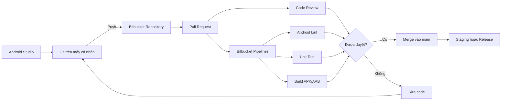
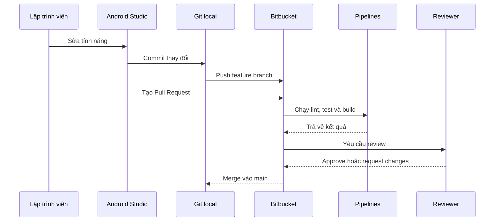
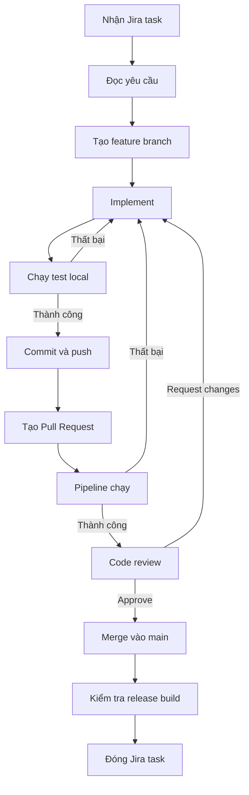

# 038 - Bitbucket


> **Học phần:** 01 - Language and Android Fundamentals
> **Module:** Module 02 - Android Fundamentals
> **Nhóm nội dung:** First App and Version Control
> **Nguồn roadmap:** Android Fundamentals / First App and Version Control
> **Loại bài:** Lesson
> **Thứ tự trong module:** 038
> **Thời lượng gợi ý:** 24 phút

---

## 1. Tóm tắt

**Bitbucket** là nền tảng lưu trữ mã nguồn Git và cộng tác phát triển phần mềm do Atlassian cung cấp. Nó cho phép nhóm phát triển:

* Lưu trữ repository trên máy chủ từ xa.
* Quản lý branch và commit.
* Review code bằng Pull Request.
* Kiểm tra quyền push và merge.
* Tự động build, test và triển khai bằng Bitbucket Pipelines.
* Liên kết branch, commit và Pull Request với Jira.

Bitbucket không thay thế Git. **Git** là hệ thống quản lý phiên bản chạy trên máy của lập trình viên, còn **Bitbucket** là dịch vụ lưu trữ repository Git và hỗ trợ nhóm cộng tác trên repository đó. ([Atlassian][1])

Trong dự án Android, Bitbucket không trực tiếp quản lý `Activity`, `ViewModel`, lifecycle hoặc UI state. Tuy nhiên, nó gián tiếp bảo vệ chất lượng những phần này thông qua review code, unit test, Android Lint, build tự động và kiểm soát quy trình merge.

---

## 2. Mục tiêu học tập

Sau bài học, anh có thể:

* Giải thích Bitbucket bằng ngôn ngữ của mình.
* Phân biệt Git, Bitbucket và Android Studio.
* Tạo repository Bitbucket cho một dự án Android.
* Đưa dự án Android hiện có lên Bitbucket.
* Làm việc với branch và Pull Request.
* Thiết lập pipeline cơ bản để lint, test và build ứng dụng.
* Nhận biết các rủi ro liên quan đến secret, branch chính và quy trình release.
* Tạo một repository có thể dùng làm sản phẩm trong portfolio.

---

## 3. Bitbucket là gì?

Bitbucket Cloud là dịch vụ lưu trữ mã nguồn dựa trên Git, được thiết kế cho hoạt động cộng tác theo nhóm. Ngoài quản lý repository, Bitbucket còn cung cấp Pull Request, code review, branch permissions, merge checks và dịch vụ CI/CD tích hợp tên là Bitbucket Pipelines. ([Atlassian][1])

Có thể hiểu đơn giản:

```text
Git       = Công cụ theo dõi lịch sử mã nguồn.
Bitbucket = Nơi lưu repository Git và cộng tác với nhóm.
Jira      = Nơi quản lý công việc, bug và yêu cầu.
Pipelines = Hệ thống tự động build, test và deploy.
```

### Ghi chú 5 dòng

1. Bitbucket là nền tảng lưu trữ repository Git trên cloud.
2. Lập trình viên push branch và commit từ máy cá nhân lên Bitbucket.
3. Pull Request được dùng để review thay đổi trước khi merge.
4. Pipelines có thể tự động lint, test và build ứng dụng Android.
5. Branch permissions giúp hạn chế việc sửa trực tiếp branch quan trọng.

---

## 4. Vị trí của Bitbucket trong dự án Android



### Bitbucket tác động đến ứng dụng như thế nào?

| Khu vực   | Tác động của Bitbucket                                                                                 |
| --------- | ------------------------------------------------------------------------------------------------------ |
| UI        | Review giúp phát hiện UI sai thiết kế, thiếu trạng thái loading hoặc lỗi accessibility.                |
| Lifecycle | Test và review giúp phát hiện code giữ tham chiếu `Activity`, chạy coroutine sai scope hoặc mất state. |
| State     | Pull Request có thể yêu cầu test cho rotate, process recreation và background/foreground.              |
| Data      | Review migration Room, cache, mapping DTO và xử lý dữ liệu lỗi.                                        |
| Network   | Pipeline có thể chạy test cho repository, API error và timeout.                                        |
| Quality   | Tự động chạy Android Lint, Detekt, Ktlint và unit test.                                                |
| Security  | Hạn chế secret bị commit; kiểm soát người được push và merge.                                          |
| Release   | Chỉ cho phép merge khi pipeline thành công và đủ reviewer.                                             |

---

## 5. Các thành phần chính

### 5.1. Workspace

Workspace là không gian làm việc của cá nhân hoặc tổ chức. Một workspace có thể chứa nhiều project, repository, thành viên và nhóm quyền.

Ví dụ:

```text
Workspace: mobile-team
├── Project: LUMINA
│   ├── Repository: lumina-android
│   ├── Repository: lumina-backend
│   └── Repository: lumina-docs
└── Project: ENGLISH-APP
    ├── Repository: english-android
    └── Repository: english-api
```

---

### 5.2. Repository

Repository chứa:

* Mã nguồn.
* Lịch sử commit.
* Branch và tag.
* Pull Request.
* Cấu hình Pipelines.
* README và tài liệu.
* Thiết lập quyền truy cập.

Một repository Android thường có cấu trúc:

```text
android-demo/
├── app/
├── gradle/
├── build.gradle.kts
├── settings.gradle.kts
├── gradle.properties
├── gradlew
├── gradlew.bat
├── bitbucket-pipelines.yml
├── .gitignore
└── README.md
```

---

### 5.3. Branch

Branch là một nhánh phát triển độc lập với code chính.

Một cách tổ chức đơn giản:

```text
main
├── feature/add-login
├── feature/dark-mode
├── fix/profile-crash
└── chore/update-dependencies
```

Quy ước đặt tên:

| Loại thay đổi | Ví dụ                      |
| ------------- | -------------------------- |
| Tính năng     | `feature/add-login`        |
| Sửa lỗi       | `fix/profile-crash`        |
| Cấu hình      | `chore/configure-pipeline` |
| Refactor      | `refactor/profile-state`   |
| Tài liệu      | `docs/update-readme`       |

---

### 5.4. Pull Request

Pull Request, thường viết tắt là **PR**, là yêu cầu đưa thay đổi từ một branch sang branch khác.

Ví dụ:

```text
feature/add-login ── Pull Request ──> main
```

Pull Request giúp nhóm:

* Xem những file đã thay đổi.
* Thảo luận trực tiếp tại dòng code.
* Yêu cầu chỉnh sửa.
* Chạy build và test.
* Approve hoặc từ chối thay đổi.
* Merge khi mọi điều kiện đã đạt.

Theo tài liệu Bitbucket, Pull Request được tạo từ một branch hoặc fork riêng và được dùng để review trước khi merge. Bitbucket cũng có thể hiển thị build status của commit mới nhất trong Pull Request. ([Atlassian Support][2])


*Giao diện Pull Request gồm activity, comment, reviewer, task, build status và merge checks. Nguồn ảnh: Atlassian Community.* ([Atlassian Community][3])

---

### 5.5. Bitbucket Pipelines

Bitbucket Pipelines là dịch vụ CI/CD tích hợp trong Bitbucket Cloud. Pipeline được định nghĩa bằng file `bitbucket-pipelines.yml` đặt ở thư mục gốc của repository và chạy các câu lệnh trong môi trường container. ([Atlassian Support][4])

Đối với Android, pipeline có thể tự động:

```text
Clone repository
      ↓
Tải Gradle dependencies
      ↓
Chạy Android Lint
      ↓
Chạy unit test
      ↓
Build debug APK
      ↓
Lưu báo cáo và artifact
```

---

### 5.6. Branch permissions và merge checks

Branch permissions giúp kiểm soát người nào có thể push hoặc merge vào một branch. Merge checks có thể yêu cầu các điều kiện như build thành công, đủ số reviewer hoặc tất cả task đã được xử lý. ([Atlassian Support][5])

Ví dụ chính sách cho `main`:

```text
Không được push trực tiếp
        +
Cần ít nhất 1 approval
        +
Pipeline phải thành công
        +
Tất cả task phải được resolve
        =
Được phép merge
```

---

## 6. Git, Bitbucket và GitHub khác nhau như thế nào?

| Công cụ        | Vai trò                                                |
| -------------- | ------------------------------------------------------ |
| Git            | Hệ thống quản lý phiên bản phân tán.                   |
| Bitbucket      | Dịch vụ lưu repository Git, review code và chạy CI/CD. |
| GitHub         | Một nền tảng lưu repository Git và cộng tác tương tự.  |
| Android Studio | IDE để viết, chạy và debug ứng dụng Android.           |
| Jira           | Công cụ quản lý task, bug, sprint và quy trình dự án.  |

### Luồng sử dụng thực tế



---

## 7. Thực hành: đưa ứng dụng Android lên Bitbucket

### Bước 1: Tạo repository

Trong Bitbucket:

1. Mở workspace.
2. Chọn **Create**.
3. Chọn **Repository**.
4. Nhập tên repository, ví dụ `hello-android`.
5. Chọn repository private hoặc public.
6. Không tạo thêm README nếu dự án Android đã tồn tại trên máy.

---

### Bước 2: Kiểm tra `.gitignore`

Android Studio thường tạo `.gitignore`, nhưng anh cần kiểm tra các file nhạy cảm và file sinh tự động.

```gitignore
# Gradle
.gradle/
**/build/

# Local Android SDK path
local.properties

# Android Studio
.idea/
*.iml

# Native build
.externalNativeBuild/
.cxx/

# Generated captures
captures/

# Signing keys
*.jks
*.keystore

# Local environment files
.env
.env.*
```

Không commit:

* Private signing key.
* Mật khẩu keystore.
* Service-account JSON.
* Access token.
* API key bí mật.
* Nội dung thực của `local.properties`.

> `google-services.json` không phải lúc nào cũng được xem là secret tuyệt đối, nhưng cần tuân theo chính sách bảo mật của dự án và giới hạn API key đúng cách.

---

### Bước 3: Khởi tạo Git và push dự án

Mở Terminal tại thư mục dự án:

```bash
git init

git add .

git commit -m "chore: initialize Android project"

git branch -M main

git remote add origin \
  git@bitbucket.org:<workspace>/<repository>.git

git push -u origin main
```

Thay:

```text
<workspace>  → tên workspace
<repository> → tên repository
```

Ví dụ:

```bash
git remote add origin \
  git@bitbucket.org:mobile-team/hello-android.git
```

Kiểm tra remote:

```bash
git remote -v
```

---

### Bước 4: Tạo feature branch

Không nên sửa tính năng trực tiếp trên `main`.

```bash
git checkout -b feature/add-greeting
```

Hoặc dùng lệnh mới:

```bash
git switch -c feature/add-greeting
```

---

### Bước 5: Thêm một chức năng nhỏ

Tạo file `GreetingFormatter.kt`:

```kotlin
package com.example.helloandroid

class GreetingFormatter {

    fun format(name: String): String {
        val normalizedName = name.trim().ifBlank {
            "Android Developer"
        }

        return "Xin chào, $normalizedName!"
    }
}
```

Tạo unit test:

```kotlin
package com.example.helloandroid

import org.junit.Assert.assertEquals
import org.junit.Test

class GreetingFormatterTest {

    private val formatter = GreetingFormatter()

    @Test
    fun `format returns greeting with trimmed name`() {
        val result = formatter.format("  An Khánh  ")

        assertEquals("Xin chào, An Khánh!", result)
    }

    @Test
    fun `format uses default name when input is blank`() {
        val result = formatter.format("   ")

        assertEquals(
            "Xin chào, Android Developer!",
            result
        )
    }
}
```

Chạy test:

```bash
./gradlew testDebugUnitTest
```

Trên Windows:

```powershell
gradlew.bat testDebugUnitTest
```

---

### Bước 6: Commit và push branch

```bash
git status

git add .

git commit -m "feat: add greeting formatter"

git push -u origin feature/add-greeting
```

---

### Bước 7: Tạo Pull Request

Trong Bitbucket:

1. Mở repository.
2. Chọn **Create → Pull request**.
3. Source branch: `feature/add-greeting`.
4. Destination branch: `main`.
5. Thêm reviewer.
6. Viết mô tả thay đổi.
7. Tạo Pull Request.

Mẫu mô tả PR:

```markdown
## Mục tiêu

Thêm lớp định dạng lời chào cho màn hình đầu tiên.

## Thay đổi

- Thêm `GreetingFormatter`.
- Chuẩn hóa khoảng trắng của tên.
- Thêm giá trị mặc định khi tên rỗng.
- Thêm hai unit test.

## Kiểm thử

- [x] `testDebugUnitTest`
- [x] Build debug thành công
- [x] Không có file nhạy cảm được commit

## Ảnh hưởng

Không thay đổi database, API hoặc navigation.
```

Bitbucket khuyến nghị Pull Request nên đủ nhỏ để review, có mô tả chính xác và liên kết tới task hoặc issue liên quan. ([Atlassian Support][2])

---

## 8. Cấu hình Bitbucket Pipelines cho Android

Tạo file sau ở thư mục gốc:

```text
bitbucket-pipelines.yml
```

Ví dụ pipeline cho Pull Request:

```yaml
image: ghcr.io/cirruslabs/android-sdk:35

pipelines:
  pull-requests:
    "**":
      - step:
          name: Android checks
          caches:
            - gradle

          script:
            - chmod +x gradlew
            - ./gradlew --no-daemon lintDebug
            - ./gradlew --no-daemon testDebugUnitTest
            - ./gradlew --no-daemon assembleDebug

          artifacts:
            - app/build/reports/**
            - app/build/outputs/apk/debug/**
```

### Ý nghĩa

| Thành phần          | Chức năng                                              |
| ------------------- | ------------------------------------------------------ |
| `image`             | Container có Android SDK để build ứng dụng.            |
| `pull-requests`     | Chạy pipeline khi Pull Request được tạo hoặc cập nhật. |
| `caches: gradle`    | Giảm thời gian tải lại Gradle dependencies.            |
| `lintDebug`         | Phân tích lỗi và vấn đề chất lượng Android.            |
| `testDebugUnitTest` | Chạy unit test cho debug variant.                      |
| `assembleDebug`     | Build APK debug.                                       |
| `artifacts`         | Giữ lại APK và báo cáo để kiểm tra.                    |

Atlassian cung cấp mẫu Android Pipeline theo cùng nguyên tắc: chọn Docker image chứa Android SDK, chạy Gradle, dùng cache và lưu APK hoặc báo cáo thành artifact. ([Atlassian][6])

> Tag Docker phải phù hợp với `compileSdk` và môi trường Java/Gradle của dự án. Với dự án production, nên pin phiên bản image rõ ràng thay vì phụ thuộc lâu dài vào tag thay đổi tự động.

### Tránh chạy pipeline hai lần

Pull Request Pipeline có thể chạy đồng thời với `default` hoặc branch pipeline nếu các cấu hình cùng khớp một commit. Vì vậy, hãy kiểm tra cấu hình để tránh tốn build minutes hoặc nhận hai kết quả CI giống nhau. ([Atlassian Support][7])

---

## 9. Quy trình nhóm được đề xuất



Bitbucket có thể kết nối với Jira để liên kết work item với branch, commit, Pull Request, build và deployment, giúp giảm việc cập nhật trạng thái thủ công. ([Atlassian Support][8])

---

## 10. Bitbucket và chất lượng Android

### 10.1. Lifecycle

Reviewer có thể kiểm tra:

* Coroutine có dùng đúng `viewModelScope` không?
* `Activity` hoặc `Fragment` có bị giữ tham chiếu không?
* Observer có gắn với đúng `LifecycleOwner` không?
* Tác vụ có bị chạy lại khi rotate không?
* Flow có được collect bằng lifecycle-aware API không?

Ví dụ nên review:

```kotlin
viewLifecycleOwner.lifecycleScope.launch {
    viewLifecycleOwner.repeatOnLifecycle(
        Lifecycle.State.STARTED
    ) {
        viewModel.uiState.collect { state ->
            render(state)
        }
    }
}
```

---

### 10.2. UI state

Pull Request nên mô tả các state:

```kotlin
sealed interface ProfileUiState {
    data object Loading : ProfileUiState

    data class Success(
        val name: String,
        val avatarUrl: String?
    ) : ProfileUiState

    data class Error(
        val message: String
    ) : ProfileUiState
}
```

Checklist review:

* Có loading state không?
* Có empty state không?
* Có error state không?
* Retry có hoạt động không?
* Rotate màn hình có mất dữ liệu không?
* Process recreation có được xử lý không?

---

### 10.3. Reliability

Pipeline có thể chạy:

```bash
./gradlew lintDebug
./gradlew testDebugUnitTest
./gradlew detekt
./gradlew ktlintCheck
./gradlew assembleDebug
```

Kết quả là lỗi được phát hiện trước khi code vào `main`, thay vì chờ đến lúc QA hoặc người dùng gặp lỗi.

---

### 10.4. Release risk

Branch protection và pipeline giúp ngăn các trường hợp:

* Push nhầm code chưa hoàn thành vào `main`.
* Merge code không build được.
* Bỏ qua unit test.
* Phát hành sai build variant.
* Commit file chứa secret.
* Một người tự viết, tự merge mà không có review.
* Release từ một commit không xác định.

---

## 11. Lỗi junior Android developer thường gặp

### Lỗi 1: Xem Bitbucket chỉ như nơi backup

```text
Code xong → push main → hoàn thành
```

Quy trình này bỏ qua review, CI và lịch sử phát triển theo branch.

Cách tốt hơn:

```text
Feature branch → test → push → Pull Request
→ pipeline → review → merge
```

---

### Lỗi 2: Push trực tiếp vào `main`

Hậu quả:

* Code lỗi đi thẳng vào branch ổn định.
* Không có review.
* Khó xác định phạm vi thay đổi.
* Có thể chặn toàn bộ nhóm nếu build hỏng.

Khắc phục bằng branch permissions và Pull Request bắt buộc.

---

### Lỗi 3: Commit secret

Ví dụ nguy hiểm:

```text
release-key.jks
service-account.json
.env
local.properties
keystore.properties
```

Sau khi secret đã xuất hiện trong Git history, chỉ xóa file ở commit tiếp theo là chưa đủ. Cần:

1. Thu hồi hoặc rotate secret.
2. Xóa secret khỏi Git history nếu cần.
3. Cập nhật `.gitignore`.
4. Lưu secret bằng secured repository variables hoặc hệ thống secret management.

---

### Lỗi 4: Pull Request quá lớn

Một PR thay đổi 80 file, sửa UI, database, API và architecture cùng lúc sẽ rất khó review.

Nên chia thành:

```text
PR 1: Thêm data model
PR 2: Thêm repository
PR 3: Thêm ViewModel
PR 4: Thêm UI
PR 5: Thêm analytics
```

---

### Lỗi 5: Chỉ kiểm tra build, không kiểm tra hành vi

`assembleDebug` thành công không đồng nghĩa ứng dụng hoạt động đúng.

Pipeline nên có tối thiểu:

```text
Build + Lint + Unit Test
```

Dự án trưởng thành có thể bổ sung:

```text
Static analysis
Dependency scanning
Screenshot test
Instrumented test
Release bundle validation
```

---

### Lỗi 6: Bỏ qua pipeline đang đỏ

Không nên merge với lý do:

> “Máy em vẫn chạy bình thường.”

Pipeline chạy trong môi trường sạch nên có thể phát hiện dependency thiếu, file local chưa commit hoặc code phụ thuộc cấu hình cá nhân.

---

## 12. Bài thực hành 24 phút

### Phút 0–4: Chuẩn bị

* Tạo repository Bitbucket.
* Kiểm tra `.gitignore`.
* Kiểm tra Git username và email.

```bash
git config user.name
git config user.email
```

### Phút 4–9: Push dự án

* Commit project Android.
* Thêm remote.
* Push branch `main`.

### Phút 9–14: Feature branch

* Tạo `feature/add-greeting`.
* Thêm `GreetingFormatter`.
* Thêm unit test.
* Commit và push.

### Phút 14–19: Pull Request

* Tạo PR.
* Viết mô tả.
* Thêm reviewer.
* Kiểm tra diff.

### Phút 19–24: Pipeline và README

* Thêm `bitbucket-pipelines.yml`.
* Chạy pipeline.
* Chụp màn hình kết quả thành công.
* Cập nhật README.

---

## 13. Artifact cho portfolio

Một artifact hoàn chỉnh có thể gồm:

```text
bitbucket-android-demo/
├── Android source code
├── Unit tests
├── README.md
├── bitbucket-pipelines.yml
├── docs/
│   ├── pull-request.png
│   ├── successful-pipeline.png
│   └── workflow.md
└── CHANGELOG.md
```

### README gợi ý

```markdown
# Bitbucket Android CI Demo

Ứng dụng Android nhỏ minh họa quy trình Git và Bitbucket.

## Công nghệ

- Kotlin
- Android SDK
- Gradle Kotlin DSL
- JUnit
- Bitbucket Pipelines

## Quy trình phát triển

1. Tạo feature branch.
2. Viết code và unit test.
3. Tạo Pull Request.
4. Chạy lint, test và build trên Pipelines.
5. Review và merge vào main.

## Pipeline

Pipeline tự động chạy:

- Android Lint
- Unit Test
- Debug APK Build

## Artifact

APK được lưu tại:

`app/build/outputs/apk/debug/`
```

### Bằng chứng nên đưa vào portfolio

* Ảnh repository.
* Ảnh Pull Request có reviewer.
* Ảnh comment review code.
* Ảnh pipeline thành công.
* File pipeline.
* Unit test.
* Mô tả branch strategy.
* Link Jira task nếu repository có thể công khai.

---

## 14. Bài tập

### Yêu cầu

Tạo một ứng dụng Android nhỏ có chức năng:

```text
Nhập tên → nhấn nút → hiển thị lời chào
```

Thực hiện:

1. Tạo repository Bitbucket.
2. Push project ban đầu vào `main`.
3. Tạo branch `feature/greeting-form`.
4. Thêm UI và logic định dạng lời chào.
5. Thêm ít nhất hai unit test.
6. Tạo Pull Request.
7. Thêm pipeline chạy lint, test và build.
8. Chụp ảnh pipeline thành công.
9. Viết README mô tả quy trình.
10. Giải thích Bitbucket ảnh hưởng đến maintainability và release risk như thế nào.

### Tiêu chí hoàn thành

| Tiêu chí                       |   Điểm |
| ------------------------------ | -----: |
| Repository có cấu trúc rõ ràng |      1 |
| Sử dụng feature branch         |      1 |
| Commit message có ý nghĩa      |      1 |
| Có Pull Request                |      1 |
| Có unit test                   |      2 |
| Pipeline thành công            |      2 |
| Không commit secret            |      1 |
| README đầy đủ                  |      1 |
| **Tổng**                       | **10** |

---

## 15. Checklist hoàn thành

### Kiến thức

* [ ] Giải thích được Bitbucket là gì.
* [ ] Phân biệt được Git và Bitbucket.
* [ ] Hiểu repository, branch, commit và Pull Request.
* [ ] Hiểu Bitbucket Pipelines dùng để làm gì.
* [ ] Hiểu branch permissions và merge checks.

### Thực hành

* [ ] Đã tạo repository Bitbucket.
* [ ] Đã push một dự án Android.
* [ ] Đã tạo feature branch.
* [ ] Đã viết commit message rõ ràng.
* [ ] Đã tạo Pull Request.
* [ ] Đã thêm unit test.
* [ ] Đã chạy Android Lint.
* [ ] Đã build APK trên pipeline.
* [ ] Đã thêm README.
* [ ] Đã chụp ảnh kết quả để đưa vào portfolio.

### Bảo mật

* [ ] Không commit `local.properties`.
* [ ] Không commit keystore.
* [ ] Không commit access token.
* [ ] Không ghi secret trực tiếp trong pipeline.
* [ ] Repository variables nhạy cảm được đánh dấu secured.
* [ ] Log pipeline không làm lộ secret.

---

## 16. Checklist trước khi merge

```markdown
## Code

- [ ] Code đúng coding convention.
- [ ] Không còn code debug tạm thời.
- [ ] Không có TODO quan trọng bị bỏ quên.
- [ ] Không commit file sinh tự động.

## Android

- [ ] Không gây memory leak.
- [ ] Lifecycle được xử lý đúng.
- [ ] State không mất bất thường khi rotate.
- [ ] Loading, success và error state đầy đủ.
- [ ] Không block main thread.

## Testing

- [ ] Unit test thành công.
- [ ] Android Lint thành công.
- [ ] Build debug thành công.
- [ ] Đã kiểm tra luồng chính trên emulator hoặc thiết bị.

## Security

- [ ] Không có secret.
- [ ] Không có token trong source code.
- [ ] Không có private signing key.
- [ ] Log không chứa dữ liệu nhạy cảm.

## Pull Request

- [ ] Tiêu đề mô tả đúng thay đổi.
- [ ] Có mô tả và cách kiểm thử.
- [ ] Có liên kết Jira task.
- [ ] Tất cả comment đã xử lý.
- [ ] Pipeline đang xanh.
- [ ] Đủ approval.
```

---

## 17. Checklist release

* [ ] Branch release được bảo vệ.
* [ ] Pipeline của commit release thành công.
* [ ] `versionCode` đã tăng.
* [ ] `versionName` chính xác.
* [ ] Release notes đã cập nhật.
* [ ] Không sử dụng debug signing.
* [ ] Secret release được lấy từ môi trường bảo mật.
* [ ] AAB được build từ commit đã được review.
* [ ] Có tag cho phiên bản release.
* [ ] Có phương án rollback.
* [ ] QA đã xác nhận luồng quan trọng.

Ví dụ tạo tag:

```bash
git checkout main
git pull origin main

git tag -a v1.0.0 -m "Release version 1.0.0"

git push origin v1.0.0
```

---

## 18. Câu hỏi ôn tập

1. Bitbucket khác Git như thế nào?
2. Vì sao không nên push trực tiếp vào `main`?
3. Pull Request giải quyết vấn đề gì?
4. Pipeline Android nên chạy ít nhất những Gradle task nào?
5. Branch permissions có thể giảm rủi ro gì?
6. Vì sao build thành công chưa đủ để chứng minh ứng dụng đúng?
7. Những file Android nào không nên commit?
8. Bitbucket tác động gián tiếp đến lifecycle và UI state như thế nào?
9. Khi nào Pull Request được xem là quá lớn?
10. Artifact nào có thể đưa vào portfolio?

---

## 19. Kết luận

Bitbucket không chỉ là nơi lưu mã nguồn. Trong một dự án Android làm việc theo nhóm, nó là trung tâm kết nối giữa:

```text
Task → Branch → Commit → Pull Request
→ Review → Test → Build → Merge → Release
```

Một Android developer sử dụng Bitbucket tốt cần biết:

* Chia thay đổi thành branch nhỏ.
* Viết commit dễ hiểu.
* Tạo Pull Request có đủ ngữ cảnh.
* Không bỏ qua pipeline thất bại.
* Bảo vệ branch chính.
* Không commit secret.
* Dùng test và review để bảo vệ lifecycle, state, dữ liệu và trải nghiệm người dùng.

---

## 20. Tài liệu tham khảo

* [Bitbucket Cloud Overview](https://www.atlassian.com/software/bitbucket/guides/getting-started/overview)
* [Get started with Bitbucket Cloud](https://support.atlassian.com/bitbucket-cloud/docs/get-started-with-bitbucket-cloud/)
* [Create a Pull Request](https://support.atlassian.com/bitbucket-cloud/docs/create-a-pull-request/)
* [Use Pull Requests for code review](https://support.atlassian.com/bitbucket-cloud/docs/use-pull-requests-for-code-review/)
* [Get started with Bitbucket Pipelines](https://support.atlassian.com/bitbucket-cloud/docs/get-started-with-bitbucket-pipelines/)
* [Android deployment with Bitbucket Pipelines](https://www.atlassian.com/blog/bitbucket/automate-and-scale-your-android-deployment-with-bitbucket-pipelines)
* [Use branch permissions](https://support.atlassian.com/bitbucket-cloud/docs/use-branch-permissions/)
* [Merge checks](https://support.atlassian.com/bitbucket-cloud/docs/suggest-or-require-checks-before-a-merge/)

[1]: https://www.atlassian.com/software/bitbucket/guides/getting-started/overview?utm_source=chatgpt.com "Bitbucket Overview"
[2]: https://support.atlassian.com/bitbucket-cloud/docs/create-a-pull-request/ "Create a pull request | Bitbucket Cloud | Atlassian Support"
[3]: https://community.atlassian.com/forums/Bitbucket-articles/Introducing-A-new-Bitbucket-pull-request-experience/ba-p/2696432 "Introducing: A new Bitbucket pull request experience"
[4]: https://support.atlassian.com/bitbucket-cloud/docs/get-started-with-bitbucket-pipelines/?utm_source=chatgpt.com "Get started with Bitbucket Pipelines | Bitbucket Cloud | Atlassian Support"
[5]: https://support.atlassian.com/bitbucket-cloud/docs/use-branch-permissions/?utm_source=chatgpt.com "Use branch permissions | Bitbucket Cloud"
[6]: https://www.atlassian.com/blog/bitbucket/automate-and-scale-your-android-deployment-with-bitbucket-pipelines?utm_source=chatgpt.com "Automate (and scale) your Android deployment with Bitbucket Pipelines - Inside Atlassian"
[7]: https://support.atlassian.com/bitbucket-cloud/docs/pipeline-start-conditions/?utm_source=chatgpt.com "Pipeline start conditions | Bitbucket Cloud"
[8]: https://support.atlassian.com/bitbucket-cloud/docs/connect-bitbucket-cloud-to-jira-software-cloud/?utm_source=chatgpt.com "Connect Bitbucket Cloud to Jira Cloud"

---

# Bài luyện tập

## Mục tiêu


## Đề bài


## Yêu cầu hoàn thành

- [ ] 
- [ ] 
- [ ] 

## Kết quả / lời giải


## Ghi chú
