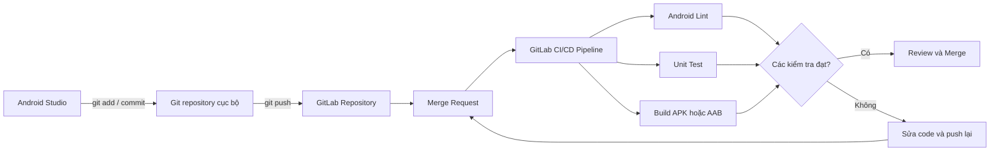
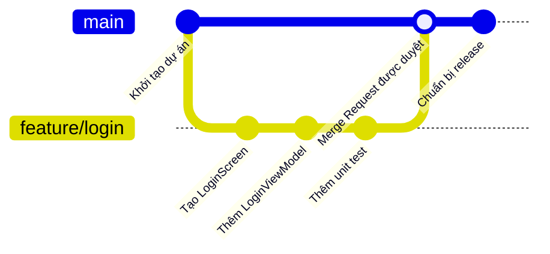
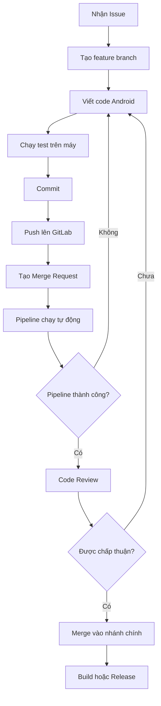
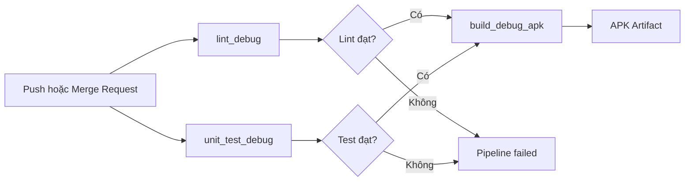
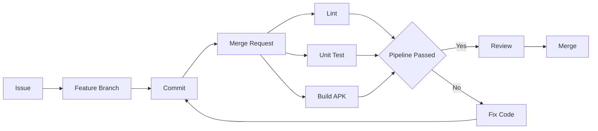

# 039 — GitLab trong phát triển ứng dụng Android
[](https://medium.com/%40ryzmen/gitlab-fast-pipelines-stages-jobs-c51c829b9aa1?utm_source=chatgpt.com)

**Học phần:** 01 — Language and Android Fundamentals
**Module:** Module 02 — Android Fundamentals
**Nhóm nội dung:** First App and Version Control
**Nguồn roadmap:** Android Fundamentals / First App and Version Control
**Loại bài:** Lesson
**Thứ tự trong module:** 039
**Thời lượng gợi ý:** 24 phút

---

## 1. Tóm tắt

**GitLab** là một nền tảng cộng tác phát triển phần mềm dựa trên Git. Một dự án GitLab có thể chứa mã nguồn, lịch sử commit, branch, issue, Merge Request, pipeline CI/CD, tài liệu và các artifact sinh ra trong quá trình build.

Đối với lập trình viên Android, GitLab thường được dùng để:

* Lưu trữ source code của ứng dụng.
* Quản lý branch cho từng tính năng hoặc bản sửa lỗi.
* Review code thông qua **Merge Request**.
* Tự động chạy Android Lint, unit test và build APK/AAB.
* Lưu báo cáo test và file build dưới dạng artifact.
* Kiểm soát việc merge code vào nhánh chính.
* Hỗ trợ quy trình phát hành ứng dụng.

Repository là một thành phần của GitLab Project và được dùng để lưu mã nguồn cũng như theo dõi lịch sử thay đổi bằng Git. ([GitLab Docs][1])

> **Điểm cần phân biệt:** Git là hệ thống quản lý phiên bản chạy trên máy của lập trình viên; GitLab là nền tảng máy chủ cung cấp repository và các công cụ cộng tác xung quanh Git.

---

## 2. Ảnh minh họa

### 2.1. Logo GitLab


*Nguồn ảnh: GitLab Press Kit.* ([GitLab][2])

### 2.2. Pipeline CI/CD trên GitLab


*Một pipeline có thể gồm nhiều stage và job như build, test, kiểm tra chất lượng và phát hành. Giao diện GitLab có thể thay đổi theo phiên bản, nhưng nguyên lý pipeline vẫn tương tự.* 

---

## 3. Mục tiêu học tập

Sau bài học này, bạn có thể:

* Giải thích GitLab bằng ngôn ngữ của mình.
* Phân biệt Git, GitLab Project và Git repository.
* Đưa một dự án Android hiện có lên GitLab.
* Tạo branch và Merge Request cho một thay đổi.
* Hiểu vai trò của `.gitlab-ci.yml`.
* Thiết kế pipeline cơ bản để lint, test và build ứng dụng Android.
* Biết cách GitLab ảnh hưởng đến độ ổn định và khả năng bảo trì của ứng dụng.
* Tạo một artifact nhỏ để đưa vào portfolio.

---

## 4. GitLab là gì?

GitLab có thể được hiểu là một không gian làm việc tập trung cho toàn bộ quá trình phát triển phần mềm:

```text
Lên kế hoạch
    ↓
Viết mã nguồn
    ↓
Lưu mã bằng Git
    ↓
Review thay đổi
    ↓
Build và kiểm thử
    ↓
Phát hành
    ↓
Theo dõi và cải tiến
```

GitLab cung cấp các công cụ cho nhiều giai đoạn của vòng đời phần mềm, từ lập kế hoạch, viết code, build, test cho đến release và vận hành. 

### 4.1. Các khái niệm quan trọng

| Khái niệm      | Giải thích                          | Ví dụ Android                         |
| -------------- | ----------------------------------- | ------------------------------------- |
| GitLab Project | Không gian quản lý toàn bộ dự án    | Project `weather-android`             |
| Repository     | Nơi chứa mã nguồn và lịch sử Git    | Source Kotlin, XML, Gradle            |
| Commit         | Một bản ghi thay đổi                | `fix: preserve search state`          |
| Branch         | Nhánh phát triển độc lập            | `feature/weather-search`              |
| Issue          | Công việc, lỗi hoặc yêu cầu         | “Không giữ dữ liệu khi xoay màn hình” |
| Merge Request  | Đề nghị review và hợp nhất code     | Merge feature vào `develop`           |
| Pipeline       | Chuỗi công việc tự động             | Lint → Test → Build                   |
| Job            | Một công việc trong pipeline        | Chạy `./gradlew testDebugUnitTest`    |
| Runner         | Máy thực thi các job CI/CD          | Linux runner có Android SDK           |
| Artifact       | File được sinh ra bởi job           | APK, báo cáo test, báo cáo lint       |
| CI/CD Variable | Biến cấu hình hoặc thông tin bí mật | API key, keystore password            |

---

## 5. Git, GitLab và Android Studio liên hệ với nhau như thế nào?



Android Studio là công cụ viết và chạy ứng dụng. Git lưu lịch sử thay đổi. GitLab nhận source code từ Git và cung cấp review, pipeline, quyền truy cập cũng như công cụ cộng tác.

GitLab **không thay thế** Android Studio, Kotlin, Gradle hoặc Git. Nó kết nối các công cụ này thành một quy trình phát triển có kiểm soát.

---

## 6. GitLab nằm ở đâu trong kiến trúc Android?

GitLab không phải là một thành phần chạy bên trong APK:

```text
Không đúng:

Android App
 ├── UI
 ├── ViewModel
 ├── Repository
 └── GitLab

Đúng:

Hệ thống phát triển
 ├── Android Studio
 ├── Git
 ├── GitLab
 │   ├── Repository
 │   ├── Merge Request
 │   ├── CI/CD
 │   └── Artifact
 └── Google Play

Ứng dụng Android
 ├── UI
 ├── State
 ├── Domain
 ├── Data
 └── Platform
```

GitLab nằm trong **hệ thống phát triển và phát hành**, không nằm trong runtime architecture của ứng dụng.

Tuy nhiên, GitLab tác động gián tiếp đến chất lượng ứng dụng:

| Khu vực Android | Vai trò của GitLab                                         |
| --------------- | ---------------------------------------------------------- |
| UI              | Chạy screenshot test hoặc UI test trước khi merge          |
| Lifecycle       | Chạy test cho rotate, recreate và process restoration      |
| State           | Phát hiện regression trong ViewModel hoặc SavedStateHandle |
| Data            | Chạy test Repository, Room migration và API mapper         |
| Network         | Chạy test timeout, retry và error mapping                  |
| Quality         | Chạy Lint, unit test, static analysis                      |
| Release         | Build APK/AAB, lưu artifact và hỗ trợ ký ứng dụng          |

---

## 7. Quy trình GitLab cơ bản cho dự án Android

Một quy trình nhóm phổ biến:



### Quy trình đầy đủ



Merge Request là nơi tập trung để review code, thảo luận, theo dõi commit, xem trạng thái pipeline và kiểm tra khả năng merge. ([GitLab Docs][3])

---

## 8. Đưa một dự án Android lên GitLab

### 8.1. Tạo repository trên GitLab

Trên GitLab:

1. Chọn **New project**.
2. Chọn **Create blank project**.
3. Đặt tên, ví dụ `hello-gitlab-android`.
4. Chọn quyền truy cập phù hợp.
5. Tạo project.

### 8.2. Kết nối repository cục bộ

Tại thư mục gốc của dự án Android:

```bash
git init
git add .
git commit -m "chore: initialize Android project"
git branch -M main
git remote add origin git@gitlab.com:your-name/hello-gitlab-android.git
git push -u origin main
```

Có thể clone GitLab repository bằng HTTPS hoặc SSH. Với môi trường phát triển thường xuyên, SSH giúp tránh nhập lại thông tin xác thực sau khi cấu hình khóa SSH. GitLab hỗ trợ clone repository bằng cả hai phương thức. ([GitLab Docs][1])

### 8.3. Kiểm tra remote

```bash
git remote -v
```

Kết quả dự kiến:

```text
origin  git@gitlab.com:your-name/hello-gitlab-android.git (fetch)
origin  git@gitlab.com:your-name/hello-gitlab-android.git (push)
```

---

## 9. File `.gitignore` cho Android

Không nên commit mọi file do Android Studio và Gradle tạo ra.

Ví dụ `.gitignore` cơ bản:

```gitignore
# Gradle
.gradle/
build/
**/build/

# Android Studio
.idea/
*.iml

# Local Android SDK path
local.properties

# Native build
.externalNativeBuild/
.cxx/

# Signing files
*.jks
*.keystore

# Logs
*.log

# Operating system
.DS_Store
Thumbs.db
```

### Không được đưa lên repository

```text
local.properties
release-key.jks
keystore.properties
service-account.json
private-key.json
.env chứa secret
```

Đặc biệt, `local.properties` thường chứa đường dẫn Android SDK trên máy cá nhân:

```properties
sdk.dir=C\:\\Users\\Username\\AppData\\Local\\Android\\Sdk
```

Đường dẫn này không hoạt động trên máy của đồng đội hoặc GitLab Runner.

---

## 10. Branch và Merge Request

### 10.1. Tạo branch cho một tính năng

```bash
git switch -c feature/add-counter
```

Sau khi sửa code:

```bash
git add .
git commit -m "feat: add counter screen"
git push -u origin feature/add-counter
```

### 10.2. Tạo Merge Request

Trên GitLab:

1. Mở project.
2. Chọn **Code → Merge requests**.
3. Chọn **New merge request**.
4. Source branch: `feature/add-counter`.
5. Target branch: `main`.
6. Viết mô tả thay đổi.
7. Gán reviewer.
8. Chờ pipeline và review.

GitLab khuyến khích sử dụng feature branch và Merge Request thay vì để lập trình viên đẩy code trực tiếp vào protected branch. ([GitLab Docs][4])

### 10.3. Mẫu mô tả Merge Request

```markdown
## Nội dung thay đổi

- Thêm màn hình Counter.
- Dùng ViewModel để giữ state.
- Thêm unit test cho CounterViewModel.

## Cách kiểm thử

1. Mở ứng dụng.
2. Nhấn nút tăng ba lần.
3. Xoay màn hình.
4. Kiểm tra giá trị vẫn bằng 3.

## Checklist

- [x] Đã chạy unit test.
- [x] Đã chạy Android Lint.
- [x] Không commit secret.
- [x] Không thay đổi ngoài phạm vi issue.

## Ảnh chụp

| Trước | Sau |
|---|---|
| Không có màn hình | CounterScreen |
```

---

## 11. GitLab CI/CD là gì?

CI/CD giúp tự động build và kiểm thử ứng dụng mỗi khi có thay đổi được đẩy lên repository.

Android Developers mô tả CI là quá trình các lập trình viên thường xuyên hợp nhất thay đổi vào repository trung tâm, sau đó hệ thống tự động build và chạy test. Bất kỳ hệ thống CI nào có thể khởi chạy Gradle đều có thể build một dự án Android. ([Android Developers][5])

Pipeline GitLab thường được định nghĩa trong file:

```text
.gitlab-ci.yml
```

File này nằm ở thư mục gốc:

```text
hello-gitlab-android/
├── app/
├── gradle/
├── build.gradle.kts
├── settings.gradle.kts
├── gradlew
├── gradlew.bat
└── .gitlab-ci.yml
```

GitLab đọc `.gitlab-ci.yml`, tạo pipeline và chuyển từng job cho GitLab Runner thực thi. ([GitLab Docs][6])

---

## 12. Pipeline Android cơ bản

Ví dụ dưới đây giả định nhóm có một GitLab Runner được gắn tag `android` và runner đã cài:

* JDK tương thích với dự án.
* Android SDK.
* Build Tools.
* Quyền chạy Gradle Wrapper.

```yaml
stages:
  - verify
  - build

default:
  tags:
    - android

variables:
  GRADLE_USER_HOME: "$CI_PROJECT_DIR/.gradle"

cache:
  key:
    files:
      - gradle/wrapper/gradle-wrapper.properties
      - gradle/libs.versions.toml
  paths:
    - .gradle/caches/
    - .gradle/wrapper/

before_script:
  - chmod +x gradlew

lint_debug:
  stage: verify
  script:
    - ./gradlew lintDebug
  artifacts:
    when: always
    paths:
      - app/build/reports/lint-results-debug.html
    expire_in: 7 days

unit_test_debug:
  stage: verify
  script:
    - ./gradlew testDebugUnitTest
  artifacts:
    when: always
    reports:
      junit:
        - app/build/test-results/testDebugUnitTest/*.xml
    paths:
      - app/build/reports/tests/testDebugUnitTest/
    expire_in: 7 days

build_debug_apk:
  stage: build
  script:
    - ./gradlew assembleDebug
  artifacts:
    paths:
      - app/build/outputs/apk/debug/*.apk
    expire_in: 7 days
  rules:
    - if: '$CI_PIPELINE_SOURCE == "merge_request_event"'
    - if: '$CI_COMMIT_BRANCH == $CI_DEFAULT_BRANCH'
```

### 12.1. Pipeline này làm gì?



Android Gradle Plugin cung cấp các task dòng lệnh cho build và test. `./gradlew test` chạy local unit test, trong khi `connectedAndroidTest` cần thiết bị hoặc emulator. ([Android Developers][7])

Android Lint có thể được chạy trong CI để phát hiện vấn đề về tính đúng đắn, bảo mật, khả năng sử dụng, accessibility và hiệu năng. ([Android Developers][8])

---

## 13. Hiểu stage, job, cache và artifact

### Stage

Stage biểu diễn một giai đoạn lớn:

```yaml
stages:
  - verify
  - build
  - release
```

Các job trong cùng một stage có thể được thực thi song song nếu runner cho phép.

### Job

Job là một công việc cụ thể:

```yaml
unit_test:
  stage: verify
  script:
    - ./gradlew testDebugUnitTest
```

### Cache

Cache lưu các dependency đã tải xuống để những pipeline sau không phải tải lại toàn bộ:

```yaml
cache:
  paths:
    - .gradle/caches/
    - .gradle/wrapper/
```

Cache phù hợp với dependency và dữ liệu có thể tái sử dụng. GitLab lưu ý rằng cache giúp các job sau chạy nhanh hơn, nhưng cache quá lớn cũng có thể làm tăng thời gian tải. ([Android Developers][9])

### Artifact

Artifact là kết quả đầu ra cần lưu hoặc truyền sang stage khác:

```yaml
artifacts:
  paths:
    - app/build/outputs/apk/debug/*.apk
```

Ví dụ artifact Android:

```text
APK
AAB
Báo cáo Lint
Báo cáo unit test
Ảnh screenshot test bị lỗi
File mapping.txt
Báo cáo benchmark
```

Cache dùng cho dependency có thể tái sử dụng; artifact dùng cho kết quả do job tạo ra. ([GitLab Docs][10])

---

## 14. Hiển thị kết quả unit test trong Merge Request

GitLab có thể đọc báo cáo test theo định dạng JUnit XML:

```yaml
unit_test_debug:
  stage: verify
  script:
    - ./gradlew testDebugUnitTest
  artifacts:
    when: always
    reports:
      junit:
        - app/build/test-results/testDebugUnitTest/*.xml
```

Android Gradle Plugin đặt XML report của local unit test trong thư mục `build/test-results/`. GitLab có thể nhận các file JUnit XML làm report artifact và hiển thị kết quả test trong pipeline hoặc Merge Request. ([GitLab Docs][11])

Điều này giúp reviewer thấy:

```text
Tests: 42
Passed: 41
Failed: 1

CounterViewModelTest.increment_fromZero_returnsOne FAILED
Expected: 1
Actual:   0
```

Reviewer không cần tải toàn bộ log mới biết test nào thất bại.

---

## 15. GitLab và lifecycle/state của Android

GitLab không tự xử lý lifecycle, nhưng pipeline có thể bảo vệ các hành vi liên quan đến lifecycle.

Ví dụ ứng dụng có màn hình tìm kiếm:

```kotlin
data class SearchUiState(
    val keyword: String = "",
    val isLoading: Boolean = false,
    val results: List<String> = emptyList(),
    val errorMessage: String? = null
)
```

ViewModel:

```kotlin
class SearchViewModel(
    private val savedStateHandle: SavedStateHandle
) : ViewModel() {

    private val _uiState = MutableStateFlow(
        SearchUiState(
            keyword = savedStateHandle["keyword"] ?: ""
        )
    )

    val uiState: StateFlow<SearchUiState> = _uiState.asStateFlow()

    fun updateKeyword(keyword: String) {
        savedStateHandle["keyword"] = keyword
        _uiState.update { current ->
            current.copy(keyword = keyword)
        }
    }
}
```

Unit test:

```kotlin
class SearchViewModelTest {

    @Test
    fun keyword_isRestoredFromSavedStateHandle() {
        val savedState = SavedStateHandle(
            mapOf("keyword" to "Kotlin")
        )

        val viewModel = SearchViewModel(savedState)

        assertEquals(
            "Kotlin",
            viewModel.uiState.value.keyword
        )
    }
}
```

Pipeline chạy test này sau mỗi Merge Request:

```text
Lập trình viên thay đổi ViewModel
            ↓
Pipeline chạy unit test
            ↓
Test state restoration thất bại
            ↓
Không cho merge
            ↓
Tránh phát hành lỗi mất dữ liệu khi recreate
```

GitLab không giữ state cho ứng dụng. GitLab giúp đảm bảo đoạn code giữ state đã được kiểm thử trước khi phát hành.

---

## 16. Bảo vệ thông tin bí mật

Không viết secret trực tiếp trong `.gitlab-ci.yml`:

```yaml
# Không an toàn
variables:
  KEYSTORE_PASSWORD: "123456"
  API_TOKEN: "secret-token"
```

Thay vào đó, tạo biến trong:

```text
Project
└── Settings
    └── CI/CD
        └── Variables
```

Trong pipeline:

```yaml
sign_release:
  stage: build
  script:
    - ./gradlew bundleRelease
  rules:
    - if: '$CI_COMMIT_BRANCH == $CI_DEFAULT_BRANCH'
```

Gradle lấy giá trị từ environment variable:

```kotlin
android {
    signingConfigs {
        create("release") {
            storeFile = file(
                System.getenv("KEYSTORE_FILE")
            )
            storePassword =
                System.getenv("KEYSTORE_PASSWORD")
            keyAlias =
                System.getenv("KEY_ALIAS")
            keyPassword =
                System.getenv("KEY_PASSWORD")
        }
    }
}
```

GitLab CI/CD Variables có thể được đặt ở chế độ masked, hidden hoặc protected. Protected variable chỉ được cung cấp cho pipeline chạy trong ngữ cảnh branch hoặc tag được bảo vệ, tùy cấu hình dự án. ([GitLab Docs][12])

> Masked variable giúp giảm nguy cơ lộ giá trị trong log, nhưng không biến một pipeline không an toàn thành pipeline an toàn. Mọi thay đổi đối với `.gitlab-ci.yml` đều cần được review.

---

## 17. Protected branch

Nhánh `main` hoặc `develop` nên được bảo vệ:

```text
Developer
    ├── Có thể tạo feature branch
    ├── Có thể push lên feature branch
    ├── Có thể tạo Merge Request
    └── Không push trực tiếp vào main

Maintainer
    ├── Review Merge Request
    ├── Kiểm tra pipeline
    └── Merge vào main
```

Cấu hình gợi ý:

```text
Branch: main
Allowed to merge: Maintainers
Allowed to push: No one
Require Merge Request: Yes
Require successful pipeline: Yes
```

Protected branch giúp kiểm soát ai được push hoặc merge, đồng thời liên quan đến quyền truy cập protected runner và protected CI/CD variable. ([GitLab Docs][4])

---

## 18. GitLab ảnh hưởng đến UX như thế nào?

GitLab không xuất hiện trên giao diện của người dùng cuối, nhưng quy trình GitLab có thể ngăn lỗi UX trước khi ứng dụng được phát hành.

| Lỗi UX                        | Kiểm tra có thể chạy trong pipeline    |
| ----------------------------- | -------------------------------------- |
| Nút không phản hồi            | Unit test hoặc UI test                 |
| Mất dữ liệu khi xoay màn hình | ViewModel/SavedState test              |
| Màn hình bị tràn chữ          | Screenshot test                        |
| Nội dung thiếu bản dịch       | Script kiểm tra resource               |
| Người dùng bị kẹt ở loading   | State-machine test                     |
| App crash khi API lỗi         | Repository/ViewModel test              |
| Accessibility kém             | Android Lint                           |
| Build release thiếu resource  | `assembleRelease` hoặc `bundleRelease` |

Ví dụ:

```text
Không có CI:

Code lỗi → Merge → Release → Người dùng phát hiện

Có CI:

Code lỗi → Pipeline thất bại → Sửa trước khi merge
```

---

## 19. GitLab ảnh hưởng đến reliability và maintainability

### Reliability

Pipeline có thể chạy cùng một tập kiểm tra cho mọi thay đổi:

```text
Build
Lint
Unit test
Integration test
UI test
Security scan
Release validation
```

Điều này giảm phụ thuộc vào việc lập trình viên có nhớ chạy từng lệnh thủ công hay không.

### Maintainability

Merge Request lưu lại:

* Thay đổi nào đã được thực hiện.
* Vì sao thay đổi được thực hiện.
* Ai đã review.
* Pipeline nào đã chạy.
* Issue nào liên quan.
* Discussion nào đã được giải quyết.

Merge Request có thể liên kết với issue và tự động đóng issue khi thay đổi được merge. ([GitLab Docs][3])

---

## 20. Lỗi phổ biến của lập trình viên Android mới

### 20.1. Commit file `local.properties`

**Vấn đề:** file chứa đường dẫn SDK riêng của máy.

**Hậu quả:** gây conflict và không hoạt động trên máy khác.

**Cách sửa:**

```gitignore
local.properties
```

Nếu file đã được commit:

```bash
git rm --cached local.properties
git commit -m "chore: stop tracking local.properties"
```

### 20.2. Commit keystore hoặc API key

**Vấn đề:** secret tồn tại trong lịch sử Git ngay cả khi file được xóa ở commit sau.

**Cách xử lý:**

1. Thu hồi hoặc đổi secret.
2. Xóa secret khỏi lịch sử repository khi cần.
3. Dùng CI/CD Variables.
4. Review `.gitlab-ci.yml`.
5. Bảo vệ nhánh release.

### 20.3. Push trực tiếp vào `main`

**Vấn đề:** bỏ qua review và pipeline của Merge Request.

**Cách sửa:** sử dụng feature branch và protected branch.

### 20.4. Chỉ build mà không chạy test

Pipeline sau chưa đủ:

```yaml
script:
  - ./gradlew assembleDebug
```

Build thành công chỉ chứng minh code có thể biên dịch và đóng gói. Nó không chứng minh logic ứng dụng hoạt động đúng.

Pipeline tốt hơn:

```yaml
script:
  - ./gradlew lintDebug
  - ./gradlew testDebugUnitTest
  - ./gradlew assembleDebug
```

### 20.5. Chạy instrumented test mà không có emulator

Lệnh sau cần thiết bị hoặc emulator:

```bash
./gradlew connectedDebugAndroidTest
```

Nếu runner không có emulator đang chạy, job sẽ thất bại. Android phân biệt local unit test chạy trên JVM với instrumented test chạy trên thiết bị Android. ([Android Developers][7])

### 20.6. Bỏ qua pipeline bị lỗi

Một junior developer có thể thấy APK vẫn chạy trên máy và cho rằng pipeline thất bại không quan trọng.

Pipeline có thể đang phát hiện:

```text
Unit test regression
Lint fatal error
Sai cấu hình release
Thiếu resource
Dependency conflict
Sai phiên bản JDK
File secret bị đưa vào repository
```

Không nên merge cho đến khi hiểu rõ nguyên nhân thất bại.

---

## 21. Checklist Merge Request cho Android

```markdown
## Code

- [ ] Thay đổi đúng phạm vi issue.
- [ ] Không để code debug hoặc log nhạy cảm.
- [ ] Không commit secret.
- [ ] Không commit file sinh tự động không cần thiết.
- [ ] Tên class, function và variable dễ hiểu.

## UI và state

- [ ] Đã kiểm tra trạng thái loading.
- [ ] Đã kiểm tra trạng thái lỗi.
- [ ] Đã kiểm tra trạng thái không có dữ liệu.
- [ ] Đã kiểm tra xoay màn hình.
- [ ] Đã kiểm tra back navigation.
- [ ] Đã kiểm tra nội dung dài và bản dịch.

## Test

- [ ] Unit test đạt.
- [ ] Android Lint đạt.
- [ ] Build debug thành công.
- [ ] Test release variant nếu thay đổi cấu hình release.
- [ ] Có test cho bug đã sửa.

## GitLab

- [ ] Commit message rõ ràng.
- [ ] Merge Request có mô tả.
- [ ] Có liên kết đến issue.
- [ ] Pipeline thành công.
- [ ] Discussion đã được giải quyết.
- [ ] Reviewer đã approve.
```

---

## 22. Thực hành

### Bài thực hành: đưa ứng dụng Counter lên GitLab

#### Bước 1 — Tạo project

Tạo ứng dụng Android tên:

```text
GitLabCounter
```

#### Bước 2 — Khởi tạo Git

```bash
git init
git add .
git commit -m "chore: initialize counter app"
```

#### Bước 3 — Đẩy lên GitLab

```bash
git branch -M main
git remote add origin git@gitlab.com:your-name/gitlab-counter.git
git push -u origin main
```

#### Bước 4 — Tạo branch

```bash
git switch -c feature/counter-viewmodel
```

#### Bước 5 — Viết ViewModel và test

```kotlin
class CounterViewModel : ViewModel() {

    private val _count = MutableStateFlow(0)
    val count: StateFlow<Int> = _count.asStateFlow()

    fun increment() {
        _count.update { it + 1 }
    }
}
```

```kotlin
class CounterViewModelTest {

    @Test
    fun increment_fromZero_returnsOne() {
        val viewModel = CounterViewModel()

        viewModel.increment()

        assertEquals(1, viewModel.count.value)
    }
}
```

#### Bước 6 — Commit và push

```bash
git add .
git commit -m "feat: add counter view model"
git push -u origin feature/counter-viewmodel
```

#### Bước 7 — Tạo Merge Request

Mô tả:

```markdown
## Thay đổi

Thêm CounterViewModel để quản lý state của màn hình Counter.

## Kiểm thử

- Unit test giá trị ban đầu.
- Unit test hành vi increment.
- Chạy `./gradlew testDebugUnitTest`.
```

#### Bước 8 — Thêm pipeline

Tạo `.gitlab-ci.yml`:

```yaml
stages:
  - test

unit_test:
  stage: test
  tags:
    - android
  before_script:
    - chmod +x gradlew
  script:
    - ./gradlew testDebugUnitTest
  artifacts:
    when: always
    reports:
      junit:
        - app/build/test-results/testDebugUnitTest/*.xml
```

#### Bước 9 — Chụp ảnh artifact

Chụp các ảnh sau:

```text
1. Trang repository.
2. Merge Request.
3. Pipeline thành công.
4. Báo cáo unit test.
5. APK artifact nếu có.
```

---

## 23. Artifact đưa vào portfolio

Cấu trúc artifact đề xuất:

```text
gitlab-android-demo/
├── README.md
├── app/
├── screenshots/
│   ├── counter-screen.png
│   ├── merge-request.png
│   └── pipeline-passed.png
├── .gitlab-ci.yml
└── docs/
    └── workflow.md
```

### Đoạn README mẫu

```markdown
# GitLab Android CI Demo

Ứng dụng Android nhỏ minh họa quy trình phát triển bằng GitLab.

## Công nghệ

- Kotlin
- Jetpack Compose
- ViewModel
- StateFlow
- JUnit
- GitLab CI/CD

## Pipeline

Mỗi Merge Request tự động chạy:

1. Android Lint
2. Unit Test
3. Build Debug APK

## Quy trình

Issue → Feature Branch → Merge Request → Pipeline → Review → Merge

## Kết quả

- Ngăn merge khi unit test thất bại.
- Lưu APK dưới dạng pipeline artifact.
- Hiển thị báo cáo test trong GitLab.
```

### Sơ đồ workflow cho README



---

## 24. Ghi chú năm dòng về GitLab

```text
1. GitLab là nền tảng lưu trữ repository Git và cộng tác phát triển phần mềm.
2. Lập trình viên Android dùng GitLab để quản lý source code, branch và Merge Request.
3. File .gitlab-ci.yml định nghĩa các job tự động như lint, test và build.
4. GitLab Runner thực thi các job và lưu APK hoặc báo cáo dưới dạng artifact.
5. GitLab không chạy bên trong ứng dụng nhưng giúp giảm lỗi trước khi phát hành.
```

---

## 25. Bài tập

### Bài 1 — Kiến thức

Trả lời các câu hỏi:

1. Git khác GitLab như thế nào?
2. Merge Request giải quyết vấn đề gì?
3. Pipeline và job khác nhau như thế nào?
4. Cache khác artifact như thế nào?
5. Tại sao không nên commit keystore?
6. GitLab có trực tiếp quản lý lifecycle Android không?

### Bài 2 — Thực hành

Mở một dự án Android nhỏ và:

1. Tạo GitLab repository.
2. Đẩy source code lên `main`.
3. Tạo branch `feature/add-about-screen`.
4. Thêm một màn hình About.
5. Viết ít nhất một unit test.
6. Tạo `.gitlab-ci.yml`.
7. Mở Merge Request.
8. Chụp ảnh pipeline thành công.
9. Viết README mô tả workflow.

### Bài 3 — Phân tích lỗi

Pipeline có cấu hình:

```yaml
build:
  script:
    - ./gradlew connectedDebugAndroidTest
```

Runner không kết nối thiết bị và không chạy emulator.

Hãy giải thích:

* Vì sao job thất bại?
* Có thể thay bằng local unit test nào?
* Nếu vẫn cần instrumented test, runner phải được bổ sung những gì?
* Artifact nào nên được lưu khi test thất bại?

---

## 26. Tiêu chí đánh giá

| Tiêu chí                             |   Điểm |
| ------------------------------------ | -----: |
| Giải thích đúng GitLab và Git        |      2 |
| Tạo repository và feature branch     |      2 |
| Tạo Merge Request rõ ràng            |      2 |
| Pipeline chạy unit test              |      2 |
| Có README, sơ đồ hoặc screenshot     |      1 |
| Không commit secret hoặc file cục bộ |      1 |
| **Tổng**                             | **10** |

---

## 27. Checklist hoàn thành

* [ ] Có định nghĩa ngắn gọn về GitLab.
* [ ] Phân biệt được Git và GitLab.
* [ ] Biết Project, Repository, Branch và Commit.
* [ ] Biết tạo Merge Request.
* [ ] Hiểu Pipeline, Stage, Job và Runner.
* [ ] Có file `.gitlab-ci.yml` cơ bản.
* [ ] Pipeline chạy được Android Lint hoặc unit test.
* [ ] Biết cache khác artifact như thế nào.
* [ ] Không commit keystore, token hoặc `local.properties`.
* [ ] Có protected branch hoặc quy tắc không push trực tiếp vào `main`.
* [ ] Có ví dụ Android liên quan đến lifecycle hoặc state.
* [ ] Có README, diagram, test report hoặc screenshot cho portfolio.

---

## 28. Ghi chú sản xuất

Trước khi sử dụng GitLab cho dự án Android production, cần trả lời các câu hỏi sau:

### Quy trình

```text
Ai được push vào main?
Ai được merge?
Có bắt buộc reviewer không?
Có bắt buộc pipeline thành công không?
Release được tạo từ branch hay tag?
```

### Bảo mật

```text
Keystore được lưu ở đâu?
Password có phải protected variable không?
Pipeline từ fork có được đọc secret không?
Runner có dành riêng cho protected branch không?
Log có thể làm lộ thông tin nào?
```

### Chất lượng

```text
Pipeline có chạy lint không?
Pipeline có chạy unit test không?
Bug đã sửa có regression test không?
Release variant có được build thử không?
Room migration có được kiểm thử không?
```

### UX và state

```text
State có được giữ khi rotate không?
Ứng dụng xử lý background/foreground thế nào?
Loading có thể bị treo không?
Lỗi network có được hiển thị rõ không?
Người dùng có thể thử lại không?
```

### Release

```text
APK/AAB nào là bản chính thức?
Artifact hết hạn sau bao lâu?
Version code được tăng ở đâu?
mapping.txt có được lưu không?
Có thể truy ngược release về commit và pipeline không?
```

GitLab có hướng dẫn riêng cho pipeline Android có khả năng build, ký và phân phối ứng dụng; quy trình production thường cần kết hợp Gradle, thông tin ký ứng dụng, runner phù hợp và công cụ phân phối như Fastlane hoặc tích hợp Google Play. ([GitLab Docs][13])

---

## 29. Kết luận

GitLab không chỉ là nơi “đẩy code lên mạng”. Trong một dự án Android có tổ chức, GitLab đóng vai trò như cổng kiểm soát giữa code của lập trình viên và bản ứng dụng được phát hành:

```text
Source Code
    ↓
Version Control
    ↓
Merge Request
    ↓
Automated Verification
    ↓
Code Review
    ↓
Protected Branch
    ↓
Release Artifact
```

Một lập trình viên Android sử dụng GitLab tốt cần hiểu cả hai phía:

* **Phía Android:** Gradle, build variant, lifecycle, state, test và release.
* **Phía GitLab:** branch, Merge Request, pipeline, runner, variable, artifact và quyền truy cập.

Mục tiêu cuối cùng không phải là tạo ra thật nhiều pipeline, mà là xây dựng một quy trình giúp nhóm phát hiện lỗi sớm, review thay đổi rõ ràng và có thể truy vết mỗi bản phát hành về đúng source code, test và commit đã tạo ra nó.

[1]: https://docs.gitlab.com/user/project/repository/?utm_source=chatgpt.com "Repository | GitLab Docs"
[2]: https://about.gitlab.com/press/press-kit/ "GitLab Logos and Brand Assets"
[3]: https://docs.gitlab.com/user/project/merge_requests/?utm_source=chatgpt.com "Merge requests | GitLab Docs"
[4]: https://docs.gitlab.com/user/project/repository/branches/protected/?utm_source=chatgpt.com "Protected branches | GitLab Docs"
[5]: https://developer.android.com/studio/projects/continuous-integration?utm_source=chatgpt.com "Set up continuous integration | Android Studio"
[6]: https://docs.gitlab.com/ci/?utm_source=chatgpt.com "Get started with GitLab CI/CD | GitLab Docs"
[7]: https://developer.android.com/studio/test/command-line?utm_source=chatgpt.com "Test from the command line | Android Studio"
[8]: https://developer.android.com/studio/write/lint.html?utm_source=chatgpt.com "Improve your code with lint checks  |  Android Studio  |  Android Developers"
[9]: https://developer.android.com/training/testing/continuous-integration/features?utm_source=chatgpt.com "CI features | Test your app on Android"
[10]: https://docs.gitlab.com/ci/caching/?utm_source=chatgpt.com "Caching in GitLab CI/CD"
[11]: https://docs.gitlab.com/ci/testing/unit_test_report_examples/?utm_source=chatgpt.com "Unit test report examples"
[12]: https://docs.gitlab.com/ci/variables/?utm_source=chatgpt.com "CI/CD variables | GitLab Docs"
[13]: https://docs.gitlab.com/ci/mobile_devops/mobile_devops_tutorial_android/?utm_source=chatgpt.com "Tutorial: Build Android apps with GitLab Mobile DevOps"

---

# Bài luyện tập

## Mục tiêu


## Đề bài


## Yêu cầu hoàn thành

- [ ] 
- [ ] 
- [ ] 

## Kết quả / lời giải


## Ghi chú
