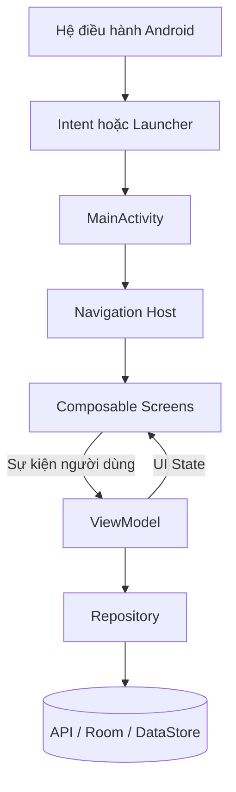
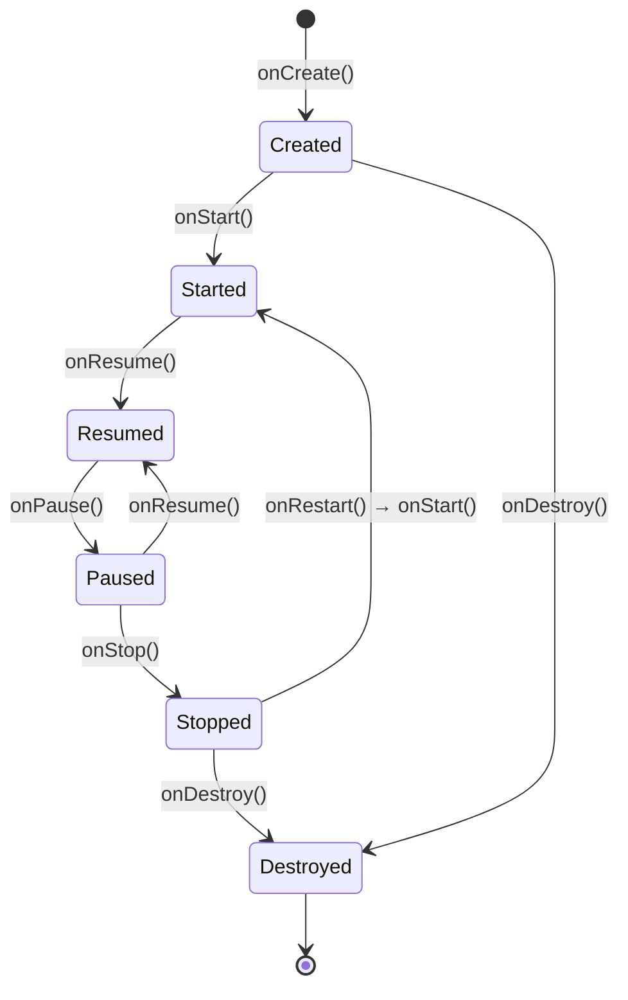
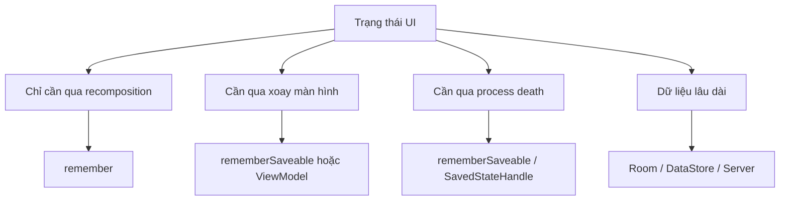
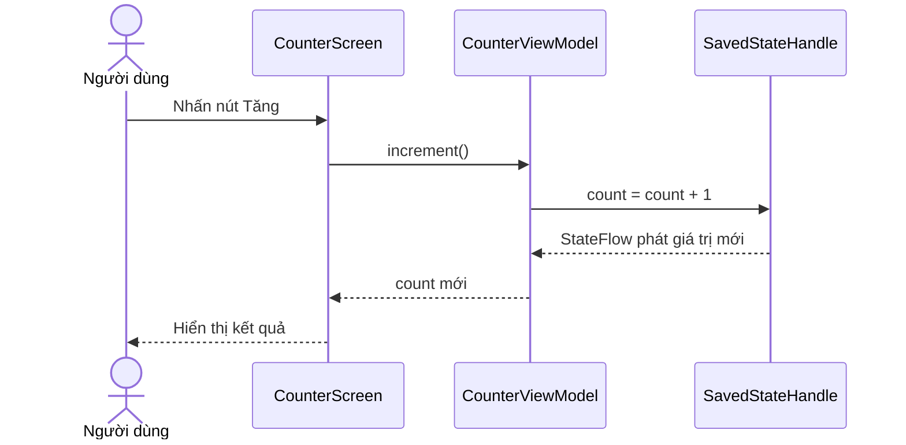
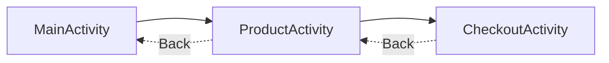

# 001 - Activity

[](https://developer.android.com/codelabs/basic-android-kotlin-compose-activity-lifecycle?utm_source=chatgpt.com)

**Học phần:** 02 - App Components and User Interface
**Module:** Module 03 - App Components
**Nhóm nội dung:** Activity
**Nguồn roadmap:** App Components / Activity
**Loại bài:** Lesson
**Thứ tự trong module:** 001
**Thời lượng gợi ý:** 24 phút

---

## 1. Tóm tắt

`Activity` là một trong các thành phần nền tảng của ứng dụng Android. Nó đóng vai trò **điểm vào giao diện ở cấp hệ thống**, cung cấp cửa sổ để ứng dụng hiển thị UI và nhận tương tác từ người dùng.

Trước đây, lập trình viên thường tạo một `Activity` cho mỗi màn hình. Trong ứng dụng Jetpack Compose hiện đại, kiến trúc phổ biến là **single-activity**: một `Activity` chứa nhiều màn hình dưới dạng các navigation destination hoặc composable. Mọi Activity đều phải được khai báo trong `AndroidManifest.xml`. ([Android Developers][1])

### Ghi chú năm dòng

1. `Activity` là điểm vào giúp hệ thống Android mở giao diện của ứng dụng.
2. Activity có vòng đời do Android quản lý.
3. Activity có thể được tạo lại khi xoay màn hình hoặc thay đổi cấu hình.
4. Không nên đặt toàn bộ logic nghiệp vụ và dữ liệu trong Activity.
5. Ứng dụng hiện đại thường dùng Activity làm UI host, còn trạng thái màn hình được quản lý bởi `ViewModel`.

---

## 2. Mục tiêu học tập

Sau bài học, bạn có thể:

* Giải thích Activity bằng ngôn ngữ của mình.
* Tạo một Activity bằng Kotlin và Jetpack Compose.
* Khai báo Activity trong `AndroidManifest.xml`.
* Mô tả được các callback chính trong vòng đời Activity.
* Phân biệt trạng thái trong Activity, `rememberSaveable`, `ViewModel` và `SavedStateHandle`.
* Nhận biết lỗi mất trạng thái khi xoay màn hình hoặc ứng dụng chạy nền.
* Tạo một artifact nhỏ để đưa vào portfolio Android.

---

## 3. Activity là gì?

Activity là một lớp kế thừa từ `Activity`, `ComponentActivity` hoặc một lớp con tương ứng. Activity tạo ra cửa sổ mà trong đó ứng dụng hiển thị giao diện.

Một Activity không nhất thiết luôn tương ứng với một màn hình:

* Trong ứng dụng Android cũ: một Activity thường đại diện cho một màn hình.
* Trong ứng dụng dùng Fragment: một Activity có thể chứa nhiều Fragment.
* Trong ứng dụng Compose: một Activity có thể chứa toàn bộ navigation graph và nhiều composable screen.
* Trong chế độ đa cửa sổ, Activity có thể chỉ chiếm một phần màn hình.

Android Developers hiện mô tả Activity là điểm vào cho tương tác với người dùng và khuyến khích kiến trúc single-activity đối với ứng dụng Compose hiện đại. ([Android Developers][1])

### Ví dụ

Ứng dụng bán hàng có thể có:

```text
MainActivity
├── HomeScreen
├── ProductListScreen
├── ProductDetailScreen
├── CartScreen
└── CheckoutScreen
```

Trong cấu trúc này, chỉ có `MainActivity` là Android Activity. Các màn hình bên dưới là composable destination.

---

## 4. Vị trí của Activity trong ứng dụng Android



Activity nên tập trung vào các nhiệm vụ cấp hệ thống và UI host:

* Nhận `Intent`.
* Khởi tạo UI gốc bằng `setContent`.
* Cung cấp navigation host.
* Điều phối quyền truy cập hệ thống.
* Tiếp nhận kết quả từ camera, thư viện ảnh hoặc ứng dụng khác.
* Kết nối với vòng đời Android.

Logic nghiệp vụ nên được giao cho `ViewModel`, domain layer hoặc repository. Theo hướng dẫn kiến trúc Android, UI element nên phụ thuộc vào state holder như `ViewModel`; state holder tiếp tục phụ thuộc vào domain layer hoặc data layer. ([Android Developers][2])

### Ảnh minh họa kiến trúc UI


*Nguồn ảnh: Android Developers – Guide to app architecture.* 

---

## 5. Tạo Activity đầu tiên

### 5.1. MainActivity cơ bản

```kotlin
package com.example.activitylesson

import android.os.Bundle
import androidx.activity.ComponentActivity
import androidx.activity.compose.setContent
import androidx.compose.material3.MaterialTheme
import androidx.compose.material3.Text

class MainActivity : ComponentActivity() {

    override fun onCreate(savedInstanceState: Bundle?) {
        super.onCreate(savedInstanceState)

        setContent {
            MaterialTheme {
                Text(text = "Xin chào từ MainActivity")
            }
        }
    }
}
```

### Giải thích

```kotlin
class MainActivity : ComponentActivity()
```

`MainActivity` kế thừa `ComponentActivity`, lớp Activity phù hợp với Jetpack Compose và các AndroidX API hiện đại.

```kotlin
override fun onCreate(savedInstanceState: Bundle?)
```

`onCreate()` được gọi khi Android tạo instance Activity. Đây là nơi thực hiện các bước khởi tạo một lần cho instance đó, chẳng hạn thiết lập UI gốc.

```kotlin
super.onCreate(savedInstanceState)
```

Gọi phần triển khai của lớp cha để Android hoàn tất quá trình khởi tạo Activity.

```kotlin
setContent { ... }
```

Đặt nội dung Jetpack Compose vào cửa sổ của Activity.

`onCreate()` là callback quan trọng mà Activity cần triển khai để khởi tạo các thành phần thiết yếu và UI. ([Android Developers][3])

---

## 6. Khai báo Activity trong AndroidManifest

Mỗi Activity phải được khai báo bên trong phần tử `<application>` của `AndroidManifest.xml`. ([Android Developers][1])

```xml
<?xml version="1.0" encoding="utf-8"?>
<manifest xmlns:android="http://schemas.android.com/apk/res/android">

    <application
        android:allowBackup="true"
        android:label="@string/app_name"
        android:theme="@style/Theme.ActivityLesson">

        <activity
            android:name=".MainActivity"
            android:exported="true">

            <intent-filter>
                <action android:name="android.intent.action.MAIN" />

                <category
                    android:name="android.intent.category.LAUNCHER" />
            </intent-filter>

        </activity>

    </application>

</manifest>
```

### Ý nghĩa các thuộc tính

| Thành phần         | Ý nghĩa                                                |
| ------------------ | ------------------------------------------------------ |
| `android:name`     | Tên lớp Activity                                       |
| `android:exported` | Activity có thể được ứng dụng khác khởi chạy hay không |
| `MAIN`             | Đây là điểm khởi chạy chính của ứng dụng               |
| `LAUNCHER`         | Hiển thị Activity trong launcher của thiết bị          |

Đối với component có `<intent-filter>`, ứng dụng nhắm đến Android 12 trở lên phải khai báo rõ `android:exported`. Activity launcher thường cần `true`; các Activity nội bộ thường nên để `false`. ([Android Developers][4])

### Activity nội bộ

```xml
<activity
    android:name=".SettingsActivity"
    android:exported="false" />
```

Activity này chỉ được mở từ bên trong ứng dụng.

---

## 7. Vòng đời Activity

Activity không tồn tại cố định từ lúc mở ứng dụng đến lúc đóng ứng dụng. Android chuyển Activity qua nhiều trạng thái tùy theo hành động người dùng và tài nguyên hệ thống.

### Ảnh vòng đời Activity


*Nguồn ảnh: Android Developers – Stages of the Activity lifecycle.* 

### Sơ đồ callback



### Các callback chính

| Callback      | Trạng thái                              | Công việc phù hợp                                       |
| ------------- | --------------------------------------- | ------------------------------------------------------- |
| `onCreate()`  | Activity vừa được tạo                   | Khởi tạo UI, dependency, navigation                     |
| `onStart()`   | Activity đã hiển thị                    | Đăng ký thành phần cần chạy khi UI nhìn thấy            |
| `onResume()`  | Activity có focus                       | Bắt đầu camera, animation hoặc tương tác trực tiếp      |
| `onPause()`   | Activity mất focus                      | Tạm dừng tác vụ cần focus                               |
| `onStop()`    | Activity không còn hiển thị             | Dừng cập nhật không cần thiết, giải phóng tài nguyên UI |
| `onRestart()` | Activity quay lại từ trạng thái stopped | Chuẩn bị trước khi Activity hiển thị lại                |
| `onDestroy()` | Instance Activity bị hủy                | Dọn tài nguyên còn gắn trực tiếp với Activity           |

Android có thể gọi `onPause()` khi Activity mất focus nhưng vẫn còn nhìn thấy một phần, chẳng hạn khi có cửa sổ hoặc Activity trong suốt nằm phía trên. `onPause()` diễn ra nhanh nên không phù hợp với network call, database transaction hoặc tác vụ lưu dữ liệu nặng. ([Android Developers][5])

---

## 8. Quan sát lifecycle bằng Logcat

```kotlin
package com.example.activitylesson

import android.os.Bundle
import android.util.Log
import androidx.activity.ComponentActivity
import androidx.activity.compose.setContent
import androidx.compose.material3.Text

private const val TAG = "MainActivity"

class MainActivity : ComponentActivity() {

    override fun onCreate(savedInstanceState: Bundle?) {
        super.onCreate(savedInstanceState)
        Log.d(TAG, "onCreate")

        setContent {
            Text("Activity Lifecycle")
        }
    }

    override fun onStart() {
        super.onStart()
        Log.d(TAG, "onStart")
    }

    override fun onResume() {
        super.onResume()
        Log.d(TAG, "onResume")
    }

    override fun onPause() {
        Log.d(TAG, "onPause")
        super.onPause()
    }

    override fun onStop() {
        Log.d(TAG, "onStop")
        super.onStop()
    }

    override fun onRestart() {
        super.onRestart()
        Log.d(TAG, "onRestart")
    }

    override fun onDestroy() {
        Log.d(TAG, "onDestroy")
        super.onDestroy()
    }
}
```

Trong Logcat, lọc theo:

```text
tag:MainActivity
```

### Trường hợp mở ứng dụng

```text
onCreate
onStart
onResume
```

### Nhấn nút Home

```text
onPause
onStop
```

### Quay lại ứng dụng

```text
onRestart
onStart
onResume
```

### Xoay màn hình

Thông thường, Activity cũ bị hủy và một instance mới được tạo:

```text
onPause
onStop
onDestroy
onCreate
onStart
onResume
```

Thay đổi cấu hình như xoay thiết bị, đổi ngôn ngữ hoặc thay đổi kích thước cửa sổ có thể khiến Android hủy và tạo lại Activity. ([Android Developers][3])

---

## 9. Activity và trạng thái giao diện

Một lỗi phổ biến là lưu toàn bộ trạng thái vào biến thành viên của Activity:

```kotlin
class MainActivity : ComponentActivity() {

    private var count = 0

    // count có thể trở về 0 khi Activity bị tạo lại.
}
```

Khi xoay màn hình, instance Activity cũ có thể bị hủy. Instance mới nhận giá trị `count = 0`.

### Các lớp trạng thái cần phân biệt



| Nhu cầu                                | Công cụ phù hợp                   |
| -------------------------------------- | --------------------------------- |
| Giữ trạng thái qua recomposition       | `remember`                        |
| Giữ UI state nhỏ qua thay đổi cấu hình | `rememberSaveable`                |
| Giữ screen state và logic nghiệp vụ    | `ViewModel`                       |
| Khôi phục state nhỏ sau process death  | `SavedStateHandle`                |
| Lưu dữ liệu lâu dài                    | Room, DataStore, file hoặc server |

`ViewModel` tự tồn tại qua thay đổi cấu hình, nhưng không tự tồn tại khi process bị hệ thống kết thúc. `rememberSaveable` và `SavedStateHandle` dùng cơ chế saved state dựa trên `Bundle`, vì vậy chỉ nên lưu lượng dữ liệu nhỏ và tối thiểu; dữ liệu lớn nên được tải lại từ data layer hoặc persistent storage. ([Android Developers][6])

---

## 10. Ví dụ hoàn chỉnh: bộ đếm không mất trạng thái

### 10.1. CounterViewModel

```kotlin
package com.example.activitylesson

import androidx.lifecycle.SavedStateHandle
import androidx.lifecycle.ViewModel
import kotlinx.coroutines.flow.StateFlow

class CounterViewModel(
    private val savedStateHandle: SavedStateHandle
) : ViewModel() {

    val count: StateFlow<Int> =
        savedStateHandle.getStateFlow(KEY_COUNT, 0)

    fun increment() {
        savedStateHandle[KEY_COUNT] = count.value + 1
    }

    fun reset() {
        savedStateHandle[KEY_COUNT] = 0
    }

    private companion object {
        const val KEY_COUNT = "count"
    }
}
```

### 10.2. CounterScreen

```kotlin
package com.example.activitylesson

import androidx.compose.foundation.layout.Arrangement
import androidx.compose.foundation.layout.Column
import androidx.compose.foundation.layout.fillMaxSize
import androidx.compose.material3.Button
import androidx.compose.material3.Text
import androidx.compose.runtime.Composable
import androidx.compose.ui.Alignment
import androidx.compose.ui.Modifier

@Composable
fun CounterScreen(
    count: Int,
    onIncrement: () -> Unit,
    onReset: () -> Unit
) {
    Column(
        modifier = Modifier.fillMaxSize(),
        verticalArrangement = Arrangement.Center,
        horizontalAlignment = Alignment.CenterHorizontally
    ) {
        Text(text = "Số lần nhấn: $count")

        Button(onClick = onIncrement) {
            Text("Tăng")
        }

        Button(onClick = onReset) {
            Text("Đặt lại")
        }
    }
}
```

### 10.3. MainActivity

```kotlin
package com.example.activitylesson

import android.os.Bundle
import androidx.activity.ComponentActivity
import androidx.activity.compose.setContent
import androidx.compose.material3.MaterialTheme
import androidx.compose.runtime.getValue
import androidx.lifecycle.compose.collectAsStateWithLifecycle
import androidx.lifecycle.viewmodel.compose.viewModel

class MainActivity : ComponentActivity() {

    override fun onCreate(savedInstanceState: Bundle?) {
        super.onCreate(savedInstanceState)

        setContent {
            MaterialTheme {
                val counterViewModel: CounterViewModel = viewModel()

                val count by counterViewModel.count
                    .collectAsStateWithLifecycle()

                CounterScreen(
                    count = count,
                    onIncrement = counterViewModel::increment,
                    onReset = counterViewModel::reset
                )
            }
        }
    }
}
```

### Luồng dữ liệu



Activity trong ví dụ chỉ làm ba việc:

1. Tạo UI bằng `setContent`.
2. Lấy `ViewModel`.
3. Kết nối state với composable.

Logic thay đổi bộ đếm không nằm trong Activity.

---

## 11. Activity, Intent và back stack

Activity có thể được hệ thống hoặc Activity khác khởi chạy thông qua `Intent`.

```kotlin
val intent = Intent(this, DetailActivity::class.java).apply {
    putExtra("product_id", "product-123")
}

startActivity(intent)
```

Các Activity được mở thường được sắp xếp trong một **task** theo cấu trúc back stack. Khi người dùng nhấn Back, Activity ở trên cùng được lấy khỏi stack và Activity phía dưới xuất hiện lại. ([Android Developers][7])



Trong ứng dụng Compose single-activity, navigation destination thường được đặt trong navigation back stack thay vì tạo một Activity cho mỗi màn hình.

---

## 12. Activity ảnh hưởng đến chất lượng ứng dụng như thế nào?

### 12.1. Trải nghiệm người dùng

Quản lý Activity không đúng có thể làm:

* Nội dung form biến mất khi xoay màn hình.
* Danh sách quay lại đầu khi Activity được tạo lại.
* Video hoặc âm thanh tiếp tục phát khi người dùng rời màn hình.
* Camera không được giải phóng.
* Network request bị gọi lại nhiều lần.
* Người dùng bị điều hướng sai khi nhấn Back.

### 12.2. Độ ổn định

Android có thể kết thúc process của ứng dụng chạy nền để thu hồi RAM. Khi process bị hủy, toàn bộ Activity và object trong process cũng bị mất. Vì vậy, ứng dụng phải có chiến lược phục hồi state thay vì giả định Activity luôn còn trong bộ nhớ. ([Android Developers][5])

### 12.3. Khả năng bảo trì

Activity càng chứa nhiều logic càng khó:

* Viết unit test.
* Tái sử dụng UI.
* Thay đổi navigation.
* Tìm nguyên nhân lỗi lifecycle.
* Chia module.
* Chuyển sang adaptive layout.

Một Activity tốt thường khá ngắn và đóng vai trò UI host.

---

## 13. Những lỗi junior thường gặp

### Lỗi 1: Biến Activity thành “God Object”

```kotlin
class MainActivity : ComponentActivity() {
    // Gọi API
    // Truy cập database
    // Validate form
    // Tính toán giá
    // Điều hướng
    // Quản lý state
    // Hiển thị UI
}
```

**Cách sửa:** đưa state và logic nghiệp vụ sang `ViewModel`, repository hoặc use case.

---

### Lỗi 2: Gọi API trực tiếp trong `onCreate()`

```kotlin
override fun onCreate(savedInstanceState: Bundle?) {
    super.onCreate(savedInstanceState)

    api.loadProducts()
}
```

Khi Activity bị tạo lại, request có thể bị gửi lại ngoài ý muốn.

**Cách sửa:** để `ViewModel` quản lý request, cache và UI state.

---

### Lỗi 3: Dùng `onDestroy()` để lưu dữ liệu quan trọng

Không nên phụ thuộc vào `onDestroy()` để lưu bài viết, giao dịch hoặc dữ liệu người dùng. Hệ thống quản lý bộ nhớ ở cấp process và dữ liệu quan trọng cần được lưu chủ động vào persistent storage. ([Android Developers][5])

---

### Lỗi 4: Lưu object lớn trong Bundle

```kotlin
intent.putExtra("products", hugeProductList)
```

`rememberSaveable` và `SavedStateHandle` cũng dựa trên cơ chế Bundle. Lưu dữ liệu lớn có thể gây lỗi `TransactionTooLargeException`. Nên lưu `productId`, sau đó tải dữ liệu tương ứng từ repository. ([Android Developers][6])

---

### Lỗi 5: Giữ tham chiếu Activity trong singleton

```kotlin
object AppManager {
    lateinit var activity: MainActivity
}
```

Tham chiếu này có thể giữ Activity cũ trong bộ nhớ sau khi Activity đã bị hủy.

**Cách sửa:** không giữ Activity trong singleton; dùng application context khi thật sự cần context không gắn với UI.

---

### Lỗi 6: Dùng nhiều Activity cho mọi composable screen

Trong Compose, tạo một Activity cho mỗi màn hình thường làm navigation, state sharing và animation phức tạp hơn.

**Cách sửa:** bắt đầu bằng một `MainActivity` và Compose Navigation; chỉ tạo Activity riêng khi có lý do rõ ràng ở cấp hệ thống hoặc luồng độc lập.

---

## 14. Thực hành trong 24 phút

### Phút 0–5: Tạo dự án

Tạo dự án:

```text
Empty Activity
Language: Kotlin
UI: Jetpack Compose
```

### Phút 5–10: Ghi lifecycle log

Override:

```text
onCreate
onStart
onResume
onPause
onStop
onRestart
onDestroy
```

Mở Logcat và quan sát khi:

* Mở ứng dụng.
* Nhấn Home.
* Quay lại ứng dụng.
* Xoay màn hình.
* Nhấn Back.

### Phút 10–18: Tạo bộ đếm

* Hiển thị giá trị `count`.
* Thêm nút tăng.
* Ban đầu thử giữ state bằng biến Activity.
* Xoay thiết bị và quan sát lỗi.

### Phút 18–24: Sửa state

* Chuyển state sang `ViewModel`.
* Dùng `SavedStateHandle`.
* Kiểm tra lại sau khi xoay màn hình.
* Ghi kết quả vào README.

---

## 15. Bài tập

### Yêu cầu

Xây dựng ứng dụng **Activity State Demo** gồm:

1. Một ô nhập tên người dùng.
2. Một bộ đếm số lần nhấn nút.
3. Một nút đặt lại.
4. Log đầy đủ lifecycle.
5. State không bị mất khi xoay màn hình.

### Yêu cầu nâng cao

* Dùng `rememberSaveable` cho nội dung `TextField`.
* Dùng `ViewModel` và `SavedStateHandle` cho bộ đếm.
* Thêm màn hình giới thiệu bằng Compose Navigation.
* Kiểm tra hành vi khi ứng dụng chạy nền.
* Không để logic cập nhật state trong Activity.

---

## 16. Kiểm thử và debugging

### Checklist kiểm thử thủ công

* [ ] Activity mở đúng từ launcher.
* [ ] `onCreate()` chỉ thiết lập UI và dependency cần thiết.
* [ ] Nhấn Home tạo ra `onPause()` và `onStop()`.
* [ ] Quay lại ứng dụng tạo ra `onRestart()`, `onStart()` và `onResume()`.
* [ ] Xoay thiết bị không làm mất dữ liệu nhập.
* [ ] Bộ đếm không trở về 0 sau khi Activity được tạo lại.
* [ ] Không gọi API trùng lặp khi xoay màn hình.
* [ ] Camera, sensor hoặc animation được dừng đúng lúc.
* [ ] Nhấn Back đưa người dùng về đúng màn hình.
* [ ] Activity nội bộ có `android:exported="false"`.

### Kiểm tra bằng Developer Options

Có thể bật:

```text
Settings
└── Developer options
    └── Don't keep activities
```

Sau đó:

1. Mở ứng dụng.
2. Nhập dữ liệu.
3. Chuyển sang ứng dụng khác.
4. Quay lại.
5. Kiểm tra khả năng phục hồi UI.

### Lệnh kiểm tra process death

Đưa ứng dụng xuống background, sau đó chạy:

```bash
adb shell am kill com.example.activitylesson
```

Mở lại ứng dụng và kiểm tra xem trạng thái tối thiểu có được phục hồi hay không.

---

## 17. Artifact đưa vào portfolio

### Tên dự án

```text
Android Activity Lifecycle Demo
```

### Cấu trúc gợi ý

```text
activity-lifecycle-demo/
├── app/
│   └── src/main/
│       ├── AndroidManifest.xml
│       └── java/com/example/activitydemo/
│           ├── MainActivity.kt
│           ├── CounterViewModel.kt
│           └── CounterScreen.kt
├── screenshots/
│   ├── counter-screen.png
│   └── lifecycle-logcat.png
└── README.md
```

### Nội dung README

```markdown
# Android Activity Lifecycle Demo

## Mục tiêu

Minh họa vòng đời Activity và cách phục hồi UI state.

## Công nghệ

- Kotlin
- Jetpack Compose
- ViewModel
- SavedStateHandle
- StateFlow

## Các trường hợp đã kiểm tra

- Mở ứng dụng
- Chạy nền và quay lại
- Xoay màn hình
- Activity recreation
- System-initiated process death

## Kiến trúc

MainActivity → CounterScreen → CounterViewModel → SavedStateHandle

## Kết quả

State của bộ đếm không bị mất khi Activity được tạo lại.
```

---

## 18. Checklist hoàn thành bài học

* [ ] Giải thích được Activity là gì.
* [ ] Phân biệt Activity với composable screen.
* [ ] Tạo được lớp kế thừa `ComponentActivity`.
* [ ] Khai báo được Activity trong manifest.
* [ ] Hiểu `android:exported`.
* [ ] Mô tả được bảy callback lifecycle chính.
* [ ] Quan sát lifecycle bằng Logcat.
* [ ] Hiểu vì sao xoay màn hình có thể làm mất state.
* [ ] Biết khi nào dùng `rememberSaveable`.
* [ ] Biết khi nào dùng `ViewModel`.
* [ ] Biết khi nào dùng `SavedStateHandle`.
* [ ] Không đặt logic nghiệp vụ nặng trong Activity.
* [ ] Có screenshot và README cho portfolio.

---

## 19. Ghi chú production

Trước khi phát hành tính năng liên quan đến Activity, cần kiểm tra:

| Nhóm          | Câu hỏi cần trả lời                                                |
| ------------- | ------------------------------------------------------------------ |
| User flow     | Người dùng vào Activity từ launcher, deep link hay notification?   |
| Lifecycle     | Camera, location, sensor và animation có dừng đúng lúc không?      |
| State         | Form, tab, bộ lọc và vị trí cuộn có được phục hồi không?           |
| Process death | Ứng dụng có tải lại được dữ liệu khi process bị hủy không?         |
| Navigation    | Back và Up có đưa người dùng đến đúng vị trí không?                |
| Security      | Activity có thật sự cần `exported="true"` không?                   |
| Network       | Xoay màn hình có gửi request trùng lặp không?                      |
| Performance   | Có tác vụ nặng chạy trên main thread trong Activity không?         |
| Testing       | Có test Activity recreation và state restoration không?            |
| Release       | Deep link, manifest merge và launcher entry đã được kiểm tra chưa? |

> **Nguyên tắc quan trọng:** Activity nên là lớp điều phối mỏng. UI hiển thị state, `ViewModel` quản lý screen state, còn repository hoặc data layer chịu trách nhiệm về dữ liệu.

---

## 20. Tài liệu tham khảo

* [Introduction to activities – Android Developers](https://developer.android.com/guide/components/activities/intro-activities) ([Android Developers][8])
* [The activity lifecycle – Android Developers](https://developer.android.com/guide/components/activities/activity-lifecycle) ([Android Developers][9])
* [Stages of the Activity lifecycle – Android Developers](https://developer.android.com/codelabs/basic-android-kotlin-compose-activity-lifecycle) ([Android Developers][3])
* [Save UI state in Compose – Android Developers](https://developer.android.com/develop/ui/compose/state-saving?hl=vi) ([Android Developers][6])
* [Guide to app architecture – Android Developers](https://developer.android.com/topic/architecture) ([Android Developers][2])
* [Tasks and the back stack – Android Developers](https://developer.android.com/guide/components/activities/tasks-and-back-stack) ([Android Developers][7])

[1]: https://developer.android.com/guide/components/activities/intro-activities "Introduction to activities  |  App architecture  |  Android Developers"
[2]: https://developer.android.com/topic/architecture "Guide to app architecture  |  App architecture  |  Android Developers"
[3]: https://developer.android.com/codelabs/basic-android-kotlin-compose-activity-lifecycle "Stages of the Activity lifecycle  |  Android Developers"
[4]: https://developer.android.com/about/versions/12/behavior-changes-12?utm_source=chatgpt.com "Behavior changes: Apps targeting Android 12  |  Android Developers"
[5]: https://developer.android.com/guide/components/activities/activity-lifecycle "The activity lifecycle  |  App architecture  |  Android Developers"
[6]: https://developer.android.com/develop/ui/compose/state-saving?hl=vi "Lưu trạng thái giao diện người dùng trong Compose  |  Jetpack Compose  |  Android Developers"
[7]: https://developer.android.com/guide/components/activities/tasks-and-back-stack "Tasks and the back stack  |  App architecture  |  Android Developers"
[8]: https://developer.android.com/guide/components/activities/intro-activities?utm_source=chatgpt.com "Introduction to activities | App architecture"
[9]: https://developer.android.com/guide/components/activities/activity-lifecycle?utm_source=chatgpt.com "The activity lifecycle | App architecture"

---

# Bài luyện tập

## Mục tiêu


## Đề bài


## Yêu cầu hoàn thành

- [ ] 
- [ ] 
- [ ] 

## Kết quả / lời giải


## Ghi chú
