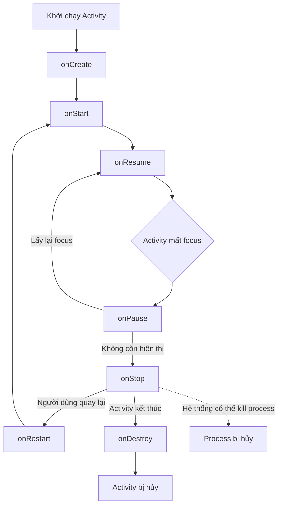
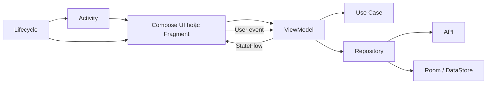

# 002 — Activity Lifecycle
[](https://developer.android.com/codelabs/basic-android-kotlin-compose-activity-lifecycle?utm_source=chatgpt.com)

**Học phần:** 02 — App Components and User Interface
**Module:** Module 03 — App Components
**Nhóm nội dung:** Activity
**Nguồn roadmap:** App Components / Activity
**Loại bài:** Lesson
**Thứ tự trong module:** 002
**Thời lượng gợi ý:** 24 phút

---

## 1. Tóm tắt

**Activity Lifecycle** là chuỗi trạng thái và callback mà một `Activity` trải qua từ lúc được tạo, hiển thị, tương tác với người dùng, chuyển xuống nền cho đến khi bị hủy.

Android cung cấp sáu callback chính:

```text
onCreate()
onStart()
onResume()
onPause()
onStop()
onDestroy()
```

Ngoài ra còn có `onRestart()` khi một Activity đã bị dừng quay trở lại màn hình.

Hiểu đúng lifecycle giúp ứng dụng:

* Không làm mất dữ liệu khi xoay màn hình.
* Không gọi API lặp lại ngoài ý muốn.
* Không tiếp tục chạy camera, GPS hoặc animation khi màn hình đã bị ẩn.
* Không rò rỉ tài nguyên.
* Khôi phục đúng trạng thái khi tiến trình ứng dụng bị hệ thống thu hồi.
* Hoạt động ổn định khi chuyển app, mở dialog, dùng chế độ đa cửa sổ hoặc quay lại từ màn hình Recent Apps.

Android gọi các callback lifecycle khi `Activity` chuyển từ trạng thái này sang trạng thái khác. Tùy độ phức tạp, ứng dụng không nhất thiết phải override tất cả callback, nhưng lập trình viên cần hiểu rõ ý nghĩa của từng callback. ([Android Developers][1])

---

## 2. Mục tiêu học tập

Sau bài học, anh có thể:

* Giải thích Activity Lifecycle bằng ngôn ngữ của mình.
* Nhớ được trình tự callback khi mở, đóng, xoay và chuyển app.
* Phân biệt `Created`, `Started`, `Resumed`, `Paused`, `Stopped` và `Destroyed`.
* Biết logic nào nên hoặc không nên đặt trong lifecycle callback.
* Sử dụng `ViewModel`, `SavedStateHandle` và `rememberSaveable` để giữ state.
* Theo dõi lifecycle bằng Logcat.
* Kiểm thử việc tái tạo Activity.
* Phân tích ảnh hưởng của lifecycle đối với UX, hiệu năng và độ ổn định.

---

## 3. Ghi chú 5 dòng

> Activity Lifecycle mô tả các trạng thái mà một Activity trải qua trong quá trình hoạt động.
> `onCreate()` dùng để khởi tạo màn hình, còn `onResume()` thể hiện màn hình đang tương tác với người dùng.
> Khi ứng dụng mất focus hoặc bị che, Android gọi `onPause()` và có thể gọi tiếp `onStop()`.
> Xoay màn hình thường làm Activity cũ bị hủy và một Activity mới được tạo lại.
> State giao diện nên được giữ bằng `ViewModel`, `rememberSaveable`, `SavedStateHandle` hoặc bộ nhớ bền vững phù hợp.

---

## 4. Sơ đồ Activity Lifecycle

### 4.1. Sơ đồ chính thức


*Nguồn ảnh: [Android Developers — The Activity Lifecycle](https://developer.android.com/guide/components/activities/activity-lifecycle)* 

### 4.2. Sơ đồ rút gọn



### 4.3. Trình tự phổ biến

```text
Mở ứng dụng
onCreate → onStart → onResume

Nhấn Home
onPause → onStop

Mở lại từ Recent Apps
onRestart → onStart → onResume

Xoay màn hình
onPause → onStop → onDestroy
                         ↓
onCreate → onStart → onResume

Nhấn Back để đóng Activity
onPause → onStop → onDestroy
```

Khi thay đổi cấu hình, chẳng hạn chuyển từ màn hình dọc sang ngang, Activity mặc định sẽ bị hủy rồi tạo lại. Activity cũ đi qua `onPause()`, `onStop()`, `onDestroy()`; instance mới tiếp tục bằng `onCreate()`, `onStart()`, `onResume()`. ([Android Developers][2])

---

## 5. Các trạng thái chính

### 5.1. Created

Activity đã được tạo nhưng chưa thực sự sẵn sàng để người dùng tương tác.

Callback tương ứng:

```kotlin
onCreate()
```

Công việc thường thực hiện:

* Gọi `setContent()` đối với Jetpack Compose.
* Gọi `setContentView()` đối với View/XML.
* Thiết lập dependency và navigation.
* Kết nối Activity với `ViewModel`.
* Đăng ký những thành phần cần tồn tại trong toàn bộ vòng đời Activity.
* Đọc dữ liệu khởi tạo từ `Intent`.

`onCreate()` được gọi khi hệ thống tạo một instance Activity mới. Tham số `savedInstanceState` có thể chứa state đã lưu của instance trước đó. ([Android Developers][1])

Không nên:

* Thực hiện tác vụ đồng bộ rất nặng trên main thread.
* Trực tiếp chứa toàn bộ business logic.
* Tải cùng một API nhiều lần mà không có cơ chế kiểm soát.
* Lưu reference tĩnh đến Activity.

---

### 5.2. Started

Activity đã xuất hiện trên màn hình nhưng chưa chắc đang nhận tương tác trực tiếp.

Callback tương ứng:

```kotlin
onStart()
```

Phù hợp cho:

* Bắt đầu theo dõi dữ liệu chỉ cần thiết khi màn hình đang hiển thị.
* Đăng ký một số listener gắn với trạng thái nhìn thấy.
* Khởi động animation hoặc tài nguyên có thể hoạt động khi Activity nhìn thấy.

Sau khi `onStart()` hoàn thành, Activity thường nhanh chóng chuyển sang `Resumed`. ([Android Developers][1])

---

### 5.3. Resumed

Activity đang ở foreground, có focus và người dùng có thể tương tác.

Callback tương ứng:

```kotlin
onResume()
```

Phù hợp cho:

* Tiếp tục camera preview.
* Tiếp tục animation cần tương tác trực tiếp.
* Nhận input từ người dùng.
* Bắt đầu theo dõi những tài nguyên chỉ được dùng khi màn hình có focus.

Activity giữ trạng thái `Resumed` cho đến khi có sự kiện làm nó mất focus, chẳng hạn người dùng mở màn hình khác, nhận cuộc gọi hoặc tắt màn hình. ([Android Developers][1])

> Không nên mặc định đặt lệnh gọi API trong `onResume()`. Callback này có thể chạy nhiều lần mỗi khi người dùng quay lại màn hình.

---

### 5.4. Paused

Activity mất focus nhưng có thể vẫn còn nhìn thấy một phần hoặc toàn bộ.

Callback tương ứng:

```kotlin
onPause()
```

Ví dụ:

* Một dialog hoặc Activity dạng trong suốt xuất hiện phía trên.
* Người dùng chuyển focus sang cửa sổ khác trong chế độ đa cửa sổ.
* Một Activity khác bắt đầu che màn hình hiện tại.

Công việc phù hợp:

* Tạm dừng camera nếu camera chỉ nên chạy khi có focus.
* Tạm dừng animation cần tương tác.
* Giảm tần suất cập nhật cảm biến.
* Giải phóng tài nguyên được lấy trong `onResume()`.

`onPause()` diễn ra rất nhanh, vì vậy không nên gọi network, ghi database lớn hoặc thực hiện công việc nặng tại đây. ([Android Developers][1])

---

### 5.5. Stopped

Activity không còn nhìn thấy trên màn hình.

Callback tương ứng:

```kotlin
onStop()
```

Phù hợp cho:

* Dừng animation không cần thiết.
* Dừng cập nhật vị trí chi tiết.
* Hủy đăng ký listener chỉ cần khi màn hình hiển thị.
* Giải phóng tài nguyên lớn.
* Yêu cầu `ViewModel` lưu bản nháp nếu chưa có thời điểm phù hợp hơn.

Android có thể giữ đối tượng Activity trong bộ nhớ khi Activity ở trạng thái `Stopped`. Tuy nhiên, tiến trình chứa Activity có thể bị hệ thống thu hồi khi cần RAM. ([Android Developers][1])

---

### 5.6. Restarted

Khi một Activity ở trạng thái `Stopped` quay trở lại, Android gọi:

```kotlin
onRestart()
```

Sau đó:

```text
onRestart → onStart → onResume
```

`onRestart()` không được gọi trong lần khởi chạy đầu tiên. Nó chỉ xuất hiện khi cùng một Activity instance đã đi qua `onStop()` rồi quay lại.

---

### 5.7. Destroyed

Callback tương ứng:

```kotlin
onDestroy()
```

Có hai trường hợp phổ biến:

1. Activity thực sự kết thúc, ví dụ người dùng đóng màn hình hoặc code gọi `finish()`.
2. Activity tạm thời bị hủy do thay đổi cấu hình, chẳng hạn xoay màn hình.

Có thể kiểm tra:

```kotlin
isFinishing
isChangingConfigurations
```

Không nên dùng `onDestroy()` làm nơi duy nhất để lưu dữ liệu quan trọng. Khi hệ thống kill toàn bộ process, `onDestroy()` không được đảm bảo sẽ được gọi. ([Android Developers][1])

---

## 6. Bảng tổng hợp callback

| Callback      | Trạng thái        | Activity có hiển thị? | Có tương tác? | Công việc điển hình                                                       |
| ------------- | ----------------- | --------------------: | ------------: | ------------------------------------------------------------------------- |
| `onCreate()`  | Created           |       Chưa hoàn chỉnh |         Không | Tạo UI, thiết lập navigation, lấy ViewModel                               |
| `onStart()`   | Started           |                    Có |     Chưa chắc | Đăng ký tài nguyên cần khi màn hình nhìn thấy                             |
| `onResume()`  | Resumed           |                    Có |            Có | Camera, input, tác vụ cần focus                                           |
| `onPause()`   | Paused            |             Có thể có |  Không đầy đủ | Tạm dừng tài nguyên lấy ở `onResume()`                                    |
| `onStop()`    | Stopped           |                 Không |         Không | Dừng animation, sensor, listener, giải phóng tài nguyên                   |
| `onRestart()` | Chuyển từ Stopped |     Chuẩn bị hiển thị |          Chưa | Chuẩn bị quay lại màn hình                                                |
| `onDestroy()` | Destroyed         |                 Không |         Không | Dọn tài nguyên cuối cùng, nhưng không dựa vào callback này để lưu dữ liệu |

Nguyên tắc đối xứng:

```text
Khởi tạo ở onStart  → giải phóng ở onStop
Khởi tạo ở onResume → giải phóng ở onPause
```

Android khuyến nghị ghép callback lấy tài nguyên với callback giải phóng tương ứng để tránh giữ camera, GPS hoặc tài nguyên chia sẻ lâu hơn cần thiết. ([Android Developers][1])

---

## 7. Activity Lifecycle trong kiến trúc ứng dụng



### Trách nhiệm nên được phân chia

#### Activity

* Là entry point hoặc host của UI.
* Thiết lập Compose, Fragment hoặc Navigation.
* Xử lý integration với Android framework.
* Không nên trở thành nơi chứa toàn bộ business logic.

#### Composable hoặc Fragment

* Hiển thị UI.
* Nhận state.
* Phát event từ người dùng.
* Thực hiện side effect liên quan trực tiếp đến phần UI đó.

#### ViewModel

* Chứa screen state.
* Xử lý event của màn hình.
* Điều phối business logic thuộc UI layer.
* Tồn tại qua configuration change.

`ViewModel` cache state và giữ state qua những thay đổi cấu hình như xoay màn hình. Tuy nhiên, `ViewModel` thông thường không đủ để khôi phục state sau khi process bị kill; trường hợp đó cần thêm `SavedStateHandle`, saved state hoặc persistent storage. ([Android Developers][3])

#### Repository

* Truy cập API.
* Đọc hoặc ghi database.
* Xử lý nguồn dữ liệu.
* Không phụ thuộc trực tiếp vào Activity.

---

## 8. Phân biệt các cách giữ state

| Công cụ             | Qua recomposition | Qua xoay màn hình |                           Qua process death | Dùng cho                             |
| ------------------- | ----------------: | ----------------: | ------------------------------------------: | ------------------------------------ |
| `remember`          |                Có |             Không |                                       Không | State UI rất tạm thời                |
| `rememberSaveable`  |                Có |                Có |                    Có, với dữ liệu saveable | Text nhập, tab, scroll, lựa chọn nhỏ |
| `ViewModel`         |                Có |                Có |                    Không, nếu dùng một mình | Screen state và UI business logic    |
| `SavedStateHandle`  |                Có |                Có | Có trong trường hợp hệ thống khôi phục task | ID, query, bộ đếm, state nhỏ         |
| Room/DataStore/file |                Có |                Có |                                          Có | Dữ liệu cần tồn tại lâu dài          |

Android khuyến nghị phối hợp `ViewModel`, saved state như `rememberSaveable` hoặc `SavedStateHandle`, và local storage tùy theo độ phức tạp cũng như vòng đời mong muốn của dữ liệu. ([Android Developers][4])

### Ví dụ lựa chọn công cụ

```text
Nút đang được nhấn:
→ Không cần lưu.

Text người dùng đang nhập:
→ rememberSaveable.

State của màn hình sản phẩm:
→ ViewModel.

ID sản phẩm cần khôi phục sau process death:
→ SavedStateHandle.

Bản nháp người dùng phải còn sau khi đóng app:
→ Room hoặc DataStore.
```

> Không đưa danh sách lớn, bitmap hoặc toàn bộ response API vào `Bundle`, `rememberSaveable` hay `SavedStateHandle`. Hãy lưu khóa hoặc ID rồi tải lại dữ liệu từ repository.

Saved instance state phù hợp với dữ liệu nhỏ vì dữ liệu phải được serialize và sử dụng bộ nhớ của tiến trình hệ thống. ([Android Developers][1])

---

## 9. Thực hành: ứng dụng Lifecycle Counter

### 9.1. Yêu cầu

Tạo một màn hình có:

* Bộ đếm số lần nhấn.
* Một ô nhập ghi chú.
* Log toàn bộ lifecycle callback.
* Bộ đếm và ghi chú không mất khi Activity được tạo lại.
* Một bài test kiểm tra state sau `Activity.recreate()`.

### 9.2. Dependency cần thiết

Trong Version Catalog hoặc file Gradle module, thêm các thư viện lifecycle dành cho Compose với phiên bản ổn định hiện tại:

```kotlin
dependencies {
    implementation("androidx.lifecycle:lifecycle-runtime-compose:<version>")
    implementation("androidx.lifecycle:lifecycle-viewmodel-compose:<version>")

    androidTestImplementation("androidx.compose.ui:ui-test-junit4:<version>")
    debugImplementation("androidx.compose.ui:ui-test-manifest:<version>")
}
```

`collectAsStateWithLifecycle()` sẽ bắt đầu thu thập Flow khi lifecycle đạt trạng thái phù hợp và dừng khi màn hình đi xuống nền, giúp hạn chế công việc không cần thiết. ([Android Developers][5])

---

### 9.3. `CounterViewModel.kt`

```kotlin
package com.example.lifecycle

import androidx.lifecycle.SavedStateHandle
import androidx.lifecycle.ViewModel
import kotlinx.coroutines.flow.StateFlow

class CounterViewModel(
    private val savedStateHandle: SavedStateHandle
) : ViewModel() {

    val count: StateFlow<Int> =
        savedStateHandle.getStateFlow(COUNT_KEY, 0)

    fun increase() {
        savedStateHandle[COUNT_KEY] = count.value + 1
    }

    fun reset() {
        savedStateHandle[COUNT_KEY] = 0
    }

    private companion object {
        const val COUNT_KEY = "count"
    }
}
```

Trong ví dụ này:

* `ViewModel` giữ logic của bộ đếm.
* `SavedStateHandle` lưu giá trị nhỏ cần khôi phục.
* Activity không trực tiếp quản lý giá trị `count`.

---

### 9.4. `MainActivity.kt`

```kotlin
package com.example.lifecycle

import android.os.Bundle
import android.util.Log
import androidx.activity.ComponentActivity
import androidx.activity.compose.setContent
import androidx.activity.viewModels
import androidx.compose.foundation.layout.Arrangement
import androidx.compose.foundation.layout.Column
import androidx.compose.foundation.layout.fillMaxSize
import androidx.compose.foundation.layout.padding
import androidx.compose.material3.Button
import androidx.compose.material3.MaterialTheme
import androidx.compose.material3.OutlinedTextField
import androidx.compose.material3.Surface
import androidx.compose.material3.Text
import androidx.compose.runtime.Composable
import androidx.compose.runtime.getValue
import androidx.compose.runtime.mutableStateOf
import androidx.compose.runtime.saveable.rememberSaveable
import androidx.compose.runtime.setValue
import androidx.compose.runtime.remember
import androidx.compose.ui.Modifier
import androidx.compose.ui.unit.dp
import androidx.lifecycle.compose.collectAsStateWithLifecycle

class MainActivity : ComponentActivity() {

    private val viewModel: CounterViewModel by viewModels()

    override fun onCreate(savedInstanceState: Bundle?) {
        super.onCreate(savedInstanceState)

        logLifecycle(
            callback = "onCreate",
            details = "restored=${savedInstanceState != null}"
        )

        setContent {
            MaterialTheme {
                Surface(modifier = Modifier.fillMaxSize()) {
                    LifecycleCounterScreen(viewModel = viewModel)
                }
            }
        }
    }

    override fun onStart() {
        super.onStart()
        logLifecycle("onStart")
    }

    override fun onResume() {
        super.onResume()
        logLifecycle("onResume")
    }

    override fun onPause() {
        logLifecycle("onPause")
        super.onPause()
    }

    override fun onStop() {
        logLifecycle("onStop")
        super.onStop()
    }

    override fun onRestart() {
        super.onRestart()
        logLifecycle("onRestart")
    }

    override fun onDestroy() {
        logLifecycle(
            callback = "onDestroy",
            details = """
                finishing=$isFinishing,
                changingConfigurations=$isChangingConfigurations
            """.trimIndent()
        )

        super.onDestroy()
    }

    private fun logLifecycle(
        callback: String,
        details: String = ""
    ) {
        Log.d(
            LIFECYCLE_TAG,
            "$callback | $details | activity=${hashCode()}"
        )
    }

    private companion object {
        const val LIFECYCLE_TAG = "ActivityLifecycle"
    }
}

@Composable
private fun LifecycleCounterScreen(
    viewModel: CounterViewModel
) {
    val count by viewModel.count.collectAsStateWithLifecycle()

    var note by rememberSaveable {
        mutableStateOf("")
    }

    Column(
        modifier = Modifier
            .fillMaxSize()
            .padding(24.dp),
        verticalArrangement = Arrangement.spacedBy(16.dp)
    ) {
        Text(
            text = "Activity Lifecycle Lab",
            style = MaterialTheme.typography.headlineSmall
        )

        Text(
            text = "Số lần nhấn: $count"
        )

        Button(
            onClick = viewModel::increase
        ) {
            Text("Tăng bộ đếm")
        }

        Button(
            onClick = viewModel::reset
        ) {
            Text("Đặt lại")
        }

        OutlinedTextField(
            value = note,
            onValueChange = { note = it },
            label = {
                Text("Ghi chú được giữ khi Activity tái tạo")
            }
        )
    }
}
```

> Trong code production, xóa import không sử dụng như `remember` nếu Android Studio cảnh báo.

---

## 10. Quan sát Lifecycle bằng Logcat

Trong Android Studio:

1. Chạy ứng dụng.
2. Mở cửa sổ **Logcat**.
3. Lọc theo:

```text
tag:ActivityLifecycle
```

Hoặc bằng terminal:

```bash
adb logcat -s ActivityLifecycle
```

### Khi mở ứng dụng

```text
onCreate
onStart
onResume
```

### Khi nhấn Home

```text
onPause
onStop
```

### Khi mở lại ứng dụng

```text
onRestart
onStart
onResume
```

### Khi xoay thiết bị

Ví dụ Activity cũ:

```text
onPause
onStop
onDestroy | changingConfigurations=true
```

Activity mới:

```text
onCreate | restored=true
onStart
onResume
```

Hash code của hai Activity sẽ khác nhau, cho thấy Android đã tạo một instance mới.

---

## 11. Kiểm thử Activity recreation

### 11.1. Compose UI test

```kotlin
package com.example.lifecycle

import androidx.compose.ui.test.assertExists
import androidx.compose.ui.test.junit4.createAndroidComposeRule
import androidx.compose.ui.test.onNodeWithText
import androidx.compose.ui.test.performClick
import org.junit.Rule
import org.junit.Test

class LifecycleCounterTest {

    @get:Rule
    val composeRule =
        createAndroidComposeRule<MainActivity>()

    @Test
    fun counter_survives_activity_recreation() {
        composeRule
            .onNodeWithText("Tăng bộ đếm")
            .performClick()

        composeRule
            .onNodeWithText("Số lần nhấn: 1")
            .assertExists()

        composeRule.activityRule.scenario.recreate()

        composeRule
            .onNodeWithText("Số lần nhấn: 1")
            .assertExists()
    }
}
```

Bài test chứng minh:

```text
Người dùng nhấn nút
       ↓
ViewModel/SavedStateHandle cập nhật state
       ↓
Activity bị tạo lại
       ↓
UI đọc lại state
       ↓
Giá trị vẫn là 1
```

### 11.2. Kiểm tra process recreation thủ công

1. Nhập ghi chú và tăng bộ đếm.
2. Nhấn Home để đưa app xuống nền.
3. Chạy:

```bash
adb shell am kill com.example.lifecycle
```

4. Mở lại task ứng dụng.
5. Kiểm tra state đã được khôi phục hay chưa.

Thay `com.example.lifecycle` bằng `applicationId` thực tế.

---

## 12. Ma trận kiểm thử lifecycle

| Tình huống                | Thao tác             | Callback mong đợi                 | State mong đợi               |
| ------------------------- | -------------------- | --------------------------------- | ---------------------------- |
| Khởi chạy                 | Mở app               | `create → start → resume`         | State ban đầu                |
| Xoay màn hình             | Portrait → Landscape | Hủy instance cũ, tạo instance mới | Bộ đếm và text còn           |
| Nhấn Home                 | App → Home           | `pause → stop`                    | Không mất bản nháp           |
| Quay lại                  | Recent Apps → App    | `restart → start → resume`        | UI tiếp tục đúng             |
| Dialog che một phần       | Mở dialog            | Thường có thể `pause`             | Không gọi API lại            |
| Màn hình khác che toàn bộ | Mở Activity khác     | `pause → stop`                    | Tài nguyên được dừng         |
| Nhấn Back                 | Đóng Activity        | `pause → stop → destroy`          | State tạm thời có thể bị xóa |
| Process recreation        | Kill app khi ở nền   | Có thể không có `onDestroy`       | State nhỏ được khôi phục     |
| Đa cửa sổ                 | Thay đổi focus       | `pause/resume` có thể lặp         | Camera, sensor xử lý đúng    |

Khi một dialog hoặc Activity khác chỉ che một phần, Activity bên dưới có thể chỉ chuyển sang `Paused`. Nếu bị che hoàn toàn, nó tiếp tục chuyển sang `Stopped`. ([Android Developers][2])

---

## 13. Lỗi phổ biến của lập trình viên mới

### Lỗi chính: gọi API trong `onResume()`

```kotlin
override fun onResume() {
    super.onResume()

    viewModel.loadProducts()
}
```

Vấn đề:

```text
Mở màn hình          → gọi API
Mở dialog rồi đóng   → gọi API
Chuyển app rồi quay lại → gọi API
Tắt và bật màn hình  → có thể gọi API
Quay lại từ Activity khác → gọi API
```

Hậu quả:

* Request bị lặp.
* Giao diện nhấp nháy loading.
* Tăng chi phí network.
* Ghi dữ liệu trùng.
* Race condition giữa nhiều response.
* Tốn pin và tài nguyên máy chủ.

Cách tốt hơn:

```kotlin
class ProductViewModel(
    private val repository: ProductRepository
) : ViewModel() {

    init {
        loadProducts()
    }

    private fun loadProducts() {
        // Gọi repository bằng viewModelScope.
    }
}
```

Hoặc chỉ refresh khi có yêu cầu rõ ràng:

```kotlin
fun onRefreshRequested() {
    loadProducts(forceRefresh = true)
}
```

---

### Lỗi 2: giữ state trong biến Activity

```kotlin
class MainActivity : ComponentActivity() {
    private var count = 0
}
```

Khi xoay màn hình, Activity cũ bị hủy và biến trở lại `0`.

Giải pháp:

```text
State nhỏ của UI       → rememberSaveable
Screen state           → ViewModel
Process recreation     → SavedStateHandle
Dữ liệu lâu dài        → Room hoặc DataStore
```

---

### Lỗi 3: dùng `remember` cho dữ liệu cần giữ khi xoay

```kotlin
var note by remember {
    mutableStateOf("")
}
```

`remember` chỉ giữ state qua recomposition. Khi Activity bị tạo lại, state này bị mất.

Sửa thành:

```kotlin
var note by rememberSaveable {
    mutableStateOf("")
}
```

---

### Lỗi 4: lưu dữ liệu quan trọng trong `onPause()`

```kotlin
override fun onPause() {
    repository.uploadLargeFile()
    super.onPause()
}
```

`onPause()` có thời gian thực thi ngắn và không thích hợp cho network call hoặc database transaction nặng. ([Android Developers][1])

Giải pháp:

* Lưu sớm khi người dùng thay đổi dữ liệu.
* Dùng Room hoặc DataStore.
* Dùng coroutine trong ViewModel hoặc repository.
* Dùng WorkManager cho công việc bền vững cần tiếp tục.

---

### Lỗi 5: tin rằng `onDestroy()` luôn được gọi

```kotlin
override fun onDestroy() {
    saveImportantData()
    super.onDestroy()
}
```

Khi Android kill process để thu hồi bộ nhớ, `onDestroy()` có thể không chạy. ([Android Developers][6])

Dữ liệu quan trọng phải được lưu trước đó, không chờ đến `onDestroy()`.

---

### Lỗi 6: đặt toàn bộ logic vào Activity

```kotlin
class MainActivity : ComponentActivity() {
    // Gọi API
    // Parse JSON
    // Tính business rule
    // Truy cập database
    // Quản lý UI state
    // Navigation
    // Analytics
}
```

Hậu quả:

* Activity khó đọc.
* Khó unit test.
* Logic phụ thuộc Android framework.
* Lifecycle callback trở nên dài.
* Dễ gọi cùng một tác vụ nhiều lần.

Cấu trúc tốt hơn:

```text
Activity/Composable
        ↓ event
ViewModel
        ↓
Use case / Repository
        ↓
API, Room, DataStore
```

---

## 14. Lifecycle trong Jetpack Compose

Activity Lifecycle và Composable Lifecycle là hai khái niệm khác nhau.

### Activity Lifecycle

```text
Created
Started
Resumed
Paused
Stopped
Destroyed
```

### Composable Lifecycle

```text
Đi vào Composition
        ↓
Recompose 0 hoặc nhiều lần
        ↓
Rời Composition
```

Không nên cho rằng mỗi lần composable recompose thì Activity cũng chạy lại lifecycle callback.

### Thu thập StateFlow đúng cách

```kotlin
@Composable
fun ProductRoute(
    viewModel: ProductViewModel
) {
    val uiState by viewModel.uiState.collectAsStateWithLifecycle()

    ProductScreen(
        uiState = uiState,
        onRetry = viewModel::retry
    )
}
```

Theo mặc định, `collectAsStateWithLifecycle()` thu thập Flow khi lifecycle đạt `STARTED` và dừng khi chuyển xuống `STOPPED`. ([Android Developers][5])

Không nên:

```kotlin
val uiState by viewModel.uiState.collectAsState()
```

trong những trường hợp việc thu thập cần tự động dừng theo lifecycle của màn hình Android.

---

## 15. Ảnh hưởng đối với sản phẩm

### UX

Sai lifecycle có thể làm:

* Mất nội dung form khi xoay màn hình.
* Quay lại app nhưng màn hình trở về trạng thái ban đầu.
* Video tiếp tục phát khi app ở nền.
* Loading xuất hiện lại mỗi khi đóng dialog.
* Người dùng gửi đơn hàng hai lần.

Việc lưu và khôi phục UI state sau khi Activity hoặc process bị hệ thống hủy là yếu tố quan trọng để tạo trải nghiệm liền mạch. ([Android Developers][4])

### Reliability

* Request trùng có thể tạo dữ liệu trùng.
* Callback chạy nhiều lần có thể đăng ký listener nhiều lần.
* Không giải phóng camera có thể khiến màn hình khác không mở được camera.
* Không hủy coroutine phù hợp có thể cập nhật UI đã biến mất.

### Performance và pin

* GPS tiếp tục chạy khi màn hình bị ẩn.
* Animation tiếp tục render không cần thiết.
* Flow tiếp tục thu thập trong background.
* API bị gọi lại mỗi lần `onResume()`.

### Maintainability

Lifecycle logic đặt sai vị trí làm Activity trở thành “God object”. Tách state và logic sang `ViewModel`, repository và lifecycle-aware component giúp code dễ kiểm thử và tái sử dụng hơn.

### Release risk

Các tình huống cần đưa vào release checklist:

* Xoay màn hình.
* Đổi kích thước cửa sổ.
* Chế độ đa cửa sổ.
* Chuyển app và quay lại.
* Nhận cuộc gọi hoặc khóa màn hình.
* Process bị thu hồi.
* Back navigation.
* Mở deep link.
* Thay đổi ngôn ngữ hoặc giao diện sáng/tối.

---

## 16. Bài thực hành 24 phút

### Phút 0–5: ghi log callback

Override:

```text
onCreate
onStart
onResume
onPause
onStop
onRestart
onDestroy
```

Chạy ứng dụng và quan sát Logcat.

### Phút 5–10: thử các user flow

* Nhấn Home.
* Quay lại app.
* Xoay màn hình.
* Mở một Activity khác.
* Nhấn Back.

Ghi lại thứ tự callback.

### Phút 10–17: thêm state

* Một bộ đếm bằng `ViewModel`.
* Một ô nhập bằng `rememberSaveable`.
* Kiểm tra state sau khi xoay.

### Phút 17–21: thêm test

Dùng:

```kotlin
scenario.recreate()
```

Sau đó xác nhận bộ đếm vẫn giữ nguyên.

### Phút 21–24: viết README

README cần có:

* Định nghĩa Activity Lifecycle.
* Sơ đồ callback.
* Bảng kết quả thử nghiệm.
* Ảnh Logcat.
* Giải thích lựa chọn `ViewModel` và `rememberSaveable`.
* Một lỗi đã phát hiện và cách khắc phục.

---

## 17. Bài tập

### Đề bài

Xây dựng một ứng dụng ghi chú nhỏ gồm:

* Tiêu đề ghi chú.
* Nội dung ghi chú.
* Bộ đếm số ký tự.
* Nút lưu.
* Dòng trạng thái lifecycle hiện tại.

### Yêu cầu

1. Log toàn bộ lifecycle callback.
2. Text đang nhập không mất khi xoay.
3. Bản nháp không mất khi process bị hệ thống thu hồi.
4. Không thực hiện network call trong `onResume()`.
5. Có ít nhất một UI test dùng `scenario.recreate()`.
6. README giải thích ảnh hưởng đối với UX và reliability.

### Câu hỏi phân tích

1. Tại sao không nên lưu toàn bộ nội dung database vào `SavedStateHandle`?
2. `ViewModel` khác `rememberSaveable` như thế nào?
3. Vì sao `onDestroy()` không phù hợp để lưu dữ liệu quan trọng?
4. Camera nên được mở và đóng ở cặp callback nào?
5. Điều gì xảy ra khi Activity bị xoay?
6. Tại sao API đặt trong `onResume()` dễ bị gọi lặp?

---

## 18. Artifact đưa vào portfolio

### Tên dự án

```text
Android Activity Lifecycle Lab
```

### Nội dung repository

```text
activity-lifecycle-lab/
├── app/
│   └── src/
│       ├── main/
│       │   └── java/.../
│       │       ├── MainActivity.kt
│       │       └── CounterViewModel.kt
│       └── androidTest/
│           └── LifecycleCounterTest.kt
├── screenshots/
│   ├── lifecycle-logcat.png
│   ├── portrait.png
│   └── landscape.png
└── README.md
```

### Mô tả portfolio gợi ý

> Xây dựng ứng dụng Android minh họa Activity Lifecycle bằng Kotlin và Jetpack Compose. Dự án ghi log các callback, giữ UI state qua configuration change bằng ViewModel và `rememberSaveable`, khôi phục state nhỏ bằng `SavedStateHandle`, đồng thời có Compose UI test kiểm tra Activity recreation.

### Điểm cộng

* Có video quay quá trình xoay màn hình.
* Có sơ đồ Mermaid.
* Có test process recreation.
* Có so sánh state trước và sau khi sửa lỗi.
* Có giải thích vì sao không gọi API trong `onResume()`.

---

## 19. Checklist hoàn thành

### Kiến thức

* [ ] Giải thích được Activity Lifecycle.
* [ ] Nhớ sáu callback chính.
* [ ] Biết vai trò của `onRestart()`.
* [ ] Phân biệt `Paused` và `Stopped`.
* [ ] Hiểu thay đổi cấu hình làm Activity tái tạo.
* [ ] Biết `onDestroy()` không được đảm bảo khi process bị kill.

### State

* [ ] Phân biệt `remember` và `rememberSaveable`.
* [ ] Biết `ViewModel` giữ state qua configuration change.
* [ ] Biết khi nào sử dụng `SavedStateHandle`.
* [ ] Không lưu dữ liệu lớn vào saved state.
* [ ] Dữ liệu lâu dài được lưu bằng Room hoặc DataStore.

### Code

* [ ] Callback không chứa business logic lớn.
* [ ] Không gọi API vô điều kiện trong `onResume()`.
* [ ] Flow được collect theo lifecycle.
* [ ] Camera, sensor và listener được giải phóng đối xứng.
* [ ] Không chờ `onDestroy()` mới lưu dữ liệu.

### Testing

* [ ] Đã thử xoay màn hình.
* [ ] Đã thử Home và Recent Apps.
* [ ] Đã thử Back navigation.
* [ ] Đã thử Activity recreation.
* [ ] Đã kiểm tra state sau process recreation.
* [ ] Đã kiểm tra đa cửa sổ nếu ứng dụng hỗ trợ.

### Portfolio

* [ ] Có README.
* [ ] Có sơ đồ lifecycle.
* [ ] Có ảnh Logcat.
* [ ] Có code mẫu.
* [ ] Có ít nhất một test tự động.
* [ ] Có phần lỗi thường gặp và cách sửa.

---

## 20. Kết luận

Activity Lifecycle không chỉ là việc ghi nhớ thứ tự các callback. Điều quan trọng hơn là hiểu:

```text
Khi nào UI đang hiển thị?
Khi nào người dùng đang tương tác?
Khi nào cần dừng tài nguyên?
State nào phải tồn tại bao lâu?
Logic nên nằm trong Activity hay ViewModel?
Điều gì xảy ra nếu Android hủy process?
```

Một cách tổ chức an toàn cho ứng dụng Compose hiện đại là:

```text
Activity
→ Chỉ thiết lập host và integration với Android

Composable
→ Hiển thị state và phát UI event

ViewModel
→ Giữ screen state và điều phối logic

SavedStateHandle / rememberSaveable
→ Khôi phục state nhỏ

Repository + Room/DataStore
→ Quản lý dữ liệu lâu dài
```

Khi lifecycle và state được xử lý đúng, ứng dụng sẽ ít mất dữ liệu, ít gọi API trùng, tiết kiệm tài nguyên và mang lại trải nghiệm ổn định hơn cho người dùng.

---

## Tài liệu tham khảo

* [Android Developers — The Activity Lifecycle](https://developer.android.com/guide/components/activities/activity-lifecycle)
* [Android Developers — Activity State Changes](https://developer.android.com/guide/components/activities/state-changes)
* [Android Developers — ViewModel Overview](https://developer.android.com/topic/libraries/architecture/viewmodel)
* [Android Developers — Save UI States](https://developer.android.com/topic/libraries/architecture/saving-states)
* [Android Developers — SavedStateHandle](https://developer.android.com/topic/libraries/architecture/viewmodel/viewmodel-savedstate)
* [Android Developers — Lifecycle-aware Coroutines](https://developer.android.com/topic/libraries/architecture/coroutines)
* [Android Developers — Processes and App Lifecycle](https://developer.android.com/guide/components/activities/process-lifecycle)

[1]: https://developer.android.com/guide/components/activities/activity-lifecycle "The activity lifecycle  |  App architecture  |  Android Developers"
[2]: https://developer.android.com/guide/components/activities/state-changes "Activity state changes  |  App architecture  |  Android Developers"
[3]: https://developer.android.com/topic/libraries/architecture/viewmodel "ViewModel overview  |  App architecture  |  Android Developers"
[4]: https://developer.android.com/topic/libraries/architecture/saving-states "Save UI states  |  App architecture  |  Android Developers"
[5]: https://developer.android.com/topic/libraries/architecture/coroutines "Use Kotlin coroutines with lifecycle-aware components  |  App architecture  |  Android Developers"
[6]: https://developer.android.com/guide/components/activities/process-lifecycle "Processes and app lifecycle  |  App architecture  |  Android Developers"
