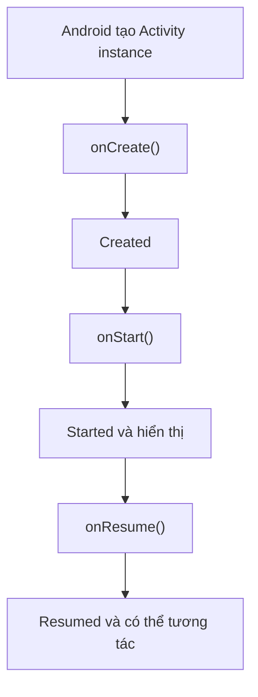
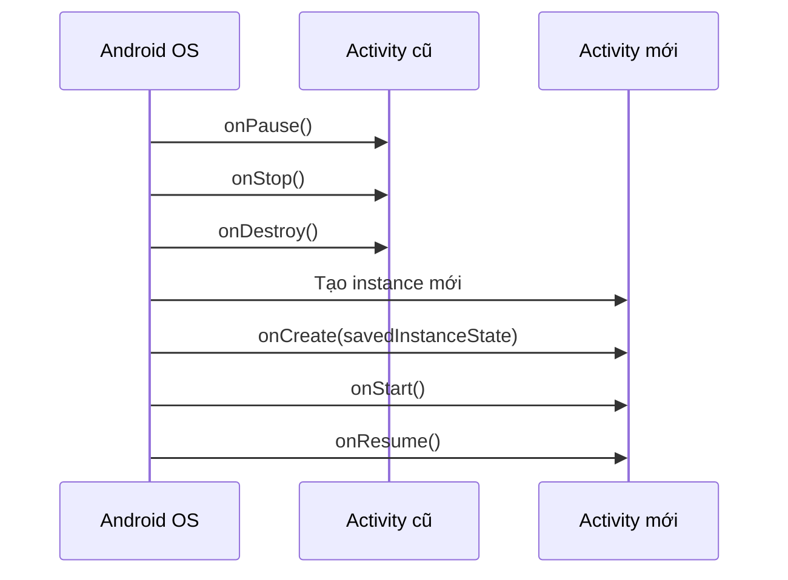
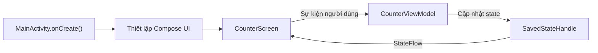

# 003 - `onCreate` trong Android

**Học phần:** 02 - App Components and User Interface
**Module:** Module 03 - App Components
**Nhóm nội dung:** Activity
**Nguồn roadmap:** App Components / Activity
**Loại bài:** Lesson
**Thứ tự trong module:** 003
**Thời lượng gợi ý:** 24 phút

---

## 1. Tóm tắt

`onCreate()` là callback quan trọng đầu tiên trong vòng đời của một `Activity`. Android gọi phương thức này khi hệ thống tạo một **instance mới của Activity**.

Trong `onCreate()`, lập trình viên thường:

* Gọi `super.onCreate(savedInstanceState)`.
* Thiết lập giao diện bằng `setContent()` hoặc `setContentView()`.
* Kết nối giao diện với `ViewModel`.
* Khởi tạo những thành phần cần thiết cho Activity.
* Đọc trạng thái đã lưu từ `savedInstanceState` khi cần.

Điểm quan trọng nhất là:

> `onCreate()` không chỉ chạy một lần trong toàn bộ thời gian ứng dụng tồn tại. Nó chạy một lần cho mỗi **instance của Activity**.

Khi xoay màn hình hoặc khi Activity bị hệ thống tạo lại, một instance mới được sinh ra và `onCreate()` sẽ chạy lại. Tài liệu Android yêu cầu triển khai callback này để thực hiện các thao tác khởi tạo cơ bản trong vòng đời của Activity.

---

## 2. Mục tiêu học tập

Sau bài học, anh có thể:

* Giải thích vai trò của `onCreate()` trong Activity Lifecycle.
* Phân biệt “một lần cho Activity instance” với “một lần cho toàn ứng dụng”.
* Sử dụng đúng tham số `savedInstanceState`.
* Thiết lập giao diện Jetpack Compose trong `onCreate()`.
* Đưa screen state vào `ViewModel` thay vì đặt toàn bộ logic trong Activity.
* Kiểm tra hành vi khi xoay màn hình và Activity được tạo lại.
* Nhận biết các thao tác không nên thực hiện trực tiếp trong `onCreate()`.
* Xây dựng một ví dụ nhỏ có thể đưa vào portfolio.

---

## 3. `onCreate()` là gì?

Cấu trúc cơ bản của một Activity dùng Jetpack Compose:

```kotlin
class MainActivity : ComponentActivity() {

    override fun onCreate(savedInstanceState: Bundle?) {
        super.onCreate(savedInstanceState)

        setContent {
            App()
        }
    }
}
```

Trong ví dụ trên:

1. Android tạo đối tượng `MainActivity`.
2. Android gọi `onCreate()`.
3. `super.onCreate()` hoàn tất phần khởi tạo do lớp cha quản lý.
4. `setContent()` tạo nội dung giao diện Compose.
5. Sau khi `onCreate()` kết thúc, Activity tiếp tục chuyển đến `onStart()` rồi `onResume()`.

Android mô tả Activity chuyển vào trạng thái **Created** khi `onCreate()` được gọi. Sau khi callback hoàn tất, hệ thống thường gọi nhanh `onStart()` và `onResume()` để Activity hiển thị và nhận tương tác.

---

## 4. Vị trí của `onCreate()` trong Activity Lifecycle


*Nguồn ảnh: Android Developers.*

Luồng khởi động thông thường:



Khi người dùng xoay màn hình:



Xoay màn hình là một dạng **configuration change**. Trong trường hợp thông thường, Android hủy Activity hiện tại rồi tạo lại Activity để áp dụng cấu hình mới. Vì vậy, `onCreate()` lại được gọi trên instance mới.

---

## 5. Năm dòng giải thích `onCreate()`

> 1. `onCreate()` được gọi khi Android tạo một instance mới của Activity.
> 2. Đây là nơi thiết lập giao diện và thực hiện khởi tạo cơ bản cho Activity.
> 3. Phải gọi `super.onCreate(savedInstanceState)` để lớp cha hoàn tất quá trình tạo Activity.
> 4. `savedInstanceState` có thể chứa trạng thái tạm thời của Activity trước đó.
> 5. `onCreate()` có thể chạy lại khi xoay màn hình hoặc khi Activity được hệ thống tái tạo.

---

## 6. Tham số `savedInstanceState`

Khai báo đầy đủ:

```kotlin
override fun onCreate(savedInstanceState: Bundle?) {
    super.onCreate(savedInstanceState)
}
```

`savedInstanceState` có kiểu `Bundle?`, nghĩa là nó có thể bằng `null`.

### Trường hợp bằng `null`

Activity chưa có trạng thái trước đó để khôi phục, chẳng hạn khi Activity được tạo lần đầu:

```kotlin
if (savedInstanceState == null) {
    // Activity được tạo mà không có trạng thái instance trước đó.
}
```

### Trường hợp khác `null`

Hệ thống đang tạo lại Activity và đã cung cấp trạng thái được lưu trước đó:

```kotlin
if (savedInstanceState != null) {
    // Có thể đọc trạng thái đã lưu.
}
```

Ví dụ với Views truyền thống:

```kotlin
private var selectedTab: Int = 0

override fun onCreate(savedInstanceState: Bundle?) {
    super.onCreate(savedInstanceState)
    setContentView(R.layout.activity_main)

    selectedTab = savedInstanceState?.getInt(KEY_SELECTED_TAB) ?: 0
}

override fun onSaveInstanceState(outState: Bundle) {
    outState.putInt(KEY_SELECTED_TAB, selectedTab)
    super.onSaveInstanceState(outState)
}

private companion object {
    const val KEY_SELECTED_TAB = "selected_tab"
}
```

Với Jetpack Compose, trạng thái UI nhỏ thường được lưu bằng `rememberSaveable`. Android khuyến nghị lưu những trạng thái cần để khôi phục trải nghiệm đang dang dở, chẳng hạn nội dung ô nhập, vị trí cuộn, lựa chọn hiện tại hoặc ID của nội dung người dùng đang xem.

---

## 7. Nên đặt gì trong `onCreate()`?

| Nên đặt                            | Ví dụ                                 |
| ---------------------------------- | ------------------------------------- |
| Gọi hàm khởi tạo của lớp cha       | `super.onCreate(savedInstanceState)`  |
| Thiết lập giao diện                | `setContent { ... }`                  |
| Thiết lập theme                    | `MaterialTheme { ... }`               |
| Kết nối screen với state holder    | Lấy state từ `ViewModel`              |
| Khởi tạo thành phần thuộc Activity | Một controller hoặc adapter đơn giản  |
| Ghi log phục vụ học lifecycle      | `Log.d(TAG, "onCreate")`              |
| Khôi phục trạng thái instance nhỏ  | Tab được chọn, ID, nội dung đang nhập |

Ví dụ:

```kotlin
private const val TAG = "MainActivity"

class MainActivity : ComponentActivity() {

    override fun onCreate(savedInstanceState: Bundle?) {
        super.onCreate(savedInstanceState)

        Log.d(
            TAG,
            "onCreate: restored=${savedInstanceState != null}"
        )

        setContent {
            AppTheme {
                MainScreen()
            }
        }
    }
}
```

---

## 8. Không nên đặt gì trong `onCreate()`?

### 8.1 Chặn main thread

Không nên thực hiện trực tiếp các tác vụ nặng như:

```kotlin
override fun onCreate(savedInstanceState: Bundle?) {
    super.onCreate(savedInstanceState)

    // Không nên: mô phỏng thao tác nặng trên main thread.
    Thread.sleep(5_000)
}
```

Các tác vụ nặng trong quá trình khởi động có thể làm giao diện xuất hiện chậm hoặc không phản hồi. Android sử dụng TTID — thời gian hiển thị frame đầu tiên — và TTFD — thời gian ứng dụng có thể tương tác đầy đủ — để đánh giá trải nghiệm khởi động.

### 8.2 Gọi network đồng bộ

Không nên:

```kotlin
override fun onCreate(savedInstanceState: Bundle?) {
    super.onCreate(savedInstanceState)

    // Không gọi HTTP đồng bộ tại đây.
    val response = api.getProfileSynchronously()
}
```

Thay vào đó, Activity chỉ nên kết nối UI với `ViewModel`; `ViewModel` gọi repository bằng coroutine.

### 8.3 Đặt toàn bộ business logic trong Activity

Không nên:

```kotlin
override fun onCreate(savedInstanceState: Bundle?) {
    super.onCreate(savedInstanceState)

    // Quá nhiều trách nhiệm:
    // - gọi API
    // - tính toán dữ liệu
    // - đọc database
    // - kiểm tra quyền
    // - xử lý điều hướng
    // - dựng UI
}
```

Activity nên chủ yếu đóng vai trò **điểm kết nối giữa Android lifecycle và giao diện**. `ViewModel` phù hợp hơn để giữ screen state và business logic vì nó có thể giữ state qua các lần Activity được tạo lại do configuration change.

### 8.4 Tự động điều hướng nhiều lần

Đoạn code sau có thể chạy lại khi xoay màn hình:

```kotlin
override fun onCreate(savedInstanceState: Bundle?) {
    super.onCreate(savedInstanceState)

    startActivity(Intent(this, WelcomeActivity::class.java))
}
```

Hậu quả có thể là:

* Màn hình Welcome mở lại.
* Back stack xuất hiện nhiều màn hình trùng nhau.
* Người dùng bị đưa khỏi màn hình đang làm việc.
* UI test hoạt động không ổn định.

Nếu đây chỉ là hành động cho lần tạo đầu tiên, cần kiểm tra:

```kotlin
if (savedInstanceState == null) {
    startActivity(Intent(this, WelcomeActivity::class.java))
}
```

Trong kiến trúc Navigation Compose, nên biểu diễn trạng thái điều hướng rõ ràng thay vì đặt các quyết định phức tạp trực tiếp trong `onCreate()`.

---

## 9. Ví dụ hoàn chỉnh với Compose, ViewModel và SavedStateHandle

Ứng dụng mẫu gồm một bộ đếm. Giá trị được giữ khi xoay màn hình và có thể được khôi phục sau một số trường hợp process recreation do hệ thống.

### 9.1 `CounterViewModel.kt`

```kotlin
package com.example.oncreatedemo

import androidx.lifecycle.SavedStateHandle
import androidx.lifecycle.ViewModel
import kotlinx.coroutines.flow.StateFlow

class CounterViewModel(
    private val savedStateHandle: SavedStateHandle
) : ViewModel() {

    val count: StateFlow<Int> =
        savedStateHandle.getStateFlow(COUNT_KEY, 0)

    fun increment() {
        savedStateHandle[COUNT_KEY] = count.value + 1
    }

    fun reset() {
        savedStateHandle[COUNT_KEY] = 0
    }

    private companion object {
        const val COUNT_KEY = "count"
    }
}
```

### 9.2 `MainActivity.kt`

```kotlin
package com.example.oncreatedemo

import android.os.Bundle
import android.util.Log
import androidx.activity.ComponentActivity
import androidx.activity.compose.setContent
import androidx.activity.viewModels
import androidx.compose.foundation.layout.Arrangement
import androidx.compose.foundation.layout.Column
import androidx.compose.foundation.layout.fillMaxSize
import androidx.compose.foundation.layout.padding
import androidx.compose.material3.Button
import androidx.compose.material3.MaterialTheme
import androidx.compose.material3.Text
import androidx.compose.runtime.Composable
import androidx.compose.runtime.getValue
import androidx.compose.ui.Alignment
import androidx.compose.ui.Modifier
import androidx.compose.ui.unit.dp
import androidx.lifecycle.compose.collectAsStateWithLifecycle

private const val TAG = "MainActivity"

class MainActivity : ComponentActivity() {

    private val viewModel: CounterViewModel by viewModels()

    override fun onCreate(savedInstanceState: Bundle?) {
        super.onCreate(savedInstanceState)

        Log.d(
            TAG,
            "onCreate called, hasSavedState=${savedInstanceState != null}"
        )

        setContent {
            MaterialTheme {
                val count by viewModel.count.collectAsStateWithLifecycle()

                CounterScreen(
                    count = count,
                    onIncrement = viewModel::increment,
                    onReset = viewModel::reset
                )
            }
        }
    }
}

@Composable
private fun CounterScreen(
    count: Int,
    onIncrement: () -> Unit,
    onReset: () -> Unit
) {
    Column(
        modifier = Modifier
            .fillMaxSize()
            .padding(24.dp),
        verticalArrangement = Arrangement.spacedBy(
            space = 16.dp,
            alignment = Alignment.CenterVertically
        ),
        horizontalAlignment = Alignment.CenterHorizontally
    ) {
        Text(
            text = "Số lần nhấn: $count",
            style = MaterialTheme.typography.headlineMedium
        )

        Button(onClick = onIncrement) {
            Text("Tăng")
        }

        Button(onClick = onReset) {
            Text("Đặt lại")
        }
    }
}
```

### 9.3 Phân chia trách nhiệm



Trong kiến trúc này:

* `MainActivity` quản lý điểm vào và lifecycle của màn hình.
* `CounterScreen` chỉ hiển thị state và phát sự kiện.
* `CounterViewModel` quản lý logic bộ đếm.
* `SavedStateHandle` lưu trạng thái nhỏ cần để khôi phục.

`ViewModel` giữ state qua configuration change nhưng bản thân nó không phải cơ chế lưu trữ lâu dài. Khi cần hỗ trợ system-initiated process death, có thể dùng `SavedStateHandle` làm phương án khôi phục tối thiểu. Dữ liệu lớn hoặc quan trọng vẫn phải lưu trong database hoặc tầng dữ liệu.

---

## 10. `remember`, `rememberSaveable`, ViewModel và database

| Cơ chế                   | Recomposition | Xoay màn hình | Process death | Phù hợp với                         |
| ------------------------ | :-----------: | :-----------: | :-----------: | ----------------------------------- |
| Biến cục bộ thông thường |       ❌       |       ❌       |       ❌       | Giá trị tạm trong một lần gọi hàm   |
| `remember`               |       ✅       |       ❌       |       ❌       | State rất ngắn hạn của Composition  |
| `rememberSaveable`       |       ✅       |       ✅       |     Có thể    | State UI nhỏ, có thể ghi vào Bundle |
| `ViewModel`              |       ✅       |       ✅       |       ❌       | Screen state và business logic      |
| `SavedStateHandle`       |       ✅       |       ✅       |     Có thể    | Trạng thái nhỏ để khôi phục screen  |
| Room/DataStore/file      |       ✅       |       ✅       |       ✅       | Dữ liệu lâu dài hoặc dữ liệu lớn    |

### Ví dụ `rememberSaveable`

```kotlin
@Composable
fun NameInput() {
    var name by rememberSaveable {
        mutableStateOf("")
    }

    OutlinedTextField(
        value = name,
        onValueChange = { name = it },
        label = {
            Text("Tên người dùng")
        }
    )
}
```

Không nên đưa danh sách ảnh, response API lớn hoặc object phức tạp vào saved state. Android khuyến nghị saved state chỉ chứa dữ liệu đơn giản, nhẹ và đủ để tái tạo màn hình.

---

## 11. Thực hành quan sát `onCreate()` bằng Logcat

### Bước 1: thêm log

```kotlin
private const val TAG = "LifecycleDemo"

class MainActivity : ComponentActivity() {

    override fun onCreate(savedInstanceState: Bundle?) {
        super.onCreate(savedInstanceState)

        Log.d(TAG, "onCreate")

        setContent {
            Text("Lifecycle Demo")
        }
    }

    override fun onStart() {
        super.onStart()
        Log.d(TAG, "onStart")
    }

    override fun onResume() {
        super.onResume()
        Log.d(TAG, "onResume")
    }

    override fun onPause() {
        Log.d(TAG, "onPause")
        super.onPause()
    }

    override fun onStop() {
        Log.d(TAG, "onStop")
        super.onStop()
    }

    override fun onDestroy() {
        Log.d(TAG, "onDestroy")
        super.onDestroy()
    }
}
```

### Bước 2: chạy ứng dụng

Logcat dự kiến:

```text
D/LifecycleDemo: onCreate
D/LifecycleDemo: onStart
D/LifecycleDemo: onResume
```

### Bước 3: xoay thiết bị

Logcat có thể hiển thị:

```text
D/LifecycleDemo: onPause
D/LifecycleDemo: onStop
D/LifecycleDemo: onDestroy
D/LifecycleDemo: onCreate
D/LifecycleDemo: onStart
D/LifecycleDemo: onResume
```

### Bước 4: lọc Logcat

Có thể tìm bằng:

```text
tag:LifecycleDemo
```


*Nguồn ảnh: Android Developers.*

Android Developers cũng sử dụng cách ghi log rồi xoay thiết bị để minh họa thứ tự các lifecycle callback.

---

## 12. Một lỗi phổ biến của lập trình viên mới

### Lỗi: cho rằng `onCreate()` chỉ chạy một lần

```kotlin
class MainActivity : ComponentActivity() {

    override fun onCreate(savedInstanceState: Bundle?) {
        super.onCreate(savedInstanceState)

        loadUserFromNetwork()
    }
}
```

Khi người dùng xoay màn hình:

1. Activity cũ bị hủy.
2. Activity mới được tạo.
3. `onCreate()` chạy lại.
4. API bị gọi lại.
5. Có thể xuất hiện nhiều request hoặc loading nhấp nháy.

### Cách tốt hơn

```kotlin
class ProfileViewModel(
    private val repository: ProfileRepository
) : ViewModel() {

    val profile = repository.observeProfile()
}
```

```kotlin
class MainActivity : ComponentActivity() {

    private val viewModel: ProfileViewModel by viewModels()

    override fun onCreate(savedInstanceState: Bundle?) {
        super.onCreate(savedInstanceState)

        setContent {
            val profile by viewModel.profile
                .collectAsStateWithLifecycle(initialValue = null)

            ProfileScreen(profile = profile)
        }
    }
}
```

Activity chỉ kết nối UI với state. Repository và `ViewModel` quản lý dữ liệu, cache và business logic.

---

## 13. Ảnh hưởng đến UX, độ ổn định và maintainability

### UX

Sử dụng đúng `onCreate()` giúp:

* Giao diện xuất hiện nhanh hơn.
* Không gọi lại network không cần thiết.
* Không làm mất nội dung người dùng đang nhập.
* Không điều hướng lặp khi xoay màn hình.
* Tránh loading hoặc màn hình trắng kéo dài.

### Độ ổn định

Quản lý lifecycle đúng giúp tránh:

* Crash do truy cập view chưa được khởi tạo.
* Trạng thái null sau Activity recreation.
* Observer hoặc callback được đăng ký nhiều lần.
* Request trùng lặp.
* Back stack sai.
* Memory leak do giữ tham chiếu Activity quá lâu.

### Maintainability

Khi Activity chỉ làm nhiệm vụ điều phối:

```text
Activity
 ├── nhận lifecycle callback
 ├── thiết lập UI
 ├── thu thập UI state
 └── chuyển user event đến ViewModel
```

Business logic được tách riêng:

```text
ViewModel
 ├── xử lý user event
 ├── tạo screen state
 ├── gọi repository
 └── xử lý lỗi/loading
```

Việc tách state holder khỏi UI làm code dễ đọc, dễ kiểm thử và dễ thay đổi mà không phải chỉnh sửa toàn bộ giao diện.

---

## 14. Kiểm thử Activity recreation

### 14.1 Kiểm thử thủ công

* [ ] Mở ứng dụng.
* [ ] Tăng bộ đếm lên `3`.
* [ ] Xoay thiết bị sang landscape.
* [ ] Kiểm tra giá trị vẫn là `3`.
* [ ] Xoay trở lại portrait.
* [ ] Kiểm tra giá trị không bị reset.
* [ ] Quan sát Logcat và xác nhận `onCreate()` đã chạy lại.
* [ ] Đưa ứng dụng xuống background rồi mở lại.
* [ ] Kiểm tra không có request hoặc navigation bị lặp.

### 14.2 Compose UI test

```kotlin
@RunWith(AndroidJUnit4::class)
class MainActivityTest {

    @get:Rule
    val composeRule =
        createAndroidComposeRule<MainActivity>()

    @Test
    fun counter_survivesActivityRecreation() {
        composeRule
            .onNodeWithText("Tăng")
            .performClick()

        composeRule
            .onNodeWithText("Số lần nhấn: 1")
            .assertExists()

        composeRule.activityRule.scenario.recreate()

        composeRule
            .onNodeWithText("Số lần nhấn: 1")
            .assertExists()
    }
}
```

Test này bảo vệ một yêu cầu UX quan trọng:

> Activity được tạo lại nhưng người dùng không bị mất tiến trình trên màn hình.

---

## 15. Checklist review `onCreate()`

Trước khi merge code, kiểm tra:

* [ ] `super.onCreate(savedInstanceState)` được gọi.
* [ ] `setContent()` hoặc `setContentView()` được gọi đúng một lần.
* [ ] Không chặn main thread.
* [ ] Không đọc database hoặc gọi network đồng bộ.
* [ ] Không đặt business logic lớn trong Activity.
* [ ] Không tạo nhiều observer trùng nhau.
* [ ] Không tự động điều hướng lại sau mỗi configuration change.
* [ ] State cần giữ qua xoay màn hình đã được xử lý.
* [ ] State UI nhỏ dùng `rememberSaveable` khi phù hợp.
* [ ] Screen state và business logic dùng `ViewModel`.
* [ ] State cần khôi phục sau process death dùng `SavedStateHandle`.
* [ ] Dữ liệu lâu dài được lưu trong database, DataStore hoặc file.
* [ ] Đã kiểm tra bằng Logcat.
* [ ] Đã thử xoay màn hình.
* [ ] Đã thử background và foreground.
* [ ] Không ghi token, mật khẩu hoặc thông tin nhạy cảm vào Logcat.

---

## 16. Bài thực hành 24 phút

### Phần 1 — Đọc và ghi chú: 4 phút

Viết lại định nghĩa:

```text
onCreate() là callback được Android gọi khi tạo một Activity instance.
Nó dùng để khởi tạo Activity và thiết lập giao diện.
Nó có thể chạy lại khi Activity được tái tạo.
```

### Phần 2 — Thêm Logcat: 5 phút

Ghi log cho:

```text
onCreate
onStart
onResume
onPause
onStop
onDestroy
```

### Phần 3 — Kiểm tra xoay màn hình: 4 phút

1. Chạy ứng dụng.
2. Quan sát lifecycle ban đầu.
3. Xoay màn hình.
4. So sánh callback trước và sau khi xoay.

### Phần 4 — Tạo bộ đếm: 7 phút

* Thêm một nút tăng.
* Đặt state vào `ViewModel`.
* Xác nhận giá trị không bị mất khi xoay.

### Phần 5 — Ghi README: 4 phút

Ghi lại:

* `onCreate()` là gì.
* Khi nào nó chạy lại.
* State được giữ ở đâu.
* Cách anh kiểm thử configuration change.

---

## 17. Bài tập

### Bài 1 — Giải thích

Trả lời bằng lời của anh:

1. Vì sao `onCreate()` có thể chạy nhiều lần?
2. `savedInstanceState == null` thường biểu thị điều gì?
3. Vì sao không nên gọi network đồng bộ trong `onCreate()`?
4. `ViewModel` giải quyết vấn đề nào?
5. `ViewModel` có thay thế database không?

### Bài 2 — Thực hành code

Tạo màn hình form gồm:

```text
Tên:
Email:
Chủ đề yêu thích:
```

Yêu cầu:

* Nội dung đang nhập không bị mất khi xoay màn hình.
* Nút gửi chỉ bật khi dữ liệu hợp lệ.
* Logic kiểm tra dữ liệu đặt trong `ViewModel`.
* `onCreate()` chỉ dùng để thiết lập UI.
* Có log để chứng minh Activity được tạo lại.

### Bài 3 — Phân tích lỗi

Cho đoạn code:

```kotlin
class MainActivity : ComponentActivity() {

    override fun onCreate(savedInstanceState: Bundle?) {
        super.onCreate(savedInstanceState)

        val products = productApi.loadProducts()

        setContent {
            ProductList(products)
        }
    }
}
```

Hãy xác định:

* Tác vụ nào có thể chặn main thread?
* Điều gì xảy ra khi xoay màn hình?
* Request có thể bị gọi lại không?
* Nên chuyển logic sang lớp nào?
* UI cần biểu diễn loading và error như thế nào?

---

## 18. Artifact đưa vào portfolio

Tên project gợi ý:

```text
android-activity-lifecycle-demo
```

Cấu trúc:

```text
android-activity-lifecycle-demo/
├── app/
│   └── src/
│       ├── main/
│       │   └── java/.../
│       │       ├── MainActivity.kt
│       │       ├── CounterViewModel.kt
│       │       └── CounterScreen.kt
│       └── androidTest/
│           └── MainActivityTest.kt
├── screenshots/
│   ├── portrait.png
│   ├── landscape.png
│   └── logcat-lifecycle.png
└── README.md
```

### README mẫu

```markdown
# Activity onCreate Lifecycle Demo

Ứng dụng minh họa cách Android gọi `onCreate()` khi tạo Activity.

## Nội dung

- Ghi log các Activity lifecycle callback.
- Quan sát Activity recreation khi xoay màn hình.
- Giữ screen state bằng ViewModel và SavedStateHandle.
- Kiểm thử state sau `ActivityScenario.recreate()`.

## Kiến trúc

MainActivity → CounterScreen → CounterViewModel → SavedStateHandle

## Kết quả

Giá trị bộ đếm được giữ khi thay đổi hướng màn hình.
Activity được tạo lại nhưng screen state không bị reset.
```

---

## 19. Ghi chú khi đưa vào production

Khi review một Activity, hãy đặt các câu hỏi sau:

1. `onCreate()` có đang làm quá nhiều việc không?
2. Có tác vụ nào chặn main thread không?
3. Network request có bị lặp khi Activity được tạo lại không?
4. Người dùng có mất form, lựa chọn hoặc vị trí đang xem không?
5. State thuộc UI, ViewModel hay tầng lưu trữ lâu dài?
6. Process death có cần được hỗ trợ không?
7. Loading, empty state và error state đã được hiển thị chưa?
8. Điều hướng có bị chạy lại sau configuration change không?
9. Có test bảo vệ hành vi khi recreate Activity không?
10. Startup có cần đo bằng Macrobenchmark hoặc Perfetto không?

---

## 20. Checklist hoàn thành bài học

* [ ] Có định nghĩa ngắn gọn về `onCreate()`.
* [ ] Hiểu `onCreate()` chạy một lần cho mỗi Activity instance.
* [ ] Biết vị trí của `onCreate()` trong Activity Lifecycle.
* [ ] Biết ý nghĩa của `savedInstanceState`.
* [ ] Có ví dụ Jetpack Compose.
* [ ] Có ví dụ dùng `ViewModel`.
* [ ] Có ví dụ dùng `SavedStateHandle`.
* [ ] Có sơ đồ lifecycle.
* [ ] Đã ghi log bằng Logcat.
* [ ] Đã xoay thiết bị để kiểm tra Activity recreation.
* [ ] Biết một lỗi phổ biến của lập trình viên mới.
* [ ] Có test hoặc checklist kiểm thử.
* [ ] Có README và screenshot để đưa vào portfolio.

---

## 21. Kết luận

`onCreate()` là điểm khởi tạo của một **Activity instance**, không phải là nơi chứa toàn bộ logic của ứng dụng.

Một cách tổ chức tốt là:

```text
onCreate()
    → thiết lập giao diện
    → kết nối UI với state
    → chuyển logic cho ViewModel
    → lưu dữ liệu lâu dài ở repository/database
```

Hãy luôn giả định rằng Activity có thể bị hủy và tạo lại. Khi code vẫn hoạt động đúng sau khi xoay màn hình, chuyển background hoặc process recreation, ứng dụng sẽ ổn định và mang lại trải nghiệm tốt hơn.

---

## 22. Tài liệu tham khảo

* [The activity lifecycle — Android Developers](https://developer.android.com/guide/components/activities/activity-lifecycle)
* [Stages of the Activity lifecycle — Android Developers](https://developer.android.com/codelabs/basic-android-kotlin-compose-activity-lifecycle)
* [ViewModel overview — Android Developers](https://developer.android.com/topic/libraries/architecture/viewmodel)
* [Save UI state in Compose — Android Developers](https://developer.android.com/develop/ui/compose/state-saving)
* [Saved State module for ViewModel — Android Developers](https://developer.android.com/topic/libraries/architecture/viewmodel/viewmodel-savedstate)
* [App startup time — Android Developers](https://developer.android.com/topic/performance/vitals/launch-time)

---

# Bài luyện tập

## Mục tiêu


## Đề bài


## Yêu cầu hoàn thành

- [ ] 
- [ ] 
- [ ] 

## Kết quả / lời giải


## Ghi chú
